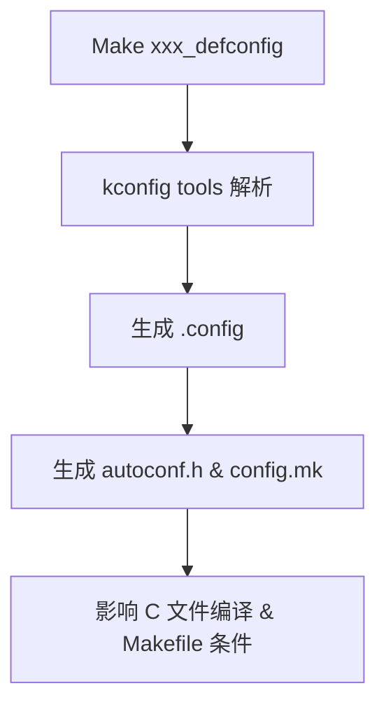

该文档信息来自于ChatGPT。主要是用于基本语法的讲解。如果想要知道环境的问题，可以参考我下面给出的视频链接。

想要直接边测试边学习，可以先看第6部分，如果是想要先理解语法再测试，就可以从第1部分开始。

**参考网址和视频链接：**

* [Kconfig说明视频](https://www.bilibili.com/video/BV1Cc411x7PC?vd_source=b387713a15d6517575ab4761525174e7)。

* [menuconfig 和、Kconfig 介绍及例子解析！](https://zhuanlan.zhihu.com/p/517418914)。
* [探索 Linux 内核：Kconfig/kbuild 的秘密](https://zhuanlan.zhihu.com/p/78254770)。


<iframe 
  src="https://player.bilibili.com/player.html?bvid=BV1Cc411x7PC&autoplay=0" 
  frameborder="0" 
  allowfullscreen 
  style="width: 100%; height: 60vh;">
</iframe>


# 第 1 部分：基本结构与类型定义

## `config` 定义配置项

```kconfig
config MY_FEATURE
    bool "Enable my feature"
    default y
```

| 语法元素  | 说明                              |
| --------- | --------------------------------- |
| `config`  | 定义一个配置项（变量名）          |
| `bool`    | 配置项为布尔类型（`y/n`）         |
| `"..."`   | 显示在 menuconfig 菜单中的描述    |
| `default` | 默认值，可以是 `y`、`n`、其他变量 |


## 配置项类型（Kconfig 支持的类型）

| 类型       | 描述                                      | 示例值          |
| ---------- | ----------------------------------------- | --------------- |
| `bool`     | 布尔型开关，显示为 `[*]` 或 `[ ]`         | `y` / `n`       |
| `tristate` | 三态值，`y`、`n`、`m`（模块，仅限 Linux） | `y` / `n` / `m` |
| `int`      | 整数                                      | `512`           |
| `hex`      | 十六进制数值                              | `0x1A2B`        |
| `string`   | 字符串                                    | `"eth0"`        |

**注意**：U-Boot 中基本不使用 `m` 模块状态（通常都是 `bool` 和 `string`）


## `prompt`（显示名称）

```kconfig
config MY_FEATURE
    bool
    prompt "Enable my feature"
```

`prompt` 是 `"Enable my feature"` 的另一种写法，但推荐使用 inline `"..."` 方式更简洁。


## `default`（默认值）

```kconfig
config MY_DEBUG
    bool "Enable debug output"
    default y
```

也可基于其他条件：

```kconfig
default y if DEBUG_ENABLED
```


## `depends on`（依赖关系）

```kconfig
config MY_NET_CMD
    bool "Enable net command"
    depends on NET
```

> 只有当 `CONFIG_NET=y` 时，`MY_NET_CMD` 才会在 menuconfig 中显示。

也支持组合：

```kconfig
depends on USB && NET
```


## help （模块描述）

```kconfig
config MY_DEVICE
    bool "Support my special device"
    default n
    help
      This option enables support for the my device.
      It needs I2C and SPI to work.
```


## 示例一览

```kconfig
config MY_DEVICE
    bool "Support my special device"
    depends on I2C && SPI
    default n
    help
      This option enables support for the my device.
      It needs I2C and SPI to work.
```


# 第 2 部分：依赖选择、菜单与选项组

## `select` —— 强制打开依赖项

```kconfig
config MY_USB_DRIVER
    bool "Enable my USB driver"
    select USB_SUPPORT
```

| 说明                                                         |
| ------------------------------------------------------------ |
| 如果你启用了 `MY_USB_DRIVER`，那么会自动启用 `USB_SUPPORT`，**即使 USB_SUPPORT 没出现在菜单中。** |
| 这是“强制依赖”：主动选择 A 会强制打开 B。                    |

常用于 **低层驱动依赖内核通用模块** 的场景。


## `imply` —— 弱依赖推荐

```kconfig
config MY_DRIVER
    bool "Enable my driver"
    imply DEBUG_PRINT
```

| 说明                                                         |
| ------------------------------------------------------------ |
| 这只是“推荐启用” `DEBUG_PRINT`，**不会强制打开**。如果 `DEBUG_PRINT` 是 `bool` 类型，它仍然默认是 `n`，但会在 menuconfig 中显示为“推荐选中”。 |

用于希望“默认带上调试功能”但不强制用户使用的场景。


## `menu` 与 `endmenu` —— 创建逻辑分组菜单

```kconfig
menu "USB Support"

config USB_SUPPORT
    bool "Enable USB support"

config USB_KEYBOARD
    bool "Enable USB Keyboard"
    depends on USB_SUPPORT

endmenu
```

* `menu "xxx"` 创建一个名为“xxx”的子菜单。
* 所有包含在 `menu` ~ `endmenu` 之间的配置项会在此分组下出现。
* 可以嵌套使用，形成树形结构。


## `choice` 与 `endchoice` —— 多选一项配置

```kconfig
choice
    prompt "Boot Device Selection"

config BOOT_FROM_EMMC
    bool "Boot from eMMC"

config BOOT_FROM_NAND
    bool "Boot from NAND"

config BOOT_FROM_SD
    bool "Boot from SD card"

endchoice
```

* `choice` 区块内只能选择一个配置项（互斥）
* `prompt` 是菜单显示标题
* 每个 `config` 是候选项
* 通常与 `default` 配合使用：

```kconfig
choice
    prompt "Boot mode"

config BOOT_UART
    bool "UART boot"

config BOOT_SPI
    bool "SPI boot"

config BOOT_USB
    bool "USB boot"

endchoice

config BOOT_UART
    default y
```


## 本批小结对比表：

| 关键词   | 功能描述                     | 用法示例           |
| -------- | ---------------------------- | ------------------ |
| `select` | 选中 A 时强制打开 B          | `select USB`       |
| `imply`  | 选中 A 时推荐启用 B，不强制  | `imply DEBUG`      |
| `menu`   | 创建菜单结构，逻辑组织配置项 | `menu "Drivers"`   |
| `choice` | 限制多选一的配置模式         | 多个 boot 模式选项 |


# 第 3 部分：模块引入与条件控制语法

## `source` —— 引入其他 Kconfig 文件

```kconfig
source "drivers/usb/Kconfig"
```

| 用途                                              | 示例                            |
| ------------------------------------------------- | ------------------------------- |
| 将其他目录下的 `Kconfig` 文件作为当前的子模块引入 | 将 USB 驱动配置嵌入到主菜单结构 |


**常用于组织大型项目**，如：

```kconfig
# 顶层 Kconfig
source "arch/arm/Kconfig"
source "board/freescale/Kconfig"
source "drivers/Kconfig"
```

和 `Makefile` 中的 `obj-y += xxx.o` 类似，用于模块结构化管理。


## `if ... endif` —— 条件包含一组配置项

```kconfig
if USB_SUPPORT

config USB_KEYBOARD
    bool "Enable USB Keyboard"

config USB_STORAGE
    bool "Enable USB Storage"

endif
```

| 功能                                                         | 说明 |
| ------------------------------------------------------------ | ---- |
| 类似于 C 语言中的 `#if ... #endif` 条件编译                  |      |
| 只有当 `USB_SUPPORT=y` 时，这组选项才会被“解析”并出现在菜单中 |      |


## `visible if` —— 控制菜单是否可见（而非有效）

```kconfig
menu "Advanced USB options"
    visible if USB_SUPPORT

config USB_DEBUG
    bool "Enable USB Debugging"

endmenu
```

| `visible if` | 仅影响菜单是否在 menuconfig 中显示，不影响是否参与构建 |
| ------------ | ------------------------------------------------------ |
| `depends on` | 影响配置项是否“能被选中”，但配置项始终可见             |


## `comment` —— 添加注释说明块

```kconfig
comment "USB Debugging options"
```

用于在 menuconfig 中展示说明文本，不是配置项，仅增强可读性。


## 示例：条件引入与可视化控制组合

```kconfig
menu "Networking"
    depends on NET_SUPPORT

source "drivers/net/Kconfig"

endmenu
```

→ 如果用户未启用 `NET_SUPPORT`，整个网络驱动配置菜单将不会出现在 menuconfig 中。


# 第 4 部分：高级配置技巧与布尔表达式

## `menuconfig` vs `config`

```kconfig
menuconfig USB_SUPPORT
    bool "Enable USB support"
```

* `menuconfig` 是 `config` 的扩展，它既定义了选项，也定义了一个菜单分组
* 如果启用此项，之后嵌套的配置才可见（类似展开/折叠菜单）


效果对比如下：

| 类型         | 显示行为                | 是否可展开子菜单 |
| ------------ | ----------------------- | ---------------- |
| `config`     | 单独一行，无法展开      | ❌                |
| `menuconfig` | 可选项 + 可展开子项菜单 | ✅                |


## 逻辑表达式依赖

```kconfig
config USB_KEYBOARD
    bool "Enable USB Keyboard"
    depends on USB_SUPPORT && INPUT_SUPPORT
```

支持的操作符：

| 表达式      | 含义         |
| ----------- | ------------ |
| `&&`        | 且           |
| `           |              |
| `!CONFIG_X` | 非（未启用） |
| 括号 `( )`  | 控制优先级   |

⚠ 注意：不能直接使用 `CONFIG_XXX`，只能用 `XXX`


**示例：**

```kconfig
depends on USB && (INPUT || HID)
```


## 隐藏配置项

```kconfig
config INTERNAL_DEBUG
    bool
    default y
    # 没有 prompt，不会出现在 menuconfig 中
```

* 没有 `prompt` 的配置项不会被用户界面显示
* 适用于内建强制启用项、平台限制项等
* 可配合 `select` 强制启用


## 配置项继承默认值

```kconfig
config CPU_TYPE
    string
    default "armv8" if ARCH_ARM64
```

* 条件性 default 支持布尔表达式组合


## 高级技巧：复用已有值作为 default

```kconfig
config DEBUG_UART
    bool "Enable debug UART"

config DEBUG_UART_PORT
    int "Debug UART port number"
    depends on DEBUG_UART
    default 1
```

或者：

```kconfig
	default CONFIG_SOME_OTHER_VALUE
```

不过实际项目中不推荐过度依赖 default 链式继承，避免调试混乱。


## 本批语法总结

| 技术点              | 示例语法                      |
| ------------------- | ----------------------------- |
| `menuconfig`        | 创建可展开的配置项菜单        |
| 布尔表达式          | `depends on A && (B           |
| 隐藏项              | 没有 `prompt` 的配置项        |
| 条件默认值          | `default "x" if A`            |
| 动态 default 复用值 | `default CONFIG_OTHER_OPTION` |


# 第 5 部分：`.config` 生成机制与 Kconfig 编译链

## `.config` 是怎么生成的？



## defconfig：预配置模板

文件示例（如 `configs/rk3566_defconfig`）：

```kconfig
CONFIG_ARM=y
CONFIG_SYS_TEXT_BASE=0x00200000
CONFIG_DEBUG_UART=y
CONFIG_DEBUG_UART_BASE=0xFF1A0000
```

命令：

```shell
make rk3566_defconfig
```

功能：

- 用于快速加载一组已有配置
- 构建 `.config` 前的预设配置集
- 实际加载后由 `scripts/kconfig/conf` 程序合并生成 `.config`


`.config` 是最终配置文件

示例 `.config`：

```makefile
CONFIG_ARM=y
CONFIG_DEBUG_UART=y
CONFIG_DEBUG_UART_BASE=0xFF1A0000
```

功能：

- 是 `menuconfig` / `defconfig` 的合并结果
- 所有 `Kconfig` 控制项的最终开关值保存在这里
- 会被后续工具生成 C 宏和 Makefile 条件


## `.config` → 生成 `include/generated/autoconf.h`

```c
/* include/generated/autoconf.h */
#define CONFIG_ARM 1
#define CONFIG_DEBUG_UART 1
#define CONFIG_DEBUG_UART_BASE 0xFF1A0000
```

* 自动由 Makefile + `scripts/kconfig/conf` 工具生成
* 被全局包含在 `.c` 文件中，使用 `#ifdef CONFIG_XXX` 控制功能


## `.config` → 生成 `include/config/auto.conf` (`config.mk`)

```makefile
CONFIG_ARM=y
CONFIG_DEBUG_UART=y
```

* Makefile 可使用 `$(CONFIG_DEBUG_UART)` 进行条件判断
* 控制编译对象的链接与目标生成


## C 文件中如何使用 `CONFIG_XXX`

```c
#ifdef CONFIG_DEBUG_UART
uart_init(CONFIG_DEBUG_UART_BASE);
#endif
```


## Makefile 中如何使用 `CONFIG_XXX`

```makefile
obj-$(CONFIG_DEBUG_UART) += debug_uart.o
```


## 小结：从 Kconfig 到编译控制的完整链条

| 步骤 | 文件                  | 说明                 |
| ---- | --------------------- | -------------------- |
| 1    | `Kconfig`             | 定义功能开关项结构   |
| 2    | `defconfig`           | 预设方案             |
| 3    | `.config`             | 用户定制后的配置总集 |
| 4    | `autoconf.h`          | 给 C 文件编译用      |
| 5    | `auto.conf/config.mk` | 给 Makefile 用       |


# 第 6 部分：测试语法的环境搭建

kconfig的语法分析工具是直接在内核的结构中，大部分实现来源于根目录下的 `scripts/kconfig/` 但是如果直接把这部分复制出来时没法直接使用 `make menuconfig` 进行可视化裁剪工作，我们要测试这些语法值需要在根目录下的kconfig下创建一个新的文件目录。如何将自定义的Kconfig文件融入到 `make menuconfig` ，参考视频：[Kconfig测试环境搭建](https://www.bilibili.com/video/BV1Cc411x7PC?vd_source=b387713a15d6517575ab4761525174e7)。

<iframe 
  src="https://player.bilibili.com/player.html?bvid=BV1Cc411x7PC&autoplay=0" 
  frameborder="0" 
  allowfullscreen 
  style="width: 100%; height: 60vh;">
</iframe>

我在这里就不再赘述如何测试语法了，毕竟跟着上面的视频链接，基本上都能够搭建出来。我也没有在此处给出我的语法示例截图。因为这部分语法属于基本规则，类似于网页标签制作，非常简单。

我需要在此处提醒读者，这部分要么多练练，要么多看看。这些规则不熟悉也不要紧，必要的时候问问ai也是不错的选择。
