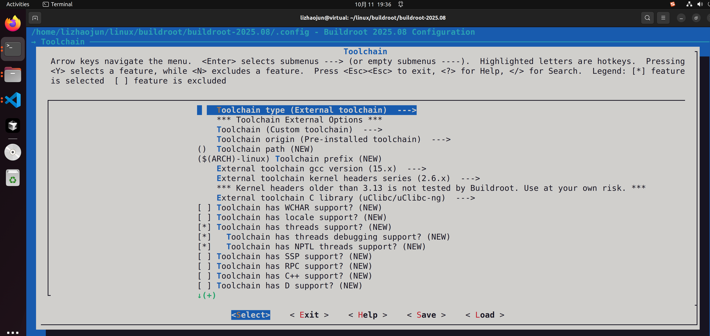
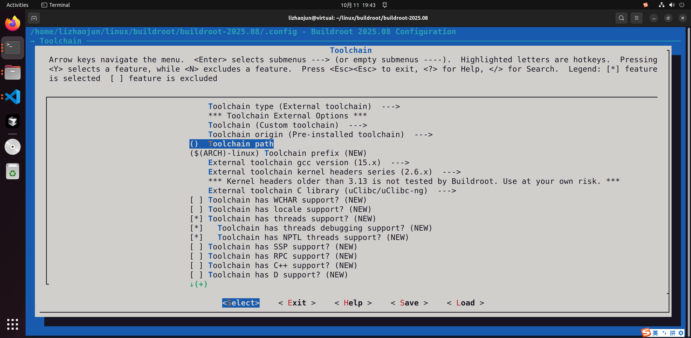
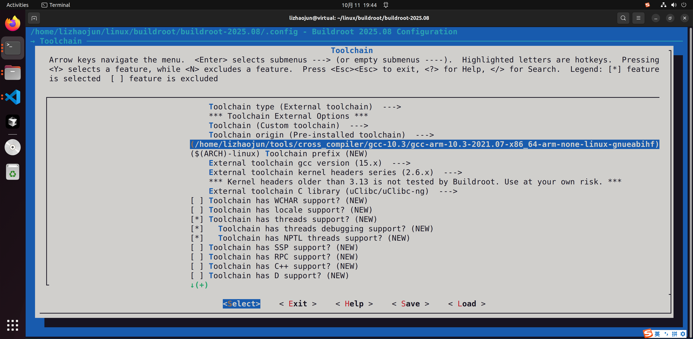
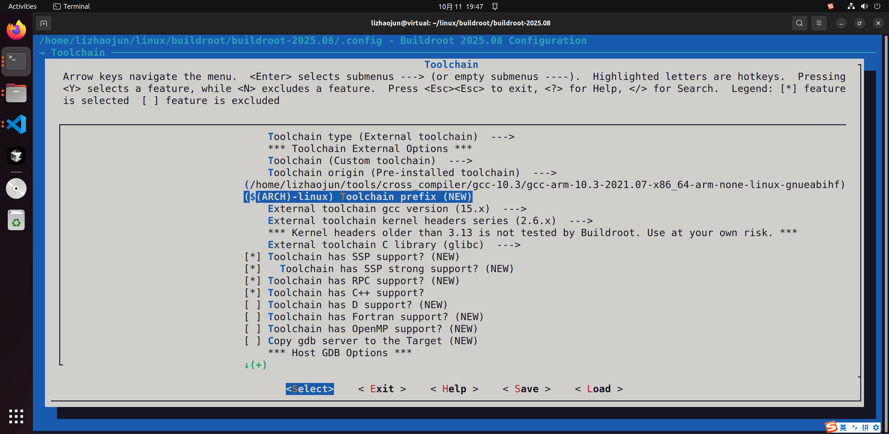
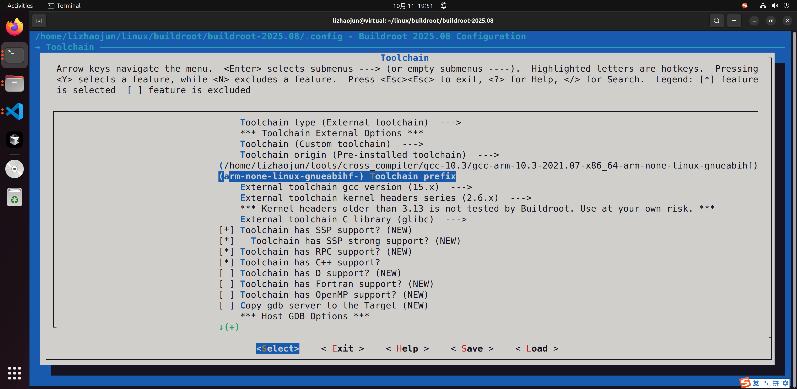
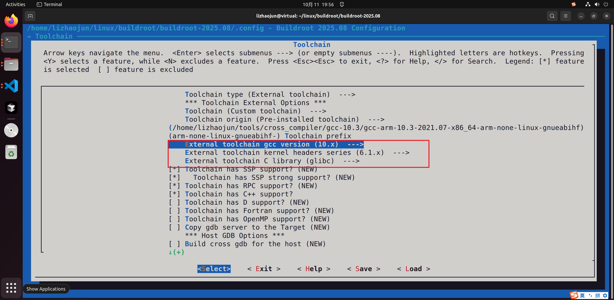

# 3.1 引言

------

## 工具链的核心作用

在嵌入式 Linux 系统中，**交叉编译工具链**是构建所有软件的起点：

- 它提供了面向目标架构的 **编译器 (gcc/g++)**；
- 它包含了与目标内核和用户空间匹配的 **C 库 (glibc/musl/uClibc-ng)**；
- 它携带必要的 **头文件** 与 **运行时库**。

没有工具链，U-Boot、内核、BusyBox、应用程序都无法为目标设备编译。

------

## 内部工具链与外部工具链

在 Buildroot 中，工具链有两种获取方式：

1. **内部工具链 (internal toolchain)**
   - 完全由 Buildroot 从零开始构建：
     - 阶段 1：binutils
     - 阶段 2：bootstrap gcc
     - 阶段 3：C 库与内核头文件
     - 阶段 4：final gcc
     - 阶段 5–7：sysroot、安装与使用
   - 特点：可裁剪、可定制，版本完全由用户选择。
   - 缺点：编译时间长，对宿主机算力要求高。
2. **外部工具链 (external toolchain)**
   - 工具链已经由其他团队或厂商编译好，用户只需下载并配置路径。
   - Buildroot 不再重复构建 gcc/glibc，而是直接复用现成成果。
   - 特点：省时省力、快速上手。
   - 缺点：灵活性差，升级/裁剪依赖第三方。

------

## 为什么需要外部工具链？

在实际工程中，很多项目更倾向于使用外部工具链，原因包括：

- **节省时间**
   内部工具链从零编译 gcc/glibc，往往需要数十分钟甚至数小时。使用外部工具链，可以几乎瞬间切换到“可用工具链”状态。
- **稳定性与验证**
   芯片厂商（如 NXP、Rockchip、Allwinner）通常会提供官方工具链，并且经过硬件与 SDK 测试。这意味着用户可以直接使用厂商推荐的版本，避免兼容性踩坑。
- **算力受限场景**
   如果开发者只是在虚拟机、低性能笔记本上工作，编译内部工具链的代价过高，此时外部工具链就是最佳选择。
- **标准化需求**
   在团队开发或 CI/CD 流水线中，使用同一份外部工具链，可以保证开发环境的一致性。

------

## 小结

- 工具链是嵌入式系统构建的起点。
- Buildroot 支持两种方式：内部工具链（从零构建）与外部工具链（直接复用）。
- 外部工具链的引入主要解决 **时间成本、兼容性验证和环境一致性** 三个痛点。

因此，在进入外部工具链的详细讲解之前，必须明确：**内部工具链强调可控与灵活，外部工具链强调效率与稳定**。


------

# 3.2 外部工具链的来源

------

## 引言

外部工具链并不是 Buildroot 独有的概念，而是整个嵌入式开发领域的通用实践。许多厂商和社区都会提前为特定架构、特定 C 库准备好工具链，以便开发者可以直接使用。

在 Buildroot 中，你只需在配置菜单里选择 **“External toolchain”**，然后告诉 Buildroot 工具链在哪里、如何调用即可。工具链的来源通常有以下三类。

------

## 1. 芯片厂商提供的工具链

### 特点

- 这是最常见的外部工具链来源。
- SoC 厂商（如 NXP、Rockchip、Allwinner、ST、TI）通常会在 SDK 中自带工具链。
- 这些工具链与特定的内核、Bootloader 已经过验证，确保与芯片特性兼容。

### 优势

- 稳定可靠，保证和厂商提供的参考 BSP 一致。
- 芯片手册和开发板说明文档里，通常会明确推荐使用的版本。

### 缺点

- 通常较旧，不一定跟进最新的 gcc/glibc。
- 灵活性差，往往无法裁剪或升级，只能按厂商发布的版本使用。

------

## 2. 第三方社区与发行版

### 典型来源

- **Linaro**：长期维护 ARM 架构的交叉编译器。
- **Sourcery CodeBench**（原 Mentor Graphics，现已较少使用）。
- **OpenEmbedded/Yocto**：虽然本身是一个构建系统，但也可以单独输出交叉工具链。

### 优势

- 更新较快，支持新架构和新标准。
- 社区活跃，遇到问题更容易找到资料或补丁。

### 缺点

- 不一定和你的目标芯片 BSP 匹配，可能缺少某些厂商特有补丁。
- 版本跨度较大时，可能导致兼容性风险。

------

## 3. Buildroot 官方预编译工具链

### 特点

- Buildroot 官方维护了一套 **预编译工具链**，可以直接从 [toolchains.buildroot.org](https://toolchains.buildroot.org/) 下载。
- 这些工具链覆盖 glibc、musl、uClibc-ng 三大 C 库，支持多种架构（ARM、AArch64、MIPS、PowerPC、RISC-V 等）。

### 优势

- 与 Buildroot 内部机制无缝集成。
- 保证与 Buildroot 的 autobuild 测试矩阵兼容。
- 提供多种配置，用户可以直接选用，无需自行编译。

### 缺点

- 相比厂商工具链，可能缺乏某些硬件优化。
- 对于长期维护的商用项目，官方预编译工具链的生命周期可能不足以覆盖全部需求。

------

## 来源对比表

| 来源               | 维护者                      | 优势                            | 缺点                       | 适用场景                          |
| ------------------ | --------------------------- | ------------------------------- | -------------------------- | --------------------------------- |
| **芯片厂商 SDK**   | 芯片厂商 (NXP、Rockchip 等) | 与 BSP/驱动强兼容；稳定性高     | 版本偏旧；缺乏灵活性       | 首选商用项目；需要厂商支持的环境  |
| **社区/发行版**    | Linaro、Yocto、Sourcery 等  | 更新快；支持新架构；社区活跃    | 与 BSP 匹配度不一定高      | 前沿开发；需要最新 gcc/glibc      |
| **Buildroot 官方** | Buildroot 社区              | 与 Buildroot 高度兼容；快速上手 | 缺少芯片优化；生命周期有限 | 学习/实验环境；Buildroot 快速构建 |

------

## 小结

外部工具链的来源主要有三种：

1. **芯片厂商**：稳定可靠，但版本较旧。
2. **社区与发行版**：灵活更新，但不一定和 BSP 紧密匹配。
3. **Buildroot 官方**：高度兼容，但缺少特定优化。

在实际工程中：

- 如果项目依赖厂商 BSP → **优先使用厂商工具链**。
- 如果需要最新功能 → **考虑 Linaro 或 Yocto 输出的工具链**。
- 如果是学习和快速实验 → **Buildroot 官方工具链最合适**。


------

# 3.3 外部工具链的选择标准

------

## 引言

选择外部工具链并不是随意的事情。即便是厂商官方提供的工具链，也需要确认它是否真正符合目标项目的需求。否则，可能会出现 **编译能通过，但运行时崩溃** 的情况。

因此，在 Buildroot 中选择外部工具链时，需要从以下几个方面进行评估。

------

## 1. 架构匹配

- 外部工具链必须针对目标 CPU 架构构建。
- 常见架构示例：
  - ARMv7（Cortex-A7、A9 等） → `arm-linux-gnueabihf-`
  - ARMv8-A（Cortex-A53、A72 等） → `aarch64-linux-gnu-`
  - RISC-V → `riscv64-linux-gnu-`
- 如果工具链和目标硬件架构不匹配，即使能编译成功，生成的二进制文件也无法在目标板上运行。

------

## 2. ABI 与 C 库类型

外部工具链必须与目标 rootfs 所期望的 ABI 和 C 库一致。

- **C 库类型**
  - glibc → 适合资源充足的系统。
  - musl → 轻量化，适合 IoT、路由器。
  - uClibc-ng → 传统嵌入式系统，裁剪灵活。
- **ABI 兼容性**
  - ARM EABI vs EABIhf（硬浮点/软浮点）
  - 例如 `arm-linux-gnueabi-` vs `arm-linux-gnueabihf-`
  - 如果 ABI 不匹配，运行时会出现 “Illegal instruction” 或库符号找不到。

------

## 3. 内核头文件版本

C 库与内核头文件紧密相关，外部工具链通常会自带一份内核头文件。

- **原则**：外部工具链的内核头文件版本必须 ≤ 目标运行内核版本。
- 如果选择的头文件版本过新，可能导致编译时引用了目标内核尚未提供的系统调用，运行时出错。

示例：

- 目标运行内核：5.10
- 工具链内核头文件：5.4 ✅ （可用）
- 工具链内核头文件：5.10 ✅ （最佳匹配）
- 工具链内核头文件：6.1 ❌ （高风险）

------

## 4. 工具链的维护状态

- 是否有长期维护（LTS）？
- 是否有安全补丁更新？
- 是否与社区/厂商 BSP 同步？

例如：

- Linaro 工具链通常每年发布数个稳定版本，并提供维护。
- 厂商 SDK 工具链可能多年不更新，但稳定性较高。
- Buildroot 官方工具链与 Buildroot 发布周期保持同步，但生命周期有限。

------

## 5. 运行时验证

即便工具链在纸面上符合要求，也建议进行 **最小化验证**：

- 编译一个 BusyBox → 放到目标板运行。
- 编译一个简单的 hello world → 确认能正确执行。
- 如果项目需要内核模块 → 用该工具链编译模块，确认能加载。

------

## 选择标准汇总表

| 标准               | 检查内容                                     | 典型风险                      | 验证方法                     |
| ------------------ | -------------------------------------------- | ----------------------------- | ---------------------------- |
| **架构匹配**       | 工具链前缀与目标 CPU 架构是否一致            | 二进制无法运行                | `file a.out` 检查 ELF header |
| **ABI 与 C 库**    | 是否一致 (glibc/musl/uClibc；EABI vs EABIhf) | 符号缺失、Illegal instruction | 在目标板运行简单程序         |
| **内核头文件版本** | 工具链自带的头文件 ≤ 目标内核版本            | 调用未实现的系统调用          | `uname -r` vs 工具链 headers |
| **维护状态**       | 是否长期维护，有无安全更新                   | 潜在安全漏洞或 bug            | 查看发行方 changelog         |
| **运行时验证**     | 编译并运行 BusyBox/hello world               | 构建能过，运行崩溃            | 实机或 QEMU 测试             |

------

## 小结

外部工具链的选择，必须经过五个标准的检验：

1. 架构是否匹配
2. ABI 与 C 库是否匹配
3. 内核头文件版本是否兼容
4. 工具链是否有维护与支持
5. 是否经过实际运行验证

只有通过了这些标准，外部工具链才能被认为是 **可用、可靠** 的。


------

# 3.4 外部工具链在 Buildroot 中的配置

------

## 引言

当你决定使用外部工具链时，Buildroot 提供了一个相对简洁的配置流程。

- 通过 **menuconfig** 选择 “External toolchain”。
- 指定工具链路径和交叉前缀。
- Buildroot 会自动检测工具链能力（glibc/musl、内核头文件版本等）。

配置完成后，Buildroot 将停止构建内部工具链，而是直接调用外部工具链来编译 U-Boot、内核和所有用户态应用。

------

## 配置步骤

### 1. 进入工具链配置菜单

在 Buildroot 顶层目录执行：

```bash
make menuconfig
```

然后进入菜单：

```
Toolchain  --->
   Toolchain type (External toolchain)
```

在这里将类型切换为 **External toolchain**。



------

### 2. 指定工具链路径与前缀

在同一菜单下，进一步配置：

- **Toolchain path**

  - 如果工具链是本地解压的，填写绝对路径，例如：

    ```shell
    /home/lizhaojun/tools/cross_compiler/gcc-10.3/gcc-arm-10.3-2021.07-x86_64-arm-none-linux-gnueabihf
    ```

    

    

  - 如果工具链在系统 PATH 中（如 `/usr/bin/arm-linux-gnueabihf-gcc`），则可以留空。

  

- **Toolchain prefix**

  - 例如：`arm-linux-gnueabihf-` 或 `aarch64-linux-gnu-`

  - Buildroot 会调用 `${prefix}gcc`、`${prefix}ld` 等工具。

    - 系统默认：

      

    - 修改为本地前缀：

### 3. 选择 C 库类型与内核头文件

在菜单中，还需要指定外部工具链使用的 C 库：

```
Toolchain  --->
   C library (glibc/musl/uClibc-ng)
   Kernel headers series (x.y)
```



- **C 库**：必须和外部工具链一致，否则会出错。
- **Kernel headers**：指定的版本不能超过外部工具链自带的版本。

------

### 4. 自动检测机制

配置完成后，可以执行：

```bash
make toolchain-external-show-info
```

Buildroot 会尝试调用外部工具链，输出检测到的信息：

- gcc 版本
- C 库类型与版本
- 内核头文件版本
- 支持的 ABI

如果检测失败，说明配置有误，需要检查路径或前缀。

------

## 常见问题

1. **检测失败**
   - 现象：`toolchain-external-show-info` 输出 “not found”。
   - 原因：路径或前缀错误。
   - 解决：确认 `${prefix}gcc` 可执行。
2. **C 库不匹配**
   - 现象：Buildroot 里选了 musl，但外部工具链是 glibc。
   - 解决：调整 menuconfig，保持一致。
3. **内核头文件过新**
   - 现象：C 库调用了目标内核未实现的系统调用。
   - 解决：选择和目标内核相同或更低的头文件版本。
4. **宿主机干扰**
   - 现象：编译时误用了宿主机 gcc。
   - 解决：确认 PATH 优先使用外部工具链路径。

------

## 表 1：外部工具链配置概要

| 配置项           | 示例值                                                      | 说明                 |
| ---------------- | ----------------------------------------------------------- | -------------------- |
| Toolchain type   | External toolchain                                          | 切换到外部工具链模式 |
| Toolchain path   | `/opt/gcc-arm-10.3-2021.07-x86_64-arm-none-linux-gnueabihf` | 工具链解压路径       |
| Toolchain prefix | `arm-linux-gnueabihf-`                                      | 工具链命令前缀       |
| C library        | glibc / musl / uClibc-ng                                    | 必须与外部工具链一致 |
| Kernel headers   | 5.4.x / 5.10.x                                              | 不能超过目标运行内核 |

------

## 小结

在 Buildroot 中使用外部工具链，需要完成以下三步：

1. 在 menuconfig 中选择 **External toolchain**；
2. 指定路径与交叉前缀；
3. 确认 C 库与内核头文件版本一致。

配置完成后，Buildroot 就会完全依赖外部工具链，而不再编译内部工具链。

------

要不要我接下来继续写 **3.5 外部工具链的优势与限制**？

好的👌，那我来写 **3.5 外部工具链的优势与限制**。这一节会重点对比外部工具链的优缺点，让你理解在不同项目场景下为什么选择或放弃它。

------

# 3.5 外部工具链的优势与限制

------

## 引言

在 Buildroot 中，用户既可以选择内部工具链（从零构建），也可以选择外部工具链（直接复用）。那么，为什么还需要外部工具链？它真的比内部工具链更好吗？答案是：**要看项目需求**。

外部工具链的最大特点，就是 **节省时间、依赖第三方**。因此它有明显的优势，同时也带来一些限制。

------

## 优势

### 1. 节省编译时间

- 内部工具链需要从源码编译 gcc、binutils、C 库，可能耗时数十分钟甚至数小时。
- 外部工具链是预编译好的，配置完成后几乎可以立即投入使用。
- 在开发板实验或 CI/CD 环境下，这种效率提升非常明显。

### 2. 稳定性与验证

- 外部工具链往往由专业团队或芯片厂商维护。
- 经过验证的工具链通常与 BSP、内核、Bootloader 保持一致，兼容性高。
- 对于商用产品，使用厂商推荐的外部工具链几乎是“行业标准”。

### 3. 专业维护与更新

- 例如 **Linaro** 为 ARM 提供长期维护的交叉编译器。
- 厂商 SDK 工具链会包含特定硬件优化（如 NEON、VFP、DSP 支持）。
- 用户无需亲自维护复杂的 gcc/glibc 源码和补丁。

### 4. 环境一致性

- 在团队协作或 CI/CD 系统中，所有人使用相同的外部工具链，可以保证构建结果一致。
- 内部工具链虽然可重现，但耗时大，不适合频繁重建。

------

## 限制

### 1. 灵活性不足

- 外部工具链是“打包好的产品”，无法轻易裁剪或修改。
- 如果你需要针对特殊需求定制 gcc 或 glibc（比如加入自定义优化），外部工具链就显得束手无策。

### 2. 版本依赖第三方

- 工具链的更新速度完全取决于维护方。
- 厂商可能多年不更新工具链，而社区工具链可能更新过快，和 BSP 不匹配。
- 如果遇到 bug，用户必须等待官方修复，自己 patch 的难度很大。

### 3. 潜在闭源问题

- 某些厂商发布的外部工具链可能部分闭源（例如包含二进制 blob）。
- 这会带来调试和安全上的隐患。

### 4. C 库与内核不匹配风险

- 外部工具链自带的内核头文件和 C 库版本，可能与目标内核不同步。
- 如果差异过大，运行时可能出现崩溃。

------

## 对比表

| 方面         | 外部工具链                 | 内部工具链           |
| ------------ | -------------------------- | -------------------- |
| **构建时间** | 极快（无需编译 gcc/glibc） | 较慢（需要完整编译） |
| **灵活性**   | 低，不能轻易修改           | 高，可自由裁剪       |
| **维护者**   | 第三方/厂商/社区           | 用户自己             |
| **兼容性**   | 高（已验证）               | 可控，但需自己验证   |
| **适用场景** | 快速交付、厂商推荐         | 长期维护、定制化开发 |

------

## 小结

外部工具链的优势在于 **快、稳、省心**，适合：

- 芯片厂商 SDK 场景；
- CI/CD 快速验证；
- 算力有限的开发环境。

它的限制在于 **不可控、依赖第三方**，不适合：

- 需要深度定制工具链的研发；
- 要长期维护、独立可控的项目。

一句话总结：

> **外部工具链适合快速落地，内部工具链适合长期演进。**

------

要不要我接下来继续写 **3.6 用户参与点**？

好的👌，那我来写 **3.6 用户参与点**。这一节会聚焦在：使用外部工具链时，用户在哪些环节需要主动参与、需要做出决策，以及如何避免常见的误区。

------

# 3.6 用户参与点

------

## 引言

外部工具链的优势是“省心”，但这并不意味着用户可以完全放手。
 在 Buildroot 中启用外部工具链后，仍然有一些关键环节需要用户明确配置或验证，否则容易在后续软件包构建和运行时出现问题。

------

## 1. 选择是否使用外部工具链

- **决策点**：在 `Toolchain type` 菜单中选择 *External toolchain*。
- **用户责任**：判断项目是否适合外部工具链：
  - 如果需要快速交付、使用厂商 BSP → 外部工具链。
  - 如果需要长期维护、深度定制 → 内部工具链。

------

## 2. 配置路径与交叉前缀

- **操作点**：
  - 指定 `Toolchain path` → 工具链所在目录。
  - 指定 `Toolchain prefix` → 例如 `arm-linux-gnueabihf-`。
- **用户责任**：确保路径和前缀正确，否则 Buildroot 会检测失败。

------

## 3. 匹配 C 库与内核头文件

- **操作点**：
  - 在 `C library` 菜单中选择 glibc、musl 或 uClibc-ng。
  - 在 `Kernel headers series` 菜单中选择版本。
- **用户责任**：保证和外部工具链完全一致，否则会导致编译通过但运行时崩溃。

------

## 4. 验证工具链功能

- **操作点**：执行

  ```bash
  make toolchain-external-show-info
  ```

  - 查看 gcc 版本、C 库类型、内核头文件版本等信息。

- **用户责任**：确认检测结果和预期相符。

------

## 5. 测试最小化程序

- **操作点**：
  - 编译 BusyBox 或 hello world。
  - 将二进制放到目标板运行。
- **用户责任**：确认二进制能在目标硬件正常执行，避免后期大规模构建后才发现不兼容。

------

## 6. 处理外部库需求

- **操作点**：
  - 如果厂商提供了 GPU/NPU 驱动库，需要把它们加入 Buildroot 包并安装到 sysroot。
- **用户责任**：检查这些闭源库是否与外部工具链 ABI 一致。

------

## 7. 切换与回退

- **操作点**：
  - 在不同项目之间切换时，可以通过 `make menuconfig` 快速切换工具链类型。
  - 保持一个 `defconfig`，确保配置可重现。
- **用户责任**：为团队开发准备一致的工具链配置，避免“每人一套工具链”导致结果不可重现。

------

## 用户参与点总表

| 环节                | 用户需要做的事情                    | 影响范围                 |
| ------------------- | ----------------------------------- | ------------------------ |
| 工具链类型选择      | 判断项目是否用外部工具链            | 决定后续构建方式         |
| 路径与前缀          | 填写正确路径和交叉前缀              | 工具链能否被检测到       |
| C 库/内核头文件匹配 | 保持与外部工具链一致                | 编译正确性、运行时稳定性 |
| 功能验证            | 运行 `toolchain-external-show-info` | 确认工具链可用           |
| 最小化测试          | 在目标板运行 BusyBox/hello world    | 验证兼容性               |
| 外部库需求          | 安装额外闭源库                      | 保证目标功能完整         |
| 切换与回退          | 维护 defconfig，保证可重现          | 团队协作、CI/CD          |

------

## 小结

使用外部工具链时，用户的主要参与点集中在：

1. 正确配置路径、前缀、C 库和内核头文件。
2. 验证工具链功能，确保生成的二进制能运行在目标设备上。
3. 根据项目需要，引入厂商提供的额外库。
4. 为团队协作准备可重现的 defconfig。

外部工具链虽然“省心”，但这些参与点如果忽略，往往会在后续阶段付出更高代价。

------

要不要我接下来继续写 **3.7 常见问题与解决方案**？

好的👌，那我来写 **3.7 常见问题与解决方案**。这一节的目标是把外部工具链在 Buildroot 中常见的坑点系统化整理，并给出具体的解决方法，方便读者快速定位和修复问题。

------

# 3.7 常见问题与解决方案

------

## 引言

虽然外部工具链大大简化了交叉编译环境的准备，但在实际项目中，仍然会遇到各种兼容性和配置问题。很多问题表面看是编译失败，实则是 **工具链版本、ABI、C 库** 等方面的不匹配。

本节将总结最常见的几类问题，并给出解决路径。

------

## 1. 工具链检测失败

**现象**

- 执行 `make toolchain-external-show-info` 报错：

  ```
  arm-linux-gnueabihf-gcc: command not found
  ```

- 或提示外部工具链无法识别。

**原因**

- `Toolchain path` 填错，目录中根本没有交叉编译器。
- `Toolchain prefix` 错误，例如写成 `arm-linux-gnueabi-`，但实际是 `arm-buildroot-linux-gnueabihf-`。

**解决方案**

- 检查工具链目录是否存在 `bin/arm-linux-gnueabihf-gcc`。
- 在 menuconfig 中修改 `Toolchain prefix`，保持与实际一致。

------

## 2. C 库类型不匹配

**现象**

- 编译通过，但在目标板运行时崩溃，报错类似：

  ```
  /lib/ld-musl-armhf.so.1: No such file or directory
  ```

  或

  ```
  GLIBC_2.28 not found
  ```

**原因**

- Buildroot 配置的 C 库类型（glibc/musl/uClibc-ng）与外部工具链实际不符。

**解决方案**

- 执行 `arm-linux-gnueabihf-gcc -v`，查看工具链使用的 C 库。
- 在 menuconfig 中调整 `C library` 选项，保持一致。

------

## 3. 内核头文件版本不兼容

**现象**

- 编译时提示某些系统调用找不到。
- 运行时出现 “Invalid system call”。

**原因**

- 外部工具链自带的内核头文件版本 **高于** 目标内核版本。
- 程序编译时引用了目标内核还不支持的系统调用。

**解决方案**

- 确认目标内核版本：`uname -r`。
- 在 Buildroot 配置中，把 `Kernel headers series` 调整为 ≤ 目标内核。

------

## 4. 缺少调试信息

**现象**

- GDB 无法正确调试，提示符号缺失。

**原因**

- 外部工具链提供的 `libc` 或运行时库缺少调试符号。

**解决方案**

- 检查工具链是否提供 `-dbg` 包（如厂商 SDK 附带）。
- 如果没有，只能重新构建带调试符号的外部工具链，或改用内部工具链。

------

## 5. 依赖库缺失

**现象**

- 编译某个软件包时报：

  ```
  fatal error: zlib.h: No such file or directory
  ```

- 说明 sysroot 中缺少相关库。

**原因**

- 外部工具链只包含最小 C 库，没有第三方库。

**解决方案**

- 在 Buildroot 中启用 `zlib` 包，它会安装到 sysroot 和 target。
- 不能依赖外部工具链自带第三方库。

------

## 6. 宿主机污染

**现象**

- 编译时错误链接到了宿主机 `/usr/include` 或 `/usr/lib`。

**原因**

- PATH 设置不正确，gcc 优先调用宿主机版本。
- 外部工具链配置缺少 `--sysroot`。

**解决方案**

- 确认 `PATH` 优先包含外部工具链的 `bin/`。
- 在 menuconfig 中启用 Buildroot 的 **“Toolchain has sysroot”** 选项。

------

## 常见问题总结表

| 问题                 | 现象                           | 根本原因                     | 解决方案                |
| -------------------- | ------------------------------ | ---------------------------- | ----------------------- |
| 工具链检测失败       | `command not found`            | 路径或前缀错误               | 修正 path/prefix        |
| C 库不匹配           | 运行时报 `GLIBC_xxx not found` | Buildroot 配置与工具链不一致 | 调整 `C library` 配置   |
| 内核头文件版本不兼容 | “Invalid system call”          | 工具链头文件版本过高         | 选择更低版本            |
| 缺少调试信息         | GDB 符号缺失                   | 工具链无 `-dbg` 包           | 使用带符号工具链        |
| 依赖库缺失           | `xxx.h not found`              | 外部工具链只带 C 库          | 在 Buildroot 启用相应包 |
| 宿主机污染           | 链接到 `/usr/include`          | PATH/sysroot 配置错误        | 修正 PATH 和 sysroot    |

------

## 小结

外部工具链的常见问题主要集中在 **路径、C 库、内核头文件、宿主机干扰** 这四大类。

- 90% 的问题都可以通过检查 Buildroot 配置（C 库/headers）与外部工具链实际一致性来解决。
- 另外 10% 的问题，多与闭源库、调试符号缺失相关，需要厂商支持或改用内部工具链。

------

要不要我接下来继续写 **3.8 小结**（外部工具链部分的整体总结，对比内部工具链，给出选择建议）？

好的👌，那我来写 **3.8 小结**，作为外部工具链章节的收尾。这里会把前面小节的内容汇总，对比内部工具链与外部工具链的优缺点，并给出在不同场景下的选择建议。

------

# 3.8 小结

------

## 外部工具链的核心价值

外部工具链的引入，解决了嵌入式开发中的一个核心矛盾：

- 内部工具链灵活可裁剪，但编译耗时长、维护复杂。
- 外部工具链快速可用，但依赖第三方，定制性不足。

它的价值在于：**让开发者不必从零编译 gcc/glibc，而是复用一套经过验证的工具链，直接进入系统构建阶段**。

------

## 优势总结

- **效率**：无需从源码构建 gcc/binutils/C 库，节省大量时间。
- **稳定性**：由厂商或专业团队验证，通常与 BSP、驱动强兼容。
- **维护**：社区或厂商提供安全补丁和更新，用户无需深入掌握 gcc/glibc 的细节。
- **一致性**：团队协作或 CI/CD 场景中，保证构建结果完全一致。

------

## 限制总结

- **灵活性差**：无法裁剪或深度修改，适配性依赖第三方。
- **版本依赖外部**：可能停更（厂商工具链），或更新过快（社区工具链）。
- **潜在闭源**：某些 SDK 工具链包含二进制 blob，调试与安全存在隐患。
- **兼容性风险**：C 库、内核头文件与目标系统不同步时，可能导致运行时崩溃。

------

## 内部 vs 外部 对照表

| 特性         | 内部工具链             | 外部工具链               |
| ------------ | ---------------------- | ------------------------ |
| **构建时间** | 长（数十分钟至数小时） | 短（几乎即时可用）       |
| **灵活性**   | 高，可定制 gcc/glibc   | 低，依赖外部发布         |
| **维护方**   | 用户自己               | 厂商/社区/Buildroot 官方 |
| **兼容性**   | 需自己验证             | 通常已验证               |
| **适用场景** | 长期维护、研发定制     | 快速交付、BSP 跟随       |
| **典型风险** | 编译复杂、算力要求高   | 版本停更/不匹配          |

------

## 适用场景建议

1. **快速原型、实验、学习**
   - 推荐使用 **Buildroot 官方预编译工具链**。
   - 上手快，能快速得到 rootfs 镜像。
2. **跟随厂商 SDK 的商用项目**
   - 推荐使用 **厂商提供的工具链**。
   - 保证与驱动和内核一致，避免兼容性问题。
3. **需要最新 gcc/glibc 功能**
   - 推荐使用 **社区工具链（Linaro、Yocto 导出）**。
   - 获取新特性，但需要额外验证。
4. **长期维护、可控性要求高**
   - 推荐使用 **内部工具链**。
   - 自己管理版本，避免依赖第三方停更。

------

## 总结

外部工具链强调 **效率与稳定**，内部工具链强调 **灵活与可控**。
 在实际开发中，很多团队会采取折中策略：

- 开发初期 → 使用外部工具链快速搭建环境；
- 产品定型后 → 切换到内部工具链，获得长期可维护性。

一句话：

> **外部工具链适合快速落地，内部工具链适合长期演进。**

------

到这里，**第三部分《外部工具链的使用》** 就完整结束了。

要不要我接下来进入 **第四部分《工具链的调试与问题排查》** 的写作？
