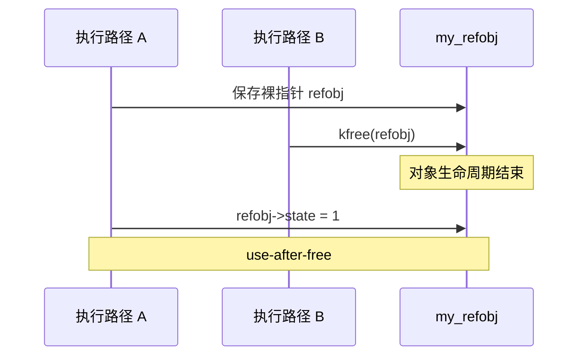
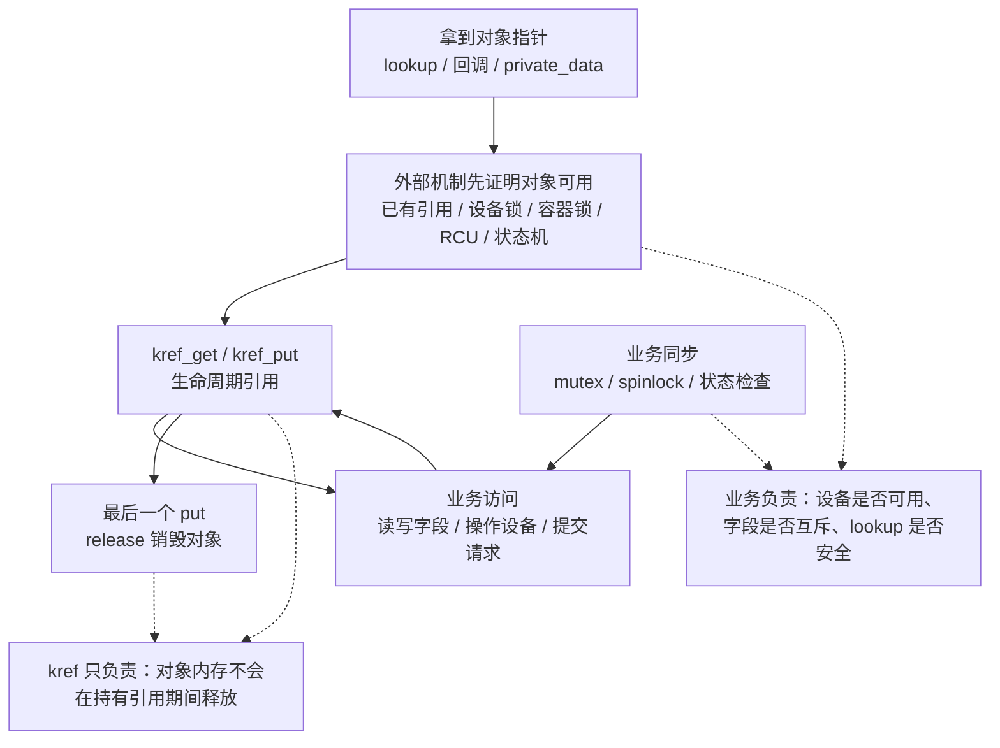

# 第 1 章：kref 要解决什么问题

## 1.1 本章主线

学习 `kref` 不能从“计数器怎么加一、减一”开始。

如果只把 `kref` 理解成：

```c
ref++;
ref--;
if (ref == 0)
	kfree(refobj);
```

那就已经偏了。

`kref` 真正解决的问题是：

> **一个内核对象被多个执行路径共享时，如何保证对象在最后一个使用者退出之前不会被释放。**

也就是说，`kref` 解决的是 **对象生命周期问题**。

它不负责：

```text
字段是否被并发修改
链表是否被并发破坏
状态机是否一致
回调是否重入
锁顺序是否正确
```

这些仍然要靠：

```text
mutex
spinlock
RCU
seqlock
atomic
状态机设计
```

来处理。

本章要先建立一个核心判断：

```text
只要对象会被多个地方保存、传递、排队、回调或异步使用，
就必须明确：谁持有引用，谁释放引用。
```

这就是 `kref` 的问题域。

------

## 1.2 裸指针共享为什么危险

在 C 语言里，指针本身不带所有权语义。

例如：

```c
struct my_refobj *refobj;
```

这个变量只能说明：

```text
refobj 指向某个对象地址
```

但它不能说明：

```text
这个对象现在是否还活着
当前代码是否拥有使用它的权利
别的线程是否可能马上释放它
这个对象是否已经进入销毁流程
```

所以，在内核里共享裸指针非常危险。

看一个简化模型：

```c
struct my_refobj {
	int state;
};

void thread_a(struct my_refobj *refobj)
{
	refobj->state = 1;
}

void thread_b(struct my_refobj *refobj)
{
	kfree(refobj);
}
```

如果两个线程同时运行：

```text
线程 A 正准备访问 refobj->state
线程 B 释放了 refobj
线程 A 继续访问 refobj->state
```

那么线程 A 就会访问已经释放的内存。

这就是典型的：

```text
use-after-free
```

也就是 UAF。

------

## 1.3 use-after-free 的本质

UAF 不是“指针变量消失了”。

指针变量还在。

真正的问题是：

```text
指针指向的对象生命周期已经结束，
但仍然有人继续通过旧指针访问它。
```

也就是说：

```c
refobj
```

这个变量本身仍然有值。

但是这个值指向的内存已经不再属于原对象。

它可能已经被：

```text
释放给 slab
重新分配给别的对象
写入 poison 值
被 KASAN 标记为不可访问
```

所以 UAF 的危险不是单纯崩溃，而是：

```text
读到错误数据
写坏别的对象
触发随机崩溃
造成安全漏洞
破坏内核状态
```

可以用下面的时序理解：



这里的问题不是 A 没有指针。

A 有指针。

问题是 A 没有 **有效引用**。

------

## 1.4 kref 解决的不是“有没有指针”，而是“有没有引用”

这是理解 `kref` 的第一道门槛。

裸指针表示：

```text
我知道对象地址
```

引用表示：

```text
我有权保证对象在我使用期间不会被释放
```

这两个概念完全不同。

错误理解：

```text
我手里有 refobj 指针，所以对象一定还在。
```

正确理解：

```text
我手里有 refobj 指针，并且我持有一个引用，所以对象在我 put 之前不能被释放。
```

所以 `kref` 的核心语义是：

```text
每一个长期使用对象的执行路径，都必须持有一个引用。
```

这里的“长期使用”不是指时间很长，而是指：

```text
对象指针被保存下来
对象指针跨函数边界传递
对象指针交给线程
对象指针交给 workqueue
对象指针放入队列
对象指针放入全局容器
对象指针等待异步回调使用
```

只要存在这种情况，就不能只靠裸指针。

------

## 1.5 为什么引用计数可以解决生命周期问题

引用计数的模型很简单：

```text
还有多少个执行路径正在持有这个对象？
```

如果计数大于 0：

```text
说明至少还有一个持有者，对象不能释放。
```

如果计数减到 0：

```text
说明没有任何持有者了，对象可以销毁。
```

所以 `kref` 的基本生命周期模型是：

```text
对象创建时：refcount = 1

有人长期持有对象：refcount++

有人不再使用对象：refcount--

最后一个人释放对象：refcount 变成 0，调用 release
```

例如：

```c
struct my_refobj {
	struct kref ref;
	int state;
};
```

对象创建时：

```c
refobj = kzalloc(sizeof(*refobj), GFP_KERNEL);
kref_init(&refobj->ref);
```

此时：

```text
refcount = 1
```

这一个引用通常属于创建者。

如果要把对象交给另一个执行路径长期使用：

```c
kref_get(&refobj->ref);
pass_to_worker(refobj);
```

worker 用完以后：

```c
kref_put(&refobj->ref, my_refobj_release);
```

创建者自己不用了，也要：

```c
kref_put(&refobj->ref, my_refobj_release);
```

当最后一个 `kref_put()` 让计数归零时：

```c
my_refobj_release()
```

被调用，对象才真正释放。

------

## 1.6 kref 的核心问题不是加减，而是所有权

`kref_get()` 和 `kref_put()` 本身很简单。

真正难的是判断：

```text
谁应该 get？
谁应该 put？
什么时候 get？
什么时候 put？
对象放入队列时引用归谁？
对象从全局表查出来时是否已经有引用？
release 回调里能不能继续访问全局结构？
```

所以学习 `kref` 时，重点不是背 API，而是画清楚所有权关系。

例如：

```text
创建者持有 1 个引用
workqueue 持有 1 个引用
异步回调持有 1 个引用
全局容器是否持有引用，需要设计明确
```

只要所有权不清楚，即使代码里到处都是 `kref_get()` 和 `kref_put()`，仍然可能出错。

常见错误包括：

```text
多 get 少 put：对象泄漏
少 get 多 put：提前释放
put 后继续访问：use-after-free
handoff 后再 get：已经晚了
lookup 后无保护 get：拿到的是悬挂指针
```

------

## 1.7 kref 不解决并发互斥问题

这是第二个必须明确的边界。

`kref` 只能保证：

```text
对象内存还没有被释放
```

这里说的“对象”，首先指自己定义并嵌入 `struct kref` 的对象，例如 `my_refobj`、request、session、cache entry 这类子系统内部对象。

如果讨论的是 driver core 里的 `struct device`、`struct class`、`struct bus_type`，就不能把下面的 `my_refobj + kref + my_refobj_release` 模板直接套上去。它们属于基于 `kobject` 和设备模型封装好的框架对象，有自己的 `get_device()/put_device()`、`device_release()`、class/type release 分发规则。

也就是说：

```text
裸 kref：讲自定义对象如何引用计数。
device/class/bus：讲 driver core 如何分层管理框架对象。
```

它不能保证：

```text
对象字段不会被别人同时修改
对象状态不会被并发改变
对象链表节点不会被并发删除
对象内部缓存不会被并发破坏
设备当前仍然可访问
当前路径拥有设备的独占访问权
lookup 拿到的裸指针一定还有效
```

这点在设备相关代码里尤其重要。

`kref` 不是“设备安全代理”，也不是“设备完整托管器”。它不负责决定：

```text
设备是否 online
设备是否已经 remove
设备是否允许新请求
当前路径是否持有设备锁
多个线程是否可以同时操作设备寄存器或私有字段
```

这些都属于外层对象或框架自己的规则，通常由设备锁、对象锁、容器锁、RCU、状态机或设备模型自身的引用规则来保证。

可以把分工画成这样：



所以更准确的使用前提是：

```text
不是拿到裸指针之后，靠 kref_get() 让一切变安全；
而是外部规则已经证明对象有效之后，才能 kref_get() 延长生命周期。
```

例如：

```c
struct my_refobj {
	struct kref ref;
	int state;
};
```

下面代码即使持有引用，也不一定是并发安全的：

```c
kref_get(&refobj->ref);

refobj->state++;

kref_put(&refobj->ref, my_refobj_release);
```

`kref_get()` 只能说明：

```text
refobj 在当前引用释放前不会被 kfree
```

但它不说明：

```text
refobj->state++ 是互斥的
```

如果多个 CPU 同时执行：

```c
refobj->state++;
```

仍然会产生数据竞争。

正确设计通常需要：

```c
struct my_refobj {
	struct kref ref;
	struct mutex lock;
	int state;
};
```

然后：

```c
kref_get(&refobj->ref);

mutex_lock(&refobj->lock);
refobj->state++;
mutex_unlock(&refobj->lock);

kref_put(&refobj->ref, my_refobj_release);
```

这里分工是：

```text
kref 保护对象生命周期
mutex 保护对象字段一致性
```

这两个问题不能混在一起。

如果换成自己封装的设备私有对象，也可以这样理解：

```text
kref 保证私有对象内存不会提前释放；
设备锁保证私有对象状态和寄存器访问不会并发冲突；
状态机保证设备当前是否 online、是否允许请求；
lookup 保护保证从全局结构拿到私有对象时不是悬挂指针。
```

------

## 1.8 生命周期保护和字段保护的区别

可以把对象分成两个层次看：

```text
对象是否还活着
对象内部数据是否一致
```

`kref` 只管第一层：

```text
对象是否还活着
```

锁、RCU、atomic 等机制管第二层：

```text
对象内部数据是否一致
```

例如：

```text
kref 解决：refobj 会不会在我使用时被 free
mutex 解决：refobj->state 会不会被并发乱改
spinlock 解决：中断/软中断/多 CPU 下的短临界区保护
RCU 解决：读侧无锁查找与延迟释放
atomic 解决：单个变量的原子更新
```

所以不能说：

```text
用了 kref 就线程安全了
```

更准确的说法是：

```text
用了 kref，只是让对象生命周期具备了引用所有权协议。
```

对象内部是否线程安全，还要看字段访问规则。

------

## 1.9 kref 适合什么场景

`kref` 适合这种对象：

```text
对象不是只在一个函数栈内使用
对象会被多个模块保存
对象会被多个线程访问
对象会被异步回调使用
对象会被放进 list/hash/xarray/idr 等容器
对象会被 workqueue、timer、completion、设备回调延迟使用
```

典型场景包括：

```text
设备私有对象
连接对象
请求对象
会话对象
缓存对象
异步 IO 上下文
驱动内部资源对象
文件或 inode 相关私有对象
```

例如驱动里常见的结构：

```c
struct my_request {
	struct kref ref;
	struct list_head node;
	struct completion done;
	int status;
	void *buffer;
};
```

这个请求对象可能同时被：

```text
提交线程持有
硬件完成中断路径持有
超时 timer 持有
取消路径持有
debugfs 查询路径持有
```

如果没有明确引用规则，就很容易出现：

```text
取消路径释放了 request
中断完成路径又访问 request
```

这就是典型生命周期 bug。

------

## 1.10 为什么“多个地方能拿到对象”时必须有生命周期协议

只要对象能从多个地方被拿到，就会出现一个问题：

```text
谁能决定释放对象？
```

如果没有引用计数，通常会变成这种危险模型：

```text
A 觉得自己用完了，于是 free
B 其实还在用，于是 UAF
```

而 `kref` 把释放条件改成：

```text
不是某一个路径觉得自己用完了就释放，
而是所有持有引用的路径都 put 之后才释放。
```

也就是：

```text
释放权不属于某一个使用者
释放权属于最后一个 put
```

这就是引用计数的核心价值。

它把对象释放从：

```text
某个路径主观决定
```

变成：

```text
所有权计数客观归零
```

------

## 1.11 kref 不能替代对象状态机

还有一个常见误区：

```text
对象 refcount > 0，所以对象一定可用。
```

这不一定对。

`refcount > 0` 只能说明：

```text
对象内存还活着
```

但对象可能处于：

```text
initializing
running
stopping
dead
error
removed
```

等状态。

例如某个驱动内部私有对象还活着，但它代表的硬件已经拔出：

```c
struct my_refobj {
	struct kref ref;
	struct mutex lock;
	bool online;
};
```

访问时可能需要：

```c
kref_get(&refobj->ref);

mutex_lock(&refobj->lock);
if (!refobj->online) {
	mutex_unlock(&refobj->lock);
	kref_put(&refobj->ref, my_refobj_release);
	return -ENODEV;
}

/* 硬件在线，执行操作 */
mutex_unlock(&refobj->lock);

kref_put(&refobj->ref, my_refobj_release);
```

这里：

```text
kref 保证 my_refobj 私有对象没被释放
online 状态判断保证硬件当前是否可操作
mutex 保证 online 状态检查和修改一致
```

所以对象生命周期和对象业务状态仍然是两个问题。

------

## 1.12 kref 不能单独解决 lookup 问题

假设有一个全局链表：

```c
static LIST_HEAD(refobj_list);
static DEFINE_MUTEX(refobj_list_lock);
```

对象挂在链表里：

```c
struct my_refobj {
	struct kref ref;
	struct list_head node;
	int id;
};
```

错误查找模型：

```c
struct my_refobj *my_refobj_lookup(int id)
{
	struct my_refobj *refobj;

	list_for_each_entry(refobj, &refobj_list, node) {
		if (refobj->id == id) {
			kref_get(&refobj->ref);
			return refobj;
		}
	}

	return NULL;
}
```

这段代码的问题是：

```text
如果没有锁保护 refobj_list，
查找过程中 refobj 可能已经被别的路径删除并释放。
```

也就是说：

```c
kref_get(&refobj->ref);
```

本身也需要一个前提：

```text
refobj 指向的内存此刻仍然是有效对象。
```

如果 `refobj` 已经是悬挂指针，`kref_get()` 就是在已经释放的内存上加引用，毫无意义，甚至更危险。

正确方向是：

```text
lookup 路径要被 mutex/spinlock/RCU 等机制保护
在对象仍然可达且未释放期间完成 get
```

也就是说：

```text
kref 保护对象拿到引用之后的生命周期
锁/RCU 保护从容器里找到对象并取得引用的过程
```

这一点是后面学习 `kref_get_unless_zero()` 和 RCU 组合时的重点。

------

## 1.13 kref 的三个核心角色

一个完整的 `kref` 设计里，通常有三个角色。

### 角色一：对象本身

对象内部嵌入 `struct kref`：

```c
struct my_refobj {
	struct kref ref;
	/* real fields */
};
```

这说明：

```text
引用计数是对象生命周期的一部分
```

`kref` 不是外部分配的管理器。

它跟对象同生共死。

------

### 角色二：持有者

持有者是所有需要长期使用对象的执行路径。

例如：

```text
创建者
调用者
队列
workqueue
timer
回调函数
全局容器
子系统模块
```

持有者的规则是：

```text
开始持有对象时 get
不再持有对象时 put
```

如果是所有权转移，则要明确：

```text
当前引用交给谁
转移后当前路径不能继续访问
```

------

### 角色三：release 回调

release 是最后引用释放点。

```c
static void my_refobj_release(struct kref *ref)
{
	struct my_refobj *refobj = container_of(ref, struct my_refobj, ref);

	kfree(refobj);
}
```

它表示：

```text
没有任何持有者了
对象可以销毁
```

release 不是普通清理函数。

它是对象生命周期的终点。

------

## 1.14 为什么不能把 kref 当成普通计数器

普通计数器可以随便读：

```c
if (count == 0)
	...
```

但 `kref` 不能这样用。

即使你能读出当前引用数，也不能据此写出可靠逻辑：

```c
if (kref_read(&refobj->ref) == 1) {
	/* 我是不是最后一个？ */
}
```

这种判断在并发环境下通常是不可靠的。

因为在你读完之后，其他 CPU 可能马上：

```text
get
put
release
```

`kref` 的可靠语义不在于“读当前值然后判断”，而在于这些操作：

```text
kref_get()
kref_put()
kref_get_unless_zero()
```

它们把引用变化和必要的原子语义封装起来。

所以使用 `kref` 时不要围绕：

```text
当前计数是多少？
```

来设计，而要围绕：

```text
我是否拥有一个引用？
我什么时候释放这个引用？
最后一个 put 时如何销毁对象？
```

来设计。

------

## 1.15 kref 的正确思维模型

可以把 `kref` 思维模型总结成下面这张表：

| 问题                              | kref 是否解决 | 说明                            |
| --------------------------------- | ------------- | ------------------------------- |
| 对象会不会在我使用时被释放        | 是            | 只要当前路径持有有效引用        |
| 对象字段是否并发安全              | 否            | 需要 mutex/spinlock/atomic 等   |
| 对象能否从全局表安全查找          | 否            | 需要锁、RCU 或其他查找保护      |
| 最后一个使用者退出时释放对象      | 是            | `kref_put()` 归零后调用 release |
| 对象业务状态是否可用              | 否            | 需要状态机和锁保护              |
| put 后还能不能访问对象            | 否            | put 后对象可能已经释放          |
| refcount 当前值能不能作为可靠判断 | 通常不能      | 并发下瞬时值意义有限            |

最关键的一句是：

```text
kref 只回答“对象还活着吗”，不回答“对象状态正确吗”。
```

------

## 1.16 一个完整的错误模型

下面是一个典型错误：

```c
struct my_refobj {
	struct kref ref;
	int state;
};

static void my_refobj_release(struct kref *ref)
{
	struct my_refobj *refobj = container_of(ref, struct my_refobj, ref);

	kfree(refobj);
}

void start_worker(struct my_refobj *refobj)
{
	queue_work(system_wq, &refobj->work);
	kref_get(&refobj->ref);
}
```

这段代码的意图是：

```text
把 refobj 交给 worker 使用，所以给 worker 增加一个引用
```

但是顺序错了。

错误点在这里：

```c
queue_work(system_wq, &refobj->work);
kref_get(&refobj->ref);
```

对象先交出去，后 get。

如果 worker 很快运行，或者另一个路径释放对象，就可能出现：

```text
refobj 已经被释放
当前路径才执行 kref_get
```

这时 `kref_get()` 已经晚了。

正确顺序应该是：

```c
kref_get(&refobj->ref);
queue_work(system_wq, &refobj->work);
```

也就是：

```text
先保证 worker 拥有引用
再把对象交给 worker
```

这就是 kref 的第一条核心规则：

```text
非临时拷贝指针之前，必须先 get。
```

------

## 1.17 “临时使用”和“长期持有”的区别

不是所有函数调用都需要 `kref_get()`。

例如：

```c
static void my_refobj_do_something(struct my_refobj *refobj)
{
	refobj->state = 1;
}
```

如果调用者已经持有引用，并且这个函数只是同步调用、不会保存指针、不会异步使用指针，那么通常不需要在函数内部再次 `kref_get()`。

例如：

```c
void caller(struct my_refobj *refobj)
{
	/* caller 已经持有 refobj 的引用 */

	my_refobj_do_something(refobj);

	/* caller 仍然持有引用 */
}
```

这种属于临时借用。

但是如果函数内部要保存指针：

```c
static struct my_refobj *global_refobj;

void remember_refobj(struct my_refobj *refobj)
{
	global_refobj = refobj;
}
```

那么就不是临时借用，而是长期持有。

这时必须设计引用规则：

```c
void remember_refobj(struct my_refobj *refobj)
{
	kref_get(&refobj->ref);
	global_refobj = refobj;
}
```

后续替换或清理 `global_refobj` 时，也必须：

```c
kref_put(&global_refobj->ref, my_refobj_release);
```

所以判断是否需要 get 的关键不是函数层级，而是：

```text
是否把指针保存到当前调用栈之外？
是否异步使用？
是否跨越当前持有者的生命周期？
```

------

## 1.18 kref 和 handoff

还有一种情况容易误判：

```text
我当前已经持有一个引用，现在我要把这个引用直接交给别人。
```

这叫 handoff，也就是引用所有权转移。

例如：

```c
/* 当前路径持有 refobj 的一个引用 */
enqueue_refobj(refobj);

/* 从这里开始，当前路径不再访问 refobj */
```

如果 `enqueue_refobj()` 的语义是：

```text
队列接管当前引用
```

那么这里不需要：

```c
kref_get(&refobj->ref);
enqueue_refobj(refobj);
kref_put(&refobj->ref, my_refobj_release);
```

这种 get 后马上 put 的写法可能是多余的。

更清晰的写法是：

```c
enqueue_refobj(refobj);
/* ownership moved to queue, do not touch refobj after this point */
```

但这个模型有一个严格要求：

```text
handoff 之后，当前路径不能再访问 refobj。
```

否则就变成：

```text
引用已经交出去了，但当前路径还在裸指针访问对象
```

这又会回到 UAF 风险。

所以 handoff 代码必须写清楚注释。

例如：

```c
/*
 * Transfer our reference to the queue.
 * Do not touch refobj after enqueue_refobj().
 */
enqueue_refobj(refobj);
```

这种注释不是废话，而是生命周期协议的一部分。

------

## 1.19 kref 设计最重要的几个问题

写一个使用 `kref` 的内核对象时，不应该先问：

```text
我要在哪里 ++？
我要在哪里 --？
```

而应该先问：

```text
对象在哪里创建？
创建后初始引用属于谁？
对象会被哪些路径保存？
哪些路径只是临时借用？
哪些路径需要长期持有？
对象是否会进入全局 list/hash/xarray/idr？
从全局结构 lookup 时如何防止对象被释放？
对象何时从全局结构移除？
最后一个 put 时 release 做哪些清理？
release 里是否需要锁？
内存是直接 kfree，还是 kfree_rcu？
```

这才是 kref 的真正设计问题。

如果这些问题答不出来，代码即使用了 `kref`，也只是形式上用了引用计数。

------

## 1.20 本章小结

本章的核心结论是：

```text
kref 不是“计数器 API”，而是 Linux 内核对象生命周期协议。
```

它解决的问题是：

```text
多个执行路径共享同一个对象时，
如何保证对象在最后一个使用者退出之前不会被释放。
```

它不解决的问题是：

```text
字段并发访问
状态机一致性
全局容器查找保护
锁顺序
RCU grace period
业务可用性判断
设备独占访问和设备安全托管
```

所以 `kref` 的正确使用方式是：

```text
生命周期用 kref
字段一致性用锁
查找路径用锁或 RCU
业务可用性用状态机
设备访问安全由设备自己的锁和状态规则决定
释放路径用 release 回调
```

记住本章最重要的一句话：

```text
有指针，不代表有引用；
有引用，才代表对象在当前使用期间不能被释放。
```

下一章开始再进入源码入口：

```c
include/linux/kref.h
include/linux/refcount.h
```

并正式分析：

```c
struct kref
kref_init()
kref_get()
kref_put()
container_of()
```

但在看源码之前，必须先把本章这个问题域建立起来。否则后面看到的就只是 `refcount_inc()` 和 `refcount_dec_and_test()`，而不是 Linux 内核对象生命周期管理模型。
