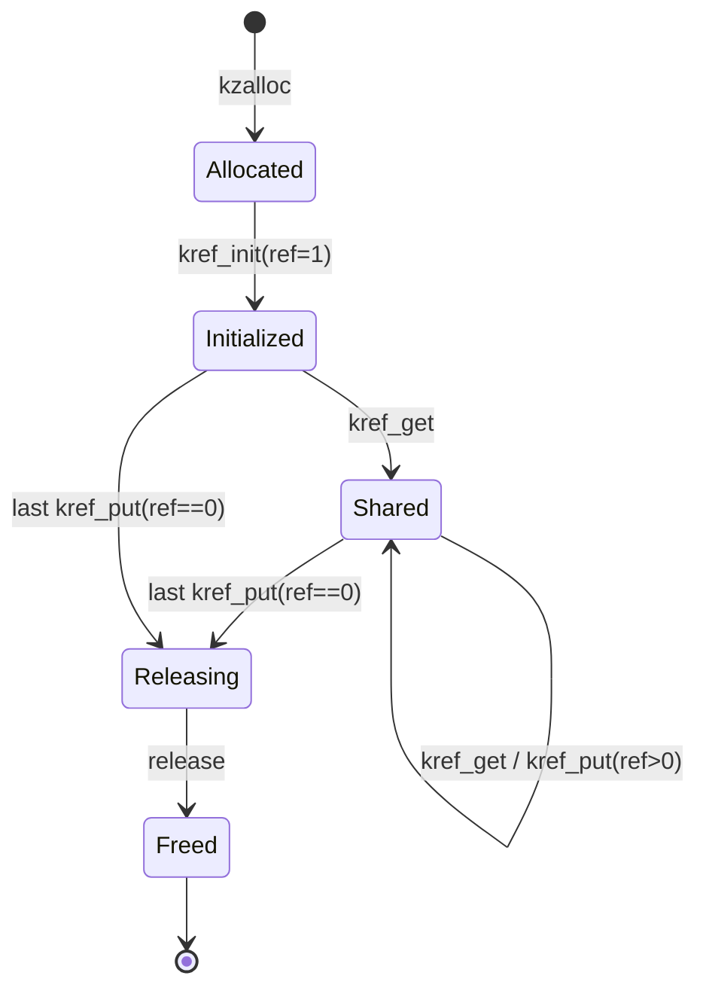
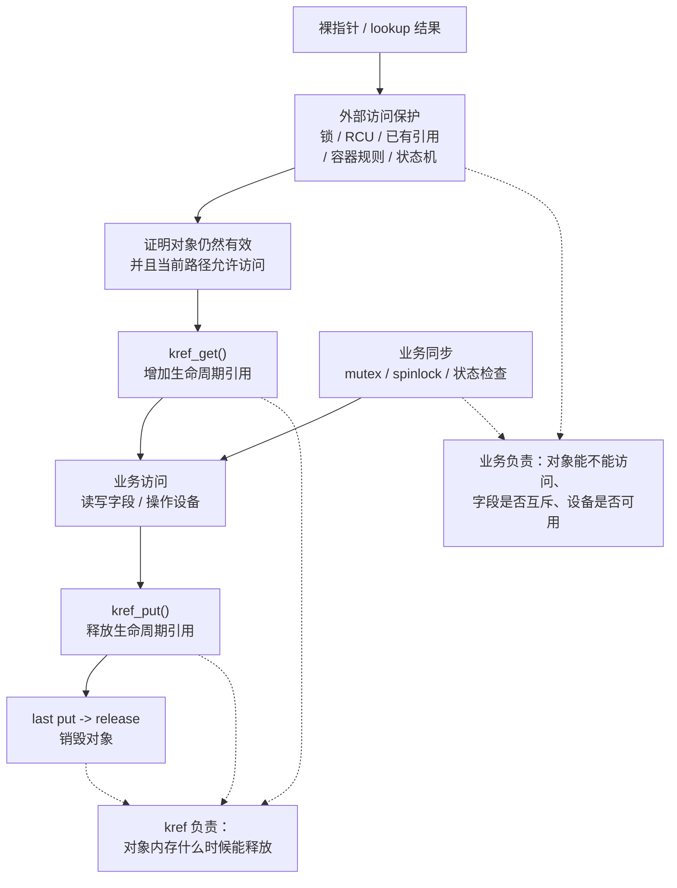
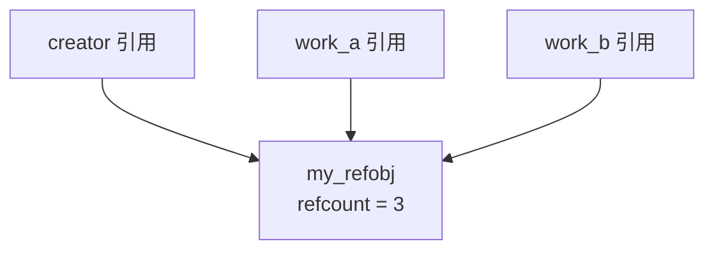
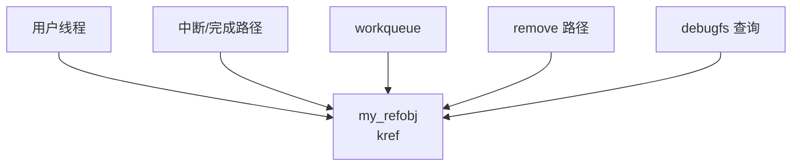
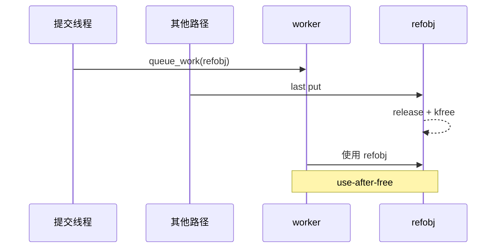
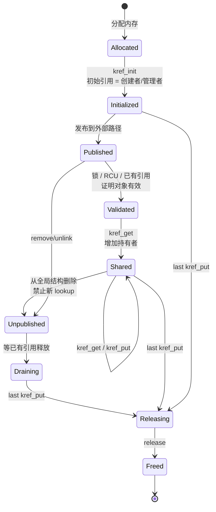

# 第 3 章：kref 生命周期状态机

## 3.1 本章主线

前两章已经建立了两个基础结论：

```text
第 1 章：kref 解决的是对象生命周期问题。
第 2 章：kref 是嵌入自定义引用对象内部的生命周期字段。
```

第 3 章要把 `kref` 的生命周期完整串起来。

不要把 `kref` 看成几个孤立 API：

```c
kref_init();
kref_get();
kref_put();
```

而要看成一个完整状态机：

```text
对象分配
  -> 初始化引用计数
  -> 被多个路径持有
  -> 每个持有者释放引用
  -> 最后一个引用归零
  -> release 回调销毁对象
```

本章核心问题是：

```text
对象什么时候开始存在？
初始引用属于谁？
外部代码必须先满足什么访问前提？
谁可以增加引用？
谁必须释放引用？
最后一个 put 到底发生了什么？
release 之后对象还能不能访问？
```

一句话概括：

```text
kref 的生命周期不是 refcount 从 1 变到 0，而是对象所有权从创建者扩散到多个持有者，再最终收敛到 release。
```

------

## 3.2 最小生命周期状态机

一个最小的 `kref` 生命周期可以画成：



用普通文本描述就是：

```text
allocated
   |
   v
kref_init() -> refcount = 1
   |
   +-- kref_get() -> refcount++
   |
   +-- kref_put() -> refcount--
              |
              +-- refcount != 0 : object still alive
              |
              +-- refcount == 0 : release(kref) -> free object
```

这张图里最重要的是：

```text
release 不是普通函数调用点，而是对象生命周期终点。
```

进入 release 之后，说明：

```text
没有任何合法持有者了。
```

release 执行完之后，说明：

```text
对象内存已经不能再被访问。
```

------

## 3.3 先立边界：kref 不是设备锁，也不是完整安全模型

在进入 `kref_get()`、`kref_put()` 之前，必须先把边界说清楚：

```text
kref 只管理对象内存生命周期，不管理设备访问互斥，也不替业务判断设备是否可用。
```

也就是说，`kref` 不能单独回答这些问题：

```text
这个设备当前能不能访问？
这个对象字段是否正在被其他路径修改？
这个 lookup 拿到的指针是否仍然有效？
当前路径是否有权限继续操作设备？
这个对象是否已经进入 remove/stopping/dead 状态？
多个线程是否可以同时操作这个对象？
```

这些问题要由业务自己的机制解决，例如：

```text
设备锁
对象锁
容器锁
RCU 读侧保护
业务状态机
设备模型自己的引用规则
```

`kref` 只在这些外部规则已经建立之后，负责延长或结束一个生命周期引用。

可以把关系画成这样：



这里最容易误解的是：

```text
不是“我有 refobj 指针，所以 kref_get 后就安全”。
而是“我已经通过外部机制证明 refobj 有效，所以才能 kref_get”。
```

例如驱动内部私有对象即使和硬件设备相关，也不是让 `kref` 自己解决所有安全问题，而是这样分工：

```text
设备锁/状态机：
    判断设备是否还在、是否可读写、字段访问是否互斥。

kref：
    保证只要当前路径持有引用，对象内存不会被 release/free。
```

所以 `kref` 不是设备的完整委托管理器。

它不负责独占访问，不负责业务状态切换，不负责阻止并发字段修改，也不负责决定对象能不能被新路径找到。

一句话总结：

```text
业务机制先证明“可以拿引用”，kref 才负责“拿到引用后对象不会消失”。
```

------

## 3.4 创建与初始引用阶段

这一组小节先回答对象生命周期从哪里开始，以及 `kref_init()` 创建的第一个引用到底属于谁。

### 3.4.1 对象分配阶段：allocated

生命周期从对象分配开始。

典型代码：

```c
struct my_refobj *refobj;

refobj = kzalloc(sizeof(*refobj), GFP_KERNEL);
if (!refobj)
	return NULL;
```

此时对象内存已经分配出来，但还不能算完整可用。

因为：

```text
kref 还没有初始化
锁还没有初始化
链表节点还没有初始化
业务字段还没有初始化
对象还不能发布给其他路径
```

此时对象处于：

```text
allocated but not initialized
```

也就是：

```text
内存存在，但对象生命周期协议还没有建立。
```

这个阶段不能让其他路径看到对象。

错误模型：

```c
refobj = kzalloc(sizeof(*refobj), GFP_KERNEL);
global_refobj = refobj;              /* 错：对象还没初始化就发布 */
kref_init(&refobj->ref);
```

如果 `global_refobj` 发布后，其他 CPU 或其他线程马上访问它，就可能看到一个半初始化对象。

正确方向是：

```c
refobj = kzalloc(sizeof(*refobj), GFP_KERNEL);
if (!refobj)
	return NULL;

kref_init(&refobj->ref);
mutex_init(&refobj->lock);
INIT_LIST_HEAD(&refobj->node);
refobj->state = my_refobj_INIT;

/* 初始化完成后再发布 */
global_refobj = refobj;
```


### 3.4.2 kref_init 阶段：创建初始引用

对象分配后，要调用：

```c
kref_init(&refobj->ref);
```

它的语义是：

```text
把引用计数初始化为 1。
```

但是这句话不能只理解成“计数器等于 1”。

更准确的理解是：

```text
创建者获得了对象的第一个引用。
```

也就是说：

```text
kref_init() 不是单纯初始化字段；
kref_init() 建立了对象的第一个生命周期所有者。
```

例如：

```c
static struct my_refobj *my_refobj_create(void)
{
	struct my_refobj *refobj;

	refobj = kzalloc(sizeof(*refobj), GFP_KERNEL);
	if (!refobj)
		return NULL;

	kref_init(&refobj->ref);

	return refobj;
}
```

返回后的所有权关系是：

```text
调用 my_refobj_create() 的路径持有 1 个引用。
```

所以调用者最终必须：

```c
my_refobj_put(refobj);
```

否则这个初始引用永远不释放，对象就泄漏。


### 3.4.3 为什么初始值是 1，不是 0

`kref_init()` 初始化为 1，而不是 0。

原因是：

```text
对象刚创建成功时，创建者已经拥有它。
```

如果初始化为 0，就会出现语义问题：

```text
对象已经存在，但没有任何持有者。
```

这在生命周期模型里是不合理的。

因为没有持有者意味着：

```text
对象可以被释放。
```

而刚创建出来的对象显然应该由创建者负责管理。

所以标准模型是：

```text
创建对象成功
  -> refcount = 1
  -> 这个引用属于创建者
```

如果创建者要把对象交给别人，它可以：

```text
增加引用后共享出去
或者直接 handoff 当前引用
```

但不应该让对象处于“无引用但还存在”的状态。


### 3.4.4 初始化引用属于谁

这是很多 `kref` bug 的来源。

代码里看到：

```c
kref_init(&refobj->ref);
```

必须立刻追问：

```text
这个初始引用属于谁？
```

通常有几种情况。

#### 情况一：属于创建者

最常见：

```c
refobj = my_refobj_create();

/* 当前函数持有 refobj 初始引用 */

do_something(refobj);

my_refobj_put(refobj);
```

生命周期清晰：

```text
create 获得引用
put 释放引用
```


#### 情况二：创建后立即交给容器

例如对象创建后加入全局链表，链表持有引用：

```c
refobj = my_refobj_create();

mutex_lock(&refobj_list_lock);
list_add(&refobj->node, &refobj_list);
mutex_unlock(&refobj_list_lock);

/*
 * 初始引用从创建者转移给 refobj_list。
 * 当前路径不再单独持有 refobj。
 */
```

这里可以设计成：

```text
kref_init() 的初始引用直接属于全局链表。
```

但是必须注释清楚。

否则别人会误以为：

```text
创建者还有一个引用
链表也有一个引用
```

从而导致漏 put 或多 put。


#### 情况三：创建后立即 handoff 给异步路径

例如：

```c
refobj = my_refobj_create();

queue_work(system_wq, &refobj->work);

/*
 * 初始引用转移给 workqueue。
 * 当前路径不再访问 refobj。
 */
```

这种模型也可以成立，但要求非常严格：

```text
queue_work 成功之后，当前路径不能再碰 refobj。
worker 执行完后必须 put。
```

如果当前路径后面还要访问对象，那就不能直接 handoff，而应该先 `kref_get()`。

------

## 3.5 增加引用阶段：kref_get

这一组小节集中说明 `kref_get()` 的含义、前提和边界。

### 3.5.1 kref_get 阶段：增加持有者

`kref_get()` 表示：

```text
当前对象多了一个长期持有者。
```

典型代码：

```c
kref_get(&refobj->ref);
```

它不是单纯计数加一，而是表达所有权变化：

```text
多一个执行路径有权保证对象不被释放。
```

例如，把对象交给 worker：

```c
kref_get(&refobj->ref);
queue_work(system_wq, &refobj->work);
```

这里的所有权关系变化是：

```text
调用者原本持有 1 个引用
kref_get 后多出 1 个引用
这个新引用交给 workqueue/worker
```

所以 worker 结束时必须：

```c
my_refobj_put(refobj);
```

否则 worker 的引用泄漏。


### 3.5.2 kref_get 的前提

`kref_get()` 有一个非常关键的前提：

```text
调用 kref_get() 时，对象必须已经是有效对象。
```

也就是说，调用者必须已经通过某种方式保证：

```text
refobj 没有被释放
&refobj->ref 这块内存仍然有效
```

常见保证方式包括：

```text
当前路径已经持有一个引用
当前路径在保护对象集合的锁内
当前路径在 RCU 读侧临界区内，并使用 get_unless_zero
对象还没有被发布给并发路径
```

错误理解是：

```text
我手里有 refobj 指针，所以可以 kref_get。
```

正确理解是：

```text
我手里有 refobj 指针，并且我能证明 refobj 仍然有效，所以可以 kref_get。
```

如果对象可能已经释放，下面代码就是错的：

```c
refobj = lookup_without_lock(id);
kref_get(&refobj->ref);       /* 可能在已释放对象上 get */
```

因为此时 `refobj` 只是裸指针，不代表有效引用。


### 3.5.3 kref_get 不是复活对象

`kref_get()` 不能把已经归零或正在释放的对象救回来。

错误模型：

```text
对象 refcount 已经到 0
release 正在执行
另一个路径拿到旧指针
调用 kref_get()
试图继续使用对象
```

这是错误的。

因为：

```text
refcount 到 0 表示对象生命周期已经结束。
```

即使内存还没被真正 `kfree()`，对象也已经进入销毁流程。

所以 `kref_get()` 的正确使用场景是：

```text
对象仍处于有效生命周期内
当前路径已经有办法证明它没有被释放
现在要给另一个持有者增加引用
```

如果是 lookup 场景，要使用更谨慎的模型，比如：

```c
kref_get_unless_zero(&refobj->ref)
```

而且它也必须和锁或 RCU 配合。

------

## 3.6 释放引用阶段：kref_put

这一组小节集中说明 `kref_put()` 如何结束当前路径的持有权，以及为什么 put 之后不能继续依赖对象指针。

### 3.6.1 kref_put 阶段：释放持有者

`kref_put()` 表示：

```text
当前路径不再持有这个对象。
```

典型封装：

```c
static void my_refobj_put(struct my_refobj *refobj)
{
	kref_put(&refobj->ref, my_refobj_release);
}
```

调用：

```c
my_refobj_put(refobj);
```

它的语义不是简单的：

```text
refcount--
```

而是：

```text
我放弃了一个生命周期所有权。
```

所以调用 `put` 之后，一般不能再访问对象：

```c
my_refobj_put(refobj);

refobj->state = DEAD;      /* 错：refobj 可能已经被释放 */
```

因为这次 `put` 可能就是最后一个引用。

如果是最后一个引用，那么 `my_refobj_release()` 已经被调用，甚至对象内存已经释放。


### 3.6.2 kref_put 的两个结果

`kref_put()` 有两个可能结果。

#### 结果一：不是最后一个引用

```text
refcount 从 n 变成 n - 1
其中 n - 1 > 0
```

对象仍然有其他持有者。

例如：

```text
put 前 refcount = 3
put 后 refcount = 2
对象继续存在
```

但是要注意：

```text
当前路径已经不再持有引用。
```

也就是说，即使对象当前还活着，当前路径也不能继续把裸指针当成自己的对象使用。


#### 结果二：最后一个引用

```text
refcount 从 1 变成 0
```

这时 `release` 回调被调用：

```c
static void my_refobj_release(struct kref *ref)
{
	struct my_refobj *refobj = container_of(ref, struct my_refobj, ref);

	kfree(refobj);
}
```

这表示：

```text
对象生命周期结束。
```

所以：

```text
最后一个 put 是对象销毁触发点。
```


### 3.6.3 kref_put 返回值的正确理解

`kref_put()` 通常返回一个整数。

语义可以理解为：

```text
返回 1：本次 put 触发了 release
返回 0：本次 put 没有触发 release
```

但是这个返回值不能误用。

错误理解：

```c
if (!kref_put(&refobj->ref, my_refobj_release)) {
	/* 对象没释放，所以还能继续访问？ */
	refobj->state = 1;       /* 错 */
}
```

为什么错？

因为：

```text
kref_put 返回 0 只说明“本次调用没有释放对象”。
```

它不保证：

```text
下一瞬间别的 CPU 不会释放对象。
```

而且当前路径已经释放了自己的引用。

所以 `put` 后继续访问对象，原则上就是危险的。

正确原则：

```text
put 之后不要再访问对象。
```

除非满足非常明确的额外条件，例如：

```text
当前路径还有另一个引用
或者仍在某个锁保护下，并且对象释放协议保证不会释放
```

但这种情况必须非常谨慎，不应作为普通写法。

------

## 3.7 销毁阶段：release

这一组小节把最后一个 put 之后的销毁语义收在一起：release 是收尾点，不是重新分发对象的地方。

### 3.7.1 release 阶段：对象销毁点

release 函数是对象的最终销毁逻辑。

模板：

```c
static void my_refobj_release(struct kref *ref)
{
	struct my_refobj *refobj;

	refobj = container_of(ref, struct my_refobj, ref);

	kfree(refobj);
}
```

它的调用条件是：

```text
最后一个引用已经释放。
```

也就是说，进入 release 时，理论上不应该还有其他路径合法持有对象。

release 可以做：

```text
释放对象内存
释放子资源
销毁缓冲区
关闭底层资源
检查对象是否已脱链
触发调试告警
```

例如：

```c
static void my_refobj_release(struct kref *ref)
{
	struct my_refobj *refobj = container_of(ref, struct my_refobj, ref);

	WARN_ON(!list_empty(&refobj->node));

	kfree(refobj->buffer);
	kfree(refobj);
}
```

这里的 `WARN_ON(!list_empty(&refobj->node))` 表示：

```text
对象释放时不应该还挂在全局链表里。
```

如果还在链表里，说明生命周期协议有 bug。


### 3.7.2 release 不是继续分发对象的地方

release 是销毁点，不是重新发布对象的地方。

错误模型：

```c
static void my_refobj_release(struct kref *ref)
{
	struct my_refobj *refobj = container_of(ref, struct my_refobj, ref);

	global_refobj = refobj;       /* 错 */
	kref_get(&refobj->ref);    /* 错 */
}
```

这类代码从语义上就是错的。

因为进入 release 的前提是：

```text
refcount 已经归零。
```

对象已经没有合法持有者。

此时再把对象发布出去，相当于试图复活一个已经死亡的对象。

正确理解：

```text
release 只能收尾，不能重新扩散所有权。
```

release 的职责应该是：

```text
关闭对象生命周期
释放对象资源
让对象不可再访问
```


### 3.7.3 release 的最终释放方式不一定是 kfree

不一定。

最简单的对象 release 是：

```c
kfree(refobj);
```

但真实内核对象可能有多种释放方式。

#### 普通动态对象

```c
kfree(refobj);
```

#### slab cache 对象

```c
kmem_cache_free(my_cachep, refobj);
```

#### RCU 延迟释放对象

```c
kfree_rcu(refobj, rcu);
```

#### 包含子资源的对象

```c
kfree(refobj->name);
put_device(refobj->dev);
kfree(refobj);
```

这里的 `put_device(refobj->dev)` 只是释放当前私有对象持有的 device 引用，不是让 `my_refobj_release()` 接管 `struct device` 的最终析构。

所以 release 的本质不是 `kfree`。

release 的本质是：

```text
最后一个引用释放后的对象销毁流程。
```

------

## 3.8 生命周期中的所有权归属

引用计数真正要管理的是所有权的扩散和收敛，所以这里把“谁持有引用、何时释放引用”放在一起看。

### 3.8.1 生命周期中的所有权扩散

假设对象创建后，初始引用属于创建者：

```text
refcount = 1
owner = creator
```

然后创建者把对象交给两个异步路径：

```c
kref_get(&refobj->ref);
queue_work(system_wq, &refobj->work_a);

kref_get(&refobj->ref);
queue_work(system_wq, &refobj->work_b);
```

此时引用关系是：

```text
refcount = 3

creator 持有 1 个引用
work_a 持有 1 个引用
work_b 持有 1 个引用
```

可以画成：



当 creator 用完：

```c
my_refobj_put(refobj);
```

引用关系变成：

```text
refcount = 2

work_a 持有 1 个引用
work_b 持有 1 个引用
```

creator 不能再访问对象。

当 work_a 完成：

```c
my_refobj_put(refobj);
```

变成：

```text
refcount = 1

work_b 持有 1 个引用
```

当 work_b 完成：

```c
my_refobj_put(refobj);
```

变成：

```text
refcount = 0
调用 release
对象释放
```

这就是引用所有权从创建者扩散到多个路径，再逐步收敛到 0 的过程。

---

### 3.8.2 生命周期中的所有权表

实际工程里，不要只靠脑子记：

```text
哪里 kref_get？
哪里 kref_put？
```

更可靠的方式是先画出**所有权表**。

所谓所有权表，描述的不是“谁调用了函数”，而是：

```text
哪一条执行路径、哪一个容器、哪一个异步上下文，需要保证对象在一段时间内不能被释放。
```

例如一个请求对象：

```c
struct my_request {
	struct kref ref;
	struct work_struct timeout_work;
	struct list_head node;
	int status;
};
```

它可能同时被这些路径使用：

```text
创建路径
请求队列
超时 work
硬件完成中断/线程
用户等待路径
错误回滚路径
```

所以生命周期设计不能只写代码，而应该先写表。

------

#### 1. 所有权表要区分 get、put、转移

一个常见误区是：表里只写 `get/put`。

但实际工程里还有一种情况叫：

```text
引用所有权转移。
```

也就是说：

```text
某个路径不是重新 kref_get，
而是接管已有引用。
```

所以表格最好不要只写“什么时候 get”，而应该写成：

| 持有者       | 如何获得引用                                             | 引用覆盖的生命周期                       | 什么时候释放引用                                             |
| ------------ | -------------------------------------------------------- | ---------------------------------------- | ------------------------------------------------------------ |
| 创建者       | `kref_init()` 产生初始引用                               | 从对象分配成功，到提交成功或错误回滚结束 | 提交成功后不再需要时 put；错误路径 put                       |
| 请求队列     | 入队时手动 `kref_get()`，或者接管创建者引用              | 从请求挂入队列，到请求从队列删除         | 出队时 put，或者把引用转交给完成路径                         |
| 超时 work    | 驱动在成功投递 work 前手动 `kref_get()`                  | 从 `queue_work()` 成功，到 work 回调结束 | work 回调结束时 put；如果 work 被成功取消且回调不会执行，取消路径 put |
| 硬件完成路径 | 在队列锁保护下找到请求后 `kref_get()`，或者接管队列引用  | 从确认请求完成，到完成处理结束           | 完成处理结束后 put                                           |
| 用户等待路径 | lookup 成功，并在锁/RCU/`get_unless_zero` 保护下拿到引用 | 从用户开始等待，到 wait 返回             | wait 返回后 put                                              |
| 错误回滚路径 | 使用当前路径已有引用，或者对异步清理路径单独 get         | 从错误处理开始，到清理动作完成           | 清理结束后 put                                               |

这个表的重点不是机械地写 `get/put`，而是把每一份引用的**归属关系**说清楚。

------

#### 2. 创建者引用

对象创建时：

```c
req = kzalloc(sizeof(*req), GFP_KERNEL);
if (!req)
	return NULL;

kref_init(&req->ref);
```

这时引用计数是：

```text
ref = 1
```

这 1 个引用属于创建者。

它的含义是：

```text
对象刚创建出来，还没有交给别人；
创建路径负责保证它最终要么提交出去，要么错误回滚释放。
```

所以创建者引用必须有明确去向：

```text
提交失败：
    创建者 put，可能直接释放对象。

提交成功：
    创建者要么把引用转移给队列；
    要么队列额外 get，创建者随后 put 自己的引用。
```

这两种模型都可以，但必须选清楚。

------

#### 3. 请求队列引用

如果请求对象会挂入队列：

```c
list_add_tail(&req->node, &request_queue);
```

那么队列本身通常就是一个持有者。

因为只要请求还在队列里，队列遍历、取消、完成路径都可能通过 `node` 找到它。

所以队列必须保证：

```text
请求挂在队列期间，req 不能被释放。
```

一种写法是队列额外拿引用：

```c
kref_get(&req->ref);

spin_lock(&queue_lock);
list_add_tail(&req->node, &request_queue);
spin_unlock(&queue_lock);
```

出队时释放：

```c
spin_lock(&queue_lock);
list_del(&req->node);
spin_unlock(&queue_lock);

kref_put(&req->ref, my_request_release);
```

另一种写法是：

```text
创建者把初始引用转移给队列。
```

这种情况下，入队时不需要额外 `kref_get()`，但表里必须写清楚：

```text
队列持有的是创建者转移过来的初始引用。
```

否则读代码的人会误以为漏了 `kref_get()`。

------

#### 4. 超时 work 引用

workqueue 不会自动管理外层对象的 `kref`。

它只知道：

```c
struct work_struct timeout_work;
```

它不知道外层对象是：

```c
struct my_request
```

也不知道里面有：

```c
struct kref ref;
```

所以如果 work 回调里要这样取外层对象：

```c
static void my_request_timeout_work(struct work_struct *work)
{
	struct my_request *req;

	req = container_of(work, struct my_request, timeout_work);

	/* 使用 req */
}
```

那么驱动必须保证：

```text
从 queue_work 成功开始，到 work 回调结束，req 都不能被释放。
```

因此引用应该在投递 work 前拿，而不是在 work 函数开头拿：

```c
kref_get(&req->ref);

if (!queue_work(system_wq, &req->timeout_work)) {
	kref_put(&req->ref, my_request_release);
	return false;
}
```

work 回调结束时归还：

```c
static void my_request_timeout_work(struct work_struct *work)
{
	struct my_request *req;

	req = container_of(work, struct my_request, timeout_work);

	/*
	 * 能执行到这里，说明投递 work 前已经给 work 路径拿过引用。
	 */

	/* timeout 处理 */

	kref_put(&req->ref, my_request_release);
}
```

不能写成：

```c
static void my_request_timeout_work(struct work_struct *work)
{
	struct my_request *req;

	req = container_of(work, struct my_request, timeout_work);

	kref_get(&req->ref);   /* 错误：太晚了 */

	/* 使用 req */

	kref_put(&req->ref, my_request_release);
}
```

因为在进入 work 函数之前，内核已经要通过 `work_struct *` 找到这个 work。

如果外层 `req` 已经释放，那么连：

```c
container_of(work, struct my_request, timeout_work)
```

这一步都已经是在释放后的内存上操作。

所以这条规则要写清楚：

```text
workqueue 只负责异步执行 work 函数；
驱动自己负责保证外层对象在 work 执行期间有效。
```

------

#### 5. 硬件完成路径引用

硬件完成路径通常来自：

```text
中断
tasklet
threaded irq
bottom half
polling thread
```

它可能会从请求队列中找到某个请求：

```c
spin_lock(&queue_lock);

req = find_completed_request_locked(...);
if (req)
	list_del(&req->node);

spin_unlock(&queue_lock);
```

这里有两种生命周期设计。

第一种：完成路径额外拿引用。

```c
spin_lock(&queue_lock);

req = find_completed_request_locked(...);
if (req) {
	kref_get(&req->ref);
	list_del(&req->node);
}

spin_unlock(&queue_lock);

/* 完成处理 */

kref_put(&req->ref, my_request_release);
```

这种写法的含义是：

```text
队列引用仍然按队列规则释放；
完成路径另外持有自己的处理引用。
```

第二种：完成路径接管队列引用。

```c
spin_lock(&queue_lock);

req = find_completed_request_locked(...);
if (req)
	list_del(&req->node);

spin_unlock(&queue_lock);

/*
 * 完成路径现在接管原来的队列引用。
 * 所以这里不再额外 kref_get。
 */

/* 完成处理 */

kref_put(&req->ref, my_request_release);
```

这种写法的含义是：

```text
请求从队列中删除后，队列不再持有它；
完成路径接管队列原来的那份引用；
完成处理结束后由完成路径 put。
```

这两种都可以，但所有权表里必须写清楚。

否则很容易出现两类错误：

```text
队列 put 了，完成路径也 put 了：
    重复 put，可能提前释放。

完成路径接管了队列引用，但最后没 put：
    引用泄漏。
```

------

#### 6. 用户等待路径引用

如果用户路径可以通过 id、句柄、队列或者文件上下文找到请求对象，例如：

```c
req = my_request_lookup(id);
```

那么 lookup 返回的不能只是裸指针。

用户等待路径必须在某种保护下拿到引用：

```text
在请求表锁内找到对象并 kref_get；
或者在 RCU 读侧临界区内使用 kref_get_unless_zero；
或者当前 file/session 本身已经持有对象引用。
```

典型形式：

```c
mutex_lock(&request_table_lock);

req = request_lookup_locked(id);
if (req)
	kref_get(&req->ref);

mutex_unlock(&request_table_lock);
```

然后用户等待结束：

```c
wait_event(req->wait, req->status != REQ_PENDING);

kref_put(&req->ref, my_request_release);
```

这条引用覆盖的是：

```text
用户等待期间，req 不能被释放。
```

它不保证请求一定成功，也不保证硬件一定完成。

它只保证：

```text
wait 路径访问 req->status、req->wait 等字段时，对象内存还活着。
```

------

#### 7. 所有权表要补充失败路径和取消路径

生命周期表不能只写正常路径。

因为 kref 最容易出问题的地方不是主流程，而是：

```text
queue_work 失败
入队失败
提交失败
硬件超时
用户取消
remove 发生
work 被 cancel
完成和超时竞态
```

所以所有权表应该额外检查：

```text
get 成功之后，如果后续步骤失败，谁 put？
对象被取消时，哪条路径负责 put？
work 没有执行时，谁 put？
请求已经完成时，超时路径如何退出？
超时已经触发时，完成路径如何退出？
```

例如超时 work：

```text
成功 queue_work：
    work 回调结束 put。

queue_work 返回 false：
    本次没有成功排入队列；
    投递路径必须立即 put。

cancel_work_sync 返回 true：
    work 被取消，回调不会执行；
    取消路径必须 put work 引用。

cancel_work_sync 返回 false：
    不能盲目 put；
    因为 work 可能已经执行并 put 过，
    或者根本没有成功排队。
```

所以工作队列这一行不能写得太粗。

更准确的表述是：

| 持有者    | 如何获得引用                            | 什么时候 put                                                 |
| --------- | --------------------------------------- | ------------------------------------------------------------ |
| 超时 work | 驱动在成功投递 work 前手动 `kref_get()` | work 回调结束时 put；如果 work 被成功取消且回调不会执行，取消路径 put；如果投递失败，投递路径立即 put |

------

#### 8. 重构后的所有权表

这个请求对象的生命周期表可以写成：

| 持有者        | 如何获得引用                                            | 引用覆盖范围                             | 什么时候释放                                                 |
| ------------- | ------------------------------------------------------- | ---------------------------------------- | ------------------------------------------------------------ |
| 创建者        | `kref_init()`                                           | 对象创建成功后，到提交成功或错误回滚结束 | 提交后不再持有时 put；错误路径 put                           |
| 请求队列      | 入队时 `kref_get()`，或者接管创建者引用                 | 请求挂在队列期间                         | 出队时 put；或者把队列引用转交给完成/取消路径                |
| 超时 work     | 成功投递 work 前由驱动手动 `kref_get()`                 | 从 work 成功排队，到 work 回调结束       | work 回调结束 put；投递失败立即 put；成功取消且回调不执行时由取消路径 put |
| 硬件完成路径  | 在队列锁保护下找到请求后 `kref_get()`，或者接管队列引用 | 从确认完成，到完成处理结束               | 完成处理结束 put                                             |
| 用户等待路径  | lookup 成功后，在锁/RCU/`get_unless_zero` 保护下拿引用  | 用户等待和读取结果期间                   | wait 返回或用户放弃等待后 put                                |
| 错误/取消路径 | 使用当前已有引用，必要时为异步清理路径单独 get          | 从错误处理开始，到清理完成               | 清理完成后 put                                               |

------

#### 9. 所有权表的检查规则

每一行都必须回答四个问题：

```text
第一，这个持有者为什么需要对象继续活着？

第二，它是在对象仍然有效的前提下获得引用的吗？

第三，这份引用覆盖哪一段执行区间？

第四，正常路径、失败路径、取消路径分别由谁 put？
```

如果表里某个持有者：

```text
只有 get，没有 put
```

就是引用泄漏。

如果某个路径：

```text
只有 put，没有 get 或引用转移
```

就是提前释放风险。

如果某个异步路径：

```text
既没有自己的引用，
也没有 cancel/flush/synchronize 之类的外部保证
```

就是 use-after-free 风险。

------

#### 10. 本节总结

所有权表的目的不是为了把代码写复杂，而是为了把生命周期关系说清楚：

```text
谁让对象继续活着？
从什么时候开始？
到什么时候结束？
失败和取消时谁负责收尾？
```

对于嵌入 `work_struct` 的对象，尤其要记住：

```text
workqueue 不会自动管理外层对象的 kref。

如果 work 回调需要通过 container_of() 访问外层对象，
那么外层对象必须从 queue_work 成功开始就保持有效。

因此 work 的引用不能等到 work 函数开头再 get；
必须在成功投递 work 前由驱动手动 get，
并在 work 回调结束、投递失败或成功取消时配套 put。
```

一句话总结：

```text
所有权表不是记录“哪里调用了 kref_get/kref_put”，
而是记录“哪条执行路径在什么时间段拥有对象的生命权”。
```

------

## 3.9 错误路径与 handoff

错误路径和 handoff 都是在“引用交出去了吗”这个问题上出错最多的地方，适合合在一个主题下看。

### 3.9.1 生命周期和错误路径

`kref` 最容易出错的地方之一是错误路径。

例如：

```c
refobj = my_refobj_create();
if (!refobj)
	return -ENOMEM;

ret = step1(refobj);
if (ret)
	return ret;          /* 错：初始引用泄漏 */

ret = step2(refobj);
if (ret)
	return ret;          /* 错：初始引用泄漏 */

my_refobj_put(refobj);
return 0;
```

正确写法：

```c
refobj = my_refobj_create();
if (!refobj)
	return -ENOMEM;

ret = step1(refobj);
if (ret)
	goto err_put;

ret = step2(refobj);
if (ret)
	goto err_put;

my_refobj_put(refobj);
return 0;

err_put:
	my_refobj_put(refobj);
	return ret;
```

错误路径也必须遵守：

```text
获得了引用，就必须释放。
```

否则对象不会释放。


### 3.9.2 get 成功后，后续失败必须 put

看下面模型：

```c
kref_get(&refobj->ref);

ret = queue_refobj(refobj);
if (ret)
	return ret;          /* 错：刚才 get 的引用泄漏 */
```

如果 `queue_refobj()` 失败，新引用没有交出去。

所以必须回滚：

```c
kref_get(&refobj->ref);

ret = queue_refobj(refobj);
if (ret) {
	my_refobj_put(refobj);
	return ret;
}
```

这里的生命周期语义是：

```text
kref_get 创建了一个新引用。
如果这个引用没有成功交给队列，就必须由当前路径释放。
```

这也是为什么错误路径要围绕引用所有权设计，而不是围绕代码行机械处理。


### 3.9.3 handoff 成功与失败的引用语义

handoff 场景尤其容易出错。

假设：

```c
ret = enqueue_refobj(refobj);
```

必须明确 `enqueue_refobj()` 的语义。

#### 设计一：调用者先 get，enqueue 成功后队列持有新引用

```c
kref_get(&refobj->ref);

ret = enqueue_refobj(refobj);
if (ret) {
	my_refobj_put(refobj);
	return ret;
}
```

语义：

```text
get 出来的引用准备交给队列。
enqueue 成功：队列拥有这个引用。
enqueue 失败：当前路径回收这个引用。
```


#### 设计二：enqueue 接管当前引用

```c
ret = enqueue_refobj_take_ref(refobj);
if (ret) {
	/* 失败时是否仍然归调用者？必须定义清楚 */
	return ret;
}

/* 成功后当前路径不再访问 refobj */
```

这种模型必须定义：

```text
成功时是否接管引用？
失败时是否接管引用？
失败时调用者是否还需要 put？
```

如果不定义清楚，调用点就很容易出现双 put 或漏 put。

建议函数名或注释明确写出来：

```c
/*
 * On success, enqueue_refobj_take_ref() takes ownership of caller's reference.
 * On failure, caller still owns the reference.
 */
ret = enqueue_refobj_take_ref(refobj);
```

这种注释非常重要。

------

## 3.10 put/release 后的安全边界

这一组小节强调生命周期结束边界：put 之后、release 期间、refcount 归零之后，都不能再按普通可用对象使用。

### 3.10.1 put 后继续访问是生命周期大忌

典型错误：

```c
my_refobj_put(refobj);

pr_info("refobj id = %d\n", refobj->id);     /* 错 */
```

很多人会觉得：

```text
我只是打印一下字段，应该没事。
```

但这是错的。

因为 `my_refobj_put(refobj)` 可能已经触发：

```text
release
kfree
内存被复用
```

所以后面的 `refobj->id` 可能已经是 UAF。

正确方式是：

```c
int id = refobj->id;

my_refobj_put(refobj);

pr_info("refobj id = %d\n", id);
```

也就是：

```text
需要的信息必须在 put 前取出。
```

更严格地说：

```text
put 是当前引用的结束边界。
put 之后不能再依赖 refobj 指针。
```


### 3.10.2 release 内部不能假设外部锁状态

普通 `kref_put()` 调用 release 时，不会自动帮你持有业务锁。

例如：

```c
kref_put(&refobj->ref, my_refobj_release);
```

如果归零，release 会被调用。

但是 release 被调用时是否持有锁，取决于调用路径。

所以普通 release 里不能随便假设：

```text
refobj_list_lock 已经持有
refobj->lock 已经持有
RCU grace period 已经结束
work 已经取消
timer 已经停止
```

这些都必须由对象生命周期协议明确保证。

如果需要“最后一个 put + 持锁 release”，后面会讲：

```c
kref_put_mutex()
kref_put_lock()
```

它们就是为特殊组合场景准备的。


### 3.10.3 refcount 归零之后对象处于什么状态

当 `kref_put()` 让计数归零时，对象进入：

```text
releasing
```

这个状态有几个特点：

```text
不能再 kref_get
不能再发布给其他路径
不能再作为正常对象使用
只能执行销毁流程
```

从语义上看：

```text
refcount == 0 不是“没人暂时使用”
refcount == 0 是“对象生命周期结束”
```

这是引用计数和普通计数器的重要区别。

普通计数器归零后可能还可以重新加。

但引用计数归零后，不应该复活。

所以不能设计成：

```c
if (kref_read(&refobj->ref) == 0)
	kref_init(&refobj->ref);     /* 错 */
```

这破坏了生命周期模型。

------

## 3.11 生命周期状态、发布与撤销

`kref` 只说明对象内存是否还活着；对象是否可查找、业务上是否可用，还要看发布、撤销和业务状态。

### 3.11.1 对象生命周期和对象业务状态

`kref` 状态和业务状态是两套东西。

例如：

```c
enum my_refobj_state {
	my_refobj_INIT,
	my_refobj_RUNNING,
	my_refobj_STOPPING,
	my_refobj_DEAD,
};

struct my_refobj {
	struct kref ref;
	struct mutex lock;
	enum my_refobj_state state;
};
```

这里有两个层次：

```text
kref refcount：对象内存是否还活着
state：对象业务上是否可用
```

对象可能：

```text
refcount > 0，但 state = my_refobj_STOPPING
refcount > 0，但 state = my_refobj_DEAD
refcount > 0，但设备已经 removed
```

所以访问对象时通常需要两个判断：

```c
my_refobj_get(refobj);

mutex_lock(&refobj->lock);
if (refobj->state != my_refobj_RUNNING) {
	mutex_unlock(&refobj->lock);
	my_refobj_put(refobj);
	return -EINVAL;
}

/* 正常操作 */
mutex_unlock(&refobj->lock);

my_refobj_put(refobj);
```

这里：

```text
my_refobj_get 保证对象内存不释放
mutex 保证 state 检查一致
state 判断保证业务可用
```

不要把 `refcount > 0` 理解成业务上可用。


### 3.11.2 对象发布和对象销毁的对称关系

对象生命周期里有两个关键边界：

```text
发布对象
撤销对象
```

发布对象表示：

```text
其他路径可以找到它。
```

撤销对象表示：

```text
其他路径不能再找到它。
```

例如全局链表：

```c
mutex_lock(&refobj_list_lock);
list_add(&refobj->node, &refobj_list);
mutex_unlock(&refobj_list_lock);
```

这是发布。

销毁前通常要：

```c
mutex_lock(&refobj_list_lock);
list_del(&refobj->node);
mutex_unlock(&refobj_list_lock);
```

这是撤销。

这和引用计数配合起来，形成完整流程：

```text
创建对象
初始化 kref
发布对象
其他路径 lookup + get
撤销对象，禁止新 lookup
已有引用继续存在
已有引用逐步 put
最后一个 put release
释放对象
```

也就是说：

```text
从全局结构删除对象，不等于对象立即释放。
```

因为可能还有已有引用。

同样：

```text
对象 refcount 归零释放前，通常应该已经不能再被新路径查到。
```

否则全局结构里就会留下悬挂指针。

------

## 3.12 生命周期完整流程示例

这一组小节把前面的规则串成一条完整时间线。

### 3.12.1 生命周期完整流程示例

下面给一个稍微完整的对象模型：

```c
struct my_refobj {
	struct kref ref;
	struct mutex lock;
	struct list_head node;
	int id;
	int state;
};

static LIST_HEAD(my_refobj_list);
static DEFINE_MUTEX(my_refobj_list_lock);
```

release：

```c
static void my_refobj_release(struct kref *ref)
{
	struct my_refobj *refobj;

	refobj = container_of(ref, struct my_refobj, ref);

	WARN_ON(!list_empty(&refobj->node));

	kfree(refobj);
}
```

创建：

```c
static struct my_refobj *my_refobj_alloc(int id)
{
	struct my_refobj *refobj;

	refobj = kzalloc(sizeof(*refobj), GFP_KERNEL);
	if (!refobj)
		return NULL;

	kref_init(&refobj->ref);
	mutex_init(&refobj->lock);
	INIT_LIST_HEAD(&refobj->node);

	refobj->id = id;
	refobj->state = 0;

	return refobj;
}
```

发布：

```c
static void my_refobj_add(struct my_refobj *refobj)
{
	mutex_lock(&my_refobj_list_lock);
	list_add(&refobj->node, &my_refobj_list);
	mutex_unlock(&my_refobj_list_lock);
}
```

撤销：

```c
static void my_refobj_remove(struct my_refobj *refobj)
{
	mutex_lock(&my_refobj_list_lock);
	list_del_init(&refobj->node);
	mutex_unlock(&my_refobj_list_lock);

	my_refobj_put(refobj);
}
```

这里假设：

```text
初始引用属于链表/管理者。
remove 时释放这个管理者引用。
```

如果还有其他路径持有引用，对象不会马上释放。

只有最后一个路径 put 后才 release。


### 3.12.2 生命周期时间线示例

假设一个对象生命周期如下：

```text
T0 创建对象
T1 加入全局链表
T2 线程 A lookup 并 get
T3 线程 B lookup 并 get
T4 管理者 remove 对象并 put
T5 线程 A put
T6 线程 B put
T7 release
```

引用计数变化：

| 时间 | 动作                | refcount | 说明                            |
| ---- | ------------------- | -------- | ------------------------------- |
| T0   | `kref_init()`       | 1        | 初始引用属于管理者              |
| T1   | 加入链表            | 1        | 链表可查到对象                  |
| T2   | 线程 A get          | 2        | A 持有引用                      |
| T3   | 线程 B get          | 3        | B 持有引用                      |
| T4   | remove + 管理者 put | 2        | 新路径不能再查到，但 A/B 仍可用 |
| T5   | A put               | 1        | B 仍持有                        |
| T6   | B put               | 0        | 最后引用释放                    |
| T7   | release             | -        | 对象销毁                        |

重点是 T4：

```text
对象从全局链表删除后，并不一定立即释放。
```

因为已有持有者仍然可以继续使用。

这正是 `kref` 的价值：

```text
撤销可见性和释放内存可以分离。
```


### 3.12.3 kref 让“不可被新找到”和“可以被旧引用使用”同时成立

这是生命周期设计中非常重要的一点。

对象销毁通常不是一步完成的。

它经常需要两个阶段：

```text
1. 从全局结构删除，禁止新用户找到对象。
2. 等已有引用释放，最后 release。
```

例如设备拔出：

```text
设备从全局表移除
新 open 不能再找到它
已有 file/private_data 仍然可能引用它
等已有 file close 后才真正释放
```

这就是典型场景。

如果没有引用计数，就容易写成：

```text
remove 时直接 kfree
已有用户继续访问，UAF
```

而有了 `kref`，可以写成：

```text
remove 时阻止新查找
remove 路径 put 管理者引用
已有用户继续持有引用
最后一个用户 close 时 put 到 0
release 释放对象
```

这就是内核对象生命周期管理的常见模型。

------

## 3.13 并发视角下的生命周期

真实内核对象通常被多个执行路径同时观察和持有，所以生命周期状态机还必须放到并发语境下理解。

### 3.13.1 对象生命周期不是单线程线性流程

简单示例里看起来是：

```text
create
get
put
release
```

但真实内核中，生命周期经常是多路径交织的。

例如：

```text
用户线程在读写对象
中断路径完成请求
workqueue 处理超时
remove 路径撤销对象
debugfs 路径查询状态
```

这些路径可能同时发生。

所以 `kref` 状态机不是单线程流程图，而是并发所有权协议。

可以抽象成：



每一条箭头都必须回答：

```text
这条路径是否持有引用？
什么时候 get？
什么时候 put？
```

否则对象生命周期就是不完整的。


### 3.13.2 kref 的状态机不能替代锁状态机

再强调一次：

```text
kref 状态机只处理对象是否释放。
```

它不能处理：

```text
对象字段是否可读
对象状态是否正在迁移
对象是否已经 stop
对象是否允许新请求
```

例如：

```c
struct my_refobj {
	struct kref ref;
	struct mutex lock;
	bool stopping;
};
```

remove 路径可能这样做：

```c
mutex_lock(&refobj->lock);
refobj->stopping = true;
mutex_unlock(&refobj->lock);

my_refobj_put(refobj);
```

使用路径需要：

```c
my_refobj_get(refobj);

mutex_lock(&refobj->lock);
if (refobj->stopping) {
	mutex_unlock(&refobj->lock);
	my_refobj_put(refobj);
	return -ESHUTDOWN;
}

/* 正常使用 */
mutex_unlock(&refobj->lock);

my_refobj_put(refobj);
```

这里 `kref_get()` 只能保证：

```text
refobj 没被 free
```

但 `stopping` 状态仍然要靠锁保护。

------

## 3.14 常见生命周期 bug

下面这些问题本质上都是引用归属没有说清楚，或者 get/put 边界没有守住。

### 3.14.1 生命周期 bug 之一：少 get

错误示例：

```c
void submit_work(struct my_refobj *refobj)
{
	queue_work(system_wq, &refobj->work);
}
```

如果 worker 后续使用 `refobj`，但提交前没有为 worker 增加引用，就可能出问题。

时序：



正确模型：

```c
void submit_work(struct my_refobj *refobj)
{
	kref_get(&refobj->ref);
	queue_work(system_wq, &refobj->work);
}
```

worker 结束：

```c
void my_work_fn(struct work_struct *work)
{
	struct my_refobj *refobj;

	refobj = container_of(work, struct my_refobj, work);

	/* 使用 refobj */

	my_refobj_put(refobj);
}
```


### 3.14.2 生命周期 bug 之二：少 put

错误示例：

```c
void submit_work(struct my_refobj *refobj)
{
	kref_get(&refobj->ref);
	queue_work(system_wq, &refobj->work);
}

void my_work_fn(struct work_struct *work)
{
	struct my_refobj *refobj;

	refobj = container_of(work, struct my_refobj, work);

	/* 使用 refobj */

	/* 忘记 my_refobj_put(refobj); */
}
```

这里不会 UAF，但会泄漏。

因为 worker 的引用永远不释放。

引用计数变化：

```text
submit 前 refcount = 1
kref_get 后 refcount = 2
worker 完成后仍然 refcount = 2
原持有者 put 后 refcount = 1
永远不到 0
release 永远不调用
```

所以 `kref` bug 不只有 UAF，也有泄漏。


### 3.14.3 生命周期 bug 之三：多 put

错误示例：

```c
void my_refobj_close(struct my_refobj *refobj)
{
	my_refobj_put(refobj);

	if (some_condition)
		my_refobj_put(refobj);      /* 错：可能重复释放同一个引用 */
}
```

如果当前路径只持有一个引用，就只能 put 一次。

多 put 会导致：

```text
引用计数提前归零
release 提前执行
其他持有者可能 UAF
refcount underflow 警告
```

正确做法是：

```text
每个 put 必须对应一个真实拥有的引用。
```

不是“觉得对象不用了就 put”。

而是：

```text
我拥有几个引用，就最多 put 几次。
```

正常代码里，一个路径通常只持有一个引用。


### 3.14.4 生命周期 bug 之四：重复初始化

错误示例：

```c
void my_refobj_reset(struct my_refobj *refobj)
{
	kref_init(&refobj->ref);     /* 错 */
}
```

这会破坏已有引用计数。

假设：

```text
当前 refcount = 3
A/B/C 三个路径持有引用
```

突然执行：

```c
kref_init(&refobj->ref);
```

计数变回 1。

之后：

```text
A put -> 0，release
B/C 还在用 -> UAF
```

或者反过来造成泄漏。

所以：

```text
kref_init() 只能用于新对象初始化。
```

不能用于 reset、reuse、重新启用对象。


### 3.14.5 生命周期 bug 之五：release 后复用对象

错误思路：

```text
对象释放时不 kfree，而是放回某个全局缓存，下次继续用。
```

这不是绝对不能做，但如果要做，必须是明确的对象池设计，而且不能继续把旧 `kref` 生命周期当成同一个对象生命周期。

普通 `kref` 对象不应该：

```c
static void my_refobj_release(struct kref *ref)
{
	struct my_refobj *refobj = container_of(ref, struct my_refobj, ref);

	kref_init(&refobj->ref);       /* 错误倾向 */
	list_add(&refobj->node, &free_list);
}
```

因为这会把“对象销毁”和“对象复活”混在一起。

常规建议：

```text
refcount 到 0 后，对象生命周期结束。
需要复用内存，也应该由 slab/object pool 管理，而不是在 kref release 中随意复活对象。
```

------

## 3.15 生命周期边界与注释

最后把前面的边界规则和代码注释习惯收束起来，方便以后读真实内核对象时检查。

### 3.15.1 生命周期边界：get 前和 put 后

使用 `kref` 时最重要的两个边界是：

```text
get 前：你必须已经证明对象有效。
put 后：你必须认为对象可能已经无效。
```

可以总结成：

```text
kref_get 不是安全起点，安全起点在 get 之前。
kref_put 是安全终点，put 之后不再安全。
```

这句话非常关键。

因为很多错误都发生在这两个边界。

#### get 前错误

```c
refobj = lookup_without_protection(id);
kref_get(&refobj->ref);
```

问题：

```text
get 前没有证明 refobj 有效。
```


#### put 后错误

```c
my_refobj_put(refobj);
refobj->state = DEAD;
```

问题：

```text
put 后还继续访问 refobj。
```

正确的生命周期纪律就是：

```text
get 前要有保护；
put 后不再访问。
```


### 3.15.2 生命周期状态机和代码注释

复杂对象必须写清楚引用规则。

建议在结构体或创建函数附近写注释：

```c
/*
 * Lifetime rules:
 *
 * - kref_init() gives the initial reference to the object manager.
 * - refobj_list holds the initial reference while the object is linked.
 * - lookup obtains a temporary reference under refobj_list_lock.
 * - workqueue users must take a reference before queue_work().
 * - remove unlinks the object and drops the manager reference.
 * - the last put calls my_refobj_release().
 */
struct my_refobj {
	struct kref ref;
	struct mutex lock;
	struct list_head node;
	struct work_struct work;
	int state;
};
```

这种注释不是形式主义。

它是在告诉后续维护者：

```text
每个引用属于谁
哪些路径能拿引用
哪些路径负责 put
对象什么时候真正释放
```

没有这种说明时，复杂对象很容易在后续修改中被破坏。

------

## 3.16 一个完整的生命周期模板

下面给一个相对标准的模板。

```c
struct my_refobj {
	struct kref ref;
	struct mutex lock;
	struct list_head node;
	int state;
};

static void my_refobj_release(struct kref *ref)
{
	struct my_refobj *refobj;

	refobj = container_of(ref, struct my_refobj, ref);

	WARN_ON(!list_empty(&refobj->node));

	kfree(refobj);
}

static struct my_refobj *my_refobj_alloc(void)
{
	struct my_refobj *refobj;

	refobj = kzalloc(sizeof(*refobj), GFP_KERNEL);
	if (!refobj)
		return NULL;

	kref_init(&refobj->ref);
	mutex_init(&refobj->lock);
	INIT_LIST_HEAD(&refobj->node);

	refobj->state = 0;

	return refobj;
}

static struct my_refobj *my_refobj_get(struct my_refobj *refobj)
{
	kref_get(&refobj->ref);
	return refobj;
}

static void my_refobj_put(struct my_refobj *refobj)
{
	kref_put(&refobj->ref, my_refobj_release);
}
```

使用模型：

```c
refobj = my_refobj_alloc();
if (!refobj)
	return -ENOMEM;

/* 当前路径持有初始引用 */

my_refobj_get(refobj);
pass_to_worker(refobj);

/* 当前路径释放自己的引用 */
my_refobj_put(refobj);
```

worker：

```c
static void my_worker(struct work_struct *work)
{
	struct my_refobj *refobj;

	refobj = container_of(work, struct my_refobj, work);

	/* 使用 refobj */

	my_refobj_put(refobj);
}
```

注意：

```text
pass_to_worker 之前必须已经 get。
worker 完成后必须 put。
当前路径 put 后不能再访问 refobj。
```

------

## 3.17 本章核心状态机

可以把本章内容浓缩成下面这张图：



这张图比简单的 `++/--` 更接近真实内核对象生命周期。

尤其要注意：

```text
Unpublished 不等于 Freed。
```

对象从全局结构删除后，已有引用仍然可以继续使用。

直到最后一个引用释放，才会进入 release。

------

## 3.18 本章小结

本章讲的是 `kref` 生命周期状态机。

核心流程是：

```text
1. kzalloc 分配对象内存。
2. kref_init 初始化引用计数为 1。
3. 初始引用属于创建者或管理者。
4. kref_get 前，外部机制必须先证明对象有效。
5. 每个长期持有者必须 kref_get。
6. 每个持有者退出时必须 kref_put。
7. 最后一个 kref_put 触发 release。
8. release 是对象生命周期终点。
9. release 后对象不能再访问。
```

最重要的几个结论：

```text
kref_init() = 创建初始引用，不只是设置计数器。
kref_get() = 增加一个生命周期持有者。
kref_put() = 当前路径放弃一个生命周期引用。
last put = 对象销毁触发点。
release = 生命周期终点。
kref 不负责设备互斥、字段一致性、业务状态判断和 lookup 安全。
```

必须记住两个边界：

```text
get 前：必须由外部锁、已有引用、RCU 或业务规则证明对象有效。
put 后：必须认为对象可能已经无效。
```

也必须区分两类问题：

```text
kref 保护对象生命周期：对象内存什么时候能释放。
业务机制保护访问安全：设备是否可用、字段是否互斥、lookup 是否可靠。
```

本章最关键的一句话：

```text
每一个引用都必须有归属；每一个归属都必须有释放点。
```

下一章进入：

```text
第 4 章：kref 三条核心规则
```

也就是实际写代码时最容易踩坑、也最重要的三条规则：

```text
1. 非临时拷贝指针之前，必须先 get。
2. 使用完指针必须 put。
3. 没有现成有效引用时，lookup + get 必须被锁或 RCU 保护。
```
