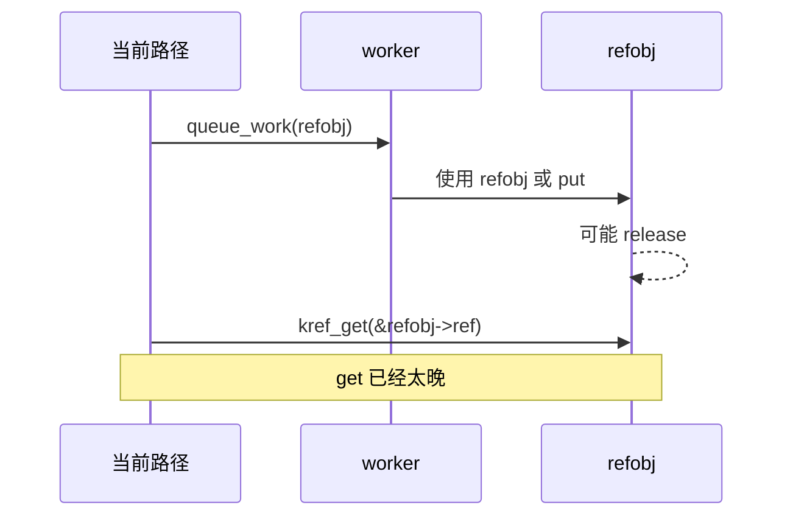
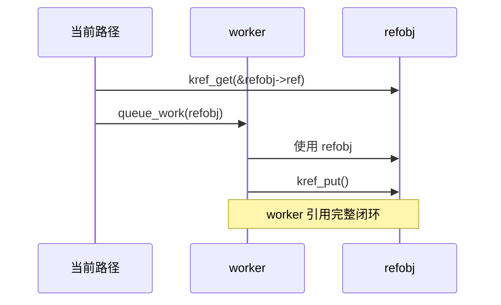

# 第 4 章：kref 三条核心规则

## 4.1 本章主线：三条规则是生命周期纪律

前 3 章已经建立了完整前提：

```text
kref 保护的是对象生命周期；
一个引用代表一个持有者；
最后一个 put 触发 release；
release 之后对象生命周期结束。
```

本章不再重新展开完整生命周期，而是把前面的模型压缩成写代码时必须遵守的三条规则：

```text
规则 1：非临时拷贝指针之前，必须先 get。
规则 2：使用完指针必须 put。
规则 3：没有现成有效引用时，lookup + get 必须被保护。
```

这三条规则不是“编码风格建议”，而是 `kref` 生命周期纪律。

只要违反其中任意一条，就可能出现：

```text
use-after-free
引用泄漏
提前 release
悬挂指针
对象复活
错误路径引用不平衡
```

所以本章的重点不是介绍更多 API，而是建立写代码时的判断标准：

```text
这个指针是不是要被长期保存？
当前路径是不是拥有引用？
新路径是不是需要自己的引用？
这个引用最后由谁 put？
lookup 时对象是否仍然有效？
```

------

## 4.2 规则 1：非临时拷贝指针之前，必须先 get

第一条规则：

```text
如果一个指针要被非临时保存、传递、排队或异步使用，
必须在交出去之前先 kref_get()。
```

这里的关键词是：

```text
之前
```

也就是：

```text
先 get，再把指针交出去。
```

错误写法：

```c
pass_to_thread(refobj);
kref_get(&refobj->ref);        /* 错：交出去之后再 get */
```

正确写法：

```c
kref_get(&refobj->ref);
pass_to_thread(refobj);
```

原因很直接：

```text
一旦指针被交给别的执行路径，
当前路径就不能假设对象仍然只受自己控制。
```

如果交出去之后再 get，中间就存在窗口：

```text
当前路径把 refobj 交出去
其他路径运行
其他路径 put 到 0
release 释放 refobj
当前路径才 kref_get
```

这时 `kref_get()` 已经是在可能被释放的对象上操作。

------

## 4.3 什么是“非临时拷贝指针”

不是所有函数传参都需要 `kref_get()`。

要区分两类情况。

### 4.3.1 临时借用

如果函数只是同步使用对象，不保存指针，不异步使用，不跨越当前调用者的引用生命周期，那么通常不需要额外 get。

例如：

```c
static void my_refobj_dump(struct my_refobj *refobj)
{
	pr_info("state=%d\n", refobj->state);
}

void caller(struct my_refobj *refobj)
{
	/* caller 已经持有 refobj 的有效引用 */

	my_refobj_dump(refobj);

	/* refobj 没有被保存到别处 */
}
```

这里 `my_refobj_dump()` 只是临时借用 `refobj`。

引用仍然属于调用者。

------

### 4.3.2 非临时持有

如果函数会把对象保存到当前调用栈之外，就属于非临时持有。

例如：

```c
static struct my_refobj *global_refobj;

void remember_refobj(struct my_refobj *refobj)
{
	global_refobj = refobj;        /* 非临时保存 */
}
```

这就不能只保存裸指针。

应该在保存前增加引用：

```c
void remember_refobj(struct my_refobj *refobj)
{
	kref_get(&refobj->ref);
	global_refobj = refobj;
}
```

后续清理 `global_refobj` 时必须释放这个引用：

```c
void forget_refobj(void)
{
	struct my_refobj *refobj = global_refobj;

	global_refobj = NULL;

	if (refobj)
		my_refobj_put(refobj);
}
```

判断是否需要 get，可以用下面的问题：

```text
这个指针是否会被保存到全局变量？
这个指针是否会放入队列？
这个指针是否会传给 workqueue？
这个指针是否会交给 timer？
这个指针是否会被另一个线程稍后使用？
这个指针是否会跨越当前函数调用栈？
```

如果答案是“是”，通常就需要为新的持有者准备引用。

------

## 4.4 为什么 before 很重要

错误顺序：

```c
queue_work(system_wq, &refobj->work);
kref_get(&refobj->ref);
```

正确顺序：

```c
kref_get(&refobj->ref);
queue_work(system_wq, &refobj->work);
```

区别不在于代码看起来前后差一行，而在于生命周期窗口完全不同。

错误顺序的窗口：

```text
T0 当前路径持有 refobj
T1 queue_work 把 refobj 暴露给 worker
T2 worker 或其他路径可能运行
T3 refobj 可能被 put 到 0 并 release
T4 当前路径才 kref_get
```

正确顺序的窗口：

```text
T0 当前路径持有 refobj
T1 kref_get 给 worker 准备引用
T2 queue_work 把 refobj 暴露给 worker
T3 worker 即使马上运行，也拥有自己的引用
```

可以用时序图表示：



正确模型：



所以第一条规则可以进一步压缩成：

```text
只要要把对象交给另一个长期持有者，就必须先让它拥有引用。
```

------

## 4.5 规则 1 的最小错误模型

错误：

```c
static void submit_work(struct my_refobj *refobj)
{
	queue_work(system_wq, &refobj->work);
	kref_get(&refobj->ref);
}
```

问题：

```text
对象先被异步路径看到；
引用后增加；
中间存在 use-after-free 窗口。
```

正确：

```c
static void submit_work(struct my_refobj *refobj)
{
	kref_get(&refobj->ref);
	queue_work(system_wq, &refobj->work);
}
```

worker 结束时释放：

```c
static void my_work_fn(struct work_struct *work)
{
	struct my_refobj *refobj;

	refobj = container_of(work, struct my_refobj, work);

	/* 使用 refobj */

	my_refobj_put(refobj);
}
```

这段代码里的引用闭环是：

```text
submit_work()：为 worker 增加引用；
my_work_fn()：worker 用完后释放引用。
```

只要出现 `kref_get()`，就要能找到对应的 `kref_put()`。

------

## 4.6 规则 2：使用完指针必须 put

第二条规则：

```text
每一个持有引用的路径，在不再使用对象时必须 kref_put()。
```

这条规则解决的是引用泄漏问题。

如果只 get 不 put，对象永远不能释放。

错误示例：

```c
static void submit_work(struct my_refobj *refobj)
{
	kref_get(&refobj->ref);
	queue_work(system_wq, &refobj->work);
}

static void my_work_fn(struct work_struct *work)
{
	struct my_refobj *refobj;

	refobj = container_of(work, struct my_refobj, work);

	/* 使用 refobj */

	/* 错：忘记 my_refobj_put(refobj) */
}
```

这里 worker 获得了引用，但没有释放。

结果是：

```text
refcount 永远少减一次；
最后一个 put 永远不会发生；
release 永远不会调用；
对象泄漏。
```

正确：

```c
static void my_work_fn(struct work_struct *work)
{
	struct my_refobj *refobj;

	refobj = container_of(work, struct my_refobj, work);

	/* 使用 refobj */

	my_refobj_put(refobj);
}
```

这条规则的本质是：

```text
引用是所有权；
拿了所有权，就必须归还。
```

------

## 4.7 put 不是“可选清理动作”

`kref_put()` 不是普通的清理辅助函数。

它表示：

```text
当前路径放弃一个生命周期引用。
```

所以不能随便少 put，也不能随便多 put。

### 少 put

```c
kref_get(&refobj->ref);

/* 使用 refobj */

return 0;        /* 错：引用泄漏 */
```

应该：

```c
kref_get(&refobj->ref);

/* 使用 refobj */

my_refobj_put(refobj);
return 0;
```

### 多 put

```c
my_refobj_put(refobj);
my_refobj_put(refobj);        /* 错：当前路径如果只持有一个引用，就不能 put 两次 */
```

多 put 的后果比少 put 更危险：

```text
引用计数提前归零；
release 提前执行；
其他合法持有者可能访问已释放对象。
```

所以规则不是：

```text
不用对象了就 put 一下。
```

而是：

```text
当前路径拥有几个引用，就只能 put 几次。
```

大多数路径只拥有一个引用，因此只能 put 一次。

------

## 4.8 错误路径也必须 put

第二条规则最容易在错误路径上被破坏。

错误示例：

```c
static int my_refobj_start(struct my_refobj *refobj)
{
	int ret;

	kref_get(&refobj->ref);

	ret = step1(refobj);
	if (ret)
		return ret;        /* 错：get 后失败路径没有 put */

	ret = step2(refobj);
	if (ret)
		return ret;        /* 错：同样泄漏 */

	my_refobj_put(refobj);
	return 0;
}
```

正确写法：

```c
static int my_refobj_start(struct my_refobj *refobj)
{
	int ret;

	kref_get(&refobj->ref);

	ret = step1(refobj);
	if (ret)
		goto err_put;

	ret = step2(refobj);
	if (ret)
		goto err_put;

	my_refobj_put(refobj);
	return 0;

err_put:
	my_refobj_put(refobj);
	return ret;
}
```

这类代码要按引用归属理解：

```text
kref_get() 成功以后，当前路径多持有一个引用；
只要这个引用没有成功转交给别人，当前路径就负责 put。
```

错误路径不能跳过生命周期收尾。

------

## 4.9 put 后不能继续访问

第二条规则还有一个直接边界：

```text
put 之后，当前路径不能再使用这个引用访问对象。
```

错误示例：

```c
my_refobj_put(refobj);

refobj->state = 0;          /* 错：refobj 可能已经释放 */
```

即使 `kref_put()` 没有触发 release，也不能把它当成继续访问的依据。

错误示例：

```c
if (!kref_put(&refobj->ref, my_refobj_release)) {
	refobj->state = 0;      /* 错：当前路径已经放弃引用 */
}
```

`kref_put()` 返回 0 只能说明：

```text
本次 put 没有触发 release。
```

它不能说明：

```text
对象之后一定仍然存在；
当前路径仍然有资格访问对象。
```

如果 put 后还需要某些信息，应该在 put 前取出：

```c
int state = refobj->state;

my_refobj_put(refobj);

pr_info("state=%d\n", state);
```

这不是为了形式正确，而是为了明确生命周期边界：

```text
put 是当前引用的结束点。
```

------

## 4.10 规则 3：没有现成有效引用时，lookup + get 必须被保护

第三条规则：

```text
如果当前路径没有现成有效引用，
而是从 list/hash/xarray/idr 等容器中查找对象，
那么 lookup + get 必须被锁或 RCU 等机制保护。
```

错误模型：

```c
refobj = lookup_refobj(id);
kref_get(&refobj->ref);        /* 可能错 */
```

这里的问题不是 `kref_get()` 本身，而是：

```text
lookup 返回的 refobj 只是裸指针；
裸指针不代表对象仍然有效；
对象可能已经从容器删除并释放。
```

也就是说：

```text
kref_get() 的前提是 refobj 仍然有效；
lookup 本身必须提供这个前提。
```

------

## 4.11 裸指针、有效引用、临界区

第三条规则里有三个概念必须区分：

| 概念     | 含义                           | 是否足够安全访问对象     |
| -------- | ------------------------------ | ------------------------ |
| 裸指针   | 只是一个地址                   | 不一定                   |
| 有效引用 | 当前路径持有对象生命周期所有权 | 是，至少对象内存不会释放 |
| 临界区   | 锁/RCU 等保护下的查找区间      | 可以帮助取得有效引用     |

错误就在于把裸指针误当成有效引用。

例如：

```c
refobj = list_first_entry(&refobj_list, struct my_refobj, node);
```

这只说明：

```text
从链表节点算出了一个对象地址。
```

它不自动说明：

```text
当前路径已经拥有 refobj 的引用。
```

所以 lookup 场景的正确目标是：

```text
在对象仍然有效的临界区内，把裸指针转换成有效引用。
```

------

## 4.12 mutex/list lookup 的最小模型

以链表为例：

```c
static LIST_HEAD(refobj_list);
static DEFINE_MUTEX(refobj_list_lock);
```

对象：

```c
struct my_refobj {
	struct kref ref;
	struct list_head node;
	int id;
};
```

一个最小查找模型：

```c
static struct my_refobj *my_refobj_lookup_get(int id)
{
	struct my_refobj *refobj;

	mutex_lock(&refobj_list_lock);

	list_for_each_entry(refobj, &refobj_list, node) {
		if (refobj->id == id) {
			kref_get(&refobj->ref);
			mutex_unlock(&refobj_list_lock);
			return refobj;
		}
	}

	mutex_unlock(&refobj_list_lock);
	return NULL;
}
```

这里关键不是“用了 mutex 所以万事大吉”。

关键是：

```text
在 refobj_list_lock 保护下，对象不会一边被查到，一边被释放；
因此可以在临界区内完成 kref_get()。
```

调用者拿到返回值后，就拥有一个引用：

```c
refobj = my_refobj_lookup_get(id);
if (!refobj)
	return -ENOENT;

/* 使用 refobj */

my_refobj_put(refobj);
```

这就是 lookup + get 的闭环。

------

## 4.13 为什么不能查出来后再加锁

错误写法：

```c
refobj = lookup_refobj_without_lock(id);

mutex_lock(&refobj_list_lock);
kref_get(&refobj->ref);
mutex_unlock(&refobj_list_lock);
```

问题是：

```text
锁加得太晚。
```

在 `lookup_refobj_without_lock()` 返回之后，到 `mutex_lock()` 之前，对象可能已经被删除和释放。

所以真正需要被保护的是整个过程：

```text
查找对象
确认对象仍然可获得
增加引用
```

而不是只保护 `kref_get()` 这一行。

正确边界应该是：

```c
mutex_lock(&refobj_list_lock);

refobj = lookup_under_lock(id);
if (refobj)
	kref_get(&refobj->ref);

mutex_unlock(&refobj_list_lock);
```

也就是：

```text
lookup 和 get 必须在同一个有效性保护范围内完成。
```

------

## 4.14 kref_get_unless_zero 不能单独解决 lookup

后面第 8 章会专门讲 `kref_get_unless_zero()`，本章只给最小边界。

它的语义是：

```text
只有引用计数非 0 时才增加引用；
如果已经是 0，则失败。
```

看起来可以写成：

```c
refobj = lookup_refobj(id);
if (!kref_get_unless_zero(&refobj->ref))
	refobj = NULL;
```

但这仍然可能是错的。

原因是：

```text
kref_get_unless_zero() 只能判断 refcount 是否非 0；
它不能保证 refobj 指针本身还指向有效内存。
```

如果 `lookup_refobj(id)` 没有锁或 RCU 保护，`refobj` 可能已经是悬挂指针。

这时访问：

```c
&refobj->ref
```

本身就已经不安全。

所以第三条规则不是：

```text
lookup 后用 get_unless_zero 就行。
```

而是：

```text
lookup + get 或 lookup + get_unless_zero 必须处在有效保护下。
```

`kref_get_unless_zero()` 解决的是“对象正在归零或已经归零时不要再取得引用”。

它不解决：

```text
refobj 指针是不是悬挂指针。
```

------

## 4.15 三条规则和状态机的对应关系

第 3 章讲的是完整状态机。

本章三条规则可以看成状态机的代码化约束。

| 规则                    | 对应状态机问题             | 违反后果       |
| ----------------------- | -------------------------- | -------------- |
| 先 get 再交出去         | 所有权扩散必须先建立引用   | 异步路径 UAF   |
| 用完必须 put            | 所有权收敛必须完整         | 泄漏或提前释放 |
| lookup + get 必须被保护 | 从可见结构取得引用必须安全 | 悬挂指针、UAF  |

更具体地说：

```text
规则 1 管的是“新持有者如何获得引用”。
规则 2 管的是“旧持有者如何释放引用”。
规则 3 管的是“没有引用的人如何安全变成持有者”。
```

这三条刚好覆盖 `kref` 使用中最核心的三个动作：

```text
传递对象
释放对象
查找对象
```

------

## 4.16 三条规则的最小代码模板

### 4.16.1 传递给异步路径

```c
static int submit_refobj(struct my_refobj *refobj)
{
	kref_get(&refobj->ref);

	if (!queue_work(system_wq, &refobj->work)) {
		my_refobj_put(refobj);
		return -EBUSY;
	}

	return 0;
}
```

注意：

```text
先 get，再 queue；
如果 queue 失败，新引用必须 put。
```

------

### 4.16.2 使用完释放

```c
static void my_work_fn(struct work_struct *work)
{
	struct my_refobj *refobj;

	refobj = container_of(work, struct my_refobj, work);

	/* 使用 refobj */

	my_refobj_put(refobj);
}
```

注意：

```text
worker 持有的引用必须在 worker 结束时释放。
```

------

### 4.16.3 lookup 后取得引用

```c
static struct my_refobj *my_refobj_lookup_get(int id)
{
	struct my_refobj *refobj;

	mutex_lock(&refobj_list_lock);

	list_for_each_entry(refobj, &refobj_list, node) {
		if (refobj->id == id) {
			kref_get(&refobj->ref);
			mutex_unlock(&refobj_list_lock);
			return refobj;
		}
	}

	mutex_unlock(&refobj_list_lock);
	return NULL;
}
```

注意：

```text
lookup 和 get 在同一把锁保护下完成。
```

------

## 4.17 本章检查清单

写 `kref` 代码时，可以按下面清单检查。

### 规则 1 检查：交出去之前是否 get

```text
对象是否传给线程？
对象是否传给 workqueue？
对象是否传给 timer？
对象是否放入队列？
对象是否保存到全局变量？
对象是否跨越当前调用者生命周期？
```

如果是，检查：

```text
是否在交出去之前 kref_get？
失败路径是否 put 回新引用？
是否存在 handoff 语义？
handoff 是否有明确注释？
```

------

### 规则 2 检查：用完是否 put

```text
每个 kref_get 是否有对应 put？
kref_init 的初始引用是否最终 put？
错误路径是否 put？
worker/timer/callback 结束是否 put？
remove 路径是否释放管理者引用？
是否存在重复 put？
put 后是否继续访问对象？
```

------

### 规则 3 检查：lookup + get 是否被保护

```text
lookup 是否从 list/hash/xarray/idr 中拿对象？
拿到的是裸指针还是有效引用？
lookup 和 get 是否在同一个锁内？
如果使用 RCU，是否处在 rcu_read_lock() 内？
是否使用 kref_get_unless_zero() 并检查返回值？
get_unless_zero 前 refobj 指针本身是否仍然有效？
对象从容器删除和 release 的顺序是否明确？
```

------

## 4.18 三条规则的常见错误对应表

| 错误写法                              | 违反规则            | 典型后果                       |
| ------------------------------------- | ------------------- | ------------------------------ |
| `queue_work(refobj); kref_get(refobj);`     | 规则 1              | handoff 后再 get，可能 UAF     |
| `kref_get(); return ret;`             | 规则 2              | 错误路径引用泄漏               |
| `my_refobj_put(refobj); refobj->state = 1;`    | 规则 2              | put 后访问，可能 UAF           |
| `refobj = lookup(); kref_get(refobj);`      | 规则 3              | 裸 lookup 后 get，可能悬挂指针 |
| `kref_get_unless_zero()` 不检查返回值 | 规则 3              | 可能使用未取得引用的对象       |
| `kref_init()` 重新初始化旧对象        | 规则 2/生命周期破坏 | 覆盖已有引用关系               |
| 当前路径只持有一个引用却 put 两次     | 规则 2              | 提前 release / underflow       |
| 保存到全局变量但不 get                | 规则 1              | 后续全局指针可能悬挂           |

------

## 4.19 本章不展开的内容

为了避免重复，本章只保留规则手册层面的最小示例。

下面内容后续单独展开：

```text
复杂 handoff 成功/失败语义     -> 第 7 章
workqueue/timer/callback 模型  -> 第 7 章
kref_get_unless_zero 细节      -> 第 8 章
list/hash/xarray/idr lookup    -> 第 8 章
kref_put_mutex/kref_put_lock   -> 第 9 章
RCU lookup + kfree_rcu         -> 第 10 章
复杂 release 模式             -> 第 6 章
```

本章只要求先掌握一件事：

```text
所有 kref 代码都可以先用三条规则过一遍。
```

------

## 4.20 本章小结

本章把前 3 章的生命周期模型压缩成三条核心规则。

### 规则 1

```text
非临时拷贝指针之前，必须先 get。
```

它解决的是：

```text
新的长期持有者如何安全获得引用。
```

关键点：

```text
before 很重要；
不能交出去以后再 get；
失败路径要回滚新引用。
```

------

### 规则 2

```text
使用完指针必须 put。
```

它解决的是：

```text
已有持有者如何释放引用。
```

关键点：

```text
每个 get 都要有 put；
初始引用也要有 put；
错误路径也要 put；
put 后不能继续访问对象。
```

------

### 规则 3

```text
没有现成有效引用时，lookup + get 必须被保护。
```

它解决的是：

```text
没有引用的人如何从容器中安全取得引用。
```

关键点：

```text
裸指针不是引用；
lookup 和 get 必须在同一个保护范围内完成；
kref_get_unless_zero 不能单独证明 refobj 指针有效。
```

最终可以压缩成一句话：

```text
先取得引用，再长期使用；用完释放引用；没有引用时，必须在保护下取得引用。
```

这三条规则就是后面所有 API、handoff、lookup、锁、RCU 章节的基础。