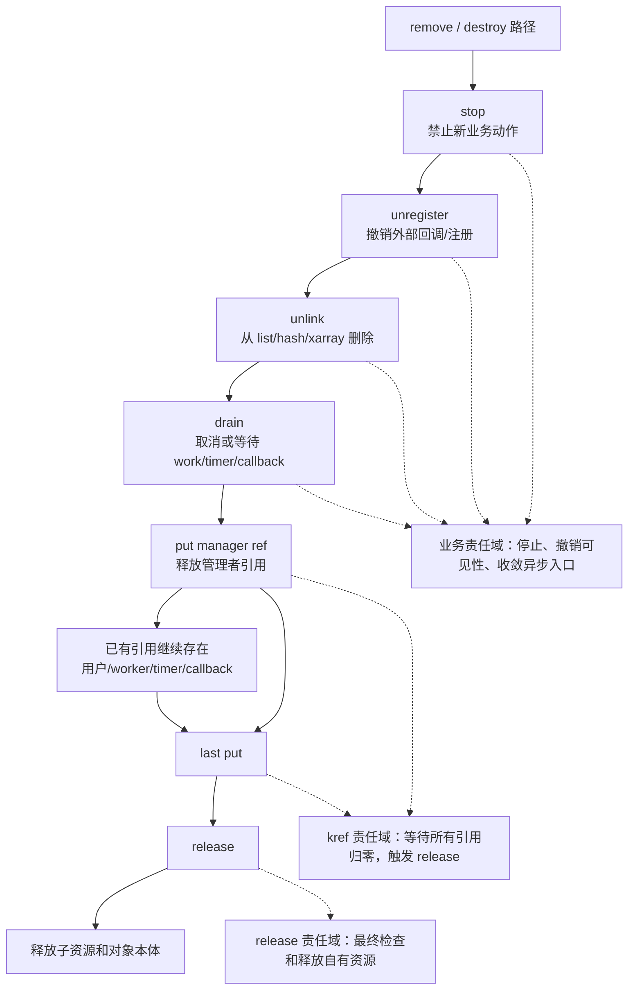

# 第 6 章：release 回调与复杂销毁模式

## 6.1 本章主线

前面已经讲过：

```text
release 是最后一个引用释放后的对象销毁点。
```

本章不再停留在最小模板：

```c
static void my_refobj_release(struct kref *ref)
{
	struct my_refobj *refobj = container_of(ref, struct my_refobj, ref);

	kfree(refobj);
}
```

先把适用范围说清楚：

```text
本章讨论的是裸 kref 或子系统内部私有对象的 release。
示例里的 my_refobj 不是 struct device、struct class、struct bus_type。
```

如果讨论 driver core，就不能把这里的 `my_refobj_release()` 直接套到 `device_release()`、`class_release()` 或 bus/class/device 的生命周期上。

这两层要分开：

```text
裸 kref 私有对象：
    struct my_refobj 内嵌 struct kref
    my_refobj_put() 调 kref_put()
    最后一个 put 调 my_refobj_release()

driver core 框架对象：
    struct device 内嵌 struct kobject
    get_device()/put_device() 管 device 引用
    kobject 归零后进入 device model 的 release 分发
    device_release()/class/type release 再决定最终销毁路径
```

所以本章的 `release` 主线是“自定义引用对象如何收尾”，不是“device/class/bus 这类框架对象如何释放”。后者应该放到 `kref、refcount_t、kobject` 边界章节里单独讲。

真实工程里，`release()` 往往不是简单 `kfree()`。

它可能要处理：

```text
子资源释放
链表脱链检查
workqueue 收尾
timer 收尾
callback 断开
RCU 延迟释放
锁状态约束
睡眠上下文限制
调试检查
```

所以本章主线是：

```text
release 不是“释放内存函数”，而是对象生命周期的最终收口点。
```

它回答的问题不是：

```text
怎么 kfree？
```

而是：

```text
对象最后一个引用消失时，还有哪些资源必须被安全收尾？
```


------

## 6.2 先看完整模板：release 只是最后一站

复杂对象销毁不能从 release 开始理解。

更合理的入口是先看完整流程：

```text
业务停止
  -> 撤销外部注册
  -> 从全局容器脱链
  -> 收敛 work/timer/callback
  -> 释放管理者引用
  -> 等已有引用自然 put
  -> 最后一个 put 触发 release
  -> release 释放对象拥有的剩余资源和对象本体
```

也就是说，release 不是“把所有清理工作都塞进去”的地方。

它更像是：

```text
对象已经不可见；
异步路径已经有明确引用归属；
已有持有者都已经退出；
最后剩下的对象自有资源在这里收尾。
```

一个推荐模板可以先写成这样：

```c
struct my_refobj {
	struct kref ref;
	struct mutex lock;
	struct list_head node;
	struct work_struct work;
	struct timer_list timer;

	char *name;
	void *buffer;

	bool registered;
	bool stopping;
};

static void my_refobj_release(struct kref *ref)
{
	struct my_refobj *refobj = container_of(ref, struct my_refobj, ref);

	/* release 只验证前面阶段已经完成，不重新做业务撤销 */
	WARN_ON(refobj->registered);
	WARN_ON(!list_empty(&refobj->node));
	WARN_ON(timer_pending(&refobj->timer));

	kfree(refobj->buffer);
	kfree(refobj->name);
	kfree(refobj);
}

static void my_refobj_destroy(struct my_refobj *refobj)
{
	mutex_lock(&refobj->lock);
	refobj->stopping = true;
	mutex_unlock(&refobj->lock);

	if (refobj->registered) {
		unregister_callback(refobj);
		refobj->registered = false;
	}

	del_timer_sync(&refobj->timer);
	cancel_work_sync(&refobj->work);

	mutex_lock(&refobj_list_lock);
	if (!list_empty(&refobj->node))
		list_del_init(&refobj->node);
	mutex_unlock(&refobj_list_lock);

	/* 释放管理者引用。真正释放可能在这里，也可能等其他持有者 put。 */
	my_refobj_put(refobj);
}
```

这段模板的重点不是每一行都适用于所有对象，而是职责边界：

```text
my_refobj_destroy/remove 路径负责：停止、撤销、脱链、收敛异步路径、释放管理者引用。
my_refobj_release 路径负责：最后检查、释放对象拥有的剩余资源、释放对象本体。
```

可以画成：



后面的小节所有“错误”都要放回这个模板里理解：

```text
不是为了讲错误而讲错误，
而是某个清理动作被放错了阶段，或者责任域没有定义清楚。
```

------

## 6.3 release 的责任域和非责任域

进入 release 时，最理想的状态是：

```text
对象已经不再被新路径找到；
对象不再注册给外部子系统；
work/timer/callback 要么已经停止，要么它们自己的引用已经闭环；
最后一个引用已经消失；
release 只需要释放对象拥有的剩余资源。
```

release 的责任域：

```text
1. 用 container_of 找回外层对象。
2. 检查对象已经脱链、注销、停止。
3. 释放对象拥有的内存、引用、子资源。
4. 选择 kfree、kmem_cache_free 或 kfree_rcu 等最终释放方式。
```

release 通常不应该承担：

```text
1. 决定设备是否还能访问。
2. 执行主要 stop/remove 状态机。
3. 重新从外部子系统 unregister 一切东西。
4. 等待复杂异步路径，除非上下文和引用关系已经严格证明。
5. 重新发布对象或重新初始化 kref。
```

这不是说 release 永远不能做 unregister、unlink、cancel 之类动作。

而是说：

```text
如果 release 要做这些动作，就必须同时证明上下文、锁、引用归属和外部子系统语义都成立。
```

裸 kref 私有对象更推荐把这些动作前移到 destroy/remove 阶段，让 release 保持短小、确定、可审查。

------

## 6.4 release 的触发条件和基本释放范围

这一组小节只回答 release 最基础的问题：它什么时候被调用，以及它到底释放哪些资源。

### 6.4.1 release 的触发条件

`release()` 只在一种情况下被调用：

```text
某次 kref_put() 让引用计数从 1 变成 0。
```

也就是说：

```text
进入 release 时，已经没有任何合法持有者。
```

这里的“没有合法持有者”有两个含义：

```text
1. 不应该再有路径持有引用。
2. 不应该再有路径通过裸指针继续访问对象。
```

所以 release 的定位非常明确：

```text
release 是生命周期终点，不是普通清理阶段。
```

进入 release 后，对象不应该再被：

```text
重新 get
重新加入全局容器
重新投递给 workqueue
重新注册给其他子系统
重新暴露给 lookup 路径
```

这些都属于“复活对象”的错误倾向。


### 6.4.2 release 负责释放什么

最简单的对象只需要释放本体：

```c
kfree(refobj);
```

但复杂对象通常还有子资源。

例如：

```c
struct my_refobj {
	struct kref ref;
	char *name;
	void *buffer;
	struct file *file;
	struct device *dev;
};
```

这里的 `dev` 只是 `my_refobj` 持有的另一个框架对象引用，不表示 `my_refobj_release()` 可以替代 `device_release()`。

release 可能需要：

```c
static void my_refobj_release(struct kref *ref)
{
	struct my_refobj *refobj = container_of(ref, struct my_refobj, ref);

	kfree(refobj->buffer);
	kfree(refobj->name);
	fput(refobj->file);
	put_device(refobj->dev);
	kfree(refobj);
}
```

这里要注意顺序：

```text
先释放对象拥有的子资源；
最后释放对象本体。
```

因为一旦执行：

```c
kfree(refobj);
```

后面就不能再访问：

```c
refobj->buffer
refobj->name
refobj->file
refobj->dev
```

所以 release 的基本顺序是：

```text
释放子资源
解除外部联系
执行调试检查
释放对象本体
```


### 6.4.3 release 只释放对象“拥有”的资源

release 不应该盲目释放所有字段指向的东西。

关键问题是：

```text
这个资源是否由当前对象拥有？
```

例如：

```c
struct my_refobj {
	struct kref ref;
	struct device *dev;
	u8 *rx_buf;
	const char *name;
};
```

这里每个字段的释放规则可能不同：

| 字段     | 可能语义                     | release 中是否释放     |
| -------- | ---------------------------- | ---------------------- |
| `rx_buf` | 对象分配并拥有               | 通常 `kfree(rx_buf)`   |
| `dev`    | 通过 `get_device()` 持有引用 | 通常 `put_device(dev)` |
| `name`   | 指向静态字符串               | 不能 `kfree(name)`     |
| `name`   | `kstrdup()` 分配             | 需要 `kfree(name)`     |

这里的 `put_device(dev)` 只是释放当前私有对象持有的 device 引用。至于 `struct device` 最终如何释放，仍然由 driver core 的 `put_device()`、`kobject` 和 device model release 分发规则决定。

所以 release 里不能机械写：

```c
kfree(refobj->name);
```

必须先确认：

```text
name 是对象分配的吗？
name 是静态字符串吗？
name 是别的对象管理的吗？
name 是否需要 put，而不是 kfree？
```

release 的职责是释放对象拥有的生命周期资源，而不是释放对象能看到的一切指针。

------

## 6.5 外部可见性：脱链应该由谁负责

对象如果还能从全局结构或外部子系统找到，release 就很容易变成悬挂指针制造点。这里先讲可见性撤销的责任边界。

### 6.5.1 release 前必须明确对象是否已经脱链

如果对象挂在全局结构里，例如：

```c
struct my_refobj {
	struct kref ref;
	struct list_head node;
	int id;
};
```

那么 release 时必须回答：

```text
对象是否还挂在 list/hash/xarray/idr 中？
```

如果对象已经释放，但全局结构里还留着指针，就会产生悬挂指针。

错误模型：

```c
static void my_refobj_release(struct kref *ref)
{
	struct my_refobj *refobj = container_of(ref, struct my_refobj, ref);

	kfree(refobj);
}
```

如果 `refobj->node` 还在链表里，那么链表中留下的节点就指向已经释放的内存。

后续 lookup 可能拿到一个已经释放的对象。

这类 bug 非常危险。


### 6.5.2 release 前脱链模型

一种常见设计是：

```text
release 之前必须已经从全局结构删除。
```

release 里只做检查：

```c
static void my_refobj_release(struct kref *ref)
{
	struct my_refobj *refobj = container_of(ref, struct my_refobj, ref);

	WARN_ON(!list_empty(&refobj->node));

	kfree(refobj);
}
```

删除路径负责脱链：

```c
static void my_refobj_remove(struct my_refobj *refobj)
{
	mutex_lock(&refobj_list_lock);
	list_del_init(&refobj->node);
	mutex_unlock(&refobj_list_lock);

	my_refobj_put(refobj);
}
```

这个模型的优点是：

```text
全局可见性撤销和最终释放分开；
release 只验证对象已经不可被 lookup；
代码边界清晰。
```

这里的生命周期顺序是：

```text
从全局结构删除
禁止新 lookup
释放管理者引用
等待已有引用自然归零
最后 release
```

这也是很多对象管理场景的常见模型。


### 6.5.3 release 内脱链模型

另一种设计是：

```text
最后一个 put 时，在 release 里完成脱链。
```

例如：

```c
static void my_refobj_release(struct kref *ref)
{
	struct my_refobj *refobj = container_of(ref, struct my_refobj, ref);

	list_del_init(&refobj->node);
	kfree(refobj);
}
```

这个模型必须满足额外条件：

```text
release 执行时必须持有保护 list 的锁；
不会有并发 lookup 正在无保护遍历；
不会出现重复 list_del；
锁状态必须明确。
```

所以它通常要配合：

```c
kref_put_mutex()
kref_put_lock()
```

或者调用者在最后 put 前已经持锁。

这种模型难度更高，因为 release 不再只是释放资源，还参与集合关系修改。

本章只建立边界：

```text
release 可以脱链，但必须有锁语义保证。
```

具体模板放到第 9 章展开。

------

## 6.6 release 的执行上下文和锁语义

release 在哪里执行，取决于最后一个 put 发生在哪里。上下文不清楚，复杂 release 就没有安全基础。

### 6.6.1 release 能否睡眠取决于最后 put 上下文

release 是否能睡眠，取决于它被什么上下文调用。

普通 `kref_put()` 可能出现在多种上下文：

```text
进程上下文
workqueue 上下文
中断上下文
软中断上下文
spinlock 持有状态
mutex 持有状态
RCU 读侧或更新侧路径
```

如果 release 里调用可能睡眠的函数，例如：

```c
cancel_work_sync(&refobj->work);
mutex_lock(&refobj->lock);
flush_workqueue(wq);
wait_for_completion(&refobj->done);
msleep(10);
```

那就必须保证：

```text
最后一个 kref_put() 不会发生在不能睡眠的上下文。
```

否则就可能出现：

```text
sleeping function called from invalid context
死锁
调度错误
锁依赖告警
```

所以 release 设计前必须先问：

```text
最后一个 put 可能在哪里发生？
```

这比 release 代码本身更重要。


### 6.6.2 普通 kref_put 下的 release 上下文

普通 `kref_put()` 不改变当前上下文。

也就是说：

```c
kref_put(&refobj->ref, my_refobj_release);
```

如果最后引用在进程上下文释放，那么 release 在进程上下文执行。

如果最后引用在中断上下文释放，那么 release 就在中断上下文执行。

如果最后引用在 spinlock 持有期间释放，那么 release 就在 spinlock 持有期间执行。

所以普通 `kref_put()` 的 release 不能假设：

```text
一定可以睡眠
一定没有锁持有
一定在进程上下文
一定可以调用复杂清理函数
```

release 是否能做复杂清理，取决于对象设计是否保证：

```text
最后一个 put 只会在允许该 release 行为的上下文发生。
```

如果不能保证，就要改变设计。

常见做法包括：

```text
把最后 put 限制在进程上下文
把复杂释放转移到 workqueue
把内存释放改成 RCU 延迟释放
避免 release 中调用可能睡眠的函数
```


### 6.6.3 release 在持 mutex 状态下执行

如果使用：

```c
kref_put_mutex(&refobj->ref, my_refobj_release, &refobj_lock);
```

那么最后一个 put 时，release 会在持有 `refobj_lock` 的状态下执行。

这意味着 release 必须知道：

```text
进入 release 时 mutex 已经被持有。
```

所以 release 里不能再无脑：

```c
mutex_lock(&refobj_lock);
```

否则可能死锁。

示例：

```c
static void my_refobj_release_locked(struct kref *ref)
{
	struct my_refobj *refobj = container_of(ref, struct my_refobj, ref);

	/* 这里假设 refobj_list_lock 已经持有 */
	list_del_init(&refobj->node);

	mutex_unlock(&refobj_list_lock);

	kfree(refobj);
}
```

这种模式非常敏感。

它有几个风险：

```text
release 负责解锁，调用点不直观；
锁平衡容易被后续维护破坏；
release 名字必须体现 locked 语义；
release 中不能随便调用会再次拿同一把锁的函数。
```

所以工程上建议：

```text
如果 release 依赖锁状态，函数名和注释必须明确。
```

例如：

```c
/*
 * Called with refobj_list_lock held.
 * Drops refobj_list_lock before returning.
 */
static void my_refobj_release_locked(struct kref *ref)
{
	...
}
```


### 6.6.4 release 在持 spinlock 状态下执行

如果使用：

```c
kref_put_lock(&refobj->ref, my_refobj_release, &refobj_lock);
```

最后一个 put 时，release 会在持有 spinlock 的状态下执行。

这比 mutex 版本更严格。

release 中不能调用可能睡眠的函数。

错误示例：

```c
static void my_refobj_release(struct kref *ref)
{
	struct my_refobj *refobj = container_of(ref, struct my_refobj, ref);

	cancel_work_sync(&refobj->work);   /* 错：可能睡眠 */
	kfree(refobj);
}
```

如果这个 release 被 `kref_put_lock()` 调用，就可能出问题。

spinlock 下 release 更适合做短小动作：

```text
从链表删除
标记状态
解除简单集合关系
释放不睡眠的资源
```

如果销毁流程复杂，常见做法是：

```text
持 spinlock 完成脱链；
释放 spinlock；
再在安全上下文中释放复杂资源。
```

或者把对象放到延迟释放队列，由 workqueue 执行真正释放。

------

## 6.7 异步路径：work、timer、callback 的引用闭环

异步路径的问题通常不是 release 代码本身，而是 work/timer/callback 是否拥有引用、谁负责取消、谁负责 put 没有定义清楚。

### 6.7.1 release 和 workqueue 的收尾关系

如果对象里有 `work_struct`：

```c
struct my_refobj {
	struct kref ref;
	struct work_struct work;
};
```

必须明确：

```text
work 是否持有对象引用？
release 时 work 是否还可能运行？
release 是否需要 cancel_work_sync？
```

常见安全模型之一：

```text
投递 work 前 kref_get；
work 函数结束时 kref_put；
release 不需要 cancel_work_sync 保护 work 对对象的访问。
```

示例：

```c
static int my_refobj_queue_work(struct my_refobj *refobj)
{
	kref_get(&refobj->ref);

	if (!queue_work(system_wq, &refobj->work)) {
		my_refobj_put(refobj);
		return -EBUSY;
	}

	return 0;
}

static void my_refobj_workfn(struct work_struct *work)
{
	struct my_refobj *refobj = container_of(work, struct my_refobj, work);

	/* 使用 refobj */

	my_refobj_put(refobj);
}
```

这个模型里，work 自己持有引用。

所以只要 work 还没结束，对象就不会 release。


### 6.7.2 release 中 cancel_work_sync 的风险

有些设计会在 release 里取消 work：

```c
static void my_refobj_release(struct kref *ref)
{
	struct my_refobj *refobj = container_of(ref, struct my_refobj, ref);

	cancel_work_sync(&refobj->work);
	kfree(refobj);
}
```

这要求非常谨慎。

原因有两个。

第一，`cancel_work_sync()` 可能睡眠。

所以 release 必须保证在可睡眠上下文执行。

第二，如果 work 本身持有引用，并且 work 结束时才 put，那么 release 一般不会在 work 还持有引用时发生。

也就是说：

```text
如果 work 持有引用，release 发生时 work 理论上已经不再持有引用。
```

这时 release 里再 `cancel_work_sync()` 的意义需要重新审视。

更危险的是互相等待模型：

```text
work 等待某个引用释放
release 等待 work 结束
```

可能构成死锁。

所以 work 模型要二选一并写清楚：

```text
模型 A：work 持有引用，work 完成后 put，release 不负责等待 work。
模型 B：对象 owner 管理 work 生命周期，release 前已经保证 work 不再运行。
```

不要让 release 和 work 引用关系相互纠缠。


### 6.7.3 release 和 timer 的收尾关系

timer 比 work 更容易出错，因为 timer 回调可能在软中断上下文运行。

如果对象里有 timer：

```c
struct my_refobj {
	struct kref ref;
	struct timer_list timer;
};
```

必须明确：

```text
timer 回调是否持有引用？
timer 删除发生在哪个阶段？
release 能不能调用 del_timer_sync？
最后 put 可能是否发生在 timer 回调中？
```

一种常见模型：

```text
启动 timer 前增加引用；
timer 回调执行完释放引用；
取消 timer 成功时释放 timer 引用。
```

示例模型：

```c
static void my_refobj_start_timer(struct my_refobj *refobj)
{
	kref_get(&refobj->ref);
	mod_timer(&refobj->timer, jiffies + HZ);
}
```

timer 回调：

```c
static void my_timer_fn(struct timer_list *t)
{
	struct my_refobj *refobj = from_timer(refobj, t, timer);

	/* 使用 refobj */

	my_refobj_put(refobj);
}
```

取消路径必须处理：

```text
如果 timer 被成功取消，那么 timer 回调不会执行；
因此原本给 timer 的引用要由取消路径 put。
```

示意：

```c
static void my_refobj_cancel_timer(struct my_refobj *refobj)
{
	if (del_timer_sync(&refobj->timer))
		my_refobj_put(refobj);
}
```

这里的核心是：

```text
timer 引用必须有唯一释放者：
要么 timer 回调释放；
要么取消成功路径释放。
```

否则会少 put 或多 put。


### 6.7.4 release 不应该负责模糊的 timer 语义

错误倾向：

```c
static void my_refobj_release(struct kref *ref)
{
	struct my_refobj *refobj = container_of(ref, struct my_refobj, ref);

	del_timer_sync(&refobj->timer);
	kfree(refobj);
}
```

这不是绝对错误，但很容易掩盖生命周期不清晰。

你必须回答：

```text
timer 启动时是否 get？
timer 回调是否 put？
release 发生时 timer 是否可能还持有引用？
del_timer_sync 如果返回 1，是否需要 put timer 引用？
如果 release 在 timer 回调中触发，会不会 del_timer_sync 自己等待自己？
```

如果这些问题答不清楚，就不应该把 timer 收尾简单塞进 release。

更清晰的设计是：

```text
timer 的引用归属在启动、取消、回调路径中闭环；
release 只检查 timer 已经不再活动，或只释放对象本体。
```


### 6.7.5 release 和 callback 的关系

对象经常注册给某个子系统回调：

```c
register_callback(refobj, my_callback);
```

这时必须定义：

```text
子系统是否持有 refobj 引用？
callback 执行期间对象如何保证不被释放？
unregister_callback 是否等待正在运行的 callback 结束？
```

一种安全模型：

```text
注册前 kref_get，引用属于 callback 注册关系；
unregister 成功后 kref_put；
callback 执行期间由注册关系保证对象存在。
```

示例：

```c
static int my_refobj_register(struct my_refobj *refobj)
{
	int ret;

	kref_get(&refobj->ref);

	ret = register_callback(refobj, my_callback);
	if (ret) {
		my_refobj_put(refobj);
		return ret;
	}

	return 0;
}

static void my_refobj_unregister(struct my_refobj *refobj)
{
	unregister_callback(refobj);
	my_refobj_put(refobj);
}
```

这里必须确认：

```text
unregister_callback 返回后，不会再有新的 callback 进入；
正在运行的 callback 是否已经退出，也必须由子系统语义保证。
```

如果 unregister 只是不再新增 callback，但不等待已有 callback，那么还需要额外同步机制。


### 6.7.6 release 不能替代 unregister

不要把 unregister 全部推到 release 里。

错误倾向：

```c
static void my_refobj_release(struct kref *ref)
{
	struct my_refobj *refobj = container_of(ref, struct my_refobj, ref);

	unregister_callback(refobj);
	kfree(refobj);
}
```

这类代码可能有问题。

因为 release 发生时已经没有合法引用了。

但 callback 注册关系本身通常就应该是一个引用来源。

如果对象还注册在外部子系统中，说明外部子系统可能还能回调它。

这时引用计数怎么能已经归零？

所以更合理的模型通常是：

```text
unregister 阶段撤销外部可见性；
unregister 释放注册关系引用；
最后一个 put 才进入 release。
```

也就是：

```text
release 不负责让对象不可见；
release 只处理对象已经不可见之后的最终销毁。
```

当然某些内核子系统有自己的特殊规则，但通用原则是：

```text
外部注册关系应该在 release 前明确撤销。
```

------

## 6.8 RCU 边界：生命周期结束不等于内存立刻回收

RCU 场景下，kref 生命周期可以结束，但对象内存可能还要撑过 grace period。

### 6.8.1 release 和 RCU 的边界

如果对象可以被 RCU 读侧看到，那么 release 里不能简单：

```c
kfree(refobj);
```

因为 RCU 读侧可能仍然持有旧裸指针。

典型模型是：

```text
更新侧先从 RCU 可见结构中删除对象；
禁止新读者找到它；
已有 RCU 读者可能仍在临界区中；
等 grace period 后才能释放内存。
```

所以 release 里可能需要：

```c
kfree_rcu(refobj, rcu);
```

而不是：

```c
kfree(refobj);
```

示例结构：

```c
struct my_refobj {
	struct kref ref;
	struct rcu_head rcu;
	struct hlist_node node;
};
```

release：

```c
static void my_refobj_release(struct kref *ref)
{
	struct my_refobj *refobj = container_of(ref, struct my_refobj, ref);

	kfree_rcu(refobj, rcu);
}
```

这里含义是：

```text
kref 生命周期已经结束；
但对象内存要等 RCU grace period 后再真正释放。
```


### 6.8.2 kref 归零和内存真正释放不是永远同一时刻

普通裸 kref 对象：

```text
last put -> release -> kfree -> 内存释放
```

RCU 对象：

```text
last put -> release -> kfree_rcu -> grace period 后内存释放
```

所以要区分两个概念：

```text
对象生命周期结束
对象内存真正归还
```

对于普通裸 kref 对象，这两者几乎连在一起。

对于 RCU 对象，它们中间隔着 grace period。

这不是说对象还能被使用。

对象生命周期已经结束。

只是为了保护 RCU 读侧旧指针，内存暂时不能回收。

所以 RCU 场景下要记住：

```text
refcount 到 0 后，对象不能再被 get 或重新发布；
但 struct kref 所在内存必须撑过 RCU grace period。
```

这个细节会在第 10 章专门展开。

------

## 6.9 release 的禁区、检查和状态边界

这一组内容不是孤立错误清单，而是在说明 release 作为生命周期终点时，哪些动作已经太晚，哪些检查适合留下。

### 6.9.1 release 里不能重新发布对象

release 中最危险的错误之一是试图“复活对象”。

错误示例：

```c
static void my_refobj_release(struct kref *ref)
{
	struct my_refobj *refobj = container_of(ref, struct my_refobj, ref);

	kref_init(&refobj->ref);
	list_add(&refobj->node, &refobj_list);
}
```

这是错误的生命周期模型。

进入 release 说明：

```text
refcount 已经归零；
对象已经没有合法持有者；
对象正在销毁。
```

此时不能再：

```text
重新初始化 kref
重新加入 list/hash/xarray
重新注册 callback
重新投递 work
重新暴露给 lookup
```

如果需要对象池复用，也应该把“对象生命周期结束”和“内存块复用”分开。

例如：

```text
kref release 结束对象生命周期；
对象池管理内存块；
重新分配时创建一个新的对象生命周期。
```

不能在 release 里把同一个对象原地复活。


### 6.9.2 release 中的调试检查

复杂对象的 release 里适合放一些调试检查。

例如：

```c
static void my_refobj_release(struct kref *ref)
{
	struct my_refobj *refobj = container_of(ref, struct my_refobj, ref);

	WARN_ON(!list_empty(&refobj->node));
	WARN_ON(timer_pending(&refobj->timer));
	WARN_ON(refobj->registered);
	WARN_ON(refobj->running);

	kfree(refobj->buf);
	kfree(refobj);
}
```

这些检查的意义是：

```text
release 发生时，对象应该已经完成撤销和收尾。
```

常见检查项：

```text
是否已经从链表删除
是否已经从 hash/xarray 删除
timer 是否还 pending
work 是否还可能运行
callback 是否已经 unregister
状态是否已经进入 stopped/dead
子资源是否仍然持有
```

这些 WARN 不是为了替代正确逻辑，而是为了尽早暴露生命周期协议错误。


### 6.9.3 release 和对象状态

有些对象会有状态字段：

```c
enum my_refobj_state {
	my_refobj_INIT,
	my_refobj_RUNNING,
	my_refobj_STOPPING,
	my_refobj_DEAD,
};

struct my_refobj {
	struct kref ref;
	struct mutex lock;
	enum my_refobj_state state;
};
```

release 可以检查状态是否已经进入终态：

```c
static void my_refobj_release(struct kref *ref)
{
	struct my_refobj *refobj = container_of(ref, struct my_refobj, ref);

	WARN_ON(refobj->state != my_refobj_DEAD);

	kfree(refobj);
}
```

但是 release 不应该依赖复杂状态迁移。

例如不要把主要 stop 流程放进 release：

```c
static void my_refobj_release(struct kref *ref)
{
	struct my_refobj *refobj = container_of(ref, struct my_refobj, ref);

	my_refobj_stop_hardware(refobj);       /* 可能太晚，也可能上下文不对 */
	kfree(refobj);
}
```

更清晰的模型是：

```text
remove/stop 路径负责让对象停止工作；
release 只验证对象已经停止，并释放内存和剩余资源。
```

因为 release 发生的时机取决于最后一个引用，不一定是适合停硬件、关中断、等待线程的时机。


### 6.9.4 release 不应承担过多业务逻辑

release 的职责应该尽量收敛：

```text
释放对象拥有的资源；
执行最终一致性检查；
释放对象内存。
```

不建议在 release 里做大量业务动作，例如：

```text
重新配置硬件
发送复杂消息
等待远端响应
启动新任务
重新注册对象
执行复杂状态机迁移
```

原因是：

```text
release 的触发点由最后一个 put 决定；
最后一个 put 可能出现在你不期望的上下文；
release 越复杂，越难保证上下文、锁和错误路径正确。
```

更好的分层是：

```text
stop/remove 阶段处理业务停止；
unregister/unlink 阶段撤销外部可见性；
drain 阶段等待异步路径退出；
release 阶段做最终资源释放。
```

------

## 6.10 推荐销毁阶段和完整示例

回到本章开头的完整模板：复杂对象应该把销毁拆成阶段，而不是把所有动作塞进 release。

### 6.10.1 复杂对象销毁的推荐阶段

对于复杂对象，推荐把销毁拆成多个阶段，而不是全塞进 release。

典型阶段：

```text
1. stop：阻止对象继续产生新动作。
2. unregister：从外部子系统撤销注册。
3. unlink：从 list/hash/xarray 等全局结构删除。
4. drain：等待或取消 work/timer/callback。
5. put：释放管理者引用。
6. release：最后一个引用归零后释放对象资源。
```

示意流程：

```text
my_refobj_destroy()
   |
   +-- 设置 stopping 状态
   +-- unregister callback
   +-- del_timer_sync / cancel_work_sync
   +-- 从全局结构 unlink
   +-- my_refobj_put(manager ref)
          |
          +-- 若还有用户引用：等待后续 put
          |
          +-- 若最后引用：release
```

这个模型的优点是：

```text
对象先不可见；
异步路径先收敛；
已有引用自然退出；
最后 release 只做最终释放。
```


### 6.10.2 一个复杂 release 示例

下面给一个相对合理的复杂对象模型。

对象：

```c
struct my_refobj {
	struct kref ref;
	struct mutex lock;
	struct list_head node;

	char *name;
	void *buffer;

	bool registered;
	bool stopping;
};
```

销毁前撤销：

```c
static void my_refobj_unregister(struct my_refobj *refobj)
{
	mutex_lock(&refobj->lock);
	refobj->stopping = true;
	mutex_unlock(&refobj->lock);

	if (refobj->registered) {
		unregister_callback(refobj);
		refobj->registered = false;
	}

	mutex_lock(&refobj_list_lock);
	if (!list_empty(&refobj->node))
		list_del_init(&refobj->node);
	mutex_unlock(&refobj_list_lock);

	my_refobj_put(refobj);
}
```

release：

```c
static void my_refobj_release(struct kref *ref)
{
	struct my_refobj *refobj = container_of(ref, struct my_refobj, ref);

	WARN_ON(refobj->registered);
	WARN_ON(!list_empty(&refobj->node));

	kfree(refobj->buffer);
	kfree(refobj->name);
	kfree(refobj);
}
```

这里 release 没有负责：

```text
unregister
unlink
stop
```

它只是检查这些动作已经完成，然后释放资源。

这是一种更容易维护的模型。


### 6.10.3 release 过度复杂的反例

反例：

```c
static void my_refobj_release(struct kref *ref)
{
	struct my_refobj *refobj = container_of(ref, struct my_refobj, ref);

	mutex_lock(&refobj->lock);
	refobj->stopping = true;
	mutex_unlock(&refobj->lock);

	unregister_callback(refobj);
	del_timer_sync(&refobj->timer);
	cancel_work_sync(&refobj->work);

	mutex_lock(&refobj_list_lock);
	list_del_init(&refobj->node);
	mutex_unlock(&refobj_list_lock);

	kfree(refobj->buffer);
	kfree(refobj);
}
```

这段代码看起来“完整清理”，但问题很多：

```text
release 可能在不能睡眠的上下文执行；
unregister_callback 是否可能等待未知；
del_timer_sync 是否可能和 timer 回调互等；
cancel_work_sync 是否可能和 work 引用互等；
release 中拿多个锁，锁顺序复杂；
对象到 release 时还 registered/linked，说明前面撤销阶段不清晰。
```

这种 release 不是绝对不能写，但必须有非常严格的上下文和锁证明。

普通工程中更建议把这些动作前移到 destroy/remove 阶段。

------

## 6.11 命名、注释和检查清单

最后把 release 的上下文要求写进函数名、注释和检查清单，方便以后代码审查。

### 6.11.1 release 函数命名建议

release 函数名最好表达对象类型和上下文。

普通 release：

```c
static void my_refobj_release(struct kref *ref)
```

如果 release 依赖锁状态：

```c
static void my_refobj_release_locked(struct kref *ref)
```

如果 release 使用 RCU 延迟释放：

```c
static void my_refobj_release_rcu(struct kref *ref)
```

如果 release 不能睡眠：

```c
static void my_refobj_release_atomic(struct kref *ref)
```

名字不是语义保证，但能提醒维护者：

```text
这个 release 不是普通 kfree 路径；
它有特殊上下文要求。
```

配合注释更清晰：

```c
/*
 * Called when the last reference is dropped.
 * The object must already be unlinked from refobj_list.
 * May sleep.
 */
static void my_refobj_release(struct kref *ref)
{
	...
}
```

或者：

```c
/*
 * Called with refobj_list_lock held.
 * Must drop refobj_list_lock before returning.
 * Must not sleep before dropping the lock.
 */
static void my_refobj_release_locked(struct kref *ref)
{
	...
}
```


### 6.11.2 release 注释应该写什么

复杂对象建议在 release 附近写清楚：

```text
1. release 是否可能睡眠。
2. release 是否要求对象已经脱链。
3. release 是否要求 callback 已经 unregister。
4. release 是否要求 work/timer 已经停止。
5. release 是否在持锁状态下调用。
6. release 是否释放锁。
7. release 最终是 kfree、kmem_cache_free 还是 kfree_rcu。
```

示例：

```c
/*
 * Lifetime:
 * - refobj_list holds the initial manager reference while linked.
 * - lookup obtains references under refobj_list_lock.
 * - work users take their own references before queue_work().
 * - remove unlinks the object, stops external callbacks, and drops
 *   the manager reference.
 *
 * Release:
 * - Called when the last reference is dropped.
 * - object must already be unlinked.
 * - No work or timer may still own a reference.
 * - May sleep.
 */
static void my_refobj_release(struct kref *ref)
{
	...
}
```

这类注释可以直接服务代码审查。


### 6.11.3 release 的最小检查清单

写 release 前，先回答下面问题。

#### 资源归属

```text
哪些字段由对象分配？
哪些字段只是借用？
哪些字段需要 put，而不是 kfree？
哪些字段是静态内存？
```

#### 外部可见性

```text
对象是否还在 list/hash/xarray/idr？
对象是否还注册在外部子系统？
对象是否还能被 callback 找到？
对象是否还能被 RCU 读侧看到？
```

#### 异步路径

```text
work 是否可能还在运行？
timer 是否可能还 pending？
callback 是否可能并发进入？
中断路径是否可能使用对象？
```

#### 上下文

```text
最后一个 put 可能发生在哪里？
release 是否可能睡眠？
release 是否可能在 spinlock 下执行？
release 是否会拿 mutex？
release 是否会调用等待函数？
```

#### 最终释放

```text
使用 kfree？
使用 kmem_cache_free？
使用 kfree_rcu？
是否需要先释放子资源？
是否有 WARN_ON 检查？
```

------

## 6.12 本章小结

本章讲的是复杂 release 模式。

核心结论：

```text
release 是对象生命周期的最终收口点，不只是 kfree 包装函数。
```

release 里可以做：

```text
释放对象拥有的子资源；
检查对象是否已经脱链；
检查 work/timer/callback 是否已经收敛；
释放对象本体；
必要时使用 kfree_rcu 延迟释放内存。
```

release 里不应该做：

```text
重新发布对象；
重新初始化 kref；
盲目 unregister 外部关系；
无证明地等待 work/timer；
在 spinlock 下调用可能睡眠的函数；
释放并不属于对象的资源；
承载复杂业务状态机。
```

复杂对象更推荐把销毁拆成阶段：

```text
stop
unregister
unlink
drain
put
release
```

责任域可以压缩成这张表：

| 阶段 | 主要责任 | 不应该混进去的事 |
| --- | --- | --- |
| destroy/remove | 停止业务、撤销注册、脱链、收敛异步入口 | 不应该假装对象已经没有旧引用 |
| kref 引用计数 | 等所有持有者 put，找到最后一个引用释放点 | 不负责设备状态机和字段互斥 |
| release | 最终检查、释放对象拥有的资源、释放对象本体 | 不应该重新发布对象或承担复杂业务停止流程 |

本章最关键的一句话：

```text
release 应该发生在对象已经不可见、异步路径已经有明确引用归属、最后一个引用已经消失之后。
```

下一章进入：

```text
第 7 章：handoff 所有权转移模型
```

重点会从 release 转向另一类高频错误：

```text
对象指针交给 workqueue、timer、队列、callback 后，
这个引用到底归谁？
成功路径谁 put？
失败路径谁 put？
handoff 后当前路径还能不能访问？
```
