# 第 14 章：源码阅读实验

## 14.1 本章导读：用实验验证生命周期边界

前面章节已经完成了：

```text
规则；
API；
release；
handoff；
lookup；
锁组合；
RCU 组合；
错误模式；
工程模板。
```

本章用实验把这些结论跑一遍。

本章不是为了写一个完整驱动，而是为了验证下面这些核心问题：

```text
1. kref_init() 为什么表示初始引用？
2. kref_get() 为什么必须在对象有效时调用？
3. kref_put() 为什么可能直接触发 release？
4. put 后为什么不能继续访问对象？
5. lookup + get 为什么必须被锁或 RCU 保护？
6. kref_get_unless_zero() 解决什么，不解决什么？
7. workqueue/timer 这种异步路径为什么必须持有引用？
8. release 中为什么不能随便 kfree RCU 对象？
9. KASAN/KCSAN/lockdep 能帮我们看到哪些错误？
```

本章建议使用测试内核、虚拟机或开发板实验环境，不要在生产环境做故意 UAF、漏 put、多 put 实验。

整体实验路线：

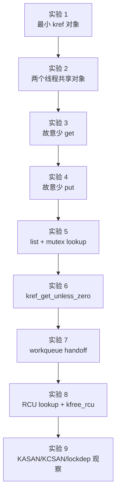

本章实验统一使用一个私有对象：

```c
struct my_obj {
	struct kref ref;
	int id;
};
```

然后逐步增加：

```text
list_head；
mutex；
spinlock；
work_struct；
rcu_head；
dying 状态；
debug 打印。
```

------

## 14.2 实验准备：建议的最小模块骨架

为了方便实验，可以先准备一个最小 kernel module 骨架。

```c
// kref_lab.c

#include <linux/module.h>
#include <linux/kernel.h>
#include <linux/init.h>
#include <linux/slab.h>
#include <linux/kref.h>
#include <linux/mutex.h>
#include <linux/list.h>
#include <linux/workqueue.h>
#include <linux/rcupdate.h>
#include <linux/delay.h>
#include <linux/kthread.h>
#include <linux/completion.h>

MODULE_LICENSE("GPL");
MODULE_AUTHOR("kref lab");
MODULE_DESCRIPTION("kref lifecycle experiment");
```

最小对象：

```c
struct my_obj {
	struct kref ref;
	int id;
};
```

release：

```c
static void my_obj_release(struct kref *ref)
{
	struct my_obj *obj = container_of(ref, struct my_obj, ref);

	pr_info("my_obj_release: obj=%p id=%d\n", obj, obj->id);

	kfree(obj);
}
```

get/put 包装：

```c
static struct my_obj *my_obj_get(struct my_obj *obj, const char *why)
{
	pr_info("GET obj=%p id=%d why=%s\n", obj, obj->id, why);

	kref_get(&obj->ref);
	return obj;
}

static void my_obj_put(struct my_obj *obj, const char *why)
{
	if (!obj)
		return;

	pr_info("PUT obj=%p id=%d why=%s\n", obj, obj->id, why);

	kref_put(&obj->ref, my_obj_release);
}
```

alloc：

```c
static struct my_obj *my_obj_alloc(int id)
{
	struct my_obj *obj;

	obj = kzalloc(sizeof(*obj), GFP_KERNEL);
	if (!obj)
		return NULL;

	kref_init(&obj->ref);
	obj->id = id;

	pr_info("ALLOC obj=%p id=%d ref=1\n", obj, obj->id);

	return obj;
}
```

模块入口可以先只跑一个实验：

```c
static int __init kref_lab_init(void)
{
	pr_info("kref_lab init\n");

	/* 在这里调用具体实验函数 */

	return 0;
}

static void __exit kref_lab_exit(void)
{
	pr_info("kref_lab exit\n");
}

module_init(kref_lab_init);
module_exit(kref_lab_exit);
```

Makefile：

```makefile
obj-m += kref_lab.o

KDIR ?= /lib/modules/$(shell uname -r)/build
PWD  := $(shell pwd)

all:
	$(MAKE) -C $(KDIR) M=$(PWD) modules

clean:
	$(MAKE) -C $(KDIR) M=$(PWD) clean
```

编译：

```bash
make
```

加载：

```bash
sudo insmod kref_lab.ko
```

查看日志：

```bash
dmesg -w
```

卸载：

```bash
sudo rmmod kref_lab
```

------

## 14.3 基础生命周期实验：init、get、put、release

### 14.3.1 实验 1：最小 kref 对象

#### 14.3.1.1 实验目标

验证最小生命周期：

```text
alloc；
kref_init；
use；
kref_put；
release；
kfree。
```

#### 14.3.1.2 实验代码

```c
static void experiment_1_minimal(void)
{
	struct my_obj *obj;

	pr_info("=== experiment 1: minimal kref object ===\n");

	obj = my_obj_alloc(1);
	if (!obj)
		return;

	pr_info("use obj=%p id=%d\n", obj, obj->id);

	my_obj_put(obj, "experiment_1 done");
}
```

在模块入口调用：

```c
static int __init kref_lab_init(void)
{
	pr_info("kref_lab init\n");

	experiment_1_minimal();

	return 0;
}
```

#### 14.3.1.3 期望日志

```text
kref_lab init
=== experiment 1: minimal kref object ===
ALLOC obj=... id=1 ref=1
use obj=... id=1
PUT obj=... id=1 why=experiment_1 done
my_obj_release: obj=... id=1
```

#### 14.3.1.4 实验结论

这个实验验证：

```text
kref_init() 给对象建立初始引用；
my_obj_put() 释放初始引用；
如果这是最后一个引用，release 会立刻执行；
release 是最终销毁点。
```

生命周期图：

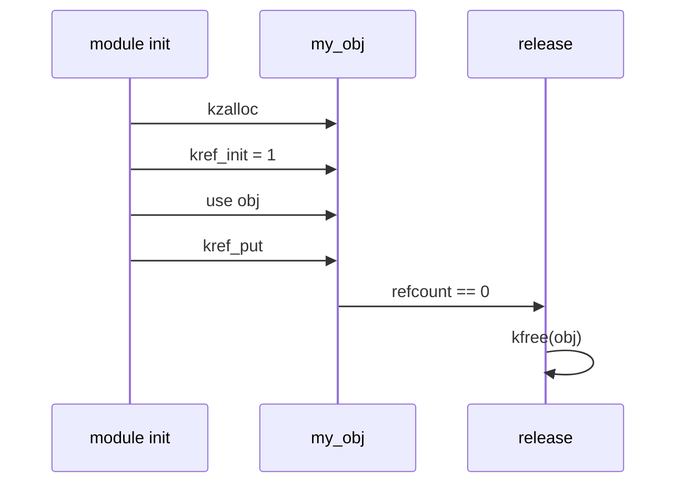

重点观察：

```text
kref_put() 不是单纯 refcount--。
它可能同步调用 release。
```

------

### 14.3.2 实验 2：两个路径持有同一对象

#### 14.3.2.1 实验目标

验证：

```text
多个持有者必须各自有引用；
最后一个 put 才 release。
```

#### 14.3.2.2 实验代码

```c
static void experiment_2_two_refs(void)
{
	struct my_obj *obj;

	pr_info("=== experiment 2: two refs ===\n");

	obj = my_obj_alloc(2);
	if (!obj)
		return;

	my_obj_get(obj, "second holder");

	pr_info("holder A use obj=%p id=%d\n", obj, obj->id);
	my_obj_put(obj, "holder A done");

	pr_info("holder B use obj=%p id=%d\n", obj, obj->id);
	my_obj_put(obj, "holder B done");
}
```

#### 14.3.2.3 期望日志

```text
ALLOC obj=... id=2 ref=1
GET obj=... id=2 why=second holder
holder A use obj=...
PUT obj=... id=2 why=holder A done
holder B use obj=...
PUT obj=... id=2 why=holder B done
my_obj_release: obj=... id=2
```

#### 14.3.2.4 实验结论

引用变化：

```text
alloc: ref = 1
get:   ref = 2
put A: ref = 1，不 release
put B: ref = 0，release
```

图示：

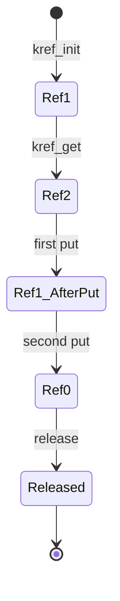

这个实验说明：

```text
对象不是“某个指针释放时就销毁”；
对象是在最后一个引用释放时销毁。
```

------

## 14.4 引用错误实验：少 get、少 put

### 14.4.1 实验 3：故意少 get，观察异步 UAF 风险

#### 14.4.1.1 实验目标

验证：

```text
把对象指针交给异步路径前，必须给异步路径单独 get。
```

#### 14.4.1.2 扩展对象

```c
struct my_work_obj {
	struct kref ref;
	struct work_struct work;
	int id;
};
```

release：

```c
static void my_work_obj_release(struct kref *ref)
{
	struct my_work_obj *obj;

	obj = container_of(ref, struct my_work_obj, ref);

	pr_info("my_work_obj_release: obj=%p id=%d\n", obj, obj->id);

	kfree(obj);
}
```

put：

```c
static void my_work_obj_put(struct my_work_obj *obj, const char *why)
{
	pr_info("WORK PUT obj=%p id=%d why=%s\n", obj, obj->id, why);

	kref_put(&obj->ref, my_work_obj_release);
}
```

work 回调：

```c
static void my_work_fn_bad(struct work_struct *work)
{
	struct my_work_obj *obj;

	obj = container_of(work, struct my_work_obj, work);

	msleep(100);

	pr_info("work use obj=%p id=%d\n", obj, obj->id);

	my_work_obj_put(obj, "work done");
}
```

#### 14.4.1.3 错误实验代码

```c
static void experiment_3_missing_get_bad(void)
{
	struct my_work_obj *obj;

	pr_info("=== experiment 3: missing get bad ===\n");

	obj = kzalloc(sizeof(*obj), GFP_KERNEL);
	if (!obj)
		return;

	kref_init(&obj->ref);
	obj->id = 3;
	INIT_WORK(&obj->work, my_work_fn_bad);

	pr_info("schedule work without get obj=%p id=%d\n", obj, obj->id);

	schedule_work(&obj->work);

	/*
	 * 错误：
	 * 当前路径释放初始引用。
	 * work 没有自己的引用。
	 */
	my_work_obj_put(obj, "submitter done");
}
```

#### 14.4.1.4 这个实验的问题

这个实验故意写错。

它可能导致：

```text
work 还没执行；
submitter 已经 put；
refcount 归零；
release kfree；
work 晚点执行；
work 访问已经释放的 obj。
```

并发图：

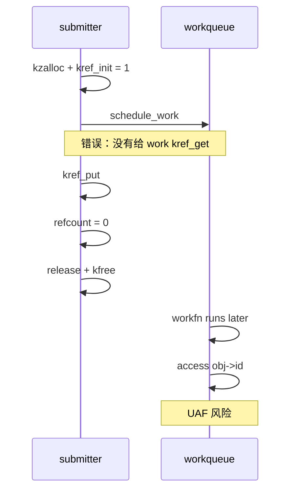

#### 14.4.1.5 正确实验代码

```c
static void my_work_obj_get(struct my_work_obj *obj, const char *why)
{
	pr_info("WORK GET obj=%p id=%d why=%s\n", obj, obj->id, why);

	kref_get(&obj->ref);
}

static void my_work_fn_good(struct work_struct *work)
{
	struct my_work_obj *obj;

	obj = container_of(work, struct my_work_obj, work);

	msleep(100);

	pr_info("work use obj=%p id=%d\n", obj, obj->id);

	my_work_obj_put(obj, "work done");
}

static void experiment_3_missing_get_good(void)
{
	struct my_work_obj *obj;

	pr_info("=== experiment 3: missing get good ===\n");

	obj = kzalloc(sizeof(*obj), GFP_KERNEL);
	if (!obj)
		return;

	kref_init(&obj->ref);
	obj->id = 30;
	INIT_WORK(&obj->work, my_work_fn_good);

	/*
	 * work 将长期持有 obj，因此投递前 get。
	 */
	my_work_obj_get(obj, "work holder");

	schedule_work(&obj->work);

	/*
	 * submitter 释放自己的初始引用。
	 * 对象不会释放，因为 work 仍持有引用。
	 */
	my_work_obj_put(obj, "submitter done");
}
```

#### 14.4.1.6 期望结论

正确引用变化：

```text
alloc:        ref = 1
work get:     ref = 2
submit put:   ref = 1
work put:     ref = 0 -> release
```

正确流程图：

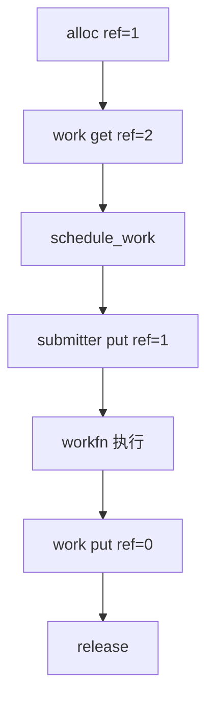

实验结论：

```text
异步路径不是“拿到指针”就安全；
异步路径必须持有自己的引用。
```

------

### 14.4.2 实验 4：故意少 put，观察泄漏

#### 14.4.2.1 实验目标

验证：

```text
每个 get 必须有对应 put；
少 put 会导致 release 永远不执行。
```

#### 14.4.2.2 错误实验代码

```c
static void experiment_4_missing_put_bad(void)
{
	struct my_obj *obj;

	pr_info("=== experiment 4: missing put bad ===\n");

	obj = my_obj_alloc(4);
	if (!obj)
		return;

	my_obj_get(obj, "leaked holder");

	/*
	 * 只 put 初始引用。
	 * leaked holder 的引用没有释放。
	 */
	my_obj_put(obj, "initial holder done");

	pr_info("experiment 4 done, but release should not appear\n");
}
```

#### 14.4.2.3 期望日志

```text
ALLOC obj=... id=4 ref=1
GET obj=... id=4 why=leaked holder
PUT obj=... id=4 why=initial holder done
experiment 4 done, but release should not appear
```

注意：

```text
不会出现 my_obj_release。
```

#### 14.4.2.4 正确代码

```c
static void experiment_4_missing_put_good(void)
{
	struct my_obj *obj;

	pr_info("=== experiment 4: missing put good ===\n");

	obj = my_obj_alloc(40);
	if (!obj)
		return;

	my_obj_get(obj, "second holder");

	my_obj_put(obj, "initial holder done");
	my_obj_put(obj, "second holder done");
}
```

#### 14.4.2.5 实验结论

少 put 的本质：

```text
不是对象正在被使用；
而是引用归属表里有一份引用没人归还。
```

引用变化：

```text
bad:
    ref = 1 -> 2 -> 1
    永远不到 0

good:
    ref = 1 -> 2 -> 1 -> 0
    release
```

------

## 14.5 lookup 与 handoff 实验：从裸指针转成引用

### 14.5.1 实验 5：list + mutex + lookup + kref_get

#### 14.5.1.1 实验目标

验证：

```text
lookup 找到的是裸指针；
如果要离开锁继续使用，必须在锁内 get。
```

#### 14.5.1.2 对象定义

```c
struct my_list_obj {
	struct kref ref;
	struct list_head node;
	int id;
	bool dying;
};

static LIST_HEAD(my_list);
static DEFINE_MUTEX(my_list_lock);
```

release：

```c
static void my_list_obj_release(struct kref *ref)
{
	struct my_list_obj *obj;

	obj = container_of(ref, struct my_list_obj, ref);

	pr_info("my_list_obj_release: obj=%p id=%d\n", obj, obj->id);

	WARN_ON(!list_empty(&obj->node));

	kfree(obj);
}
```

put：

```c
static void my_list_obj_put(struct my_list_obj *obj, const char *why)
{
	pr_info("LIST PUT obj=%p id=%d why=%s\n", obj, obj->id, why);

	kref_put(&obj->ref, my_list_obj_release);
}
```

alloc：

```c
static struct my_list_obj *my_list_obj_alloc(int id)
{
	struct my_list_obj *obj;

	obj = kzalloc(sizeof(*obj), GFP_KERNEL);
	if (!obj)
		return NULL;

	kref_init(&obj->ref);
	INIT_LIST_HEAD(&obj->node);
	obj->id = id;
	obj->dying = false;

	return obj;
}
```

publish：

```c
static void my_list_obj_publish(struct my_list_obj *obj)
{
	mutex_lock(&my_list_lock);
	list_add_tail(&obj->node, &my_list);
	mutex_unlock(&my_list_lock);

	pr_info("published obj=%p id=%d\n", obj, obj->id);
}
```

#### 14.5.1.3 错误 lookup：锁外使用裸指针

```c
static struct my_list_obj *my_list_lookup_bad(int id)
{
	struct my_list_obj *obj;

	mutex_lock(&my_list_lock);

	list_for_each_entry(obj, &my_list, node) {
		if (obj->id == id) {
			mutex_unlock(&my_list_lock);
			return obj;   /* 错误：返回裸指针 */
		}
	}

	mutex_unlock(&my_list_lock);
	return NULL;
}
```

错误使用：

```c
static void experiment_5_lookup_bad(void)
{
	struct my_list_obj *obj;

	pr_info("=== experiment 5: lookup bad ===\n");

	obj = my_list_lookup_bad(5);
	if (!obj)
		return;

	/*
	 * 错误：
	 * 这里已经不持锁，也没有引用。
	 */
	pr_info("use borrowed obj outside lock: %p id=%d\n", obj, obj->id);
}
```

#### 14.5.1.4 正确 lookup：锁内 get

```c
static struct my_list_obj *my_list_lookup_get(int id)
{
	struct my_list_obj *obj;

	mutex_lock(&my_list_lock);

	list_for_each_entry(obj, &my_list, node) {
		if (obj->id != id)
			continue;

		if (obj->dying) {
			mutex_unlock(&my_list_lock);
			return NULL;
		}

		kref_get(&obj->ref);

		mutex_unlock(&my_list_lock);
		return obj;
	}

	mutex_unlock(&my_list_lock);
	return NULL;
}
```

正确使用：

```c
static void experiment_5_lookup_good(void)
{
	struct my_list_obj *obj;

	pr_info("=== experiment 5: lookup good ===\n");

	obj = my_list_lookup_get(5);
	if (!obj)
		return;

	pr_info("use referenced obj outside lock: %p id=%d\n", obj, obj->id);

	my_list_obj_put(obj, "lookup user done");
}
```

#### 14.5.1.5 remove

```c
static void my_list_obj_remove(struct my_list_obj *obj)
{
	mutex_lock(&my_list_lock);

	obj->dying = true;
	list_del_init(&obj->node);

	mutex_unlock(&my_list_lock);

	my_list_obj_put(obj, "remove publish ref");
}
```

#### 14.5.1.6 实验结论

错误模型：

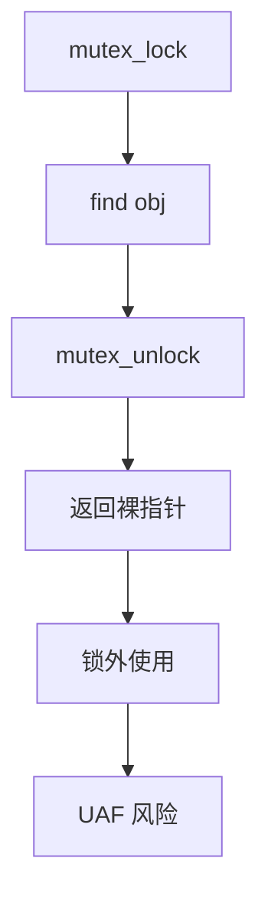

正确模型：

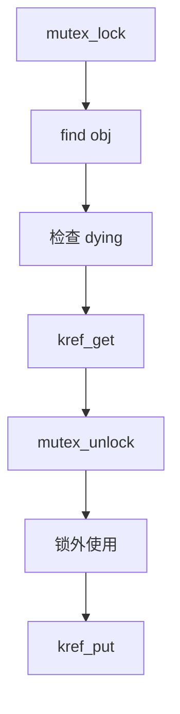

结论：

```text
锁内可以借用指针；
锁外必须持有引用。
```

------

### 14.5.2 实验 6：lookup 改成 kref_get_unless_zero

#### 14.5.2.1 实验目标

验证：

```text
kref_get_unless_zero() 只能解决“非 0 才加引用”；
它不解决指针本身是否有效；
它仍然要放在锁或 RCU 保护窗口内。
```

#### 14.5.2.2 用 mutex 保护的 get_unless_zero 示例

虽然 `kref_get_unless_zero()` 常见于 RCU/弱引用场景，但 mutex 场景也可以用它说明语义。

```c
static struct my_list_obj *my_list_lookup_get_unless_zero(int id)
{
	struct my_list_obj *obj;

	mutex_lock(&my_list_lock);

	list_for_each_entry(obj, &my_list, node) {
		if (obj->id != id)
			continue;

		if (!kref_get_unless_zero(&obj->ref)) {
			mutex_unlock(&my_list_lock);
			return NULL;
		}

		mutex_unlock(&my_list_lock);
		return obj;
	}

	mutex_unlock(&my_list_lock);
	return NULL;
}
```

#### 14.5.2.3 错误写法：离开锁后 get_unless_zero

```c
static struct my_list_obj *my_list_lookup_get_unless_zero_bad(int id)
{
	struct my_list_obj *obj = NULL;
	struct my_list_obj *iter;

	mutex_lock(&my_list_lock);

	list_for_each_entry(iter, &my_list, node) {
		if (iter->id == id) {
			obj = iter;
			break;
		}
	}

	mutex_unlock(&my_list_lock);

	/*
	 * 错误：
	 * obj 指针本身已经失去锁保护。
	 */
	if (obj && !kref_get_unless_zero(&obj->ref))
		obj = NULL;

	return obj;
}
```

#### 14.5.2.4 并发窗口

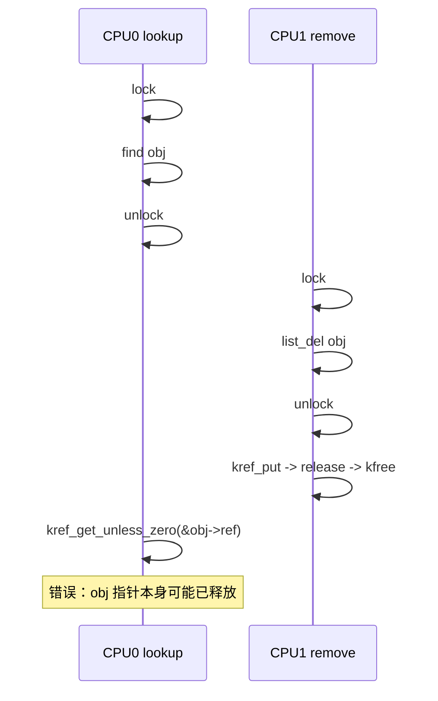

#### 14.5.2.5 实验结论

必须记住：

```text
kref_get_unless_zero() 不是“安全 lookup API”。

它只做：
    refcount != 0 时加引用。

它不做：
    证明 obj 指针有效；
    证明 obj 还在集合中；
    证明 obj 业务可用。
```

正确句式：

```text
在锁/RCU 已经证明 obj 指针暂时有效之后，
才能调用 kref_get_unless_zero()。
```

------

### 14.5.3 实验 7：workqueue handoff 成功/失败路径

#### 14.5.3.1 实验目标

验证 handoff 中最重要的问题：

```text
投递成功时引用归谁？
投递失败时引用归谁？
```

#### 14.5.3.2 对象定义

```c
struct my_job {
	struct kref ref;
	struct work_struct work;
	spinlock_t lock;
	bool pending;
	bool dying;
	int id;
};
```

release：

```c
static void my_job_release(struct kref *ref)
{
	struct my_job *job = container_of(ref, struct my_job, ref);

	pr_info("my_job_release: job=%p id=%d\n", job, job->id);

	kfree(job);
}
```

put：

```c
static void my_job_put(struct my_job *job, const char *why)
{
	pr_info("JOB PUT job=%p id=%d why=%s\n", job, job->id, why);

	kref_put(&job->ref, my_job_release);
}
```

workfn：

```c
static void my_job_workfn(struct work_struct *work)
{
	struct my_job *job;

	job = container_of(work, struct my_job, work);

	pr_info("job workfn start job=%p id=%d\n", job, job->id);

	msleep(100);

	spin_lock_irq(&job->lock);
	job->pending = false;
	spin_unlock_irq(&job->lock);

	pr_info("job workfn done job=%p id=%d\n", job, job->id);

	my_job_put(job, "work done");
}
```

alloc：

```c
static struct my_job *my_job_alloc(int id)
{
	struct my_job *job;

	job = kzalloc(sizeof(*job), GFP_KERNEL);
	if (!job)
		return NULL;

	kref_init(&job->ref);
	INIT_WORK(&job->work, my_job_workfn);
	spin_lock_init(&job->lock);

	job->id = id;
	job->pending = false;
	job->dying = false;

	return job;
}
```

#### 14.5.3.3 正确 handoff：work 额外 get

```c
static int my_job_schedule_get(struct my_job *job)
{
	unsigned long flags;
	bool queued;

	spin_lock_irqsave(&job->lock, flags);

	if (job->dying || job->pending) {
		spin_unlock_irqrestore(&job->lock, flags);
		return -EBUSY;
	}

	job->pending = true;
	kref_get(&job->ref);

	spin_unlock_irqrestore(&job->lock, flags);

	queued = schedule_work(&job->work);
	if (!queued) {
		spin_lock_irqsave(&job->lock, flags);
		job->pending = false;
		spin_unlock_irqrestore(&job->lock, flags);

		my_job_put(job, "schedule failed rollback");
		return -EBUSY;
	}

	return 0;
}
```

实验：

```c
static void experiment_7_workqueue_handoff(void)
{
	struct my_job *job;
	int ret;

	pr_info("=== experiment 7: workqueue handoff ===\n");

	job = my_job_alloc(7);
	if (!job)
		return;

	ret = my_job_schedule_get(job);
	if (ret)
		pr_info("schedule failed ret=%d\n", ret);

	my_job_put(job, "submitter done");
}
```

#### 14.5.3.4 期望引用变化

```text
alloc:
    ref = 1

schedule_get:
    ref = 2，work 持有一份

submitter put:
    ref = 1

workfn done:
    ref = 0，release
```

流程图：

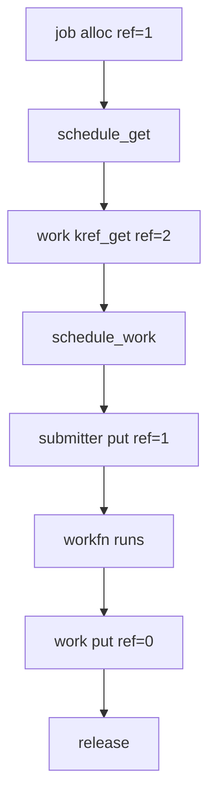

#### 14.5.3.5 实验结论

workqueue handoff 要写清楚：

```text
work 是否持有引用；
schedule_work 返回 false 时是否需要回滚；
workfn 末尾是否 put；
submitter 成功投递后是否还能访问对象。
```

------

## 14.6 RCU 与调试工具实验：KASAN、KCSAN、lockdep

### 14.6.1 实验 8：RCU lookup + kfree_rcu

#### 14.6.1.1 实验目标

验证第 10 章模型：

```text
RCU 保护 lookup 窗口；
kref_get_unless_zero() 把临时指针转换成长期引用；
release 中不能直接 kfree RCU 可见对象；
应使用 kfree_rcu() 或 call_rcu()。
```

#### 14.6.1.2 对象定义

```c
struct my_rcu_obj {
	struct kref ref;
	struct rcu_head rcu;
	struct list_head node;

	spinlock_t lock;
	bool dying;

	int id;
};

static LIST_HEAD(my_rcu_list);
static DEFINE_SPINLOCK(my_rcu_list_lock);
```

release：

```c
static void my_rcu_obj_release(struct kref *ref)
{
	struct my_rcu_obj *obj;

	obj = container_of(ref, struct my_rcu_obj, ref);

	pr_info("my_rcu_obj_release: obj=%p id=%d\n", obj, obj->id);

	kfree_rcu(obj, rcu);
}
```

put：

```c
static void my_rcu_obj_put(struct my_rcu_obj *obj, const char *why)
{
	pr_info("RCU PUT obj=%p id=%d why=%s\n", obj, obj->id, why);

	kref_put(&obj->ref, my_rcu_obj_release);
}
```

alloc：

```c
static struct my_rcu_obj *my_rcu_obj_alloc(int id)
{
	struct my_rcu_obj *obj;

	obj = kzalloc(sizeof(*obj), GFP_KERNEL);
	if (!obj)
		return NULL;

	kref_init(&obj->ref);
	INIT_LIST_HEAD(&obj->node);
	spin_lock_init(&obj->lock);

	obj->id = id;
	obj->dying = false;

	return obj;
}
```

publish：

```c
static void my_rcu_obj_publish(struct my_rcu_obj *obj)
{
	spin_lock(&my_rcu_list_lock);
	list_add_rcu(&obj->node, &my_rcu_list);
	spin_unlock(&my_rcu_list_lock);

	pr_info("RCU publish obj=%p id=%d\n", obj, obj->id);
}
```

lookup + get：

```c
static struct my_rcu_obj *my_rcu_obj_lookup_get(int id)
{
	struct my_rcu_obj *obj;
	struct my_rcu_obj *found = NULL;

	rcu_read_lock();

	list_for_each_entry_rcu(obj, &my_rcu_list, node) {
		if (obj->id != id)
			continue;

		if (!kref_get_unless_zero(&obj->ref))
			break;

		spin_lock(&obj->lock);
		if (obj->dying) {
			spin_unlock(&obj->lock);
			rcu_read_unlock();

			my_rcu_obj_put(obj, "dying rollback");
			return NULL;
		}
		spin_unlock(&obj->lock);

		found = obj;
		break;
	}

	rcu_read_unlock();

	return found;
}
```

remove：

```c
static void my_rcu_obj_remove(struct my_rcu_obj *obj)
{
	spin_lock(&obj->lock);
	obj->dying = true;
	spin_unlock(&obj->lock);

	spin_lock(&my_rcu_list_lock);
	list_del_rcu(&obj->node);
	spin_unlock(&my_rcu_list_lock);

	my_rcu_obj_put(obj, "remove publish ref");
}
```

实验：

```c
static void experiment_8_rcu_lookup(void)
{
	struct my_rcu_obj *obj;
	struct my_rcu_obj *found;

	pr_info("=== experiment 8: RCU lookup ===\n");

	obj = my_rcu_obj_alloc(8);
	if (!obj)
		return;

	my_rcu_obj_publish(obj);

	found = my_rcu_obj_lookup_get(8);
	if (found) {
		pr_info("RCU lookup success obj=%p id=%d\n", found, found->id);
		my_rcu_obj_put(found, "lookup user done");
	}

	my_rcu_obj_remove(obj);
}
```

#### 14.6.1.3 期望结论

引用变化：

```text
alloc:
    ref = 1，发布引用

lookup_get:
    ref = 2，lookup 用户引用

lookup user put:
    ref = 1

remove:
    list_del_rcu
    ref = 0
    release
    kfree_rcu
```

时序图：

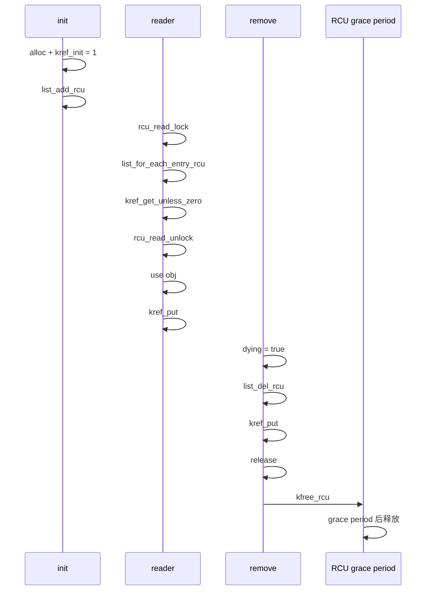

#### 14.6.1.4 错误对照：release 中直接 kfree

错误代码：

```c
static void my_rcu_obj_release_bad(struct kref *ref)
{
	struct my_rcu_obj *obj;

	obj = container_of(ref, struct my_rcu_obj, ref);

	kfree(obj);   /* 错误：旧 RCU 读者可能仍在临界区 */
}
```

错误点：

```text
最后一个长期引用归零，不等于所有 RCU 读者都退出。
```

正确结论：

```text
RCU 可见对象的内存释放必须撑过 grace period。
```

------

### 14.6.2 实验 9：KASAN 观察 UAF

#### 14.6.2.1 实验目标

用 KASAN 观察：

```text
少 get；
put 后访问；
release 后访问；
异步路径访问已释放对象。
```

#### 14.6.2.2 建议内核配置

测试内核建议打开：

```text
CONFIG_KASAN=y
CONFIG_KASAN_GENERIC=y
CONFIG_STACKTRACE=y
CONFIG_SLUB_DEBUG=y
```

如果是较新架构，也可能使用：

```text
CONFIG_KASAN_SW_TAGS=y
CONFIG_KASAN_HW_TAGS=y
```

具体取决于架构和内核配置能力。

#### 14.6.2.3 故意 put 后访问

```c
static void experiment_9_kasan_put_after_use(void)
{
	struct my_obj *obj;
	int id;

	pr_info("=== experiment 9: KASAN put-after-use ===\n");

	obj = my_obj_alloc(9);
	if (!obj)
		return;

	id = obj->id;

	my_obj_put(obj, "trigger release");

	/*
	 * 故意错误：
	 * 如果上面 put 触发 release，这里访问 obj->id 就是 UAF。
	 */
	pr_info("bad access after put: obj=%p id=%d saved_id=%d\n",
		obj, obj->id, id);
}
```

#### 14.6.2.4 期望现象

如果 KASAN 生效，可能看到类似：

```text
BUG: KASAN: use-after-free in ...
Read of size ...
Call Trace:
  experiment_9_kasan_put_after_use
  ...
Freed by task ...
Allocated by task ...
```

#### 14.6.2.5 实验结论

这个实验验证：

```text
put 后不能访问对象；
即使只是打印字段，也可能 UAF；
需要的字段必须在 put 前保存。
```

正确写法：

```c
id = obj->id;

my_obj_put(obj, "done");

pr_info("obj id=%d released/ref dropped\n", id);
```

------

### 14.6.3 实验 10：KCSAN 观察字段竞争

#### 14.6.3.1 实验目标

验证：

```text
kref 保护对象生命周期；
不保护字段互斥。
```

#### 14.6.3.2 扩展对象

```c
struct my_race_obj {
	struct kref ref;
	int counter;
};
```

两个线程同时修改：

```c
static int race_thread_fn(void *data)
{
	struct my_race_obj *obj = data;
	int i;

	for (i = 0; i < 100000 && !kthread_should_stop(); i++)
		obj->counter++;

	return 0;
}
```

实验入口：

```c
static void experiment_10_kcsan_race(void)
{
	struct my_race_obj *obj;
	struct task_struct *t1;
	struct task_struct *t2;

	pr_info("=== experiment 10: KCSAN data race ===\n");

	obj = kzalloc(sizeof(*obj), GFP_KERNEL);
	if (!obj)
		return;

	kref_init(&obj->ref);
	obj->counter = 0;

	t1 = kthread_run(race_thread_fn, obj, "kref_race_1");
	t2 = kthread_run(race_thread_fn, obj, "kref_race_2");

	msleep(1000);

	if (!IS_ERR(t1))
		kthread_stop(t1);
	if (!IS_ERR(t2))
		kthread_stop(t2);

	pr_info("counter=%d\n", obj->counter);

	kfree(obj);
}
```

#### 14.6.3.3 期望现象

如果 KCSAN 打开，可能报告 data race。

#### 14.6.3.4 正确修复

加锁：

```c
struct my_race_obj {
	struct kref ref;
	spinlock_t lock;
	int counter;
};
```

修改：

```c
spin_lock(&obj->lock);
obj->counter++;
spin_unlock(&obj->lock);
```

或者使用原子变量：

```c
atomic_t counter;
```

修改：

```c
atomic_inc(&obj->counter);
```

#### 14.6.3.5 实验结论

```text
两个线程都持有对象引用；
对象不会被释放；
但 obj->counter 仍然会发生字段竞争。
```

这说明：

```text
kref 不是锁。
```

图示：

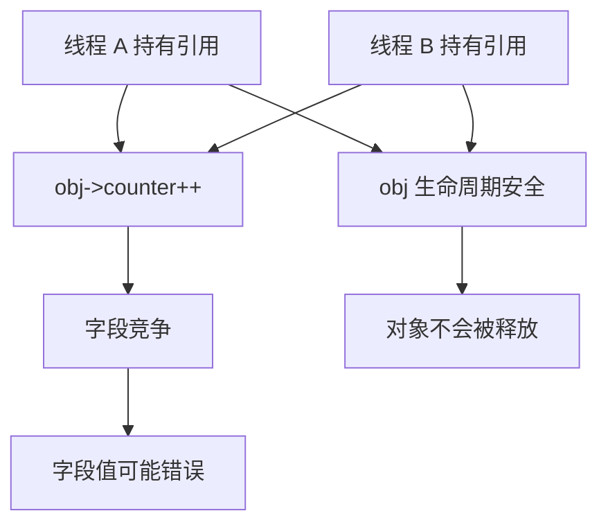

------

### 14.6.4 实验 11：lockdep 观察锁顺序

#### 14.6.4.1 实验目标

验证：

```text
kref 与锁组合时，锁顺序必须固定；
release 中拿锁可能引入死锁。
```

#### 14.6.4.2 建议内核配置

```text
CONFIG_LOCKDEP=y
CONFIG_PROVE_LOCKING=y
CONFIG_DEBUG_MUTEXES=y
CONFIG_DEBUG_SPINLOCK=y
```

#### 14.6.4.3 错误模型

假设两个锁：

```c
static DEFINE_MUTEX(lock_a);
static DEFINE_MUTEX(lock_b);
```

路径 1：

```c
mutex_lock(&lock_a);
mutex_lock(&lock_b);
...
mutex_unlock(&lock_b);
mutex_unlock(&lock_a);
```

路径 2：

```c
mutex_lock(&lock_b);
mutex_lock(&lock_a);
...
mutex_unlock(&lock_a);
mutex_unlock(&lock_b);
```

lockdep 可能报告锁依赖反转。

#### 14.6.4.4 和 kref 的关系

kref 相关的危险点是：

```text
最后一个 kref_put 会同步进入 release；
release 如果拿锁，就等于 kref_put 调用点隐式拿了这把锁。
```

例如：

```c
static void my_obj_release(struct kref *ref)
{
	struct my_obj *obj = container_of(ref, struct my_obj, ref);

	mutex_lock(&global_lock);
	...
	mutex_unlock(&global_lock);

	kfree(obj);
}
```

那么所有调用：

```c
my_obj_put(obj);
```

的路径，都可能在最后一个 put 时进入：

```text
mutex_lock(&global_lock)
```

所以要审查：

```text
my_obj_put() 调用点当前持有哪些锁？
release 里面又拿哪些锁？
锁顺序是否和其他路径冲突？
```

#### 14.6.4.5 实验结论

```text
kref_put() 表面上只是 put；
但最后一个 put 会进入 release；
release 中的锁也属于 kref_put 调用路径的锁依赖。
```

图示：

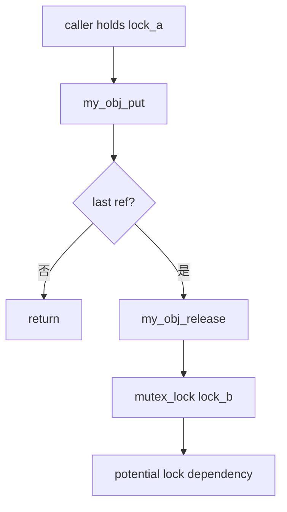

------

## 14.7 API 误用和 remove 实验：多 put、kref_read、未脱链

### 14.7.1 实验 12：refcount warning 观察多 put

#### 14.7.1.1 实验目标

验证：

```text
多 put 可能触发 refcount underflow / warning；
也可能导致提前 release 和 UAF。
```

#### 14.7.1.2 错误实验代码

```c
static void experiment_12_double_put_bad(void)
{
	struct my_obj *obj;

	pr_info("=== experiment 12: double put bad ===\n");

	obj = my_obj_alloc(12);
	if (!obj)
		return;

	my_obj_put(obj, "first put");

	/*
	 * 故意错误：
	 * first put 已经可能释放 obj。
	 */
	my_obj_put(obj, "second put");
}
```

#### 14.7.1.3 可能现象

可能出现：

```text
release 后继续访问；
KASAN UAF；
refcount warning；
直接崩溃；
或者因为内存复用导致表现不稳定。
```

#### 14.7.1.4 实验结论

多 put 的根因：

```text
同一份引用被释放了两次。
```

正确方式不是“判断 refcount 是否大于 0 再 put”。

错误修复：

```c
if (kref_read(&obj->ref) > 0)
	my_obj_put(obj, "maybe put");
```

这是错误思路。

正确修复是：

```text
审查引用归属；
确保一份 get 只对应一份 put；
handoff 成功失败路径写清楚。
```

------

### 14.7.2 实验 13：kref_read 不能判断对象有效

#### 14.7.2.1 实验目标

验证：

```text
kref_read() 只是读一个瞬间值；
不能作为对象有效性判断。
```

#### 14.7.2.2 错误代码

```c
static void experiment_13_kref_read_bad(struct my_obj *obj)
{
	if (kref_read(&obj->ref) > 0) {
		/*
		 * 错误：
		 * 这里不能说明当前路径持有引用。
		 */
		pr_info("obj seems alive id=%d\n", obj->id);
	}
}
```

#### 14.7.2.3 并发窗口

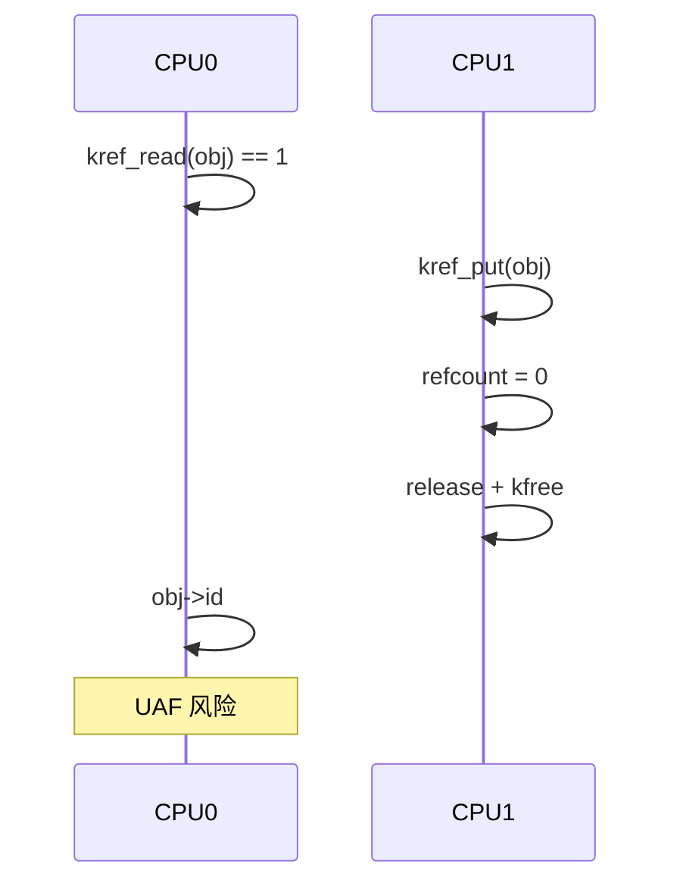

#### 14.7.2.4 实验结论

`kref_read()` 可以用于：

```text
debug；
日志；
统计；
WARN 辅助。
```

不能用于：

```text
判断对象是否可访问；
判断是否可以 get；
判断是否可以返回 obj；
判断对象是否业务可用。
```

真正要使用对象，必须：

```text
当前已经持有引用；
或者在锁/RCU 保护下成功 get。
```

------

### 14.7.3 实验 14：release 前未脱链

#### 14.7.3.1 实验目标

验证：

```text
对象 release 时如果仍挂在全局集合中，后续 lookup 会得到悬挂指针。
```

#### 14.7.3.2 错误 release

```c
static void my_list_obj_release_bad(struct kref *ref)
{
	struct my_list_obj *obj;

	obj = container_of(ref, struct my_list_obj, ref);

	/*
	 * 错误：
	 * 没有 list_del_init。
	 * 如果 obj 还在 my_list 中，全局 list 会残留悬挂指针。
	 */
	kfree(obj);
}
```

#### 14.7.3.3 正确断言

```c
static void my_list_obj_release(struct kref *ref)
{
	struct my_list_obj *obj;

	obj = container_of(ref, struct my_list_obj, ref);

	WARN_ON(!list_empty(&obj->node));

	kfree(obj);
}
```

#### 14.7.3.4 实验结论

release 前必须明确：

```text
对象是否已经从 list/hash/xarray/idr 中取消发布；
对象是否仍然能被 lookup 找到；
对象是否仍然挂在 timer/work/callback 中。
```

图示：

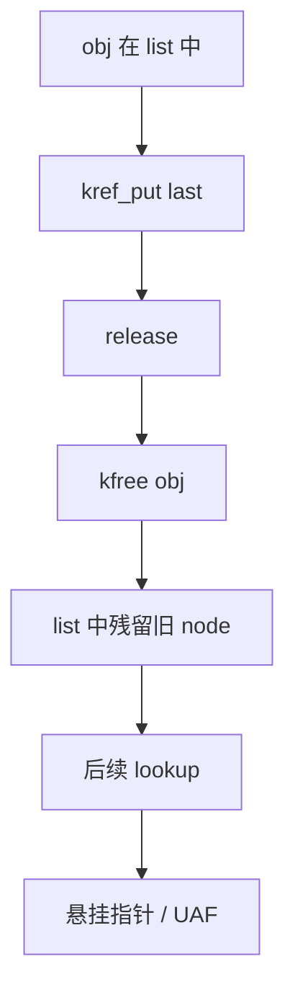

正确模型：

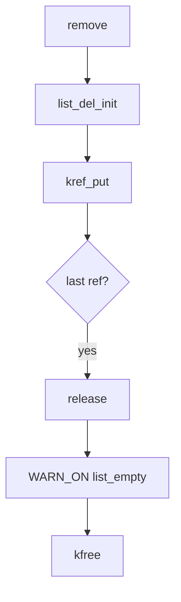

------

## 14.8 状态和父子关系实验：生命周期不等于业务可用

### 14.8.1 实验 15：remove 后旧用户仍持有引用

#### 14.8.1.1 实验目标

验证：

```text
remove 后，对象内存可能还活着；
但业务资源可能已经不可用；
旧用户必须检查 dying/state。
```

#### 14.8.1.2 对象

```c
struct my_state_obj {
	struct kref ref;
	struct mutex lock;
	bool dying;
	int id;
	int resource;
};
```

业务使用：

```c
static int my_state_obj_do_io(struct my_state_obj *obj)
{
	int ret = 0;

	mutex_lock(&obj->lock);
	if (obj->dying) {
		mutex_unlock(&obj->lock);
		return -ENODEV;
	}

	/*
	 * 这里才允许访问业务资源。
	 */
	pr_info("do io resource=%d\n", obj->resource);

	mutex_unlock(&obj->lock);

	return ret;
}
```

remove：

```c
static void my_state_obj_remove(struct my_state_obj *obj)
{
	mutex_lock(&obj->lock);
	obj->dying = true;
	obj->resource = -1;
	mutex_unlock(&obj->lock);

	/*
	 * 释放发布引用。
	 * 旧用户可能还持有引用，但业务入口会看到 dying。
	 */
	kref_put(&obj->ref, my_state_obj_release);
}
```

#### 14.8.1.3 实验结论

```text
kref 只能保证 obj 这个内存对象还没释放；
不能保证 obj 背后的硬件、buffer、DMA、队列仍然可用。
```

所以要区分：

```text
生命周期有效；
业务状态可用；
资源仍然可用。
```

图示：

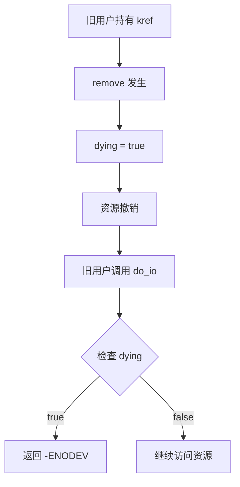

------

### 14.8.2 实验 16：父子对象引用关系

#### 14.8.2.1 实验目标

验证：

```text
child 如果 release 中要访问 parent，就必须持有 parent 引用。
```

#### 14.8.2.2 对象

```c
struct my_parent {
	struct kref ref;
	int id;
};

struct my_child {
	struct kref ref;
	struct my_parent *parent;
	int id;
};
```

parent release：

```c
static void my_parent_release(struct kref *ref)
{
	struct my_parent *parent;

	parent = container_of(ref, struct my_parent, ref);

	pr_info("parent release id=%d\n", parent->id);

	kfree(parent);
}
```

child release：

```c
static void my_child_release(struct kref *ref)
{
	struct my_child *child;
	struct my_parent *parent;

	child = container_of(ref, struct my_child, ref);
	parent = child->parent;

	pr_info("child release id=%d parent=%p\n", child->id, parent);

	kfree(child);

	kref_put(&parent->ref, my_parent_release);
}
```

child 创建时 get parent：

```c
static struct my_child *my_child_alloc(struct my_parent *parent, int id)
{
	struct my_child *child;

	child = kzalloc(sizeof(*child), GFP_KERNEL);
	if (!child)
		return NULL;

	kref_init(&child->ref);

	kref_get(&parent->ref);
	child->parent = parent;
	child->id = id;

	return child;
}
```

#### 14.8.2.3 引用图

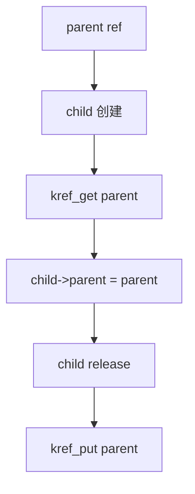

#### 14.8.2.4 实验结论

如果对象之间有指针关系，必须区分：

```text
普通指针关系；
引用持有关系；
集合归属关系；
父子生命周期关系。
```

一句话：

```text
child->parent 只是指针；
child 是否保护 parent，要看 child 创建时有没有 get parent。
```

------

## 14.9 实验记录和代码组织

### 14.9.1 实验记录模板

每个实验建议记录下面内容：

```text
实验名称：
    例如：workqueue handoff 缺少 get

实验目标：
    验证异步路径必须持有引用。

关键代码：
    schedule_work 前是否 get；
    workfn 末尾是否 put。

预期日志：
    get/put/release 顺序。

实际现象：
    是否 release 过早；
    是否 KASAN 报 UAF；
    是否 release 未发生。

结论：
    对应哪条 kref 规则。
```

示例：

```text
实验名称：
    实验 3：workqueue 少 get

预期错误：
    submitter put 后 release；
    workfn 后访问已释放对象。

观察结果：
    KASAN 报 use-after-free。

结论：
    异步路径保存 obj 指针前必须 get；
    workfn 结束必须 put。
```

------

### 14.9.2 实验代码组织建议

建议不要把所有实验一次性打开。

可以用模块参数选择实验：

```c
static int test_id;
module_param(test_id, int, 0644);
MODULE_PARM_DESC(test_id, "kref lab test id");
```

入口：

```c
static int __init kref_lab_init(void)
{
	pr_info("kref_lab init test_id=%d\n", test_id);

	switch (test_id) {
	case 1:
		experiment_1_minimal();
		break;
	case 2:
		experiment_2_two_refs();
		break;
	case 3:
		experiment_3_missing_get_good();
		break;
	case 4:
		experiment_4_missing_put_bad();
		break;
	case 5:
		experiment_5_lookup_good();
		break;
	case 8:
		experiment_8_rcu_lookup();
		break;
	default:
		pr_info("no experiment selected\n");
		break;
	}

	return 0;
}
```

加载指定实验：

```bash
sudo insmod kref_lab.ko test_id=1
sudo rmmod kref_lab
```

这样做的好处：

```text
每次只跑一个实验；
日志干净；
故意错误实验不会互相干扰；
方便开关 KASAN/KCSAN/lockdep 观察。
```

------

## 14.10 本章实验总表

| 实验                        | 验证点                 | 预期结论                       |
| --------------------------- | ---------------------- | ------------------------------ |
| 实验 1：最小 kref 对象      | init/put/release       | 最后 put 同步触发 release      |
| 实验 2：两个路径持有对象    | 多引用                 | 最后一个 put 才释放            |
| 实验 3：少 get              | 异步 UAF               | 异步路径必须 get               |
| 实验 4：少 put              | 泄漏                   | 每个 get 必须 put              |
| 实验 5：list + mutex lookup | 锁内 get               | 锁外使用必须持引用             |
| 实验 6：get_unless_zero     | 非 0 才 get            | 不证明指针有效                 |
| 实验 7：workqueue handoff   | 引用转移               | 成功/失败路径要定义归属        |
| 实验 8：RCU lookup          | RCU + kref             | RCU 保护 lookup，kref 保护后续 |
| 实验 9：KASAN               | UAF                    | put 后访问会暴露               |
| 实验 10：KCSAN              | 字段竞争               | kref 不是锁                    |
| 实验 11：lockdep            | 锁顺序                 | release 中拿锁也算调用路径     |
| 实验 12：多 put             | underflow/UAF          | 一份引用只能 put 一次          |
| 实验 13：kref_read          | 读计数不等于持引用     | 不能用来判断对象有效           |
| 实验 14：release 未脱链     | 悬挂指针               | release 前必须取消发布         |
| 实验 15：remove 后旧用户    | 生命周期和业务状态分离 | 旧用户要检查 dying/state       |
| 实验 16：父子引用           | 子对象保护父对象       | 指针不等于引用                 |

------

## 14.11 本章最终检查问题

做完实验后，至少应该能回答：

```text
1. 为什么 kref_put() 后不能打印 obj->id？
2. 为什么 schedule_work() 前要给 work 一份引用？
3. 如果 schedule_work() 失败，刚 get 的引用归谁？
4. 为什么少 put 不一定立刻崩溃，而是泄漏？
5. 为什么多 put 可能不是 underflow，而是提前 UAF？
6. 为什么 list 查到 obj 后不能锁外裸用？
7. 为什么 kref_get_unless_zero() 不能放在 rcu_read_unlock() 之后？
8. 为什么 RCU release 里不能直接 kfree？
9. 为什么对象还有 kref 引用，不代表硬件资源仍然可用？
10. 为什么 get_device() 和私有 kref 不能混用？
```

如果这些问题答不上来，说明还没有真正掌握 kref。

------

## 14.12 本章小结

本章通过实验验证了前面所有核心规则。

最重要的实验结论是：

```text
kref_init() 创建初始引用；
kref_get() 增加长期持有者；
kref_put() 释放当前持有者；
最后一个 put 同步进入 release；
put 后不能访问对象；
异步路径必须持有自己的引用；
lookup + get 必须在锁或 RCU 保护窗口内完成；
kref_get_unless_zero() 不证明指针有效；
RCU 对象释放必须撑过 grace period；
kref 不保护字段互斥；
kref 不保护业务资源可用性。
```

最终实验主线可以画成这样：

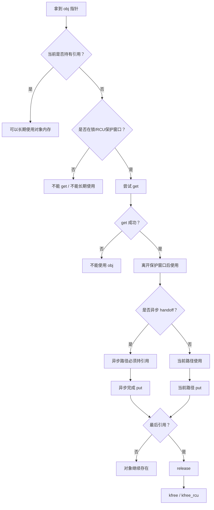

一句话总结：

```text
源码阅读实验的目的不是证明 refcount 会加减；
而是证明对象所有权、lookup 窗口、handoff 归属和 release 边界是否真的清楚。
```
