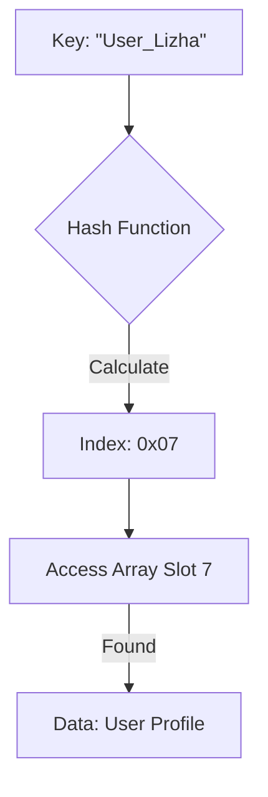

## 第 1 章 哈希表核心原理：空间与时间的终极博弈

哈希表（Hash Table）是计算机科学中最伟大的发明之一。它通过引入数学映射，打破了传统线性搜索必须逐个比对的物理限制。在 Linux 内核中，它是支撑文件系统（Dcache）、网络协议栈（Conntrack）及进程管理（PID Hash）的高速引擎。

### 1.1 哈希表的基本定义与哲学

哈希表的核心思想是**“计算地址”**。 它不是通过比较值来寻找数据，而是通过键（Key）直接计算出数据存放的物理位置。

- **核心组件**：
  - **键（Key）**：原始数据的标识符。
  - **值（Value）**：与键关联的实际存储数据。
  - **哈希函数（Hash Function）**：将 Key 映射为数组索引的数学公式。
  - **槽位（Slot/Bucket）**：哈希数组中存储数据项的具体单元。

#### 1.1.1 核心操作流图

------

### 1.2 哈希表的工作原理与时间复杂度

哈希表的操作追求**常数级时间复杂度** $O(1)$。

1. **插入（Insertion）**：根据哈希函数计算键的索引。若该位置空闲，直接写入；若发生冲突，则根据冲突策略处理。
2. **查找（Lookup）**：重新计算目标键的哈希值，直接访问索引位置。
3. **删除（Deletion）**：计算位置并移除项，在某些实现中需处理后续节点的重排或链表修补。

#### 复杂度分析表

| **场景**     | **查找复杂度** | **插入复杂度** | **删除复杂度** | **备注**                   |
| ------------ | -------------- | -------------- | -------------- | -------------------------- |
| **理想情况** | **$O(1)$**     | **$O(1)$**     | **$O(1)$**     | 哈希均匀，无冲突           |
| **平均情况** | **$O(1)$**     | **$O(1)$**     | **$O(1)$**     | 工业级哈希表的常态         |
| **最坏情况** | $O(n)$         | $O(n)$         | $O(n)$         | 极端冲突（如哈希洪水攻击） |

------

### 1.3 哈希冲突：理论上的必然

当两个不同的键 $K_1 \neq K_2$ 经过哈希函数计算得到相同的索引 $H(K_1) = H(K_2)$ 时，即发生**哈希冲突**。

#### 1.3.1 链表法（Separate Chaining）—— 内核首选

将每个槽位定义为一个链表的头。所有映射到该位置的元素都以链表节点的形式串联。

- **优点**：实现简单；不需要预知数据总量；删除节点极为方便。
- **缺点**：若冲突过多，链表过长会导致查找退化为线性搜索。

#### 1.3.2 开放寻址法（Open Addressing）

当发生冲突时，按照某种探查序列寻找数组中的下一个空槽。

- **线性探测**：依次查找下一个槽位 $i+1, i+2...$。
- **二次探测**：以平方步长查找槽位 $i+1^2, i+2^2...$ 以减少聚集。

------

### 1.4 哈希函数的设计工程学

一个“完美”的哈希函数是不可实现的，但优秀的工业实现必须满足三个基本要求：

1. **均匀分布（Uniformity）**：应保证输入键尽可能散布在所有槽位中，最大限度减少冲突。
2. **确定性（Determinism）**：相同的输入在哈希表生命周期内必须产生相同的输出。
3. **计算廉价性（Efficiency）**：哈希函数不应包含复杂的浮点运算或耗时的循环，内核中常用**位移（Shift）和乘法（Multiply）**。

------

### 1.5 跨数据结构横向对比

为了理解为何在内核中大规模使用哈希表，我们需要将其与链表和树进行对比：

| **维度**     | **哈希表 (Hash Table)** | **双向链表 (Linked List)** | **红黑树 (RB-Tree)**       |
| ------------ | ----------------------- | -------------------------- | -------------------------- |
| **随机访问** | **极快 ($O(1)$)**       | 极慢 ($O(n)$)              | 较快 ($O(\log n)$)         |
| **有序遍历** | 不支持（无序）          | 支持                       | 支持                       |
| **内存开销** | 较高（需预分配桶空间）  | 低（随节点分配）           | 高（每个节点 3 指针+颜色） |
| **最佳用途** | 高频查找（如缓存）      | 任务队列、简单堆栈         | 范围查询（如地址空间管理） |

------

### 第 1 章小结

哈希表是计算效率的基石。在 Linux 内核 5.10 的实现中，你将看到的不仅仅是这些理论的应用，更是为了节省每一字节内存、每一纳秒 CPU 时间而进行的极限压榨。

------

我们现在进入本书最精彩的实战章节。如果说第一章是“兵法”，那么第二章就是内核开发者手中沉甸甸的“神兵利器”。

------
