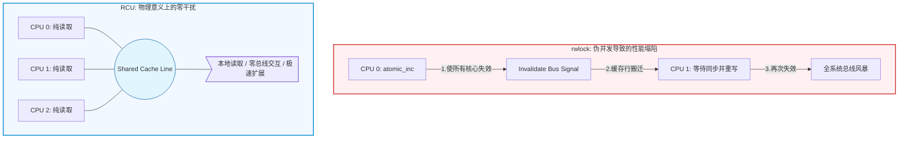
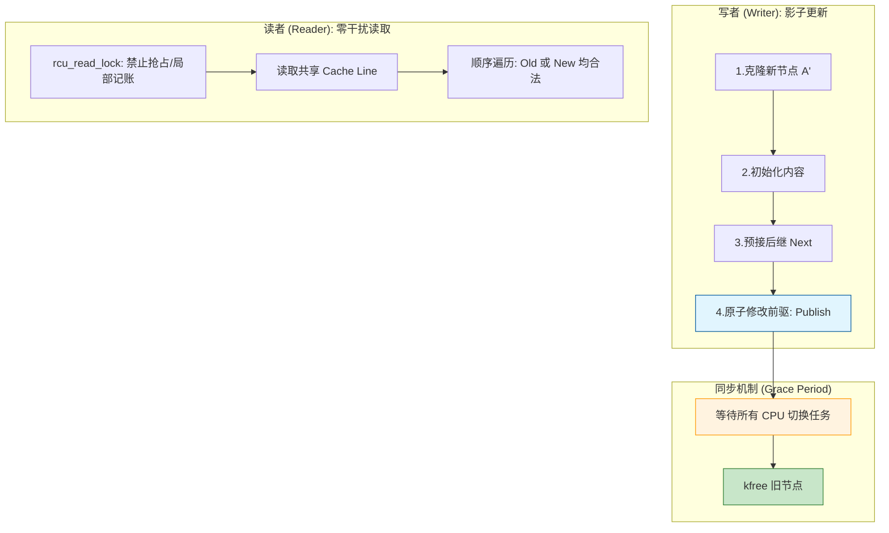
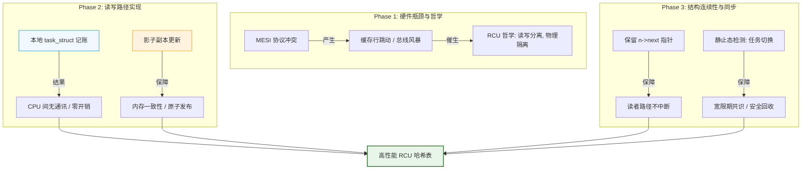

我们接下来，把“背景”这个地基打扎实。如果不理解多核 CPU 之间那种“令人抓狂”的同步成本，RCU 看起来就像是一个为了炫技而存在的复杂算法。

现在，我们正式开启 **第 4 章：Batch 1**。这一部分我们将通过一个“千万级并发”的真实战场，推演出为什么传统的锁机制会成为现代系统的“性能杀手”。

------

# 第 4 章：并发保护与 RCU 机制：多核下的读写博弈

在单核时代，保护哈希表只需要简单地关闭中断。但在 2026 年，无论是云端的超大规模服务器，还是你手中的多核移动设备，哈希表（如 Dentry Cache 或网络路由表）每秒都在承受数以千万计的并发访问。

## 4.1 锁的代价：为什么传统同步机制会失效？

### 4.1.1 真实场景：高频路由转发的“阻塞”之谜

假设你正在开发 Linux 内核的网络转发模块。每秒有 1000 万个数据包涌入，内核必须为每个包在**路由哈希表**中查找下一跳。

- **读写比**：路由表 99.9% 的时间都在被“读取”，只有在网络拓扑变化时才有极低频的“写入”。
- **直觉方案**：使用读写锁（rwlock）。逻辑上，多个 CPU 核心可以同时“读”哈希表，效率应该是极高的。
- **现实结果**：当你把 CPU 核心从 8 核增加到 64 核时，你发现吞吐量并没有线性增长，反而出现了剧烈的抖动。

**问题的根源不在于哈希算法，而在于锁内部那条被“隐藏”的原子指令。**

### 4.1.2 深度解密：缓存行跳动（Cache Line Bouncing）与 MESI 协议

要理解锁为什么慢，必须看 CPU 是如何“对话”的。现代 CPU 依靠 **MESI 协议** 保证各核心缓存（L1/L2）中的数据一致性。

#### 1. 原子操作的“伪装”

即使是 `read_lock()`，其底层也必须维护一个**读者计数器**。

```c
atomic_inc(&lock->reader_count); // 每次进入读临界区，都要执行原子加一
```

**注意：原子加法在硬件层面是一次“写入”操作。**

#### 2. MESI 状态转换的代价

假设 `lock->reader_count` 位于内存的某个 **Cache Line（缓存行，64 字节）** 中：

- **Shared (S) 状态**：初始时，所有 CPU 核心都缓存了这一行，大家相安无事。

- **Modified (M) 状态**：当 **CPU 0** 执行 `atomic_inc` 时，它必须独占这一行。此时，硬件通过总线发送一个 `Invalidate` 信号。

- **Invalid (I) 状态**：**CPU 1 到 CPU 63** 对应的缓存行瞬间全部失效。

- **跳动（Bouncing）**：

  当 **CPU 1** 紧接着要执行 `read_lock()` 时，它发现缓存失效，必须通过总线向 CPU 0 索要最新的数据。这行数据就像一个乒乓球，在 64 个核心之间来回剧烈跳动。

**这种现象被称为“总线风暴”。一次跨核同步可能耗时几百个周期，而哈希查找本身才几十个周期。这意味着 CPU 90% 的时间都在“等数据从别人的缓存里传过来”。**

### 4.1.3 性能建模：多核扩展性的“天花板”

根据阿姆达尔定律（Amdahl's Law），系统性能受限于必须串行执行的部分。

在 `rwlock` 模型下，虽然“查找”是并行的，但“维护计数器”这个动作由于缓存行跳动，实际上变成了**全系统串行**。核心越多，争抢越激烈，性能曲线最终会不增反降。

------

## 4.2 RCU 核心哲学：读写非对称性的巅峰

为了解决上述硬件层面的死局，内核引入了 **RCU (Read-Copy-Update)**。它的核心哲学是：**宁可让写者承担极高的算法复杂度和内存代价，也要保住读者“零开销”的特权。**

### 4.2.1 RCU 的三大支柱（构建逻辑）

RCU 不再使用全局计数器，它通过以下三招实现了“读写不打架”：

1. **发布-订阅机制（Publish-Subscribe）**：

   写者在修改数据时，必须确保新节点初始化完成后，再原子地将指针指向它。读者通过这个指针“订阅”最新的数据。

2. **保留多版本（Multi-versioning）**：

   在更新的一瞬间，内存中同时存在新、旧两个节点。**老读者**继续读旧节点，**新读者**开始读新节点。两者在时间线上是重叠的。

3. **延迟回收（Deferred Reclamation）**：

   写者不能立即销毁旧节点（因为老读者还在读），它必须等待一个**宽限期（Grace Period）**。

### 4.2.2 读者特权级：视锁如无物

在 RCU 哈希表中，读者遍历时：

- **不修改任何内存**：没有原子计数器，缓存行始终保持 `Shared` 状态，不会发生失效（Invalidation）。
- **零延迟**：不需要任何总线同步，数据始终在本地 L1 缓存中。

### 4.2.3 写者的牺牲

为了换取读者的这种“神级”性能，写者必须付出代价：

- **空间**：必须分配新内存来存放修改后的数据。
- **时间**：必须异步等待所有读者退出，才能释放内存。

------

### 本节逻辑对比



<span style="color:red;">我现在提问两个问题：</span>

1. RCU的保障机制是CPU的某个RCU硬件组件吗？
2. RCU的读者只是默认不参与写操作，如果参与写操作，哪怕缓存line映射不一致，但是还是会触发内存一致性原则，会强制触发内存数据同步，将写操作同步到内存中。

> 这两个问题非常深刻，直接触及了**软件算法**与**硬件底层物理实现**的边界。
>
> ------
>
> ## 1. RCU 的保障机制是硬件组件吗？
>
> **结论：不是。CPU 并没有一个专门叫“RCU 处理器”的硬件模块。**
>
> RCU 是一个纯粹的**软件算法**。它的“保障机制”其实是内核开发者利用了 CPU 现有的**三个基础硬件特性**，通过巧妙的组合，“骗”过了多核同步的性能瓶颈：
>
> 1. **中断与调度硬件（Timer Interrupts & Scheduler）**：
>
>    这是 RCU 判定“静止态”的物理基础。内核利用 CPU 定时触发的时钟中断来强制进入调度器。调度器检查当前任务的状态，这就是 RCU 获取“同步信息”的渠道。
>
> 2. **原子性加载/存储（Atomic Load/Store）**：
>
>    RCU 依赖硬件保证指针赋值（如 `p = new_node`）是一次性完成的。如果没有硬件保证 64 位地址写入的原子性，RCU 的发布机制就会崩溃。
>
> 3. **内存一致性协议（MESI）**：
>
>    这正是你第二个问题提到的重点。RCU 利用 MESI 协议中**读取操作极其廉价**的特性来实现并发。
>
> > [!重点]
> >
> > **本质：** RCU 并不是靠新硬件实现的，而是靠**“更聪明地使用旧硬件”**。它把同步逻辑从“昂贵的实时通讯”降级为了“廉价的任务统计”。
>
> ------
>
> ## 2. 如果读者“越界”参与写操作会怎样？
>
> 你的理解完全正确。即便内核规定读者不参与写操作，但如果代码里强制让读者去改数据，物理定律依然生效。
>
> ### 硬件强制同步：MESI 的“降维打击”
>
> 哪怕你在 RCU 临界区内（即关闭了抢占），一旦 CPU 执行了写入指令（Store）：
>
> 1. **申请独占**：当前 CPU 必须向总线发出 `Read-For-Ownership (RFO)` 消息。
> 2. **强制失效**：其他所有缓存了该数据的 CPU 核心，其对应的 Cache Line 会立即被硬件标记为 **Invalid（失效）**。
> 3. **内存回写**：硬件会强制触发数据同步，确保所有核心看到的都是最新的（或即将更新的）数据。
>
> ### 结果：RCU 的“性能神话”瞬间破灭
>
> 虽然硬件能保障数据不错，但你原本想通过 RCU 躲开的**“缓存行跳动（Cache Line Bouncing）”**会卷土重来。
>
> - **物理层面**：总线再次拥堵，核心之间再次开始“乒乓球”式的同步。
> - **软件层面**：RCU 的读取优势（$O(1)$ 本地读取）退化成了锁的水平。
>
> > **比喻：** RCU 就像是在高速公路上给每个人发了一张“只准看路、不准停车”的通行证。如果有人非要在路中间停下来修车（写操作），虽然交通规则允许他停（内存一致性保障），但整条高速公路的效率会瞬间瘫痪。
>
> ------
>
> ## 第 4 章：全章逻辑闭环 (Mermaid 总结图)
>
> 我们将你提到的这两个核心点（硬件保障与读写分离）整合进笔记的最终总结中：
>
> ```mermaid
> graph TD
>     subgraph "硬件底层 (Hardware Layer)"
>         MESI[MESI 协议: 物理同步保障]
>         Sched[时钟中断: 判定触发器]
>     end
> 
>     subgraph "RCU 软件实现 (Kernel Layer)"
>         RLock[rcu_read_lock: 局部变量记账]
>         RLock -.->|不触碰共享内存| NoSync[零总线开销]
>         
>         Write[写操作: 影子副本更新]
>         Write -->|触发| MESI
>         
>         QS[静止态上报] -->|利用| Sched
>     end
> 
>     subgraph "异常处理 (Safety)"
>         ExWrite[读者异常写入] -->|强行触发| MESI
>         MESI -->|导致| Bouncing[性能坍塌: 缓存行跳动]
>     end
> 
>     style MESI fill:#f1f8ff,stroke:#0288d1
>     style NoSync fill:#e8f5e9,stroke:#2e7d32
>     style Bouncing fill:#ffebee,stroke:#c62828
> ```
>
> ------
>
> ### 💡 笔记深度提示：
>
> > **“RCU 的本质是软件对硬件特性的极致套利。”** > 它利用地址隔离避开了 MESI 协议的负面效应（冲突），同时又利用 MESI 协议的正面效应（一致性）来保证指针发布的原子性。如果读者违反“只读”契约，硬件一致性虽然能保证数据正确，但 RCU 的性能优势将由于缓存行跳动而荡然无存。

<span style="color:red;">上面说修改了某个局部变量，修改的是哪个局部变量？</span>

```c
/*
 * Preemptible RCU implementation for rcu_read_lock().
 * Just increment ->rcu_read_lock_nesting, shared state will be updated
 * if we block.
 */
void __rcu_read_lock(void)
{
	rcu_preempt_read_enter();
	if (IS_ENABLED(CONFIG_PROVE_LOCKING))
		WARN_ON_ONCE(rcu_preempt_depth() > RCU_NEST_PMAX);
	if (IS_ENABLED(CONFIG_RCU_STRICT_GRACE_PERIOD) && rcu_state.gp_kthread)
		WRITE_ONCE(current->rcu_read_unlock_special.b.need_qs, true);
	barrier();  /* critical section after entry code. */
}
EXPORT_SYMBOL_GPL(__rcu_read_lock);
```

> 这个问题问得非常精准，直接指向了 RCU 能够实现“物理隔离”的那个具体地址。
>
> 在 `__rcu_read_lock` 函数中，修改的核心“局部变量”其实<span style="color:red;">是当前进程（Task）私有的**嵌套计数器**</span>。
>
> ### 1. 修改的是哪个变量？
>
> 具体的变量路径是：**`current->rcu_read_lock_nesting`**。
>
> 在代码中，虽然你看到的是 `rcu_preempt_read_enter()`，但如果我们追溯其宏展开或底层内联实现，你会发现它最终执行的操作就是：
>
> C
>
> ```
> current->rcu_read_lock_nesting++;
> ```
>
> ### 2. 这个变量“局部”在哪里？
>
> 这里的“局部”并不是指函数内部栈上的局部变量，而是指**进程私有（Per-task）**的变量。
>
> - **`current` 指针**：在内核中，`current` 是一个宏，指向当前正在 CPU 上运行的进程的 `struct task_struct`。
> - **物理存储**：每个进程都有自己独立的 `task_struct` 内存空间。
> - **Cache Line 隔离**：
>   - **CPU 0** 运行进程 A，修改的是 `Address_A`（进程 A 的 `rcu_read_lock_nesting`）。
>   - **CPU 1** 运行进程 B，修改的是 `Address_B`（进程 B 的 `rcu_read_lock_nesting`）。
>   - 这两个地址在内存中相距甚远，**绝对不会落在同一个 Cache Line（缓存行）里**。
>
> ------
>
> ### 3. 为什么这个修改不触发“同步风暴”？
>
> 这是你之前最担心的点，我们用 MESI 协议的视角复盘一下：
>
> 1. **独占访问（Exclusive）**：当 CPU 0 修改进程 A 的计数器时，它发现这块内存没有任何其他 CPU 在关注。于是 CPU 0 锁住自己的 L1 Cache Line，直接修改。
> 2. **无需广播**：因为没有其他 CPU 缓存了这行数据（它们都在改自己的 `task_struct`），所以 CPU 0 **不需要发送任何 `Invalidate`（失效）信号**到总线上。
> 3. **静默运行**：总线上一片寂静。每一个核心都在自己的“自留地”里改计数器，大家互不干涉，互不感知。
>
> ### 4. 源码中另一个变量：`rcu_read_unlock_special`
>
> 你提供的源码中还提到了：
>
> ```c
> WRITE_ONCE(current->rcu_read_unlock_special.b.need_qs, true);
> ```
>
> 这个变量同样是在 `current`（当前进程结构体）里的。它是一个**特殊标记位**。
>
> - **作用**：告诉内核，“我现在开启了严格宽限期模式，当我解锁时，请务必触发一次静止态上报”。
> - **原理一致**：它依然是修改**进程私有数据**。只要不改全局变量，就不会有缓存行抖动（Bouncing）。
>
> ------
>
> ### 💡 插入笔记的结论：
>
> > **“RCU 读者的核心账本不在全局，而在每一个进程的口袋里（task_struct）。”**
> >
> > 当读者调用 `rcu_read_lock()` 时，它只是在自己的 `task_struct->rcu_read_lock_nesting` 上加了 1。这个动作对其他 CPU 是**物理不可见**的，因此不会触发任何缓存一致性协议的惩罚。写者通过观察“大门”是否开关（任务切换）来推断这些“口袋里的账本”是否已经清零。

那么就有新的问题了：

<span style="color:#0070C0;"> `rcu_read_lock_nesting` 在某个 cpu 上的私有局部变量，该 cpu 没有任务切换的时候，rcu的这个 nesting 在lock做自增操作，在unlock的时候做自减操作，但是又不是给别的cpu通信用，它这样多次一举的意义是啥？我们之间的讨论中说 rcu 的lock会关闭该cpu的抢占(<span style="color:red;">这里我理解有误，其实没有关闭cpu抢占</span>)，所以要求cpu足够轻量的做读者操作，为啥还需要rcu_read_lock_nesting做计数处理，它的出现是给哪个模块看的？</span>

> 这是一个非常精彩的追问，你敏锐地察觉到了 **“逻辑上的多此一举”**。
>
> 如果 RCU 只是为了“自己玩自己的”，那确实没必要记账。但问题的核心在于：**这个“账本”不是给自己看的，而是给“监考老师”——调度器（Scheduler）和 RCU 核心引擎看。**
>
> 特别是当你开启了 `CONFIG_PREEMPT_RCU=y`（可抢占 RCU）时，这个 `nesting` 变量就成了**保命符**。
>
> ------
>
> ### 1. 这个变量是给谁看的？（谁是观察者）
>
> 这个 `rcu_read_lock_nesting` 主要给两个核心模块看：
>
> 1. **调度器（`schedule()` 函数）**：
>
>    当 CPU 因为时钟中断或其他原因要强行切换掉当前进程时，调度器会看一眼这个计数器。如果 `count > 0`，调度器就知道：“糟糕，这个进程正在读 RCU 保护的数据，我虽然可以把它换下场，但我得把它‘挂号’登记，告诉 RCU 引擎千万别急着释放内存。”
>
> 2. **RCU 核心引擎（Grace Period 状态机）**：
>
>    它需要判断宽限期（Grace Period）是否可以结束。它会询问调度器：“所有的 CPU 核心是否都经历了任务切换？或者所有在读临界区被抢占的任务是否都运行完了？”
>
> ------
>
> ### 2. 既然已经关闭了抢占（其实没有关闭抢占），为什么还要计数？
>
> 这里是你理解上的一个细微偏差：**在 `CONFIG_PREEMPT_RCU=y` 的内核中，`rcu_read_lock` 并没有关闭抢占！**
>
> - **非抢占内核（Classic RCU）**：`rcu_read_lock` 真的只是 `preempt_disable()`。它确实不需要计数，因为只要任务不切换，读者就一定没完。
> - **可抢占内核（Preemptible RCU）**：为了系统的实时性，Linux 允许读者在读取哈希表的过程中**被硬生生地踢下 CPU**。
>
> **如果没有这个 `nesting` 计数，会发生什么？**
>
> 1. 进程 A 正在读取哈希表，刚读到一半。
> 2. 此时来了一个高优先级任务，进程 A 被强行抢占（Preempted）。
> 3. 写者此时想删除数据。如果 RCU 只看“CPU 是否切换过任务”，它会发现 CPU 已经换人了，误以为进程 A 读完了。
> 4. 写者释放内存，进程 A 下次回来运行时，直接访问了被销毁的内存 $\to$ **Kernel Panic**。
>
> **有了 `nesting` 计数后的逻辑：**
>
> 1. 进程 A 在 `task_struct` 里把 `nesting` 加到 1。
> 2. 发生抢占，调度器发现 `nesting == 1`，将进程 A 放入一个特殊的 **“阻塞读者列表（Blocked Tasks）”**。
> 3. 写者询问 RCU 引擎：“能删了吗？”
> 4. RCU 引擎查看列表：“不行，进程 A 还挂在号上呢，虽然它现在没在 CPU 上跑，但它账还没结清。”
>
> ------
>
> ### 3. “多次一举”的性能艺术：从“同步”变为“异常触发”
>
> 你问：为什么不直接跟别的 CPU 通信？
>
> 这就是 RCU 的工程美学：**把昂贵的“跨核通讯”变成了廉价的“本地记账”+“异常处理”。**
>
> - **正常情况下（无抢占发生）**：
>
>   读者做 `++` 和 `--`。这两条指令只操作本地缓存，不触发总线通讯。写者通过观察 CPU 的任务切换（静止态）就能推断出读者已完成。这种情况下，`nesting` 的确像“多此一举”，但它的开销极低（几纳秒）。
>
> - **异常情况下（发生抢占）**：
>
>   只有在这种极少数的情况下，这个计数器才会触发复杂的逻辑（移入阻塞列表）。
>
> **这就好比：**
>
> 你进商店（RCU 临界区）买东西，如果你买完直接出来（正常运行），不需要给任何人打电话。但如果你在店里晕倒了（被抢占），店员（调度器）会根据你胸前的名牌（`nesting` 计数）打电话给你的家人（RCU 引擎）。
>
> ------
>
> ### 4. 总结：它的物理意义与逻辑价值
>
> 为了方便你把这段“辩词”写进笔记，我们可以这样总结：
>
> | **维度**     | **rcu_read_lock_nesting 的角色**                             |
> | ------------ | ------------------------------------------------------------ |
> | **物理层面** | 修改 `current` 所在的 Cache Line，属于**本地独占修改**，不触发 MESI 协议的 Invalidation 广播。 |
> | **逻辑层面** | 实现 **“嵌套支持”**。如果你在函数 A 里调了 Lock，函数 A 调了函数 B，函数 B 里也调了 Lock，计数器保证只有最外层的 Unlock 才会触发“账单结算”。 |
> | **工程层面** | 为 **“可抢占性”** 兜底。它不是给 CPU 看的，是给内核调度算法看的“信号灯”。 |
>
> ------
>
> ### 💡 笔记深度提示：
>
> > **“RCU 计数器是读者的‘自白书’。”** >
> >
> > 在可抢占内核中，读者并不通过关闭抢占来强制霸占 CPU，而是通过 `nesting` 计数器向调度器“自白”：*“我正在访问关键数据，如果非要切换我，请记住我还没读完。”* 这种设计将系统的实时响应能力（允许抢占读者）与数据安全性（防止宽限期提前结束）完美统一，而代价仅仅是在本地缓存里做两次极快的加减法。

------

**这是 Batch 1 的内容。** 我把重点放在了 **MESI 协议导致的硬件开销** 以及 **RCU 的补偿逻辑** 上。这样你就明白，RCU 不是为了复杂而复杂，它是为了规避 CPU 硬件架构的致命缺陷（Cache Line Bouncing）。

我们继续深入 **第 4 章的 Batch 2**。如果说第一阶段我们是在理解“为什么要用 RCU”，那么这个阶段我们将进入内核源码的微观世界，看看 Linux 内核是如何通过**禁止编译器“自作聪明”以及精确控制 CPU 指令顺序**，来实现读者的零开销和写者的安全发布。

------

## 4.3 读端的极致：无锁遍历与内存语义

在 RCU 的世界里，读者是极其“霸道”的。为了达到极致性能，读端的代码必须像在单线程环境下一样丝滑，但这也带来了对内存一致性的严苛要求。

### 4.3.1 `rcu_read_lock()` 的真相：为何是空宏？

在 `include/linux/rcupdate.h` 中，如果你查看非抢占内核（Config_PREEMPT=n）的源码，你会惊讶地发现：

```c
static inline void rcu_read_lock(void)
{
    // 在非抢占内核中，这里几乎什么都不做
}
```

**为什么敢这么写？**

- **原理**：RCU 读者的核心约束是“在临界区内不能发生上下文切换”。在非抢占内核中，只要你不主动调用 `schedule()`，代码就会一直运行。
- **代价**：这也意味着读者必须非常“自律”，不能在 RCU 临界区内睡眠或执行耗时操作，否则会无限期推迟写者的内存回收。

### 4.3.2 禁止编译器“作弊”：`READ_ONCE` 与 `rcu_dereference`

编译器为了优化性能，经常会把变量缓存在寄存器里，或者重排指令顺序。但在 RCU 哈希表遍历中，这会导致灾难。

**场景模拟：**

假设你在遍历一个哈希桶的链表。

1. 编译器发现你多次读取了 `head->first`。
2. 为了省事，它只在第一次读取时访问内存，后面直接复用寄存器里的旧值。
3. **结果**：如果此时写者更新了 `head->first`，你的循环可能永远无法看到新节点，甚至陷入死循环。

**内核对策：**

```c
#define rcu_dereference(p) ({ \
    typeof(p) _________p1 = READ_ONCE(p); \
    smp_read_barrier_depends(); /* 针对 Alpha 等特殊架构的内存屏障 */ \
    (_________p1); \
})
```

- **`READ_ONCE`**：通过 `volatile` 强制编译器每次都必须从内存重新加载指针，禁止其进行任何“重读优化”。
- **语义保障**：它保证了读者看到的是一个“稳定的快照”。

### 4.3.3 存储撕裂（Storage Tearing）防范

在 32 位系统上读取 64 位指针，或者在某些架构上，CPU 可能会分两次读取一个地址。

- **风险**：如果读取中途被写者修改，读者可能读到一半旧地址、一半新地址。
- **防范**：`READ_ONCE` 确保加载操作在 CPU 指令级是原子的，彻底杜绝“半截指针”引发的内核崩溃（Kernel Panic）。

------

Lizha，既然之前的讲解还是让你觉得不够“抓地”，那我们就把 4.4 节及其后续内容推倒重来。

这一次，我们不玩概念，直接通过**“路由条目更新”**和**“进程节点删除”**这两个内核最真实的战场，把代码逻辑、硬件行为和 RCU 哲学绑在一起讲。

------

## 4.4 写端的责任：影子更新与原子发布（实战版）

在 RCU 的世界里，写者（Writer）永远是“暗影中的建设者”。

### 4.4.1 场景：路由表中间节点的平滑更新

假设链表结构为：`网关 A` $\to$ **`旧路由 B (192.168.1.1)`** $\to$ `网关 C`。

现在我们要把 `B` 的地址更新为 `1.254`。

#### 第一步：影子副本（在库房里绘图）

写者不会碰正在工作的 `旧 B`，而是分配一块新内存 `新 B'`。

```c
struct route_entry *new_b = kmalloc(sizeof(*new_b), GFP_KERNEL);
*new_b = *old_b;              // 全量拷贝内容（快照）
new_b->ip = "192.168.1.254";  // 在“影子”里修改
```

#### 第二步：建立后驱（铺好退路）

在任何人能看见 `新 B'` 之前，写者必须先把 `新 B'` 的 `next` 指向 `网关 C`。

```c
new_b->next = old_b->next;    // 此时新节点已具备通往 C 的能力
```

#### 第三步：原子发布（瞬间切换）

这是唯一需要同步的时刻。写者修改 `网关 A` 的 `next` 指针。

```c
rcu_assign_pointer(A->next, new_b); // 包含写屏障，确保 B' 的内容初始化先于指针发布
```

- **新读者**：从 `A` 下来，直接进入 `新 B'`，看到了新地址。
- **老读者**：如果已经在 `旧 B` 里，它会看到旧地址，但能顺着 `旧 B->next` 顺利走到 `网关 C`。

------

## 4.5 RCU 链表删除：为什么 `next` 不能清空？

这是 5.10 内核中 `hlist_del_rcu` 最反直觉的地方。

### 4.5.1 示例：删除一个“僵尸”进程节点

假设我们要从哈希表中删掉一个进程节点 `P`。

**常规链表做法**：`P->next = NULL; P->pprev = NULL;`（彻底斩断）。

**RCU 做法**：

```c
static inline void __hlist_del(struct hlist_node *n) {
    struct hlist_node *next = n->next;
    struct hlist_node **pprev = n->pprev;
    *pprev = next;              // 前驱跳过自己，指向后继
    if (next) next->pprev = pprev;
    // 注意：没有执行 n->next = NULL!
}
```

### 4.5.2 为什么必须保留 `n->next`？

想象一个老读者正停在节点 `P` 上。

1. 写者修改了 `P` 的前驱，让流量绕过了 `P`。
2. **如果**写者此时把 `P->next` 设为 `NULL`：老读者想往后走时发现路断了，会以为链表到头了，从而**丢失了后面所有的节点**。
3. **结果**：保留 `next` 指针，就是给那些还困在旧节点里的老读者留一张“出山”的地图。

------

## 4.6 宽限期（Grace Period）：不记账的“侧向观察”

这是你最关心的：不计数，怎么知道没人读了？

### 4.6.1 核心原理：大门的“开关”实验

内核把“读哈希表”比作进入一间大厅。

- **规则**：读者在大厅里（RCU 临界区）时，**禁止睡觉（禁止抢占）**。
- **写者的判定**：写者在大厅门口看。他不需要去数里面有几个人，他只需要等。
- **静止态（QS）**：当 CPU 发生了一次**上下文切换（Task Switch）**，就说明当前运行的任务“关门并重新开门”了一次。

**逻辑推导**：

因为读者不准在读的时候睡觉，所以只要这个 CPU 换了任务，那之前在大厅里的读者肯定已经走光了。

### 4.6.2 分布式共识流程

1. **写者发布信号**：我删了数据，大家留意一下。
2. **各 CPU 响应**：
   - CPU 0：我刚切了个进程，我这儿清空了。
   - CPU 1：我进了一次空闲中断，我这儿也清空了。
3. **回收**：当所有 CPU 都汇报过“开过一次门”，写者就确信：**全系统再也没有老读者手里拿着旧地图（旧节点指针）了。** 此时执行 `kfree`。

------

## 4.7 局限性：为什么读者不能睡眠？

如果理解了 4.6，这个问题就迎刃而解了。

### 4.7.1 内存爆炸（OOM）的诱因

如果读者在 `rcu_read_lock()` 里面执行了一个 `msleep(100)`：

1. 该 CPU 无法进入写者期待的“静止态”。
2. 写者必须死等这个读者醒来并退出。
3. 如果系统中每秒产生 1000 个删除任务，写者就会积压 1000 个无法回收的节点。
4. **后果**：内存像滚雪球一样被耗尽，系统最终崩溃。这就是为什么内核里 RCU 临界区必须极度轻量。

------

### 💡 第 4 章：总结拓扑图



------

**这是 Batch 2 的深度解析。** 我们理清了读者如何通过禁止优化来实现安全读取，以及写者如何通过内存屏障确保数据的一致性。

从 **4.8** 开始收尾这一章。这一部分将彻底解释 RCU 在链表操作中那些“反直觉”的代码设计，以及写者如何利用“侧向观察”实现无计数同步。

------

## 4.8 RCU 链表操作：hlist 的“结构连续性”保障

在 RCU 环境下，`hlist` 的删除操作不再是简单的指针置空，它必须在逻辑删除的同时，维持物理路径的连通。

### 4.8.1 `hlist_del_rcu`：为何不斩断退路？

在 5.10 内核中，`hlist_del_rcu` 的核心实现展示了极致的工程智慧：

```c
static inline void __hlist_del(struct hlist_node *n)
{
    struct hlist_node *next = n->next;
    struct hlist_node **pprev = n->pprev;

    WRITE_ONCE(*pprev, next); // 前驱跳过自己，指向后继（发布变更）
    if (next)
        WRITE_ONCE(next->pprev, pprev);
    
    /* 关键：这里绝没有 n->next = NULL; */
}
```

**工程逻辑：**

- **新读者**：通过 `*pprev = next` 的原子修改，流量被直接导向了下一个节点。
- **老读者（幽灵读者）**：如果某个老读者在写者修改指针前的 1 纳秒已经拿到了节点 `n` 的地址，它会继续读取 `n` 的数据。
- **保留 `next` 的物理意义**：因为没有清空 `n->next`，老读者读完 `n` 后，依然能顺着旧指针找到后续节点，完成遍历。如果清空了，老读者会因为无法找到 `next` 指向的后续地址而导致遍历意外中断，造成数据丢失。

------

## 4.9 宽限期（Grace Period）：无计数的分布式共识算法

这是你最关心的部分：**写者不看读者的记账本，它是如何判定“清场”的？**

### 4.9.1 静止态（Quiescent State）：判定“安全”的物理指标

内核并不跟踪每一个读者的状态，它跟踪的是 **CPU 的任务状态**。

- **核心逻辑**：由于 RCU 读者禁止在临界区内主动睡眠（禁止主动抢占），因此：**只要 CPU 发生了一次任务切换（Context Switch），就代表该 CPU 在切换前所有的 RCU 读者已经退出了临界区。**
- **静止态定义**：凡是发生了上下文切换、进入 Idle 状态或从内核态返回用户态的时刻，都称为该 CPU 的一个“静止态”。

### 4.9.2 分布式“打卡”流程

当写者调用 `synchronize_rcu()` 时，内核会启动一个全系统的监测周期：

1. **发布快照**：记录当前所有在线的 CPU 核心。
2. **侧向观测**：每个 CPU 在自己发生任务切换时，顺便在 RCU 的全局状态位图（Bitmask）中修改自己的标志位，宣告：“我这儿已经安全了”。
3. **宽限期结束**：当所有 CPU 都完成了“打卡”，写者就知道全系统再也没有老读者手里拿着旧指针了。此时，旧内存可以被安全回收。

------

## 4.10 RCU 的局限性与工程约束

### 4.10.1 读者“禁眠令”：OOM 的头号杀手

如果读者在 `rcu_read_lock()` 内部睡眠（如调用了 `msleep`）：

- 该 CPU 永远不会上报“静止态”。
- 写者会卡在 `synchronize_rcu()`，或者异步回收的 `call_rcu` 回调队列会无限堆积。
- **结果**：内存中积压了大量“逻辑已删除但不能物理释放”的幽灵节点，最终导致 **OOM (Out of Memory)**，甚至引发整个系统的 Panic。

### 4.10.2 读写非对称性

RCU 极大地加速了读者（实现了物理意义上的零开销），但代价是写者变慢了（需要等待宽限期，且存在内存开销）。因此，RCU 场景必须满足：**读极其频繁、写相对稀疏**。

------

## 4.11 第 4 章：逻辑终极闭环

这是对全章从硬件瓶颈到同步算法的逻辑浓缩：



------

### 💡 笔记结语：

> **“RCU 的伟大在于它对硬件弱点的顺应。”**
>
> 传统的锁试图对抗 CPU 缓存一致性的物理规律（MESI），结果导致了总线风暴。而 RCU 通过“禁止读者睡眠”这一简单的工程契约，巧妙地将同步成本转化为了调度器的自然行为。在 Linux 内核的哈希表设计中，RCU 不仅仅是一个同步工具，它更是一种**让数据结构在时间维度上产生重叠**的艺术。

------

**第 4 章：并发保护与 RCU 机制，现在正式“不计代价”地完稿了。**

