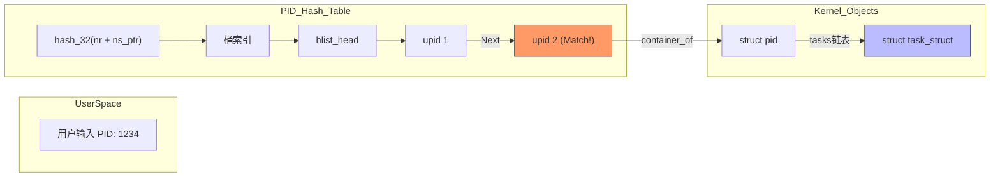
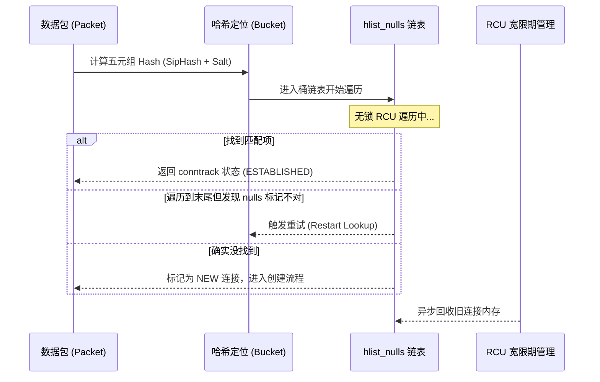

# 第 6 章：哈希表在内核子系统中的影子

在 Linux 内核中，哈希表（Hashtable）绝非简单的容器，它通常被视为一种**“带有缓存特性的索引架构”**。为了支撑每秒数万次的进程切换、数百万次的路径解析以及高速网络转发，内核对哈希表进行了极致的工程改造。

## 6.1 进程管理：PID 哈希表与 `task_struct` 的快速映射

### 6.1.1 问题背景：从 $O(n)$ 到 $O(1)$ 的必然选择

在 Linux 内核中，每个进程都由一个庞大的 `struct task_struct` 表示。假设系统当前运行着 10,000 个进程：

1. **线性搜索的噩梦**：当你执行 `kill 1234` 时，如果内核通过遍历全局进程链表 `for_each_process` 来寻找 PID，平均需要对比 5,000 次。这种 $O(n)$ 的开销在进程频繁创建和销毁的现代系统中是不可接受的。
2. **命名空间的隔离挑战**：随着容器化技术（Docker/K8s）的普及，PID `1` 不再唯一。宿主机有一个 PID `1`，每个容器里也有一个 PID `1`。内核必须在常数时间内，既能通过 PID 找到进程，又能精准识别它属于哪个“房间”（Namespace）。

### 6.1.2 5.10 内核的解法：多层级 PID 哈希架构

内核引入了 `struct pid` 和 `struct upid` 来实现解耦。`pid_hash` 数组充当了全局索引表，其大小在系统启动时根据内存总量动态计算。

#### 核心数据结构：

```c
/* include/linux/pid.h (5.10 内核) */
struct upid {
    int 				nr;        // 进程在特定命名空间内的 PID 数值
    struct pid_namespace *ns;   	// 该 PID 所属的命名空间
    struct hlist_node 	 pid_chain;	// 挂载到全局 pid_hash 的哈希节点
};

struct pid {
    refcount_t 			count;
    unsigned int 		level;         		// 该 PID 存在的命名空间层级深度
    struct hlist_head 	tasks[PIDTYPE_MAX];  // 指向 task_struct 的链表
    struct upid 		numbers[1];     	// 这是一个可变长度数组，存储各层级的 upid
};
```

### 6.1.3 深度源码：无锁 RCU 检索逻辑

PID 的查找是典型的“读多写少”场景。内核利用 **RCU (Read-Copy-Update)** 机制，使得查找过程完全不需要加锁，从而避免了 CPU 流水线的停顿。

```c
/* kernel/pid.c */
struct pid *find_pid_ns(int nr, struct pid_namespace *ns)
{
    struct upid *pnr;
    struct hlist_node *node;

    // 1. 开启 RCU 读临界区：保证遍历期间内存不会被物理释放
    rcu_read_lock();

    // 2. pid_hashfn 结合了 nr 和 ns 指针，有效减少不同 namespace 间的碰撞
    hlist_for_each_entry_rcu(pnr, node, &pid_hash[pid_hashfn(nr, ns)], pid_chain) {
        if (pnr->nr == nr && pnr->ns == ns) {
            rcu_read_unlock();
            // 3. 命中！通过 container_of 偏移计算找回 struct pid
            return container_of(pnr, struct pid, numbers[ns->level]);
        }
    }
    
    rcu_read_unlock();
    return NULL;
}
```

#### Typora 逻辑示意图



------

## 6.2 文件系统：Dentry Cache (Dcache) —— 哈希锁的艺术

### 6.2.1 问题背景：路径解析的巨额成本

在 Linux 中，“一切皆文件”。访问 `/usr/bin/python3` 需要经历三次目录查找。

- **痛点**：如果每次查找都访问磁盘的 Inode 区域，磁盘 I/O 将成为系统瓶颈。
- **需求**：需要将“路径名”快速映射到“内存 Dentry 对象”，且必须支撑极高的并发访问。

### 6.2.2 极致优化：位锁 (Bit Spinlock) 与 `hlist_bl`

Dcache 面临一个工程难题：一个大型系统可能有数百万个哈希桶。如果每个桶都配一个普通的 `spinlock_t`（通常占 4-24 字节），会白白消耗数 MB 内存。

内核开发者的“神来之笔”是 `hlist_bl_head`（带位锁的链表头）。它利用了**指针内存对齐**的特性：在 64 位系统下，指针地址末位必然是 `0`。内核利用这个 **Bit 0** 作为自旋锁。

```c
/* include/linux/list_bl.h */
static inline void hlist_bl_lock(struct hlist_bl_head *b)
{
    // 原子性地将地址的第 0 位置为 1
    // 如果原先就是 1，说明有人持锁，原地自旋
    while (test_and_set_bit(0, (unsigned long *)b)) {
        while (test_bit(0, (unsigned long *)b))
            cpu_relax();
    }
}
```

**这种设计让哈希桶在保持细粒度锁的同时，实现了“零额外空间”开销。**

### 6.2.3 Dcache 快速路径检索流程

在查找文件时，内核首先尝试 **RCU Fast Path**。只有当发生哈希冲突或文件正在被重命名（Rename）时，才会降级到加锁的 Slow Path。

```Mermaid
graph TD
    Start[路径查找请求] --> CalcHash[计算 d_hash: <br/>parent + name]
    CalcHash --> Bucket[定位 dentry_hashtable 桶]
    
    subgraph RCU_Fast_Path
    Bucket --> RCU_Iter[hlist_bl_for_each_entry_rcu]
    RCU_Iter --> MatchHash{Hash 匹配?}
    MatchHash -->|Yes| SeqCheck{Seqlock 校验}
    SeqCheck -->|Pass| NameCmp[memcmp 字符串精确比对]
    end
    
    NameCmp -->|Success| Return[命中结果]
    SeqCheck -->|Fail| SlowPath[降级到 Bit-Spinlock 模式]
    NameCmp -->|Fail| Disk[磁盘读取 Inode]

    style RCU_Fast_Path fill:#e1f5fe,stroke:#01579b
    style Return fill:#c8e6c9,stroke:#2e7d32
```

### 6.2.4 关键技术：对抗哈希洪水攻击

为了防止恶意用户构造大量相同哈希值的路径来瘫痪系统（Hash DoS 攻击），Dcache 引入了 `hash_32` 结合全局随机种子 `hash_highbuffer_salt`。这保证了即使路径名已知，攻击者也无法预测其在内核哈希表中的分布位置。

------

**这是第 6 章的前两个核心小节。** 深入补充了 PID 命名空间逻辑、Dcache 位锁源码以及相关的工程背景。好的，我们继续深入探讨第 6 章的最后一个硬核阵地：**网络协议栈**。

在内核网络子系统中，哈希表不仅是数据存储的容器，更是决定系统吞吐量（Throughput）和抗攻击能力（Security）的核心防线。

------

## 6.3 网络协议栈：Conntrack 与邻居表的性能基石

### 6.3.1 问题背景：每秒百万级数据包的“身份审查”

在一个繁忙的 Linux 网关或防火墙上，每秒钟可能有数百万个数据包流过。

1. **连接跟踪的挑战**：对于每一个进来的 TCP 包，内核必须立刻判断：它是属于一个已有的连接，还是一个非法伪造的包？这需要对（源IP、目的IP、源端口、目的端口、协议）这个“五元组”进行查找。
2. **二层转发的瓶颈**：当包准备发往下一跳时，内核需要通过目标 IP 找到对应的 MAC 地址（ARP 缓存）。如果这个查找慢了，整个网络带宽就会被 CPU 阻塞。

### 6.3.2 Conntrack (连接跟踪)：五元组的极速索引

Conntrack 是 Linux 防火墙（Netfilter）的灵魂。它使用了一个全局的哈希表 `nf_conntrack_hash`。

#### 核心数据结构：`nf_conntrack_tuple_hash`

为了实现双向通信（请求与响应）的关联，一个连接在哈希表中实际上对应两个节点：

```c
/* include/net/netfilter/nf_conntrack_tuple.h */
struct nf_conntrack_tuple_hash {
	struct hlist_nulls_node	hnnode; // 注意：这里使用了特殊的 hlist_nulls
	struct nf_conntrack_tuple tuple; // 存储五元组信息
};
```

> **深度细节：为什么使用 `hlist_nulls`？**
>
> 在极高并发下，节点可能从一个哈希桶移动到另一个桶。传统的 `hlist` 在这种情况下可能导致遍历者中途“迷路”。`hlist_nulls` 在链表末尾存储了一个带有桶索引信息的特殊标记，如果遍历者发现自己跳到了错误的桶，它能立刻察觉并重试，从而彻底避免了在大规模并发下的昂贵锁操作。

#### 检索逻辑：`____nf_conntrack_find`

这是网络协议栈中最热的代码路径之一：

```c
/* net/netfilter/nf_conntrack_core.c */
struct nf_conntrack_tuple_hash *
____nf_conntrack_find(struct net *net, const struct nf_conntrack_zone *zone,
		      const struct nf_conntrack_tuple *tuple, u32 hash)
{
	struct nf_conntrack_tuple_hash *h;
	struct hlist_nulls_node *n;
	unsigned int bucket = reciprocal_scale(hash, net->ct.htable_size);

	// 1. RCU 读者锁定，完全无阻塞
	rcu_read_lock();
begin:
	hlist_nulls_for_each_entry_rcu(h, n, &net->ct.hash[bucket], hnnode) {
		// 2. 只有五元组和网络命名空间完全匹配才算命中
		if (nf_ct_tuple_equal(tuple, &h->tuple) &&
		    nf_ct_zone_equal(nf_ct_tuplehash_to_ctrack(h), zone, NF_CT_DIRECTION(h))) {
			return h;
		}
	}

	// 3. 检查是否因为并发导致掉入错误的桶
	if (get_nulls_value(n) != bucket)
		goto begin;

	rcu_read_unlock();
	return NULL;
}
```

------

### 6.3.3 邻居表 (ARP Cache)：二层转发的最后一步

当数据包要离开主机时，必须通过 `struct neighbour`（邻居表）找到下一跳的 MAC 地址。

- **数据结构**：`struct neighbour_table` 维护着一个哈希表。
- **哈希函数**：通常使用 IP 地址作为 Key。
- **痛点**：如果遭受 ARP 扫描攻击，哈希表会迅速膨胀，导致查找效率下降。为此，内核在邻居表中引入了**垃圾回收（GC）机制**，当哈希节点超过阈值时，会强制清理掉过期的条目。

------

### 6.3.4 安全防御：对抗哈希洪水攻击 (Hash DoS)

这是内核工程中极其精彩的一部分。如果攻击者知道内核使用的哈希算法（例如简单的线性乘法），他们可以构造大量哈希值完全相同的包，强制让哈希表退化成一根极长的链表，从而耗尽 CPU。

**内核的防御三板斧：**

1. **随机 Salt**：系统启动时生成一个随机数 `hash_rnd`，攻击者由于不知道这个随机数，无法离线计算出碰撞的 Key。
2. **SipHash 算法**：在 5.10 等现代内核中，许多关键子系统引入了更安全的 SipHash 算法，它在数学上更难被预测和破解。
3. **定期扰动**：网络协议栈会定期重新计算哈希种子，即便攻击者在线探测到了碰撞规律，这个规律也会在几分钟内失效。

------

### 6.3.5 逻辑示意图：Conntrack 并发检索流



------

### 知识点进阶小结

> [!TIP]
>
> **在记录时，请务必关注这三者的区别：**
>
> - **PID 哈希表**：追求极致速度，使用静态预分配数组 + RCU。
> - **Dcache 哈希表**：为了节省内存，创造性地使用了**位锁 (Bit Spinlock)**。
> - **网络哈希表**：为了对抗外部攻击，引入了 **SipHash** 和 **hlist_nulls** 容错机制。

------

**第 6 章到此结束。** 我们已经从进程、文件系统、网络三个维度，深度剖析了哈希表在内核中的“影子”。

