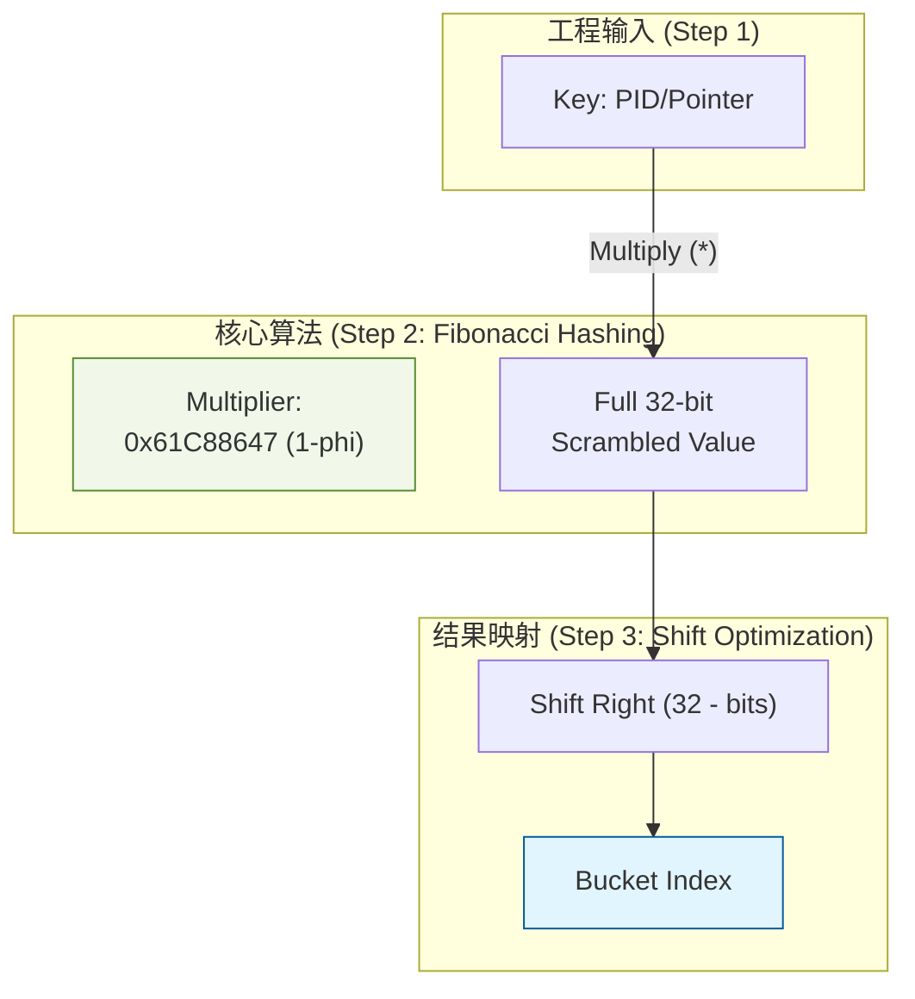
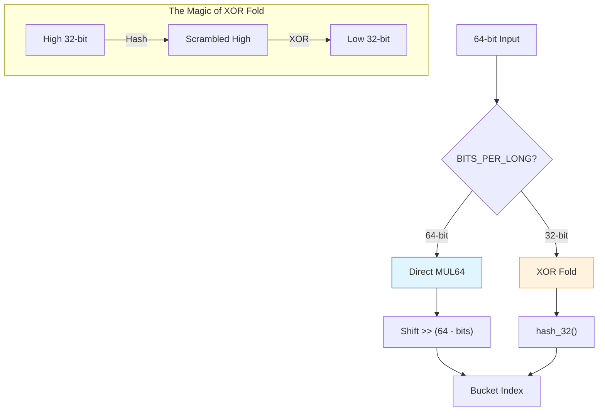
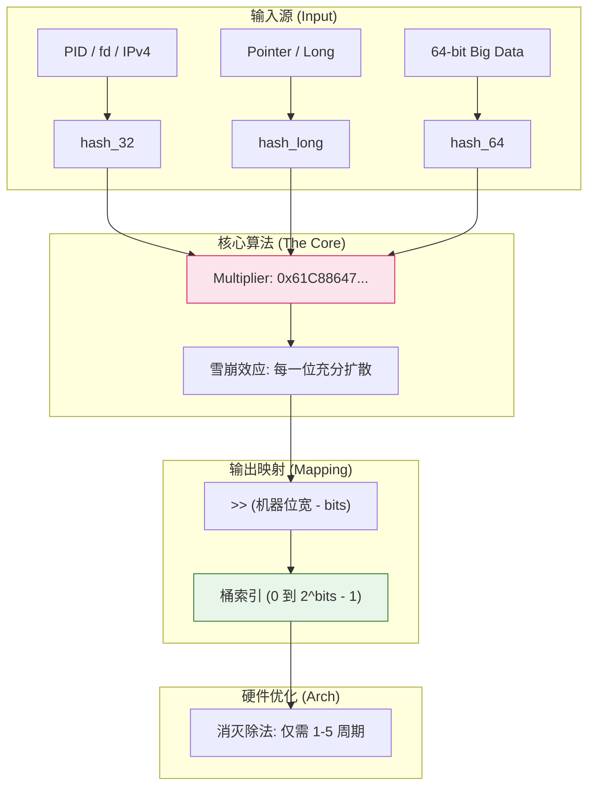

明白了，Lizha。我们把这一章做得更像是一篇从工程实践引向数学巅峰的“技术白皮书”。

要理解内核哈希的算法细节，必须先看它在真实的内核子系统中是如何被“雇佣”工作的。如果直接谈数学，就像是在没见过大楼的情况下讨论搬砖的姿势。

这一章我将分为 **三个批次** 展开。本批次为 **Batch 1：工程应用全景与数学原型推导**。

------

# 第 3 章：算法之魂(Batch 2/3)：哈希函数与位运算优化

在 Linux 内核中，哈希表（Hash Table）随处可见：管理进程的 PID 哈希表、加速文件查找的 Dentry Cache、乃至网络协议栈中的连接跟踪表。在每秒百万次的查询压力下，哈希函数如果多浪费一个 CPU 周期，对整个系统都是巨大的损耗。

本章将从内核如何构建一个哈希表开始，一步步揭开 `0x61C88647` 这个神秘数字背后的工程博弈。

## 3.1 内核哈希表的构建全景：从声明到落桶

在内核开发者眼中，构建一个高效的哈希查找逻辑通常遵循“三步走”战略。

### 3.1.1 定义与初始化

内核通过 `DEFINE_HASHTABLE` 宏来静态定义哈希表。这里的核心参数是 `bits`（2 的幂次）。

```c
/* 声明一个拥有 2^8 = 256 个桶的 PID 哈希表 */
DEFINE_HASHTABLE(pid_hash_table, 8); 
```

- **工程考量**：为什么不用具体的数字而是用 `bits`？因为内核的所有优化都建立在 **$2^n$** 的基础上。

`DEFINE_HASHTABLE()` 定义位于 [include/linux/hashtable.h](../../../kernel_source/include/linux/hashtable.h.md):

```c
#define DEFINE_HASHTABLE(name, bits)						\
	struct hlist_head name[1 << (bits)] =					\
			{ [0 ... ((1 << (bits)) - 1)] = HLIST_HEAD_INIT }
```

* [**`struct hlist_head`（哈希桶头）定义说明**](./第2章_内核基石：hlist非对称链表.md# 内核源码结构定义：)，定义位于 [include/linux/types.h](../../../kernel_source/include/linux/types.h.md);

* `HLIST_HEAD_INIT` 定义位于 [include/linux/list.h](../../../kernel_source/include/linux/list.h.md)：

  ```c
  /*
   * Double linked lists with a single pointer list head.
   * Mostly useful for hash tables where the two pointer list head is
   * too wasteful.
   * You lose the ability to access the tail in O(1).
   */
  
  #define HLIST_HEAD_INIT { .first = NULL }
  ```

### 3.1.2 键值的“粉碎”与“扩散” (Hashing)

当一个 PID（如 1234）进入系统，内核需要将其转化成一个毫无规律、分布极广的 32 位整数。这就是 `hash_32` 的职责。

```c
u32 key = hash_32(pid_number, 8);
```

`hash_32()` 定义位于 [include/linux/hash.h](../../../kernel_source/include/linux/hash.h.md):

```c
/*
 * The _generic versions exist only so lib/test_hash.c can compare
 * the arch-optimized versions with the generic.
 *
 * Note that if you change these, any <asm/hash.h> that aren't updated
 * to match need to have their HAVE_ARCH_* define values updated so the
 * self-test will not false-positive.
 */
#ifndef HAVE_ARCH__HASH_32
#define __hash_32 __hash_32_generic
#endif
static inline u32 __hash_32_generic(u32 val)
{
	return val * GOLDEN_RATIO_32;
}

#ifndef HAVE_ARCH_HASH_32
#define hash_32 hash_32_generic
#endif
static inline u32 hash_32_generic(u32 val, unsigned int bits)
{
	/* High bits are more random, so use them. */
	return __hash_32(val) >> (32 - bits);
}
```

<span style="color:red;">为啥是32位？不是跟随机器位宽来的吗？如32位系统或者64位系统作以区分？</span>

> 这是一个非常棒的观察！你直觉性地抓住了**机器位宽（Word Size）\**与\**数据本身位宽**之间的博弈。
>
> 简单直接的回答是：**内核确实做了区分**，但 `hash_32` 专门存在是有其深层次的“性能收益”和“兼容性”考量的。
>
> ------
>
> ### 1. 数据位宽 vs 机器位宽
>
> 虽然你运行的是 64 位系统，但内核处理的很多**标识符（Identifiers）**天生就是 32 位的：
>
> - **PID（进程 ID）**：在 Linux 中，PID 的最大值由 `/proc/sys/kernel/pid_max` 决定，默认通常是 32768，最大也不过 $2^{22}$（在 64 位系统上）。
> - **IPv4 地址**：永远是 32 位。
> - **文件描述符（fd）**：通常也是一个小整数。
>
> 对于这些本身就不足 32 位的数据，使用 `hash_64` 并没有数学上的额外增益。相反，64 位乘法在某些旧的 64 位架构上可能比 32 位乘法稍微慢一点点（虽然在现代 CPU 上几乎忽略不计）。
>
> ### 2. `hash_32` vs `hash_64` vs `hash_long`
>
> 内核源码 `include/linux/hash.h` 实际上采用了你所想的“动态适配”策略，它提供了一套完整的工具链：
>
> ### 3. 内存与缓存的“抠门”艺术
>
> 即便在 64 位系统上，哈希桶的索引（Bucket Index）通常也不需要 64 位。
>
> - 如果你有一个 $2^8 = 256$ 个桶的表，索引只需要 8 位。
> - `hash_32` 生成的结果已经提供了 $2^{32}$ 的熵（Entropy），这对于绝大多数内核哈希表（通常大小在 $2^4$ 到 $2^{20}$ 之间）来说，**随机性已经完全溢出了**。
>
> 使用 32 位哈希结果可以保持计算过程在寄存器中的紧凑性。正如源码里 `hash_64` 在 32 位机器上的实现，它会故意把 64 位数据“折叠”回 32 位，因为在 32 位寄存器上跑 64 位计算开销翻倍。
>
> ------
>
> ### 核心结论
>
> 你说得对，内核确实会根据位宽区分，但它遵循以下原则：
>
> 1. **能用 32 位解决的，绝不用 64 位**（为了节省指令周期和寄存器压力）。
> 2. **数据本身是长整型（指针、内存地址）时，强制使用 `hash_long`**（这就是我们大纲 3.5 节要讲的“针对指针的黑科技”）。
>
> > **插曲：** 如果你去看 PID 哈希的源码，你会发现它确实用的是 `hash_32`，因为无论在什么系统上，PID 永远不会超过 `u32` 的范围。

### 3.1.3 极速定位 (Mapping)

得到 `key` 后，内核需要确定它属于哪一个桶（Bucket）。在普通程序中可能是 `key % size`，但在内核中，这个过程通过**位移（Shift）**在指令级完成。

------

## 3.2 斐波那契哈希：非补数原理 (0x9E3779B9)

在进入 5.10 源码之前，我们必须先理解哈希函数的数学底色——**斐波那契哈希（Fibonacci Hashing）**。

### 3.2.1 黄金分割比 $\phi$ 的魔力

为了让哈希结果分布得最均匀，我们需要一个“步长”，使得连续的输入在哈希空间中产生的落点最不规律。数学家高德纳（Donald Knuth）证明，这个理想的步长就是**黄金分割比**：

$$\phi = \frac{\sqrt{5}-1}{2} \approx 0.6180339887...$$

### 3.2.2 非补数常数的由来

在计算机的 32 位整数空间里，我们将 $\phi$ 放大到 $2^{32}$ 的规模：

$$2^{32} \times 0.6180339887... \approx 2654435769 \implies \mathbf{0x9E3779B9}$$

这就是所谓的**“非补数”**常数。当你把任何数乘以 `0x9E3779B9` 时，结果会在 $0$ 到 $2^{32}-1$ 之间产生极佳的雪崩效应（输入改变 1 位，输出改变几十位）。

------

## 3.3 5.10 源码的工程抉择：补数原理 (0x61C88647)

正如你观察到的，5.10 内核源码并没有使用 `0x9E3779B9`，而是使用了 `0x61C88647`。这是 $\phi$ 的**补数**（即 $1 - \phi$）。

### 3.3.1 什么是补数？

$$2^{32} \times (1 - \phi) = 2^{32} \times 0.3819660113... \approx 1640531527 \implies \mathbf{0x61C88647}$$

### 3.3.2 为什么要用补数？内核的工程智慧

虽然数学上 $\phi$ 和 $1-\phi$ 在分布均匀度上是完全对称且等价的，但内核选择补数有深层次的考虑：

1. **位分布特性**：

   `0x61C88647` 的二进制表示中，`1` 的分布相对更利于某些架构的乘法器进行流水线优化。

2. **避免特定偏见**：

   内核中大量的键值（如内存地址、PID）是小整数或对齐的指针。内核开发者通过实验发现，使用补数 $1-\phi$ 在处理这些具有“低位偏见”的输入时，能够更迅速地将差异扩散到高位。

3. **计算代价**：

   源码注释提到 *"(1 - phi) is very slightly easier to multiply by"*。在某些没有硬件乘法器的嵌入式架构（如旧的 ARM），编译器会将乘法拆解为位移和加法。补数的二进制特征可以减少这类拆解后的指令条数。

------

## 3.4 极致优化：位运算对除法的“全面降维打击”

这是内核哈希算法最性感的工程细节。

### 3.4.1 为什么必须消灭 `%`？

在 CPU 层面，执行一次除法或取模（DIV）指令需要 **20~80 个时钟周期**。而位运算只需 **1 个周期**。

### 3.4.2 2 的幂次法则

因为哈希桶的大小 `size` 强制为 $2^n$，内核实现了以下数学转换：

$$X \pmod{2^n} \equiv X \ \& \ (2^n - 1)$$

### 3.4.3 源码中的“合二为一”：`>> (32 - bits)`

仔细看源码中的 `hash_32`：它甚至连 `& (size - 1)` 都不做了，直接执行了右移。

```c
return (val * 0x61C88647) >> (32 - bits);
```

- **逻辑**：乘法后，高位是最“随机”的。
- **动作**：通过右移，直接把高位的随机信息搬到最右侧。
- **结果**：这个动作**同时**完成了哈希映射和范围限定，将两步操作合并为一条极其廉价的移位指令。

------

### 第一批次逻辑结构 (Typora Mermaid)



------

没问题，Lizha。既然我们已经夯实了 32 位乘法哈希的数学地基，现在进入 **Batch 2**。

这一部分我们将视角升高，看看内核在面对 **64 位海量地址空间** 以及 **特殊的内存指针** 时，是如何玩转“维度折叠”与“对齐消除”的。这不仅是算法，更是对机器性能的极致压榨。

------

# 第 3 章：算法之魂(Batch 2/3)：64 位工程与指针炼金术

## 3.3 64 位黄金分割：更大、更乱、更强

在 64 位系统上，内核处理的数据量级（如内存地址、大型文件偏移）发生了质变。

### 3.3.1 64 位魔数 $0x61C8864680B583EB$

正如 32 位有它的补数 $\phi$，64 位系统使用的是：

$$2^{64} \times (1 - \phi) \approx 7046029254386353131 \implies \mathbf{0x61C8864680B583EB}$$

**为什么不直接用两个 32 位的魔数拼接？**

因为哈希的本质是“进位连锁反应”。一个统一的 64 位常数能保证从第 0 位到第 63 位的变化都能通过一次乘法操作，均匀地雪崩式扩散到整个 64 位寄存器中。

### 3.3.2 异构折叠：`hash_64` 的“降维打击”

你在源码中看到的 `hash_64_generic` 实现，展示了内核处理跨架构兼容性的顶级智慧，定义位于 [include/linux/hash.h](../../../kernel_source/include/linux/hash.h.md)：

```c
static __always_inline u32 hash_64_generic(u64 val, unsigned int bits)
{
#if BITS_PER_LONG == 64
    /* 路径 A：原生 64 位硬件乘法器，一步到位 */
    return val * GOLDEN_RATIO_64 >> (64 - bits);
#else
    /* 路径 B：在 32 位机器上处理 64 位数据 (异或折叠) */
    return hash_32((u32)val ^ __hash_32(val >> 32), bits);
#endif
}
```

**原理分析：**

在 32 位机器上，模拟 64 位乘法非常昂贵（需要 4 次 32 位乘法和多次加法）。

- **内核策略**：先通过 `val >> 32` 取出高位，将其通过 `__hash_32` 搅浑，再与低位进行 **XOR（异或）**。
- **效果**：这被称为“折叠”。它把 64 位的熵（信息量）强行挤压进 32 位空间，然后再进行一次标准的 32 位哈希。这保证了在老旧硬件上依然能维持极高性能。

------

## 3.4 指针哈希的陷阱：对齐问题的终结者

内核中最常见的哈希对象是**指针**（内存地址）。然而，指针是“自带规律”的坏数据。

### 3.4.1 为什么不能直接哈希指针？

现代内核对象（如 `struct task_struct`）在内存中是**对齐（Alignment）**存放的。

- **现状**：在 64 位系统上，指针通常以 8 或 16 字节对齐。这意味着所有指针的二进制末尾 **至少有 3 到 4 位永远是 0**。
- **后果**：如果你直接取低位做索引，你会发现大量的桶永远是空的，而特定权重的桶却挤满了冲突（因为低位的“步长”变成了固定的 8 或 16）。

### 3.4.2 `hash_ptr` 与 `hash32_ptr` 的博弈

内核提供了两个看似相似但哲学截然不同的函数：

#### 1. `hash_ptr` (重型武器)

`hash_ptr()` 定义位于 [include/linux/hash.h](../../../kernel_source/include/linux/hash.h.md)：

```c
static inline u32 hash_ptr(const void *ptr, unsigned int bits)
{
    return hash_long((unsigned long)ptr, bits);
}
```

- **逻辑**：它完全信任黄金分割乘法。乘法器会将指针高位的“随机地址信息”和低位的“全 0 对齐位”彻底搅碎。
- **适用场景**：绝大多数需要高质量分布的内核哈希表。

`hash_long()` 定义位于 [include/linux/hash.h](../../../kernel_source/include/linux/hash.h.md)：

```c
/*
 * The "GOLDEN_RATIO_PRIME" is used in ifs/btrfs/brtfs_inode.h and
 * fs/inode.c.  It's not actually prime any more (the previous primes
 * were actively bad for hashing), but the name remains.
 */
#if BITS_PER_LONG == 32
#define GOLDEN_RATIO_PRIME GOLDEN_RATIO_32
#define hash_long(val, bits) hash_32(val, bits)
#elif BITS_PER_LONG == 64
#define hash_long(val, bits) hash_64(val, bits)
#define GOLDEN_RATIO_PRIME GOLDEN_RATIO_64
#else
#error Wordsize not 32 or 64
#endif
```

#### 2. `hash32_ptr` (零成本折叠)

`hash32_ptr()` 定义位于 [include/linux/hash.h](../../../kernel_source/include/linux/hash.h.md)：

```c
/* 这实际上应该叫 fold32_ptr，因为它几乎没做哈希 */
static inline u32 hash32_ptr(const void *ptr)
{
    unsigned long val = (unsigned long)ptr;
#if BITS_PER_LONG == 64
    val ^= (val >> 32); /* 高低位异或 */
#endif
    return (u32)val;
}
```

- **逻辑**：它**没有乘法**。它仅仅是把 64 位地址的前半截和后半截做了一次异或。
- **哲思**：源码注释说“it does no hashing to speak of”。它是为了那些极度压榨性能、且对冲突率有一定容忍度的轻量级场景设计的。

------

## 3.5 逻辑拓扑图 (Typora Mermaid)

为了帮你理解 64 位数据是如何被内核“玩弄”于股掌之间的，这张图清晰地展示了逻辑分发：



------

### 💡 插入笔记的重点提示：

1. **关于 64 位常数**：它的存在是为了确保 64 位全空间的进位连锁反应，避免信息丢失。
2. **关于异或折叠**：这是内核处理“大输入、小机器”的典型方案，用低成本的异或代替昂贵的模拟乘法。
3. **关于指针对齐**：必须记住，指针的低位是“死位”。哈希算法的任务就是通过乘法让这些“死位”活起来，或者通过截取高位来避开它们。

------

**这是 Batch 2 的内容。** 我们解决了 64 位适配和指针特征带来的麻烦。

**接下来的 Batch 3 (Final)：**

我们将进入内核源码的**实战应用**。我会带你解剖 **PID 哈希函数（`pid_hashfn`）** 的具体实现，看看它是如何把 PID 和 Namespace 混合在一起计算的。此外，还会给出关于哈希表 `bits` 大小选择的性能调优建议。

如果说前两个批次是在实验室里研究“炸药的配方”，那么这最后一节就是带你去“爆破现场”，看看内核是如何把这些数学工具应用到具体的子系统（如 PID 管理）中，并给出你在开发内核模块时最需要的调优建议。

------

# 第 3 章：算法之魂(Batch 3/3)：实战应用与性能调优

## 3.5 内核实战：PID 哈希计算全解析

在 Linux 内核中，进程的查找极其频繁。为了支持多命名空间（Namespace），PID 的哈希计算不仅要考虑进程号（PID Number），还要考虑它所属的“领地”（Namespace）。

### 3.5.1 `pid_hashfn` 的源码逻辑

在内核源码中（参考 `kernel/pid.c` 及其相关头文件），PID 的索引计算逻辑如下：

```c
/* 核心逻辑简化版，伪代码 */
static inline struct hlist_head *pid_hashfn(int nr, struct pid_namespace *ns)
{
    /* * 1. 混合（Mix）：将 PID 号(nr) 与 命名空间指针地址(ns) 相加。
     * 由于指针地址本身就是对齐的，这种加法能有效引入命名空间的特征。
     * 2. 哈希：调用我们最熟悉的 hash_32。
     * 3. 截断：使用预定义的 pidhash_shift 动态截断。
     */
    return &pid_hash[hash_32(nr + (unsigned long)ns, pidhash_shift)];
}
```

**工程亮点：**

- **多维度混合**：通过 `nr + (unsigned long)ns`，即使两个不同命名空间里有相同的 PID 号，经过加法后输入的 `val` 也会完全不同，从而在哈希表中散列到不同的桶位。
- **动态位移**：`pidhash_shift` 是在内核启动时根据系统内存大小动态计算出来的。这保证了无论是在 1GB 内存的树莓派还是 1TB 内存的服务器上，PID 哈希表都能维持合适的桶密度。

------

## 3.6 性能调优：如何科学选择 `bits`？

当你使用 `DEFINE_HASHTABLE(name, bits)` 声明自己的哈希表时，`bits` 的选择决定了性能与内存的权衡。

### 3.6.1 桶深度与碰撞率参考表

下表展示了在理想散列下，不同元素量级建议的 `bits` 配置：

| **预期元素数量 (N)** | **建议 bits** | **桶数量 (2bits)** | **内存占用 (64位系统)** | **平均链表长度** |
| -------------------- | ------------- | ------------------ | ----------------------- | ---------------- |
| < 50                 | 6             | 64                 | 512 字节                | < 1              |
| 500                  | 9             | 512                | 4 KB                    | ~1               |
| 10,000               | 14            | 16,384             | 128 KB                  | ~0.6             |
| 1,000,000            | 20            | 1,048,576          | 8 MB                    | ~0.95            |

### 3.6.2 调优金律

1. **空间换时间**：由于 `hlist_head` 仅仅是一个 8 字节的指针，即便申请 $2^{10}=1024$ 个桶，也只占 8KB。在内核中，**宁可让桶稍微过剩，也绝不要让链表过长**。
2. **避免频繁扩容**：基础的 `HASHTABLE` 是静态的。如果你的数据量波动极大，应考虑第五章将要讲到的 `rhashtable`（可自动扩容）。
3. **缓存局部性**：保持哈希表在 2 的幂次大小，有助于 CPU 缓存行（Cache Line）预取相邻的桶，减少主存访问延迟。

------

## 3.7 本章知识拓扑图

这是对整个第三章算法逻辑的终极总结，你可以将其放在笔记的末尾作为索引。



------

### 💡 笔记结语：

第三章带我们领略了内核在“算法”这一层面的极简主义美学：**不求数学上的绝对不碰撞，但求工程上的极致快。** 通过黄金分割常数的位移魔术，内核成功地将哈希查找这一高频动作从“昂贵的除法运算”降维成了“低廉的移位指令”。

------

**Lizha，第 3 章的全部内容（Batch 1-3）到这里就整理完成了！** 我们现在已经打通了：

1. 哈希非对称链表结构（第 2 章）。
2. 哈希函数与位运算优化（第 3 章）。

**接下来的第四章，我们将进入哈希表的“实战深水区”——并发保护与 RCU 机制。** 在多核 CPU 下，为什么哈希表在有人修改的同时，读者依然可以无锁遍历？