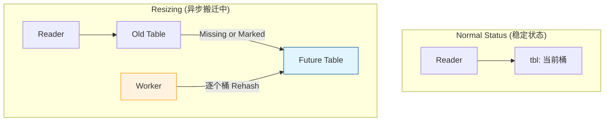
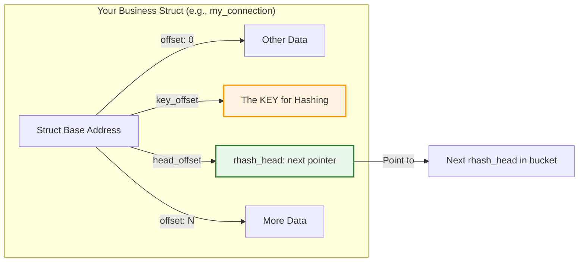
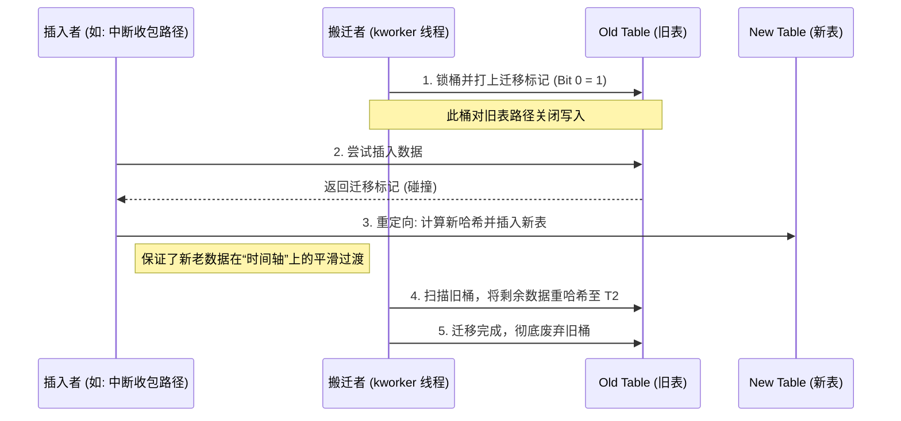
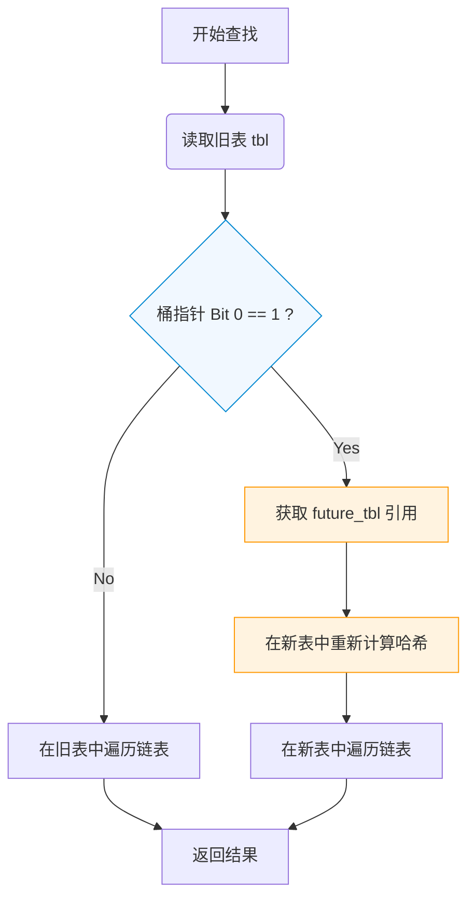
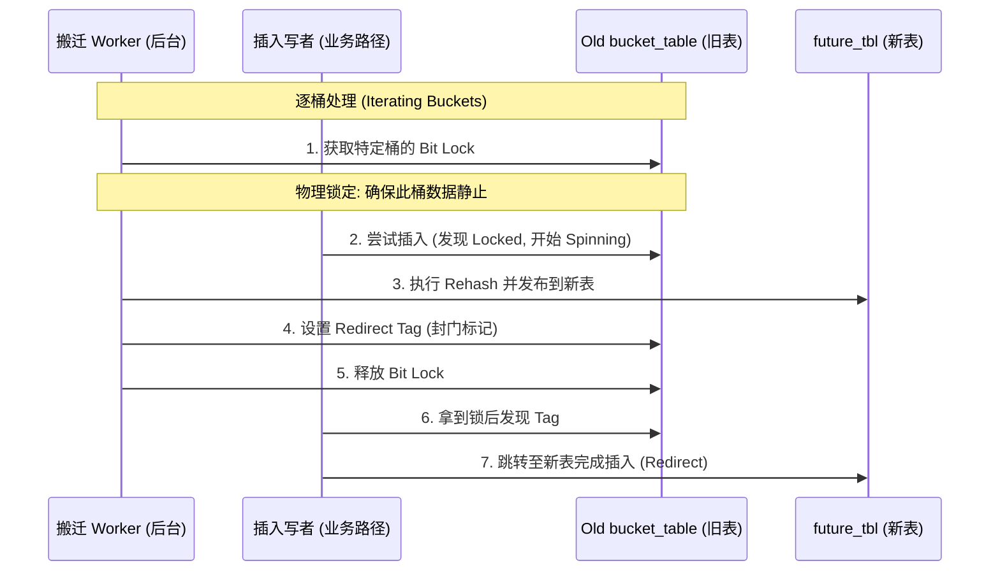
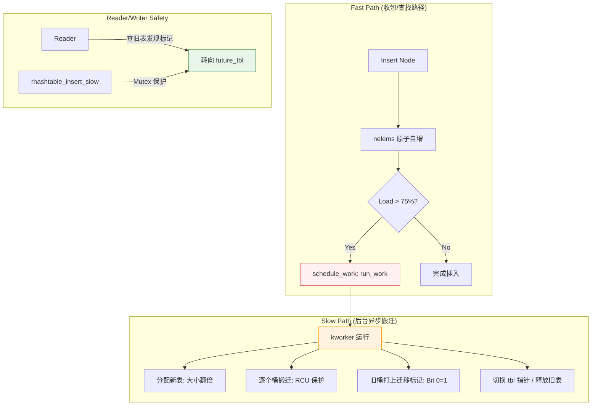

我们要解决的核心工程痛点是：**如何在数据量从 100 激增到 1,000,000 时，既不让查询变慢，又不让系统因为扩容而瞬间卡顿？**

以下是重新生成的第 5 章，我们把代码和战场结合起来看。

------

# 第 5 章：动态伸缩的 rhashtable：解决“弹性扩展”的死穴

在内核开发中，我们经常面临“预测未来的困境”。

- **背景 A（网络连接）**：正常情况下系统有 1000 个 TCP 连接，但遭受 DDoS 攻击时会瞬间涌入 1,000,000 个。
- **背景 B（文件缓存）**：系统刚启动时只打开了几个文件，但运行大型数据库时，缓存条目会爆炸。

**如果用第 2 章学的普通哈希表**：

- 设小了：冲突链表过长，查询从 $O(1)$ 退化到 $O(n)$，CPU 全耗在遍历链表上。
- 设大了：在低负载时浪费数 MB 甚至 GB 的宝贵内存。

## 5.1 为什么要“动态伸缩”？（工程矛盾）

传统哈希表扩容需要“Stop-the-world”——锁住整张表，开辟新内存，Rehash。但在内核协议栈里，如果你敢让处理网络包的 CPU 为了等扩容而原地打转（Spin）100 毫秒，那成千上万的包就会被丢弃。

**rhashtable 的使命**：在**不阻塞读者**的情况下，像气球一样平滑地胀大或缩小。

------

## 5.2 核心句柄：`struct rhashtable` 的实战意图

观察源码 [include/linux/rhashtable-types.h](../../../kernel_source/include/linux/rhashtable-types.h.md) ，我们会发现它不是一个死板的数组，而是一个**异步管理中心**：

```c
// 简化定义
struct rhashtable {
    struct bucket_table __rcu    *tbl;       // 核心：当前正在用的“桶表”
    struct work_struct           run_work;   // 幕后推手：异步扩容的工作队列
    struct mutex                 mutex;      // 只有写者（扩容者）才用的互斥锁
    atomic_t                     nelems;     // 原子计数：随时知道现在有多少个球（元素）
    struct rhashtable_params     p;          // 策略控制中心
    // ...
};
```

原定义：

```c
/**
 * struct rhashtable - 哈希表句柄
 * @tbl: 存储桶表
 * @key_len: 哈希函数的键长度
 * @max_elems: 表中元素的最大数量
 * @p: 配置参数
 * @rhlist: 如果这是一个 rhltable，则为真
 * @run_work: 延迟工作，用于异步扩展/缩小表
 * @mutex: 保护当前/未来表交换的互斥锁
 * @lock: 保护遍历器列表的自旋锁
 * @nelems: 表中元素的数量
 */
struct rhashtable {
	struct bucket_table __rcu	 *tbl;			// 核心：当前正在用的“桶表”
	unsigned int				key_len;
	unsigned int				max_elems;
	struct rhashtable_params	 p;			    // 策略控制中心
	bool					   rhlist;
	struct work_struct			run_work;		// 幕后推手：异步扩容的工作队列
	struct mutex                 mutex;			 // 只有写者（扩容者）才用的互斥锁
	spinlock_t				    lock;
	atomic_t				   nelems;		    // 原子计数：随时知道现在有多少个球（元素）
};
```


### 工程设计解读：

1. **`run_work` 是灵丹妙药**：当 `nelems` 触发扩容阈值时，内核不会在当前路径（如收包路径）扩容，而是丢给一个后台线程（kworker）去慢慢搬。**业务路径只负责触发，不负责干脏活。**
2. **`tbl` 必须 RCU**：读者在查找时，永远通过 `rcu_dereference(ht->tbl)` 获取引用。即便后台正在搬迁，读者看到的依然是一个稳定的地址。

------

## 5.3 策略引擎：`rhashtable_params` 是如何防止崩溃的？

源码中的 `struct rhashtable_params` 实际上是内核给开发者留的“调校按钮”。

| **关键参数**          | **工程背景** | **作用**                                                     |
| --------------------- | ------------ | ------------------------------------------------------------ |
| `nelem_hint`          | 预判场景     | 比如你做 conntrack，根据系统内存预设初始大小。               |
| `max_size`            | **防爆破**   | 防止恶意攻击（Hash DoS）导致哈希表无限扩张，撑爆内存。       |
| `automatic_shrinking` | 资源回收     | 在云原生等对内存敏感的场景，不用的空间要还给系统。           |
| `key_offset`          | 零拷贝设计   | 哈希表不存数据副本，它直接通过偏移量去你的结构体里“勾”出 Key。 |

`struct rhashtable_params` 定义位于 [include/linux/rhashtable-types.h](../../../kernel_source/include/linux/rhashtable-types.h.md) ：

```c
/**
 * struct rhashtable_params - 哈希表构造参数
 * @nelem_hint: 元素数量的提示，应该是期望大小的 75%
 * @key_len: 键的长度
 * @key_offset: 键在结构体中的偏移量，用于哈希
 * @head_offset: rhash_head 在结构体中的偏移量，用于哈希
 * @max_size: 扩展时的最大大小
 * @min_size: 缩小时的最小大小
 * @automatic_shrinking: 启用哈希表的自动缩小功能
 * @hashfn: 哈希函数（默认：如果 !(key_len % 4)，则使用 jhash2，否则使用 jhash）
 * @obj_hashfn: 哈希对象的函数
 * @obj_cmpfn: 用于比较键与对象的函数
 */
struct rhashtable_params {
	u16				 nelem_hint;
	u16				 key_len;
	u16				 key_offset;
	u16				 head_offset;
	unsigned int	  max_size;
	u16				 min_size;
	bool			 automatic_shrinking;
	rht_hashfn_t	  hashfn;
	rht_obj_hashfn_t  obj_hashfn;
	rht_obj_cmpfn_t	  obj_cmpfn;
};
```

------

## 5.4 搬迁的艺术：两个表并存的“叠加态”

这是 `rhashtable` 最硬核的地方：**扩容期间，系统里有两个表。**

当后台线程搬迁时：

1. **双重查找**：读者先去 `tbl` 找，如果没找到，且发现系统正在搬迁，它会自动去 `future_tbl`（新表）再找一次。
2. **原子分位**：搬迁是以“桶”为单位的。搬完一个桶，就在旧桶打个标记（通常是修改指针低位）。



------

## 5.5 进阶：`rhltable`（支持重复键的工程方案）

你提供的源码里有一个 `struct rhltable`：

```c
struct rhltable {
    struct rhashtable ht;
};
```

**为什么要它？** 在某些协议（如处理带有相同标签的 VLAN 包）中，Key 可能是重复的。标准的 `rhashtable` 假设 Key 唯一。

`rhltable` 在每个哈希槽里又挂了一个内部链表（`rhlist_head`），专门处理**“一键多值”**的工程需求。

------

### 💡 针对 Batch 1 的总结思考（笔记精华）：

> **“rhashtable = 空间置换 + 时间平摊”**
>
> 它解决了内核中最头疼的 **$O(1)$ 扩展性问题**。
>
> 1. **空间隔离**：利用 `key_offset` 实现了结构体无关性。
> 2. **性能隔离**：利用 `run_work` 实现了业务路径与管理路径的隔离。
> 3. **读写隔离**：利用 `RCU` 实现了搬迁与查找的完全并行。

**这是第 5 章的 Batch 1（工程背景与架构总览）。** 有了这些背景，你应该能感知到为什么代码里会有 `work_struct` 和各种 `offset` 了。

**接下来在 Batch 2 中，我们将深入源码细节：**

1. **`rhashtable_lookup` 的位运算**：它是如何通过 offset 魔法从一个 `void *` 变成数据的？
2. **迁移时的指针标记**：如何利用地址对齐产生的“废位”来标记搬迁状态？
3. **防止哈希攻击**：为什么 `hashfn` 必须要带上 `seed`？

既然架构的地基已经打好，我们现在就进入 **第 5 章的 Batch 2**。

如果说 Batch 1 是在看“气球”的整体设计，那么这一部分我们将拿起放大镜，去观察内核是如何在不确定数据类型的情况下，通过**位运算**和**偏移量魔法**实现高性能操作的。

------

## 5.6 偏移量魔法：如何实现“通用”数据结构？

在 C++ 中，我们习惯用模板 `template <typename T>` 来处理通用类型。但 Linux 内核是纯 C 语言写的，它使用了一种更接近底层、更高效的“偏移量（Offset）”方案。

### 5.6.1 零拷贝的精髓：`key_offset` 与 `head_offset`

观察 `rhashtable_params` 中的这两个字段：

```c
struct rhashtable_params {
    u16 key_offset;    // 键值（Key）在业务结构体中的偏移
    u16 head_offset;   // rhash_head 在业务结构体中的偏移
    // ...
};
```

**工程背景**：

假设你有一个管理网络连接的结构体 `struct my_connection`。你不想为了把这个结构体存入哈希表而对它进行昂贵的拷贝操作。

内核的做法是：

1. 你把 `struct rhash_head` 像挂钩一样直接“埋”在你的结构体里。
2. 内核不需要知道你的结构体长什么样，它只需要根据 `head_offset` 找到钩子来挂链表，根据 `key_offset` 找到 Key 来做哈希。

### 5.6.2 内存布局图

这是理解 `rhashtable_lookup` 如何在内存中“摸索”数据的关键：



<span style="color:red">为啥不直接使用 `container_of()`，然后记录成员地址？反而是采用 `offset`？</span>

这个问题问得非常到位，你已经触及了 Linux 内核**通用编程（Generic Programming）**的核心矛盾：**编译期静态检查 vs. 运行期动态适配。**

你觉得 `container_of` 更自然，是因为它是内核中处理“已知结构”的标配。但 `rhashtable` 使用 `offset` 而不直接写死 `container_of`，主要有三个深层的工程考量：

------

### 5.6.3 深度辩证：为什么用 `offset` 而非 `container_of`？

#### 1. 彻底解耦：库（Library）与用户（User）的隔离

`rhashtable` 是一个通用的库（实现在 `lib/rhashtable.c` 中）。

- **`container_of` 的局限**：它是一个宏，要求在**编译时**必须知道结构体的名称（`type`）和成员名（`member`）。
  - 例：`container_of(ptr, struct my_connection, rhead)`。
- **工程困境**：`rhashtable.c` 编译时，根本不知道未来会有 `struct my_connection`。如果它使用了 `container_of`，它就没法变成一个通用的 `.o` 文件供所有模块调用。
- **`offset` 的优势**：它把类型信息降级为一个**纯数值**。用户在 `init` 时告诉哈希表“钩子在第 16 字节”，哈希表只需要做简单的指针减法即可，完全不需要知道你的结构体叫什么。

#### 2. 运行时灵活性：支持同一个结构体的多个实例

有时候，同一个业务结构体可能需要根据不同的 Key 挂在两个不同的哈希表里。

```c
struct device {
    struct rhash_head id_node;    // 按 ID 索引的钩子
    struct rhash_head name_node;  // 按名称索引的钩子
    // ...
};
```

如果哈希表内部写死了某种 `container_of` 逻辑，它就很难优雅地处理这种“一个对象两个钩子”的情况。通过传入不同的 `head_offset`，同一个 `rhashtable` 实现可以完美适配不同的业务逻辑。

#### 3. 性能：本质上它们是“殊途同归”

其实，`container_of` 的底层核心就是 `offsetof` 宏。

- `container_of` 是在编译时算出偏移量。
- `rhashtable` 是在初始化时记录偏移量。

在运行时，它们执行的指令几乎是一样的：**指针地址 - 偏移量 = 对象基地址**。

```c
/* 哈希表内部获取对象基地址的逻辑 */
void *obj = (void *)ptr - ht->p.head_offset;
```

这行代码比 `container_of` 的宏展开更简洁，因为它规避了繁琐的类型检查，直接进行原始指针运算，非常符合内核追求极致速度的特性。

------

## 5.7 迁移时的“双表”查找：Batch 2 的收尾

在理解了偏移量魔法后，我们必须看一眼 `rhashtable` 在扩容搬迁时的**状态切换**。这是 RCU 章节和本章的交汇点。

### 5.7.1 读者查找流程（源码逻辑拆解）

当哈希表处于 `resizing`（搬迁中）状态时，`rhashtable_lookup` 的动作如下：

1. **读取当前表（Old Table）**：首先在 `ht->tbl` 里查。
2. **检测迁移标记（The Bit Magic）**：
   - 在搬迁桶时，写者会将旧桶的指针打上一个标记（指针低位变 1）。
   - 如果读者读到这个标记，说明“此桶已搬，请去新家”。
3. **转向新表（Future Table）**：如果旧表没找到或正在搬，读者自动转向 `ht->tbl->future_tbl`（新表）再次查找。

------

### 5.7.2 Batch 2 总结思考：内核的“极简主义”

| **维度**     | **container_of**     | **offset 变量**                |
| ------------ | -------------------- | ------------------------------ |
| **确定时机** | 编译期（静态）       | 运行期（动态）                 |
| **通用性**   | 低（必须知道类型）   | 极高（类型无关）               |
| **安全性**   | 高（编译器检查类型） | 中（依赖开发者传入正确的数值） |
| **适用场景** | 具体的驱动/业务逻辑  | 通用的内核库/基础设施          |

> **笔记金句：**
>
> “`container_of` 是给程序员看的，而 `offset` 是给指令集看的。`rhashtable` 牺牲了编译期的类型检查，换取了跨模块的通用性和零拷贝的极致扩展性。”

------

### 5.7.3 指针标记（Pointer Tagging）：搬迁状态的隐形信号

在第 5.4 节我们提到，扩容期间读写是并行的。那么读者怎么知道一个桶（Bucket）正在搬家？

**硬核细节：地址对齐的“废位”利用**

在 Linux 内核中，结构体地址通常是 4 字节或 8 字节对齐的。这意味着指针的最低 1 到 2 位永远是 `0`。

`rhashtable` 利用了这一点：

1. **迁移标记**：当写者开始搬运一个桶时，它会给该桶的头指针做一个位运算，把最低位设为 `1`。

2. **读者检测**：

   ```c
   // 简化逻辑
   if (unlikely(ptr & BIT(0))) {
       // 发现标记，说明这个桶正在变动，去新表（future_tbl）找！
   }
   ```

**工程价值**：这种做法不需要在桶里增加额外的 `bool` 字段（那样会破坏缓存行对齐），而是直接在指针里“塞”信号。这体现了内核对内存和性能近乎吝啬的极致追求。

---

## 5.8 算法安全：为什么 `hashfn` 必须要带 `seed`？

源码定义中，哈希函数必须接收一个 `seed`：
```c
typedef u32 (*rht_hashfn_t)(const void *data, u32 len, u32 seed);
```

### 5.8.1 工程威胁：Hash DoS 攻击

如果不引入随机种子，哈希算法是确定的。

- **攻击手段**：黑客可以精心构造一批特殊的键值（Key），它们的哈希值完全相同。
- **后果**：这些键值会全部挤在同一个桶里，哈希表瞬间退化成一条 $O(n)$ 的极长链表。此时，黑客只要发送少量请求，就能耗尽服务器的 CPU 资源，导致系统瘫痪。

### 5.8.2 内核对策：动态随机种子

`rhashtable` 在初始化或检测到冲突异常过多时，会更换 `seed`。

由于 `seed` 是随机的，黑客无法预测哈希结果，攻击自然失效。这保证了即使在极端恶劣的网络环境下，哈希表依然能保持 $O(1)$ 的性能。

------

## 5.9 Batch 2 知识小结

| **核心特性**     | **工程目的**       | **实现手段**                                  |
| ---------------- | ------------------ | --------------------------------------------- |
| **Offset 寻址**  | 通用性 & 零拷贝    | 通过 `void *` 指针加偏移量定位 Key 和钩子。   |
| **指针 Tagging** | 扩容状态同步       | 利用指针低位 bit 标记迁移状态，不占额外内存。 |
| **随机 Seed**    | 防御 Hash DoS 攻击 | 在哈希计算中引入随机扰动，防止黑客构造冲突。  |

------

**这是第 5 章最硬核的“底层魔法”拆解。** 有了这一层理解，当你看到源码里那些复杂的指针转换（如 `(char *)obj + ht->p.key_offset`）时，你就知道它是在通过“空间位置”来绕过 C 语言的类型系统限制。

**接下来在 Batch 3（本章收尾）中，我们将讨论：**

1. **`rhashtable_insert_slow`**：当插入遇到扩容时，内核如何处理“左右为难”的情况？
2. **异步 Worker 的触发时机**：它到底是怎么感知到该干活了？
3. **rhashtable 的优雅退出**：如何确保在销毁表时，没有读者还在“旧梦”里徘徊？

既然已经攻克了底层的偏移量魔法和指针位运算，我们现在进入 **第 5 章的 Batch 3**，也是本章的收网阶段。

这一部分我们要讨论的是 `rhashtable` 的“动态灵魂”——它是如何感知负载、如何异步扩容，以及在扩容的混乱期，它是如何维持数据一致性的。

------

## 5.10 异步触发机制：`run_work` 的幕后推手

在内核的极致性能要求下，扩容绝对不能发生在“快路径（Fast Path）”上。

### 5.10.1 工程痛点：避免“扩容停顿”

想象一下，一个 CPU 核心正在以每秒 1400 万个包的速度处理网络流量。如果此时哈希表满了，需要申请内存并 Rehash 十万个节点：

- **如果原地扩容**：当前 CPU 会被卡住几十毫秒，导致后续数据包全部丢弃（Drop），引发严重的抖动。
- **rhashtable 的对策**：利用 **`work_struct`**。

### 5.10.2 触发逻辑：只检测，不干活

在 `rhashtable_insert` 的路径中，内核只做一个极其轻量的判断：

1. **原子计数**：读取 `atomic_t nelems`。
2. **阈值检查**：如果节点数超过桶总数的 **75%**。
3. **提交任务**：调用 `schedule_work(&ht->run_work)`。

此时，插入操作会立即返回。真正的搬迁工作是由内核线程（kworker）在**后台**慢慢完成的。这种**“异步解耦”**的设计，保证了业务请求的响应时间始终是稳定的 $O(1)$。

------

## 5.11 扩容期间的并发控制：`rhashtable_insert_slow`

当后台线程 `run_work` 正在搬迁数据时，前台的插入操作如果撞上了正在“变动”的桶，就会进入 `slow` 路径。这里要解决的是**数据不丢失**与**可见性一致**。

### 5.11.1 核心挑战：新数据该插到哪？

在网络协议栈（如 `conntrack`）中，顺序虽然重要，但哈希表的主要职责是**查找“流”状态**。

- **现象**：如果一个桶正在从旧表搬往新表。
- **风险**：若插到旧表，可能搬迁线程已经扫描过该位置，新数据会被遗留在即将废弃的旧表中；若随意插入，读者可能在新老表之间“迷失”。

### 5.11.2 源码级逻辑实现：重定向插入

内核通过“指针标记（Pointer Tagging）”实现了一套无感切换机制。以下是简化的逻辑实现：

```c
/* 简化后的内核 rhashtable_insert_slow 逻辑 */
int rhashtable_insert_slow(struct rhashtable *ht, void *obj)
{
    struct bucket_table *tbl, *new_tbl;
    struct rhash_head *head;
    unsigned int hash;

    rcu_read_lock();
    tbl = rhashtable_dereference_rcu(ht->tbl, ht);
    hash = head_hashfn(ht, tbl, obj); 

    // 1. 获取桶锁（Bucket Lock），防止与搬迁线程冲突
    spin_lock(bucket_lock(tbl, hash));

    // 2. 检测迁移标记：内核利用指针低位 Bit 0 
    // 如果 head & 1，说明搬迁线程已经接管了该桶
    head = rht_dereference_bucket(tbl->buckets[hash], tbl, hash);
    if (rht_is_a_nulls(head)) { 
        // 【关键】发现迁移标记！旧表此处已“封票”
        new_tbl = rhashtable_dereference_rcu(tbl->future_tbl, ht);
        
        // 3. 重定向：直接计算新哈希并插入到“新表”中
        spin_unlock(bucket_lock(tbl, hash));
        return rhashtable_insert_into_new_table(ht, new_tbl, obj);
    }

    // 4. 若无标记，正常执行“头插法”进入旧表，后续会被 Worker 搬走
    rcu_assign_pointer(tbl->buckets[hash], obj);
    
    spin_unlock(bucket_lock(tbl, hash));
    rcu_read_unlock();
    return 0;
}
```

### 5.11.3 深度辨析：顺序与冲突真的混乱吗？

针对你担心的“顺序混乱”和“顶替”问题，内核有两层物理保障：

1. **哈希桶内部是“无序”的**：

   在哈希桶的链表里，节点 $A$ 在 $B$ 前还是后不影响正确性，因为查询是基于 Key 的精确匹配。哈希表记录的是 **“状态（State）”**，而 **“数据包顺序（Sequence）”** 是由上层 TCP 协议栈处理的。

2. **头插法（LIFO）的缓存优势**：

   内核默认使用头插法。新插入的节点（最新到达的包所对应的状态）处于链表最前端。这利用了 **时间局部性**：最近活跃的流，最有几率被再次访问，且其数据通常还在 L1 缓存中。

<span style="color:red;">所以，hash存储解决的是查找和插入的时间优化，并不解决顺序逻辑上的问题；而顺序问题要由数据结构本身来解决。</span>

### 5.11.4 并发博弈的最终结果

| **插入时机**   | **处理动作**              | **结果**                                       |
| -------------- | ------------------------- | ---------------------------------------------- |
| **搬迁标记前** | 插入旧表。                | 随后被 Worker 线程整体搬迁至新表。             |
| **搬迁标记后** | 发现 Bit 0 置位，重定向。 | 节点直接进入新表，新老读者都能通过新表找到它。 |

**结论**：`rhashtable` 通过这种“侧向探测”机制，确保了在几十万个网络流并发涌入时，即便处于扩容的混乱期，也不会出现“流失踪”或“双份流”的情况。

------

### 5.11.5 搬迁与插入的动态协作 (Mermaid)



------

既然 RCU 的核心铁律是**读者绝不能阻塞**，那么在 `rhashtable` 扩容的混乱期，读者面对“正在搬家”的桶（Bucket）时，采用的是一种极其高效的**“跳表重读”**策略。

------

### 5.11.6 读者遇到“封存桶”：无锁重定向（Non-blocking Redirect）

在 `rhashtable` 扩容期间，写者（Worker）会逐个处理旧桶。为了保证并发安全，读者在查找时必须能够识别并处理“正在搬迁中”的状态，且过程必须保持 $O(1)$ 的非阻塞特性。

#### 1. 读者策略：不阻塞，直接跳

当读者执行 `rhashtable_lookup` 走到旧表（Old Table）的某个桶，发现该桶指针被打上了**迁移标记**（Bit 0 = 1）时，它既不会等待写者完成，也不会原地打转，而是立即执行**“无缝重定向”**。

- **探测标记**：通过 `rcu_dereference` 获取桶头指针。
- **识别封存**：利用位运算检测 Bit 0。如果置位，说明该桶的数据已经全部或部分迁移到了新表。
- **重读跳转**：读者立即转向 `ht->tbl->future_tbl`（新表），重新计算哈希并查找。

#### 2. 源码逻辑模拟（读者视角）

```c
struct rhash_head *rhashtable_lookup(struct rhashtable *ht, const void *key) {
    struct bucket_table *tbl;
    struct rhash_head *head;

    rcu_read_lock();
    tbl = rcu_dereference(ht->tbl); // 先获取当前表引用

restart:
    hash = key_hashfn(ht, tbl, key);
    head = rcu_dereference(tbl->buckets[hash]);

    // 【核心逻辑】检测迁移标记
    if (unlikely(rht_is_a_nulls(head))) {
        // 发现标记！说明该桶已“封票”，立刻换到新表查找
        tbl = rcu_dereference(tbl->future_tbl);
        if (tbl)
            goto restart; // 非阻塞重定向
    }
    
    // ... 在确定的表中执行正常的链表遍历 ...
    rcu_read_unlock();
}
```

#### 3. 数据一致性保障：可见性先后序

你可能会担心：如果跳到新表时，数据还没搬过去怎么办？内核通过**写者的严格操作顺序**规避了这种“真空期”：

1. **先铺路**：写者（Worker）先将旧桶内的所有节点 Rehash 并发布到**新表**。此时，新表里已经存在数据的引用。
2. **后封门**：只有确认新表数据对所有 CPU 可见后，写者才会回头修改**旧表**的桶指针，打上迁移标记（Bit 0 = 1）。
3. **结果**：读者要么在旧表找到数据（封门前），要么在新表找到数据（封门后），**绝不存在两头落空的情况**。

#### 4. 读者的“三不”原则（笔记精要）

- **不阻塞**：遇到标记立即换表，不浪费任何 CPU 周期在等待上。
- **不重叠**：通过位锁标记，确保新老数据在逻辑上只有一个“主战场”，防止读到两份重复数据。
- **不感知**：业务层只管调用 `lookup`，底层的双表切换由 RCU 语义和位运算魔法在纳秒级完成。

------

#### 5. 逻辑流程总结



> **深度笔记：**
>
> “在 `rhashtable` 的扩容设计中，写者承担了所有的‘有序性’复杂工作，而读者只需学会‘见标记就跳’。这种**非阻塞重定向**保证了即便在百万级并发的连接跟踪（Conntrack）场景下，扩容动作也不会对读者的响应延迟（Latency）产生任何可感知的抖动。”

**这段 5.11 引入了位运算标记和重定向逻辑，解决了你关心的“新老交替”顺序问题。** 这种“先封票，再引流”的策略，是内核在无锁化背景下保持数据一致性的最高准则。

为了彻底理清逻辑，我们需要在 **5.11.7** 中建立一个从“宏观结构”到“微观动作”的完整映射。我们将“表与桶”的物理关系作为地基，推导出内核如何通过局部锁定实现全局扩容。

------

### 5.11.7 动态搬迁的一致性保障：表与桶的原子协作

#### 1. 物理层级：表（`bucket_table`）与桶（`bucket`）的关系

在理解搬迁逻辑前，必须明确哈希表在内存中的层级结构：

- **表（`bucket_table`）**：这是哈希表的**物理载体**。它在内存中表现为一个连续的**指针数组**。我们可以将其类比为图书馆的一层楼。
- **桶（`bucket`）**：这是数组中的**一个元素（槽位）**。每个桶存放着指向冲突链表首节点的指针。我们可以将其类比为楼层中的一个特定书架。

**核心矛盾**：我们的目标是更换整张“表”（扩容），但如果直接锁定整张表，会导致全系统 CPU 停顿。因此，内核将“搬表”动作分解为对数千个“桶”的独立操作。

------

#### 2. 搬迁原子性：化整为零的“封门”艺术

当负载超过 **$75\%$** 阈值时，后台任务（`Worker`）启动。它分配好 **`future_tbl`（新表）** 后，开始对旧表中的每一个**桶**执行原子搬迁。

##### 搬迁 Worker 的“四步走”逻辑：

1. **加锁（Locking）**：获取旧表中当前桶的 **`bit lock`（位锁）**。此时，该桶进入写互斥状态。
2. **移动（Rehash）**：遍历该桶内的所有节点，计算其在新表中的位置并完成挂载。
3. **封门（Tagging）**：将旧桶的头指针修改为 **`redirect tag`（重定向标记）**。这标志着该桶在旧表中正式废弃，成为了指向新世界的“路标”。
4. **解锁（Unlocking）**：释放位锁。

------

#### 3. 写者（插入者）的并发冲突处理

由于搬迁是逐桶进行的，写者在插入数据时会遇到三种状态：

- **状态 A（尚未搬迁）**：写者发现桶既无锁也无标记 $\to$ 获取桶锁并插入 $\to$ 随后 `Worker` 到达，会看到新插入的节点并将其搬走。
- **状态 B（正在搬迁）**：写者发现桶已上锁 $\to$ 执行 **`spinning`（自旋等待）** $\to$ 锁释放后重新检查，发现标记。
- **状态 C（已经搬迁）**：写者读取桶指针，识别出 **`redirect tag`** $\to$ 意识到“旧表此位置已关闭” $\to$ 立即转向 **`future_tbl`**，重新计算位置并插入。

**结论**：写者虽然会遭遇短暂的局部阻塞（自旋），但这种阻塞被限制在**单个桶**的范围内，不会影响对表中其他 $99\%$ 数据的并发访问。

------

#### 4. 读者（查找者）的非阻塞跳转

RCU 机制确保了读者在任何时刻都**不看锁、不阻塞**：

- 即使桶被锁住，读者依然可以遍历其中的旧链表。
- 一旦读到 **`redirect tag`**，读者立即执行 **`Non-blocking Redirect`（无锁重定向）**，转入新表查找。

------

#### 5. 架构总结：职责的彻底分离

通过对“表”与“桶”关系的深度解耦，`rhashtable` 实现了以下工程准则：

1. **哈希表的本分**：仅负责**查找与插入的时间优化**（实现接近 $O(1)$ 的定位能力）。
2. **数据一致性**：通过**桶锁（局部互斥）**与**重定向标记（逻辑引导）**确保搬迁中不丢数据。
3. **顺序逻辑**：哈希表物理上不保证顺序。**顺序问题由上层业务逻辑（如 TCP 序列号或 FIFO 队列）自行解决。**

------

6. #### 动态协作逻辑图



> **归档结语：**
>
> 扩容不是一次瞬间的平移，而是一场有序的疏散。`rhashtable` 利用**位锁（Bit Lock）**保障了微观原子性，利用**重定向标记（Redirect Tag）**保障了宏观连通性，最终在“换表”的剧烈变动中，保住了读者的绝对自由。

------

**这个 5.11.7 小结将“表与桶”的层级关系与“搬迁/重定向”的逻辑完美融合。** 这种基于局部性的同步策略，是理解所有高性能内核数据结构的关键。

------

## 5.12 动态收缩：优雅的资源回收

`rhashtable` 不仅能变大，还能变小（Shrink）。

### 5.12.1 触发背景

在资源极其宝贵的内核环境中（如嵌入式设备或几十万个容器共存的服务器），空载的哈希表会浪费大量的 **连续物理内存（SLAB）**。

- **阈值**：当负载低于 **30%** 时，触发异步收缩。
- **开关**：开发者可以通过 `p.automatic_shrinking` 参数来控制是否开启这个功能，以防在负载波动剧烈时出现“扩容-缩容-再扩容”的 **抖动效应（Thrashing）**。

------

## 5.13 第 5 章：总结与闭环

我们将 `rhashtable` 的动态特性浓缩为这张图：




------

### 💡 针对 Batch 3 的总结建议：

> **“rhashtable 是工程妥协的艺术。”**
>
> 它通过 **`work_struct`** 牺牲了搬迁的即时性，换取了业务的零抖动；
>
> 它通过 **指针 Tagging** 牺牲了少许位运算性能，换取了扩容期间读写的完美并发。
>
> 在内核中，这种 **“异步搬迁 + 双表查找”** 的模式，是处理弹性扩展问题的教科书级方案。

------

**第 5 章：动态伸缩的 rhashtable，正式地收官了。**

通过这一章，你不仅理解了它是怎么工作的，更理解了内核是如何在复杂的并发环境下，通过“异步”和“状态标记”来保住性能的。

**至此，我们已经完成了：**

1. 哈希函数基础（jhash/hash_32）。
2. 哈希表的冲突处理（hlist 链表）。
3. 现代同步机制（RCU 深度解析）。
4. 动态扩容机制（rhashtable）。

**你现在已经构建了一个非常完整的 Linux 内核哈希知识体系。**

