# 第1章 树的基本概念（上）

## 章节内容说明

本章是整条学习路径的起点。后续你要学习的：

- 二叉树
- 二叉搜索树
- 旋转
- 2-3-4 树
- 红黑树
- Linux 内核 `rbtree`

都建立在本章之上。


本章范围如下：

- 1.1 什么是树
- 1.2 树的基本术语
- 1.3 树的基本性质
- 1.4 树的存储与表示
- 1.5 本章小结

------

## 1.1 什么是树

### 1.1.1 树的定义

在数据结构中，**树（Tree）** 是一种由节点组成的**层级型非线性结构**。它满足以下基本特征：

1. 整体中存在一个特殊节点，称为**根节点（Root）**
2. 除根节点外，每个节点有且仅有一个直接前驱节点，称为它的**父节点（Parent）**
3. 每个节点可以有零个、一个或多个直接后继节点，称为它的**子节点（Child）**
4. 节点之间不存在回路
5. 整体是连通的

把这些约束合起来，可以得到一个更严格的表述：

> 树是一个有限节点集合；若该集合非空，则存在且仅存在一个根节点，其余节点被划分为若干个互不相交的子集合，每个子集合本身又是一棵树。

这个定义里最重要的不是字面形式，而是两个核心点。

第一，树是**层级结构**。
树不是把元素排成一条线，而是把元素组织成“上层—下层”的层级关系。

第二，树是**递归结构**。
一棵树的某个子节点下面挂着的整块结构，本身仍然是一棵树。这一点在后面会直接影响：

- 二叉树定义
- 遍历
- 递归算法
- BST 查找
- 红黑树旋转后的局部子树重挂接

------

### 1.1.2 树与数组、链表的结构差异

为了避免把树看成“只是节点多一点的链表”，这里先把它与常见线性结构严格区分。

#### 一、数组的结构特点

数组的典型特征是：

- 元素按逻辑顺序排列
- 通常对应一段连续存储区域
- 通过下标定位元素
- 一个元素通常只有“前一个”和“后一个”的线性邻接关系

数组强调的是：

> 顺序位置

例如第 `i` 个元素、第 `i + 1` 个元素。

------

#### 二、链表的结构特点

链表的典型特征是：

- 节点通过指针串接
- 整体仍然是线性关系
- 当前节点通常只直接知道下一个节点，或前后两个节点
- 路径通常是单条推进

链表强调的是：

> 线性连接

你从头结点出发，沿着 `next` 一直走，是一条线。

------

#### 三、树的结构特点

树与数组、链表最本质的差异在于：

- 一个节点下面可以分出多个方向
- 节点关系不是单条线，而是层级展开
- 某个节点的位置不是“前后”，而是“父、子、兄弟、祖先、后代”
- 访问路径不是固定线性推进，而是沿分支进行选择

所以树强调的是：

> 层级关系 + 分支关系

这也是为什么树非常适合表达如下结构：

- 文件系统目录
- 语法结构
- 组织层级
- 查找结构
- 编译器语法树
- 设备树的层级节点关系
- 各种索引结构

------

### 1.1.3 树适合解决什么类型的问题

树适合处理的不是任意数据，而是具有以下特征的数据组织问题。

#### 一、天然存在层级关系

例如目录系统：

- `/`
  - `/home`
  - `/etc`
  - `/usr`

这里不是线性平铺关系，而是明确的上级目录和下级目录关系。

#### 二、需要逐层缩小范围

例如查找结构中：

- 先比较当前节点
- 再决定进入左边还是右边
- 再在子树中继续比较

BST、AVL、红黑树都属于这一类。

#### 三、整体由局部递归组成

例如一棵树上的任意节点往下看，形成的结构仍然符合“树”的定义。

这使得很多树算法天然适合用递归描述，例如：

- 计算高度
- 遍历所有节点
- 销毁整棵树
- 在子树中查找目标节点

------

### 1.1.4 树为什么是非线性结构

“非线性结构”这个词不能只停留在术语层面，必须具体解释它的含义。

所谓非线性，不是说“看起来复杂”，而是说：

> 节点之间不存在唯一的一维顺序关系。

在数组和链表里，你总能自然地说：

- 谁在谁前面
- 谁在谁后面

但在树里，这种描述通常不成立。

例如下面这棵树：

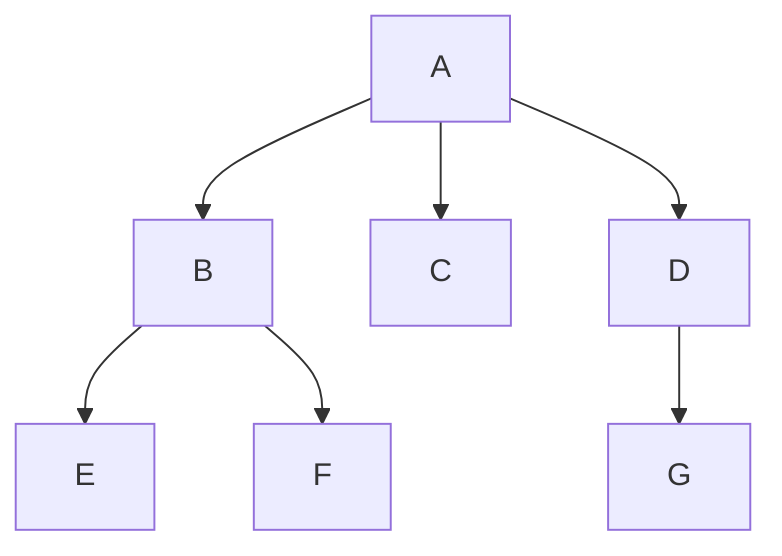

对于这棵树：

- `B`、`C`、`D` 是同一层的兄弟节点
- `E`、`F` 是 `B` 的子节点
- `G` 是 `D` 的子节点

这时候你不能像数组那样问：

- `E` 是否“在” `D` 前面
- `G` 是否“在” `C` 后面

因为树中更自然的描述是：

- `E` 是 `B` 的后代
- `D` 是 `G` 的父节点
- `B` 和 `D` 同层但分属不同分支

所以树的核心不是“全局线性顺序”，而是：

- 局部层级关系
- 分支组织关系
- 路径连接关系

------

### 1.1.5 树的递归定义为什么重要

这部分是后面学习所有树算法的关键。

树的递归定义可以表述为：

- 一棵树由一个根节点和若干棵子树组成
- 每一棵子树本身仍是一棵树

这个定义带来三个直接结果。

#### 一、树算法天然适合递归

例如计算节点总数时，你并不需要从全局构造一个特别复杂的逻辑。你可以写成：

- 当前节点算 1 个
- 再分别计算每棵子树的节点数
- 最后求和

#### 二、局部操作可以独立成立

例如你以后学旋转时，旋转影响的是某个局部子树，但旋转后该局部结构仍然是一棵合法子树，然后再重新挂回原位置。

#### 三、树上的很多性质都能递归定义

例如：

- 一棵树的高度 = 其各子树高度最大值 + 1
- 一棵树是否为空树
- 一棵树是否为叶子节点
- 一棵二叉树是否满足 BST 性质

所以你后面如果遇到“树为什么总喜欢用递归写”，本质原因不在于编程技巧，而在于：

> 树本身就是递归定义的数据结构。

------

## 1.2 树的基本术语

这一节必须打牢。
后面你学红黑树时，所有描述都会频繁出现这些词：

- 根节点
- 父节点
- 子节点
- 兄弟节点
- 祖先
- 后代
- 深度
- 高度
- 层次
- 路径
- 子树

如果这些术语不稳定，后面看任何图都会混乱。

为了统一说明，先用下面这棵树作为基准图。

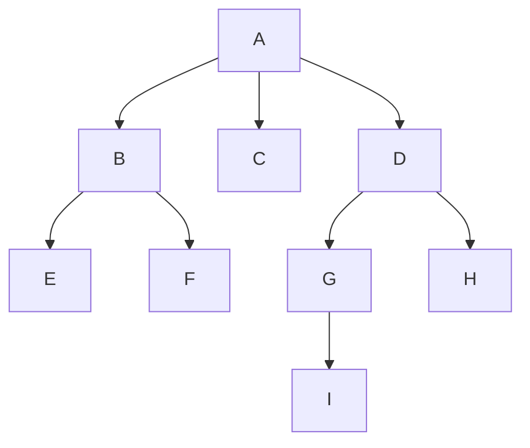

------

### 1.2.1 根节点、父节点、子节点、兄弟节点

#### 一、根节点

根节点是整棵树最顶层的节点。它的特点是：

- 没有父节点
- 是整棵树的起点
- 任何其他节点都可以看作从根节点出发到达

在上图中：

- `A` 是根节点

根节点的作用是定义整棵树的入口。很多树操作都是从根开始的，例如：

- 查找
- 插入
- 删除
- 遍历

以后你写树代码时，通常会有一个根指针，例如：

```c
struct tree_node *root;
```

如果 `root == NULL`，就表示这棵树为空。

如果根节点引用丢失，那么整棵树从外部就不可达，后续节点即使还在内存中，也无法被正常访问。

------

#### 二、父节点

如果节点 `X` 直接连到节点 `Y`，且方向是 `X -> Y`，那么：

- `X` 是 `Y` 的父节点
- `Y` 是 `X` 的子节点

在上图中：

- `A` 是 `B`、`C`、`D` 的父节点
- `B` 是 `E`、`F` 的父节点
- `D` 是 `G`、`H` 的父节点
- `G` 是 `I` 的父节点

父节点描述的是**直接上一级关系**。注意，父节点不是任意上层节点，而是紧邻的上一级。

后续在红黑树中：

- 旋转需要修改父子关系
- 插入修复需要看父节点颜色
- 删除修复需要沿父链向上处理

所以“父节点”不是附属术语，而是核心结构信息。

如果父指针维护错误，会导致：

- 节点重新挂接失败
- 向上回溯逻辑错误
- 修复过程走错分支
- 根节点更新错误

------

#### 三、子节点

子节点是某个节点直接连接到的下一级节点。

在上图中：

- `B`、`C`、`D` 是 `A` 的子节点
- `E`、`F` 是 `B` 的子节点

子节点定义了从上到下的扩展方向。

后续学习中：

- 普通树：一个节点可能有多个子节点
- 二叉树：一个节点最多两个子节点
- BST：通过比较决定进入左子树还是右子树
- 红黑树：旋转本质上就是重排父节点与子节点之间的连接

子节点挂接错误会直接破坏树形结构，例如：

- 节点丢失
- 形成断链
- 形成非法共享子树
- 形成环路

------

#### 四、兄弟节点

具有**同一个父节点**的节点互为兄弟节点。

在上图中：

- `B`、`C`、`D` 互为兄弟节点
- `E`、`F` 互为兄弟节点
- `G`、`H` 互为兄弟节点

注意：

- 兄弟节点要求父节点相同
- 仅处于同一层但父节点不同，不算兄弟节点

例如：

- `E` 和 `G` 虽然都不高，但它们不是兄弟节点，因为父节点不同

兄弟关系在后续非常重要，尤其是在红黑树删除修复里，“兄弟节点”的颜色与孩子分布决定修复分支。

------

### 1.2.2 叶子节点、内部节点

#### 一、叶子节点

没有任何子节点的节点，称为叶子节点。

在基准图中：

- `C`
- `E`
- `F`
- `H`
- `I`

都是叶子节点。

叶子节点表示某条分支的终点。很多递归终止条件都会写成：

- 如果当前节点为空，返回
- 如果当前节点是叶子，进行特定处理

后续你会看到：

- BST 插入最终总是插到某个空位置，等价于成为叶子或外部位置节点
- 2-3-4 树的插入通常落在叶层
- 红黑树教材里经常引入 NIL 叶子节点作为统一边界处理

如果对叶子的判断错误，典型问题包括：

- 遍历越界
- 递归不终止
- 插入位置判断错误
- 删除边界处理错误

------

#### 二、内部节点

至少有一个子节点的节点，称为内部节点。

在基准图中：

- `A`
- `B`
- `D`
- `G`

都是内部节点。

内部节点代表结构中的中间决策位置。
在查找树中，内部节点往往承担“比较—分支”的作用。

例如在 BST 里：

- 当前节点比目标值大，就进入左子树
- 当前节点比目标值小，就进入右子树

这时内部节点就是一个判断点。

------

### 1.2.3 节点的度、树的度

#### 一、节点的度

一个节点拥有的子节点数量，称为该节点的**度**。

在基准图中：

- `A` 的度为 3
- `B` 的度为 2
- `C` 的度为 0
- `G` 的度为 1

度用来刻画节点的分支能力。

#### 二、树的度

一棵树中所有节点的度的最大值，称为这棵树的度。

在基准图中：

- 最大度是 `A` 的 3
- 所以整棵树的度为 3

这有助于区分树的类别。

例如：

- 普通树：节点度可以大于 2
- 二叉树：节点度最大只能是 2

所以“二叉树”不是说每个节点都恰好两个孩子，而是说：

> 每个节点的度最大为 2。

------

### 1.2.4 路径与路径长度

#### 一、路径

从一个节点到另一个节点所经过的节点序列，称为路径。

例如在基准图中，从 `A` 到 `I` 的路径为：

- `A -> D -> G -> I`

#### 二、路径长度

路径上经过的边数，通常称为路径长度。

对于路径：

- `A -> D -> G -> I`

它经过 3 条边，所以路径长度为 3。

路径很重要，因为后续几乎所有树的效率分析都和路径长度有关。

例如在 BST 里，查找某个值时：

- 每比较一次，向下一层
- 实际消耗与从根走到目标节点的路径长度有关

在红黑树里：

- 平衡性的目标，本质上就是控制从根到叶子的路径不要过长
- “黑高”也是路径维度上的计数概念

所以你必须把“路径”理解为：

> 树上一次操作实际走过的结构轨迹。

------

### 1.2.5 深度、高度、层次

这几个概念最容易混。必须单独讲清。

#### 一、节点的深度

从根节点到该节点所经过的边数，称为该节点的深度。

在基准图中：

- `A` 的深度是 0
- `B`、`C`、`D` 的深度是 1
- `G`、`H` 的深度是 2
- `I` 的深度是 3

也就是说：

> 深度是从上往下看，某个节点距离根有多远。

------

#### 二、节点的高度

从该节点到其最远叶子节点的最长路径边数，称为该节点的高度。

在基准图中：

- `I` 的高度是 0
- `G` 的高度是 1
- `D` 的高度是 2
- `A` 的高度是 3

也就是说：

> 高度是从下往上量，某个节点下面还能延伸多深。

------

#### 三、树的高度

根节点的高度，通常也称为整棵树的高度。

所以基准图整棵树的高度是：

- 3

------

#### 四、层次

层次有两种常见定义方式：

1. 根节点为第 1 层
2. 根节点为第 0 层

教材和代码里都可能出现。后续学习时必须始终注意作者采用哪一种。

如果按“根为第 1 层”来算，那么基准图中：

- `A` 在第 1 层
- `B`、`C`、`D` 在第 2 层
- `G`、`H` 在第 3 层
- `I` 在第 4 层

------

#### 五、深度与高度不要混淆

这两个概念常被误写。

| 概念 | 方向               | 含义                 |
| ---- | ------------------ | -------------------- |
| 深度 | 根到当前节点       | 节点离根多远         |
| 高度 | 当前节点到最远叶子 | 节点下面还能延伸多深 |

这个区别在后续很关键，因为：

- 分析查找代价时，经常看深度
- 分析树整体是否过高时，经常看高度
- 分析平衡性时，本质上在控制高度

------

### 1.2.6 子树与森林

#### 一、子树

树中任意一个节点，以及它下面的全部后代节点，构成的一棵树，称为原树的一棵子树。

例如在基准图中，以 `D` 为根的子树是：

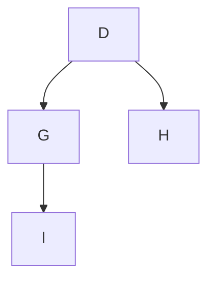

这棵结构本身仍然符合树的定义，所以它是一棵合法子树。

子树这个概念极其重要，因为后面所有树算法几乎都在对子树做操作。

例如：

- 二叉树遍历：遍历左子树，再遍历右子树
- BST 查找：进入左子树或右子树
- 旋转：重新组织某个局部子树
- 红黑树修复：调整祖父节点附近的局部子树结构

所以“子树”不是附属术语，而是树算法的最小结构工作单元。

------

#### 二、森林

若把一棵树的根节点去掉，那么剩余部分将变成若干棵互不相交的树，这些树的集合称为**森林**。

例如在基准图中去掉 `A` 后，会得到：

- 以 `B` 为根的一棵树
- 以 `C` 为根的一棵树
- 以 `D` 为根的一棵树

这些组合起来就是森林。

森林这个概念在一般树与二叉树转换、语法结构、以及更广义的层级结构处理中经常出现。

------

## 示例：用一个真实层级结构来理解树

这里给一个更接近实际开发环境的例子：目录结构。

```text
/
├── boot
├── dev
├── etc
│   ├── init.d
│   └── ssh
└── home
    └── leaf
        ├── project
        └── notes
```

把它抽成树之后：

- `/` 是根节点
- `boot`、`dev`、`etc`、`home` 是 `/` 的子节点
- `init.d`、`ssh` 是 `etc` 的子节点
- `leaf` 是 `home` 的子节点
- `project`、`notes` 是 `leaf` 的子节点

在这个例子里你可以准确对应出：

- 根节点
- 父子关系
- 叶子目录
- 子树
- 路径

例如路径：

- `/ -> home -> leaf -> notes`

路径长度为 3。

这个例子之所以重要，是因为它说明：

> 树不是为了教学而存在的抽象图形，它本来就是很多真实系统结构的自然表达方式。


你后面学习二叉树、BST、红黑树时，很多问题都会落回接下来的内容，例如：

- 为什么树天然适合递归
- 为什么树的效率经常和高度有关
- 为什么子树可以单独分析
- 为什么普通树的表示法比二叉树更宽泛
- 为什么很多高级树结构最终都会收缩到链式节点表示

------

## 1.3 树的基本性质

### 1.3.1 树为什么是非线性结构

树属于**非线性结构**。这个结论不能只记结果，必须知道判定依据。

线性结构通常满足这样的关系：

1. 节点之间可以组织成一条单一顺序链
2. 大多数节点只有一个直接前驱和一个直接后继
3. 访问过程通常沿着一条序列推进

例如：

- 数组
- 单链表
- 双向链表
- 栈
- 队列

都属于线性结构。

而树不满足这个条件。

#### 第一，树允许分支

一个节点下面可以挂接多个子节点，因此从当前节点继续访问时，后继路径可能不止一条。

#### 第二，树中的关系不是“前后关系”

在线性结构中，常见问题是：

- 前一个元素是谁
- 后一个元素是谁
- 第几个元素是什么

而在树中，更自然的问题变成：

- 父节点是谁
- 子节点有哪些
- 兄弟节点是谁
- 某个节点属于哪棵子树
- 根到该节点的路径是什么

#### 第三，树的访问过程带有决策分支

树上的很多操作不是机械地向后推进，而是根据条件进入不同分支。

下面给出一个结构图。

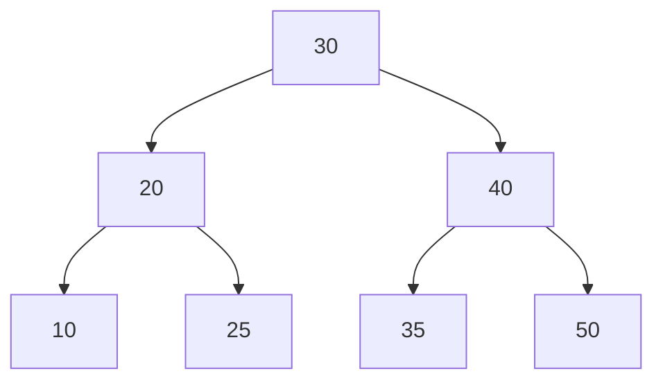

如果目标是 `35`，访问过程通常是：

- 先访问 `30`
- 因为 `35 > 30`，进入右子树
- 再访问 `40`
- 因为 `35 < 40`，进入左子树
- 到达 `35`

这里的关键不是“能找到 `35`”，而是：

> 树上的访问不是单方向前进，而是“比较 + 选分支”的过程。

所以“非线性”不是视觉上的复杂，而是关系组织方式已经脱离一维顺序。

------

### 1.3.2 树具有递归定义

树最核心的结构性质之一，就是它具有**递归定义**。

树可以表述为：

- 一棵树由一个根节点和若干棵子树组成
- 每一棵子树本身仍然是一棵树

这个定义非常重要，因为它直接决定了树的分析方法和实现方法。

#### 一、为什么这条性质重要

因为它说明：
如果你会处理“一棵树”，那么你也就会处理“树的任意子树”。

这意味着很多问题都可以拆成：

1. 先处理当前节点
2. 再对各个子树做同类处理

#### 二、递归性质带来的直接结果

第一，很多树算法天然适合递归写法。
第二，树上的局部结构可以单独分析。
第三，很多树的性质可以递归定义。

例如：

- 节点总数
  = 当前节点 1 个 + 各子树节点总数之和
- 树的高度
  = 各子树高度最大值 + 1
- 某个值是否存在
  = 当前节点匹配，或某棵子树中存在

#### 三、示例：节点计数的递归思路

假设一棵普通树节点定义如下：

```c
struct tree_node {
	int 			value;
	struct tree_node **children;
	int 			nr_children;
};
```

那么“统计以当前节点为根的子树节点数”可以表达为：

```c
int tree_count_nodes(struct tree_node *node)
{
	int i;
	int total;

	if (!node)
		return 0;

	total = 1;

	for (i = 0; i < node->nr_children; ++i)
		total += tree_count_nodes(node->children[i]);

	return total;
}
```

这里不是为了让你现在就背代码，而是让你看到：

> 代码结构与树的递归定义是一一对应的。

当前节点先计入 `1`，然后对子节点递归累计。
这就是“树由根和子树组成”的直接程序表达。

------

### 1.3.3 树的连通性与无环性

一棵合法的树，必须同时满足两个重要条件：

- **连通**
- **无环**

这两个条件是树区别于一般图结构的关键约束。

#### 一、什么叫连通

连通表示：

> 从根节点出发，应该能够到达树中的每一个节点。

如果存在某个节点完全无法从根访问到，那么它就不属于这棵树的有效组成部分。

看下面这个例子：

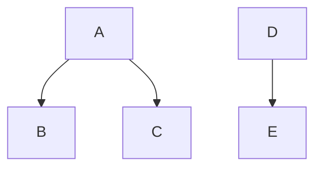

这里 `A-B-C` 和 `D-E` 是两块彼此独立的结构。
它们不是一棵树，而是两棵树，组成了一个森林。

#### 二、什么叫无环

无环表示：

> 顺着父子连接关系往下走，不能再回到已经经过的节点。

如果出现回路，就不再是树。

例如下面这种关系就是非法的：

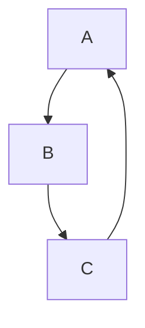

这里出现了环：

- `A -> B -> C -> A`

这种结构不是树，而是一般图。

#### 三、为什么树必须无环

如果存在环，会直接破坏前面已经建立的很多基本结论：

- 根到节点的路径不再唯一
- 父子层级关系失去稳定性
- 递归遍历可能无法终止
- 高度、深度等概念会失去严格意义

所以树的很多算法能够成立，前提之一就是：

> 它不是任意图，而是连通且无环的层级结构。

------

### 1.3.4 除根节点外，每个节点只有一个父节点

这是树的另一条基础性质。

#### 一、性质内容

对于一棵非空树：

- 根节点没有父节点
- 其余每个节点有且仅有一个父节点

这条性质非常关键，因为它保证了：

- 节点的上行路径唯一
- 节点归属关系唯一
- 结构层级稳定

#### 二、为什么不能有两个父节点

如果某个节点同时被两个不同节点指向，那么它已经不再是标准树结构。

例如：

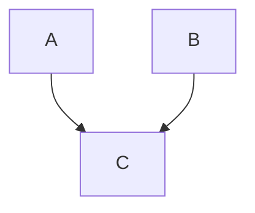

这里 `C` 同时有两个父节点：`A` 和 `B`。

这种结构已经不是树，而更接近有向无环图中的共享节点模型。

#### 三、这条性质的直接影响

因为父节点唯一，所以：

- 从任意节点向上回溯，路径唯一
- 每个节点只属于一条明确的父链
- 深度定义稳定
- 插入、删除、旋转时，父子关系可以精确维护

后面学习红黑树时，你会大量依赖这一点。因为：

- 插入修复会沿父链向上处理
- 删除修复也会沿父链回溯
- 旋转要重新维护父子关系

如果“一个节点有多个父节点”，这些修复逻辑会全部失去前提。

------

### 1.3.5 树的规模常用“节点数”和“高度”描述

分析一棵树时，最常用的两个全局量是：

- 节点数
- 高度

#### 一、节点数

节点数表示树中包含多少个节点。
它反映的是树的整体规模。

例如下面这棵树：

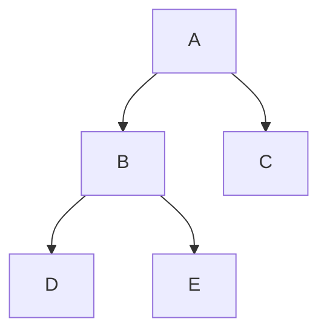

它的节点数是 5。

#### 二、高度

高度表示树从根到最远叶子节点的最长路径长度。
它反映的是树“有多深”。

对上面这棵树：

- 根 `A` 到叶子 `D` 的路径长度为 2
- 根 `A` 到叶子 `E` 的路径长度为 2
- 根 `A` 到叶子 `C` 的路径长度为 1

所以整棵树的高度是 2。

#### 三、为什么高度比节点数更影响效率

在很多树操作中，真正影响时间复杂度的不是节点总数本身，而是：

> 操作路径需要走多深。

例如在查找树中：

- 查找一个值时，不会访问所有节点
- 通常只沿着一条根到目标位置的路径向下走

所以时间复杂度通常与树高有关。

这也是为什么后面学 BST 时，你会看到：

- 理想情况下，树高较低，查找快
- 极端情况下，树退化成链表，树高接近节点数，查找慢

因此，从很早开始，你就必须把一个观点建立起来：

> 树的“形状”会直接影响效率，而高度是这种形状最关键的量化指标。

------

### 1.3.6 子树可以独立看待

前面已经提到树具有递归定义，这里再把它推进一步：

> 对树上的任意节点，以它为根向下展开的部分，都可以独立当作一棵树来分析。

这就是“子树独立性”。

看下面这棵树：

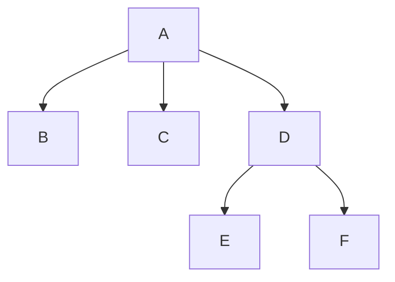

以 `D` 为根的部分：

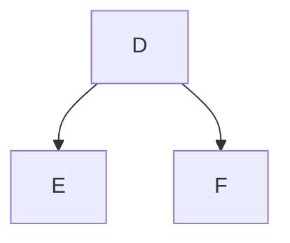

本身就是一棵合法树。

#### 一、为什么这个性质重要

因为很多树操作根本不需要始终站在整棵树角度分析。
它们只需要关心某个局部子树。

例如：

- 遍历左子树，再遍历右子树
- 在某棵子树中继续查找
- 旋转时重新组织局部子树
- 红黑树修复时处理祖父节点附近那一小块结构

#### 二、对子树独立性的正确理解

它不是说“从原树里硬截出一部分”，而是说：

- 这个节点及其全部后代
- 本身就满足树的定义
- 因此能作为独立分析单元

这个思想会在后续所有章节里反复出现。

------

## 1.4 树的存储与表示

前面讨论的是树的数学和结构概念。
这一节开始进入程序实现视角：树在代码中到底如何表示。

普通树与二叉树不同。
二叉树一个节点最多两个孩子，因此结构相对固定。
但普通树中，一个节点的子节点数量不固定，所以表示方式更多。

这一节重点讲常见的几种表示法：

- 顺序存储
- 双亲表示法
- 孩子表示法
- 孩子兄弟表示法

你不需要在这一章把所有实现细节都背住，但必须知道：

- 每种表示法在表达什么关系
- 它擅长什么操作
- 它的限制在哪里

------

### 1.4.1 顺序存储与链式存储

#### 一、顺序存储

顺序存储是指：
用一段连续存储单元来保存树的节点信息。

对于普通树，顺序存储并不天然方便，因为：

- 每个节点孩子数不固定
- 层级关系不规则
- 很难用简单下标公式直接定位所有父子关系

但对于某些特殊树，例如**完全二叉树**，顺序存储就非常合适。

例如按层顺序放到数组里：

```text
下标: 0  1  2  3  4  5  6
值  : A  B  C  D  E  F  G
```

则常见关系可以用下标表达：

- 父节点下标为 `i`
- 左孩子下标为 `2 * i + 1`
- 右孩子下标为 `2 * i + 2`

这就是堆常用的数组表示方法。

#### 二、顺序存储的优点

- 内存连续
- 下标访问快
- 对完全二叉树非常自然
- 不需要显式指针域

#### 三、顺序存储的局限

对于普通树或不规则二叉树，问题很明显：

- 空洞可能很多
- 父子关系不容易统一表达
- 节点增删不灵活

所以顺序存储不是“树的一般表达方式”，而更适合规则较强的特殊树。

------

#### 四、链式存储

链式存储是指：
节点中显式保存结构连接信息，例如父指针、子指针、兄弟指针等。

它的优点是：

- 结构灵活
- 适合动态插入删除
- 更容易表达不规则树
- 更符合大多数高级树结构的实际实现方式

后面你学习：

- 二叉树
- BST
- 红黑树
- Linux 内核 `rbtree`

主要都会落在链式表示上。

------

### 1.4.2 双亲表示法

双亲表示法的核心思想是：

> 每个节点单独占用一个表项，表项中不仅保存节点自身的数据，还保存其父节点在整张表中的位置。

它强调的是**向上关系**，也就是：

- 当前节点是谁
- 当前节点的父节点是谁
- 父节点在表中的哪个位置

因此，这种表示法最直接支持的操作不是“找孩子”，而是“找父节点”与“沿父链向上回溯”。

------

#### 一、逻辑形式

可以定义如下节点表项：

```c
#define TREE_PARENT_NONE	(-1)

struct parent_repr_node {
	int value;
	int parent_index;
};
```

其中：

- `value` 表示节点值
- `parent_index` 表示该节点父节点在数组中的下标
- 根节点没有父节点，因此通常记为 `TREE_PARENT_NONE`，这里取值为 `-1`

这说明：
双亲表示法并不直接保存“孩子链表”或“第一个孩子 / 下一个兄弟”之类的信息，而是把整棵树放进一个线性表中，再通过“父节点下标”恢复节点之间的层次关系。

------

#### 二、树结构示例

设有如下树：

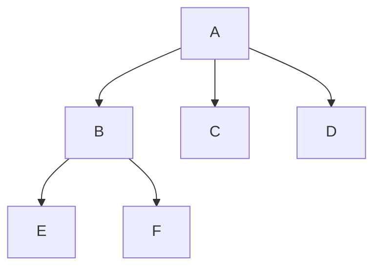

这棵树的层次关系是：

- `A` 是根节点
- `B`、`C`、`D` 是 `A` 的孩子
- `E`、`F` 是 `B` 的孩子

------

#### 三、双亲表示法下的存储结果

如果用双亲表示法来表示这棵树，可以得到如下表：

| 下标 | 节点 | parent_index |
| ---- | ---- | ------------ |
| 0    | A    | -1           |
| 1    | B    | 0            |
| 2    | C    | 0            |
| 3    | D    | 0            |
| 4    | E    | 1            |
| 5    | F    | 1            |

这张表的含义是：

- `A` 位于下标 `0`，它没有父节点，所以 `parent_index = -1`
- `B` 的父节点是 `A`，而 `A` 在表中的位置是 `0`，所以 `B.parent_index = 0`
- `E` 的父节点是 `B`，而 `B` 在表中的位置是 `1`，所以 `E.parent_index = 1`

因此，这张表本质上就是：

> 每个节点通过一个整数下标，指向它的父节点表项。

------

#### 四、结构图

如果把上面的数组关系画成结构图，可以理解成下面这样：

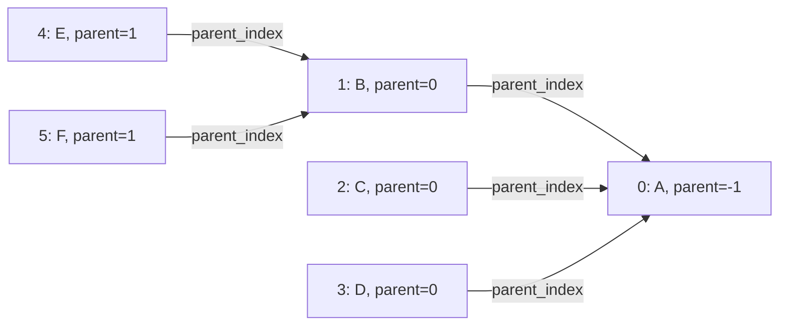

这张图不是在画“父节点直接指向孩子”的树边，而是在画：

> 每个表项内部的 `parent_index` 最终指向哪个父节点表项。

所以，双亲表示法的恢复方式是“由子找父”，而不是“由父直接枚举全部孩子”。

------

#### 五、应该怎样理解这种表示法

双亲表示法有一个非常明确的特点：

- **父节点信息是直接保存的**
- **孩子节点信息不是直接保存的**

也就是说：

##### 1）找父节点很直接

例如要找 `F` 的父节点：

- 先找到 `F` 的表项，下标为 `5`
- 读取 `parent_index = 1`
- 再到表中查下标 `1`
- 得到父节点是 `B`

这个过程只需要一次整数索引跳转。

------

##### 2）找祖先链也很直接

例如从 `F` 一路向上找到根：

- `F.parent_index = 1`，父节点是 `B`
- `B.parent_index = 0`，父节点是 `A`
- `A.parent_index = -1`，到达根节点

所以路径为：

```text
F -> B -> A
```

这正是双亲表示法最擅长的地方。

------

##### 3）找孩子不直接

例如要找 `A` 的所有孩子，表中并没有一项写着：

```text
A.children = {B, C, D}
```

你必须扫描整张表，找出所有满足下面条件的节点：

```text
parent_index == A所在下标
```

如果 `A` 在下标 `0`，那么你要扫描整个数组，找出：

- `B.parent_index == 0`
- `C.parent_index == 0`
- `D.parent_index == 0`

这就是双亲表示法“向上方便，向下不方便”的本质原因。

------

#### 六、访问示例

下面给出两个典型操作示例。

------

##### 1）根据节点下标找父节点

```c
static int get_parent_index(const struct parent_repr_node *nodes,
			    int node_index)
{
	return nodes[node_index].parent_index;
}
```

如果传入的是 `F` 所在下标 `5`，则返回值为 `1`，表示它的父节点在表中的下标是 `1`。

------

##### 2）根据节点下标向上回溯到根

```c
static void print_to_root(const struct parent_repr_node *nodes,
			  int node_index)
{
	while (node_index != TREE_PARENT_NONE) {
		printf("%d ", nodes[node_index].value);
		node_index = nodes[node_index].parent_index;
	}
}
```

这个过程的逻辑非常直接：

- 先访问当前节点
- 再跳到它的父节点
- 一直重复，直到遇到根节点的 `TREE_PARENT_NONE`

因此，双亲表示法天然适合实现“从当前节点回溯到根”的操作。

------

#### 七、优点

双亲表示法的优点主要有以下几点：

- 结构简单，每个节点只需保存一个父节点下标
- 存储开销较小，不需要额外孩子链表或多个指针字段
- 查找父节点非常直接
- 适合做“向上回溯”类操作，例如查祖先、回溯路径、判断层级关系
- 如果节点总量固定，表结构实现比较稳定

------

#### 八、缺点

双亲表示法的缺点也非常明确：

- 找孩子节点不直接
- 找某个节点的全部孩子时，必须扫描整张表
- 不适合频繁进行“从父节点向下枚举所有孩子”的操作
- 如果树很大，向下查找的代价会比较高
- 对以“孩子访问”为主的树结构算法不够友好

也就是说：

> 它把“父信息”做成了直接索引，却把“孩子信息”变成了隐含关系。

------

#### 九、适用场景

双亲表示法更适合以下场景：

- 需要经常查找父节点
- 需要经常做祖先路径回溯
- 节点数量相对固定
- 树结构变化不频繁
- 更关注层级归属关系，而不是频繁做向下扩展

例如：

- 从某个节点回溯到根
- 查某节点的父节点或祖先节点
- 判断两个节点是否属于同一祖先分支
- 静态层级结构的存储

------

#### 十、和后续树结构实现的关系

双亲表示法通常不适合作为后续查找树、AVL 树、红黑树等结构的核心表示方式。

原因不是它不能表示树，而是因为这些树的核心操作高度依赖：

- 从当前节点快速访问左孩子 / 右孩子
- 沿着向下路径做查找、插入、旋转、重平衡

而双亲表示法并不擅长“向下访问”，它更擅长的是“向上回溯”。

所以在普通树的几种表示法里，双亲表示法更像是一种：

> 适合静态层级记录和祖先关系分析的表式表示法

而不是一种面向高频向下操作的动态链式结构。

------

#### 十一、小结

双亲表示法的本质可以概括为：

> 把树中每个节点放到一张表里，并让每个节点通过 `parent_index` 记录自己的父节点位置。

因此：

- 它最擅长的是“由子找父”
- 它不擅长的是“由父找全部孩子”

你可以直接记住这句话：

> **双亲表示法强调的是向上关系。**
> **节点知道自己的父节点是谁，但父节点并不直接保存自己的孩子集合。**

------

### 1.4.3 孩子表示法

下面是孩子表示法的代码简易描述：

**原始代码**

```c
struct child_list_node {
	struct tree_node *child;		// 指向第一个孩子
	struct child_list_node *next;	// 指向第一个孩子的剩下兄弟节点
};

struct tree_node {
	int value;
	struct child_list_node *children;
};
```

------

#### 一、先看它想表示的树

假设树结构是这样：


含义：

- `A` 的孩子是 `B C D`
- `B` 的孩子是 `E F`

------

#### 二、这段代码对应的内存组织图

这段代码不是让树节点直接互相串起来，而是：

- `tree_node.children` 指向一条“孩子链表”
- 链表中的每个 `child_list_node` 记录一个孩子
- `child` 指向真正的孩子节点
- `next` 指向下一个孩子链表节点

图如下：

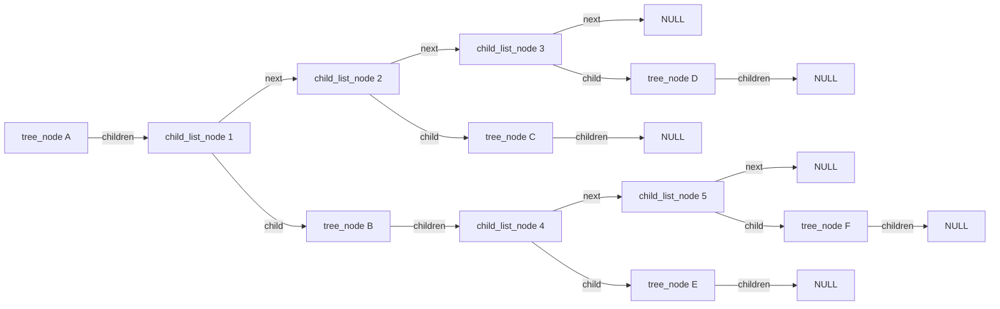

------

#### 三、字段语义直接对应说明

##### 1）`children`

```c
struct child_list_node *children;
```

它表示：

> 当前树节点的孩子链表头指针

例如：

- `A.children` 指向 `EA1`
- `B.children` 指向 `EB1`

------

##### 2）`child`

```c
struct tree_node *child;
```

它表示：

> 当前这个 `child_list_node` 记录的那个孩子节点是谁

例如：

- `EA1.child = B`
- `EA2.child = C`
- `EA3.child = D`

所以 `child` 不是：

- 不是孩子链表头
- 不是状态机指针
- 不是“下一个孩子”

它就是：

> 这个链表节点对应的真正孩子节点

------

##### 3）`next`

```c
struct child_list_node *next;
```

它表示：

> 下一个孩子链表节点是谁

例如：

- `EA1.next = EA2`
- `EA2.next = EA3`

所以 `next` 串起来的是：

> `child_list_node` 链表节点

不是直接串 `tree_node`

------

#### 四、为什么你会觉得它像“兄弟关系”

因为从语义上看，`EA1`、`EA2`、`EA3` 分别对应 `B`、`C`、`D`。

所以：

- `EA1.next = EA2`
- `EA2.next = EA3`

就等价于：

- `B` 后面是 `C`
- `C` 后面是 `D`

也就是说：

> 在 `child_list_node` 这一层，`next` 确实表示同一父节点下孩子的兄弟顺序

但它的类型仍然是：

```c
struct child_list_node *next;
```

不是：

```c
struct tree_node *next;
```

所以更准确地说：

> **语义上它表达兄弟顺序**
> **实现上它链接的是兄弟孩子对应的链表节点**

------

#### 五、把“实现层”和“语义层”同时放在一张图里

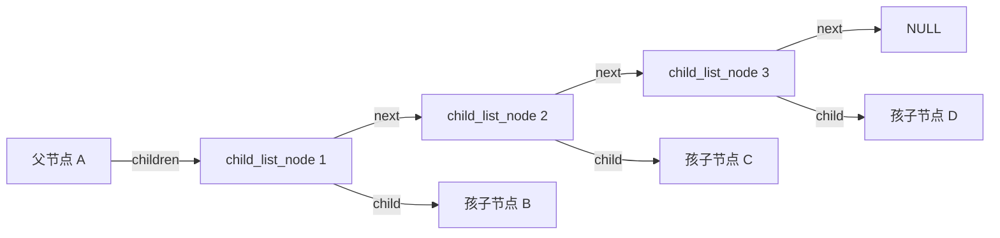

这张图里同时成立两句话：

##### 实现层

- `E1.next = E2`
- `E2.next = E3`

说明：

> `next` 连的是 `child_list_node`

------

##### 语义层

- `E1.child = B`
- `E2.child = C`
- `E3.child = D`

说明：

> `E1.next = E2` 这件事，在语义上也可以理解为 `B` 的后一个兄弟是 `C`

------

#### 六、为什么会让人感觉“别扭”

因为它不是两种最直观的树表示法。

它不是这种：

> 树节点直接带“第一个孩子 / 下一个兄弟”指针

也不是这种：

> 父节点直接把所有孩子节点本体一串到底

它采用的是：

> 父节点先指向一条“孩子链表”，链表节点再去指向真正的孩子树节点

所以它天然有两层：

1. `tree_node`
2. `child_list_node`

读起来就会有一种：

> 既不是纯节点关系表示，也不是纯孩子直连表示

的感觉。

这个不适感是正常的，不是你理解错了。

------

#### 七、最后把这段结构压缩成一句话

这段代码表达的是：

> 每个 `tree_node` 通过 `children` 挂一条孩子链表；
> 链表中的每个 `child_list_node` 用 `child` 指向一个真正的孩子节点，用 `next` 指向下一个孩子链表节点。

如果从兄弟顺序角度看：

> `next` 在语义上确实表示同一父节点下孩子的先后顺序；
> 但它不是 `tree_node` 之间直接相连，而是 `child_list_node` 之间相连。

------

### 1.4.4 孩子兄弟表示法

孩子兄弟表示法是普通树中非常经典的一种链式表示法。

它的核心思想不是“一个节点直接保存所有孩子”，而是：

- 每个节点只保留两个指针
- 一个指向自己的第一个孩子
- 一个指向自己的下一个兄弟

也就是说，某个节点的全部孩子，不再由父节点用一张“孩子表”统一管理，而是：

> 先找到第一个孩子，再沿着兄弟链依次找到后续孩子。

因此，它本质上是在做两件事：

1. 用 `first_child` 表示“向下进入下一层”
2. 用 `next_sibling` 表示“在同一层横向移动”

------

#### 一、结构定义

```c
struct tree_node {
	int value;
	struct tree_node *first_child;
	struct tree_node *next_sibling;
};
```

这两个字段分别表示：

- `first_child`：该节点的第一个孩子
- `next_sibling`：该节点的下一个兄弟

注意，这里的 `next_sibling` 是直接挂在树节点本体上的。
因此，兄弟关系不是由父节点额外维护的一张链表来表达，而是由兄弟节点自己串起来。

------

#### 二、示例树

仍然看这棵树：


这棵树的含义是：

- `A` 的孩子是 `B`、`C`、`D`
- `B` 的孩子是 `E`、`F`
- `D` 的孩子是 `G`

------

#### 三、孩子兄弟表示法下的结构关系

如果改用孩子兄弟表示法，则不再表示为“父节点直接连向所有孩子”，而是变成：

- `A.first_child = B`
- `B.next_sibling = C`
- `C.next_sibling = D`
- `B.first_child = E`
- `E.next_sibling = F`
- `D.first_child = G`

也就是说：

- 从 `A` 出发，先通过 `first_child` 找到第一个孩子 `B`
- 然后再通过 `B.next_sibling` 找到 `C`
- 再通过 `C.next_sibling` 找到 `D`

所以，`A` 的孩子集合 `B、C、D`，在这种表示法下实际上被组织成了一条兄弟链。

结构图如下：

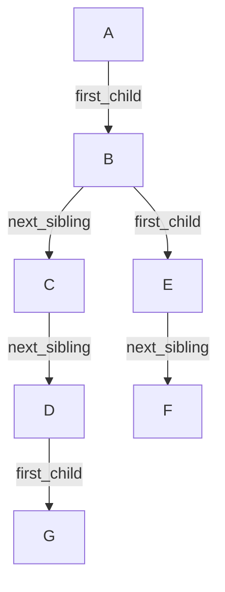

------

#### 四、应该怎样理解这张图

这张图最关键的阅读方法是：

##### 1. 看“向下”的关系

凡是 `first_child`，表示：

> 当前节点进入自己的下一层孩子集合

例如：

- `A.first_child = B`，表示 `B` 是 `A` 的第一个孩子
- `B.first_child = E`，表示 `E` 是 `B` 的第一个孩子
- `D.first_child = G`，表示 `G` 是 `D` 的第一个孩子

------

##### 2. 看“横向”的关系

凡是 `next_sibling`，表示：

> 当前节点在同一层的下一个兄弟是谁

例如：

- `B.next_sibling = C`
- `C.next_sibling = D`

这说明：

- `B`、`C`、`D` 是同一父节点 `A` 下面的一组兄弟
- `E.next_sibling = F` 说明 `E` 和 `F` 是同一父节点 `B` 下面的一组兄弟

------

##### 3. 每个节点只知道两件事

孩子兄弟表示法中，每个节点本体只关心两件事：

- 我的第一个孩子是谁
- 我的下一个兄弟是谁

至于“我一共有几个孩子”，并不会直接存成数组或链表头+计数，而是要：

- 先找到 `first_child`
- 再顺着兄弟链继续走

因此，它天然适合表示“孩子个数不固定”的普通树。

------

#### 五、为什么它看起来和孩子表示法有点像

这是一个非常容易混淆的点。

你会感觉它和孩子表示法很像，是因为：

> 对于某个父节点的一组孩子，这两种表示法最后都会形成一种“可线性遍历的顺序”。

例如，`A` 的孩子都是 `B、C、D`。

在孩子表示法中，这种顺序通常表现为：

- `A.children` 指向孩子链表头
- 链表中的若干个 `child_list_node` 依次对应 `B、C、D`

在孩子兄弟表示法中，这种顺序表现为：

- `A.first_child = B`
- `B.next_sibling = C`
- `C.next_sibling = D`

所以从“遍历 `A` 的全部孩子”这个局部动作来看，两者都能得到：

```text
B -> C -> D
```

这就是为什么你会感觉它们“落到子节点时很像”。

------

#### 六、它和孩子表示法的本质区别

虽然两者在“遍历孩子集合”时效果相近，但它们把兄弟顺序挂载在了不同的位置。

##### 1. 孩子表示法

孩子表示法的典型思路是：

- 父节点有一个 `children`
- `children` 指向一条孩子链表
- 链表节点中再用 `child` 指向真正的孩子节点
- 链表节点之间再用 `next` 串起来

也就是说：

> 兄弟顺序保存在“父节点的孩子链表”里。

因此，兄弟关系不是直接挂在 `tree_node` 本体上，而是挂在辅助链表节点上。

------

##### 2. 孩子兄弟表示法

孩子兄弟表示法中：

- `first_child` 直接挂在树节点上
- `next_sibling` 也直接挂在树节点上

也就是说：

> 兄弟顺序直接保存在“树节点本体”里。

因此，节点自己就知道“我的下一个兄弟是谁”。

------

#### 七、对照图

为了更直观看出差异，可以把两种表示法并列理解。

##### 1. 孩子表示法的局部结构

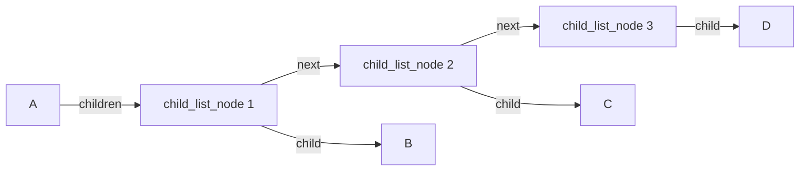

这里可以看出：

- `B、C、D` 的顺序，是由 `child_list_node` 链表维护的
- 兄弟顺序挂在链表节点的 `next` 上

------

##### 2. 孩子兄弟表示法的局部结构

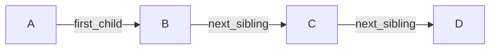

这里可以看出：

- `B、C、D` 的顺序，是由树节点自己的 `next_sibling` 维护的
- 不再需要额外插入一层孩子链表节点

------

#### 八、为什么它重要

孩子兄弟表示法的重要性在于：

第一，它把普通树压缩成了“每个节点固定两个指针”的统一形式。
第二，它不需要为“孩子个数不固定”额外设计数组长度或专门的孩子链表节点结构。
第三，它把普通树的结构组织成一种非常适合递归处理的链式模型。
第四，它也为普通树与二叉树之间的某些结构转换提供了统一视角。

------

#### 九、优点

- 每个节点字段固定，结构统一
- 不需要额外的孩子链表节点
- 适合表示不定长孩子集合
- 递归处理较自然
- 从某个孩子节点出发，可以直接通过 `next_sibling` 找到它的下一个兄弟

------

#### 十、缺点

- 访问第 `k` 个孩子仍然需要沿兄弟链遍历
- 如果只看某个节点本体，不能直接得到“全部孩子数量”
- 结构阅读时需要同时区分“向下的孩子关系”和“横向的兄弟关系”
- 对初学者来说，容易把它和二叉树的左右孩子指针混淆

------

#### 十一、小结

孩子兄弟表示法的核心不是“父节点保存所有孩子”，而是：

> 每个节点只保存“第一个孩子”和“下一个兄弟”，
> 从而用“第一孩子 + 兄弟链”的方式，把普通树组织成统一的链式结构。

它和孩子表示法的主要区别不在于“能不能表示兄弟顺序”，而在于：

> **孩子表示法把兄弟顺序挂在父节点的孩子链表上；**
> **孩子兄弟表示法把兄弟顺序直接挂在树节点本体上。**

所以两者在“遍历某个父节点的孩子集合”时看起来很像，但内部结构责任归属并不相同。

------

### 1.4.5 为什么后续高级树大多采用固定指针结构

学完前面几种表示法之后，你需要形成一个整体判断：

> 普通树的表示法很多，但到了二叉树及其扩展结构，通常会收缩为字段固定的链式节点表示。

原因有三个。

#### 一、结构约束更强

二叉树规定每个节点最多两个孩子，因此可以直接用固定字段表示：

```c
struct binary_node {
	int value;
	struct binary_node *left;
	struct binary_node *right;
};
```

这比普通树的不定长孩子集合更直接。

#### 二、操作模式更明确

二叉树及其扩展结构通常主要依赖：

- 左子树
- 右子树
- 父节点

例如红黑树常见节点定义会进一步包含颜色和父指针。

#### 三、局部重排更方便

后面你要学旋转。
旋转本质上是对一小块父子指针关系做局部重排。

只有当节点结构稳定、字段固定时，这类操作才容易表达和实现。

所以本章学习普通树表示法，并不是为了让你后面一直写多叉树节点，而是为了让你知道：

- 普通树的通用表示有很多
- 二叉树是更强约束下的特殊化
- 红黑树又是在二叉树之上的进一步约束

------

### 1.4.6 示例：普通树的一个简单链式实现

下面给一个较小的示例，展示“孩子兄弟表示法”的基本结构。

```c
#include <stdio.h>
#include <stdlib.h>

struct tree_node {
	const char *name;
	struct tree_node *first_child;
	struct tree_node *next_sibling;
};

static struct tree_node *
tree_node_create(const char *name)
{
	struct tree_node *node;

	node = malloc(sizeof(*node));
	if (!node)
		return NULL;

	node->name = name;
	node->first_child = NULL;
	node->next_sibling = NULL;
	return node;
}

static void 
tree_add_child(struct tree_node *parent, struct tree_node *child)
{
	struct tree_node *pos;

	if (!parent || !child)
		return;

	if (!parent->first_child) {
		parent->first_child = child;
		return;
	}

	pos = parent->first_child;
	while (pos->next_sibling)
		pos = pos->next_sibling;

	pos->next_sibling = child;
}

static void 
tree_print_preorder(struct tree_node *node, int depth)
{
	int i;
	struct tree_node *child;

	if (!node)
		return;

	for (i = 0; i < depth; ++i)
		printf("  ");

	printf("%s\n", node->name);

	child = node->first_child;
	while (child) {
		tree_print_preorder(child, depth + 1);
		child = child->next_sibling;
	}
}

int main(void)
{
	struct tree_node *root;
	struct tree_node *home;
	struct tree_node *etc;
	struct tree_node *usr;
	struct tree_node *ssh;

	root = tree_node_create("/");
	home = tree_node_create("home");
	etc = tree_node_create("etc");
	usr = tree_node_create("usr");
	ssh = tree_node_create("ssh");

	tree_add_child(root, home);
	tree_add_child(root, etc);
	tree_add_child(root, usr);
	tree_add_child(etc, ssh);

	tree_print_preorder(root, 0);
	return 0;
}
```

这个程序说明了几件事。

第一，普通树节点不一定直接保存“数组形式的所有孩子”。
第二，用“第一个孩子 + 兄弟链”就能把任意个孩子组织起来。
第三，遍历时的逻辑是：

- 先处理当前节点
- 再遍历第一孩子
- 再沿兄弟链处理其余孩子

这再次体现了树的递归结构。

------

## 1.5 本章小结

### 1.5.1 本章的核心结论

第1章的任务不是让你会写复杂树算法，而是建立后续所有章节都要反复使用的基础坐标系。

你需要明确以下结论。

#### 第一，树是层级型非线性结构

它不是数组和链表的简单变形，而是一种独立的数据组织方式。
它的核心关系是：

- 父子关系
- 兄弟关系
- 路径关系
- 子树关系

#### 第二，树具有递归定义

一棵树由根和若干子树组成。
任意子树仍然是一棵树。
这决定了树的分析与实现天然适合递归思路。

#### 第三，树必须满足连通和无环

这是树与一般图结构的重要分界。
如果不连通，结构会退化成森林。
如果有环，很多树性质会失效。

#### 第四，除根节点外，每个节点有且仅有一个父节点

这保证了：

- 向上路径唯一
- 节点归属唯一
- 深度定义稳定
- 父链回溯可行

#### 第五，树的效率高度依赖“形状”

节点总数能描述规模，树高更能决定许多操作的代价。
这个结论会在后续 BST 与红黑树中变得非常重要。

#### 第六，树的程序表示有多种方式

对于普通树，常见表示包括：

- 双亲表示法
- 孩子表示法
- 孩子兄弟表示法

对于更强约束的树，例如二叉树，通常会采用字段固定的链式节点结构。

------

### 1.5.2 本章与后续章节的衔接关系

本章结束后，你已经具备了进入下一章的前提。

接下来进入第2章“二叉树”时，你要特别注意三件事。

第一，二叉树不是否定“树”的概念，而是在“树”的基础上增加更强约束。
也就是：

> 每个节点的孩子数最多为 2。

第二，二叉树中的左右方向具有明确结构意义。
这与普通树“孩子集合无固定左右次序”的情况不同。

第三，后续 BST、AVL、红黑树都属于二叉树体系，而不是普通多叉树体系。
所以从第2章开始，学习重点会从“树的一般概念”逐步收缩到“二叉结构上的有序与平衡问题”。

------

### 1.5.3 学完本章后你应当能够做到的事

到这里，你应当已经能够稳定回答以下问题：

- 什么是树，为什么它是非线性结构
- 什么是根节点、父节点、子节点、兄弟节点、叶子节点
- 什么是路径、深度、高度、子树、森林
- 为什么树适合递归处理
- 为什么树必须连通且无环
- 普通树常见的表示法有哪些
- 为什么后续很多高级树结构更偏向链式固定字段表示

如果这些问题仍然回答不稳定，就不应急着跳进红黑树。
因为红黑树中的每一个术语，都会默认你已经掌握本章内容。
