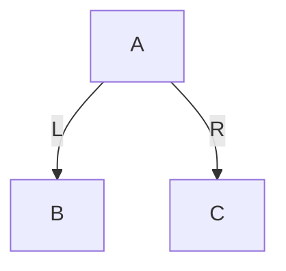
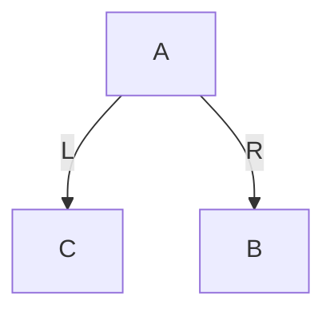
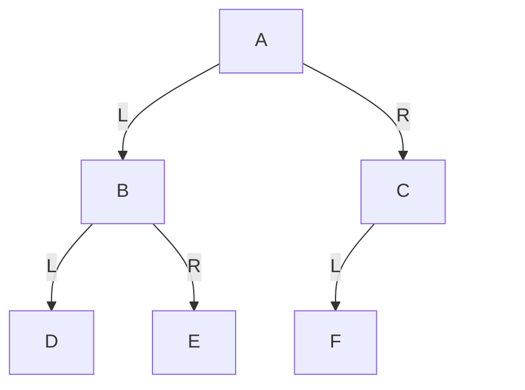
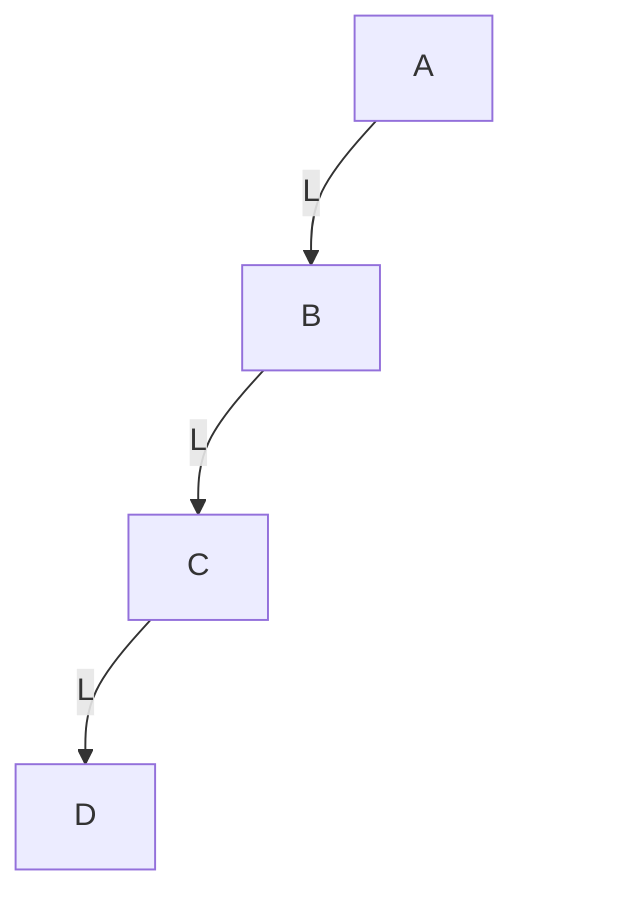
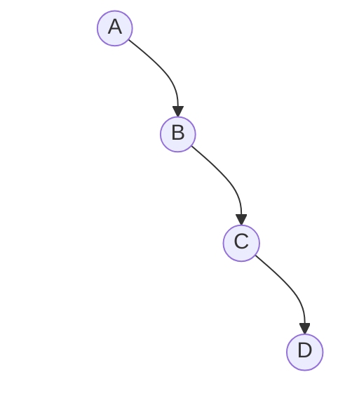
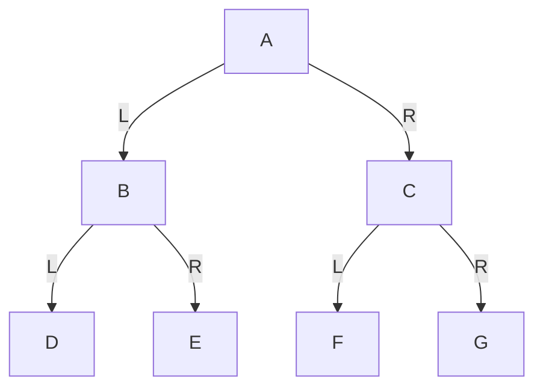
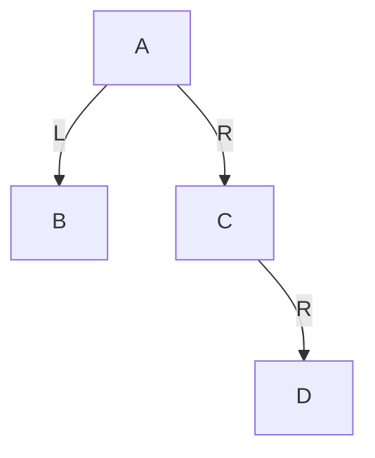
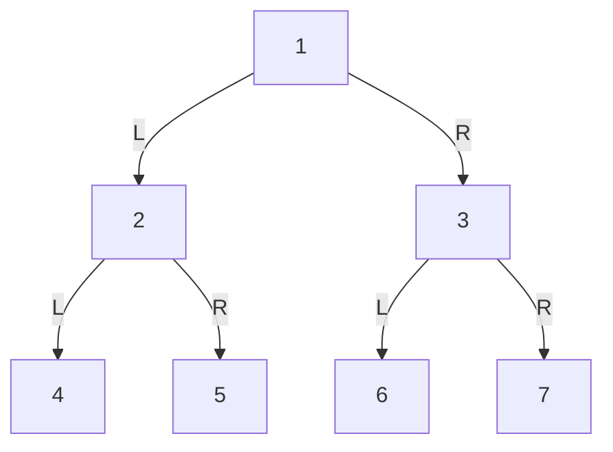
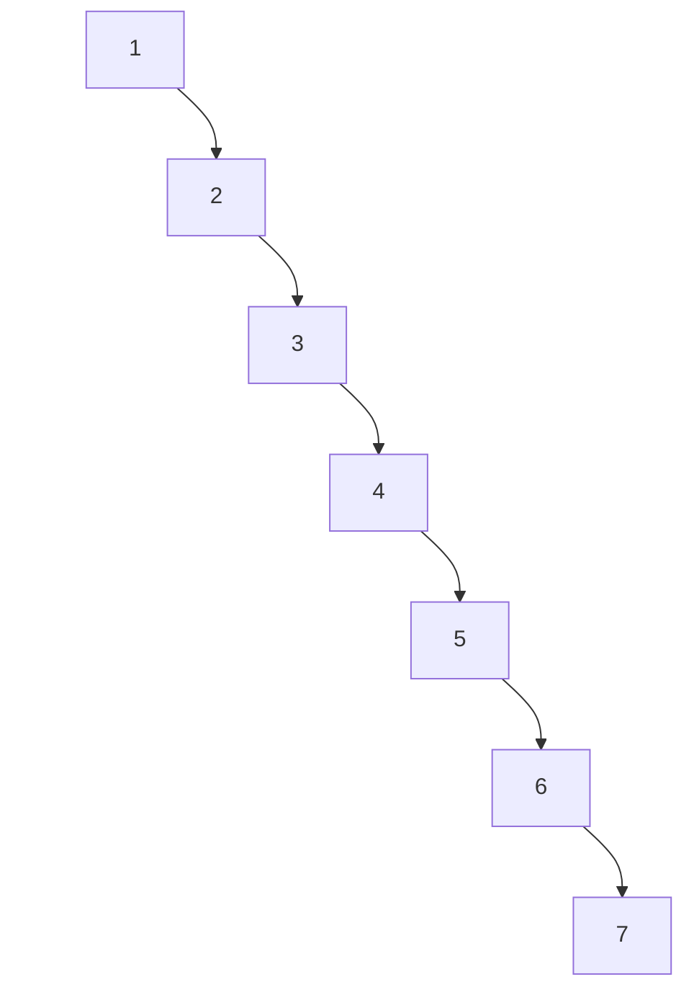
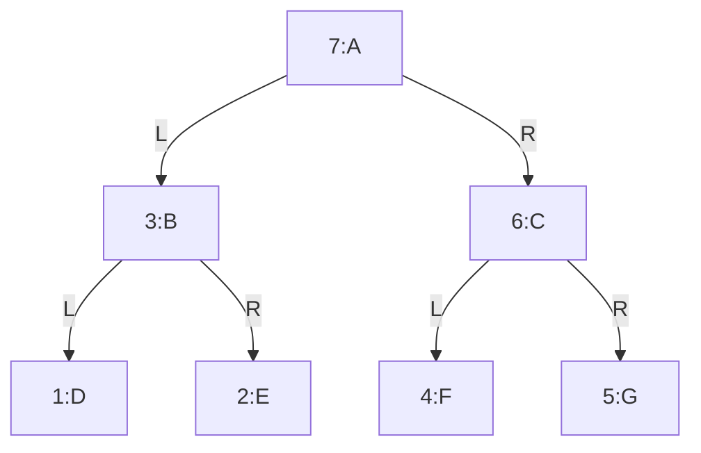

# 第2章 二叉树

## 章节内容说明

第1章完成后，你已经建立了“树”的一般概念。
从这一章开始，学习范围要进一步收缩到 **二叉树**。

这一步非常关键，因为后续你要学习的：

- 二叉搜索树 BST
- 旋转
- 红黑树
- Linux 内核 `rbtree`

都不再建立在“普通树”的宽泛结构上，而是建立在：

> **每个节点最多两个孩子，并且左右方向有明确语义的二叉结构上。**

所以本章的目标不是泛泛地再讲一遍树，而是要把下面几个问题建立清楚：

1. 什么是二叉树
2. 二叉树与普通树的本质区别是什么
3. 左子树与右子树为什么不能随意交换理解
4. 二叉树有哪些典型形态
5. 二叉树遍历为什么会成为后续 BST 与红黑树学习的基础

------

## 2.1 二叉树的定义与结构

### 2.1.1 二叉树的定义

二叉树（Binary Tree）是树的一种特殊形式。它满足的核心约束是：

> **每个节点最多只有两个子节点，并且这两个子节点有明确区分：左子节点与右子节点。**

这里有三个点必须准确理解。

第一，**最多两个**。
不是“必须两个”，而是“最大不超过两个”。

第二，**左右有区分**。
左子节点与右子节点不是一个无序集合中的两个元素，而是两个有固定语义的位置。

第三，**二叉树仍然属于树**。
它依然满足树的基本条件：

- 连通
- 无环
- 除根节点外每个节点恰有一个父节点

所以二叉树不是脱离树的另一种结构，而是树的一种特化形式。

------

### 2.1.2 二叉树节点的标准结构视角

普通树中，一个节点的孩子数不固定，所以表示方式比较宽泛。
二叉树因为最多只有两个孩子，因此它的节点结构可以固定下来。

最基础的二叉树节点通常写成：

```c
struct binary_node {
	int value;
	struct binary_node *left;
	struct binary_node *right;
};
```

如果后续需要向上回溯，也常加入父指针：

```c
struct binary_node {
	int value;
	struct binary_node *parent;
	struct binary_node *left;
	struct binary_node *right;
};
```

这些字段的含义必须固定理解：

- `left`：左子树入口
- `right`：右子树入口
- `parent`：父节点入口

这正是后续各类二叉树扩展结构的基础模板：

- BST：在此基础上增加大小关系约束
- AVL：在此基础上增加平衡约束
- 红黑树：在此基础上增加颜色与修复规则

也就是说，你现在看到的不是一个普通结构体，而是后面整条路线的公共骨架。

------

### 2.1.3 左子树与右子树的有序性

这是二叉树最关键的结构特征之一。

在普通树中，一个节点的多个孩子通常只是“孩子集合”。
但在二叉树中，两个孩子不是无序的，而是严格区分为：

- 左子树
- 右子树

这意味着：

> **左右位置本身就是结构信息。**

看下面这两棵树。

#### 图 2-1 左右位置不同的两棵二叉树

第一棵：



第二棵：



如果是普通树，你可以把它们都理解为：“`A` 有两个孩子，分别是 `B` 和 `C`”。
但如果是二叉树，这两棵树不是同一个结构，因为：

- 第一棵：`B` 在左，`C` 在右
- 第二棵：`C` 在左，`B` 在右

这件事后面会直接影响：

- 遍历结果
- BST 的大小关系
- 左旋与右旋
- 红黑树修复中的内侧 / 外侧判断

所以从二叉树开始，你必须建立一个新习惯：

> **不是只看“下面有几个孩子”，而是看“哪个在左，哪个在右”。**

------

### 2.1.4 二叉树与普通树的区别

下面把普通树与二叉树明确对比。

| 比较项       | 普通树           | 二叉树                 |
| ------------ | ---------------- | ---------------------- |
| 子节点个数   | 不固定           | 最多 2 个              |
| 子节点顺序   | 通常是孩子集合   | 明确区分左、右         |
| 节点表示     | 常需动态孩子集合 | 可用固定字段表示       |
| 后续扩展方向 | 多叉树体系       | BST / AVL / 红黑树体系 |

所以，二叉树的重要性不只是“孩子数更少”，而在于：

> **它把不定长孩子集合压缩成了固定槽位结构。**

有了固定槽位，后面很多事情才有了精确定义：

- 左子树 / 右子树
- 比较后走左还是走右
- 局部旋转
- 平衡修复

------

### 2.1.5 二叉树的递归定义

和普通树一样，二叉树也具有递归定义，但形式更具体：

> **二叉树由一个根节点、一棵左子树和一棵右子树组成；其中左子树和右子树本身也分别是二叉树。**

这里有三个直接结论。

第一，左子树和右子树都可以为空。
所以叶子节点的左、右子树都为空。

第二，任何局部节点以下的部分，都仍可作为一棵二叉树分析。
这为后续递归遍历和递归求高度提供了前提。（在linux kernel 5.15 和 6.1 中采用的循环迭代不是递归，递归太迟栈空间了，在嵌入式不适用）

第三，很多算法都可以自然写成：

- 处理当前节点
- 递归处理左子树
- 递归处理右子树

例如后面马上要讲的：

- 前序遍历
- 中序遍历
- 后序遍历

都直接建立在这个定义之上。

------

### 2.1.6 示例：一个最基本的二叉树

下面给出一棵最基础的二叉树。

#### 图 2-2 一个基本二叉树示意图



从这张图里，你应当准确读出：

- `A` 是根节点
- `B` 是 `A` 的左孩子
- `C` 是 `A` 的右孩子
- `D` 是 `B` 的左孩子
- `E` 是 `B` 的右孩子
- `F` 是 `C` 的左孩子
- `C` 的右孩子为空

这张图里专门给 `C` 补了一个**透明右占位节点**，目的就是让你看到：

> `C` 不是“只有一个模糊的孩子”，而是“左槽位有孩子、右槽位为空”。

这个视觉习惯，对后面理解：

- 单左孩子
- 单右孩子
- BST 查找路径
- 旋转前后结构

都非常重要。

------

## 2.2 二叉树的基本形态

虽然二叉树都遵守“最多两个孩子”的结构约束，但具体形态差异很大。
这些形态差异会直接影响：

- 高度
- 存储方式
- 遍历结果
- 操作复杂度

所以学习二叉树时，不能只知道“有左右孩子”，还要会识别它的典型形态。

------

### 2.2.1 斜树

斜树是最不平衡的一类二叉树。它的特征是：

- 大多数节点都只有一个孩子
- 整棵树持续向某一个方向延伸

如果一直向左延伸，称为左斜树；一直向右延伸，称为右斜树。

#### 图 2-3 左斜树



这张图强调的是：

- `A` 只有左孩子 `B`
- `B` 只有左孩子 `C`
- `C` 只有左孩子 `D`

每一层右侧都用透明占位补齐，因此你看到的是明确的“只有左，不是右”。

------

#### 图 2-4 右斜树



这张图强调的是：

- `A` 只有右孩子 `B`
- `B` 只有右孩子 `C`
- `C` 只有右孩子 `D`

左侧全部用透明占位补齐，因此你能明确看出它是“单右链”。

斜树的意义在于说明：

> **二叉树并不天然平衡。**

这会在后面 BST 一章中变成核心问题：
如果树长成斜树，查找效率就会明显变差。

------

### 2.2.2 满二叉树

满二叉树（Full Binary Tree）指的是：

> **除叶子节点外，每个节点都有两个子节点，并且所有叶子节点都在同一层。**

#### 图 2-5 满二叉树



这棵树满足：

- `A`、`B`、`C` 都各有两个孩子
- `D`、`E`、`F`、`G` 都是叶子节点
- 所有叶子位于同一层

满二叉树是二叉树中最规整的一种理想形态。

如果树高为 `h`（根节点高度按边数算），那么节点总数为：

```text
2^(h + 1) - 1
```

例如图中高度为 2，则节点数为：

```text
2^3 - 1 = 7
```

满二叉树的重要性在于，它提供了一个“结构最规整”的参考模型。

------

### 2.2.3 完全二叉树

完全二叉树（Complete Binary Tree）比满二叉树更宽松。它的定义是：

> **除最后一层外，其余各层都满；最后一层的节点必须从左到右连续排列，中间不能出现空洞。**

#### 图 2-6 完全二叉树


这棵树是完全二叉树，因为：

- 前两层已经满
- 最后一层节点按从左到右连续出现
- 没有“左边空着、右边先有节点”的情况

------

#### 图 2-7 非完全二叉树示意

下面给一个不是完全二叉树的结构。



这棵树不是完全二叉树，因为：

- `C` 的左槽位为空
- 但右槽位却先出现了 `D`

也就是说，最后一层没有按从左到右连续填充。

完全二叉树之所以重要，是因为它特别适合：

- 顺序存储
- 堆结构
- 数组表达的二叉树

------

### 2.2.4 二叉树高度与节点数量关系

这一节的目标，是让你建立一个很重要的判断：

> **二叉树的效率，不只由节点数量决定，更由高度决定。**

#### 一、同样节点数，高度可能差很多

例如同样是 7 个节点。

##### 图 2-8 7 个节点构成的规整二叉树



这棵树高度为 2。

------

##### 图 2-9 7 个节点构成的右斜树



这棵树高度为 6。

你看到的是：

- 节点数相同
- 但高度差异极大

因此，节点数只描述规模；真正决定很多操作路径长度的，是高度。

#### 二、为什么这件事重要

因为后面在 BST 中：

- 查找一个值，不会扫描所有节点
- 而是沿一条根到目标位置的路径向下走

所以时间复杂度通常与高度更接近，而不是直接与节点总数相同。

这也是为什么后面会自然引出：

- BST 为什么会退化
- 为什么需要旋转
- 为什么要控制树高
- 红黑树究竟在控制什么

所以从这一节开始，你必须建立这个意识：

> **树的形状会影响效率，而高度是这种影响最关键的量化指标。**

------

## 2.3 二叉树的遍历

遍历是二叉树学习中的核心内容。
因为你后面几乎所有操作都会涉及“按某种顺序访问整棵树或局部子树”。

二叉树遍历之所以比普通树更规范，是因为：

- 只有左右两个方向
- 左右顺序本身有语义
- 因此访问顺序可以被严格定义

最基本的遍历有四种：

- 前序遍历
- 中序遍历
- 后序遍历
- 层序遍历

本节先把遍历规则和结果讲清楚。

为了统一说明，下面四种遍历都使用同一棵树。

**图 2-10 遍历说明用例树**


------

### 2.3.1 前序遍历

当我们第一次接触二叉树遍历时，最容易犯的错误，不是代码写错，而是**没有真正理解“访问顺序”到底在定义什么**。

二叉树不是线性结构。
在线性表里，元素天然排成一行，从前到后访问即可。
但在二叉树里，每个节点都可能分出两个方向：

- 左子树
- 右子树

于是，只说“把整棵树访问一遍”是不够的。
我们必须进一步规定：

> 当一个节点同时有左子树和右子树时，当前节点、左子树、右子树，谁先谁后？

前序遍历，就是对这个问题给出的第一种标准答案。

------

#### 一、前序遍历到底在规定什么

前序遍历（Preorder Traversal）的规则是：

> **根 -> 左子树 -> 右子树**

这句话很短，但必须彻底吃透。

它不是在说“先把整棵树都看一遍，再看左边，再看右边”。
它真正的意思是：

对于**任意一个节点**，都遵循同样的访问规则：

1. 先访问当前节点自己
2. 再处理它的左子树
3. 最后处理它的右子树

注意这里的关键点：

> 这个规则不是只对整棵树的根节点生效，而是对整棵树中的每一个节点都重复生效。

这就是为什么二叉树遍历天然适合递归表达。

------

#### 二、先看一棵具体的树

我们先固定一棵示例树，后面的所有讲解都围绕它展开。

##### 图 2-10 前序遍历说明用例树


这棵树的结构很规整：

- `A` 是根节点
- `A` 的左孩子是 `B`，右孩子是 `C`
- `B` 的左孩子是 `D`，右孩子是 `E`
- `C` 的左孩子是 `F`，右孩子是 `G`

如果你只是“看图”，你会觉得这棵树是从上到下展开的。
但前序遍历并不是“按视觉顺序看图”，它是严格按“根 -> 左 -> 右”的规则走。

------

#### 三、前序遍历的最终结果

对图 2-10 进行前序遍历，结果是：

```text
A B D E C F G
```

这个结果不要死记。
你现在真正要学会的是：

> 它为什么一定是这个顺序，而不是别的顺序？

------

#### 四、一步一步手工推演

我们从根节点 `A` 开始。

##### 第一步：访问 `A`

前序遍历规定“根先访问”，所以第一个访问的一定是：

```text
A
```

此时结果序列是：

```text
A
```

但事情还没有结束，因为 `A` 还有左子树和右子树。

按照规则：

> 当前节点访问完以后，要先处理左子树，再处理右子树。

所以接下来进入 `A` 的左子树，也就是以 `B` 为根的那棵子树。

------

##### 第二步：进入 `B`

现在把 `B` 当作当前节点。
注意，规则又重新开始生效：

> 对于节点 `B`，仍然是“先访问 `B`，再处理 `B` 的左子树，再处理 `B` 的右子树”。

所以先访问 `B`：

```text
A B
```

接下来先处理 `B` 的左子树，也就是节点 `D`。

------

##### 第三步：进入 `D`

`D` 是一个叶子节点，没有左孩子，也没有右孩子。

按照前序规则：

1. 先访问 `D`
2. 左子树为空，结束
3. 右子树为空，结束

所以当前结果变成：

```text
A B D
```

`D` 的任务完成后，就要**回到 `B`**。

这是递归理解的关键：
不是“重新从根开始”，而是“回到刚才没做完的那个节点”。

对于 `B` 来说：

- 当前节点 `B` 已经访问过了
- 左子树 `D` 也已经处理完了
- 现在该处理右子树 `E`

------

##### 第四步：进入 `E`

`E` 也是叶子节点。

所以：

1. 访问 `E`
2. 左子树为空
3. 右子树为空

当前结果变成：

```text
A B D E
```

到这里，节点 `B` 的整棵子树就全部处理完了。

------

##### 第五步：回到 `A`，进入右子树 `C`

现在再回头看 `A`：

- `A` 自己已经访问过了
- `A` 的左子树 `B` 也已经全部处理完了
- 所以下一步轮到 `A` 的右子树 `C`

进入 `C` 后，前序规则再次生效：

1. 先访问 `C`
2. 再处理左子树 `F`
3. 最后处理右子树 `G`

所以先访问 `C`：

```text
A B D E C
```

------

##### 第六步：进入 `F`

`F` 是叶子节点，访问后结果为：

```text
A B D E C F
```

------

##### 第七步：进入 `G`

`G` 是叶子节点，访问后结果为：

```text
A B D E C F G
```

至此整棵树遍历结束。

------

#### 五、把访问过程画成编号图

为了更直观地看到访问次序，可以把访问编号直接写到图上。

##### 图 2-11 前序遍历访问顺序图


这张图建议你反复看两遍。

它清楚地告诉你：

- 每个父节点总是在自己的子节点之前访问
- 左子树永远先于右子树
- 但“先左后右”是在**当前节点已经被访问之后**才开始的

所以前序遍历最简洁的理解不是一句“根左右”，而是：

> **每到一个新节点，先立刻处理它自己；然后再把左右子树作为后续任务。**

------

#### 六、前序遍历的递归本质

现在我们把刚才的手工过程抽象成一个递归函数。

设 `Preorder(node)` 表示“对以 `node` 为根的子树做前序遍历”。

那么它的逻辑是：

```text
Preorder(node):
	如果 node == NULL:
		返回

	访问 node
	Preorder(node.left)
	Preorder(node.right)
```

这里有一个很重要的思维转换：

> “遍历整棵树” 和 “遍历一棵子树” 本质上是同一个问题。

因为对 `A` 的左子树 `B` 来说，它自己又是一棵完整的二叉树；
对 `C` 的右子树 `G` 来说，它也可以被看成一棵规模更小的树。

这就是递归成立的根本原因。

------

#### 七、为什么前序遍历要先访问当前节点

这是前序遍历的语义核心。

前序遍历最突出的特征是：

> **当前节点总在其子树之前被访问。**

这意味着什么？

意味着前序遍历特别适合那些“必须先知道父节点，再处理子树”的场景。
例如：

- 输出树结构时，先打印当前节点，再打印它的左右分支
- 拷贝树时，先创建当前节点，再递归创建左右子树
- 序列化树时，先记录当前节点，再记录左右子树

换句话说：

> 前序遍历是一种“先处理当前对象，再展开其组成部分”的顺序。

------

#### 八、前序遍历的 C 语言算法

下面先给出最核心的算法函数，不急着给完整程序。

```c
void preorder_traversal(const struct tree_node *root)
{
	if (!root)
		return;

	printf("%c ", root->value);
	preorder_traversal(root->left);
	preorder_traversal(root->right);
}
```

这段代码只有三步：

1. 空节点直接返回
2. 访问当前节点
3. 递归遍历左子树和右子树

它短，不是因为它偷懒，而是因为它正好精确对应了前序遍历的定义。

------

#### 九、C 语言完整可执行示例

下面给出一个完整的 C 程序。
它会构造图 2-10 的那棵树，然后执行前序遍历。

```c
#include <stdio.h>
#include <stdlib.h>

#define TREE_NODE_COUNT	7

struct tree_node {
	char value;
	struct tree_node *left;
	struct tree_node *right;
};

static struct tree_node *create_node(char value)
{
	struct tree_node *node;

	node = (struct tree_node *)malloc(sizeof(*node));
	if (!node) {
		perror("malloc");
		exit(EXIT_FAILURE);
	}

	node->value = value;
	node->left = NULL;
	node->right = NULL;
	return node;
}

static void preorder_traversal(const struct tree_node *root)
{
	if (!root)
		return;

	printf("%c ", root->value);
	preorder_traversal(root->left);
	preorder_traversal(root->right);
}

static void destroy_tree(struct tree_node *root)
{
	if (!root)
		return;

	destroy_tree(root->left);
	destroy_tree(root->right);
	free(root);
}

static struct tree_node *build_demo_tree(void)
{
	struct tree_node *nodes[TREE_NODE_COUNT];

	nodes[0] = create_node('A');
	nodes[1] = create_node('B');
	nodes[2] = create_node('C');
	nodes[3] = create_node('D');
	nodes[4] = create_node('E');
	nodes[5] = create_node('F');
	nodes[6] = create_node('G');

	nodes[0]->left = nodes[1];
	nodes[0]->right = nodes[2];
	nodes[1]->left = nodes[3];
	nodes[1]->right = nodes[4];
	nodes[2]->left = nodes[5];
	nodes[2]->right = nodes[6];

	return nodes[0];
}

int main(void)
{
	struct tree_node *root = build_demo_tree();

	printf("前序遍历结果: ");
	preorder_traversal(root);
	printf("\n");

	destroy_tree(root);
	return 0;
}
```

##### 编译与运行

```bash
gcc -Wall -Wextra -O2 -std=c11 preorder_demo.c -o preorder_demo
./preorder_demo
```

##### 运行结果

```text
前序遍历结果: A B D E C F G
```

------

#### 十、C++ 完整可执行示例

下面给出等价的 C++ 版本。

```cpp
#include <iostream>

constexpr int TREE_NODE_COUNT = 7;

struct tree_node {
	char value;
	tree_node *left;
	tree_node *right;

	explicit tree_node(char ch)
		: value(ch), left(nullptr), right(nullptr)
	{
	}
};

static void preorder_traversal(const tree_node *root)
{
	if (!root)
		return;

	std::cout << root->value << ' ';
	preorder_traversal(root->left);
	preorder_traversal(root->right);
}

static void destroy_tree(tree_node *root)
{
	if (!root)
		return;

	destroy_tree(root->left);
	destroy_tree(root->right);
	delete root;
}

static tree_node *build_demo_tree(void)
{
	tree_node *nodes[TREE_NODE_COUNT] = {
		new tree_node('A'),
		new tree_node('B'),
		new tree_node('C'),
		new tree_node('D'),
		new tree_node('E'),
		new tree_node('F'),
		new tree_node('G'),
	};

	nodes[0]->left = nodes[1];
	nodes[0]->right = nodes[2];
	nodes[1]->left = nodes[3];
	nodes[1]->right = nodes[4];
	nodes[2]->left = nodes[5];
	nodes[2]->right = nodes[6];

	return nodes[0];
}

int main()
{
	tree_node *root = build_demo_tree();

	std::cout << "前序遍历结果: ";
	preorder_traversal(root);
	std::cout << '\n';

	destroy_tree(root);
	return 0;
}
```

##### 编译与运行

```bash
g++ -Wall -Wextra -O2 -std=c++17 preorder_demo.cpp -o preorder_demo_cpp
./preorder_demo_cpp
```

##### 运行结果

```text
前序遍历结果: A B D E C F G
```

------

#### 十一、如何验证你自己真的理解了

你可以不用看代码，先只看图，自己回答下面三个问题。

##### 问题 1

为什么 `A` 一定是第一个访问的？

因为前序遍历规定：
对任意一棵子树，根节点总是先访问。
整棵树的根就是 `A`，所以它必须最先出现。

##### 问题 2

为什么 `D` 会在 `E` 前面？

因为 `D` 和 `E` 都属于 `B` 的子树；
而对 `B` 来说，前序遍历是：

1. 访问 `B`
2. 先遍历左子树 `D`
3. 再遍历右子树 `E`

所以 `D` 必然在 `E` 前面。

##### 问题 3

为什么 `C` 不会在 `D` 前面？

因为在 `A` 被访问后，前序遍历要求先处理 `A` 的左子树 `B`，再处理 `A` 的右子树 `C`。
而 `D` 属于 `B` 的左子树，所以必须先于 `C` 被访问。

如果这三个问题你都能顺着规则解释通，那么你已经不是“背答案”，而是真的理解了前序遍历。

------

#### 十二、初学者最容易犯的三个错误

##### 错误 1：把“前序”理解成“从上到下看图”

不是。
前序遍历不是视觉顺序，而是递归定义的访问顺序。

------

##### 错误 2：忘记“规则对每一棵子树都重复成立”

不是只有根节点 `A` 遵循“根左右”。
`B`、`C`、`D`、`E`、`F`、`G` 作为各自子树的根时，也都遵循同样规则。

------

##### 错误 3：把“访问节点”和“进入节点”混为一谈

进入某个节点，不等于已经完成它的全部工作。
以前序遍历为例：

- 一进入节点，就立刻访问它
- 但它的左右子树还没处理
- 必须等左右子树都处理完，这个节点的递归任务才算真正结束

------

#### 十三、小结

前序遍历只做一件事：

> **每到一个节点，先访问它自己，再递归处理左子树，最后递归处理右子树。**

所以它的访问顺序本质上是：

> **当前节点总早于它的全部后代节点。**

对图 2-10 而言，最终结果是：

```text
A B D E C F G
```

如果再压缩成一句最适合记忆的话，那就是：

> **前序遍历不是“先看左边”，也不是“先看上面”，而是“每到一处，先处理当前节点”。**

------

### 2.3.2 中序遍历

在前序遍历里，我们学到的是：

> 每到一个节点，先处理当前节点自己，再去处理左右子树。

中序遍历故意把这个顺序改了一下。
它不再让当前节点最先出现，而是把当前节点放在左右子树之间。

这一个变化，会直接改变整棵树的访问结果，也会改变它最适合使用的场景。

所以学习中序遍历时，最重要的不是记住一句“左根右”，而是要真正理解：

> 为什么当前节点要被放在中间？
> 放在中间以后，整个遍历顺序会发生什么变化？

------

#### 一、中序遍历到底在规定什么

中序遍历（Inorder Traversal）的规则是：

> **左子树 -> 根 -> 右子树**

这句话要读得很慢。

它的真实意思是：

对于任意一个节点，都按下面顺序处理：

1. 先处理它的左子树
2. 再访问当前节点
3. 最后处理它的右子树

注意这里和前序遍历的根本区别：

- 前序遍历：当前节点最先访问
- 中序遍历：当前节点夹在左右子树中间访问

所以，中序遍历最核心的语义就是：

> **当前节点左边的内容先出来，当前节点自己居中，当前节点右边的内容最后出来。**

------

#### 二、仍然使用同一棵示例树

为了避免你被不同示例干扰，我们继续使用上一节的同一棵树。

##### 图 2-12 中序遍历说明用例树


这棵树的结构仍然是：

- `A` 是根
- `B` 是 `A` 的左孩子，`C` 是 `A` 的右孩子
- `D`、`E` 是 `B` 的左右孩子
- `F`、`G` 是 `C` 的左右孩子

树没有变，变的只是访问规则。

------

#### 三、中序遍历的最终结果

对图 2-12 进行中序遍历，结果是：

```text
D B E A F C G
```

先不要急着背。

你现在真正需要建立的是这样一种能力：

> 只要给你一棵树和“左根右”规则，你能自己一步一步推出这个结果。

------

#### 四、一步一步手工推演

我们仍然从根节点 `A` 开始。

但这次不能像前序遍历那样一上来就访问 `A`，因为中序遍历规定：

> 当前节点必须在左子树之后、右子树之前访问。

所以对于 `A` 来说，第一件事不是访问 `A`，而是先进入 `A` 的左子树，也就是以 `B` 为根的那棵子树。

------

##### 第一步：从 `A` 进入左子树 `B`

现在我们把 `B` 当作当前节点。
中序遍历的规则再次生效：

1. 先处理 `B` 的左子树
2. 再访问 `B`
3. 最后处理 `B` 的右子树

所以，仍然不能立刻访问 `B`。
还要继续向左进入 `D`。

------

##### 第二步：进入 `D`

`D` 是叶子节点。

对 `D` 来说，中序遍历仍然是：

1. 左子树
2. 当前节点
3. 右子树

但 `D` 没有左子树，所以“处理左子树”这一步什么都不做。
于是现在终于可以访问 `D`。

当前结果变成：

```text
D
```

访问完 `D` 以后，再处理 `D` 的右子树。
但 `D` 也没有右子树，所以 `D` 的任务完成。

这时要回到上一个还没完成任务的节点，也就是 `B`。

------

##### 第三步：回到 `B`，访问 `B`

现在再看 `B`：

- `B` 的左子树 `D` 已经处理完了
- 所以轮到访问 `B` 自己

当前结果变成：

```text
D B
```

访问完 `B` 以后，根据中序规则，下一步要处理 `B` 的右子树 `E`。

------

##### 第四步：进入 `E`

`E` 也是叶子节点。

所以它的处理过程和 `D` 一样：

- 左子树为空
- 访问 `E`
- 右子树为空

当前结果变成：

```text
D B E
```

到这里，`B` 整棵子树已经全部处理完毕。

------

##### 第五步：回到 `A`，访问 `A`

现在再回头看根节点 `A`：

- `A` 的左子树 `B` 已经处理完
- 所以终于轮到访问 `A` 自己

当前结果变成：

```text
D B E A
```

这一步非常关键。

它告诉你，中序遍历中的根节点通常不会最早出现，而是在左子树全部处理完之后才出现。

访问完 `A` 后，下一步再处理 `A` 的右子树 `C`。

------

##### 第六步：进入 `C`

对 `C` 应用同样规则：

1. 先处理左子树 `F`
2. 再访问 `C`
3. 最后处理右子树 `G`

所以先进入 `F`。

------

##### 第七步：进入 `F`

`F` 是叶子节点：

- 左子树为空
- 访问 `F`
- 右子树为空

当前结果变成：

```text
D B E A F
```

------

##### 第八步：回到 `C`，访问 `C`

因为 `C` 的左子树 `F` 已经处理完，所以现在访问 `C`：

```text
D B E A F C
```

然后进入 `C` 的右子树 `G`。

------

##### 第九步：进入 `G`

`G` 是叶子节点：

- 左子树为空
- 访问 `G`
- 右子树为空

最终结果变成：

```text
D B E A F C G
```

至此整棵树遍历结束。

------

#### 五、把访问顺序画成编号图

只看文字，有时你会觉得“回去、回来、再进入”有点乱。
所以最好再看一张编号图。

##### 图 2-13 中序遍历访问顺序图


这张图非常值得你慢慢观察。

它揭示了中序遍历的一个核心事实：

> 每个节点总是在自己的左子树之后出现，在自己的右子树之前出现。

例如：

- `B` 出现在 `D` 和 `E` 中间
- `A` 出现在整棵左子树和整棵右子树中间
- `C` 出现在 `F` 和 `G` 中间

所以，中序遍历不是在强调“谁最先被看见”，而是在强调：

> **当前节点在左右子树之间的相对位置。**

------

#### 六、中序遍历的递归本质

现在把手工推演抽象成递归过程。

设 `Inorder(node)` 表示“对以 `node` 为根的子树做中序遍历”。

那么它的逻辑就是：

```text
Inorder(node):
	如果 node == NULL:
		返回

	Inorder(node.left)
	访问 node
	Inorder(node.right)
```

这里要特别注意：

- 前序遍历是“访问 node”放在前面
- 中序遍历是“访问 node”放在中间

这一个位置变化，正是整个遍历定义的本质。

递归成立的原因和前序遍历完全一样：

> 对任意一棵子树，它仍然是一棵二叉树，因此可以重复应用同样的规则。

------

#### 七、为什么中序遍历特别重要

中序遍历在四种经典遍历里地位非常特殊。

原因不只是“它也是一种遍历顺序”，而是因为它和二叉搜索树之间有一个极其重要的对应关系：

> 如果一棵树是二叉搜索树，那么对它做中序遍历，得到的是一个递增序列。

为什么会这样？

因为二叉搜索树满足：

- 左子树所有节点都小于当前节点
- 右子树所有节点都大于当前节点

而中序遍历的顺序刚好是：

- 先左
- 再根
- 后右

也就是说，它天然按“从小到大”的逻辑访问节点。

所以，中序遍历不是只在教材里出现的一个概念，
它直接连接到后续的：

- 二叉搜索树
- AVL 树
- 红黑树
- 有序集合输出

这一整条知识线。

------

#### 八、中序遍历的 C 语言算法

先只看最核心的函数，不急着看完整程序。

```c
void inorder_traversal(const struct tree_node *root)
{
	if (!root)
		return;

	inorder_traversal(root->left);
	printf("%c ", root->value);
	inorder_traversal(root->right);
}
```

这段代码只有三步：

1. 先递归左子树
2. 再访问当前节点
3. 最后递归右子树

它之所以这么短，不是因为中序遍历很简单，而是因为：

> 递归函数的结构几乎与中序遍历的定义一一对应。

------

#### 九、C 语言完整可执行示例

下面给出一个完整的 C 程序。
它会构造图 2-12 这棵树，然后执行中序遍历。

```c
#include <stdio.h>
#include <stdlib.h>

#define TREE_NODE_COUNT	7

struct tree_node {
	char value;
	struct tree_node *left;
	struct tree_node *right;
};

static struct tree_node *create_node(char value)
{
	struct tree_node *node;

	node = (struct tree_node *)malloc(sizeof(*node));
	if (!node) {
		perror("malloc");
		exit(EXIT_FAILURE);
	}

	node->value = value;
	node->left = NULL;
	node->right = NULL;
	return node;
}

static void inorder_traversal(const struct tree_node *root)
{
	if (!root)
		return;

	inorder_traversal(root->left);
	printf("%c ", root->value);
	inorder_traversal(root->right);
}

static void destroy_tree(struct tree_node *root)
{
	if (!root)
		return;

	destroy_tree(root->left);
	destroy_tree(root->right);
	free(root);
}

static struct tree_node *build_demo_tree(void)
{
	struct tree_node *nodes[TREE_NODE_COUNT];

	nodes[0] = create_node('A');
	nodes[1] = create_node('B');
	nodes[2] = create_node('C');
	nodes[3] = create_node('D');
	nodes[4] = create_node('E');
	nodes[5] = create_node('F');
	nodes[6] = create_node('G');

	nodes[0]->left = nodes[1];
	nodes[0]->right = nodes[2];
	nodes[1]->left = nodes[3];
	nodes[1]->right = nodes[4];
	nodes[2]->left = nodes[5];
	nodes[2]->right = nodes[6];

	return nodes[0];
}

int main(void)
{
	struct tree_node *root = build_demo_tree();

	printf("中序遍历结果: ");
	inorder_traversal(root);
	printf("\n");

	destroy_tree(root);
	return 0;
}
```

##### 编译与运行

```bash
gcc -Wall -Wextra -O2 -std=c11 inorder_demo.c -o inorder_demo
./inorder_demo
```

##### 运行结果

```text
中序遍历结果: D B E A F C G
```

------

#### 十、C++ 完整可执行示例

下面给出等价的 C++ 版本。

```cpp
#include <iostream>

constexpr int TREE_NODE_COUNT = 7;

struct tree_node {
	char value;
	tree_node *left;
	tree_node *right;

	explicit tree_node(char ch)
		: value(ch), left(nullptr), right(nullptr)
	{
	}
};

static void inorder_traversal(const tree_node *root)
{
	if (!root)
		return;

	inorder_traversal(root->left);
	std::cout << root->value << ' ';
	inorder_traversal(root->right);
}

static void destroy_tree(tree_node *root)
{
	if (!root)
		return;

	destroy_tree(root->left);
	destroy_tree(root->right);
	delete root;
}

static tree_node *build_demo_tree(void)
{
	tree_node *nodes[TREE_NODE_COUNT] = {
		new tree_node('A'),
		new tree_node('B'),
		new tree_node('C'),
		new tree_node('D'),
		new tree_node('E'),
		new tree_node('F'),
		new tree_node('G'),
	};

	nodes[0]->left = nodes[1];
	nodes[0]->right = nodes[2];
	nodes[1]->left = nodes[3];
	nodes[1]->right = nodes[4];
	nodes[2]->left = nodes[5];
	nodes[2]->right = nodes[6];

	return nodes[0];
}

int main()
{
	tree_node *root = build_demo_tree();

	std::cout << "中序遍历结果: ";
	inorder_traversal(root);
	std::cout << '\n';

	destroy_tree(root);
	return 0;
}
```

##### 编译与运行

```bash
g++ -Wall -Wextra -O2 -std=c++17 inorder_demo.cpp -o inorder_demo_cpp
./inorder_demo_cpp
```

##### 运行结果

```text
中序遍历结果: D B E A F C G
```

------

#### 十一、如何验证你自己真的理解了

现在不要看代码，只看图，试着回答下面几个问题。

##### 问题 1

为什么 `A` 不是第一个被访问的？

因为中序遍历要求先处理左子树。
在 `A` 被访问之前，必须先把 `A` 的左子树全部处理完。

------

##### 问题 2

为什么 `B` 出现在 `D` 和 `E` 之间？

因为对 `B` 来说，中序规则是：

- 先左子树 `D`
- 再访问 `B`
- 后右子树 `E`

所以 `B` 必然夹在 `D` 和 `E` 中间。

------

##### 问题 3

为什么 `C` 一定在 `F` 后面、在 `G` 前面？

因为对 `C` 来说，中序规则仍然是：

- 左子树 `F`
- 当前节点 `C`
- 右子树 `G`

所以 `C` 的位置必须在 `F` 和 `G` 中间。

如果这些问题你都能顺着规则解释通，那说明你已经不只是记住了答案，而是真的掌握了中序遍历的结构逻辑。

------

#### 十二、初学者最容易犯的三个错误

##### 错误 1：把“中序”理解成“访问到中间层节点再说”

不是。
中序的“中”不是指树的高度中间，也不是视觉上的中间，
而是指：

> 当前节点在左子树和右子树之间被访问。

------

##### 错误 2：忘记“左根右”对每棵子树都成立

不是只有根节点 `A` 适用“左根右”。
对 `B`、`C`、`D` 这些节点来说，它们各自作为子树根时，也都必须遵循相同规则。

------

##### 错误 3：看到结果后反推，误以为只是巧合排序

不是。
`D B E A F C G` 不是碰巧得到的序列。
它完全来自“左根右”的递归定义。

如果换一棵树，结果会变化；
但“左根右”的结构规则不会变。

------

#### 十三、小结

中序遍历只做一件事：

> **对于任意节点，先处理左子树，再访问当前节点，最后处理右子树。**

所以它的核心特征不是“当前节点先出现”，而是：

> **当前节点总出现在自己的左子树之后、右子树之前。**

对图 2-12 而言，中序遍历结果是：

```text
D B E A F C G
```

如果把这一节再压缩成一句最适合记忆的话，那就是：

> **中序遍历不是先看根，而是先把左边处理完，再让当前节点出场。**

------

我是 GPT-5.4 Thinking。

下面继续，按同样的节奏，只写 **后序遍历**。

------

### 2.3.3 后序遍历

前序遍历把当前节点放在最前面。
中序遍历把当前节点放在左右子树之间。
后序遍历则更进一步，它把当前节点放到最后。

这不是一个小改动。
因为一旦把当前节点放到最后，整个遍历的思考方式就会改变：

> 不是“先看到当前节点，再展开它”，
> 而是“先把它下面的左右子树都处理完，最后才回来处理它自己”。

这使得后序遍历特别适合一种任务：

> **当前节点的处理依赖于子树已经完成。**

所以，学习后序遍历时，最关键的不是背“左右根”，而是理解：

> 为什么当前节点必须最后出现？
> 它最后出现，到底解决了什么问题？

------

#### 一、后序遍历到底在规定什么

后序遍历（Postorder Traversal）的规则是：

> **左子树 -> 右子树 -> 根**

它的真实意思是：

对于任意一个节点，都按下面顺序处理：

1. 先处理左子树
2. 再处理右子树
3. 最后访问当前节点

这个定义一定要和前序、中序对比着看：

- 前序：根最先
- 中序：根居中
- 后序：根最后

所以后序遍历的语义核心是：

> **当前节点总在自己的全部后代节点之后才被访问。**

这句话非常重要。
因为它直接解释了后序遍历为什么适合：

- 释放树
- 统计子树信息
- 表达式求值
- 自底向上的归约处理

------

#### 二、仍然使用同一棵示例树

为了不让你被多个例子打断，我们继续使用同一棵树。

##### 图 2-14 后序遍历说明用例树


这棵树的结构仍然是：

- `A` 是根节点
- `B`、`C` 是 `A` 的左右孩子
- `D`、`E` 是 `B` 的左右孩子
- `F`、`G` 是 `C` 的左右孩子

树没有变化，变化的只是访问规则。

------

#### 三、后序遍历的最终结果

对图 2-14 进行后序遍历，结果是：

```text
D E B F G C A
```

这个结果最容易让初学者感到不自然。
因为根节点 `A` 竟然最后才出现。

但这恰恰就是后序遍历最本质的地方：

> 在访问一个节点之前，必须先把它的左右子树全部处理完。

------

#### 四、一步一步手工推演

我们仍然从根节点 `A` 开始。

但这次和前序、中序都不同：

- 不能立刻访问 `A`
- 也不能只处理完左子树就访问 `A`

因为后序遍历要求：

> 左子树处理完，右子树处理完，最后才轮到当前节点自己。

所以对于 `A` 来说，第一步仍然是先进入左子树 `B`。

------

##### 第一步：从 `A` 进入左子树 `B`

现在把 `B` 当作当前节点。
后序遍历规则再次生效：

1. 先处理 `B` 的左子树
2. 再处理 `B` 的右子树
3. 最后访问 `B`

所以，仍然不能访问 `B`，而是继续进入 `D`。

------

##### 第二步：进入 `D`

`D` 是叶子节点。

对 `D` 来说，后序遍历仍然是：

1. 左子树
2. 右子树
3. 当前节点

但 `D` 没有左子树，也没有右子树。
所以前两步都什么也不做，最后访问 `D`。

当前结果变成：

```text
D
```

`D` 处理完成后，回到 `B`。

这时对 `B` 来说：

- 左子树 `D` 已完成
- 还没处理右子树 `E`

所以接下来进入 `E`。

------

##### 第三步：进入 `E`

`E` 也是叶子节点。

所以：

1. 左子树为空
2. 右子树为空
3. 访问 `E`

当前结果变成：

```text
D E
```

现在再回到 `B`。

对 `B` 而言：

- 左子树 `D` 已完成
- 右子树 `E` 已完成
- 所以现在终于轮到访问 `B`

当前结果变成：

```text
D E B
```

注意这一点：

> `B` 必须等 `D` 和 `E` 都完成后，自己才能出现。

这正是后序遍历的结构特征。

------

##### 第四步：回到 `A`，进入右子树 `C`

现在再看根节点 `A`：

- 左子树 `B` 已经全部处理完
- 右子树 `C` 还没处理

所以进入 `C`。

对 `C` 应用同样规则：

1. 先处理左子树 `F`
2. 再处理右子树 `G`
3. 最后访问 `C`

------

##### 第五步：进入 `F`

`F` 是叶子节点：

- 左子树为空
- 右子树为空
- 访问 `F`

当前结果变成：

```text
D E B F
```

------

##### 第六步：进入 `G`

`G` 也是叶子节点：

- 左子树为空
- 右子树为空
- 访问 `G`

当前结果变成：

```text
D E B F G
```

现在再回到 `C`。

因为：

- `C` 的左子树 `F` 已完成
- `C` 的右子树 `G` 已完成

所以现在访问 `C`：

```text
D E B F G C
```

------

##### 第七步：回到 `A`，访问 `A`

现在整棵树的左右子树都处理完了：

- 左子树 `B` 完成
- 右子树 `C` 完成

因此最后才访问根节点 `A`：

```text
D E B F G C A
```

至此整棵树遍历结束。

------

#### 五、把访问顺序画成编号图

只看文字时，你可能会觉得“为什么父节点总要等这么久”。
这时看编号图最清楚。

##### 图 2-15 后序遍历访问顺序图



这张图最值得观察的地方是：

- `B` 在 `D` 和 `E` 之后
- `C` 在 `F` 和 `G` 之后
- `A` 在整棵树所有其他节点之后

所以后序遍历的真正特征不是“先左后右”，而是：

> **父节点一定晚于自己的左右子树。**

这句话比背“左右根”更重要。

------

##### 六、后序遍历的递归本质

现在把手工推演抽象成递归过程。

设 `Postorder(node)` 表示“对以 `node` 为根的子树做后序遍历”。

那么它的逻辑就是：

```text
Postorder(node):
	如果 node == NULL:
		返回

	Postorder(node.left)
	Postorder(node.right)
	访问 node
```

你现在应该能明显看出三种深度优先遍历的区别只在一件事上：

> **访问当前节点的语句，放在什么位置。**

- 放最前面，就是前序
- 放中间，就是中序
- 放最后面，就是后序

而后序遍历的本质恰恰来自“访问语句放在最后”。

------

#### 七、为什么后序遍历特别重要

后序遍历的重要性，来自它的处理顺序：

> 只有当左右子树都处理完后，当前节点才被访问。

这意味着，当前节点在被处理时，可以默认：

- 左子树的信息已经准备好
- 右子树的信息已经准备好

这会带来非常强的工程价值。

##### 1）释放整棵树

如果你想释放一个节点，通常必须先释放它的孩子。
否则孩子节点就丢失了，无法再访问。

所以正确顺序是：

- 先释放左子树
- 再释放右子树
- 最后释放当前节点

这正好就是后序遍历。

------

##### 2）统计子树信息

例如：

- 子树节点数
- 子树高度
- 子树权值和

这些量都依赖左右子树先算出来。
所以也天然适合后序遍历。

------

##### 3）表达式树求值

如果一个节点表示运算符，而左右子树表示操作数，
那么必须先算完左右子树，最后才能计算当前节点。

这也是典型的后序思路。

------

#### 八、后序遍历的 C 语言算法

先只看核心函数。

```c
void postorder_traversal(const struct tree_node *root)
{
	if (!root)
		return;

	postorder_traversal(root->left);
	postorder_traversal(root->right);
	printf("%c ", root->value);
}
```

这段代码只有三步：

1. 递归左子树
2. 递归右子树
3. 访问当前节点

它看起来和前序、中序极其相似。
但顺序一变，整个遍历语义就完全不同。

------

#### 九、C 语言完整可执行示例

下面给出一个完整的 C 程序。
它会构造图 2-14 的那棵树，然后执行后序遍历。

```c
#include <stdio.h>
#include <stdlib.h>

#define TREE_NODE_COUNT	7

struct tree_node {
	char value;
	struct tree_node *left;
	struct tree_node *right;
};

static struct tree_node *create_node(char value)
{
	struct tree_node *node;

	node = (struct tree_node *)malloc(sizeof(*node));
	if (!node) {
		perror("malloc");
		exit(EXIT_FAILURE);
	}

	node->value = value;
	node->left = NULL;
	node->right = NULL;
	return node;
}

static void postorder_traversal(const struct tree_node *root)
{
	if (!root)
		return;

	postorder_traversal(root->left);
	postorder_traversal(root->right);
	printf("%c ", root->value);
}

static void destroy_tree(struct tree_node *root)
{
	if (!root)
		return;

	destroy_tree(root->left);
	destroy_tree(root->right);
	free(root);
}

static struct tree_node *build_demo_tree(void)
{
	struct tree_node *nodes[TREE_NODE_COUNT];

	nodes[0] = create_node('A');
	nodes[1] = create_node('B');
	nodes[2] = create_node('C');
	nodes[3] = create_node('D');
	nodes[4] = create_node('E');
	nodes[5] = create_node('F');
	nodes[6] = create_node('G');

	nodes[0]->left = nodes[1];
	nodes[0]->right = nodes[2];
	nodes[1]->left = nodes[3];
	nodes[1]->right = nodes[4];
	nodes[2]->left = nodes[5];
	nodes[2]->right = nodes[6];

	return nodes[0];
}

int main(void)
{
	struct tree_node *root = build_demo_tree();

	printf("后序遍历结果: ");
	postorder_traversal(root);
	printf("\n");

	destroy_tree(root);
	return 0;
}
```

##### 编译与运行

```bash
gcc -Wall -Wextra -O2 -std=c11 postorder_demo.c -o postorder_demo
./postorder_demo
```

##### 运行结果

```text
后序遍历结果: D E B F G C A
```

------

#### 十、C++ 完整可执行示例

下面给出等价的 C++ 版本。

```cpp
#include <iostream>

constexpr int TREE_NODE_COUNT = 7;

struct tree_node {
	char value;
	tree_node *left;
	tree_node *right;

	explicit tree_node(char ch)
		: value(ch), left(nullptr), right(nullptr)
	{
	}
};

static void postorder_traversal(const tree_node *root)
{
	if (!root)
		return;

	postorder_traversal(root->left);
	postorder_traversal(root->right);
	std::cout << root->value << ' ';
}

static void destroy_tree(tree_node *root)
{
	if (!root)
		return;

	destroy_tree(root->left);
	destroy_tree(root->right);
	delete root;
}

static tree_node *build_demo_tree(void)
{
	tree_node *nodes[TREE_NODE_COUNT] = {
		new tree_node('A'),
		new tree_node('B'),
		new tree_node('C'),
		new tree_node('D'),
		new tree_node('E'),
		new tree_node('F'),
		new tree_node('G'),
	};

	nodes[0]->left = nodes[1];
	nodes[0]->right = nodes[2];
	nodes[1]->left = nodes[3];
	nodes[1]->right = nodes[4];
	nodes[2]->left = nodes[5];
	nodes[2]->right = nodes[6];

	return nodes[0];
}

int main()
{
	tree_node *root = build_demo_tree();

	std::cout << "后序遍历结果: ";
	postorder_traversal(root);
	std::cout << '\n';

	destroy_tree(root);
	return 0;
}
```

##### 编译与运行

```bash
g++ -Wall -Wextra -O2 -std=c++17 postorder_demo.cpp -o postorder_demo_cpp
./postorder_demo_cpp
```

##### 运行结果

```text
后序遍历结果: D E B F G C A
```

------

#### 十一、如何验证你自己真的理解了

现在不要看代码，只看树，试着回答下面几个问题。

##### 问题 1

为什么 `A` 一定最后出现？

因为后序遍历要求：

- 先左子树
- 再右子树
- 最后当前节点

而 `A` 是整棵树的根，只有等整棵左子树和右子树都处理完后，才轮到 `A`。

------

##### 问题 2

为什么 `B` 会在 `D` 和 `E` 后面？

因为对 `B` 而言，后序规则也是：

- 左子树 `D`
- 右子树 `E`
- 最后 `B`

所以 `B` 不可能早于 `D` 或 `E`。

------

##### 问题 3

为什么 `C` 会晚于 `F` 和 `G`？

同样因为对 `C` 来说，后序规则要求先处理左右子树，再处理自己。
所以 `C` 必须出现在 `F` 和 `G` 之后。

如果你能不用代码、只按规则解释清楚这三个问题，那说明你已经抓住了后序遍历的本质。

------

#### 十二、初学者最容易犯的三个错误

##### 错误 1：把“后序”理解成“最后一层先访问”

不是。
后序不是按层来看的。
它不是“先访问底层节点”这样一个视觉规则，而是递归定义的结果。

更准确地说，它是：

> 当前节点必须在自己的左右子树之后出现。

------

##### 错误 2：以为“后序只是把前序倒过来”

不是。
前序是“根左右”，后序是“左右根”。
它们都递归地作用于每一棵子树，所以不能简单理解成把序列整体反过来。

------

##### 错误 3：看懂了访问顺序，却没理解应用语义

后序遍历之所以重要，不是因为它也是一种输出顺序，
而是因为它天然满足：

> 子树先完成，父节点后处理。

这个语义决定了它在释放树、汇总子树信息、表达式求值中非常自然。

------

#### 十三、小结

后序遍历只做一件事：

> **对于任意节点，先处理左子树，再处理右子树，最后访问当前节点。**

所以它最核心的特征是：

> **当前节点总在自己的全部后代节点之后被访问。**

对图 2-14 而言，后序遍历结果是：

```text
D E B F G C A
```

如果把这一节压缩成一句最适合记忆的话，那就是：

> **后序遍历不是先看当前节点，而是等它下面的事情全部做完，最后才回来处理它。**

------

### 2.3.4 层序遍历

前序、中序、后序有一个共同点：

> 它们都是沿着“子树定义”向下展开的深度优先遍历。

层序遍历不是这样。

层序遍历不关心“先把一棵子树做完再回来”，它关心的是：

> **同一层的节点，应该先被访问；下一层的节点，应该后被访问。**

因此，层序遍历的思考方式和前三种遍历完全不同。

- 前序、中序、后序：关注“当前节点与左右子树的先后关系”
- 层序遍历：关注“节点所处层次的先后关系”

所以学习层序遍历时，最关键的不是记一句“从上到下，从左到右”，而是要真正理解：

> 为什么要从上到下？
> 为什么同一层中是从左到右？
> 这种顺序到底靠什么数据结构才能保证？

------

#### 一、层序遍历到底在规定什么

层序遍历（Level-order Traversal）的规则是：

> **从根节点开始，按层次从上到下、从左到右依次访问所有节点。**

这句话可以拆成两层含义。

第一层是“按层次”：

- 必须先访问第 1 层
- 再访问第 2 层
- 再访问第 3 层

第二层是“同层内从左到右”：

- 如果某一层里有多个节点
- 那么它们的访问顺序由左到右决定

因此，层序遍历并不是递归定义优先的遍历方式，而是一种**广度优先**的遍历方式。

它的核心不是“先处理哪棵子树”，而是：

> **先把当前层全部处理完，再进入下一层。**

------

#### 二、仍然使用同一棵示例树

为了避免你被多个例子打断，我们继续使用同一棵树。

##### 图 2-16 层序遍历说明用例树


这棵树的结构仍然是：

- 第 1 层：`A`
- 第 2 层：`B`、`C`
- 第 3 层：`D`、`E`、`F`、`G`

层序遍历不是看“哪棵子树先递归完成”，而是严格按这个层次顺序访问。

------

#### 三、层序遍历的最终结果

对图 2-16 进行层序遍历，结果是：

```text
A B C D E F G
```

这个结果看起来最“自然”，因为它与我们从上到下读图的视觉顺序非常接近。

但要注意：

> 它之所以得到这个结果，不是因为“看图顺眼”，而是因为算法严格维护了一个“先到先处理”的队列。

层序遍历的真正本质，必须通过队列来理解。

------

#### 四、为什么层序遍历需要队列

假设我们刚访问完根节点 `A`。

接下来要访问谁？

显然应该是 `A` 的左孩子 `B` 和右孩子 `C`，因为它们都在下一层，而且都比更深层的 `D`、`E`、`F`、`G` 更早被访问。

那么问题来了：

- 当 `A` 被访问后，我们发现了 `B` 和 `C`
- 这两个节点暂时还没访问
- 我们需要一个结构，把它们按“发现顺序”保存起来
- 以后按相同顺序再取出来访问

这正是队列的作用。

队列的特点是：

> **先进入队列的元素，先被取出。**

这正好符合层序遍历的需求：

- 先发现上一层的左节点，就先处理它
- 再发现上一层的右节点，就后处理它
- 当前层处理完后，下一层节点已经按顺序排在队列中

因此，层序遍历最自然、最标准的实现方式就是：

> **队列 + 循环**

------

#### 五、一步一步手工推演

下面我们不用代码，直接手工模拟层序遍历过程。

为了讲清楚，我们不仅写访问结果，还要写出**队列中的内容**。

------

##### 初始状态

开始时，根节点 `A` 是整棵树的入口。

所以第一步不是立刻递归，而是：

- 让 `A` 入队

此时队列状态为：

```text
[A]
```

访问结果还是空：

```text
(空)
```

------

##### 第一步：出队 `A`，访问 `A`

现在队列头部是 `A`，所以把 `A` 出队并访问。

访问结果变成：

```text
A
```

然后检查 `A` 的左右孩子：

- `A.left = B`
- `A.right = C`

按从左到右顺序，把它们依次入队。

此时队列状态变成：

```text
[B, C]
```

这里非常关键。

虽然 `B` 和 `C` 还没访问，但它们已经按照下一层的顺序排好了。

------

##### 第二步：出队 `B`，访问 `B`

队列头部现在是 `B`，所以先访问 `B`。

访问结果变成：

```text
A B
```

再检查 `B` 的左右孩子：

- `B.left = D`
- `B.right = E`

按从左到右顺序入队。

此时队列状态变成：

```text
[C, D, E]
```

注意这里的顺序：

- `C` 比 `D`、`E` 更早在队列里
- 所以虽然 `D`、`E` 是 `B` 的孩子，但它们属于更深一层
- 必须等 `C` 先访问完，才能轮到它们

这正是“按层遍历”的关键约束。

------

##### 第三步：出队 `C`，访问 `C`

现在队列头部是 `C`，所以访问 `C`。

访问结果变成：

```text
A B C
```

检查 `C` 的左右孩子：

- `C.left = F`
- `C.right = G`

按从左到右顺序入队。

此时队列状态变成：

```text
[D, E, F, G]
```

到这里你应该已经能看出来了：

- 第 2 层节点 `B`、`C` 全部访问完后
- 第 3 层节点 `D`、`E`、`F`、`G` 已经完整排在队列里
- 而且顺序恰好就是从左到右

这不是偶然，而是队列天然保证的。

------

##### 第四步：出队 `D`，访问 `D`

`D` 出队，访问结果变成：

```text
A B C D
```

`D` 没有孩子，所以队列变成：

```text
[E, F, G]
```

------

##### 第五步：出队 `E`，访问 `E`

访问结果变成：

```text
A B C D E
```

`E` 没有孩子，队列变成：

```text
[F, G]
```

------

##### 第六步：出队 `F`，访问 `F`

访问结果变成：

```text
A B C D E F
```

`F` 没有孩子，队列变成：

```text
[G]
```

------

##### 第七步：出队 `G`，访问 `G`

访问结果变成：

```text
A B C D E F G
```

`G` 没有孩子，队列变为空：

```text
[]
```

队列为空时，遍历结束。

------

#### 六、把访问顺序画成编号图

如果只看树图，你可能会把层序遍历误解成“视觉顺序”。
所以最好再看一张访问编号图。

##### 图 2-17 层序遍历访问顺序图


这张图最值得注意的地方是：

- 同一层节点一定整体先于下一层节点
- 在同一层内部，顺序由父节点出队顺序和左右孩子入队顺序共同决定

所以层序遍历的真正特征不是“先左后右”本身，而是：

> **先层后深，同层内保持从左到右。**

------

#### 七、层序遍历的算法本质

现在把上面的手工过程抽象成算法。

设 `Levelorder(root)` 表示“对以 `root` 为根的二叉树做层序遍历”。

其逻辑是：

```text
Levelorder(root):
	如果 root == NULL:
		返回

	创建队列 q
	root 入队

	当 q 非空时重复:
		node = q.front()
		q.pop()

		访问 node

		如果 node.left 不为空:
			node.left 入队

		如果 node.right 不为空:
			node.right 入队
```

这里你必须特别注意一个点：

> 层序遍历的控制结构不是递归，而是“循环 + 队列”。

这是它与前三种遍历最根本的算法差异。

------

#### 八、为什么层序遍历特别重要

层序遍历的重要性，不只在于它也是一种遍历方式，而在于它天然对应“广度优先搜索”的思想。

这使它在很多问题中都非常自然。

##### 1）按层打印树

如果你想看一棵树每一层长什么样，层序遍历是最直接的方法。

------

##### 2）计算树的宽度

某一层有多少节点，本质上就是层序遍历时对同层节点数量做统计。

------

##### 3）判断完全二叉树

很多完全二叉树判断逻辑，都基于层序遍历来做。

------

##### 4）最短路径类问题

当树或图中的边权相同时，广度优先搜索天然适合找“最少边数路径”。
层序遍历就是树上的 BFS。

所以层序遍历不是只是“另一种输出顺序”，它背后对应的是一个更一般的算法思想。

------

#### 九、层序遍历的 C 语言核心算法

先只看最核心的函数，不急着看完整程序。

下面这个版本为了让代码能直接运行，使用数组模拟队列。

```c
void levelorder_traversal(const struct tree_node *root)
{
	const struct tree_node *queue[LEVELORDER_QUEUE_CAPACITY];
	int head = 0;
	int tail = 0;

	if (!root)
		return;

	queue[tail++] = root;

	while (head < tail) {
		const struct tree_node *node = queue[head++];

		printf("%c ", node->value);

		if (node->left)
			queue[tail++] = node->left;

		if (node->right)
			queue[tail++] = node->right;
	}
}
```

这段代码里最关键的是两个下标：

- `head`：当前出队位置
- `tail`：当前入队位置

条件 `head < tail` 表示队列非空。
这种写法虽然朴素，但非常适合初学者观察队列是怎样工作的。

------

#### 十、C 语言完整可执行示例

下面给出一个完整的 C 程序。
它会构造图 2-16 的那棵树，然后执行层序遍历。

```c
#include <stdio.h>
#include <stdlib.h>

#define TREE_NODE_COUNT			7
#define LEVELORDER_QUEUE_CAPACITY	32

struct tree_node {
	char value;
	struct tree_node *left;
	struct tree_node *right;
};

static struct tree_node *create_node(char value)
{
	struct tree_node *node;

	node = (struct tree_node *)malloc(sizeof(*node));
	if (!node) {
		perror("malloc");
		exit(EXIT_FAILURE);
	}

	node->value = value;
	node->left = NULL;
	node->right = NULL;
	return node;
}

static void levelorder_traversal(const struct tree_node *root)
{
	const struct tree_node *queue[LEVELORDER_QUEUE_CAPACITY];
	int head = 0;
	int tail = 0;

	if (!root)
		return;

	queue[tail++] = root;

	while (head < tail) {
		const struct tree_node *node = queue[head++];

		printf("%c ", node->value);

		if (node->left)
			queue[tail++] = node->left;

		if (node->right)
			queue[tail++] = node->right;
	}
}

static void destroy_tree(struct tree_node *root)
{
	if (!root)
		return;

	destroy_tree(root->left);
	destroy_tree(root->right);
	free(root);
}

static struct tree_node *build_demo_tree(void)
{
	struct tree_node *nodes[TREE_NODE_COUNT];

	nodes[0] = create_node('A');
	nodes[1] = create_node('B');
	nodes[2] = create_node('C');
	nodes[3] = create_node('D');
	nodes[4] = create_node('E');
	nodes[5] = create_node('F');
	nodes[6] = create_node('G');

	nodes[0]->left = nodes[1];
	nodes[0]->right = nodes[2];
	nodes[1]->left = nodes[3];
	nodes[1]->right = nodes[4];
	nodes[2]->left = nodes[5];
	nodes[2]->right = nodes[6];

	return nodes[0];
}

int main(void)
{
	struct tree_node *root = build_demo_tree();

	printf("层序遍历结果: ");
	levelorder_traversal(root);
	printf("\n");

	destroy_tree(root);
	return 0;
}
```

##### 编译与运行

```bash
gcc -Wall -Wextra -O2 -std=c11 levelorder_demo.c -o levelorder_demo
./levelorder_demo
```

##### 运行结果

```text
层序遍历结果: A B C D E F G
```

------

#### 十一、C++ 完整可执行示例

下面给出等价的 C++ 版本。
这里直接使用 `std::queue`，更贴近 C++ 标准库用法。

```cpp
#include <iostream>
#include <queue>

constexpr int TREE_NODE_COUNT = 7;

struct tree_node {
	char value;
	tree_node *left;
	tree_node *right;

	explicit tree_node(char ch)
		: value(ch), left(nullptr), right(nullptr)
	{
	}
};

static void levelorder_traversal(const tree_node *root)
{
	std::queue<const tree_node *> q;

	if (!root)
		return;

	q.push(root);

	while (!q.empty()) {
		const tree_node *node = q.front();
		q.pop();

		std::cout << node->value << ' ';

		if (node->left)
			q.push(node->left);

		if (node->right)
			q.push(node->right);
	}
}

static void destroy_tree(tree_node *root)
{
	if (!root)
		return;

	destroy_tree(root->left);
	destroy_tree(root->right);
	delete root;
}

static tree_node *build_demo_tree(void)
{
	tree_node *nodes[TREE_NODE_COUNT] = {
		new tree_node('A'),
		new tree_node('B'),
		new tree_node('C'),
		new tree_node('D'),
		new tree_node('E'),
		new tree_node('F'),
		new tree_node('G'),
	};

	nodes[0]->left = nodes[1];
	nodes[0]->right = nodes[2];
	nodes[1]->left = nodes[3];
	nodes[1]->right = nodes[4];
	nodes[2]->left = nodes[5];
	nodes[2]->right = nodes[6];

	return nodes[0];
}

int main()
{
	tree_node *root = build_demo_tree();

	std::cout << "层序遍历结果: ";
	levelorder_traversal(root);
	std::cout << '\n';

	destroy_tree(root);
	return 0;
}
```

##### 编译与运行

```bash
g++ -Wall -Wextra -O2 -std=c++17 levelorder_demo.cpp -o levelorder_demo_cpp
./levelorder_demo_cpp
```

##### 运行结果

```text
层序遍历结果: A B C D E F G
```

------

#### 十二、如何验证你自己真的理解了

现在不要看代码，只看树，试着回答下面几个问题。

##### 问题 1

为什么 `C` 一定在 `D` 前面？

因为 `C` 与 `B` 同处第 2 层，而 `D` 已经是第 3 层。
层序遍历要求先完整访问上一层，再进入下一层。
所以 `C` 必须先于 `D`。

------

##### 问题 2

为什么 `D` 一定在 `F` 前面？

因为在访问 `B` 时，`D`、`E` 先入队；
在访问 `C` 时，`F`、`G` 后入队。
队列保证先入队的节点先出队，所以 `D` 必须先于 `F`。

------

##### 问题 3

为什么层序遍历不能只靠简单递归自然完成？

因为层序遍历要求优先保证“同层顺序”，而不是“子树先后”。
如果只用普通递归，你会很自然地先深入某棵子树，这会破坏“整层先访问完”的要求。
所以层序遍历最自然的控制方式是队列，而不是普通递归。

如果这三个问题你都能顺着算法解释清楚，那么你已经不是“知道结果”，而是真的理解了层序遍历。

------

#### 十三、初学者最容易犯的三个错误

##### 错误 1：把层序遍历理解成“看图顺序”

不是。
看图时从上到下、从左到右只是视觉现象。
层序遍历得到这个结果，是因为算法严格维护了一个先进先出的队列。

------

##### 错误 2：以为“先左后右”就是层序遍历的本质

不是。
“先左后右”只是在同一父节点的孩子入队时体现的局部规则。
层序遍历的本质是：

> 先层后深，且同层按进入队列的顺序访问。

------

##### 错误 3：把层序遍历当成另一种递归遍历

不是。
前序、中序、后序都天然来自递归定义。
层序遍历的自然实现方式是队列和循环，它本质上属于广度优先思想。

------

#### 十四、小结

层序遍历只做一件事：

> **按层次从上到下、从左到右依次访问所有节点。**

所以它最核心的特征是：

> **同一层节点整体先于下一层节点被访问。**

对图 2-16 而言，层序遍历结果是：

```text
A B C D E F G
```

如果把这一节压缩成一句最适合记忆的话，那就是：

> **层序遍历不是先把某棵子树做完，而是先把当前层排好队，一个一个处理，再进入下一层。**

------

### 2.3.5 为什么遍历顺序必须严格区分

很多初学者会把前序、中序、后序理解成：

> “反正就是把节点走一遍。”

这是不准确的。

对于同一棵树，四种遍历结果完全不同：

| 遍历方式 | 结果            |
| -------- | --------------- |
| 前序     | `A B D E C F G` |
| 中序     | `D B E A F C G` |
| 后序     | `D E B F G C A` |
| 层序     | `A B C D E F G` |

也就是说：

- 节点集合相同
- 访问顺序不同
- 提取出的结构信息也不同

所以遍历不是简单“走一遍树”，而是：

> **你把当前节点放在左递归和右递归的哪个位置处理，会决定你得到的结构序列。**

这会在后续章节里直接体现在：

- 前序常用于先根处理
- 中序常用于 BST 有序性分析
- 后序常用于先子后父处理
- 层序常用于按层分析树结构

------

### 2.3.6 示例：递归版前序、中序、后序遍历

下面给出最基础的递归遍历代码。
这里的目标不是做泛型封装，而是让你看到：

> **遍历规则在代码里，实际上就是“当前节点处理语句写在什么位置”的差异。**

```c
#include <stdio.h>

struct binary_node {
	int value;
	struct binary_node *left;
	struct binary_node *right;
};

static void preorder_traverse(struct binary_node *node)
{
	if (!node)
		return;

	printf("%d ", node->value);
	preorder_traverse(node->left);
	preorder_traverse(node->right);
}

static void inorder_traverse(struct binary_node *node)
{
	if (!node)
		return;

	inorder_traverse(node->left);
	printf("%d ", node->value);
	inorder_traverse(node->right);
}

static void postorder_traverse(struct binary_node *node)
{
	if (!node)
		return;

	postorder_traverse(node->left);
	postorder_traverse(node->right);
	printf("%d ", node->value);
}
```

你要特别注意的是三者的唯一区别：

- 前序：`printf` 在两次递归之前
- 中序：`printf` 在中间
- 后序：`printf` 在两次递归之后

这三种写法看起来很像，但语义完全不同。

所以遍历规则本质上可以这样理解：

> **根节点的处理动作，放在左递归和右递归的前、中、后不同位置，就对应了前序、中序、后序。**

------

## 本批小结

本批完成了第2章的前三个部分：

- 2.1 二叉树的定义与结构
- 2.2 二叉树的基本形态
- 2.3 二叉树的遍历

你现在应当建立以下几个关键认识。

第一，二叉树不是普通树的随意简化，而是一个有严格左右槽位约束的树结构。

第二，左子树和右子树本身就是结构信息，这会直接影响遍历、BST、旋转和红黑树修复。

第三，二叉树并不天然平衡。斜树说明：即使节点数不多，高度仍可能很大。

第四，满二叉树和完全二叉树是两种重要的规则形态，后续会关系到顺序存储和堆结构。

第五，遍历不是简单“走一遍树”，而是按不同顺序提取不同结构信息。其中中序遍历将在 BST 一章中变得非常关键。


下面的重点，不再是“二叉树长什么样”，而是开始回答两个更接近开发的问题：

1. 为什么二叉树遍历天然适合递归实现
2. 如果不用递归，为什么通常要借助栈或队列
3. 学二叉树时，最基本、最常见的几个问题应该如何分析与实现

你后面进入 BST、旋转、红黑树时，会反复依赖这一批建立起来的思维方式。因为从本质上说：

- BST 只是“带有序约束的二叉树”
- 红黑树只是“带平衡约束的二叉树”

所以二叉树层面的遍历、求高度、求节点数、查找节点，这些能力不是旁枝末节，而是后续全部内容的直接基础。

------

## 2.4 二叉树遍历的实现思想

### 2.4.1 递归实现

二叉树遍历之所以最常先用递归讲，不是因为递归“更高级”，而是因为：

> **二叉树本身就是递归定义的数据结构。**

二叉树的递归定义是：

- 一棵二叉树由一个根节点、左子树、右子树组成
- 左子树和右子树本身仍然是二叉树

因此，遍历某个节点 `node` 时，天然可以写成：

1. 先决定当前节点什么时候处理
2. 再递归遍历左子树
3. 再递归遍历右子树

这正好对应前序、中序、后序三种深度优先遍历。

------

#### 一、递归版前序遍历

前序遍历规则：

> 根 -> 左 -> 右

代码如下：

```c
#include <stdio.h>

struct binary_node {
	int value;
	struct binary_node *left;
	struct binary_node *right;
};

static void preorder_traverse(struct binary_node *node)
{
	if (!node)
		return;

	printf("%d ", node->value);
	preorder_traverse(node->left);
	preorder_traverse(node->right);
}
```

这里的关键不是函数名，而是顺序：

- 先处理当前节点
- 再进左子树
- 再进右子树

------

#### 二、递归版中序遍历

中序遍历规则：

> 左 -> 根 -> 右

代码如下：

```c
static void inorder_traverse(struct binary_node *node)
{
	if (!node)
		return;

	inorder_traverse(node->left);
	printf("%d ", node->value);
	inorder_traverse(node->right);
}
```

中序遍历的关键特征是：

- 当前节点的处理动作位于左递归和右递归之间

这在后续 BST 中会非常重要，因为：

> **BST 的中序遍历结果是从小到大的有序序列。**

------

#### 三、递归版后序遍历

后序遍历规则：

> 左 -> 右 -> 根

代码如下：

```c
static void postorder_traverse(struct binary_node *node)
{
	if (!node)
		return;

	postorder_traverse(node->left);
	postorder_traverse(node->right);
	printf("%d ", node->value);
}
```

后序遍历的关键特征是：

- 当前节点最后处理
- 子树先处理完，根再处理

所以它很适合：

- 释放整棵树
- 先处理子结构、再处理整体的场景

------

#### 四、为什么递归写法自然

递归遍历之所以自然，是因为每一次调用都只做三件事：

1. 判断当前节点是否为空
2. 处理当前节点
3. 把相同问题交给左右子树

也就是说，递归并不是在“玩技巧”，而是在直接照着二叉树的定义写代码。

从结构上说，递归遍历本质上是：

> **函数调用栈替你记录了“当前处理到哪一层、从哪一层返回”的上下文。**

这一点非常关键，因为它会自然引出下一节：
如果不用递归，那么这些“返回路径信息”就必须由程序员自己保存。

------

### 2.4.2 非递归实现的基本思路

递归实现虽然自然，但它并不是唯一方式。
非递归遍历的核心问题只有一个：

> **递归调用栈帮你保存的状态，如果不用递归，你准备放到哪里？**

答案通常是：

- 深度优先遍历：放到**栈**
- 层序遍历：放到**队列**

------

#### 一、为什么前序、中序、后序通常要用栈

前序、中序、后序都属于**深度优先遍历**。
所谓深度优先，意思是：

- 先沿着某条分支尽可能往下走
- 走不下去后，再回退到上层
- 然后切换到另一条分支

这个“往下走—回退—再切换”的过程，本质上就是：

> **后进先出**

因为最后进入的那个节点，最先需要被弹出回退。
这正好对应**栈（Stack）**的行为。

------

#### 二、以前序遍历为例看非递归思路

前序规则是：

> 根 -> 左 -> 右

非递归时，最常见思路是：

1. 根节点入栈
2. 弹出栈顶并访问
3. 先压右孩子，再压左孩子
4. 重复直到栈空

为什么要“先压右，再压左”？

因为栈是后进先出。
你希望访问顺序是“左先于右”，就必须让左孩子后入栈、先弹出。

------

#### 三、以中序遍历为例看非递归思路

中序规则是：

> 左 -> 根 -> 右

这里不能像前序那样简单地“弹出就访问”，因为必须先把整条左链走到底。

典型思路是：

1. 当前节点不断向左入栈
2. 走到空后，弹出栈顶并访问
3. 转向该节点的右子树
4. 对右子树重复相同步骤

所以中序非递归的关键不是“遍历”，而是：

> **用栈把尚未处理、但未来要回来的父节点先保存起来。**

------

#### 四、以后序遍历为例看非递归思路

后序规则是：

> 左 -> 右 -> 根

后序是三种深度优先遍历里最难非递归化的一种。
原因在于：

- 当前节点不能太早访问
- 左右子树都处理完之后，当前节点才能访问

所以非递归后序通常有两种常见思路：

1. 使用两个栈
2. 使用一个栈 + 最近一次访问节点指针

这说明一个事实：

> **越依赖“回退时机”的遍历，非递归实现就越需要显式保存更多状态。**

------

### 2.4.3 栈与队列在遍历中的作用

这一节把“为什么用栈、为什么用队列”统一收束一下。

#### 一、栈服务于深度优先

前序、中序、后序遍历都属于深度优先。
它们的共同点是：

- 优先沿一条路径深入
- 到底后再回退
- 再切换分支

这类过程天然符合：

> **先深入的那条路径，最后才会完全退出。**

因此，使用栈来模拟函数调用栈最自然。

------

#### 二、队列服务于层序遍历

层序遍历的规则是：

> 按层从上到下、从左到右访问

它的访问顺序本质上是：

- 先进入的一层节点，先被处理
- 后进入的下一层节点，后被处理

这正好是：

> **先进先出**

因此，层序遍历天然对应**队列（Queue）**。

------

#### 三、示例：层序遍历为何必须用队列

看下面这棵二叉树。

#### 图 2-11 层序遍历示意图


层序访问顺序是：

```text
A B C D E F
```

访问过程可以理解为：

1. 先把 `A` 放入队列
2. 取出 `A`，访问它，并把 `B`、`C` 入队
3. 取出 `B`，访问它，并把 `D`、`E` 入队
4. 取出 `C`，访问它，并把 `F` 入队
5. 再依次取出 `D`、`E`、`F`

这里你会看到：

- 新发现的节点不会立刻深入处理
- 而是排到当前层节点之后等待

这就是典型的先进先出行为。

------

#### 四、这一节真正要记住的结论

不是“非递归要用容器”这么简单，而是：

- 递归遍历依赖**函数调用栈**
- 非递归深度优先遍历依赖**显式栈**
- 层序遍历依赖**队列**

也就是说，数据结构不是随便选的，而是由遍历访问模式决定的。

------

## 2.5 二叉树的典型问题

这一节讲你学习二叉树时最应先掌握的几个基础问题。
这些问题看起来朴素，但后面几乎都会反复出现。

------

### 2.5.1 求高度

树的高度，是后续所有“效率”和“平衡性”讨论的基础。

对于二叉树，某节点的高度定义为：

> 从该节点到最远叶子节点的最长路径边数

整棵树的高度，就是根节点的高度。

------

#### 一、递归求高度的思路

根据二叉树的递归定义，求高度的逻辑非常自然：

1. 空树高度记为 `-1`
2. 非空节点的高度
   = `max(左子树高度, 右子树高度) + 1`

代码如下：

```c
static int binary_tree_height(struct binary_node *node)
{
	int left_h;
	int right_h;

	if (!node)
		return -1;

	left_h = binary_tree_height(node->left);
	right_h = binary_tree_height(node->right);

	return (left_h > right_h ? left_h : right_h) + 1;
}
```

这里把空树高度记为 `-1`，则：

- 叶子节点左右都为空
- 叶子节点高度 = `max(-1, -1) + 1 = 0`

这个定义在代码里是非常方便的。

------

#### 二、右斜树的高度示例

为了说明“高度为何受形状影响”，看下面这棵右斜树。

#### 图 2-12 右斜树高度示意图

```mermaid
graph TD
    %% 节点定义：使用 &nbsp; 撑开左侧宽度
    node_1["1"] --> ghost_1["&nbsp;&nbsp;&nbsp;&nbsp;"]
    node_1 -->|R| node_2["2"]

    node_2 --> ghost_2["&nbsp;&nbsp;&nbsp;&nbsp;"]
    node_2 -->|R| node_3["3"]

    node_3 --> ghost_3["&nbsp;&nbsp;&nbsp;&nbsp;"]
    node_3 -->|R| node_4["4"]

    %% 样式定义：彻底透明化并消除边框
    classDef ghost_node fill:none,stroke:none,color:none,stroke-width:0px;
    class ghost_1,ghost_2,ghost_3 ghost_node;

    %% 连线定义：隐藏左侧索引为 0, 2, 4 的连线
    linkStyle 0,2,4 stroke:none,stroke-width:0px;
```

这棵树中：

- `D` 高度为 0
- `C` 高度为 1
- `B` 高度为 2
- `A` 高度为 3

你可以直接看出：

> 节点数并不算多，但高度已经很大。

这正是后面 BST 会出现退化问题的根源。

------

### 2.5.2 求节点数

统计节点总数是最基本的问题之一。
它能帮助你建立“树由根和子树组成”的递归直觉。

#### 一、递归思路

对任意节点 `node`：

- 如果为空，节点数为 0
- 如果非空，节点数
  = 左子树节点数 + 右子树节点数 + 1

代码如下：

```c
static int binary_tree_count_nodes(struct binary_node *node)
{
	if (!node)
		return 0;

	return binary_tree_count_nodes(node->left) +
	       binary_tree_count_nodes(node->right) + 1;
}
```

这段代码很短，但它体现了一个核心思想：

> **整棵树的问题 = 左子树问题 + 右子树问题 + 当前节点自身。**

这也是后面很多树算法的共同骨架。

------

#### 二、为什么“求节点数”值得单独学

因为它能帮助你真正适应：

- 不是从数组下标线性推进
- 而是从一个节点分裂成左右两个递归子问题

如果这个问题你都写不稳，后面 BST 和红黑树的递归分析会很吃力。

------

### 2.5.3 判断空树与叶子节点

这一节看起来简单，但其实是所有树递归代码的基本边界处理。

#### 一、空树判断

空树通常表示为：

```c
root == NULL
```

这意味着：

- 当前没有任何节点
- 遍历应立即结束
- 求节点数应返回 0
- 求高度应返回约定值

因此，“空树判断”通常是所有递归函数的第一个分支。

------

#### 二、叶子节点判断

叶子节点表示：

- 当前节点非空
- 左孩子为空
- 右孩子为空

代码如下：

```c
static int binary_tree_is_leaf(struct binary_node *node)
{
	if (!node)
		return 0;

	return !node->left && !node->right;
}
```

叶子节点判断在很多场景中都很重要，例如：

- 某些遍历只统计叶子
- 删除操作要区分叶子节点
- 求路径问题常以叶子为终点
- 红黑树教材中常会引入 NIL 叶子概念

------

#### 三、为什么边界判断必须稳

树代码很容易出错的一个根源就是：

> **边界判断不稳。**

常见错误包括：

- 对空指针继续解引用
- 把单孩子节点误判成叶子
- 高度定义混乱
- 空树返回值与叶子返回值不一致

所以学树时，空树和叶子节点的判断不是小事，而是后续全部代码正确性的底层前提。

------

### 2.5.4 查找指定节点

查找指定节点，是从“遍历整棵树”走向“带目标搜索”的第一步。
在普通二叉树中，因为还没有 BST 的大小关系约束，所以查找通常只能依赖：

- 当前节点是否匹配
- 不匹配就去左子树找
- 左子树没找到再去右子树找

------

#### 一、递归查找思路

代码如下：

```c
static struct binary_node *
binary_tree_find(struct binary_node *node, int target)
{
	struct binary_node *found;

	if (!node)
		return NULL;

	if (node->value == target)
		return node;

	found = binary_tree_find(node->left, target);
	if (found)
		return found;

	return binary_tree_find(node->right, target);
}
```

这段代码体现的逻辑是：

1. 当前节点为空，返回空
2. 当前节点命中，直接返回
3. 左子树先查
4. 左边没找到，再查右边

------

#### 二、普通二叉树查找与 BST 查找的区别

这一点你现在就要先建立概念。

在普通二叉树中：

- 左右只是结构位置
- 没有大小关系语义
- 因此查找常常要遍历整棵树的大部分节点

在 BST 中：

- 左子树都比根小
- 右子树都比根大
- 因此查找可以根据比较结果只走一边

也就是说：

> **普通二叉树查找是“遍历式查找”，BST 查找是“决策式查找”。**

这一点会在下一章成为核心分水岭。

------

## 2.6 本章小结

### 2.6.1 二叉树是红黑树的直接结构基础

本章最重要的收获，不只是“认识了二叉树”，而是建立了这样一个明确结论：

> **红黑树首先是一棵二叉树。**

因此，红黑树中后续你会看到的所有结构与动作，例如：

- 左子树 / 右子树
- 父节点 / 子节点
- 左旋 / 右旋
- 插入到某个空槽位
- 删除后重新挂接子树

都建立在本章内容之上。

如果你对下面这些概念还不稳：

- 左右槽位的结构意义
- 递归定义
- 高度
- 前序 / 中序 / 后序
- 左右子树的局部分析

那么后面一进入 BST 和红黑树，就会感觉术语很多、图很多、case 很乱。

所以本章真正完成的，是后续整条路线的“二叉结构地基”。

------

### 2.6.2 中序遍历对后续 BST 的重要性

本章虽然还没有进入 BST，但有一个知识点必须提前锁定：

> **中序遍历将成为 BST 一章的核心桥梁。**

原因在于：

- 普通二叉树的中序遍历，只是一种访问顺序
- BST 的中序遍历，则会直接变成“有序输出”

也就是说，从下一章开始：

- 左子树不再只是“左边那棵子树”
- 而会带上“值更小”的语义
- 右子树也会带上“值更大”的语义

于是，中序遍历的意义就会从“遍历规则”升级为：

> **验证 BST 有序性的直接工具。**

所以你可以把本章与下一章的关系理解为：

- 本章建立“二叉结构”
- 下一章在这个结构上增加“大小关系”
- 再后面红黑树，则是在 BST 的基础上继续增加“平衡控制”

------

## 本章结束说明

到这里，第2章全部完成。
你现在应当已经具备进入下一章的前提：

- 理解二叉树是什么
- 理解左右槽位不能混淆
- 理解不同二叉树形态对高度的影响
- 理解前序、中序、后序、层序遍历
- 理解递归、栈、队列在遍历中的角色
- 能分析最基础的二叉树问题：高度、节点数、叶子判断、普通查找


