# 第3章 二叉搜索树 BST

## 3.0 章节内容说明

前一章你已经学习了**二叉树的结构、遍历、递归处理方式**。
但是普通二叉树只有“每个节点最多两个孩子”这一层结构约束，并**不保证节点值之间有任何顺序关系**。这意味着：

- 你可以遍历它；
- 你可以统计它；
- 但你**不能天然高效地查找某个值**。

因此，本章进入一类更“工程化”的二叉树：**二叉搜索树**（Binary Search Tree，BST）。

BST 的核心不是“长得像树”，而是它在二叉树基础上额外加入了一条**全局有序约束**。
正是这条约束，让 BST 具备了：

- 按值快速查找
- 按值插入
- 按值删除
- <span style="color:red;">中序遍历</span>得到<span style="color:red;">有序序列</span>

但是，也正因为它只约束“值的相对位置”，却不约束“树的形状”，所以 BST 还存在严重的结构缺陷。这个缺陷会在下一章引出平衡树与红黑树。

本章你要重点掌握四件事：

1. BST 到底比普通二叉树多了什么约束
2. 查找、插入、删除为什么都沿着一条比较路径进行
3. 删除操作为什么要区分三种情况
4. 为什么 BST 是红黑树的前置基础而不是终点

## 阅读说明

本文档阅读说明：

1. 为了示例简单，默认采用 唯一key 值。
2. 为了保持正常编码良好习惯，会强调异常处理或者 std::nothrew 这种处理方案或者catch-case捕获异常。读者对cpp不熟悉可以自行跳过，这属于cpp语法范畴。
3. cpp = c++；

------

## 3.1 二叉搜索树的定义

### 3.1.1 BST 的有序性约束

二叉搜索树是一棵二叉树，并满足下面的约束：

- 对任意节点 `x`
- `x` 的**左子树**中所有节点值都**小于** `x->key`
- `x` 的**右子树**中所有节点值都**大于** `x->key`
- 并且左右子树本身也都分别是二叉搜索树

这一定义是**递归定义**。

也就是说，BST 的“有序性”不是只对根节点成立，而是对整棵树的**每一个局部子树**都成立。

### 3.1.2 左子树、右子树与比较规则

BST 的左右方向不是装饰信息，而是带有明确语义：

- 向左走：表示目标值更小
- 向右走：表示目标值更大

所以，在 BST 中：

- 左右孩子**不能交换**
- 左子树和右子树也**不能随意调换位置**
- “左”“右”本身就是比较规则的一部分

下面看一个合法 BST：

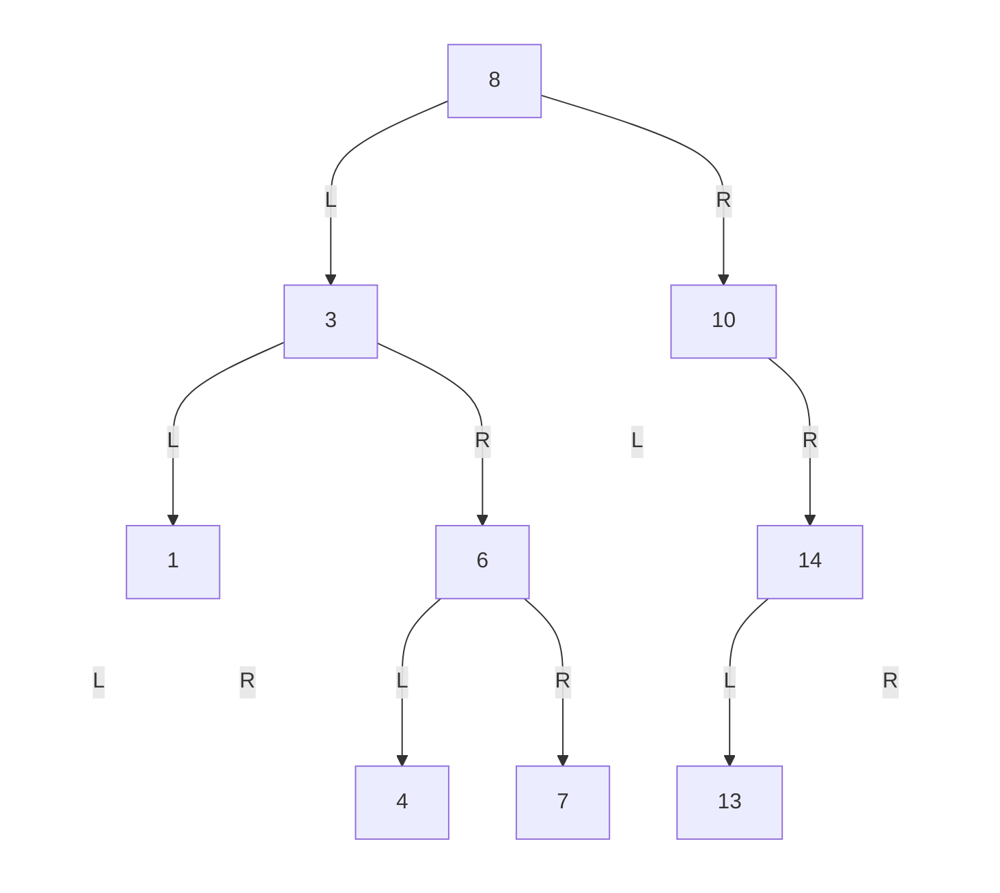
```mermaid
graph TD
	subgraph level0[" "]
		direction LR
		A["8"]
	end

	subgraph level1[" "]
		direction LR
		B["3"]
		C["10"]
	end

	subgraph level2[" "]
		direction LR
		D["1"]
		E["6"]
		C_L[" "]
		F["14"]
	end

	subgraph level3[" "]
		direction LR
		D_L[" "]
		D_R[" "]
		G["4"]
		H["7"]
		I["13"]
		F_R[" "]
	end

	A -->|L| B
	A -->|R| C

	B -->|L| D
	B -->|R| E

	C -->|L| C_L
	C -->|R| F

	D -->|L| D_L
	D -->|R| D_R

	E -->|L| G
	E -->|R| H

	F -->|L| I
	F -->|R| F_R

	classDef ghost fill:transparent,stroke:transparent,color:transparent;
	class C_L,D_L,D_R,F_R ghost;

	style level0 fill:transparent,stroke:transparent;
	style level1 fill:transparent,stroke:transparent;
	style level2 fill:transparent,stroke:transparent;
	style level3 fill:transparent,stroke:transparent;

	linkStyle 4 stroke:transparent;
	linkStyle 6 stroke:transparent;
	linkStyle 7 stroke:transparent;
	linkStyle 11 stroke:transparent;
```

对这棵树逐点检查：

- `8` 左边所有值：`3 1 6 4 7`，都小于 `8`
- `8` 右边所有值：`10 14 13`，都大于 `8`
- `3` 的左边 `1` 小于 `3`，右边 `6 4 7` 大于 `3`
- `6` 的左边 `4` 小于 `6`，右边 `7` 大于 `6`

所以它是合法 BST。

### 3.1.3 BST 与普通二叉树的区别

下面这棵树是二叉树，但不是 BST：

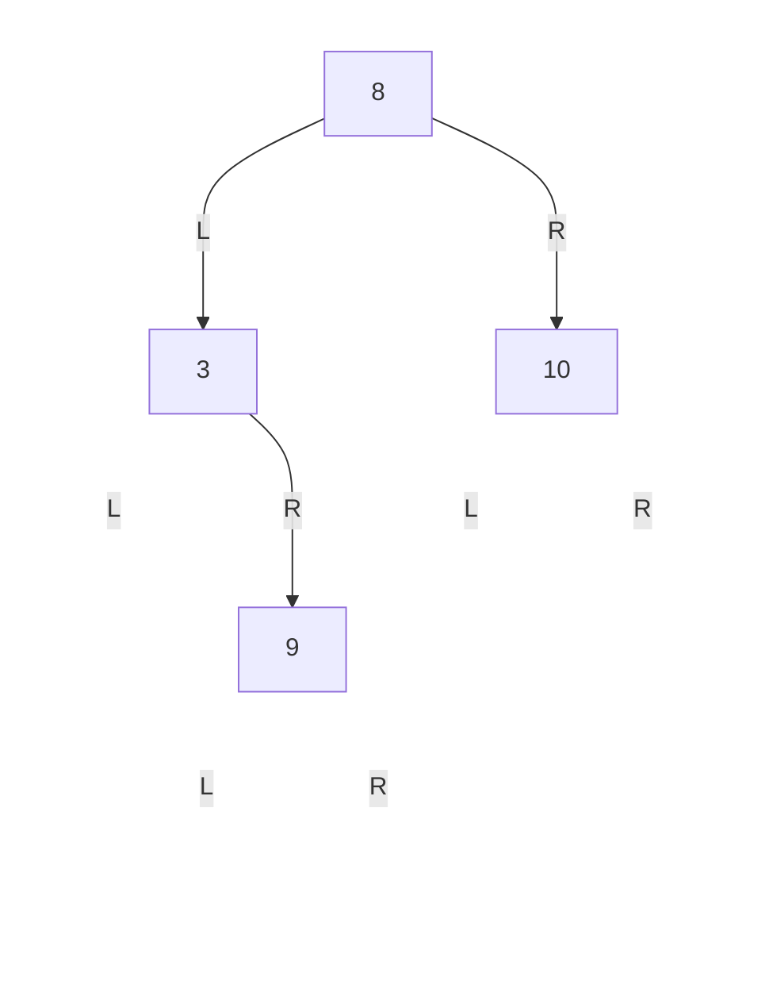
```mermaid
graph TD
	subgraph level0[" "]
		direction LR
		A["8"]
	end

	subgraph level1[" "]
		direction LR
		B["3"]
		C["10"]
	end

	subgraph level2[" "]
		direction LR
		B_L[" "]
		D["9"]
		C_L[" "]
		C_R[" "]
	end

	subgraph level3[" "]
		direction LR
		D_L[" "]
		D_R[" "]
	end

	A -->|L| B
	A -->|R| C

	B -->|L| B_L
	B -->|R| D

	C -->|L| C_L
	C -->|R| C_R

	D -->|L| D_L
	D -->|R| D_R

	classDef ghost fill:transparent,stroke:transparent,color:transparent;
	class B_L,C_L,C_R,D_L,D_R ghost;

	style level0 fill:transparent,stroke:transparent;
	style level1 fill:transparent,stroke:transparent;
	style level2 fill:transparent,stroke:transparent;
	style level3 fill:transparent,stroke:transparent;

	linkStyle 2 stroke:transparent;
	linkStyle 4 stroke:transparent;
	linkStyle 5 stroke:transparent;
	linkStyle 6 stroke:transparent;
	linkStyle 7 stroke:transparent;
```

问题在于：

- `9` 位于 `8` 的左子树中
- 但 `9 > 8`

这违反了 BST 的全局约束。

所以要区分两个概念：

| 结构       | 要求                               |
| ---------- | ---------------------------------- |
| 普通二叉树 | 每个节点最多两个孩子               |
| 二叉搜索树 | 在二叉树基础上，再加上全局有序约束 |

------

## 3.2 BST 的查找

### 3.2.1 查找过程的决策路径

BST 查找的基本逻辑非常直接：

- 从根节点开始
- 若目标值等于当前节点值，查找成功
- 若目标值小于当前节点值，进入左子树
- 若目标值大于当前节点值，进入右子树
- 若走到空指针，说明不存在

这意味着 BST 查找并不是“遍历整棵树”，而是每一步都进行一次**方向裁剪**。

例如，在下面这棵 BST 中查找 `7`：

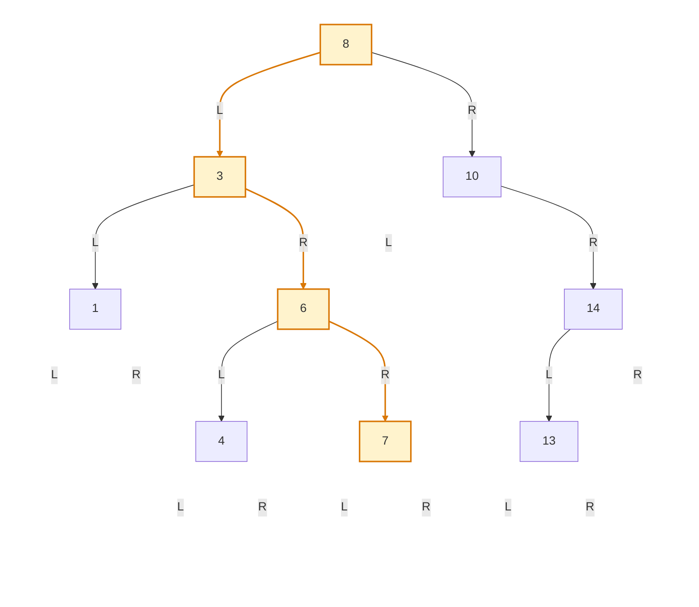
```mermaid
graph TD
	subgraph level0[" "]
		direction LR
		A["8"]
	end

	subgraph level1[" "]
		direction LR
		B["3"]
		C["10"]
	end

	subgraph level2[" "]
		direction LR
		D["1"]
		E["6"]
		C_L[" "]
		F["14"]
	end

	subgraph level3[" "]
		direction LR
		D_L[" "]
		D_R[" "]
		G["4"]
		H["7"]
		I["13"]
		F_R[" "]
	end

	subgraph level4[" "]
		direction LR
		G_L[" "]
		G_R[" "]
		H_L[" "]
		H_R[" "]
		I_L[" "]
		I_R[" "]
	end

	A -->|L| B
	A -->|R| C

	B -->|L| D
	B -->|R| E

	C -->|L| C_L
	C -->|R| F

	D -->|L| D_L
	D -->|R| D_R

	E -->|L| G
	E -->|R| H

	F -->|L| I
	F -->|R| F_R

	G -->|L| G_L
	G -->|R| G_R

	H -->|L| H_L
	H -->|R| H_R

	I -->|L| I_L
	I -->|R| I_R

	classDef ghost fill:transparent,stroke:transparent,color:transparent;
	classDef path fill:#fff3cd,stroke:#d97706,stroke-width:2px;

	class C_L,D_L,D_R,F_R,G_L,G_R,H_L,H_R,I_L,I_R ghost;
	class A,B,E,H path;

	style level0 fill:transparent,stroke:transparent;
	style level1 fill:transparent,stroke:transparent;
	style level2 fill:transparent,stroke:transparent;
	style level3 fill:transparent,stroke:transparent;
	style level4 fill:transparent,stroke:transparent;

	linkStyle 0 stroke:#d97706,stroke-width:2px;
	linkStyle 3 stroke:#d97706,stroke-width:2px;
	linkStyle 9 stroke:#d97706,stroke-width:2px;

	linkStyle 4 stroke:transparent;
	linkStyle 6 stroke:transparent;
	linkStyle 7 stroke:transparent;
	linkStyle 11 stroke:transparent;
	linkStyle 12 stroke:transparent;
	linkStyle 13 stroke:transparent;
	linkStyle 14 stroke:transparent;
	linkStyle 15 stroke:transparent;
	linkStyle 16 stroke:transparent;
	linkStyle 17 stroke:transparent;
```

查找路径：

- `7 < 8`，向左到 `3`
- `7 > 3`，向右到 `6`
- `7 > 6`，向右到 `7`
- 找到目标

所以 BST 查找本质上是一条**比较驱动的单路径下降过程**。

### 3.2.2 时间复杂度与树高的关系

BST 的查找复杂度不是直接由节点数 `n` 决定，而是由**树高 `h`** 决定。

因为每次查找只沿着一条从根到叶的路径向下走，所以最多访问 `h` 层节点。

因此：

- 查找时间复杂度：`O(h)`

如果树比较平衡，则：

- `h ≈ log2(n)`
- 查找复杂度接近 `O(log n)`

如果树严重退化，则：

- `h ≈ n`
- 查找复杂度退化为 `O(n)`

### 3.2.3 最优与最坏情况分析

| 情况 | 树形       | 树高       | 查找复杂度 |
| ---- | ---------- | ---------- | ---------- |
| 最优 | 接近平衡   | `O(log n)` | `O(log n)` |
| 最坏 | 退化成链表 | `O(n)`     | `O(n)`     |

下面是一个退化 BST：

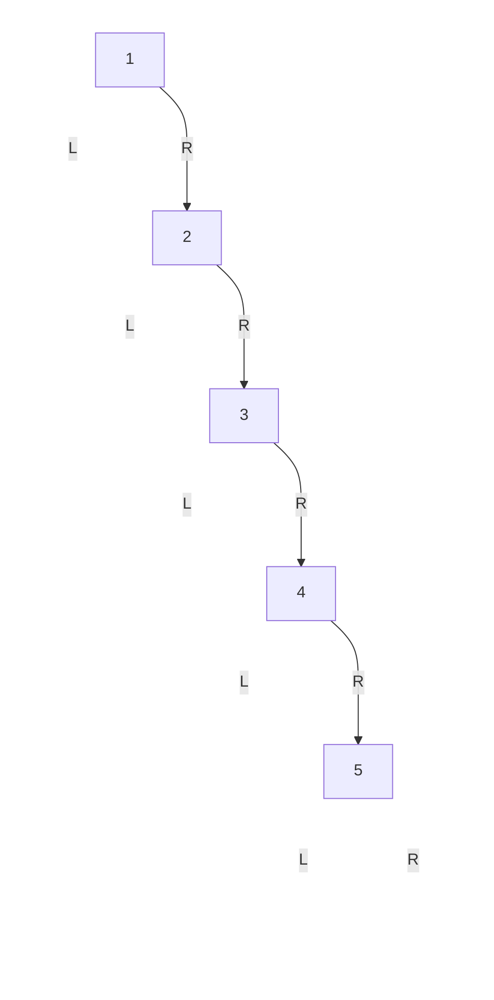
```mermaid
graph TD
	subgraph level0[" "]
		direction LR
		A["1"]
	end

	subgraph level1[" "]
		direction LR
		A_L[" "]
		B["2"]
	end

	subgraph level2[" "]
		direction LR
		B_L[" "]
		C["3"]
	end

	subgraph level3[" "]
		direction LR
		C_L[" "]
		D["4"]
	end

	subgraph level4[" "]
		direction LR
		D_L[" "]
		E["5"]
	end

	subgraph level5[" "]
		direction LR
		E_L[" "]
		E_R[" "]
	end

	A -->|L| A_L
	A -->|R| B

	B -->|L| B_L
	B -->|R| C

	C -->|L| C_L
	C -->|R| D

	D -->|L| D_L
	D -->|R| E

	E -->|L| E_L
	E -->|R| E_R

	classDef ghost fill:transparent,stroke:transparent,color:transparent;
	class A_L,B_L,C_L,D_L,E_L,E_R ghost;

	style level0 fill:transparent,stroke:transparent;
	style level1 fill:transparent,stroke:transparent;
	style level2 fill:transparent,stroke:transparent;
	style level3 fill:transparent,stroke:transparent;
	style level4 fill:transparent,stroke:transparent;
	style level5 fill:transparent,stroke:transparent;

	linkStyle 0 stroke:transparent;
	linkStyle 2 stroke:transparent;
	linkStyle 4 stroke:transparent;
	linkStyle 6 stroke:transparent;
	linkStyle 8 stroke:transparent;
	linkStyle 9 stroke:transparent;
```

此时查找 `5` 的过程和链表顺序扫描几乎一样。

------

## 3.3 BST 的插入

### 3.3.1 插入位置的搜索

BST 插入的第一步，不是直接挂节点，而是先做一次“查找式下降”。

规则与查找相同：

- 小于当前节点，向左走
- 大于当前节点，向右走
- 直到某个方向为空，就把新节点挂在那里

也就是说，**插入位置本质上是查找失败时落到的空位置**。

例如向下图插入 `5`： 

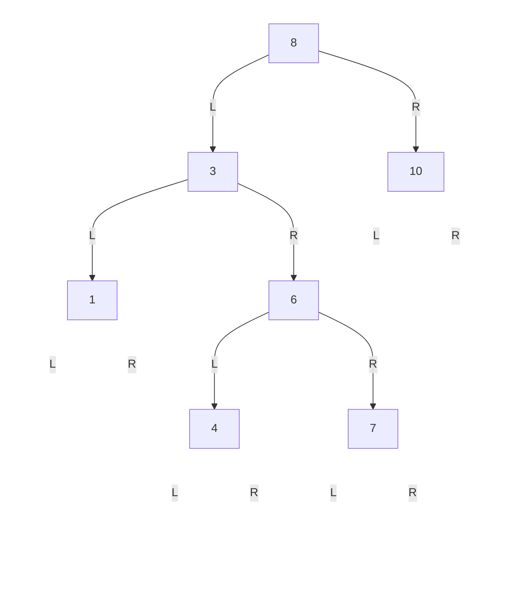
```mermaid
graph TD
	subgraph level0[" "]
		direction LR
		A["8"]
	end

	subgraph level1[" "]
		direction LR
		B["3"]
		C["10"]
	end

	subgraph level2[" "]
		direction LR
		D["1"]
		E["6"]
		C_L[" "]
		C_R[" "]
	end

	subgraph level3[" "]
		direction LR
		D_L[" "]
		D_R[" "]
		F["4"]
		G["7"]
	end

	subgraph level4[" "]
		direction LR
		F_L[" "]
		F_R[" "]
		G_L[" "]
		G_R[" "]
	end

	A -->|L| B
	A -->|R| C

	B -->|L| D
	B -->|R| E

	C -->|L| C_L
	C -->|R| C_R

	D -->|L| D_L
	D -->|R| D_R

	E -->|L| F
	E -->|R| G

	F -->|L| F_L
	F -->|R| F_R

	G -->|L| G_L
	G -->|R| G_R

	classDef ghost fill:transparent,stroke:transparent,color:transparent;
	class C_L,C_R,D_L,D_R,F_L,F_R,G_L,G_R ghost;

	style level0 fill:transparent,stroke:transparent;
	style level1 fill:transparent,stroke:transparent;
	style level2 fill:transparent,stroke:transparent;
	style level3 fill:transparent,stroke:transparent;
	style level4 fill:transparent,stroke:transparent;

	linkStyle 4 stroke:transparent;
	linkStyle 5 stroke:transparent;
	linkStyle 6 stroke:transparent;
	linkStyle 7 stroke:transparent;
	linkStyle 10 stroke:transparent;
	linkStyle 11 stroke:transparent;
	linkStyle 12 stroke:transparent;
	linkStyle 13 stroke:transparent;
```

比较过程：

- `5 < 8`，去左子树
- `5 > 3`，去右子树
- `5 < 6`，去左子树
- `5 > 4`，去右子树
- `4` 的右孩子为空，于是把 `5` 挂到 `4` 的右边

插入后：

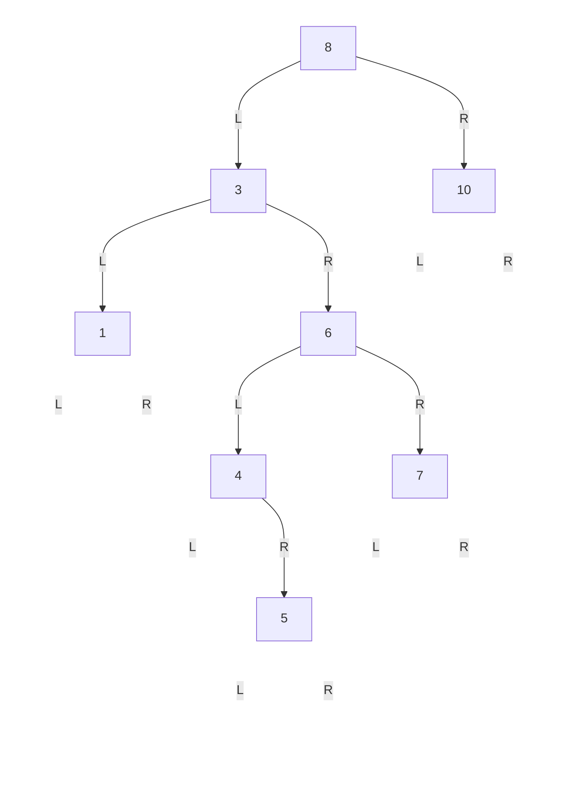
```mermaid
graph TD
	subgraph level0[" "]
		direction LR
		A["8"]
	end

	subgraph level1[" "]
		direction LR
		B["3"]
		C["10"]
	end

	subgraph level2[" "]
		direction LR
		D["1"]
		E["6"]
		C_L[" "]
		C_R[" "]
	end

	subgraph level3[" "]
		direction LR
		D_L[" "]
		D_R[" "]
		F["4"]
		G["7"]
	end

	subgraph level4[" "]
		direction LR
		F_L[" "]
		H["5"]
		G_L[" "]
		G_R[" "]
	end

	subgraph level5[" "]
		direction LR
		H_L[" "]
		H_R[" "]
	end

	A -->|L| B
	A -->|R| C

	B -->|L| D
	B -->|R| E

	C -->|L| C_L
	C -->|R| C_R

	D -->|L| D_L
	D -->|R| D_R

	E -->|L| F
	E -->|R| G

	F -->|L| F_L
	F -->|R| H

	G -->|L| G_L
	G -->|R| G_R

	H -->|L| H_L
	H -->|R| H_R

	classDef ghost fill:transparent,stroke:transparent,color:transparent;
	class C_L,C_R,D_L,D_R,F_L,G_L,G_R,H_L,H_R ghost;

	style level0 fill:transparent,stroke:transparent;
	style level1 fill:transparent,stroke:transparent;
	style level2 fill:transparent,stroke:transparent;
	style level3 fill:transparent,stroke:transparent;
	style level4 fill:transparent,stroke:transparent;
	style level5 fill:transparent,stroke:transparent;

	linkStyle 4 stroke:transparent;
	linkStyle 5 stroke:transparent;
	linkStyle 6 stroke:transparent;
	linkStyle 7 stroke:transparent;
	linkStyle 10 stroke:transparent;
	linkStyle 12 stroke:transparent;
	linkStyle 13 stroke:transparent;
	linkStyle 14 stroke:transparent;
	linkStyle 15 stroke:transparent;
```

### 3.3.2 新节点的挂接方式

插入时要维护两类信息：

1. 当前扫描节点 `cur`
2. `cur` 的父节点 `parent`

因为当你最终发现 `cur == NULL` 时，真正需要修改的是 `parent->left` 或 `parent->right`。

所以插入的典型过程是：

- 从根出发
- 一边比较一边更新 `parent`
- 走到空位置后
- 根据新键值与 `parent->key` 的大小关系决定挂左还是挂右

### 3.3.3 插入后为什么仍保持 BST 性质

这是 BST 插入最重要的正确性问题。

原因是：

- 插入时，你沿着 BST 的比较规则一直向下走
- 你最终到达的位置，已经是当前比较规则允许的唯一空位置之一
- 将新节点挂接到该位置，不会破坏已有节点之间的大小关系

换句话说：

- 你不是随意插入
- 你是沿着“有序性约束推导出的路径”插入

因此，插入后整棵树依旧满足 BST 性质。

------

## 3.4 BST 的删除

BST 删除比查找和插入复杂得多，因为删除一个节点后，必须保证：

1. 树仍然是二叉树
2. BST 的有序性仍然成立
3. 父子连接关系仍然正确

删除要区分三类情况。

------

### 3.4.1 删除叶子节点

叶子节点没有孩子，所以它最容易删除。

例如删除 `7`：


```mermaid
graph TD
	subgraph level0[" "]
		direction LR
		A["8"]
	end

	subgraph level1[" "]
		direction LR
		B["3"]
		C["10"]
	end

	subgraph level2[" "]
		direction LR
		D["1"]
		E["6"]
		C_L[" "]
		C_R[" "]
	end

	subgraph level3[" "]
		direction LR
		D_L[" "]
		D_R[" "]
		F["4"]
		G["7"]
	end

	subgraph level4[" "]
		direction LR
		F_L[" "]
		F_R[" "]
		G_L[" "]
		G_R[" "]
	end

	A -->|L| B
	A -->|R| C

	B -->|L| D
	B -->|R| E

	C -->|L| C_L
	C -->|R| C_R

	D -->|L| D_L
	D -->|R| D_R

	E -->|L| F
	E -->|R| G

	F -->|L| F_L
	F -->|R| F_R

	G -->|L| G_L
	G -->|R| G_R

	classDef ghost fill:transparent,stroke:transparent,color:transparent;
	class C_L,C_R,D_L,D_R,F_L,F_R,G_L,G_R ghost;

	style level0 fill:transparent,stroke:transparent;
	style level1 fill:transparent,stroke:transparent;
	style level2 fill:transparent,stroke:transparent;
	style level3 fill:transparent,stroke:transparent;
	style level4 fill:transparent,stroke:transparent;

	linkStyle 4 stroke:transparent;
	linkStyle 5 stroke:transparent;
	linkStyle 6 stroke:transparent;
	linkStyle 7 stroke:transparent;
	linkStyle 10 stroke:transparent;
	linkStyle 11 stroke:transparent;
	linkStyle 12 stroke:transparent;
	linkStyle 13 stroke:transparent;
```

`7` 没有左右孩子，因此直接把其父节点 `6` 的右指针置空即可。

删除后：

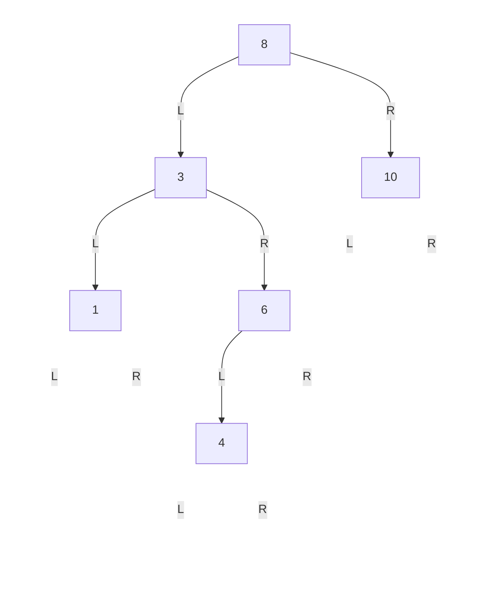
```mermaid
graph TD
	subgraph level0[" "]
		direction LR
		A["8"]
	end

	subgraph level1[" "]
		direction LR
		B["3"]
		C["10"]
	end

	subgraph level2[" "]
		direction LR
		D["1"]
		E["6"]
		C_L[" "]
		C_R[" "]
	end

	subgraph level3[" "]
		direction LR
		D_L[" "]
		D_R[" "]
		F["4"]
		E_R[" "]
	end

	subgraph level4[" "]
		direction LR
		F_L[" "]
		F_R[" "]
	end

	A -->|L| B
	A -->|R| C

	B -->|L| D
	B -->|R| E

	C -->|L| C_L
	C -->|R| C_R

	D -->|L| D_L
	D -->|R| D_R

	E -->|L| F
	E -->|R| E_R

	F -->|L| F_L
	F -->|R| F_R

	classDef ghost fill:transparent,stroke:transparent,color:transparent;
	class C_L,C_R,D_L,D_R,E_R,F_L,F_R ghost;

	style level0 fill:transparent,stroke:transparent;
	style level1 fill:transparent,stroke:transparent;
	style level2 fill:transparent,stroke:transparent;
	style level3 fill:transparent,stroke:transparent;
	style level4 fill:transparent,stroke:transparent;

	linkStyle 4 stroke:transparent;
	linkStyle 5 stroke:transparent;
	linkStyle 6 stroke:transparent;
	linkStyle 7 stroke:transparent;
	linkStyle 9 stroke:transparent;
	linkStyle 10 stroke:transparent;
	linkStyle 11 stroke:transparent;
```

这一类删除不涉及结构替换。

------

### 3.4.2 删除只有一个孩子的节点

如果待删节点只有一个孩子，那么删除它后，需要让它的唯一孩子顶替它的位置。

例如删除 `10`，其只有右孩子 `14`：

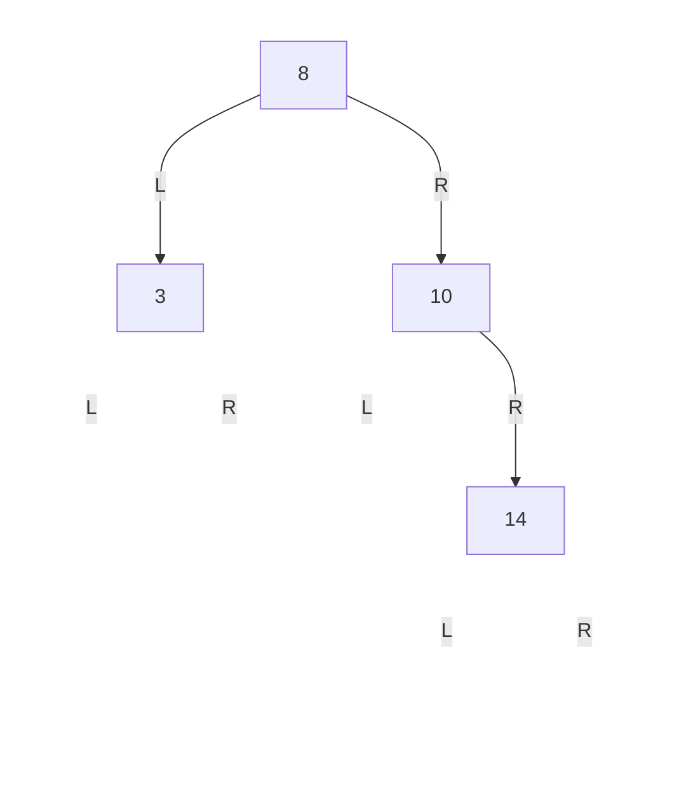
```mermaid
graph TD
	subgraph level0[" "]
		direction LR
		A["8"]
	end

	subgraph level1[" "]
		direction LR
		B["3"]
		C["10"]
	end

	subgraph level2[" "]
		direction LR
		B_L[" "]
		B_R[" "]
		C_L[" "]
		D["14"]
	end

	subgraph level3[" "]
		direction LR
		D_L[" "]
		D_R[" "]
	end

	A -->|L| B
	A -->|R| C

	B -->|L| B_L
	B -->|R| B_R

	C -->|L| C_L
	C -->|R| D

	D -->|L| D_L
	D -->|R| D_R

	classDef ghost fill:transparent,stroke:transparent,color:transparent;
	class B_L,B_R,C_L,D_L,D_R ghost;

	style level0 fill:transparent,stroke:transparent;
	style level1 fill:transparent,stroke:transparent;
	style level2 fill:transparent,stroke:transparent;
	style level3 fill:transparent,stroke:transparent;

	linkStyle 2 stroke:transparent;
	linkStyle 3 stroke:transparent;
	linkStyle 4 stroke:transparent;
	linkStyle 6 stroke:transparent;
	linkStyle 7 stroke:transparent;
```

删除 `10` 后，`14` 顶替 `10` 成为 `8` 的右孩子：

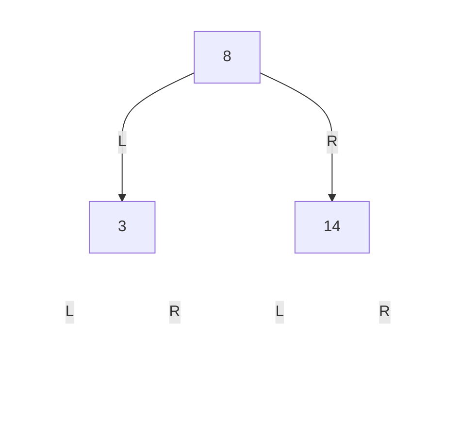
```mermaid
graph TD
	subgraph level0[" "]
		direction LR
		A["8"]
	end

	subgraph level1[" "]
		direction LR
		B["3"]
		C["14"]
	end

	subgraph level2[" "]
		direction LR
		B_L[" "]
		B_R[" "]
		C_L[" "]
		C_R[" "]
	end

	A -->|L| B
	A -->|R| C

	B -->|L| B_L
	B -->|R| B_R

	C -->|L| C_L
	C -->|R| C_R

	classDef ghost fill:transparent,stroke:transparent,color:transparent;
	class B_L,B_R,C_L,C_R ghost;

	style level0 fill:transparent,stroke:transparent;
	style level1 fill:transparent,stroke:transparent;
	style level2 fill:transparent,stroke:transparent;

	linkStyle 2 stroke:transparent;
	linkStyle 3 stroke:transparent;
	linkStyle 4 stroke:transparent;
	linkStyle 5 stroke:transparent;
```

为什么这样不会破坏 BST？

因为：

- `14` 原本就位于 `10` 的右侧子树
- 同时 `10` 原本位于 `8` 的右子树
- 所以 `14` 仍然合法地位于 `8` 的右边

更一般地说，单孩子替换之所以合法，是因为那个唯一孩子所在的整棵子树，本来就已经满足待删节点原位置的顺序约束。

------

### 3.4.3 删除有两个孩子的节点

这是 BST 删除中最关键的一类。

设要删除节点 `x`，它同时有左子树和右子树。
此时不能直接删，因为删掉 `x` 后：

- 左右两棵子树都需要重新接回去
- 如果随意拼接，很容易破坏 BST 有序性

标准做法是：

- 用 `x` 的**前驱**或**后继**替换 `x`
- 然后再去删除那个前驱/后继节点

为什么这样做？

因为前驱或后继与 `x` 在有序序列中紧邻，替换后最容易保持顺序关系。

------

### 3.4.4 前驱与后继替换思想

#### 1）前驱是什么

某节点的前驱，是其中序遍历序列中**排在它前面的那个最大值**。
它通常就是：

- 该节点左子树中
- 最右边的那个节点

#### 2）后继是什么

某节点的后继，是其中序遍历序列中**排在它后面的那个最小值**。
它通常就是：

- 该节点右子树中
- 最左边的那个节点

#### 3）为什么可以替换

因为：

- 前驱 `< 当前节点 < 后继`
- 前驱是“左边最大”
- 后继是“右边最小”

所以无论用哪个替换，都不会破坏中序有序性。

------

### 删除两个孩子节点的实例

删除 `8`：

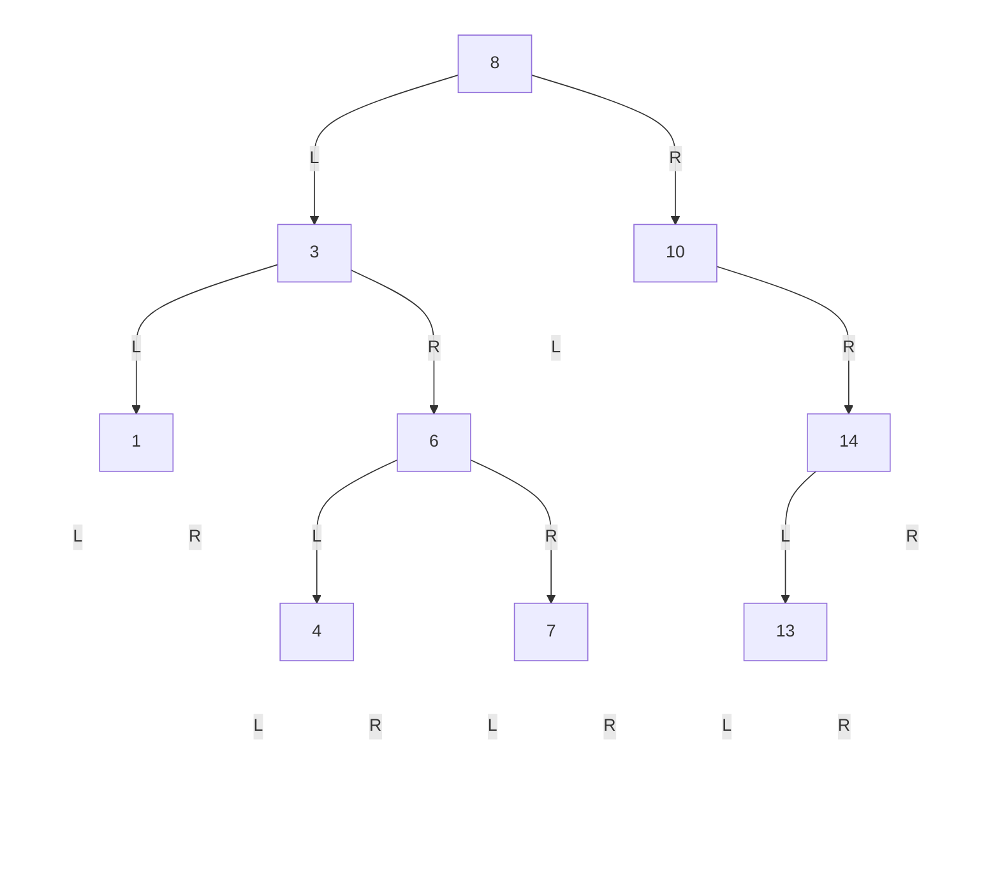
```mermaid
graph TD
	subgraph level0[" "]
		direction LR
		A["8"]
	end

	subgraph level1[" "]
		direction LR
		B["3"]
		C["10"]
	end

	subgraph level2[" "]
		direction LR
		D["1"]
		E["6"]
		C_L[" "]
		F["14"]
	end

	subgraph level3[" "]
		direction LR
		D_L[" "]
		D_R[" "]
		G["4"]
		H["7"]
		I["13"]
		F_R[" "]
	end

	subgraph level4[" "]
		direction LR
		G_L[" "]
		G_R[" "]
		H_L[" "]
		H_R[" "]
		I_L[" "]
		I_R[" "]
	end

	A -->|L| B
	A -->|R| C

	B -->|L| D
	B -->|R| E

	C -->|L| C_L
	C -->|R| F

	D -->|L| D_L
	D -->|R| D_R

	E -->|L| G
	E -->|R| H

	F -->|L| I
	F -->|R| F_R

	G -->|L| G_L
	G -->|R| G_R

	H -->|L| H_L
	H -->|R| H_R

	I -->|L| I_L
	I -->|R| I_R

	classDef ghost fill:transparent,stroke:transparent,color:transparent;
	class C_L,D_L,D_R,F_R,G_L,G_R,H_L,H_R,I_L,I_R ghost;

	style level0 fill:transparent,stroke:transparent;
	style level1 fill:transparent,stroke:transparent;
	style level2 fill:transparent,stroke:transparent;
	style level3 fill:transparent,stroke:transparent;
	style level4 fill:transparent,stroke:transparent;

	linkStyle 4 stroke:transparent;
	linkStyle 6 stroke:transparent;
	linkStyle 7 stroke:transparent;
	linkStyle 11 stroke:transparent;
	linkStyle 12 stroke:transparent;
	linkStyle 13 stroke:transparent;
	linkStyle 14 stroke:transparent;
	linkStyle 15 stroke:transparent;
	linkStyle 16 stroke:transparent;
	linkStyle 17 stroke:transparent;
```

这里选**后继**替换：

- `8` 的右子树是以 `10` 为根
- 右子树最左节点就是 `10`
- 所以后继是 `10`

第一步：用 `10` 的值覆盖 `8`
第二步：再删除原来的 `10`

而原来的 `10` 在这个例子中只有一个右孩子 `14`，所以删除变成了“单孩子删除”。

结果：

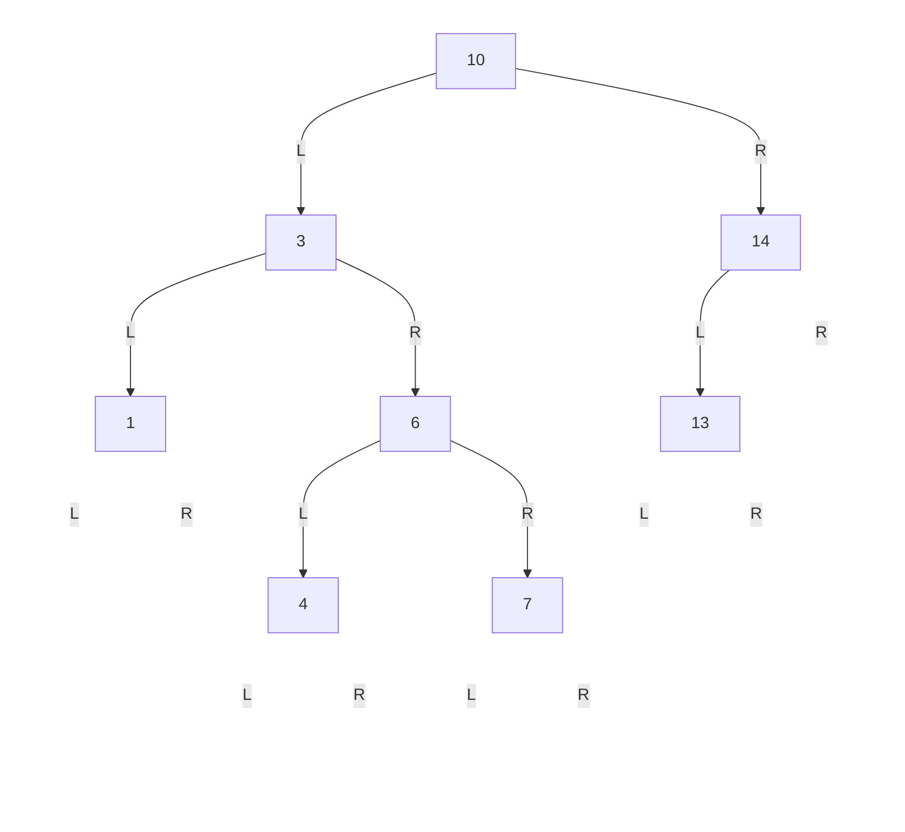
```mermaid
graph TD
	subgraph level0[" "]
		direction LR
		A["10"]
	end

	subgraph level1[" "]
		direction LR
		B["3"]
		C["14"]
	end

	subgraph level2[" "]
		direction LR
		D["1"]
		E["6"]
		F["13"]
		C_R[" "]
	end

	subgraph level3[" "]
		direction LR
		D_L[" "]
		D_R[" "]
		G["4"]
		H["7"]
		F_L[" "]
		F_R[" "]
	end

	subgraph level4[" "]
		direction LR
		G_L[" "]
		G_R[" "]
		H_L[" "]
		H_R[" "]
	end

	A -->|L| B
	A -->|R| C

	B -->|L| D
	B -->|R| E

	C -->|L| F
	C -->|R| C_R

	D -->|L| D_L
	D -->|R| D_R

	E -->|L| G
	E -->|R| H

	F -->|L| F_L
	F -->|R| F_R

	G -->|L| G_L
	G -->|R| G_R

	H -->|L| H_L
	H -->|R| H_R

	classDef ghost fill:transparent,stroke:transparent,color:transparent;
	class C_R,D_L,D_R,F_L,F_R,G_L,G_R,H_L,H_R ghost;

	style level0 fill:transparent,stroke:transparent;
	style level1 fill:transparent,stroke:transparent;
	style level2 fill:transparent,stroke:transparent;
	style level3 fill:transparent,stroke:transparent;
	style level4 fill:transparent,stroke:transparent;

	linkStyle 5 stroke:transparent;
	linkStyle 6 stroke:transparent;
	linkStyle 7 stroke:transparent;
	linkStyle 10 stroke:transparent;
	linkStyle 11 stroke:transparent;
	linkStyle 12 stroke:transparent;
	linkStyle 13 stroke:transparent;
	linkStyle 14 stroke:transparent;
	linkStyle 15 stroke:transparent;
```

你要注意一个关键事实：

> 删除两个孩子节点，真正难点不在“删”，而在“选择一个合法替代者”。

------

## 3.5 BST 的优点与局限

### 3.5.1 为什么 BST 查找通常较快

BST 的优势来自其有序性。
对比普通二叉树：

- 普通二叉树查找某值，可能需要遍历整棵树
- BST 每一步都能排除一半方向中的某一侧子树

因此，在树高受控时，BST 查找、插入、删除都能达到较高效率。

典型复杂度：

| 操作 | 平均/理想复杂度 | 最坏复杂度 |
| ---- | --------------- | ---------- |
| 查找 | `O(log n)`      | `O(n)`     |
| 插入 | `O(log n)`      | `O(n)`     |
| 删除 | `O(log n)`      | `O(n)`     |

### 3.5.2 为什么 BST 不保证平衡

BST 只规定：

- 左边小
- 右边大

它**没有规定左右子树高度必须接近**，也没有规定树高上界。

所以如果插入序列不合适，比如：

- `1 2 3 4 5 6 7`

那么每次新节点都会落到最右边，最终形成单链结构。

也就是说：

> BST 只控制“局部顺序关系”，不控制“整体形状”。

这就是它的根本局限。

### 3.5.3 为何后续需要平衡树

如果树高失控，BST 的所有优势都会消失：

- 查找退化成线性扫描
- 插入退化成尾部追加
- 删除退化成链表式修改

因此后续必须引入“平衡思想”：

- 不是让树绝对对称
- 而是让树高保持在可控范围内

这正是 AVL、红黑树等平衡搜索树出现的动机。

------

## 3.6 数据结构与实现视角

这一节把 BST 从“概念”落到“代码对象”。

### 3.6.1 最小节点结构

#### C 版本

```c
#include <stdio.h>
#include <stdlib.h>

struct bst_node {
	int key;
	struct bst_node *left;
	struct bst_node *right;
};
```

#### C++ 版本

```cpp
#include <iostream>

struct bst_node {
	int key {};
	bst_node *left {};
	bst_node *right {};
};
```

这类结构只包含三类信息：

- 当前节点值
- 左孩子指针
- 右孩子指针

如果后续要做删除、旋转、平衡修复，工程实现中常常还会增加：

- 父指针
- 颜色位
- 高度信息
- 附加业务数据

### 3.6.2 BST 查找实现

#### C 版本

当前版本的代码要求 key 值唯一：

```c
struct bst_node *bst_find(struct bst_node *root, int key)
{
	while (root) {
		if (key == root->key)
			return root;
		if (key < root->key)
			root = root->left;
		else
			root = root->right;
	}

	return NULL;
}
```

#### C++ 版本

当前版本的代码要求 key 值唯一：

```cpp
bst_node *bst_find(bst_node *root, int key)
{
	while (root) {
		if (key == root->key)
			return root;
        
		if (key < root->key)
			root = root->left;
		else
			root = root->right;
	}

	return nullptr;
}
```

### 3.6.3 BST 插入实现

#### C 版本

```c
struct bst_node *bst_create_node(int key)
{
	struct bst_node *node = malloc(sizeof(*node));
	if (!node)
		return NULL;

	node->key = key;
	node->left = NULL;
	node->right = NULL;
	return node;
}

int bst_insert(struct bst_node **root, int key)
{
	struct bst_node *parent = NULL;
	struct bst_node *cur = *root;
	struct bst_node *node;

	while (cur) {
		parent = cur;
		if (key < cur->key)
			cur = cur->left;
		else if (key > cur->key)
			cur = cur->right;
		else
			return 0;		// 存在就不插入
	}

	node = bst_create_node(key);
	if (!node)
		return -1;

	if (!parent) {			// 根不存在
		*root = node;
		return 1;
	}

	if (key < parent->key)	// 根存在，树中不存在，插入操作
		parent->left = node;
	else
		parent->right = node;

	return 1;
}
```

#### C++ 版本

```cpp
bst_insert_result bst_insert(bst_node *&root, int key) noexcept
{
	bst_node **link = &root;
	bst_node *parent = nullptr;
	bst_node *node;

	while (*link) {
		parent = *link;

		if (key < (*link)->key) {
			link = &(*link)->left;
		} else if (key > (*link)->key) {
			link = &(*link)->right;
		} else {
			return bst_insert_result::duplicate;
		}
	}

	node = bst_create_node(key);
	if (!node)
		return bst_insert_result::no_memory;

	*link = node;

	return bst_insert_result::ok;
}
```

------

### 3.6.4 BST 删除实现

删除实现比查找和插入更长，因为它不是一个“找到就删”的单动作过程，而是一个**分类处理 + 子树回接**的过程。

BST 删除通常分为三类：

- **叶子删除**：目标节点没有孩子，直接断开父节点对应指针
- **单孩子删除**：目标节点只有一个孩子，让唯一孩子顶替其位置
- **双孩子删除**：目标节点有两个孩子，通常先找前驱或后继，用其值覆盖当前节点，再删除原前驱或后继节点

本节后面的 C++ 示例，采用的是最常见的一种写法：

- 不显式维护父指针
- 使用**递归返回“删除后的子树新根”**
- 调用者把返回值重新接回 `root->left` 或 `root->right`

也就是说，这个实现的关键不是“直接改父节点”，而是：

```text
删除左子树中的节点后，把返回的新子树根重新接回 root->left
删除右子树中的节点后，把返回的新子树根重新接回 root->right
删除当前节点后，把替代后的子树根返回给上一层
```

如果是双孩子删除，本实现采用的是：

- 找后继
- 用后继值覆盖当前节点
- 再递归删除原后继节点

所以核心流程可以先记成：

```text
找到待删节点
-> 判断孩子个数
-> 若有两个孩子，则找后继
-> 用后继值覆盖当前节点
-> 再去右子树中删除原后继节点
```

图中颜色约定如下：

- **红色**：待删除节点
- **绿色**：替代节点 / 顶替节点
- **黄色**：需要修改子指针的父节点
- **蓝色**：被重新挂接的子树

------

#### 3.6.4.1 删除流程总览

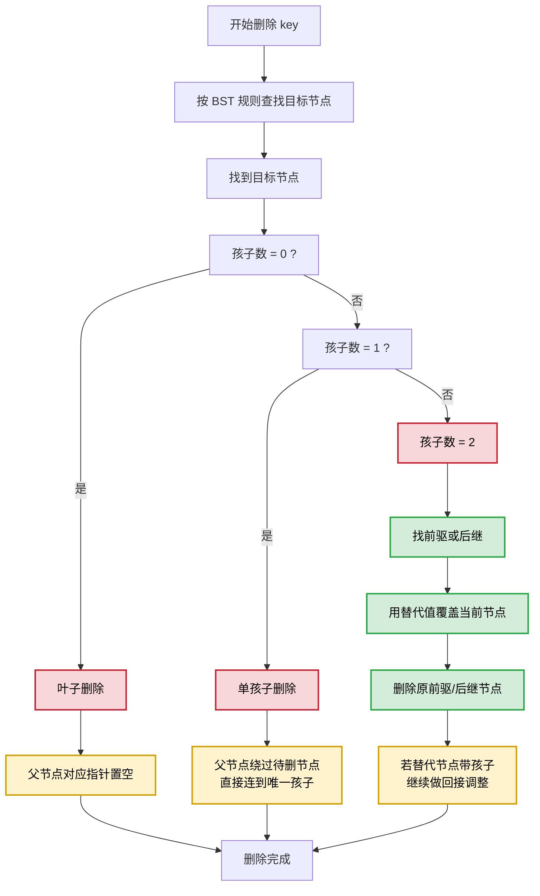
```mermaid
flowchart TD
	A["开始删除 key"] --> B["按 BST 规则查找目标节点"]
	B --> C["找到目标节点"]

	C --> D["孩子数 = 0 ?"]
	D -->|是| E["叶子删除"]
	E --> F["父节点对应指针置空"]

	D -->|否| G["孩子数 = 1 ?"]
	G -->|是| H["单孩子删除"]
	H --> I["父节点绕过待删节点<br/>直接连到唯一孩子"]

	G -->|否| J["孩子数 = 2"]
	J --> K["找前驱或后继"]
	K --> L["用替代值覆盖当前节点"]
	L --> M["删除原前驱/后继节点"]
	M --> N["若替代节点带孩子<br/>继续做回接调整"]

	F --> O["删除完成"]
	I --> O
	N --> O

	classDef target fill:#f8d7da,stroke:#c82333,stroke-width:2px,color:#000;
	classDef replace fill:#d4edda,stroke:#28a745,stroke-width:2px,color:#000;
	classDef parent fill:#fff3cd,stroke:#d39e00,stroke-width:2px,color:#000;
	classDef moved fill:#d1ecf1,stroke:#0c5460,stroke-width:2px,color:#000;

	class E,H,J target;
	class K,L,M replace;
	class F,I,N parent;
```

------

#### 3.6.4.2 删除叶子节点

在 `main()` 中，第一次删除的是 `7`。
此时 `7` 没有左右孩子，所以它属于**叶子删除**。

删除前：

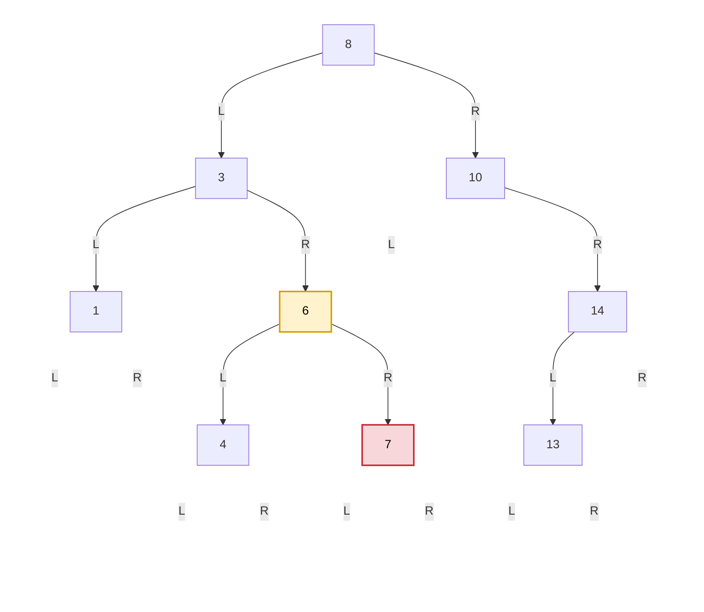
```mermaid
graph TD
	subgraph level0[" "]
		direction LR
		A["8"]
	end

	subgraph level1[" "]
		direction LR
		B["3"]
		C["10"]
	end

	subgraph level2[" "]
		direction LR
		D["1"]
		E["6"]
		C_L[" "]
		F["14"]
	end

	subgraph level3[" "]
		direction LR
		D_L[" "]
		D_R[" "]
		G["4"]
		H["7"]
		I["13"]
		F_R[" "]
	end

	subgraph level4[" "]
		direction LR
		G_L[" "]
		G_R[" "]
		H_L[" "]
		H_R[" "]
		I_L[" "]
		I_R[" "]
	end

	A -->|L| B
	A -->|R| C

	B -->|L| D
	B -->|R| E

	C -->|L| C_L
	C -->|R| F

	D -->|L| D_L
	D -->|R| D_R

	E -->|L| G
	E -->|R| H

	F -->|L| I
	F -->|R| F_R

	G -->|L| G_L
	G -->|R| G_R

	H -->|L| H_L
	H -->|R| H_R

	I -->|L| I_L
	I -->|R| I_R

	classDef target fill:#f8d7da,stroke:#c82333,stroke-width:2px,color:#000;
	classDef replace fill:#d4edda,stroke:#28a745,stroke-width:2px,color:#000;
	classDef parent fill:#fff3cd,stroke:#d39e00,stroke-width:2px,color:#000;
	classDef moved fill:#d1ecf1,stroke:#0c5460,stroke-width:2px,color:#000;
	classDef ghost fill:transparent,stroke:transparent,color:transparent;

	class E parent;
	class H target;
	class C_L,D_L,D_R,F_R,G_L,G_R,H_L,H_R,I_L,I_R ghost;

	style level0 fill:transparent,stroke:transparent;
	style level1 fill:transparent,stroke:transparent;
	style level2 fill:transparent,stroke:transparent;
	style level3 fill:transparent,stroke:transparent;
	style level4 fill:transparent,stroke:transparent;

	linkStyle 4 stroke:transparent;
	linkStyle 6 stroke:transparent;
	linkStyle 7 stroke:transparent;
	linkStyle 11 stroke:transparent;
	linkStyle 12 stroke:transparent;
	linkStyle 13 stroke:transparent;
	linkStyle 14 stroke:transparent;
	linkStyle 15 stroke:transparent;
	linkStyle 16 stroke:transparent;
	linkStyle 17 stroke:transparent;
```

删除后：

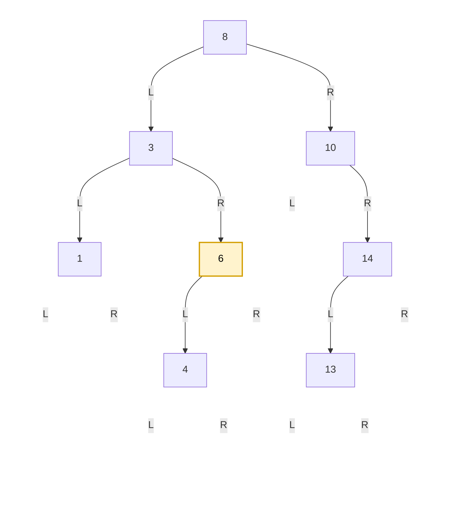
```mermaid
graph TD
	subgraph level0[" "]
		direction LR
		A["8"]
	end

	subgraph level1[" "]
		direction LR
		B["3"]
		C["10"]
	end

	subgraph level2[" "]
		direction LR
		D["1"]
		E["6"]
		C_L[" "]
		F["14"]
	end

	subgraph level3[" "]
		direction LR
		D_L[" "]
		D_R[" "]
		G["4"]
		E_R[" "]
		I["13"]
		F_R[" "]
	end

	subgraph level4[" "]
		direction LR
		G_L[" "]
		G_R[" "]
		I_L[" "]
		I_R[" "]
	end

	A -->|L| B
	A -->|R| C

	B -->|L| D
	B -->|R| E

	C -->|L| C_L
	C -->|R| F

	D -->|L| D_L
	D -->|R| D_R

	E -->|L| G
	E -->|R| E_R

	F -->|L| I
	F -->|R| F_R

	G -->|L| G_L
	G -->|R| G_R

	I -->|L| I_L
	I -->|R| I_R

	classDef target fill:#f8d7da,stroke:#c82333,stroke-width:2px,color:#000;
	classDef replace fill:#d4edda,stroke:#28a745,stroke-width:2px,color:#000;
	classDef parent fill:#fff3cd,stroke:#d39e00,stroke-width:2px,color:#000;
	classDef moved fill:#d1ecf1,stroke:#0c5460,stroke-width:2px,color:#000;
	classDef ghost fill:transparent,stroke:transparent,color:transparent;

	class E parent;
	class C_L,D_L,D_R,E_R,F_R,G_L,G_R,I_L,I_R ghost;

	style level0 fill:transparent,stroke:transparent;
	style level1 fill:transparent,stroke:transparent;
	style level2 fill:transparent,stroke:transparent;
	style level3 fill:transparent,stroke:transparent;
	style level4 fill:transparent,stroke:transparent;

	linkStyle 4 stroke:transparent;
	linkStyle 6 stroke:transparent;
	linkStyle 7 stroke:transparent;
	linkStyle 9 stroke:transparent;
	linkStyle 11 stroke:transparent;
	linkStyle 12 stroke:transparent;
	linkStyle 13 stroke:transparent;
	linkStyle 14 stroke:transparent;
	linkStyle 15 stroke:transparent;
```

这一类删除，代码里真正做的事情可以概括为：

```text
parent->right = nullptr
delete node
```

叶子删除的本质就是：

> **父节点原来指向它，现在改为不再指向它。**

------

#### 3.6.4.3 删除单孩子节点

继续执行 `main()`，第二次删除的是 `14`。
此时 `14` 只有一个左孩子 `13`，所以它属于**单孩子删除**。

这一类删除的关键不是“删掉一个节点”，而是：

> **父节点绕过待删节点，直接连到它的唯一孩子。**

删除前：

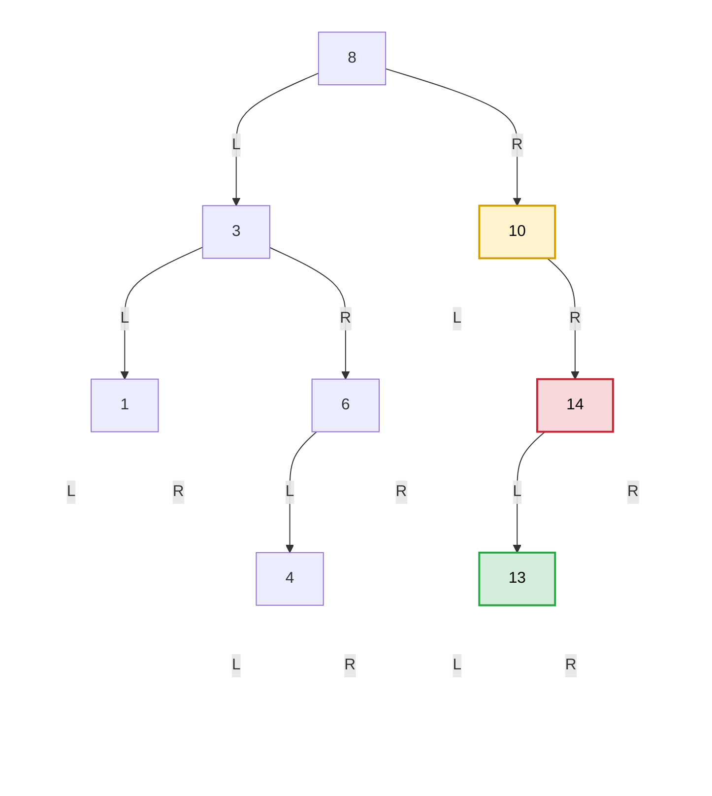
```mermaid
graph TD
	subgraph level0[" "]
		direction LR
		A["8"]
	end

	subgraph level1[" "]
		direction LR
		B["3"]
		C["10"]
	end

	subgraph level2[" "]
		direction LR
		D["1"]
		E["6"]
		C_L[" "]
		F["14"]
	end

	subgraph level3[" "]
		direction LR
		D_L[" "]
		D_R[" "]
		G["4"]
		E_R[" "]
		H["13"]
		F_R[" "]
	end

	subgraph level4[" "]
		direction LR
		G_L[" "]
		G_R[" "]
		H_L[" "]
		H_R[" "]
	end

	A -->|L| B
	A -->|R| C

	B -->|L| D
	B -->|R| E

	C -->|L| C_L
	C -->|R| F

	D -->|L| D_L
	D -->|R| D_R

	E -->|L| G
	E -->|R| E_R

	F -->|L| H
	F -->|R| F_R

	G -->|L| G_L
	G -->|R| G_R

	H -->|L| H_L
	H -->|R| H_R

	classDef target fill:#f8d7da,stroke:#c82333,stroke-width:2px,color:#000;
	classDef replace fill:#d4edda,stroke:#28a745,stroke-width:2px,color:#000;
	classDef parent fill:#fff3cd,stroke:#d39e00,stroke-width:2px,color:#000;
	classDef moved fill:#d1ecf1,stroke:#0c5460,stroke-width:2px,color:#000;
	classDef ghost fill:transparent,stroke:transparent,color:transparent;

	class C parent;
	class F target;
	class H replace;
	class C_L,D_L,D_R,E_R,F_R,G_L,G_R,H_L,H_R ghost;

	style level0 fill:transparent,stroke:transparent;
	style level1 fill:transparent,stroke:transparent;
	style level2 fill:transparent,stroke:transparent;
	style level3 fill:transparent,stroke:transparent;
	style level4 fill:transparent,stroke:transparent;

	linkStyle 4 stroke:transparent;
	linkStyle 6 stroke:transparent;
	linkStyle 7 stroke:transparent;
	linkStyle 9 stroke:transparent;
	linkStyle 11 stroke:transparent;
	linkStyle 12 stroke:transparent;
	linkStyle 13 stroke:transparent;
	linkStyle 14 stroke:transparent;
	linkStyle 15 stroke:transparent;
```

删除后：

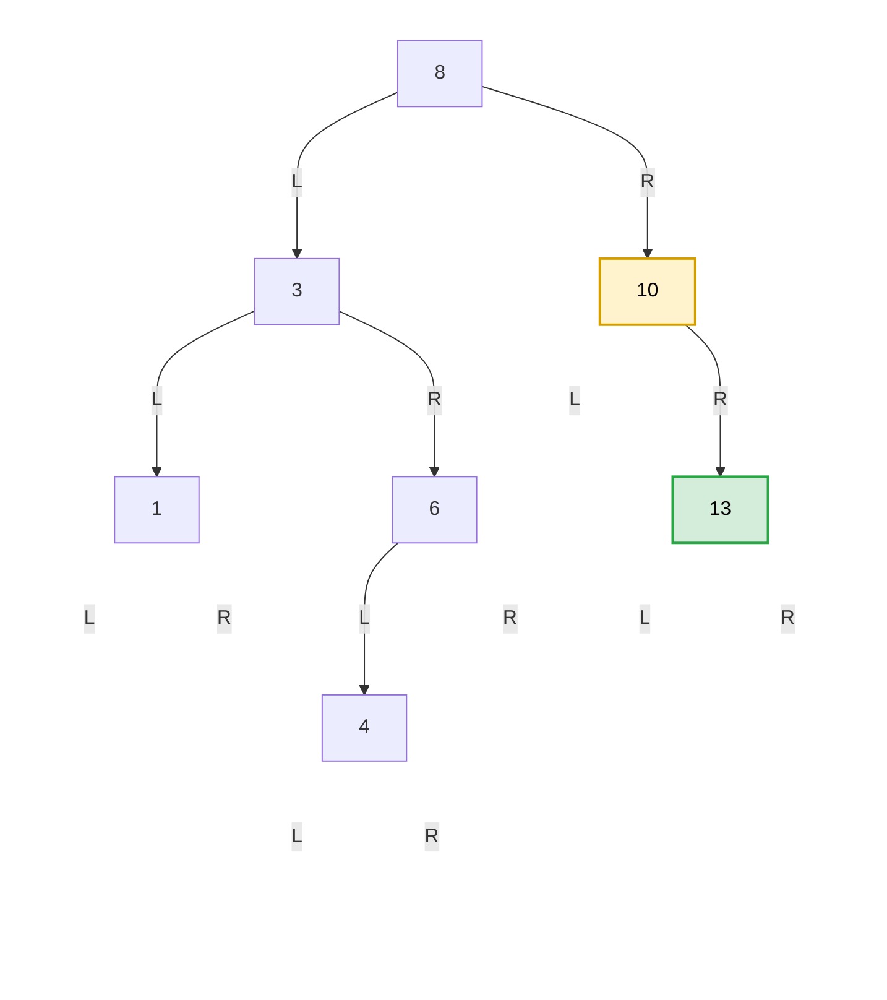
```mermaid
graph TD
	subgraph level0[" "]
		direction LR
		A["8"]
	end

	subgraph level1[" "]
		direction LR
		B["3"]
		C["10"]
	end

	subgraph level2[" "]
		direction LR
		D["1"]
		E["6"]
		C_L[" "]
		H["13"]
	end

	subgraph level3[" "]
		direction LR
		D_L[" "]
		D_R[" "]
		G["4"]
		E_R[" "]
		H_L[" "]
		H_R[" "]
	end

	subgraph level4[" "]
		direction LR
		G_L[" "]
		G_R[" "]
	end

	A -->|L| B
	A -->|R| C

	B -->|L| D
	B -->|R| E

	C -->|L| C_L
	C -->|R| H

	D -->|L| D_L
	D -->|R| D_R

	E -->|L| G
	E -->|R| E_R

	H -->|L| H_L
	H -->|R| H_R

	G -->|L| G_L
	G -->|R| G_R

	classDef target fill:#f8d7da,stroke:#c82333,stroke-width:2px,color:#000;
	classDef replace fill:#d4edda,stroke:#28a745,stroke-width:2px,color:#000;
	classDef parent fill:#fff3cd,stroke:#d39e00,stroke-width:2px,color:#000;
	classDef moved fill:#d1ecf1,stroke:#0c5460,stroke-width:2px,color:#000;
	classDef ghost fill:transparent,stroke:transparent,color:transparent;

	class C parent;
	class H replace;
	class C_L,D_L,D_R,E_R,H_L,H_R,G_L,G_R ghost;

	style level0 fill:transparent,stroke:transparent;
	style level1 fill:transparent,stroke:transparent;
	style level2 fill:transparent,stroke:transparent;
	style level3 fill:transparent,stroke:transparent;
	style level4 fill:transparent,stroke:transparent;

	linkStyle 4 stroke:transparent;
	linkStyle 6 stroke:transparent;
	linkStyle 7 stroke:transparent;
	linkStyle 9 stroke:transparent;
	linkStyle 10 stroke:transparent;
	linkStyle 11 stroke:transparent;
	linkStyle 12 stroke:transparent;
	linkStyle 13 stroke:transparent;
```

这一步代码里真正发生的事可以概括为：

```text
parent(10)->right = child(13)
delete node(14)
```

你要注意，这里虽然待删节点 `14` 不在“树的中间”，但代码动作已经体现出了单孩子删除的本质：

> **不是把节点删掉就结束，而是要把它唯一的孩子重新挂回去。**

------

#### 3.6.4.4 补充：中间节点的单孩子删除

上面的 `14` 是右侧分支上的节点。
但从“实现理解”的角度，仅看这种边缘位置还不够，你还需要看一次**中间节点**的单孩子删除。

例如删除 `6`，并设 `6` 只有一个左孩子 `4`：

删除前：

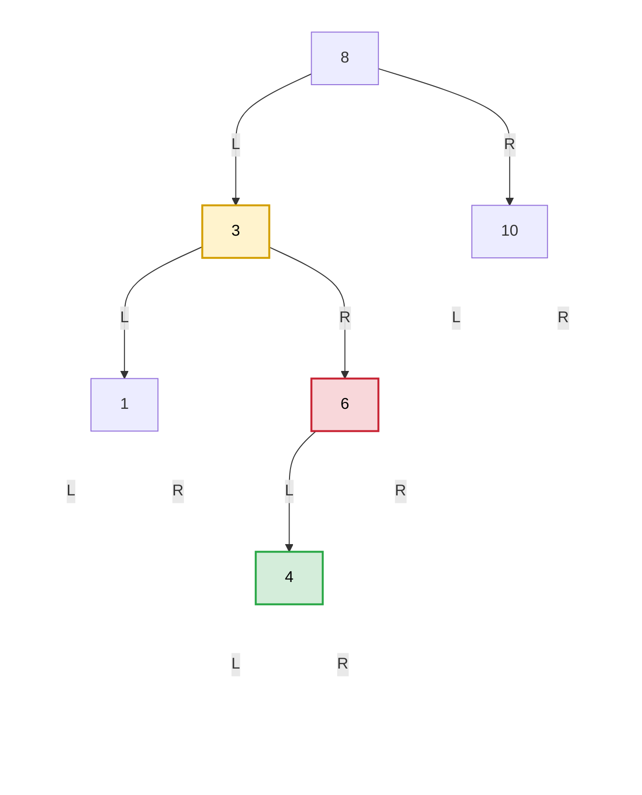
```mermaid
graph TD
	subgraph level0[" "]
		direction LR
		A["8"]
	end

	subgraph level1[" "]
		direction LR
		B["3"]
		C["10"]
	end

	subgraph level2[" "]
		direction LR
		D["1"]
		E["6"]
		C_L[" "]
		C_R[" "]
	end

	subgraph level3[" "]
		direction LR
		D_L[" "]
		D_R[" "]
		F["4"]
		E_R[" "]
	end

	subgraph level4[" "]
		direction LR
		F_L[" "]
		F_R[" "]
	end

	A -->|L| B
	A -->|R| C

	B -->|L| D
	B -->|R| E

	C -->|L| C_L
	C -->|R| C_R

	D -->|L| D_L
	D -->|R| D_R

	E -->|L| F
	E -->|R| E_R

	F -->|L| F_L
	F -->|R| F_R

	classDef target fill:#f8d7da,stroke:#c82333,stroke-width:2px,color:#000;
	classDef replace fill:#d4edda,stroke:#28a745,stroke-width:2px,color:#000;
	classDef parent fill:#fff3cd,stroke:#d39e00,stroke-width:2px,color:#000;
	classDef moved fill:#d1ecf1,stroke:#0c5460,stroke-width:2px,color:#000;
	classDef ghost fill:transparent,stroke:transparent,color:transparent;

	class B parent;
	class E target;
	class F replace;
	class C_L,C_R,D_L,D_R,E_R,F_L,F_R ghost;

	style level0 fill:transparent,stroke:transparent;
	style level1 fill:transparent,stroke:transparent;
	style level2 fill:transparent,stroke:transparent;
	style level3 fill:transparent,stroke:transparent;
	style level4 fill:transparent,stroke:transparent;

	linkStyle 4 stroke:transparent;
	linkStyle 5 stroke:transparent;
	linkStyle 6 stroke:transparent;
	linkStyle 7 stroke:transparent;
	linkStyle 9 stroke:transparent;
	linkStyle 10 stroke:transparent;
	linkStyle 11 stroke:transparent;
```

删除后：

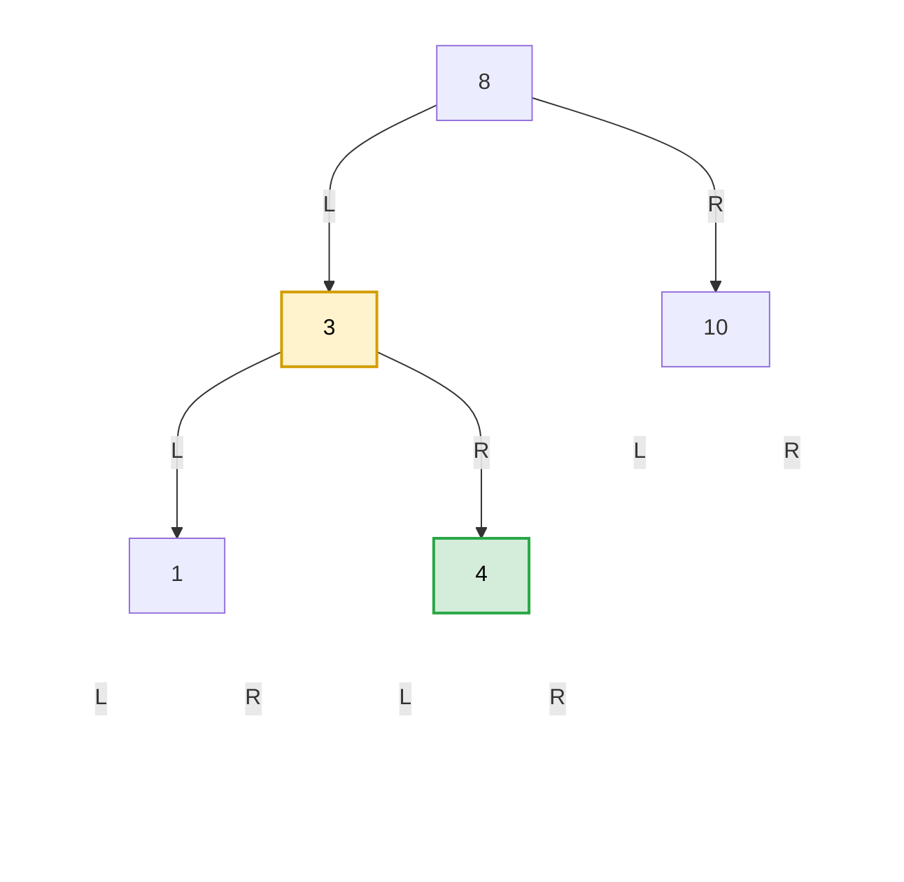
```mermaid
graph TD
	subgraph level0[" "]
		direction LR
		A["8"]
	end

	subgraph level1[" "]
		direction LR
		B["3"]
		C["10"]
	end

	subgraph level2[" "]
		direction LR
		D["1"]
		F["4"]
		C_L[" "]
		C_R[" "]
	end

	subgraph level3[" "]
		direction LR
		D_L[" "]
		D_R[" "]
		F_L[" "]
		F_R[" "]
	end

	A -->|L| B
	A -->|R| C

	B -->|L| D
	B -->|R| F

	C -->|L| C_L
	C -->|R| C_R

	D -->|L| D_L
	D -->|R| D_R

	F -->|L| F_L
	F -->|R| F_R

	classDef target fill:#f8d7da,stroke:#c82333,stroke-width:2px,color:#000;
	classDef replace fill:#d4edda,stroke:#28a745,stroke-width:2px,color:#000;
	classDef parent fill:#fff3cd,stroke:#d39e00,stroke-width:2px,color:#000;
	classDef moved fill:#d1ecf1,stroke:#0c5460,stroke-width:2px,color:#000;
	classDef ghost fill:transparent,stroke:transparent,color:transparent;

	class B parent;
	class F replace;
	class C_L,C_R,D_L,D_R,F_L,F_R ghost;

	style level0 fill:transparent,stroke:transparent;
	style level1 fill:transparent,stroke:transparent;
	style level2 fill:transparent,stroke:transparent;
	style level3 fill:transparent,stroke:transparent;

	linkStyle 4 stroke:transparent;
	linkStyle 5 stroke:transparent;
	linkStyle 6 stroke:transparent;
	linkStyle 7 stroke:transparent;
	linkStyle 8 stroke:transparent;
	linkStyle 9 stroke:transparent;
```

这一步的本质是：

```text
parent(3)->right = child(4)
delete node(6)
```

所以，单孩子删除的核心不在“删”，而在：

> **删掉目标节点以后，如何把它的唯一孩子重新挂回父节点。**

------

#### 3.6.4.5 删除双孩子节点

继续执行 `main()`，第三次删除的是 `8`。
此时 `8` 同时有左子树和右子树，所以它属于**双孩子删除**。

这一类不能直接把 `8` 断开，否则左右两棵子树都会失去连接位置。
标准做法是：

1. 找 `8` 的后继
2. 用后继值覆盖 `8`
3. 再去删除原来的后继节点

在当前这棵树里：

- `8` 的右子树根是 `10`
- `10` 没有左孩子
- 所以 `8` 的后继就是 `10`

------

##### 3.6.4.5.1 确定后继节点

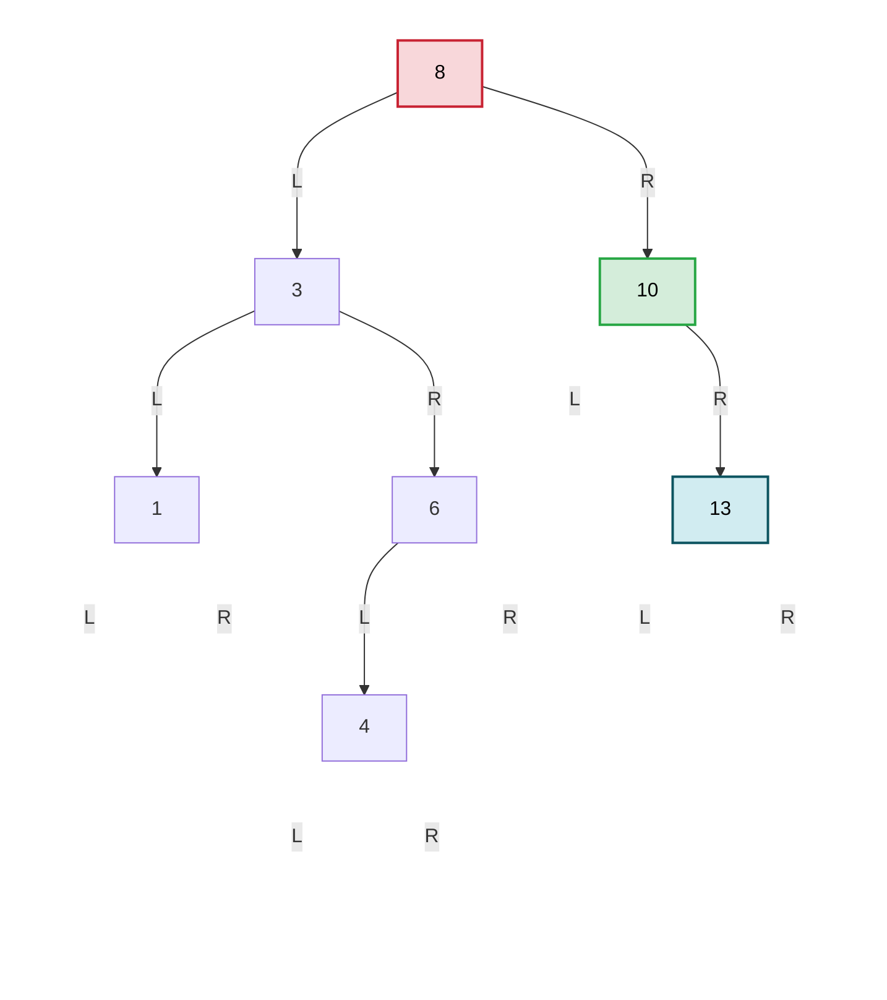
```mermaid
graph TD
	subgraph level0[" "]
		direction LR
		A["8"]
	end

	subgraph level1[" "]
		direction LR
		B["3"]
		C["10"]
	end

	subgraph level2[" "]
		direction LR
		D["1"]
		E["6"]
		C_L[" "]
		H["13"]
	end

	subgraph level3[" "]
		direction LR
		D_L[" "]
		D_R[" "]
		G["4"]
		E_R[" "]
		H_L[" "]
		H_R[" "]
	end

	subgraph level4[" "]
		direction LR
		G_L[" "]
		G_R[" "]
	end

	A -->|L| B
	A -->|R| C

	B -->|L| D
	B -->|R| E

	C -->|L| C_L
	C -->|R| H

	D -->|L| D_L
	D -->|R| D_R

	E -->|L| G
	E -->|R| E_R

	H -->|L| H_L
	H -->|R| H_R

	G -->|L| G_L
	G -->|R| G_R

	classDef target fill:#f8d7da,stroke:#c82333,stroke-width:2px,color:#000;
	classDef replace fill:#d4edda,stroke:#28a745,stroke-width:2px,color:#000;
	classDef parent fill:#fff3cd,stroke:#d39e00,stroke-width:2px,color:#000;
	classDef moved fill:#d1ecf1,stroke:#0c5460,stroke-width:2px,color:#000;
	classDef ghost fill:transparent,stroke:transparent,color:transparent;

	class A target;
	class C replace;
	class H moved;
	class C_L,D_L,D_R,E_R,H_L,H_R,G_L,G_R ghost;

	style level0 fill:transparent,stroke:transparent;
	style level1 fill:transparent,stroke:transparent;
	style level2 fill:transparent,stroke:transparent;
	style level3 fill:transparent,stroke:transparent;
	style level4 fill:transparent,stroke:transparent;

	linkStyle 4 stroke:transparent;
	linkStyle 6 stroke:transparent;
	linkStyle 7 stroke:transparent;
	linkStyle 9 stroke:transparent;
	linkStyle 10 stroke:transparent;
	linkStyle 11 stroke:transparent;
	linkStyle 12 stroke:transparent;
	linkStyle 13 stroke:transparent;
```

这一步要表达的是：

- 红色节点 `8` 是待删节点
- 绿色节点 `10` 是后继节点
- 蓝色节点 `13` 是后继节点原本带着的右子树，后面删除原 `10` 时要继续回接

------

##### 3.6.4.5.2 用后继替换并删除原后继

```mermaid
graph TD
	subgraph level0[" "]
		direction LR
		A["10"]
	end

	subgraph level1[" "]
		direction LR
		B["3"]
		H["13"]
	end

	subgraph level2[" "]
		direction LR
		D["1"]
		E["6"]
		H_L[" "]
		H_R[" "]
	end

	subgraph level3[" "]
		direction LR
		D_L[" "]
		D_R[" "]
		G["4"]
		E_R[" "]
	end

	subgraph level4[" "]
		direction LR
		G_L[" "]
		G_R[" "]
	end

	A -->|L| B
	A -->|R| H

	B -->|L| D
	B -->|R| E

	H -->|L| H_L
	H -->|R| H_R

	D -->|L| D_L
	D -->|R| D_R

	E -->|L| G
	E -->|R| E_R

	G -->|L| G_L
	G -->|R| G_R

	classDef target fill:#f8d7da,stroke:#c82333,stroke-width:2px,color:#000;
	classDef replace fill:#d4edda,stroke:#28a745,stroke-width:2px,color:#000;
	classDef parent fill:#fff3cd,stroke:#d39e00,stroke-width:2px,color:#000;
	classDef moved fill:#d1ecf1,stroke:#0c5460,stroke-width:2px,color:#000;
	classDef ghost fill:transparent,stroke:transparent,color:transparent;

	class A replace;
	class H moved;
	class H_L,H_R,D_L,D_R,E_R,G_L,G_R ghost;

	style level0 fill:transparent,stroke:transparent;
	style level1 fill:transparent,stroke:transparent;
	style level2 fill:transparent,stroke:transparent;
	style level3 fill:transparent,stroke:transparent;
	style level4 fill:transparent,stroke:transparent;

	linkStyle 4 stroke:transparent;
	linkStyle 5 stroke:transparent;
	linkStyle 6 stroke:transparent;
	linkStyle 7 stroke:transparent;
	linkStyle 9 stroke:transparent;
	linkStyle 10 stroke:transparent;
	linkStyle 11 stroke:transparent;
```

这里一定要看清楚一个实现细节：

这个代码不是“把整个 `10` 节点物理搬到根上”。
它真正做的是：

```text
root(8)->key = successor(10)->key
然后在 root->right 子树中删除原来的 10
```

也就是说，双孩子删除在代码层面通常分两步：

1. **值替换**
2. **再删原后继**

因此，这一类删除的难点不是“删掉根节点”，而是：

> **如何在替换之后，继续把原后继节点那一支删干净，同时保持 BST 有序性。**

------

#### 3.6.4.6 补充：满二叉树中的中间节点删除

先看一个**完美 BST**。
删除的不是根，而是中间节点 `12`。

这棵树是：

```text
            8
         /     \
        4       12
      /  \     /  \
     2    6   10   14
    / \  / \  / \  / \
   1  3 5  7 9 11 13 15
```

这里：

- 待删节点：`12`
- 后继节点：`13`
- 后继节点 `13` 是叶子
- 后继节点的父节点是 `14`

所以删除时真正发生的是：

1. 用 `13` 覆盖 `12`
2. 再删除原来的 `13`
3. 然后把 `14->left` 置空

删除前：

```mermaid
graph TD
	subgraph level0[" "]
		direction LR
		A["8"]
	end

	subgraph level1[" "]
		direction LR
		B["4"]
		C["12"]
	end

	subgraph level2[" "]
		direction LR
		D["2"]
		E["6"]
		F["10"]
		G["14"]
	end

	subgraph level3[" "]
		direction LR
		H["1"]
		I["3"]
		J["5"]
		K["7"]
		L["9"]
		M["11"]
		N["13"]
		O["15"]
	end

	A -->|L| B
	A -->|R| C

	B -->|L| D
	B -->|R| E

	C -->|L| F
	C -->|R| G

	D -->|L| H
	D -->|R| I

	E -->|L| J
	E -->|R| K

	F -->|L| L
	F -->|R| M

	G -->|L| N
	G -->|R| O

	classDef target fill:#f8d7da,stroke:#c82333,stroke-width:2px,color:#000;
	classDef replace fill:#d4edda,stroke:#28a745,stroke-width:2px,color:#000;
	classDef parent fill:#fff3cd,stroke:#d39e00,stroke-width:2px,color:#000;

	class C target;
	class N replace;
	class G parent;

	style level0 fill:transparent,stroke:transparent;
	style level1 fill:transparent,stroke:transparent;
	style level2 fill:transparent,stroke:transparent;
	style level3 fill:transparent,stroke:transparent;
```

删除后：

```mermaid
graph TD
	subgraph level0[" "]
		direction LR
		A["8"]
	end

	subgraph level1[" "]
		direction LR
		B["4"]
		C["13"]
	end

	subgraph level2[" "]
		direction LR
		D["2"]
		E["6"]
		F["10"]
		G["14"]
	end

	subgraph level3[" "]
		direction LR
		H["1"]
		I["3"]
		J["5"]
		K["7"]
		L["9"]
		M["11"]
		G_L[" "]
		O["15"]
	end

	A -->|L| B
	A -->|R| C

	B -->|L| D
	B -->|R| E

	C -->|L| F
	C -->|R| G

	D -->|L| H
	D -->|R| I

	E -->|L| J
	E -->|R| K

	F -->|L| L
	F -->|R| M

	G -->|L| G_L
	G -->|R| O

	classDef replace fill:#d4edda,stroke:#28a745,stroke-width:2px,color:#000;
	classDef parent fill:#fff3cd,stroke:#d39e00,stroke-width:2px,color:#000;
	classDef ghost fill:transparent,stroke:transparent,color:transparent;

	class C replace;
	class G parent;
	class G_L ghost;

	style level0 fill:transparent,stroke:transparent;
	style level1 fill:transparent,stroke:transparent;
	style level2 fill:transparent,stroke:transparent;
	style level3 fill:transparent,stroke:transparent;

	linkStyle 12 stroke:transparent;
```

这组图要你看清楚的是：

- 删除的是中间节点 `12`
- 真正被物理删掉的不是 `12` 这个位置，而是原来的后继叶子 `13`
- 调整动作是：`14->left = nullptr`

也就是：

```text
node(12)->key = 13
parent_of_successor(14)->left = nullptr
```

------

#### 3.6.4.7 补充：中间节点删除，且后继还带右孩子

上面那个例子虽然是“中间节点删除”，但因为原树是满二叉树，所以后继只能是叶子。
这样你还是看不到**回接调整**。

下面补一个更重要的例子：
删除中间节点 `10`，它的后继 `12` **自己还带一个右孩子 `13`**。

这棵树是：

```text
           20
         /    \
       10      30
      /  \
     5   15
        /  \
       12   18
         \
          13
```

这里：

- 待删节点：`10`
- 后继节点：`12`
- 后继父节点：`15`
- 后继节点的右孩子：`13`

所以删除时真正发生的是：

1. 用 `12` 覆盖 `10`
2. 再删除原来的 `12`
3. 由于原 `12` 还有右孩子 `13`
4. 所以不能直接把 `15->left` 置空
5. 而必须改成：`15->left = 13`

删除前：

```mermaid
graph TD
	subgraph level0[" "]
		direction LR
		A["20"]
	end

	subgraph level1[" "]
		direction LR
		B["10"]
		C["30"]
	end

	subgraph level2[" "]
		direction LR
		D["5"]
		E["15"]
		C_L[" "]
		C_R[" "]
	end

	subgraph level3[" "]
		direction LR
		D_L[" "]
		D_R[" "]
		H["12"]
		I["18"]
	end

	subgraph level4[" "]
		direction LR
		H_L[" "]
		J["13"]
		I_L[" "]
		I_R[" "]
	end

	subgraph level5[" "]
		direction LR
		J_L[" "]
		J_R[" "]
	end

	A -->|L| B
	A -->|R| C

	B -->|L| D
	B -->|R| E

	C -->|L| C_L
	C -->|R| C_R

	D -->|L| D_L
	D -->|R| D_R

	E -->|L| H
	E -->|R| I

	H -->|L| H_L
	H -->|R| J

	I -->|L| I_L
	I -->|R| I_R

	J -->|L| J_L
	J -->|R| J_R

	classDef target fill:#f8d7da,stroke:#c82333,stroke-width:2px,color:#000;
	classDef replace fill:#d4edda,stroke:#28a745,stroke-width:2px,color:#000;
	classDef parent fill:#fff3cd,stroke:#d39e00,stroke-width:2px,color:#000;
	classDef moved fill:#d1ecf1,stroke:#0c5460,stroke-width:2px,color:#000;
	classDef ghost fill:transparent,stroke:transparent,color:transparent;

	class B target;
	class H replace;
	class E parent;
	class J moved;
	class C_L,C_R,D_L,D_R,H_L,I_L,I_R,J_L,J_R ghost;

	style level0 fill:transparent,stroke:transparent;
	style level1 fill:transparent,stroke:transparent;
	style level2 fill:transparent,stroke:transparent;
	style level3 fill:transparent,stroke:transparent;
	style level4 fill:transparent,stroke:transparent;
	style level5 fill:transparent,stroke:transparent;

	linkStyle 4 stroke:transparent;
	linkStyle 5 stroke:transparent;
	linkStyle 6 stroke:transparent;
	linkStyle 7 stroke:transparent;
	linkStyle 10 stroke:transparent;
	linkStyle 12 stroke:transparent;
	linkStyle 13 stroke:transparent;
	linkStyle 14 stroke:transparent;
	linkStyle 15 stroke:transparent;
```

删除后：

```mermaid
graph TD
	subgraph level0[" "]
		direction LR
		A["20"]
	end

	subgraph level1[" "]
		direction LR
		B["12"]
		C["30"]
	end

	subgraph level2[" "]
		direction LR
		D["5"]
		E["15"]
		C_L[" "]
		C_R[" "]
	end

	subgraph level3[" "]
		direction LR
		D_L[" "]
		D_R[" "]
		J["13"]
		I["18"]
	end

	subgraph level4[" "]
		direction LR
		J_L[" "]
		J_R[" "]
		I_L[" "]
		I_R[" "]
	end

	A -->|L| B
	A -->|R| C

	B -->|L| D
	B -->|R| E

	C -->|L| C_L
	C -->|R| C_R

	D -->|L| D_L
	D -->|R| D_R

	E -->|L| J
	E -->|R| I

	J -->|L| J_L
	J -->|R| J_R

	I -->|L| I_L
	I -->|R| I_R

	classDef replace fill:#d4edda,stroke:#28a745,stroke-width:2px,color:#000;
	classDef parent fill:#fff3cd,stroke:#d39e00,stroke-width:2px,color:#000;
	classDef moved fill:#d1ecf1,stroke:#0c5460,stroke-width:2px,color:#000;
	classDef ghost fill:transparent,stroke:transparent,color:transparent;

	class B replace;
	class E parent;
	class J moved;
	class C_L,C_R,D_L,D_R,J_L,J_R,I_L,I_R ghost;

	style level0 fill:transparent,stroke:transparent;
	style level1 fill:transparent,stroke:transparent;
	style level2 fill:transparent,stroke:transparent;
	style level3 fill:transparent,stroke:transparent;
	style level4 fill:transparent,stroke:transparent;

	linkStyle 4 stroke:transparent;
	linkStyle 5 stroke:transparent;
	linkStyle 6 stroke:transparent;
	linkStyle 7 stroke:transparent;
	linkStyle 10 stroke:transparent;
	linkStyle 11 stroke:transparent;
	linkStyle 12 stroke:transparent;
	linkStyle 13 stroke:transparent;
```

这一组图里，你真正应该盯住的不是“根变没变”，而是这一句：

```text
parent_of_successor(15)->left = successor->right(13)
```

也就是：

- 原来 `15->left = 12`
- 删除原来的 `12` 时，不能直接让 `15->left = nullptr`
- 必须改成 `15->left = 13`

这就是**回接调整**。

------

#### 3.6.4.8 完整 C++ 示例

下面给出一个完整、可直接运行的 C++ 示例。
这个实现与上面的图保持一致：双孩子删除采用的是**后继值覆盖 + 递归删除原后继节点**。

```cpp
#include <cassert>
#include <cstdlib>
#include <iostream>
#include <new>

/*
 * BST 节点结构
 * key   : 当前节点保存的键值
 * left  : 指向左子树
 * right : 指向右子树
 */
struct bst_node {
	int key;
	bst_node *left;
	bst_node *right;
};

/*
 * 插入结果
 * ok        : 插入成功
 * no_memory : 内存分配失败
 */
enum class bst_insert_result {
	ok,
	no_memory,
};

/*
 * 创建一个新节点
 *
 * 参数：
 * key - 节点键值
 *
 * 返回值：
 * 成功时返回新节点地址
 * 失败时返回 nullptr
 *
 * 说明：
 * 这里使用 nothrow 版本的 new，
 * 分配失败时不会抛异常，而是返回 nullptr。
 */
bst_node *bst_create_node(int key) noexcept
{
	return new (std::nothrow) bst_node { key, nullptr, nullptr };
}

/*
 * 向 BST 中插入一个键值
 *
 * 参数：
 * root - 树根引用
 * key  - 待插入键值
 *
 * 返回值：
 * ok        : 插入成功
 * no_memory : 节点创建失败
 *
 * 说明：
 * 这里使用 bst_node **link 的方式向下查找插入位置。
 * link 一开始指向根指针本身，
 * 后续根据比较结果不断改为：
 *   - &(*link)->left
 *   - &(*link)->right
 *
 * 这样做的好处是：
 * 找到空位置后，可以直接通过 *link = node 完成挂接，
 * 不需要额外记录父节点再区分挂左还是挂右。
 *
 * 注意：
 * 这个实现不允许重复键值。
 * 一旦发现重复键值，就直接触发断言并终止程序。
 */
bst_insert_result bst_insert(bst_node *&root, int key)
{
	bst_node **link = &root;
	bst_node *node;

	/* 沿着 BST 的比较规则向下查找插入位置 */
	while (*link) {
		if (key < (*link)->key)
			link = &(*link)->left;
		else if (key > (*link)->key)
			link = &(*link)->right;
		else {
			/*
			 * 当前实现不支持重复键值。
			 * 若业务允许重复键，需额外定义重复键策略：
			 * 例如统一放左边、统一放右边，或节点内维护计数。
			 */
			assert(!"duplicate key is not allowed in this bst");
			std::abort();
		}
	}

	/* 走到这里说明 *link 为空，当前位置就是插入点 */
	node = bst_create_node(key);
	if (!node)
		return bst_insert_result::no_memory;

	/* 直接把新节点挂到找到的空位置 */
	*link = node;
	return bst_insert_result::ok;
}

/*
 * 查找一棵子树中的最小节点
 *
 * 参数：
 * root - 子树根节点
 *
 * 返回值：
 * 最小节点地址；若 root 为空则返回 nullptr
 *
 * 说明：
 * BST 中最小节点一定在最左侧路径上。
 */
bst_node *bst_find_min(bst_node *root)
{
	if (!root)
		return nullptr;

	while (root->left)
		root = root->left;

	return root;
}

/*
 * 删除 BST 中指定键值的节点
 *
 * 参数：
 * root - 当前子树根节点
 * key  - 待删除键值
 *
 * 返回值：
 * 删除完成后，这棵子树的新根节点
 *
 * 这是一个非常关键的设计点：
 * 本函数不是“原地只改当前节点”，
 * 而是“删除后返回新的子树根”，
 * 这样上层调用者就可以写成：
 *
 *   root->left = bst_erase(root->left, key);
 *   root->right = bst_erase(root->right, key);
 *
 * 从而自然完成“子树回接”。
 */
bst_node *bst_erase(bst_node *root, int key)
{
	bst_node *succ;

	/* 空树，说明没找到待删节点 */
	if (!root)
		return nullptr;

	/*
	 * 若 key 更小，说明待删节点在左子树中。
	 * 删除完成后，左子树的根可能发生变化，
	 * 所以必须把返回值重新接回 root->left。
	 */
	if (key < root->key) {
		root->left = bst_erase(root->left, key);
		return root;
	}

	/*
	 * 若 key 更大，说明待删节点在右子树中。
	 * 同理，删除完成后要把新根重新接回 root->right。
	 */
	if (key > root->key) {
		root->right = bst_erase(root->right, key);
		return root;
	}

	/*
	 * 走到这里说明：
	 * 当前 root 就是待删除节点。因为 > 或者 < 都不适用于 ==，到这里自然是判断 == 了
	 *
	 * 接下来按孩子数量分类讨论。
	 */

	/*
	 * 情况 1：没有左孩子
	 *
	 * 包含两种子情况：
	 * 1) 左右孩子都没有       -> 叶子删除
	 * 2) 只有右孩子           -> 单孩子删除
	 *
	 * 统一处理方式：
	 * 当前节点删除后，让右子树顶替当前位置。
	 */
	if (!root->left) {
		bst_node *right = root->right;	// 记住右子树根节点
		delete root;
		return right;					// 返回右子树根节点
	}

	/*
	 * 情况 2：没有右孩子
	 *
	 * 说明只有左孩子。
	 * 当前节点删除后，让左子树顶替当前位置。
	 */
	if (!root->right) {
		bst_node *left = root->left;	// 记住左子树根节点
		delete root;
		return left;				  // 返回左子树根节点
	}

	/*
	 * 情况 3：左右孩子都存在
	 *
	 * 这是 BST 删除中最关键的一类情况。
	 * 不能直接粗暴删除当前节点，否则左右两棵子树的连接关系会丢失。
	 *
	 * 当前实现采用“后继替换”策略：
	 *
	 * 第一步：
	 *   在右子树中找到最小节点，它就是当前节点的中序后继。
	 *
	 * 第二步：
	 *   用后继节点的 key 覆盖当前节点的 key。
	 *   注意，这一步只是值替换，不是把整个节点物理搬过来。
	 *
	 * 第三步：
	 *   再到右子树中删除“原来的后继节点”。
	 *
	 * 为什么这样做合法？
	 * 因为后继节点是“比当前节点大的最小值”，
	 * 替换后仍然满足 BST 的中序有序性。
	 */
	succ = bst_find_min(root->right);
	root->key = succ->key;
	root->right = bst_erase(root->right, succ->key);

	return root;
}

/*
 * 中序遍历打印
 *
 * 参数：
 * root - 当前子树根节点
 *
 * 说明：
 * 对 BST 进行中序遍历，输出结果应当是严格递增的有序序列。
 * 这也是验证 BST 性质最直接的方法之一。
 */
void bst_inorder_print(const bst_node *root)
{
	if (!root)
		return;

	bst_inorder_print(root->left);
	std::cout << root->key << ' ';
	bst_inorder_print(root->right);
}

/*
 * 递归释放整棵树
 *
 * 参数：
 * root - 当前子树根节点
 *
 * 说明：
 * 采用后序方式释放：
 * 先释放左子树，再释放右子树，最后释放当前节点。
 * 这样可以避免访问已释放节点。
 */
void bst_destroy(bst_node *root)
{
	if (!root)
		return;

	bst_destroy(root->left);
	bst_destroy(root->right);
	delete root;
}

int main()
{
	/*
	 * 用一组固定数据构造示例 BST：
	 *
	 *           8
	 *         /   \
	 *        3     10
	 *       / \      \
	 *      1   6      14
	 *         / \     /
	 *        4   7   13
	 */
	const int initial_keys[] = { 8, 3, 10, 1, 6, 14, 4, 7, 13 };
	bst_node *root = nullptr;
	bst_insert_result insert_result;

	/* 逐个插入初始数据 */
	for (int key : initial_keys) {
		insert_result = bst_insert(root, key);
		if (insert_result == bst_insert_result::no_memory) {
			std::cout << "插入失败：内存不足\n";
			bst_destroy(root);
			return 1;
		}
	}

	/* 初始中序结果应为有序序列 */
	std::cout << "初始中序: ";
	bst_inorder_print(root);
	std::cout << '\n';

	/*
	 * 删除 7
	 * 7 是叶子节点，对应“叶子删除”
	 */
	root = bst_erase(root, 7);
	std::cout << "删除叶子节点 7 后: ";
	bst_inorder_print(root);
	std::cout << '\n';

	/*
	 * 删除 14
	 * 14 只有一个左孩子 13，对应“单孩子删除”
	 * 删除后由 13 顶替 14 的位置
	 */
	root = bst_erase(root, 14);
	std::cout << "删除单孩子节点 14 后: ";
	bst_inorder_print(root);
	std::cout << '\n';

	/*
	 * 删除 8
	 * 8 同时有左子树和右子树，对应“双孩子删除”
	 * 当前实现会：
	 * 1. 找到后继 10
	 * 2. 用 10 覆盖 8
	 * 3. 再删除原来的 10
	 */
	root = bst_erase(root, 8);
	std::cout << "删除双孩子节点 8 后: ";
	bst_inorder_print(root);
	std::cout << '\n';

	/* 释放整棵树 */
	bst_destroy(root);
	return 0;
}
```

------

#### 3.6.4.9 运行结果与观察重点

这个程序的中序输出应当是：

```text
初始中序: 1 3 4 6 7 8 10 13 14
删除叶子节点 7 后: 1 3 4 6 8 10 13 14
删除单孩子节点 14 后: 1 3 4 6 8 10 13
删除双孩子节点 8 后: 1 3 4 6 10 13
```

你在阅读这个示例时，需要重点观察下面四点：

1. 删除 `7` 时，代码没有做复杂调整，只是把父节点对应孩子指针置空
2. 删除 `14` 时，代码不是“删完就空”，而是让唯一孩子 `13` 顶替其位置
3. 删除 `8` 时，代码不是直接把整棵子树乱接，而是先找后继 `10`，做值覆盖，再递归删除原来的 `10`
4. 当后继节点本身还带孩子时，真正的难点在于：**如何把后继节点原来的那一支重新挂回去**

因此，这个删除实现最值得建立的认识不是“记住三种 case”，而是：

> **BST 删除的本质，是在删掉目标节点之后，仍然保持整棵树的连接关系和有序性不被破坏。**

------

## 3.7 可视化理解：BST 的核心关系图

### 3.7.1 BST 基本约束图

```mermaid
graph TD
	A["根节点 x"]
	B["左子树所有值 < x"]
	C["右子树所有值 > x"]
	D["左子树自身仍是 BST"]
	E["右子树自身仍是 BST"]

	A --> B
	A --> C
	B --> D
	C --> E
```

### 3.7.2 查找流程图

```mermaid
flowchart TD
	A["从根节点开始"] --> B["当前节点为空?"]
	B -->|是| C["查找失败"]
	B -->|否| D["key == cur.key ?"]
	D -->|是| E["查找成功"]
	D -->|否| F["key < cur.key ?"]
	F -->|是| G["进入左子树"]
	F -->|否| H["进入右子树"]
	G --> B
	H --> B
```

### 3.7.3 删除分类图

```mermaid
flowchart TD
	A["删除目标节点"] --> B["是否有两个孩子?"]
	B -->|是| C["用前驱或后继替换"]
	C --> D["转化为删除前驱/后继节点"]
	B -->|否| E["是否有一个孩子?"]
	E -->|是| F["唯一孩子顶替该节点"]
	E -->|否| G["直接删除叶子"]
```

------

## 3.8 调试与验证

BST 在代码里最容易错的地方，不是查找，而是：

- 插入时父子挂接错误
- 删除时替换关系错误
- 删除后局部仍像树，但全局不再满足 BST 性质

### 3.8.1 如何验证 BST 性质

最常见方法：**中序遍历检查是否严格递增**。

原因是：

- BST 的中序遍历结果应当是有序序列
- 如果中序结果不是递增，说明树已被破坏

例如：

```cpp
bool inorderCheck(bst_node *root, bst_node *&prev)
{
	if (!root)
		return true;

	if (!inorderCheck(root->left, prev))
		return false;

	if (prev && prev->key >= root->key)
		return false;

	prev = root;
	return inorderCheck(root->right, prev);
}
```

### 3.8.2 删除操作的常见错误

#### 1）忘记处理根节点被删除

如果删除的是根，而且返回值没有重新接回 `root`，整棵树就会丢失。

#### 2）双孩子删除后没有继续删除后继节点

只做“值覆盖”而不删除原后继，会导致重复值残留。

#### 3）单孩子替换时漏改父指针

如果采用带父指针实现，这类错误非常常见。

### 3.8.3 建议的手工测试集合

建议你用下面这些数据手工跑插入和删除：

| 测试目标       | 数据                   |
| -------------- | ---------------------- |
| 基本插入       | `8 3 10 1 6 14 4 7 13` |
| 顺序退化       | `1 2 3 4 5 6 7`        |
| 删除叶子       | 删 `7`                 |
| 删除单孩子     | 删 `14`                |
| 删除双孩子     | 删 `8`                 |
| 删除根节点     | 根为 `8` 时删 `8`      |
| 删除不存在元素 | 删 `100`               |

------

## 3.9 本章小结

### 3.9.1 红黑树首先是一棵 BST

这一点必须牢牢记住。

红黑树不是“另外一种完全不同的树”，它首先满足：

- 左子树小于根
- 右子树大于根
- 中序遍历有序

也就是说：

> 红黑树的查找基础，完全继承自 BST。

### 3.9.2 红黑树的所有旋转都不能破坏 BST 有序性

后续你学左旋、右旋、插入修复、删除修复时，会看到很多局部结构变化。
但无论怎么旋转、怎么染色，都必须维持 BST 的中序有序性。

所以你现在学 BST，不是为了停留在 BST，而是为了建立后续所有平衡树操作的**不变量基础**：

- 查找路径基于 BST 比较规则
- 插入位置基于 BST 比较规则
- 删除替换基于 BST 中序邻接关系
- 旋转修复不能破坏 BST 有序性

------

## 3.10 与下一章的衔接

到这里，你已经具备了进入红黑树前真正需要的第一层能力：

- 会判断一棵树是不是 BST
- 会分析 BST 查找路径
- 会理解 BST 插入为什么成立
- 会区分 BST 删除的三种情形
- 会意识到 BST 的优势和致命局限

下一章将回答一个关键问题：

> **既然 BST 查找很高效，为什么还不够？**

答案是：

> **因为 BST 不控制树高，可能退化。**

