# 第5章 旋转的作用与局部重排

## 5.0 章节内容说明

上一章你已经知道：

- BST 的问题不在“左小右大”的比较规则
- 而在于它**不控制树高**
- 一旦输入顺序不合适，BST 就可能退化成单链结构

那么接下来的关键问题就是：

> **既然树形坏了，怎样在不破坏 BST 有序性的前提下，把局部结构重新调整好？**

答案就是：**旋转**。

旋转不是重新排序全部节点，也不是重新构造整棵树。
它是一种**局部重排操作**：

- 只修改少量节点之间的父子关系
- 保持中序有序性不变
- 改变局部高度和重心位置
- 为 AVL、红黑树等平衡树提供最基本的结构修复动作

本章你要抓住的核心不是“把左旋右旋死记硬背”，而是理解三件事：

1. 为什么旋转不会破坏 BST 的有序性
2. 旋转到底改了哪些父子指针
3. 为什么双旋本质上是两个单旋的组合

------

## 5.1 旋转为什么存在

### 5.1.1 不改变中序有序性

BST 的根本不变量是：

> **中序遍历结果必须保持有序。**

所以任何结构调整都必须满足一个前提：

- 形状可以变
- 但中序顺序不能变

旋转之所以能成为平衡树的基础动作，就是因为它满足这一点。

先看一个左旋前后的抽象局部结构。
图中的 `T1`、`T2`、`T3` 不是单个节点，而是三棵满足区间约束的子树。

左旋前：

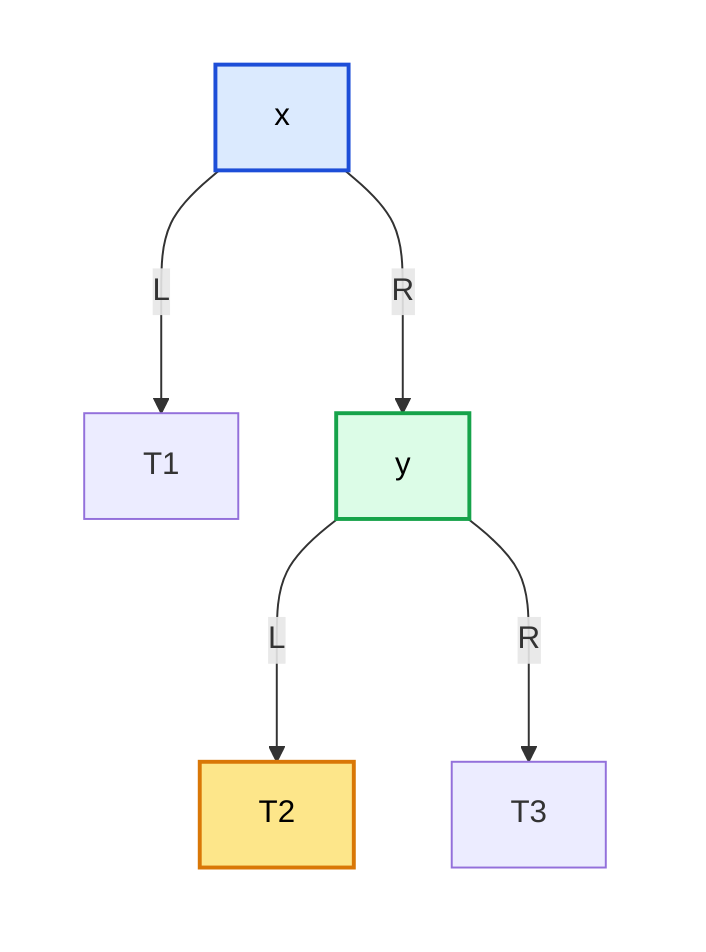
```mermaid
graph TD
	subgraph level0[" "]
		direction LR
		X["x"]
	end

	subgraph level1[" "]
		direction LR
		T1["T1"]
		Y["y"]
	end

	subgraph level2[" "]
		direction LR
		T2["T2"]
		T3["T3"]
	end

	X -->|L| T1
	X -->|R| Y
	Y -->|L| T2
	Y -->|R| T3

	classDef center_node fill:#dbeafe,stroke:#1d4ed8,stroke-width:2px,color:#000;
	classDef pivot_node fill:#dcfce7,stroke:#16a34a,stroke-width:2px,color:#000;
	classDef moved_node fill:#fde68a,stroke:#d97706,stroke-width:2px,color:#000;

	class X center_node;
	class Y pivot_node;
	class T2 moved_node;

	style level0 fill:transparent,stroke:transparent;
	style level1 fill:transparent,stroke:transparent;
	style level2 fill:transparent,stroke:transparent;
```

左旋后：

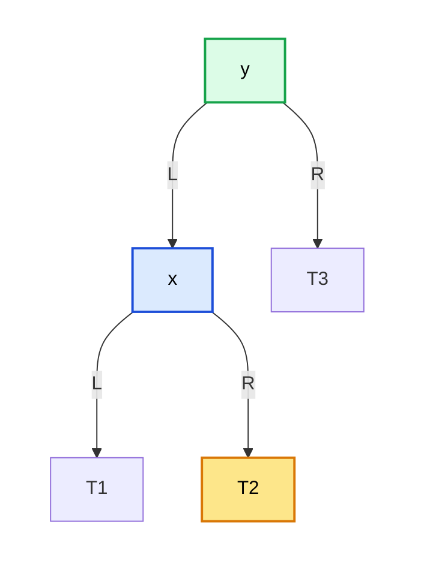
```mermaid
graph TD
	subgraph level0[" "]
		direction LR
		Y["y"]
	end

	subgraph level1[" "]
		direction LR
		X["x"]
		T3["T3"]
	end

	subgraph level2[" "]
		direction LR
		T1["T1"]
		T2["T2"]
	end

	Y -->|L| X
	Y -->|R| T3
	X -->|L| T1
	X -->|R| T2

	classDef center_node fill:#dbeafe,stroke:#1d4ed8,stroke-width:2px,color:#000;
	classDef pivot_node fill:#dcfce7,stroke:#16a34a,stroke-width:2px,color:#000;
	classDef moved_node fill:#fde68a,stroke:#d97706,stroke-width:2px,color:#000;

	class X center_node;
	class Y pivot_node;
	class T2 moved_node;

	style level0 fill:transparent,stroke:transparent;
	style level1 fill:transparent,stroke:transparent;
	style level2 fill:transparent,stroke:transparent;
```

旋转前的中序顺序是：

```text
T1, x, T2, y, T3
```

旋转后的中序顺序仍然是：

```text
T1, x, T2, y, T3
```

所以旋转改变的是<span style="color:red;">**结构位置**</span>，不是<span style="color:red;">**有序关系**</span>。

### 5.1.2 通过局部重排改变树形

旋转的本质，不是“把节点值重新排序”，而是：

> **通过局部指针改接，让重心上移或下移。**

还是以上面的左旋为例：

- 原来 `x` 在上，`y` 在下
- 左旋后，`y` 上移为新的局部根
- `x` 下沉为 `y` 的左孩子
- `T2` 从 `y` 的左边改挂到 `x` 的右边

你会看到：

- 参与调整的只是 `x`、`y`、`T2`
- `T1` 和 `T3` 的相对区间没有变化
- 整个局部的“中心”向右侧节点 `y` 偏移

所以旋转是一个典型的**局部重排**动作。

### 5.1.3 旋转是平衡树修复的机械基础

平衡树的修复规则可以很复杂：

- AVL 会看高度差
- 红黑树会看颜色、叔叔节点、黑高等

但无论规则多复杂，最后真正改结构的动作通常只有两个：

- 左旋
- 右旋

也就是说：

> **平衡树决定“什么时候旋转”，而旋转本身负责“怎么改结构”。**

你可以把它们分成两个层面：

| 层面     | 负责的问题   |
| -------- | ------------ |
| 平衡规则 | 何时需要调整 |
| 旋转动作 | 具体怎样调整 |

所以不先学旋转，后面的 AVL、红黑树都会变成一堆难以落地的 case。

------

## 5.2 左旋

### 5.2.1 左旋前后的局部结构

左旋的前提是：

> **当前节点 `x` 必须存在右孩子 `y`。**

因为左旋的本质，就是让右孩子上移。

先看一个具体数值例子。

左旋前：

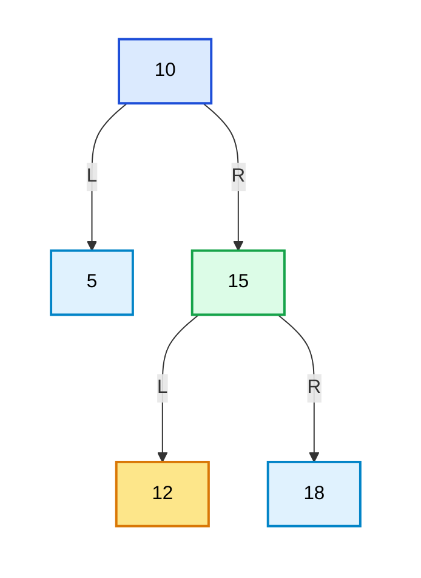
```mermaid
graph TD
	subgraph level0[" "]
		direction LR
		X["10"]
	end

	subgraph level1[" "]
		direction LR
		T1["5"]
		Y["15"]
	end

	subgraph level2[" "]
		direction LR
		T2["12"]
		T3["18"]
	end

	X -->|L| T1
	X -->|R| Y
	Y -->|L| T2
	Y -->|R| T3

	classDef center_node fill:#dbeafe,stroke:#1d4ed8,stroke-width:2px,color:#000;
	classDef pivot_node fill:#dcfce7,stroke:#16a34a,stroke-width:2px,color:#000;
	classDef moved_node fill:#fde68a,stroke:#d97706,stroke-width:2px,color:#000;
	classDef normal_node fill:#e0f2fe,stroke:#0284c7,stroke-width:2px,color:#000;

	class X center_node;
	class Y pivot_node;
	class T2 moved_node;
	class T1,T3 normal_node;

	style level0 fill:transparent,stroke:transparent;
	style level1 fill:transparent,stroke:transparent;
	style level2 fill:transparent,stroke:transparent;
```

左旋后：

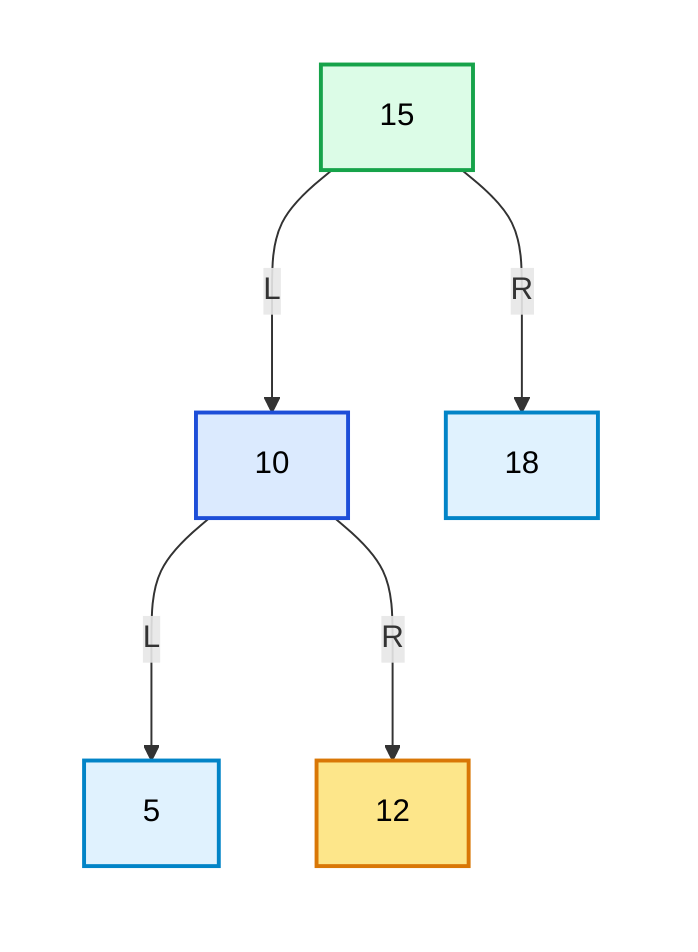
```mermaid
graph TD
	subgraph level0[" "]
		direction LR
		Y["15"]
	end

	subgraph level1[" "]
		direction LR
		X["10"]
		T3["18"]
	end

	subgraph level2[" "]
		direction LR
		T1["5"]
		T2["12"]
	end

	Y -->|L| X
	Y -->|R| T3
	X -->|L| T1
	X -->|R| T2

	classDef center_node fill:#dbeafe,stroke:#1d4ed8,stroke-width:2px,color:#000;
	classDef pivot_node fill:#dcfce7,stroke:#16a34a,stroke-width:2px,color:#000;
	classDef moved_node fill:#fde68a,stroke:#d97706,stroke-width:2px,color:#000;
	classDef normal_node fill:#e0f2fe,stroke:#0284c7,stroke-width:2px,color:#000;

	class X center_node;
	class Y pivot_node;
	class T2 moved_node;
	class T1,T3 normal_node;

	style level0 fill:transparent,stroke:transparent;
	style level1 fill:transparent,stroke:transparent;
	style level2 fill:transparent,stroke:transparent;
```

这就是左旋的全部结构结果：

- `15` 上移
- `10` 下沉
- `12` 改挂到 `10` 的右边

### 5.2.2 左旋时父子关系如何变化

左旋时，真正发生变化的父子关系只有几条：

#### 变化前

```text
x.right = y
y.left  = T2
```

#### 变化后

```text
y.left  = x
x.right = T2
```

如果再把父指针考虑进来，则还有两步：

- `y` 要接替 `x` 在原父节点中的位置
- `T2` 若非空，要把父指针改成 `x`

所以左旋本质上是下面这组替换：

| 旋转前               | 旋转后                 |
| -------------------- | ---------------------- |
| `x` 是局部根         | `y` 成为局部根         |
| `y` 是 `x` 的右孩子  | `x` 成为 `y` 的左孩子  |
| `T2` 是 `y` 的左子树 | `T2` 变成 `x` 的右子树 |

### 5.2.3 左旋为什么不破坏 BST 性质

左旋为什么合法，核心在于区间关系始终没有变。

在左旋前，BST 区间满足：

```text
T1 < x < T2 < y < T3
```

更准确地说：

- `T1` 中所有值 `< x`
- `T2` 中所有值 `> x` 且 `< y`
- `T3` 中所有值 `> y`

左旋后：

- `x` 仍然在 `T1` 和 `T2` 之间
- `y` 仍然在 `x` 与 `T3` 之间

所以中序顺序不变，BST 性质自然不变。

这就是为什么左旋虽然改了树形，但不会破坏搜索规则。

------

### 5.2.4 左旋算法说明（成品实现）

前面已经说明了左旋前后的局部结构变化。
如果后续要继续学习红黑树，那么这里只给“局部骨架”是不够的。因为红黑树中的左旋不是孤立动作，而是直接作用于整棵树中的某个节点 `x`。因此，一个真正可用的左旋实现，必须同时覆盖下面几种情况：

1. `x` 可能就是整棵树的根节点
2. `x` 也可能只是某个父节点的左子树根
3. `x` 也可能只是某个父节点的右子树根
4. `x->right` 不能为空，否则左旋无意义
5. `y = x->right` 的左子树 `T2` 可能为空，也可能非空
6. 左旋之后，必须同时维护：
   - 局部子树的新根
   - 原父节点到新子树根的连接
   - `T2` 的重新挂接
   - 所有受影响节点的 `parent` 指针

因此，本节给出的不是教学切片，而是**可直接用于后续红黑树推导的左旋成品实现**。

------

#### 5.2.4.1 左旋覆盖的完整结构场景

设当前左旋点为 `x`，其右孩子为 `y`，并记：

- `P`：`x` 的父节点，可能为空
- `T1`：`x` 的左子树
- `T2`：`y` 的左子树
- `T3`：`y` 的右子树

则左旋前后结构如下。

##### 左旋前

```text
              P
              |
              x
            /   \
          T1     y
                / \
              T2   T3
```

##### 左旋后

```text
              P
              |
              y
            /   \
           x     T3
         /   \
       T1     T2
```

这里真正发生的结构变化只有四件事：

1. `y` 上移，接替 `x` 在原父节点 `P` 中的位置
2. `x` 下沉，变成 `y` 的左孩子
3. `T2` 从 `y` 的左边改挂到 `x` 的右边
4. 所有涉及到的 `parent` 指针都必须同步更新

------

#### 5.2.4.2 左旋的不变量

一个成品级左旋实现，必须保证两个不变量。

##### 第一，不改变 BST 的中序有序性

旋转前后，节点的中序顺序必须保持：

```text
T1, x, T2, y, T3
```

也就是说：

- `T1` 中所有值 `< x`
- `T2` 中所有值 `> x` 且 `< y`
- `T3` 中所有值 `> y`

左旋后只是结构位置变化，没有改变这个区间关系。

##### 第二，旋转后整棵树仍然是连通的 

左旋不是只改局部三四条指针就结束，它必须保证：

- 原父节点仍然能找到这棵子树
- 新局部根能找到下层
- 下层节点也能通过 `parent` 回到上层

所以，成品左旋不只是“局部变形”，而是“局部变形 + 整树回接”。

------

#### 5.2.4.3 左旋的完整算法步骤

一个完整左旋，必须严格按下面顺序执行。

##### 第一步：确定上移节点 `y`

```text
y = x->right
```

如果 `x == NULL` 或 `x->right == NULL`，直接返回，左旋不成立。

##### 第二步：回接中间子树 `T2`

```text
x->right = y->left
```

如果 `T2` 非空，还要补：

```text
T2->parent = x
```

这一步必须先做。因为如果先把 `y` 改接到上层，再来处理 `T2`，中间子树容易写丢。

##### 第三步：让 `y` 接替 `x` 原来在父节点中的位置

```text
y->parent = x->parent
```

然后分三种情况讨论：

- 如果 `x` 原来是整棵树根，则 `root = y`
- 如果 `x` 原来是父节点的左孩子，则 `x->parent->left = y`
- 如果 `x` 原来是父节点的右孩子，则 `x->parent->right = y`

##### 第四步：让 `x` 下沉

```text
y->left = x
x->parent = y
```

到这里，左旋完成。

因此，一个真正成品级的左旋，不是三句，而是下面这组完整动作：

```text
1. 取 y = x->right
2. x->right = y->left
3. 若 y->left 非空，则 y->left->parent = x
4. y->parent = x->parent
5. 若 x 原来是根节点，则 root = y；
   否则若 x 是父节点的左孩子，则 x->parent->left = y；
   那么   x 是父节点的右孩子，则 x->parent->right = y
6. y->left = x
7. x->parent = y
```

这七步，才是后面红黑树推导真正要依赖的左旋算法。

------

### 5.2.5 C 成品实现：左旋

下面给出一份可以直接用于后续红黑树推导的 C 版本左旋。
它不是“局部教学版”，而是**完整版本**。

```c
#include <stdio.h>
#include <stdlib.h>

struct bst_node {
	int key;
	struct bst_node *left;
	struct bst_node *right;
	struct bst_node *parent;
};

/*
 * 成品左旋
 *
 * 参数：
 * root - 整棵树根指针的地址
 * x    - 当前左旋点
 *
 * 说明：
 * 1. 这个版本同时覆盖：
 *    - x 是整棵树根
 *    - x 是父节点的左孩子
 *    - x 是父节点的右孩子
 *
 * 2. 同时维护：
 *    - 根指针
 *    - parent 指针
 *    - 中间子树 T2 的回接
 */
void bst_left_rotate(struct bst_node **root, struct bst_node *x)
{
	struct bst_node *y;

	if (!root || !*root || !x || !x->right)
		return;

	/* y 是上移节点 */
	y = x->right;

	/*
	 * 第一步：把 T2 挂回 x 的右边
	 *
	 * 旋转前：
	 * x->right = y
	 * y->left  = T2
	 *
	 * 旋转后：
	 * x->right = T2
	 */
	x->right = y->left;
	if (y->left)
		y->left->parent = x;

	/*
	 * 第二步：让 y 接替 x 原来的位置
	 */
	y->parent = x->parent;

	if (!x->parent) {
		/* x 原来是整棵树根 */
		*root = y;
	} else if (x == x->parent->left) {
		/* x 原来是父节点的左孩子 */
		x->parent->left = y;
	} else {
		/* x 原来是父节点的右孩子 */
		x->parent->right = y;
	}

	/*
	 * 第三步：让 x 下沉为 y 的左孩子
	 */
	y->left = x;
	x->parent = y;
}
```

------

### 5.2.6 C++ 成品实现：左旋

如果后面想用 C++ 自己写一套红黑树练手，那么下面这一版就是对应的 C++ 成品实现。

```cpp
#include <iostream>

struct bst_node {
	int key;
	bst_node *left;
	bst_node *right;
	bst_node *parent;
};

/*
 * 成品左旋（C++ 版）
 *
 * 参数：
 * root - 整棵树根指针的引用
 * x    - 当前左旋点
 */
void bst_left_rotate(bst_node *&root, bst_node *x)
{
	bst_node *y;

	if (!root || !x || !x->right)
		return;

	/* y 是上移节点 */
	y = x->right;

	/* 第一步：回接 T2 */
	x->right = y->left;
	if (y->left)
		y->left->parent = x;

	/* 第二步：让 y 接替 x 原来的位置 */
	y->parent = x->parent;

	if (!x->parent) {
		root = y;
	} else if (x == x->parent->left) {
		x->parent->left = y;
	} else {
		x->parent->right = y;
	}

	/* 第三步：让 x 下沉 */
	y->left = x;
	x->parent = y;
}
```

------

### 5.2.7 C 成品示例：左旋整棵树根

下面先看最简单但仍然是**成品调用方式**的例子：左旋点 `x` 就是整棵树根。

```c
#include <stdio.h>
#include <stdlib.h>

struct bst_node {
	int key;
	struct bst_node *left;
	struct bst_node *right;
	struct bst_node *parent;
};

void bst_left_rotate(struct bst_node **root, struct bst_node *x)
{
	struct bst_node *y;

	if (!root || !*root || !x || !x->right)
		return;

	y = x->right;

	x->right = y->left;
	if (y->left)
		y->left->parent = x;

	y->parent = x->parent;

	if (!x->parent)
		*root = y;
	else if (x == x->parent->left)
		x->parent->left = y;
	else
		x->parent->right = y;

	y->left = x;
	x->parent = y;
}

void inorder_print(const struct bst_node *root)
{
	if (!root)
		return;

	inorder_print(root->left);
	printf("%d ", root->key);
	inorder_print(root->right);
}

int main(void)
{
	/*
	 * 构造：
	 *        10
	 *       /  \
	 *      5    15
	 *          /  \
	 *         12   18
	 */
	struct bst_node n5  = { 5,  NULL, NULL, NULL };
	struct bst_node n12 = { 12, NULL, NULL, NULL };
	struct bst_node n18 = { 18, NULL, NULL, NULL };
	struct bst_node n15 = { 15, &n12, &n18, NULL };
	struct bst_node n10 = { 10, &n5,  &n15, NULL };

	struct bst_node *root = &n10;

	n5.parent = &n10;
	n12.parent = &n15;
	n18.parent = &n15;
	n15.parent = &n10;

	printf("左旋前中序: ");
	inorder_print(root);
	printf("\n");

	bst_left_rotate(&root, &n10);

	printf("左旋后中序: ");
	inorder_print(root);
	printf("\n");

	printf("左旋后根节点: %d\n", root->key);

	return 0;
}
```

运行后应看到：

```text
左旋前中序: 5 10 12 15 18
左旋后中序: 5 10 12 15 18
左旋后根节点: 15
```

这个例子说明：

- 成品左旋能够处理“`x` 就是整棵树根”
- 中序不变
- 根正确更新

------

### 5.2.8 C 成品示例：左旋子树根节点

下面给出真正更重要的例子：左旋点 `x` 不是整棵树根，而是**整棵树内部某个子树的根**。这才更接近后面红黑树修复时的真实情况。

```c
#include <stdio.h>
#include <stdlib.h>

struct bst_node {
	int key;
	struct bst_node *left;
	struct bst_node *right;
	struct bst_node *parent;
};

void bst_left_rotate(struct bst_node **root, struct bst_node *x)
{
	struct bst_node *y;

	if (!root || !*root || !x || !x->right)
		return;

	y = x->right;

	x->right = y->left;
	if (y->left)
		y->left->parent = x;

	y->parent = x->parent;

	if (!x->parent)	// 当x是根节点，旋转后，y是根节点
		*root = y;
	else if (x == x->parent->left)
		x->parent->left = y;
	else
		x->parent->right = y;

	y->left = x;
	x->parent = y;
}

void inorder_print(const struct bst_node *root)
{
	if (!root)
		return;

	inorder_print(root->left);
	printf("%d ", root->key);
	inorder_print(root->right);
}

static void print_node(const char *name, const struct bst_node *node)
{
	if (!node) {
		printf("%s: NULL\n", name);
		return;
	}

	printf("%s: key=%d", name, node->key);
	if (node->parent)
		printf(", parent=%d\n", node->parent->key);
	else
		printf(", parent=NULL\n");
}

int main(void)
{
	/*
	 * 构造：
	 *           20
	 *          /  \
	 *        10    30
	 *       /  \
	 *      5   15
	 *         /  \
	 *        12  18
	 */
	struct bst_node n5  = { 5,  NULL, NULL, NULL };
	struct bst_node n12 = { 12, NULL, NULL, NULL };
	struct bst_node n18 = { 18, NULL, NULL, NULL };
	struct bst_node n15 = { 15, &n12, &n18, NULL };
	struct bst_node n10 = { 10, &n5,  &n15, NULL };
	struct bst_node n30 = { 30, NULL, NULL, NULL };
	struct bst_node n20 = { 20, &n10, &n30, NULL };

	n5.parent = &n10;
	n12.parent = &n15;
	n18.parent = &n15;
	n15.parent = &n10;
	n10.parent = &n20;
	n30.parent = &n20;

	{
		struct bst_node *root = &n20;

		printf("左旋前中序: ");
		inorder_print(root);
		printf("\n");

		/* 对内部节点 10 左旋 */
		bst_left_rotate(&root, &n10);

		printf("左旋后中序: ");
		inorder_print(root);
		printf("\n");

		print_node("root", root);
		print_node("root->left", root->left);
		print_node("root->left->left", root->left->left);
		print_node("root->left->right", root->left->right);
	}

	return 0;
}
```

这个例子左旋的是 `10`，不是 `20`。
所以它验证的是：

- 左旋点是内部子树根时，父节点回接是否正确
- `20->left` 是否从 `10` 正确变成 `15`
- `12` 是否正确回接到 `10->right`

这才是后面推红黑树时最有用的示例。

------

### 5.2.9 左旋代码中需要强记的三组逻辑

你后面复习时，不要再记“左旋图长什么样”，而要直接强记下面三组代码逻辑。

#### 第一组：上移节点与中间子树回接

```c
y = x->right;
x->right = y->left;
if (y->left)
	y->left->parent = x;
```

#### 第二组：新局部根接回原父节点

```c
y->parent = x->parent;

if (!x->parent)
	*root = y;
else if (x == x->parent->left)
	x->parent->left = y;
else
	x->parent->right = y;
```

#### 第三组：旧局部根下沉

```c
y->left = x;
x->parent = y;
```

把这三组逻辑背熟，你后面再看红黑树里的左旋，就不会再觉得它只是“某个 case 附带的一步操作”，而会知道：

> **左旋本身就是一个独立、完整、可复用的成品级局部重排算法。**

------

### 5.2.10 本小节小结

左旋这一节，最终要记住的不是某一张图，而是下面这两层内容。

#### 第一层：算法本质

左旋的本质是：

- 让右孩子上移
- 让当前节点下沉
- 让中间子树 `T2` 改挂到新的合法位置

#### 第二层：成品实现骨架

一个可以直接用于红黑树推导的左旋，必须完整包含：

```text
1. y = x->right
2. x->right = y->left
3. 若 y->left 非空，则修 y->left->parent
4. 让 y 接替 x 在原父节点中的位置
5. 让 x 下沉为 y 的左孩子
6. 修 x->parent
7. 必要时更新 root
```

因此，左旋真正值得建立的能力不是“看懂图”，而是：

> **看到一个局部结构时，能把它准确翻译成指针修改顺序，并写成覆盖根节点、子树根节点、父子回接和中间子树回接的完整代码。**

------

## 5.3 右旋

### 5.3.1 右旋前后的局部结构

右旋与左旋完全对称。
它的前提是：

> **当前节点 `y` 必须存在左孩子 `x`。**

右旋前：

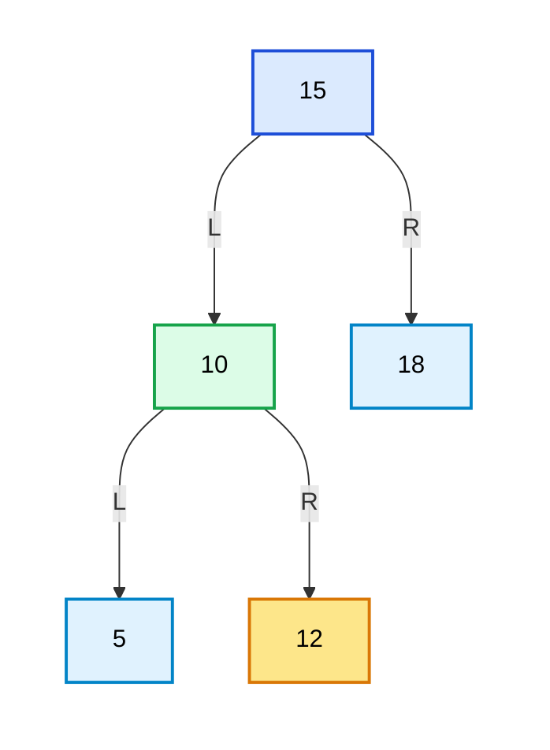
```mermaid
graph TD
	subgraph level0[" "]
		direction LR
		Y["15"]
	end

	subgraph level1[" "]
		direction LR
		X["10"]
		T3["18"]
	end

	subgraph level2[" "]
		direction LR
		T1["5"]
		T2["12"]
	end

	Y -->|L| X
	Y -->|R| T3
	X -->|L| T1
	X -->|R| T2

	classDef center_node fill:#dbeafe,stroke:#1d4ed8,stroke-width:2px,color:#000;
	classDef pivot_node fill:#dcfce7,stroke:#16a34a,stroke-width:2px,color:#000;
	classDef moved_node fill:#fde68a,stroke:#d97706,stroke-width:2px,color:#000;
	classDef normal_node fill:#e0f2fe,stroke:#0284c7,stroke-width:2px,color:#000;

	class Y center_node;
	class X pivot_node;
	class T2 moved_node;
	class T1,T3 normal_node;

	style level0 fill:transparent,stroke:transparent;
	style level1 fill:transparent,stroke:transparent;
	style level2 fill:transparent,stroke:transparent;
```

右旋后：

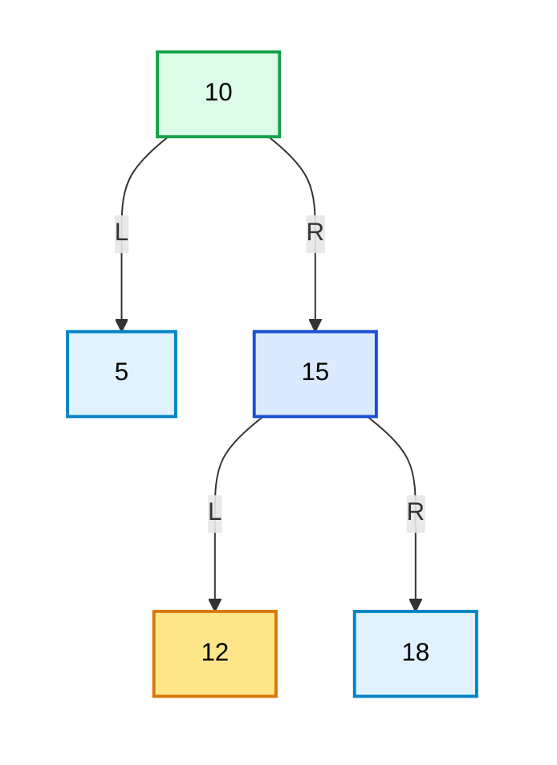
```mermaid
graph TD
	subgraph level0[" "]
		direction LR
		X["10"]
	end

	subgraph level1[" "]
		direction LR
		T1["5"]
		Y["15"]
	end

	subgraph level2[" "]
		direction LR
		T2["12"]
		T3["18"]
	end

	X -->|L| T1
	X -->|R| Y
	Y -->|L| T2
	Y -->|R| T3

	classDef center_node fill:#dbeafe,stroke:#1d4ed8,stroke-width:2px,color:#000;
	classDef pivot_node fill:#dcfce7,stroke:#16a34a,stroke-width:2px,color:#000;
	classDef moved_node fill:#fde68a,stroke:#d97706,stroke-width:2px,color:#000;
	classDef normal_node fill:#e0f2fe,stroke:#0284c7,stroke-width:2px,color:#000;

	class Y center_node;
	class X pivot_node;
	class T2 moved_node;
	class T1,T3 normal_node;

	style level0 fill:transparent,stroke:transparent;
	style level1 fill:transparent,stroke:transparent;
	style level2 fill:transparent,stroke:transparent;
```

这就是右旋的全部结构结果：

- `10` 上移
- `15` 下沉
- `12` 改挂到 `15` 的左边

------

### 5.3.2 右旋时父子关系如何变化

右旋和左旋对称，只需把左右方向互换。

#### 变化前

```text
y.left = x
x.right = T2
```

#### 变化后

```text
x.right = y
y.left = T2
```

如果考虑父指针，还需要：

- `x` 接替 `y` 在原父节点中的位置
- `T2` 若非空，要把父指针改成 `y`

所以右旋的本质是：

| 旋转前               | 旋转后                 |
| -------------------- | ---------------------- |
| `y` 是局部根         | `x` 成为局部根         |
| `x` 是 `y` 的左孩子  | `y` 成为 `x` 的右孩子  |
| `T2` 是 `x` 的右子树 | `T2` 变成 `y` 的左子树 |

------

### 5.3.3 右旋为什么不破坏 BST 性质

右旋前的区间关系是：

```text
T1 < x < T2 < y < T3
```

右旋后，中序顺序仍然是：

```text
T1, x, T2, y, T3
```

所以 BST 性质不变。

这也是为什么右旋虽然看上去在“改树”，但实际上并没有改变键值的有序关系。

------

### 5.3.4 右旋算法说明（成品实现）

前面已经说明了右旋前后的局部结构变化。
如果后续要继续学习红黑树，那么这里只给“局部骨架”仍然是不够的。因为红黑树中的右旋不是孤立动作，而是直接作用于整棵树中的某个节点 `y`。因此，一个真正可用的右旋实现，必须同时覆盖下面几种情况：

1. `y` 可能就是整棵树的根节点
2. `y` 也可能只是某个父节点的左子树根
3. `y` 也可能只是某个父节点的右子树根
4. `y->left` 不能为空，否则右旋无意义
5. `x = y->left` 的右子树 `T2` 可能为空，也可能非空
6. 右旋之后，必须同时维护：
   - 局部子树的新根
   - 原父节点到新子树根的连接
   - `T2` 的重新挂接
   - 所有受影响节点的 `parent` 指针

因此，本节给出的不是教学切片，而是**可直接用于后续红黑树推导的右旋成品实现**。

------

#### 5.3.4.1 右旋覆盖的完整结构场景

设当前右旋点为 `y`，其左孩子为 `x`，并记：

- `P`：`y` 的父节点，可能为空
- `T1`：`x` 的左子树
- `T2`：`x` 的右子树
- `T3`：`y` 的右子树

则右旋前后结构如下。

##### 右旋前

```text
              P
              |
              y
            /   \
           x     T3
         /   \
       T1     T2
```

##### 右旋后

```text
              P
              |
              x
            /   \
           T1    y
                / \
               T2  T3
```

这里真正发生的结构变化只有四件事：

1. `x` 上移，接替 `y` 在原父节点 `P` 中的位置
2. `y` 下沉，变成 `x` 的右孩子
3. `T2` 从 `x` 的右边改挂到 `y` 的左边
4. 所有涉及到的 `parent` 指针都必须同步更新

------

#### 5.3.4.2 右旋的不变量

一个成品级右旋实现，必须保证两个不变量。

##### 第一，不改变 BST 的中序有序性

旋转前后，节点的中序顺序必须保持：

```text
T1, x, T2, y, T3
```

也就是说：

- `T1` 中所有值 `< x`
- `T2` 中所有值 `> x` 且 `< y`
- `T3` 中所有值 `> y`

右旋后只是结构位置变化，没有改变这个区间关系。

##### 第二，旋转后整棵树仍然是连通的

右旋不是只改局部几条指针就结束，它必须保证：

- 原父节点仍然能找到这棵子树
- 新局部根能找到下层
- 下层节点也能通过 `parent` 回到上层

所以，成品右旋同样是“局部变形 + 整树回接”。

------

#### 5.3.4.3 右旋的完整算法步骤

一个完整右旋，必须严格按下面顺序执行。

##### 第一步：确定上移节点 `x`

```text
x = y->left
```

如果 `y == NULL` 或 `y->left == NULL`，直接返回，右旋不成立。

##### 第二步：回接中间子树 `T2`

```text
y->left = x->right
```

如果 `T2` 非空，还要补：

```text
T2->parent = y
```

这一步必须先做。因为如果先让 `y` 下沉，再来处理 `T2`，中间子树容易写丢。

##### 第三步：让 `x` 接替 `y` 原来在父节点中的位置

```text
x->parent = y->parent
```

然后分三种情况讨论：

- 如果 `y` 原来是整棵树根，则 `root = x`
- 如果 `y` 原来是父节点的左孩子，则 `y->parent->left = x`
- 如果 `y` 原来是父节点的右孩子，则 `y->parent->right = x`

##### 第四步：让 `y` 下沉

```text
x->right = y
y->parent = x
```

到这里，右旋完成。

因此，一个真正成品级的右旋，应当记成下面这组完整动作：

```text
1. x = y->left
2. y->left = x->right
3. 若 x->right 非空，则 x->right->parent = y
4. x->parent = y->parent
5. 把 x 接回原父节点，或者更新 root
6. x->right = y
7. y->parent = x
```

这七步，才是后面红黑树推导真正要依赖的右旋算法。

------

### 5.3.5 C 成品实现：右旋

下面给出一份可以直接用于后续红黑树推导的 C 版本右旋。
它不是“局部教学版”，而是**完整版本**。

```c
#include <stdio.h>
#include <stdlib.h>

struct bst_node {
	int key;
	struct bst_node *left;
	struct bst_node *right;
	struct bst_node *parent;
};

/*
 * 成品右旋
 *
 * 参数：
 * root - 整棵树根指针的地址
 * y    - 当前右旋点
 *
 * 说明：
 * 1. 这个版本同时覆盖：
 *    - y 是整棵树根
 *    - y 是父节点的左孩子
 *    - y 是父节点的右孩子
 *
 * 2. 同时维护：
 *    - 根指针
 *    - parent 指针
 *    - 中间子树 T2 的回接
 */
void bst_right_rotate(struct bst_node **root, struct bst_node *y)
{
	struct bst_node *x;

	if (!root || !*root || !y || !y->left)
		return;

	/* x 是上移节点 */
	x = y->left;

	/*
	 * 第一步：把 T2 挂回 y 的左边
	 *
	 * 旋转前：
	 * y->left = x
	 * x->right = T2
	 *
	 * 旋转后：
	 * y->left = T2
	 */
	y->left = x->right;
	if (x->right)
		x->right->parent = y;

	/*
	 * 第二步：让 x 接替 y 原来的位置
	 */
	x->parent = y->parent;

	if (!y->parent) {
		/* y 原来是整棵树根 */
		*root = x;
	} else if (y == y->parent->left) {
		/* y 原来是父节点的左孩子 */
		y->parent->left = x;
	} else {
		/* y 原来是父节点的右孩子 */
		y->parent->right = x;
	}

	/*
	 * 第三步：让 y 下沉为 x 的右孩子
	 */
	x->right = y;
	y->parent = x;
}
```

------

### 5.3.6 C++ 成品实现：右旋

如果后面想用 C++ 自己写一套红黑树练手，那么下面这一版就是对应的 C++ 成品实现。

```cpp
#include <iostream>

struct bst_node {
	int key;
	bst_node *left;
	bst_node *right;
	bst_node *parent;
};

/*
 * 成品右旋（C++ 版）
 *
 * 参数：
 * root - 整棵树根指针的引用
 * y    - 当前右旋点
 */
void bst_right_rotate(bst_node *&root, bst_node *y)
{
	bst_node *x;

	if (!root || !y || !y->left)
		return;

	/* x 是上移节点 */
	x = y->left;

	/* 第一步：回接 T2 */
	y->left = x->right;
	if (x->right)
		x->right->parent = y;

	/* 第二步：让 x 接替 y 原来的位置 */
	x->parent = y->parent;

	if (!y->parent) {
		root = x;
	} else if (y == y->parent->left) {
		y->parent->left = x;
	} else {
		y->parent->right = x;
	}

	/* 第三步：让 y 下沉 */
	x->right = y;
	y->parent = x;
}
```

------

### 5.3.7 C 成品示例：右旋整棵树根

下面先看最简单但仍然是**成品调用方式**的例子：右旋点 `y` 就是整棵树根。

```c
#include <stdio.h>
#include <stdlib.h>

struct bst_node {
	int key;
	struct bst_node *left;
	struct bst_node *right;
	struct bst_node *parent;
};

void bst_right_rotate(struct bst_node **root, struct bst_node *y)
{
	struct bst_node *x;

	if (!root || !*root || !y || !y->left)
		return;

	x = y->left;

	y->left = x->right;
	if (x->right)
		x->right->parent = y;

	x->parent = y->parent;

	if (!y->parent)
		*root = x;
	else if (y == y->parent->left)
		y->parent->left = x;
	else
		y->parent->right = x;

	x->right = y;
	y->parent = x;
}

void inorder_print(const struct bst_node *root)
{
	if (!root)
		return;

	inorder_print(root->left);
	printf("%d ", root->key);
	inorder_print(root->right);
}

int main(void)
{
	/*
	 * 构造：
	 *        15
	 *       /  \
	 *      10   18
	 *     /  \
	 *    5   12
	 */
	struct bst_node n5  = { 5,  NULL, NULL, NULL };
	struct bst_node n12 = { 12, NULL, NULL, NULL };
	struct bst_node n18 = { 18, NULL, NULL, NULL };
	struct bst_node n10 = { 10, &n5, &n12, NULL };
	struct bst_node n15 = { 15, &n10, &n18, NULL };

	struct bst_node *root = &n15;

	n5.parent = &n10;
	n12.parent = &n10;
	n18.parent = &n15;
	n10.parent = &n15;

	printf("右旋前中序: ");
	inorder_print(root);
	printf("\n");

	bst_right_rotate(&root, &n15);

	printf("右旋后中序: ");
	inorder_print(root);
	printf("\n");

	printf("右旋后根节点: %d\n", root->key);

	return 0;
}
```

运行后应看到：

```text
右旋前中序: 5 10 12 15 18
右旋后中序: 5 10 12 15 18
右旋后根节点: 10
```

这个例子说明：

- 成品右旋能够处理“`y` 就是整棵树根”
- 中序不变
- 根正确更新

------

### 5.3.8 C 成品示例：右旋子树根节点

下面给出更重要的例子：右旋点 `y` 不是整棵树根，而是**整棵树内部某个子树的根**。这才更接近后面红黑树修复时的真实情况。

```c
#include <stdio.h>
#include <stdlib.h>

struct bst_node {
	int key;
	struct bst_node *left;
	struct bst_node *right;
	struct bst_node *parent;
};

void bst_right_rotate(struct bst_node **root, struct bst_node *y)
{
	struct bst_node *x;

	if (!root || !*root || !y || !y->left)
		return;

	x = y->left;

	y->left = x->right;
	if (x->right)
		x->right->parent = y;

	x->parent = y->parent;

	if (!y->parent)
		*root = x;
	else if (y == y->parent->left)
		y->parent->left = x;
	else
		y->parent->right = x;

	x->right = y;
	y->parent = x;
}

void inorder_print(const struct bst_node *root)
{
	if (!root)
		return;

	inorder_print(root->left);
	printf("%d ", root->key);
	inorder_print(root->right);
}

static void print_node(const char *name, const struct bst_node *node)
{
	if (!node) {
		printf("%s: NULL\n", name);
		return;
	}

	printf("%s: key=%d", name, node->key);
	if (node->parent)
		printf(", parent=%d\n", node->parent->key);
	else
		printf(", parent=NULL\n");
}

int main(void)
{
	/*
	 * 构造：
	 *           20
	 *          /  \
	 *        15    30
	 *       /  \
	 *     10   18
	 *    /  \
	 *   5   12
	 */
	struct bst_node n5  = { 5,  NULL, NULL, NULL };
	struct bst_node n12 = { 12, NULL, NULL, NULL };
	struct bst_node n10 = { 10, &n5, &n12, NULL };
	struct bst_node n18 = { 18, NULL, NULL, NULL };
	struct bst_node n15 = { 15, &n10, &n18, NULL };
	struct bst_node n30 = { 30, NULL, NULL, NULL };
	struct bst_node n20 = { 20, &n15, &n30, NULL };

	n5.parent = &n10;
	n12.parent = &n10;
	n10.parent = &n15;
	n18.parent = &n15;
	n15.parent = &n20;
	n30.parent = &n20;

	{
		struct bst_node *root = &n20;

		printf("右旋前中序: ");
		inorder_print(root);
		printf("\n");

		/* 对内部节点 15 右旋 */
		bst_right_rotate(&root, &n15);

		printf("右旋后中序: ");
		inorder_print(root);
		printf("\n");

		print_node("root", root);
		print_node("root->left", root->left);
		print_node("root->left->left", root->left->left);
		print_node("root->left->right", root->left->right);
	}

	return 0;
}
```

这个例子右旋的是 `15`，不是 `20`。
所以它验证的是：

- 右旋点是内部子树根时，父节点回接是否正确
- `20->left` 是否从 `15` 正确变成 `10`
- `12` 是否正确回接到 `15->left`

这才是后面推红黑树时最有用的示例。

------

### 5.3.9 右旋代码中需要强记的三组逻辑

后面复习时，不要再记“右旋图长什么样”，而要直接强记下面三组代码逻辑。

#### 第一组：上移节点与中间子树回接

```c
x = y->left;
y->left = x->right;
if (x->right)
	x->right->parent = y;
```

#### 第二组：新局部根接回原父节点

```c
x->parent = y->parent;

if (!y->parent)
	*root = x;
else if (y == y->parent->left)
	y->parent->left = x;
else
	y->parent->right = x;
```

#### 第三组：旧局部根下沉

```c
x->right = y;
y->parent = x;
```

把这三组逻辑背熟，你后面再看红黑树里的右旋，就不会再觉得它只是“某个 case 附带的一步操作”，而会知道：

> **右旋本身也是一个独立、完整、可复用的成品级局部重排算法。**

------

### 5.3.10 本小节小结

右旋这一节，最终要记住的不是某一张图，而是下面这两层内容。

#### 第一层：算法本质

右旋的本质是：

- 让左孩子上移
- 让当前节点下沉
- 让中间子树 `T2` 改挂到新的合法位置

#### 第二层：成品实现骨架

一个可以直接用于红黑树推导的右旋，必须完整包含：

```text
1. x = y->left
2. y->left = x->right
3. 若 x->right 非空，则修 x->right->parent
4. 让 x 接替 y 在原父节点中的位置
5. 让 y 下沉为 x 的右孩子
6. 修 y->parent
7. 必要时更新 root
```

因此，右旋真正值得建立的能力不是“看懂图”，而是：

> **看到一个局部结构时，能把它准确翻译成指针修改顺序，并写成覆盖根节点、子树根节点、父子回接和中间子树回接的完整代码。**

---

## 5.4 Linux 内核视角：左右旋在内核中是如何组织的

### 5.4.0 本节参照的源码文件

本节以 **Linux 5.15** 和 **Linux 6.1** 为参照。就 rbtree 的旋转组织方式而言，这两个版本的关键文件与职责基本一致，后文所说的实现结构可以直接对应到下面这些源码文件：([GitHub](https://raw.githubusercontent.com/torvalds/linux/v6.1/Documentation/core-api/rbtree.rst))

1. `lib/rbtree.c`
   红黑树插入修复、删除修复、旋转公共收尾逻辑都在这里。`__rb_insert()`、`____rb_erase_color()`、`__rb_rotate_set_parents()`、`rb_insert_color()`、`rb_erase()` 都属于这个文件的核心内容。([GitHub](https://raw.githubusercontent.com/torvalds/linux/v6.1/lib/rbtree.c))
2. `include/linux/rbtree.h`
   对外基础接口在这里声明，例如 `rb_insert_color()`、`rb_erase()`，以及 `rb_link_node()`、`rb_replace_node()`、`rb_first()`、`rb_next()` 等基础辅助接口。([GitHub](https://raw.githubusercontent.com/torvalds/linux/v6.1/include/linux/rbtree.h))
3. `include/linux/rbtree_augmented.h`
   增强红黑树接口和回调结构在这里定义，例如 `struct rb_augment_callbacks`、`rb_insert_augmented()` 等。这个文件同时也明确说明：只有增强树相关回调结构和接口是给使用者依赖的，其余很多内容是实现细节。([GitHub](https://raw.githubusercontent.com/torvalds/linux/v6.1/include/linux/rbtree_augmented.h))
4. `Documentation/core-api/rbtree.rst`
   这是内核 rbtree 的文档源文件，对应生成文档页面 `core-api/rbtree.html`。它说明了用户如何搜索、插入、删除、遍历，以及增强红黑树如何使用。([GitHub](https://raw.githubusercontent.com/torvalds/linux/v6.1/Documentation/core-api/rbtree.rst))

后面本节里出现的“源码骨架”都以这些文件为参照，重点是帮助你把前面学到的 **教学版左旋 / 右旋**，和内核里的**工程版 case 展开实现**对应起来，而不是逐字复刻整段源码。([GitHub](https://raw.githubusercontent.com/torvalds/linux/v6.1/lib/rbtree.c))

------

### 5.4.1 对外接口层：调用者通常看不到“左旋 / 右旋”

从 Linux 内核对外提供的 rbtree 使用方式来看，调用者通常不会直接调用“左旋函数”或“右旋函数”。标准流程是：

1. 先由调用者自己按 BST 规则查找插入位置，再用 `rb_link_node()` 把节点接到树上，随后调用 `rb_insert_color()` 做插入后的红黑修复；
2. 删除时则调用 `rb_erase()`。
3. 因此，从使用者视角看，左右旋不是公开 API，而是被封装在插入 / 删除修复流程内部。6.1 文档对 rbtree 的基本使用方式也是这样描述的。([GitHub](https://raw.githubusercontent.com/torvalds/linux/v6.1/include/linux/rbtree.h))

这说明内核对外暴露的是“**怎么把节点接上树并完成修复**”，而不是“**请你自己决定什么时候做左旋、什么时候做右旋**”。也就是说，左右旋在内核里首先是一种**内部实现动作**，而不是用户直接编排的公共算法接口。([GitHub](https://raw.githubusercontent.com/torvalds/linux/v6.1/include/linux/rbtree.h))

------

### 5.4.2 使用者负责什么，rbtree 代码又负责什么

`Documentation/core-api/rbtree.rst` 以及 6.1 文档都强调了一点：Linux 的 rbtree 实现采用的是**嵌入式节点设计**，`struct rb_node` 被嵌入到用户自己的数据结构中；同时，内核也不提供比较函数回调，用户必须自己写查找和插入路径逻辑。也就是说，**往左走还是往右走**，是调用者自己决定的；而**接上树后如何保持红黑性质**，则由 rbtree 基础设施负责。([GitHub](https://raw.githubusercontent.com/torvalds/linux/v6.1/Documentation/core-api/rbtree.rst))

因此，从职责划分上看：

- **调用者负责**：比较、BST 路径搜索、并发锁保护、业务数据结构组织。
- **rbtree 负责**：`rb_link_node()` 接点、`rb_insert_color()` 插入修复、`rb_erase()` 删除修复，以及遍历与替换等基础树操作。([GitHub](https://raw.githubusercontent.com/torvalds/linux/v6.1/include/linux/rbtree.h))

这和很多教学版红黑树有明显差别。教学版通常把“比较、插入、旋转、修复”都写在一个类里，而 Linux 内核把“BST 决策”和“红黑修复”拆开了。这样做更符合内核通用容器的定位。([GitHub](https://raw.githubusercontent.com/torvalds/linux/v6.1/Documentation/core-api/rbtree.rst))

------

### 5.4.3 内核内部：左右旋没有被做成一个统一公开旋转函数

如果继续往 `lib/rbtree.c` 里看，会发现内核内部**并没有把左旋和右旋彻底包装成一个对使用者公开的统一“旋转总函数”**。当前 5.15 / 6.1 实现里，确实抽取出了一部分公共收尾逻辑，例如 `__rb_rotate_set_parents()`，它专门处理旋转之后“局部新根怎么继承父节点和颜色、旧局部根怎么重新标记、整棵树怎么接回去”的公共部分。([GitHub](https://raw.githubusercontent.com/torvalds/linux/v6.1/lib/rbtree.c))

但真正的左右旋指针改接动作，并没有完全隐藏到一个 `rotate(dir, ...)` 的统一总入口里。相反，插入修复的 `__rb_insert()` 和删除修复的 `____rb_erase_color()` 中，左右镜像场景都是**按 case 直接展开**的。源码注释会直接写出`left rotate at parent`、`right rotate at gparent`、`left rotate at sibling`这类语义。也就是说，**内核内部当然在做左旋和右旋，但它们是被嵌在具体修复 case 中的，而不是先抽成一个教学式的完整旋转 API 再由上层调用**。([GitHub](https://raw.githubusercontent.com/torvalds/linux/v6.1/lib/rbtree.c))

------

### 5.4.4 `__rb_rotate_set_parents()`：内核抽出来的公共收尾逻辑

下面给出一个**按源码结构整理**的关键实现骨架。它不是逐字抄录，而是把 5.15 / 6.1 中这一 helper 的职责直接提炼出来：

```c
static inline void __rb_rotate_set_parents(old, new, root, color)
{
	parent = rb_parent(old);

	new->__rb_parent_color = old->__rb_parent_color;
	rb_set_parent_color(old, new, color);
	__rb_change_child(old, new, parent, root);
}
```

这段骨架表达的意思是：

1. `new` 继承 `old` 原来的父节点和颜色域
2. `old` 的父节点改成 `new`，并被赋予新的颜色
3. 原来指向 `old` 的位置，统一改为指向 `new`

也就是说，内核抽出来的是“**旋转后的父节点 / 颜色公共收尾**”，不是“完整左旋”也不是“完整右旋”。左右旋本体仍然散落在插入 / 删除修复的具体 case 中。5.15 和 6.1 在这里的结构是一致的。([GitHub](https://raw.githubusercontent.com/torvalds/linux/v6.1/lib/rbtree.c))

------

### 5.4.5 插入修复中的旋转：直接写在 `__rb_insert()` 的 case 里

内核插入修复不是“先判断完，再调用一个公开 `left_rotate()` / `right_rotate()` 函数”，而是直接在 `__rb_insert()` 的 case 中把旋转动作展开写出来。

#### 1）Case 2：先在 parent 上做局部旋转

以“父节点是祖父左孩子”的分支为例，当新节点位于 `parent` 的右边时，源码注释会直接写出“**left rotate at parent**”。它的核心动作可以整理成下面这种骨架：

```c
tmp = node->rb_left;

WRITE_ONCE(parent->rb_right, tmp);
WRITE_ONCE(node->rb_left, parent);

if (tmp)
	rb_set_parent_color(tmp, parent, RB_BLACK);

rb_set_parent_color(parent, node, RB_RED);
augment_rotate(parent, node);

parent = node;
tmp = node->rb_right;
```

你可以把它和前面学到的教学版左旋直接对照：

- `node` 这里扮演上移节点
- `parent` 这里是下沉节点
- `tmp` 这里就是中间子树 `T2`

差别只在于：内核把这段动作直接嵌在 Case 2 里，没有包装成一个独立对外函数。([GitHub](https://raw.githubusercontent.com/torvalds/linux/v6.1/lib/rbtree.c))

#### 2）Case 3：再在 gparent 上做局部旋转并收尾

紧接着，源码注释会写“**right rotate at gparent**”。其核心动作可以整理成：

```c
WRITE_ONCE(gparent->rb_left, tmp);      /* tmp == parent->rb_right */
WRITE_ONCE(parent->rb_right, gparent);

if (tmp)
	rb_set_parent_color(tmp, gparent, RB_BLACK);

__rb_rotate_set_parents(gparent, parent, root, RB_RED);
augment_rotate(gparent, parent);
```

这里的逻辑和你前面学的“双旋分两步完成”完全一致：

- Case 2 先把“内侧”结构转成“外侧”
- Case 3 再在 `gparent` 上完成最终旋转与收尾

镜像分支则反过来：

- 先“right rotate at parent”
- 再“left rotate at gparent” ([GitHub](https://raw.githubusercontent.com/torvalds/linux/v6.1/lib/rbtree.c))

------

### 5.4.6 删除修复中的旋转：直接写在 `____rb_erase_color()` 的 case 里

删除修复同样不是通过一个“公开右旋 / 左旋 API”来组织，而是直接在 `____rb_erase_color()` 的四类 case 中展开。

#### 1）Case 1：兄弟为红，先围绕 parent 旋转

当当前节点在左侧、兄弟在右侧且兄弟为红时，源码注释会直接写“**Case 1 - left rotate at parent**”。其关键动作可以整理为：

```c
tmp1 = sibling->rb_left;

WRITE_ONCE(parent->rb_right, tmp1);
WRITE_ONCE(sibling->rb_left, parent);

rb_set_parent_color(tmp1, parent, RB_BLACK);
__rb_rotate_set_parents(parent, sibling, root, RB_RED);
augment_rotate(parent, sibling);

sibling = tmp1;
```

这一步的作用不是直接修复结束，而是先把红兄弟提上来，把结构改造成后续 case 容易处理的形态。镜像分支则是“**right rotate at parent**”。([GitHub](https://raw.githubusercontent.com/torvalds/linux/v6.1/lib/rbtree.c))

#### 2）Case 3：先在 sibling 上旋转，把近侄红转换成远侄红

删除修复里最典型的“先变形、再终结”动作，就是 Case 3。源码注释会写“**right rotate at sibling**”或镜像的“**left rotate at sibling**”。其骨架整理如下：

```c
tmp1 = tmp2->rb_right;

WRITE_ONCE(sibling->rb_left, tmp1);
WRITE_ONCE(tmp2->rb_right, sibling);
WRITE_ONCE(parent->rb_right, tmp2);

if (tmp1)
	rb_set_parent_color(tmp1, sibling, RB_BLACK);

augment_rotate(sibling, tmp2);

tmp1 = sibling;
sibling = tmp2;
```

它的作用不是“修复结束”，而是：

```text
先把“近侄红”结构转成“远侄红”结构
```

这和教学版红黑树删除里“Case 3 只是为 Case 4 做准备”的理解是一一对应的。([GitHub](https://raw.githubusercontent.com/torvalds/linux/v6.1/lib/rbtree.c))

#### 3）Case 4：最后围绕 parent 旋转并做颜色翻转

Case 4 是删除修复的最终收尾场景。源码注释会写“**left rotate at parent + color flips**”或镜像的“**right rotate at parent + color flips**”。其骨架整理如下：

```c
tmp2 = sibling->rb_left;

WRITE_ONCE(parent->rb_right, tmp2);
WRITE_ONCE(sibling->rb_left, parent);

rb_set_parent_color(tmp1, sibling, RB_BLACK);
if (tmp2)
	rb_set_parent(tmp2, parent);

__rb_rotate_set_parents(parent, sibling, root, RB_BLACK);
augment_rotate(parent, sibling);
break;
```

这一段非常适合和你前面学到的“删除修复最终通过一次旋转 + 颜色调整恢复黑高”对照起来看。5.15 / 6.1 在这里的组织方式也是一致的。([GitHub](https://raw.githubusercontent.com/torvalds/linux/v6.1/lib/rbtree.c))

------

### 5.4.7 内核版与教学版的差别到底在哪里

如果把前面学的“成品左旋 / 成品右旋”与内核版对照起来，差别主要不在**结构语义**，而在**组织方式**。

#### 教学版

教学版通常写成：

```c
left_rotate(root, x);
right_rotate(root, y);
```

优点是：

- 左旋 / 右旋骨架清楚
- 便于先学结构本体
- 便于独立验证算法正确性

#### 内核版

内核版更像这样：

```text
在 __rb_insert() / ____rb_erase_color() 的具体 case 中，
直接把旋转涉及的指针改接写出来，
然后调用 __rb_rotate_set_parents() 做公共收尾
```

优点是：

- case 与具体修复逻辑贴得更近
- 左右镜像分支可以就地展开
- 便于内联和低开销实现
- 增强树回调 `augment_rotate()` 能直接跟在旋转点之后执行 ([GitHub](https://raw.githubusercontent.com/torvalds/linux/v6.1/lib/rbtree.c))

所以你后面看内核 rbtree 源码时，最重要的不是找一个“完整 `left_rotate()` 函数”，而是要能识别：

- 这里正在做的是不是左旋
- 那里正在做的是不是右旋
- 当前这一段是插入修复的 Case 2 / 3，还是删除修复的 Case 1 / 3 / 4
- `__rb_rotate_set_parents()` 为什么恰好出现在这里

这些识别能力，才是从教学版过渡到内核版的关键。([GitHub](https://raw.githubusercontent.com/torvalds/linux/v6.1/lib/rbtree.c))

------

### 5.4.8 增强树视角：为什么还要看 `include/linux/rbtree_augmented.h`

如果只看普通 rbtree，用 `include/linux/rbtree.h` 和 `lib/rbtree.c` 已经足够。但如果你要理解：

- 为什么内核在旋转点旁边会出现 `augment_rotate(old, new)`
- 为什么增强红黑树要求用户提供 `rotate` 回调
- 为什么增强信息能在旋转后保持正确

那就必须看 `include/linux/rbtree_augmented.h` 和文档中的增强树部分。这个头文件明确说明：对增强红黑树而言，用户需要提供 `struct rb_augment_callbacks`，其中就包括 `rotate(old, new)` 回调；文档也明确说，增强红黑树在插入 / 删除重平衡时会回调用户函数来更新受影响子树的增强信息。([GitHub](https://raw.githubusercontent.com/torvalds/linux/v6.1/include/linux/rbtree_augmented.h))

因此，`augment_rotate(parent, node)` 这一类调用不是多余装饰，而是增强树实现中“**旋转之后顺便更新增强数据**”的关键钩子。这也是为什么 `include/linux/rbtree_augmented.h` 也是本节必须列出的参考文件之一。([GitHub](https://raw.githubusercontent.com/torvalds/linux/v6.1/include/linux/rbtree_augmented.h))

------

### 5.4.9 内核实现还有一个额外约束：`WRITE_ONCE()`

当前 5.15 / 6.1 的 `lib/rbtree.c` 在开头都专门说明了一个点：

- 对树结构字段 `rb_left` 和 `rb_right` 的写入必须使用 `WRITE_ONCE()`
- 并且不能在程序顺序上形成临时环路

这是为了支持 **lockless lookups**：无锁遍历即使看到的是旋转中的中间态，也不能因为临时环而卡死，也不能看到完全无效的结构。这个要求和教学版旋转代码的关注点不同：教学版关心“旋转逻辑是否正确”，而内核版还要额外关心“并发下无锁遍历看到的中间态不能形成结构性灾难”。([GitHub](https://raw.githubusercontent.com/torvalds/linux/v6.1/lib/rbtree.c))

因此，内核版旋转的关注点不只是：

```text
旋转逻辑对不对
```

还包括：

```text
并发下中间态能不能保证遍历不会形成结构性灾难
```

这也是为什么你在内核源码里看到很多左右孩子写入都用了 `WRITE_ONCE()`，而不是普通赋值。([GitHub](https://raw.githubusercontent.com/torvalds/linux/v6.1/lib/rbtree.c))

------

### 5.4.10 本节小结

Linux 5.15 / 6.1 的 rbtree 在旋转组织上，可以总结为下面四点：

1. **对外接口层**：调用者通常只看到 `rb_link_node()`、`rb_insert_color()`、`rb_erase()`，看不到单独公开的左旋 / 右旋接口。([GitHub](https://raw.githubusercontent.com/torvalds/linux/v6.1/include/linux/rbtree.h))
2. **对内实现层**：左右旋仍然明确存在，但它们被直接嵌在 `__rb_insert()` 和 `____rb_erase_color()` 的具体修复 case 中，只把父节点 / 颜色收尾提炼成 `__rb_rotate_set_parents()`。([GitHub](https://raw.githubusercontent.com/torvalds/linux/v6.1/lib/rbtree.c))
3. **增强树层**：若使用增强红黑树，则 `include/linux/rbtree_augmented.h` 中定义的回调机制会让旋转动作顺便触发增强信息更新。([GitHub](https://raw.githubusercontent.com/torvalds/linux/v6.1/include/linux/rbtree_augmented.h))
4. **工程约束层**：当前源码额外考虑了 lockless lookup 场景，因此对 `rb_left` / `rb_right` 的写入强调 `WRITE_ONCE()`，这使得内核版旋转比教学版更偏工程实现。([GitHub](https://raw.githubusercontent.com/torvalds/linux/v6.1/lib/rbtree.c))

因此，学习内核 rbtree 时，正确的关注点不是：

> “内核有没有一个漂亮的 `left_rotate()` / `right_rotate()` 公开函数？”

而是：

> “我能不能在 `__rb_insert()` 和 `____rb_erase_color()` 的 case 展开代码里，识别出这一步本质上是在做左旋还是右旋？” ([GitHub](https://raw.githubusercontent.com/torvalds/linux/v6.1/lib/rbtree.c))

这才是把教学版红黑树真正过渡到 Linux 内核实现版红黑树的关键。

---

## 5.5 四类失衡结构与组合旋转

### 5.5.0 章节内容说明

前面已经分别讨论了：

- 左旋
- 右旋
- 它们为什么不破坏 BST 有序性
- 它们在内核中的真实组织方式

但如果后面要继续进入：

- AVL 的失衡修复
- 红黑树插入 / 删除修复
- Linux 内核 rbtree 源码理解

那么只会“左旋一次、右旋一次”还不够。
因为真正的修复问题不是“会不会某个旋转动作”，而是：

> **当前局部结构到底属于哪一种失衡类型，以及应该选用单旋还是双旋。**

这一节要解决的就是这个问题。

本节统一使用一组有语义的节点命名：

- `g`：当前失衡子树根
- `p`：`g` 的较高孩子
- `n`：`p` 的较高孩子
- `T1 ~ T4`：保持 BST 区间关系的四棵子树

这样做的目的是把：

- Mermaid 图
- 文字描述
- 判定规则
- 代码实现

统一到同一套命名体系里，避免阅读时不断做映射转换。

------

### 5.5.1 四类失衡结构总览

**平衡树插入后，影响会沿祖先路径上传；但不会扩散到整棵树。真正需要旋转的节点范围通常很小。**

**AVL 插入：会上传，但通常只需要一次局部修复；**

当一棵平衡搜索树在某个局部子树根 `g` 上发生失衡时，继续往下看两层，最多会落入四种典型结构：

- LL
- LR
- RR
- RL

设：

- `p` 是 `g` 的关键孩子
- `n` 是 `p` 的关键孩子

则四类结构的统一判定规则如下：

| 类型 | 判定条件                           | 修复方式                     |
| ---- | ---------------------------------- | ---------------------------- |
| LL   | `p == g->left` 且 `n == p->left`   | 对 `g` 做一次右旋            |
| LR   | `p == g->left` 且 `n == p->right`  | 先对 `p` 左旋，再对 `g` 右旋 |
| RR   | `p == g->right` 且 `n == p->right` | 对 `g` 做一次左旋            |
| RL   | `p == g->right` 且 `n == p->left`  | 先对 `p` 右旋，再对 `g` 左旋 |

这张表非常重要。
因为它把“图示直觉”转化成了“代码里的可判定条件”。

也就是说，后面真正进入算法时，不应该再靠“看起来像不像 LR”，而应该严格按下面两步判断：

1. `p` 在 `g` 的哪一侧
2. `n` 在 `p` 的哪一侧

于是：

- 左-左，就是 LL
- 左-右，就是 LR
- 右-右，就是 RR
- 右-左，就是 RL

------

### 5.5.2 LL：外侧失衡，单右旋

LL 的含义是：

```text
p == g->left
n == p->left
```

也就是：

- `p` 在 `g` 的左边
- `n` 在 `p` 的左边

这是典型的“左侧的左侧过重”。

#### LL 初始结构

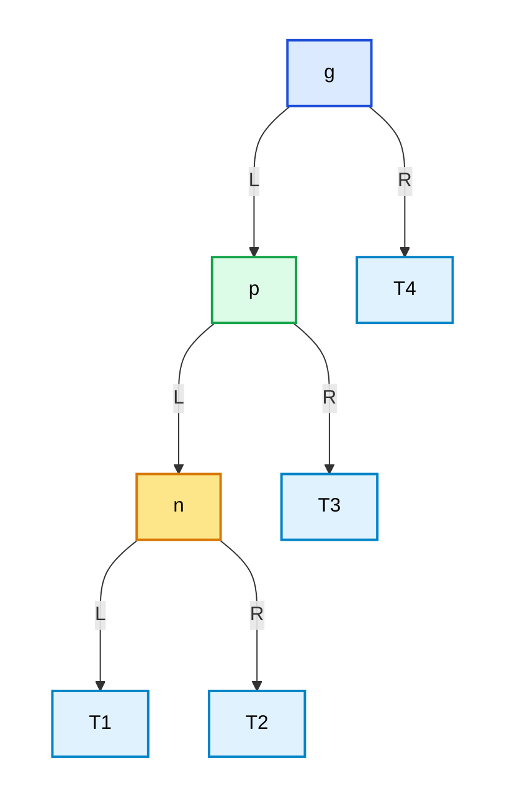
```mermaid
graph TD
	subgraph level0[" "]
		direction LR
		g["g"]
	end

	subgraph level1[" "]
		direction LR
		p["p"]
		T4["T4"]
	end

	subgraph level2[" "]
		direction LR
		n["n"]
		T3["T3"]
	end

	subgraph level3[" "]
		direction LR
		T1["T1"]
		T2["T2"]
	end

	g -->|L| p
	g -->|R| T4
	p -->|L| n
	p -->|R| T3
	n -->|L| T1
	n -->|R| T2

	classDef root_node fill:#dbeafe,stroke:#1d4ed8,stroke-width:2px,color:#000;
	classDef pivot_node fill:#dcfce7,stroke:#16a34a,stroke-width:2px,color:#000;
	classDef focus_node fill:#fde68a,stroke:#d97706,stroke-width:2px,color:#000;
	classDef normal_node fill:#e0f2fe,stroke:#0284c7,stroke-width:2px,color:#000;

	class g root_node;
	class p pivot_node;
	class n focus_node;
	class T1,T2,T3,T4 normal_node;

	style level0 fill:transparent,stroke:transparent;
	style level1 fill:transparent,stroke:transparent;
	style level2 fill:transparent,stroke:transparent;
	style level3 fill:transparent,stroke:transparent;
```

LL 的修复不需要双旋。
因为失衡已经发生在“外侧”，一次标准右旋就足够。

#### LL 修复后

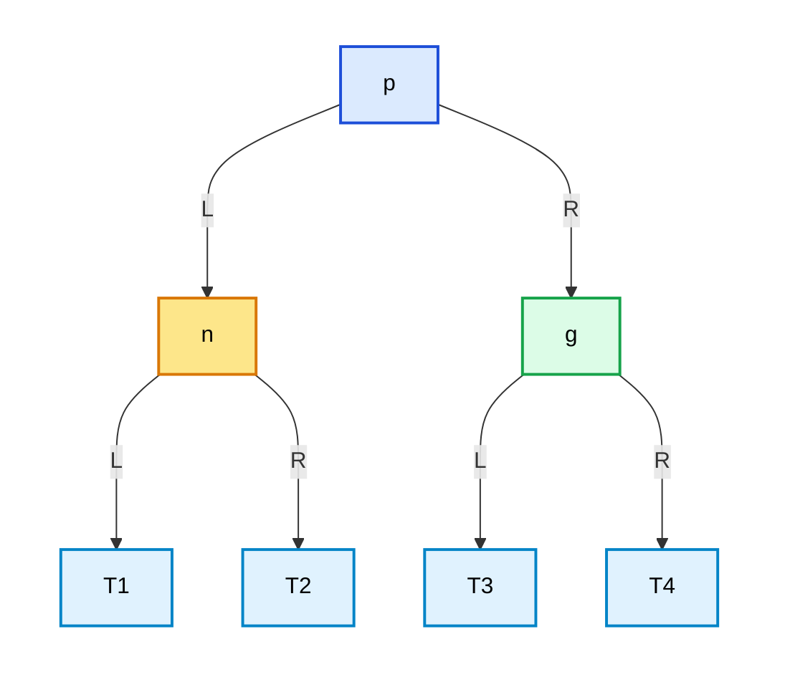
```mermaid
graph TD
	subgraph level0[" "]
		direction LR
		p["p"]
	end

	subgraph level1[" "]
		direction LR
		n["n"]
		g["g"]
	end

	subgraph level2[" "]
		direction LR
		T1["T1"]
		T2["T2"]
		T3["T3"]
		T4["T4"]
	end

	p -->|L| n
	p -->|R| g
	n -->|L| T1
	n -->|R| T2
	g -->|L| T3
	g -->|R| T4

	classDef root_node fill:#dbeafe,stroke:#1d4ed8,stroke-width:2px,color:#000;
	classDef pivot_node fill:#dcfce7,stroke:#16a34a,stroke-width:2px,color:#000;
	classDef focus_node fill:#fde68a,stroke:#d97706,stroke-width:2px,color:#000;
	classDef normal_node fill:#e0f2fe,stroke:#0284c7,stroke-width:2px,color:#000;

	class p root_node;
	class g pivot_node;
	class n focus_node;
	class T1,T2,T3,T4 normal_node;

	style level0 fill:transparent,stroke:transparent;
	style level1 fill:transparent,stroke:transparent;
	style level2 fill:transparent,stroke:transparent;
```

所以 LL 的本质是：

> **外侧失衡，直接一次右旋。**

------

### 5.5.3 RR：外侧失衡，单左旋

RR 的含义是：

```text
p == g->right
n == p->right
```

也就是：

- `p` 在 `g` 的右边
- `n` 在 `p` 的右边

这是典型的“右侧的右侧过重”。

#### RR 初始结构

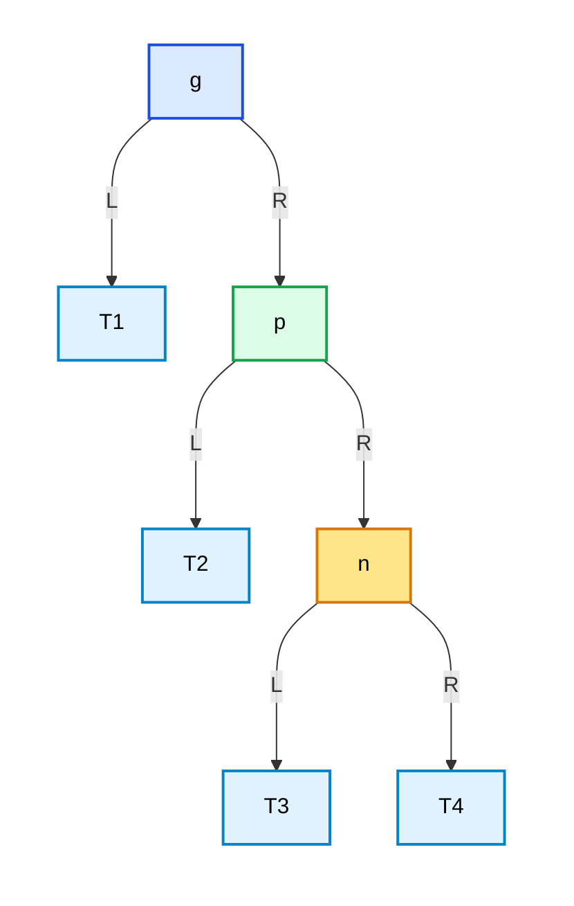
```mermaid
graph TD
	subgraph level0[" "]
		direction LR
		g["g"]
	end

	subgraph level1[" "]
		direction LR
		T1["T1"]
		p["p"]
	end

	subgraph level2[" "]
		direction LR
		T2["T2"]
		n["n"]
	end

	subgraph level3[" "]
		direction LR
		T3["T3"]
		T4["T4"]
	end

	g -->|L| T1
	g -->|R| p
	p -->|L| T2
	p -->|R| n
	n -->|L| T3
	n -->|R| T4

	classDef root_node fill:#dbeafe,stroke:#1d4ed8,stroke-width:2px,color:#000;
	classDef pivot_node fill:#dcfce7,stroke:#16a34a,stroke-width:2px,color:#000;
	classDef focus_node fill:#fde68a,stroke:#d97706,stroke-width:2px,color:#000;
	classDef normal_node fill:#e0f2fe,stroke:#0284c7,stroke-width:2px,color:#000;

	class g root_node;
	class p pivot_node;
	class n focus_node;
	class T1,T2,T3,T4 normal_node;

	style level0 fill:transparent,stroke:transparent;
	style level1 fill:transparent,stroke:transparent;
	style level2 fill:transparent,stroke:transparent;
	style level3 fill:transparent,stroke:transparent;
```

RR 同样不需要双旋。
因为失衡发生在“外侧”，一次标准左旋就足够。

#### RR 修复后

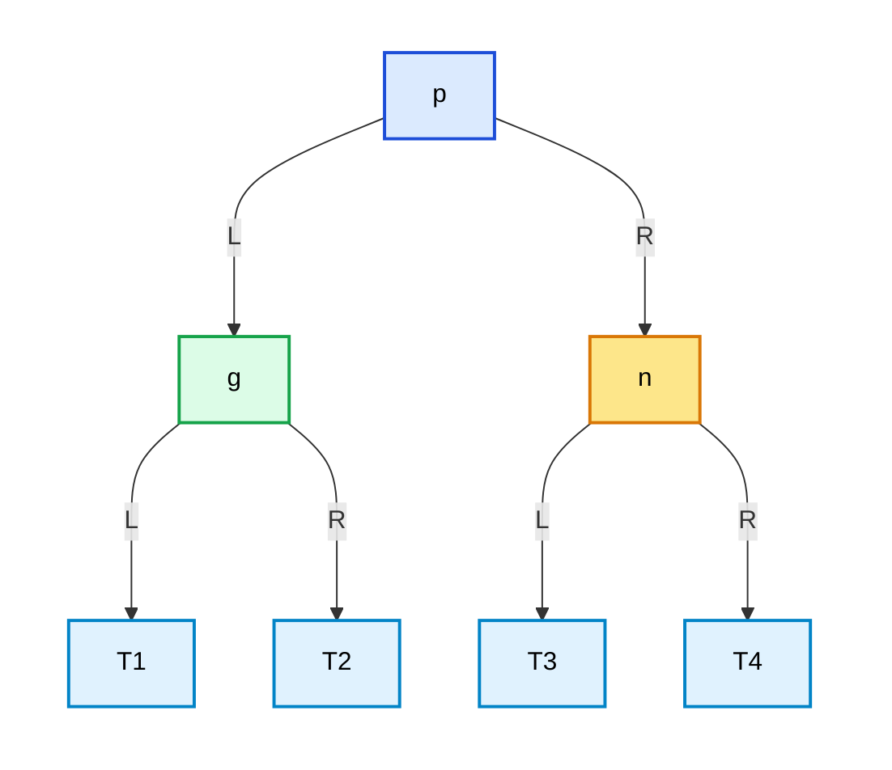
```mermaid
graph TD
	subgraph level0[" "]
		direction LR
		p["p"]
	end

	subgraph level1[" "]
		direction LR
		g["g"]
		n["n"]
	end

	subgraph level2[" "]
		direction LR
		T1["T1"]
		T2["T2"]
		T3["T3"]
		T4["T4"]
	end

	p -->|L| g
	p -->|R| n
	g -->|L| T1
	g -->|R| T2
	n -->|L| T3
	n -->|R| T4

	classDef root_node fill:#dbeafe,stroke:#1d4ed8,stroke-width:2px,color:#000;
	classDef pivot_node fill:#dcfce7,stroke:#16a34a,stroke-width:2px,color:#000;
	classDef focus_node fill:#fde68a,stroke:#d97706,stroke-width:2px,color:#000;
	classDef normal_node fill:#e0f2fe,stroke:#0284c7,stroke-width:2px,color:#000;

	class p root_node;
	class g pivot_node;
	class n focus_node;
	class T1,T2,T3,T4 normal_node;

	style level0 fill:transparent,stroke:transparent;
	style level1 fill:transparent,stroke:transparent;
	style level2 fill:transparent,stroke:transparent;
```

所以 RR 的本质是：

> **外侧失衡，直接一次左旋。**

------

### 5.5.4 LR：内侧失衡，先左后右

LR 的含义是：

```text
p == g->left
n == p->right
```

也就是：

- `p` 在 `g` 的左边
- `n` 在 `p` 的右边

这不是外侧失衡，而是**内侧失衡**。

#### LR 初始结构

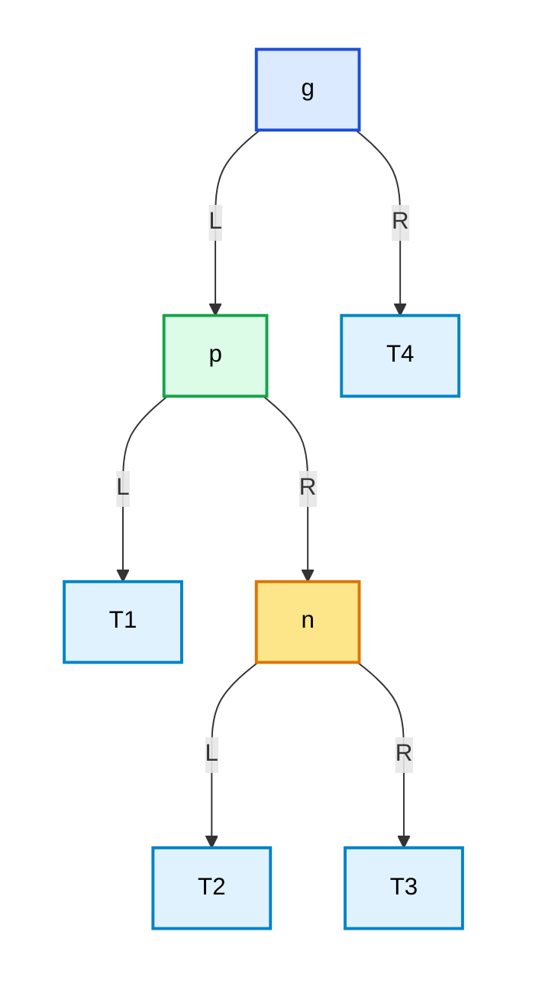
```mermaid
graph TD
	subgraph level0[" "]
		direction LR
		g["g"]
	end

	subgraph level1[" "]
		direction LR
		p["p"]
		T4["T4"]
	end

	subgraph level2[" "]
		direction LR
		T1["T1"]
		n["n"]
	end

	subgraph level3[" "]
		direction LR
		T2["T2"]
		T3["T3"]
	end

	g -->|L| p
	g -->|R| T4
	p -->|L| T1
	p -->|R| n
	n -->|L| T2
	n -->|R| T3

	classDef root_node fill:#dbeafe,stroke:#1d4ed8,stroke-width:2px,color:#000;
	classDef pivot_node fill:#dcfce7,stroke:#16a34a,stroke-width:2px,color:#000;
	classDef focus_node fill:#fde68a,stroke:#d97706,stroke-width:2px,color:#000;
	classDef normal_node fill:#e0f2fe,stroke:#0284c7,stroke-width:2px,color:#000;

	class g root_node;
	class p pivot_node;
	class n focus_node;
	class T1,T2,T3,T4 normal_node;

	style level0 fill:transparent,stroke:transparent;
	style level1 fill:transparent,stroke:transparent;
	style level2 fill:transparent,stroke:transparent;
	style level3 fill:transparent,stroke:transparent;
```

如果直接对 `g` 做一次右旋，虽然树形会变化，但 `n` 的位置仍然不理想。
原因在于：当前问题不是 LL，而是左子树内部先向右偏。

所以 LR 必须分两步做。

#### 第一步：先对 `p` 左旋

这一步的目标是：

> **先把 LR 结构转换成 LL 结构。**

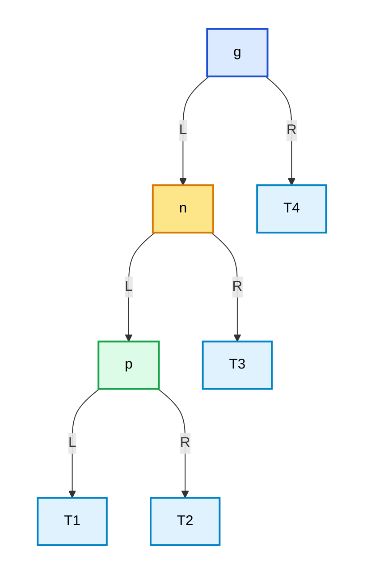
```mermaid
graph TD
	subgraph level0[" "]
		direction LR
		g["g"]
	end

	subgraph level1[" "]
		direction LR
		n["n"]
		T4["T4"]
	end

	subgraph level2[" "]
		direction LR
		p["p"]
		T3["T3"]
	end

	subgraph level3[" "]
		direction LR
		T1["T1"]
		T2["T2"]
	end

	g -->|L| n
	g -->|R| T4
	n -->|L| p
	n -->|R| T3
	p -->|L| T1
	p -->|R| T2

	classDef root_node fill:#dbeafe,stroke:#1d4ed8,stroke-width:2px,color:#000;
	classDef pivot_node fill:#dcfce7,stroke:#16a34a,stroke-width:2px,color:#000;
	classDef focus_node fill:#fde68a,stroke:#d97706,stroke-width:2px,color:#000;
	classDef normal_node fill:#e0f2fe,stroke:#0284c7,stroke-width:2px,color:#000;

	class g root_node;
	class p pivot_node;
	class n focus_node;
	class T1,T2,T3,T4 normal_node;

	style level0 fill:transparent,stroke:transparent;
	style level1 fill:transparent,stroke:transparent;
	style level2 fill:transparent,stroke:transparent;
	style level3 fill:transparent,stroke:transparent;
```

#### 第二步：再对 `g` 右旋

这一步才是真正完成最终修复。


```mermaid
graph TD
	subgraph level0[" "]
		direction LR
		n["n"]
	end

	subgraph level1[" "]
		direction LR
		p["p"]
		g["g"]
	end

	subgraph level2[" "]
		direction LR
		T1["T1"]
		T2["T2"]
		T3["T3"]
		T4["T4"]
	end

	n -->|L| p
	n -->|R| g
	p -->|L| T1
	p -->|R| T2
	g -->|L| T3
	g -->|R| T4

	classDef root_node fill:#dbeafe,stroke:#1d4ed8,stroke-width:2px,color:#000;
	classDef pivot_node fill:#dcfce7,stroke:#16a34a,stroke-width:2px,color:#000;
	classDef focus_node fill:#fde68a,stroke:#d97706,stroke-width:2px,color:#000;
	classDef normal_node fill:#e0f2fe,stroke:#0284c7,stroke-width:2px,color:#000;

	class n root_node;
	class p,g pivot_node;
	class T1,T2,T3,T4 normal_node;

	style level0 fill:transparent,stroke:transparent;
	style level1 fill:transparent,stroke:transparent;
	style level2 fill:transparent,stroke:transparent;
```

所以 LR 的本质是：

```text
先把 LR 转成 LL
再对 LL 做一次标准右旋
```

#### 直接对 n 右旋行不行？

不行，直接对 n 右旋它就会变为RL型失衡，也就是接下来要讲解的失衡类型。

------

### 5.5.5 RL：内侧失衡，先右后左

RL 的含义是：

```text
p == g->right
n == p->left
```

也就是：

- `p` 在 `g` 的右边
- `n` 在 `p` 的左边

这同样属于**内侧失衡**。

#### RL 初始结构

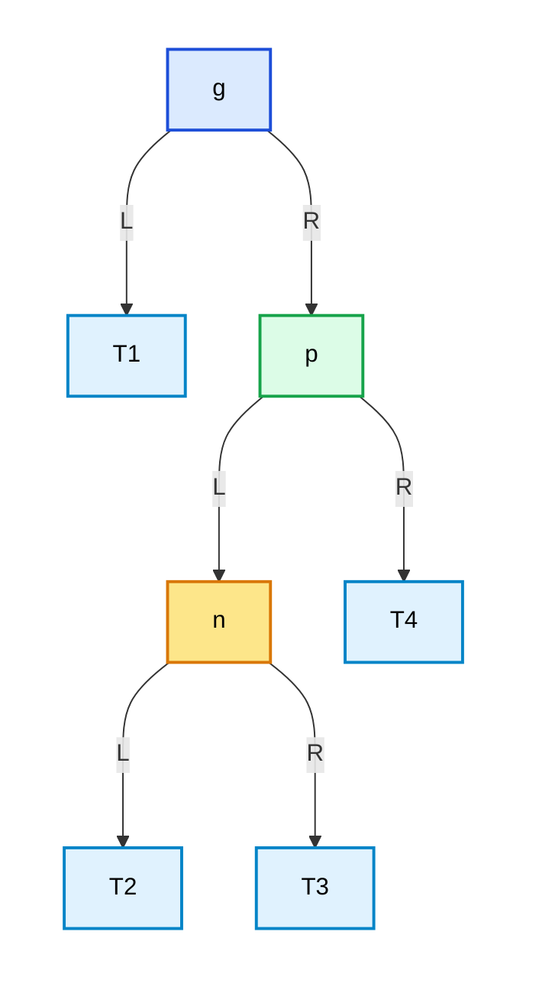
```mermaid
graph TD
	subgraph level0[" "]
		direction LR
		g["g"]
	end

	subgraph level1[" "]
		direction LR
		T1["T1"]
		p["p"]
	end

	subgraph level2[" "]
		direction LR
		n["n"]
		T4["T4"]
	end

	subgraph level3[" "]
		direction LR
		T2["T2"]
		T3["T3"]
	end

	g -->|L| T1
	g -->|R| p
	p -->|L| n
	p -->|R| T4
	n -->|L| T2
	n -->|R| T3

	classDef root_node fill:#dbeafe,stroke:#1d4ed8,stroke-width:2px,color:#000;
	classDef pivot_node fill:#dcfce7,stroke:#16a34a,stroke-width:2px,color:#000;
	classDef focus_node fill:#fde68a,stroke:#d97706,stroke-width:2px,color:#000;
	classDef normal_node fill:#e0f2fe,stroke:#0284c7,stroke-width:2px,color:#000;

	class g root_node;
	class p pivot_node;
	class n focus_node;
	class T1,T2,T3,T4 normal_node;

	style level0 fill:transparent,stroke:transparent;
	style level1 fill:transparent,stroke:transparent;
	style level2 fill:transparent,stroke:transparent;
	style level3 fill:transparent,stroke:transparent;
```

如果直接对 `g` 做一次左旋，也不能把局部重心提到理想位置。
原因和 LR 完全对称：当前问题不是 RR，而是右子树内部先向左偏。

所以 RL 也必须分两步做。

#### 第一步：先对 `p` 右旋

这一步的目标是：

> **先把 RL 结构转换成 RR 结构。**

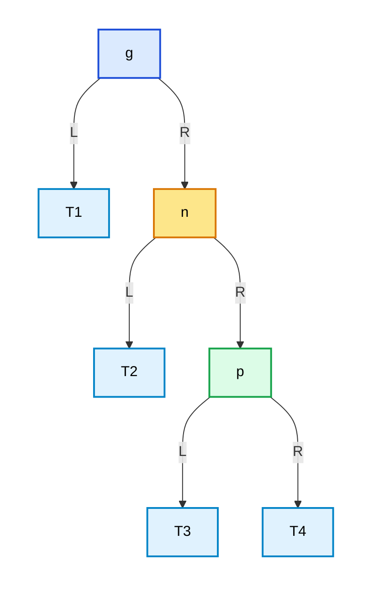
```mermaid
graph TD
	subgraph level0[" "]
		direction LR
		g["g"]
	end

	subgraph level1[" "]
		direction LR
		T1["T1"]
		n["n"]
	end

	subgraph level2[" "]
		direction LR
		T2["T2"]
		p["p"]
	end

	subgraph level3[" "]
		direction LR
		T3["T3"]
		T4["T4"]
	end

	g -->|L| T1
	g -->|R| n
	n -->|L| T2
	n -->|R| p
	p -->|L| T3
	p -->|R| T4

	classDef root_node fill:#dbeafe,stroke:#1d4ed8,stroke-width:2px,color:#000;
	classDef pivot_node fill:#dcfce7,stroke:#16a34a,stroke-width:2px,color:#000;
	classDef focus_node fill:#fde68a,stroke:#d97706,stroke-width:2px,color:#000;
	classDef normal_node fill:#e0f2fe,stroke:#0284c7,stroke-width:2px,color:#000;

	class g root_node;
	class p pivot_node;
	class n focus_node;
	class T1,T2,T3,T4 normal_node;

	style level0 fill:transparent,stroke:transparent;
	style level1 fill:transparent,stroke:transparent;
	style level2 fill:transparent,stroke:transparent;
	style level3 fill:transparent,stroke:transparent;
```

#### 第二步：再对 `g` 左旋

这一步才是真正完成最终修复。

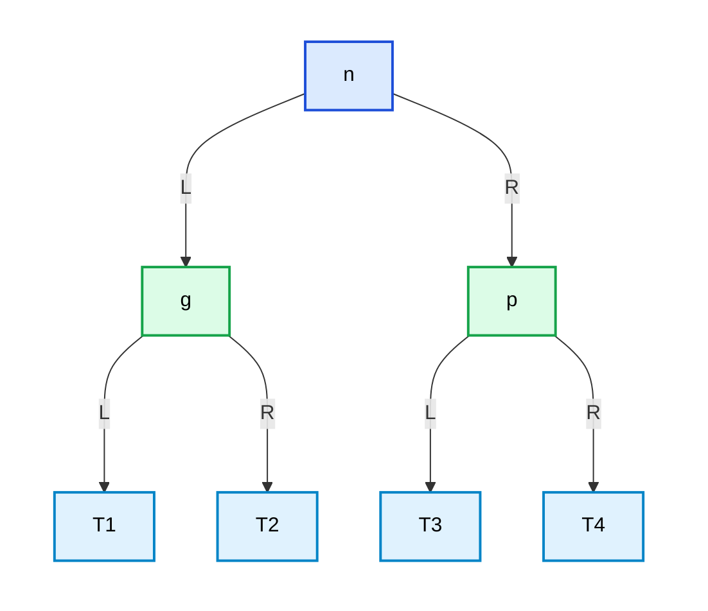
```mermaid
graph TD
	subgraph level0[" "]
		direction LR
		n["n"]
	end

	subgraph level1[" "]
		direction LR
		g["g"]
		p["p"]
	end

	subgraph level2[" "]
		direction LR
		T1["T1"]
		T2["T2"]
		T3["T3"]
		T4["T4"]
	end

	n -->|L| g
	n -->|R| p
	g -->|L| T1
	g -->|R| T2
	p -->|L| T3
	p -->|R| T4

	classDef root_node fill:#dbeafe,stroke:#1d4ed8,stroke-width:2px,color:#000;
	classDef pivot_node fill:#dcfce7,stroke:#16a34a,stroke-width:2px,color:#000;
	classDef focus_node fill:#fde68a,stroke:#d97706,stroke-width:2px,color:#000;
	classDef normal_node fill:#e0f2fe,stroke:#0284c7,stroke-width:2px,color:#000;

	class n root_node;
	class g,p pivot_node;
	class T1,T2,T3,T4 normal_node;

	style level0 fill:transparent,stroke:transparent;
	style level1 fill:transparent,stroke:transparent;
	style level2 fill:transparent,stroke:transparent;
```

所以 RL 的本质是：

```text
先把 RL 转成 RR
再对 RR 做一次标准左旋
```

------

### 5.5.6 四类结构的统一算法判定

到了算法和代码层，不能再只靠“看图像不像”。
真正进入实现时，必须把判定写成明确的指针关系。

设：

- `g`：当前失衡子树根
- `p`：`g` 的关键孩子
- `n`：`p` 的关键孩子

则四类结构统一判定如下：

| 类型 | 判定条件                         | 修复动作                              |
| ---- | -------------------------------- | ------------------------------------- |
| LL   | `p == g->left && n == p->left`   | `right_rotate(g)`                     |
| LR   | `p == g->left && n == p->right`  | `left_rotate(p)` 后 `right_rotate(g)` |
| RR   | `p == g->right && n == p->right` | `left_rotate(g)`                      |
| RL   | `p == g->right && n == p->left`  | `right_rotate(p)` 后 `left_rotate(g)` |

因此，在算法里识别当前到底是 LL、LR、RR 还是 RL，核心只需要两步：

1. `p` 在 `g` 的哪一侧
2. `n` 在 `p` 的哪一侧

------

### 5.5.7 为什么四类结构都必须兼容“当前节点只是子树根”

在小图里，失衡点常常被画成整棵树根。
但真实算法里，失衡通常发生在某个**内部子树根**，而不是整棵树根。

例如下面这棵树中，真正失衡的是 `g(40)` 这棵子树，而不是整棵树根 `50`：

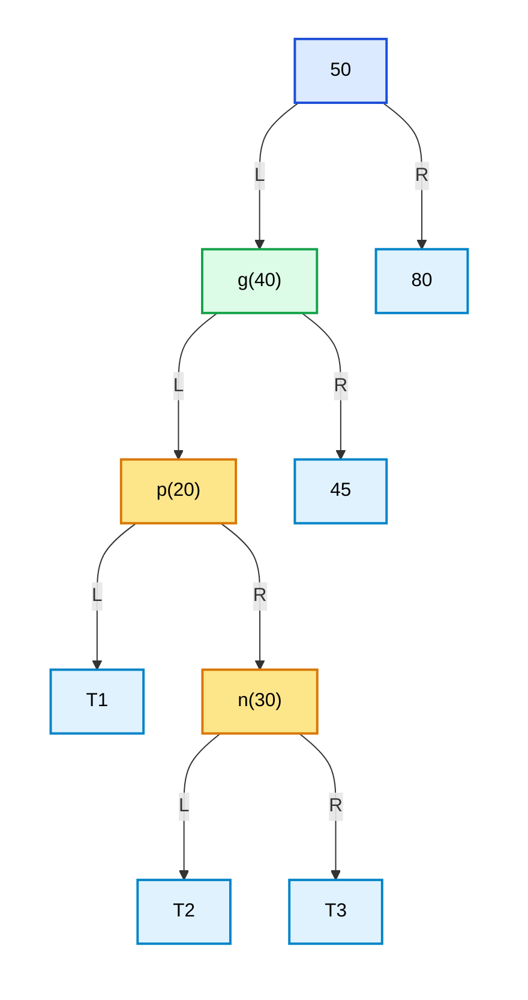
```mermaid
graph TD
	subgraph level0[" "]
		direction LR
		r["50"]
	end

	subgraph level1[" "]
		direction LR
		g["g(40)"]
		T5["80"]
	end

	subgraph level2[" "]
		direction LR
		p["p(20)"]
		T4["45"]
	end

	subgraph level3[" "]
		direction LR
		T1["T1"]
		n["n(30)"]
	end

	subgraph level4[" "]
		direction LR
		T2["T2"]
		T3["T3"]
	end

	r -->|L| g
	r -->|R| T5
	g -->|L| p
	g -->|R| T4
	p -->|L| T1
	p -->|R| n
	n -->|L| T2
	n -->|R| T3

	classDef root_node fill:#dbeafe,stroke:#1d4ed8,stroke-width:2px,color:#000;
	classDef subtree_root fill:#dcfce7,stroke:#16a34a,stroke-width:2px,color:#000;
	classDef focus_node fill:#fde68a,stroke:#d97706,stroke-width:2px,color:#000;
	classDef normal_node fill:#e0f2fe,stroke:#0284c7,stroke-width:2px,color:#000;

	class r root_node;
	class g subtree_root;
	class p,n focus_node;
	class T1,T2,T3,T4,T5 normal_node;

	style level0 fill:transparent,stroke:transparent;
	style level1 fill:transparent,stroke:transparent;
	style level2 fill:transparent,stroke:transparent;
	style level3 fill:transparent,stroke:transparent;
	style level4 fill:transparent,stroke:transparent;
```

这里是一个内部子树上的 LR。
也就是说，四类结构的算法实现必须天然支持两种情况：

1. `g` 是整棵树根
2. `g` 只是某个父节点的一棵子树根

如果你的单旋实现已经是成品函数，能够正确处理：

- 根节点更新
- 父节点回接
- 中间子树回接
- `parent` 指针维护

那么 LL / LR / RR / RL 四类修复都不需要再写特殊的“根处理代码”。
它们都只是在调用：

- 一次单旋
- 或两次单旋

而单旋本身会自动把结果接回整棵树。

------

### 5.5.8 C 成品实现：四类结构识别与修复

下面给出一份可以直接用于后续 AVL / 红黑树学习的 C 版本成品实现。
这里包含：

- 成品左旋
- 成品右旋
- 四类结构判定
- 四类结构统一调度修复

```c
#include <stdio.h>
#include <stdlib.h>

struct bst_node {
	int key;
	struct bst_node *left;
	struct bst_node *right;
	struct bst_node *parent;
};

enum bst_rotation_case {
	BST_CASE_INVALID = 0,
	BST_CASE_LL,
	BST_CASE_LR,
	BST_CASE_RR,
	BST_CASE_RL,
};

void bst_left_rotate(struct bst_node **root, struct bst_node *x)
{
	struct bst_node *y;

	if (!root || !*root || !x || !x->right)
		return;

	y = x->right;

	x->right = y->left;
	if (y->left)
		y->left->parent = x;

	y->parent = x->parent;

	if (!x->parent) {
		*root = y;
	} else if (x == x->parent->left) {
		x->parent->left = y;
	} else {
		x->parent->right = y;
	}

	y->left = x;
	x->parent = y;
}

void bst_right_rotate(struct bst_node **root, struct bst_node *y)
{
	struct bst_node *x;

	if (!root || !*root || !y || !y->left)
		return;

	x = y->left;

	y->left = x->right;
	if (x->right)
		x->right->parent = y;

	x->parent = y->parent;

	if (!y->parent) {
		*root = x;
	} else if (y == y->parent->left) {
		y->parent->left = x;
	} else {
		y->parent->right = x;
	}

	x->right = y;
	y->parent = x;
}

enum bst_rotation_case
bst_identify_rotation_case(struct bst_node *g,
						   struct bst_node *p,
						   struct bst_node *n)
{
	if (!g || !p || !n)
		return BST_CASE_INVALID;

	if (p == g->left) {
		if (n == p->left)
			return BST_CASE_LL;
		if (n == p->right)
			return BST_CASE_LR;
	}

	if (p == g->right) {
		if (n == p->right)
			return BST_CASE_RR;
		if (n == p->left)
			return BST_CASE_RL;
	}

	return BST_CASE_INVALID;
}

void bst_rebalance_by_case(struct bst_node **root,
						   struct bst_node *g,
						   enum bst_rotation_case rot_case)
{
	if (!root || !*root || !g)
		return;

	switch (rot_case) {
	case BST_CASE_LL:
		bst_right_rotate(root, g);
		break;
	case BST_CASE_LR:
		bst_left_rotate(root, g->left);
		bst_right_rotate(root, g);
		break;
	case BST_CASE_RR:
		bst_left_rotate(root, g);
		break;
	case BST_CASE_RL:
		bst_right_rotate(root, g->right);
		bst_left_rotate(root, g);
		break;
	default:
		break;
	}
}
```

这段代码的关键价值在于：

1. `bst_identify_rotation_case()` 解决了“**怎么在算法里识别四类结构**”
2. `bst_rebalance_by_case()` 把“**识别**”和“**修复调用**”连成了完整流程
3. `BST_CASE_LR` 和 `BST_CASE_RL` 直接体现出：
   - 第一步在子树根上旋
   - 第二步在当前局部根上旋

------

### 5.5.9 C++ 成品实现：四类结构识别与修复

下面给出完全对应的 C++ 版本。

```cpp
#include <iostream>

struct bst_node {
	int key;
	bst_node *left;
	bst_node *right;
	bst_node *parent;
};

enum class bst_rotation_case {
	invalid = 0,
	ll,
	lr,
	rr,
	rl,
};

void bst_left_rotate(bst_node *&root, bst_node *x)
{
	bst_node *y;

	if (!root || !x || !x->right)
		return;

	y = x->right;

	x->right = y->left;
	if (y->left)
		y->left->parent = x;

	y->parent = x->parent;

	if (!x->parent) {
		root = y;
	} else if (x == x->parent->left) {
		x->parent->left = y;
	} else {
		x->parent->right = y;
	}

	y->left = x;
	x->parent = y;
}

void bst_right_rotate(bst_node *&root, bst_node *y)
{
	bst_node *x;

	if (!root || !y || !y->left)
		return;

	x = y->left;

	y->left = x->right;
	if (x->right)
		x->right->parent = y;

	x->parent = y->parent;

	if (!y->parent) {
		root = x;
	} else if (y == y->parent->left) {
		y->parent->left = x;
	} else {
		y->parent->right = x;
	}

	x->right = y;
	y->parent = x;
}

bst_rotation_case
bst_identify_rotation_case(bst_node *g, bst_node *p, bst_node *n)
{
	if (!g || !p || !n)
		return bst_rotation_case::invalid;

	if (p == g->left) {
		if (n == p->left)
			return bst_rotation_case::ll;
		if (n == p->right)
			return bst_rotation_case::lr;
	}

	if (p == g->right) {
		if (n == p->right)
			return bst_rotation_case::rr;
		if (n == p->left)
			return bst_rotation_case::rl;
	}

	return bst_rotation_case::invalid;
}

void bst_rebalance_by_case(bst_node *&root,
						   bst_node *g,
						   bst_rotation_case rot_case)
{
	if (!root || !g)
		return;

	switch (rot_case) {
	case bst_rotation_case::ll:
		bst_right_rotate(root, g);
		break;
	case bst_rotation_case::lr:
		bst_left_rotate(root, g->left);
		bst_right_rotate(root, g);
		break;
	case bst_rotation_case::rr:
		bst_left_rotate(root, g);
		break;
	case bst_rotation_case::rl:
		bst_right_rotate(root, g->right);
		bst_left_rotate(root, g);
		break;
	default:
		break;
	}
}
```

------

### 5.5.10 复杂应用示例：内部子树上的 LR 修复

下面给出一个真正有用的复杂场景示例。
这里失衡点不是整棵树根，而是内部子树根 `g(40)`。

```c
#include <stdio.h>
#include <stdlib.h>

struct bst_node {
	int key;
	struct bst_node *left;
	struct bst_node *right;
	struct bst_node *parent;
};

enum bst_rotation_case {
	BST_CASE_INVALID = 0,
	BST_CASE_LL,
	BST_CASE_LR,
	BST_CASE_RR,
	BST_CASE_RL,
};

void bst_left_rotate(struct bst_node **root, struct bst_node *x)
{
	struct bst_node *y;

	if (!root || !*root || !x || !x->right)
		return;

	y = x->right;

	x->right = y->left;
	if (y->left)
		y->left->parent = x;

	y->parent = x->parent;

	if (!x->parent) {
		*root = y;
	} else if (x == x->parent->left) {
		x->parent->left = y;
	} else {
		x->parent->right = y;
	}

	y->left = x;
	x->parent = y;
}

void bst_right_rotate(struct bst_node **root, struct bst_node *y)
{
	struct bst_node *x;

	if (!root || !*root || !y || !y->left)
		return;

	x = y->left;

	y->left = x->right;
	if (x->right)
		x->right->parent = y;

	x->parent = y->parent;

	if (!y->parent) {
		*root = x;
	} else if (y == y->parent->left) {
		y->parent->left = x;
	} else {
		y->parent->right = x;
	}

	x->right = y;
	y->parent = x;
}

enum bst_rotation_case
bst_identify_rotation_case(struct bst_node *g,
						   struct bst_node *p,
						   struct bst_node *n)
{
	if (!g || !p || !n)
		return BST_CASE_INVALID;

	if (p == g->left) {
		if (n == p->left)
			return BST_CASE_LL;
		if (n == p->right)
			return BST_CASE_LR;
	}

	if (p == g->right) {
		if (n == p->right)
			return BST_CASE_RR;
		if (n == p->left)
			return BST_CASE_RL;
	}

	return BST_CASE_INVALID;
}

void bst_rebalance_by_case(struct bst_node **root,
						   struct bst_node *g,
						   enum bst_rotation_case rot_case)
{
	if (!root || !*root || !g)
		return;

	switch (rot_case) {
	case BST_CASE_LL:
		bst_right_rotate(root, g);
		break;
	case BST_CASE_LR:
		bst_left_rotate(root, g->left);
		bst_right_rotate(root, g);
		break;
	case BST_CASE_RR:
		bst_left_rotate(root, g);
		break;
	case BST_CASE_RL:
		bst_right_rotate(root, g->right);
		bst_left_rotate(root, g);
		break;
	default:
		break;
	}
}

void inorder_print(const struct bst_node *root)
{
	if (!root)
		return;

	inorder_print(root->left);
	printf("%d ", root->key);
	inorder_print(root->right);
}

int main(void)
{
	/*
	 *            50
	 *           /  \
	 *         40    80
	 *        / \
	 *      20   45
	 *        \
	 *         30
	 *
	 * 当前失衡子树根：
	 * g = 40
	 * p = 20
	 * n = 30
	 *
	 * 这是一个内部子树上的 LR。
	 */
	struct bst_node n30 = { 30, NULL, NULL, NULL };
	struct bst_node n20 = { 20, NULL, &n30, NULL };
	struct bst_node n45 = { 45, NULL, NULL, NULL };
	struct bst_node n40 = { 40, &n20, &n45, NULL };
	struct bst_node n80 = { 80, NULL, NULL, NULL };
	struct bst_node n50 = { 50, &n40, &n80, NULL };

	struct bst_node *root = &n50;
	enum bst_rotation_case rot_case;

	n30.parent = &n20;
	n20.parent = &n40;
	n45.parent = &n40;
	n40.parent = &n50;
	n80.parent = &n50;

	printf("修复前中序: ");
	inorder_print(root);
	printf("\n");

	rot_case = bst_identify_rotation_case(&n40, &n20, &n30);
	printf("识别结果: %s\n",
		   rot_case == BST_CASE_LR ? "LR" : "INVALID");

	bst_rebalance_by_case(&root, &n40, rot_case);

	printf("修复后中序: ");
	inorder_print(root);
	printf("\n");

	printf("整棵树根: %d\n", root->key);
	printf("左子树根: %d\n", root->left->key);

	return 0;
}
```

这个例子要观察的重点是：

- 整棵树根仍然是 `50`
- 但 `50->left` 会从 `40` 变成新的局部根
- 说明修复作用在了**内部子树根**上，而不是误把整棵树整体重排掉

这才是复杂场景下算法真正要解决的问题。

------

### 5.5.11 本节小结

这一节最终要记住的，不是“LR / RL / LL / RR 的名字”，而是下面五件事：

1. **怎么识别**
   通过 `g / p / n` 三层节点关系，判定当前是 LL、LR、RR 还是 RL。
2. **为什么有的只需单旋，有的必须双旋**
   外侧失衡用单旋，内侧失衡用双旋。
3. **双旋怎么理解**
   LR 和 RL 不是新魔法，而是两个单旋的有序组合。
4. **复杂树中为什么仍然成立**
   因为成品单旋已经能处理：
   - 当前节点是整棵树根
   - 当前节点是内部子树根
   - 父节点回接
   - 根节点更新
   - 中间子树回接
5. **最核心的代码骨架是什么**

```text
LL = 对 g 右旋
RR = 对 g 左旋
LR = 先对 g.left 左旋，再对 g 右旋
RL = 先对 g.right 右旋，再对 g 左旋
```

因此，四类结构最值得建立的能力不是“看图会背”，而是：

> **在算法里识别当前到底是 LL / LR / RR / RL，并把它翻译成对应的单旋或双旋调用。**

把你原来的“指针维护问题”贴过来，我继续顺延整理成新的 **5.6**。

------

## 5.6 从“旋转动作”走向“诊断识别”

### 5.6.0 章节内容说明

到目前为止，我们已经分步骤讲清楚了三类修复动作：

- 左旋
- 右旋
- 双旋（LL / RR 对应单旋，LR / RL 对应组合旋转）

如果只停留在这里，你会得到一种“会用药，但不会看病”的状态。
也就是说：

- 你知道左旋、右旋、双旋分别怎么做
- 但你还不知道在一棵真实的平衡二叉树里，**什么时候该用哪一种**

所以，从这一节开始，视角要从“旋转是什么”转向：

> **在平衡二叉树中，如何诊断当前到底发生了哪一类失衡。**

注意，这里我们的视角仍然停留在**平衡二叉树**，尤其是 AVL 这一类“通过高度差诊断失衡”的结构。
虽然最终会进入红黑树，但现在不需要一下子跳过去，因为红黑树的“诊断信号”不是高度差，而是：

- 颜色关系
- 黑高
- 父、叔、兄弟、侄子节点的局部关系

所以当前这一节的目标非常明确：

> **先把“平衡二叉树里的诊断流程”建立起来，让旋转动作和失衡类型真正接上。**

------

### 5.6.1 为什么学完旋转之后，必须继续学诊断

前面学左旋、右旋和双旋，本质上是在学习：

> **一旦知道病因，应该如何修复。**

例如：

- LL：右旋
- RR：左旋
- LR：先左后右
- RL：先右后左

但这只是“治疗表”。

真正写通用算法时，问题不会直接写成：

```text
现在是 LR，请执行先左后右
```

真实输入只会告诉你：

- 某个节点刚刚插入了
- 某个节点刚刚删除了
- 某条路径的高度变了
- 某个祖先开始失衡了

所以，通用算法真正面对的问题是：

```text
我现在手上只有“变化发生了”这个事实，
怎么一步一步诊断出当前属于 LL / LR / RR / RL？
```

这就是本节的意义。

------

### 5.6.2 本节统一使用的诊断命名

为了让图、算法、代码保持一致，这一节统一使用下面这组名字：

- `z`：本次变化的起点
  例如新插入节点，或者删除后高度发生变化的起始位置
- `g`：第一个失衡的祖先节点
  也就是当前真正需要修复的局部子树根
- `p`：`g` 的更高孩子
  也就是导致 `g` 失衡的那一侧
- `n`：`p` 的更高孩子
  也就是下一层继续偏重的方向

这四个名字里，真正决定失衡类型的是：

```text
g, p, n
```

其中：

- `g` 决定“当前修谁”
- `p` 决定“失衡偏向左边还是右边”
- `n` 决定“失衡落在外侧还是内侧”

------

### 5.6.3 诊断的第一步：从变化点 `z` 向上找第一个失衡祖先 `g`

在平衡二叉树里，失衡不会无缘无故出现在完全无关的分支里。
它一定出现在：

> **从本次变化点 `z` 向根回溯的这条路径上。**

因此，诊断不应该从整棵树根开始盲目扫描，而应该采用下面这种思路：

```text
cur = z
while (cur != NULL) {
	更新 cur 的高度
	检查 cur 是否失衡
	如果失衡:
		cur 就是 g
		停止
	cur = cur->parent
}
```

这里最关键的结论是：

> **`g` 不是事先知道的，它是沿着 `z -> root` 这条路径向上诊断出来的第一个失衡节点。**

这一步非常重要，因为后面的旋转不是围绕 `z` 做，也不是围绕整棵树根做，而是围绕：

```text
第一个失衡祖先 g
```

做。

------

### 5.6.4 诊断的第二步：如何判定一个节点是否失衡

在当前阶段，我们讨论的是平衡二叉树，因此最自然的诊断信号就是：

> **左右子树高度差。**

定义平衡因子：

```text
balance_factor(x) = height(x->left) - height(x->right)
```

于是：

- 当 `balance_factor(x)` 为 `-1`、`0`、`1` 时，节点 `x` 仍然平衡
- 当 `abs(balance_factor(x)) > 1` 时，节点 `x` 失衡

所以，沿着 `z` 向上回溯时，第一件事就是反复做：

```text
更新当前节点高度
计算平衡因子
检查是否 abs(balance_factor) > 1
```

一旦第一次发现这个条件成立，那个节点就是 `g`。

------

### 5.6.5 诊断的第三步：由 `g` 找到 `p`

一旦确定了 `g`，接下来就不能再笼统地说“它失衡了”，而必须进一步问：

> **它到底是左边高，还是右边高？**

这一步就是找 `p`。

定义：

```text
p = g 的更高孩子
```

也就是：

- 如果 `g->left` 更高，则 `p = g->left`
- 如果 `g->right` 更高，则 `p = g->right`

因此，`p` 的作用是回答：

```text
当前失衡的主方向在哪一侧？
```

这一步决定了我们后面是在讨论：

- 左侧失衡（LL / LR）
- 还是右侧失衡（RR / RL）

------

### 5.6.6 诊断的第四步：由 `p` 找到 `n`

找到 `p` 之后，还不能立即决定是单旋还是双旋。
因为接下来还要继续判断：

> **在 `p` 这一层里，重心究竟落在外侧，还是内侧？**

这一步就是找 `n`。

定义：

```text
n = p 的更高孩子
```

也就是：

- 如果 `p->left` 更高，则 `n = p->left`
- 如果 `p->right` 更高，则 `n = p->right`

这一步决定了最终失衡类型。

也就是说：

- `p` 只告诉你是“左偏”还是“右偏”
- `n` 才告诉你是“外侧”还是“内侧”

------

### 5.6.7 由 `g / p / n` 统一判定四类失衡

当 `g / p / n` 都确定之后，四类失衡就全部明朗了：

| 类型 | 判定条件                           | 修复方式                     |
| ---- | ---------------------------------- | ---------------------------- |
| LL   | `p == g->left` 且 `n == p->left`   | 对 `g` 做一次右旋            |
| LR   | `p == g->left` 且 `n == p->right`  | 先对 `p` 左旋，再对 `g` 右旋 |
| RR   | `p == g->right` 且 `n == p->right` | 对 `g` 做一次左旋            |
| RL   | `p == g->right` 且 `n == p->left`  | 先对 `p` 右旋，再对 `g` 左旋 |

所以，四类失衡的识别，本质上只是在做下面两步判断：

```text
先看 p 在 g 的哪一侧
再看 n 在 p 的哪一侧
```

于是：

- 左-左，就是 LL
- 左-右，就是 LR
- 右-右，就是 RR
- 右-左，就是 RL

这就是本节最核心的诊断结论。

------

### 5.6.8 诊断流程图

为了把“变化发生”到“选定旋转”的流程串起来，可以先看下面这张图：

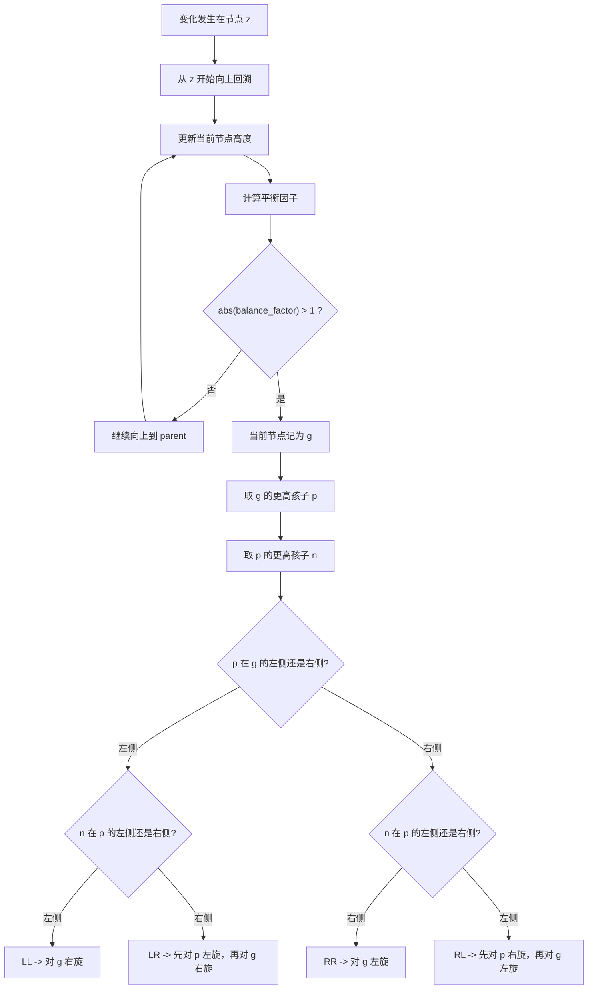
```mermaid
flowchart TD
	A["变化发生在节点 z"] --> B["从 z 开始向上回溯"]
	B --> C["更新当前节点高度"]
	C --> D["计算平衡因子"]
	D --> E{"abs(balance_factor) > 1 ?"}
	E -->|否| F["继续向上到 parent"]
	F --> C
	E -->|是| G["当前节点记为 g"]
	G --> H["取 g 的更高孩子 p"]
	H --> I["取 p 的更高孩子 n"]
	I --> J{"p 在 g 的左侧还是右侧?"}
	J -->|左侧| K{"n 在 p 的左侧还是右侧?"}
	J -->|右侧| L{"n 在 p 的左侧还是右侧?"}
	K -->|左侧| M["LL -> 对 g 右旋"]
	K -->|右侧| N["LR -> 先对 p 左旋，再对 g 右旋"]
	L -->|右侧| O["RR -> 对 g 左旋"]
	L -->|左侧| P["RL -> 先对 p 右旋，再对 g 左旋"]
```

这张图的意义在于：

- 前半部分是“诊断”
- 后半部分是“治疗”

你前面学到的左旋 / 右旋 / 双旋，终于在这里接进了通用流程。

------

### 5.6.9 为什么这套诊断天然兼容“整棵树根”和“内部子树根”

这里还必须补一个非常关键的点。
很多教材的小图都默认 `g` 是整棵树根，但真实情况往往不是。

真实算法里，`g` 更常见的身份是：

> **内部某棵子树的根。**

例如：

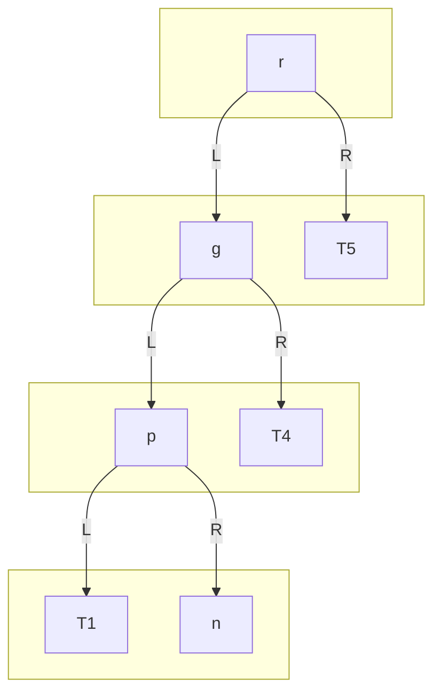
```mermaid
graph TD
	subgraph level0[" "]
		direction LR
		r["r"]
	end

	subgraph level1[" "]
		direction LR
		g["g"]
		T5["T5"]
	end

	subgraph level2[" "]
		direction LR
		p["p"]
		T4["T4"]
	end

	subgraph level3[" "]
		direction LR
		T1["T1"]
		n["n"]
	end

	r -->|L| g
	r -->|R| T5
	g -->|L| p
	g -->|R| T4
	p -->|L| T1
	p -->|R| n
```

这里：

- 整棵树根是 `r`
- 失衡子树根是 `g`

而我们的诊断流程为什么仍然成立？

因为：

1. `g` 是从 `z` 一路向上诊断出来的，不是事先假定它是整棵树根
2. 旋转函数本身已经是成品实现，天然支持：
   - `g` 是整棵树根时更新全局 `root`
   - `g` 是内部子树根时把新子树根接回原父节点

所以：

- 诊断流程不需要区分“整棵树根版本”和“内部子树版本”
- 它只负责诊断出 `g / p / n`
- 后续修复则由成品单旋 / 双旋自动完成接回

这就是通用框架真正稳定的原因。

------

### 5.6.10 当前阶段与红黑树的边界

这一节虽然是为后面讲红黑树打基础，但当前的视角仍然停留在**平衡二叉树**。
因此，本节的诊断信号是：

```text
高度差 / 平衡因子
```

而不是红黑树中的：

- 红红冲突
- 黑高不一致
- 叔叔节点颜色
- 兄弟与侄子关系

也就是说，这一节要先把下面这件事彻底讲明白：

> **在平衡二叉树里，如何从“结构变化”一路诊断到“该做哪一种旋转”。**

等这个过程建立稳了，后面再进入红黑树时，你就会发现：

- 红黑树的诊断信号变了
- 但修复动作底层仍然是旋转

这时跨度才是自然的。

------

### 5.6.11 本节小结

到这里，旋转已经不再是孤立动作，而被放进了完整的诊断流程里。

你现在应该把前面各节内容连成下面这条主线：

```text
1. 树发生一次结构变化，变化起点记为 z
2. 从 z 向上回溯
3. 找到第一个失衡祖先 g
4. 取 g 的更高孩子 p
5. 取 p 的更高孩子 n
6. 由 g / p / n 判定 LL / LR / RR / RL
7. 调用对应的单旋或双旋
8. 由成品旋转函数自动处理根更新、父节点回接和中间子树回接
```

所以，本节真正解决的问题是：

> **如何诊断。**

而前面几节真正解决的问题是：

> **如何修复。**

两者合在一起，才构成平衡二叉树里的完整旋转框架。

如果用一句最简练的话来概括本节，那就是：

> **前面学的是“手术动作”，这一节学的是“术前诊断”。**

---

## 5.7 本章小结：如何把“旋转知识”写成代码

前面几节已经分别讲清楚了：

- 左旋
- 右旋
- 四类失衡结构 `LL / LR / RR / RL`
- 失衡诊断中 `g / p / n` 的含义

如果这些内容只是分散记忆，仍然不足以直接写代码。
真正能落到实现里的，是下面这条完整链路：

```text
结构变化发生
-> 确定诊断起点
-> 向上更新高度
-> 找到第一个失衡祖先 g
-> 确定 p 和 n
-> 判定 LL / LR / RR / RL
-> 调用单旋或双旋
-> 决定是否继续向上
```

这一节的目标不是再重复概念，而是把本章内容收束成**可以直接转写成代码**的实现框架。

------

### 5.7.1 先明确旋转函数的接口契约

无论后面写 AVL 还是继续扩展到别的平衡搜索树，左旋和右旋函数都必须满足同一个接口契约：

1. **输入的不是整棵树根，而是当前局部子树根**
   - 这个节点记为 `g`
   - `g` 可能就是整棵树根
   - `g` 也可能只是某个父节点的一棵子树根
2. **旋转函数必须自己处理两种情况**
   - 如果 `g` 是整棵树根，就更新全局 `root`
   - 如果 `g` 是内部子树根，就把新子树根重新接回 `g->parent`
3. **旋转函数必须返回旋转后的新局部根**
   - 左旋后返回上移节点
   - 右旋后返回上移节点
4. **旋转函数必须同时维护**
   - 父节点连接
   - 中间子树回接
   - `parent` 指针
   - 旋转后相关节点高度

因此，旋转函数的最小接口应当类似于：

```c
struct avl_node *avl_left_rotate(struct avl_node **root,
								 struct avl_node *g);

struct avl_node *avl_right_rotate(struct avl_node **root,
								  struct avl_node *g);
```

这里返回值的语义必须明确：

```text
返回值 = 旋转后这棵局部子树的新根
```

这一点非常重要。
因为后面删除场景中，修完一个失衡点后，代码还可能需要继续沿着：

```text
new_subroot->parent
```

向上检查。

------

### 5.7.2 四类失衡的判型规则，必须能直接写成代码

本章后半部分最重要的诊断规则只有这一张表：

| 类型 | 条件                               | 修复                                  |
| ---- | ---------------------------------- | ------------------------------------- |
| LL   | `p == g->left` 且 `n == p->left`   | `right_rotate(g)`                     |
| LR   | `p == g->left` 且 `n == p->right`  | `left_rotate(p)` 后 `right_rotate(g)` |
| RR   | `p == g->right` 且 `n == p->right` | `left_rotate(g)`                      |
| RL   | `p == g->right` 且 `n == p->left`  | `right_rotate(p)` 后 `left_rotate(g)` |

因此，判型函数可以直接写成：

```c
enum avl_rotation_case {
	AVL_CASE_INVALID = 0,
	AVL_CASE_LL,
	AVL_CASE_LR,
	AVL_CASE_RR,
	AVL_CASE_RL,
};

enum avl_rotation_case
avl_identify_rotation_case(struct avl_node *g,
						   struct avl_node *p,
						   struct avl_node *n)
{
	if (!g || !p || !n)
		return AVL_CASE_INVALID;

	if (p == g->left) {
		if (n == p->left)
			return AVL_CASE_LL;
		if (n == p->right)
			return AVL_CASE_LR;
	}

	if (p == g->right) {
		if (n == p->right)
			return AVL_CASE_RR;
		if (n == p->left)
			return AVL_CASE_RL;
	}

	return AVL_CASE_INVALID;
}
```

这段代码对应的就是前面全部图示与分类。
也就是说，**本章关于四类失衡的所有描述，最终都要收束成这样一个判型函数**。

------

### 5.7.3 插入场景：诊断起点、停止条件、修复时机

插入场景必须严谨区分下面两种情况：

#### 第一种：真的插入了一个新节点

这是会改变树结构的情况。
标准 BST / AVL 插入里，新插入节点一定是**新叶子节点**：

- `left = NULL`
- `right = NULL`

所以这里不能把“新插入节点本身”当作失衡诊断对象。
真正合理的诊断起点应该是：

```text
z = 新插入叶子节点 x 的父节点
```

因为：

- `x` 本身一定平衡
- 真正可能受影响的是它的父节点及以上祖先

#### 第二种：键已存在，只是更新节点内容

这种情况没有新增边，没有改变树结构，因此：

```text
不进入平衡诊断流程
```

#### 插入后的统一诊断流程

设新插入叶子节点为 `x`，则代码层的统一流程应当是：

```text
1. 如果没有新建节点，只是更新已有节点内容：直接结束
2. 令 z = x->parent
3. 从 z 开始向上回溯
4. 对每个祖先：
   - 记录 old_height
   - 更新当前高度
   - 计算 balance_factor
5. 若当前节点失衡，则它就是第一个失衡祖先 g
6. 取 p 和 n
7. 判定 LL / LR / RR / RL
8. 执行对应旋转
9. 对 AVL 插入而言，通常修完第一个失衡点即可结束
10. 若当前节点未失衡，且高度未变化，则直接结束
11. 若当前节点未失衡，且高度发生变化，则继续向上
```

这里最容易写错的是第 10 步。
插入场景里，**不是必须一路回溯到根**。
如果某个祖先节点在更新后：

- 仍然平衡
- 且高度没有变化

那么更高祖先也不会再受影响，可以立即停止。

------

### 5.7.4 插入场景下，`p` 和 `n` 最稳的确定方式

在插入场景里，`p` 和 `n` 的确定方式不应只说“更高孩子”，而应进一步落到可编码的规则。

因为插入路径是确定的，所以最稳的做法是：

- `g` 找到之后
- `p` 取 **从 `g` 通往新插入节点 `x` 的那个孩子**
- `n` 取 **从 `p` 通往新插入节点 `x` 的那个孩子**

如果树中 key 唯一，可以直接写成：

```c
p = (x->key < g->key) ? g->left : g->right;
n = (x->key < p->key) ? p->left : p->right;
```

如果你不想依赖 key 比较，也可以在插入查找路径上记录祖先栈，或者直接利用 `parent` 链和指针关系回溯。

这里必须强调：

> **插入场景下，用“沿插入路径确定 `p / n`”比单纯说“更高孩子”更适合直接写代码。**

因为插入导致的第一个失衡祖先，其更高方向本来就由插入路径决定。

------

### 5.7.5 删除场景：诊断起点与继续向上的必要性

删除场景必须单独说明，因为它和插入不一样。

#### 删除后的诊断起点

删除不会像插入那样出现“新叶子节点 `x`”。
因此，删除场景里的诊断起点不再是“被删除键”本身，而应当是：

```text
z = 第一个子树高度可能减少的祖先节点
```

在代码实现里，这个 `z` 通常取为：

- 物理删除位置的父节点
- 或者做完替换 / 移植之后，第一个高度可能变化的节点

这取决于你的删除实现采用的是哪一种写法，但原则不变：

> **诊断必须从“高度真正开始变化的位置”起步。**

#### 删除后的关键区别

删除后，即使已经修复了一个失衡点，也**不一定可以立即结束**。
原因是：

- 删除会让某棵子树高度减少
- 修完一个失衡点之后，这棵子树的高度仍然可能继续比删除前更小
- 因此更高祖先还可能继续失衡

所以删除场景下的统一流程应当写成：

```text
1. 令 z = 第一个高度可能变化的祖先
2. 从 z 向上
3. 更新高度并检查平衡因子
4. 若失衡，则诊断 g / p / n 并执行旋转
5. 旋转后不能默认结束
6. 继续从新局部根的父节点向上检查
7. 若当前节点未失衡且高度未变化，则停止
8. 若当前节点未失衡但高度减少，则继续向上
```

这一点决定了插入与删除的代码框架不能完全一样：

- **插入**：通常修一次就结束
- **删除**：可能需要循环修多个祖先

------

### 5.7.6 “更高孩子”函数必须有确定性规则

在删除场景里，仅仅说“取更高孩子”还不够，因为可能出现：

- 左右等高

这时如果没有确定性规则，代码会变得不稳定。

因此，一个可直接写代码的 `taller_child()` 函数必须把“等高”情况也说清楚。
一种稳定写法是：

1. 左高，返回左
2. 右高，返回右
3. 左右等高时：
   - 如果当前节点是其父节点的左孩子，则优先返回左孩子
   - 如果当前节点是其父节点的右孩子，则优先返回右孩子
   - 如果当前节点本身是整棵树根，则优先返回非空左孩子，否则右孩子

对应代码可以写成：

```c
static struct avl_node *avl_taller_child(struct avl_node *node)
{
	int left_h;
	int right_h;

	if (!node)
		return NULL;

	left_h = avl_height(node->left);
	right_h = avl_height(node->right);

	if (left_h > right_h)
		return node->left;
	if (left_h < right_h)
		return node->right;

	if (!node->parent)
		return node->left ? node->left : node->right;

	if (node == node->parent->left)
		return node->left ? node->left : node->right;

	return node->right ? node->right : node->left;
}
```

这段函数的意义是：

> **让删除场景下的 `p / n` 选择也具备确定性。**

------

### 5.7.7 统一修复函数应当怎样写

前面所有内容最终都应当收束成一个“统一修复入口”。

它的职责是：

1. 已经知道 `g / p / n`
2. 已经知道当前属于哪一类失衡
3. 执行对应单旋或双旋
4. 返回旋转后的新局部根

代码骨架应当类似：

```c
static struct avl_node *
avl_rebalance_at(struct avl_node **root, struct avl_node *g,
				 struct avl_node *p, struct avl_node *n,
				 enum avl_rotation_case rot_case)
{
	switch (rot_case) {
	case AVL_CASE_LL:
		return avl_right_rotate(root, g);

	case AVL_CASE_LR:
		avl_left_rotate(root, p);
		return avl_right_rotate(root, g);

	case AVL_CASE_RR:
		return avl_left_rotate(root, g);

	case AVL_CASE_RL:
		avl_right_rotate(root, p);
		return avl_left_rotate(root, g);

	default:
		return g;
	}
}
```

这里的关键点有两个：

- LL / RR 是单旋
- LR / RL 是先对子树根 `p` 旋，再对局部根 `g` 旋

而且，因为底层单旋已经是成品实现，所以这里不需要再额外区分：

- `g` 是整棵树根
- `g` 是内部子树根

这些细节都由单旋函数自己处理。

------

### 5.7.8 能直接写代码的两套流程总结

为了让这一节真正能指导代码实现，最后把插入和删除分别压缩成两套可直接照着写的流程。

#### 插入后的修复流程

```text
输入：新插入叶子节点 x

1. 若没有新建节点，只是更新已有节点内容：结束
2. cur = x->parent
3. while cur != NULL:
   3.1 old_height = cur->height
   3.2 更新 cur->height
   3.3 bf = balance_factor(cur)

   3.4 若 abs(bf) > 1:
       g = cur
       p = 从 g 通往 x 的那个孩子
       n = 从 p 通往 x 的那个孩子
       rot_case = identify_case(g, p, n)
       rebalance_at(root, g, p, n, rot_case)
       结束

   3.5 若 cur->height == old_height:
       结束

   3.6 cur = cur->parent
```

#### 删除后的修复流程

```text
输入：第一个高度可能减少的祖先节点 z

1. cur = z
2. while cur != NULL:
   2.1 old_height = cur->height
   2.2 更新 cur->height
   2.3 bf = balance_factor(cur)

   2.4 若 abs(bf) > 1:
       g = cur
       p = taller_child(g)
       n = taller_child(p)
       rot_case = identify_case(g, p, n)
       new_subroot = rebalance_at(root, g, p, n, rot_case)
       cur = new_subroot->parent
       continue

   2.5 若 cur->height == old_height:
       结束

   2.6 cur = cur->parent
```

这两套流程，才是本章真正应该留在脑子里的“代码模板”。

------

### 5.7.9 本节小结

把这一节压缩到最核心，只需要记住下面几句话：

1. **旋转函数不是整棵树函数，而是局部子树根函数。**
   它必须自己处理根更新与父节点回接。
2. **四类失衡的判型永远依赖 `g / p / n`。**
   其中：
   - `g` 是第一个失衡祖先
   - `p` 是 `g` 的关键孩子
   - `n` 是 `p` 的关键孩子
3. **插入与删除的诊断起点不同。**
   - 插入：从新叶子节点的父节点开始
   - 删除：从第一个高度可能减少的祖先开始
4. **插入与删除的停止条件不同。**
   - 插入：通常修完第一个失衡点就结束
   - 删除：可能要持续向上修复
5. **真正能指导写代码的不是概念，而是流程。**
   也就是：

```text
定位诊断起点
-> 向上更新高度
-> 找到 g
-> 确定 p 和 n
-> 判型
-> 调用单旋或双旋
-> 根据高度是否继续变化决定是否继续向上
```

如果把本章内容压成一句最接近代码实现的话，那就是：

> **前面学的是旋转动作本身，这一节学的是如何在通用平衡算法里找到该旋谁、什么时候停。**

这才是后面继续进入更复杂平衡树之前，真正能落到代码里的基础。

