# 第7章 红黑树：把 2-3-4 树映射成二叉表示

## 7.0 章节内容说明

### 7.0.1 本章在整条学习路径中的位置

到第 6 章为止，前置结构已经铺完：

- 你已经知道 BST 只保证有序，不保证形状；
- 你已经知道旋转只是局部重排工具；
- 你也已经知道 2-3-4 树给出的不是代码模板，而是红黑树背后的结构解释框架。

因此，第 7 章不再回答“为什么需要平衡树”这种总论问题。
这一章要做的，是把前面已经建立起来的 2-3-4 树直觉，正式压缩成红黑树自己的定义系统。

换句话说：

> 第 6 章是在说“红黑树背后其实是什么结构”；
> 第 7 章是在说“这个结构被翻译成二叉树之后，表面上会呈现为什么性质”。

这一章讲完之后，后面的第 8 章、第 9 章才能真正进入：

- 插入修复为什么主要围绕红红冲突展开；
- 删除修复为什么主要围绕黑高缺失展开。

所以，第 7 章的地位不是“补充定义”，而是：

> **把 2-3-4 树的多路平衡语义，正式落到红黑树的二叉规则上。**

------

### 7.0.2 本章要解决的核心问题

这一章必须解决五个问题。

#### 问题一：红黑树到底是什么

如果只说“红黑树是一棵带颜色的 BST”，这个定义是远远不够的。
因为“带颜色”只是形式现象，不是结构本质。

真正要回答的是：

- 颜色为什么存在；
- 颜色在控制什么；
- 红黑树比普通 BST 多出来的约束究竟是什么。

------

#### 问题二：五条性质到底在约束什么

红黑树最常见的教材写法，是先给出五条性质。
但如果只是背五条性质，读者通常只会得到两个结果：

- 知道有哪些规则；
- 不知道这些规则分别在防止什么结构问题。

因此本章讲五条性质时，不会只给“定义句子”，而会同时说明：

- 哪些性质在约束局部结构；
- 哪些性质在约束全局平衡；
- 它们为什么必须联合成立。

------

#### 问题三：黑高、红红冲突、黑高缺失到底是什么

后面讲插入和删除时，会高频出现这些术语：

- 黑高
- 红红冲突
- 双重黑
- 黑高缺失

如果现在不先把这些概念压实，后面所有修复 case 都会变成死记硬背。
所以这一章必须先建立这些术语的结构含义。

------

#### 问题四：2-3-4 树到底是怎样映射成红黑树的

这是本章的核心桥接点。

第 6 章已经告诉你：

- 2-node、3-node、4-node 是逻辑节点；
- 红黑树节点是物理节点；
- 红链接承担“逻辑合并”的语义。

但第 6 章的重点还在 2-3-4 树本身。
这一章则必须反过来，用红黑树自己的视角，把映射规则彻底说清楚。

------

#### 问题五：红黑树为什么能控制树高

红黑树不是严格平衡树。
它不会要求左右子树高度差必须等于 0 或 1。
那么它凭什么仍然能保证对数级高度？

这个问题必须从两层来回答：

1. 从红黑树表面性质出发解释；
2. 从 2-3-4 树编码关系出发再解释一次。

只有这两层都打通，后面的修复过程才会真正连起来。

------

### 7.0.3 为什么这一章不能只讲五条性质

如果这一章只写成下面这种教材提纲：

- 红黑树定义；
- 五条性质；
- 高度是 O(log n)；

那读者虽然能得到一个“形式正确”的结论，但在结构理解上仍然会断裂。

因为这种讲法省掉了最关键的一层：

> **五条性质并不是凭空设计出来的，而是在二叉表示中，逼近 2-3-4 树结构的约束条件。**

所以本章必须保持两条线并行：

- **红黑树表面规则线**
- **2-3-4 树结构映射线**

只有这样，后面第 8 章和第 9 章在讲“为什么这里要染色、为什么这里要旋转”时，才不会重新断掉。

------

## 7.1 红黑树的定义与定位

### 7.1.1 红黑树首先是一棵 BST

这一点必须先放在最前面，而且要说得非常明确：

> **红黑树首先是一棵二叉搜索树。**

这意味着，无论颜色如何变化、旋转如何发生，下面这条 BST 基本约束始终不能被破坏：

- 左子树中所有关键字小于当前节点关键字；
- 右子树中所有关键字大于当前节点关键字。

这条性质不是“插入删除之前成立，修复之后再想办法补回来”，而是：

> **红黑树的所有操作都必须在不破坏 BST 有序性的前提下进行。**

所以从实现上看：

- 普通 BST 的查找路径规则，红黑树完全继承；
- 红黑树的旋转，不是为了改变有序关系，而是为了改变形状；
- 红黑树的染色，更不会改变关键字顺序，它只改变结构解释方式。

下面先用一个最简单的树形图固定这一点。

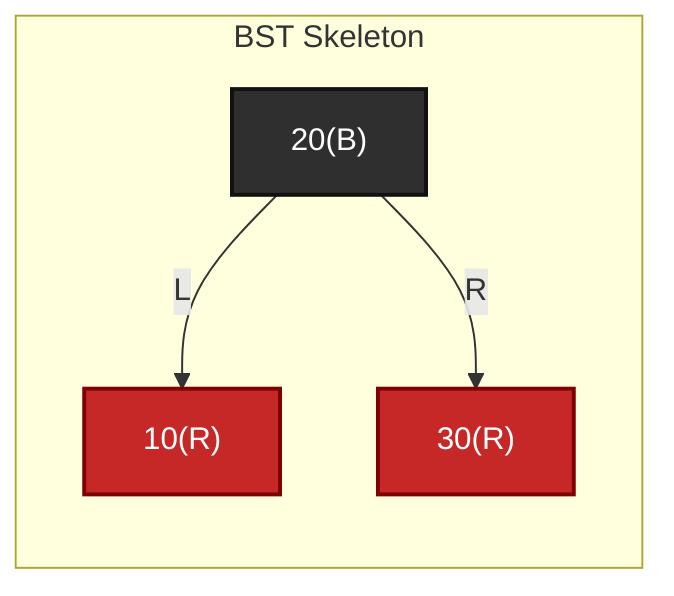
```mermaid
graph LR
	subgraph "BST Skeleton"
		A["20(B)"]
		B["10(R)"]
		C["30(R)"]
	end

	A -->|"L"| B
	A -->|"R"| C

	classDef black fill:#2f2f2f,stroke:#111,color:#fff,stroke-width:2px;
	classDef red fill:#c62828,stroke:#7f0000,color:#fff,stroke-width:2px;

	class A black;
	class B,C red;
```

这张图中，颜色可以变化，但关键字关系不会变化：

- `10 < 20 < 30`

这才是红黑树后续一切修复的底线。

------

### 7.1.2 红黑树在 BST 之上额外增加了什么信息

既然红黑树首先是 BST，那么它和普通 BST 的区别就必须说成：

> **它在 BST 基础上，额外给每个节点增加了颜色信息，并对颜色分布施加约束。**

这个“额外增加的信息”并不复杂，表面上只有一位：

- 红
- 黑

但这位信息不是装饰。
它的作用是把一个普通二叉节点，放进一个更高层的结构解释系统里。

从数据结构角度看，最小抽象通常可以写成：

```cpp
struct rb_node {
	int key;
	color_t color;   // RED or BLACK
	rb_node *left;
	rb_node *right;
	rb_node *parent;
};
```

如果只看字段，确实只是比 BST 多了一个 `color`。
但真正的差异不在字段数量，而在这位颜色的语义：

- 黑色节点定义骨架层级；
- 红色节点表示“逻辑并入”；
- 红黑规则共同限制树高。

也就是说，红黑树不是“BST + 一个颜色变量”，而是：

> **BST + 一套基于颜色解释局部与全局结构的规则系统。**

------

### 7.1.3 红黑树中的颜色信息到底在表达什么

这是本章最容易讲虚的一点。
所以必须直接说结构语义，不说空话。

颜色信息主要承担两种作用。

#### 作用一：表达局部逻辑合并关系

在红黑树里，一个红节点通常不应被理解为“独立增加了一层新的逻辑节点”。
它更接近于：

> **这个红节点要和某个黑节点共同表示一个 3-node 或 4-node。**

例如：

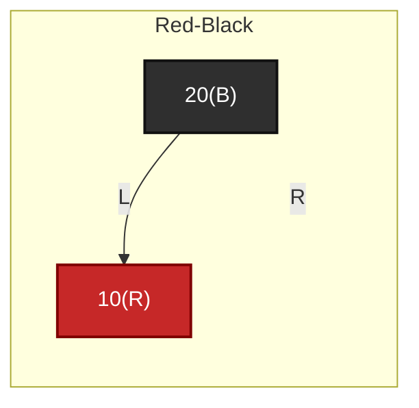
```mermaid
graph LR
	subgraph "Red-Black"
		B["20(B)"]
		R["10(R)"]
		RG[" "]
	end

	B -->|"L"| R
	B -->|"R"| RG

	classDef black fill:#2f2f2f,stroke:#111,color:#fff,stroke-width:2px;
	classDef red fill:#c62828,stroke:#7f0000,color:#fff,stroke-width:2px;
	classDef ghost fill:transparent,stroke:transparent,color:transparent;

	class B black;
	class R red;
	class RG ghost;

	linkStyle 1 stroke:transparent;
```

这个局部结构的逻辑语义，不是“多出了一层独立节点”，而是更接近：

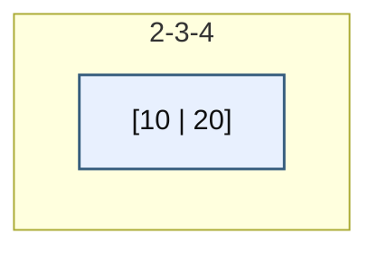
```mermaid
graph TD
	subgraph "2-3-4"
		A["[10 | 20]"]
	end

	classDef node234 fill:#e8f0fe,stroke:#355c7d,color:#111,stroke-width:1.5px;
	class A node234;
```

也就是说，颜色首先承担的是**局部结构解释**。

------

#### 作用二：表达全局层级受控关系

除了局部合并语义，颜色还承担一个更重要的全局作用：

> **约束从根到叶的黑层级数量。**

这一点最终体现为：

- 红节点不能连续；
- 所有路径黑高一致。

所以颜色并不是“给节点分组”，而是在控制：

- 哪些节点算作骨架层；
- 哪些节点只是骨架层内部的逻辑扩张；
- 整棵树的最长路径和最短路径如何被约束。

因此，颜色的真正定义应当理解为：

> **颜色是结构控制信息，不是装饰属性。**

------

### 7.1.4 红黑树不是严格平衡树，而是弱平衡树

这一点必须与 AVL 区分开讲。

红黑树不会要求：

- 左右子树高度差必须不超过 1；
- 每个局部节点都尽可能几何对称。

它允许出现明显的“局部不对称”现象。
例如某条路径可能比另一条路径更长。
但它不允许这种差距失控。

因此，红黑树的平衡不是“严格平衡”，而是：

> **通过黑高受控和红节点不能连续，把树高限制在对数级范围内。**

所以红黑树是一种：

- 不追求最矮；
- 但保证不会退化太严重；
- 修复代价通常比严格平衡树更低；

的平衡树。

这就是所谓的**弱平衡树**。

------

### 7.1.5 红黑树与 AVL、2-3-4 树的定位差异

为了把第 7 章的位置压实，这里给出一个对照表。

| 结构     | 是否是二叉树 | 是否严格平衡   | 平衡控制方式   | 结构解释重点       |
| -------- | ------------ | -------------- | -------------- | ------------------ |
| BST      | 是           | 否             | 无             | 只保证有序         |
| AVL      | 是           | 是             | 高度差严格受限 | 严格平衡           |
| 红黑树   | 是           | 否，属于弱平衡 | 颜色 + 黑高    | 2-3-4 树的二叉编码 |
| 2-3-4 树 | 否，是多路树 | 是             | 叶子同层       | 逻辑多关键字节点   |

这个表必须读出三层意思：

第一，红黑树和 AVL 一样，都是**二叉平衡树**。
第二，红黑树和 2-3-4 树虽然表面形式不同，但结构语义高度相关。
第三，红黑树的定位，不是“颜色更复杂的 BST”，而是“二叉表示下的多路弱平衡搜索树”。

------

## 7.2 红黑树的五条性质

### 7.2.1 节点非红即黑

这是最表面的性质，但仍然必须先列出来：

> **每个节点只能是红色或黑色。**

这条性质本身看似简单，甚至显得“像废话”，
因为它只是在说颜色取值域只有两个。

但它的意义在于：

- 为后面的局部结构解释建立离散状态；
- 为“红红冲突”“黑高统计”建立可判断基础；
- 为修复操作限定目标集合。

换句话说，如果没有这条性质，后面的所有颜色规则都没有前提。

因此，这一条虽然简单，但不是多余。

------

### 7.2.2 根节点为黑

这条性质通常写作：

> **根节点必须是黑色。**

为什么要这样规定？

从实现角度看，这样做能统一很多边界。
从结构角度看，这样做意味着：

- 红黑树的骨架层从根开始；
- 不允许根以“逻辑并入”的方式附属于更上层，因为根上面没有父节点；
- 黑高统计从根出发时不会出现歧义。

这条性质并不是控制树高的主要来源，
但它是一个非常重要的**边界规范**。

它的主要价值在于：

- 统一定义；
- 简化修复结束条件；
- 避免“根是否也能红”带来的额外 case。

------

### 7.2.3 NIL 叶子为黑

先看一个最简单的补全图：

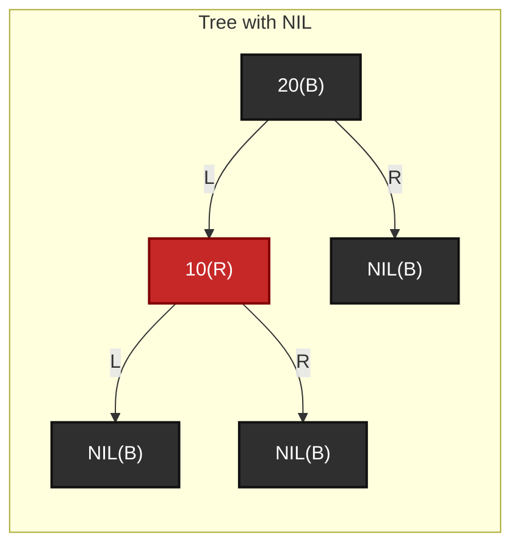
```mermaid
graph LR
	subgraph "Tree with NIL"
		A["20(B)"]
		B["10(R)"]
		LG["NIL(B)"]
		R1["NIL(B)"]
		R2["NIL(B)"]
	end

	A -->|"L"| B
	A -->|"R"| LG
	B -->|"L"| R1
	B -->|"R"| R2

	classDef black fill:#2f2f2f,stroke:#111,color:#fff,stroke-width:2px;
	classDef red fill:#c62828,stroke:#7f0000,color:#fff,stroke-width:2px;

	class A,LG,R1,R2 black;
	class B red;
```

这张图中，真正有 key 的只有 `20` 和 `10`，
但 NIL 叶子作为黑节点参与黑高统计。

这一条如果讲不严，后面删除修复一定会乱。

红黑树教材中常说：

> **所有 NIL 叶子节点都是黑色。**

这里的 NIL 不是普通意义上的“没有节点就没有东西”，而是：

> **逻辑上存在的空叶子哨兵位置。**

例如一个普通二叉节点即使只有左孩子没有右孩子，
在红黑树性质判断时，缺失的右孩子位置也要被视为一个黑色 NIL。

这样做有两个关键作用：

#### 作用一：黑高统计才有统一终点

如果没有 NIL 黑叶子，
那么“从根到叶的黑节点数量”这句话就没有统一参照终点。
因为有的路径结束在真实叶子，有的路径结束在空指针位置，语义会不一致。

#### 作用二：删除修复才能把“空孩子”也纳入统一处理

后面删除 fix-up 里，经常会把某个 `x` 视作 NIL。
这不是偷懒，而是因为 NIL 被当作黑色节点处理后，
很多 case 才能统一进同一套逻辑。

所以这条性质并不是“为了形式完整才补一条”，而是：

> **它是黑高定义和删除修复统一性的基础。**

------

### 7.2.4 红节点不能有红孩子

这是红黑树里最经典的一条局部性质：

> **若一个节点是红色，则它的两个孩子都必须是黑色。**

更直接地说：

> **不允许出现相邻的两个红节点。**

这条性质约束的是局部结构。
它的本质作用不是“颜色搭配更好看”，而是：

> **禁止把多个物理红节点连续堆叠，从而破坏 2-3-4 树的合法逻辑节点编码。**

为什么？

因为在 2-3-4 树映射里：

- 一个红节点通常表示“并入某个黑节点”
- 若红节点下面再接红节点，就相当于一个逻辑节点内部再继续无界扩张

这会让“一个逻辑节点最多容纳几个 key”失去控制。
所以红红冲突本质上不是颜色审美问题，而是：

> **局部逻辑节点容量编码失控。**

下面给出一个非法例子。

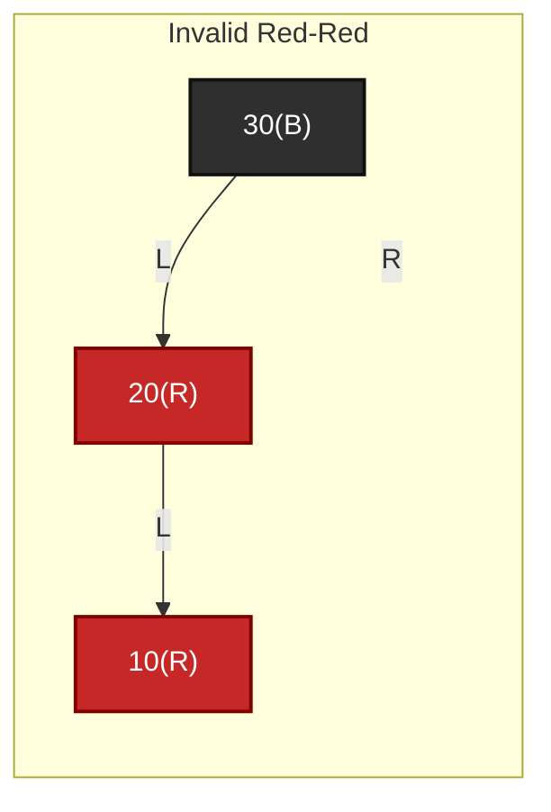
```mermaid
graph LR
	subgraph "Invalid Red-Red"
		A["30(B)"]
		B["20(R)"]
		C["10(R)"]
		RG[" "]
	end

	A -->|"L"| B
	A -->|"R"| RG
	B -->|"L"| C

	classDef black fill:#2f2f2f,stroke:#111,color:#fff,stroke-width:2px;
	classDef red fill:#c62828,stroke:#7f0000,color:#fff,stroke-width:2px;
	classDef ghost fill:transparent,stroke:transparent,color:transparent;

	class A black;
	class B,C red;
	class RG ghost;

	linkStyle 1 stroke:transparent;
```

`20(R)` 和 `10(R)` 相邻，就是非法的红红冲突。
后面插入修复首先要解决的，正是这种局部违例。

------

### 7.2.5 任一路径黑高一致

这是红黑树里最关键的全局性质：

> **从任一节点出发，到其所有后代 NIL 叶子的每一条路径上，黑节点数量都相同。**

这条性质通常简称为：

> **黑高一致**

它控制的不是局部红红关系，而是整棵树的全局层级受控。

必须注意两点。

#### 第一点：统计的是黑节点数量，不是总路径长度

所以两条路径允许：

- 红节点数不同；
- 总边数不同；

但它们的黑节点数必须一致。

#### 第二点：这条性质是红黑树“不会过高”的根本来源

因为只要：

- 黑节点数一致；
- 红节点又不能连续；

那么最长路径中的红节点数量就不可能无限增加。
这正是后面“最长路径不超过最短路径两倍”的基础。

先给一个简单的合法结构示意。

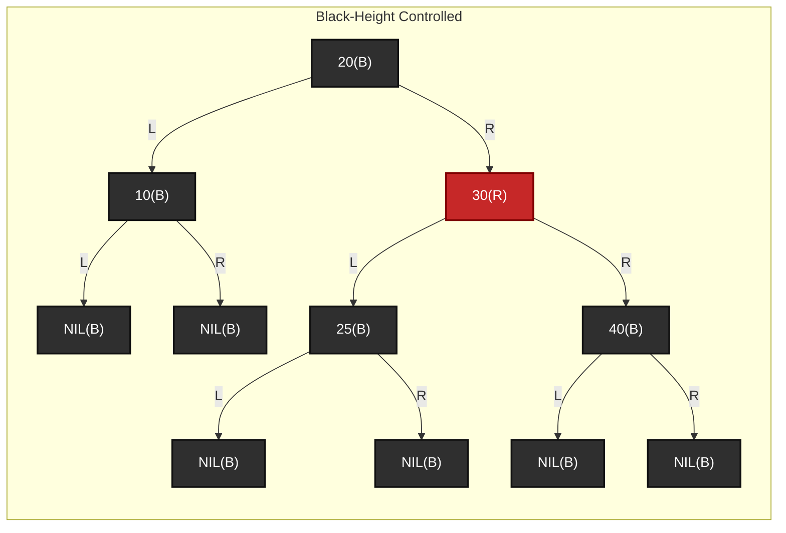
```mermaid
graph LR
	subgraph "Black-Height Controlled"
		A["20(B)"]
		B["10(B)"]
		C["30(R)"]
		D["NIL(B)"]
		E["NIL(B)"]
		F["25(B)"]
		G["40(B)"]
		H["NIL(B)"]
		I["NIL(B)"]
		J["NIL(B)"]
		K["NIL(B)"]
	end

	A -->|"L"| B
	A -->|"R"| C
	B -->|"L"| D
	B -->|"R"| E
	C -->|"L"| F
	C -->|"R"| G
	F -->|"L"| H
	F -->|"R"| I
	G -->|"L"| J
	G -->|"R"| K

	classDef black fill:#2f2f2f,stroke:#111,color:#fff,stroke-width:2px;
	classDef red fill:#c62828,stroke:#7f0000,color:#fff,stroke-width:2px;

	class A,B,D,E,F,G,H,I,J,K black;
	class C red;
```

它对应的 2-3-4 树原型可以这样理解：

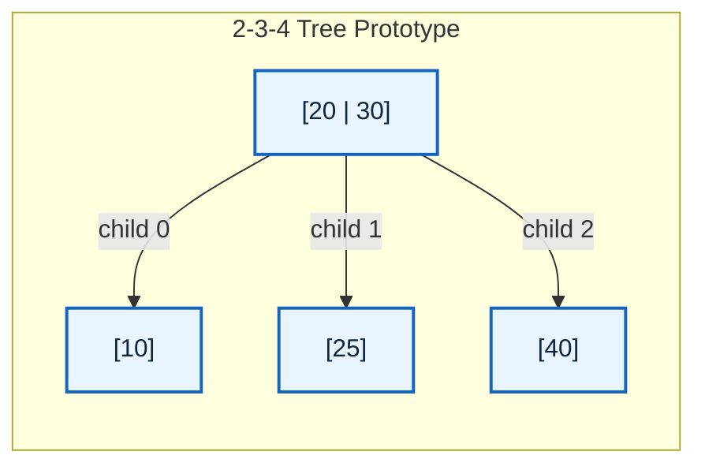
```mermaid
graph LR
	subgraph "2-3-4 Tree Prototype"
		A["[20 | 30]"]
		B["[10]"]
		C["[25]"]
		D["[40]"]
	end

	A -->|"child 0"| B
	A -->|"child 1"| C
	A -->|"child 2"| D

	classDef node234 fill:#e8f4ff,stroke:#1565c0,color:#0d253f,stroke-width:2px;
	class A,B,C,D node234;
```

这里的 `20(B) -> 30(R)` 不是在表达普通二叉搜索树中两个完全独立的黑层级，
而是在二叉表示里模拟 2-3-4 树中的同一个 3-节点 `[20 | 30]`。
所以 `30(R)` 虽然让右侧路径多经过一个真实节点，
但它不增加黑高。

从 `A=20(B)` 到各 NIL 的路径上，黑节点数是受控一致的。
如果统计时包含起点 `A` 和终点 `NIL`，所有路径可以归为下面几类：

- `A(B) -> 10(B) -> NIL(B)`，黑节点数为 3；
- `A(B) -> 30(R) -> 25(B) -> NIL(B)`，黑节点数为 3；
- `A(B) -> 30(R) -> 40(B) -> NIL(B)`，黑节点数为 3。

如果按黑高定义不统计起点 `A`，那么所有路径都是 2 个黑节点：

- `10(B) -> NIL(B)`，黑节点数为 2；
- `30(R) -> 25(B) -> NIL(B)`，黑节点数为 2；
- `30(R) -> 40(B) -> NIL(B)`，黑节点数为 2。

再看一个 4-节点的二叉表示示意：

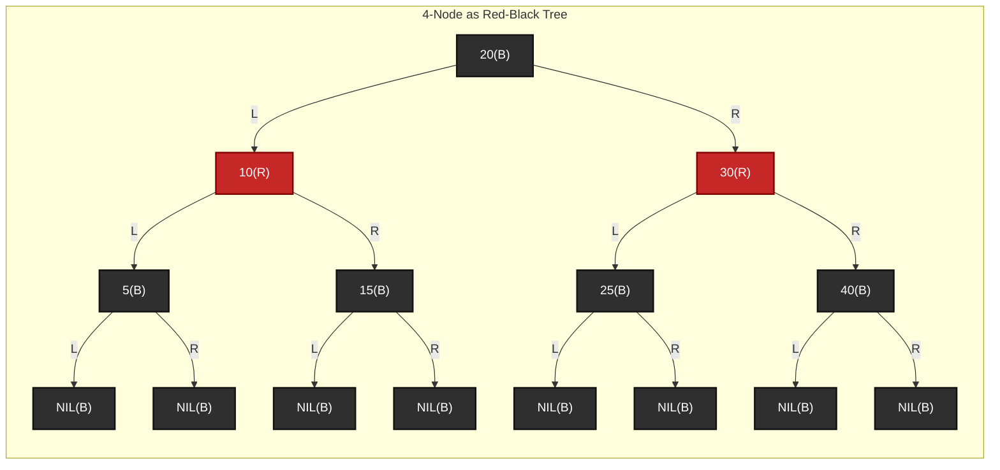
```mermaid
graph LR
	subgraph "4-Node as Red-Black Tree"
		A["20(B)"]
		B["10(R)"]
		C["30(R)"]
		D["5(B)"]
		E["15(B)"]
		F["25(B)"]
		G["40(B)"]
		H["NIL(B)"]
		I["NIL(B)"]
		J["NIL(B)"]
		K["NIL(B)"]
		L["NIL(B)"]
		M["NIL(B)"]
		N["NIL(B)"]
		O["NIL(B)"]
	end

	A -->|"L"| B
	A -->|"R"| C
	B -->|"L"| D
	B -->|"R"| E
	C -->|"L"| F
	C -->|"R"| G
	D -->|"L"| H
	D -->|"R"| I
	E -->|"L"| J
	E -->|"R"| K
	F -->|"L"| L
	F -->|"R"| M
	G -->|"L"| N
	G -->|"R"| O

	classDef black fill:#2f2f2f,stroke:#111,color:#fff,stroke-width:2px;
	classDef red fill:#c62828,stroke:#7f0000,color:#fff,stroke-width:2px;

	class A,D,E,F,G,H,I,J,K,L,M,N,O black;
	class B,C red;
```

它对应的 2-3-4 树原型是：

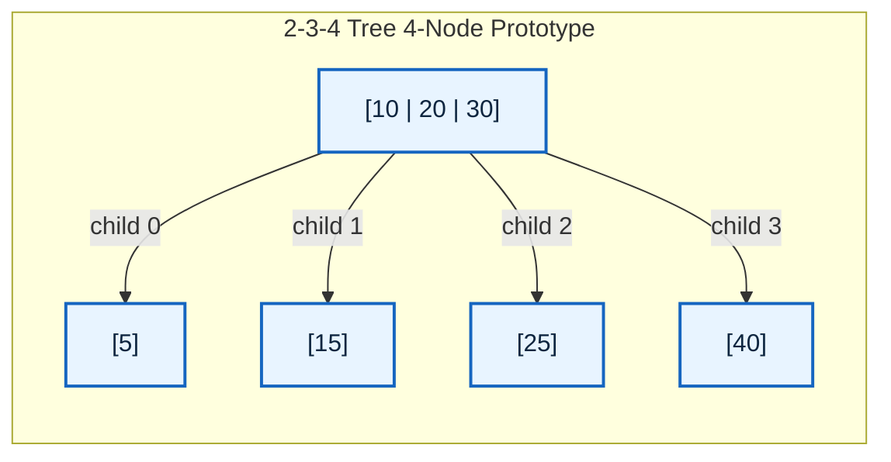
```mermaid
graph LR
	subgraph "2-3-4 Tree 4-Node Prototype"
		A["[10 | 20 | 30]"]
		B["[5]"]
		C["[15]"]
		D["[25]"]
		E["[40]"]
	end

	A -->|"child 0"| B
	A -->|"child 1"| C
	A -->|"child 2"| D
	A -->|"child 3"| E

	classDef node234 fill:#e8f4ff,stroke:#1565c0,color:#0d253f,stroke-width:2px;
	class A,B,C,D,E node234;
```

这里的 `10(R) <- 20(B) -> 30(R)` 共同表达 2-3-4 树中的同一个 4-节点 `[10 | 20 | 30]`。
两个红节点只是把多关键字节点拆成二叉形态，不代表黑高增加。

这才是红黑树高度分析真正依赖的性质。

------

### 7.2.6 五条性质为什么必须整体理解，而不能孤立记忆

到这里，五条性质已经列全。
但如果只是“逐条背诵”，仍然很容易出问题。

因为五条性质并不是并列摆放的五条口号，
它们实际上分成两类：

#### 第一类：定义和边界性质

- 节点非红即黑
- 根为黑
- NIL 为黑

这类性质的作用主要是：

- 统一颜色域；
- 统一边界；
- 统一黑高统计终点。

#### 第二类：结构控制性质

- 红节点不能有红孩子
- 任一路径黑高一致

这类性质才真正控制：

- 局部逻辑节点编码是否合法；
- 全局高度是否受控。

所以如果孤立记忆，就很容易把“根为黑”和“黑高一致”当成同等层面的树高控制规则。
实际上并不是。

更准确的理解应当是：

> 五条性质共同构成红黑树定义；
> 但真正承担局部平衡与全局平衡控制核心职责的，是后两条。

------

### 7.2.7 哪几条性质决定局部约束，哪几条性质决定全局平衡

最后用一个表把职责再压一遍。

| 性质               | 作用层面        | 主要作用                     |
| ------------------ | --------------- | ---------------------------- |
| 节点非红即黑       | 定义层          | 建立离散颜色状态             |
| 根节点为黑         | 边界层          | 统一根边界和修复终点         |
| NIL 叶子为黑       | 边界层 / 统计层 | 统一黑高统计终点             |
| 红节点不能有红孩子 | 局部结构层      | 禁止连续红，控制局部逻辑并入 |
| 任一路径黑高一致   | 全局平衡层      | 限制树高，约束整体层级       |

所以本节最重要的不是把五条话背下来，
而是把它们分层理解：

- 哪些是定义性质；
- 哪些是边界性质；
- 哪些才是真正的平衡控制性质。

------

### 7.2.8 本节小结

本节建立了红黑树最基础的形式定义。

第一，红黑树不是“普通 BST 随便涂色”，而是在 BST 基础上叠加了一套颜色约束系统。
第二，五条性质中，前几条更多承担定义和边界统一作用，真正决定局部与全局平衡的是“红节点不能有红孩子”和“黑高一致”。
第三，红红冲突本质上是在说局部逻辑节点编码失控，黑高一致本质上是在说全局骨架层级受控。
第四，后面所有插入与删除修复，最终都可以被还原为：**修局部红红冲突** 或 **修全局黑高缺失**。

------

## 7.3 红黑树的核心概念

### 7.3.1 黑高

“黑高”是红黑树里最核心的术语之一。

设某个节点为 `x`，那么它的黑高可以理解为：

> **从 `x` 出发，到任一后代 NIL 叶子的路径上，黑节点的数量。**

这里通常约定：

- 若统计时包含 NIL，则 NIL 也算一个黑节点；
- 若统计时不把当前节点自己算进去，则要在定义中明确说明。

教材之间在“是否把当前节点算入黑高”上可能有细微写法差异，
但只要口径统一，不影响算法理解。
本章后续讨论中，只关心：

> **从同一节点出发的所有路径黑高必须一致。**

黑高不是一个附加属性，而是红黑树全局平衡的定量指标。

------

### 7.3.2 红红冲突，以及它的修复方法

所谓红红冲突，就是：

> **当前红节点 `X` 的父节点 `P` 也是红节点。**

这直接违反了红黑树的局部性质：

> **红节点不能有红孩子。**

因此，红红冲突首先是一个**局部违例**。
它的判定不依赖整棵树的全局扫描，只依赖当前插入路径附近的几个节点：

- `X`：当前节点
- `P`：父节点
- `G`：祖父节点
- `U`：叔叔节点

后面所有修复，也都围绕这四个角色展开。

------

#### 7.3.2.1 先看一个最小红红冲突示例

下面这棵树就是一个最小的红红冲突局部：

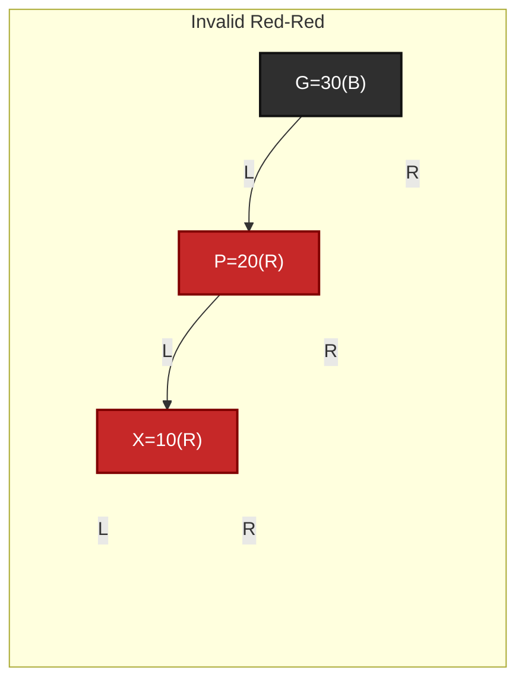
```mermaid
graph LR
	subgraph "Invalid Red-Red"
		G["G=30(B)"]
		P["P=20(R)"]
		RG[" "]
		X["X=10(R)"]
		PG[" "]
		XL[" "]
		XR[" "]
	end

	G -->|"L"| P
	G -->|"R"| RG

	P -->|"L"| X
	P -->|"R"| PG

	X -->|"L"| XL
	X -->|"R"| XR

	classDef black fill:#2f2f2f,stroke:#111,color:#fff,stroke-width:2px;
	classDef red fill:#c62828,stroke:#7f0000,color:#fff,stroke-width:2px;
	classDef ghost fill:transparent,stroke:transparent,color:transparent;

	class G black;
	class P,X red;
	class RG,PG,XL,XR ghost;

	linkStyle 1 stroke:transparent;
	linkStyle 3 stroke:transparent;
	linkStyle 4 stroke:transparent;
	linkStyle 5 stroke:transparent;
```

这里：

- `G=30(B)` 是祖父节点；
- `P=20(R)` 是父节点；
- `X=10(R)` 是当前节点。

问题就在于：

```text
P 是红，X 也是红
```

因此这是标准的红红冲突。

------

#### 7.3.2.2 红红冲突最常出现在哪里

红红冲突最常出现在**插入之后**。

因为红黑树插入时，通常会先按 BST 规则把新节点挂到合适位置，然后把新节点**默认染成红色**。
这样一来，如果父节点 `P` 恰好本来就是红色，那么新节点 `X` 一接上去，就会立刻形成红红冲突。

下面给一个最典型的插入过程。

插入前：

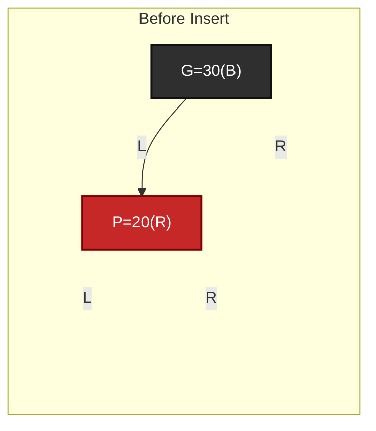
```mermaid
graph LR
	subgraph "Before Insert"
		G["G=30(B)"]
		P["P=20(R)"]
		RG[" "]
		PL[" "]
		PR[" "]
	end

	G -->|"L"| P
	G -->|"R"| RG

	P -->|"L"| PL
	P -->|"R"| PR

	classDef black fill:#2f2f2f,stroke:#111,color:#fff,stroke-width:2px;
	classDef red fill:#c62828,stroke:#7f0000,color:#fff,stroke-width:2px;
	classDef ghost fill:transparent,stroke:transparent,color:transparent;

	class G black;
	class P red;
	class RG,PL,PR ghost;

	linkStyle 1 stroke:transparent;
	linkStyle 2 stroke:transparent;
	linkStyle 3 stroke:transparent;
```

现在插入关键字 `10`。
按 BST 路径：

- `10 < 30`，进入左子树；
- `10 < 20`，挂到 `P` 的左侧。

插入后，新节点默认染红：

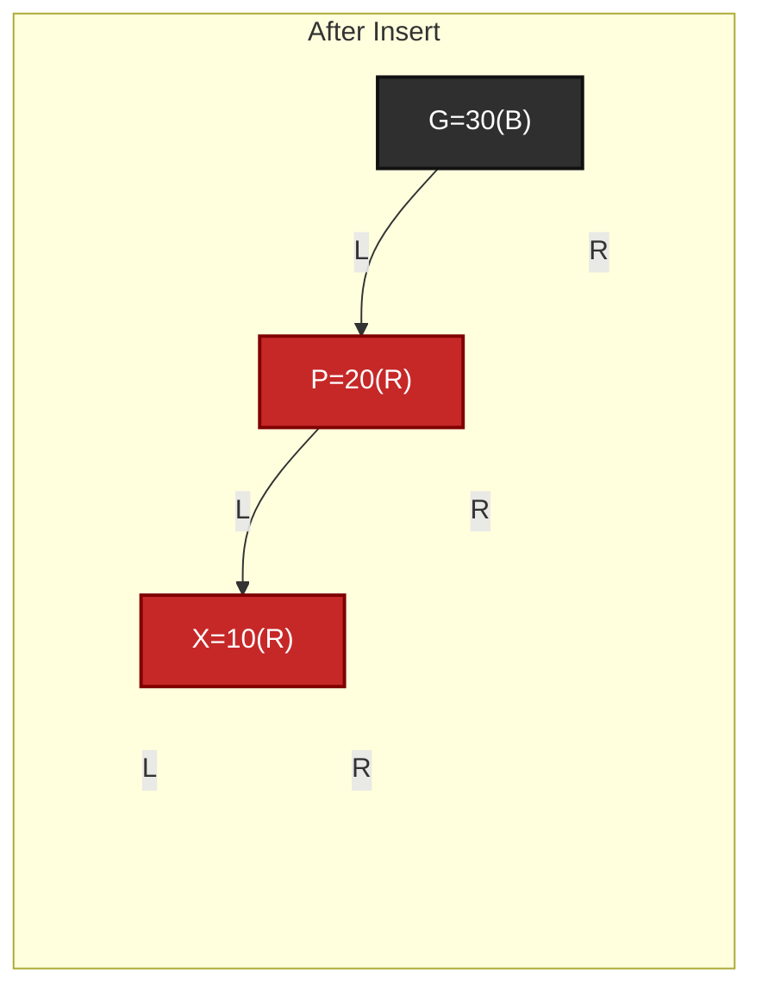
```mermaid
graph LR
	subgraph "After Insert"
		G["G=30(B)"]
		P["P=20(R)"]
		RG[" "]
		X["X=10(R)"]
		PR[" "]
		XL[" "]
		XR[" "]
	end

	G -->|"L"| P
	G -->|"R"| RG

	P -->|"L"| X
	P -->|"R"| PR

	X -->|"L"| XL
	X -->|"R"| XR

	classDef black fill:#2f2f2f,stroke:#111,color:#fff,stroke-width:2px;
	classDef red fill:#c62828,stroke:#7f0000,color:#fff,stroke-width:2px;
	classDef ghost fill:transparent,stroke:transparent,color:transparent;

	class G black;
	class P,X red;
	class RG,PR,XL,XR ghost;

	linkStyle 1 stroke:transparent;
	linkStyle 3 stroke:transparent;
	linkStyle 4 stroke:transparent;
	linkStyle 5 stroke:transparent;
```

于是立刻得到：

- `P` 红
- `X` 红

这就是插入后最典型的红红冲突来源。

------

#### 7.3.2.3 为什么红红冲突通常不直接破坏黑高一致

红红冲突首先破坏的是：

- **红节点不能有红孩子**

它通常不直接意味着：

- **黑高已经不一致**

看下面这张补全了 NIL 黑叶子的图：

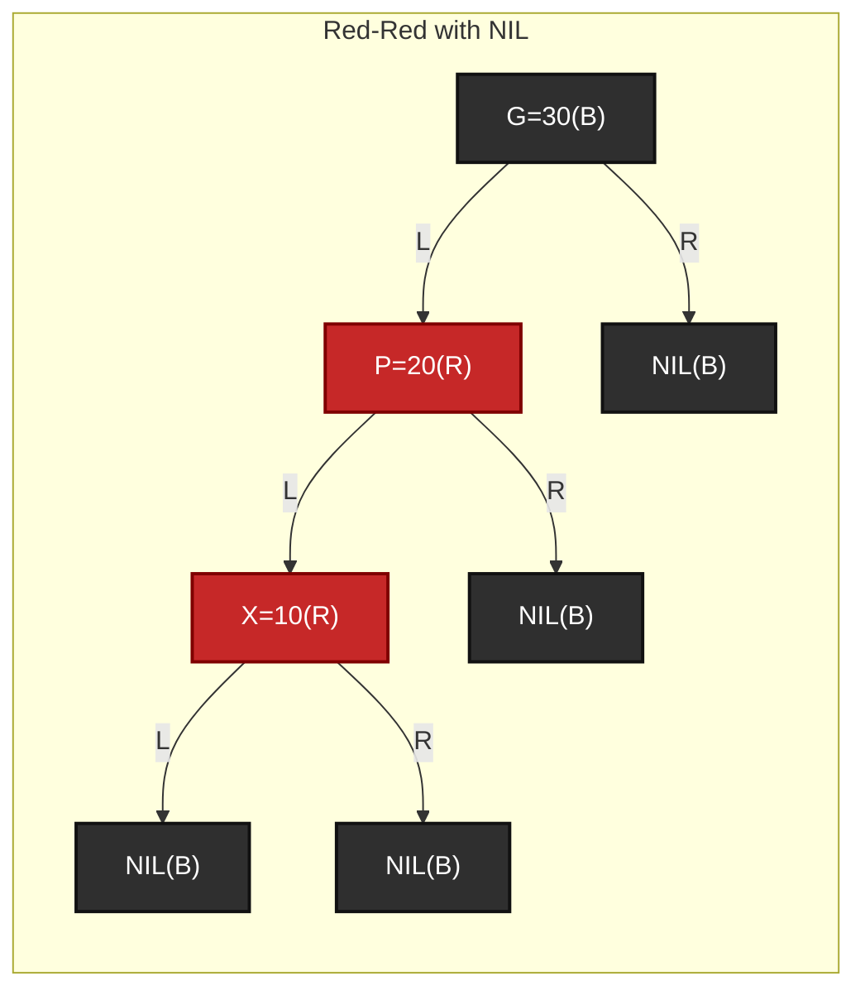
```mermaid
graph LR
	subgraph "Red-Red with NIL"
		G["G=30(B)"]
		P["P=20(R)"]
		RG["NIL(B)"]
		X["X=10(R)"]
		PR["NIL(B)"]
		XL["NIL(B)"]
		XR["NIL(B)"]
	end

	G -->|"L"| P
	G -->|"R"| RG

	P -->|"L"| X
	P -->|"R"| PR

	X -->|"L"| XL
	X -->|"R"| XR

	classDef black fill:#2f2f2f,stroke:#111,color:#fff,stroke-width:2px;
	classDef red fill:#c62828,stroke:#7f0000,color:#fff,stroke-width:2px;

	class G,RG,PR,XL,XR black;
	class P,X red;
```

比较两条路径的黑节点数：

- 路径一：`G=30(B) -> NIL(B)`，黑节点数为 2
- 路径二：`G=30(B) -> P=20(R) -> X=10(R) -> NIL(B)`，黑节点数仍为 2

可见：

- 红红冲突已经出现；
- 但黑高仍可能一致。

原因是：

> **红节点不计入黑高。**

所以红红冲突和黑高缺失是两种不同层面的违例：

- 红红冲突：局部红节点排列非法
- 黑高缺失：全局黑层级计数不一致

------

#### 7.3.2.4 为什么红红冲突可以理解为“局部逻辑节点编码超限”

这一点必须结合 2-3-4 树来看。

先看一个合法的 `3-node` 映射：

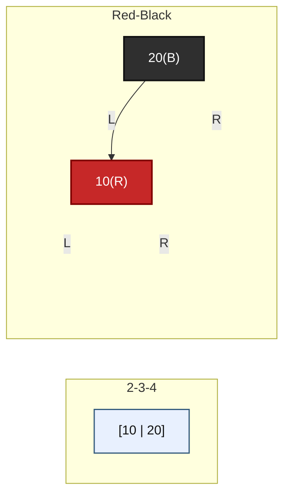
```mermaid
graph LR
	subgraph "2-3-4"
		A["[10 | 20]"]
	end

	subgraph "Red-Black"
		B["20(B)"]
		C["10(R)"]
		RG[" "]
		CL[" "]
		CR[" "]
	end

	B -->|"L"| C
	B -->|"R"| RG

	C -->|"L"| CL
	C -->|"R"| CR

	classDef node234 fill:#e8f0fe,stroke:#355c7d,color:#111,stroke-width:1.5px;
	classDef black fill:#2f2f2f,stroke:#111,color:#fff,stroke-width:2px;
	classDef red fill:#c62828,stroke:#7f0000,color:#fff,stroke-width:2px;
	classDef ghost fill:transparent,stroke:transparent,color:transparent;

	class A node234;
	class B black;
	class C red;
	class RG,CL,CR ghost;

	linkStyle 1 stroke:transparent;
	linkStyle 2 stroke:transparent;
	linkStyle 3 stroke:transparent;
```

再看一个合法的 `4-node` 映射：

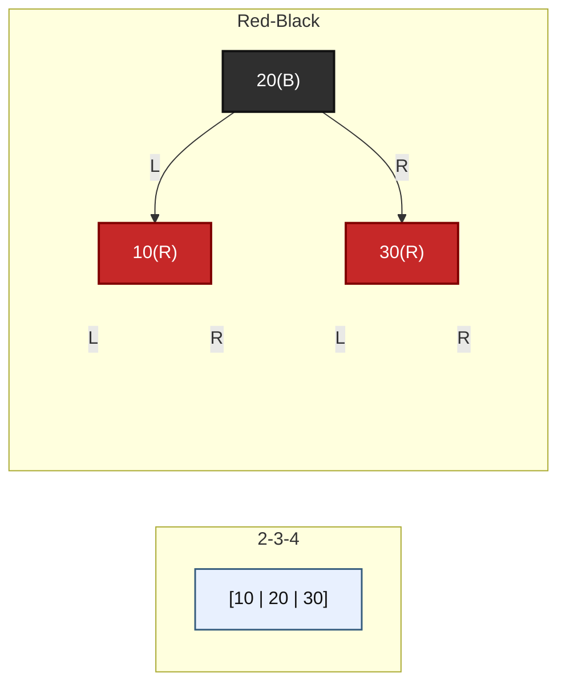
```mermaid
graph LR
	subgraph "2-3-4"
		A["[10 | 20 | 30]"]
	end

	subgraph "Red-Black"
		B["20(B)"]
		C["10(R)"]
		D["30(R)"]
		CL[" "]
		CR[" "]
		DL[" "]
		DR[" "]
	end

	B -->|"L"| C
	B -->|"R"| D

	C -->|"L"| CL
	C -->|"R"| CR

	D -->|"L"| DL
	D -->|"R"| DR

	classDef node234 fill:#e8f0fe,stroke:#355c7d,color:#111,stroke-width:1.5px;
	classDef black fill:#2f2f2f,stroke:#111,color:#fff,stroke-width:2px;
	classDef red fill:#c62828,stroke:#7f0000,color:#fff,stroke-width:2px;
	classDef ghost fill:transparent,stroke:transparent,color:transparent;

	class A node234;
	class B black;
	class C,D red;
	class CL,CR,DL,DR ghost;

	linkStyle 2 stroke:transparent;
	linkStyle 3 stroke:transparent;
	linkStyle 4 stroke:transparent;
	linkStyle 5 stroke:transparent;
```

现在再看红红冲突：

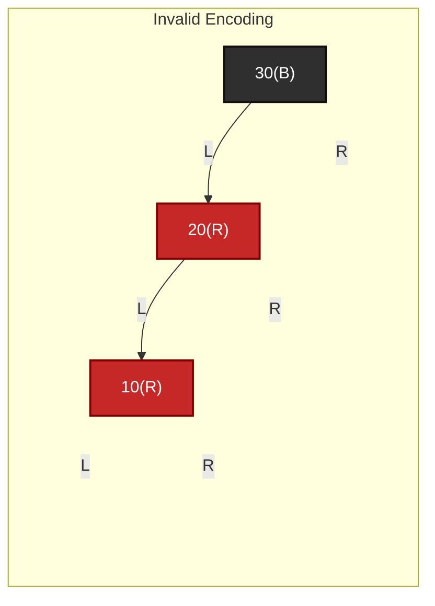
```mermaid
graph LR
	subgraph "Invalid Encoding"
		G["30(B)"]
		P["20(R)"]
		RG[" "]
		X["10(R)"]
		PR[" "]
		XL[" "]
		XR[" "]
	end

	G -->|"L"| P
	G -->|"R"| RG

	P -->|"L"| X
	P -->|"R"| PR

	X -->|"L"| XL
	X -->|"R"| XR

	classDef black fill:#2f2f2f,stroke:#111,color:#fff,stroke-width:2px;
	classDef red fill:#c62828,stroke:#7f0000,color:#fff,stroke-width:2px;
	classDef ghost fill:transparent,stroke:transparent,color:transparent;

	class G black;
	class P,X red;
	class RG,PR,XL,XR ghost;

	linkStyle 1 stroke:transparent;
	linkStyle 3 stroke:transparent;
	linkStyle 4 stroke:transparent;
	linkStyle 5 stroke:transparent;
```

这里的问题在于：

- `P=20(R)` 本来就表示它应并入某个黑节点；
- `X=10(R)` 又继续并入 `P`；
- 于是这不再对应一个合法的 `2-node / 3-node / 4-node` 编码；
- 而变成了局部逻辑节点继续膨胀的非法结构。

因此，红红冲突更准确的结构解释是：

> **当前局部红黑树，不再对应合法的 2-3-4 树节点编码。**

所以修复红红冲突，本质上是在把一个非法编码重新压回合法编码。

------

#### 7.3.2.5 红红冲突的修复目标

既然红红冲突本质上是“局部逻辑节点编码超限”，
那么它的修复目标就不是“颜色看起来顺眼”，而是：

> **把当前局部重新整理成一个合法的 2-node / 3-node / 4-node 编码。**

红黑树里真正能用的动作只有两类：

- **染色**
- **旋转**

它们服务的结构目标是统一的：

1. 消除红父红子的直接相邻关系；
2. 不破坏 BST 有序性；
3. 尽量保持黑高一致；
4. 把非法局部重新编码成合法结构。

红红冲突最经典地分成三类来修。

------

#### 7.3.2.6 解法一：叔叔为红 —— 染色上推

先给角色和位置。

- `G`：祖父
- `P`：父
- `U`：叔叔
- `X`：当前节点

现在看这种局部：

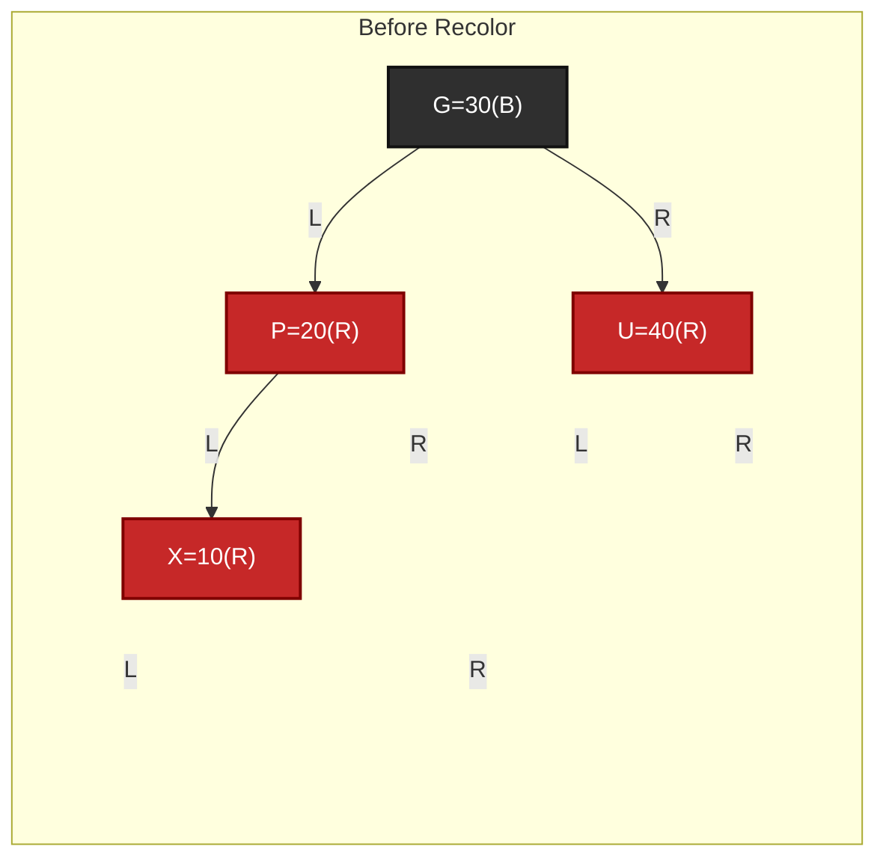
```mermaid
graph LR
	subgraph "Before Recolor"
		G["G=30(B)"]
		P["P=20(R)"]
		U["U=40(R)"]
		X["X=10(R)"]
		PR[" "]
		UL[" "]
		UR[" "]
		XL[" "]
		XR[" "]
	end

	G -->|"L"| P
	G -->|"R"| U

	P -->|"L"| X
	P -->|"R"| PR

	U -->|"L"| UL
	U -->|"R"| UR

	X -->|"L"| XL
	X -->|"R"| XR

	classDef black fill:#2f2f2f,stroke:#111,color:#fff,stroke-width:2px;
	classDef red fill:#c62828,stroke:#7f0000,color:#fff,stroke-width:2px;
	classDef ghost fill:transparent,stroke:transparent,color:transparent;

	class G black;
	class P,U,X red;
	class PR,UL,UR,XL,XR ghost;

	linkStyle 3 stroke:transparent;
	linkStyle 4 stroke:transparent;
	linkStyle 5 stroke:transparent;
	linkStyle 6 stroke:transparent;
	linkStyle 7 stroke:transparent;
```

这里的特点是：

- `P` 红
- `U` 红
- `X` 红

也就是祖父 `G` 的两侧都已经是“红色并入部分”。
从 2-3-4 树语义看，这一整团更像一个满逻辑节点，需要做一次“分裂上推”。

把这个局部还原成 2-3-4 树视角，可以这样看：

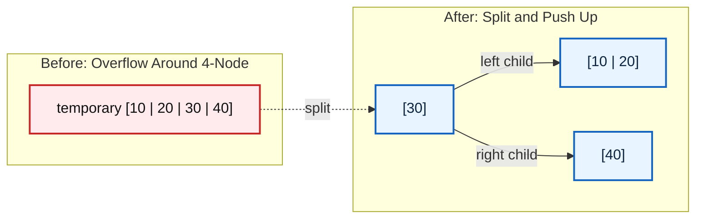
```mermaid
graph LR
	subgraph "Before: Overflow Around 4-Node"
		A["temporary [10 | 20 | 30 | 40]"]
	end

	subgraph "After: Split and Push Up"
		B["[30]"]
		C["[10 | 20]"]
		D["[40]"]
	end

	A -. "split" .-> B
	B -->|"left child"| C
	B -->|"right child"| D

	classDef overflow fill:#ffebee,stroke:#c62828,color:#111,stroke-width:2px;
	classDef node234 fill:#e8f4ff,stroke:#1565c0,color:#0d253f,stroke-width:2px;

	class A overflow;
	class B,C,D node234;
```

也就是说，叔叔为红时，红黑树的染色并不是“随便换颜色”，
而是在模拟 2-3-4 树里满节点被插入后发生的分裂：

- 中间关键字 `30` 上推；
- 左侧 `[10 | 20]` 留作一个子节点；
- 右侧 `[40]` 留作另一个子节点。

红黑树里的对应动作就是：

- `P` 染黑
- `U` 染黑
- `G` 染红

得到：

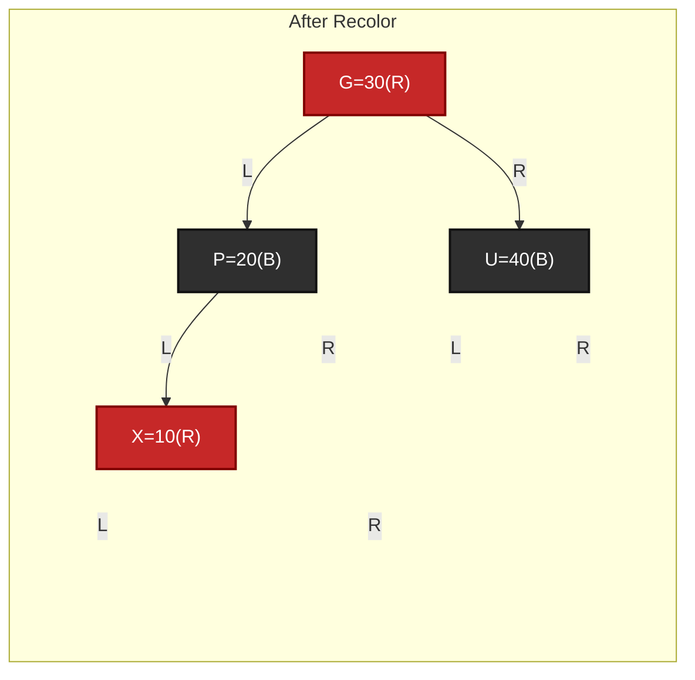
```mermaid
graph LR
	subgraph "After Recolor"
		G["G=30(R)"]
		P["P=20(B)"]
		U["U=40(B)"]
		X["X=10(R)"]
		PR[" "]
		UL[" "]
		UR[" "]
		XL[" "]
		XR[" "]
	end

	G -->|"L"| P
	G -->|"R"| U

	P -->|"L"| X
	P -->|"R"| PR

	U -->|"L"| UL
	U -->|"R"| UR

	X -->|"L"| XL
	X -->|"R"| XR

	classDef black fill:#2f2f2f,stroke:#111,color:#fff,stroke-width:2px;
	classDef red fill:#c62828,stroke:#7f0000,color:#fff,stroke-width:2px;
	classDef ghost fill:transparent,stroke:transparent,color:transparent;

	class P,U black;
	class G,X red;
	class PR,UL,UR,XL,XR ghost;

	linkStyle 3 stroke:transparent;
	linkStyle 4 stroke:transparent;
	linkStyle 5 stroke:transparent;
	linkStyle 6 stroke:transparent;
	linkStyle 7 stroke:transparent;
```

这样一来：

- `P` 与 `X` 的红红冲突被消除；
- 当前局部恢复合法；
- 但 `G` 如果上面还有红父节点，问题可能继续上推。

所以这一类修法叫：

> **染色上推**

它的特点是：

- 当前层不旋转；
- 当前局部先“分裂”；
- 问题可能继续向上传播。

------

#### 7.3.2.7 解法二：叔叔为黑，外侧 —— 单旋 + 染色

现在看第二类。
这一类可以在当前层一次修好。

先看左左外侧的局部：

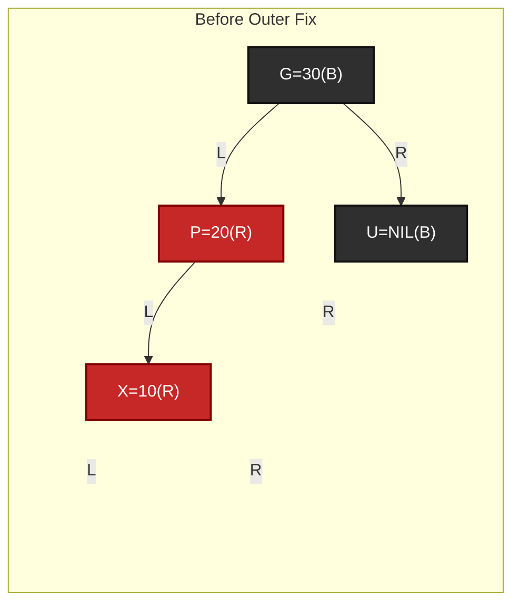
```mermaid
graph LR
	subgraph "Before Outer Fix"
		G["G=30(B)"]
		P["P=20(R)"]
		U["U=NIL(B)"]
		X["X=10(R)"]
		PR[" "]
		XL[" "]
		XR[" "]
	end

	G -->|"L"| P
	G -->|"R"| U

	P -->|"L"| X
	P -->|"R"| PR

	X -->|"L"| XL
	X -->|"R"| XR

	classDef black fill:#2f2f2f,stroke:#111,color:#fff,stroke-width:2px;
	classDef red fill:#c62828,stroke:#7f0000,color:#fff,stroke-width:2px;
	classDef ghost fill:transparent,stroke:transparent,color:transparent;

	class G,U black;
	class P,X red;
	class PR,XL,XR ghost;

	linkStyle 3 stroke:transparent;
	linkStyle 4 stroke:transparent;
	linkStyle 5 stroke:transparent;
```

这里：

- `P` 是 `G` 的左孩子；
- `X` 是 `P` 的左孩子；
- `U` 是黑色叔叔（这里用黑色 NIL 表示）

这是一个**外侧结构**。

从 2-3-4 树语义看，这个局部的修复目标很明确：

```mermaid
graph LR
	subgraph "Invalid RB Encoding"
		A["30(B)"]
		B["20(R)"]
		C["10(R)"]
	end

	subgraph "Target 2-3-4 Node"
		D["[10 | 20 | 30]"]
	end

	A --> B
	B --> C
	A -. "re-encode" .-> D

	classDef black fill:#2f2f2f,stroke:#111,color:#fff,stroke-width:2px;
	classDef red fill:#c62828,stroke:#7f0000,color:#fff,stroke-width:2px;
	classDef node234 fill:#e8f4ff,stroke:#1565c0,color:#0d253f,stroke-width:2px;

	class A black;
	class B,C red;
	class D node234;
```

也就是把 `10、20、30` 重新编码成一个合法 4-节点 `[10 | 20 | 30]`。
外侧结构本身已经满足“中间关键字 `20` 应该上来当局部黑根”的形状，
所以只需要一次围绕 `G` 的旋转。

修法是：

1. 围绕 `G` 做一次右旋；
2. 交换 `P` 和 `G` 的颜色。

得到：

```mermaid
graph LR
	subgraph "After Outer Fix"
		P["P=20(B)"]
		X["X=10(R)"]
		G["G=30(R)"]
		XL[" "]
		XR[" "]
		GL[" "]
		GR[" "]
	end

	P -->|"L"| X
	P -->|"R"| G

	X -->|"L"| XL
	X -->|"R"| XR

	G -->|"L"| GL
	G -->|"R"| GR

	classDef black fill:#2f2f2f,stroke:#111,color:#fff,stroke-width:2px;
	classDef red fill:#c62828,stroke:#7f0000,color:#fff,stroke-width:2px;
	classDef ghost fill:transparent,stroke:transparent,color:transparent;

	class P black;
	class X,G red;
	class XL,XR,GL,GR ghost;

	linkStyle 2 stroke:transparent;
	linkStyle 3 stroke:transparent;
	linkStyle 4 stroke:transparent;
	linkStyle 5 stroke:transparent;
```

这样之后：

- 红红冲突消失；
- 当前局部立刻恢复合法；
- 不需要继续上推。

对应回 2-3-4 树，就是这个合法 4-节点：

```mermaid
graph LR
	subgraph "2-3-4 Target"
		A["[10 | 20 | 30]"]
	end

	subgraph "Red-Black Encoding"
		B["20(B)"]
		C["10(R)"]
		D["30(R)"]
	end

	B -->|"L"| C
	B -->|"R"| D

	classDef node234 fill:#e8f4ff,stroke:#1565c0,color:#0d253f,stroke-width:2px;
	classDef black fill:#2f2f2f,stroke:#111,color:#fff,stroke-width:2px;
	classDef red fill:#c62828,stroke:#7f0000,color:#fff,stroke-width:2px;

	class A node234;
	class B black;
	class C,D red;
```

右右外侧是完全对称的，逻辑一样。

------

#### 7.3.2.8 解法三：叔叔为黑，内侧 —— 先转外侧，再旋转 + 染色

第三类是最容易让人觉得“为什么要多转一次”的情形。
实际上，它只是在做一次**结构预处理**。

先看左-右内侧：

```mermaid
graph LR
	subgraph "Before Inner Fix"
		G["G=30(B)"]
		P["P=10(R)"]
		U["U=NIL(B)"]
		PL[" "]
		X["X=20(R)"]
		XL[" "]
		XR[" "]
	end

	G -->|"L"| P
	G -->|"R"| U

	P -->|"L"| PL
	P -->|"R"| X

	X -->|"L"| XL
	X -->|"R"| XR

	classDef black fill:#2f2f2f,stroke:#111,color:#fff,stroke-width:2px;
	classDef red fill:#c62828,stroke:#7f0000,color:#fff,stroke-width:2px;
	classDef ghost fill:transparent,stroke:transparent,color:transparent;

	class G,U black;
	class P,X red;
	class PL,XL,XR ghost;

	linkStyle 2 stroke:transparent;
	linkStyle 4 stroke:transparent;
	linkStyle 5 stroke:transparent;
```

这里：

- `P` 是 `G` 的左孩子；
- `X` 是 `P` 的右孩子；

所以 `X` 在“内侧”。

这种结构不能直接套用上一类“外侧单旋”的修法。
因为此时中间关键字 `20` 还夹在 `10` 和 `30` 之间，
红黑树形态却没有先把 `20` 放到适合上升的位置。

从 2-3-4 树目标看，它仍然应该被整理成同一个 4-节点：

```mermaid
graph LR
	subgraph "Invalid Inner RB Encoding"
		A["30(B)"]
		B["10(R)"]
		C["20(R)"]
	end

	subgraph "Target 2-3-4 Node"
		D["[10 | 20 | 30]"]
	end

	A --> B
	B --> C
	A -. "re-encode" .-> D

	classDef black fill:#2f2f2f,stroke:#111,color:#fff,stroke-width:2px;
	classDef red fill:#c62828,stroke:#7f0000,color:#fff,stroke-width:2px;
	classDef node234 fill:#e8f4ff,stroke:#1565c0,color:#0d253f,stroke-width:2px;

	class A black;
	class B,C red;
	class D node234;
```

因此第一步先围绕 `P` 左旋，把它转成外侧：

```mermaid
graph LR
	subgraph "Convert Inner to Outer"
		G["G=30(B)"]
		X["X=20(R)"]
		U["U=NIL(B)"]
		P["P=10(R)"]
		XR[" "]
		PL[" "]
		PR[" "]
	end

	G -->|"L"| X
	G -->|"R"| U

	X -->|"L"| P
	X -->|"R"| XR

	P -->|"L"| PL
	P -->|"R"| PR

	classDef black fill:#2f2f2f,stroke:#111,color:#fff,stroke-width:2px;
	classDef red fill:#c62828,stroke:#7f0000,color:#fff,stroke-width:2px;
	classDef ghost fill:transparent,stroke:transparent,color:transparent;

	class G,U black;
	class X,P red;
	class XR,PL,PR ghost;

	linkStyle 1 stroke:transparent;
	linkStyle 4 stroke:transparent;
	linkStyle 5 stroke:transparent;
```

现在它已经变成上一类的“左左外侧”结构。
然后再围绕 `G` 右旋，并交换 `X` 与 `G` 的颜色，得到最终结果：

```mermaid
graph LR
	subgraph "Final After Inner Fix"
		X["X=20(B)"]
		P["P=10(R)"]
		G["G=30(R)"]
		PL[" "]
		PR[" "]
		GL[" "]
		GR[" "]
	end

	X -->|"L"| P
	X -->|"R"| G

	P -->|"L"| PL
	P -->|"R"| PR

	G -->|"L"| GL
	G -->|"R"| GR

	classDef black fill:#2f2f2f,stroke:#111,color:#fff,stroke-width:2px;
	classDef red fill:#c62828,stroke:#7f0000,color:#fff,stroke-width:2px;
	classDef ghost fill:transparent,stroke:transparent,color:transparent;

	class X black;
	class P,G red;
	class PL,PR,GL,GR ghost;

	linkStyle 2 stroke:transparent;
	linkStyle 3 stroke:transparent;
	linkStyle 4 stroke:transparent;
	linkStyle 5 stroke:transparent;
```

所以“内侧多转一次”的本质不是额外魔法，而是：

> **先把内侧结构变成外侧结构，再用外侧的标准修法一次解决。**

最终结果对应的 2-3-4 树原型仍然是：

```mermaid
graph LR
	subgraph "2-3-4 Target"
		A["[10 | 20 | 30]"]
	end

	subgraph "Red-Black Encoding"
		B["20(B)"]
		C["10(R)"]
		D["30(R)"]
	end

	B -->|"L"| C
	B -->|"R"| D

	classDef node234 fill:#e8f4ff,stroke:#1565c0,color:#0d253f,stroke-width:2px;
	classDef black fill:#2f2f2f,stroke:#111,color:#fff,stroke-width:2px;
	classDef red fill:#c62828,stroke:#7f0000,color:#fff,stroke-width:2px;

	class A node234;
	class B black;
	class C,D red;
```

右-左内侧完全对称。

------

#### 7.3.2.9 把三类修法压缩成一张总图

到这里，红红冲突的修法可以压缩成一张总流程图：

```mermaid
flowchart LR
	A["出现红红冲突"] --> B{"叔叔 U 是红 ?"}
	B -- "是" --> C["P 染黑，U 染黑，G 染红\n问题上推"]
	B -- "否" --> D{"X 在外侧 ?"}
	D -- "是" --> E["围绕 G 单旋\n再交换 P / G 或 X / G 颜色"]
	D -- "否" --> F["先围绕 P 旋转\n把内侧转成外侧"]
	F --> E
```

这张图就是红黑树插入修复的最小骨架。

------

#### 7.3.2.10 本小节小结

现在这一小节已经把“红红冲突是什么、为什么出现、怎么修”合在了一起。
最应该记住的是下面六点。

第一，红红冲突的定义非常直接：**红节点的父节点也是红节点。**
第二，它最常出现在插入之后，因为新节点通常先染红。
第三，它首先是一个**局部违例**，判定只依赖当前节点 `X` 与父节点 `P`。
第四，它通常不直接破坏黑高一致，而是在表达：**当前局部红黑树编码已经不再对应合法的 2-3-4 树节点。**
第五，它的修复目标不是“随便改颜色”，而是**把非法局部重新整理成合法的 2-node / 3-node / 4-node 编码。**
第六，它的修法可以统一压成三类：

- **叔叔红：染色上推**
- **叔叔黑且外侧：单旋 + 染色**
- **叔叔黑且内侧：先转外侧，再旋转 + 染色**

这一节讲完之后，红红冲突就不再只是一个术语，而已经是一套完整的：

- 定义
- 示例
- 结构解释
- 修复方法

的闭环内容。

------

### 7.3.3 黑高缺失

和红红冲突对应，黑高缺失是删除时最重要的概念。

所谓黑高缺失，可以粗略理解为：

> **某条路径在删除后，比其他路径少了一个黑。**

这不一定直接体现在“高度差很多”，
而是体现在：

- 黑节点计数不再一致；
- 某个局部子树路径上的骨架层少了一层。

这就是为什么删除黑节点比删除红节点麻烦得多。
因为删除红节点通常不改变黑高，
而删除黑节点则可能导致黑高缺失传播。

后面红黑树删除中的“双重黑”问题，本质上就是在表达：

> **这里少掉的那个黑，还没有被消化。**

------

### 7.3.4 为什么插入主要是在修红红冲突

插入时，新节点通常会先染成红色。
这样做的理由后面第 8 章会展开，但在本章先抓住结果：

- 染红不会立即增加黑高；
- 因此不会立刻破坏黑高一致；
- 但若父节点也是红色，就会出现红红冲突。

所以插入的主导问题通常是：

> **局部红红冲突**

而不是：

> **黑高整体失衡**

这就是为什么红黑树插入修复看起来大多围绕：

- 父红
- 叔叔红 / 黑
- 染色
- 旋转

来展开。

------

### 7.3.5 为什么删除主要是在修黑高缺失

删除时，真正危险的是删掉了黑节点。
一旦某条路径少了一个黑，
这条路径与其他路径的黑高就不一致了。

所以删除修复主要在处理的是：

> **黑高缺失如何补回来或继续上传。**

因此删除 fix-up 与插入 fix-up 的重心完全不同：

- 插入主要修“红红冲突”
- 删除主要修“黑高缺失”

这也是为什么很多人觉得删除比插入难。
因为删除不是简单地解决一个局部颜色相邻问题，
而是在修复全局路径骨架计数。

------

### 7.3.6 黑高与树高度之间的关系

这一小节只先给直觉，不展开正式证明。
正式高度控制会在 7.5 节完整说明。

这里先固定一个非常关键的关系：

- 黑高一致保证“骨架层级”在所有路径上是齐的；
- 红节点不能连续保证“骨架层之间夹的红层”不会无限增加；
- 因此最长路径不会比最短路径长太多。

这意味着：

> 红黑树虽然允许局部不对称，
> 但这种不对称是被严格限制住的。

所以黑高不是一个抽象概念，而是高度受控的直接基础。

------

### 7.3.7 本节小结

本节把后面插入与删除修复要频繁用到的术语先压实了。

第一，黑高是红黑树全局平衡的定量指标。
第二，红红冲突是插入时最常见的局部违例。
第三，黑高缺失是删除时最核心的全局问题。
第四，插入与删除之所以修复逻辑完全不同，不是因为操作表面不同，而是因为它们破坏的结构性质本来就不同。

------

## 7.4 2-3-4 树与红黑树的映射关系

### 7.4.0 章节内容说明

到前一节为止，红黑树自己的形式定义已经建立起来了：

- 它首先是一棵 BST；
- 它有五条性质；
- 它通过黑高和红红冲突来控制局部与全局结构。

但如果到这里就停下，红黑树仍然会给人一种“规则很多、颜色很多、修复很多”的感觉。
你会知道它要满足哪些条件，却不一定知道：

> **这些条件究竟在模拟什么更高层的结构。**

这一节就是要把这个问题彻底说明白：

> **红黑树不是凭空出现的一套颜色规则。**
> **它本质上是在用二叉树，编码 2-3-4 树这种多路平衡搜索树。**

因此，这一节的任务不是继续背性质，而是做三件事：

第一，把 `2-node / 3-node / 4-node` 分别如何映射到红黑树讲清楚。
第二，把“红链接为什么表示逻辑合并”讲清楚。
第三，把“为什么普通红黑树不要求固定左倾，而左倾红黑树却要固定左倾”讲清楚。

这一节一旦吃透，后面第 8 章和第 9 章的插入 / 删除修复，就不再只是“case 分类”，而会重新回到：

- 逻辑节点在扩张还是分裂；
- 逻辑节点在借位还是合并；
- 红黑树只是在做二叉编码下的局部重排。

------

### 7.4.1 为什么必须从 2-3-4 树视角看红黑树

如果你只从红黑树表面去看它，最容易得到的印象是：

- 根必须黑；
- 红节点不能有红孩子；
- 路径黑高要一致；
- 插入删节点后要染色、要旋转。

这些话都对。
但如果没有 2-3-4 树这层参照，红黑树很容易被理解成：

> “一棵 BST，再附加几条人为规则。”

这会带来两个问题。

#### 第一，颜色语义会变空

如果没有 2-3-4 树视角，你很容易把红色理解成：

- 某种危险状态；
- 某种临时状态；
- 某种修复中间色。

但其实红色更重要的结构意义是：

> **它表示某个物理节点，不应该被当成独立逻辑层，而应并入某个黑节点所代表的逻辑节点。**

也就是说，红色首先不是“危险色”，而是“并入色”。

------

#### 第二，后续修复会变成死记硬背

比如：

- 为什么父红叔红时只染色不一定旋转？
- 为什么删除时有些情况要把问题继续往上推？
- 为什么有时候先旋转一次只是为了转成另一种情形？

如果没有 2-3-4 树作参照，这些都像是红黑树自己凭空发明出来的修补术。
而一旦你从 2-3-4 树看，就会发现这些动作其实是在表达：

- 逻辑 4-node 的分裂；
- 借位成功；
- 合并后问题上传；
- 先把局部形态转成标准借位 / 分裂形态。

所以这一节不是“补充理解”，而是后续第 8、9 章的真正结构基础。

------

### 7.4.2 2-node 如何映射到红黑树

先看最简单的逻辑节点：`2-node`。

`2-node` 的定义非常直接：

- 1 个关键字；
- 若是内部节点，则有 2 个孩子；
- 本身已经是一个合法、最小的逻辑节点。

例如：

```mermaid
graph LR
	subgraph "2-3-4"
		A["[20]"]
	end

	classDef node234 fill:#e8f0fe,stroke:#355c7d,color:#111,stroke-width:1.5px;
	class A node234;
```

它映射到红黑树时，不需要任何额外展开。
最直接的二叉表示就是一个黑节点：

```mermaid
graph LR
	subgraph "Red-Black"
		B["20(B)"]
		LG[" "]
		RG[" "]
	end

	B -->|"L"| LG
	B -->|"R"| RG

	classDef black fill:#2f2f2f,stroke:#111,color:#fff,stroke-width:2px;
	classDef ghost fill:transparent,stroke:transparent,color:transparent;

	class B black;
	class LG,RG ghost;

	linkStyle 0 stroke:transparent;
	linkStyle 1 stroke:transparent;
```

这说明：

> **单独一个黑节点，逻辑上就对应一个 2-node。**

这里没有红节点参与，也没有合并关系。
它就是红黑树骨架层最基本的单位。

------

#### 7.4.2.1 为什么 2-node 对应黑节点而不是红节点

因为黑节点承担的是“骨架层”语义。
而 2-node 本身就是一个独立逻辑节点，不需要并入别人，也不需要被别人吸收。

如果你把一个独立逻辑节点映射成红节点，就会出现语义问题：

- 红节点按红黑树解释，通常意味着它依附于某个黑节点；
- 但 2-node 并不依附于别人，它自己就是完整节点。

所以：

> **2-node 必须对应黑节点。**

这也是为什么红黑树中，所有逻辑骨架层最终都落在黑节点上。

------

### 7.4.3 3-node 如何映射到红黑树

现在进入最关键的第一个“非平凡映射”：`3-node`。

`3-node` 的定义是：

- 2 个关键字；
- 3 个区间；
- 逻辑上仍然是一个节点。

例如：

```mermaid
graph LR
	subgraph "2-3-4"
		A["[10 | 20]"]
	end

	classDef node234 fill:#e8f0fe,stroke:#355c7d,color:#111,stroke-width:1.5px;
	class A node234;
```

但红黑树的一个物理节点只能放 1 个 key。
因此一个 `3-node` 不可能用“单个红黑树节点”表达。
它必须展开成两个物理节点。

------

#### 7.4.3.1 普通红黑树中的 3-node 映射有两种等价形式

这是必须讲清楚的一点。
普通红黑树并不要求“红链接必须左倾”。
因此同一个逻辑 `3-node`，在普通红黑树里可以有两种对称编码。

##### 形式一：左红编码

```mermaid
graph LR
	subgraph "2-3-4"
		A["[10 | 20]"]
	end

	subgraph "Red-Black"
		B["20(B)"]
		C["10(R)"]
		RG[" "]
	end

	B -->|"L"| C
	B -->|"R"| RG

	classDef node234 fill:#e8f0fe,stroke:#355c7d,color:#111,stroke-width:1.5px;
	classDef black fill:#2f2f2f,stroke:#111,color:#fff,stroke-width:2px;
	classDef red fill:#c62828,stroke:#7f0000,color:#fff,stroke-width:2px;
	classDef ghost fill:transparent,stroke:transparent,color:transparent;

	class A node234;
	class B black;
	class C red;
	class RG ghost;

	linkStyle 1 stroke:transparent;
```

##### 形式二：右红编码

```mermaid
graph LR
	subgraph "2-3-4"
		A["[10 | 20]"]
	end

	subgraph "Red-Black"
		B["10(B)"]
		LG[" "]
		C["20(R)"]
	end

	B -->|"L"| LG
	B -->|"R"| C

	classDef node234 fill:#e8f0fe,stroke:#355c7d,color:#111,stroke-width:1.5px;
	classDef black fill:#2f2f2f,stroke:#111,color:#fff,stroke-width:2px;
	classDef red fill:#c62828,stroke:#7f0000,color:#fff,stroke-width:2px;
	classDef ghost fill:transparent,stroke:transparent,color:transparent;

	class A node234;
	class B black;
	class C red;
	class LG ghost;

	linkStyle 0 stroke:transparent;
```

这两棵树在普通红黑树里都是合法的。
它们表达的逻辑含义都是：

> **两个物理节点共同表示一个 3-node。**

------

#### 7.4.3.2 为什么这里的红节点不能被当成“多出了一层”

这是很多人第一次学红黑树时最容易出错的地方。

看下面这个红黑树局部：

```mermaid
graph LR
	subgraph "Red-Black"
		B["20(B)"]
		C["10(R)"]
		RG[" "]
	end

	B -->|"L"| C
	B -->|"R"| RG

	classDef black fill:#2f2f2f,stroke:#111,color:#fff,stroke-width:2px;
	classDef red fill:#c62828,stroke:#7f0000,color:#fff,stroke-width:2px;
	classDef ghost fill:transparent,stroke:transparent,color:transparent;

	class B black;
	class C red;
	class RG ghost;

	linkStyle 1 stroke:transparent;
```

如果你把它看成：

- 一层黑节点；
- 下一层红节点；
- 于是逻辑高度真的多了一层；

那就会彻底误解红黑树。

它正确的解释是：

> **这个红节点不构成新的独立逻辑层。**
> **它逻辑上并入黑节点，一起表示 2-3-4 树中的单个 3-node。**

所以红节点在这里不是“更深一层的独立骨架”，而是“同一逻辑节点的展开部分”。

这就是“红链接表示逻辑合并”的第一层具体含义。

------

### 7.4.4 4-node 如何映射到红黑树

接下来是 `4-node`。

`4-node` 的定义是：

- 3 个关键字；
- 4 个区间；
- 逻辑上仍然是一个节点。

例如：

```mermaid
graph LR
	subgraph "2-3-4"
		A["[10 | 20 | 30]"]
	end

	classDef node234 fill:#e8f0fe,stroke:#355c7d,color:#111,stroke-width:1.5px;
	class A node234;
```

它在红黑树里的经典编码方式是：

- 中间 key 作为黑节点；
- 左右两个 key 作为红孩子；

也就是：

```mermaid
graph LR
	subgraph "2-3-4"
		A["[10 | 20 | 30]"]
	end

	subgraph "Red-Black"
		B["20(B)"]
		C["10(R)"]
		D["30(R)"]
	end

	B -->|"L"| C
	B -->|"R"| D

	classDef node234 fill:#e8f0fe,stroke:#355c7d,color:#111,stroke-width:1.5px;
	classDef black fill:#2f2f2f,stroke:#111,color:#fff,stroke-width:2px;
	classDef red fill:#c62828,stroke:#7f0000,color:#fff,stroke-width:2px;

	class A node234;
	class B black;
	class C,D red;
```

这个图必须牢牢记住。
因为它正是后面插入修复中“父红叔红”那一类情形的结构原型。

------

#### 7.4.4.1 为什么 4-node 恰好对应“一个黑节点带两个红孩子”

因为 `4-node` 逻辑上有 3 个 key。
红黑树一个物理节点只能存 1 个 key。
所以它需要 3 个物理节点来表达。

同时，这 3 个物理节点又不能被解释成 3 层独立逻辑骨架。
否则逻辑高度会被凭空拉长。

因此最自然的编码就是：

- 中间 key 作为黑骨架；
- 左右 key 作为红色并入部分；
- 三者共同表示一个逻辑节点。

所以：

> **黑节点带两个红孩子，逻辑上就是一个 4-node。**

这不是一种“常见巧合”，而是结构上的对应关系。

------

#### 7.4.4.2 为什么红红冲突会被理解成“逻辑节点编码超限”

现在可以把这个问题说得更透了。

如果一个红节点下面再接一个红节点，例如：

```mermaid
graph LR
	subgraph "Invalid"
		A["30(B)"]
		B["20(R)"]
		C["10(R)"]
		RG[" "]
	end

	A -->|"L"| B
	A -->|"R"| RG
	B -->|"L"| C

	classDef black fill:#2f2f2f,stroke:#111,color:#fff,stroke-width:2px;
	classDef red fill:#c62828,stroke:#7f0000,color:#fff,stroke-width:2px;
	classDef ghost fill:transparent,stroke:transparent,color:transparent;

	class A black;
	class B,C red;
	class RG ghost;

	linkStyle 1 stroke:transparent;
```

那它意味着什么？

它意味着：

- `20(R)` 逻辑上本应并入 `30(B)`；
- 但 `10(R)` 又继续并入 `20(R)`；
- 于是这一串红链接不再像一个合法的 3-node 或 4-node 编码；
- 而像一个继续膨胀的非法逻辑节点。

所以红红冲突的本质不是“颜色相邻不优雅”，而是：

> **你试图用红链接把逻辑节点扩到 4-node 上限之外。**

这也正是后面插入修复首先要处理的结构问题。

------

### 7.4.5 红链接为什么可以理解为“逻辑合并”

现在把前面几节压缩成一句更本质的话：

> **红链接的作用，是告诉解释者：这条边连接的两个物理节点，不应被当成两个独立逻辑节点，而应在更高层结构上合并理解。**

这里必须注意，“红链接”不是一个标准字段名，
它指的是：

- 一个红节点与其黑父之间的连接关系；
- 或更抽象地说，红色所表达的“依附 / 并入”语义。

举例来说：

```mermaid
graph LR
	subgraph "Red-Black"
		B["20(B)"]
		C["10(R)"]
		RG[" "]
	end

	B -->|"L"| C
	B -->|"R"| RG

	classDef black fill:#2f2f2f,stroke:#111,color:#fff,stroke-width:2px;
	classDef red fill:#c62828,stroke:#7f0000,color:#fff,stroke-width:2px;
	classDef ghost fill:transparent,stroke:transparent,color:transparent;

	class B black;
	class C red;
	class RG ghost;

	linkStyle 1 stroke:transparent;
```

这棵二叉树从物理上看，当然是两个节点。
但从逻辑上解释时，不应该说“这里有两个独立多路树节点”，
而应说：

> **这里有一个 3-node，被拆成了两个物理二叉节点。**

所以“红链接 = 逻辑合并”的真正含义是：

- 红节点不增加新的逻辑骨架层；
- 红节点只是当前逻辑节点内部的一部分展开。

------

### 7.4.6 为什么一个逻辑节点会展开成多个物理节点

这个问题如果不单独说一句，后面很多读者会始终有个心理障碍：

> “既然 2-3-4 树里一个节点能放多个 key，红黑树为什么不直接也这么做？”

答案很直接：

> **因为红黑树选择的是“保留二叉树接口与操作模型”，而不是保留多关键字节点物理形态。**

也就是说，红黑树希望继续保留：

- 二叉查找路径；
- 左旋 / 右旋这种局部操作；
- 简单统一的节点结构；
- 二叉树风格的实现方式。

但这样一来，一个节点里就不能再物理存放多个 key。
于是只能把：

- 一个逻辑 3-node 展开成两个物理节点；
- 一个逻辑 4-node 展开成三个物理节点。

所以：

> **红黑树是用“物理多节点”来编码“逻辑单节点”。**

这正是“二叉编码”四个字的真正含义。

------

### 7.4.7 为什么普通红黑树不要求固定左倾

到这里，自然会出现一个问题：

既然 `3-node` 可以映射成两种形式：

- 左红
- 右红

那为什么普通红黑树不要求统一成一种？

答案是：

> **因为普通红黑树只关心逻辑语义正确，不要求编码形式唯一。**

只要满足：

- BST 有序性；
- 红黑五条性质；
- 黑高一致；
- 红节点不连续；

那么一个 `3-node` 用左红表示还是右红表示，在普通红黑树里都合法。

也就是说，普通红黑树的关注点是：

- 结构是否合法；
- 平衡是否受控；

而不是：

- 同一个逻辑节点是否必须用唯一方向编码。

所以普通红黑树允许编码有镜像自由度。

------

### 7.4.8 左倾红黑树与普通红黑树在映射上的差别

左倾红黑树（LLRB）就是在这一点上额外加约束的一种变体。

它会规定：

> **所有表示 3-node 的红链接，都必须左倾。**

也就是说，像下面这种形式：

```mermaid
graph LR
	subgraph "Allowed in LLRB"
		B["20(B)"]
		C["10(R)"]
		RG[" "]
	end

	B -->|"L"| C
	B -->|"R"| RG

	classDef black fill:#2f2f2f,stroke:#111,color:#fff,stroke-width:2px;
	classDef red fill:#c62828,stroke:#7f0000,color:#fff,stroke-width:2px;
	classDef ghost fill:transparent,stroke:transparent,color:transparent;

	class B black;
	class C red;
	class RG ghost;

	linkStyle 1 stroke:transparent;
```

是允许的；
而下面这种右红编码：

```mermaid
graph LR
	subgraph "Forbidden in LLRB"
		B["10(B)"]
		LG[" "]
		C["20(R)"]
	end

	B -->|"L"| LG
	B -->|"R"| C

	classDef black fill:#2f2f2f,stroke:#111,color:#fff,stroke-width:2px;
	classDef red fill:#c62828,stroke:#7f0000,color:#fff,stroke-width:2px;
	classDef ghost fill:transparent,stroke:transparent,color:transparent;

	class B black;
	class C red;
	class LG ghost;

	linkStyle 0 stroke:transparent;
```

在 LLRB 中通常会被视为需要调整。

这意味着：

- 普通红黑树：逻辑正确即可，编码可左右镜像；
- 左倾红黑树：逻辑正确之外，还要求编码规范统一。

所以左倾红黑树不是“另一种树本质”，而是：

> **给红黑树的 2-3-4 映射再加了一条“编码规范化”约束。**

------

### 7.4.9 2-3-4 树到红黑树的映射总图

最后把这一节最重要的三种映射放到一张总图里收束。

```mermaid
graph LR
	subgraph "2-node"
		A1["[20]"]
	end

	subgraph "RB for 2-node"
		B1["20(B)"]
	end

	subgraph "3-node"
		A2["[10 | 20]"]
	end

	subgraph "RB for 3-node"
		B2["20(B)"]
		C2["10(R)"]
		RG2[" "]
	end

	subgraph "4-node"
		A3["[10 | 20 | 30]"]
	end

	subgraph "RB for 4-node"
		B3["20(B)"]
		C3["10(R)"]
		D3["30(R)"]
	end

	B2 -->|"L"| C2
	B2 -->|"R"| RG2
	B3 -->|"L"| C3
	B3 -->|"R"| D3

	classDef node234 fill:#e8f0fe,stroke:#355c7d,color:#111,stroke-width:1.5px;
	classDef black fill:#2f2f2f,stroke:#111,color:#fff,stroke-width:2px;
	classDef red fill:#c62828,stroke:#7f0000,color:#fff,stroke-width:2px;
	classDef ghost fill:transparent,stroke:transparent,color:transparent;

	class A1,A2,A3 node234;
	class B1,B2,B3 black;
	class C2,C3,D3 red;
	class RG2 ghost;

	linkStyle 1 stroke:transparent;
```

这张图就是第 6 章和第 7 章之间最重要的桥。
后面第 8 章和第 9 章里，凡是看到：

- 红红冲突
- 染色上推
- 删除 fix-up
- 旋转配合染色

你都应该回到这张图来想：

> **当前这一片红黑树局部，到底对应 2-3-4 树里的什么逻辑节点变化。**

------

### 7.4.10 本节小结

这一节的重点，不是多记几张图，而是把下面四个认识真正固定下来。

第一，红黑树不是“颜色版 BST”，而是 **2-3-4 树的二叉编码**。
第二，黑节点承担逻辑骨架层语义，红节点承担逻辑并入语义。
第三，`2-node / 3-node / 4-node` 分别对应：

- 单黑节点
- 黑 + 红
- 黑 + 两红
  第四，普通红黑树不要求编码唯一，因此 `3-node` 可以左红也可以右红；左倾红黑树则在此基础上额外要求编码统一左倾。

------

### 本批小结

这一批完成了第 7 章最关键的桥接部分：

- 7.4 2-3-4 树与红黑树的映射关系

到这里，红黑树的“颜色”已经不再是抽象规则，而已经有了清晰的结构语义：

- 黑色表示骨架层；
- 红色表示逻辑合并；
- 红黑树局部结构，其实是在编码多路树节点。

