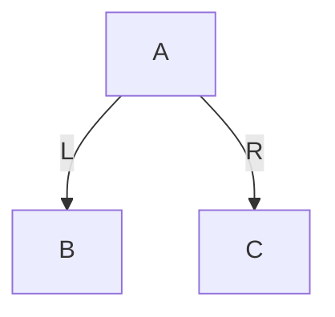
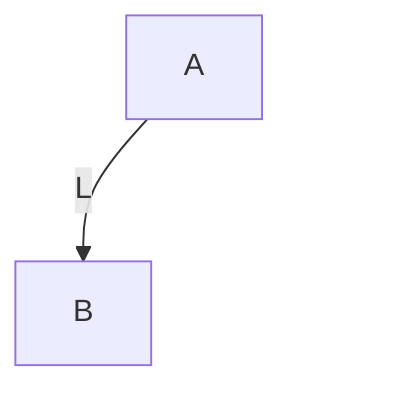
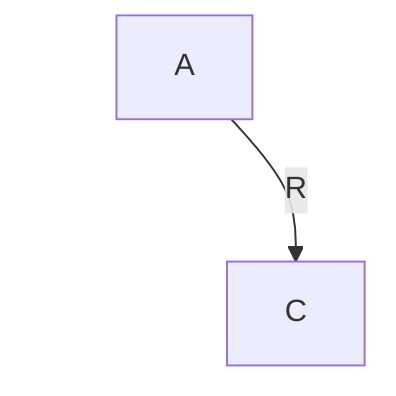

下面给你一份**按学习路径组织的红黑树专题大纲**。
这份大纲不是“只讲红黑树本身”，而是把你要补的前置内容一起纳入进来，形成一条完整路径：

------

# 红黑树学习路线大纲

## 第1章 树的基本概念

### 1.1 什么是树

#### 1.1.1 树的定义

#### 1.1.2 树与数组、链表的结构差异

#### 1.1.3 树适合解决什么类型的问题

### 1.2 树的基本术语

#### 1.2.1 根节点、父节点、子节点、兄弟节点

#### 1.2.2 叶子节点、内部节点

#### 1.2.3 节点的度、树的度

#### 1.2.4 路径、路径长度

#### 1.2.5 节点深度、高度、层次

#### 1.2.6 子树与森林

### 1.3 树的基本性质

#### 1.3.1 树为什么是非线性结构

#### 1.3.2 树的递归定义

#### 1.3.3 树结构中的层级关系与分支关系

### 1.4 树的存储与表示

#### 1.4.1 顺序存储与链式存储

#### 1.4.2 孩子表示法

#### 1.4.3 双亲表示法

#### 1.4.4 孩子兄弟表示法

### 1.5 本章小结

#### 1.5.1 为什么红黑树学习不能绕开树

#### 1.5.2 后续学习与二叉树的关系

------

## 第2章 二叉树

### 2.1 二叉树的定义与结构

#### 2.1.1 二叉树的定义

#### 2.1.2 左子树与右子树的有序性

#### 2.1.3 二叉树与普通树的区别

### 2.2 二叉树的基本形态

#### 2.2.1 斜树

#### 2.2.2 满二叉树

#### 2.2.3 完全二叉树

#### 2.2.4 二叉树高度与节点数量关系

### 2.3 二叉树的遍历

#### 2.3.1 前序遍历

#### 2.3.2 中序遍历

#### 2.3.3 后序遍历

#### 2.3.4 层序遍历

### 2.4 二叉树遍历的实现思想

#### 2.4.1 递归实现

#### 2.4.2 非递归实现的基本思路

#### 2.4.3 栈与队列在遍历中的作用

### 2.5 二叉树的典型问题

#### 2.5.1 求高度

#### 2.5.2 求节点数

#### 2.5.3 判断空树与叶子节点

#### 2.5.4 查找指定节点

### 2.6 本章小结

#### 2.6.1 二叉树是红黑树的直接结构基础

#### 2.6.2 中序遍历对后续 BST 的重要性

------

## 第3章 二叉搜索树 BST

### 3.1 二叉搜索树的定义

#### 3.1.1 BST 的有序性约束

#### 3.1.2 左子树、右子树与比较规则

#### 3.1.3 BST 与普通二叉树的区别

### 3.2 BST 的查找

#### 3.2.1 查找过程的决策路径

#### 3.2.2 时间复杂度与树高的关系

#### 3.2.3 最优与最坏情况分析

### 3.3 BST 的插入

#### 3.3.1 插入位置的搜索

#### 3.3.2 新节点的挂接方式

#### 3.3.3 插入后为什么仍保持 BST 性质

### 3.4 BST 的删除

#### 3.4.1 删除叶子节点

#### 3.4.2 删除只有一个孩子的节点

#### 3.4.3 删除有两个孩子的节点

#### 3.4.4 前驱与后继替换思想

### 3.5 BST 的优点与局限

#### 3.5.1 为什么 BST 查找通常较快

#### 3.5.2 为什么 BST 不保证平衡

#### 3.5.3 为何后续需要平衡树

### 3.6 本章小结

#### 3.6.1 红黑树首先是一棵 BST

#### 3.6.2 红黑树的所有旋转都不能破坏 BST 有序性

------

## 第4章 为什么 BST 会退化

### 4.1 退化问题的提出

#### 4.1.1 顺序插入导致的单边增长

#### 4.1.2 树退化为链表的结构现象

#### 4.1.3 查找效率从对数级退化到线性级

### 4.2 退化的本质原因

#### 4.2.1 BST 只约束大小关系，不约束形状

#### 4.2.2 插入顺序对树形态的直接影响

#### 4.2.3 删除操作也可能进一步破坏形态

### 4.3 为什么需要平衡

#### 4.3.1 平衡的目标不是绝对对称

#### 4.3.2 控制树高才是核心目标

#### 4.3.3 平衡树解决的本质问题

### 4.4 常见平衡思想概览

#### 4.4.1 严格平衡与弱平衡

#### 4.4.2 AVL 与红黑树的思路差异

#### 4.4.3 多路平衡树与二叉平衡树的分化方向

### 4.5 本章小结

#### 4.5.1 红黑树出现的动机

#### 4.5.2 后续为什么先学旋转而不是直接学红黑性质

------

## 第5章 旋转的作用与局部重排

### 5.1 旋转为什么存在

#### 5.1.1 不改变中序有序性

#### 5.1.2 通过局部重排改变树形

#### 5.1.3 旋转是平衡树修复的机械基础

### 5.2 左旋

#### 5.2.1 左旋前后的局部结构

#### 5.2.2 左旋时父子关系如何变化

#### 5.2.3 左旋为什么不破坏 BST 性质

#### 5.2.4 左旋算法说明（成品实现）

##### 5.2.4.1 左旋覆盖的完整结构场景

##### 5.2.4.2 左旋的不变量

##### 5.2.4.3 左旋的完整算法步骤

#### 5.2.5 C 成品实现：左旋

#### 5.2.6 C++ 成品实现：左旋

#### 5.2.7 C 成品示例：左旋整棵树根

#### 5.2.8 C 成品示例：左旋子树根节点

#### 5.2.9 左旋代码中需要强记的三组逻辑

#### 5.2.10 本小节小结

### 5.3 右旋

#### 5.3.1 右旋前后的局部结构

#### 5.3.2 右旋时父子关系如何变化

#### 5.3.3 右旋为什么不破坏 BST 性质

#### 5.3.4 右旋算法说明（成品实现）

##### 5.3.4.1 右旋覆盖的完整结构场景

##### 5.3.4.2 右旋的不变量

##### 5.3.4.3 右旋的完整算法步骤

#### 5.3.5 C 成品实现：右旋

#### 5.3.6 C++ 成品实现：右旋

#### 5.3.7 C 成品示例：右旋整棵树根

#### 5.3.8 C 成品示例：右旋子树根节点

#### 5.3.9 右旋代码中需要强记的三组逻辑

#### 5.3.10 本小节小结

### 5.4 Linux 内核视角：左右旋在内核中是如何组织的

#### 5.4.0 本节参照的源码文件

#### 5.4.1 对外接口层：调用者通常看不到“左旋 / 右旋”

#### 5.4.2 使用者负责什么，rbtree 代码又负责什么

#### 5.4.3 内核内部：左右旋没有被做成一个统一公开旋转函数

#### 5.4.4 `__rb_rotate_set_parents()`：内核抽出来的公共收尾逻辑

#### 5.4.5 插入修复中的旋转：直接写在 `__rb_insert()` 的 case 里

#### 5.4.6 删除修复中的旋转：直接写在 `____rb_erase_color()` 的 case 里

#### 5.4.7 内核版与教学版的差别到底在哪里

#### 5.4.8 增强树视角：为什么还要看 `include/linux/rbtree_augmented.h`

#### 5.4.9 内核实现还有一个额外约束：`WRITE_ONCE()`

#### 5.4.10 本节小结

### 5.5 四类失衡结构与组合旋转

#### 5.5.0 章节内容说明

#### 5.5.1 四类失衡结构总览

#### 5.5.2 LL：外侧失衡，单右旋

#### 5.5.3 RR：外侧失衡，单左旋

#### 5.5.4 LR：内侧失衡，先左后右

#### 5.5.5 RL：内侧失衡，先右后左

#### 5.5.6 四类结构的统一算法判定

#### 5.5.7 为什么四类结构都必须兼容“当前节点只是子树根”

#### 5.5.8 C 成品实现：四类结构识别与修复

#### 5.5.9 C++ 成品实现：四类结构识别与修复

#### 5.5.10 复杂应用示例：内部子树上的 LR 修复

#### 5.5.11 本节小结

### 5.6 从“旋转动作”走向“诊断识别”

#### 5.6.0 章节内容说明

#### 5.6.1 为什么学完旋转之后，必须继续学诊断

#### 5.6.2 本节统一使用的诊断命名

#### 5.6.3 诊断的第一步：从变化点 `z` 向上找第一个失衡祖先 `g`

#### 5.6.4 诊断的第二步：如何判定一个节点是否失衡

#### 5.6.5 诊断的第三步：由 `g` 找到 `p`

#### 5.6.6 诊断的第四步：由 `p` 找到 `n`

#### 5.6.7 由 `g / p / n` 统一判定四类失衡

#### 5.6.8 诊断流程图

#### 5.6.9 为什么这套诊断天然兼容“整棵树根”和“内部子树根”

#### 5.6.10 当前阶段与红黑树的边界

#### 5.6.11 本节小结

### 5.7 本章小结：如何把“旋转知识”写成代码

#### 5.7.1 先明确旋转函数的接口契约

#### 5.7.2 四类失衡的判型规则，必须能直接写成代码

#### 5.7.3 插入场景：诊断起点、停止条件、修复时机

#### 5.7.4 插入场景下，`p` 和 `n` 最稳的确定方式

#### 5.7.5 删除场景：诊断起点与继续向上的必要性

#### 5.7.6 “更高孩子”函数必须有确定性规则

#### 5.7.7 统一修复函数应当怎样写

#### 5.7.8 能直接写代码的两套流程总结

#### 5.7.9 本节小结

------

## 第6章 2-3-4 树：从多路平衡到红黑树的结构桥梁

### 6.1 为什么在红黑树之前引入 2-3-4 树

#### 6.1.1 它不是红黑树的代码前置基础

#### 6.1.2 它是红黑树的结构理解基础

#### 6.1.3 它帮助理解“逻辑节点合并”而不是“物理多节点堆叠”

#### 6.1.4 为什么红黑树要借助 2-3-4 树来建立直觉

#### 6.1.5 本章在整条学习路径中的定位

------

### 6.2 2-3-4 树的结构与不变量

#### 6.2.1 什么是 2-3-4 树

#### 6.2.2 2-node：1 个关键字、2 个孩子

#### 6.2.3 3-node：2 个关键字、3 个孩子

#### 6.2.4 4-node：3 个关键字、4 个孩子

#### 6.2.5 节点中的关键字如何划分区间

#### 6.2.6 孩子数量为什么总是比关键字数量多 1

#### 6.2.7 所有叶子位于同一层的含义

#### 6.2.8 2-3-4 树的平衡条件到底是什么

------

### 6.3 2-3-4 树的查找过程

#### 6.3.1 为什么查找要先在单节点内部比较多个关键字

#### 6.3.2 单节点内比较后如何决定下行分支

#### 6.3.3 从根到叶的查找路径如何形成

#### 6.3.4 为什么 2-3-4 树的高度通常比 BST 更低

#### 6.3.5 2-3-4 树查找与 BST 查找的本质差别

#### 6.3.6 查找算法伪代码与示例

------

### 6.4 2-3-4 树的插入：从叶子落点到节点分裂

#### 6.4.1 为什么插入总是落在叶子层

#### 6.4.2 插入到 2-node 会发生什么

#### 6.4.3 插入到 3-node 会发生什么

#### 6.4.4 为什么插入到 4-node 会触发分裂

#### 6.4.5 4-node 分裂的局部结构变化

#### 6.4.6 分裂为什么可能向上传播

#### 6.4.7 根节点分裂意味着什么

#### 6.4.8 自顶向下插入与自底向上插入的思路差别

#### 6.4.9 插入算法的完整诊断与修复流程

#### 6.4.10 插入伪代码与逐步示例

------

### 6.5 2-3-4 树的删除：借位、合并与向下修复

#### 6.5.1 为什么删除比插入更复杂

#### 6.5.2 删除关键字时为什么常常先转换成叶子删除

#### 6.5.3 删除前为什么要先保证“下行路径不落到 2-node”

#### 6.5.4 什么叫借位（redistribution）

#### 6.5.5 什么叫合并（merge）

#### 6.5.6 兄弟节点可借位时的处理逻辑

#### 6.5.7 兄弟节点不可借位时的合并逻辑

#### 6.5.8 根节点缩减的含义

#### 6.5.9 删除算法的完整诊断与修复流程

#### 6.5.10 删除伪代码与逐步示例

------

### 6.6 2-3-4 树为什么天然平衡

#### 6.6.1 平衡的关键不是“左右对称”，而是“所有叶子同层”

#### 6.6.2 为什么节点扩张不会破坏整体平衡

#### 6.6.3 为什么分裂只会增加局部高度，不会造成单边退化

#### 6.6.4 为什么借位与合并可以在删除中维持层高一致

#### 6.6.5 2-3-4 树平衡机制与 BST 平衡机制的根本差异

------

### 6.7 从 2-3-4 树到红黑树：真正的桥梁在哪里

#### 6.7.1 为什么红黑树不是凭空出现的一组颜色规则

#### 6.7.2 2-node 如何映射到红黑树

#### 6.7.3 3-node 如何映射到红黑树

#### 6.7.4 4-node 如何映射到红黑树

#### 6.7.5 红链接为什么可以理解为“逻辑合并”

#### 6.7.6 颜色在红黑树里承担的结构语义是什么

#### 6.7.7 2-3-4 树插入分裂如何对应红黑树插入修复

#### 6.7.8 2-3-4 树删除中的借位 / 合并如何对应红黑树删除修复

---

### 6.8 2-3-4 树的现实意义：从多路平衡到 B+ 树的页级索引思想

---

### 6.9 Linux VMA 管理为什么从红黑树走向 Maple Tree

------

### 6.10 本章小结

#### 6.10.1 2-3-4 树给出的不是代码模板，而是结构解释框架

#### 6.10.2 红黑树本质上是 2-3-4 树的二叉编码

#### 6.10.3 下一章将进入红黑树的定义、性质与结构映射

------

## 第7章 红黑树：把 2-3-4 树映射成二叉表示

### 7.0 章节内容说明

#### 7.0.1 本章在整条学习路径中的位置

#### 7.0.2 本章要解决的核心问题

#### 7.0.3 为什么这一章不能只讲五条性质

------

### 7.1 红黑树的定义与定位

#### 7.1.1 红黑树首先是一棵 BST

#### 7.1.2 红黑树在 BST 之上额外增加了什么信息

#### 7.1.3 红黑树中的颜色信息到底在表达什么

#### 7.1.4 红黑树不是严格平衡树，而是弱平衡树

#### 7.1.5 红黑树与 AVL、2-3-4 树的定位差异

------

### 7.2 红黑树的五条性质

#### 7.2.1 节点非红即黑

#### 7.2.2 根节点为黑

#### 7.2.3 NIL 叶子为黑

#### 7.2.4 红节点不能有红孩子

#### 7.2.5 任一路径黑高一致

#### 7.2.6 五条性质为什么必须整体理解，而不能孤立记忆

#### 7.2.7 哪几条性质决定局部约束，哪几条性质决定全局平衡

------

### 7.3 红黑树的核心概念

#### 7.3.1 黑高

#### 7.3.2 红红冲突

#### 7.3.3 黑高缺失

#### 7.3.4 为什么插入主要是在修红红冲突

#### 7.3.5 为什么删除主要是在修黑高缺失

#### 7.3.6 黑高与树高度之间的关系

------

### 7.4 2-3-4 树与红黑树的映射关系

#### 7.4.0 章节内容说明

#### 7.4.1 为什么必须从 2-3-4 树视角看红黑树

#### 7.4.2 2-node 如何映射到红黑树

#### 7.4.3 3-node 如何映射到红黑树

#### 7.4.4 4-node 如何映射到红黑树

#### 7.4.5 红链接为什么可以理解为“逻辑合并”

#### 7.4.6 为什么一个逻辑节点会展开成多个物理节点

#### 7.4.7 为什么普通红黑树不要求固定左倾

#### 7.4.8 左倾红黑树与普通红黑树在映射上的差别

#### 7.4.9 2-3-4 树到红黑树的映射总图

------

### 7.5 红黑树为什么能控制树高

#### 7.5.0 章节内容说明

#### 7.5.1 红节点不能连续的意义

#### 7.5.2 黑高一致的意义

#### 7.5.3 最短路径与最长路径分别由什么构成

#### 7.5.4 为什么最长路径不会超过最短路径的两倍

#### 7.5.5 为什么红黑树高度仍然是 O(log n)

#### 7.5.6 用 2-3-4 树视角重看红黑树高度控制

------

### 7.6 为后续修复做准备：插入与删除到底在修什么

#### 7.6.0 章节内容说明

#### 7.6.1 插入时首先最容易破坏哪条性质

#### 7.6.2 删除时首先最容易破坏哪条性质

#### 7.6.3 染色操作在红黑树中承担什么职责

#### 7.6.4 旋转操作在红黑树中承担什么职责

#### 7.6.5 为什么红黑树修复不能只靠旋转

#### 7.6.6 为什么红黑树修复不能只靠染色

#### 7.6.7 为什么后续不能把插入 / 删除 case 当作死记硬背

#### 7.6.8 本章与第 8 章、第 9 章的衔接点

------

### 7.7 本章小结

#### 7.7.1 红黑树的颜色本质上是结构控制信息

#### 7.7.2 红黑树是 2-3-4 树的二叉编码

#### 7.7.3 红黑树的平衡不是对称，而是黑高受控

#### 7.7.4 下一章将进入红黑树插入修复

------

## 第8章 红黑树插入修复

### 8.1 红黑树插入的基本流程

#### 8.1.1 先按 BST 规则插入

#### 8.1.2 为什么新节点通常先染成红色

#### 8.1.3 插入后可能破坏哪些性质

### 8.2 插入修复的分析框架

#### 8.2.1 当前节点、父节点、祖父节点、叔叔节点

#### 8.2.2 修复时为什么要看叔叔颜色

#### 8.2.3 修复动作只有染色与旋转

### 8.3 插入修复的典型情况

#### 8.3.1 父黑：无需修复

#### 8.3.2 父红叔红：染色上推

#### 8.3.3 父红叔黑：旋转加染色

#### 8.3.4 内侧插入与外侧插入

### 8.4 插入修复与 2-3-4 树分裂的关系

#### 8.4.1 染色对应逻辑分裂

#### 8.4.2 旋转对应二叉表示整理

#### 8.4.3 为什么插入修复比删除修复更容易掌握

### 8.5 插入操作的复杂度与稳定性

#### 8.5.1 查找路径复杂度

#### 8.5.2 修复高度界限

#### 8.5.3 工程实现中的常见边界问题

### 8.6 本章小结

#### 8.6.1 插入修复的本质是解决红红冲突

#### 8.6.2 插入修复的核心不是背 case，而是理解结构变化

------

## 第9章 红黑树删除修复

### 9.1 红黑树删除的基本流程

#### 9.1.1 先按 BST 删除逻辑定位目标

#### 9.1.2 两孩子节点的替换问题

#### 9.1.3 实际删除节点与逻辑删除节点的区别

### 9.2 删除为什么比插入更难

#### 9.2.1 删除红节点通常较简单

#### 9.2.2 删除黑节点会破坏黑高

#### 9.2.3 所谓“双重黑”问题的提出

### 9.3 删除修复的分析框架

#### 9.3.1 当前节点与兄弟节点

#### 9.3.2 父节点与侄子节点

#### 9.3.3 修复动作中的旋转与染色传播

### 9.4 删除修复的典型情况

#### 9.4.1 兄弟为红

#### 9.4.2 兄弟为黑且两个孩子都黑

#### 9.4.3 兄弟为黑且近侄红远侄黑

#### 9.4.4 兄弟为黑且远侄红

### 9.5 删除修复与 2-3-4 树借位/合并的关系

#### 9.5.1 借位的对应理解

#### 9.5.2 合并的对应理解

#### 9.5.3 为什么某些修复会向上继续传播

### 9.6 删除实现中的常见问题

#### 9.6.1 NIL 节点的处理

#### 9.6.2 根节点变化

#### 9.6.3 替换节点颜色继承

#### 9.6.4 边界 case 的统一化处理

### 9.7 本章小结

#### 9.7.1 删除修复的本质是恢复黑高一致性

#### 9.7.2 删除难点在于“少了一个黑色”如何传播与消除

------

## 第10章 Linux 内核 rbtree 工程实现

### 10.1 为什么内核要用红黑树

#### 10.1.1 查找、插入、删除复杂度稳定

#### 10.1.2 适合内核中的有序对象管理

#### 10.1.3 与链表、哈希表的适用场景差异

### 10.2 Linux rbtree 的基本设计

#### 10.2.1 `struct rb_node`

#### 10.2.2 `struct rb_root`

#### 10.2.3 节点嵌入式设计

#### 10.2.4 `container_of` 与对象还原

### 10.3 内核 rbtree 的使用方式

#### 10.3.1 为什么比较逻辑由用户代码自己写

#### 10.3.2 查找流程如何组织

#### 10.3.3 插入时如何挂接新节点

#### 10.3.4 `rb_link_node` 与 `rb_insert_color`

#### 10.3.5 删除时如何调用 `rb_erase`

### 10.4 内核实现与教材实现的区别

#### 10.4.1 不直接提供泛型比较函数

#### 10.4.2 更强调性能与内联

#### 10.4.3 颜色位与父指针的组织方式

#### 10.4.4 为什么内核实现看起来更“裸”

### 10.5 内核 rbtree 的典型应用场景

#### 10.5.1 定时器

#### 10.5.2 虚拟内存区域管理

#### 10.5.3 各类有序对象索引结构

### 10.6 调试与验证思路

#### 10.6.1 如何验证 BST 性质

#### 10.6.2 如何验证红黑性质

#### 10.6.3 如何排查旋转或颜色修复错误

### 10.7 本章小结

#### 10.7.1 理论红黑树与工程红黑树的连接

#### 10.7.2 为什么内核学习必须理解其嵌入式实现方式

------

## 第11章 再扩展到 B 树 / B+ 树

### 11.1 为什么在红黑树之后学习 B 树 / B+ 树

#### 11.1.1 红黑树解决内存中的二叉平衡问题

#### 11.1.2 B 树解决多路平衡与外存访问问题

#### 11.1.3 两者属于同一家族但关注点不同

### 11.2 B 树

#### 11.2.1 多路搜索树的基本结构

#### 11.2.2 节点中多个 key 的组织方式

#### 11.2.3 插入分裂与删除合并

#### 11.2.4 为什么 B 树适合页式存储

### 11.3 B+ 树

#### 11.3.1 叶子节点存储数据

#### 11.3.2 内部节点只存索引

#### 11.3.3 范围查询与顺序访问优势

#### 11.3.4 B+ 树与数据库索引的关系

### 11.4 红黑树、2-3-4 树、B 树、B+ 树的关系图谱

#### 11.4.1 二叉平衡树与多路平衡树

#### 11.4.2 内存结构与外存结构

#### 11.4.3 工程场景选择依据

### 11.5 本章小结

#### 11.5.1 从红黑树扩展到查找树家族

#### 11.5.2 为后续数据库、文件系统、索引结构学习做铺垫

------

# 附录：建议的学习推进顺序

## A. 第一阶段：树基础

### A.1 树的术语

### A.2 二叉树结构

### A.3 遍历与递归

## B. 第二阶段：查找树基础

### B.1 BST 查找

### B.2 BST 插入

### B.3 BST 删除

### B.4 BST 退化问题

## C. 第三阶段：平衡思想

### C.1 旋转

### C.2 2-3-4 树

### C.3 红黑树性质

## D. 第四阶段：红黑树核心

### D.1 插入修复

### D.2 删除修复

### D.3 复杂度与边界条件

## E. 第五阶段：工程落地

### E.1 Linux 内核 rbtree

### E.2 与 B 树 / B+ 树对比

### E.3 建立完整查找树知识地图

------

这份大纲的核心特点是：

- 不是孤立讲红黑树
- 把你真正需要补的前置内容串起来
- 中间明确加入 **2-3-4 树** 作为结构理解桥梁
- 最后落到 **Linux 内核 rbtree**，再扩展到 **B 树 / B+ 树**

树结构的表示：

------

## 你现在这类“二叉树 / 红黑树”笔记，我建议直接用这个模板

### 双孩子

### 单左孩子

### 单右孩子

这套写法对你后面画：

- 二叉树
- BST
- 左旋 / 右旋
- 红黑树插入删除 case

都很实用。

下一条我可以直接给你一份**“适合你后续整本笔记使用的 Mermaid 二叉树/红黑树绘图模板规范”**，把左孩子、右孩子、NIL、旋转前后图统一成一套格式。