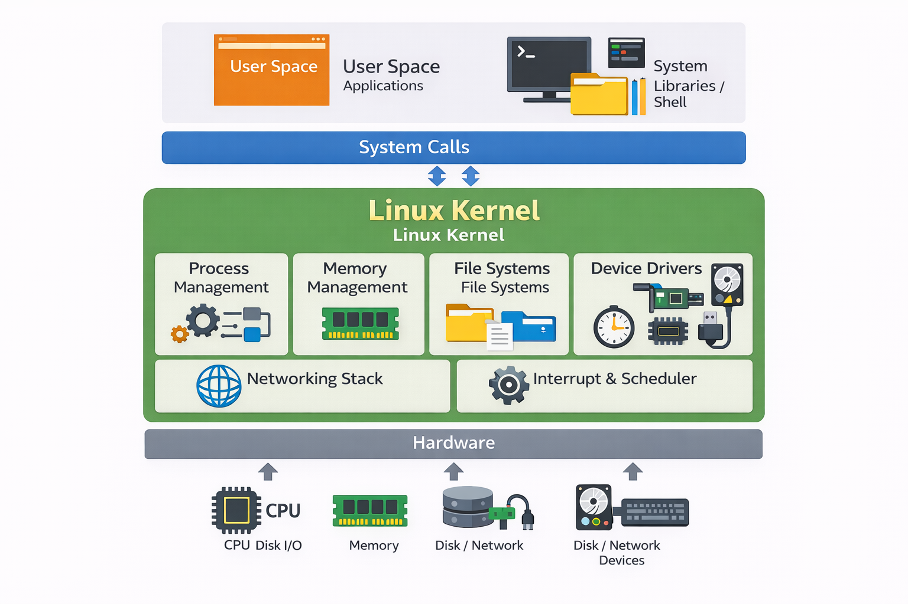

# linux内核概貌

## 1. 硬件（Hardware）

### 1.1 硬件概述

硬件是计算机系统的物理组成部分，包括CPU、内存、存储设备、网络接口以及输入输出设备。Linux内核负责管理这些硬件资源，为上层应用程序提供硬件抽象接口，使得程序无需直接与硬件交互，从而实现了操作系统与硬件之间的有效隔离。

1. **CPU（中央处理单元）**：
   - CPU是计算机的“大脑”，负责执行指令、进行算术计算、数据传输等任务。内核通过调度算法管理CPU的使用，确保多个进程公平地共享CPU资源。
2. **内存（Memory）**：
   - 内存是用于存储程序执行中的数据和指令。Linux内核通过虚拟内存管理机制提供每个进程独立的地址空间，确保进程之间互不干扰。
3. **存储设备（Storage）**：
   - 包括硬盘、SSD等，存储设备用来持久保存数据。内核通过文件系统管理这些存储设备，实现文件的读写操作。
4. **网络接口（Network Interface）**：
   - 网络接口包括以太网卡、Wi-Fi等，内核负责通过网络栈管理数据包的发送与接收。
5. **I/O设备（Input/Output Devices）**：
   - 包括键盘、鼠标、显示器等，内核通过设备驱动与这些设备交互。

------

### 1.2 x86_64与AArch64架构对比

x86_64与AArch64分别代表了两种不同的CPU架构：x86_64是基于Intel/AMD的x86架构，广泛应用于桌面和服务器领域；而AArch64是ARM架构的64位版本，主要用于移动设备、嵌入式系统及一些服务器。

1. **指令集架构（ISA）**：
   - **x86_64**：x86架构最初是32位的，后来扩展为64位（即x86_64）。x86架构的指令集设计复杂，支持大量的操作和寻址模式。它采用了CISC（复杂指令集计算）方式，具有丰富的指令集。
   - **AArch64**：AArch64是ARM架构的64位扩展，属于RISC（精简指令集计算）架构，指令集设计简洁，采用固定长度的指令格式，通常执行效率较高。
2. **寄存器**：
   - **x86_64**：x86_64处理器有16个通用寄存器（每个64位），这些寄存器用于算术运算、地址计算等操作。x86架构的寄存器较为复杂，并且存在不同的寄存器组（如数据寄存器、地址寄存器等）。
   - **AArch64**：AArch64有31个通用寄存器（每个64位），这些寄存器用于计算和数据存取。此外，AArch64还提供了更清晰的寄存器命名和更高效的寄存器使用方式。
3. **内存管理**：
   - **x86_64**：x86_64采用分段和分页的方式进行内存管理，支持复杂的虚拟内存体系。内核提供强大的内存管理支持，包括硬件分页和段式管理。
   - **AArch64**：AArch64采用基于分页的内存管理方式，支持64位虚拟地址和大页内存。AArch64的内存管理设计更为简洁和高效，特别适用于高性能嵌入式系统。
4. **处理器模式**：
   - **x86_64**：x86_64支持多个模式，如用户模式、内核模式和实模式等。内核模式拥有访问所有硬件资源的权限，而用户模式则受到更多限制。
   - **AArch64**：AArch64同样支持多个执行模式，包括用户模式、内核模式等。此外，AArch64还提供了安全扩展（如TrustZone）来隔离敏感应用和系统功能。
5. **性能与功耗**：
   - **x86_64**：x86_64处理器通常在性能上表现较为强劲，适合桌面和服务器的高负载计算任务。然而，这种架构的功耗较高，尤其在移动设备中应用较少。
   - **AArch64**：AArch64的设计注重低功耗和高效能，广泛应用于智能手机、嵌入式设备以及轻负载服务器。ARM架构的芯片通常具有更高的能效比。

------

### 1.3 内核对硬件的管理

Linux内核通过设备驱动来管理硬件，设备驱动程序负责与硬件设备进行交互、控制和管理。设备驱动将硬件的具体实现封装成标准接口，内核通过这些接口向硬件发出命令。

1. **设备驱动的作用**：
   - 内核通过设备驱动程序向硬件发出指令，控制硬件的操作，并从硬件获取数据。设备驱动程序负责抽象硬件操作，使得上层应用程序不需要关心硬件的实现细节。
2. **设备类型**：
   - **字符设备**：字符设备用于按字节流的方式进行数据传输，如键盘、串口设备等。字符设备通过字符设备驱动来进行管理。
   - **块设备**：块设备用于数据存储，支持随机访问，如硬盘、SSD等。块设备通过块设备驱动来进行管理。
   - **网络设备**：网络设备用于网络通信，如以太网卡、Wi-Fi适配器等。网络设备驱动程序处理数据包的收发，管理网络接口。
3. **设备驱动的管理**：
   - **驱动程序的加载与卸载**：内核通过模块化机制动态加载和卸载设备驱动程序。设备驱动程序通常以内核模块的形式存在，允许在运行时根据需要加载。
   - **设备的初始化与控制**：驱动程序负责初始化硬件设备并提供访问接口。设备驱动程序通过中断、DMA等技术与硬件进行交互。

------

## 2. Linux内核（Linux Kernel）

### 2.1 进程管理（Process Management）

#### 2.1.1 进程管理概述

进程管理是内核的核心任务之一，它涉及进程的创建、调度、终止及进程间的同步与通信。进程是操作系统中独立执行的任务，每个进程拥有自己的地址空间和资源。内核通过进程调度器来决定哪个进程能使用CPU，以及多进程环境中如何共享系统资源。

1. **进程的生命周期管理**：
   - **创建**：进程是通过系统调用`fork()`创建的。`fork()`会创建一个新进程（子进程），该进程复制父进程的资源和状态。之后，`exec()`可以替换子进程的代码，加载新的程序。
   - **调度**：内核通过进程调度器（Scheduler）来分配CPU时间，调度不同的进程执行。调度算法包括时间片轮转、优先级调度、实时调度等。
   - **终止**：进程通过系统调用`exit()`退出，释放占用的资源。终止进程的资源会被内核回收。
2. **调度算法**：
   - Linux内核采用多种调度算法来提高系统的响应性和吞吐量：
     - **轮转调度（Round Robin Scheduling）**：每个进程获得一个时间片，时间片用完后轮换到下一个进程。
     - **优先级调度**：为进程分配优先级，优先级高的进程优先执行。
     - **实时调度**：为实时任务提供即时响应，确保对硬件和外部事件的快速响应。
3. **进程同步与互斥**：
   - 在多进程环境下，进程间的同步和互斥非常重要。Linux内核提供了多种同步机制来避免进程间的竞争条件，常见的同步原语包括：
     - **信号量（Semaphore）**：用于进程间的同步，防止多个进程同时访问共享资源。
     - **互斥锁（Mutex）**：用于保护临界区，确保同一时刻只有一个进程能够访问共享资源。

#### 2.1.2 进程调度与上下文切换

进程调度是由内核调度器完成的，它确保多个进程在CPU上公平地获得执行时间。调度器通过定时中断（Tick）来周期性地检查当前进程是否使用完了时间片，并决定是否切换到其他进程。

- **上下文切换（Context Switch）**：上下文切换是指操作系统保存当前进程的状态并加载下一个进程的状态。它包括保存CPU寄存器、堆栈信息等，确保进程切换后能够继续执行。
- **调度队列**：Linux内核通过不同的调度队列来管理进程，包括就绪队列（Ready Queue）和等待队列（Waiting Queue）。就绪队列中包含所有准备好执行的进程，而等待队列则包括等待某些资源或事件的进程。

#### 2.1.3 进程状态

每个进程在生命周期中会处于不同的状态，常见的进程状态包括：

- **就绪（Ready）**：进程已准备好运行，等待被调度器分配CPU。
- **运行（Running）**：进程正在使用CPU执行。
- **等待（Waiting）**：进程由于等待某些资源（如I/O操作）而暂时挂起。
- **终止（Terminated）**：进程执行完成或被杀死，等待清理资源。

------

### 2.2 内存管理（Memory Management）

#### 2.2.1 内存管理概述

内存管理是操作系统的重要功能之一，负责有效地分配和回收内存资源。内存管理的核心任务是提供虚拟内存，使得每个进程都有独立的内存空间，同时避免进程之间的内存冲突。

1. **虚拟内存与物理内存**：
   - **虚拟内存**：每个进程都有自己的虚拟地址空间，这些虚拟地址并不直接对应于物理内存，而是通过内核的地址映射机制转换为物理地址。
   - **物理内存**：物理内存是真实存在的内存，所有进程的虚拟内存最终都需要映射到物理内存。
2. **内存分页与页面管理**：
   - **分页（Paging）**：内核通过分页技术将内存划分为固定大小的页面（通常为4KB）。虚拟地址空间与物理内存之间通过页面表进行映射。分页使得进程能够使用比物理内存更多的虚拟内存空间。
   - **页面管理**：内核通过页表来管理虚拟内存与物理内存的映射关系。页表包含了每个虚拟页面对应的物理页面地址。
3. **内存保护与隔离**：
   - 每个进程都有独立的虚拟地址空间，内核通过虚拟内存和内存保护机制，确保进程不能访问其他进程的内存，防止进程间相互干扰。
   - 内存保护确保某些区域的内存不可读、不可写，或者不可执行，从而提高系统的安全性。

#### 2.2.2 内存分配与回收

内存管理的一个关键部分是内存的动态分配和回收。Linux内核提供了多种机制来进行内存的分配：

- **伙伴系统（Buddy System）**：用于管理物理内存，提供合适大小的内存块。内存分配时，伙伴系统会选择最合适的空闲内存块。
- **Slab分配器**：用于分配小块内存，特别适合频繁分配和回收的小内存块，如内核对象、缓存等。

1. **内存分配**：当进程需要内存时，内核会从空闲内存中分配合适的块，分配时会考虑内存碎片和性能。
2. **内存回收**：当进程不再需要某块内存时，内核会将该内存块归还给内存池，并进行回收。

#### 2.2.3 内存交换（Swap）

在内存资源不足时，Linux内核会将一部分内存内容（即不常用的页面）写入磁盘上的交换区（Swap）。这使得内存可以腾出空间给正在运行的进程。

- **交换区管理**：交换区是硬盘上的一个特殊区域，它为虚拟内存提供额外空间。内核会根据内存需求将内存中的不常用页面移到交换区，并在需要时将其调回物理内存。
- **页面交换**：内核使用LRU（最近最少使用）算法来决定哪些页面应该被交换到磁盘，从而尽量保证内存的高效利用。

------

#### 总结

1. **进程管理**：
   - 进程管理是内核的核心任务之一，负责进程的创建、调度、终止和同步。调度器根据进程的优先级和状态决定哪个进程获得CPU资源。
2. **内存管理**：
   - 内存管理确保了系统内存的高效利用，包括虚拟内存、内存分页和保护。内核通过内存分配和回收机制保证每个进程都能获得足够的内存。

------

### 2.3 文件系统（File Systems）

#### 2.3.1 文件系统概述

文件系统是操作系统用来管理存储设备上数据的机制，它定义了数据存储的结构，并提供文件操作的接口。Linux内核支持多种文件系统格式，如ext4、FAT32、NTFS等，这些文件系统为用户和应用程序提供数据存储与管理的服务。

1. **文件操作的基本概念**：
   - 文件操作是指通过特定的系统调用（如`open()`, `read()`, `write()`, `close()`）来创建、读取、写入和关闭文件。所有的文件操作都是通过文件描述符（file descriptor）进行的。
2. **文件描述符**：
   - 在Linux中，文件描述符是一个整数，用于标识一个已打开的文件。每个进程都有自己的文件描述符表，用于记录进程打开的所有文件。
3. **文件的类型**：
   - Linux系统中的文件不仅包括传统的文档文件，还包括设备文件、管道文件、符号链接等。文件系统为这些文件提供了统一的管理机制。

#### 2.3.2 文件权限与安全性

Linux使用**用户权限模型**来控制文件的访问权限，每个文件都与文件所有者、所属用户组和其他用户的访问权限相关联。Linux采用三种基本的权限控制机制：读（r）、写（w）、执行（x）。

1. **文件权限管理**：
   - 每个文件和目录都有与其相关联的权限信息，用于限制不同用户的访问权限。文件权限可以通过`chmod`命令来设置。
2. **文件所有者与组**：
   - 每个文件都有一个所有者和一个用户组，权限是基于文件的所有者、用户组和其他用户来分配的。
3. **访问控制列表（ACL）**：
   - 除了标准的文件权限外，Linux还支持ACL，用于为文件或目录指定更复杂的权限规则。ACL允许为文件设置多个用户和组的访问权限。

#### 2.3.3 文件系统的挂载与管理

Linux内核通过挂载（mount）机制将不同的文件系统接入到统一的目录树中，用户通过路径来访问这些文件系统。

1. **文件系统挂载**：
   - 文件系统挂载是将一个设备（如硬盘、USB驱动器）上的文件系统链接到Linux的文件树中。挂载后的文件系统可以像本地文件系统一样访问。
2. **根文件系统（Root File System）**：
   - 根文件系统是Linux文件系统的顶层，它通常包含了操作系统的关键文件和程序。所有其他文件系统都被挂载到根文件系统上。
3. **常见文件系统**：
   - **ext4**：Linux下最常用的文件系统，具有高效的性能和稳定性。
   - **FAT32**、**NTFS**：常用于Windows系统的文件系统，Linux通过特定的驱动程序支持对这些文件系统的访问。
   - **Btrfs**：一个新型的Linux文件系统，提供了文件系统快照、复制等高级功能。

#### 2.3.4 文件系统的结构与层级

Linux的文件系统采用层次结构，每个文件都在树形结构的某一位置。根目录（/）是文件系统的起点，其他目录和文件以树状结构展开。

1. **目录结构**：
   - Linux的文件系统遵循统一的目录结构，所有文件和目录都挂载在根目录（`/`）下。例如，`/home`目录存储用户的个人数据，`/bin`存储系统的基本命令等。

------

### 2.4 设备驱动（Device Drivers）

#### 2.4.1 设备驱动概述

设备驱动是操作系统与硬件之间的中介，它提供了操作系统与硬件之间的接口，使得内核可以通过设备驱动程序与硬件进行交互。设备驱动程序的主要功能是初始化硬件、发送控制命令、收发数据、处理中断等。

1. **设备驱动的作用**：
   - 内核通过设备驱动程序对硬件进行控制和管理。设备驱动程序通过标准的内核接口（如字符设备接口、块设备接口）来实现与硬件的交互。
2. **设备驱动的分类**：
   - **字符设备驱动**：字符设备以字符流的方式进行数据传输，如串口设备、键盘、鼠标等。
   - **块设备驱动**：块设备用于存储数据，支持随机访问，如硬盘、SSD、U盘等。
   - **网络设备驱动**：网络设备用于网络通信，如以太网卡、Wi-Fi适配器等。

#### 2.4.2 设备驱动的实现

设备驱动程序通常是内核模块的一部分，可以动态加载和卸载。设备驱动程序包括以下基本部分：

1. **设备初始化**：
   - 设备驱动程序负责初始化硬件设备，设置设备的工作模式、配置设备的参数等。
2. **设备I/O操作**：
   - 设备驱动程序定义了如何进行设备的输入输出操作，如读取硬盘的数据或从网络接口接收数据。
3. **设备中断处理**：
   - 当硬件设备需要与CPU进行交互时，它会发出中断信号，内核通过中断服务程序（ISR）来处理这些请求。
4. **设备的卸载与清理**：
   - 当设备驱动不再需要时，内核会卸载该驱动程序，并清理与设备相关的资源。

#### 2.4.3 设备模型与内核接口

Linux内核使用设备模型来统一管理硬件设备，设备驱动通过标准的内核接口与内核和用户空间进行交互。

1. **设备注册**：
   - 设备驱动在加载时通过`register_chrdev()`等接口注册设备，向内核声明设备的类型及其操作。
2. **内核与用户空间的交互**：
   - 内核通过提供`ioctl()`、`read()`、`write()`等系统调用，允许用户空间程序与设备驱动程序进行交互。

------

**总结（未完待续）**

1. **文件系统**：
   - 文件系统为数据存储和访问提供了有效的管理机制，内核通过挂载和路径机制，将不同类型的存储设备整合到统一的目录结构中。
2. **设备驱动**：
   - 设备驱动程序是内核与硬件之间的桥梁，内核通过它与硬件交互。设备驱动的设计和实现对于硬件控制和管理至关重要。

------

此部分已详细展开了**文件系统**和**设备驱动**相关内容。在下一批中，我们将继续深入讲解**中断与调度**、**网络栈**等部分。如果您有任何问题或需要进一步补充，请告诉我！