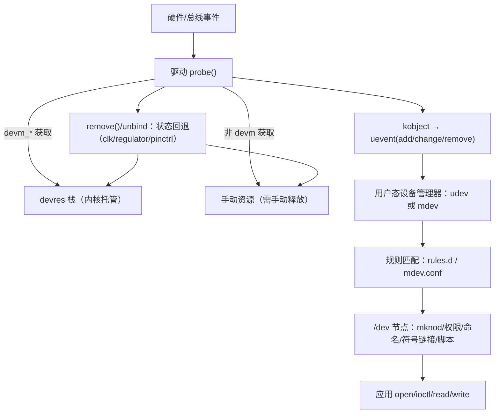
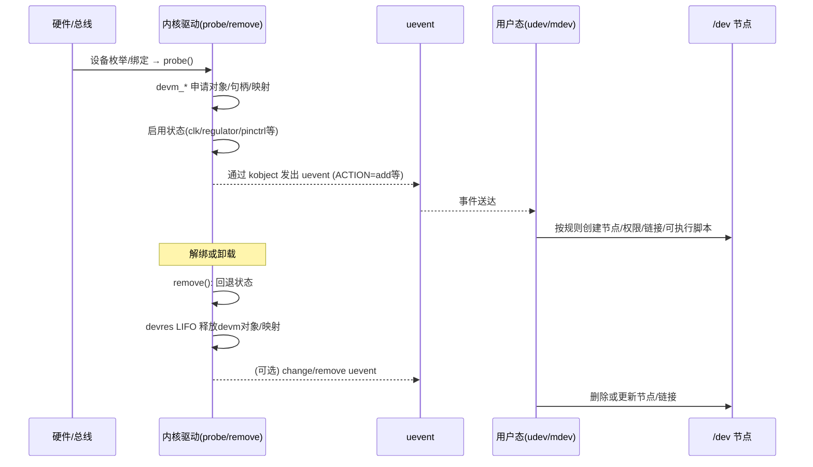
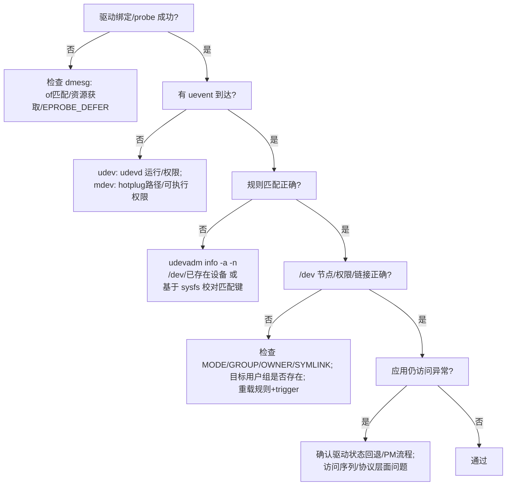

我是 **GPT-5**。

# 第1章：内核资源管理与用户态设备管理的全景与对比

> 读者画像：嵌入式 Linux 驱动/系统工程师（内核 6.1 及相近版本）。
>  目标：用一章建立“大地图”，把 `devm`、旧机制（非 `devm`）、`udev`、`mdev` 四个关键词放在同一条软硬件链路里，明确边界、接口与协作方式；为后续各分章的深入做准备。

------

## 1.1 为什么要同时理解这四个概念？

在一个完整的设备启用路径上，你会同时遇到**内核侧**与**用户态侧**两类问题：

- **内核侧（驱动资源管理）**：`probe()` 里分配/获取的句柄与映射如何管理？失败路径如何回滚？卸载如何不留“脏资源”？
  - 两条线：**`devm`（device-managed）** 与 **旧机制（非 `devm`，手动申请/手动释放）**。
- **用户态侧（设备节点与策略）**：`/dev` 下面的设备文件如何出现、叫什么名、权限如何、是否触发脚本？
  - 两条线：**`udev`（systemd-udevd/eudev）** 与 **`mdev`（BusyBox）**。

一句话记忆：
 **`devm`/旧机制解决“驱动里资源的生死”，`udev`/`mdev`解决“/dev 下设备的出现方式”。**

------

## 1.2 一张图看全链路（从硬件到 /dev）



------

## 1.3 四个关键词的最小定义

### 1.3.1 `devm`（内核）

- **是什么**：device-managed 资源管理；将“释放动作”挂在 `struct device` 的 **devres 栈**，设备解绑/注销时按 **LIFO** 自动调用释放回调。
- **解决什么**：把 `probe()` 的**失败回滚**与卸载清理变成“自动”，极简错误路径。
- **不做什么**：不负责 `/dev` 节点；不托管“状态”（时钟启停、电源上/下电、pinctrl 状态切换仍需手动配对回退）。

### 1.3.2 旧机制（非 `devm`）

- **是什么**：传统“谁申请谁释放”的模式：`kzalloc`/`ioremap`/`gpiod_get`/`request_irq`… + 在错误路径与 `remove()` 中**显式** `kfree`/`iounmap`/`gpiod_put`/`free_irq`…
- **优缺点**：自由度高、可精确控制时点，但错误路径冗长、易漏导致泄漏/悬挂。

### 1.3.3 `udev`（用户态）

- **是什么**：systemd-udevd（或 eudev）守护进程，监听内核 **uevent**，按 **rules** 创建/删除 `/dev/*` 节点、设置权限/属主/组、创建符号链接、执行脚本。
- **典型命令**：`udevadm monitor/info/trigger/settle`。

### 1.3.4 `mdev`（用户态，BusyBox）

- **是什么**：轻量设备管理器；通过 `/proc/sys/kernel/hotplug`（热插拔）或 `mdev -s`（冷插拔）工作；规则在 `/etc/mdev.conf`，语法简洁、体积极小。
- **适用**：极简 rootfs、启动时间敏感场景。

------

## 1.4 两组核心对比（先给结论）

### 1.4.1 `devm` vs 旧机制（内核资源管理）

| 维度     | `devm`                                     | 旧机制（非 `devm`）                          |
| -------- | ------------------------------------------ | -------------------------------------------- |
| 生命周期 | 绑定 `struct device`，解绑自动释放（LIFO） | 驱动自行管理，错误路径与 `remove()` 手工回滚 |
| 失败回滚 | 简洁：失败就 `return`                      | 复杂：每个失败分支都写清理                   |
| 维护性   | 高（模板化）                               | 难（易漏释放/顺序错误）                      |
| 适用     | 常规平台驱动                               | 精确控制释放时点/跨设备共享/早期阶段         |

> 牢记：**句柄托管 ≠ 状态托管**（clk/regulator/pinctrl 的启停/切换必须手动配对）。

### 1.4.2 `udev` vs `mdev`（用户态设备管理）

| 维度   | `udev`                           | `mdev`                              |
| ------ | -------------------------------- | ----------------------------------- |
| 依赖   | systemd（或 eudev）              | BusyBox                             |
| 功能   | 强：复杂规则、丰富匹配、RUN 脚本 | 轻：正则 + 简单动作，启动快、体积小 |
| 冷插拔 | `udevadm trigger/settle`         | `mdev -s`                           |
| 调试   | `udevadm monitor/info`           | `dmesg` + wrapper 打 ENV            |
| 适配   | 服务器/桌面/完整发行版           | 极简嵌入式/Initramfs                |

------

## 1.5 跨层职责边界：`devm` vs（`udev/mdev`）

- **`devm`**：只管**内核里**资源（句柄/映射/对象）的分配与释放，帮助你写出**简洁安全**的 `probe()/remove()`。
- **`udev/mdev`**：只管**用户态** `/dev` 的出现方式（名称、权限、链接、脚本），以及冷/热插拔策略。
- **相互独立、互不替代、协同工作**：同一设备从“能工作”到“应用能访问”，需要**两端都正确**。

------

## 1.6 一页速用模板（实操起点）

### 1.6.1 `devm` 风格的 `probe()/remove()`（缩略版）

```c
static int foo_probe(struct platform_device *pdev)
{
    struct device *dev = &pdev->dev;
    int irq, ret;

    /* 句柄/映射：devm_*，失败直接 return */
    priv = devm_kzalloc(dev, sizeof(*priv), GFP_KERNEL);
    priv->base = devm_platform_ioremap_resource(pdev, 0);
    priv->led  = devm_gpiod_get(dev, "led", GPIOD_OUT_LOW);

    irq = platform_get_irq(pdev, 0);
    ret = devm_request_threaded_irq(dev, irq, foo_isr, foo_thread,
                                    IRQF_ONESHOT, dev_name(dev), priv);

    /* 状态：启用（注意 remove() 里要关闭） */
    priv->clk = devm_clk_get(dev, NULL);
    clk_prepare_enable(priv->clk);

    priv->vdd = devm_regulator_get(dev, "vdd");
    regulator_enable(priv->vdd);

    return 0;
}

static int foo_remove(struct platform_device *pdev)
{
    struct foo_priv *priv = platform_get_drvdata(pdev);
    regulator_disable(priv->vdd);
    clk_disable_unprepare(priv->clk);
    return 0;  /* 其它由 devm 自动释放 */
}
```

#### devm回滚机制说明

**提问：**

* 在讲解“1.6.1 `devm` 风格的 `probe()/remove()`”中，这里的回滚和资源清除是通过remove接口完成的，而你上文提到的会自动管理和清除资源是指：在没有remove接口的时候或者remove清除不完整的时候，devm机制也会自动接手隐式清除操作吗？

结论先说：**是的**。
 `devm` 的“自动回收”与 `remove()` 是否存在、是否把资源清理完整**无关**——它会在 **驱动解绑/设备释放** 的时机统一触发回收。`remove()` 只是给你一个机会去**回退“状态”**（如关时钟、掉电、切回休眠 pinctrl），而**不是**去释放那些已经由 `devm_*` 申请的“句柄/映射/对象”。

**具体怎么回事？**

##### 回收触发时机与顺序（关键点）

当设备解绑（driver unbind）或被注销（device unregister）、模块卸载等发生时，内核 driver core 会按如下顺序处理：

1. **调用驱动的 `remove()`**（如果提供了）。
   - 这里做的应该是**状态性回退**：`clk_disable_unprepare()`、`regulator_disable()`、`pinctrl_select_state(sleep)` 等。
   - 不要在这里 `kfree/iounmap/gpiod_put/free_irq` 那些已经用 `devm_*` 申请的资源（否则会双重释放）。
2. **在 `remove()` 返回后，统一执行 devres 回收**（`devm_*` 资源自动释放，LIFO 顺序）。
   - 这一步与是否实现了 `remove()`、`remove()` 是否清理完整**无关**——都会执行。
   - 也就是说，即便 `remove()` 为 `NULL`，或者只做了部分状态回退，**`devm` 仍会把由 `devm_\*` 获取的句柄/映射/对象全部释放干净**。
3. **特殊情况：`probe()` 失败早退**
   - 如果在 `probe()` 过程中已经用了一些 `devm_*` 接口，然后中途 `return -Exxx`，**这些已登记的 devm 资源同样会被自动回滚释放**。
   - 如果使用了 `devres_open_group()/devres_remove_group()` 做阶段化初始化，也会得到相同的“一键回滚”效果。

##### 你需要在 `remove()` 里做什么（而 `devm` 不会做的）？

- **时钟启停**：`clk_prepare_enable()` ↔ `clk_disable_unprepare()`
- **电源上/下电**：`regulator_enable()` ↔ `regulator_disable()`
- **pinctrl 状态切换**：`default/active` ↔ `sleep/idle`
- **运行时的工作队列/定时器/任务**：若不是用 devm 管理（或没有对应 devm 版），应在 `remove()` 停止/销毁
- **导出到其他设备/全局的资源**：如果资源生命周期跨越当前 `struct device`，就不适合用 `devm`，需要你自己管理

> 核心记忆：**devm 托管“句柄/映射/对象”，不托管“状态”**。
>  状态一定要在 `remove()`（或 runtime PM 的 suspend/resume 路径）里**显式配对回退**。

##### Do / Don’t 清单

- ✅ 在 `probe()` 中尽量用 `devm_*` 获取句柄/映射（失败即可直接 `return`）。
- ✅ 在 `remove()` 中**只**做状态回退（关时钟、掉电、切回休眠 pinctrl），**不要**手动释放 `devm_*` 资源。
- ✅ 允许 `remove()` 为空（在确实没有任何需要回退的“状态”时）。
- ❌ 不要依赖 `devm` 去帮你“关电/关时钟/切 pinctrl”——它不会做。
- ❌ 不要把需要跨设备/跨生命周期共享的资源交给 `devm`（会被提前释放）。

##### 一个迷你时序对照

```
probe():
  devm_kzalloc()
  devm_ioremap_resource()
  devm_gpiod_get()
  devm_request_threaded_irq()
  clk_prepare_enable()        <-- 状态（你管）
  regulator_enable()          <-- 状态（你管）
  [probe 返回 0]

unbind/remove:
  -> driver->remove()         <-- 你在这里关时钟/掉电/切sleep
  <- return
  devres_release_all(dev)     <-- devm 自动释放所有句柄/映射（LIFO）
```

##### 小结一句

- 你理解得对：**即使没有 `remove()`，或 `remove()` 没有把 `devm_\*` 资源逐一释放，`devm` 也会在解绑/注销时自动把它们清掉**。
- 但这并不等于“什么都不用做”，因为**设备的运行状态**（时钟、电源、pinctrl 等）**仍需要你在 `remove()`/PM 路径里亲手复位**。


### 1.6.2 `udev` 规则（示例）

```
# /etc/udev/rules.d/99-foo.rules
SUBSYSTEM=="gpio", KERNEL=="gpiochip*", MODE="0660", GROUP="gpio"
SUBSYSTEM=="char", KERNEL=="foo*", MODE="0660", GROUP="users", SYMLINK+="leaf/foo0"
```

### 1.6.3 `mdev` 规则（示例）

```
# /etc/mdev.conf
^gpiochip[0-9]+$   root:gpio  0660
^foo[0-9]+$        root:users 0660   @/usr/bin/foo-post $MDEV
```

------

## 1.7 调试与评审 Checklist

- **驱动侧**
  - `probe()` 失败路径是否“直接 return”（而不是手写释放）？
  - 所有句柄/映射是否用 `devm_*`？
  - **状态**（clk/regulator/pinctrl）是否在 `remove()`/PM **对称回退**？
  - 连续 `rmmod/insmod` 是否稳定、无泄漏/悬挂 IRQ？
- **用户态侧**
  - 仅启用 `udev` **或** `mdev`（二选一，避免竞态）。
  - 规则能匹配到（`udevadm info -a -n /dev/…` 或 `mdev -s` + 日志）？
  - 目标用户组存在，应用用户被加入组？
  - 冷插拔流程：`udevadm trigger/settle` 或 `mdev -s` 是否按预期生效？

------

## 1.8 本书使用方式与约定

- **内核版本**：以 6.1 为参照，接口在 5.x/6.x 间普遍适用；GPIO 统一使用 **gpiod 描述符** 风格。
- **代码风格**：以 `platform_driver` 为主，示例涵盖 GPIO/IRQ/CLK/Regulator/Pinctrl。
- **图示**：使用 Mermaid 过程/时序图帮助建立直觉。
- **术语**：
  - “句柄/映射/对象” → `devm` 托管的内容；
  - “状态” → 需手动配对的启停/上下电/状态切换。

------

### 本章小结

- 你现在应已建立“同一条链路上的两对概念”：
  - **内核侧**：`devm` vs 旧机制；
  - **用户态侧**：`udev` vs `mdev`；
  - **跨层**：`devm` 与（`udev/mdev`）分治协作。
- 接下来每个分章将**逐一深挖**：
  - 第2章：`devm` vs 旧机制（原理、接口、模板、实战、回归）。
  - 第3章：`udev` vs `mdev`（规则语言、工具链、范式与排障）。
  - 第4章：跨层协作与故障定位（端到端范例与思维导图）。


------

# 第2章：`devm` 与旧机制（非 `devm`）——定义、流程、边界、示例

> 目标：给出明确的技术定义与操作流程，阐明 `devm` 的职责与非职责，与旧机制的差异，以及在 `probe()`、失败回滚、`remove()`/解绑各阶段的行为。示例基于 Linux 6.1。

------

## 2.1 定义

### 2.1.1 `devm`（device-managed resources）

- 机制：对某些资源的**申请**与**释放**建立严格的一对一关系；资源的释放动作与 `struct device` 的生命周期绑定。
- 实现要点：每次调用 `devm_…` 接口，都会在该 `device` 的 **devres** 列表中登记一个“释放回调 + 资源指针/参数”的记录；在设备解绑/释放时，核心层按**后进先出（LIFO）**顺序调用这些回调。
- 触发时机：
  1. `probe()` 中途失败返回；
  2. 驱动解绑（unbound）或设备注销（unregister）；
  3. 模块卸载导致的设备释放。
- 目标：在上述时机**自动**执行已登记的释放动作，避免手写回滚与遗漏释放。

#### 回滚机制

**提问：**

* 也就是说，每次采用devm接口申请的资源，都会被挂到对应的资源回滚处理任务队列。然后当probe()失败的时候，就讲对应的资源回滚处理任务队列将资源释放。也就是说devm机制有一个守护进程，专门处理devm管理的资源。
* 但是由于只是资源回收，并不涉及资源复位操作，所以remove()接口还需要手动复位资源的状态为默认状态。

**回答：**

你的理解里有两点需要更正和明确：

##### 结论（精确表述）

1. **没有“守护进程”**、也没有异步“任务队列”。`devm` 在内核中通过 `struct device` 里的 **devres 链表/栈** 记录“释放回调 + 资源指针”。释放是在**当前调用路径内同步执行**，不是后台线程。
2. **`devm` 只负责对象/句柄/映射的释放**，**不负责运行状态复位**。因此 `remove()`（以及必要的 PM 路径）必须手动关闭时钟、电源、切回 pinctrl 等。

##### 精确流程

- **probe() 阶段：**
   每次调用 `devm_*`，都会向该 `device` 的 devres 栈登记一个释放记录。
  - 若 `probe()` 中途 `return -Exxx`，核心层会**同步**按 LIFO 调用这些释放回调，回滚已登记的资源。
- **解绑/卸载阶段：**
  1. 如实现了 `remove()`：先调用 `remove()`，驱动在此**显式回退状态**（`clk_disable_unprepare()`、`regulator_disable()`、`pinctrl_select_state(sleep)` 等）。
  2. `remove()` 返回后，核心层**同步**按 LIFO 执行 devres 回收，释放所有 `devm_*` 管理的对象/句柄/映射。
  3. 即使没有 `remove()`，devres 回收仍会执行；但**状态**不会被自动复位，这会留下错误的硬件工作状态或功耗问题。

##### 术语校正

- 不是“资源回滚处理任务队列”。建议使用：**“`struct device` 的 devres 链表（按 LIFO 释放）”**。
- 不是“守护进程接手”。正确表述：**驱动核心在解绑/失败路径中调用 devres 回收函数，同步执行释放回调**。

##### 使用要求（避免误用）

- **不要**在 `remove()` 再手动释放 `devm_*` 获取的对象（避免二次释放）；
- **必须**在 `remove()`/PM 中回退**状态**（时钟、电源、pinctrl、工作队列/定时器等无 devm 版本的实体）；
- **不要**将生命周期跨设备/全局共享的资源交给 `devm`；
- 需要在 `probe()` 内“某一步立即释放”的精确时点控制时，使用非 `devm` 或 `devres_open_group()`/`devres_remove_group()` 实现阶段化回滚。


### 2.1.2 旧机制（非 `devm`）

- 机制：开发者使用传统接口（如 `kzalloc`、`ioremap`、`gpiod_get`、`request_irq` 等）自行申请资源，并在所有失败路径与 `remove()` 中**显式**调用对应释放接口（`kfree`、`iounmap`、`gpiod_put`、`free_irq` 等）。
- 特点：释放时机与顺序完全由驱动作者控制；需要在所有早退点与卸载路径中保持释放逻辑完备且有序。


------

## 2.2 职责边界（必须区分的两类操作）

1. **可由 `devm` 托管的“对象/句柄/映射”**

   - 典型：

     - 内存：`devm_kzalloc`/`devm_kcalloc`/`devm_kstrdup`/`devm_kmemdup`
     - 寄存器映射：`devm_ioremap(_resource)`、`devm_platform_ioremap_resource(_byname)`
     - GPIO 描述符：`devm_gpiod_get(_optional/_index)`
     - IRQ：`devm_request_irq`、`devm_request_threaded_irq`
     - 时钟/电源**句柄**：`devm_clk_get(_bulk)`、`devm_regulator_get(_optional/_bulk)`
     - 其他：`devm_reset_control_get(_bulk)`、`devm_dma_request_chan`、`devm_phy_get`、部分 `devm_*register`

   - 行为：上述对象在解绑/失败时由 `devm` 自动调用对应释放回调。**不要**在 `remove()` 中重复释放这类对象。

     

2. **`devm` 不托管的“运行状态”**（必须由驱动显式配对）

   - 典型：
     - 时钟启停：`clk_prepare_enable()` ↔ `clk_disable_unprepare()`
     - 电源上/下电：`regulator_enable()` ↔ `regulator_disable()`
     - pinctrl 状态切换：`pinctrl_select_state(active/default)` ↔ `pinctrl_select_state(sleep/idle)`
     - 未有 `devm` 版本的线程、定时器、工作队列（需要在 `remove()`/PM 路径停止/销毁）
   - 行为：这类“状态”必须在 `remove()` 或 runtime PM 的 suspend 路径**显式**回退；`devm` 不会代替。

------

## 2.3 时序与控制流

### 2.3.1 `probe()` 成功路径

1. 调用若干 `devm_*` 接口登记可托管对象；
2. 执行必要的“状态启用”（如 `clk_prepare_enable()`、`regulator_enable()`、`pinctrl_select_state(default)`）；
3. 返回 0。

### 2.3.2 `probe()` 失败路径（早退）

- 驱动直接 `return -Exxx`；
- 核心层对**已登记**的 `devm_*` 资源按 LIFO 顺序**自动回滚**；
- 驱动不需要手写对应对象的释放代码。

### 2.3.3 解绑/卸载路径

1. 若驱动提供 `remove()`：核心层先调用 `remove()`，驱动在此**回退“状态”**（时钟、电源、pinctrl 等），**不**释放已托管对象；
2. `remove()` 返回后，核心层调用 devres 回收流程，按 LIFO 顺序对所有登记的 `devm_*` 对象执行释放回调；
3. 即便 `remove()` 未实现或未完整清理对象，devres 回收仍会执行；但**状态**若未回退，将保持不正确的硬件工作状态或功耗异常（这是驱动自身错误）。

------

## 2.4 与旧机制的差异要点

| 维度          | `devm`                                          | 旧机制（非 `devm`）                           |
| ------------- | ----------------------------------------------- | --------------------------------------------- |
| 对象/句柄释放 | 自动触发（绑定 `device` 生命周期；LIFO）        | 手动释放（所有早退和卸载路径需完整实现）      |
| 失败路径实现  | 直接 `return`，由内核回滚                       | 每个分支手写回滚                              |
| 卸载时序      | `remove()`（回退状态）→ devres 自动释放对象     | `remove()` 里全部释放对象+回退状态            |
| 复杂度/风险   | 低（默认安全）                                  | 高（易遗漏或顺序错误）                        |
| 适用边界      | 有 `struct device` 上下文；对象生命周期不跨设备 | 需要跨设备/跨生命周期共享；或要求精确释放时点 |

------

## 2.5 代码框架（最小充分示例）

> 说明：仅展示关键位置与必须的回退点；省略无关细节。

```c
// probe()
priv = devm_kzalloc(dev, sizeof(*priv), GFP_KERNEL);
if (!priv) return -ENOMEM;
platform_set_drvdata(pdev, priv);

/* 可托管对象 */
priv->base = devm_platform_ioremap_resource(pdev, 0);
if (IS_ERR(priv->base)) return PTR_ERR(priv->base);

priv->led = devm_gpiod_get(dev, "led", GPIOD_OUT_LOW);
if (IS_ERR(priv->led)) return PTR_ERR(priv->led);

priv->irq = platform_get_irq(pdev, 0);
if (priv->irq < 0) return priv->irq;
ret = devm_request_threaded_irq(dev, priv->irq, isr, isr_thread,
                                IRQF_ONESHOT, dev_name(dev), priv);
if (ret) return ret;

/* 状态启用（必须在 remove() 关闭） */
priv->clk = devm_clk_get(dev, NULL);
if (IS_ERR(priv->clk)) return PTR_ERR(priv->clk);
ret = clk_prepare_enable(priv->clk);
if (ret) return ret;

priv->vdd = devm_regulator_get(dev, "vdd");
if (IS_ERR(priv->vdd)) { ret = PTR_ERR(priv->vdd); goto err_clk; }
ret = regulator_enable(priv->vdd);
if (ret) goto err_clk;

return 0;

err_clk:
clk_disable_unprepare(priv->clk);
return ret;

// remove()
static int foo_remove(struct platform_device *pdev)
{
    struct foo_priv *priv = platform_get_drvdata(pdev);

    /* 仅回退状态；已托管对象的释放由 devm 自动完成 */
    regulator_disable(priv->vdd);
    clk_disable_unprepare(priv->clk);
    /* 如有 pinctrl sleep 状态：pinctrl_select_state(priv->pct, priv->st_sleep); */
    /* 如有工作队列/定时器且无 devm 版本：此处停止/销毁 */

    return 0;
}
```

要点复核：

- 不在 `remove()` 里释放 `devm_*` 获取的对象（避免重复释放）；
- 任何启用型操作（时钟、电源、pinctrl）都要在 `remove()` 关闭或切回；
- `probe()` 任意点失败可直接返回，`devm` 自动回滚此前登记的对象释放。

------

## 2.6 分阶段初始化的回滚（可选增强）

当 `probe()` 很长且分阶段初始化时，可使用 devres 分组接口控制某一阶段的批量回滚：

```c
struct devres_group *g = devres_open_group(dev, NULL, GFP_KERNEL);
/* 阶段 A：多个 devm_* */
...
if (err) {
    devres_remove_group(dev, g);  /* 回滚阶段 A */
    return err;
}
devres_close_group(dev, g);  /* 固化阶段 A 的资源 */
```

- 作用：将同一阶段内登记的 `devm_*` 资源打包；若该阶段失败，统一撤销；若阶段完成，关闭该组，避免后续回滚波及。

------

## 2.7 何时不使用 `devm`

- 资源生命周期**跨越当前 `device`**（如导出给其他设备或全局持有）；
- 需要在 `probe()` 内某个特定时点**立即释放**对象（早于解绑时机）；
- 没有 `struct device` 的上下文（早期引导路径或非设备对象）。

这类场景使用传统接口，并设计**集中释放函数**以保证所有失败路径与卸载路径的释放一致性。

------

## 2.8 验证与排查

1. **失败注入**：在 `probe()` 中故意返回错误；观察对象是否被完整回滚（结合 KASAN/kmemleak）。
2. **卸载/重载压力**：循环 `rmmod/insmod` 若干次，确认无重复映射、无悬挂 IRQ、无内存/资源泄漏。
3. **状态配对检查**：临时注释 `remove()` 中的 `clk_disable_unprepare()` 或 `regulator_disable()`，再次加载驱动应暴露异常（功耗、访问失败等），以确认状态回退确实必要。
4. **边界检查**：确认未将跨设备共享资源交由 `devm` 管理。

------

## 2.9 结论

- `devm` 负责“对象/句柄/映射”的**自动释放**，与 `device` 生命周期绑定；与 `remove()` 的存在与否**无关**。
- “运行状态”（时钟、电源、pinctrl 等）**不在 `devm` 范围内**，**必须**由驱动在 `remove()`/PM 路径显式回退。
- 对于常规平台驱动，应优先采用 `devm`；对于跨设备/精确时点/无 `device` 上下文等场景，使用旧机制并保证释放逻辑集中、可验证。

——以上为本章的完整技术说明。下一章将进入用户态设备管理：`udev` 与 `mdev` 的事件通路、规则、工具与差异。


# 第3章：用户态设备管理 —— `udev` 与 `mdev` 的通路、规则与差异

> 目标：给出 `udev` 与 `mdev` 的严格定义、事件通路、规则语法、调试方法与差异；确保从内核 uevent 到 `/dev` 节点生成的各环节均可定位与验证。本章不使用比喻。

------

## 3.1 定义与分层位置

- **`udev`（systemd-udevd/eudev）**
   用户空间守护进程，监听内核通过 netlink 发送的 **uevent**；依据规则文件创建/删除 **`/dev/\*` 节点**，设置 **权限/属主/组**，创建 **符号链接**，执行 **用户脚本**。
- **`mdev`（BusyBox）**
   用户空间程序，可通过 `/proc/sys/kernel/hotplug` 在热插拔时被内核直接调用，或在启动时执行 `mdev -s` 完成冷插拔扫描；依据 `/etc/mdev.conf` 创建/删除 **`/dev/\*` 节点**，设置权限/属主/组，执行脚本。
- **与内核层的边界**
   `udev`/`mdev` 处理 **uevent → /dev 节点与策略**。它们不管理内核驱动内的资源；与本书第2章的 `devm`/旧机制互不重叠。

------

## 3.2 全通路流程（内核 → 用户态 → `/dev`）

1. 设备被枚举或状态变化，内核 **kobject** 产生 **uevent**（`ACTION=add/remove/change` 等，携带 `SUBSYSTEM`、`KERNEL` 名、若干 `ATTR{}` 与 `ENV{}`）。
2. `udev`（守护进程）或 `mdev`（由 hotplug 调用或手动扫描）接收事件。
3. 规则匹配：
   - `udev`：匹配 `/etc/udev/rules.d/*.rules`（按文件名排序）。
   - `mdev`：匹配 `/etc/mdev.conf` 正则行。
4. 动作执行：创建/删除节点（mknod）、设置权限/属主/组、创建符号链接、执行脚本。
5. 应用通过 `/dev/*` 访问设备；属性通过 `/sys` 暴露。

------

## 3.3 `udev`：规则与工具

### 3.3.1 规则文件与优先级

- 目录：`/etc/udev/rules.d/`；文件按 **字典序** 解析，前面的规则先匹配。
- 语法：一行若干 **匹配键** 与 **动作键**，使用逗号分隔。

### 3.3.2 常用匹配键

- `KERNEL==`：匹配内核设备名（如 `ttyUSB*`、`sda*`）。
- `SUBSYSTEM==`：匹配子系统（如 `tty`、`block`、`gpio`、`net`）。
- `DRIVER==`：匹配驱动名。
- `ATTR{file}==`：匹配 sysfs 属性（相对设备路径）。
- `ATTRS{file}==`：匹配父级设备属性（向上遍历）。
- `ENV{var}==`：匹配环境变量。
- `ACTION==`：匹配 `add`/`remove`/`change`。

### 3.3.3 常用动作键

- `MODE=`、`OWNER=`、`GROUP=`：设置权限与属主/组（如 `0660`、`root`、`dialout`）。
- `NAME=`：重命名设备节点（慎用，通常保持内核名）。
- `SYMLINK+=`：创建符号链接（推荐用于稳定别名）。
- `RUN+=`：执行脚本或命令（在 `add`/`remove` 时机）。

### 3.3.4 变量占位

- `%k`：内核名（如 `ttyUSB0`）。
- `%p`：sysfs 设备路径。
- `%E{VAR}`：环境变量。
- 其他变量见 `man udev`。

### 3.3.5 规则示例

**串口：统一权限与别名**

```
# /etc/udev/rules.d/99-serial.rules
SUBSYSTEM=="tty", KERNEL=="ttyUSB*", MODE="0660", GROUP="dialout", SYMLINK+="serial/%k"
```

**按 USB VID:PID + 序列号建立稳定名**

```
SUBSYSTEM=="tty", ATTRS{idVendor}=="0403", ATTRS{idProduct}=="6001", \
  ATTRS{serial}=="A1B2C3D4", SYMLINK+="serial/ftdi-A1B2C3D4"
```

**GPIO chardev：设置组与权限**

```
# /dev/gpiochipN 归属 gpio 组
KERNEL=="gpiochip*", SUBSYSTEM=="gpio", MODE="0660", GROUP="gpio"
```

### 3.3.6 调试命令

- 监听事件：
   `udevadm monitor --kernel --udev`
- 查询设备属性与规则匹配依据：
   `udevadm info -a -p $(udevadm info -q path -n /dev/ttyUSB0)`
- 触发冷插拔重放：
   `udevadm trigger`
- 等待规则执行完成：
   `udevadm settle`
- 重载规则：
   `udevadm control --reload-rules`

------

## 3.4 `mdev`：配置与运行方式

### 3.4.1 启动与触发

- 热插拔：
   `echo /sbin/mdev > /proc/sys/kernel/hotplug`
   内核在设备事件时直接执行 `/sbin/mdev`。
- 冷插拔扫描（启动或必要时）：
   `mdev -s`

### 3.4.2 配置文件 `/etc/mdev.conf` 语法

- 基本行格式：
   `正则  用户:组  权限  [@|$|*脚本或命令]`
  - `@`：`add` 事件时执行
  - `$`：`remove` 事件时执行
  - `*`：任意事件时执行

**示例：串口与 GPIO 权限**

```
^ttyUSB[0-9]+$    root:dialout  0660
^gpiochip[0-9]+$  root:gpio     0660   @/usr/sbin/post-add.sh $MDEV
```

### 3.4.3 初始化脚本片段（BusyBox 系）

```sh
# /etc/init.d/S10mdev
echo /sbin/mdev > /proc/sys/kernel/hotplug
mdev -s   # 冷插拔扫描
```

### 3.4.4 环境变量

- `mdev` 触发脚本时常用变量：`$MDEV`（内核名），`$SUBSYSTEM`，`$ACTION` 等，便于脚本内区分场景。

------

## 3.5 `udev` 与 `mdev` 对比

| 维度       | `udev`                                | `mdev`                            |
| ---------- | ------------------------------------- | --------------------------------- |
| 运行模式   | 守护进程（netlink 监听）              | 内核调用可执行文件 / 手动扫描     |
| 规则表达力 | 高：匹配键丰富、可组合                | 中：基于正则，动作有限            |
| 体积与依赖 | 大，依赖 systemd/eudev                | 小，依赖 BusyBox                  |
| 调试工具   | `udevadm monitor/info/trigger/settle` | 通过 `dmesg`、脚本日志、`mdev -s` |
| 适用场景   | 服务器/桌面/完整发行版                | 极简 rootfs/启动时间敏感          |
| 冷插拔     | `udevadm trigger/settle`              | `mdev -s`                         |
| 并存策略   | 与 `mdev` 二选一                      | 与 `udev` 二选一                  |

------

## 3.6 端到端示例（同一硬件，两种方案）

目标：USB 转串口 `ttyUSB*`，要求：

- `/dev/serial/%k` 符号链接；
- 权限 `0660`，属组 `dialout`。

### 3.6.1 `udev` 方案

```
# /etc/udev/rules.d/99-serial.rules
SUBSYSTEM=="tty", KERNEL=="ttyUSB*", MODE="0660", GROUP="dialout", SYMLINK+="serial/%k"
```

验证步骤：

1. `udevadm control --reload-rules`
2. 插拔设备或 `udevadm trigger`
3. `udevadm monitor` 观察事件，`ls -l /dev/serial/ttyUSB*` 核对权限与链接

### 3.6.2 `mdev` 方案

```
# /etc/mdev.conf
^ttyUSB[0-9]+$    root:dialout  0660
```

验证步骤：

1. `echo /sbin/mdev > /proc/sys/kernel/hotplug`
2. `mdev -s` 或重新插拔
3. `ls -l /dev/ttyUSB*` 核对权限；如需符号链接，使用 `@/path/script.sh $MDEV` 在脚本中创建

------

## 3.7 故障定位流程

1. **确认驱动是否 `probe()` 成功**
   - `dmesg` 检查绑定日志；若失败，此阶段无需看 `udev/mdev`。
2. **确认事件是否到达用户态**
   - `udev`：`udevadm monitor --kernel --udev` 是否看到 `add/remove`；
   - `mdev`：检查 `dmesg` 中 hotplug 调用，必要时为 `/sbin/mdev` 加 wrapper 打印环境变量。
3. **确认规则是否匹配**
   - `udev`：`udevadm info -a -n /dev/xxx` 查看 `KERNEL/SUBSYSTEM/ATTRS`，逐项比对规则；
   - `mdev`：核对正则表达式与内核名是否匹配。
4. **确认权限与用户组**
   - 目标组（如 `dialout`/`gpio`）是否存在；应用用户是否在该组内。
5. **确认只启用一个设备管理器**
   - 不要同时运行 `udev` 与 `mdev`，避免竞争。
6. **冷插拔流程是否执行**
   - `udev`：`udevadm trigger ; udevadm settle`；
   - `mdev`：`mdev -s`。

------

## 3.8 常见问题与修正

| 问题               | 现象                              | 原因                          | 修正                                                         |
| ------------------ | --------------------------------- | ----------------------------- | ------------------------------------------------------------ |
| 规则不生效（udev） | `/dev` 未创建/权限不对            | 匹配键错误或规则未重载        | 用 `udevadm info -a -n` 校对；`udevadm control --reload-rules` |
| 事件未到达（udev） | `udevadm monitor` 没有 add/remove | udev 未运行/权限问题          | 启动/检查 `systemd-udevd`；确认 netlink 权限                 |
| mdev 未建节点      | `/dev` 无目标设备                 | 未设置 hotplug 或未 `mdev -s` | `echo /sbin/mdev > /proc/sys/kernel/hotplug`；执行 `mdev -s` |
| 权限错误           | 非 root 无法访问                  | 组未创建或用户未加组          | 创建组并将用户加入；重新登录生效                             |
| 并存冲突           | 节点抖动/权限不一致               | 同时启用 udev 与 mdev         | 只保留一个方案                                               |
| 符号链接不稳定     | 链接名变化                        | 仅使用 `%k`，缺少硬件唯一属性 | 使用 VID:PID + `ATTRS{serial}` 等稳定属性                    |

------

## 3.9 与第2章的接口关系说明（边界复核）

- `udev/mdev` 决定 `/dev` 节点的**存在、权限、命名、脚本**；
- `devm`/旧机制决定驱动内资源的**申请/释放**；
- `/dev` 节点是否出现与 `devm` 无关联；驱动资源是否释放与 `udev/mdev` 无关联；
- 运行状态（时钟、电源、pinctrl）由驱动在 `remove()`/PM 回退，`udev/mdev` 不参与。

------

## 3.10 评审与交付清单

-  仅启用 `udev` 或 `mdev` 之一。
-  关键设备的规则覆盖：权限、属组、稳定命名（符号链接）。
-  规则基于 **可验证属性**（`udevadm info -a -n` 输出项）。
-  冷插拔流程在启动脚本或 systemd 单元中明确执行（`udevadm trigger/settle` 或 `mdev -s`）。
-  文档化用户组与权限要求（将应用用户加入相应组）。
-  集成测试：插拔测试、系统启动后的 `/dev` 全量性检查、权限校验。

------

### 本章小结

- `udev` 与 `mdev` 都是用户态设备管理器，均基于内核 uevent，作用是 `/dev` 节点及其策略。
- `udev` 特点是表达力高、工具完善；`mdev` 特点是轻量、易集成。
- 选择时根据系统体量与维护成本决定，二者不得并存。
- 调试应按 **驱动成功 → 事件到达 → 规则匹配 → 节点与权限** 的顺序进行。

> 下一章（第4章）将给出 `devm` 与（`udev/mdev`）的协作流程、端到端案例与排障思路图，确保从 `probe()` 到 `/dev` 的整条链路可验证与可回归。

我是 **GPT-5**。

# 第4章：`devm` 与（`udev/mdev`）的协作、端到端范例与排障

> 目标：给出从 `probe()` 到 `/dev` 的**完整技术路径**与**验证方法**，明确各阶段输入/输出、接口与失败处理；提供 `udev` 版与 `mdev` 版各一套可直接落地的示例与排障流程。本章不使用比喻。

------

## 4.1 角色与接口边界（复核）

- **驱动内核侧**：
  - **资源对象/句柄/映射** → 使用 `devm_*`（或旧机制）申请；解绑/失败时释放；
  - **运行状态**（clk/regulator/pinctrl/任务等） → 在 `remove()`/PM 显式回退；
  - `/dev` 节点的名字、权限、链接不在内核侧控制范围。
- **用户态设备管理器**：
  - **`udev` or `mdev` 二选一**；
  - 依据 **uevent** 与规则创建/删除 `/dev/*`，设置权限/组、建立符号链接、可执行脚本；
  - 不干预驱动内的资源申请/释放。

------

## 4.2 端到端流程（时序）



------

## 4.3 驱动侧实现要点（统一模板）

1. **对象/映射使用 `devm_\*`**：`devm_platform_ioremap_resource(_byname)`、`devm_gpiod_get*`、`devm_request_threaded_irq`、`devm_clk_get(_bulk)`、`devm_regulator_get(_bulk)`、`devm_pinctrl_get` 等。
2. **状态显式启用/关闭**：
   - 启用：`clk_prepare_enable()`、`regulator_enable()`、`pinctrl_select_state(default)`；
   - 关闭：在 `remove()`/PM 对称执行 `clk_disable_unprepare()`、`regulator_disable()`、`pinctrl_select_state(sleep)`。
3. **失败路径**：任何一步失败，直接 `return -Exxx`；已登记的 `devm` 对象会自动回滚；必要时用 `devres_open_group()/remove_group()` 做阶段化回滚。
4. **禁止重复释放**：`remove()` 不再对 `devm_*` 对象做 `*_put/free/unmap`。
5. **导出对象的生命周期**：跨设备/全局共享对象不要用 `devm_*`；使用旧机制并制定集中释放函数。

------

## 4.4 用户态实现要点（`udev` 与 `mdev` 二选一）

- **`udev`**：
  - 规则放在 `/etc/udev/rules.d/NN-name.rules`；
  - 通过 `udevadm monitor/info/trigger/settle` 调试；
  - 规则匹配键：`KERNEL`、`SUBSYSTEM`、`ATTR{}`/`ATTRS{}`、`ENV{}`、`ACTION`；
  - 动作键：`MODE`、`GROUP`、`OWNER`、`SYMLINK+=`、`RUN+=`。
- **`mdev`**：
  - 启用 `echo /sbin/mdev > /proc/sys/kernel/hotplug`；冷插拔 `mdev -s`；
  - 规则在 `/etc/mdev.conf`，基础行：`正则  用户:组  权限  [@|$|*脚本]`；
  - 调试通过脚本日志、`dmesg`、`mdev -s`。

------

## 4.5 端到端示例 A（`udev` 方案）

### 4.5.1 驱动关键片段

```c
/* probe() */
priv = devm_kzalloc(dev, sizeof(*priv), GFP_KERNEL);
priv->base = devm_platform_ioremap_resource(pdev, 0);
priv->irq  = platform_get_irq(pdev, 0);
ret = devm_request_threaded_irq(dev, priv->irq, foo_isr, foo_thread,
                                IRQF_ONESHOT, dev_name(dev), priv);

priv->clk = devm_clk_get(dev, NULL);
ret = clk_prepare_enable(priv->clk);

priv->vdd = devm_regulator_get(dev, "vdd");
ret = regulator_enable(priv->vdd);

priv->gpio_led = devm_gpiod_get(dev, "led", GPIOD_OUT_LOW);
/* 省略错误检查与其它初始化 */
return 0;

/* remove() */
regulator_disable(priv->vdd);
clk_disable_unprepare(priv->clk);
return 0;
```

### 4.5.2 `udev` 规则（GPIO chardev + 自定义字符设备）

```
# /etc/udev/rules.d/99-foo.rules
KERNEL=="gpiochip*", SUBSYSTEM=="gpio", MODE="0660", GROUP="gpio"

SUBSYSTEM=="char", KERNEL=="foo*", MODE="0660", GROUP="users", SYMLINK+="leaf/foo0"
```

### 4.5.3 验证流程

1. `udevadm control --reload-rules`
2. 触发：插拔或 `udevadm trigger`
3. 观测：`udevadm monitor --kernel --udev` 有 `add`；`ls -l /dev/gpiochip* /dev/leaf/foo0`
4. 权限：确认 `gpio`、`users` 组存在，应用用户加入相应组。

------

## 4.6 端到端示例 B（`mdev` 方案）

### 4.6.1 启动脚本

```sh
# /etc/init.d/S10mdev
echo /sbin/mdev > /proc/sys/kernel/hotplug
mdev -s
```

### 4.6.2 `/etc/mdev.conf`

```
^gpiochip[0-9]+$  root:gpio   0660
^foo[0-9]+$       root:users  0660   @/usr/bin/foo-post.sh $MDEV
```

### 4.6.3 验证流程

1. 执行 `S10mdev` 或重启；
2. `mdev -s`（如需要）；
3. `ls -l /dev/gpiochip* /dev/foo*`；查看 `/usr/bin/foo-post.sh` 的日志输出（可打印 `$MDEV`、`$SUBSYSTEM`、`$ACTION`）。

------

## 4.7 排障决策树（从驱动到用户态）



------

## 4.8 CI/回归建议（可脚本化）

1. **驱动健壮性**
   - 失败注入：在 `probe()` 关键点返回错误，确认 `devm` 自动回滚；
   - 模块压力：循环 `rmmod/insmod` N 次，启用 KASAN/kmemleak，监控泄漏与重复映射；
   - PM 回归：suspend/resume 循环，确认状态配对无遗漏。
2. **用户态规则健壮性**
   - `udev`：
     - 规则语法校验与 `udevadm control --reload-rules`；
     - `udevadm test` 针对特定 `sys` 路径回放；
     - 触发 `udevadm trigger ; udevadm settle` 后检查 `/dev` 全量性与权限。
   - `mdev`：
     - 启动脚本存在性与 hotplug 路径检查；
     - `mdev -s` 后节点与权限核对；
     - 脚本日志收集。
3. **自动化示例（片段）**

```sh
# 检查 /dev 节点与权限
assert_dev() { test -e "$1" && stat -c '%a %G' "$1" | grep -q "$2 $3"; }

udevadm control --reload-rules
udevadm trigger; udevadm settle
assert_dev /dev/gpiochip0 660 gpio
```

------

## 4.9 典型错误与修正

| 问题                       | 根因                                        | 修正                                               |
| -------------------------- | ------------------------------------------- | -------------------------------------------------- |
| `/dev` 节点未出现          | 驱动未 probe 成功 / 事件未到达 / 规则不匹配 | 依 4.7 决策树逐步验证；先驱动，后事件，再规则      |
| 权限不正确                 | 目标组不存在或未添加用户                    | 创建组并将应用用户加入，重新登录生效               |
| 规则偶发失效               | 未重载规则或未触发                          | `udevadm control --reload-rules ; udevadm trigger` |
| 同时使用 udev 与 mdev      | 竞争导致节点抖动                            | 二选一                                             |
| 卸载后重新加载异常         | 未回退状态（clk/regulator/pinctrl）         | 在 `remove()/PM` 配对回退                          |
| 跨设备共享对象被 devm 释放 | 生命周期不匹配                              | 改用旧机制，集中释放                               |

------

## 4.10 交付文档与配置清单

- 驱动：`probe/remove` 时序、`devm` 使用点、状态启停清单；
- 用户态：`udev` 或 `mdev` 选型、规则文件、目标用户组与权限约定、冷插拔执行点；
- 测试：插拔/重启/PM/压力测试脚本与期望输出；
- 维护：内核版本、设备树约束、依赖的系统服务说明。

------

### 本章小结

- `devm` 与（`udev/mdev`）在不同层面工作：一个负责驱动内对象/映射的申请与释放，一个负责 `/dev` 节点与策略。
- 端到端路径需同时正确：驱动成功、事件到达、规则匹配、节点/权限正确。
- 排障按顺序推进，避免交叉干扰；回归测试覆盖 `probe` 失败回滚、卸载/重载、冷/热插拔与 PM。

> 下一章（附录 A/B/C）将提供：`devm` 常用接口速查（逐接口）、`udev rules` 与 `mdev.conf` 速查模板、评审清单与故障速断表，便于日常查阅与团队同步。

我是 **GPT-5**。

# 第5章（附录 A）：`devm` 常用接口速查（Linux 6.1 基线）

> 目标：按子系统分类，提供**逐接口**的速查信息：**功能 → 头文件 → 原型 → 返回/错误 → 释放语义/生命周期 → 要点/差异**。不包含比喻。

------

## 5.1 核心机制与分组

### 5.1.1 `devm_add_action`

- 功能：为无 `devm_*` 版本的资源注册受设备生命周期管理的释放回调。
- 头文件：`<linux/device.h>`
- 原型：`int devm_add_action(struct device *dev, void (*action)(void *), void *data);`
- 返回/错误：`0`；失败常见 `-ENOMEM`。
- 释放语义：解绑/注销或 `probe()` 早退时按 LIFO 同步执行 `action(data)`。
- 要点：回调内应可在解绑路径同步执行；仅封装“对象/句柄”的释放，不替代运行状态回退。

### 5.1.2 `devm_add_action_or_reset`

- 功能：同上；若注册失败，**立即**执行一次 `action(data)`。
- 原型：`int devm_add_action_or_reset(struct device *dev, void (*action)(void *), void *data);`
- 要点：优先使用此版本以避免半初始化。

### 5.1.3 `devres_open_group` / `devres_close_group` / `devres_remove_group`

- 功能：阶段化回滚。
- 头文件：`<linux/device.h>`
- 原型：
  - `struct devres_group *devres_open_group(struct device *dev, void *id, gfp_t gfp);`
  - `void devres_close_group(struct device *dev, struct devres_group *grp);`
  - `void devres_remove_group(struct device *dev, void *id);`
- 要点：`open_group` 后登记的 `devm_*` 资源归入该组；失败时 `remove_group` 撤销；成功后 `close_group` 固化。

------

## 5.2 内存与字符串

### 5.2.1 `devm_kzalloc`

- 功能：零清内存，随设备生命周期释放。
- 头文件：`<linux/device.h>`, `<linux/slab.h>`
- 原型：`void *devm_kzalloc(struct device *dev, size_t size, gfp_t gfp);`
- 返回/错误：指针或 `NULL`。
- 释放语义：解绑/失败自动释放。
- 要点：仅用于与该 `device` 同生命周期的数据。

### 5.2.2 `devm_kcalloc`

- 功能：`n * size` 数组分配（含溢出检查）。
- 原型：`void *devm_kcalloc(struct device *dev, size_t n, size_t size, gfp_t gfp);`

### 5.2.3 `devm_kmemdup`

- 功能：按大小复制缓冲区。
- 原型：`void *devm_kmemdup(struct device *dev, const void *src, size_t size, gfp_t gfp);`

### 5.2.4 `devm_kstrdup`

- 功能：复制以 `\0` 结尾字符串。
- 原型：`char *devm_kstrdup(struct device *dev, const char *s, gfp_t gfp);`
- 要点：非 `\0` 终止数据使用 `kmemdup` 版本。

------

## 5.3 I/O 资源与寄存器映射

### 5.3.1 `devm_ioremap`

- 功能：将物理地址映射为内核虚拟地址。
- 头文件：`<linux/io.h>`
- 原型：`void __iomem *devm_ioremap(struct device *dev, resource_size_t offset, size_t size);`
- 返回/错误：`__iomem` 指针或 `ERR_PTR(-Exxx)`。
- 释放语义：解绑/失败自动 `iounmap()`。
- 要点：不做资源冲突检查。

### 5.3.2 `devm_ioremap_resource`

- 功能：基于 `struct resource` 映射并检查冲突。
- 原型：`void __iomem *devm_ioremap_resource(struct device *dev, const struct resource *res);`
- 要点：优先使用，避免冲突。

### 5.3.3 `devm_platform_ioremap_resource`

- 功能：对 `platform_device` 的第 `index` 个内存资源映射（含检查）。
- 头文件：`<linux/platform_device.h>`
- 原型：`void __iomem *devm_platform_ioremap_resource(struct platform_device *pdev, unsigned int index);`

### 5.3.4 `devm_platform_ioremap_resource_byname`

- 功能：按资源名映射（含检查）。
- 原型：`void __iomem *devm_platform_ioremap_resource_byname(struct platform_device *pdev, const char *name);`

------

## 5.4 GPIO（消费者 gpiod）

### 5.4.1 `devm_gpiod_get`

- 功能：按连接 ID 获取 GPIO 描述符（可设置方向/初值）。
- 头文件：`<linux/gpio/consumer.h>`
- 原型：`struct gpio_desc *devm_gpiod_get(struct device *dev, const char *con_id, enum gpiod_flags flags);`
- 返回/错误：`gpio_desc *` 或 `ERR_PTR(-Exxx)`。
- 释放语义：解绑/失败自动 `gpiod_put()`。
- 要点：`flags` 常用 `GPIOD_OUT_LOW/HIGH`、`GPIOD_IN`；与 `*-gpios` 匹配。

### 5.4.2 `devm_gpiod_get_optional`

- 功能：资源可缺省。
- 原型：`struct gpio_desc *devm_gpiod_get_optional(struct device *dev, const char *con_id, enum gpiod_flags flags);`
- 要点：需对 `NULL` 进行判定。

### 5.4.3 `devm_gpiod_get_index`

- 功能：同一连接 ID 下按下标获取第 `index` 个 GPIO。
- 原型：`struct gpio_desc *devm_gpiod_get_index(struct device *dev, const char *con_id, unsigned int index, enum gpiod_flags flags);`

------

## 5.5 IRQ

### 5.5.1 `devm_request_irq`

- 功能：申请中断线并注册顶半部处理函数。
- 头文件：`<linux/interrupt.h>`
- 原型：`int devm_request_irq(struct device *dev, unsigned int irq, irq_handler_t handler, unsigned long flags, const char *name, void *dev_id);`
- 返回/错误：`0` 或 `-Exxx`（如 `-EINVAL/-EBUSY/-ENXIO/-ENOMEM`）。
- 释放语义：解绑/失败自动 `free_irq()`。
- 要点：顶半部不可调用可睡眠 API。

### 5.5.2 `devm_request_threaded_irq`

- 功能：申请中断线并注册顶半部与线程化底半部。
- 原型：`int devm_request_threaded_irq(struct device *dev, unsigned int irq, irq_handler_t handler, irq_handler_t thread_fn, unsigned long flags, const char *name, void *dev_id);`
- 要点：`thread_fn` 可睡眠；常配 `IRQF_ONESHOT`。

### 5.5.3 `devm_free_irq`

- 功能：在解绑前**提前**释放由 `devm_request_*_irq` 申请的中断。
- 原型：`void devm_free_irq(struct device *dev, unsigned int irq, void *dev_id);`

------

## 5.6 时钟（Common Clock Framework）

### 5.6.1 `devm_clk_get`

- 功能：获取时钟句柄。
- 头文件：`<linux/clk.h>`
- 原型：`struct clk *devm_clk_get(struct device *dev, const char *id);`
- 返回/错误：`struct clk *` 或 `ERR_PTR(-Exxx)`。
- 释放语义：解绑/失败自动 `clk_put()`。
- 要点：启停属于**状态**，使用 `clk_prepare_enable()` / `clk_disable_unprepare()` 手动配对。

### 5.6.2 `devm_clk_bulk_get`

- 功能：批量获取时钟句柄并在失败时统一回滚。
- 原型：`int devm_clk_bulk_get(struct device *dev, int num_clks, struct clk_bulk_data *clks);`
- 返回/错误：`0` 或 `-Exxx`。

------

## 5.7 电源（Regulator）

### 5.7.1 `devm_regulator_get`

- 功能：获取 regulator 句柄。
- 头文件：`<linux/regulator/consumer.h>`
- 原型：`struct regulator *devm_regulator_get(struct device *dev, const char *id);`
- 返回/错误：`regulator *` 或 `ERR_PTR(-Exxx)`。
- 释放语义：解绑/失败自动 put。
- 要点：`regulator_enable()/disable()` 为**状态**，需手动配对。

### 5.7.2 `devm_regulator_get_optional`

- 功能：可缺省版本。
- 原型：`struct regulator *devm_regulator_get_optional(struct device *dev, const char *id);`

### 5.7.3 `devm_regulator_bulk_get`

- 功能：批量获取。
- 原型：`int devm_regulator_bulk_get(struct device *dev, int num, struct regulator_bulk_data *consumers);`
- 返回/错误：`0` 或 `-Exxx`。

### 5.7.4 `devm_regulator_put`

- 功能：**提前**释放一个由 `devm` 获取的 regulator（一般不必调用）。
- 原型：`void devm_regulator_put(struct regulator *regulator);`

------

## 5.8 Reset 控制

### 5.8.1 `devm_reset_control_get`

- 功能：获取复位控制句柄。
- 头文件：`<linux/reset.h>`
- 原型：`struct reset_control *devm_reset_control_get(struct device *dev, const char *id);`
- 返回/错误：`reset_control *` 或 `ERR_PTR(-Exxx)`。
- 释放语义：解绑/失败自动 put。
- 要点：复位的 assert/deassert/pulse 时序由驱动控制（状态不托管）。

### 5.8.2 `devm_reset_control_get_exclusive`

- 功能：独占复位控制句柄。
- 原型：`struct reset_control *devm_reset_control_get_exclusive(struct device *dev, const char *id);`

### 5.8.3 `devm_reset_control_get_shared`

- 功能：共享复位控制句柄。
- 原型：`struct reset_control *devm_reset_control_get_shared(struct device *dev, const char *id);`

### 5.8.4 `devm_reset_control_get_optional`

- 功能：可缺省版本。
- 原型：`struct reset_control *devm_reset_control_get_optional(struct device *dev, const char *id);`

------

## 5.9 DMA 引擎

### 5.9.1 `devm_dma_request_chan`

- 功能：按名称请求 DMA 通道。
- 头文件：`<linux/dmaengine.h>`
- 原型：`struct dma_chan *devm_dma_request_chan(struct device *dev, const char *name);`
- 返回/错误：`dma_chan *` 或 `ERR_PTR(-ENODEV/-EPROBE_DEFER/…)`。
- 释放语义：解绑/失败自动释放通道引用。
- 要点：注意 `-EPROBE_DEFER`；与 `dmas`/`dma-names` 匹配。

------

## 5.10 PHY

### 5.10.1 `devm_phy_get`

- 功能：获取 PHY 句柄。
- 头文件：`<linux/phy/phy.h>`
- 原型：`struct phy *devm_phy_get(struct device *dev, const char *string);`
- 返回/错误：`phy *` 或 `ERR_PTR(-Exxx)`。
- 释放语义：解绑/失败自动 put。
- 要点：`phy_init/exit`、`phy_power_on/off` 等为**状态/阶段操作**，需手动配对。

------

## 5.11 pinctrl

### 5.11.1 `devm_pinctrl_get`

- 功能：获取 pinctrl 句柄。
- 头文件：`<linux/pinctrl/consumer.h>`
- 原型：`struct pinctrl *devm_pinctrl_get(struct device *dev);`
- 返回/错误：`pinctrl *` 或 `ERR_PTR(-Exxx)`。
- 释放语义：解绑/失败自动 put。
- 要点：`pinctrl_lookup_state()` + `pinctrl_select_state()` 的状态切换需在 `remove()`/PM 手动配对。

------

## 5.12 注册类接口（示例）

### 5.12.1 `devm_led_classdev_register`

- 功能：注册 LED class 设备，解绑自动注销。
- 头文件：`<linux/leds.h>`
- 原型：`int devm_led_classdev_register(struct device *dev, struct led_classdev *led_cdev);`
- 返回/错误：`0` 或 `-Exxx`。
- 要点：并发访问同步需由驱动处理。

### 5.12.2 `devm_thermal_zone_of_sensor_register`

- 功能：向 thermal 框架注册 OF 传感器，解绑自动注销。
- 头文件：`<linux/thermal.h>`
- 原型：`int devm_thermal_zone_of_sensor_register(struct device *dev, int id, void *data, const struct thermal_zone_of_device_ops *ops);`
- 返回/错误：`0` 或 `-Exxx`。

> 其它子系统（extcon、IIO、DRM 的 `drmm_*` 等）存在大量 `devm_*register` 形式；语义一致：注册成功 → 解绑自动注销。请按子系统文档补充。

------

## 5.13 全局要求与错误模式复核

- `devm` 仅托管**对象/句柄/映射**释放；**不**托管**运行状态**（时钟启停、电源上/下电、pinctrl 状态、PHY 电源、线程/定时器等）。
- `probe()` 任意点失败可直接返回；已登记的 `devm` 资源会按 LIFO 回滚。
- `remove()` 仅回退**状态**；不要重复释放 `devm_*` 资源。
- 生命周期跨设备/全局的对象不要用 `devm_*`。
- 提前释放：使用对应的 `devm_*_put()`/`devm_free_*()` 或 `devm_add_action_or_reset()`。
- 注意 `-EPROBE_DEFER` 的处理与重试路径。

------

需要将本章导出为**可打印速查表（Markdown/PDF）**或增加特定子系统（如 IIO、DRM、SPI/I²C 控制器侧的 `devm_*` 变体）条目时，说明目标清单，我直接补齐。