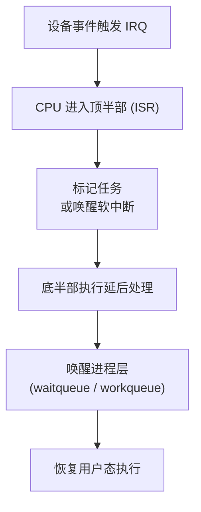

# 第1章　从单核轮询到中断驱动

------

## 章节内容说明

本章带领读者从最原始的执行模型——单核轮询——出发，理解**并发问题的起点**。
 沿着历史线索，我们将依次说明：

- 轮询模型为何失效；
- 中断机制为何出现；
- 中断分层（顶半部 / 底半部 / 软中断）如何在解决旧问题的同时，引入新的竞态与可见性挑战。

> 本章不出现具体 API 名称，仅阐述抽象与动机。

------

## 1.1　轮询时代：CPU 忙等与事件饥饿

### 概念

在早期单核系统中，外围设备状态通过**轮询（polling）**方式检测：
 CPU 不断读取寄存器以判断事件是否到来。

```c
while (!device_ready())
    ;               /* [PIT] 忙等，占用 CPU */
handle_event();
```

### 解决了什么问题

- 实现了最基础的事件检测与处理；
- 提供确定性响应，逻辑极简。

### 带来了什么新问题

| 问题类别 | 描述                               |
| -------- | ---------------------------------- |
| 性能浪费 | CPU 长时间空转，无法执行其他任务   |
| 响应不均 | 事件到达与采样时刻错开造成延迟     |
| 无法并发 | 所有设备共享单一执行流，吞吐量受限 |

> **结论**：轮询仅适合极简单系统；随着设备增多，CPU 会陷入忙等饥饿。

------

### 表 1-1　历史事件→问题→新问题 对照表

| 演进阶段 | 解决的问题                   | 新出现的问题               |
| -------- | ---------------------------- | -------------------------- |
| 轮询     | 去除外设阻塞，提供最原始响应 | CPU 忙等、无并发           |
| 中断     | 事件驱动，CPU 被动唤醒       | 不可睡上下文、共享数据竞态 |
| 中断分层 | 缩短 ISR 延迟                | 上下文间数据一致性问题     |

------

## 1.2　引入中断：事件驱动与新型约束

### 概念

**中断（Interrupt）**是外设主动通知 CPU 有事件的机制。
 CPU 暂停当前任务，跳入中断服务程序（ISR）执行，再返回原执行点。

### 解决了什么问题

- CPU 不再空转，改为**被动唤醒**；
- 响应延迟从采样周期降至中断延迟；
- 系统吞吐显著提升。

### 带来了什么新问题

1. **不可睡眠约束**：ISR 在原子上下文中运行，禁止阻塞；
2. **共享数据竞态**：ISR 与普通进程访问同一变量；
3. **重入风险**：多源中断可嵌套触发；
4. **一致性问题**：寄存器与缓存状态未同步。

------

### 表 1-2　中断引入后的特征与副作用

| 分类     | 描述                 | 副作用                 |
| -------- | -------------------- | ---------------------- |
| 上下文   | 原子上下文，不可睡眠 | 调用阻塞接口将触发 BUG |
| 并发性   | ISR 可打断任意执行流 | 数据需加锁保护         |
| 响应特性 | 响应更快但顺序不可控 | 调度不确定性           |
| 性能取舍 | 过多中断导致抖动     | 可用分层/批量缓解      |

------

## 1.3　中断分层：顶半部、底半部与软中断雏形

### 概念

为缩短 ISR 执行时间并提升并发度，引入**中断分层**机制：
 中断处理被拆分为“紧急部分（顶半部）”与“延后部分（底半部）”。
 Linux 内核进一步发展出 **软中断（softirq）**、**tasklet** 与 **工作队列（workqueue）**。

------

### 解决了什么问题

- 顶半部仅执行硬件确认与最关键动作；
- 底半部在可调度上下文中处理复杂逻辑；
- 缩短中断关闭时间，提高系统吞吐。

------

### 带来了什么新问题

| 问题类型     | 说明                             |
| ------------ | -------------------------------- |
| 跨上下文共享 | 顶半部与底半部访问同一数据需同步 |
| 可见性       | 缓存未刷新导致底半部读到旧值     |
| 执行次序     | 多核下底半部可能并行，引发竞态   |
| 调度时机     | 底半部受调度影响可能延迟执行     |

------

### 图 1-1　中断分层演化示意



------

## 1.4　小结：并发问题的起点

1. “轮询 → 中断 → 分层中断”是并发机制的三步演化；
2. 每次改进均解决旧瓶颈，却引入新问题：
   - ISR 不可睡；
   - 跨上下文共享需同步；
   - 顺序与可见性不再自然成立。
3. 这些问题直接催生了锁、屏障、RCU 等同步机制。

------

### 表 1-3　核对表

| 核对项 [CHECK]              | 说明                 |
| --------------------------- | -------------------- |
| ISR 是否最小化？            | 顶半部仅保留关键操作 |
| 是否存在共享变量？          | 须使用同步原语保护   |
| 是否区分中断与进程上下文？  | 防止调用阻塞函数     |
| 是否明确事件→延后处理路径？ | 提高可追踪性         |
| 是否考虑多核并发？          | 对共享区加同步保护   |

------

**下一章预告**
 第2章将进入“多核并发与 SMP”，分析缓存一致性与顺序语义问题，解释为何锁与中断仍不足以应对现代多核系统的并发挑战。