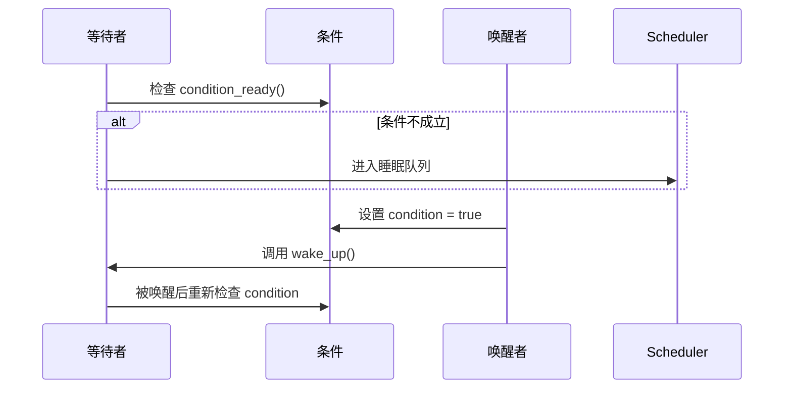

# 第3章　等待与唤醒：从忙等到事件驱动

------

## 章节内容说明

前两章讨论了从单核轮询到中断驱动，再到多核 SMP 的演化，揭示了**并发问题的来源**：
 CPU 不再单一，执行流不再顺序，事件不再同步。

本章转入另一个核心主题——**等待（wait）与唤醒（wake）**。
 它标志着从“CPU 忙等”向“事件驱动式调度”的转变，是 Linux 并发机制中的第二根支柱。

我们将回答：

1. 为什么要让线程“睡下去”？
2. 为什么唤醒并不总是可靠？
3. “电平触发（level-triggered）”与“边沿触发（edge-triggered）”语义如何影响驱动正确性？

------

## 3.1　阻塞等待：从忙等到可睡眠

### 概念

**阻塞等待（blocking wait）**是一种让任务主动让出 CPU 的机制。
 当条件未满足时，线程进入睡眠队列（sleep queue），由调度器切换至其它任务。

```c
while (!condition)
    schedule();     /* [PIT] 非典型写法，会导致忙等 */
```

Linux 内核的改进是：

> 把“睡眠条件”交由调度器统一管理，通过事件（如中断、信号量）来**唤醒等待者**。

------

### 解决了什么问题

- 减少了 CPU 忙等，提高系统吞吐；
- 允许多个任务公平竞争资源；
- 统一了“等待事件”这一抽象，为后续 `waitqueue` 与 `completion` 奠基。

------

### 带来了什么新问题

| 问题类别                    | 描述                                 |
| --------------------------- | ------------------------------------ |
| 虚假唤醒（spurious wakeup） | 任务可能被意外唤醒，条件仍不成立     |
| 条件竞态（condition race）  | 条件变化与唤醒之间存在时序空洞       |
| 顺序依赖                    | 唤醒早于睡眠时，任务可能永远错过信号 |

------

### 表 3-1　等待机制的演化与权衡

| 阶段     | 解决的问题         | 新问题             | 特征         |
| -------- | ------------------ | ------------------ | ------------ |
| 忙等     | 无需同步机制       | CPU 浪费           | 简单但低效   |
| 阻塞等待 | 节约 CPU、允许并发 | 虚假唤醒、顺序空洞 | 高效但复杂   |
| 事件唤醒 | 明确触发点         | 需要条件保护       | 驱动通用机制 |

------

## 3.2　事件语义：电平 vs 边沿

### 概念

事件触发有两种主要语义：

| 语义类型          | 条件特征             | 持续性 | 典型例子              |
| ----------------- | -------------------- | ------ | --------------------- |
| 电平触发（Level） | 条件为真时一直有效   | 持续   | GPIO 电平信号         |
| 边沿触发（Edge）  | 条件从假变真瞬间触发 | 瞬时   | 外设中断、FIFO 新数据 |

------

### 解决了什么问题

- 提供了统一的事件抽象：**电平表示状态，边沿表示变化**；
- 驱动可根据语义选择处理方式（轮询/中断/等待）。

------

### 带来了什么新问题

| 问题类型 | 描述                                     |
| -------- | ---------------------------------------- |
| 语义错误 | 用错触发类型，可能导致“常亮”或“永不触发” |
| 时序依赖 | 边沿事件必须在监听前配置，否则丢失       |
| 多源竞争 | 电平触发在多事件系统中容易引发误唤醒     |

------

### 表 3-2　电平/边沿/一次性/持续性 概念区分表

| 类型       | 持续性 | 唤醒条件     | 使用场景              | 常见误用       |
| ---------- | ------ | ------------ | --------------------- | -------------- |
| 电平触发   | 持续   | 状态=有效    | GPIO 输入、外设 ready | 忘记清状态     |
| 边沿触发   | 瞬时   | 状态变化     | 中断、事件通知        | 初始化顺序错误 |
| 一次性事件 | 瞬时   | 单次唤醒     | completion            | 重复触发无效   |
| 持续性事件 | 持续   | 条件长期为真 | waitqueue             | 虚假唤醒未重检 |

------

## 3.3　典型并发问题：虚假唤醒与条件竞态

### 概念

等待与唤醒之间存在一个时间差。
 若条件判断与唤醒信号不同步，就可能出现“虚假唤醒”或“条件竞态”：

```c
wait_event_interruptible(queue, condition_ready());
```

> 问题在于：`condition_ready()` 与 `wake_up()` 之间若无同步保护，条件可能在检查后失效。

------

### 解决方式

- 在受保护区域（锁内）评估条件；
- 唤醒前设置条件，唤醒后重新检查；
- 唤醒者和等待者的**时序必须成对设计**。

------

### 图 3-1　等待与唤醒的典型时序（Mermaid）



------

## 3.4　驱动层的影响

### 能做

- 使用事件等待替代忙等，降低 CPU 占用；
- 结合中断上下文触发唤醒，实现高效驱动交互。

### 不能做

- 在中断上下文中直接调用阻塞等待；
- 忽略条件检查或省略锁保护；
- 假设唤醒一定可靠。

------

### 表 3-3　核对表

| 核对项 [CHECK]                  | 说明                     |
| ------------------------------- | ------------------------ |
| 是否在锁内检查条件？            | 否则可能触发条件竞态     |
| 唤醒前是否先设置条件？          | 避免丢失事件             |
| 是否考虑虚假唤醒？              | 必须在唤醒后重检条件     |
| 是否区分上下文（可睡/不可睡）？ | 不可在中断中调用等待接口 |
| 是否明确触发语义（电平/边沿）？ | 错误类型会导致永久等待   |

------

## 3.5　小结

1. 从忙等到阻塞等待，Linux 进入“事件驱动”的阶段；
2. **等待与唤醒的可靠性**取决于条件保护与时序设计；
3. **电平与边沿语义**决定了事件是否可重复、是否会错过；
4. 驱动中的等待逻辑必须成对、成环节地设计，否则隐藏竞态难以调试。

------

**下一章预告**
 第4章将探讨“锁家族的出现：自旋与互斥的分工”，系统地介绍**短临界区与长操作的分界点**，以及锁的上下文约束和使用边界。