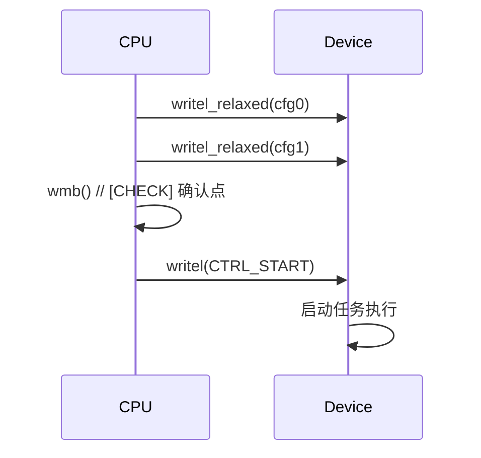

# 第6章　CPU↔设备的顺序与一致性

------

## 章节内容说明

前一章介绍了 `seqcount/seqlock` 与 `RCU`，展示了 Linux 如何在 **CPU↔CPU** 之间维持可控的一致性。
 但驱动开发者更常面对的另一种并发，是 **CPU↔设备（Device）** 之间的交互乱序问题。

设备访问不同于普通内存访问：

> 它跨越了 CPU 缓存体系、总线协议、DMA 控制器、外设寄存器四个层次。

本章从开发者视角解析：

1. CPU 如何通过寄存器或 DMA 与设备交互；
2. 顺序与可见性如何失效；
3. 屏障（barrier）在 CPU↔设备间的实际作用与放置规则。

------

## 6.1　I/O 顺序：寄存器访问的“配置→启动”问题

### 概念

CPU 对设备的控制往往由一系列写寄存器操作组成：

- 配置寄存器（Configuration Register）
- 启动寄存器（Control Register）

逻辑上应为：

```c
/* [INV] 设备必须先见到配置，再见到启动 */
writel_relaxed(cfg0, base + REG_CFG0);
writel_relaxed(cfg1, base + REG_CFG1);
wmb();                 /* [CHECK] CPU→设备顺序确认点 */
writel(CTRL_START, base + REG_CTRL);
```

------

### 解决了什么问题

- 通过显式写入顺序，确保设备不会“提前启动”；
- 保证写入配置寄存器的值在启动前已经到达设备；
- 消除总线缓冲与乱序执行导致的“配置未生效即启动”问题。

------

### 带来了什么新问题

| 问题类型     | 描述                                    |
| ------------ | --------------------------------------- |
| 屏障缺失     | 设备可能在配置未刷新前就开始动作        |
| 屏障误放     | 过度屏障导致性能下降                    |
| 锁与屏障混淆 | 加锁不等于 I/O 顺序保证                 |
| 不同架构差异 | ARM、x86 在 MMIO 访问上的默认一致性不同 |

------

### 表 6-1　CPU→设备 写序关系示例

| 步骤         | 逻辑顺序     | 需要保证的可见性 | 是否需屏障     |
| ------------ | ------------ | ---------------- | -------------- |
| 写配置寄存器 | 寄存器更新   | CPU 缓存→总线    | 是             |
| 写启动寄存器 | 启动动作触发 | 设备侧读取       | 否（前置 wmb） |
| 写状态寄存器 | 通知完成     | CPU 可见         | 是（读屏障）   |

------

### 图 6-1　CPU→设备 写序示意



------

## 6.2　DMA 一致性：CPU 与设备的数据视图

### 概念

**DMA（Direct Memory Access）** 允许设备直接访问主存，不经 CPU 干预。
 但 CPU 缓存中的数据可能尚未写回主存，从而导致设备读取到旧数据。

因此需要维护 **CPU 缓存一致性（cache coherency）**：

| 动作            | 描述                        |
| --------------- | --------------------------- |
| DMA To Device   | CPU 写入数据后→写回主存     |
| DMA From Device | 设备写完数据后→CPU 失效缓存 |

------

### 解决了什么问题

- 确保 CPU 与设备看到的是同一份数据；
- 使 DMA 数据传输在多核环境中保持一致；
- 保证写缓存（write buffer）被正确清空。

------

### 带来了什么新问题

| 问题     | 说明                                                     |
| -------- | -------------------------------------------------------- |
| 方向错误 | `DMA_TO_DEVICE` / `DMA_FROM_DEVICE` 配置错误导致数据错乱 |
| 未同步   | 未调用 sync 系列函数导致设备读旧数据                     |
| 重复同步 | 频繁调用导致性能下降                                     |
| 门铃乱序 | 写数据后未 wmb() 即写门铃寄存器导致设备提前启动          |

------

### 表 6-2　DMA 一致性关键操作

| 操作                         | 阶段     | 目的                 | 必要性                 |
| ---------------------------- | -------- | -------------------- | ---------------------- |
| dma_map_single()             | 传输前   | 建立映射、刷新缓存   | 必须                   |
| dma_unmap_single()           | 传输后   | 解除映射、同步回主存 | 必须                   |
| dma_sync_single_for_device() | 设备读前 | 刷新缓存             | 可选（streaming 模式） |
| dma_sync_single_for_cpu()    | 设备写后 | 失效缓存             | 可选                   |

------

### 图 6-2　DMA 传输一致性流程


------

## 6.3　CPU↔设备 一致性模型

### 概念对比

| 维度         | CPU↔CPU              | CPU↔设备                       |
| ------------ | -------------------- | ------------------------------ |
| 作用对象     | 内存与缓存           | MMIO 与总线                    |
| 一致性来源   | Cache coherency 协议 | 总线协议（AXI、PCIe 等）       |
| 顺序控制手段 | 内存屏障（barrier）  | I/O 屏障、wmb/rmb、读写序      |
| 典型问题     | 指令乱序、缓存未刷新 | 配置未到达设备、DMA 数据未同步 |

------

### 表 6-3　CPU↔CPU vs CPU↔设备 差异表

| 项目       | CPU↔CPU         | CPU↔设备               |
| ---------- | --------------- | ---------------------- |
| 默认一致性 | 由缓存协议维护  | 无保证，需显式同步     |
| 屏障类型   | smp_mb/rmb/wmb  | mb/rmb/wmb（含 I/O）   |
| 乱序风险   | 编译器与执行层  | 总线与缓存延迟         |
| 检查手段   | READ/WRITE_ONCE | writel/readl + barrier |
| 常见错误   | 忘记 barrier    | 设备读写顺序错误       |

------

## 6.4　常见坑

| 标识   | 描述                                        |
| ------ | ------------------------------------------- |
| [PIT1] | 未在设备启动前插入 wmb() 导致寄存器乱序     |
| [PIT2] | DMA 传输前未同步缓存                        |
| [PIT3] | 使用普通 memcpy 替代 dma_map 导致缓存未刷回 |
| [PIT4] | 将自旋锁当作顺序保证工具                    |
| [PIT5] | 在多核下写门铃寄存器无序触发                |
| [PIT6] | 在 readl() 后未使用 rmb()，导致读取状态滞后 |

------

## 6.5　最小模板

```c
/* [INV] CPU→设备：配置→确认→启动 */
writel_relaxed(cfg0, base + REG_CFG0);
writel_relaxed(cfg1, base + REG_CFG1);
wmb();  /* [CHECK] 确保设备按序看到配置 */
writel(CTRL_START, base + REG_CTRL);

/* [INV] DMA 一致性：方向与同步 */
dma_map_single(dev, buf, size, DMA_TO_DEVICE);
/* [PIT] 若省略 wmb()，设备可能提前读旧缓存 */
wmb();
writel(DMA_DOORBELL, base + REG_DMA_CTRL);
dma_unmap_single(dev, buf, size, DMA_TO_DEVICE);
```

------

### 表 6-4　核对表

| 核对项 [CHECK]                | 说明                        |
| ----------------------------- | --------------------------- |
| 是否在配置→启动之间插入 wmb？ | 防止设备乱序执行            |
| 是否使用 dma_map/unmap？      | 保证缓存同步                |
| 是否明确 DMA 方向？           | DMA_TO_DEVICE / FROM_DEVICE |
| 是否区分 smp_mb 与 wmb？      | CPU↔设备用 wmb              |
| 是否避免锁代替屏障？          | 锁不等价于 I/O 顺序         |
| 是否在 readl() 后 rmb()？     | 保证状态读取最新            |

------

## 6.6　小结

1. CPU 与设备之间的交互受缓存、总线与屏障三重影响；
2. **I/O 顺序错误**是驱动最常见的隐性 BUG；
3. **DMA 一致性**要求开发者显式管理数据方向与同步时机；
4. 屏障 (`wmb/rmb/mb`) 是 CPU→设备 通信中**最可靠的确认点**。

------

**下一章预告**
 第7章将进入“生命周期与有序停机”，讲解资源簿记（devres）、引用计数（kref）与驱动卸载三步法，解析如何确保系统在“退出阶段”也能保持一致性与安全释放。