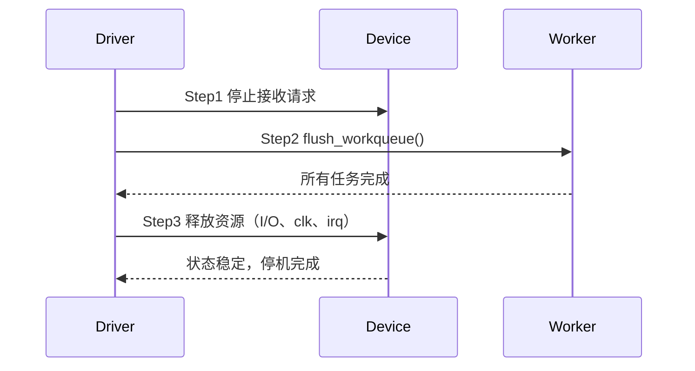

# 第7章　生命周期与有序停机

------

## 章节内容说明

前几章聚焦于“运行时并发”的各类问题（锁、屏障、可见性、等待与唤醒），但在**驱动生命周期的尾端**，另一个高危阶段才真正到来——**资源释放与停机顺序**。

驱动在移除（`remove`）或异常退出路径中若处理不当，极易导致：

- 引用计数未清零 → 资源泄漏；
- 仍有用户线程访问 → 竞争导致崩溃；
- 设备仍在 DMA → 破坏系统一致性。

本章讨论以下主题：

1. **devres（设备资源簿记）**机制：自动化资源释放；
2. **引用计数（kref）**：防止被使用对象过早释放；
3. **有序停机“三步法”**：统一驱动卸载顺序、确保数据一致性。

------

## 7.1　资源簿记（devres）：让释放自动发生

### 概念

`devres`（Device Resource Management）是 Linux 驱动框架为设备提供的**资源生命周期自动管理机制**。
 其思想是：

> 让驱动注册的资源“挂”在 `struct device` 的私有资源列表上，当设备释放时统一回收。

------

### 解决了什么问题

- 减少 `remove()` 中显式 `kfree()`、`iounmap()` 等调用；
- 自动回滚未完成的 `probe()` 初始化；
- 降低内核泄漏风险。

------

### 带来了什么新问题

| 问题                              | 描述                                 |
| --------------------------------- | ------------------------------------ |
| 仅自动释放，不自动“复位”          | 资源虽回收，但硬件状态可能未恢复默认 |
| 难以调试释放顺序                  | 多层嵌套资源的销毁时序不直观         |
| 使用非 devm 系列 API 时需混合管理 | 需清晰划分 devm 与非 devm 范围       |

------

### 表 7-1　devres 与手动资源管理对比

| 维度           | 手动方式           | devres 机制        |
| -------------- | ------------------ | ------------------ |
| 注册与释放时机 | 手动成对编写       | 自动与设备绑定     |
| 出错回滚       | 需人工清理         | 自动回滚未成功步骤 |
| 一致性         | 由程序员保证       | 框架统一释放       |
| 适用场景       | 复杂驱动、复用资源 | 简单设备、单实例   |

------

### 最小模板

```c
/* [INV] 设备 probe 阶段自动资源管理 */
pdata = devm_kzalloc(dev, sizeof(*pdata), GFP_KERNEL);
pdata->base = devm_platform_ioremap_resource(pdev, 0);
pdata->clk  = devm_clk_get(dev, NULL);
/* [CHECK] remove() 中无需重复释放 */
```

------

## 7.2　引用计数：防止“仍在使用”对象被释放

### 概念

**引用计数（Reference Counting）**用于跟踪对象被多少用户或子系统持有。
 核心结构体为 `struct kref`：

```c
struct kref {
	atomic_t refcount;
};
```

每次对象被引用时执行 `kref_get()`；
 引用不再使用时执行 `kref_put()`，当计数归零自动触发释放回调。

------

### 解决了什么问题

- 防止对象被过早释放（use-after-free）；
- 提供统一的对象生命周期管理接口；
- 可与 `RCU`、`devres` 组合，实现延迟或自动回收。

------

### 带来了什么新问题

| 问题类型     | 描述                                   |
| ------------ | -------------------------------------- |
| 计数不平衡   | 少 put 会泄漏，多 put 会释放中使用对象 |
| 回调循环依赖 | 回调中再次引用同对象导致死循环         |
| 并发更新     | 多核同时 put 需使用原子操作保护        |

------

### 表 7-2　引用计数典型使用流程

| 阶段     | 操作         | 函数          | 说明                   |
| -------- | ------------ | ------------- | ---------------------- |
| 初始化   | 计数设为 1   | `kref_init()` | 对象创建时             |
| 新引用   | +1           | `kref_get()`  | 使用者持有             |
| 释放引用 | -1           | `kref_put()`  | 最后一个释放时执行回调 |
| 自动销毁 | 回调释放对象 | `release()`   | 保证唯一出口           |

------

### 最小模板

```c
struct my_obj {
	struct kref ref;
	...
};

static void my_obj_release(struct kref *ref)
{
	struct my_obj *obj = container_of(ref, struct my_obj, ref);
	kfree(obj);  /* [INV] 释放路径唯一 */
}

/* [INV] 使用者持有 */
kref_get(&obj->ref);

/* [CHECK] 使用结束 */
kref_put(&obj->ref, my_obj_release);
```

------

## 7.3　有序停机三步法

### 概念

驱动卸载（remove/unbind）阶段的核心目标是**安全停止正在运行的设备**。
 任何仍在执行的 I/O、DMA 或工作线程，都可能在设备释放后访问无效地址。

Linux 建议遵循“三步法”：

| 步骤   | 目标             | 动作                           |
| ------ | ---------------- | ------------------------------ |
| Step 1 | 阻止新请求       | 设置停止标志 / 关闭接口        |
| Step 2 | 等待当前任务完成 | flush 工作队列 / 取消定时器    |
| Step 3 | 释放资源         | 解除映射、释放内存 / clk / irq |

------

### 表 7-3　有序停机关键动作

| 阶段   | 示例函数                                      | 说明         |
| ------ | --------------------------------------------- | ------------ |
| Step 1 | `netif_stop_queue()` / `atomic_set(stop, 1)`  | 拒绝新任务   |
| Step 2 | `flush_workqueue()` / `del_timer_sync()`      | 确保活动停止 |
| Step 3 | `devm_free_irq()` / `clk_disable_unprepare()` | 回收资源     |

------

### 时序示意



------

### 典型错误与风险

| [PIT]  | 描述                                         |
| ------ | -------------------------------------------- |
| [PIT1] | 在 remove() 中未先阻止新请求                 |
| [PIT2] | 调用 flush 前已释放内存，造成 use-after-free |
| [PIT3] | 设备仍在 DMA 传输未 unmap                    |
| [PIT4] | 锁在退出路径中未释放导致卡死                 |
| [PIT5] | devres 与手动释放混用导致重复 free           |

------

## 7.4　混搭与边界

| 组合              | 是否推荐   | 理由                                       |
| ----------------- | ---------- | ------------------------------------------ |
| devres + kref     | ✅ 推荐     | devres 管理硬件资源，kref 管理对象生命周期 |
| devres + RCU      | ⚠️ 谨慎     | RCU 延迟释放可能与 devres 销毁时序冲突     |
| kref + workqueue  | ✅ 可用     | 引用保证任务执行期安全                     |
| devres + 手动释放 | ❌ 禁止混用 | 双重释放风险                               |
| RCU + kref        | ✅ 常见组合 | RCU 延迟释放后通过 kref 控制回收           |

------

## 7.5　最小模板

```c
/* [INV] 驱动 remove 三步法 */
static int mydev_remove(struct platform_device *pdev)
{
	struct mydev *d = platform_get_drvdata(pdev);

	/* Step1: 阻止新请求 */
	atomic_set(&d->stopped, 1);
	netif_stop_queue(d->netdev);

	/* Step2: 等待正在运行的任务完成 */
	flush_workqueue(d->wq);
	del_timer_sync(&d->timer);

	/* Step3: 释放资源 */
	devm_free_irq(&pdev->dev, d->irq, d);
	clk_disable_unprepare(d->clk);
	kref_put(&d->ref, mydev_release);

	return 0;
}
```

------

### 表 7-4　核对表

| 核对项 [CHECK]                | 说明              |
| ----------------------------- | ----------------- |
| 是否阻止新请求后再停机？      | 防止竞争提交      |
| 是否 flush 工作队列与定时器？ | 避免悬空回调      |
| 是否使用 devres 自动释放？    | 简化退出流程      |
| 是否对对象使用 kref？         | 防止引用未清零    |
| 是否分离硬件复位与内存释放？  | 确保设备状态稳定  |
| 是否有序停机？                | 按 Step1→2→3 执行 |

------

## 7.6　小结

1. **devres** 提供自动释放机制，减少人工资源管理负担；
2. **kref** 确保引用安全，使对象不会被提前销毁；
3. **有序停机三步法** 统一驱动的退出顺序：
   - 阻止新请求；
   - 等待任务完成；
   - 释放资源；
4. 生命周期管理的本质，是**让驱动的退出过程也具备并发安全性**。

------

**下一章预告**
 第8章将总结本篇的概念缓冲，绘制“概念→模块映射图”，展示本书所有并发机制的逻辑关联，为进入第二篇（可见性与顺序篇）做准备。