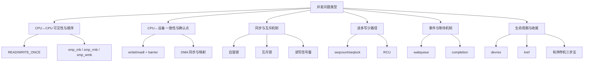

# 第8章　概念到模块的映射图

------

## 章节内容说明

前七章系统地回顾了并发机制的历史演进，从“单核轮询”到“多核并发”，再到“锁、等待、屏障、引用与停机”。
 这一章的任务是：

> 把前面的“概念层”抽象，正式映射到“模块层”，让读者建立全书的知识坐标。

本章不讲接口与代码，而是从结构化视角回答：

1. 每种并发问题由哪一类机制解决？
2. 各模块之间的依赖与衔接关系如何？
3. 作为驱动开发者，应该从哪个层次开始分析并发风险？

------

## 8.1　从概念到机制：并发问题的六大核心维度

| 概念维度                       | 典型问题             | 对应模块                        | 模块类型    |
| ------------------------------ | -------------------- | ------------------------------- | ----------- |
| **可见性（Visibility）**       | 多核下变量更新不可见 | Memory barrier、READ/WRITE_ONCE | CPU↔CPU 层  |
| **顺序性（Ordering）**         | 指令或 I/O 执行乱序  | `smp_mb` / `wmb` / `rmb`        | CPU↔设备 层 |
| **互斥性（Mutual Exclusion）** | 并发写导致数据破坏   | spinlock / mutex / rwsem        | 同步原语层  |
| **一致性（Consistency）**      | 数据视图不匹配       | seqcount / RCU                  | 读多写少层  |
| **等待性（Waiting）**          | 事件通知与调度协作   | waitqueue / completion          | 同步事件层  |
| **生命周期（Lifetime）**       | 资源释放与引用安全   | devres / kref / remove          | 收尾控制层  |

------

## 8.2　从抽象到模块：全书映射总览

------

## 8.3　典型放置点与邻接关系

| 模块             | 典型放置点          | 邻接模块      | 主要风险点                 |
| ---------------- | ------------------- | ------------- | -------------------------- |
| READ/WRITE_ONCE  | 全局状态变量访问    | seqcount、RCU | 编译器优化导致不可见       |
| smp_barrier 系列 | 任务同步点          | spinlock、DMA | 过少或过多均影响性能       |
| spinlock         | 中断与底半部        | waitqueue     | 上下文限制（不可睡）       |
| mutex/rwsem      | 线程级同步          | completion    | 死锁与优先级反转           |
| seqcount         | 状态快照            | 自旋锁        | 写段过长导致读频繁重试     |
| RCU              | 全局查表与指针替换  | kref          | 延迟回收时机控制           |
| waitqueue        | 进程/驱动交互       | completion    | 条件竞态、虚假唤醒         |
| completion       | 启动确认 / 事件握手 | waitqueue     | 重复完成或丢失事件         |
| devres           | probe/remove 阶段   | kref          | 混用非 devm 资源           |
| kref             | 动态对象引用        | RCU / remove  | 计数不平衡、use-after-free |

------

## 8.4　概念→模块→章节索引矩阵

| 概念层主题     | 模块名                 | 本书章节  | 主要作用                |
| -------------- | ---------------------- | --------- | ----------------------- |
| 可见性与顺序   | READ/WRITE_ONCE、smp_* | 第9–10章  | 控制 CPU 乱序与观察顺序 |
| 互斥与同步     | spinlock、mutex、rwsem | 第16–17章 | 限制并发访问            |
| 读多写少一致性 | seqcount、RCU          | 第18–19章 | 高效读路径              |
| 事件协调       | waitqueue、completion  | 第20–21章 | 线程间同步              |
| 执行路径       | 中断、软中断、工作队列 | 第22章    | 多层上下文管理          |
| 时间调度       | timer/hrtimer          | 第23章    | 定时事件与取消同步      |
| 数据交互       | 文件操作并发           | 第24章    | I/O 层一致性            |
| 数据一致性     | DMA 缓存同步           | 第25章    | CPU↔设备视图统一        |
| 生命周期管理   | devres、kref           | 第26章    | 资源安全释放            |
| 停机控制       | 有序停机三步法         | 第27章    | 驱动卸载安全性          |

------

## 8.5　驱动开发者的视角

在开发者视角下，**分析并发问题的顺序**应遵循自底向上的分层逻辑：

| 层级       | 关注点             | 典型机制                |
| ---------- | ------------------ | ----------------------- |
| CPU 层     | 指令执行、缓存同步 | READ/WRITE_ONCE, smp_mb |
| 总线层     | CPU↔设备 交互      | writel/readl, wmb/rmb   |
| 同步层     | 多核互斥、共享资源 | spinlock, mutex, rwsem  |
| 协作层     | 等待与唤醒机制     | waitqueue, completion   |
| 数据层     | 一致性优化         | seqcount, RCU           |
| 生命周期层 | 引用、安全停机     | kref, devres, remove    |

这种层级模型可作为“驱动并发风险审计表”的基础：
 每次设计同步逻辑时，应逐层检查是否缺少屏障、锁或引用保护。

------

### 表 8-1　核对表（概念映射篇）

| 核对项 [CHECK]                                | 说明                     |
| --------------------------------------------- | ------------------------ |
| 是否区分 CPU↔CPU 与 CPU↔设备 两类可见性问题？ | 不同机制，屏障类型不同   |
| 是否知道每个锁的上下文限制？                  | 自旋不可睡、互斥可睡     |
| 是否明确读多写少的选择逻辑？                  | seqcount 与 RCU 不可混用 |
| 是否掌握等待与唤醒的配对规则？                | 条件保护与虚假唤醒       |
| 是否设计了统一的停机顺序？                    | Step1–3：阻止→等待→释放  |

------

## 8.6　小结

1. 并发问题在 Linux 驱动中可分为六类核心维度：可见性、顺序性、互斥性、一致性、等待性、生命周期。
2. 每一类问题都有独立模块应对，且这些模块彼此依赖、层层递进。
3. 本章建立了“概念→模块→章节”的一一映射，为第二篇的系统化讲解奠定基础。
4. 从此，读者可以通过矩阵定位任何并发问题所对应的内核机制。

------

**下一篇预告**
 至此，“并发脉络与概念缓冲”篇完结。
 第二篇《可见性与顺序》将从 **READ/WRITE_ONCE** 与 **发布-获取（release-acquire）** 语义开始，进入可直接上手的编程层讲解，系统展示 CPU↔CPU 的一致性控制原理。