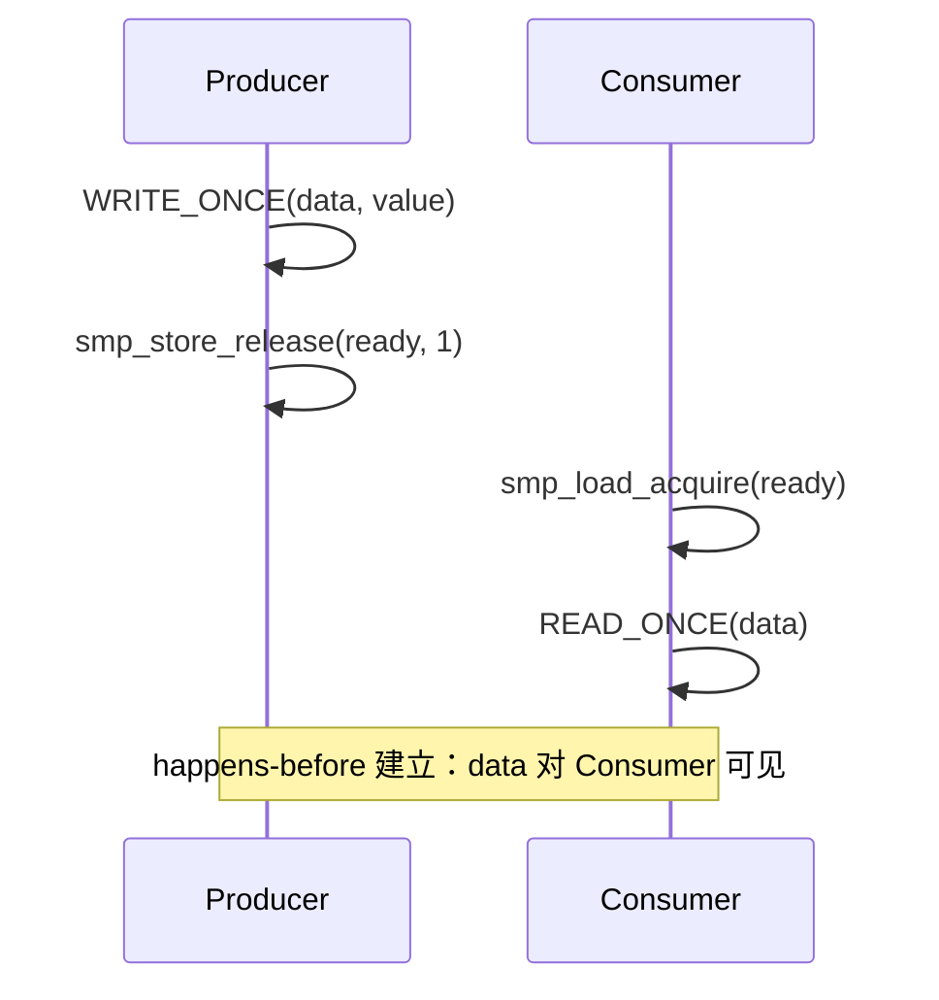

# 第9章　CPU↔CPU 可见性与顺序：READ/WRITE_ONCE 与发布-获取语义

------

## 章节内容说明

本章是第二篇《可见性与顺序》的开篇。
 从此处开始，我们从“概念缓冲”阶段正式进入“机制与模式”阶段——即：**如何在多核 CPU 之间建立可控的可见性与执行顺序**。

在多核系统中，两个线程共享的变量若缺乏同步机制，其读写结果可能出现以下不确定性：

- 写入未及时传播（可见性问题）；
- 操作顺序被硬件/编译器重排（顺序问题）；
- 同步语义不对齐（happens-before 关系失效）。

Linux 为此定义了统一的“可见性语义层”，主要构成包括：

1. `READ_ONCE()` / `WRITE_ONCE()` — **防止编译器优化破坏可见性**；
2. 发布-获取（Release-Acquire）模型 — **建立最小的有序关系**；
3. SMP 屏障（`smp_mb/rmb/wmb`） — **进一步强制硬件顺序**。

本章聚焦前两者：

> “让变量在多核之间确实能被看见、按预期顺序被看见”。

------

## 9.1　概念

### 〔白话解释〕

在单核程序中，变量赋值几乎是即时可见的；
 但在多核环境下，每个 CPU 都有自己的缓存，写入可能仅停留在本地缓存或写缓冲区中，其他 CPU 并未感知。

### 〔专业定义〕

- **可见性（Visibility）**：一个 CPU 对共享变量的修改，是否能被其他 CPU 观察到。
- **顺序性（Ordering）**：多个操作的执行顺序，在其他 CPU 眼中是否保持一致。
- **happens-before 关系**：在内存模型中定义的“前后因果顺序”，只有当 A happens-before B 时，B 一定能看到 A 的效果。

------

## 9.2　能做 / 不能做

| 操作                       | 是否保证可见性 | 是否保证顺序   | 适用场景       |
| -------------------------- | -------------- | -------------- | -------------- |
| 普通读写                   | 否             | 否             | 局部变量       |
| `READ_ONCE` / `WRITE_ONCE` | 是（防优化）   | 否             | 跨核状态共享   |
| 原子操作（atomic_ 系列）   | 是             | 是（隐式屏障） | 计数器、标志位 |
| `smp_*` 屏障               | 否             | 是             | 顺序确认点     |
| 自旋锁 / 互斥锁            | 是             | 是             | 临界区互斥     |

------

### 表 9-1　概念区分表

| 概念   | 作用                        | 示例           | 常见误解                 |
| ------ | --------------------------- | -------------- | ------------------------ |
| 可见性 | 保证变量变化被其他 CPU 感知 | `READ_ONCE(x)` | 误以为等价于原子性       |
| 顺序性 | 保证执行次序一致            | `smp_wmb()`    | 误以为屏障能同步缓存     |
| 原子性 | 保证操作不可分割            | `atomic_inc()` | 与可见性、顺序性不同层次 |

------

## 9.3　核心用法模式

### 模式 ①：防止编译器优化

```c
/* [INV] CPU A 更新标志 */
WRITE_ONCE(flag, 1);

/* [INV] CPU B 检测标志 */
if (READ_ONCE(flag))
    do_task();
```

- `WRITE_ONCE` 保证写入操作不会被编译器合并或重排；
- `READ_ONCE` 保证读取操作不会被缓存到寄存器重复使用；
- 它**不保证跨 CPU 的执行顺序**，仅防止编译器层面的问题。

------

### 模式 ②：发布-获取（Release-Acquire）语义

```c
/* CPU0: 发布阶段（Producer） */
WRITE_ONCE(data, value);
smp_store_release(&ready, 1);    /* 发布 */

/* CPU1: 获取阶段（Consumer） */
if (smp_load_acquire(&ready))    /* 获取 */
    process(READ_ONCE(data));
```

- `smp_store_release()` 确保 **写入 data 先于写 ready**；

- `smp_load_acquire()` 确保 **读 ready 先于读 data**；

- 两者合并形成一个 **单向有序链**：

  > CPU0 的数据写入对 CPU1 可见。

------

### 图 9-1　发布-获取关系示意



------

## 9.4　混搭与边界

| 组合                                     | 是否推荐 | 理由                                       |
| ---------------------------------------- | -------- | ------------------------------------------ |
| `READ_ONCE` + `WRITE_ONCE`               | ✅        | 编译级防优化，最小可见性保障               |
| `WRITE_ONCE` + 屏障                      | ✅        | 在同步点确认数据顺序                       |
| `smp_store_release` + `smp_load_acquire` | ✅        | 完整发布-获取链路                          |
| 原子操作 + `READ_ONCE`                   | ⚠️        | 语义重复，除非要分离读写                   |
| 自旋锁 + `WRITE_ONCE`                    | ❌        | 锁已隐式提供顺序保证                       |
| 普通变量 + `smp_mb`                      | ⚠️        | 屏障不会修正缓存优化，仍需 READ/WRITE_ONCE |

------

## 9.5　常见坑

| [PIT]  | 描述                                                 |
| ------ | ---------------------------------------------------- |
| [PIT1] | 使用普通变量在核间通信（缓存不可见）                 |
| [PIT2] | 仅用 `READ_ONCE` 无顺序保证                          |
| [PIT3] | 误将锁当作屏障替代                                   |
| [PIT4] | `smp_store_release` 与 `smp_load_acquire` 未成对使用 |
| [PIT5] | 未理解“发布”方向单向性，导致逆序访问                 |
| [PIT6] | 误以为 `READ_ONCE` 具备原子性                        |

------

## 9.6　最小模板

```c
/* [INV] Producer 发布数据 */
WRITE_ONCE(shared_data, v);
smp_store_release(&ready, 1);

/* [INV] Consumer 获取数据 */
if (smp_load_acquire(&ready))
    process(READ_ONCE(shared_data));
```

> [CHECK] 验证点：
>
> - Consumer 读取 `ready` 为 1 时，`shared_data` 的更新对其可见；
> - 若未使用 release/acquire，Consumer 可能读到旧数据。

------

### 表 9-2　用法速览表

| 接口                                     | 层级   | 是否保证顺序 | 是否保证可见性 | 是否防止优化 | 上下文限制 |
| ---------------------------------------- | ------ | ------------ | -------------- | ------------ | ---------- |
| `READ_ONCE` / `WRITE_ONCE`               | 编译级 | 否           | 是             | 是           | 任意       |
| `smp_store_release` / `smp_load_acquire` | 内存级 | 是（单向）   | 是             | 是           | 任意       |
| `atomic_xxx`                             | 同步级 | 是           | 是             | 是           | 不可睡     |
| `smp_mb/rmb/wmb`                         | 屏障级 | 是（强制）   | 否             | 是           | 任意       |

------

### 表 9-3　核对表

| 核对项 [CHECK]                           | 说明                       |
| ---------------------------------------- | -------------------------- |
| 是否跨核共享变量使用 `READ/WRITE_ONCE`？ | 否则可能读到寄存器缓存旧值 |
| 是否正确配对 release-acquire？           | 否则 happens-before 不成立 |
| 是否误用锁代替屏障？                     | 锁带来的顺序仅限锁内临界区 |
| 是否在单向同步场景中滥用 `smp_mb`？      | 可能过度屏障影响性能       |
| 是否在核间通信中加入编译防优化？         | 避免编译器合并访问         |

------

## 9.7　小结

1. `READ_ONCE` / `WRITE_ONCE` 负责可见性层；
2. 发布-获取（release-acquire）语义在 CPU↔CPU 之间建立单向顺序链；
3. 二者组合提供最小正确性模型，无需全局屏障；
4. 这些机制是 **SMP 系统内核同步的最小单元**，构成后续屏障与锁的语义基础。

------

**下一章预告**
 第10章将延伸至 **CPU↔设备 I/O 顺序**，讲解 `*_relaxed`、`mb/rmb/wmb` 的作用与“确认点”设计，说明 CPU 与设备之间的可见性与顺序控制方式。