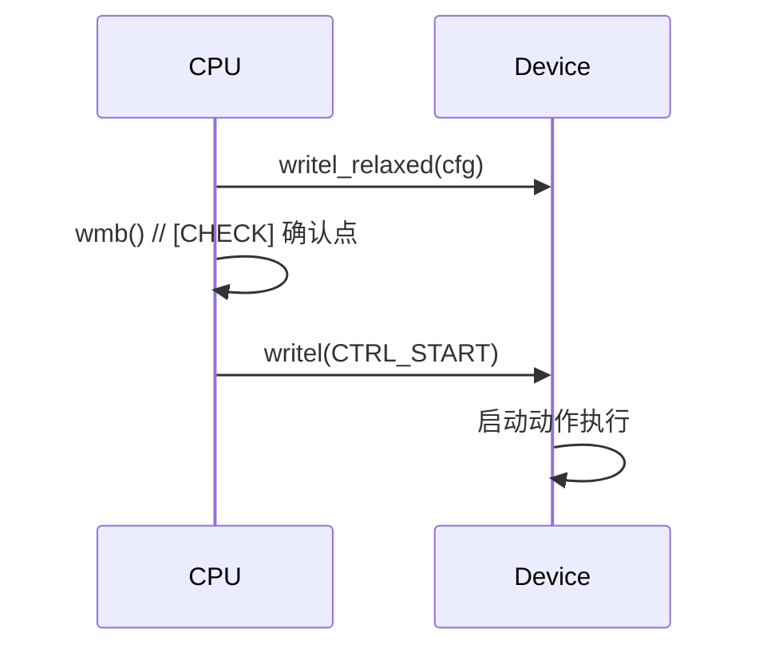

# 第10章　CPU↔设备 I/O 顺序：`*_relaxed`、`mb/rmb/wmb` 与“确认点”

------

## 章节内容说明

上一章聚焦 **CPU↔CPU 的可见性与顺序控制**，解释了在多核间建立“发布—获取”关系的必要性与实现方式。
 本章进一步拓展到 **CPU↔设备（Device）** 的交互层面，讨论 CPU 在访问外设寄存器、DMA 缓存、门铃寄存器时的顺序与一致性问题。

与 CPU↔CPU 不同，设备访问通常绕过缓存体系，通过 **MMIO（Memory-Mapped I/O）** 或 **总线协议（AXI、PCIe、AHB）** 完成；
 因此，CPU 侧的指令乱序、写缓冲区延迟、I/O 总线延迟，都可能导致**设备看到的数据顺序与预期不同**。

本章介绍：

1. `readl_relaxed()` / `writel_relaxed()` 的顺序语义；
2. `mb()` / `rmb()` / `wmb()` 的作用与放置规则；
3. “确认点（commit point）”概念：在 CPU↔设备间建立安全的数据可见性边界。

------

## 10.1　概念

### 〔白话解释〕

CPU 写寄存器的语句顺序 ≠ 设备看到的顺序。
 编译器可能重排，CPU 写缓冲区也可能延迟数据写出。

### 〔专业定义〕

- **I/O 顺序（I/O Ordering）**：CPU 向 MMIO 寄存器写入数据的先后顺序在设备侧是否被保留。
- **内存屏障（Memory Barrier）**：强制 CPU 在特定点之前完成所有已发出的存储或加载操作。
- **确认点（Commit Point）**：确保设备在关键操作前看到了所有必需配置。

------

## 10.2　能做 / 不能做

| 操作               | 是否保证顺序   | 是否缓存一致 | 典型用途                     |
| ------------------ | -------------- | ------------ | ---------------------------- |
| 普通 `writel()`    | 是（强制序）   | 否           | 寄存器访问，顺序受保障       |
| `writel_relaxed()` | 否（可能乱序） | 否           | 连续配置寄存器（需显式屏障） |
| `mb()`             | 全序屏障       | 否           | CPU↔设备确认点               |
| `wmb()`            | 写序屏障       | 否           | 数据→启动顺序                |
| `rmb()`            | 读序屏障       | 否           | 状态→结果读取顺序            |

------

### 表 10-1　概念区分表

| 概念          | 层次     | 作用         | 常见误解           |
| ------------- | -------- | ------------ | ------------------ |
| `writel()`    | 总线级   | 保证写入顺序 | 误以为包括缓存同步 |
| `*_relaxed()` | 编译级   | 放宽顺序保证 | 误以为完全无序     |
| `wmb()`       | 内存级   | 强制写入完成 | 误以为与锁等价     |
| `mb()`        | 全局顺序 | 控制读写全序 | 误用在单线程代码中 |

------

## 10.3　核心用法模式

### 模式①：配置—确认—启动

```c
/* [INV] 设备必须先见到配置，再见到启动 */
writel_relaxed(cfg0, base + REG_CFG0);
writel_relaxed(cfg1, base + REG_CFG1);
wmb();  /* [CHECK] CPU→设备 顺序确认点 */
writel(CTRL_START, base + REG_CTRL);
```

- `wmb()` 确保所有配置写入在设备看到 `CTRL_START` 前完成；
- 若省略，设备可能启动后才看到配置寄存器被更新；
- 对驱动而言，这个 `wmb()` 就是一个典型的 **确认点（commit point）**。

------

### 模式②：设备状态读取的“先读后判”

```c
/* [INV] 确保读取状态寄存器的最新值 */
status = readl(base + REG_STATUS);
rmb();  /* [CHECK] 读屏障，确保后续读取一致 */
data = readl(base + REG_DATA);
```

- `rmb()` 确保状态与数据读取顺序一致；
- 防止 CPU 提前读取数据寄存器、造成状态与数据错配。

------

### 模式③：DMA 与门铃（Doorbell）

```c
/* [INV] DMA 缓存必须在门铃前同步 */
dma_sync_single_for_device(dev, buf, size, DMA_TO_DEVICE);
wmb();  /* [CHECK] 刷新写缓存与顺序 */
writel(DMA_DOORBELL, base + REG_DOORBELL);
```

- DMA 同步保证数据写回主存；
- `wmb()` 确认 DMA 缓存完成后再触发门铃。

------

### 图 10-1　I/O 顺序时序图



------

## 10.4　混搭与边界

| 组合                    | 是否推荐 | 原因                                     |
| ----------------------- | -------- | ---------------------------------------- |
| `*_relaxed` + `wmb()`   | ✅        | 控制点分离，灵活高效                     |
| `writel()` + `mb()`     | ⚠️        | 双重顺序，性能浪费                       |
| `readl()` + `rmb()`     | ✅        | 读后顺序确认                             |
| `spin_lock` + `wmb()`   | ⚠️        | 锁已隐式屏障，仅保留必要确认点           |
| `dma_sync_*` + `wmb()`  | ✅        | 数据一致性确认                           |
| `smp_mb()` 替代 `wmb()` | ❌        | smp_mb 仅保证 CPU↔CPU 顺序，不适用于设备 |

------

## 10.5　常见坑

| [PIT]  | 描述                                                 |
| ------ | ---------------------------------------------------- |
| [PIT1] | 使用 `writel_relaxed()` 却未加屏障，导致设备配置乱序 |
| [PIT2] | 把锁当作 I/O 屏障使用                                |
| [PIT3] | 误以为 `mb()` 可同步 DMA 缓存                        |
| [PIT4] | 设备状态读取无 `rmb()`，导致滞后状态                 |
| [PIT5] | 使用 smp_mb() 而非 wmb() 导致外设不可见              |
| [PIT6] | 写门铃寄存器早于缓存写回，DMA 读到旧数据             |

------

## 10.6　最小模板

```c
/* [INV] 设备配置与启动 */
writel_relaxed(cfg0, base + REG_CFG0);
writel_relaxed(cfg1, base + REG_CFG1);
wmb();               /* [CHECK] CPU→设备确认点 */
writel(CTRL_START, base + REG_CTRL);

/* [INV] DMA 数据同步 */
dma_sync_single_for_device(dev, buf, len, DMA_TO_DEVICE);
wmb();               /* [CHECK] 保证缓存→设备顺序 */
writel(DMA_DOORBELL, base + REG_DOORBELL);
```

------

### 表 10-2　用法速览表

| 接口                                   | 保证层次 | 是否保证 I/O 顺序 | 是否影响 CPU 缓存 | 典型场景           |
| -------------------------------------- | -------- | ----------------- | ----------------- | ------------------ |
| `writel()` / `readl()`                 | 总线级   | 是                | 否                | 单次寄存器访问     |
| `writel_relaxed()` / `readl_relaxed()` | 编译级   | 否                | 否                | 连续配置操作       |
| `mb()`                                 | 全序屏障 | 是                | 否                | CPU↔设备全局确认点 |
| `wmb()`                                | 写序屏障 | 是（单向）        | 否                | 配置→启动顺序      |
| `rmb()`                                | 读序屏障 | 是（单向）        | 否                | 状态→数据读取      |
| `dma_sync_*()`                         | 缓存级   | 否（独立于顺序）  | 是                | 缓存同步           |

------

### 表 10-3　核对表

| 核对项 [CHECK]                               | 说明                       |
| -------------------------------------------- | -------------------------- |
| 是否正确区分 `*_relaxed` 与非 relaxed 接口？ | relaxed 不保证顺序         |
| 是否在关键点插入 `wmb()` 或 `mb()`？         | 防止配置未生效             |
| 是否使用 `dma_sync_*()` 确保缓存一致？       | 防止设备读取旧数据         |
| 是否误用 `smp_mb()`？                        | CPU↔设备需 wmb/mb          |
| 是否将锁当作顺序屏障？                       | 不可靠                     |
| 是否定义了明确的“确认点”？                   | 驱动可读性与可靠性关键指标 |

------

## 10.7　小结

1. `*_relaxed` 接口提高性能，但失去了 I/O 顺序保证；
2. `mb/rmb/wmb` 提供 CPU↔设备 间的同步边界，形成“确认点”；
3. `wmb()` 是配置→启动的必备顺序点，`rmb()` 用于状态→数据读取对齐；
4. `smp_mb()` 仅适用于 CPU↔CPU，不可替代设备同步屏障；
5. **屏障的存在，是为了让设备“按我们预期的时间点看到正确数据”。**

------

**下一章预告**
 第11章将介绍 **等待—唤醒的编程模式**，深入解析 `wait_event()` / `wake_up()` 的实现逻辑，讨论条件检查、虚假唤醒与锁内重检的通用写法，形成标准的事件同步模板。