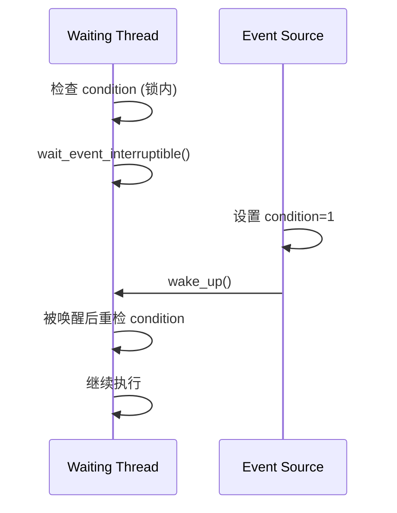

# 第11章　等待—唤醒写法：电平/边沿与“锁内判断、醒后重检”

------

## 章节内容说明

在驱动中，设备事件往往不是立即发生的。CPU 需要等待某个条件成立（如传输完成、中断到来），然后再继续执行。若没有良好的等待/唤醒机制，驱动就只能采用**忙等（polling）**方式浪费 CPU 时间。

Linux 通过 **等待队列（waitqueue）** 与 **完成量（completion）** 提供了安全、高效的同步机制。
 而真正的难点不在 API 使用，而在**时序正确性**：

> “何时等待、何时唤醒、醒来后该不该重检”。

本章讲解：

1. 电平与边沿语义：事件触发的本质差别；
2. 正确的等待写法模式：**锁内判断、醒后重检**；
3. 典型错误模式与反例。

------

## 11.1　概念

### 〔白话解释〕

等待就像在门口守信号灯：

- **电平触发（level-triggered）**：灯常亮时即可进入；
- **边沿触发（edge-triggered）**：灯从灭到亮的那一瞬间才触发。

驱动中等待某个条件时，也存在类似两种语义：

- “只要 ready==1 就可以进行”（电平）；
- “当 ready 从 0→1 时触发一次”（边沿）。

### 〔专业定义〕

- **等待队列（waitqueue）**：内核中用于管理睡眠任务的链表。
- **条件函数（condition function）**：决定是否唤醒的判定逻辑。
- **虚假唤醒（spurious wakeup）**：条件未满足但线程被错误唤醒。

------

### 表 11-1　概念区分表

| 概念       | 含义                   | 常见问题               |
| ---------- | ---------------------- | ---------------------- |
| 电平语义   | 条件成立期间可多次进入 | 容易遗漏“醒后重检”     |
| 边沿语义   | 条件变化瞬间触发一次   | 丢失事件风险           |
| waitqueue  | 睡眠列表，唤醒时遍历   | 条件必须可重检         |
| wake_up()  | 唤醒等待任务           | 若无条件判断则虚假唤醒 |
| completion | 一次性事件同步         | 不可重复使用，需重置   |

------

## 11.2　能做 / 不能做

| 操作                                   | 是否可睡 | 是否重复触发 | 是否自动重检  | 常见用途             |
| -------------------------------------- | -------- | ------------ | ------------- | -------------------- |
| `wait_event()`                         | ✅        | ✅            | ✅（宏内重检） | 电平等待             |
| `wait_event_interruptible()`           | ✅        | ✅            | ✅             | 信号可中断等待       |
| `wait_event_timeout()`                 | ✅        | ✅            | ✅             | 电平 + 超时          |
| `complete()` / `wait_for_completion()` | ✅        | ❌            | ❌             | 边沿事件，一次性唤醒 |

------

## 11.3　核心用法模式

### 模式①：锁内判断 + 锁外睡眠

```c
/* [INV] 条件函数必须在保护内评估 */
spin_lock_irqsave(&lock, flags);
while (!condition)
{
    spin_unlock_irqrestore(&lock, flags);
    wait_event_interruptible(wq, condition);
    spin_lock_irqsave(&lock, flags);
}
/* [INV] 醒后重检确保状态有效 */
spin_unlock_irqrestore(&lock, flags);
```

- 进入等待前必须在锁内检查一次；
- 唤醒后再次加锁重检，防止虚假唤醒或竞争更新；
- 确保在任何时刻条件成立时都不会遗漏事件。

------

### 模式②：生产者—消费者（电平语义）

```c
/* Producer: 数据准备完毕 */
WRITE_ONCE(ready, 1);
wake_up(&wq);

/* Consumer: 电平等待 */
wait_event_interruptible(wq, READ_ONCE(ready));
process_data();
```

- `wake_up()` 只负责唤醒，条件检查仍由 `wait_event()` 完成；
- 若 wake 早于 wait，消费者仍能立即通过条件判断返回；
- 因此适合**电平语义**：条件为真即可继续。

------

### 模式③：一次性事件（边沿语义）

```c
DECLARE_COMPLETION(done);

/* Producer: 事件完成 */
complete(&done);

/* Consumer: 一次性等待 */
wait_for_completion(&done);
```

- `completion` 适用于一次性事件：例如中断响应、DMA 完成；
- 一旦唤醒，等待方自动返回；
- 若需再次等待，必须 `reinit_completion()`。

------

### 图 11-1　等待唤醒交互时序



------

## 11.4　混搭与边界

| 组合                    | 是否推荐      | 理由                           |
| ----------------------- | ------------- | ------------------------------ |
| waitqueue + 自旋锁      | ✅             | 自旋保护条件、队列同步         |
| waitqueue + 互斥锁      | ⚠️             | 可能导致睡眠锁嵌套风险         |
| completion + 自旋锁     | ✅（短期事件） | 完成量线程安全                 |
| completion + RCU        | ❌             | RCU 延迟释放无法保障事件实时性 |
| waitqueue + atomic 变量 | ✅             | 快速检查条件                   |
| waitqueue + 信号量      | ⚠️             | 功能重叠，复杂度高             |

------

## 11.5　常见坑

| [PIT]  | 描述                                   |
| ------ | -------------------------------------- |
| [PIT1] | 未在等待前加锁判断，造成条件错过       |
| [PIT2] | 唤醒后未重检条件，导致虚假执行         |
| [PIT3] | 使用 completion 实现可重复事件（错误） |
| [PIT4] | 在中断上下文中睡眠等待                 |
| [PIT5] | 使用 wake_up() 无条件唤醒全部任务      |
| [PIT6] | 忘记 reinit_completion() 导致永久阻塞  |

------

## 11.6　最小模板

```c
/* [INV] 生产者—消费者模板 */
DEFINE_WAIT(wait);

spin_lock_irqsave(&lock, flags);
while (!condition) {
    spin_unlock_irqrestore(&lock, flags);
    wait_event_interruptible(wq, condition); /* [CHECK] 醒后重检 */
    spin_lock_irqsave(&lock, flags);
}
spin_unlock_irqrestore(&lock, flags);

/* 生产者侧 */
WRITE_ONCE(condition, 1);
wake_up(&wq);
```

------

### 表 11-2　用法速览表

| 接口                         | 类型      | 唤醒语义 | 是否可重用 | 中断响应         | 上下文要求 |
| ---------------------------- | --------- | -------- | ---------- | ---------------- | ---------- |
| `wait_event()`               | 电平      | 重检     | ✅          | 否               | 可睡       |
| `wait_event_interruptible()` | 电平      | 重检     | ✅          | ✅                | 可睡       |
| `wait_event_timeout()`       | 电平+超时 | 重检     | ✅          | 否               | 可睡       |
| `wait_for_completion()`      | 边沿      | 一次性   | ❌          | 否               | 可睡       |
| `complete()`                 | 唤醒触发  | 一次     | ❌          | 可中断上下文使用 | 任意       |

------

### 表 11-3　核对表

| 核对项 [CHECK]                    | 说明                   |
| --------------------------------- | ---------------------- |
| 是否在等待前持锁并检查条件？      | 避免条件错过           |
| 是否唤醒后重检条件？              | 防止虚假唤醒           |
| 是否正确区分电平与边沿语义？      | 不同事件模型           |
| 是否避免在中断上下文睡眠？        | 不允许睡眠             |
| 是否在重复等待前重置 completion？ | 否则永久阻塞           |
| 是否合理选择等待模式？            | 中断可中断 vs 非可中断 |

------

## 11.7　小结

1. **等待语义分为电平与边沿**：前者可重复检查，后者一次性事件；
2. **等待与唤醒分离**：唤醒只发信号，不负责状态判断；
3. **正确写法必须“锁内判断、醒后重检”**，确保无虚假唤醒；
4. `waitqueue` 适用于持续状态等待，`completion` 适用于一次性事件；
5. 驱动应始终以 **“条件函数可重检”** 为首要原则。

------

**下一章预告**
 第12章将深入分析 **短临界区与长操作的分离策略**，解释如何根据操作持续时间选择自旋锁、互斥锁或读写信号量，实现控制面与数据面的分层同步。