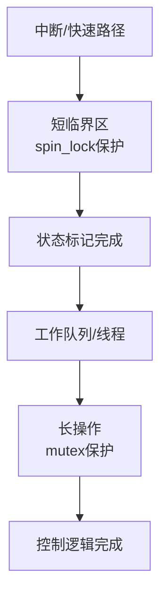

# 第12章　短临界区 vs 长操作：数据面与控制面分离

------

## 章节内容说明

在并发驱动中，最常见的性能瓶颈之一是：**把所有操作都塞进同一个锁里**。
 当锁粒度过大，系统吞吐量下降；当锁粒度过小，又容易引发数据竞争。

Linux 驱动为此区分了两类操作场景：

1. **短临界区（short critical section）**：快速访问共享数据，需要自旋锁保护；
2. **长操作（long operation）**：可能阻塞或耗时，应在互斥或独立上下文中执行。

本章讨论如何将两者合理分离，实现：

> “锁短、逻辑清晰、并发可控”。

------

## 12.1　概念

### 〔白话解释〕

想象一个共享变量 `state`：

- 改它需要保护（防止并发写）；
- 但计算或 I/O 操作很慢，没必要在锁内执行。

### 〔专业定义〕

- **短临界区**：执行时间短、不能睡眠的互斥段，通常由自旋锁（spinlock）保护。
- **长操作区**：可睡眠或耗时的处理逻辑，通常由互斥锁（mutex）或工作队列承担。
- **数据面（Data Plane）**：直接操纵共享状态的部分；
- **控制面（Control Plane）**：负责调度、启动、停止等较慢操作。

------

### 表 12-1　概念区分表

| 概念     | 可睡眠   | 典型保护机制      | 访问粒度            | 典型用途             |
| -------- | -------- | ----------------- | ------------------- | -------------------- |
| 短临界区 | ❌ 不可睡 | 自旋锁            | 细粒度、寄存器/状态 | 中断、ISR、状态更新  |
| 长操作区 | ✅ 可睡   | 互斥锁 / 工作队列 | 粗粒度、上下文      | 设备初始化、I/O 传输 |
| 数据面   | ❌ 通常短 | 自旋锁、RCU       | 读写共享数据        | 快速路径             |
| 控制面   | ✅ 通常长 | mutex、completion | 状态切换、控制命令  | 慢速路径             |

------

## 12.2　能做 / 不能做

| 操作                     | 可睡眠 | 上下文        | 适用场景               |
| ------------------------ | ------ | ------------- | ---------------------- |
| 自旋锁保护               | 否     | 中断 / 软中断 | 快速寄存器更新         |
| 互斥锁保护               | 是     | 进程上下文    | 控制操作、配置         |
| 分离 fast/slow path      | 是     | 混合场景      | 高频访问与低频配置分开 |
| 在自旋锁中调用可睡函数   | ❌      | N/A           | 严禁                   |
| 在工作队列中访问共享状态 | ⚠️      | 需加锁        | 控制逻辑同步           |

------

## 12.3　核心用法模式

### 模式①：短临界区 + 长操作分离

```c
/* [INV] 短临界区：更新状态 */
spin_lock_irqsave(&lock, flags);
state = DEV_STARTING;
spin_unlock_irqrestore(&lock, flags);

/* [INV] 长操作：设备启动 */
ret = device_startup();
if (ret)
    handle_error();
```

- 短临界区仅更新共享状态；
- 长操作在锁外执行，避免阻塞中断或其他线程。

------

### 模式②：工作队列 offload 长操作

```c
/* [INV] ISR 内只标记状态 */
irq_handler(int irq, void *arg)
{
    struct dev *d = arg;
    WRITE_ONCE(d->pending, 1);
    queue_work(d->wq, &d->work); /* [MIX] 控制面延后执行 */
    return IRQ_HANDLED;
}

/* [INV] 工作线程执行长操作 */
void dev_work(struct work_struct *w)
{
    struct dev *d = container_of(w, struct dev, work);
    spin_lock(&d->lock);
    if (!READ_ONCE(d->pending)) {
        spin_unlock(&d->lock);
        return;
    }
    d->pending = 0;
    spin_unlock(&d->lock);
    device_handle(d);  /* [CHECK] 可睡操作放此 */
}
```

- 中断上下文快速返回；
- 实际操作在工作队列中异步完成；
- 数据同步仍通过自旋锁完成。

------

### 模式③：控制面串行、数据面并行

```c
/* [INV] 控制面互斥，数据面无阻塞 */
mutex_lock(&ctrl_lock);
configure_device(dev);
mutex_unlock(&ctrl_lock);

/* 数据面可并行读写 */
spin_lock(&data_lock);
update_ring_buffer(dev);
spin_unlock(&data_lock);
```

- 控制面与数据面采用不同锁域；
- 控制面保护配置一致性；
- 数据面保障运行时状态安全。
- 它只保证读取角度的排他性，写入角度的互斥性，并不保证读写角度的同步性。

------

### 图 12-1　短临界区与长操作的分层示意



------

## 12.4　混搭与边界

| 组合                     | 是否推荐        | 理由                          |
| ------------------------ | --------------- | ----------------------------- |
| 自旋锁 + 工作队列        | ✅               | 常见中断分层方案              |
| 自旋锁 + 互斥锁          | ⚠️               | 必须遵守锁序（先spin再mutex） |
| 工作队列 + completion    | ✅               | 控制面同步                    |
| 自旋锁 + RCU             | ✅（读路径优化） | RCU 可替代部分读锁            |
| 自旋锁中调用 msleep()    | ❌               | 严禁睡眠                      |
| 工作队列中访问共享寄存器 | ⚠️               | 需 spin_lock 保护             |

------

## 12.5　常见坑

| [PIT]  | 描述                                             |
| ------ | ------------------------------------------------ |
| [PIT1] | 把慢操作放入自旋锁中（导致长时间关中断）         |
| [PIT2] | 控制面和数据面共用同一锁（粒度过大）             |
| [PIT3] | 忘记锁序规则，spin→mutex 顺序错误                |
| [PIT4] | 在 ISR 内访问可睡函数（如 `kmalloc(GFP_KERNEL)`) |
| [PIT5] | 工作队列中忘记重新检查状态（竞态风险）           |
| [PIT6] | 未区分中断/线程上下文的可睡限制                  |

------

## 12.6　最小模板

```c
/* [INV] 控制面配置 */
mutex_lock(&ctrl_lock);
setup_device(dev);
mutex_unlock(&ctrl_lock);

/* [INV] 数据面处理 */
spin_lock_irqsave(&data_lock, flags);
if (ready)
    enqueue_packet(dev, pkt);
spin_unlock_irqrestore(&data_lock, flags);
```

或：

```c
/* [INV] 中断分层处理 */
irq_handler()
{
    WRITE_ONCE(dev->pending, 1);
    queue_work(dev->wq, &dev->work); /* [MIX] 转移至控制面 */
}

dev_work()
{
    spin_lock(&dev->lock);
    if (READ_ONCE(dev->pending)) {
        dev->pending = 0;
        spin_unlock(&dev->lock);
        process_event(dev);  /* [CHECK] 可睡长操作 */
    } else {
        spin_unlock(&dev->lock);
    }
}
```

------

### 表 12-2　用法速览表

| 场景                 | 建议锁类型          | 是否可睡 | 是否跨上下文 | 是否分层 |
| -------------------- | ------------------- | -------- | ------------ | -------- |
| 中断上下文           | 自旋锁              | 否       | 是           | 是       |
| 进程上下文控制操作   | 互斥锁              | 是       | 否           | 是       |
| 快速路径状态更新     | 自旋锁              | 否       | 否           | 是       |
| 异步执行（工作队列） | 无 / 自旋锁保护数据 | 是       | 是           | 是       |
| 控制面配置与复位     | mutex               | 是       | 否           | 是       |

------

### 表 12-3　核对表

| 核对项 [CHECK]                 | 说明               |
| ------------------------------ | ------------------ |
| 是否在自旋锁内只放短操作？     | 长操作需外移       |
| 是否区分控制面与数据面？       | 逻辑与锁域分离     |
| 是否遵守锁序（spin→mutex）？   | 防止死锁           |
| 是否在工作队列中重检状态？     | 避免竞态           |
| 是否避免在中断中调用可睡函数？ | 确保稳定性         |
| 是否使用了分层同步？           | 提高性能与可维护性 |

------

## 12.7　小结

1. **短临界区** 关注速度与不可睡要求，用自旋锁保护；
2. **长操作** 关注一致性与安全性，用互斥或异步机制处理；
3. **数据面 / 控制面分离** 是驱动架构优化的关键：
   - 数据面保障实时性；
   - 控制面保持一致性。
4. 自旋锁与工作队列是“快→慢”路径切换的典型搭配；
5. 锁序与上下文限制是并发驱动设计的基本纪律。

------

**下一章预告**
 第13章将讲解 **对象保活与有序收尾（契约层）**，说明驱动中如何确保对象在被使用期间不被释放，并通过统一引用与资源管理完成安全停机。