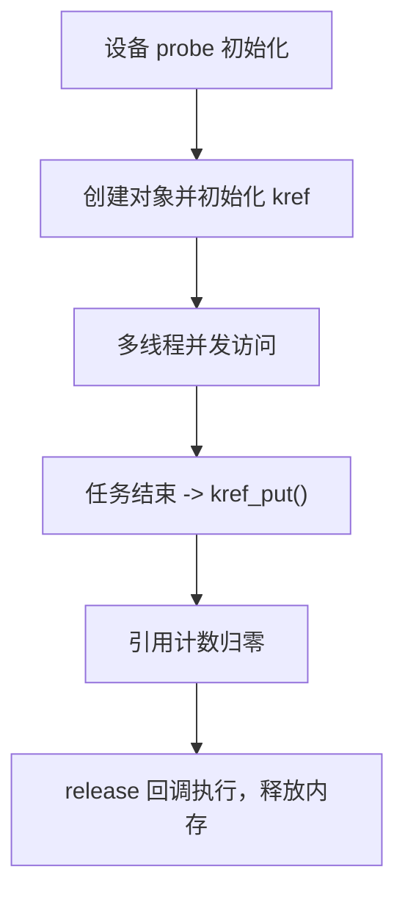

# 第13章　对象保活与有序收尾（契约层）

------

## 章节内容说明

在驱动并发的世界中，“运行时安全”并不是终点。
 更难的是**“退出时依然安全”**——确保对象不会在被使用时被释放，确保驱动在退出时能有序停机。

本章进入**契约层（Contract Layer）**：

> 定义“对象在被谁使用、何时能释放、退出时顺序如何”的规则。

核心内容包括：

1. 对象保活机制：引用计数（`kref`）、设备引用（`get_device/put_device`）；
2. 生命周期与并发的结合点：防止“使用中释放”；
3. 有序收尾：从 `probe` → `remove` → `release` 的稳定退出流程。

------

## 13.1　概念

### 〔白话解释〕

内核对象往往被多个线程或子系统引用，比如：

- 一个文件操作结构体被多个进程共享；
- 一个驱动数据结构被工作队列和中断同时使用。

如果驱动在其中一个引用尚未结束时释放内存，就会出现经典的 **use-after-free（UAF）**。

### 〔专业定义〕

- **引用计数（Reference Counting）**：追踪对象被多少用户持有。
- **保活（Keepalive）**：在对象仍被使用时阻止其释放。
- **契约层（Contract Layer）**：规定“谁拥有对象、谁负责释放、何时允许销毁”的层次逻辑。

------

### 表 13-1　概念区分表

| 概念             | 作用             | 典型API                     | 常见误解                |
| ---------------- | ---------------- | --------------------------- | ----------------------- |
| 引用计数         | 防止对象提前释放 | `kref_get` / `kref_put`     | 等同锁（×）             |
| devres           | 自动释放资源     | `devm_*`                    | 会自动复位（×）         |
| get/put 设备引用 | 持有设备结构     | `get_device` / `put_device` | 会增加引用层次混乱      |
| 有序收尾         | 驱动退出流程     | `remove` / `release`        | 不同子系统顺序相同（×） |

------

## 13.2　能做 / 不能做

| 操作                    | 能保证           | 限制                   | 使用场景         |
| ----------------------- | ---------------- | ---------------------- | ---------------- |
| `kref_get/put`          | 对象不被提前释放 | 需定义释放回调         | 通用对象生命周期 |
| `get_device/put_device` | 设备结构持久     | 仅限 `struct device`   | 平台设备层       |
| `devm_*` 机制           | 自动释放资源     | 仅随 `device` 销毁触发 | 驱动资源簿记     |
| “remove三步法”          | 稳定停机         | 不保证异步同步         | 退出路径控制     |

------

## 13.3　核心用法模式

### 模式①：引用计数（kref）统一生命周期

```c
struct my_obj {
	struct kref ref;
	...
};

static void my_obj_release(struct kref *ref)
{
	struct my_obj *obj = container_of(ref, struct my_obj, ref);
	kfree(obj); /* [INV] 唯一释放点 */
}

void use_obj(struct my_obj *obj)
{
	kref_get(&obj->ref);     /* [CHECK] 使用前保活 */
	do_something(obj);
	kref_put(&obj->ref, my_obj_release); /* [CHECK] 使用后释放 */
}
```

- 任何使用该对象的代码都必须遵循 get → use → put；
- `kref_put()` 返回 1 表示执行了释放回调；
- 这是最通用的防 UAF 手段。

------

### 模式②：设备引用与子系统契约

```c
/* [INV] 设备层对象引用 */
struct device *dev = &pdev->dev;
get_device(dev);    /* 保活设备结构 */
...
put_device(dev);    /* [CHECK] 使用结束 */
```

- `get_device()` 增加 `kobject` 引用计数；
- 在最后一个引用放下时调用 `.release()`；
- 驱动层资源（`devm_*`）绑定在 `device` 生命周期上，可自动释放。

------

### 模式③：remove 三步法（有序收尾）

```c
/* [INV] 驱动退出稳定流程 */
static int mydev_remove(struct platform_device *pdev)
{
	struct mydev *d = platform_get_drvdata(pdev);

	/* Step1: 阻止新请求 */
	atomic_set(&d->stopped, 1);

	/* Step2: 等待正在进行的任务完成 */
	flush_workqueue(d->wq);
	del_timer_sync(&d->timer);

	/* Step3: 释放资源 */
	devm_free_irq(&pdev->dev, d->irq, d);
	kref_put(&d->ref, mydev_release);
	return 0;
}
```

- 三步顺序：**阻止 → 等待 → 释放**；
- 可确保无任务在资源被销毁后仍运行；
- 可与 `devres` / `kref` 协同使用。

------

### 图 13-1　引用与收尾关系图



------

## 13.4　混搭与边界

| 组合                | 是否推荐 | 理由                         |
| ------------------- | -------- | ---------------------------- |
| kref + devres       | ✅        | 对象与资源分层管理           |
| devres + get_device | ⚠️        | 生命周期嵌套复杂，需注意顺序 |
| kref + RCU          | ✅        | 延迟释放与引用安全结合       |
| workqueue + kref    | ✅        | 任务期间保持对象有效         |
| kref + timer        | ⚠️        | 定时回调需防止访问已释放对象 |
| devres + 手动释放   | ❌        | 双重 free 风险               |

------

## 13.5　常见坑

| [PIT]  | 描述                                 |
| ------ | ------------------------------------ |
| [PIT1] | 忘记调用 kref_put() 导致内存泄漏     |
| [PIT2] | 在回调中再次 kref_get() 导致死循环   |
| [PIT3] | 引用计数不平衡，导致对象重复释放     |
| [PIT4] | devm 资源与手动释放混用              |
| [PIT5] | 任务线程持有对象但驱动已 remove()    |
| [PIT6] | 未阻止新请求就释放资源，形成竞争销毁 |

------

## 13.6　最小模板

```c
/* [INV] 对象初始化 */
struct mydev *d = devm_kzalloc(dev, sizeof(*d), GFP_KERNEL);
kref_init(&d->ref);

/* [INV] 使用期间保活 */
kref_get(&d->ref);
queue_work(d->wq, &d->work);

/* [INV] 工作任务 */
void work_fn(struct work_struct *w)
{
	struct mydev *d = container_of(w, struct mydev, work);
	do_task(d);
	kref_put(&d->ref, mydev_release);  /* [CHECK] 结束后释放 */
}
```

------

### 表 13-2　用法速览表

| 机制           | 作用             | 是否自动 | 是否多层绑定         | 推荐场景         |
| -------------- | ---------------- | -------- | -------------------- | ---------------- |
| kref           | 对象级引用控制   | 否       | 否                   | 通用对象生命周期 |
| devres         | 驱动资源自动释放 | 是       | 否                   | 设备驱动资源管理 |
| get/put_device | 设备引用计数     | 否       | 是（嵌套于 kobject） | 设备模型集成     |
| remove 三步法  | 有序退出         | 否       | 可嵌入 devres        | 驱动收尾阶段     |

------

### 表 13-3　核对表

| 核对项 [CHECK]                        | 说明                 |
| ------------------------------------- | -------------------- |
| 是否所有对象均有唯一释放回调？        | 防止重复 free        |
| 是否所有持有者使用 kref_get()/put()？ | 防止 UAF             |
| 是否 remove 阶段先阻止新请求？        | 防止竞态             |
| 是否等待异步任务结束？                | 避免资源在执行中释放 |
| 是否区分 devres 与手动释放？          | 防止混用             |
| 是否 release 回调中只释放资源？       | 避免逻辑递归         |

------

## 13.7　小结

1. **对象保活** 是防止 use-after-free 的根本机制；

2. **kref** 提供引用计数的最小语义单元，可在任意对象中使用；

3. **devres** 与 **kref** 各自负责资源和生命周期两个维度；

4. **remove 三步法** 确保驱动在退出阶段有序、安全；

5. 契约层的关键思想：

   > “对象何时诞生、谁负责持有、何时安全销毁”。

------

**下一篇预告**
 至此，第二篇《模式与基础》完结。
 下一篇（第三篇）将进入 **子模块详解**，正式展开内核中的并发机制模块，包括自旋锁、互斥锁、RCU、等待队列、中断线程化等具体实现与内核数据结构。

