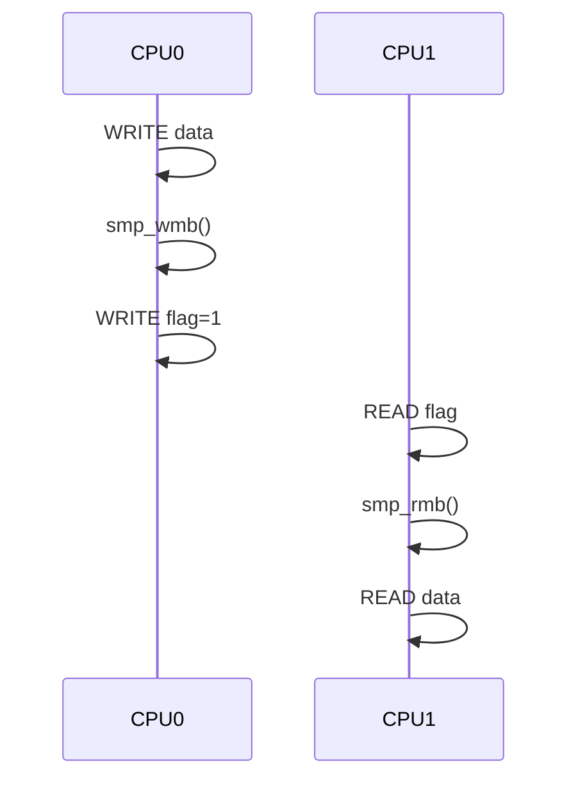
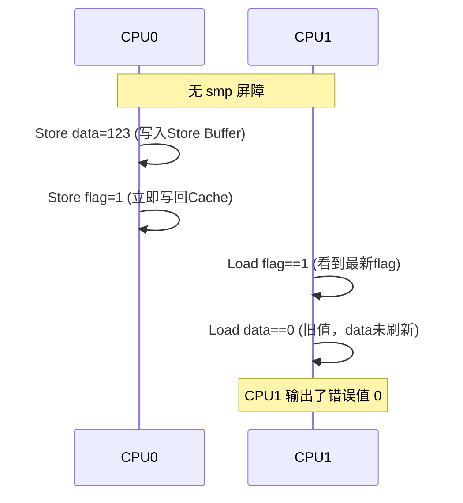
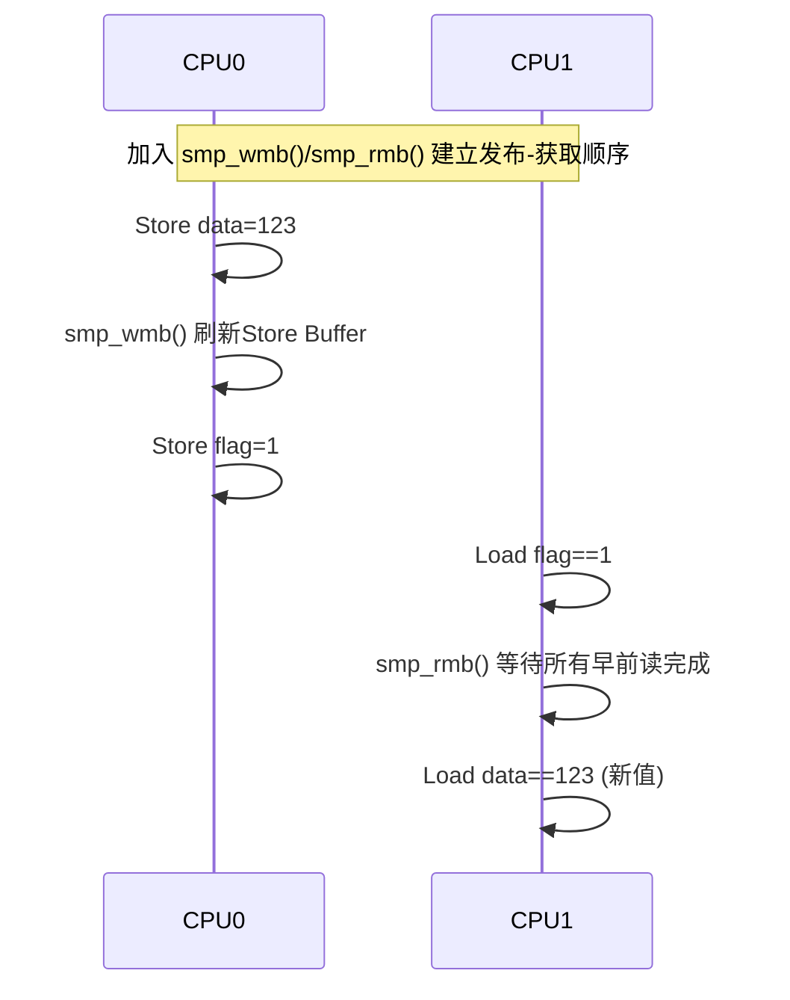

# 第14章　READ/WRITE_ONCE 与 smp_*（内存可见性与顺序原语）

------

## 章节内容说明

本章进入第三篇的第一个内核机制章节。
 焦点从“概念层的可见性与顺序”正式转入 Linux 内核提供的 **内存访问控制原语族**：

- `READ_ONCE()` / `WRITE_ONCE()`：防止编译器与 CPU 优化破坏语义；
- `smp_mb()` / `smp_rmb()` / `smp_wmb()`：提供不同强度的有序性保障。

核心目标：

> 掌握这些原语的作用边界、适用场景及它们之间的关系，理解为何它们构成了驱动层的“可见性协议”。

------

## 14.1　概念

### 〔白话解释〕

当多个 CPU 核心同时访问同一变量时，即使代码顺序正确，**每个核看到的值也可能不同**。
 原因来自两方面：

1. 编译器优化（寄存器缓存、指令重排）；
2. CPU 缓存层次（L1/L2 延迟写回）。

### 〔专业定义〕

| 原语               | 定义                                                |
| ------------------ | --------------------------------------------------- |
| `READ_ONCE(x)`     | 从内存中以原子方式读取变量 `x` 的当前值，禁止优化。 |
| `WRITE_ONCE(x, v)` | 将值 `v` 原子地写入 `x`，防止编译器合并与重排。     |
| `smp_mb()`         | 全内存屏障，禁止前后所有内存操作重排。              |
| `smp_rmb()`        | 读屏障，仅禁止读操作的重排。                        |
| `smp_wmb()`        | 写屏障，仅禁止写操作的重排。                        |

------

### 表 14-1　概念区分表

| 原语       | 目标       | 屏障强度 | 是否影响可见性 | 是否影响顺序 | 是否编译器屏障 |
| ---------- | ---------- | -------- | -------------- | ------------ | -------------- |
| READ_ONCE  | 单变量读取 | 弱       | ✅              | ❌            | ✅              |
| WRITE_ONCE | 单变量写入 | 弱       | ✅              | ❌            | ✅              |
| smp_rmb    | 跨变量     | 中       | ✅              | ✅（读后读）  | ✅              |
| smp_wmb    | 跨变量     | 中       | ✅              | ✅（写后写）  | ✅              |
| smp_mb     | 跨变量     | 强       | ✅              | ✅（全序）    | ✅              |

### 为何会引入 `READ_ONCE()/WRITE_ONCE()` 机制？

**问题背景描述：**

> 为什么会有 READ_ONCE() 和 WRITE_ONCE()。按照常理来讲，对一个基础类型的读操作或者写操作本身是原子性的，那么除非强调原子内存序，就不会产生说需要单独强调原子性才对。

**回答：**

非常精准的问题。你问的这句话其实正中 Linux 内核中 **READ_ONCE()/WRITE_ONCE() 的存在根本原因** —— 它们不是为了解决“原子性”，而是为了 **消灭“编译器和 CPU 优化”导致的可见性错误**。

下面我们把这个问题从三层语义（C语言 → CPU架构 → Linux内核模型）彻底拆解。

------

#### 一、表层直觉为何“看似没必要”

你的直觉完全正确：

> “对一个基础类型（int, long, 指针）的读写操作，本身应该是原子的。”

这句话在 **C语言标准语义** 和 **大多数 CPU 硬件实现** 上，都是对的：

- 现代 CPU 对 word-aligned（自然对齐）的整数或指针读写操作，**确实是单条原子指令**；
- 也就是说，不会出现“半写”或“撕裂读”（tearing read）。

所以在硬件层面，你不需要 `READ_ONCE()` 来保证**原子性**。

------

#### 二、但是——C语言标准**允许优化破坏“可见性语义”**

C标准中的“普通变量访问”是 **未同步访问（unsynchronized access）**。
 编译器被允许做几乎一切优化：

| 优化类型       | 可能后果                                               |
| -------------- | ------------------------------------------------------ |
| **寄存器缓存** | 编译器把变量放到寄存器里，多次读写不再访问内存         |
| **指令重排**   | 写操作可能提前或延后执行                               |
| **冗余消除**   | 连续读取相同变量时，编译器可能只读一次然后复用寄存器值 |
| **推测执行**   | 条件内的读写可能被提前执行                             |

举个例子：

```c
while (!flag)  // 普通C变量
    cpu_relax();
do_task();
```

在单线程语义下，编译器可能优化成：

```c
if (!flag)
    while (1) cpu_relax();
```

——它**假设 flag 永远不会在循环外改变**（因为当前线程没写它）。
 这在 C 标准里是合法的优化。
 但是在内核的并发模型下，**flag 可能被别的 CPU 改变**，这就出事了。

------

#### 三、READ_ONCE / WRITE_ONCE 的设计动机

于是 Linux 内核引入了 `READ_ONCE(x)` / `WRITE_ONCE(x, v)` 宏，明确告诉编译器和 CPU：

> “我真的要从内存中**读/写一次真实值**，你不能帮我优化。”

##### 它们实现的语义是：

| 层面              | 保证                             |
| ----------------- | -------------------------------- |
| 编译器层          | 禁止缓存、禁止重排、禁止消除访问 |
| CPU层（部分架构） | 确保单条 load/store，不被合并    |
| 原子性            | 仅限单变量宽度（不提供锁）       |
| 内存序            | 不提供顺序保证（非 barrier）     |

------

##### 实际展开（简化版）

```c
#define READ_ONCE(x) \
({ union { typeof(x) __val; char __c[1]; } __u; \
   __read_once_size(&(x), __u.__c, sizeof(x)); \
   __u.__val; })

#define WRITE_ONCE(x, val) \
({ union { typeof(x) __val; char __c[1]; } __u = { .__val = (val) }; \
   __write_once_size(&(x), __u.__c, sizeof(x)); \
   __u.__val; })
```

内核使用 `volatile` 加强访问，并在架构层加入 `barrier()` 防止优化器重排。

------

#### 四、硬件原子 ≠ 语义正确

举个例子，你会看到它解决的是“优化语义”，不是“硬件冲突”：

```c
int flag;
void cpu0(void) {
    WRITE_ONCE(flag, 1);
}

void cpu1(void) {
    while (!READ_ONCE(flag))
        cpu_relax();
    start_work();
}
```

如果不用 `READ_ONCE` / `WRITE_ONCE`：

- 编译器可能把 `flag` 缓存在寄存器中；
- CPU 可能在乱序执行下“先读旧 flag 再执行后续读”；
  这时即使硬件指令本身是原子的，程序语义仍然**错**。

------

#### 五、Linux 内存模型视角：它是“基础语义层”

Linux 内核定义了三层内存访问语义：

| 层级              | 原语               | 解决的问题                           |
| ----------------- | ------------------ | ------------------------------------ |
| **层1：ONCE**     | READ/WRITE_ONCE    | 可见性：防止编译器优化导致看不见变化 |
| **层2：barrier**  | smp_rmb/wmb/mb     | 顺序性：保证跨变量操作的前后次序     |
| **层3：锁/RCU等** | spinlock/mutex/RCU | 互斥与复合一致性                     |

所以：

- `READ_ONCE` ≈ “访问变量本身不会被优化掉”；
- `barrier` ≈ “前后两次访问的顺序不会乱”；
- `锁` ≈ “一整个访问区块不可并行”。

它们是**递进关系**而非替代关系。

------

#### 六、结论总结

| 结论 | 说明                                                         |
| ---- | ------------------------------------------------------------ |
| ①    | 对于单个基础类型，硬件级访问确实是原子的；`READ_ONCE` 不为此存在。 |
| ②    | 它存在的目的是防止编译器和 CPU 优化导致**可见性错误**。      |
| ③    | `READ_ONCE` / `WRITE_ONCE` 是 Linux 内核内存模型的“最小一致性原语”。 |
| ④    | 它们不提供顺序、不提供互斥、不替代锁。                       |
| ⑤    | 在驱动开发中，它们用于 “状态标志”“事件信号”“跨CPU通信” 等轻同步场景。 |

------

📘 **一句总结记忆法：**

> `READ_ONCE` / `WRITE_ONCE` 不是为“防撕裂”，
> 而是为“防优化”。

它们确保这次访问**真的发生了一次**，并且被另一个 CPU **真的能看到**。

### 为何会引入 `smp_*` 机制？

**回答：**

你问的这句其实是整个“并发与竞争”体系中**最关键的一跳**：

> 「既然有 `READ_ONCE/WRITE_ONCE` 可以防止优化器乱搞，那为什么内核还要再引入 `smp_rmb()`、`smp_wmb()`、`smp_mb()` 这些复杂的 `smp_*` 屏障？」

这就从“可见性”升级到了“**因果顺序（ordering）**”的层面。我们来从硬件语义的角度一步一步解释它们存在的**物理动机**与**软件目标**。


#### `smp_*` 接口说明

在计算机领域，尤其是操作系统内核（如 Linux 内核）中，以 `smp_` 为前缀的接口通常被称为 **SMP 相关接口** 或 **对称多处理接口**。

这里的 `SMP` 是 **Symmetric Multi-Processing（对称多处理）** 的缩写，指一种多处理器架构 —— 系统中的多个处理器（CPU 核心）地位平等，共享同一内存和总线资源，操作系统可以将任务均衡分配到任意处理器上运行。

`smp_*` 接口是内核中用于支持 SMP 架构的一系列函数或宏，主要用于处理多处理器环境下的核心操作，例如：

- 处理器间通信（如发送中断、同步信号）；
- 进程 / 线程在不同处理器间的调度与迁移；
- 处理器状态的查询与控制（如获取当前运行的处理器 ID、检查处理器是否在线）；
- 多处理器环境下的锁机制、内存屏障等同步操作。

常见的 `smp_*` 接口举例：

- `smp_processor_id()`：获取当前代码运行的处理器 ID；
- `smp_send_reschedule(cpu)`：向指定处理器发送重新调度的请求；
- `smp_call_function()`：在所有（或指定）处理器上执行某个函数（用于跨处理器同步）。

这些接口是内核实现 SMP 架构兼容性和高效多处理器协作的基础，名称前缀 `smp_` 直接体现了其与对称多处理技术的关联。


------

#### 一、`READ/WRITE_ONCE` 解决的是“可见性”，不是“顺序性”

##### ✅ 它能保证的：

- 读或写操作确实访问了内存；
- 访问不会被编译器优化掉；
- 操作结果能被别的 CPU 看见。

##### ❌ 它不能保证的：

- **A 写在 B 之前执行**；
- **另一个 CPU 看到的顺序与本 CPU 一致**；
- **跨变量的操作间有时序依赖**。

例如：

```c
data = 123;
flag = 1;
```

在 C 层你认为是“先写 data 再写 flag”，
 但硬件上可能是：

| CPU视角 | 实际执行                               |
| ------- | -------------------------------------- |
| CPU0    | flag=1 先被写入缓存，data=123 延迟写回 |
| CPU1    | 看到 flag=1，却仍旧看到旧的 data       |

于是第二个 CPU 会看到“已经准备好但数据未更新”的假象。
 这在 Linux 内核中就是**最典型的“乱序可见性”问题**。

------

#### 二、CPU 并不是“顺序执行”的机器

现代多核 CPU 拥有非常激进的乱序执行机制。
 它们允许：

- **写操作延迟写回（store buffer）**；
- **读操作提前执行（load speculation）**；
- **跨核缓存不即时同步（cache coherence 有延迟）**。

而且，不同架构的保证程度不一样：

| 架构         | 是否强顺序（顺序一致性）      | 备注                 |
| ------------ | ----------------------------- | -------------------- |
| x86 / x86_64 | 强（T-SC，Total Store Order） | 大多数写后读仍有序   |
| ARM / ARM64  | 弱                            | 写读、读写都可能乱序 |
| RISC-V       | 弱                            | 同 ARM 类似          |
| PowerPC      | 极弱                          | 几乎一切都可乱序     |

所以 Linux 为了在所有 CPU 上都保持**相同的并发语义**，
 必须定义一组与硬件无关的“虚拟屏障机制”——
 这就是 `smp_*()` 系列。

------

#### 三、`smp_*` 系列的动机：建立“跨CPU可观测顺序”

Linux 内核的设计目标是：

> “在 SMP（Symmetric MultiProcessing）环境下，为开发者提供**可移植的顺序语义**。”

为此，内核定义了三种基本内存屏障：

| 屏障        | 保证的顺序关系    | 典型应用        |
| ----------- | ----------------- | --------------- |
| `smp_wmb()` | 写 → 写 有序      | 发布（Publish） |
| `smp_rmb()` | 读 ← 读 有序      | 获取（Acquire） |
| `smp_mb()`  | 全序（读/写全部） | 发布-获取配对   |

这些屏障不会阻止访问本身，而是**约束不同变量间的相对顺序**。

------

#### 四、举例：为什么不能靠 `READ_ONCE` / `WRITE_ONCE` 解决

来看这个经典示例：

```c
// CPU0: 发布者
WRITE_ONCE(data, 123);
WRITE_ONCE(flag, 1);

// CPU1: 获取者
while (!READ_ONCE(flag))
	cpu_relax();
printf("%d\n", READ_ONCE(data));
```

理论上，你想要：

> CPU1 看到 `flag=1` ⇒ 一定能看到 `data=123`。

但在 ARM/RISC-V 上，可能发生这样的时间线：

| 步骤 | CPU0                       | CPU1               |
| ---- | -------------------------- | ------------------ |
| ①    | 写 data=123 (仍在写缓冲区) |                    |
| ②    | 写 flag=1 (立即写回可见)   |                    |
| ③    |                            | 看到 flag=1        |
| ④    |                            | 读取 data (旧值 0) |

→ **结果：CPU1 打印 0。**

虽然每个 `WRITE_ONCE`/`READ_ONCE` 自身是可见的、原子的，但它们之间**缺乏顺序关系**。

这时候就必须加屏障：

```c
// CPU0
WRITE_ONCE(data, 123);
smp_wmb();               // [INV] 确保 data 在 flag 前对外可见
WRITE_ONCE(flag, 1);

// CPU1
while (!READ_ONCE(flag))
	cpu_relax();
smp_rmb();               // [INV] 确保 flag 后读到 data 的最新值
printf("%d\n", READ_ONCE(data));
```

`wmb()` 和 `rmb()` 建立了一个 **发布（Publish）– 获取（Acquire）** 顺序：

> “flag 可见 ⇒ data 可见”。

这就是 `smp_*` 存在的直接动机。

------

#### 五、Linux 为什么用 `smp_*()` 而不是直接用 CPU 指令

因为每个架构的内存屏障实现不同：

| 屏障类型    | x86 实现                  | ARM64 实现  | RISC-V 实现   |
| ----------- | ------------------------- | ----------- | ------------- |
| `smp_mb()`  | `mfence` / `lock addl $0` | `dmb ish`   | `fence rw,rw` |
| `smp_rmb()` | `lfence`                  | `dmb ishld` | `fence r,r`   |
| `smp_wmb()` | `sfence`                  | `dmb ishst` | `fence w,w`   |

内核通过 `smp_*()` 宏屏蔽这些差异，
 保证驱动代码在不同架构上语义一致。

------

#### 六、它们与锁的关系

锁类原语（`spin_lock`、`mutex`）**内部已经隐含 `smp_mb()`**。
 例如：

```c
spin_lock(&lock);
x = 1;
spin_unlock(&lock);
```

等价于：

```c
smp_mb();    // 获取前屏障
x = 1;
smp_mb();    // 释放后屏障
```

所以：

- 在持锁路径中再显式使用 `smp_*` 是多余的；
- 但在**无锁路径（lock-free）\**或\**设备交互路径**中，这些屏障是唯一能表达顺序的工具。

------

#### 七、总结

| 层级 | 原语              | 解决的问题                         | 是否顺序化 | 是否跨架构 |
| ---- | ----------------- | ---------------------------------- | ---------- | ---------- |
| 1️⃣    | READ/WRITE_ONCE   | 保证“访问真的发生一次”，解决可见性 | ❌          | ✅          |
| 2️⃣    | smp_rmb/wmb/mb    | 保证多变量的相对执行顺序           | ✅          | ✅          |
| 3️⃣    | 锁 / RCU / 信号量 | 形成临界区与一致性                 | ✅          | ✅          |

> ✅ **`ONCE` 是“可见性”语义，
> ✅ `smp_\*` 是“顺序”语义，
> ✅ 锁是“互斥”语义。**

三者层层递进，缺一不可。

------

#### 八、一句话总结（可写入章节要点）

> `smp_*()` 的引入不是为了防止并发写错，
> 而是为了让不同 CPU **看到相同的时间顺序**。
> 它建立了“当我看到 flag=1 时，必然已经看到 data”的**因果关系**，
> 这是多核系统正确运行的逻辑基线。


------

## 14.2　能做 / 不能做

| 操作                   | 能做                                                | 不能做                                   |
| ---------------------- | --------------------------------------------------- | ---------------------------------------- |
| READ_ONCE / WRITE_ONCE | 防止编译器和部分 CPU 缓存优化；确保单变量的可见性。 | 无法保证访问顺序，也无法同步多个变量。   |
| smp_rmb / smp_wmb      | 确保多变量操作的部分顺序（读-读、写-写）。          | 不影响未相关的操作；不阻塞其他核的访问。 |
| smp_mb                 | 确保全局顺序；常用于发布-获取协议。                 | 过度使用会降低性能；不自动提供互斥。     |

------

## 14.3　核心用法模式

### `smp_*` 接口说明

在我们前面已经厘清 **“为什么需要 smp_\*”**（因为单纯的 READ/WRITE_ONCE 只保证可见性而不保证执行顺序）之后，接下来我们就进入正式的接口说明层次——这部分属于 Linux 内存模型的“顺序原语层”，即所有无锁算法、CPU-CPU 通信、设备驱动确认点的基础。

我会按照内核文档的逻辑和实际驱动开发的使用习惯来讲解：

------

#### 一、smp_* 系列接口总览

| 接口                       | 语义                               | 主要方向   | 含义                               |
| -------------------------- | ---------------------------------- | ---------- | ---------------------------------- |
| `smp_mb()`                 | 全内存屏障（full memory barrier）  | CPU↔CPU    | 保证屏障前后的所有读写都不被重排   |
| `smp_rmb()`                | 读内存屏障（read memory barrier）  | CPU↔CPU    | 保证屏障前的读在屏障后的读之前完成 |
| `smp_wmb()`                | 写内存屏障（write memory barrier） | CPU↔CPU    | 保证屏障前的写在屏障后的写之前完成 |
| `smp_store_release(p, v)`  | 带 release 语义的存储              | CPU↔CPU    | 在写入前保证前面所有访问完成       |
| `smp_load_acquire(p)`      | 带 acquire 语义的读取              | CPU↔CPU    | 在读取后保证后面所有访问延后执行   |
| `dma_rmb()` / `dma_wmb()`  | 设备 DMA 方向屏障                  | CPU↔DEVICE | 确保 CPU 与设备缓存一致性          |
| `mb()` / `rmb()` / `wmb()` | **架构级屏障**（包括 I/O 设备）    | CPU↔DEVICE | 同时对 MMIO、DMA 生效（非仅 SMP）  |

> 简言之：
>
> - `smp_*` 用于 **CPU↔CPU 语义**；
> - 非 smp 版本用于 **CPU↔设备语义**。

------

#### 二、smp_mb()：全屏障（最强顺序语义）

##### 语义说明

```
void smp_mb(void);
```

> 所有在 `smp_mb()` 之前的内存访问（读/写），在语义上必须完成后，才允许执行 `smp_mb()` 之后的访问。

即：

```
前读、前写 <==> 屏障 <==> 后读、后写
```

##### 硬件级等价

| 架构   | 指令                               |
| ------ | ---------------------------------- |
| x86    | `mfence` / `lock; addl $0,0(%esp)` |
| ARM64  | `dmb ish`                          |
| RISC-V | `fence rw,rw`                      |

##### 使用场景

- **发布/获取对称模型（Publish/Acquire）**；
- **原子操作后的确认点**；
- **双 CPU 同步标志**；
- **设备 DMA 启动前/停止后同步内存**。

##### 示例

```c
WRITE_ONCE(data, val);
smp_mb();              /* [INV] 数据必须先于标志写入 */
WRITE_ONCE(flag, 1);

while (!READ_ONCE(flag))
    cpu_relax();
smp_mb();              /* [INV] 读到标志后再读数据 */
READ_ONCE(data);
```

------

#### 三、smp_rmb()：读屏障（读后读有序）

##### 语义说明

```
void smp_rmb(void);
```

> 保证在 `smp_rmb()` 之前的读操作结果，一定在屏障之后的读操作执行前完成。
> 即：`read1` 的结果在 `read2` 执行前必须已经生效。

```
READ(x); 
smp_rmb(); 
READ(y);
```

CPU 必须保证读 `x` 的结果在读 `y` 前已经“对程序可见”。

##### 使用场景

- 获取端在 **读取标志后再读取数据**；
- 避免“读乱序”；
- 驱动中常见于 `flag + data` 模式的读取方。

##### 示例

```c
while (!READ_ONCE(flag))
    cpu_relax();
smp_rmb();              /* [CHECK] 保证标志在数据之前读取 */
value = READ_ONCE(data);
```

##### 等价硬件指令

| 架构   | 指令        |
| ------ | ----------- |
| x86    | `lfence`    |
| ARM64  | `dmb ishld` |
| RISC-V | `fence r,r` |

------

#### 四、smp_wmb()：写屏障（写后写有序）

##### 语义说明

```
void smp_wmb(void);
```

> 确保 `smp_wmb()` 前的写操作对外可见后，才允许执行屏障后的写操作。
> 即：写入顺序不会反转。

```
WRITE(x); 
smp_wmb(); 
WRITE(y);
```

##### 使用场景

- **发布端在写完数据后才写标志**；
- **配置→启动序列（config/start）**；
- **I/O 映射区域写入顺序控制**。

##### 示例

```c
WRITE_ONCE(cfg, val);
smp_wmb();              /* [CHECK] 配置必须在启动前完成 */
WRITE_ONCE(start, 1);
```

##### 硬件实现

| 架构   | 指令                     |
| ------ | ------------------------ |
| x86    | `sfence`（通常是空操作） |
| ARM64  | `dmb ishst`              |
| RISC-V | `fence w,w`              |

------

#### 五、Release/Acquire 变体（更轻量的屏障）

Linux 内核提供了带语义的“单变量访问”封装：

| 宏                        | 含义                                   | 内部等价                       |
| ------------------------- | -------------------------------------- | ------------------------------ |
| `smp_store_release(p, v)` | 在写入 `*p=v` 前，确保所有先前访问完成 | `smp_wmb(); WRITE_ONCE(*p, v)` |
| `smp_load_acquire(p)`     | 在读取 `*p` 后，确保后续访问延迟执行   | `READ_ONCE(*p); smp_rmb();`    |

##### 典型应用：发布-获取协议

```c
/* 发布者 */
smp_store_release(&flag, 1);  // 确保前面写的数据先可见

/* 获取者 */
while (!smp_load_acquire(&flag))
    cpu_relax();
READ_ONCE(data);              // 读到的数据保证是最新的
```

相比于 `smp_mb()`，release/acquire 屏障更轻量，因为它们是**单向屏障**。

------

#### 六、barrier vs smp_barrier

Linux 同时提供两组 barrier 系列：

| 名称                                   | 作用范围                  | 用途            |
| -------------------------------------- | ------------------------- | --------------- |
| `mb()` / `rmb()` / `wmb()`             | CPU + DEVICE（MMIO 访问） | I/O、寄存器顺序 |
| `smp_mb()` / `smp_rmb()` / `smp_wmb()` | 仅 CPU↔CPU                | 多核内存顺序    |

> 简言之：
>
> - **涉及设备寄存器 / DMA 缓存** → 用非 smp 版本。
> - **仅 CPU 内核变量同步** → 用 smp 版本。

------

#### 七、使用规则总结表

| 使用场景               | 推荐屏障                  | 原因              |
| ---------------------- | ------------------------- | ----------------- |
| 多核间 flag+data 发布  | `smp_wmb()` / `smp_rmb()` | 建立发布-获取顺序 |
| 配置→启动（MMIO）      | `wmb()`                   | 确保设备看到顺序  |
| 读寄存器后更新状态     | `rmb()`                   | 确保顺序一致      |
| 设备 DMA 读写一致性    | `dma_rmb()` / `dma_wmb()` | 区分 CPU↔设备缓存 |
| 原子操作后的可见性确认 | `smp_mb()`                | 双向同步          |
| 锁/RCU/信号量内部      | 无需手动屏障              | 内部自带 smp_mb() |

------

#### 八、调试与验证建议

| 检查项                           | 方法                                             |
| -------------------------------- | ------------------------------------------------ |
| 多核设备不一致（flag=1但data旧） | 加 `smp_wmb()/rmb()` 对                          |
| 设备启动行为错乱                 | 改用 `wmb()` 替代 `smp_wmb()`                    |
| 性能异常                         | 检查是否滥用 `smp_mb()`                          |
| 屏障无效                         | 查看架构实现（`arch/xxx/include/asm/barrier.h`） |
| 竞态复现                         | 用 `CONFIG_KCSAN` 检查数据竞争                   |

------

#### 九、小结（核心记忆）

| 层级           | 原语                         | 含义                       |
| -------------- | ---------------------------- | -------------------------- |
| 最小可见性     | READ_ONCE / WRITE_ONCE       | 禁止优化，单变量访问真实化 |
| 顺序控制       | smp_rmb / wmb / mb           | 控制跨变量可见顺序         |
| 单变量顺序优化 | store_release / load_acquire | 单方向屏障，轻量模型       |
| 锁/同步结构    | spinlock / mutex             | 含屏障+互斥                |

> 🔹 `READ_ONCE/WRITE_ONCE` = “看到”
> 🔹 `smp_*` = “按顺序看到”
> 🔹 锁 = “只有我能看到”

------


### 模式①：发布-获取（Publish-Acquire）模型

```c
/* CPU0: 发布者 */
data = value;
smp_wmb();              /* [INV] 确保数据在标志前可见 */
WRITE_ONCE(flag, 1);    /* [CHECK] 发布完成 */

/* CPU1: 获取者 */
while (!READ_ONCE(flag))
	cpu_relax();
smp_rmb();              /* [INV] 确保读标志后再读数据 */
read_data = data;
```

> **保证**：CPU1 一旦看到 `flag=1`，一定能看到 CPU0 写入的 `data=value`。
> **应用**：中断通知、任务提交标志、生产者-消费者模型。

------

### 模式②：确认点（Confirm Point）

```c
/* [INV] 配置寄存器后启动 */
writel_relaxed(cfg, base + REG_CFG);
writel_relaxed(start, base + REG_START);
wmb();                   /* [CHECK] 确认点：设备看到顺序 */
writel(CTRL_GO, base + REG_CTRL);
```

- `wmb()` 在 CPU→设备方向建立有序可见性；
- 避免设备先看到 `CTRL_GO` 而未看到配置。

------

### 模式③：轻量可见标志

```c
/* [INV] 控制面标志写入 */
WRITE_ONCE(dev->ready, true);

/* [MIX] 数据面检查 */
if (READ_ONCE(dev->ready))
	do_task();
```

> 常用于中断触发、工作队列调度的“单写者信号”模型。

------

### 图 14-1　发布-获取顺序图



------

## 14.4　混搭与边界

| 组合                        | 是否推荐 | 原因                       |
| --------------------------- | -------- | -------------------------- |
| READ/WRITE_ONCE + smp_mb    | ✅        | 常见的同步确认点           |
| spin_lock + READ/WRITE_ONCE | ⚠️        | 多余，但安全（锁自带屏障） |
| atomic_xxx + smp_mb         | ✅        | 在原子操作间建立全序       |
| READ_ONCE + RCU             | ✅        | 读侧弱同步模型             |
| smp_wmb + writel_relaxed    | ✅        | 确保设备看到配置顺序       |
| smp_mb + mutex              | ❌        | 重复屏障，性能浪费         |

------

## 14.5　常见坑

| [PIT]  | 描述                                                         |
| ------ | ------------------------------------------------------------ |
| [PIT1] | 认为 WRITE_ONCE 等价于“加锁写”。它并不提供互斥。             |
| [PIT2] | 忘记在标志发布前加 `smp_wmb()` 导致读取方读到旧数据。        |
| [PIT3] | 将 smp_rmb() / smp_wmb() 用于设备寄存器访问（应使用 wmb()）。 |
| [PIT4] | 在持锁路径中额外添加 smp_mb()，造成性能浪费。                |
| [PIT5] | 假设单核环境可忽略可见性问题，SMP 启用后触发竞态。           |
| [PIT6] | 错误地认为 `READ_ONCE()` 能防止乱序。                        |

------

## 14.6　最小模板

```c
/* 发布方 */
WRITE_ONCE(task_data, val);
smp_wmb();                  /* [CHECK] 数据→标志顺序保证 */
WRITE_ONCE(task_ready, 1);

/* 消费方 */
while (!READ_ONCE(task_ready))
	cpu_relax();
smp_rmb();                  /* [CHECK] 标志→数据顺序保证 */
val = READ_ONCE(task_data);
```

------

### 表 14-2　用法速览表

| 原语       | 主要作用       | 适用方向     | 是否跨CPU | 是否隐含屏障 | 常见用途   |
| ---------- | -------------- | ------------ | --------- | ------------ | ---------- |
| READ_ONCE  | 单变量读可见性 | CPU↔CPU      | ✅         | 否           | 标志读取   |
| WRITE_ONCE | 单变量写可见性 | CPU↔CPU      | ✅         | 否           | 事件触发   |
| smp_rmb    | 读后读顺序     | CPU↔CPU      | ✅         | 是           | 发布-获取  |
| smp_wmb    | 写后写顺序     | CPU↔CPU/设备 | ✅         | 是           | 配置→启动  |
| smp_mb     | 全序屏障       | CPU↔CPU      | ✅         | 是           | 双向确认点 |

------

### 表 14-3　核对表

| 核对项 [CHECK]                         | 说明         |
| -------------------------------------- | ------------ |
| 是否理解 ONCE 原语仅控制可见性而非锁？ | 避免误用     |
| 是否在标志写入前加写屏障？             | 防止发布乱序 |
| 是否在标志读取后加读屏障？             | 防止获取乱序 |
| 是否区分 CPU 屏障与 I/O 屏障？         | 防止跨域误用 |
| 是否避免在锁路径中重复屏障？           | 减少性能浪费 |

------

## 14.7　小结

1. **READ/WRITE_ONCE** 是最小可见性原语：确保单变量读写真实生效。
2. **smp_mb/rmb/wmb** 控制多变量操作顺序，是建立“因果关系”的基础。
3. ONCE 系列不提供互斥；屏障系列不传递数据，只传递顺序。
4. 在驱动中，这些原语主要用于：
   - 标志位同步；
   - 设备寄存器顺序控制；
   - 发布-获取协议；
   - CPU 与 DMA 的可见性确认。
5. 它们共同构成驱动并发安全的“最底层契约”。

------

## 14.8　内存屏障的可视化与验证（Store Buffer / Load Queue 执行模型）

------

### 内容说明

这一节我们不再停留在宏定义层，而是从**CPU 微架构层面**来直观看 `smp_*()` 的意义：

* 它们为什么必须存在、
* 如何与缓存层次和乱序引擎交互、
* 为什么不同架构会表现出不同的并发错误。


**核心目标：**

> 让你在脑中能清晰看到：
> “两个 CPU 在执行无屏障代码时，各自看到的顺序是如何错乱的”，
> 以及“加上 smp 屏障后，硬件管线如何被强制同步”。

------

### 14.8.1　CPU 内存访问管线模型

现代 CPU 不直接对主内存进行 load/store 操作，而是通过以下层次：

```
CPU Core
 ├─ Load Queue（乱序读取缓冲）
 ├─ Store Buffer（延迟写入缓冲）
 ├─ L1/L2 Cache（多级缓存）
 └─ 内存总线（跨核共享）
```

- **Load Queue**：允许后发的读操作先执行（推测执行）；
- **Store Buffer**：写入后不立即对其他核可见；
- **Cache Coherence**：仅保证“最终一致”，不是“即时同步”。

因此，即使你的代码顺序正确，另一个 CPU 也可能读到旧值。

------

### 14.8.2　无屏障情形：乱序的发生

##### 示例代码（无屏障）

```c
// CPU0
WRITE_ONCE(data, 123);
WRITE_ONCE(flag, 1);

// CPU1
while (!READ_ONCE(flag))
	cpu_relax();
printf("%d\n", READ_ONCE(data));
```

#### CPU 执行时序图



**原因**：
 `data` 仍在 CPU0 的 store buffer 中未写出，而 `flag` 已传播到共享缓存；
 CPU1 看到 “flag=1” 但没看到新 data。

------

### 14.8.3　加上 smp_wmb()/smp_rmb()：强制顺序建立

#### 改进代码

```c
// CPU0
WRITE_ONCE(data, 123);
smp_wmb();
WRITE_ONCE(flag, 1);

// CPU1
while (!READ_ONCE(flag))
	cpu_relax();
smp_rmb();
printf("%d\n", READ_ONCE(data));
```

#### 有屏障的时序图



🧩 **效果**：

- `smp_wmb()` 迫使 CPU0 刷出所有之前的写；
- `smp_rmb()` 迫使 CPU1 在继续读 `data` 前等待前面的读（flag）完成；
- 这样两侧形成了**发布-获取（Publish-Acquire）**顺序。

------

### 14.8.4　不同架构的重排行为差异

| 架构              | 默认重排策略      | 是否需要显式 smp_* | 说明                       |
| ----------------- | ----------------- | ------------------ | -------------------------- |
| **x86/x86_64**    | TSO（总存储顺序） | 部分需要           | 写后读可乱序（store→load） |
| **ARMv8 / ARMv9** | 弱顺序            | 必须               | 几乎所有访问均可乱序       |
| **RISC-V**        | 弱顺序            | 必须               | 同 ARM 类似                |
| **PowerPC**       | 极弱              | 必须               | 无任何默认顺序保证         |

> 在 ARM、RISC-V 上，不加 smp 屏障几乎必出错；
> 在 x86 上则“看似没问题”，但那只是架构替你隐式加了约束。

------

### 14.8.5　内核验证机制（工具与手段）

| 方法                           | 功能                                             | 适用范围         |
| ------------------------------ | ------------------------------------------------ | ---------------- |
| **CONFIG_KCSAN**               | 动态检测数据竞争（Kernel Concurrency Sanitizer） | CPU↔CPU 变量同步 |
| **Lockdep**                    | 检查锁序死锁                                     | 锁/屏障混用      |
| **Kernel memory model (LKMM)** | 形式化验证并发语义（tools/memory-model）         | 静态推理         |
| **litmus tests**               | 架构级测试（`tools/memory-model/litmus/`）       | 指令级重排实验   |

这些工具用于验证 smp_* 是否放置正确、屏障是否满足因果约束。

------

### 14.8.6　示例：发布–获取在驱动中的真实应用

#### （1）任务队列通知

```c
/* 生产者：中断 */
dev->task = new_task;
smp_wmb();                 /* [INV] 数据先于标志可见 */
WRITE_ONCE(dev->ready, 1);

/* 消费者：线程 */
while (!READ_ONCE(dev->ready))
    cpu_relax();
smp_rmb();                 /* [CHECK] 标志后读取数据 */
process(dev->task);
```

#### （2）DMA 缓冲同步

```c
/* CPU 准备 DMA 数据 */
prepare_buffer();
wmb();                     /* [INV] 确保缓冲对设备可见 */
write_reg(START, 1);       /* 通知设备启动 DMA */

/* 中断回调 */
irq_handler() {
    dma_rmb();             /* [CHECK] 设备写回数据后先同步缓存 */
    read_results();
}
```

------

### 14.8.7　对比表：无屏障 vs 有屏障

| 比较项                   | 无屏障             | 加入 smp_wmb/rmb |
| ------------------------ | ------------------ | ---------------- |
| CPU0 写 data/flag 顺序   | 可能乱序           | 固定顺序         |
| CPU1 读取 flag/data 顺序 | 可能乱序           | 固定顺序         |
| 可见性                   | 不确定             | 有保证           |
| 程序一致性               | 不稳定（平台相关） | 一致（跨架构）   |
| 可移植性                 | 差                 | 强               |

------

### 14.8.8　小结

1. **CPU 乱序执行**是 smp_* 存在的根本原因。
2. `smp_wmb()` 与 `smp_rmb()` 一起构建 **发布–获取协议**，确保跨核一致性。
3. 屏障在 ARM/RISC-V 等弱序架构上是必需的，即使在 x86 上“看似安全”，也应显式使用。
4. 在驱动中，smp_* 的典型使用场景包括：
   - 标志位同步；
   - 配置→启动；
   - CPU↔设备缓存一致；
   - 工作队列 / 中断通信。
5. **验证层面**，可借助 KCSAN、Lockdep、LKMM 工具对屏障位置进行形式化审查。