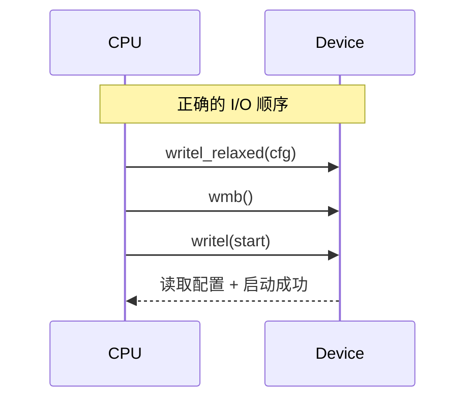

# 第15章　I/O 顺序：`readl/writel` 与 `*_relaxed` + `mb/rmb/wmb`

------

## 章节内容说明

上一章的 `smp_*()` 是针对 **CPU↔CPU 内存一致性** 的顺序保障机制。
 而本章则进入另一条通路：**CPU↔设备（MMIO）** 的访问顺序。

重点回答三个核心问题：

1. 为什么内核区分 `readl()/writel()` 与 `readl_relaxed()/writel_relaxed()`？
2. 为什么普通内存屏障 (`smp_mb()`) 不够，需要 `mb()/wmb()/rmb()`？
3. 在驱动中，如何在配置寄存器、启动设备、同步 DMA 时正确放置这些屏障？

------

## 15.1　概念

### 〔白话解释〕

当 CPU 与设备通过 MMIO 寄存器交互时，CPU 认为这些寄存器是“内存映射地址”，但设备端并不遵守 CPU 的乱序规则。
 例如：

```c
writel(cfg, base + REG_CFG);
writel(CTRL_GO, base + REG_CTRL);
```

从 C 语义上看，这是“先写配置，再启动”。
 但在实际执行中：

- CPU 可能先发出 `CTRL_GO`；
- 或者两个写请求被总线合并成一个突发包；
- 导致设备看到的顺序与 CPU 不同。

这类问题被称为 **I/O 顺序问题**。

### 〔专业定义〕

| 概念                          | 定义                                       |
| ----------------------------- | ------------------------------------------ |
| **MMIO（Memory-Mapped I/O）** | 设备寄存器映射到内存地址空间的机制         |
| **I/O 屏障**                  | 确保 MMIO 访问顺序与软件语义一致的指令约束 |
| **Relaxed 访问**              | 不带任何内存/设备屏障的纯读写操作          |
| **确认点（Confirm Point）**   | 在启动设备前强制同步配置和数据的屏障位置   |

------

### 表 15-1　概念区分表

| 接口               | 屏障方向 | 是否保证顺序     | 典型用途             |
| ------------------ | -------- | ---------------- | -------------------- |
| `writel()`         | CPU→设备 | ✅（含 I/O 屏障） | 配置寄存器、启动命令 |
| `writel_relaxed()` | CPU→设备 | ❌（无序）        | 连续寄存器批量写     |
| `readl()`          | 设备→CPU | ✅（含 I/O 屏障） | 读取状态、等待条件   |
| `readl_relaxed()`  | 设备→CPU | ❌（无序）        | 多次采样状态寄存器   |
| `mb()/rmb()/wmb()` | CPU↔设备 | ✅（I/O 全序）    | 明确同步点           |

------

## 15.2　能做 / 不能做

| 操作               | 能做                             | 不能做                   |
| ------------------ | -------------------------------- | ------------------------ |
| `*_relaxed()`      | 快速读写寄存器；允许重排；高性能 | 不保证设备按顺序看到指令 |
| `readl()/writel()` | 确保按语义顺序访问设备           | 可能带来轻微延迟         |
| `mb()/wmb()/rmb()` | 控制 CPU↔设备同步关系            | 不参与数据传输，仅顺序化 |
| `smp_mb()`         | 仅影响 CPU↔CPU                   | 不影响设备 I/O           |

------

## 15.3　核心用法模式

------

### 模式①：配置→启动的确认点

```c
/* [INV] 正确顺序：配置先，启动后 */
writel_relaxed(cfg0, base + REG_CFG0);
writel_relaxed(cfg1, base + REG_CFG1);
wmb();                    /* [CHECK] CPU→设备顺序屏障 */
writel(CTRL_GO, base + REG_CTRL);
```

- `wmb()` 迫使前面的所有寄存器写入真正发出；
- 保证设备在看到启动信号时，所有配置已到达。

如果缺少该屏障：

> 某些架构（ARM/RISC-V）可能出现设备启动但未加载完整配置的“假启动”。

------

### 模式②：状态轮询

```c
/* [INV] CPU 读取设备状态 */
do {
    status = readl_relaxed(base + REG_STATUS);
} while (!(status & STATUS_DONE));
rmb();                   /* [CHECK] 确保状态有效后读结果 */
result = readl(base + REG_RESULT);
```

- `rmb()` 确保在确认状态后再读取数据；
- 防止 CPU 提前读取寄存器造成数据不一致。

------

### 模式③：CPU 与 DMA 缓冲同步

```c
/* [INV] CPU 准备 DMA 数据 */
prepare_buffer();
wmb();                        /* [CHECK] 刷新缓存至设备可见 */
writel(DMA_START, base + REG_CMD);

/* [INV] 中断回调读取 DMA 结果 */
irq_handler() {
    dma_rmb();                /* [CHECK] 设备→CPU 缓冲同步 */
    process_result();
}
```

- `wmb()` 保证设备读取到最新 DMA 缓冲；
- `dma_rmb()` 确保设备写回的结果在 CPU 缓存中更新。

------

### 图 15-1　配置→启动的顺序控制



------

## 15.4　混搭与边界

| 组合                                  | 是否推荐 | 原因                              |
| ------------------------------------- | -------- | --------------------------------- |
| `writel_relaxed` + `wmb()` + `writel` | ✅        | 最常用组合（高性能又安全）        |
| `smp_wmb()` 替代 `wmb()`              | ❌        | 仅作用于 CPU，不影响设备          |
| `mb()` 全局屏障                       | ⚠️        | 成本大，仅在强同步场合使用        |
| `readl_relaxed` + `rmb()`             | ✅        | 连续状态轮询后读取数据            |
| `READ_ONCE` + `writel()`              | ⚠️        | CPU↔设备与 CPU↔CPU 混用需区分语义 |

------

## 15.5　常见坑

| [PIT]  | 描述                                                         |
| ------ | ------------------------------------------------------------ |
| [PIT1] | 把 `smp_wmb()` 当作 I/O 屏障使用（设备仍乱序）。             |
| [PIT2] | 连续写多个寄存器使用 `writel()`，性能大幅下降。              |
| [PIT3] | 轮询状态后立即读结果，未加 `rmb()` 导致旧值。                |
| [PIT4] | DMA 缓冲写完未加 `wmb()`，设备读到旧数据。                   |
| [PIT5] | 误以为 x86 不需要屏障，移植到 ARM/RISC-V 崩溃。              |
| [PIT6] | 在中断中调用 `writel()` 而不是 `writel_relaxed()`，造成过度同步。 |

------

## 15.6　最小模板

```c
/* 配置设备 */
writel_relaxed(cfg0, base + REG_CFG0);
writel_relaxed(cfg1, base + REG_CFG1);
wmb();                        /* [CHECK] CPU→设备顺序屏障 */
writel(CTRL_GO, base + REG_CTRL);

/* 等待完成 */
do {
    status = readl_relaxed(base + REG_STATUS);
} while (!(status & STATUS_DONE));
rmb();                        /* [CHECK] 状态确认后读取数据 */
result = readl(base + REG_RESULT);
```

------

### 表 15-2　用法速览表

| 函数/宏            | 屏障方向 | 是否保证顺序 | 性能 | 常见用途     |
| ------------------ | -------- | ------------ | ---- | ------------ |
| `writel()`         | CPU→设备 | ✅            | 中   | 控制命令     |
| `writel_relaxed()` | CPU→设备 | ❌            | 高   | 批量配置     |
| `readl()`          | 设备→CPU | ✅            | 中   | 状态读取     |
| `readl_relaxed()`  | 设备→CPU | ❌            | 高   | 快速轮询     |
| `wmb()`            | CPU→设备 | ✅            | 高   | 写顺序确认点 |
| `rmb()`            | 设备→CPU | ✅            | 高   | 状态确认点   |
| `mb()`             | 双向     | ✅            | 低   | 强同步       |

------

### 表 15-3　核对表

| 核对项 [CHECK]                 | 说明         |
| ------------------------------ | ------------ |
| 是否在设备启动前加了 wmb？     | 确保配置可见 |
| 是否区分 smp_* 与 I/O 屏障？   | 防止无效屏障 |
| 是否在状态确认后加 rmb？       | 确保结果正确 |
| 是否避免多余的 writel() 同步？ | 减少性能损失 |
| 是否根据方向选择 wmb/rmb/mb？  | 明确屏障语义 |

------

## 15.7　小结

1. `readl()/writel()` 是对 MMIO 寄存器的访问接口，**自带 I/O 屏障**；
2. `*_relaxed()` 版本**不带任何屏障**，性能高但需人工加 `wmb()` / `rmb()`；
3. `smp_*` 屏障作用于 **CPU↔CPU**，不影响设备；
4. 在驱动中，正确的 I/O 顺序是：
   - 配置（relaxed）→ `wmb()` → 启动（非 relaxed）；
   - 轮询（relaxed）→ `rmb()` → 读取结果；
5. 设备启动、DMA、寄存器访问等必须显式考虑**I/O 可见性**与**总线同步**，
   否则将触发“启动未配置”、“DMA 读旧数据”等难复现的竞态。

------

进入下一章 第16章：**自旋锁（不可睡侧）**：这一章将正式从“顺序控制”过渡到“互斥控制”，讲解 `spinlock_t`、`raw_spinlock_t`、`irqsave` 及中断上下文的锁序。

