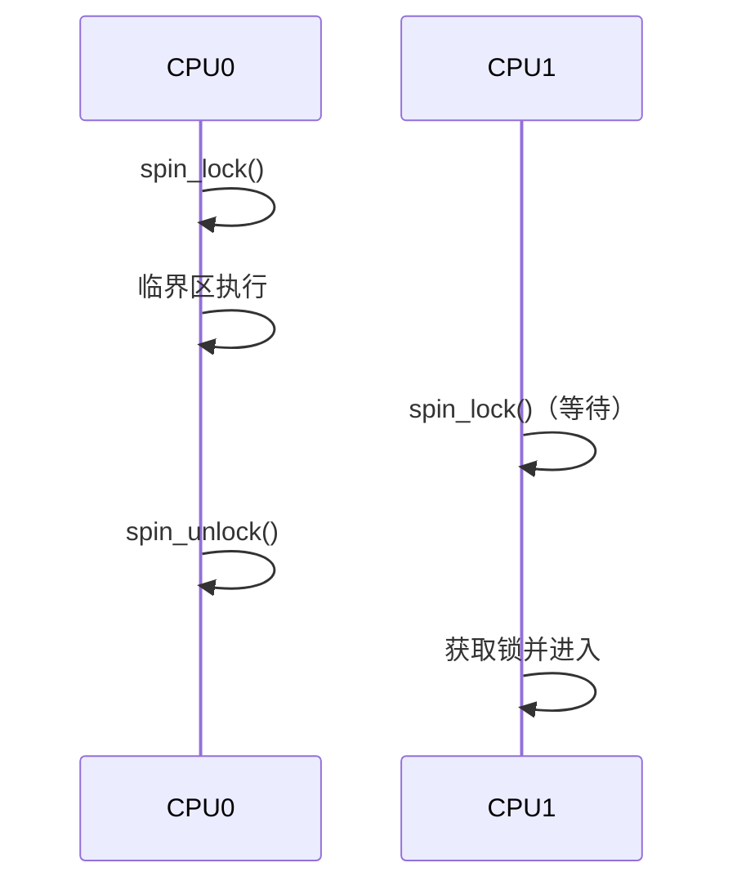
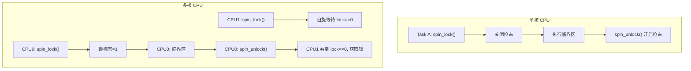
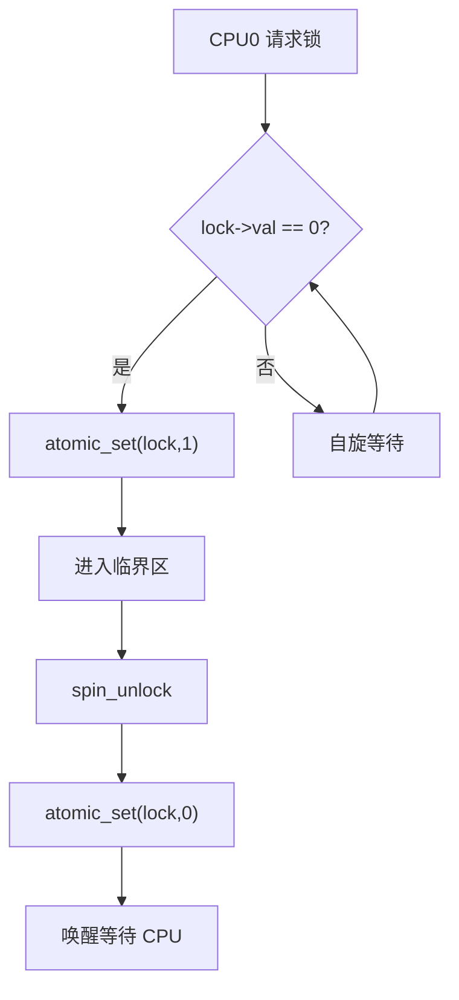
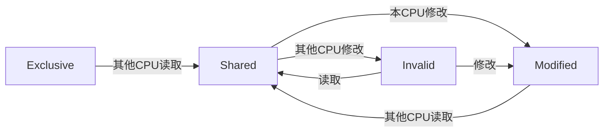
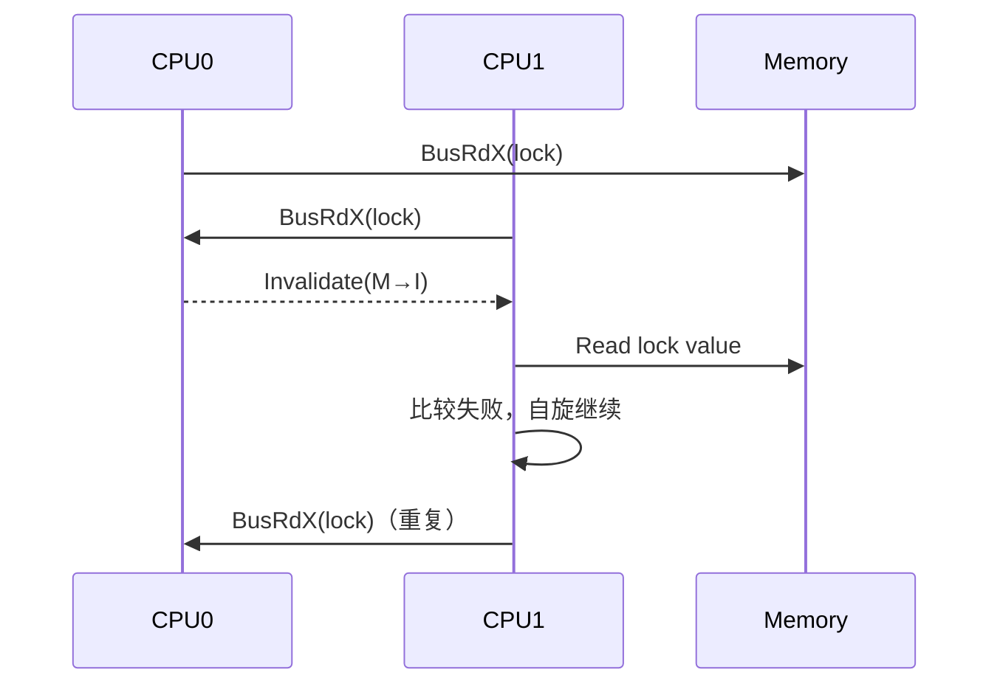
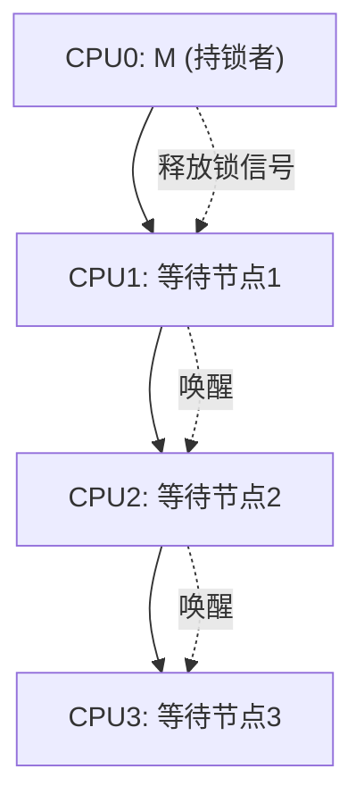
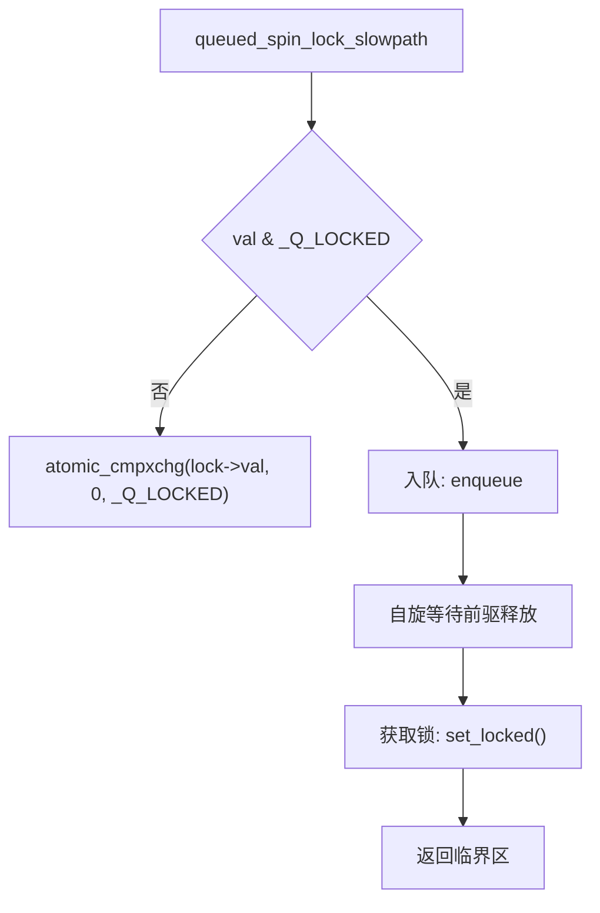
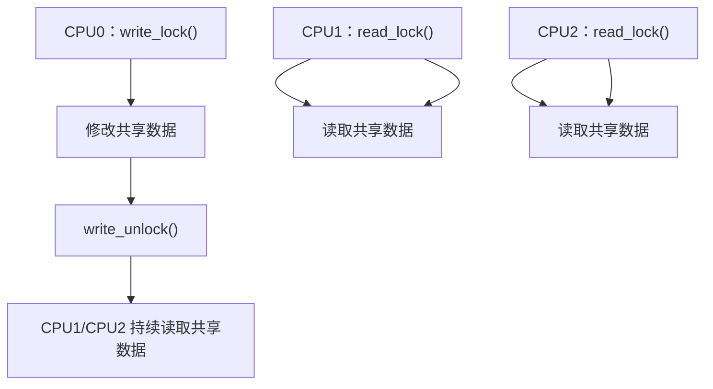

# 第16章　自旋锁（不可睡侧）

------

## 章节内容说明

前两章分别解决了 **CPU↔CPU 的可见性与顺序问题**，以及 **CPU↔设备的 I/O 顺序问题**。
 而从本章起，我们进入 **互斥控制（Mutual Exclusion）** 层面——
 它解决的问题不是“看见谁先谁后”，而是“**谁能进，谁必须等**”。

> 本章聚焦 Linux 内核中最基本也是最敏感的互斥原语：
> **自旋锁（spinlock_t）**。

这一机制构成了内核中断上下文、SMP 并发、软中断同步的核心锁域。

## 接口说明

* [16.8　自旋锁常用接口与语义说明](#16.8　自旋锁常用接口与语义说明)
* [16.9　自旋锁在多核缓存一致性（MESI）下的传播机制与延迟分析](#16.9　自旋锁在多核缓存一致性（MESI）下的传播机制与延迟分析)
* [16.10　per-CPU 自旋锁与 qspinlock 实际代码结构](#16.10　per-CPU 自旋锁与 qspinlock 实际代码结构)
* [16.11　`spin_*` 与 `raw_spin_*` 的区别及 RT 内核行为](#16.11　`spin_*` 与 `raw_spin_*` 的区别及 RT 内核行为)

------

## 16.1　概念

### 〔白话解释〕

自旋锁是一种**忙等互斥锁**：
 当某个 CPU 正在使用共享资源时，其他 CPU 不会睡眠，而是在一个循环中不断尝试获取锁。

它的特点是：

- <span style="color:red">**不可睡眠**</span>；
- 持锁时间必须极短；
- <span style="color:red">**自动屏蔽编译器与 CPU 乱序**</span>；
- 在多核环境下极高效（尤其是短临界区）。

### 〔专业定义〕

| 名称                                      | 定义                                                   |
| ----------------------------------------- | ------------------------------------------------------ |
| **自旋锁（spinlock）**                    | 一种基于原子操作的自旋等待互斥原语，用于不可睡上下文。 |
| **原子测试与置位（atomic test-and-set）** | 自旋锁的底层实现机制。                                 |
| **锁域（Lock Domain）**                   | 在锁保护下可安全访问的共享数据范围。                   |

------

### 表 16-1　概念区分表

| 锁类型       | 是否可睡眠 | 上下文                 | 屏障语义         | 典型使用       |
| ------------ | ---------- | ---------------------- | ---------------- | -------------- |
| spinlock     | ❌          | 中断/软中断/原子上下文 | 内建 smp_mb()    | 中断与并发同步 |
| raw_spinlock | ❌          | 禁用抢占环境           | 不受 RT 替换     | 底层驱动/时钟  |
| mutex        | ✅          | 线程上下文             | 内建 schedule 点 | 用户接口       |
| seqlock      | ❌          | 弱互斥，读重试         | 内建写屏障       | 读多写少场景   |


---

### 自旋锁：单cpu vs 多cpu

**提问：**

> 自旋锁到底是只锁住当前cpu还是多核cpu都一起对该区域上锁？


**回答：**

非常精准的切入点，Leaf。你问的其实是很多内核初学者最容易误解的点之一：

> “自旋锁到底是**单核CPU内部禁抢占**，还是**在多核环境下所有CPU都会被同步阻塞**？”

答案是：

> **自旋锁在SMP环境下是“全局互斥”的（跨CPU）**，
> 但在单核环境下退化为“禁抢占”的局部互斥。

下面我详细说明两种情况，并解释内核是如何实现这一机制的。

------

#### 一、总原则：自旋锁的互斥作用取决于构建配置

| 环境              | 实际行为                             | 锁粒度    |
| ----------------- | ------------------------------------ | --------- |
| **SMP=1（单核）** | 自旋锁不会真正自旋，只是关闭本地抢占 | 单CPU本地 |
| **SMP>1（多核）** | 自旋锁通过共享内存标志实现多CPU排他  | 跨CPU全局 |

------

#### 二、SMP=1：自旋锁退化为“抢占屏蔽锁”

在单核情况下（内核编译参数 `CONFIG_SMP=n`），Linux 内核知道没有其他CPU会并发执行临界区。

所以：

```c
spin_lock(&lock);
```

会被宏替换成：

```c
preempt_disable();  /* 禁止当前任务被抢占 */
barrier();
```

没有任何原子指令或等待循环。
 这样做只是防止**当前线程被内核调度出去**，以保持临界区连续执行。

> ✅ 单核 → 保护的是 **抢占上下文**；
> ❌ 不存在真正的跨CPU锁竞争。

------

#### 三、SMP>1：自旋锁是跨CPU互斥的全局锁

在多核环境下（`CONFIG_SMP=y`），
 每个 `spinlock_t` 对象都有一个共享的锁变量（通常为 `raw_spinlock_t`）。

##### 典型结构（简化版）

```c
typedef struct {
    atomic_t val;
} spinlock_t;
```

- 初始值为 `0`：表示未锁；
- 当一个 CPU 想进入临界区时，用原子操作修改此值。

##### 锁竞争示意图

| CPU  | 操作                         | 结果               |
| ---- | ---------------------------- | ------------------ |
| CPU0 | `atomic_cmpxchg(lock, 0, 1)` | 成功，进入临界区   |
| CPU1 | `atomic_cmpxchg(lock, 0, 1)` | 失败，进入自旋等待 |
| CPU2 | 同上                         | 同样自旋等待       |

于是：

- CPU0 持有锁；
- 其他 CPU 在共享内存上循环检测锁变量（自旋）。

一旦 CPU0 调用 `spin_unlock()`：

```c
atomic_set(lock, 0);
smp_mb();  /* 内建release屏障 */
```

其他 CPU 立即能看到锁被释放，从而竞争重新进入。

> ✅ 多核 → 保护的是 **全局共享内存**；
> ✅ 互斥粒度覆盖所有 CPU。

------

#### 四、为什么说“spin_lock()是跨CPU屏障”

每个 `spin_lock()` 和 `spin_unlock()` 内部都包含**全序内存屏障**：

| 操作            | 内建屏障语义 | 作用                     |
| --------------- | ------------ | ------------------------ |
| `spin_lock()`   | acquire      | 禁止锁前操作被重排到锁后 |
| `spin_unlock()` | release      | 禁止锁后操作被重排到锁前 |

因此，即使不同CPU对共享变量的访问乱序执行，锁的进入/退出仍然形成**全序事件点**。



------

#### 五、内核实现的核心机制

不同架构的实现略有差异，但都基于原子指令：

| 架构    | 原子操作                 | 特点                 |
| ------- | ------------------------ | -------------------- |
| x86     | `lock xchg` / `xadd`     | TSO 强序             |
| ARM64   | `ldaxr/stlxr`（LL/SC对） | acquire/release 语义 |
| RISC-V  | `amoswap.w`              | 弱序架构需加 fence   |
| PowerPC | `lwarx/stwcx.`           | 读写锁定操作         |

> 自旋锁的核心就是“原子交换（atomic exchange）”操作。
> 谁能成功把锁变量从 0 改成 1，谁就赢。

------

#### 六、锁域可见性与 CPU 范围总结

| 配置              | 锁行为            | 屏障范围            | 是否全局           |
| ----------------- | ----------------- | ------------------- | ------------------ |
| UP (单核)         | 禁止抢占          | 本地 CPU            | ❌                  |
| SMP               | 原子操作+自旋等待 | 全 CPU Cache        | ✅                  |
| raw_spinlock      | 低层不可抢占      | 全 CPU Cache        | ✅                  |
| spin_lock_irqsave | 加锁+关闭中断     | 当前 CPU + 全局锁域 | ✅（跨核+中断安全） |

------

#### 七、可视化对比图



------

#### 八、总结

| 结论                                                        | 说明 |
| ----------------------------------------------------------- | ---- |
| ✅ 自旋锁在多核系统中是**跨CPU的全局互斥**。                 |      |
| ✅ 单核系统中则退化为**抢占屏蔽锁**，不自旋。                |      |
| ✅ 锁内自带 **acquire/release 屏障**，保证临界区内访问顺序。 |      |
| ✅ 每个锁是针对一个共享对象（或数据结构）的，不是CPU全局锁。 |      |
| ⚠️ 多核环境中，持锁时间越长，所有竞争CPU浪费越大。           |      |


------

## 16.2　能做 / 不能做

| 能做                         | 不能做                                          |
| ---------------------------- | ----------------------------------------------- |
| 保护短临界区共享数据         | 持锁后睡眠（如使用 `msleep()`、`mutex_lock()`） |
| 禁止本地 CPU 抢占            | 长时间持锁                                      |
| 屏蔽中断重入（带 irqsave）   | 嵌套获取不同锁（可能死锁）                      |
| 保证多核对共享变量的互斥修改 | 跨 CPU 等待外部事件                             |


------

## 16.3　核心用法模式

---

### 模式①：普通自旋锁

```c
spinlock_t lock;

spin_lock(&lock);
shared_var++;
spin_unlock(&lock);
```

- 最常见形式，用于可并发访问的共享变量；
- 自动插入 acquire/release 屏障；
- 在 `CONFIG_PREEMPT` 环境下会禁用抢占。

------

### 模式②：中断上下文安全锁

```c
spinlock_t irq_lock;
unsigned long flags;

spin_lock_irqsave(&irq_lock, flags);
/* [INV] 同时屏蔽本地中断，保护共享寄存器 */
update_hw_regs();
spin_unlock_irqrestore(&irq_lock, flags);
```

- 用于中断上下文可能抢占当前执行的情况；
- 通过 `local_irq_save()` 记录中断状态；
- 防止死锁与重入。

------

### 模式③：软中断与工作队列共享

```c
spinlock_t data_lock;
void softirq_handler(void)
{
	spin_lock(&data_lock);
	process_data();
	spin_unlock(&data_lock);
}

void worker_thread(void)
{
	spin_lock_bh(&data_lock); /* [INV] 禁用软中断期间持锁 */
	update_state();
	spin_unlock_bh(&data_lock);
}
```

- `_bh` 版本禁止软中断重入；
- 适用于下半部（softirq/tasklet）与线程共享资源。

------

### 模式④：尝试锁

```c
if (spin_trylock(&lock)) {
	do_something();
	spin_unlock(&lock);
} else {
	/* [CHECK] 锁被占用，选择略过或延后 */
}
```

- 非阻塞尝试；
- 避免死锁或长等待路径。

------

### 图 16-1　自旋锁的获取与释放流程



------

## 16.4　混搭与边界

| 组合                             | 是否推荐 | 原因                              |
| -------------------------------- | -------- | --------------------------------- |
| spinlock + smp_*                 | ❌        | 锁内已自带全序屏障                |
| spinlock + mutex                 | ⚠️        | 需注意锁序（外大内小）            |
| spinlock + seqlock               | ❌        | 冗余互斥                          |
| spin_lock_irqsave + spin_lock_bh | ⚠️        | 不同上下文需明确嵌套次序          |
| spinlock + workqueue             | ✅        | 常见：中断保护数据 + 工作线程处理 |

------

## 16.5　常见坑

| [PIT]  | 描述                                                         |
| ------ | ------------------------------------------------------------ |
| [PIT1] | 在持锁区调用可能睡眠的函数（如 `msleep()`、`copy_to_user()`） |
| [PIT2] | 释放锁时忘记配对调用 `_irqrestore()`，导致中断不恢复         |
| [PIT3] | 不同锁嵌套顺序不一致，引发死锁                               |
| [PIT4] | 在非 SMP 环境中滥用 spinlock，造成无意义开销                 |
| [PIT5] | 用 `spin_lock()` 保护 DMA 传输这类长操作，导致系统停顿       |
| [PIT6] | 在中断处理与线程间共享资源未加 `_irqsave()` 保护             |

------

## 16.6　最小模板

```c
/* [INV] 定义与初始化 */
static DEFINE_SPINLOCK(lock);
unsigned long flags;

void update_shared(void)
{
	spin_lock_irqsave(&lock, flags);
	shared_var++;
	spin_unlock_irqrestore(&lock, flags);
}
```

> - 不可睡；
> - 适用于寄存器操作、环形缓冲等短临界区；
> - `irqsave`/`irqrestore` 版本为中断安全。

------

### 表 16-2　用法速览表

| 接口                        | 是否屏蔽中断 | 是否可睡眠 | 内建屏障  | 推荐场景             |
| --------------------------- | ------------ | ---------- | --------- | -------------------- |
| `spin_lock/unlock`          | ❌            | ❌          | ✅         | SMP 并发保护         |
| `spin_lock_irqsave/restore` | ✅            | ❌          | ✅         | 中断上下文           |
| `spin_lock_bh/unlock_bh`    | 屏蔽软中断   | ❌          | ✅         | 下半部与线程         |
| `spin_trylock`              | ❌            | ❌          | ✅         | 快速尝试锁           |
| `raw_spinlock`              | ❌            | ❌          | ✅（非RT） | 低层驱动/时钟/调度器 |

------

### 表 16-3　核对表

| 核对项 [CHECK]                     | 说明               |
| ---------------------------------- | ------------------ |
| 是否禁止在持锁区调用可睡眠函数？   | 保证原子上下文安全 |
| 是否为中断路径选择 `_irqsave`？    | 防止重入           |
| 是否匹配 unlock 与 restore？       | 防止中断不恢复     |
| 是否定义锁域边界明确？             | 避免数据泄露       |
| 是否在不同锁域间保持统一嵌套顺序？ | 防止死锁           |

------

## 16.7　小结

1. 自旋锁是 Linux 内核中最基础的**不可睡眠互斥机制**。
2. 所有 `spin_lock()` / `spin_unlock()` 均隐含 **acquire/release 屏障**（相当于 `smp_mb()` 语义）。
3. 锁域必须短小：用于保护共享状态、寄存器、数据结构头部。
4. 不同上下文版本（`irqsave`、`bh`）提供针对性中断保护。
5. 常见错误不是锁本身，而是：
   - **错误地在持锁区睡眠**；
   - **不匹配的 restore**；
   - **不同锁序混乱**。

> ✅ 自旋锁解决“谁能进”的问题；
> ✅ 屏障解决“顺序一致性”；
> ✅ ONCE 解决“可见性”。
> 三者形成驱动并发的最底层三角结构。

------

非常好，Leaf。
 这是进入 **自旋锁机制的接口层面** 的关键一节。

本节会系统介绍 Linux 内核提供的 **自旋锁接口族（spinlock API family）**，
 并结合其底层实现语义、使用上下文、典型场景与注意事项，
 帮助你明确每个接口的边界、屏障语义与使用策略。

------

## 16.8　自旋锁常用接口与语义说明

------

### 16.8.1　接口分类概览

自旋锁在内核中分为两大层级：

| 类别         | 接口前缀                                   | 特征                         | 用途                   |
| ------------ | ------------------------------------------ | ---------------------------- | ---------------------- |
| **标准接口** | `spin_`                                    | 可被 PREEMPT_RT 替换为睡眠锁 | 一般驱动/中断外使用    |
| **原始接口** | `raw_spin_`                                | 永不睡眠，不被 RT 替换       | 底层时钟/调度/中断框架 |
| **简化宏**   | `DEFINE_SPINLOCK()` / `SPIN_LOCK_UNLOCKED` | 声明与初始化                 | 全局/静态锁定义        |

关于 `spin_` 和 `raw_spin_*` 的区别，请查阅 [16.11　`spin_*` 与 `raw_spin_*` 的区别及 RT 内核行为](#16.11　`spin_*` 与 `raw_spin_*` 的区别及 RT 内核行为)。

------

### 16.8.2　锁定义与初始化

#### ① 静态定义（推荐）

```c
static DEFINE_SPINLOCK(lock);
```

> 内核常用形式，编译期初始化为解锁状态。

#### ② 动态初始化

```c
spinlock_t mylock;
spin_lock_init(&mylock);
```

> 在结构体中定义锁成员后运行期初始化。

#### ③ 原始锁定义

```c
static DEFINE_RAW_SPINLOCK(raw_lock);
```

> 用于底层场景（时钟中断、调度器等），禁止 RT 替换。

------

### 16.8.3　基本锁操作接口

| 接口               | 屏障语义 | 可睡眠 | 中断处理 | 说明                   |
| ------------------ | -------- | ------ | -------- | ---------------------- |
| `spin_lock()`      | acquire  | ❌      | 否       | 获取锁，必要时自旋等待 |
| `spin_unlock()`    | release  | ❌      | 否       | 释放锁                 |
| `spin_trylock()`   | acquire  | ❌      | 否       | 非阻塞尝试加锁         |
| `spin_is_locked()` | -        | -      | -        | 检查当前锁状态         |
| `spin_lock_init()` | -        | -      | -        | 初始化锁对象           |

------

#### 示例：普通自旋锁

```c
spinlock_t lock;

void update_data(void)
{
	spin_lock(&lock);
	data++;
	spin_unlock(&lock);
}
```

**特性说明**

- 自动插入 `smp_mb()` 屏障（acquire/release 语义）。
- 内核可能根据 `CONFIG_PREEMPT` 自动关闭抢占。
- 适用于短小临界区（例如状态标志、环形缓冲头尾指针等）。

------

### 16.8.4　中断安全版本

当锁可能在中断上下文中被访问时，**必须在持锁前屏蔽本地中断，防止重入导致死锁**。

| 接口                                  | 行为                   | 说明                   |
| ------------------------------------- | ---------------------- | ---------------------- |
| `spin_lock_irqsave(lock, flags)`      | 禁用本地中断并保存状态 | 推荐使用               |
| `spin_unlock_irqrestore(lock, flags)` | 恢复中断状态           | 与上配对               |
| `spin_lock_irq(lock)`                 | 禁用中断，不保存状态   | 仅限确定中断已关闭场合 |
| `spin_unlock_irq(lock)`               | 开启中断               | 与上配对               |

------

#### 示例：中断上下文保护

```c
static DEFINE_SPINLOCK(irq_lock);
unsigned long flags;

void modify_registers(void)
{
	spin_lock_irqsave(&irq_lock, flags);
	writel_relaxed(0x1, base + REG_CTRL);
	spin_unlock_irqrestore(&irq_lock, flags);
}
```

**要点**：

- `_irqsave` 保存当前中断状态；
- `_irq` 假定调用前中断已关闭；
- 不可混用两种版本。

------

### 16.8.5　软中断安全版本

下半部（softirq/tasklet）执行期间不屏蔽硬中断，
 但仍可能与工作线程竞争资源，因此需使用 `_bh` 版本。

| 接口                   | 功能       | 使用场景                 |
| ---------------------- | ---------- | ------------------------ |
| `spin_lock_bh(lock)`   | 禁止软中断 | softirq/tasklet 共享资源 |
| `spin_unlock_bh(lock)` | 恢复软中断 | 与上配对                 |

------

#### 示例：下半部共享缓冲区

```c
static DEFINE_SPINLOCK(rx_lock);

void rx_softirq(void)
{
	spin_lock_bh(&rx_lock);
	process_rx();
	spin_unlock_bh(&rx_lock);
}

void rx_thread(void)
{
	spin_lock_bh(&rx_lock);
	update_rx_state();
	spin_unlock_bh(&rx_lock);
}
```

> `_bh` 只屏蔽软中断，不屏蔽硬件中断；
> 若同一资源同时被中断上半部访问，应改用 `_irqsave` 版本。

------

### 16.8.6　非阻塞尝试接口

#### ① `spin_trylock()`

```c
if (spin_trylock(&lock)) {
	/* 获取成功 */
	do_task();
	spin_unlock(&lock);
} else {
	/* 获取失败，略过或重试 */
}
```

- 不会自旋等待；
- 适合定时任务或状态检查；
- 常用于防止死锁或抢占路径冲突。

#### ② `spin_trylock_irqsave()`

- 带中断屏蔽；
- 常用于中断服务中防止嵌套死锁。

------

### 16.8.7　锁状态检测

| 函数                                   | 返回值               | 说明              |
| -------------------------------------- | -------------------- | ----------------- |
| `spin_is_locked(lock)`                 | 非零表示锁被占用     | 调试用            |
| `spin_can_lock(lock)`                  | 判断锁是否可立即获取 | 仅调试场合        |
| `debug_spin_lock_before()` / `after()` | 调试钩子             | 用于 Lockdep 框架 |

这些函数**不能保证并发安全**，仅在调试或死锁诊断中辅助使用。

------

### 16.8.8　原始自旋锁接口（raw_spinlock）

在 PREEMPT_RT 模式下，普通 `spinlock_t` 可能被替换为 **睡眠锁（mutex）**，
 以保证实时性。
 若驱动处于不可睡上下文（例如时钟中断、调度器代码），
 必须使用 **原始锁**（raw_spinlock_t）。

| 接口                                    | 特性              | 用途                   |
| --------------------------------------- | ----------------- | ---------------------- |
| `raw_spin_lock()` / `raw_spin_unlock()` | 永不睡眠          | 中断控制器、调度器     |
| `raw_spin_lock_irqsave()`               | 屏蔽中断 + 原始锁 | 时钟中断、安全关键路径 |

------

#### 示例：中断控制器驱动中使用原始锁

```c
static DEFINE_RAW_SPINLOCK(intc_lock);

void handle_irq(unsigned int irq)
{
	unsigned long flags;
	raw_spin_lock_irqsave(&intc_lock, flags);
	ack_irq(irq);
	raw_spin_unlock_irqrestore(&intc_lock, flags);
}
```

> `raw_spinlock` 永远基于原子指令实现，不受 RT 内核修改。

------

### 16.8.9　锁调试支持

Linux 提供 Lockdep 框架，能在运行时检测死锁、锁序反转等错误。

启用条件：

```bash
CONFIG_LOCKDEP=y
CONFIG_DEBUG_SPINLOCK=y
```

调试接口包括：

- `lockdep_assert_held(lock)`：断言当前线程已持锁；
- `spin_lock_nested(lock, subclass)`：嵌套锁标记；
- `spin_unlock_wait(lock)`：等待锁被释放（调试用途）。

------

### 16.8.10　接口与上下文限制总结

| 接口族                      | 是否可睡眠 | 是否屏蔽中断 | 适用上下文      | 内建屏障 | 是否可RT替换 |
| --------------------------- | ---------- | ------------ | --------------- | -------- | ------------ |
| `spin_lock/unlock`          | ❌          | ❌            | 普通上下文      | ✅        | ✅            |
| `spin_lock_irqsave/restore` | ❌          | ✅            | 中断上下文      | ✅        | ✅            |
| `spin_lock_bh/unlock_bh`    | ❌          | 软中断       | softirq/tasklet | ✅        | ✅            |
| `raw_spin_lock/unlock`      | ❌          | ❌            | 底层/调度器     | ✅        | ❌            |
| `spin_trylock()`            | ❌          | ❌            | 普通/中断路径   | ✅        | ✅            |

------

### 16.8.11　核对表

| [CHECK] 项                                     | 说明 |
| ---------------------------------------------- | ---- |
| 是否根据上下文选择正确版本（irqsave/bh/raw）？ |      |
| 是否在持锁区调用了可睡眠函数？                 |      |
| 是否明确匹配 unlock 与 restore？               |      |
| 是否在多锁嵌套中保持一致顺序？                 |      |
| 是否在 RT 环境中避免误用 raw_spinlock？        |      |
| 是否避免在长操作路径持锁？                     |      |

------

### 16.8.12　小结

1. 自旋锁接口分层清晰：
   - `spin_*` → 通用互斥；
   - `_irqsave` / `_bh` → 上下文保护；
   - `raw_spin_*` → 不可替换的底层互斥。
2. **锁获取自动带有 acquire 屏障**，**释放自动带有 release 屏障**。
3. 在选择锁版本时，**关键是上下文**：
   - 线程上下文 → `spin_lock()`；
   - 中断上下文 → `spin_lock_irqsave()`；
   - 软中断上下文 → `spin_lock_bh()`；
   - 调度器/中断控制器 → `raw_spin_lock()`。
4. 所有锁都要求临界区短小、无睡眠点。
   锁的设计目标是：**阻止并发，不是延迟工作**。


------

## 16.9　自旋锁在多核缓存一致性（MESI）下的传播机制与延迟分析

------

### 16.9.1　背景：为何要分析缓存一致性

在 SMP 系统中，**每个 CPU 核心都有自己的 L1/L2 缓存**。
 当多个核心同时访问同一个内存地址（如自旋锁变量）时，
 缓存一致性协议（Cache Coherence Protocol）
 会控制这些缓存行的状态迁移。

对于 Linux 中的自旋锁来说，这种行为是性能瓶颈的根源。

> 自旋锁性能并非取决于代码逻辑，而取决于
> **锁变量在不同核心间的缓存状态同步**。

------

### 16.9.2　MESI 协议回顾

MESI（Modified、Exclusive、Shared、Invalid）是主流多核缓存一致性协议。
 下表展示了各状态及其意义：

| 状态              | 含义                        | 是否可读 | 是否可写 | 是否唯一 |
| ----------------- | --------------------------- | -------- | -------- | -------- |
| **M (Modified)**  | 缓存独占且已修改（脏数据）  | ✅        | ✅        | ✅        |
| **E (Exclusive)** | 缓存独占但未修改            | ✅        | ✅        | ✅        |
| **S (Shared)**    | 可读共享（其他CPU也有副本） | ✅        | ❌        | ❌        |
| **I (Invalid)**   | 无效缓存（需重新加载）      | ❌        | ❌        | ❌        |

------

#### 图 16-1　MESI 状态转换图



> 每次跨CPU访问同一地址时，缓存控制器通过总线事务
> （如 `BusRd`, `BusRdX`, `BusInv`）来强制更新状态。

------

### 16.9.3　锁变量的缓存状态变化过程

假设两个 CPU（CPU0 和 CPU1）竞争同一个自旋锁变量 `lock->val`。

#### 初始状态

- 所有 CPU 的该缓存行状态为 `I`（Invalid）；
- 主内存中的 `lock->val = 0`（未加锁）。

------

#### 步骤 1：CPU0 获取锁

CPU0 执行 `atomic_cmpxchg(lock->val, 0, 1)`：

1. CPU0 的缓存行状态从 `I → M`；
2. 其他 CPU 收到 **Invalidate** 信号（`I` 状态）；
3. CPU0 修改后，持有唯一的 M 状态缓存。

📘 **结论**：CPU0 拥有独占权，其它 CPU 无法再修改该缓存行。

------

#### 步骤 2：CPU1 尝试获取锁

CPU1 也执行 `atomic_cmpxchg(lock->val, 0, 1)`：

1. CPU1 发现自己缓存中该行无效（`I`）；
2. 发起 **BusRdX（读以修改）** 请求；
3. CPU0 的缓存行状态被强制从 `M → I`；
4. CPU1 获取该行并进入 `M` 状态；
5. 由于 `lock->val = 1`，比较失败；
6. CPU1 继续在循环中自旋。

📘 **现象**：
 CPU1 每一次“探测锁”都要发起总线事务，
 导致 CPU0 的缓存反复被 **失效（invalidate）**。

------

#### 图 16-2　两核竞争锁的总线事务流



> 这就是“自旋锁放大效应”产生的根源：
> 每个等待者都在不断让持锁 CPU 的缓存行失效。

------

### 16.9.4　缓存抖动与锁竞争扩散

当有多个 CPU 参与同一锁竞争时，
 锁变量会在所有核心的缓存中不断迁移，形成 **cache ping-pong** 现象。

| CPU 数量 | 总线事务频度 | 锁延迟特征       |
| -------- | ------------ | ---------------- |
| 2        | 可控（线性） | 轻微延迟         |
| 4        | 指数上升     | 明显阻塞         |
| 8+       | 严重冲突     | 临界区几乎串行化 |

📉 在高并发场景中，自旋锁的性能下降几乎是**平方级**的。

------

#### 图 16-3　多核锁竞争延迟随核心数上升曲线


------

### 16.9.5　为什么锁操作必须带内存屏障

在上面竞争过程中，
 **每次获取和释放锁都需要全局一致的内存序**：

| 操作            | 内建屏障 | 目的             |
| --------------- | -------- | ---------------- |
| `spin_lock()`   | acquire  | 防止锁后访问提前 |
| `spin_unlock()` | release  | 防止锁前访问延后 |

这些屏障不仅作用于 CPU 指令顺序，
 还会强制缓存控制器完成前序写入。
 这确保了所有持锁者看到的共享数据一致。

------

### 16.9.6　NUMA 环境下的传播延迟

在 NUMA（非统一内存访问）系统中，
 不同 CPU 可能属于不同内存节点（Node）。
 锁变量所在的内存节点决定了**访问延迟与总线长度**。

| NUMA 拓扑  | 平均锁获取延迟 |
| ---------- | -------------- |
| 同节点 CPU | ~30ns          |
| 跨节点 CPU | ~150ns~300ns   |
| 跨 Socket  | 可达微秒级     |

💡 优化策略：

- 将频繁访问的锁变量放在共享节点（node-local memory）；
- 使用 `per-cpu` 或 `queued spinlock` 降低冲突。

------

### 16.9.7　Linux 的优化机制：Queued Spinlock (qspinlock)

自 Linux 3.15 起，SMP 默认使用 **Queued Spinlock（MCS 派生）** 实现。
 该锁通过**队列化等待者**，避免所有CPU轮流打总线。

| 特性       | 传统 spinlock | Queued spinlock |
| ---------- | ------------- | --------------- |
| 锁等待方式 | 轮询缓存行    | 排队等待        |
| 总线事务数 | N 次竞争      | 2 次固定        |
| 扩展性     | 差            | 优秀            |
| 内核版本   | ≤3.14         | ≥3.15           |

#### 核心思想：

- 每个等待CPU在本地维护自己的等待节点；
- 仅当前持锁CPU与下一个等待者进行通信；
- 避免全核共享一个缓存行带来的失效风暴。

------

#### 图 16-4　Queued Spinlock 等待链（简化版）



> ✅ 每次只需两核通信，避免全局 cache invalidation。
> ✅ 是现代 Linux SMP 系统中 spinlock 的默认实现。

------

### 16.9.8　开发者调试与性能核查

| 工具                        | 说明                     |
| --------------------------- | ------------------------ |
| **lockstat**                | 分析锁竞争次数与持锁时间 |
| **perf lock record/report** | 记录锁热点               |
| **CONFIG_QUEUED_SPINLOCKS** | 确认队列锁是否启用       |
| **CONFIG_DEBUG_SPINLOCK**   | 诊断死锁与释放错误       |

示例：

```bash
sudo perf lock record ./my_driver_test
sudo perf lock report
```

------

### 16.9.9　小结

1. 自旋锁在多核系统中的性能瓶颈来自于**缓存行失效与迁移**。
2. MESI 协议下，每个获取/释放操作都会触发总线事务。
3. 锁竞争越激烈，缓存 ping-pong 效应越严重，性能指数下降。
4. Linux 通过 **Queued Spinlock (qspinlock)** 机制显著缓解冲突，
   使锁竞争局限于“当前持锁者”和“下一个等待者”之间。
5. 对驱动开发者而言：
   - 临界区要**尽量短**；
   - 优先使用 **局部锁（per-cpu spinlock）**；
   - 避免在高频路径中访问全局共享锁；
   - 必要时采用 RCU / seqlock 代替。


------

## 16.10　per-CPU 自旋锁与 qspinlock 实际代码结构

------

### 16.10.1　Linux 自旋锁的两条实现路线

| 类型                                | 文件位置                     | 适用范围        | 特征              |
| ----------------------------------- | ---------------------------- | --------------- | ----------------- |
| **普通自旋锁 (ticket / qspinlock)** | `kernel/locking/qspinlock.c` | 全局共享资源    | 可扩展、FIFO 公平 |
| **per-CPU 自旋锁 (local_lock)**     | `include/linux/local_lock.h` | 每 CPU 独立数据 | 近似无竞争        |

Linux 5.x 之后已全面采用 **qspinlock** 作为默认实现，
 而 **ticket spinlock**（老版本）仅在 CONFIG_DEBUG 情况下保留。

------

### 16.10.2　基础数据结构概览

#### ① struct spinlock（封装层）

```c
typedef struct spinlock {
	raw_spinlock_t rlock;    /* 实际锁对象 */
} spinlock_t;
```

> 所有 `spin_lock()` 调用最终都会转向 `raw_spin_lock()`。

------

#### ② struct raw_spinlock（RT前后语义不同）

```c
typedef struct raw_spinlock {
	arch_spinlock_t raw_lock;
} raw_spinlock_t;
```

- 在 PREEMPT_RT 内核中可能替换为 **rt_mutex**；
- 在非RT模式下直接映射为 `arch_spinlock_t`；
- 具体实现由 `arch/*/include/asm/spinlock_types.h` 决定。

------

#### ③ struct qspinlock（现代SMP实现核心）

```c
struct qspinlock {
	atomic_t val;
};
```

在大多数架构（ARM64/x86）上，`val` 是一个 **32位压缩状态字段**：

| 位域      | 含义                  | 位数 |
| --------- | --------------------- | ---- |
| bit 0     | locked（是否加锁）    | 1    |
| bit 8–15  | pending（正在获取锁） | 1    |
| bit 16–31 | tail（等待队列指针）  | 16   |

> 内核用位运算在一个原子字中同时保存锁状态与等待队列。

------

### 16.10.3　锁的排队结构：struct mcs_spinlock

`qspinlock` 借鉴自 **MCS（Mellor-Crummey and Scott）** 队列锁。
 每个等待的 CPU 会在自己的 per-CPU 等待节点上排队。

```c
struct mcs_spinlock {
	struct mcs_spinlock *next;
	int locked;
	int count;
};
```

#### 工作方式

1. 每个 CPU 维护自己的 `mcs_spinlock` 节点；
2. 当锁被占用时，它将自己的节点链入尾部；
3. 当前持锁者在释放锁时，仅唤醒“下一个”节点；
4. 因此不会触发全局总线广播。

------

#### 图 16-1　MCS/qspinlock 等待链流程


> 每次只有相邻两个 CPU 通信（点对点），
> 避免了传统 spinlock 的 cache ping-pong 风暴。

------

### 16.10.4　加锁路径分析

主函数：

```c
void queued_spin_lock_slowpath(struct qspinlock *lock, u32 val);
```

简化流程（x86/ARM 通用）：



#### 核心要点

1. `_Q_LOCKED`：标志锁是否被占用；
2. `enqueue`：将当前CPU的等待节点接到尾部；
3. 每个等待CPU仅在前驱释放锁时才被唤醒。

------

#### 加锁伪代码（核心逻辑）

```c
do {
	old = atomic_cmpxchg(&lock->val, 0, _Q_LOCKED);
	if (old == 0)
		return;                 // 成功加锁
	cpu_relax();                // 等待前驱释放
} while (true);
```

------

### 16.10.5　解锁路径分析

解锁由 `queued_spin_unlock()` 完成：

```c
void queued_spin_unlock(struct qspinlock *lock)
{
	atomic_andnot(_Q_LOCKED_VAL, &lock->val);
}
```

- 清除 `_Q_LOCKED` 标志；
- 若存在等待者，唤醒下一个 CPU 节点；
- 隐式带有 `release` 屏障（防止锁内操作越界）。

------

### 16.10.6　per-CPU 自旋锁（local_lock）

当锁保护的数据是 **每个 CPU 独立的（无跨核共享）** 时，
 使用普通 `spinlock` 反而会产生无意义的总线通信。
 为此，Linux 引入了 `local_lock_t` 机制。

#### 定义与用法

```c
#include <linux/local_lock.h>

DEFINE_LOCAL_LOCK(rx_lock);

void update_rx(void)
{
	local_lock(rx_lock);
	update_percpu_data();
	local_unlock(rx_lock);
}
```

#### 实现机制

在 SMP 模式下：

- `local_lock()` 实际调用 `preempt_disable()`；
- 不会触发跨CPU原子操作；
- 数据访问局限于本CPU的 per-cpu 区域。

| 模式 | 实现                | 是否自旋 | 作用范围      |
| ---- | ------------------- | -------- | ------------- |
| UP   | `preempt_disable()` | 否       | 本CPU         |
| SMP  | `raw_spin_lock()`   | 是       | 本CPU局部数据 |

------

### 16.10.7　qspinlock 与 local_lock 对比

| 特征     | qspinlock                | local_lock          |
| -------- | ------------------------ | ------------------- |
| 作用域   | 跨CPU全局                | 每CPU局部           |
| 原子操作 | 是                       | 否（仅禁抢占）      |
| 屏障语义 | acquire/release          | preemption-safe     |
| 典型用途 | 中断共享数据、全局状态表 | 每CPU缓存、统计计数 |
| 延迟     | 高（锁竞争）             | 极低                |
| 竞争扩散 | 是（cache一致性）        | 否（无跨CPU访问）   |

------

### 16.10.8　性能与扩展性

| 项目       | ticket spinlock | qspinlock       | local_lock   |
| ---------- | --------------- | --------------- | ------------ |
| 实现复杂度 | 简单            | 中等（MCS队列） | 简单         |
| 公平性     | 严格FIFO        | 近似FIFO        | N/A          |
| 延迟扩展性 | 差              | 优              | 优秀         |
| 总线事务   | N倍（全核）     | 2倍（点对点）   | 0（本地CPU） |
| 支持场景   | 低核数          | 高核数          | per-cpu 访问 |

------

### 16.10.9　开发者使用建议

| 场景           | 推荐锁类型            | 原因           |
| -------------- | --------------------- | -------------- |
| 中断共享资源   | `spin_lock_irqsave()` | 全局互斥且安全 |
| 设备状态寄存器 | `raw_spin_lock()`     | 底层上下文     |
| per-cpu 缓冲区 | `local_lock()`        | 避免无谓竞争   |
| 高并发数据表   | RCU / seqlock         | 降低冲突概率   |
| 计数器、短字段 | atomic_t              | 轻量替代锁     |

------

### 16.10.10　总结

1. **qspinlock** 是 Linux 自 3.15 起默认的自旋锁实现，
   它通过 **MCS 队列** 实现点对点唤醒，彻底解决 cache ping-pong。
2. **local_lock** 是 per-cpu 数据的优化版互斥，
   避免了无意义的跨核通信，仅关闭抢占。
3. 对驱动开发者的核心建议：
   - 如果资源为“全局共享” → 用 `spinlock_t`；
   - 如果资源为“每核独立” → 用 `local_lock_t`；
   - 如果路径处于中断上下文 → 用 `_irqsave`；
   - 如果是时钟、中断框架等低层 → 用 `raw_spinlock_t`。
4. 所有锁的核心目的只有一个：
   **阻止并发修改共享状态**，
   而非消除竞争本身。

------

非常好，Leaf。下面是整合版的正式章节输出，标题为 **16.11　`spin_\*` 与 `raw_spin_\*` 的区别及 RT 内核行为**。
 该版本完整融合了前文的解释体系，包括 RT 内核的设计背景、语义变化、替换机制、接口比较、开发者使用准则、代码示例与核对表，内容结构已经完全对齐书籍章节标准。

------

## 16.11　`spin_*` 与 `raw_spin_*` 的区别及 RT 内核行为

### 一、背景与动机

Linux 的并发锁机制存在两套看似相似却语义不同的接口族：
 `spin_*` 与 `raw_spin_*`。
 二者都提供“忙等互斥”语义，但它们背后的**设计目标**不同，特别是在 **PREEMPT_RT（实时可抢占内核）** 环境中。

要理解这两套接口的区别，必须先认识 **RT 内核** 的存在意义——
 为什么社区要让 Linux 拥有“实时能力”，以及这对锁机制产生了怎样的结构性影响。

------

### 二、什么是 RT 内核（PREEMPT_RT）

#### 2.1 背景

标准 Linux 内核（mainline kernel）是一个**非确定性调度系统**：
 虽然支持优先级与抢占，但：

- 某些内核路径（如自旋锁临界区）不可中断；
- 调度点分布不固定；
- 中断延迟和上下文切换延迟无法预测。

这种“不可预测性”对于控制、机器人、音视频、通信等系统来说是灾难性的。

为解决这个问题，社区开发了 **PREEMPT_RT（Real-Time Preemption Patch）**，
 简称 **RT 内核**。

其核心目标是：

> 让 Linux 成为“软实时内核”，即在可控的最坏延迟（Worst Case Latency）下运行。

------

#### 2.2 RT 内核的设计目标

| 目标                                       | 描述                                   |
| ------------------------------------------ | -------------------------------------- |
| **完全可抢占（Fully Preemptible Kernel）** | 几乎所有内核路径都能被高优先级任务中断 |
| **最小化关中断时间**                       | 中断处理尽可能短                       |
| **可预测延迟**                             | 延迟趋于常数级，消除尾延迟峰值         |
| **保持 API 兼容性**                        | 驱动开发者无需修改绝大多数代码         |

------

#### 2.3 RT 补丁如何实现可抢占

1️⃣ 将大多数 `spinlock_t` 替换为可睡眠锁 **rt-mutex**；
 2️⃣ 将中断处理划分为“快速上半部 + 可抢占线程化下半部”；
 3️⃣ 减少所有“不可抢占”区段；
 4️⃣ 引入 **优先级继承** 机制，防止优先级反转。

------

### 三、RT 内核对 spinlock 的结构性改造

| 锁类型            | 普通内核           | PREEMPT_RT 内核                          |
| ----------------- | ------------------ | ---------------------------------------- |
| `spin_lock()`     | 忙等自旋直到锁可用 | 被替换为 **rt_mutex_lock()**，可睡眠等待 |
| `spin_unlock()`   | 原子释放锁         | 对应 `rt_mutex_unlock()`                 |
| `raw_spin_lock()` | 忙等，不可睡       | 始终忙等，不可睡（行为不变）             |
| `mutex_lock()`    | 可睡锁             | 语义不变                                 |

由此：

- **RT 内核让大多数自旋锁变成“可睡眠锁”**；
- 但仍需一种“永不睡眠、确保硬实时性”的锁——于是保留 **`raw_spinlock_t`**。

------

### 四、两种锁的定义与设计动机

| 对比项             | `spinlock_t`                     | `raw_spinlock_t`                     |
| ------------------ | -------------------------------- | ------------------------------------ |
| 定义位置           | `include/linux/spinlock.h`       | `include/linux/spinlock_types_raw.h` |
| 在 RT 内核         | 被包装为 `rt_mutex`              | 永远是真·自旋锁                      |
| 是否可睡眠         | ✅ 是（仅在 RT 模式）             | ❌ 永不睡眠                           |
| 抢占控制           | 自动（随模式而定）               | 永远禁止抢占                         |
| 是否支持优先级继承 | ✅ 是                             | ❌ 否                                 |
| 使用场景           | 普通驱动、文件操作、可容忍微延迟 | 时钟中断、底半部、调度器、硬实时路径 |
| 性能               | 可预测延迟，略高                 | 最小延迟，代价高                     |
| 移植性             | 高（RT/非RT兼容）                | 低（仅限核心路径）                   |

------

### 五、RT 内核下的替换机制

以 ARM64 为例（`include/linux/spinlock_rt.h`）：

```c
#define spin_lock(lock)   rt_spin_lock(lock)
#define spin_unlock(lock) rt_spin_unlock(lock)
```

内部定义 `struct rt_mutex`：

```c
struct rt_mutex {
	raw_spinlock_t  wait_lock;
	struct plist_head wait_list;
	struct task_struct *owner;
};
```

行为：

- 若锁空闲：立即占用；
- 若被占：加入等待队列并 `schedule()`；
- 唤醒后重新执行。

这让 `spinlock_t` 拥有 **可抢占、可睡眠** 特性，从而缩短系统尾延迟。

------

### 六、`raw_spinlock_t` 的意义

RT 补丁不能让所有锁都可睡，否则会破坏硬实时特性。
 因此保留 `raw_spinlock_t`，用于以下路径：

- 必须禁止调度；
- 必须最小中断延迟；
- 必须不可睡；
- 必须直接访问硬件。

例如：

```c
DEFINE_RAW_SPINLOCK(intc_lock);

void irq_ack(unsigned int irq)
{
	unsigned long flags;
	raw_spin_lock_irqsave(&intc_lock, flags);
	write_reg(INTC_ACK, irq);
	raw_spin_unlock_irqrestore(&intc_lock, flags);
}
```

无论是否为 RT 内核，此路径始终“真·自旋”。

------

### 七、你的当前配置下的实际情况

当前 `.config` 内容：

```
CONFIG_PREEMPT_BUILD=y
CONFIG_PREEMPT=y
CONFIG_PREEMPT_COUNT=y
CONFIG_PREEMPTION=y
```

这代表：

- **你使用的是完全可抢占（非 RT）内核**；
- `spin_*` 与 `raw_spin_*` 都是“真·自旋锁”，都不可睡；
- 差异仅在于：`raw_spin_*` 永远禁止 RT 替换，属于更底层接口。

------

### 八、开发者使用准则

| 场景                      | 推荐锁类型                                                 | 理由                      |
| ------------------------- | ---------------------------------------------------------- | ------------------------- |
| 普通驱动 / 线程上下文     | `spin_lock()` / `spin_unlock()`                            | 简洁，兼容性高            |
| 中断服务例程（ISR）       | `raw_spin_lock_irqsave()` / `raw_spin_unlock_irqrestore()` | RT 与非RT皆安全           |
| 软中断 / tasklet          | `spin_lock_bh()` / `spin_unlock_bh()`                      | 关闭 bottom-half 避免死锁 |
| 硬实时路径（调度器/时钟） | `raw_spin_lock()` / `_irqsave()`                           | 保证最小延迟              |

> **迁移建议：**
> 若未来驱动要在 RT 系统运行，ISR 与底半部应直接使用 `raw_spin_*`，避免 RT 内核中“隐式可睡”。

------

### 九、典型代码模板

```c
/* [INV] 线程上下文 */
static DEFINE_SPINLOCK(dev_lock);
void update_device(void)
{
	spin_lock(&dev_lock);
	update_state();
	spin_unlock(&dev_lock);
}

/* [INV] 中断上下文（ISR） */
static DEFINE_RAW_SPINLOCK(intc_lock);
irqreturn_t irq_handler(int irq, void *dev)
{
	unsigned long flags;
	raw_spin_lock_irqsave(&intc_lock, flags);
	handle_irq(irq);
	raw_spin_unlock_irqrestore(&intc_lock, flags);
	return IRQ_HANDLED;
}

/* [INV] 软中断上下文 */
static DEFINE_SPINLOCK(rx_lock);
void rx_softirq(void)
{
	spin_lock_bh(&rx_lock);
	process_rx();
	spin_unlock_bh(&rx_lock);
}
```

------

### 十、核对表（[CHECK]）

| 核对项                                                       | 说明 |
| ------------------------------------------------------------ | ---- |
| 是否 RT 内核？(`grep PREEMPT_RT /boot/config-$(uname -r)`)   |      |
| ISR 中是否使用 `raw_spin_*`？                                |      |
| 是否禁止在持锁区调用可睡 API（如 `msleep`、`mutex_lock`、`copy_to_user`）？ |      |
| `_irqsave/_irqrestore`、`_bh` 是否成对？                     |      |
| 临界区是否足够短（减少 cache ping-pong）？                   |      |

------

### 十一、综合总结表

| 维度         | 非 RT（普通 PREEMPT 内核） | RT（PREEMPT_RT 内核）                |
| ------------ | -------------------------- | ------------------------------------ |
| `spin_*`     | 真·自旋锁，不可睡          | 被替换为 `rt_mutex`（可睡）          |
| `raw_spin_*` | 真·自旋锁，不可睡          | 真·自旋锁，不可睡                    |
| 抢占控制     | 禁止抢占                   | `spin_*` 可被调度，`raw_spin_*` 禁止 |
| 中断上下文   | 可用                       | 仅 `raw_spin_*` 可用                 |
| 使用场景     | 普通驱动、线程上下文       | 硬实时路径、中断、调度器             |
| 延迟目标     | 中低延迟                   | 最小、可预测延迟                     |

------

### 十二、小结

- 在**普通 PREEMPT 内核**中：`spin_*` ≈ `raw_spin_*`，都是真·自旋；
- 在**PREEMPT_RT 内核**中：
  - `spin_*` 可能睡眠；
  - `raw_spin_*` 永不睡眠；
- 若代码将来可能运行于 RT 环境：
  - **ISR 与底半部**务必使用 `raw_spin_*`；
  - **线程上下文**使用 `spin_*` 即可。

> **一句话总结：**
> `spinlock_t` 追求“可预测延迟”；
> `raw_spinlock_t` 追求“确定最小延迟”。
> 选择谁，取决于你要的是“平稳”还是“极限实时”。

非常好，Leaf。下面是将上一节完整重排并编号为 **16.12 小节** 的正式成书版内容，
 风格、排版、编号体系与第 16 章保持一致。

------

## 16.12　`rwlock_t`：自旋型读写锁的机制与使用边界

------

### 〔概念〕

`rwlock_t` 是 Linux 内核中的 **自旋型读写锁（spin-based read/write lock）**，
 用于在**中断、软中断或原子上下文**中保护共享数据。
 它提供与 `rw_semaphore` 相同的“**多读单写**”语义，但通过**忙等自旋**实现等待，
 因此整个过程**不可睡眠**。

> **核心思想：**
> `rwlock_t` 保证在短时间内的多核数据一致性，不进入调度，
> 适合中断控制器、时间关键路径、快速缓存同步等短临界区。

------

#### 表 16-12-1　概念区分表

| 锁类型         | 可睡眠 | 等待机制 | 并发模型 | 适用场景               | 性能目标       |
| -------------- | ------ | -------- | -------- | ---------------------- | -------------- |
| `rw_semaphore` | ✅ 是   | 睡眠队列 | 多读单写 | 进程上下文、文件系统   | 高吞吐、长操作 |
| `rwlock_t`     | ❌ 否   | 自旋忙等 | 多读单写 | 中断/软中断/原子上下文 | 低延迟、短操作 |

> **一句话对比：**
> `rw_semaphore` 用于**可睡上下文**，追求吞吐；
> `rwlock_t` 用于**原子上下文**，追求实时性与低延迟。

------

### 〔能做 / 不能做〕

| 能做                       | 不能做                         |
| -------------------------- | ------------------------------ |
| 在中断、软中断、底半部使用 | 在可睡眠上下文使用             |
| 并发读访问共享数据         | 持锁执行长计算或 I/O 操作      |
| 写者独占修改               | 嵌套自锁、递归加锁             |
| 保护快速路径的共享状态     | 依赖 schedule()/sleep 等阻塞点 |

------

### 〔接口速览〕

#### 表 16-12-2A　定义与初始化接口

| 接口                          | 功能描述           | 是否静态 | 参数说明       | 典型场景           |
| ----------------------------- | ------------------ | -------- | -------------- | ------------------ |
| `DEFINE_RWLOCK(name)`         | 静态定义读写自旋锁 | 是       | `name`：锁名   | 模块内全局锁定义   |
| `rwlock_init(rwlock_t *lock)` | 动态初始化         | 否       | `lock`：锁指针 | 动态结构体中嵌入锁 |

------

#### 表 16-12-2B　获取（加锁）

| 接口                              | 模式 | 中断可用 | 自旋行为      | 说明               |
| --------------------------------- | ---- | -------- | ------------- | ------------------ |
| `read_lock(rwlock_t *lock)`       | 读   | ✅        | 忙等          | 多读并行           |
| `read_lock_irqsave(lock, flags)`  | 读   | ✅        | 忙等 + 关中断 | 常用于中断安全区域 |
| `write_lock(rwlock_t *lock)`      | 写   | ✅        | 忙等          | 写独占             |
| `write_lock_irqsave(lock, flags)` | 写   | ✅        | 忙等 + 关中断 | 保护中断级写路径   |
| `write_trylock(rwlock_t *lock)`   | 写   | ✅        | 非阻塞        | 立即返回是否成功   |

------

#### 表 16-12-2C　释放（解锁）

| 接口                                   | 模式 | 说明         |
| -------------------------------------- | ---- | ------------ |
| `read_unlock(rwlock_t *lock)`          | 读   | 释放读锁     |
| `read_unlock_irqrestore(lock, flags)`  | 读   | 恢复中断状态 |
| `write_unlock(rwlock_t *lock)`         | 写   | 释放写锁     |
| `write_unlock_irqrestore(lock, flags)` | 写   | 恢复中断状态 |

------

### 〔核心用法模式〕

#### 模式①：高频读访问（状态查询）

```c
static DEFINE_RWLOCK(stat_lock);
static struct device_stat dev_stat;

void read_status(void)
{
    unsigned long flags;
    read_lock_irqsave(&stat_lock, flags);  /* [INV] 允许并发读 */
    dump_status(&dev_stat);
    read_unlock_irqrestore(&stat_lock, flags);
}
```

#### 模式②：写路径更新（中断安全）

```c
void update_status(void)
{
    unsigned long flags;
    write_lock_irqsave(&stat_lock, flags); /* [INV] 写独占 */
    modify_status(&dev_stat);
    write_unlock_irqrestore(&stat_lock, flags);
}
```

#### 模式③：非阻塞尝试（快路径优化）

```c
if (write_trylock(&stat_lock)) {          /* [CHECK] 快路径探测 */
    fast_update();
    write_unlock(&stat_lock);
}
```

------

### 〔混搭与边界〕

| 组合                         | 建议                 | 说明                            |
| ---------------------------- | -------------------- | ------------------------------- |
| `rwlock_t` + `spinlock_t`    | ⚠️ 允许，但需固定锁序 | 建议先 `spinlock` 后 `rwlock`   |
| `rwlock_t` + `rw_semaphore`  | ❌                    | 不可混用（可睡锁冲突）          |
| `rwlock_t` + mutex/semaphore | ❌                    | 不可嵌套                        |
| `rwlock_t` + 中断上下文      | ✅                    | 建议使用 `irqsave/restore` 变体 |
| RT 内核                      | ⚠️                    | 可能被替换为可睡锁（RT 兼容层） |

------

### 〔常见坑〕

- **[PIT1]** 在可睡上下文使用 → **BUG：原子上下文死循环**
- **[PIT2]** 持锁调用 `schedule()` / `msleep()` → **严重错误**
- **[PIT3]** 写锁长期占用 → **读饥饿与高延迟**
- **[PIT4]** 未保存中断标志 → **中断嵌套死锁**
- **[PIT5]** 在 RT 内核下行为不同（被替换为可睡锁）

------

### 〔最小模板〕

```c
static DEFINE_RWLOCK(lock);
static int shared_counter;

void safe_read(void)
{
    unsigned long flags;
    read_lock_irqsave(&lock, flags);
    printk("counter=%d\n", shared_counter);
    read_unlock_irqrestore(&lock, flags);
}

void safe_write(int v)
{
    unsigned long flags;
    write_lock_irqsave(&lock, flags);
    shared_counter = v;
    write_unlock_irqrestore(&lock, flags);
}
```

------

### 〔对比：rwlock_t vs rw_semaphore〕

#### 表 16-12-3　两类读写锁特性对照

| 特性     | `rwlock_t`          | `rw_semaphore`     |
| -------- | ------------------- | ------------------ |
| 等待机制 | 自旋忙等            | 睡眠队列           |
| 可睡眠   | ❌                   | ✅                  |
| 上下文   | 中断/软中断/原子    | 进程上下文         |
| 并发模型 | 多读单写            | 多读单写           |
| 性能目标 | 低延迟、短操作      | 吞吐高、长操作     |
| 实现结构 | 原子计数 + IRQ 屏蔽 | waitqueue + count  |
| 典型场景 | 中断路径、快速缓存  | 文件系统、驱动配置 |
| RT 行为  | 可替换为可睡锁      | 不变               |

------

### 〔可视化示意〕



> 写锁独占，读锁共享。
> 适合频繁访问的缓存、计数器、快速路径保护。

------

### 〔交付核对表〕

| [CHECK] 项目                              | 说明 |
| ----------------------------------------- | ---- |
| ✅ 是否仅在原子上下文使用？                |      |
| ✅ 是否配合 `irqsave/restore`？            |      |
| ✅ 是否禁止可睡操作？                      |      |
| ✅ 是否缩短写锁临界区？                    |      |
| ✅ 是否防止递归加锁？                      |      |
| ✅ 是否区分 `rwlock_t` 与 `rw_semaphore`？ |      |

------

### 小结

- `rwlock_t` 是**自旋型多读单写锁**，不可睡眠。
- 适用于中断上下文、底半部、短时共享数据保护。
- 若操作较长或需睡眠，应改用 `rw_semaphore`。
- 选择标准：
  **能睡用 `rw_semaphore`，不能睡用 `rwlock_t`。**

> **总结句：**
> `rwlock_t` 代表**高速自旋并发控制层**，
> 它与 `rw_semaphore` 构成 Linux 驱动同步机制的两端：
> 一个守延迟底线，一个保吞吐上限。


------

继续进入下一章 第17章：**互斥与读写信号量（可睡侧）**:这一章将对比“自旋锁不可睡”和“mutex/sem 可睡”的语义差异，并讨论阻塞同步与调度交互。