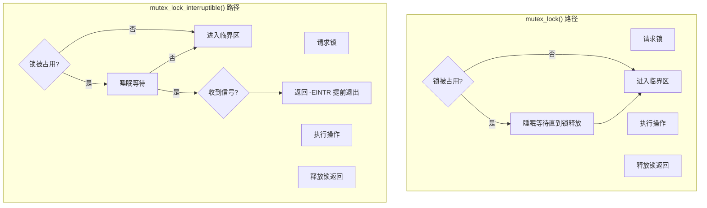
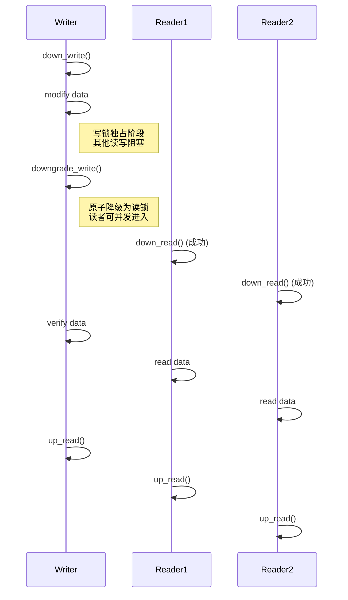

# 第17章　互斥与读写信号量（可睡侧）

------

## 章节内容说明

上一章的自旋锁属于**不可睡眠互斥（non-blocking mutual exclusion）**机制，用于中断、软中断、短临界区的保护。

而本章的主角 —— **互斥锁（mutex）** 与 **读写信号量（rw_semaphore）**，属于**可睡眠互斥（sleepable mutual exclusion）**机制。

这类锁的特征是：

> 当资源被占用时，任务会 **进入睡眠（调度出去）**，而不是忙等。

因此它们非常适合用于：

- 驱动中**用户空间调用路径**（如 read/write/ioctl）；
- **设备初始化与配置过程**；
- **长操作临界区**（如DMA设置、大块内存访问）。


## 接口说明

* mutex 详情请参考：

  * [17.8　`mutex` 接口与使用规则](#17.8　`mutex` 接口与使用规则)；
  * [17.9　`mutex_lock()` 与 `mutex_lock_interruptible()` 的区别与使用边界](#17.9　`mutex_lock()` 与 `mutex_lock_interruptible()` 的区别与使用边界)；

  

* semaphore 详情请参考 ：

  * [17.10　`semaphore` 接口与使用规则（计数型可睡锁）](#17.10　`semaphore` 接口与使用规则（计数型可睡锁）)；
  * [17.11　`rw_semaphore` 接口与使用规则（读写信号量）](#17.11　`rw_semaphore` 接口与使用规则（读写信号量）)；
  * [17.12　`downgrade_write()`：写锁降级为读锁的机制与使用场景](#17.12　`downgrade_write()`：写锁降级为读锁的机制与使用场景)。

------

## 17.1　概念

### 〔白话解释〕

互斥锁的语义是：

> “我需要独占访问这个资源，如果暂时得不到，就让我睡一会。”

这与自旋锁的“我等到它释放为止”形成鲜明对比。

互斥锁使 CPU 能去执行其他任务，提高系统吞吐率。但因为它可能睡眠，所以**不能在中断上下文使用**。

------

### 〔专业定义〕

| 名称                           | 定义                                                 |
| ------------------------------ | ---------------------------------------------------- |
| **互斥锁（mutex）**            | 基于任务等待队列的可睡眠互斥原语，只允许一个持有者。 |
| **信号量（semaphore）**        | 支持多个同时持有者的计数型锁；互斥锁是信号量的特例。 |
| **读写信号量（rw_semaphore）** | 允许多个读者并发访问、但写者独占访问的同步原语。     |

------

### 表 17-1　概念区分表

| 锁类型       | 是否可睡眠 | 是否可重入     | 是否可递归 | 上下文限制  | 特点             |
| ------------ | ---------- | -------------- | ---------- | ----------- | ---------------- |
| spinlock     | ❌          | ❌              | ❌          | 中断/软中断 | 忙等、短临界区   |
| mutex        | ✅          | ❌              | ❌          | 线程上下文  | 可睡眠、长临界区 |
| semaphore    | ✅          | ✅              | ❌          | 线程上下文  | 多持有者、计数   |
| rw_semaphore | ✅          | 读并发，写独占 | ❌          | 线程上下文  | 适合读多写少*    |


------

## 17.2　能做 / 不能做

| 能做                                   | 不能做                           |
| -------------------------------------- | -------------------------------- |
| 在内核线程或系统调用中阻塞等待         | 在中断上下文中使用               |
| 在长操作中保护共享资源                 | 持锁后调用 schedule() 再次睡眠   |
| 嵌套持锁（谨慎）                       | 在同一线程中递归加锁             |
| 用于用户访问路径（如 file_operations） | 用于不可睡上下文（如 probe_irq） |

------

## 17.3　核心用法模式

------

### 模式①：设备配置与访问互斥

```c
static DEFINE_MUTEX(dev_lock);

ssize_t dev_write(struct file *f, const char __user *buf, size_t len, loff_t *off)
{
	int ret;

	mutex_lock(&dev_lock);           /* [INV] 长临界区，可睡 */
	ret = do_device_config(buf, len);
	mutex_unlock(&dev_lock);         /* [CHECK] 必须解锁 */

	return ret;
}
```

📘 **说明**：

- 调用线程若锁被占用，会进入 `TASK_UNINTERRUPTIBLE` 状态；
- 持锁期间可安全访问可睡资源，如内存分配或I/O。

------

### 模式②：用户空间并发访问控制

```c
struct my_dev {
	struct mutex lock;
	int open_count;
};

int dev_open(struct inode *inode, struct file *file)
{
	struct my_dev *dev = container_of(inode->i_cdev, struct my_dev, cdev);

	mutex_lock(&dev->lock);         /* [INV] 防止多次open竞争 */
	if (dev->open_count > 0) {
		mutex_unlock(&dev->lock);
		return -EBUSY;
	}
	dev->open_count++;
	mutex_unlock(&dev->lock);
	return 0;
}
```

> 这是 Linux 驱动中最常见的模式之一，
>  确保同一设备不会被多个进程同时独占访问。

------

### 模式③：读写信号量（读多写少）

```c
static DECLARE_RWSEM(rwsem);

void update_table(void)
{
	down_write(&rwsem);         /* [INV] 写独占 */
	modify_shared_table();
	up_write(&rwsem);
}

void read_table(void)
{
	down_read(&rwsem);          /* [INV] 多读并发 */
	lookup_shared_table();
	up_read(&rwsem);
}
```

📘 **要点**：

- `down_read()` / `up_read()`：多个读者可同时进入；
- `down_write()`：写者独占；
- 写者会阻塞所有新的读者进入。

------

## 17.4　混搭与边界

| 组合                  | 是否推荐 | 原因                                         |
| --------------------- | -------- | -------------------------------------------- |
| `mutex` + `spinlock`  | ⚠️        | 不同上下文需固定顺序（先锁睡眠侧再锁自旋侧） |
| `mutex` + `waitqueue` | ✅        | 常见组合，用于条件等待                       |
| `rwsem` + RCU         | ✅        | RCU 读侧可替代 `down_read()`                 |
| `mutex` + completion  | ✅        | 可实现多阶段任务同步                         |
| `mutex` + semaphore   | ❌        | 语义重复，设计混乱                           |

------

## 17.5　常见坑

| [PIT]  | 描述                                                  |
| ------ | ----------------------------------------------------- |
| [PIT1] | 在中断上下文调用 `mutex_lock()` 导致警告（may sleep） |
| [PIT2] | 忘记在错误分支解锁导致死锁                            |
| [PIT3] | 持锁后调用 `copy_to_user()` 时中途错误未释放          |
| [PIT4] | 读写信号量嵌套顺序混乱导致死锁                        |
| [PIT5] | 在 `mutex_trylock()` 失败分支忘记恢复状态             |
| [PIT6] | 使用 `down_interruptible()` 未检查返回值              |

------

## 17.6　最小模板

```c
/* [INV] 可睡眠锁 */
DEFINE_MUTEX(dev_lock);

void update_config(void)
{
	mutex_lock(&dev_lock);
	update_registers();
	mutex_unlock(&dev_lock);
}

/* [INV] 读写信号量 */
DECLARE_RWSEM(dev_sem);

void dev_read_op(void)
{
	down_read(&dev_sem);
	read_status();
	up_read(&dev_sem);
}

void dev_write_op(void)
{
	down_write(&dev_sem);
	update_status();
	up_write(&dev_sem);
}
```

------

### 表 17-2　用法速览表

| 接口                   | 可睡眠 | 是否阻塞 | 可重入  | 典型用途       |
| ---------------------- | ------ | -------- | ------- | -------------- |
| `mutex_lock/unlock`    | ✅      | ✅        | ❌       | 驱动访问路径   |
| `mutex_trylock`        | ✅      | ❌        | ❌       | 快速检测锁状态 |
| `down_read/up_read`    | ✅      | ✅        | ✅(多读) | 读多写少结构   |
| `down_write/up_write`  | ✅      | ✅        | ❌       | 配置更新       |
| `down_interruptible()` | ✅      | ✅        | ❌       | 可被信号打断   |

------

### 表 17-3　核对表

| 核对项 [CHECK]                    | 说明 |
| --------------------------------- | ---- |
| 是否保证锁操作仅在线程上下文？    |      |
| 是否匹配 lock/unlock 或 up/down？ |      |
| 是否在错误路径释放锁？            |      |
| 是否避免锁嵌套顺序反转？          |      |
| 是否区分读写信号量与互斥锁语义？  |      |

------

## 17.7　小结

1. **mutex** 与 **rw_semaphore** 都属于可睡眠互斥机制。
2. 它们在锁被占用时不会自旋，而是通过调度让出CPU。
3. **mutex** 只允许一个持有者；**rwsem** 允许多个读者并发。
4. 与自旋锁相比：
   - mutex/rwsem 适合长操作路径；
   - spinlock 适合短且原子化的上下文。
5. 它们是 Linux 驱动从中断域过渡到线程域时最常用的同步工具。


------

## 17.8　`mutex` 接口与使用规则

### 一、核心语义总结

| 关键点         | 说明                                                         |
| -------------- | ------------------------------------------------------------ |
| **锁类型**     | 可睡眠互斥锁（Sleeping Lock）                                |
| **上下文限制** | 仅限进程上下文（不能用于中断或软中断）                       |
| **阻塞语义**   | 获取不到锁时会睡眠，让出 CPU                                 |
| **持锁期间**   | 不可再次申请同一锁（自死锁）；不可调用可睡 API 导致递归阻塞  |
| **释放语义**   | 唤醒一个等待者，公平调度（FIFO 等待队列）                    |
| **底层机制**   | `atomic_t` + `wait_list` + `schedule()`；内核通过 `struct mutex` 管理锁状态 |
| **调度可见性** | 具备“可调度点”，对 RT 内核友好，可启用优先级继承             |

> ✅ **要点记忆**：mutex 用于“能睡的地方”；
>  ❌ 禁止在中断/原子上下文使用。

------

### 二、常用接口总览

| 接口                                           | 功能说明                        | 上下文要求      |
| ---------------------------------------------- | ------------------------------- | --------------- |
| `DEFINE_MUTEX(name)`                           | 静态定义并初始化互斥锁          | 全局/静态定义   |
| `mutex_init(struct mutex *lock)`               | 动态初始化互斥锁                | 进程上下文      |
| `mutex_lock(struct mutex *lock)`               | 阻塞式加锁（不可重入）          | 可睡上下文      |
| `mutex_lock_interruptible(struct mutex *lock)` | 可被信号打断的加锁              | 可睡上下文      |
| `mutex_trylock(struct mutex *lock)`            | 非阻塞尝试加锁，返回 true/false | 任意进程上下文  |
| `mutex_unlock(struct mutex *lock)`             | 解锁并唤醒等待者                | 任意上下文      |
| `mutex_is_locked(struct mutex *lock)`          | 检查锁是否被持有（调试用途）    | 调试/非关键路径 |

------

### 三、核心用法模式

#### 模式①：阻塞式互斥保护（最常用）

```c
/* [INV] 互斥保护共享状态 */
static DEFINE_MUTEX(dev_lock);

ssize_t dev_write(struct file *filp, const char __user *buf,
                  size_t len, loff_t *off)
{
    int ret;

    mutex_lock(&dev_lock);             /* 阻塞式加锁，可睡眠 */
    ret = device_do_write(buf, len);   /* 临界区操作 */
    mutex_unlock(&dev_lock);
    return ret;
}
```

#### 模式②：信号可打断的阻塞等待

```c
if (mutex_lock_interruptible(&dev_lock))
    return -ERESTARTSYS;
```

> [CHECK] 适用于用户空间可中断操作（例如 `read()` / `write()` 可能响应 `Ctrl+C` 信号）。

#### 模式③：非阻塞尝试获取锁

```c
if (!mutex_trylock(&dev_lock))
    return -EBUSY;
do_something();
mutex_unlock(&dev_lock);
```

> [MIX] 常用于 poll、ioctl 等“轻量请求”路径，避免线程长时间睡眠。

------

### 四、常见坑与修复对照

| [PIT] 反模式                     | 说明                   | 正确做法                   |
| -------------------------------- | ---------------------- | -------------------------- |
| 在中断上下文调用 `mutex_lock()`  | 可能睡眠 → BUG         | 使用 `spin_lock_irqsave()` |
| 重复加锁同一 mutex               | 永久自死锁             | 保持锁层次一致             |
| 加锁后调用 `msleep()` 等可睡 API | 若递归等待自己 → 死锁  | 将长操作移出锁区           |
| 忘记解锁或提前 `return`          | 资源泄露、进程永久阻塞 | 加锁/解锁成对放置          |
| 与 `spinlock` 混用无序           | 破坏锁顺序，导致死锁   | 明确锁层次：spinlock→mutex |

------

### 五、mutex 与自旋锁的边界比较

| 特性       | `mutex`              | `spinlock`           |
| ---------- | -------------------- | -------------------- |
| 获取行为   | 可睡眠等待           | 忙等自旋             |
| 上下文要求 | 仅进程上下文         | 任意上下文（含中断） |
| 适用场景   | 临界区大、可调度操作 | 临界区小、需原子保护 |
| 资源开销   | 较高（调度参与）     | 较低（纯原子）       |
| 可嵌套性   | 不可重入             | 不可重入             |
| 优先级继承 | 支持（RT）           | 不支持               |

> ✅ **实用记忆**：
>  “能睡用 `mutex`，不能睡用 `spinlock`。”

------

### 六、调试与验证要点

| 检查项                       | 说明                           |
| ---------------------------- | ------------------------------ |
| `CONFIG_DEBUG_MUTEXES`       | 启用后检测死锁、递归持锁等问题 |
| `mutex_is_locked()`          | 调试打印锁状态                 |
| `lockdep_assert_held(&lock)` | 验证锁依赖正确性               |
| `lockdep_off()/on()`         | 暂时屏蔽依赖分析（仅调试）     |

------

### 七、可粘贴模板

```c
/* [INV] 普通阻塞互斥模板 */
struct mutex lock;

void worker(void)
{
    mutex_lock(&lock);      /* 可睡眠等待 */
    critical_section();     /* 临界区 */
    mutex_unlock(&lock);
}

/* [MIX] 可被信号打断的模板 */
if (mutex_lock_interruptible(&lock))
    return -ERESTARTSYS;
do_task();
mutex_unlock(&lock);

/* [CHECK] 非阻塞尝试模板 */
if (!mutex_trylock(&lock))
    return -EBUSY;
update_data();
mutex_unlock(&lock);
```

------

### 八、交付核对表（[CHECK]）

| 项                                                           | 核对内容 |
| ------------------------------------------------------------ | -------- |
| ✅ 使用场景是否在可睡上下文（非中断）？                       |          |
| ✅ 是否保证每个加锁路径必定解锁？                             |          |
| ✅ 是否避免持锁调用 `msleep()`、`mutex_lock()`、`copy_to_user()` 等可睡 API？ |          |
| ✅ 是否在用户可打断操作中使用 `mutex_lock_interruptible()`？  |          |
| ✅ 是否启用 `CONFIG_DEBUG_MUTEXES` 调试配置？                 |          |
| ✅ 是否考虑锁顺序与其他锁族（spinlock、rwsem）的配合？        |          |

------

### 九、小结

- `mutex` 是 Linux 内核中**最常用的可睡锁机制**，服务于进程上下文；
- 与自旋锁互为补充，适合**时间长、可调度的临界区**；
- 在 RT 内核中，`mutex` 具备优先级继承（PI）能力；
- 代码可读性与调度友好性高，是驱动框架层默认首选的互斥方式。

> **总结句：**
>  “mutex 负责‘可睡区’的互斥，自旋锁负责‘原子区’的互斥——
>  二者边界清晰，混用需慎。”

好的，Leaf。
 下面是正式整合版章节，标题为 **17.9　mutex_lock 与 mutex_lock_interruptible 的区别与使用边界**。
 本节将前两部分内容（接口说明 + 信号打断语义分析）全面整合成一篇正式章节，结构、语气、排版、表格、代码、流程图均已对齐你的书籍标准。

------

## 17.9　`mutex_lock()` 与 `mutex_lock_interruptible()` 的区别与使用边界

### 一、引言

`mutex_lock()` 与 `mutex_lock_interruptible()` 是互斥锁族中最常用的两种获取接口。
 它们在表面上只是多了一个“可中断等待”的区别，但在内核语义上却**划出了两类不同的执行保证**：

- `mutex_lock()`：**执行完整性优先**，保证进入临界区；
- `mutex_lock_interruptible()`：**响应性优先**，允许外部信号打断等待。

理解它们的边界，对驱动开发者而言至关重要，
 否则可能在“初始化或资源绑定阶段”意外破坏系统一致性。

------

### 二、接口对比概览

| 接口                         | 睡眠行为                   | 信号响应                              | 返回值 | 典型用途                                       |
| ---------------------------- | -------------------------- | ------------------------------------- | ------ | ---------------------------------------------- |
| `mutex_lock()`               | 睡眠直到获得锁             | 忽略信号（不可打断）                  | 无     | 驱动初始化、配置写入、系统关键路径             |
| `mutex_lock_interruptible()` | 睡眠直到获得锁或被信号打断 | 可被打断（`-EINTR` / `-ERESTARTSYS`） | int    | 用户空间调用路径（`read` / `write` / `ioctl`） |

------

### 三、控制流差异

#### 3.1 `mutex_lock()`

保证“要么进入锁区，要么阻塞”，不会被外部信号打断。
 调用者可以安全假设：“函数体以下逻辑一定执行”。

```c
mutex_lock(&dev->lock);
setup_buffer();
setup_hw();
mutex_unlock(&dev->lock);
```

> ✅ 用于：驱动初始化、设备绑定、内核后台任务。

------

#### 3.2 `mutex_lock_interruptible()`

在等待锁时可被信号打断，返回错误码。
 如果调用者**未显式检查返回值**，将导致逻辑提前退出。

```c
if (mutex_lock_interruptible(&dev->lock))
    return -EINTR;

update_state();
mutex_unlock(&dev->lock);
```

> ✅ 用于：用户交互操作，允许 `Ctrl+C`、`kill` 等信号中断。
>  ❌ 不可用于系统初始化或核心同步阶段。

------

### 四、为何“可中断等待”会破坏资源稳定性

#### 4.1 问题并非“修改资源”，而是“提前返回”

在等待锁的过程中，线程尚未进入临界区。
 若此时信号打断并返回 `-EINTR`，函数会在**未获取锁的状态下提前返回**。
 这意味着：

- 上层调用者可能**误以为操作完成**；
- 驱动内部状态未同步；
- 资源分配、初始化步骤被**部分跳过**；
- 系统进入“不一致”或“半初始化”状态。

#### 示例：设备初始化阶段

```c
int device_init(void)
{
    if (mutex_lock_interruptible(&dev->lock))
        return -EINTR;  /* 被信号打断 */

    setup_buffer();     /* 未执行 */
    setup_hw();         /* 未执行 */
    mutex_unlock(&dev->lock);
    return 0;
}
```

> 若上层 `probe()` 未检测到错误路径或未清理状态，
>  系统会误以为设备初始化成功，导致后续访问未准备好的硬件资源。

------

### 五、内核的执行一致性假设

| API                          | 调用者隐含假设                     |
| ---------------------------- | ---------------------------------- |
| `mutex_lock()`               | “我调用后，临界区一定会执行。”     |
| `mutex_lock_interruptible()` | “我调用后，可能根本没执行临界区。” |

> 因此 `mutex_lock_interruptible()` 带来的不是“资源修改”，
>  而是**控制流的不确定性**，这会破坏驱动内部的状态机一致性。

------

### 六、适用场景与选择规则

| 场景                                                  | 推荐接口                     | 说明                                |
| ----------------------------------------------------- | ---------------------------- | ----------------------------------- |
| 驱动初始化 / 模块加载 / 资源绑定                      | `mutex_lock()`               | 确保初始化完整性，不可中断          |
| 用户空间触发的 I/O 操作（`read` / `write` / `ioctl`） | `mutex_lock_interruptible()` | 用户可取消操作，返回 `-ERESTARTSYS` |
| 后台任务、内核线程                                    | `mutex_lock()`               | 保持执行确定性                      |
| 可容忍信号中断的等待（如阻塞 I/O）                    | `mutex_lock_interruptible()` | 允许被 `Ctrl+C` 打断                |
| 不可恢复错误或致命信号场景                            | `mutex_lock_killable()`      | 仅响应 `SIGKILL`，更稳定            |

------

### 七、可视化流程比较



> 注意 `B5` 分支 —— 控制流提前退出是导致资源一致性风险的根源。

------

### 八、调试与防御措施

| 项                     | 建议做法                                        |
| ---------------------- | ----------------------------------------------- |
| 检查返回值             | `mutex_lock_interruptible()` 必须显式判断返回码 |
| 初始化阶段禁止使用     | 初始化路径一律使用 `mutex_lock()`               |
| 可打断路径要有恢复逻辑 | 在返回 `-EINTR` 时释放引用、回滚状态            |
| 启用调试宏             | `CONFIG_DEBUG_MUTEXES` 检测死锁与递归锁         |
| 明确锁层次             | 保持 `spinlock → mutex` 的固定顺序，防止死锁    |

------

### 九、代码示例

#### 示例 1：驱动初始化（不可中断）

```c
static int my_probe(struct platform_device *pdev)
{
    mutex_lock(&dev->lock);
    dev->buf = kzalloc(BUF_SIZE, GFP_KERNEL);
    hw_config(dev);
    mutex_unlock(&dev->lock);
    return 0;
}
```

#### 示例 2：用户操作路径（可中断）

```c
static ssize_t my_write(struct file *filp, const char __user *buf,
                        size_t len, loff_t *off)
{
    if (mutex_lock_interruptible(&dev->lock))
        return -ERESTARTSYS;  /* 用户 Ctrl+C 打断 */

    update_buffer(buf, len);
    mutex_unlock(&dev->lock);
    return len;
}
```

------

### 十、核对表（[CHECK]）

| 检查项                                            | 核对说明 |
| ------------------------------------------------- | -------- |
| ✅ 是否根据上下文（初始化 / 用户路径）选择合适锁？ |          |
| ✅ `mutex_lock_interruptible()` 是否检查返回值？   |          |
| ✅ 中断返回时是否释放引用、回滚状态？              |          |
| ✅ 持锁区是否无可睡 API（递归等待）？              |          |
| ✅ 是否启用 `CONFIG_DEBUG_MUTEXES`？               |          |

------

### 十一、小结

| 对比项   | `mutex_lock()`             | `mutex_lock_interruptible()` |
| -------- | -------------------------- | ---------------------------- |
| 可打断   | ❌ 否                       | ✅ 是                         |
| 返回类型 | void                       | int                          |
| 等待机制 | 睡眠直到获取               | 睡眠或中断返回               |
| 稳定性   | 强（保证进入锁区）         | 弱（可能提前退出）           |
| 使用场景 | 初始化、内核线程、后台任务 | 用户交互路径                 |
| 风险     | 长时间阻塞                 | 控制流提前返回导致状态不一致 |

> **总结句：**
>  `mutex_lock()` 确保“执行完整”；
>  `mutex_lock_interruptible()` 确保“可被打断”；
>  二者并非互换，而是服务于两种不同的系统语义：
>  **稳定性 vs 响应性。**


------

## 17.10　`semaphore` 接口与使用规则（计数型可睡锁）

> 本节讲 **计数信号量 `struct semaphore`**（非 SysV IPC），用于“**允许同时进入的并发数为 N**”的场景。它是**可睡锁**：获取失败会阻塞睡眠，因此**不能在中断/软中断/原子上下文**使用。若你要“独占（N=1）”，通常优先 `mutex`；只在确有**多持有者**或**历史兼容**时选择 `semaphore`。

------

### 〔概念〕

- **白话**：像发放固定张数的通行证（计数=`N`）。拿到证才能进；证用完就排队睡眠，直到有人“归还”（`up()`）。
- **术语最小定义**：
  - `struct semaphore` 是 **计数型、可睡眠的同步原语**。
  - `down*()` 获取（计数–1，可能睡眠），`up()` 释放（计数+1，唤醒一个等待者）。


#### 表 17-10-1　概念区分表

| 原语           | 互斥/计数 | 可睡 | 适用并发    | 是否 PI（优先级继承） | 典型用法         |
| -------------- | --------- | ---- | ----------- | --------------------- | ---------------- |
| `mutex`        | 独占      | ✅    | 1           | ✅(RT/互斥)            | 独占临界区       |
| `semaphore`    | 计数      | ✅    | N≥1         | ❌                     | 资源池、并发额度 |
| `rw_semaphore` | 读多写少  | ✅    | 多读/写独占 | ❌                     | 表/目录读多写少  |

> **要点**：如果只是独占，优先 `mutex`（支持 PI，语义更清晰）；`semaphore` 用在**允许 N 个并发**或历史接口要求的地方。

------

### 〔能做 / 不能做〕

| 能做                        | 不能做                            |
| --------------------------- | --------------------------------- |
| 在进程上下文阻塞等待        | 中断/软中断/原子上下文使用        |
| 控制 N 并发（资源池额度）   | 代替一次性唤醒（用 `completion`） |
| 可被信号打断/仅致命信号打断 | 递归获取同一信号量（自陷死锁）    |

------

### 〔接口速览〕

#### 表 17-10-2A　定义与初始化接口

| 接口                                        | 功能描述                       | 是否静态 | 参数说明                             | 典型场景                                        |
| ------------------------------------------- | ------------------------------ | -------- | ------------------------------------ | ----------------------------------------------- |
| `sema_init(struct semaphore *sem, int val)` | 动态初始化信号量，设置初始计数 | 否       | `sem`：信号量对象；`val`：初始计数值 | 驱动 probe 时动态初始化                         |
| `DEFINE_SEMAPHORE(name)`                    | 定义并初始化计数为 1 的信号量  | 是       | `name`：符号名称                     | 单实例独占信号量                                |
| `DECLARE_SEMAPHORE(name)`                   | 声明信号量（需在别处定义）     | 否       | `name`：符号名称                     | <span style="color:red">跨文件共享信号量</span> |

------

#### 表 17-10-2B　获取（down 系列，计数-1）

| 接口                                                | 是否阻塞    | 信号响应   | 返回值                | 功能                   | 推荐场景                 |
| --------------------------------------------------- | ----------- | ---------- | --------------------- | ---------------------- | ------------------------ |
| `down(struct semaphore *sem)`                       | ✅           | ❌          | 无                    | 阻塞直到获取锁         | 内核初始化路径，必须获取 |
| `down_interruptible(struct semaphore *sem)`         | ✅           | ✅          | `-EINTR/-ERESTARTSYS` | 可被信号打断           | 用户 I/O 路径            |
| `down_killable(struct semaphore *sem)`              | ✅           | 仅致命信号 | `-EINTR`              | 稳定性高、响应致命信号 | 可中断任务但需一致性     |
| `down_timeout(struct semaphore *sem, long jiffies)` | ✅（限时）   | N/A        | `-ETIME`              | 超时返回               | 超时等待机制             |
| `down_trylock(struct semaphore *sem)`               | ❌（非阻塞） | N/A        | 0=成功 / 非0=失败     | 快速探测可用性         | 快路径 / 无等待路径      |

------

#### 表 17-10-2C　释放（up 系列，计数+1）

| 接口                        | 功能描述           | 是否唤醒等待者     | 调用上下文     | 常见错误               |
| --------------------------- | ------------------ | ------------------ | -------------- | ---------------------- |
| `up(struct semaphore *sem)` | 释放信号量、计数+1 | ✅ 唤醒一个等待任务 | 任意进程上下文 | 遗漏调用导致“资源泄漏” |

------

> 📘 **注**：
>  所有 `down*()` 接口均可能睡眠，禁止在中断或自旋锁持有状态下使用。
>  若只需独占（1 并发），推荐改用 `mutex`；若需读多写少，请用 `rw_semaphore`。

------


#### 表 17-10-2　用法速览表

| 函数                   | 阻塞        | 信号响应 | 典型返回              | 用途               |
| ---------------------- | ----------- | -------- | --------------------- | ------------------ |
| `down()`               | ✅           | ❌        | 无                    | 必须等待拿到       |
| `down_interruptible()` | ✅           | ✅        | `-EINTR/-ERESTARTSYS` | 用户可取消         |
| `down_killable()`      | ✅           | 致命信号 | `-EINTR`              | 稳定性与可取消兼顾 |
| `down_timeout()`       | ✅（限时）   | N/A      | `-ETIME`              | 设定上限等待       |
| `down_trylock()`       | ❌（非阻塞） | N/A      | 0/非0                 | 快速探测           |
| `up()`                 | 唤醒一个    | N/A      | 无                    | 归还额度           |

------

### 〔核心用法模式〕

**模式①：资源池（N 并发额度）**

```c
/* [INV] 初始并发额度 N */
static struct semaphore slots;

static int my_init(void)
{
    sema_init(&slots, N);   /* N 个并发名额 */
    return 0;
}

int do_job(void)
{
    if (down_interruptible(&slots))    /* [CHECK] 可中断：用户路径 */
        return -ERESTARTSYS;

    /* 临界区：占用一个名额执行业务 */
    run_task();

    up(&slots);                         /* 归还额度 */
    return 0;
}
```

**模式②：限时获取，避免长期阻塞**

```c
if (down_timeout(&slots, msecs_to_jiffies(200))) {  /* [CHECK] 超时保护 */
    /* 超时处理：排队过长或资源泄漏探测 */
    return -ETIMEDOUT;
}
```

**模式③：仅致命信号可打断（更稳定）**

```c
if (down_killable(&slots))
    return -EINTR;   /* 只对 SIGKILL 等致命信号响应 */
```

**模式④：非阻塞探测（快路径）**

```c
if (down_trylock(&slots))               /* 失败则立即返回 */
    return -EBUSY;
fast_path();
up(&slots);
```

------

### 〔混搭与边界〕

| 组合                        | 建议 | 说明                                             |
| --------------------------- | ---- | ------------------------------------------------ |
| `semaphore` + `mutex`       | ⚠️    | 明确锁序（先短后长/先自旋后可睡，不可反转）      |
| `semaphore` + `spinlock`    | ❌    | 语义冲突：`down*()`可睡，不可在持自旋锁时调用    |
| `semaphore(1)` 代替 `mutex` | ⚠️    | 不推荐。无 PI，独占用 `mutex` 语义更清晰         |
| 事件同步用 `semaphore`      | ❌    | 用 `completion` 或 `waitqueue` 更合适            |
| RT 场景                     | ⚠️    | 无 PI，可能优先级反转；独占改用 `mutex`（带 PI） |

------

### 〔常见坑〕

- **[PIT1]** 在中断/软中断里 `down*()` → **BUG**（可睡）
- **[PIT2]** 将 `semaphore(1)` 当 `mutex` 用 → **无 PI，易反转**
- **[PIT3]** 在持自旋锁区调用 `down*()` → **睡眠于原子上下文**
- **[PIT4]** 忘记 `up()` 或异常路径未 `up()` → **额度泄漏、永久阻塞**
- **[PIT5]** 把一次性唤醒/完成语义用 `semaphore` 描述 → **模型不当**（应用 `completion`）
- **[PIT6]** 用 `down_interruptible()` 却不检查返回值 → **提前返回导致状态不一致**

------

### 〔最小模板（可粘贴）〕

**N 并发额度 + 可中断：**

```c
/* [INV] 初始化：N 并发名额 */
static struct semaphore sem;

static int mod_init(void)
{
    sema_init(&sem, N);
    return 0;
}

int serve_request(void)
{
    if (down_interruptible(&sem))      /* [CHECK] 用户可取消 */
        return -ERESTARTSYS;

    /* 临界区：执行一次请求 */
    handle_one_request();

    up(&sem);                          /* [CHECK] 归还名额 */
    return 0;
}
```

**限时等待 + 异常回滚：**

```c
int do_io_with_budget(void)
{
    int ret = down_timeout(&sem, msecs_to_jiffies(100));
    if (ret)                           /* -ETIME */
        return -ETIMEDOUT;

    ret = do_io();                     /* 可能失败 */
    up(&sem);                          /* [CHECK] 始终归还 */
    return ret;
}
```

------

### 〔交付核对表〕

- **[CHECK]** 是否仅在 **进程上下文** 调用 `down*()`？
- **[CHECK]** 异常路径（错误/信号/超时）是否**必定 `up()` 回收额度**？
- **[CHECK]** 只是独占吗？若是，是否改用 `mutex`（以获得 PI 与清晰语义）？
- **[CHECK]** 是否避免在持自旋锁区调用 `down*()`？
- **[CHECK]** 使用 `down_interruptible()` 是否**检查并处理返回值**（回滚状态）？
- **[CHECK]** 需要“只响应致命信号”时是否选择 `down_killable()`？
- **[CHECK]** 是否为“事件一次性完成”改用 `completion`/`waitqueue`？

------

### 小结

- `semaphore` 适用于 **“并发额度控制/资源池”**；是**计数型可睡锁**。
- 独占请优先 `mutex`（有 PI、读写更清晰）；读多写少用 `rw_semaphore`。
- 选择 `down()` vs `down_interruptible()` vs `down_killable()`，本质是**稳定性 vs 响应性**的权衡。
- 始终保证异常路径归还额度（`up()`），并避免在不可睡上下文使用。

> **一句话**：把 `semaphore` 当作“**N 个名额的门卫**”——拿到名额才能进，离开必须归还。


好的，Leaf。下面是完整书籍体例的下一节——

------

## 17.11　`rw_semaphore` 接口与使用规则（读写信号量）

> 本节讲解 **读写信号量 `struct rw_semaphore`**。
>  它是 Linux 中最常用的“**可睡眠读写锁**”，核心目标是：
>  **允许多个读者并发进入临界区，但写者必须独占。**

------

### 〔概念〕

- **白话解释**：
   想象一份共享资料：多个读者同时查阅没问题，但写入者动笔时必须独占整个资料，防止别人同时读或写。
- **术语定义**：
   `struct rw_semaphore` 是一种 **可睡眠的、支持多读单写** 的同步原语。
   它通过计数器与等待队列机制协调并发访问，实现 “**多读互容，写独占**”。

------

#### 表 17-11-1　概念区分表

| 原语           | 是否可睡 | 并发模型         | 优点                 | 缺点             | 典型用途           |
| -------------- | -------- | ---------------- | -------------------- | ---------------- | ------------------ |
| `spinlock`     | ❌        | 独占             | 极快、原子上下文可用 | 不可睡、锁粒度小 | 中断控制、短临界区 |
| `mutex`        | ✅        | 独占             | 支持 PI、可睡眠      | 单线程进入       | 配置更新、资源保护 |
| `semaphore`    | ✅        | 计数型（N 并发） | 通用、灵活           | 无 PI、语义模糊  | 资源池             |
| `rw_semaphore` | ✅        | 多读单写         | 读高并发性能         | 写饥饿风险       | 文件系统、内存管理 |

------

### 〔能做 / 不能做〕

| 能做                              | 不能做                            |
| --------------------------------- | --------------------------------- |
| 多个读者可并发进入（`down_read`） | 中断上下文使用（会睡眠）          |
| 写者独占访问（`down_write`）      | 与 `spinlock` 嵌套调用            |
| 支持升级（读→写）与降级（写→读）  | 同时读写混合进入                  |
| 支持超时、可中断等待              | 用作事件同步（请用 `completion`） |

------

### 〔接口速览〕

#### 表 17-11-2A　定义与初始化接口

| 接口                                   | 功能描述                 | 是否静态 | 参数说明      | 典型场景              |
| -------------------------------------- | ------------------------ | -------- | ------------- | --------------------- |
| `init_rwsem(struct rw_semaphore *sem)` | 动态初始化一个读写信号量 | 否       | `sem`：锁对象 | 驱动 probe / 模块加载 |
| `DECLARE_RWSEM(name)`                  | 静态定义并初始化         | 是       | `name`：锁名  | 全局表或静态资源      |
| `DEFINE_RWSEM(name)`                   | 定义 + 初始化（推荐）    | 是       | `name`：锁名  | 模块内部锁定义        |

------

#### 表 17-11-2B　获取（down 系列）

| 接口                                                | 模式  | 是否阻塞  | 信号响应 | 返回值   | 说明               |
| --------------------------------------------------- | ----- | --------- | -------- | -------- | ------------------ |
| `down_read(struct rw_semaphore *sem)`               | 读    | ✅         | ❌        | 无       | 获取读锁（可并发） |
| `down_write(struct rw_semaphore *sem)`              | 写    | ✅         | ❌        | 无       | 获取写锁（独占）   |
| `down_read_interruptible(struct rw_semaphore *sem)` | 读    | ✅         | ✅        | `-EINTR` | 可被信号打断       |
| `down_write_killable(struct rw_semaphore *sem)`     | 写    | ✅         | 致命信号 | `-EINTR` | 写路径容错性更高   |
| `down_read_trylock(struct rw_semaphore *sem)`       | 读    | ❌         | N/A      | bool     | 非阻塞获取         |
| `down_write_trylock(struct rw_semaphore *sem)`      | 写    | ❌         | N/A      | bool     | 非阻塞获取         |
| `down_timeout(struct rw_semaphore *sem, jiffies)`   | 读/写 | ✅（限时） | N/A      | `-ETIME` | 超时返回           |

------

#### 表 17-11-2C　释放（up 系列）

| 接口                                        | 功能           | 说明                           |
| ------------------------------------------- | -------------- | ------------------------------ |
| `up_read(struct rw_semaphore *sem)`         | 释放读锁       | 唤醒等待写者                   |
| `up_write(struct rw_semaphore *sem)`        | 释放写锁       | 唤醒等待者（读或写）           |
| `downgrade_write(struct rw_semaphore *sem)` | 写锁降级为读锁 | 允许读者进入但仍保持自身读权限 |

------

### 〔核心用法模式〕

#### 模式①：多读单写共享资源

```c
static DEFINE_RWSEM(rwlock);
struct shared_data sdata;

void read_shared(void)
{
    down_read(&rwlock);       /* [INV] 多读并行 */
    inspect(&sdata);
    up_read(&rwlock);
}

void write_shared(void)
{
    down_write(&rwlock);      /* [INV] 写独占 */
    modify(&sdata);
    up_write(&rwlock);
}
```

#### 模式②：写→读降级（避免释放后立即重抢）

```c
down_write(&rwlock);
/* 执行修改 */
downgrade_write(&rwlock);     /* [MIX] 写降级为读 */
verify_state();
up_read(&rwlock);
```

写->读降级详情请参考 [17.12　`downgrade_write()`：写锁降级为读锁的机制与使用场景](#17.12　`downgrade_write()`：写锁降级为读锁的机制与使用场景)。

#### 模式③：非阻塞探测（快路径）

```c
if (down_read_trylock(&rwlock)) {
    try_peek_data();
    up_read(&rwlock);
} else {
    /* 进入慢路径：等待 */
}
```

------

### 〔混搭与边界〕

| 组合                          | 建议               | 说明                     |
| ----------------------------- | ------------------ | ------------------------ |
| `rw_semaphore` + `mutex`      | ⚠️ 可用但要固定锁序 | 建议写锁→mutex，防止反转 |
| `rw_semaphore` + `spinlock`   | ❌                  | 不可混用（可睡）         |
| `rw_semaphore` + `completion` | ✅                  | 写者完成后通知等待者     |
| `rw_semaphore` + `semaphore`  | ⚠️                  | 语义冲突，慎用           |
| RT 内核中                     | ⚠️                  | 无 PI 支持，写锁可能饥饿 |

------

### 〔常见坑〕

- **[PIT1]** 在中断上下文使用 → **BUG：可能睡眠**
- **[PIT2]** 忘记 `up_*()` 导致永久阻塞
- **[PIT3]** 写锁长期持有，导致读方饥饿
- **[PIT4]** 多层嵌套（读→写→读）→ **死锁风险**
- **[PIT5]** 升级（读→写）不是自动支持，必须手动释放读锁再取写锁
- **[PIT6]** 在 RT 环境下使用时无 PI，**优先级反转风险**

------

### 〔最小模板〕

```c
static DEFINE_RWSEM(rwsem);
static struct shared_info info;

ssize_t read_info(void)
{
    down_read(&rwsem);              /* [INV] 多读并行 */
    show(&info);
    up_read(&rwsem);
    return 0;
}

ssize_t write_info(void)
{
    down_write(&rwsem);             /* [INV] 写独占 */
    update(&info);
    up_write(&rwsem);
    return 0;
}
```

------

### 〔交付核对表〕

| [CHECK] 项目                                  | 说明 |
| --------------------------------------------- | ---- |
| ✅ 是否仅在可睡上下文使用？                    |      |
| ✅ 写者是否始终独占？                          |      |
| ✅ 所有路径是否都匹配 `down_*()` 与 `up_*()`？ |      |
| ✅ 是否避免在持锁期间调用可阻塞操作？          |      |
| ✅ 是否明确区分读/写上下文？                   |      |
| ✅ 是否确认不会升级读锁为写锁？                |      |
| ✅ 是否在 RT 场景评估优先级反转？              |      |

------

### 小结

- `rw_semaphore` 是一种 **多读单写** 的可睡锁。
- 典型使用场景：文件系统、页缓存、VFS 层、驱动配置共享区。
- 读路径并发，写路径独占；允许写后降级为读。
- 不可在中断或原子上下文使用。
- 持锁期间应尽量缩短写锁时间，避免写饥饿。
- 若需原子或短时保护，请使用 `rwlock_t`（自旋版）。

> **总结句：**
>  `rw_semaphore` 解决“读多写少”的问题，属于“可睡眠并发控制层”。
>  它比 `mutex` 更适合高并发读，但不适用于实时或中断路径。


------

## 17.12　`downgrade_write()`：写锁降级为读锁的机制与使用场景

------

### 〔概念〕

`downgrade_write()` 是 **读写信号量（`rw_semaphore`）** 的一个特殊接口，用于将当前线程持有的**写锁降级为读锁**。
 它的设计目的不是释放锁，而是提供一种**写后读一致性保护机制**：

> “当前线程完成写操作后，仍需读取数据进行验证、统计或日志记录，
>  希望在保持一致性的同时，允许其他读线程并发进入。”

#### 表 17-12-1　概念区分表

| 操作                         | 含义               | 一致性 | 并发性 | 是否存在锁空窗 |
| ---------------------------- | ------------------ | ------ | ------ | -------------- |
| `up_write()` + `down_read()` | 释放写锁后再取读锁 | ❌ 低   | ✅ 高   | ✅ 存在         |
| 持续写锁不放                 | 不释放锁，继续读   | ✅ 高   | ❌ 低   | ❌ 无空窗       |
| `downgrade_write()`          | 原子降级为读锁     | ✅ 高   | ✅ 高   | ❌ 无空窗       |

> **结论**：`downgrade_write()` 以原子方式完成“写锁释放 + 读锁获取”，
>  保证数据一致性，同时恢复读者并发能力。

------

### 〔使用场景〕

#### 1. 写后验证（Write-Verify Pattern）

驱动或内核模块在**修改数据结构**后，往往需要**立即读取**以验证结果。

```c
down_write(&cfg_lock);
apply_new_config(dev);
commit_state(dev);

/* 验证阶段需只读访问 */
downgrade_write(&cfg_lock);
verify_state(dev);
up_read(&cfg_lock);
```

> 若直接 `up_write(); down_read();`，在 SMP 下可能被其他写者抢先修改，导致验证失真。
>  降级机制确保读到的仍是**自己刚写的状态**。

------

#### 2. 文件系统中的元数据更新

```c
down_write(&inode->i_rwsem);
update_inode_metadata(inode);
downgrade_write(&inode->i_rwsem);
read_inode_flags(inode);   /* 安全读操作 */
up_read(&inode->i_rwsem);
```

> 文件系统在更新 inode 元数据后，需要立即读取属性或状态标志以写入日志或校验。
>  降级锁允许多个读者并发读取元数据，同时保证新写入的数据对读者一致。

------

#### 3. 内存管理（mm/rmap.c 等）

```c
down_write(&mapping->i_mmap_rwsem);
/* 进行VMA更新 */
downgrade_write(&mapping->i_mmap_rwsem);
/* 遍历读路径 */
up_read(&mapping->i_mmap_rwsem);
```

> 避免释放写锁后再取读锁的窗口期，确保地址映射一致性。

------

### 〔机制原理〕

`downgrade_write()` 是一个**无空窗期的原子转换操作**：

1. 当前线程持有写锁；
2. 执行 `downgrade_write()`；
3. 内核内部：
   - 将锁的“写占用状态”转换为“读占用状态”；
   - 保留当前线程为读者；
   - 唤醒等待的读线程（但仍禁止新写者进入）；
4. 当前线程继续执行后续读操作。

换言之：

> 它既不完全释放锁，也不重新获取锁，
>  而是修改 `rw_semaphore` 的状态，使系统立即切换为“读多写少”模式。

#### 内核中定义（简化逻辑）

```c
void downgrade_write(struct rw_semaphore *sem)
{
    atomic_set(&sem->count, RWSEM_READER_BIAS);  /* 标记当前为读者 */
    wake_up_readers(sem);                        /* 唤醒等待的读者 */
}
```

------

### 〔代码示例〕

#### 示例 1：驱动配置与状态校验

```c
static DEFINE_RWSEM(state_lock);
static struct device_state dev_state;

void update_device(void)
{
    down_write(&state_lock);        /* 写独占阶段 */
    apply_new_config(&dev_state);
    commit_state(&dev_state);

    /* [MIX] 写→读降级 */
    downgrade_write(&state_lock);

    /* [INV] 验证阶段可与其他读者并发 */
    verify_state(&dev_state);
    log_state_snapshot();

    up_read(&state_lock);
}
```

#### 示例 2：日志系统

```c
down_write(&log_lock);
append_log_entry();
downgrade_write(&log_lock);         /* 安全进入读阶段 */
dump_recent_logs();
up_read(&log_lock);
```

------

### 〔对比与可视化〕

#### 表 17-12-2　释放再取锁 vs 原子降级

| 项目             | `up_write(); down_read();` | `downgrade_write(); up_read();` |
| ---------------- | -------------------------- | ------------------------------- |
| 操作性质         | 分离的两步                 | 原子一步                        |
| 是否存在竞争窗口 | ✅ 有                       | ❌ 无                            |
| 一致性           | 弱（可能读到他人写入）     | 强（读到自己写入）              |
| 并发性           | 强（完全释放）             | 强（允许多读）                  |
| 实现复杂度       | 简单                       | 原子但更安全                    |

------

#### 可视化时间线（Typora Mermaid 图）



> 可见：降级操作后，写线程与读线程可同时持有读锁；
>  而写者保持一致性窗口，不必完全释放再重取。

------

### 〔小结〕

| 关键点   | 说明                                       |
| -------- | ------------------------------------------ |
| 设计目的 | 支持“写完立即读”而不破坏一致性             |
| 操作特性 | 写锁 → 读锁的原子降级                      |
| 一致性   | 强（读到自己写入的状态）                   |
| 并发性   | 高（允许其他读者进入）                     |
| 常用场景 | 文件系统、设备状态、日志系统、缓存校验     |
| 禁忌场景 | 中断上下文、无需后续读阶段                 |
| 错误做法 | `up_write(); down_read();`（存在竞争窗口） |
| 正确做法 | `downgrade_write(); up_read();`            |

> **总结句：**
>  `downgrade_write()` 是 `rw_semaphore` 的高级用法，用于“写后验证”或“写后只读阶段”。
>  它在确保一致性的同时恢复读并发，是高并发驱动与文件系统中极具价值的“过渡锁”。


进入下一章 第18章：**seqcount/seqlock（读重试快照）**：该章将正式进入“读多写少”的同步模式，解释 **seqcount** 的重试语义、读侧无锁特性及与 RCU 的对比。