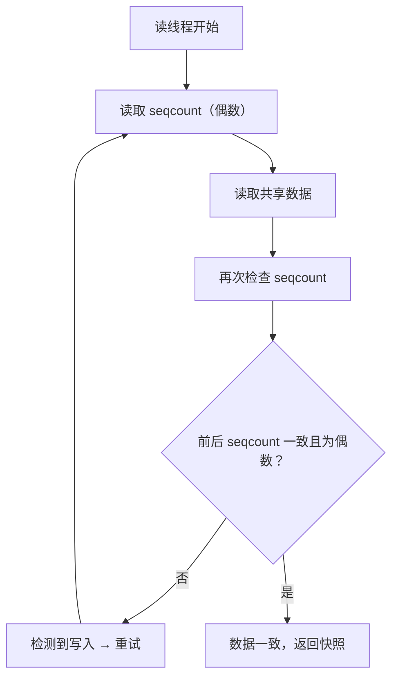
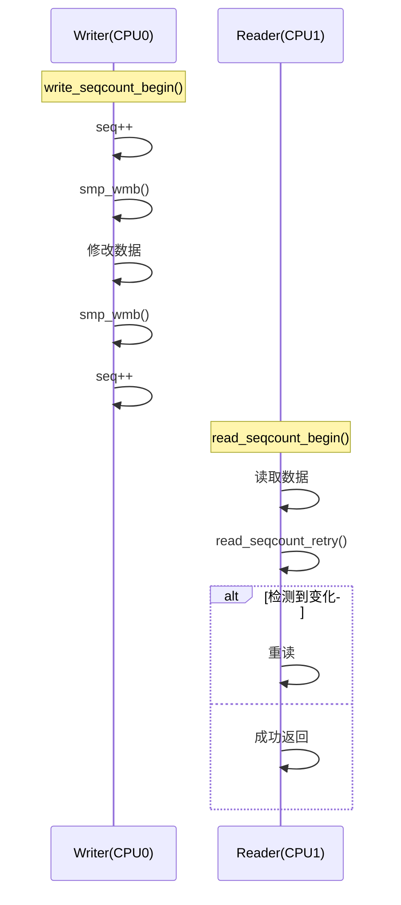
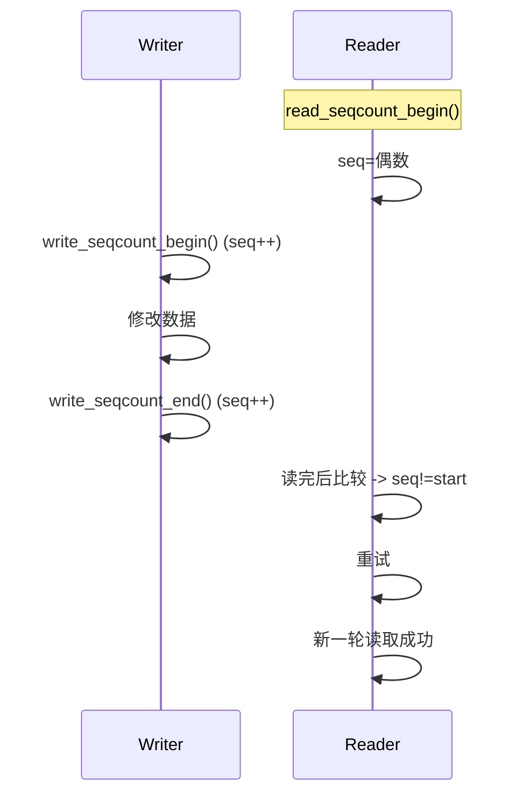
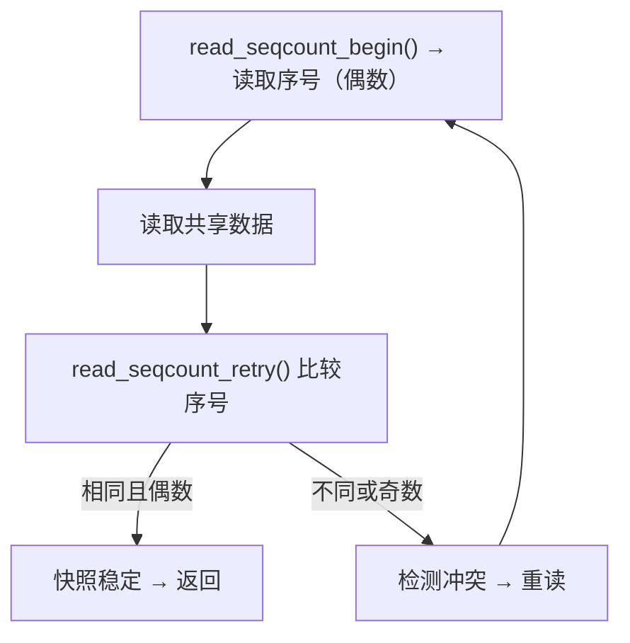
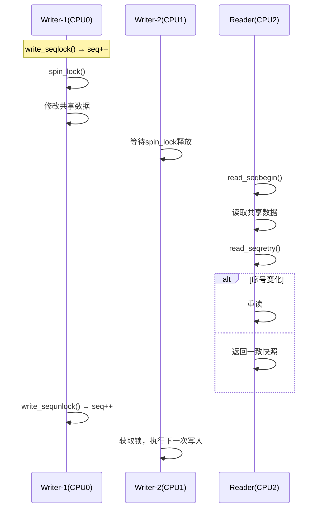
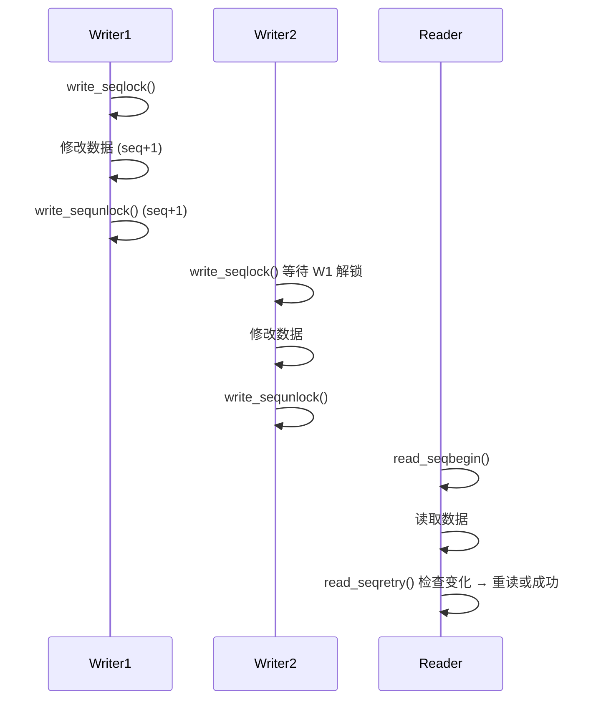
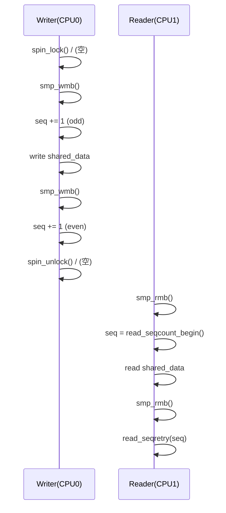
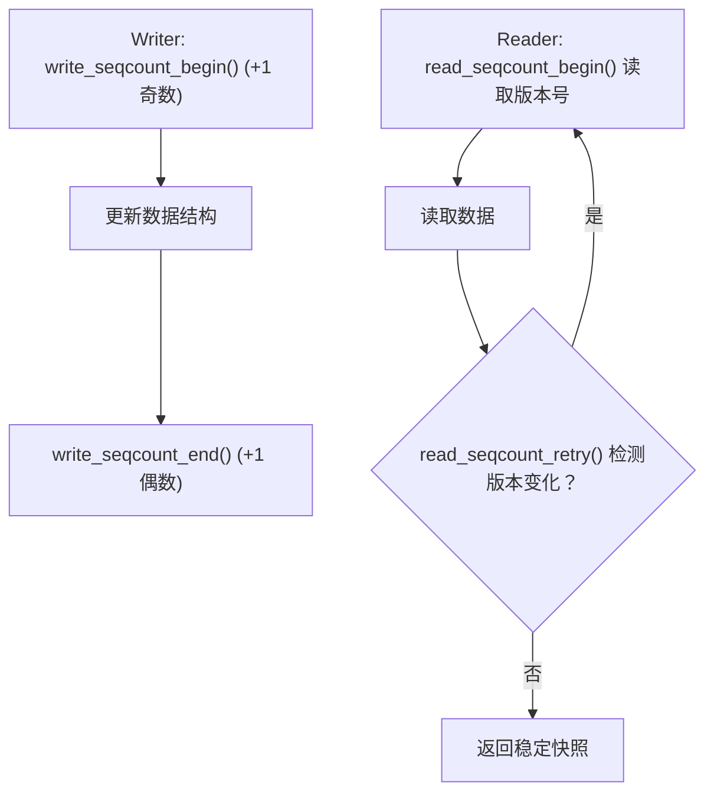
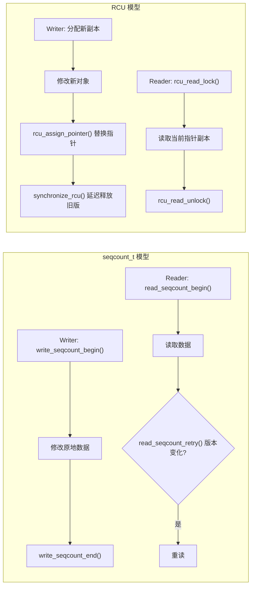

# 第 18 章　`seqcount` / `seqlock`（读重试快照机制）

------

## 章节内容说明

本章介绍 Linux 内核中的 **顺序计数（sequence counter）机制**，
 即 `seqcount_t` 与 `seqlock_t` 的实现与用法。
 它是内核在处理“读多写少”场景下，为追求**高读并发性能**而引入的一种**乐观锁模型**。

本章结构如下：

1. 〔概念〕：解释顺序计数的思想与设计目标。
2. 〔能做 / 不能做〕：明确可用上下文与局限。
3. 〔核心用法模式〕：演示典型的读重试模型。
4. 〔混搭与边界〕：说明与 RCU、锁等机制的关系。
5. 〔常见坑〕：列举常见误区与竞态陷阱。
6. 〔最小模板〕：提供可直接套用的安全模板。
7. 〔核对表〕：用于驱动交付前的自检。

## 接口说明

* `seqcount_t` 接口参考：[18.5　`seqcount_t` 接口与使用规则（纯顺序计数器）](#18.5　`seqcount_t` 接口与使用规则（纯顺序计数器）)
* `seqlock_t`  接口参考：[18.6　`seqlock_t` 接口与使用规则（带写方互斥封装）](#18.6　`seqlock_t` 接口与使用规则（带写方互斥封装）)

------

## 〔概念〕

### 一、背景动机

在“读多写少”的数据结构（例如时间戳、统计计数器、传感器数据）中，
 若使用传统的锁机制（如 `mutex`、`rw_semaphore`），每次读操作都需要加锁，
 导致频繁的上下文切换和锁竞争，**浪费大量 CPU 时间**。

为了解决这一问题，Linux 内核引入了 **顺序计数机制（sequence counter）**。

> 它允许读线程在**不加锁**的情况下访问数据，
>  如果检测到写入期间数据被修改，则**自动重试**，
>  从而实现一种 **“无锁读 + 写侧独占”** 的模型。

------

### 二、核心思想

`seqcount_t` 维护一个整数计数器：

- 每当**写操作开始时**，该计数器加 1（变为奇数）；
- 每当**写操作结束时**，再加 1（恢复为偶数）；
- **读线程在读前后各检查一次计数值**：
  - 如果前后值不同（或为奇数），说明写者在写 → 需要重读；
  - 如果一致且为偶数 → 数据一致。

这种机制可总结为：

> **“读时检测冲突，不阻塞写者；写时阻塞读者。”**


------

### 三、`seqcount_t` 与 `seqlock_t` 的区别

| 对象         | 作用                  | 是否自带锁 | 使用场景             |
| ------------ | --------------------- | ---------- | -------------------- |
| `seqcount_t` | 顺序计数器本体        | ❌ 否       | 仅用于数据一致性检测 |
| `seqlock_t`  | 顺序计数 + 自旋锁包装 | ✅ 是       | 提供完整写保护模型   |

> `seqcount_t` 是机制基础，`seqlock_t` 是封装形式。
>  前者用于自定义锁组合，后者用于快速使用。

------

#### 表 18-1　概念区分表

| 原语           | 可睡 | 等待机制    | 读侧是否加锁 | 写侧是否独占 | 典型应用           |
| -------------- | ---- | ----------- | ------------ | ------------ | ------------------ |
| `mutex`        | ✅    | 睡眠        | ✅ 是         | ✅ 是         | 配置修改、资源访问 |
| `rwlock_t`     | ❌    | 自旋        | ✅ 是         | ✅ 是         | 原子上下文         |
| `rw_semaphore` | ✅    | 睡眠        | ✅ 是         | ✅ 是         | 文件系统           |
| `seqcount_t`   | ❌    | 忙等 + 重读 | ❌ 否         | ✅ 是         | 时间、状态寄存器   |
| `seqlock_t`    | ❌    | 自旋 + 重读 | ❌ 否         | ✅ 是         | 时钟、统计变量     |

------

## 〔能做 / 不能做〕

| 能做                               | 不能做                               |
| ---------------------------------- | ------------------------------------ |
| 在读多写少场景下显著提高读性能     | 在频繁写入或写冲突多的场景使用       |
| 在原子上下文中安全使用（不可睡眠） | 在可睡上下文使用（`seqlock` 不可睡） |
| 写侧持锁保护、读侧检测冲突         | 在读侧执行 I/O 或复杂逻辑            |
| 与 RCU 组合实现快照一致性          | 替代互斥锁（非完全保护模型）         |

------

## 〔核心用法模式〕

### 模式①：基础顺序计数器（`seqcount_t`）

```c
static seqcount_t seq;
static int shared_data;

void writer(void)
{
    write_seqcount_begin(&seq);   /* [INV] 写开始（计数+1，变奇数） */
    shared_data++;
    write_seqcount_end(&seq);     /* [INV] 写结束（计数+1，变偶数） */
}

int reader(void)
{
    unsigned seq_start, seq_end, data;
    do {
        seq_start = read_seqcount_begin(&seq);
        data = shared_data;               /* [INV] 无锁读取 */
        seq_end = read_seqcount_retry(&seq, seq_start);
    } while (seq_end);                    /* [CHECK] 检测写入期间冲突 */
    return data;
}
```

### 模式②：带自旋保护的 `seqlock_t`

```c
static DEFINE_SEQLOCK(seq_lock);
static int shared_val;

void writer(void)
{
    write_seqlock(&seq_lock);
    shared_val++;
    write_sequnlock(&seq_lock);
}

int reader(void)
{
    unsigned seq;
    int val;
    do {
        seq = read_seqbegin(&seq_lock);
        val = shared_val;
    } while (read_seqretry(&seq_lock, seq));  /* 若检测到写者修改则重读 */
    return val;
}
```


------

## 18.1　顺序计数机制的核心思想与读重试流程

------

### 〔概念〕

`seqcount_t`（Sequence Counter）是 Linux 内核中一种**读重试型一致性机制**，<span style="color:red">**一写多读**</span>。
 它的设计初衷是：

> 在“读多写少”的场景下，让读者不加锁直接访问共享数据，
>  仅在检测到写入期间发生修改时重试，从而避免锁竞争。

这种机制属于**乐观并发控制（Optimistic Concurrency Control）**的内核化实现。

------

### 〔核心原理〕

#### 1. 顺序计数（Sequence Number）

`seqcount_t` 内部维护一个无符号整数计数器 `sequence`。
 写操作通过修改此计数器来标记读写阶段：

| 阶段     | 计数值     | 状态             |
| -------- | ---------- | ---------------- |
| 空闲状态 | 偶数       | 无写入           |
| 写入中   | 奇数       | 写入进行中       |
| 写入结束 | 再次变偶数 | 写完成，数据稳定 |

> 因此，一个偶数计数值表示“读者看到的快照一致”。
>  若读到奇数或计数前后不一致，则意味着数据在写入中或已被更新。

------

#### 2. 写操作（Write Path）

写者在访问共享数据前后调用：

```c
write_seqcount_begin(&seq);  // 计数 +1，变奇数（写入中）
... // 修改共享数据
write_seqcount_end(&seq);    // 计数 +1，恢复偶数（写完成）
```

此时，任意读线程只需检测计数值是否变化，即可判断数据是否有效。

------

#### 3. 读操作（Read Path）

读者使用如下逻辑：

```c
do {
    seq = read_seqcount_begin(&seq);  // 读入当前序号
    snapshot = data;                  // 无锁读共享数据
} while (read_seqcount_retry(&seq, seq)); // 检测期间计数是否变化
```

`read_seqcount_retry()` 会返回 **true** 当：

- 写入正在进行（序号为奇数），或
- 读前后序号不同（写期间被更新过）。

于是读者会自动 **重读**，直到读出一个稳定快照。

------

### 〔数据一致性保证模型〕

`seqcount_t` 实现的是一种 **“读后验证”** 模型，而非锁定互斥：

| 阶段     | 写者行为       | 读者行为            | 一致性结果   |
| -------- | -------------- | ------------------- | ------------ |
| 无写者   | 计数保持偶数   | 读一次成功          | 数据一致     |
| 写期间   | 计数变奇数     | 检测失败重读        | 数据最终一致 |
| 写刚结束 | 计数递增为偶数 | 读前后不一致 → 重读 | 数据最终一致 |

> 因此它提供的是“**最终一致性（eventual consistency）**”，
>  而非“即时一致性（instant consistency）”。

------

### 〔使用条件与约束〕

- 写者必须保证对共享数据的修改是**原子的**（读者不会崩溃于半写状态）。
- 所有参与者（读、写）必须在同一 CPU 内存可见域内（通常同 NUMA 节点）。
- 适合保护**小型结构体或单值快照**（如时间、统计计数、坐标等）。

------

### 〔读重试流程图〕



> ✅ 当写者在读期间更新数据，读者自动重试。
>  ✅ 当写者空闲时，读者仅一次即可成功。

------

### 〔核心特征总结表〕

| 特征         | 说明                         |
| ------------ | ---------------------------- |
| 同步模式     | 乐观读 + 写独占              |
| 写方开销     | 低，仅 2 次计数递增          |
| 读方开销     | 极低（无锁）                 |
| 读方失败概率 | 与写频率成正比               |
| 一致性类型   | 最终一致（多次重试后必稳定） |
| 上下文限制   | 原子上下文安全、不可睡眠     |

------

### 〔开发者提示〕

- 当数据结构很大或包含指针时，必须保证**读期间无非法访问风险**。
   否则在写者修改期间读者可能读到中间态地址。
- 若写入频繁（高于 10–20% 的访问比例），使用 `rwlock_t` 或 `rw_semaphore` 更合适。
- 若读路径为用户 I/O 调用（可睡眠），应避免使用 `seqcount_t`。

------

### 〔小结〕

- `seqcount_t` 提供“读不锁定”的一致性检测机制。
- 写方以计数标记写区间；读方通过序号前后比对检测冲突。
- 它特别适用于“高频读、极低频写”的内核数据结构。
- 所有读操作都具有“可能重读”的语义，因此逻辑应保持幂等。

> **总结句：**
>  `seqcount_t` 是 Linux 并发体系中**读多写少**的“轻量级一致性信号”，
>  读者无需锁定，只需验证是否读到稳定快照即可。


------

## 18.2　`seqcount_t` 写入路径与序列号管理机制-一写多读

------

### 〔概念〕

`seqcount_t` 的写入路径（writer path）是整个机制的核心。<span style="color:red">**一写多读**</span>。
 它负责通过**序列号的奇偶变化**来标记数据在“写入中”还是“可读取”的状态。

从语义上看：

> 写入阶段的序列号变化，相当于一种**轻量级的版本信号**。
>  它不阻塞读线程，只通过递增序号告诉读线程：
>  “你读到的数据可能不稳定，请重来一次。”

------

### 〔写入流程〕

#### 1. 写入的标准顺序

```c
write_seqcount_begin(&seq);
update_shared_data();
write_seqcount_end(&seq);
```

这两个函数包裹了写入的**整个有效修改区间**，其行为如下：

| 阶段 | 操作                          | 序列号变化 | 读方检测结果       |
| ---- | ----------------------------- | ---------- | ------------------ |
| 写前 | 调用 `write_seqcount_begin()` | +1 → 奇数  | 读方检测到“写入中” |
| 写中 | 修改共享数据                  | 不变       | 不保证一致性       |
| 写后 | 调用 `write_seqcount_end()`   | +1 → 偶数  | 读方检测为“写完成” |

------

#### 2. 内部实现逻辑（内核定义）

```c
static inline void write_seqcount_begin(seqcount_t *s)
{
    s->sequence++;
    smp_wmb();   /* [INV] 写屏障，确保修改前计数已可见 */
}

static inline void write_seqcount_end(seqcount_t *s)
{
    smp_wmb();   /* [INV] 确保写入数据在计数递增前完成 */
    s->sequence++;
}
```

从代码可见，写入前后都调用了 `smp_wmb()` ——
 这两个屏障是整个机制的关键。

------

### 〔内存屏障语义〕

#### 1. 为什么要用 `smp_wmb()`

在多核（SMP）环境下，CPU 可能对写操作乱序执行。
 如果不加内存屏障，可能发生：

```c
// CPU乱序示例
shared_data = 42;      // 写入共享数据
seq.sequence++;        // 标记写入开始（可能被提前执行）
```

这样，读线程可能在看到 `seq.sequence` 变为奇数后，
 仍然读取到旧值（写数据还没真正写入内存）。

`smp_wmb()` 的作用是：

> 强制写入顺序：所有共享数据必须在计数递增前完成写入。

即保证：

```text
data write → visible before → seq.sequence change
```

------

#### 2. 屏障放置策略总结表

| 屏障位置 | 函数                     | 屏障类型    | 保证内容                     |
| -------- | ------------------------ | ----------- | ---------------------------- |
| 写前     | `write_seqcount_begin()` | `smp_wmb()` | 写开始标记在所有数据修改之前 |
| 写后     | `write_seqcount_end()`   | `smp_wmb()` | 写结束标记在所有修改之后     |

这些屏障保证了写方在所有 CPU 上看到的顺序一致，
 从而读方判断序列号的逻辑不会与真实数据状态脱节。

------

### 〔与 `seqlock_t` 的关系〕

`seqlock_t` 内部封装了 `seqcount_t` + `spinlock_t`：

```c
struct seqlock {
    struct seqcount seqcount;
    spinlock_t      lock;
};
```

它提供了写入期间的**原子保护**，
 避免两个写线程同时修改 `seqcount_t`。

典型写入逻辑如下：

```c
write_seqlock(&seqlock);
shared_data++;
write_sequnlock(&seqlock);
```

等价于：

```c
spin_lock(&seqlock.lock);
write_seqcount_begin(&seqlock.seqcount);
shared_data++;
write_seqcount_end(&seqlock.seqcount);
spin_unlock(&seqlock.lock);
```

------

### 〔内核中的典型应用〕

| 模块                       | 用途             | 变量                   |
| -------------------------- | ---------------- | ---------------------- |
| 时间子系统 (`kernel/time`) | 时钟快照一致性   | `xtime_seq`            |
| 调度器 (`kernel/sched`)    | 统计值一致性     | `sched_clock_data.seq` |
| 网络栈 (`net/core`)        | 统计信息并发访问 | `dev->stats64_seq`     |

这些路径的共同特征：**读路径极频繁**，写路径稀疏。

------

### 〔可视化：写入与读重试时间线〕



------

### 〔常见错误与陷阱〕

| 错误                                  | 后果                 | 正确做法                 |
| ------------------------------------- | -------------------- | ------------------------ |
| 写入中未调用 `write_seqcount_begin()` | 读者永远检测不到写入 | 必须成对调用 begin/end   |
| 漏掉内存屏障                          | 读者可能看到乱序数据 | 使用官方 API，不手写递增 |
| 在可睡上下文使用                      | 调度切换破坏一致性   | 限定在原子上下文         |
| 多写者同时修改 seqcount               | 序列号竞争错误       | 用 `seqlock_t` 封装      |
| 读侧逻辑非幂等                        | 重读时数据不一致     | 保证读取逻辑幂等         |

------

### 〔小结〕

| 项目     | 内容                             |
| -------- | -------------------------------- |
| 写侧机制 | 奇偶计数标记写区间               |
| 屏障保证 | 写前后强制顺序一致               |
| 典型组合 | 与 `spinlock` 封装为 `seqlock_t` |
| 设计目标 | 最低写延迟 + 无锁读一致性        |
| 限制     | 仅适用于小型数据、读多写少场景   |

> **一句话总结：**
>  `seqcount_t` 的写入路径是通过“计数奇偶 + 屏障”机制
>  精准标记数据有效区间，使读者能够在无锁的前提下判断快照是否稳定。


------

## 18.3　读路径实现细节与 `read_seqcount_retry()` 判断机制

------

### 〔概念〕

写方通过序列号的奇偶变化标记数据有效性，
 而**读方的职责**是：

> 检测在自己读的过程中，是否有写者“插队修改了数据”。

换句话说，`read_seqcount_begin()` 与 `read_seqcount_retry()`
 构成了一个逻辑闭环，用于验证快照是否一致。

------

### 〔核心调用关系〕

```c
unsigned read_seqcount_begin(const seqcount_t *s);
bool read_seqcount_retry(const seqcount_t *s, unsigned start);
```

两者必须配对使用：

1. `read_seqcount_begin()`：读取当前序列号（记为 `start`）。
2. 在无锁区间中读取共享数据。
3. 调用 `read_seqcount_retry()` 检查期间是否被修改。

若返回 **true** → 表示数据在读期间被写方修改，需要重读。

------

### 〔内核实现分析〕

#### 1. `read_seqcount_begin()`

```c
static inline unsigned read_seqcount_begin(const seqcount_t *s)
{
    unsigned seq;

repeat:
    seq = READ_ONCE(s->sequence);
    if (seq & 1) {
        cpu_relax();
        goto repeat;
    }
    smp_rmb();   /* [INV] 读屏障：保证后续读取在序号之后 */
    return seq;
}
```

**机制说明：**

- 若序号为奇数 → 表示当前正有写入，读方主动让步；
- 否则（偶数）说明数据稳定；
- `smp_rmb()` 确保**读取数据不会被重排到读取序号之前**。

> 因此 `read_seqcount_begin()` 既是“快照开始点”，也是**乱序防护点**。

------

#### 2. `read_seqcount_retry()`

```c
static inline bool read_seqcount_retry(const seqcount_t *s, unsigned start)
{
    smp_rmb();   /* [INV] 读屏障：确保数据读取完成 */
    return (s->sequence != start);
}
```

**检测逻辑：**

- 如果序号变化（`!= start`）→ 说明写方在读期间修改过；
- 若仍然相等且为偶数 → 数据一致；
- 读方重试时，重新开始整个读取。

------

### 〔完整读路径示意〕

```c
unsigned seq;
int snapshot;

do {
    seq = read_seqcount_begin(&seqcount);
    snapshot = shared_data;             /* [INV] 无锁读取 */
} while (read_seqcount_retry(&seqcount, seq));
```

**执行路径：**

| 阶段       | 序列号         | 状态   | 动作           |
| ---------- | -------------- | ------ | -------------- |
| 第一次读取 | 偶数           | 无写入 | 读取数据       |
| 写方介入   | 变奇数         | 写中   | 读者检测到冲突 |
| 写方完成   | 变偶数（递增） | 写完成 | 读方重读并通过 |

------

### 〔读方两次屏障的意义〕

| 屏障位置 | 函数                    | 类型        | 作用                       |
| -------- | ----------------------- | ----------- | -------------------------- |
| 读前     | `read_seqcount_begin()` | `smp_rmb()` | 保证后续数据读取在序号之后 |
| 读后     | `read_seqcount_retry()` | `smp_rmb()` | 保证比较前所有读取已完成   |

这两道内存屏障形成“读窗口”：

> 确保数据访问与序列号检查严格顺序一致，
>  防止 CPU 乱序导致的假稳定或假冲突。

------

### 〔时序示例〕



------

### 〔常见错误与误用〕

| 错误                                   | 原因                 | 后果               |
| -------------------------------------- | -------------------- | ------------------ |
| 忘记在读前调用 `read_seqcount_begin()` | 读时无基准序号       | 无法检测冲突       |
| 读后未使用 `read_seqcount_retry()`     | 没有验证一致性       | 读到中间态数据     |
| 读期间执行可睡操作                     | 写方更新期间读方挂起 | 锁语义失效         |
| 将序号判断与数据访问分离               | CPU乱序可能错判      | 数据与序号不同步   |
| 使用非原子读取共享数据                 | 被写方中断时崩溃     | 使用 `READ_ONCE()` |

------

### 〔读方逻辑可视化：稳定检测循环〕



------

### 〔性能与稳定性考量〕

| 指标     | 说明                 |
| -------- | -------------------- |
| 读方延迟 | 极低（大多一次成功） |
| 写方延迟 | 固定两次递增 + 屏障  |
| 冲突概率 | 与写入频率成正比     |
| 稳定性   | 无死锁、无饥饿       |
| 可扩展性 | 读者数量无上限       |

------

### 〔小结〕

| 项         | 内容                                              |
| ---------- | ------------------------------------------------- |
| 读方任务   | 采集快照 + 验证一致性                             |
| 关键函数   | `read_seqcount_begin()` / `read_seqcount_retry()` |
| 一致性保障 | 通过序号前后比对与读屏障                          |
| 设计目的   | 让读操作在无锁情况下可检测到写干扰                |
| 特性总结   | 轻量、无锁、幂等、可并发、适合短结构体            |

> **一句话总结：**
>  `read_seqcount_retry()` 并不是锁的解锁操作，而是一种**快照校验机制**。
>  它让读线程在不阻塞的情况下，自主判断是否需要重读，
>  实现了一种“**读端自我修复的一致性模型**”。


------

## 18.4　`seqlock_t` 封装机制与写保护行为-多写多读

------

### 〔概念〕

`seqlock_t` 是对 `seqcount_t` 的**增强封装版本**。<span style="color:red">**多写多读**</span>。
 它不仅保留了 `seqcount_t` 的无锁读特性，还为**写方**提供了一个内置的自旋锁，
 从而支持“**多写者安全 + 写期间的互斥保护**”。

换句话说：

> * `seqcount_t` 只解决了“写→读”一致性，一写多读。
> * `seqlock_t` 同时解决了“写↔写”的同步问题，多写多读。

------

### 〔数据结构视角〕

定义位于 `include/linux/seqlock.h`：

```c
typedef struct {
    struct seqcount seqcount;   /* 顺序计数器本体 */
    spinlock_t lock;            /* 写侧互斥锁 */
} seqlock_t;
```

初始化宏：

```c
#define DEFINE_SEQLOCK(name) \
    seqlock_t name = { .seqcount = SEQCNT_ZERO(name), \
                       .lock = __SPIN_LOCK_UNLOCKED(name.lock) }
```

它结合了两层语义：

| 组成         | 功能                 |
| ------------ | -------------------- |
| `seqcount_t` | 提供读重试检测机制   |
| `spinlock_t` | 保证多个写者互斥修改 |

------

### 〔核心接口一览〕

| 接口                | 功能     | 说明                         |
| ------------------- | -------- | ---------------------------- |
| `write_seqlock()`   | 写入开始 | 加锁 + 序列号加 1（变奇数）  |
| `write_sequnlock()` | 写入结束 | 序列号加 1（变偶数）+ 解锁   |
| `read_seqbegin()`   | 读开始   | 获取当前序列号（偶数时继续） |
| `read_seqretry()`   | 读后检测 | 检查前后序列号是否变化       |

------

### 〔标准写入模式〕

```c
static DEFINE_SEQLOCK(mylock);
static int shared_data;

void writer(void)
{
    write_seqlock(&mylock);
    shared_data++;                 /* [INV] 临界区 */
    write_sequnlock(&mylock);
}
```

**执行过程解析：**

| 阶段 | 操作                  | 说明                   |
| ---- | --------------------- | ---------------------- |
| ①    | `spin_lock()`         | 阻止其他写线程进入     |
| ②    | `seqcount.sequence++` | 标记写入开始（变奇数） |
| ③    | 修改共享数据          | 写入逻辑               |
| ④    | `seqcount.sequence++` | 标记写入结束（变偶数） |
| ⑤    | `spin_unlock()`       | 允许其他写线程进入     |

由此确保：

1. 多个写线程不会同时修改数据；
2. 读线程在检测到奇数或序号变化时自动重读；
3. 写者间互斥，读者间无锁并发。

------

### 〔读路径模式〕

```c
int reader(void)
{
    unsigned seq;
    int val;

    do {
        seq = read_seqbegin(&mylock);   /* 读开始 */
        val = shared_data;
    } while (read_seqretry(&mylock, seq)); /* 若写者修改则重读 */

    return val;
}
```

> ✅ 读侧仍然是完全无锁的；
>  ✅ 当检测到写期间序号变化时，自动重试。

------

### 〔读写行为时序图〕



这张图展示了典型的三方交互：

- 写者间通过 `spinlock` 串行化；
- 读者并发但检测一致性；
- 没有锁顺序依赖问题。

------

### 〔性能与代价分析〕

| 维度       | `seqcount_t`       | `seqlock_t`         |
| ---------- | ------------------ | ------------------- |
| 写者互斥   | ❌ 否（需外部控制） | ✅ 内置自旋锁        |
| 读者互斥   | ❌ 否               | ❌ 否                |
| 读性能     | 极高               | 高                  |
| 写性能     | 较高（需锁）       | 较低（自旋 + 屏障） |
| 典型用途   | 单写者、多读者     | 多写者、多读者      |
| 使用复杂度 | 中                 | 低                  |

------

### 〔开发者视角：何时使用 seqlock_t〕

#### ✅ 推荐使用：

- 读多写少、但**写者可能有多个线程**；
- 读者逻辑简单、可容忍重读；
- 不需要严格时序（允许短暂不一致）；
- 运行在原子上下文中（不可睡眠）。

#### ⚠️ 避免使用：

- 写操作频繁（会导致读者频繁重试）；
- 读路径复杂或涉及 I/O 操作；
- 存在递归锁需求（自旋锁不允许重入）。

------

### 〔常见坑与修正〕

| 误区                        | 后果               | 修正                          |
| --------------------------- | ------------------ | ----------------------------- |
| 在写中调用可睡函数          | 违反原子上下文约束 | 拆分逻辑或改用 `rw_semaphore` |
| 在读中嵌入循环或阻塞        | 破坏幂等性         | 保证读逻辑纯粹                |
| 未定义为 `DEFINE_SEQLOCK()` | 结构未初始化       | 必须使用宏初始化              |
| 手动修改计数器              | 并发竞争错误       | 仅通过 API 访问               |

------

### 〔与其他机制的比较〕

| 特征       | `rwlock_t`     | `seqlock_t`              |
| ---------- | -------------- | ------------------------ |
| 读者行为   | 加锁阻塞       | 无锁并发                 |
| 写者行为   | 独占           | 独占（带序号）           |
| 一致性保证 | 强一致（锁内） | 最终一致（读重试）       |
| 写期间读   | 阻塞           | 可读但可能需重试         |
| 典型用途   | 缓存表、页表   | 时间、状态计数、网络统计 |

> 总结：`seqlock_t` 是介于 `rwlock_t` 与 RCU 之间的“中间层同步机制”。

------

### 〔最小模板〕

```c
/* 定义锁 */
DEFINE_SEQLOCK(clock_lock);
u64 clock_val;

void update_clock(void)
{
    write_seqlock(&clock_lock);        /* [INV] 写开始 */
    clock_val = get_hw_time();
    write_sequnlock(&clock_lock);      /* [CHECK] 写结束 */
}

u64 read_clock(void)
{
    unsigned seq;
    u64 snapshot;
    do {
        seq = read_seqbegin(&clock_lock);
        snapshot = clock_val;
    } while (read_seqretry(&clock_lock, seq)); /* [INV] 重读检测 */
    return snapshot;
}
```

> 可直接移植到驱动代码中，常见于时间戳、统计或 DMA 传输计数的同步。

------

### 〔核对表〕（交付前检查）

| 检查项                                                       | 是否满足 | 备注             |
| ------------------------------------------------------------ | -------- | ---------------- |
| 所有写者均使用 `write_seqlock()` / `write_sequnlock()` 成对调用 | ☐        | 否则序列错乱     |
| 所有读者均包含 `read_seqretry()` 检查                        | ☐        | 防止中间态数据   |
| 写期间不调用可睡函数                                         | ☐        | 原子上下文限制   |
| 数据结构足够小，读逻辑幂等                                   | ☐        | 适合顺序计数模型 |
| 多写者无递归调用                                             | ☐        | 自旋锁不可重入   |

------

### 〔小结〕

- `seqlock_t` = `seqcount_t` + `spinlock_t`；
- 解决了多写者同步问题；
- 读无锁、写互斥；
- 读写间实现最终一致性；
- 典型于时间与统计路径。

> **一句话总结：**
>  `seqlock_t` 是在保证“高读并发”的同时，通过自旋封装实现“写互斥 + 一致快照”的轻量级同步原语。


------

## 18.5　`seqcount_t` 接口与使用规则（纯顺序计数器）

> 目标读者提醒：本节只讲 **裸 `seqcount_t`**（顺序计数器本体）。
>  它**只解决“写→读一致性”**，**不**解决“写↔写互斥”。
>  若存在**多写者**，必须由**外部锁（`spinlock` / `mutex` / 关中断等）**保证写侧串行，再配合 `seqcount_t` 发“版本信号”。

------

### 〔概念回顾〕

- **白话**：写者在修改前后把“版本号”各加 1（奇 → 表示写入中；偶 → 表示可读）。读者先记住一个版本号，读完再对比：不同就重读。
- **术语最小定义**：
   `seqcount_t` 维护一个**无符号序列号**。
  - 写入：`write_seqcount_begin()` → 修改数据 → `write_seqcount_end()`
  - 读取：`read_seqcount_begin()` 读序号 → 读数据 → `read_seqcount_retry()` 校验是否需要重试

------

### 〔接口速览〕（三个表）

#### 表 18-5-1　定义与初始化

| 接口/宏                            | 功能                     | 何时用              | 备注                                   |
| ---------------------------------- | ------------------------ | ------------------- | -------------------------------------- |
| `seqcount_t seq;`                  | 声明顺序计数器对象       | 任意                | 只是声明，尚未初始化                   |
| `seqcount_init(seqcount_t *s)`     | 运行时初始化为 0（偶数） | `probe()`、模块加载 | 最常用、最稳妥                         |
| *（部分版本）* `SEQCNT_ZERO(name)` | 静态零初始化             | 静态/全局对象       | 旧版宏；建议显式调用 `seqcount_init()` |

> ✅ 建议始终调用 `seqcount_init()`，保持一致的初始化审计路径。

------

#### 表 18-5-2　读者侧（Reader）

| 接口                                                         | 返回/参数                   | 语义                                                       | 关键点                                          |
| ------------------------------------------------------------ | --------------------------- | ---------------------------------------------------------- | ----------------------------------------------- |
| `unsigned read_seqcount_begin(const seqcount_t *s)`          | 返回起始序号 `seq`          | 读取一个**偶数**序号（若为奇数则等待），并执行读屏障       | 读操作必须在 begin 与 retry 之间完成            |
| `bool read_seqcount_retry(const seqcount_t *s, unsigned start)` | `true`=要重读；`false`=稳定 | 再次读取序号并执行读屏障；若与 `start` 不同 → 期间发生写入 | 与 `begin()` 成对；通常写成 `do{…}while(retry)` |

最小读模板：

```c
unsigned seq;
struct snapshot snap;

do {
    seq  = read_seqcount_begin(&seqc);  /* 读前取序号 */
    snap = g_state;                     /* 无锁读取 */
} while (read_seqcount_retry(&seqc, seq)); /* 读后校验 */
```

------

#### 表 18-5-3　写者侧（Writer）

| 接口                                  | 语义                                      | 屏障        | 关键点                       |
| ------------------------------------- | ----------------------------------------- | ----------- | ---------------------------- |
| `write_seqcount_begin(seqcount_t *s)` | 将序号 +1（变奇数），宣告“写入窗口开启”   | `smp_wmb()` | 写入区开始；若多写者须外部锁 |
| `write_seqcount_end(seqcount_t *s)`   | 将序号 +1（恢复偶数），宣告“写入窗口结束” | `smp_wmb()` | 写入结束；与 begin 成对      |

最小写模板（单写者或外部已串行）：

```c
write_seqcount_begin(&seqc);
g_state = new_state;
write_seqcount_end(&seqc);
```

多写者场景：

```c
spin_lock(&lock);
write_seqcount_begin(&seqc);
g_state = new_state;
write_seqcount_end(&seqc);
spin_unlock(&lock);
```

------

### 〔核心用法模式〕

**模式①：一写多读（典型）**

```c
static seqcount_t seqc;
static struct stats st;

void writer_once(void)
{
    write_seqcount_begin(&seqc);
    st.counter++;
    st.ts = ktime_get();
    write_seqcount_end(&seqc);
}

struct stats read_snapshot(void)
{
    unsigned seq;
    struct stats s;
    do {
        seq = read_seqcount_begin(&seqc);
        s   = st;
    } while (read_seqcount_retry(&seqc, seq));
    return s;
}
```

**模式②：多写者 + 外部串行**

```c
static seqcount_t seqc;
static spinlock_t wlock;

void writer_multi(void)
{
    unsigned long flags;
    spin_lock_irqsave(&wlock, flags);
    write_seqcount_begin(&seqc);
    update_state();
    write_seqcount_end(&seqc);
    spin_unlock_irqrestore(&wlock, flags);
}
```

------

### 〔混搭与边界〕

| 组合                              | 是否推荐 | 说明                                 |
| --------------------------------- | -------- | ------------------------------------ |
| `seqcount_t` + `spinlock`（写侧） | ✅        | 多写者串行；读仍无锁                 |
| `seqcount_t` + `mutex`（写侧）    | ✅        | 写可睡，读仍无锁                     |
| `seqcount_t` + `seqlock_t`        | ❌        | 语义重复；多写直接用 `seqlock_t`     |
| 大结构含指针                      | ⚠️        | 若读期间可能访问半更新指针，应用 RCU |
| 读路径可睡/I/O                    | ❌        | 读循环需短小幂等，不可阻塞           |

------

### 〔常见坑与修复〕

| [PIT] 错误模式     | 后果                   | 正确做法                 |
| ------------------ | ---------------------- | ------------------------ |
| 多写者未加锁       | 序号竞争，读者判定混乱 | 外部锁或改用 `seqlock_t` |
| 读侧不循环重试     | 中间态数据             | 必须循环                 |
| 读侧可睡           | 状态错失               | 保持原子上下文           |
| 修改跨多字段不原子 | 读到半更新快照         | 放同一窗口               |
| 手写计数递增       | 缺失屏障               | 使用内核 API             |

------

### 〔内存屏障关系〕

| 方向 | API                      | 屏障类型    | 保证                   |
| ---- | ------------------------ | ----------- | ---------------------- |
| 写前 | `write_seqcount_begin()` | `smp_wmb()` | 标记写入开始前数据可见 |
| 写后 | `write_seqcount_end()`   | `smp_wmb()` | 标记写入结束后数据稳定 |
| 读前 | `read_seqcount_begin()`  | `smp_rmb()` | 读取序号在数据之前     |
| 读后 | `read_seqcount_retry()`  | `smp_rmb()` | 再次读取序号在数据之后 |

形成 **对称屏障模型**：

> 写：WMB / WMB
>  读：RMB / RMB

------

### 〔最小模板〕

```c
static seqcount_t seqc;
static inline void my_init(void) { seqcount_init(&seqc); }

static inline void my_write(const struct snapshot *ns)
{
    write_seqcount_begin(&seqc);   /* [INV] 写窗口开启 */
    g_snap = *ns;
    write_seqcount_end(&seqc);     /* [INV] 写窗口结束 */
}

static inline struct snapshot my_read(void)
{
    unsigned seq;
    struct snapshot s;
    do {
        seq = read_seqcount_begin(&seqc);
        s   = g_snap;
    } while (read_seqcount_retry(&seqc, seq));
    return s;
}
```

------

### 〔交付核对表〕

| 检查项                       | 是否满足 |
| ---------------------------- | -------- |
| 写侧成对调用 begin/end       | ☐        |
| 若多写者已加外部互斥         | ☐        |
| 读侧使用循环重试             | ☐        |
| 读循环内无可睡/I/O           | ☐        |
| 结构体字段原子更新           | ☐        |
| 初始化调用 `seqcount_init()` | ☐        |

------

### 小结

| 项       | 内容                           |
| -------- | ------------------------------ |
| 模型     | 一写多读（外部可控）           |
| 读同步   | 无锁 + 校验重读                |
| 写同步   | 奇偶计数 + 屏障                |
| 内存屏障 | 写两次 WMB，读两次 RMB         |
| 优点     | 极高读性能、开销小             |
| 限制     | 多写需外部锁；不可睡上下文     |
| 应用     | 时钟同步、统计快照、状态寄存器 |

> **一句话总结：**
>  `seqcount_t` 是 Linux 并发体系中最轻量的“一写多读快照器”。
>  它只负责告诉读者“数据是否被写坏”，
>  而写者之间的秩序，需要由你自己在外部保证。


------

## 18.6　`seqlock_t` 接口与使用规则（带写方互斥封装）

------

### 〔概念回顾〕

`seqlock_t` 是 `seqcount_t` 的**封装版**，
 它在内部集成了一个 `spinlock_t`，
 用于解决多写者场景下“写↔写”竞争的问题。

> **一句话定义：**
>  `seqlock_t = seqcount_t + spinlock_t`
>  让多个写线程可以安全串行，同时保留读者无锁快照能力。

它仍然只保证：

- 写方：严格互斥（同一时间一个写者）；
- 读方：无锁，但需重试；
- 写→读：通过序列号奇偶检测一致性。

------

### 〔结构定义〕

在 `include/linux/seqlock.h` 中：

```c
typedef struct {
    struct seqcount seqcount;   /* 顺序计数器 */
    spinlock_t lock;            /* 写方互斥锁 */
} seqlock_t;
```

初始化宏：

```c
#define DEFINE_SEQLOCK(name) \
    seqlock_t name = { .seqcount = SEQCNT_ZERO(name), \
                       .lock = __SPIN_LOCK_UNLOCKED(name.lock) }
```

> 这意味着：
>
> - 你无需手动调用 `seqcount_init()`；
> - 但若是动态分配，则仍需显式初始化。

------

### 〔初始化接口〕

| 接口                          | 功能             | 使用场景                        |
| ----------------------------- | ---------------- | ------------------------------- |
| `DEFINE_SEQLOCK(name)`        | 静态定义并初始化 | 常见于全局变量，如 `xtime_lock` |
| `seqlock_init(seqlock_t *sl)` | 动态初始化       | 模块加载、probe 阶段            |

示例：

```c
static DEFINE_SEQLOCK(xtime_lock);          /* 静态定义 */
seqlock_init(&dev->stats_lock);             /* 动态使用 */
```

#### 为何没有数据结构定义，只有 `DEFINE_SEQLOCK()` 宏接口？

你注意到的现象是**内核中并没有 `struct seqlock` 的显式结构体定义**，而主要是通过宏展开实现的。
 下面我们从源码层面把它讲清楚：

------

##### 一、没有单独结构体的原因

`seqlock_t` **不是一个新的内核类型**，
 而是对两个现有类型（`seqcount_t` + `spinlock_t`）的**聚合封装**。

Linux 内核为了保证性能与通用性，
 选择用一个 **宏定义（`typedef struct { … } seqlock_t;`）直接在头文件中定义**，
 而不把它抽象成独立的可扩展结构体（例如带 ops 的对象）。

你可以在：

```
include/linux/seqlock.h
```

中看到完整定义（以 kernel 6.x 为例）：

```c
typedef struct {
	struct seqcount seqcount;
	spinlock_t lock;
} seqlock_t;
```

------

##### 二、宏定义初始化的原因

因为 `seqlock_t` 只是这两者的组合，
 所以它既**没有独立的生命周期函数**，
 也**没有独立的 alloc/free 接口**，
 而是通过宏一次性完成初始化。

**静态初始化**

```c
#define DEFINE_SEQLOCK(x) \
	seqlock_t x = { .seqcount = SEQCNT_ZERO(x), \
	                .lock = __SPIN_LOCK_UNLOCKED(x.lock) }
```

这个宏在编译阶段直接初始化：

- `seqcount` → 序列号从 0 开始；
- `lock` → 自旋锁未上锁状态。

等价于：

```c
seqlock_t my_lock = {
    .seqcount = { .sequence = 0 },
    .lock = { .raw_lock = { 0 } }
};
```

------

##### 三、为什么不是函数式接口结构体

因为 `seqlock_t` 的定位非常单一：

| 功能目标   | 是否需要函数表         |
| ---------- | ---------------------- |
| 多写者串行 | 否（由 spinlock 实现） |
| 写→读一致  | 否（由 seqcount 实现） |
| 读者快照   | 否（读路径是宏展开）   |

Linux 内核的设计原则是：

> “只在需要多态或异构行为时才使用结构体 + 函数指针。”

`seqlock_t` 没有行为多态，也不需要虚函数表，
 因此直接用结构体 + 宏展开更快（零调用开销）。

------

##### 四、动态初始化时的实现

虽然没有构造函数，但内核提供了辅助函数：

```c
static inline void seqlock_init(seqlock_t *sl)
{
	seqcount_init(&sl->seqcount);
	spin_lock_init(&sl->lock);
}
```

可以看到：

- 本质就是分别初始化两个子成员；
- 这也证明 `seqlock_t` 只是一个 **组合体（aggregate struct）**。

------

##### 五、与 `rw_seqlock_t` 的对比

在 `rw_seqlock_t` 中，情况略复杂，因为它支持读写模式区分。
 但仍然是宏定义结构体组合，没有独立对象类型：

```c
typedef struct {
	struct seqcount_rw seqcount;
	spinlock_t lock;
} rw_seqlock_t;
```

它同样通过 `DEFINE_RW_SEQLOCK()` 宏初始化。

------

##### 六、总结表

| 项目                | 说明                                                    |
| ------------------- | ------------------------------------------------------- |
| 文件位置            | `include/linux/seqlock.h`                               |
| 定义形式            | `typedef struct { seqcount_t; spinlock_t; } seqlock_t;` |
| 初始化方式          | 宏定义（`DEFINE_SEQLOCK()`）或 `seqlock_init()`         |
| 成员结构            | `seqcount`（版本计数） + `lock`（写互斥）               |
| 是否可动态分配      | ✅ 可以，之后调用 `seqlock_init()`                       |
| 是否为完整类型      | ✅ 完整类型，非不透明指针                                |
| 是否存在 alloc/free | ❌ 否（直接声明使用）                                    |
| 典型用法            | 全局状态快照同步、时钟与统计数据并发保护                |

------

##### ✅ 小结（开发者视角）

- `seqlock_t` 本身**是结构体**，但**不通过独立的头文件声明**；
- 它不是“仅仅一个宏”，而是“宏初始化的结构体”；
- 不存在运行时分配接口，因为它没有状态依赖关系；
- 内核采用这种写法是为了：
  - **避免函数调用开销；**
  - **保持与 `seqcount_t` 和 `spinlock_t` 的完全内联一致性；**
  - **允许编译期静态初始化。**


------

### 〔接口速览〕（三张表）

#### 表 18-6-1　写方接口（Writer）

| 接口                                    | 功能                | 是否禁中断 | 内部行为                                 |
| --------------------------------------- | ------------------- | ---------- | ---------------------------------------- |
| `write_seqlock(sl)`                     | 获取写锁            | ❌ 否       | `spin_lock()` + `write_seqcount_begin()` |
| `write_sequnlock(sl)`                   | 释放写锁            | ❌ 否       | `write_seqcount_end()` + `spin_unlock()` |
| `write_seqlock_irqsave(sl, flags)`      | 获取写锁 + 禁中断   | ✅ 是       | 适用于中断上下文                         |
| `write_sequnlock_irqrestore(sl, flags)` | 释放写锁 + 恢复中断 | ✅ 是       | 与上成对                                 |

示例：

```c
unsigned long flags;

write_seqlock_irqsave(&mylock, flags);
shared_data++;
write_sequnlock_irqrestore(&mylock, flags);
```

内部行为展开：

```c
spin_lock_irqsave(&mylock.lock, flags);
write_seqcount_begin(&mylock.seqcount);
shared_data++;
write_seqcount_end(&mylock.seqcount);
spin_unlock_irqrestore(&mylock.lock, flags);
```

> ✅ 写方自动完成“上锁 → 版本标记 → 修改 → 版本恢复 → 解锁”全流程。

------

#### 表 18-6-2　读方接口（Reader）

| 接口                                            | 功能             | 内部行为                     |
| ----------------------------------------------- | ---------------- | ---------------------------- |
| `read_seqbegin(sl)`                             | 读前取序号       | 调用 `read_seqcount_begin()` |
| `read_seqretry(sl, start)`                      | 读后检测变化     | 调用 `read_seqcount_retry()` |
| *(低频使用)* `read_seqbegin_irqsave(sl, flags)` | 在关中断上下文读 | 少见；用于中断竞争区域       |

示例：

```c
unsigned seq;
int snapshot;

do {
    seq = read_seqbegin(&mylock);
    snapshot = shared_data;
} while (read_seqretry(&mylock, seq));
```

------

#### 表 18-6-3　扩展接口（辅助与特殊上下文）

| 接口                                                       | 功能                      | 适用场景           |
| ---------------------------------------------------------- | ------------------------- | ------------------ |
| `write_seqlock_bh()` / `write_sequnlock_bh()`              | 禁用软中断（bottom half） | 用于软中断竞争区   |
| `write_seqlock_irq()` / `write_sequnlock_irq()`            | 禁用硬中断                | 中断控制器类驱动   |
| `write_seqlock_irqsave()` / `write_sequnlock_irqrestore()` | 保存/恢复中断标志         | 最常见驱动写锁模式 |

------

### 〔核心用法模式〕

#### 模式①：常规“多写多读”同步

```c
static DEFINE_SEQLOCK(dev_lock);
static int dev_value;

void update_value(void)
{
    unsigned long flags;
    write_seqlock_irqsave(&dev_lock, flags);
    dev_value++;
    write_sequnlock_irqrestore(&dev_lock, flags);
}

int read_value(void)
{
    unsigned seq, val;
    do {
        seq = read_seqbegin(&dev_lock);
        val = dev_value;
    } while (read_seqretry(&dev_lock, seq));
    return val;
}
```

------

#### 模式②：带中断保护的统计计数器

```c
static DEFINE_SEQLOCK(stats_lock);
static struct net_stats stats;

void tx_update(void)
{
    unsigned long flags;
    write_seqlock_irqsave(&stats_lock, flags);
    stats.tx_packets++;
    write_sequnlock_irqrestore(&stats_lock, flags);
}

struct net_stats read_stats(void)
{
    unsigned seq;
    struct net_stats s;
    do {
        seq = read_seqbegin(&stats_lock);
        s = stats;
    } while (read_seqretry(&stats_lock, seq));
    return s;
}
```

> ✅ 读侧完全无锁；
>  ✅ 写侧可中断安全；
>  ✅ 适合高频读、低频写的全局状态。

------

### 〔能做 / 不能做〕

| 能做                | 不能做                 |
| ------------------- | ---------------------- |
| 多写者串行化        | 写中可睡眠操作         |
| 多读者无锁并行      | 读中阻塞操作           |
| 跨中断层同步        | 写时耗时操作           |
| 可与 `irqsave` 组合 | 替代互斥锁（语义不同） |

------

### 〔内核常见应用〕

| 模块                        | 变量                    | 功能             |
| --------------------------- | ----------------------- | ---------------- |
| `kernel/time/timekeeping.c` | `xtime_lock`            | 系统时间快照同步 |
| `net/core/dev.c`            | `stats_lock`            | 网络统计读写一致 |
| `kernel/sched/clock.c`      | `sched_clock_data.lock` | 调度时间源一致性 |
| `drivers/block/genhd.c`     | `part_stat_lock`        | 磁盘统计并发访问 |

这些路径的共同点：

> 写频率极低（时钟中断、设备统计更新）；
>  读路径极频繁（`cat /proc/stat`、`/proc/uptime` 等）。

------

### 〔可视化：写↔写 串行 + 读无锁重试〕



------

### 〔常见坑〕

| [PIT] 错误模式        | 后果                 | 修正                           |
| --------------------- | -------------------- | ------------------------------ |
| 写侧未用 irqsave 版本 | 中断可能重入导致死锁 | 使用 `write_seqlock_irqsave()` |
| 读侧忘记 retry        | 数据中途变更         | 必须循环检测                   |
| 写方中调用可睡函数    | 破坏自旋上下文       | 禁止可睡操作                   |
| 同时在多 CPU 频繁写   | 自旋锁竞争严重       | 改用 RCU / `rw_semaphore`      |

------

### 〔交付核对表〕

| 检查项                                                       | 是否满足 |
| ------------------------------------------------------------ | -------- |
| 是否用正确的初始化接口（`DEFINE_SEQLOCK` 或 `seqlock_init()`） | ☐        |
| 写侧成对调用 `write_seqlock` / `write_sequnlock`             | ☐        |
| 写侧使用 `irqsave` 版本防止中断重入                          | ☐        |
| 读侧循环调用 `read_seqretry()`                               | ☐        |
| 写区间足够短，不含可睡操作                                   | ☐        |

------

### 〔小结〕

| 项目     | 内容                         |
| -------- | ---------------------------- |
| 机制     | `seqcount_t` + `spinlock_t`  |
| 读路径   | 无锁快照 + 重试              |
| 写路径   | 自旋锁互斥 + 顺序标记        |
| 适用     | 多写多读、读多写少场景       |
| 优点     | 读零开销、写安全             |
| 限制     | 写不可睡、写区应短           |
| 典型场景 | 时间同步、状态统计、设备快照 |

> **一句话总结：**
>  `seqlock_t` 是在 `seqcount_t` 上加了一把“安全闸门”的版本。
>  它让读者依旧无锁、写者仍然高效，
>  是 Linux 内核中实现“多写多读一致快照”的黄金模型。


------

## 18.7　《seqcount_t》与《seqlock_t》的模型对比与选型建议

------

### 〔章节导语〕

在内核同步体系中，`seqcount_t` 与 `seqlock_t` 是一对极具代表性的轻量级并发模型。
 它们共享同一种一致性思想——**“写者宣布，读者验证”**，
 但在“写者互斥”这一点上，
 一个选择**信任外部约束（seqcount）**，另一个选择**自带保护（seqlock）**。

本节将从 **数据一致性、上下文约束、性能模型** 三个维度比较两者，
 并提供驱动开发中的实际选型建议与验证方法。

------

### 18.7.1　机制对比总览

| 对比项         | `seqcount_t`              | `seqlock_t`                 |
| -------------- | ------------------------- | --------------------------- |
| 定义文件       | `include/linux/seqlock.h` | 同上                        |
| 成员组成       | 单独一个 `seqcount_t`     | `seqcount_t` + `spinlock_t` |
| 是否内建互斥   | ❌ 否（需外部保证）        | ✅ 是（内含自旋锁）          |
| 写方互斥控制   | 外部锁或单写者            | 内部自旋锁自动完成          |
| 读方行为       | 无锁、重试                | 无锁、重试                  |
| 读方是否需锁   | 否                        | 否                          |
| 适用上下文     | 原子上下文、不可睡        | 原子上下文、不可睡          |
| 可睡眠场景支持 | ❌ 否                      | ❌ 否                        |
| 典型场景       | 一写多读（如状态快照）    | 多写多读（如统计、时钟）    |

------

### 18.7.2　内存模型与屏障差异

两者的内存屏障逻辑相同，
 但 **`seqlock_t` 额外包含了 `spin_lock()` / `spin_unlock()` 的 acquire/release 屏障**。

#### 表 18-7-2　`seqcount_t` 与 `seqlock_t` 的内存屏障与执行顺序对比

| 阶段       | 函数接口                   | `seqcount_t` 内部屏障语义                                   | `seqlock_t` 内部屏障语义                                     | 执行顺序语义                               |
| ---------- | -------------------------- | ----------------------------------------------------------- | ------------------------------------------------------------ | ------------------------------------------ |
| **写开始** | `write_seqcount_begin()`   | `smp_wmb()`：写屏障，确保之前的数据操作在序号更新前完成。   | `spin_lock()`（隐含 `smp_mb()`，获取锁前的 acquire 屏障）→ `smp_wmb()`：确保上锁后，所有配置在更新序号前生效。 | 写者获取锁 → 序号加一（奇数） → 进入写区。 |
| **写过程** | ——                         | 无额外屏障，按 CPU 自然执行顺序。                           | 自旋锁保持，禁止其他写方进入。                               | 同一 CPU 内顺序执行。                      |
| **写结束** | `write_seqcount_end()`     | `smp_wmb()`：确保写区所有数据更新在序号递增（偶数）前完成。 | `smp_wmb()`：保证数据更新完成后再改序号。→ `spin_unlock()`（隐含 `smp_mb()`，释放锁时 release 屏障）。 | 写者更新序号 → 解锁 → 其他写方可进入。     |
| **读开始** | `read_seqcount_begin()`    | `smp_rmb()`：读屏障，确保读取序号后不会乱序提前读数据。     | `smp_rmb()`：同上，读屏障作用相同。                          | 读者先读版本号（偶数） → 再读共享数据。    |
| **读过程** | ——                         | 无锁状态，无额外屏障。                                      | 无锁状态，无额外屏障。                                       | 数据可能被写方并发更新。                   |
| **读结束** | `read_seqcount_retry(seq)` | `smp_rmb()`：确保在重新检查版本号时，不与数据读取乱序。     | `smp_rmb()`：同上，作用完全一致。                            | 若版本号变动，则重试读流程。               |

> 因此：
>  `seqlock_t` 的写路径天然具备更强的同步屏障，
>  读路径与 `seqcount_t` 完全一致。

#### 内存序简图（执行视角）




------

### 18.7.3　性能与并发特征分析

| 项目               | `seqcount_t`     | `seqlock_t`                 |
| ------------------ | ---------------- | --------------------------- |
| 读性能             | 极高（零锁竞争） | 极高（零锁竞争）            |
| 写性能             | 取决于外部锁     | 固定自旋锁开销              |
| 写方扩展性         | 低（需单写者）   | 高（多写可安全串行）        |
| 写方延迟           | 低（单写）       | 中（锁争用）                |
| 可扩展性（CPU 数） | 读多写少时极好   | 读多写少时极好              |
| 上下文限制         | 不可睡上下文     | 不可睡上下文                |
| 实时内核兼容性     | 完全兼容         | 完全兼容（自动转 rt_mutex） |

------

### 18.7.4　读写时序关系示意



对于 `seqlock_t`，
 写路径仅在外围包裹 `spin_lock()` / `spin_unlock()`，
 其内部版本号更新完全相同。

------

### 18.7.5　选型逻辑：谁该用谁？

#### 一、选择 `seqcount_t` 的场景

| 典型场景                         | 原因                     |
| -------------------------------- | ------------------------ |
| 驱动中仅一个写线程更新状态结构体 | 写无竞争，读频繁         |
| 时钟同步读取                     | 读方不可阻塞             |
| 状态寄存器镜像                   | 写操作由单线程驱动       |
| 高性能快照缓存                   | 避免锁竞争，读可多次重试 |

✅ 优点：零锁开销，代码简单；
 ⚠️ 缺点：多写者需外部同步，否则竞态。

------

#### 二、选择 `seqlock_t` 的场景

| 典型场景                     | 原因                 |
| ---------------------------- | -------------------- |
| 多个中断源更新共享统计结构体 | 多写竞争需串行化     |
| 时间同步（xtime_lock）       | 写方来自多个 CPU     |
| 网络栈统计（`netdev_stats`） | 写频低、读频高       |
| 驱动层计数与速率计算         | 写入区短、无可睡操作 |

✅ 优点：多写安全；
 ⚠️ 缺点：写方自旋锁竞争略增。

------

### 18.7.6　与其他同步原语的边界

| 对比对象          | 差异说明                                      | 使用建议                         |
| ----------------- | --------------------------------------------- | -------------------------------- |
| `spinlock_t`      | `seqlock_t` 更适合读多写少，读零开销          | 若读频高，选 seqlock             |
| `rwlock_t`        | `rwlock_t` 写时读阻塞；`seqlock_t` 写时读重试 | 时钟与统计选 seqlock             |
| `rcu_read_lock()` | RCU 回收延迟，读侧可睡                        | 若需可睡读，选 RCU               |
| `mutex` / `rwsem` | 可睡锁；写者可睡眠                            | 若需同步设备操作，选 mutex/rwsem |

------

### 18.7.7　典型错误与修复建议

| [PIT] 错误模式             | 结果                 | 修复                 |
| -------------------------- | -------------------- | -------------------- |
| 用 `seqcount_t` 多写者无锁 | 版本竞争、数据破坏   | 改为 `seqlock_t`     |
| 写中调用可睡函数           | 自旋锁死锁或调度错误 | 写区仅限短时操作     |
| 读中无 retry               | 读到中间态           | 使用循环检测         |
| 误把 seqlock 当互斥锁      | 阻塞逻辑错误         | 理解其为“快照同步器” |
| 用 seqlock 保护指针更新    | 半更新指针访问       | 需改用 RCU           |

------

### 18.7.8　核对表（[CHECK]）

| 检查项                 | 说明                                 | 是否满足 |
| ---------------------- | ------------------------------------ | -------- |
| 写方是否可并行？       | 若是 → 选 `seqlock_t`                | ☐        |
| 读方是否频繁访问？     | 若是 → 选 `seqcount_t` / `seqlock_t` | ☐        |
| 写方是否在可睡上下文？ | 若是 → 禁用二者，用 `mutex`          | ☐        |
| 是否需跨中断层同步？   | 若是 → `seqlock_t + irqsave`         | ☐        |
| 是否有指针/复杂结构？  | 若是 → RCU 替代                      | ☐        |

------

### 18.7.9　典型选型示例表

| 场景           | 推荐模型      | 理由             |
| -------------- | ------------- | ---------------- |
| 系统时间同步   | `seqlock_t`   | 多写多读，高频读 |
| 驱动内状态快照 | `seqcount_t`  | 单写多读         |
| 网卡统计计数   | `seqlock_t`   | 中断更新，读频高 |
| SoC 电源状态表 | `seqcount_t`  | 仅控制线程更新   |
| 热插拔状态监控 | `mutex` + RCU | 写慢、读可睡     |

------

### 18.7.10　结语

从机制角度：

> `seqcount_t` 代表了“只在意顺序，不关心锁”的设计哲学；
>  `seqlock_t` 则在它之上加了一层“写者秩序”。

从驱动角度：

> 它们是“状态快照”的核心基元，
>  适合**时间、统计、状态镜像**类的轻量同步。

从系统角度：

> 当你能用 `seqcount_t`，说明你已经掌控了写的唯一性；
>  当你需要 `seqlock_t`，说明系统正在向多核、并发的真实世界迈进。


------

## 18.8　`seqcount_t` 与 `RCU` 的边界与取舍

------

### 〔章节导语〕

`seqcount_t` 与 `RCU（Read-Copy-Update）` 是 Linux 内核中两种**典型的读多写少同步模型**。
 两者都以“读者无锁”为设计核心，但在**一致性目标、写者语义与回收策略**上差异巨大。
 若前者像是一种“读方校验机制”，那么后者则是“读方快照机制 + 延迟销毁机制”的系统级方案。

------

### 18.8.1　概念差异总览

| 对比维度     | `seqcount_t`            | `RCU (Read-Copy-Update)`                 |
| ------------ | ----------------------- | ---------------------------------------- |
| 设计目标     | 确保“读期间”数据一致    | 确保“读侧可无锁访问稳定版本”             |
| 写者语义     | 就地更新（in-place）    | 复制 + 替换 + 延迟释放                   |
| 读侧行为     | 重读直到稳定            | 直接读取当前可见快照                     |
| 数据结构要求 | 可原地更新              | 必须可被复制替换（指针、对象）           |
| 写者冲突处理 | 写互斥（自旋锁）        | 写互斥（mutex/自旋/原子替换均可）        |
| 内存屏障语义 | 基于 `smp_wmb/rmb` 保序 | 基于 `rcu_read_lock/unlock` 的读侧保护域 |
| 回收机制     | 无（由写方覆盖）        | 有（延迟回收 grace period）              |
| 典型使用     | 数值型状态快照、时间戳  | 链表、树、对象目录、指针表               |

------

### 18.8.2　核心思想比较

#### （1）`seqcount_t`：一致性验证（version check）

```c
do {
    seq = read_seqcount_begin(&seq);
    snapshot = data;
} while (read_seqcount_retry(&seq, seq));
```

> 原地读取 + 版本号检测 + 重试。

特点：

- 数据只有一份；
- 写操作就地修改；
- 读方必须检测序列变化；
- 没有引用计数或延迟销毁机制。

适用：

> “同一变量值的快照场景”，如计数器、状态标志、时间等。

------

#### （2）`RCU`：版本替换（copy–update）

```c
rcu_read_lock();
p = rcu_dereference(ptr);
use_data(p);
rcu_read_unlock();

new = kmalloc(...);
update(new);
rcu_assign_pointer(ptr, new);
synchronize_rcu();
kfree_rcu(old, rcu);
```

> 指针替换 + 旧版本延迟销毁 + 读侧快照一致。

特点：

- 数据存在多个版本；
- 写操作替换指针；
- 读侧无需检测，只需在保护区内读取；
- 内核自动在“宽限期（grace period）”后释放旧版本。

适用：

> “结构体/链表等复杂数据结构”，尤其是**读侧可长期并行、写侧稀疏**的场景。

------

### 18.8.3　同步时序与屏障语义对照

| 操作阶段 | `seqcount_t`                           | `RCU`                                |
| -------- | -------------------------------------- | ------------------------------------ |
| 读开始   | `read_seqcount_begin()` + `smp_rmb()`  | `rcu_read_lock()`                    |
| 读过程   | 无锁重试                               | 直接访问共享指针                     |
| 读结束   | `read_seqcount_retry()` + `smp_rmb()`  | `rcu_read_unlock()`                  |
| 写开始   | `write_seqcount_begin()` + `smp_wmb()` | 分配新对象                           |
| 写提交   | `write_seqcount_end()` + `smp_wmb()`   | `rcu_assign_pointer()`（含发布屏障） |
| 写回收   | 覆盖旧值                               | `synchronize_rcu()` / `kfree_rcu()`  |

**差异总结：**

- `seqcount_t`：读方通过“检测变化”确保一致；
- `RCU`：读方通过“使用稳定副本”确保一致；
- 二者都通过内存屏障防止乱序，但实现手段不同。

------

### 18.8.4　读写可视化对比



------

### 18.8.5　性能与语义取舍

| 维度       | `seqcount_t`            | `RCU`                                |
| ---------- | ----------------------- | ------------------------------------ |
| 读路径开销 | 极低（无锁）            | 极低（无锁）                         |
| 写路径开销 | 极低（原地写）          | 较高（内存分配 + 指针替换）          |
| 一致性     | 强一致（单视图）        | 弱一致（延迟视图）                   |
| 数据复制   | 无                      | 有（新旧版本）                       |
| 回收成本   | 无（覆盖即旧）          | 有（等待 grace period）              |
| 写者复杂度 | 低                      | 高（需指针安全）                     |
| 读侧复杂度 | 中（重试逻辑）          | 低（无重试）                         |
| 适合对象   | 基础类型/标志/计数      | 指针/链表/对象结构                   |
| 典型应用   | timekeeping, statistics | netns, mount, dentry, routing tables |

------

### 18.8.6　选型建议

| 场景                       | 推荐模型          | 理由               |
| -------------------------- | ----------------- | ------------------ |
| 读频极高、写极低的数值快照 | `seqcount_t`      | 原地更新、读重试轻 |
| 同步统计计数、状态结构     | `seqlock_t`       | 多写者安全         |
| 多层结构体（链表、树）     | `RCU`             | 指针替换安全       |
| 可睡读路径（用户态接口）   | `RCU`             | 可跨调度点         |
| 资源释放敏感、内存较大     | `seqcount_t`      | 无复制延迟         |
| 频繁写、需快速收敛         | `mutex` / `rwsem` | RCU 回收延迟太高   |

------

### 18.8.7　常见误区与修正

| [PIT] 误区                        | 后果               | 修正建议                                  |
| --------------------------------- | ------------------ | ----------------------------------------- |
| 用 `seqcount_t` 保护链表          | 读方访问中间状态   | 改为 `RCU`                                |
| 在 `RCU` 写侧直接释放旧对象       | 读方悬空访问       | 使用 `synchronize_rcu()` 或 `kfree_rcu()` |
| 忘记 `read_seqcount_retry()` 检查 | 读到不一致数据     | 增加循环检测                              |
| 在 RCU 读区调用可睡函数           | 导致死锁或引用悬挂 | RCU 读侧必须非睡眠                        |
| 混用 `seqlock` 与 RCU             | 时序难验证         | 仅一种机制管理一致性                      |

------

### 18.8.8　核对表（[CHECK]）

| 检查项                                                       | 是否满足 |
| ------------------------------------------------------------ | -------- |
| 是否需要跨 CPU 的数据快照？ → 用 `seqcount_t` 或 `seqlock_t` | ☐        |
| 是否包含指针或可释放对象？ → 用 `RCU`                        | ☐        |
| 读路径是否可睡眠？ → 仅 `RCU` 可用                           | ☐        |
| 是否要求写操作立即可见？ → 仅 `seqcount_t` 满足              | ☐        |
| 是否能容忍旧数据的延迟可见性？ → 可选 `RCU`                  | ☐        |

------

### 18.8.9　小结

| 结论                                    | 含义                         |
| --------------------------------------- | ---------------------------- |
| `seqcount_t` 强调“原地一致性验证”       | 数据单副本，读重试，写即更新 |
| `RCU` 强调“版本替换与延迟销毁”          | 数据多副本，读无锁，写延迟   |
| 选型关键：**读侧实时性 vs. 写侧复杂性** |                              |
| 实际驱动策略：                          |                              |
| - 纯数值同步 → `seqcount_t`             |                              |
| - 结构体更新 → `RCU`                    |                              |
| - 多写并发 → `seqlock_t`                |                              |

------

