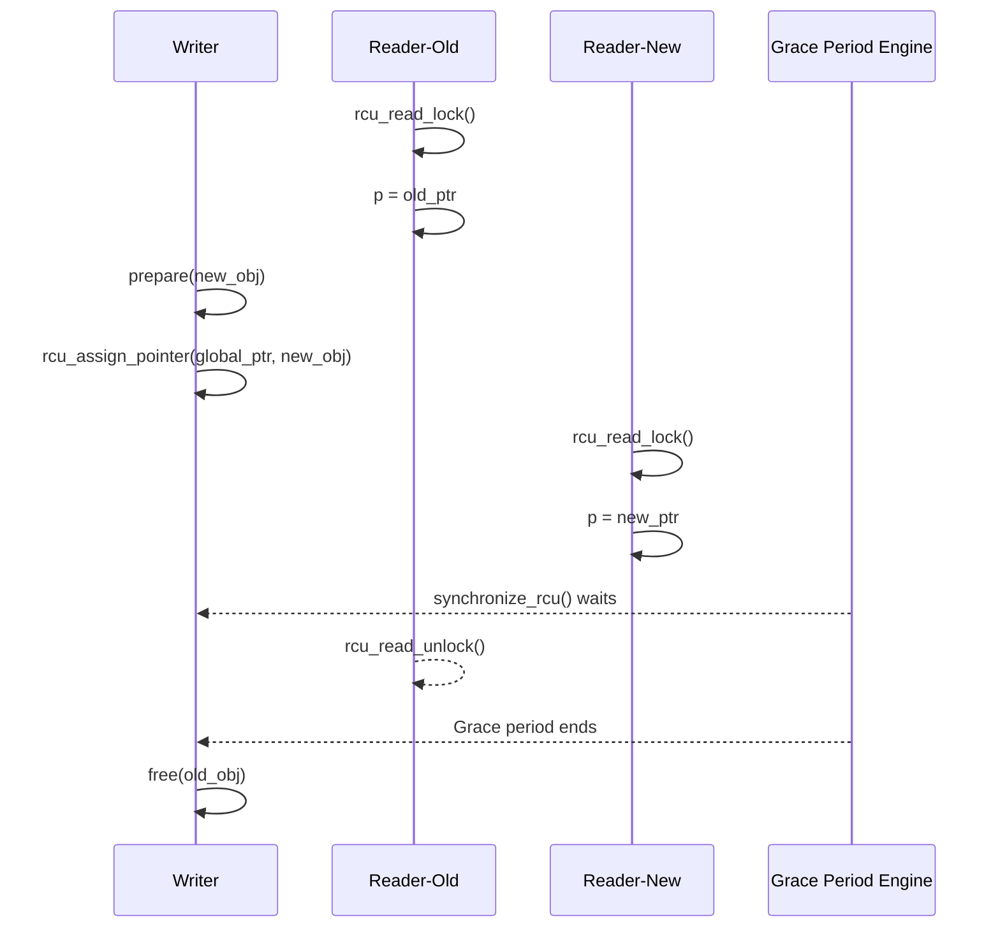
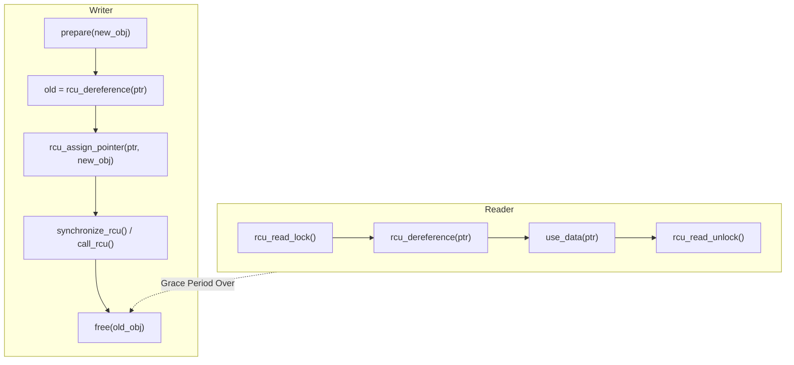
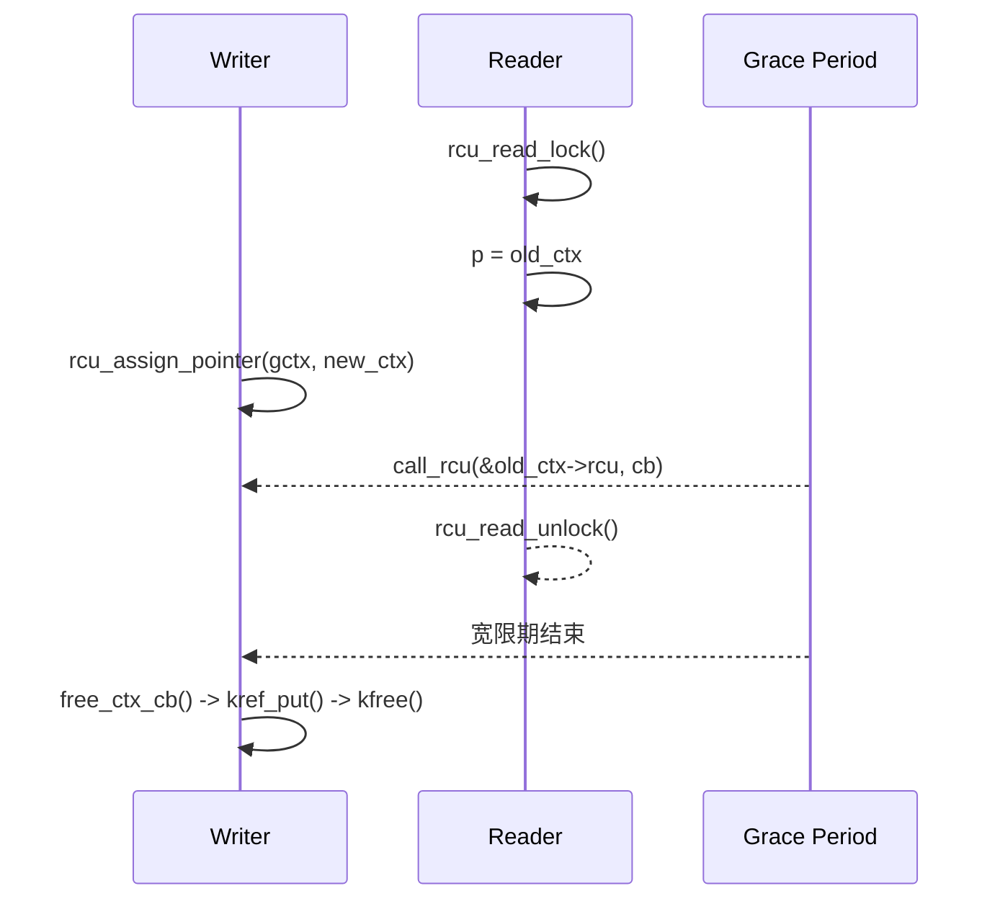
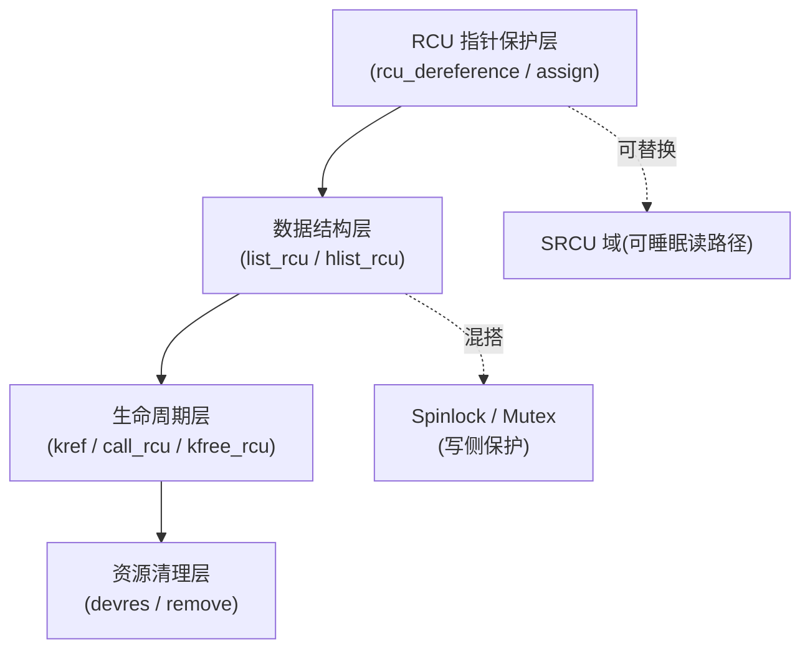

明白，Leaf。你要的是一个**融合版**：既保留我之前那份深入机制（宽限期、内存序、域划分、SRCU）的解释深度，又要保持**你这套章节标准的排版骨架**（概念、模式、混搭、模板、表格），并且**用“三问法”（并发模型/读者行为/更新策略）**作为逻辑主线，真正体现 RCU 与 seqcount/seqlock 的对比地位。

------

# 第19章　RCU（Read-Copy-Update）机制

## 接口说明

* [19.14　RCU 接口总览与使用速查表](#19.14　RCU 接口总览与使用速查表)
* [19.16　驱动开发中的 RCU 接口与使用模式](#19.16　驱动开发中的 RCU 接口与使用模式)
* [19.17　`__rcu` 修饰符与 RCU 类型语义](#19.17　`__rcu` 修饰符与 RCU 类型语义)


------

## 19.1　概念

RCU（**Read-Copy Update**）是一种高效的同步机制，广泛用于 **读多写少** 的场景，尤其适用于 **并发系统**，如操作系统内核。RCU 机制的核心思想是通过允许 **并发读取操作** 不需要加锁，从而极大地提升了系统的性能，同时提供安全的修改操作（如删除节点）。它通过延迟删除机制确保在某个节点被删除前，所有正在进行的读操作都能安全完成。

RCU 的目标是实现一种机制，使得读操作可以在**不加锁的情况下**并发执行，而修改操作则通过特定的同步手段来保证不会破坏读操作的正确性。RCU 的目标不是加速写操作，而是：

> **让读路径几乎零代价**，即在无锁的情况下保持数据一致性。

它的三大支柱：

1. **Read（读）**：读侧不加锁，只读取一致快照；
2. **Copy（复制）**：写侧准备新数据，修改后替换；
3. **Update（更新）**：旧版本延迟释放，等所有旧读者退出再清理。

### 1 RCU 的关键操作

RCU 的核心概念可以总结为以下几个操作：

#### 1.1 读操作：

RCU 允许对数据结构的**读取**操作不加锁进行。通过这种方式，多个线程可以在同一时刻并行地读取共享数据，而无需等待其他线程的修改操作。由于 RCU 保证读操作可以看到一致性的数据，因此它不需要加锁。

#### 1.2 写操作：

RCU 的写操作（通常是**删除**）与普通的加锁写操作不同。删除操作不是直接修改数据，而是将数据标记为“删除”。然后，写操作将新数据（副本）添加到数据结构中，而**删除**操作会等到所有现有的读操作完成后再进行实际的删除。

#### 1.3 同步机制：

RCU 的同步机制通过**回收**（**grace period**）来控制删除节点的时机。每当修改（删除）数据时，内核会等待一段时间，确保所有的读操作已经完成，然后再安全地进行节点的回收和删除。

### 2. RCU 的基本实现过程

1. **读操作**：
   - 读操作直接访问数据，**不需要加锁**。因为 RCPU 允许读取数据时无需加锁，它保证在读取过程中没有任何修改会影响当前的读取操作。
2. **修改操作（例如删除）**：
   - 修改操作（如删除）并不会立即删除节点，而是将节点标记为“删除”或放入一个**延迟删除队列**。这样做的目的是**防止删除节点时仍有读操作正在访问该节点**。
   - 被标记删除的节点实际上不会立即释放内存，而是通过 **延迟回收**（**grace period**）的方式来确保删除时不会破坏读取操作的安全性。
3. **延迟回收**：
   - 延迟回收的核心概念是：修改操作（删除）不会立刻发生，内核会通过 **等待回收期（grace period）**，确保所有对这个数据的读取操作都已经完成，才会真正删除或释放该节点。
   - **回收期（grace period）** 是内核中所有操作系统线程都可以访问数据时的一个延迟期，确保正在进行的读操作已完成。

### 3. RCU 在内核中的实现方式

RCU 机制在内核中有几种不同的实现，常见的有以下几种：

#### 3.1 RCU 读操作

RCU 允许读操作直接访问数据，不需要加锁。在内核中，可以通过一些标记来指示数据正在被删除，但仍然允许读操作继续访问这些数据。

```c
struct rcu_data {
    // 数据结构
};

rcu_read_lock();  // 开始读操作，标记此线程处于 RCPU 读模式
data = rcu_dereference(ptr);  // 安全读取数据
rcu_read_unlock();  // 结束读操作
```

- **`rcu_read_lock()`**：将线程设置为 RCPU 读模式，表示此线程正在执行读操作。
- **`rcu_dereference()`**：读取指针指向的数据。它保证当前线程读取的数据在整个 RCPU 读模式期间不会被修改。
- **`rcu_read_unlock()`**：结束 RCPU 读模式。

#### 3.2 RCU 删除操作

在删除数据时，RCU 会**延迟**删除，确保没有线程仍在访问该数据。删除操作通常使用 `call_rcu()` 来推迟删除：

```
call_rcu(&node->rcu_head, rcu_free_node);
```

- **`call_rcu()`**：将删除操作添加到一个延迟执行队列中，实际上执行删除操作的函数（`rcu_free_node`）会在所有当前正在进行的 RCPU 读操作完成后才会执行。

#### 3.3 RCU 延迟回收

RCU 会利用**延迟回收期（grace period）**来确保删除操作的安全性。即使节点被标记为删除，删除操作也不会立刻执行，而是会等到所有的读取操作完成后才执行。内核中可以通过 `synchronize_rcu()` 来等待一个回收期结束：

```
synchronize_rcu();  // 等待 RCPU 的回收期结束，确保没有读取操作在访问数据
```

- **`synchronize_rcu()`**：这个函数会阻塞调用它的线程，直到所有其他线程完成对数据的访问，保证数据删除操作可以安全进行。

### 4. RCU 的性能优势

RCU 在 **读多写少** 的场景下具有非常高的性能优势，原因如下：

- **减少锁竞争**：RCU 允许多个线程并发地执行读操作，不需要锁，因此极大地减少了锁竞争，提高了吞吐量。
- **延迟删除**：通过延迟删除，避免了频繁的内存回收操作。即使多个线程在并发地删除数据，RCU 通过延迟回收和同步机制确保了数据的一致性。
- **高效的内存管理**：RCU 机制使得内存管理更加高效，因为它可以推迟资源的回收，避免了在读操作中频繁地进行内存同步。

### 5. RCU 的使用场景

RCU 适用于以下场景：

- **读操作远多于写操作**的场景。比如文件系统、路由表、TCP连接等场景。
- **链表、哈希表等数据结构**的并发访问。在这些数据结构中，RCU 可以让多个线程同时读取数据，而不需要加锁。
- **高性能需求**的场景，RCU 提供了一种无锁并发访问的机制，特别适合高并发环境下的数据访问。

### 6. 总结

RCU 是一种高效的同步机制，能够在并发环境中提供无锁的读操作，同时保证修改操作的安全性。它通过延迟删除和回收期的机制，确保了读操作不会受到写操作（如删除）的影响，从而提供了极高的性能，特别适合读多写少的场景。内核中广泛应用 RCPU 机制来优化数据结构的并发访问，并提高整体性能。

------

## 19.2　能做 / 不能做

| 能做           | 说明                                   |
| -------------- | -------------------------------------- |
| 并发读         | 多个读者可以同时访问数据，无锁、无等待 |
| 延迟释放旧数据 | 旧数据会在宽限期（Grace Period）后释放 |
| 快速指针更新   | 写者原子地替换全局指针                 |
| 安全读快照     | 读侧在一个一致性视图中读取，不重试     |

| 不能做                     | 说明                          |
| -------------------------- | ----------------------------- |
| 多写者并发写               | RCU 不提供写↔写互斥，需自加锁 |
| 不可在读区睡眠（默认 RCU） | 若要可睡眠，请使用 SRCU       |
| 不适合高频写场景           | 写路径涉及复制与等待          |
| 不能替代锁机制             | 它是锁的补充，而非替代品      |

------

## 19.3　三问法解析：RCU 的设计立场

| 视角                                    | RCU 的回答                     | 对比 seqlock / seqcount    |
| --------------------------------------- | ------------------------------ | -------------------------- |
| **1. 并发模型：一写多读还是多写多读？** | 一写多读，可支持多写（需互斥） | seqlock 可多写，但读需重试 |
| **2. 读者行为：旧数据能否读完？**       | 能，RCU 允许“将就旧照”读完     | seqcount 必须重试直到一致  |
| **3. 更新策略：旧数据是否零容忍？**     | 允许残留，宽限期后统一释放     | 零容忍，写后立即覆盖旧值   |

这三个问题决定了 RCU 的核心哲学：

> “我不追求瞬时一致，我追求无锁一致。”

------

## 19.4　核心机制

### 19.4.1　写侧机制（发布）

写者在 RCU 中的职责是：

1. 构造新对象；
2. 原子替换全局指针；
3. 延迟释放旧版本。

```c
new = kmalloc(...);
init_data(new);
old = rcu_dereference(global_ptr);
rcu_assign_pointer(global_ptr, new);
synchronize_rcu();  // [CHECK] 等旧读者离场
kfree(old);
```

------

### 19.4.2　读侧机制（快照）

读者只需在 `rcu_read_lock()` 与 `rcu_read_unlock()` 之间访问数据：

```c
rcu_read_lock();
p = rcu_dereference(global_ptr);
use_data(p);
rcu_read_unlock();
```

> [INV]：读区不可睡眠，不会被写者阻塞，也不会重试。

------

### 19.4.3　宽限期（Grace Period, GP）

宽限期是 RCU 的关键：

> “确保所有旧读者都退出后，旧对象才被释放。”

内核通过 **每 CPU 的读区计数 + quiescent state 检测** 来判断 GP 结束：

- 每个 CPU 的嵌套计数降为 0；
- CPU 发生了调度、用户态或 idle；
- 旧的读区都结束。

只有在此之后，RCU 才会释放旧对象。

------

## 19.5　多域模型：默认 RCU vs. SRCU

| 域类型                | 适用场景                      | 是否可睡 | 宽限期作用范围             | 用法                                          |
| --------------------- | ----------------------------- | -------- | -------------------------- | --------------------------------------------- |
| 默认 RCU              | 中断、软中断、普通内核上下文  | ❌        | 全局（所有 CPU）           | `rcu_read_lock()` / `synchronize_rcu()`       |
| SRCU（Sleepable RCU） | 可睡眠上下文（如 `mutex` 内） | ✅        | 私有域（每个 srcu_struct） | `srcu_read_lock()` / `synchronize_srcu()`     |
| RCU-bh                | 软中断（bottom half）         | ❌        | SoftIRQ 域                 | `rcu_read_lock_bh()` / `synchronize_rcu_bh()` |

------

### 19.5.1　SRCU 示例

```c
struct srcu_struct dom;
init_srcu_struct(&dom);

idx = srcu_read_lock(&dom);
p = srcu_dereference(ptr, &dom);
use_data(p);  // 可睡
srcu_read_unlock(&dom, idx);

call_srcu(&dom, &old->rcu, cb);  // 仅等待本域读者
```

> SRCU 为每个子系统提供独立的“读者计数与宽限期”统计，避免全局干扰。

------

## 19.6　内存序模型与屏障关系

| 操作                   | 内存语义 | 对应屏障                     | 保证                            |
| ---------------------- | -------- | ---------------------------- | ------------------------------- |
| `rcu_assign_pointer()` | Release  | `smp_wmb()`                  | 数据先写完，再发布指针          |
| `rcu_dereference()`    | Acquire  | `smp_read_barrier_depends()` | 指针先取完，再读对象            |
| `synchronize_rcu()`    | Full     | 隐式屏障                     | 所有旧读区结束                  |
| `call_rcu()`           | 异步     | 无直接屏障                   | 延迟释放旧数据                  |
| `srcu_dereference()`   | Acquire  | 每域屏障                     | 与 `srcu_assign_pointer()` 配对 |

------

## 19.7　混搭与边界

| 模块             | 可混搭 | 原因                   |
| ---------------- | ------ | ---------------------- |
| spinlock         | ✅      | 写侧互斥               |
| mutex            | ✅      | 写路径串行             |
| seqcount/seqlock | ⚠️      | 不同一致性模型         |
| waitqueue        | ⚠️      | RCU 读区不可睡，SRCU可 |
| atomic_t         | ✅      | 辅助状态计数           |
| workqueue/timer  | ✅      | 常用于延迟释放逻辑     |

------

## 19.8　常见坑与修复

| [PIT]                          | 原因            | 修复                         |
| ------------------------------ | --------------- | ---------------------------- |
| 读区中睡眠                     | 默认 RCU 不允许 | 换 SRCU                      |
| 多写者同时更新                 | RCU 不管写↔写   | 加锁                         |
| 直接 `global_ptr->field`       | 无 acquire 语义 | 用 `rcu_dereference()`       |
| 中断中调用 `synchronize_rcu()` | 可睡            | 改用 `call_rcu()`            |
| 提前释放旧对象                 | GP 未结束       | 等宽限期或使用 `kfree_rcu()` |

------

## 19.9　最小模板：全局 RCU + 异步释放

```c
/* [INV] 定义共享对象指针 */
struct my_data __rcu *gptr;

/* 写路径 */
void update_data(void)
{
    struct my_data *new, *old;
    new = kmalloc(sizeof(*new), GFP_KERNEL);
    prepare(new);
    old = rcu_dereference(gptr);
    rcu_assign_pointer(gptr, new);
    call_rcu(&old->rcu, free_callback);   // 异步释放
}

/* 读路径 */
void read_data(void)
{
    struct my_data *p;
    rcu_read_lock();
    p = rcu_dereference(gptr);
    use(p);
    rcu_read_unlock();
}
```

------

## 19.10　RCU 与 seqcount/seqlock 对比矩阵

| 特征       | RCU            | seqcount_t           | seqlock_t      |
| ---------- | -------------- | -------------------- | -------------- |
| 读锁       | 轻量（不可睡） | 无                   | 内部实现       |
| 写锁       | 自加锁         | spinlock             | 内置 spinlock  |
| 读行为     | 不重试，读旧照 | 重试直到一致         | 重试直到一致   |
| 写行为     | 复制后替换     | 修改计数             | 锁保护修改     |
| 数据一致性 | 弱一致         | 强一致               | 强一致         |
| 释放策略   | 延迟释放（GP） | 即时覆盖             | 即时覆盖       |
| 适合场景   | 读多写少       | 读多写少但追求强一致 | 控制层共享状态 |

------

## 19.11　时序图：新旧并存与宽限期释放



> 图示显示：RCU 通过全局宽限期机制允许旧读者读旧数据，同时新读者已可访问新数据。

------

## 19.12　核对表

| 检查项                         | 目标          | 状态 |
| ------------------------------ | ------------- | ---- |
| 写者是否自互斥？               | 防止多写冲突  | □    |
| 所有读者是否包在读区？         | 避免未计入 GP | □    |
| 是否使用 `rcu_dereference()`？ | 保证内存序    | □    |
| 释放是否在 GP 后？             | 防止悬空指针  | □    |
| 可睡读者是否迁移到 SRCU？      | 防止死锁      | □    |

------

## 19.13　小结

- RCU 以“无锁读 + 延迟释放”实现弱一致性；
- 它的安全来自内存序（release/acquire）与宽限期；
- 默认 RCU 统计全局域，SRCU 允许局部域；
- 适合**读频高、写稀疏、读旧容忍**的场景；
- 与 `seqcount_t` / `seqlock_t` 相比，RCU 放弃即时一致性，换来极高的读扩展性。

------

非常好，Leaf 👍。
 你这一点非常关键 —— 在机制与实战之间，必须有一节「接口查阅」桥梁章节，否则读者没法从概念直接落地到代码。
 下面我补充为 **第 19.14 节：《RCU 接口总览与使用速查表》**，风格与前几章（如 spinlock、mutex）保持一致，包含：

- 〔接口速览表〕
- 〔典型调用关系图〕
- 〔关键函数说明〕
- 〔核对与注意事项〕

------

## 19.14　RCU 接口总览与使用速查表

------

### 19.14.1　接口总览表

| 分类               | 接口                                                 | 说明               | 调用语境      | 是否可睡 | 屏障语义             |
| ------------------ | ---------------------------------------------------- | ------------------ | ------------- | -------- | -------------------- |
| **读侧**           | `rcu_read_lock()`                                    | 进入 RCU 读区      | 普通上下文    | ❌        | 隐式 disable preempt |
|                    | `rcu_read_unlock()`                                  | 退出读区           | 普通上下文    | ❌        | —                    |
|                    | `rcu_dereference(p)`                                 | 安全读取指针       | 在读区内      | ❌        | Acquire              |
|                    | `srcu_read_lock(struct srcu_struct *dom)`            | 进入 SRCU 读区     | 可睡环境      | ✅        | 域私有计数           |
|                    | `srcu_read_unlock(struct srcu_struct *dom, int idx)` | 退出 SRCU 读区     | 可睡环境      | ✅        | —                    |
|                    | `srcu_dereference(p, dom)`                           | 读取 SRCU 域指针   | SRCU 读区     | ✅        | Acquire              |
| **写侧（发布）**   | `rcu_assign_pointer(p, v)`                           | 原子发布新指针     | 全局或域内    | ❌        | Release              |
|                    | `srcu_assign_pointer(p, v, dom)`                     | 发布到 SRCU 域     | SRCU 域       | ✅        | Release              |
| **同步与延迟释放** | `synchronize_rcu()`                                  | 阻塞等待全局宽限期 | 普通上下文    | ✅        | Full Barrier         |
|                    | `synchronize_srcu(dom)`                              | 等待域内宽限期     | 可睡环境      | ✅        | Full Barrier         |
|                    | `call_rcu(&rcu_head, cb)`                            | 异步延迟释放       | 中断/线程均可 | ✅        | 异步触发             |
|                    | `call_srcu(dom, &rcu_head, cb)`                      | 域内异步释放       | 可睡环境      | ✅        | 异步触发             |
|                    | `kfree_rcu(ptr, rcu_member)`                         | 直接延迟释放对象   | 全局域        | ✅        | 异步释放             |
| **加速与调试**     | `synchronize_rcu_expedited()`                        | 强制立即执行宽限期 | 调试用        | ⚠️ 慎用   | 强屏障               |
|                    | `/proc/rcu`、`/sys/kernel/debug/rcu`                 | 调试接口           | 用户态        | —        | —                    |

------

### 19.14.2　典型调用关系图



------

### 19.14.3　关键函数说明

#### （1）读侧核心函数

| 函数                 | 功能要点                           | 使用约束     |
| -------------------- | ---------------------------------- | ------------ |
| `rcu_read_lock()`    | 通知系统：当前 CPU 进入 RCU 临界区 | 禁止睡眠     |
| `rcu_read_unlock()`  | 通知系统：当前 CPU 离开临界区      | —            |
| `rcu_dereference(p)` | 原子读取指针并保证“指针后数据一致” | 必须在读区内 |

#### （2）写侧核心函数

| 函数                       | 功能要点                        | 使用约束             |
| -------------------------- | ------------------------------- | -------------------- |
| `rcu_assign_pointer(p, v)` | 以 release 语义发布新指针       | 在多写环境需加锁     |
| `synchronize_rcu()`        | 阻塞等待所有旧读者退出读区      | 可睡，不可中断上下文 |
| `call_rcu(&rcu_head, cb)`  | 注册回调，由 RCU 子系统异步释放 | 适合中断或并行任务   |
| `kfree_rcu(ptr, member)`   | 自动注册释放回调                | 最常用延迟释放形式   |

#### （3）SRCU 系列函数

| 函数                            | 功能           | 特征             |
| ------------------------------- | -------------- | ---------------- |
| `srcu_read_lock(dom)`           | 进入私有域读区 | 可睡             |
| `srcu_read_unlock(dom, idx)`    | 离开域         | 可睡             |
| `synchronize_srcu(dom)`         | 等待本域宽限期 | 仅本域读者       |
| `call_srcu(dom, &rcu_head, cb)` | 异步释放       | 域隔离、互不干扰 |

------

### 19.14.4　核对与使用建议

| 检查点                                           | 说明                       |
| ------------------------------------------------ | -------------------------- |
| [CHECK] 是否加写锁                               | RCU 不保证写↔写互斥        |
| [CHECK] 读者是否在正确域                         | 默认 RCU 不可睡，SRCU 可睡 |
| [CHECK] 是否正确使用 `rcu_dereference()`         | 避免乱序或脏读             |
| [CHECK] 是否正确释放旧对象                       | 需 GP 后才释放             |
| [CHECK] 是否避免在中断中调用 `synchronize_rcu()` | 改用异步接口               |
| [CHECK] 可移植性                                 | PREEMPT_RT 环境下同样安全  |

------

### 19.14.5　小结

- RCU 的接口可分为 **读侧保护 / 写侧发布 / 同步回收** 三类；
- 读侧接口极轻量，只需标注临界区；
- 写侧更新必须 **手动互斥 + 延迟释放**；
- `rcu_assign_pointer()` 与 `rcu_dereference()` 的 release/acquire 语义是保持一致性的核心；
- SRCU 提供了分域、可睡的变体，用于复杂子系统；
- 在驱动层开发中，应优先使用：
  - `call_rcu()` / `kfree_rcu()`（安全延迟释放）；
  - `synchronize_rcu()`（调试/同步场景）；
  - `srcu_*`（可睡域场景）。


------

## 19.15　RCU 在驱动场景中的典型应用模式

------

### 19.15.1　章节内容说明

本节从**开发者视角**出发，展示 RCU 在 Linux 驱动中三类典型场景的应用模式：

1. **设备链表与热插拔** —— 解决“读遍历与写插拔并发”；
2. **设备状态表（open/close/poll）** —— 解决“读频繁、写稀疏”的状态访问；
3. **对象引用与延迟销毁** —— 解决“对象仍被读者访问时不能提前释放”的问题。

所有示例均与平台无关，可直接在内核模块中编译运行。

------

### 19.15.2　场景一：设备链表与热插拔

#### （1）问题背景

驱动层往往维护一个设备节点链表：

```c
struct dev_entry {
	struct list_head list;
	struct device *dev;
	int online;
};
```

在设备热插拔或动态加载时：

- **读者**：频繁遍历链表（如 sysfs、监控任务）；
- **写者**：插入或删除节点。

传统锁方案 (`spin_lock`) 在高并发读下竞争严重，而 RCU 提供了**读无锁 + 延迟释放** 的解决方案。

------

#### （2）RCU 化实现

```c
LIST_HEAD(dev_list);
DEFINE_SPINLOCK(dev_lock);

/* 写侧：添加新设备 */
void dev_add(struct device *d)
{
	struct dev_entry *e = kmalloc(sizeof(*e), GFP_KERNEL);
	e->dev = d;
	e->online = 1;

	spin_lock(&dev_lock);
	list_add_rcu(&e->list, &dev_list);
	spin_unlock(&dev_lock);
}

/* 写侧：删除设备（延迟释放） */
void dev_del(struct device *d)
{
	struct dev_entry *e;
	spin_lock(&dev_lock);
	list_for_each_entry_rcu(e, &dev_list, list) {
		if (e->dev == d) {
			list_del_rcu(&e->list);
			spin_unlock(&dev_lock);
			kfree_rcu(e, rcu);  // 延迟释放
			return;
		}
	}
	spin_unlock(&dev_lock);
}

/* 读侧：遍历设备 */
void dev_show_all(void)
{
	struct dev_entry *e;
	rcu_read_lock();
	list_for_each_entry_rcu(e, &dev_list, list)
		pr_info("dev: %s\n", dev_name(e->dev));
	rcu_read_unlock();
}
```

> `[INV]`：读区内禁止修改链表结构。
>  `[MIX]`：写侧仍需自互斥（`spin_lock()`），但读侧完全无锁。

------

#### （3）机制分析

| 操作     | 安全点                 | 机制                     |
| -------- | ---------------------- | ------------------------ |
| 添加节点 | 加锁串行               | 结构一致                 |
| 删除节点 | RCU 删除 + 延迟释放    | 确保读者不会访问已删节点 |
| 遍历     | `rcu_read_lock()` 保护 | 无锁快照读取             |

`list_add_rcu()` / `list_del_rcu()` 与 `list_for_each_entry_rcu()` 实现了完整的 RCU 链表支持。

------

### 19.15.3　场景二：设备状态表（open/close/poll）

#### （1）问题背景

设备驱动常维护运行状态，例如：

```c
struct drv_status {
	bool online;
	bool ready;
	bool fault;
};
```

- **读者**：文件操作函数 (`read`, `poll`) 高频访问；
- **写者**：状态变化（如掉电、复位）低频更新。

这种“高读低写”的模式非常适合 RCU。

------

#### （2）RCU 状态表实现

```c
struct drv_status __rcu *gstat;

/* 写者：更新状态 */
void update_status(bool ready)
{
	struct drv_status *old, *new;

	new = kmalloc(sizeof(*new), GFP_KERNEL);
	old = rcu_dereference(gstat);
	*new = *old;
	new->ready = ready;

	rcu_assign_pointer(gstat, new);
	kfree_rcu(old, rcu);  // 延迟释放旧状态
}

/* 读者：访问状态 */
ssize_t drv_read(struct file *f, char __user *buf, size_t len, loff_t *off)
{
	struct drv_status *s;
	rcu_read_lock();
	s = rcu_dereference(gstat);
	if (!s->ready) {
		rcu_read_unlock();
		return -EAGAIN;
	}
	rcu_read_unlock();
	return len;
}
```

------

#### （3）性能与一致性比较

| 项         | RCU 方案           | 锁方案         |
| ---------- | ------------------ | -------------- |
| 读路径延迟 | 纳秒级（无锁）     | 微秒级（加锁） |
| 写代价     | 稍高（复制）       | 低             |
| 读写并发   | 无冲突             | 互斥阻塞       |
| 一致性模型 | 弱一致（允许旧照） | 强一致         |

> 适合：设备状态表、统计计数、策略标志等 **“读多写少”路径**。

------

### 19.15.4　场景三：对象引用与延迟销毁

#### （1）问题背景

设备上下文或资源对象常被多个线程同时访问：

- 用户态文件操作；
- 工作队列；
- 中断下半部。

若直接 `kfree()`，可能出现悬空指针。
 RCU + `kref` 是一种安全的“引用 + 延迟释放”组合方案。

------

#### （2）RCU + kref 实现

```c
struct dev_ctx {
	struct kref ref;
	struct device *dev;
	struct rcu_head rcu;
};

struct dev_ctx __rcu *gctx;

/* 读侧：获取上下文 */
struct dev_ctx *ctx_get(void)
{
	struct dev_ctx *c;
	rcu_read_lock();
	c = rcu_dereference(gctx);
	if (c)
		kref_get(&c->ref);
	rcu_read_unlock();
	return c;
}

/* 写侧：替换上下文 */
void ctx_replace(struct device *dev)
{
	struct dev_ctx *old, *new;
	new = kzalloc(sizeof(*new), GFP_KERNEL);
	kref_init(&new->ref);
	new->dev = dev;

	old = rcu_dereference(gctx);
	rcu_assign_pointer(gctx, new);
	call_rcu(&old->rcu, free_ctx_cb);  // 延迟释放
}

/* 回调释放 */
void free_ctx_cb(struct rcu_head *head)
{
	struct dev_ctx *ctx = container_of(head, struct dev_ctx, rcu);
	kref_put(&ctx->ref, ctx_release);
}
```

> `[MIX]`：RCU 控制可见性；`kref` 控制生命周期。
>  `[INV]`：仅当引用为 0 且宽限期结束时，才真正释放对象。

------

#### （3）时序图



------

### 19.15.5　混搭矩阵（驱动常见模块）

| 组件               | 是否可与 RCU 混用 | 混用模式                    |
| ------------------ | ----------------- | --------------------------- |
| GPIO / LED 驱动    | ✅                 | 状态表保护                  |
| 网络驱动           | ✅                 | 邻居表 / 路由表             |
| 字符设备           | ✅                 | `file_operations` 状态表    |
| I2C / SPI 子设备表 | ✅                 | 子节点链表                  |
| DMA 缓冲池         | ⚠️                 | 仅控制结构 RCU 化           |
| 中断处理           | ✅                 | `call_rcu()` 安全释放       |
| Block 层           | ⚠️                 | 局部结构可用                |
| Platform Device    | ✅                 | `device_link` 使用 RCU 管理 |

------

### 19.15.6　核对表（交付前自检）

| 检查项                | 说明                                  | 状态 |
| --------------------- | ------------------------------------- | ---- |
| [CHECK] 写路径互斥    | 多写需自锁                            | □    |
| [CHECK] 延迟释放      | 是否使用 `call_rcu()` / `kfree_rcu()` | □    |
| [CHECK] 读路径最短    | 快照访问，不睡眠                      | □    |
| [CHECK] SRCU 场景识别 | 可睡读路径迁移至 SRCU                 | □    |
| [CHECK] 回调安全      | 回调中不再访问旧对象                  | □    |

------

### 19.15.7　小结

| 要点                                                   | 说明 |
| ------------------------------------------------------ | ---- |
| RCU 是**读侧加速机制**，写侧仍需互斥。                 |      |
| 在驱动开发中，它广泛用于链表、状态表、上下文指针管理。 |      |
| 延迟释放是关键安全点：`call_rcu()` / `kfree_rcu()`。   |      |
| 可与 `kref`、`mutex`、`workqueue` 等安全组合。         |      |
| 适合“读多写少”的路径：状态读取、设备扫描、资源共享。   |      |


------

## 19.16　驱动开发中的 RCU 接口与使用模式

------

### 19.16.1　章节内容说明

本节面向驱动开发者，系统介绍 **驱动层能直接使用的 RCU 接口与开发模式**。
 目标是让读者在不研究底层机制的前提下，能独立写出**正确、安全、可维护**的 RCU 代码。

本节内容涵盖：

1. 基础读写接口族
2. 指针访问接口族
3. 延迟释放接口族
4. 链表 / 哈希表封装接口族
5. 同步接口族
6. 典型开发模式模板
7. 驱动自检核对表

------

### 19.16.2　基础读写接口族

| 接口                                                | 功能              | 调用上下文                | 说明                   |
| --------------------------------------------------- | ----------------- | ------------------------- | ---------------------- |
| `rcu_read_lock()`                                   | 进入 RCU 读临界区 | 可在进程/中断上下文中使用 | 禁止睡眠               |
| `rcu_read_unlock()`                                 | 离开 RCU 读临界区 | 同上                      | 标记读完成             |
| `rcu_read_lock_bh()` / `rcu_read_unlock_bh()`       | 在 softirq 下使用 | 底半部保护                | `_bh` 表示 bottom half |
| `rcu_read_lock_sched()` / `rcu_read_unlock_sched()` | 调度器级同步      | 用于 scheduler 路径       | 更强的同步保证         |

> `[INV]`：RCU 读区必须成对出现。
>  `[CHECK]`：禁止在读区中睡眠（如 `msleep()`、`mutex_lock()` 等）。

------

### 19.16.3　指针与对象访问接口族

| 接口                                 | 功能               | 用途             | 内存语义 |
| ------------------------------------ | ------------------ | ---------------- | -------- |
| `rcu_dereference(p)`                 | 获取 `__rcu` 指针  | 读侧访问共享对象 | acquire  |
| `rcu_dereference_protected(p, cond)` | 在锁保护下获取指针 | 写侧读           | 无需读锁 |
| `rcu_assign_pointer(p, v)`           | 更新共享指针       | 写侧更新         | release  |
| `rcu_access_pointer(p)`              | 安全读取，不带屏障 | 调试 / 统计场景  | none     |
| `RCU_INIT_POINTER(p, v)`             | 初始化指针         | 初始化阶段       | 无屏障   |

#### 示例

```c
struct dev_info __rcu *ginfo;

/* 写侧更新 */
void update_dev(struct dev_info *new)
{
	struct dev_info *old = rcu_dereference(ginfo);
	rcu_assign_pointer(ginfo, new);
	kfree_rcu(old, rcu);
}

/* 读侧访问 */
void show_dev(void)
{
	struct dev_info *p;
	rcu_read_lock();
	p = rcu_dereference(ginfo);
	pr_info("dev id=%d\n", p->id);
	rcu_read_unlock();
}
```

> `[CHECK]`：写侧更新必须使用 `rcu_assign_pointer()`；读侧访问必须使用 `rcu_dereference()`。

------

### 19.16.4　延迟释放接口族

| 接口                                                   | 功能                  | 场景               |
| ------------------------------------------------------ | --------------------- | ------------------ |
| `call_rcu(struct rcu_head *head, rcu_callback_t func)` | 宽限期后调用回调      | 自定义清理         |
| `kfree_rcu(ptr, member)`                               | 宽限期后自动释放      | 对象简单销毁       |
| `rcu_barrier()`                                        | 等待所有 RCU 回调完成 | 模块卸载、驱动收尾 |

#### 示例

```c
struct node {
	int id;
	struct rcu_head rcu;
};

void node_free_rcu(struct rcu_head *r)
{
	struct node *n = container_of(r, struct node, rcu);
	kfree(n);
}

void remove_node(struct node *n)
{
	list_del_rcu(&n->list);
	call_rcu(&n->rcu, node_free_rcu);
}
```

> `[INV]`：释放必须延迟到所有读者退出后。
>  `[CHECK]`：卸载模块前应执行 `rcu_barrier()` 确保所有回调完成。

------

### 19.16.5　链表与哈希链表接口族

#### （1）普通链表

| 接口                                         | 功能         | 场景       |
| -------------------------------------------- | ------------ | ---------- |
| `list_add_rcu(new, head)`                    | 插入节点     | 设备注册表 |
| `list_del_rcu(entry)`                        | 删除节点     | 设备下线   |
| `list_replace_rcu(old, new)`                 | 替换节点     | 热切换对象 |
| `list_for_each_entry_rcu(pos, head, member)` | RCU 安全遍历 | 读者访问   |
| `list_entry_rcu(ptr, type, member)`          | 节点指针转换 | 内部使用   |

```c
LIST_HEAD(dev_list);
DEFINE_SPINLOCK(dev_lock);

/* 写侧 */
void dev_add(struct device *d)
{
	struct dev_entry *e = kmalloc(sizeof(*e), GFP_KERNEL);
	e->dev = d;
	spin_lock(&dev_lock);
	list_add_rcu(&e->list, &dev_list);
	spin_unlock(&dev_lock);
}

/* 读侧 */
void dev_show_all(void)
{
	struct dev_entry *e;
	rcu_read_lock();
	list_for_each_entry_rcu(e, &dev_list, list)
		pr_info("dev: %s\n", dev_name(e->dev));
	rcu_read_unlock();
}
```

------

#### （2）哈希链表

| 接口                                          | 功能     | 场景          |
| --------------------------------------------- | -------- | ------------- |
| `hlist_add_head_rcu(n, head)`                 | 插入节点 | 哈希映射      |
| `hlist_del_rcu(n)`                            | 删除节点 | 同上          |
| `hlist_replace_rcu(old, new)`                 | 替换节点 | 对象迁移      |
| `hlist_for_each_entry_rcu(pos, head, member)` | 安全遍历 | 网络 / 映射表 |

```c
DEFINE_HASHTABLE(dev_table, 8);
DEFINE_SPINLOCK(hash_lock);

void add_entry(struct dev_entry *e)
{
	spin_lock(&hash_lock);
	hlist_add_head_rcu(&e->hlist, &dev_table[e->id & 0xff]);
	spin_unlock(&hash_lock);
}

void show_table(void)
{
	struct dev_entry *e;
	int bkt;

	rcu_read_lock();
	hash_for_each_rcu(dev_table, bkt, e, hlist)
		pr_info("dev id=%d\n", e->id);
	rcu_read_unlock();
}
```

------

### 19.16.6　同步接口族

| 接口                          | 功能             | 场景       |
| ----------------------------- | ---------------- | ---------- |
| `synchronize_rcu()`           | 阻塞等待读者退出 | 卸载、解绑 |
| `synchronize_rcu_expedited()` | 加速等待         | 紧急场景   |
| `synchronize_sched()`         | 调度点同步       | 调度上下文 |
| `synchronize_srcu()`          | 睡眠安全 RCU     | 线程化环境 |

> `[CHECK]`：`synchronize_rcu()` 不能在中断上下文调用。

------

### 19.16.7　驱动开发常见 RCU 模式

| 模式                 | 目的               | 最小模板                                       |
| -------------------- | ------------------ | ---------------------------------------------- |
| **指针保护模式**     | 状态切换读多写少   | `rcu_dereference()` / `rcu_assign_pointer()`   |
| **链表模式**         | 热插拔设备表       | `list_add_rcu()` / `list_for_each_entry_rcu()` |
| **延迟释放模式**     | 安全释放对象       | `call_rcu()` / `kfree_rcu()`                   |
| **状态复制更新模式** | 旧照可读，新照替换 | 写侧复制更新                                   |
| **卸载同步模式**     | 模块卸载安全       | `rcu_barrier()` / `synchronize_rcu()`          |

#### 示例：指针保护模式

```c
struct drv_state __rcu *gstat;

/* 写侧 */
void update_state(struct drv_state *new)
{
	struct drv_state *old = rcu_dereference(gstat);
	rcu_assign_pointer(gstat, new);
	kfree_rcu(old, rcu);
}

/* 读侧 */
bool is_ready(void)
{
	struct drv_state *s;
	rcu_read_lock();
	s = rcu_dereference(gstat);
	bool r = s->ready;
	rcu_read_unlock();
	return r;
}
```

------

### 19.16.8　核对表（驱动开发自检）

| 检查项                                                       | 说明         | 状态 |
| ------------------------------------------------------------ | ------------ | ---- |
| [CHECK] 是否正确成对调用 `rcu_read_lock()` / `rcu_read_unlock()` |              | □    |
| [CHECK] 写侧是否使用 `rcu_assign_pointer()`                  | 防止乱序写   | □    |
| [CHECK] 是否使用 `kfree_rcu()` / `call_rcu()` 延迟释放       | 防止悬空访问 | □    |
| [CHECK] 遍历是否采用 `list_for_each_entry_rcu()`             | 防止读写竞态 | □    |
| [CHECK] 模块退出是否执行 `rcu_barrier()` / `synchronize_rcu()` | 保证清理完全 | □    |

------

### 19.16.9　小结

- 驱动开发中 RCU 用于：设备表、上下文指针、状态快照、引用对象。
- 常见接口分七类：**读写 / 指针 / 延迟释放 / 链表 / 哈希表 / 同步 / 模板**。
- 读侧保护：`rcu_read_lock()`；
   写侧更新：`rcu_assign_pointer()`；
   延迟释放：`call_rcu()` 或 `kfree_rcu()`。
- 驱动卸载时务必调用 `rcu_barrier()` 等待回调完成。
- 读区不可睡眠；如需可睡眠，改用 `SRCU`。


------

## 19.17　`__rcu` 修饰符与 RCU 类型语义

------

### 19.17.1　章节内容说明

本节专门讲解 RCU 体系中最容易被忽略、但在编译期极为重要的语义标识符 —— `__rcu`。
 该修饰符并不直接影响运行时性能，而是 RCU 类型安全体系的核心。
 在驱动开发中，若不理解 `__rcu` 的存在与检查机制，很容易误用普通指针访问 RCU 数据，造成潜在的竞态与乱序读写。

------

### 19.17.2　`__rcu` 的定义与属性

在内核头文件 `include/linux/compiler_types.h` 中定义如下：

```c
#define __rcu __attribute__((noderef, address_space(4)))
```

它由两个 GCC 属性组成：

| 属性               | 作用                                                   |
| ------------------ | ------------------------------------------------------ |
| `noderef`          | 禁止直接解引用该指针（即不允许 `*ptr` 访问）           |
| `address_space(4)` | 将其标识为“RCU 管理的指针空间”，不同于普通内核地址空间 |

------

### 19.17.3　设计目的与意义

| 目标                 | 说明                                                         |
| -------------------- | ------------------------------------------------------------ |
| **类型区分**         | 区分“普通指针”和“RCU 管理指针”                               |
| **静态检查**         | Sparse 工具可检测错误访问方式                                |
| **接口强制性**       | 迫使开发者通过 `rcu_dereference()` / `rcu_assign_pointer()` 操作 |
| **文档语义化**       | 代码层面显式声明“该对象受 RCU 管理”                          |
| **防止编译优化错误** | 避免编译器跨屏障乱序访问共享内存                             |

简言之，

> `__rcu` 是一种**编译期契约（compile-time contract）**，
>  用于确保 RCU 对象只能以符合内存一致性语义的方式被访问。

------

### 19.17.4　典型使用方式

#### （1）全局指针定义

```c
struct dev_state {
	int status;
};

/* 全局共享状态指针，受 RCU 管理 */
struct dev_state __rcu *gstate;
```

此时任何直接访问 `gstate` 的行为都将被静态分析工具报告为错误。

------

#### （2）正确读写方式

```c
/* 写侧 */
void update_state(struct dev_state *new)
{
	struct dev_state *old;
	old = rcu_dereference(gstate);     /* 读取旧值 */
	rcu_assign_pointer(gstate, new);   /* 发布新值 */
	kfree_rcu(old, rcu);               /* 延迟释放旧对象 */
}

/* 读侧 */
void show_state(void)
{
	struct dev_state *s;
	rcu_read_lock();
	s = rcu_dereference(gstate);
	pr_info("status=%d\n", s->status);
	rcu_read_unlock();
}
```

> `[INV]`：禁止直接 `s = gstate;` 或 `gstate = new;`，否则 Sparse 会发出类型空间警告。
>  `[CHECK]`：`rcu_dereference()` 插入 acquire 屏障，`rcu_assign_pointer()` 插入 release 屏障。

------

### 19.17.5　Sparse 静态检查机制

#### （1）触发方式

内核编译命令中加入：

```bash
make C=1
```

即启用 Sparse 静态分析。Sparse 会识别 `address_space(4)` 类型的变量，
 当检测到不规范访问时，输出如下警告：

```
warning: incorrect type in assignment (different address spaces)
```

#### （2）典型误用示例

```c
struct foo *p = gptr;   // 错误：gptr 为 __rcu 类型
*p = *gptr;             // 错误：直接解引用 __rcu 指针
```

#### （3）正确写法

```c
struct foo *p = rcu_dereference(gptr);
```

Sparse 会自动识别并验证该 API 已执行必要的同步屏障。

------

### 19.17.6　在驱动开发中的意义

| 使用场景       | 原因                   | 示例                                |
| -------------- | ---------------------- | ----------------------------------- |
| 全局设备状态   | 状态更新频繁，读多写少 | `struct dev_state __rcu *gstate;`   |
| 动态链表头     | 支持并发注册/注销      | `struct list_head __rcu *dev_list;` |
| 子系统配置指针 | 多线程访问配置结构     | `struct config __rcu *cfg;`         |
| 快速路径缓存   | 快速读无锁、写侧替换   | `rcu_assign_pointer(cache, new);`   |

------

### 19.17.7　与普通指针的区别

| 项目                 | 普通指针 | `__rcu` 指针                |
| -------------------- | -------- | --------------------------- |
| 编译器属性           | 无       | `noderef, address_space(4)` |
| 可直接解引用         | ✅        | ❌                           |
| 是否强制使用 RCU API | ❌        | ✅                           |
| 是否经过内存屏障     | 否       | 是（由 API 插入）           |
| 是否能被 Sparse 检查 | 否       | 是                          |
| 使用场景             | 普通内存 | RCU 管理共享对象            |

------

### 19.17.8　与链表 / 哈希封装宏的关系

- `list_for_each_entry_rcu()`、`list_entry_rcu()` 内部会自动封装 `rcu_dereference()`；
- 所以这些宏天然支持 `__rcu` 指针；
- 不需要显式写 `rcu_dereference()`。

#### 示例

```c
struct dev_node {
	struct list_head list;
	int id;
};

LIST_HEAD(dev_list);

void show_all(void)
{
	struct dev_node *n;
	rcu_read_lock();
	list_for_each_entry_rcu(n, &dev_list, list)
		pr_info("id=%d\n", n->id);
	rcu_read_unlock();
}
```

------

### 19.17.9　核对表

| 检查项                                       | 说明              | 状态 |
| -------------------------------------------- | ----------------- | ---- |
| [CHECK] 是否使用 `__rcu` 修饰共享指针        | 强制静态检查      | □    |
| [CHECK] 是否通过 `rcu_dereference()` 读取    | 保证 acquire 语义 | □    |
| [CHECK] 是否通过 `rcu_assign_pointer()` 写入 | 保证 release 语义 | □    |
| [CHECK] 是否启用 Sparse 检查（`make C=1`）   | 静态验证          | □    |
| [CHECK] 是否在链表中使用 RCU 宏族            | 确保类型安全      | □    |

------

### 19.17.10　小结

- `__rcu` 是 **RCU 类型体系的编译期保护层**；
- 它不改变运行逻辑，仅提供**类型安全与接口约束**；
- 所有 `__rcu` 指针必须通过 `rcu_dereference()` / `rcu_assign_pointer()` 访问；
- Sparse 静态分析工具会在编译期检测误用；
- 在驱动开发中，任何长期存在的全局共享结构或链表头都应使用 `__rcu` 修饰，
   以明确其数据访问路径受 RCU 机制保护。


------

## 19.18　SRCU 与驱动中的可睡眠读路径支持

------

### 19.18.1　章节内容说明

普通 RCU（classic RCU）有一个关键限制：

> **读侧不可睡眠。**

这意味着在以下驱动路径中无法直接使用：

- 工作队列（workqueue）
- 线程化中断（threaded IRQ）
- `probe()` / `remove()` 等设备绑定函数
- `sysfs` 属性回调（可被用户空间阻塞）

为此，Linux 内核提供了一个变体 ——
 **SRCU（Sleepable Read-Copy-Update）**。

SRCU 是 **可睡眠 RCU**，具备与 RCU 相同的读写语义，但允许读者阻塞。

------

### 19.18.2　SRCU 的核心特征

| 项目         | 普通 RCU                       | SRCU                               |
| ------------ | ------------------------------ | ---------------------------------- |
| 读区可否睡眠 | ❌ 不可睡眠                     | ✅ 可睡眠                           |
| 读区计数存储 | 每 CPU 局部变量                | `struct srcu_struct` 域内计数      |
| 调用语义     | `rcu_read_lock()` / `unlock()` | `srcu_read_lock()` / `unlock()`    |
| 同步函数     | `synchronize_rcu()`            | `synchronize_srcu()`               |
| 延迟释放     | `call_rcu()` / `kfree_rcu()`   | `call_srcu()`                      |
| 初始化       | 无需                           | 需显式定义与注册域                 |
| 应用典型场景 | 中断上下文、快速路径           | 线程化环境、系统回调、驱动业务逻辑 |

> `[INV]`：SRCU 是通过**域（domain）**隔离不同上下文的。
>  每个 `struct srcu_struct` 就是一个独立的“RCU 宽限期域”。

------

### 19.18.3　基础结构与初始化

#### （1）定义结构

```c
#include <linux/srcu.h>

static DEFINE_SRCU(dev_srcu);  /* 定义 SRCU 域 */
```

#### （2）或动态分配

```c
struct srcu_struct *dom;

dom = kmalloc(sizeof(*dom), GFP_KERNEL);
if (init_srcu_struct(dom))
    pr_err("SRCU init failed\n");
```

#### （3）销毁

```c
cleanup_srcu_struct(dom);
kfree(dom);
```

------

### 19.18.4　SRCU 接口族

| 分类        | 接口                                                 | 功能                 | 是否可睡眠 |
| ----------- | ---------------------------------------------------- | -------------------- | ---------- |
| 读区        | `srcu_read_lock(dom)`                                | 进入 SRCU 域         | ✅          |
| 读区        | `srcu_read_unlock(dom, idx)`                         | 离开域               | ✅          |
| 写侧同步    | `synchronize_srcu(dom)`                              | 等待本域所有读者退出 | ✅          |
| 延迟释放    | `call_srcu(dom, &rcu_head, cb)`                      | 宽限期后执行回调     | ✅          |
| 初始化/清理 | `init_srcu_struct(dom)` / `cleanup_srcu_struct(dom)` | 初始化/销毁 SRCU 域  | —          |

> `[MIX]`：SRCU 可与普通 RCU 共存。
>  比如中断路径使用 `rcu_read_lock()`，工作线程使用 `srcu_read_lock()`。

------

### 19.18.5　典型使用模式

#### （1）工作队列中读共享数据

```c
static DEFINE_SRCU(dev_srcu);
struct dev_ctx __rcu *gctx;

void work_func(struct work_struct *work)
{
	int idx;
	struct dev_ctx *ctx;

	idx = srcu_read_lock(&dev_srcu);
	ctx = rcu_dereference(gctx);
	do_slow_task(ctx);
	srcu_read_unlock(&dev_srcu, idx);
}
```

> `[INV]`：此时 `do_slow_task()` 可调用 `msleep()`、`mutex_lock()` 等可睡眠函数。
>  `[CHECK]`：对应的写侧必须在更新指针后调用 `synchronize_srcu()` 等待域清空。

------

#### （2）写侧更新并安全等待

```c
void update_ctx(struct dev_ctx *new)
{
	struct dev_ctx *old;
	old = rcu_dereference(gctx);
	rcu_assign_pointer(gctx, new);
	synchronize_srcu(&dev_srcu);  /* 等待所有可睡眠读者退出 */
	kfree(old);
}
```

> `[INV]`：此处不能用 `synchronize_rcu()`，因为读者在 SRCU 域中。
>  `[CHECK]`：必须传入相同的 `&dev_srcu` 域，否则永远不会完成。

------

#### （3）异步释放

```c
struct dev_ctx {
	struct rcu_head rcu;
	int val;
};

void free_ctx(struct rcu_head *r)
{
	struct dev_ctx *ctx = container_of(r, struct dev_ctx, rcu);
	kfree(ctx);
}

void remove_ctx(struct dev_ctx *old)
{
	call_srcu(&dev_srcu, &old->rcu, free_ctx);
}
```

> `[MIX]`：SRCU 的 `call_srcu()` 类似于 `call_rcu()`，但域独立。
>  适用于驱动关闭或设备解绑的异步回收。

------

### 19.18.6　SRCU 的内部机制（开发者视角）

| 阶段       | 普通 RCU                      | SRCU                                  |
| ---------- | ----------------------------- | ------------------------------------- |
| 读者标记   | 每 CPU 计数                   | 每域（struct srcu_struct）记录        |
| 宽限期计算 | 全局同步点（每 CPU 计数归零） | 域内同步点（每 srcu_struct 计数归零） |
| 同步方式   | `rcu_gp_kthread` 管理全局 GP  | 域私有计数轮询                        |
| 性能特征   | 轻量，适合高频读              | 可睡眠，适合低频慢操作                |
| 驱动适配   | ISR / 软中断                  | 线程 / probe / sysfs                  |

------

### 19.18.7　驱动典型应用场景

| 场景                | 读侧               | 写侧                   | 说明               |
| ------------------- | ------------------ | ---------------------- | ------------------ |
| **sysfs 属性回调**  | 可阻塞读           | `synchronize_srcu()`   | 防止读写冲突       |
| **工作队列任务**    | 可睡眠             | `call_srcu()` 延迟释放 | 状态安全切换       |
| **设备注册 / 注销** | probe() + remove() | `synchronize_srcu()`   | 保证解绑后无旧引用 |
| **线程化中断**      | 可睡眠处理阶段     | SRCU 保护共享数据      | 中断与线程共享状态 |

------

### 19.18.8　核对表

| 检查项                                                  | 说明             | 状态 |
| ------------------------------------------------------- | ---------------- | ---- |
| [CHECK] 是否显式定义了 `struct srcu_struct` 域？        | 否则无法跟踪读者 | □    |
| [CHECK] 是否使用 `srcu_read_lock()` / `unlock()` 成对？ | 防止计数错误     | □    |
| [CHECK] 写侧是否使用 `synchronize_srcu()`？             | 等待读者退出     | □    |
| [CHECK] 延迟释放是否使用 `call_srcu()`？                | 对应正确域       | □    |
| [CHECK] 模块卸载前是否调用 `cleanup_srcu_struct()`？    | 防止内存泄漏     | □    |

------

### 19.18.9　小结

- SRCU = Sleepable RCU，是为驱动线程化场景设计的 RCU 变体；
- 普通 RCU 不允许睡眠，SRCU 允许在读区中使用 `msleep()`、`mutex_lock()` 等；
- 每个 SRCU 域独立管理宽限期计数；
- 驱动需显式定义域（`DEFINE_SRCU()` 或动态 init/cleanup）；
- 写侧同步必须使用 `synchronize_srcu()`；
- 延迟释放使用 `call_srcu()`；
- 典型场景包括工作队列、sysfs 回调、设备 probe/remove 阶段。


------

## 19.19　RCU 机制在驱动中的集成模式与常见误用

------

### 19.19.1　章节内容说明

RCU 在驱动中极具价值：

- 读路径无锁、性能高；
- 写路径同步、可控；
- 延迟释放、避免悬空访问。

但由于它与 spinlock/mutex、工作队列、引用计数等机制可交叉使用，
 许多开发者误以为“RCU 就是万能同步”，从而引入隐性竞态或死锁。

本节通过“混搭矩阵 + 禁配对照表 + 模式整合图”，
 梳理驱动开发中 **RCU 与其它机制的可组合边界、禁区与正确搭配模式**。

------

### 19.19.2　RCU 混搭矩阵（驱动开发通用）

| 搭配机制                | 是否可混用       | 说明                                  | 替代建议                 |
| ----------------------- | ---------------- | ------------------------------------- | ------------------------ |
| **spinlock**            | ✅ 可混用（写侧） | 在写侧加锁保护更新；读侧用 RCU        | RCU 读 + spin 写         |
| **mutex**               | ⚠️ 谨慎           | 不可在 RCU 读区持有（可能睡眠）       | 改用 SRCU                |
| **rw_semaphore**        | ⚠️ 谨慎           | 写锁可同步更新，但读锁不可与 RCU 混用 | 按需拆分                 |
| **workqueue**           | ✅ 使用 SRCU      | 工作线程中需可睡眠 RCU                | DEFINE_SRCU 域           |
| **threaded IRQ**        | ✅（使用 SRCU）   | 可睡眠阶段读数据                      | SRCU 域保护              |
| **completion**          | ⚠️ 慎用           | completion 可能睡眠                   | SRCU 或同步点后触发      |
| **waitqueue**           | ❌ 禁配           | waitqueue 会睡眠                      | 不可与普通 RCU 混用      |
| **refcount/kref**       | ✅ 推荐           | RCU 管理生命周期，kref 计数资源       | kfree_rcu() 收尾         |
| **devres（devm 系列）** | ✅ 可共存         | RCU 控制访问，devres 控制清理         | 分层管理                 |
| **timer/hrtimer**       | ⚠️ 慎用           | 回调中不可睡眠                        | 普通 RCU 可用，SRCU 不可 |

> `[INV]`：任何“可睡眠操作”与 RCU 混用时必须改用 SRCU。
>  `[MIX]`：RCU 只保证“指针一致性”，不保证“状态一致性”。

------

### 19.19.3　禁配对照表

| 错误组合                                   | 后果             | 正确替代                               |
| ------------------------------------------ | ---------------- | -------------------------------------- |
| 在 `rcu_read_lock()` 中使用 `mutex_lock()` | 睡眠导致死锁     | 使用 `srcu_read_lock()`                |
| 在中断上下文中使用 `synchronize_rcu()`     | 阻塞导致软锁死   | 改用 `call_rcu()` 异步延迟释放         |
| 写侧未加锁直接更新指针                     | 并发覆盖导致脏读 | `spin_lock()` + `rcu_assign_pointer()` |
| 删除节点后立即 `kfree()`                   | 读者悬空访问     | 使用 `kfree_rcu()` 或 `call_rcu()`     |
| 混用不同 SRCU 域                           | 永不退出宽限期   | 保证域一致性                           |
| 在工作队列中调用 `rcu_read_lock()`         | 睡眠破坏语义     | 使用 `srcu_read_lock()`                |

------

### 19.19.4　驱动中常见集成模式

| 模式                                  | 结构关系                              | 特点                    |
| ------------------------------------- | ------------------------------------- | ----------------------- |
| **模式①：RCU + Spinlock（经典组合）** | RCU 读无锁，写加自旋锁                | 读多写少场景最优        |
| **模式②：RCU + Kref（生命周期分层）** | RCU 管理结构体指针，kref 管理内部分配 | 对象自动清理            |
| **模式③：SRCU + 工作队列**            | 可睡眠读路径 + 延迟回收               | 异步任务安全读共享状态  |
| **模式④：RCU + 链表宏族**             | 使用 `list_for_each_entry_rcu()`      | 结构化访问，防错率低    |
| **模式⑤：RCU + Devm 资源**            | RCU 控制访问，devm 自动释放           | probe/remove 一致性良好 |

------

### 19.19.5　模式示例：RCU + Kref 生命周期分层

```c
struct drv_obj {
	struct kref ref;
	struct rcu_head rcu;
	int id;
};

void drv_obj_release(struct kref *r)
{
	struct drv_obj *o = container_of(r, struct drv_obj, ref);
	kfree_rcu(o, rcu);   // 延迟释放对象
}

void drv_obj_put(struct drv_obj *o)
{
	kref_put(&o->ref, drv_obj_release);
}

void drv_obj_get(struct drv_obj *o)
{
	kref_get(&o->ref);
}
```

> `[INV]`：RCU 管指针一致性，Kref 管引用计数。两者配合形成完整的生命周期管理。

------

### 19.19.6　RCU 集成架构图



> `[CHECK]`：
>
> - RCU 层负责**一致性**，
> - Spinlock 层负责**互斥性**，
> - Kref 层负责**生存期**，
> - Devm 层负责**设备资源清理**。

------

### 19.19.7　调试与验证要点

| 工具 / 文件                       | 作用                |
| --------------------------------- | ------------------- |
| `/sys/kernel/debug/rcu`           | RCU 调试状态与统计  |
| `/proc/lockdep_chains`            | 检查锁依赖死锁      |
| `CONFIG_PROVE_RCU=y`              | 启用运行期 RCU 检查 |
| `CONFIG_DEBUG_OBJECTS_RCU_HEAD=y` | 检查错误释放对象    |
| `CONFIG_TORTURE_TEST_RCU`         | 压力测试 RCU 机制   |

> `[CHECK]`：驱动调试阶段可暂时启用 `CONFIG_PROVE_RCU` 验证 API 使用正确性。

------

### 19.19.8　核对表（RCU 集成层）

| 检查项                         | 说明                                    | 状态 |
| ------------------------------ | --------------------------------------- | ---- |
| [CHECK] 是否存在可睡眠路径？   | 若是，必须使用 SRCU                     | □    |
| [CHECK] 写侧是否仍加锁？       | 否则无法保证指针完整性                  | □    |
| [CHECK] 删除路径是否延迟释放？ | 使用 `kfree_rcu()`                      | □    |
| [CHECK] 是否误用同步函数？     | 中断中不可 `synchronize_rcu()`          | □    |
| [CHECK] 资源清理顺序正确？     | `call_rcu()` → `rcu_barrier()` → remove | □    |

------

### 19.19.9　小结

- RCU 并非“替代锁”，而是提供**一致性保障**；
- 写路径必须额外加锁，RCU 只保证读无锁；
- SRCU 解决可睡眠读路径问题；
- RCU 与 Kref/Devm/Spinlock 是协同关系，而非竞争关系；
- 开发者必须在“可见性、一致性、生命周期”三层上分别控制；
- 所有驱动模块在退出前应调用 `rcu_barrier()`，确保延迟任务完成。

------


