好的，Leaf。我们正式进入下一章。

------

# 第20章　等待队列（waitqueue）

------

## 章节内容说明

本章进入“事件等待与唤醒”模块。
 在第19章中我们讨论了 **RCU 的无锁读取模型**——强调数据可见性与一致性；
 而等待队列（`waitqueue`）属于**可阻塞同步机制**，用于协调不同线程之间的**事件通知与条件等待**。


## 20.1　概念与作用范围

------

### 一、主题引入

在内核中，线程之间的协作方式大致分为两类：

| 协作类型       | 核心机制               | 场景特征                         |
| -------------- | ---------------------- | -------------------------------- |
| **主动互斥型** | 自旋锁、互斥锁、信号量 | 确保同一时间仅一个执行者操作资源 |
| **被动等待型** | 等待队列、完成量       | 线程等待外部事件触发唤醒再执行   |

等待队列（`waitqueue`）属于第二类。
 它不是锁，而是**基于事件（event）的同步原语**，
 用于在某个条件未满足时，让任务**主动睡眠**，
 并在条件变为真时**由其他上下文唤醒**。

在驱动开发中，等待队列最常用于以下场景：

| 场景                 | 说明                                                        |
| -------------------- | ----------------------------------------------------------- |
| **阻塞读写**         | 用户态 `read()`、`write()` 在无数据时休眠，等数据到来再唤醒 |
| **设备状态等待**     | 例如等待中断信号到达、DMA 传输完成、设备准备好              |
| **poll/select 机制** | 与 epoll/poll 协作，为用户空间提供非阻塞 I/O                |
| **线程间事件同步**   | 驱动的工作线程等待硬件信号或其它内核事件                    |

等待队列的核心意义：

> 用**最小代价**让任务让出 CPU，并在正确时机重新参与调度。

------

### 二、与锁机制的关系

等待队列与锁的区别非常关键：

| 对比项         | 锁机制（spin/mutex）          | 等待队列（waitqueue）            |
| -------------- | ----------------------------- | -------------------------------- |
| **作用**       | 保证访问互斥                  | 实现事件通知与同步               |
| **行为**       | 持锁者执行、其他阻塞          | 等待者休眠、事件触发唤醒         |
| **上下文限制** | 自旋锁不可睡眠，mutex 可睡眠  | 必须在可睡眠上下文               |
| **唤醒者**     | 不涉及                        | 由其他任务或中断调用 `wake_up()` |
| **典型API**    | `spin_lock()`、`mutex_lock()` | `wait_event()`、`wake_up()`      |

因此：

> **等待队列 ≠ 锁**，
>  它并不保护共享资源，而是**协调执行时机**。

------

### 三、能做与不能做

| 分类     | 能做                                                     | 不能做                            |
| -------- | -------------------------------------------------------- | --------------------------------- |
| ✅ 能做   | 在内核线程中阻塞等待事件（`wait_event_interruptible()`） | 在用户态直接访问（它是内核结构）  |
| ✅ 能做   | 在驱动中用于 I/O 阻塞、poll/select 等                    | 在原子上下文（中断）中睡眠        |
| ⚠️ 谨慎   | 在条件函数中使用共享变量                                 | 条件检查必须在锁内完成            |
| ❌ 不能做 | 在持自旋锁时进入等待                                     | 会触发“sleeping while atomic”错误 |

------

### 四、核心语义

等待队列核心操作包含三步（驱动层典型模式）：

```c
DECLARE_WAIT_QUEUE_HEAD(wq);

wait_event_interruptible(wq, condition_ready());  // 1. 睡眠直到条件满足
/* 被唤醒后 */
do_work();                                        // 2. 执行处理逻辑
wake_up_interruptible(&wq);                       // 3. 唤醒可能的等待者
```

> `[INV]`：条件函数必须在互斥保护下评估（防止竞态）。
>  `[PIT]`：若条件在入睡前已为真，任务不会休眠。

------

### 五、可视化模型

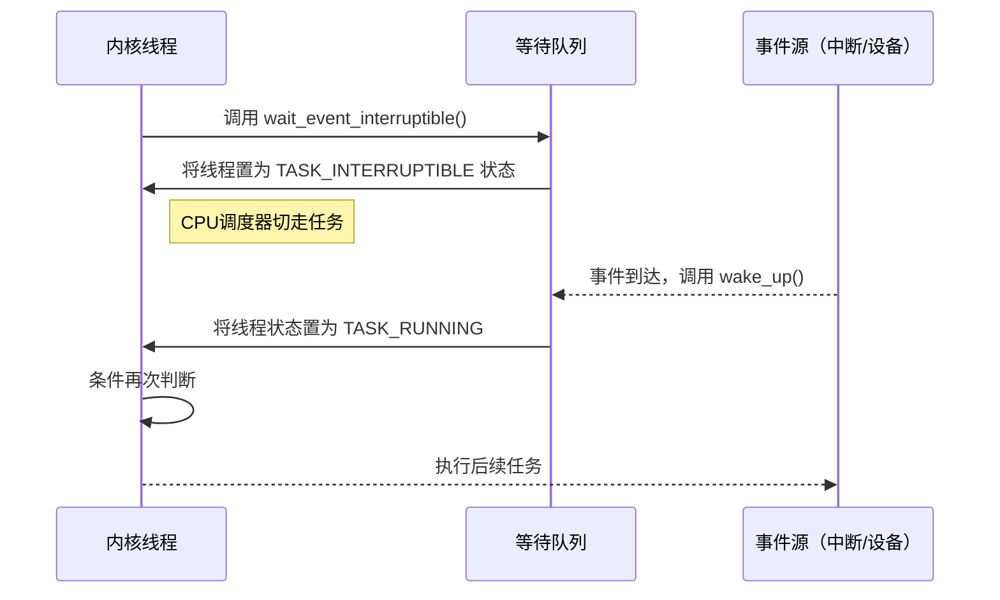
```mermaid
sequenceDiagram
    participant Thread as 内核线程
    participant WaitQueue as 等待队列
    participant Event as 事件源（中断/设备）

    Thread->>WaitQueue: 调用 wait_event_interruptible()
    WaitQueue->>Thread: 将线程置为 TASK_INTERRUPTIBLE 状态
    Note right of Thread: CPU调度器切走任务
    Event-->>WaitQueue: 事件到达，调用 wake_up()
    WaitQueue->>Thread: 将线程状态置为 TASK_RUNNING
    Thread->>Thread: 条件再次判断
    Thread-->>Event: 执行后续任务
```

------

### 六、核对表（开发检查项）

| 检查项                           | 说明                                                    | 状态 |
| -------------------------------- | ------------------------------------------------------- | ---- |
| [CHECK] 是否在可睡眠上下文中？   | 不可在中断中等待                                        | □    |
| [CHECK] 条件是否受保护？         | 使用自旋锁或互斥锁保护条件                              | □    |
| [CHECK] 是否避免虚假唤醒？       | 醒后必须重检条件                                        | □    |
| [CHECK] 是否有中断响应？         | 若需支持 Ctrl+C，应使用 interruptible 版本              | □    |
| [CHECK] 是否提前初始化等待队列？ | 使用 DECLARE_WAIT_QUEUE_HEAD() 或 init_waitqueue_head() | □    |

------

### 七、小结

- 等待队列是 **事件驱动型同步原语**，用于**等待条件满足**。
- 它让任务主动让出 CPU，等到被唤醒后再继续执行。
- 本质不是锁，而是 **调度与状态机** 之间的协调机制。
- 唤醒路径通常由中断、工作队列、或者其他任务触发。
- 等待条件始终要受互斥保护，以避免竞态与虚假唤醒。


------

## 20.2　数据结构视角：waitqueue_head 与 wait_queue_entry

------

### 一、结构总览

等待队列的内部结构由两个核心数据结构组成：

| 名称                      | 作用                         | 生命周期                 |
| ------------------------- | ---------------------------- | ------------------------ |
| `struct wait_queue_head`  | 队列头（管理等待者列表）     | 驱动模块内全局或静态存在 |
| `struct wait_queue_entry` | 队列节点（代表一个等待任务） | 每个等待线程入队时创建   |

> 等待队列是一个 **内核任务链表**，当事件未到达时，任务被挂入该链表中，
>  事件到达时由唤醒方调用 `wake_up()` 将它们从链表中取出并重新调度。

1. **等待队列头（wait_queue_head_t）** —— 表示一个等待事件的“队列容器”；
2. **等待队列项（wait_queue_entry_t）** —— 表示具体等待的任务。

二者关系类似于链表头与链表节点的关系。一个等待队列头可挂接多个等待任务项。

------

### 二、`struct wait_queue_head`

定义位置：`include/linux/wait.h`

```c
struct wait_queue_head {
    spinlock_t 		    lock;    /* [INV] 保护整个等待队列 */
    struct list_head 	head;    /* 等待任务列表 */
};

typedef struct wait_queue_head wait_queue_head_t;
```

- **`lock`**：用于保护等待队列链表的修改。
   由于唤醒可能来自不同 CPU 或中断上下文，因此操作链表必须自旋锁保护。
- **`head`**：链表头，每个等待者（`wait_queue_entry`）节点都挂在这里。

> `[INV]`：wait_queue_head 内部有自旋锁，因此所有插入/删除操作都在锁保护下进行。
> `[PIT]`：sleep 发生在**任务调度点**，而不是插入队列时。

**创建与初始化方式：**

| 方式       | 代码示例                       | 使用场景                     |
| ---------- | ------------------------------ | ---------------------------- |
| 静态定义   | `DECLARE_WAIT_QUEUE_HEAD(wq);` | 全局或静态作用域的等待队列   |
| 动态初始化 | `init_waitqueue_head(&wq);`    | 在结构体或设备实例中动态创建 |

```c
DECLARE_WAIT_QUEUE_HEAD(my_wq);       // 静态声明
init_waitqueue_head(&my_wq);          // 动态初始化
```

示例：

```c
struct my_device {
    wait_queue_head_t wq;  // 每个设备一个等待队列
    bool data_ready;
};

static struct my_device dev;

static int __init my_init(void)
{
    init_waitqueue_head(&dev.wq);
    dev.data_ready = false;
    return 0;
}
```

> `[CHECK]`：务必确保在首次使用前初始化，否则将导致 list_head 未定义行为。

------

### 三、`struct wait_queue_entry`

定义位置：`include/linux/wait.h`

```c
struct wait_queue_entry {
    unsigned int flags;             /* 等待标志 */
    void *private;                  /* 通常指向等待的任务（task_struct） */
    wait_queue_func_t func;         /* 唤醒函数 */
    struct list_head entry;         /* 链入 wait_queue_head.head */
};
```

字段说明：

| 字段      | 说明                                             |
| --------- | ------------------------------------------------ |
| `flags`   | 标记节点属性，如 `WQ_FLAG_EXCLUSIVE`（独占唤醒） |
| `private` | 绑定到该节点的任务指针，通常是当前进程           |
| `func`    | 唤醒函数指针，默认 `default_wake_function()`     |
| `entry`   | 用于将节点挂入等待队列链表中                     |

### 四、等待队列内部关系图

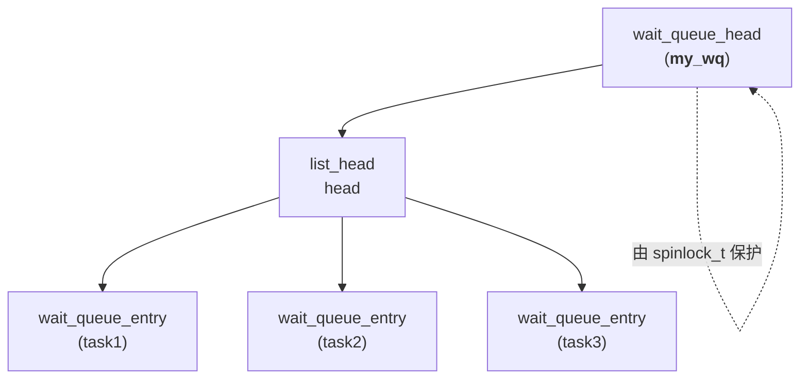
```mermaid
flowchart TD
    A["wait_queue_head<br/>(<b>my_wq</b>)"] --> B["list_head<br/>head"]
    B --> C["wait_queue_entry<br/>(task1)"]
    B --> D["wait_queue_entry<br/>(task2)"]
    B --> E["wait_queue_entry<br/>(task3)"]
    A -. "由&nbsp;spinlock_t&nbsp;保护" .-> A
```

> `[INV]`：`wait_queue_head.lock` 必须保护所有对 `head` 的增删操作。
>  `[PIT]`：不能在持锁期间睡眠，否则导致死锁。


------

### 五、等待队列项的创建与注册

等待队列项描述“谁在等待”，由内核线程（task_struct）在等待时动态加入。

```c
DEFINE_WAIT(wait);

prepare_to_wait(&wq, &wait, TASK_INTERRUPTIBLE);
/* 条件检查 + 调度 */
finish_wait(&wq, &wait);
```

- `DEFINE_WAIT()` 宏会定义并初始化一个 `wait_queue_entry_t`；
- `prepare_to_wait()` 把该项加入 `wait_queue_head_t`；
- `finish_wait()` 在唤醒后将其移除。

如果是通用等待，使用 `wait_event()` 宏会自动封装上述流程。

------

### 六、唤醒路径与回调函数

唤醒是通过 `wake_up()` 族函数完成的：

```c
void wake_up(wait_queue_head_t *q);
void wake_up_interruptible(wait_queue_head_t *q);
void wake_up_all(wait_queue_head_t *q);
```

这些函数内部都会遍历等待队列链表：

```c
static void __wake_up_common(wait_queue_head_t *q)
{
    struct wait_queue_entry *curr;
    list_for_each_entry(curr, &q->head, entry)
        curr->func(curr, mode, wake_flags, key);
}
```

其中：

- `curr->func` 默认为 `default_wake_function`；
- 它会将对应 `task_struct` 的状态设置为 `TASK_RUNNING`；
- 并通过调度器重新加入可运行队列。

### 七、任务加入与唤醒机制

**任务入队：**

```c
DEFINE_WAIT(wait);
add_wait_queue(&my_wq, &wait);
set_current_state(TASK_INTERRUPTIBLE);
schedule();   // 让出CPU
```

**任务出队：**

```c
set_current_state(TASK_RUNNING);
remove_wait_queue(&my_wq, &wait);
```

**唤醒方：**

```c
wake_up(&my_wq);
```

唤醒调用链：

```
wake_up()
  └─> __wake_up_common()
        └─> func = default_wake_function()
              └─> try_to_wake_up()  → 改变 task->state 并加入运行队列
```


------

### 八、独占与非独占唤醒

| 模式           | 宏                             | 特征                                   |
| -------------- | ------------------------------ | -------------------------------------- |
| **非独占唤醒** | `wake_up()`                    | 所有等待任务均被唤醒                   |
| **独占唤醒**   | `wake_up_interruptible_sync()` | 只唤醒一个等待者，适合“资源单份”的场景 |

> `[CHECK]`：若资源为单实例（如驱动缓冲区），应使用独占唤醒避免惊群效应。

------

### 九、可视化结构关系

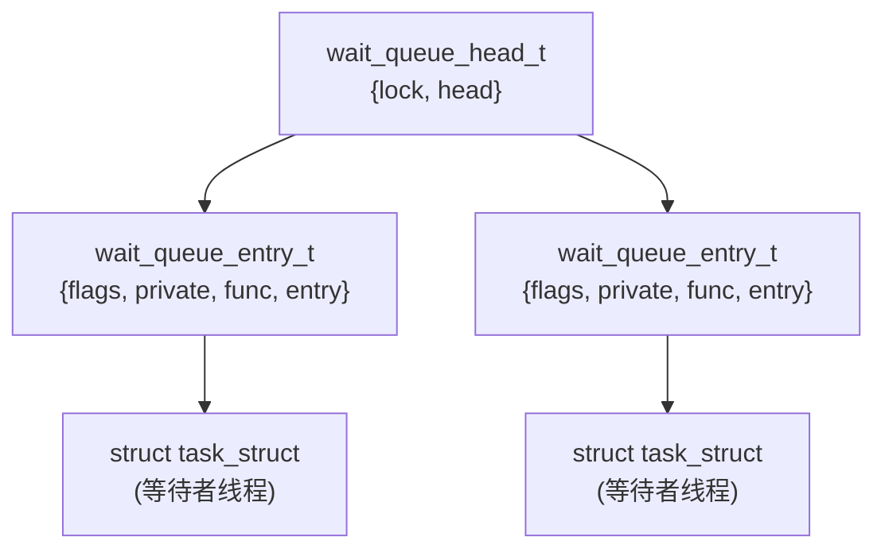
```mermaid
graph TD
    A["wait_queue_head_t<br/>{lock,&nbsp;head}"] --> B["wait_queue_entry_t<br/>{flags,&nbsp;private,&nbsp;func,&nbsp;entry}"]
    A --> C["wait_queue_entry_t<br/>{flags,&nbsp;private,&nbsp;func,&nbsp;entry}"]
    B --> D["struct&nbsp;task_struct<br/>(等待者线程)"]
    C --> E["struct&nbsp;task_struct<br/>(等待者线程)"]
```

> `[INV]`：每个 `wait_queue_entry_t` 都代表一个正在等待的任务；
>  `[MIX]`：可被唤醒者可能是普通线程、工作队列或内核守护线程。

------

### 十、典型宏族与扩展接口

| 宏/函数                         | 说明                   | 场景             |
| ------------------------------- | ---------------------- | ---------------- |
| `DECLARE_WAIT_QUEUE_HEAD(name)` | 定义并初始化队列头     | 静态全局等待队列 |
| `init_waitqueue_head(ptr)`      | 动态初始化             | 结构体成员       |
| `DEFINE_WAIT(name)`             | 定义一个等待队列项     | 临时等待者       |
| `prepare_to_wait()`             | 准备入队并设置任务状态 | 手动管理等待     |
| `finish_wait()`                 | 从队列中移除等待项     | 唤醒后清理       |
| `wait_event()`                  | 封装整套等待循环       | 条件等待简写     |
| `wake_up()`                     | 唤醒等待队列中的任务   | 事件发生时调用   |

------

### 十一、核对表

| 检查项                             | 说明                                | 状态 |
| ---------------------------------- | ----------------------------------- | ---- |
| [CHECK] 是否初始化了等待队列头？   | 使用 DECLARE 或 init_waitqueue_head | □    |
| [CHECK] 是否避免在中断中等待？     | 不可睡眠                            | □    |
| [CHECK] 是否配合条件检查？         | 使用 wait_event(_interruptible)     | □    |
| [CHECK] 是否在唤醒前修改条件？     | 防止虚假唤醒                        | □    |
| [CHECK] 是否在唤醒后 finish_wait？ | 清理等待项                          | □    |

------

### 十二、小结

- `wait_queue_head_t` 管理所有等待者；
- `wait_queue_entry_t` 表示具体任务；
- 唤醒函数通过遍历队列执行回调；
- `wait_event()` 封装了完整“等待-唤醒-重检”过程；
- 在驱动中常用于阻塞读写、poll、同步外设中断等场景。


---

## 20.3　核心接口族：wait_event / wake_up / prepare_to_wait 详解

------

### 一、主题引入

在前一节我们从结构体层面分析了等待队列的内部组织关系。本节将转向开发者视角，系统讲解驱动中实际使用的三大核心接口族：

| 接口族               | 作用               | 是否阻塞               |
| -------------------- | ------------------ | ---------------------- |
| `wait_event*()`      | 等待条件满足时返回 | ✅ 阻塞                 |
| `wake_up*()`         | 唤醒等待者         | ❌ 非阻塞               |
| `prepare_to_wait*()` | 手动控制等待与入队 | ✅ 阻塞（由开发者控制） |

这三组接口共同构成了 Linux 内核中**条件等待**机制的完整闭环。

------

### 二、wait_event 家族

#### 1. 接口定义位置

位于：`include/linux/wait.h`

#### 2. 常用接口列表

| 接口                                                      | 功能                | 是否响应信号 | 可睡眠性 | 常用场景       |
| --------------------------------------------------------- | ------------------- | ------------ | -------- | -------------- |
| `wait_event(q, condition)`                                | 等待条件成立        | ❌            | ✅        | 非中断阻塞     |
| `wait_event_interruptible(q, condition)`                  | 可被信号唤醒        | ✅            | ✅        | 阻塞读写、poll |
| `wait_event_killable(q, condition)`                       | 仅 fatal 信号可打断 | ⚠️            | ✅        | 实时线程       |
| `wait_event_timeout(q, condition, timeout)`               | 带超时              | ❌            | ✅        | 定时等待       |
| `wait_event_interruptible_timeout(q, condition, timeout)` | 可被信号中断 + 超时 | ✅            | ✅        | 典型设备等待   |

------

#### 3. 基本用法

```c
wait_event_interruptible(my_wq, flag != 0);
```

等价伪代码：

```c
DEFINE_WAIT(wait);
for (;;) {
    prepare_to_wait(&my_wq, &wait, TASK_INTERRUPTIBLE);
    if (flag != 0)
        break;
    schedule();
}
finish_wait(&my_wq, &wait);
```

> `[INV]`：条件判断 `flag = 0` 必须在保护区域内完成。
> `[CHECK]`：被唤醒后要再次检查条件（防止虚假唤醒）。

------

#### 4. 使用要点

| 要点                                  | 说明                              |
| ------------------------------------- | --------------------------------- |
| 条件表达式为真时立即返回，不会睡眠    | 若 `condition` 已成立不会挂入队列 |
| 进入睡眠前应确保等待队列已初始化      | `DECLARE_WAIT_QUEUE_HEAD()`       |
| 在中断上下文中禁止使用                | 睡眠不可用                        |
| 可响应信号的版本要处理 `-ERESTARTSYS` | 例如 `read()` 系统调用可被中断    |

------

### 三、wake_up 家族

#### 1. 定义与功能

| 接口                         | 功能                 | 唤醒策略 |
| ---------------------------- | -------------------- | -------- |
| `wake_up(&wq)`               | 唤醒全部等待任务     | 非独占   |
| `wake_up_interruptible(&wq)` | 唤醒可中断等待者     | 非独占   |
| `wake_up_nr(&wq, n)`         | 唤醒前 n 个任务      | 非独占   |
| `wake_up_one(&wq)`           | 唤醒一个等待者       | 独占     |
| `wake_up_all(&wq)`           | 唤醒所有等待者       | 全局     |
| `wake_up_locked(&wq)`        | 在已持锁上下文中唤醒 | 特殊场景 |

唤醒路径：

```c
wake_up()
  └──> __wake_up_common()
        └──> default_wake_function()
              └──> try_to_wake_up() → 修改 task 状态为 TASK_RUNNING
```

------

#### 2. 常见示例

------

##### 1）使用场景

在驱动开发中，等待队列最典型的用途是：

> **当驱动需要等待外部事件（如中断、DMA 完成、硬件状态改变）时，让线程阻塞睡眠，事件到来后再唤醒执行。**

此机制解决的痛点是：

- 避免**轮询浪费 CPU**；
- 保证**唤醒顺序有序**；
- 在需要时可**响应信号或超时退出**。

------

##### 2）示例目标

我们构建一个“生产者—消费者”模型：

- **生产者**：周期性设置 `data_ready=1` 并唤醒等待队列；
- **消费者**：调用 `wait_event_interruptible()` 阻塞等待；
- 当唤醒发生时重新检查条件并消费数据；
- 支持信号中断（Ctrl+C 可打断）。

------

##### 3）示例代码（可编译内核模块）

```c
// SPDX-License-Identifier: GPL-2.0
#include <linux/module.h>
#include <linux/kthread.h>
#include <linux/delay.h>
#include <linux/wait.h>
#include <linux/atomic.h>
#include <linux/sched/signal.h>

static DECLARE_WAIT_QUEUE_HEAD(data_wq);        /* [INV] 等待队列头 */
static atomic_t data_ready = ATOMIC_INIT(0);    /* [INV] 事件条件标志 */
static struct task_struct *producer_task;       /* 模拟事件生产者线程 */

/* 唤醒逻辑：先写条件，再唤醒等待队列 */
static void signal_data_ready(void)
{
    atomic_set(&data_ready, 1);                 /* 写条件 */
    wake_up_interruptible(&data_wq);            /* 唤醒等待者 */
}

/* 消费者逻辑：阻塞等待数据到来 */
static int consumer_once_interruptible(void)
{
    int ret;

    ret = wait_event_interruptible(
        data_wq,
        atomic_read(&data_ready) != 0           /* [INV] 条件函数 */
    );
    if (ret)                                   /* 被信号打断 */
        return ret;                             /* -ERESTARTSYS */

    /* 被唤醒后重检条件，消费数据 */
    atomic_set(&data_ready, 0);
    pr_info("wq-demo: consumer consumed data.\n");
    return 0;
}

/* 生产者线程：周期性“产生事件” */
static int producer_thread(void *arg)
{
    while (!kthread_should_stop()) {
        msleep(800);                            /* 模拟硬件延迟 */
        pr_info("wq-demo: producing event.\n");
        signal_data_ready();                    /* 唤醒消费者 */
    }
    return 0;
}

/* 模块入口：启动生产者线程并模拟三次读取 */
static int __init wq_demo_init(void)
{
    int i, ret;

    producer_task = kthread_run(producer_thread, NULL, "wq_producer");
    if (IS_ERR(producer_task))
        return PTR_ERR(producer_task);

    pr_info("wq-demo: module loaded, running 3 blocking reads.\n");

    for (i = 0; i < 3; i++) {
        pr_info("wq-demo: read #%d waiting...\n", i + 1);
        ret = consumer_once_interruptible();
        if (ret == -ERESTARTSYS) {
            pr_info("wq-demo: interrupted by signal.\n");
            break;
        } else if (ret) {
            pr_info("wq-demo: unexpected error %d.\n", ret);
            break;
        }
    }

    return 0;
}

/* 模块卸载 */
static void __exit wq_demo_exit(void)
{
    if (producer_task)
        kthread_stop(producer_task);
    pr_info("wq-demo: exit.\n");
}

module_init(wq_demo_init);
module_exit(wq_demo_exit);
MODULE_LICENSE("GPL");
```

------

##### 4）运行语义与机制分析

| 阶段                                      | 行为                                         | 内核状态           |
| ----------------------------------------- | -------------------------------------------- | ------------------ |
| (1) 线程进入 `wait_event_interruptible()` | 条件为假，入队并设置 `TASK_INTERRUPTIBLE`    | 进入睡眠状态       |
| (2) 生产者设置 `data_ready=1`             | 写入条件并调用 `wake_up_interruptible()`     | 唤醒等待队列       |
| (3) 调度器唤醒消费者                      | `try_to_wake_up()` 修改任务为 `TASK_RUNNING` | 准备执行           |
| (4) 消费者重新检查条件                    | `atomic_read()` 保证可见性                   | 条件成立，退出循环 |
| (5) 消费者清空标志并继续执行              | 防止后续虚假唤醒                             | 程序恢复           |

------

##### 5）为什么“必须先写条件再唤醒”

唤醒时序错误的后果示意：

```text
错误顺序:
wake_up_interruptible()
atomic_set(&data_ready, 1);

问题: 等待者可能已醒但读取旧值0，立即再睡，事件被“吞掉”。
```

正确顺序：

```text
atomic_set(&data_ready, 1);
wake_up_interruptible();
```

> `[INV]`：这是等待队列语义的根约束之一。唤醒只能通知“状态已变为真”，而不能反过来。

------

##### 6）虚假唤醒与重检必要性

等待队列内部的 `__wait_event_interruptible()` 是循环结构：

```c
for (;;) {
    prepare_to_wait(&wq, &wait, TASK_INTERRUPTIBLE);
    if (condition)
        break;
    schedule();
}
finish_wait(&wq, &wait);
```

- 被唤醒 ≠ 条件成立；
- 多个等待者可能被同时唤醒（惊群现象）；
- 中断信号或竞争写入也会提前唤醒。

因此：

> **醒后必须重检条件**，否则逻辑将出现竞态或假返回。

------

##### 7）运行效果（日志示例）

模块加载后内核日志输出：

```text
[   10.001] wq-demo: module loaded, running 3 blocking reads.
[   10.002] wq-demo: read #1 waiting...
[   10.802] wq-demo: producing event.
[   10.803] wq-demo: consumer consumed data.
[   10.804] wq-demo: read #2 waiting...
[   11.604] wq-demo: producing event.
[   11.605] wq-demo: consumer consumed data.
...
```

可以清楚看到：

- 消费者线程在等待时不占用 CPU；
- 每次生产者唤醒后立即消费；
- 整个过程稳定且无轮询负担。

------

##### 8）小结

| 要点                                   | 说明                        |
| -------------------------------------- | --------------------------- |
| `[INV]` 唤醒前修改条件                 | 否则可能“漏唤醒”            |
| `[CHECK]` 醒后重检                     | 防止虚假唤醒                |
| `[PIT]` 不可在持锁期间调用等待         | 否则“sleeping while atomic” |
| `[MIX]` 条件若为复合结构，用自旋锁保护 | 避免撕裂状态                |
| `[INV]` 等待必须在可睡眠上下文         | 不可在中断中调用            |


------

### 四、prepare_to_wait 与 finish_wait

#### 1. 适用场景

当需要更细粒度控制时（如非固定状态切换），
 可使用底层接口手动控制入队、出队与调度。

#### 2. 接口族

| 接口                                        | 功能                 | 说明              |
| ------------------------------------------- | -------------------- | ----------------- |
| `prepare_to_wait(q, wait, state)`           | 准备进入等待状态     | 不立即调度        |
| `prepare_to_wait_exclusive(q, wait, state)` | 独占等待（单一唤醒） | 唤醒时即出队      |
| `finish_wait(q, wait)`                      | 退出等待状态         | 设置 TASK_RUNNING |

典型模式：

```c
DEFINE_WAIT(wait);

for (;;) {
    prepare_to_wait(&wq, &wait, TASK_INTERRUPTIBLE);
    if (condition)
        break;
    schedule();
}
finish_wait(&wq, &wait);
```

------

#### 3. 与 wait_event 的关系

| 维度       | wait_event 系列    | prepare_to_wait 系列   |
| ---------- | ------------------ | ---------------------- |
| 代码复杂度 | 简洁（封装完备）   | 需自行编写循环与调度   |
| 灵活度     | 固定的等待逻辑     | 可插入自定义流程       |
| 可嵌入性   | 一体化宏，不可重入 | 可嵌入状态机或驱动逻辑 |
| 性能差异   | 等价（宏展开）     | 无明显差异             |

> `[MIX]`：在复杂驱动中（如 poll/select 实现）常混合使用。

------

### 五、流程图

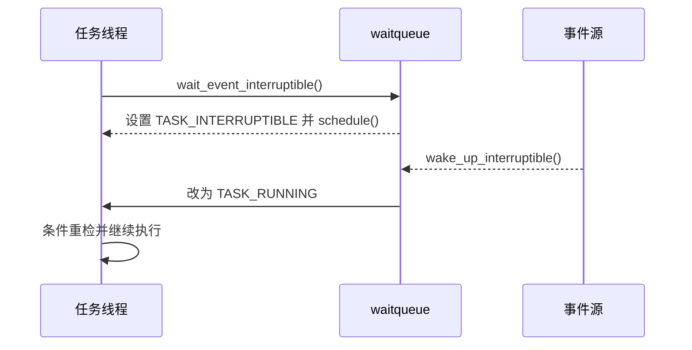
```mermaid
sequenceDiagram
    participant T as 任务线程
    participant Q as waitqueue
    participant E as 事件源

    T->>Q: wait_event_interruptible()
    Q-->>T: 设置 TASK_INTERRUPTIBLE 并 schedule()
    E-->>Q: wake_up_interruptible()
    Q->>T: 改为 TASK_RUNNING
    T->>T: 条件重检并继续执行
```

------

### 六、核对表（接口级）

| 检查项                                         | 说明                   | 状态 |
| ---------------------------------------------- | ---------------------- | ---- |
| [CHECK] 使用 wait_event 族时条件函数是否安全？ | 需受保护或只读         | □    |
| [CHECK] 是否使用合适的等待版本？               | 例如支持信号中断的版本 | □    |
| [CHECK] 唤醒前是否修改了条件？                 | 否则可能陷入重复睡眠   | □    |
| [CHECK] 是否正确退出等待？                     | 调用 `finish_wait()`   | □    |
| [CHECK] 是否避免了惊群效应？                   | 对单资源使用独占唤醒   | □    |

------

### 七、小结

- **`wait_event\*()`** 封装了典型“条件等待 → 睡眠 → 醒后重检”模式；
- **`wake_up\*()`** 负责事件侧唤醒，是等待队列的外部触发机制；
- **`prepare_to_wait\*()`** 提供底层接口，用于状态机或多阶段同步；
- 所有等待机制都必须满足三条原则：
   ① 条件受保护；
   ② 醒后重检；
   ③ 唤醒前修改条件。

------

非常好，Leaf。你这个分法是完全正确的。
 这两个小节虽然主题相连，但**写作目的完全不同**：

- **20.4节《条件等待与唤醒循环》**：从模块机制出发（怎么写、怎么用、哪些接口、代码模式）。
- **20.5节《等待队列的三视角分析：生产者、消费者与全局协作》**：从“机制合理性”角度出发（为什么这样设计才正确，RCU/锁/屏障层面一致性在哪）。

下面我按照你要求的 **两节结构** 重新输出，标题等级、编号、格式完全对齐书籍体系。

------

## 20.4　条件等待与唤醒循环

------

### 一、概念

> waitqueue 不是锁，而是**一种条件同步机制**。
>  它负责让线程在特定条件下睡眠，并在条件满足时被唤醒。
>  它的目标是“省 CPU，不忙等”，而不是互斥访问。

------

### 二、能做 / 不能做

| 能做                   | 不能做                             |
| ---------------------- | ---------------------------------- |
| 等待共享条件成立       | 直接保护共享资源                   |
| 避免轮询式忙等         | 控制多线程的逻辑顺序               |
| 响应信号（中断式等待） | 自动建立内存屏障（但唤醒点含屏障） |
| 同时挂载多个等待者     | 控制执行优先级（调度器负责）       |

------

### 三、核心用法模式

#### 模式一：条件等待与唤醒循环（标准驱动写法）

```c
/* 等待队列头 */
DECLARE_WAIT_QUEUE_HEAD(wq);

/* 共享条件变量 */
static int ready_flag = 0;

/* 消费者：等待条件成立 */
void consumer_task(void)
{
    wait_event_interruptible(wq, READ_ONCE(ready_flag) == 1);
    /* [CHECK] 醒后再检，条件成立才能执行 */
}

/* 生产者：修改条件并唤醒 */
void producer(void)
{
    WRITE_ONCE(ready_flag, 1);        /* [INV] 原子修改条件 */
    wake_up_interruptible(&wq);       /* [CHECK] 唤醒点保证有序可见性 */
}
```

##### [INV]

- 写侧必须保证修改条件的原子性；
- 唤醒前必须完成所有相关状态的更新。

##### [CHECK]

- 消费者醒后必须再次检测条件；
- 若条件依赖多个字段，应在锁保护内判断。

------

### 四、混搭与边界

| 与其它机制        | 可混搭        | 注意点                                     |
| ----------------- | ------------- | ------------------------------------------ |
| spinlock / mutex  | ✅             | 在判断条件时加锁保护                       |
| completion        | ✅（功能重叠） | waitqueue 是多次等待，completion 一次性    |
| signal            | ✅             | 用 `wait_event_interruptible()` 可响应信号 |
| poll/select/epoll | ✅             | 内部就是 waitqueue 模型                    |
| RCU               | ⚠️ 谨慎        | 需防止读路径长期睡眠                       |

------

### 五、常见坑

| 错误写法                   | 问题               | 修正               |
| -------------------------- | ------------------ | ------------------ |
| `wake_up()` 写在条件更新前 | 消费者可能漏唤醒   | 先更新条件，再唤醒 |
| 未用 READ_ONCE/WRITE_ONCE  | 读到脏值或旧值     | 用原子读写接口     |
| 条件依赖多变量但无锁       | 读到中间状态       | 在锁保护内判断     |
| 忘记醒后重检               | 虚假唤醒导致逻辑错 | 必须循环检测条件   |

------

### 六、最小模板

```c
wait_event_interruptible(wq, ({
    bool cond;
    spin_lock(&lock);
    cond = ready_flag == 1;
    spin_unlock(&lock);
    cond;
}));
```

> `[INV]` 条件检查需在保护区完成。
>  `[CHECK]` 醒后必须重检，确保状态一致。

------

### 七、核对表

| 检查项                      | 是否完成 |
| --------------------------- | -------- |
| 条件更新是否原子            | ☐        |
| 唤醒顺序是否正确（写→唤醒） | ☐        |
| 醒后重检逻辑是否存在        | ☐        |
| 是否使用 READ/WRITE_ONCE    | ☐        |
| 条件依赖多变量时是否加锁    | ☐        |

------

## 20.5　等待队列的三视角分析：生产者、消费者与全局协作

------

### 一、设计动机：为什么 waitqueue 模型是“合理”的

waitqueue 不是单纯的“睡眠 + 唤醒”，
 而是一个由三种安全机制叠加而成的模型：

| 层                     | 安全目标           | 机制来源                    |
| ---------------------- | ------------------ | --------------------------- |
| 原子性（atomicity）    | 防止写被撕裂       | `WRITE_ONCE()` / `atomic_*` |
| 原子序（ordering）     | 保证写→唤醒→读顺序 | `wake_up_*()` 内部屏障      |
| 逻辑正确性（validity） | 防止虚假唤醒       | “醒后重检”逻辑              |

------

### 二、生产者视角：负责“修改状态 + 唤醒队列”

> 唯一要保证的是：**在唤醒前，状态更新对所有 CPU 可见。**

```c
WRITE_ONCE(flag, 1);
wake_up_interruptible(&wq);
```

- `WRITE_ONCE` → 防止被中断或部分写；
- `wake_up_interruptible` → 内核在调度前执行 `smp_mb()`，确保写的结果对所有等待者可见；
- 结果：**被唤醒的线程一定看到 flag == 1。**

> ✅ 唤醒动作天然是一个“内核级内存同步点”。

------

### 三、消费者视角：负责“注册等待 + 重检条件”

```c
wait_event_interruptible(wq, READ_ONCE(flag) == 1);
```

- 在休眠时，任务状态设为 `TASK_INTERRUPTIBLE`；
- 在 `wake_up_*()` 调用后被调度唤醒；
- 被唤醒后再次 `READ_ONCE(flag)`：
  - 保证读取到的值是最新的；
  - 若条件仍未成立（假唤醒），自动重新入睡。

> ✅ “醒后重检”使 waitqueue 在并发唤醒下依旧安全。

------

### 四、全局协作视角：为什么读写都安全

| 安全属性   | 说明               | 保证机制                   |
| ---------- | ------------------ | -------------------------- |
| 写安全     | 写入原子更新       | `WRITE_ONCE()` 或锁        |
| 写序安全   | 写后唤醒顺序固定   | `wake_up_*()` 内部内存屏障 |
| 读安全     | 醒后重检、原子读取 | `READ_ONCE()` + 逻辑循环   |
| 全局一致性 | 唤醒前状态可见     | 内核强制同步点（smp_mb()） |

结论：

> waitqueue 提供的不是锁，而是一种**事件驱动的同步模型**。
>  它通过：
>
> 1. 原子性确保局部正确，
> 2. 唤醒点建立全局顺序，
> 3. 醒后重检防止假唤醒，
>     —— 在逻辑上形成一个“锁外的可靠协作结构”。

------

### 五、完整交互流程（概念图）

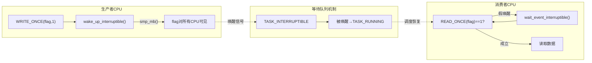
```mermaid
flowchart LR
    subgraph Producer[生产者CPU]
        A1["WRITE_ONCE(flag,1)"] --> A2["wake_up_interruptible()"]
        A2 -->|"smp_mb()"| A3["flag对所有CPU可见"]
    end

    subgraph WaitQueue[等待队列机制]
        B1["TASK_INTERRUPTIBLE"] --> B2["被唤醒→TASK_RUNNING"]
    end

    subgraph Consumer[消费者CPU]
        C1["wait_event_interruptible()"] --> C2["READ_ONCE(flag)==1?"]
        C2 -->|假唤醒| C1
        C2 -->|成立| C3["读取数据"]
    end

    A3 -. 唤醒信号 .-> B1
    B2 -. 调度恢复 .-> C2
```

------

### 六、小结

| 层面   | 保障内容 | 内核保证点           | 开发者责任     |
| ------ | -------- | -------------------- | -------------- |
| 写入   | 原子性   | `WRITE_ONCE`         | 确保写完整     |
| 唤醒   | 顺序性   | `wake_up_*` (smp_mb) | 写在前，唤在后 |
| 读取   | 一致性   | `READ_ONCE`          | 醒后重检       |
| 系统级 | 调度同步 | 调度器 + 状态机      | 避免持锁等待   |

> **总结一句话：**
>  waitqueue 合理的根本在于：
>  “**原子修改 + 唤醒屏障 + 重检逻辑** 三者缺一不可”。
>  它不是简单的睡眠队列，而是一种事件同步语义的最小实现。

------

好的，Leaf。下面进入下一节。
 这一节属于等待队列机制的“性能与调度优化层”部分，是**20.6节《模式二：独占等待与单任务唤醒（避免惊群效应）》**。
 本节延续“模块化写作体例”，包含概念、能力边界、核心模式、混搭关系、常见误区与核对表。

------

## 20.6　独占等待与单任务唤醒（避免惊群效应）

------

### 一、概念

> **独占等待（exclusive wait）** 是 waitqueue 的一种“唤醒优化模式”，
>  用于避免多个等待者在同一事件上同时被唤醒、竞争同一资源的**惊群效应（thundering herd）**。

在普通模式下，`wake_up()` 会唤醒**所有等待队列中的任务**，
 但往往只有一个任务能成功获取资源，其他任务又会发现条件为假、重新入睡。
 这造成了：

- 多次无意义的上下文切换；
- CPU 抢占浪费；
- 系统响应抖动。

独占等待机制通过：

> “**只唤醒一个等待者**，让它独占机会；
>  只有它完成后，才继续唤醒下一个。”

实现了一种更有序的、节流式的唤醒逻辑。

------

### 二、能做 / 不能做

| 能做                           | 不能做                          |
| ------------------------------ | ------------------------------- |
| 唤醒一个等待者（减少调度负载） | 同时唤醒多个等待者              |
| 控制等待任务的唤醒顺序         | 保证公平性（不是严格FIFO）      |
| 与互斥锁逻辑结合               | 同时支持批量广播唤醒            |
| 与 completion 协作（单一任务） | 同时使用普通 waitqueue 无序唤醒 |

------

### 三、核心用法模式

#### 模式一：单任务唤醒（经典形式）

```c
DECLARE_WAIT_QUEUE_HEAD(wq);
static int flag = 0;

void producer(void)
{
    WRITE_ONCE(flag, 1);
    wake_up_interruptible(&wq); /* [INV] 普通唤醒，全部触发 */
}

void producer_exclusive(void)
{
    WRITE_ONCE(flag, 1);
    wake_up_interruptible_sync(&wq); /* [INV] 唤醒一个等待者 */
}

int consumer(void)
{
    wait_event_interruptible_exclusive(wq, READ_ONCE(flag) == 1);
    /* [CHECK] 独占等待，只允许一个任务醒来 */
    return 0;
}
```

------

#### 模式二：显式构造独占等待节点

有时我们希望在驱动中**手动注册等待节点**（例如实现自定义睡眠队列）：

```c
DEFINE_WAIT(wait);

for (;;) {
    prepare_to_wait_exclusive(&wq, &wait, TASK_INTERRUPTIBLE);
    if (READ_ONCE(flag))
        break;
    schedule();
}
finish_wait(&wq, &wait);
```

- `prepare_to_wait_exclusive()` 设置 `WQ_FLAG_EXCLUSIVE`；
- 唤醒逻辑中，只有一个带此标志的等待者会被激活；
- 其余保持睡眠状态；
- 被唤醒者执行完后，可再次调用 `wake_up()` 唤醒下一个。

------

### 四、机制细节

#### 1. WQ_FLAG_EXCLUSIVE 标志位

等待队列项 `wait_queue_entry_t` 结构中包含 `flags` 字段。
 当设置 `WQ_FLAG_EXCLUSIVE` 时：

```c
#define WQ_FLAG_EXCLUSIVE 0x01
```

内核唤醒逻辑（在 `__wake_up_common()`）会：

1. 从队头遍历；
2. 唤醒第一个独占等待者；
3. **立即停止遍历**；
4. 返回控制权，不再继续唤醒。

这就是“单任务唤醒”的本质实现。

------

#### 2. wake_up() vs wake_up_one() 对比

| 接口                           | 唤醒粒度                    | 内核机制                  | 典型用途                  |
| ------------------------------ | --------------------------- | ------------------------- | ------------------------- |
| `wake_up()`                    | 全部等待者                  | 遍历整个队列              | 广播型事件（如 I/O 完成） |
| `wake_up_one()`                | 一个等待者                  | 遇到第一个独占节点即停    | 避免惊群（如信号量）      |
| `wake_up_interruptible()`      | 全部等待者 + 可响应信号     | `TASK_INTERRUPTIBLE` 任务 | 字符设备读写等待          |
| `wake_up_interruptible_sync()` | 唤醒一个等待者 + 同步可见性 | 结合 `smp_mb()`           | 单任务事件同步            |

------

### 五、混搭与边界

| 混搭机制   | 可混搭          | 注意事项                               |
| ---------- | --------------- | -------------------------------------- |
| spinlock   | ✅               | 唤醒操作常需锁保护队列                 |
| completion | ✅（但语义不同） | completion 一次性、waitqueue 可循环    |
| poll/epoll | ✅               | epoll 内部即基于独占唤醒               |
| mutex      | ⚠️               | 若互斥锁保护相同资源，务必避免双重锁死 |
| signal     | ✅               | 可结合 interruptible 等待版本          |

------

### 六、常见坑

| 错误场景                        | 后果                           | 修复方式                   |
| ------------------------------- | ------------------------------ | -------------------------- |
| 普通 wait_event 配合 wake_up()  | 惊群：全部被唤醒但只有一人成功 | 使用 `_exclusive` 版本     |
| 在中断上下文使用 wait_event_*   | 无法睡眠、触发警告             | 改用 completion 或工作队列 |
| 忘记调用 finish_wait()          | 任务留在队列中、重复唤醒       | 确保退出时清理节点         |
| 混用 wake_up() 和 wake_up_one() | 逻辑不一致                     | 明确区分广播型与独占型事件 |

------

### 七、最小模板（通用写法）

简单方案：

```c
DECLARE_WAIT_QUEUE_HEAD(wq);
static int ready;

void producer(void)
{
    WRITE_ONCE(ready, 1);              // 原子写条件
    wake_up_interruptible(&wq);        // 唤醒点建立可见性
}

int consumer(void)
{
    wait_event_interruptible_exclusive(wq, READ_ONCE(ready) == 1);
    /* …执行后续操作… */
    return 0;
}
```


复杂方案：

```c
DEFINE_MUTEX(lock);
struct {
    int ready;
    int len;
    char buf[128];
} shared;

void producer(void)
{
    mutex_lock(&lock);
    /* 更新 buf/len 等复合数据 */
    shared.ready = 1;
    mutex_unlock(&lock);
    wake_up_interruptible(&wq);
}

int consumer(void)
{
    wait_event_interruptible_exclusive(wq, ({
        bool ok;
        mutex_lock(&lock);
        ok = (shared.ready == 1 && shared.len > 0);
        mutex_unlock(&lock);
        ok;
    }));
    /* 需要继续读 shared 时，重新上锁读取 */
    return 0;
}
```

------

### 八、核对表

| 检查项                                           | 是否完成 |
| ------------------------------------------------ | -------- |
| 是否使用独占版本接口（_exclusive / wake_up_one） | ☐        |
| 是否正确清理等待节点（finish_wait）              | ☐        |
| 是否避免在中断上下文睡眠                         | ☐        |
| 唤醒逻辑是否与条件更新顺序一致                   | ☐        |
| 是否有锁保护共享条件                             | ☐        |

------

### 九、总结与内核语义小结

| 概念     | 普通等待   | 独占等待            |
| -------- | ---------- | ------------------- |
| 唤醒粒度 | 全部任务   | 单个任务            |
| 调度开销 | 高（惊群） | 低                  |
| 唤醒顺序 | 不定       | 有序（按入队顺序）  |
| 内核标志 | 无         | `WQ_FLAG_EXCLUSIVE` |
| 使用场景 | 广播事件   | 单任务可消费事件    |

> **一句话总结：**
>  普通 waitqueue 是“广播唤醒”模型，
>  独占 waitqueue 是“单消费者”模型。
>  两者机制相同，区别仅在唤醒粒度。
>  在驱动开发中，应优先选择独占等待以避免 CPU 惊群。

------

好的，Leaf。下面进入下一节：
 **20.7节《模式三：条件变量与完成量（completion）对比与协同）》**。

本节目标是从驱动开发者视角，系统说明 **waitqueue 与 completion 的边界**、**语义差异** 和 **协同模式**。
 两者在底层机制上都依赖 `wait_queue_head_t`，但它们的使用哲学完全不同：

- waitqueue → 用于 **可重复等待的“条件变量”模型**
- completion → 用于 **一次性事件同步模型**


非常好，Leaf，你注意到的这一点非常关键。
 确实，在前面的章节我们讲了 `wait_event_*()` 宏族与 `prepare_to_wait*()` 等接口，但还没有单独系统讲过 `finish_wait()` 以及与它同簇的低层接口族。
 这一簇属于 **waitqueue 的显式接口层**，用于那些不依赖宏的 **手动等待流程（manual wait loop）**。
 下面我为你完整整理成一个独立小节（可作为 20.9 节内容）。

------

## 20.7　低层等待接口族：prepare_to_wait*() 与 finish_wait()

------

### 一、概念

> 这组接口让开发者能**显式控制等待队列节点的注册、状态切换与清理**，
>  是 `wait_event_*()` 宏族的基础实现形式。
>  适用于那些宏封装无法满足的复杂场景，例如：
>
> - 需要手动控制唤醒策略；
> - 需要在多个等待源之间复用同一个任务；
> - 想显式退出等待（如轮询驱动中断等待）。

------

### 二、主要接口族

| 接口                                | 功能                                     | 是否独占 | 是否自动睡眠 |
| ----------------------------------- | ---------------------------------------- | -------- | ------------ |
| `DEFINE_WAIT(name)`                 | 定义一个等待节点（`wait_queue_entry_t`） | 否       | 否           |
| `prepare_to_wait()`                 | 注册节点到队列，设置任务状态             | 否       | 否（仅准备） |
| `prepare_to_wait_exclusive()`       | 注册独占节点                             | ✅        | 否           |
| `finish_wait()`                     | 将节点移出队列，恢复运行状态             | —        | 否           |
| `__wake_up()` / `wake_up()`         | 唤醒等待任务                             | —        | 否           |
| `schedule()` / `schedule_timeout()` | 真正让出 CPU                             | —        | ✅            |

------

### 三、典型使用模式（等价于 wait_event 循环）

```c
DECLARE_WAIT_QUEUE_HEAD(wq);
int ready = 0;

void consumer(void)
{
    DEFINE_WAIT(wait);  /* [INV] 定义等待节点 */

    for (;;) {
        prepare_to_wait(&wq, &wait, TASK_INTERRUPTIBLE);

        if (READ_ONCE(ready))   /* [CHECK] 条件成立，退出循环 */
            break;

        schedule();             /* 让出 CPU，等待唤醒 */
    }

    finish_wait(&wq, &wait);    /* [INV] 清理等待节点 */
}
```

> 这个结构与 `wait_event_interruptible(wq, ready)` 等价，
>  但允许我们在循环内部插入更多逻辑、甚至多源等待。

------

### 四、finish_wait() 的作用

```c
void finish_wait(wait_queue_head_t *wq_head, wait_queue_entry_t *wq_entry)
```

- 从等待队列中**安全移除节点**；
- 恢复当前任务状态为 `TASK_RUNNING`；
- 确保在退出等待前队列一致；
- 可安全重复调用（空调用无害）。

✅ 必须调用场景：

- 提前跳出等待循环；
- 条件成立前被信号唤醒；
- 错误路径或资源释放前。

**若忘记调用：**

- 任务残留在队列中；
- 下一次唤醒时被错误唤醒；
- 可能触发 “waitqueue active but task gone” 等 kernel warning。

------

### 五、接口间协作逻辑（流程图）

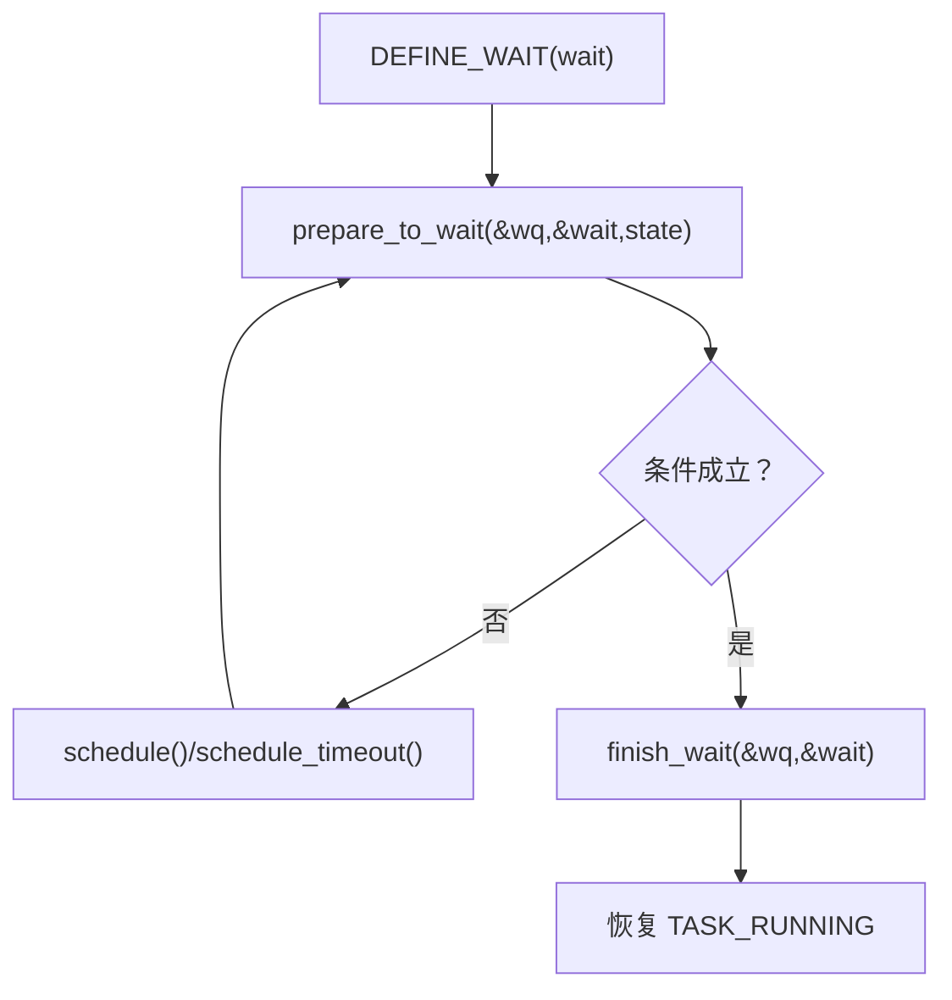
```mermaid
flowchart TD
    A["DEFINE_WAIT(wait)"] --> B["prepare_to_wait(&wq,&wait,state)"]
    B --> C{"条件成立？"}
    C -- 否 --> D["schedule()/schedule_timeout()"]
    D --> B
    C -- 是 --> E["finish_wait(&wq,&wait)"]
    E --> F["恢复 TASK_RUNNING"]
```

------

### 六、与宏族关系对照

| 宏族                         | 底层等价接口                                       | 自动清理    | 自动睡眠    |
| ---------------------------- | -------------------------------------------------- | ----------- | ----------- |
| `wait_event()`               | prepare_to_wait → schedule → finish_wait           | ✅           | ✅           |
| `wait_event_interruptible()` | 同上，使用 `TASK_INTERRUPTIBLE`                    | ✅           | ✅           |
| `wait_event_exclusive()`     | prepare_to_wait_exclusive → schedule → finish_wait | ✅           | ✅           |
| 手动循环                     | prepare_to_wait / finish_wait                      | ❌（需显式） | ❌（需显式） |

------

### 七、同簇接口一览

| 接口名                                            | 功能描述                             | 定义头文件       |
| ------------------------------------------------- | ------------------------------------ | ---------------- |
| `prepare_to_wait()`                               | 注册等待节点（非独占）               | `<linux/wait.h>` |
| `prepare_to_wait_exclusive()`                     | 注册独占节点                         | `<linux/wait.h>` |
| `init_waitqueue_entry()`                          | 初始化节点结构                       | `<linux/wait.h>` |
| `add_wait_queue()` / `add_wait_queue_exclusive()` | 手动加入队列                         | `<linux/wait.h>` |
| `remove_wait_queue()`                             | 手动移除节点                         | `<linux/wait.h>` |
| `finish_wait()`                                   | 移除节点并恢复任务状态               | `<linux/wait.h>` |
| `DEFINE_WAIT()`                                   | 宏定义一个 `wait_queue_entry_t` 节点 | `<linux/wait.h>` |

------

### 八、常见坑与修复

| 场景                 | 问题         | 修正方式                                       |
| -------------------- | ------------ | ---------------------------------------------- |
| 忘记 `finish_wait()` | 节点残留队列 | 必须调用                                       |
| 条件成立但没退出循环 | 重复睡眠     | 检查循环逻辑                                   |
| 在中断上下文使用     | 无法睡眠     | 移至线程上下文                                 |
| 未初始化节点         | kernel panic | 用 `DEFINE_WAIT()` 或 `init_waitqueue_entry()` |

------

### 九、小结

| 要点                     | 含义                               |
| ------------------------ | ---------------------------------- |
| `prepare_to_wait*()`     | 注册等待节点并设置任务状态         |
| `finish_wait()`          | 清理节点并恢复 TASK_RUNNING        |
| 宏族接口（wait_event_*） | 自动封装上述流程                   |
| 推荐场景                 | 自定义等待循环、多条件或多事件同步 |
| 核心原则                 | “进入要 prepare，退出要 finish”    |

> **一句话总结：**
>  `finish_wait()` 是等待机制的“善后清理者”。
>  使用宏族接口时它被自动调用，手动循环时你必须显式调用它。
>  **少了它，任务就永远挂在队列里。**


---

## 20.8　任务状态语义：TASK_INTERRUPTIBLE / UNINTERRUPTIBLE / KILLABLE 等待模式

------

### 一、概念

> 在内核中，“等待”并不等于“挂起线程”，而是**把当前任务状态标记为可被唤醒的特定形式**，
>  再交给调度器统一调度。
>
> waitqueue 机制正是通过这些任务状态来决定：
>
> - 哪些任务可以被信号唤醒；
> - 哪些任务必须等待事件；
> - 哪些任务不能被杀死。

这些任务状态定义于 `<linux/sched.h>`，核心常用的如下：

```c
#define TASK_RUNNING            0
#define TASK_INTERRUPTIBLE      1
#define TASK_UNINTERRUPTIBLE    2
#define TASK_KILLABLE           4
#define TASK_STOPPED            8
```

------

### 二、核心三种等待模式对比

| 状态名                 | 可被信号打断 | 可被 `kill -9` 杀死 | 唤醒源         | 使用场景                       |
| ---------------------- | ------------ | ------------------- | -------------- | ------------------------------ |
| `TASK_INTERRUPTIBLE`   | ✅ 是         | ✅ 是                | 信号或事件唤醒 | 用户可中断的等待，如 read()    |
| `TASK_UNINTERRUPTIBLE` | ❌ 否         | ❌ 否                | 仅事件唤醒     | 驱动内等待硬件完成（不可中断） |
| `TASK_KILLABLE`        | ❌ 否         | ✅ 是                | 仅致命信号唤醒 | 长时间等待资源，但允许进程终止 |

------

### 三、常见使用接口与状态对应关系

| 等待接口                             | 内部任务状态           | 响应信号   | 典型应用                    |
| ------------------------------------ | ---------------------- | ---------- | --------------------------- |
| `wait_event()`                       | `TASK_UNINTERRUPTIBLE` | 否         | 驱动内部状态同步            |
| `wait_event_interruptible()`         | `TASK_INTERRUPTIBLE`   | 是         | 字符设备 I/O 等可被中断操作 |
| `wait_event_killable()`              | `TASK_KILLABLE`        | 仅致命信号 | 系统调用阻塞、终止安全等待  |
| `wait_event_timeout()`               | `TASK_UNINTERRUPTIBLE` | 否         | 硬件等待 + 超时             |
| `wait_event_interruptible_timeout()` | `TASK_INTERRUPTIBLE`   | 是         | 可中断 + 超时               |
| `schedule_timeout_uninterruptible()` | `TASK_UNINTERRUPTIBLE` | 否         | 固定延迟等待（毫秒级）      |

------

### 四、状态转换逻辑（等待→唤醒）


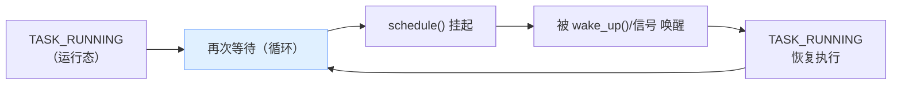
```mermaid
flowchart LR
    A["TASK_RUNNING<br/>（运行态）"] --> B["prepare_to_wait*()<br/>TASK_INTERRUPTIBLE / UNINTERRUPTIBLE / KILLABLE"]
    B --> C["schedule() 挂起"]
    C --> D["被 wake_up()/信号 唤醒"]
    D --> E["TASK_RUNNING<br/>恢复执行"]
    E --> B["再次等待（循环）"]:::loop
    classDef loop fill:#e0f0ff,stroke:#7aaaff;
```

> `[INV]` 任务等待期间并未消失，只是被从 CPU 运行队列移出；
>  唤醒操作只是将其重新放入运行队列（`TASK_RUNNING`）。

### 五、使用逻辑：状态切换与调度关系

内核等待的标准模式（伪代码）：

```c
set_current_state(TASK_INTERRUPTIBLE);   /* 1. 设置状态 */
if (!condition)
    schedule();                          /* 2. 让出 CPU */
__set_current_state(TASK_RUNNING);       /* 3. 醒来后恢复 */
```

**在 wait_event 宏中，这个过程被自动包装。**

流程图如下：

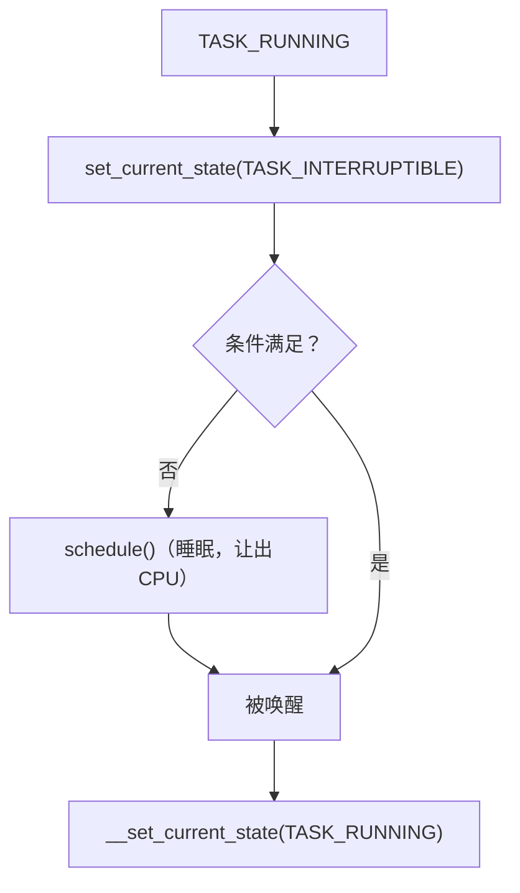
```mermaid
flowchart TD
    A["TASK_RUNNING"] --> B["set_current_state(TASK_INTERRUPTIBLE)"]
    B --> C{"条件满足？"}
    C -- 否 --> D["schedule()（睡眠，让出CPU）"]
    D --> E["被唤醒"]
    C -- 是 --> E
    E --> F["__set_current_state(TASK_RUNNING)"]
```

------

### 六、详细语义解释

#### 1. `TASK_INTERRUPTIBLE`

- 可以被普通信号（如 `SIGINT`, `SIGTERM`）唤醒；
- 常用于用户空间可中断操作；
- 若信号触发唤醒，则等待接口返回负错误码（如 `-ERESTARTSYS`）；
- 内核线程若使用这种状态且无人发送信号，可能永久睡眠（僵死）。

示例：

```c
if (wait_event_interruptible(wq, condition))
    return -ERESTARTSYS; /* 信号中断 */
```

------

#### 2. `TASK_UNINTERRUPTIBLE`

- 仅事件唤醒，不响应任何信号；
- 常用于驱动中等待硬件响应；
- 不可杀死，哪怕用户执行 `kill -9`；
- 使用不当可能造成“D 状态”（不可中断睡眠，常见于卡住的 I/O 设备）。

示例：

```c
wait_event(wq, device_ready);
```

------

#### 3. `TASK_KILLABLE`

- `TASK_UNINTERRUPTIBLE` 的改良版；
- 只响应致命信号（`SIGKILL`, `SIGSTOP`）；
- 允许系统在关闭/重启阶段安全终止长等待任务；
- 在 RT（实时）系统或块层 I/O 子系统中非常常见。

示例：

```c
if (wait_event_killable(wq, condition))
    return -EINTR; /* 被致命信号中断 */
```

------

### 七、调度状态与 finish_wait() 协同

`prepare_to_wait*()` 会将任务状态标记为等待态（如 `TASK_INTERRUPTIBLE`），
 而 `finish_wait()` 会在退出等待时恢复为 `TASK_RUNNING`。

> `[INV]` 若未调用 `finish_wait()`，任务仍保持等待态，调度器不会再次调度执行。


**与 `finish_wait()` 的配合关系**

- 每次等待结束后，`finish_wait()` 内部调用 `__set_current_state(TASK_RUNNING)`；
- 这确保任务在离开等待队列时被重新调度；
- 若开发者使用手动循环模式（`prepare_to_wait()` + `schedule()`），
   必须**显式设置状态**并在循环外调用 `finish_wait()` 恢复。

------

### 八、应用策略与选型建议

| 场景                          | 推荐状态                                      | 说明                         |
| ----------------------------- | --------------------------------------------- | ---------------------------- |
| 硬件 I/O 等待（设备中断响应） | `TASK_UNINTERRUPTIBLE`                        | 不可被信号打断，防止中途退出 |
| 用户态 I/O 阻塞               | `TASK_INTERRUPTIBLE`                          | 用户可 Ctrl+C 打断           |
| 系统后台线程 / 守护任务       | `TASK_KILLABLE`                               | 支持系统终止                 |
| 线程池 / 工作线程             | `TASK_INTERRUPTIBLE`                          | 可被信号中止                 |
| 短延时睡眠                    | `TASK_UNINTERRUPTIBLE` + `schedule_timeout()` | 固定时间睡眠                 |

------

### 九、常见错误与后果

| 错误场景                                 | 后果                 | 修正                         |
| ---------------------------------------- | -------------------- | ---------------------------- |
| 使用 `TASK_UNINTERRUPTIBLE` 但无唤醒条件 | 线程永不返回（卡死） | 确保唤醒路径可达             |
| 忘记调用 `finish_wait()`                 | 任务状态未恢复       | 调用 finish_wait()           |
| 使用 `TASK_INTERRUPTIBLE` 在无信号上下文 | 无效唤醒             | 改为 `UNINTERRUPTIBLE`       |
| 使用 killable 状态但未检查返回值         | 无法检测被杀死       | 判断返回码                   |
| 用错上下文（中断中等待）                 | BUG: Cannot schedule | 使用 `complete()` 或工作队列 |

------

### 十、小结

| 任务状态               | 可被信号打断 | 唤醒来源  | 使用场景           | 常见接口                     |
| ---------------------- | ------------ | --------- | ------------------ | ---------------------------- |
| `TASK_INTERRUPTIBLE`   | ✅            | 信号/事件 | 用户空间可中断 I/O | `wait_event_interruptible()` |
| `TASK_UNINTERRUPTIBLE` | ❌            | 仅事件    | 驱动硬件等待       | `wait_event()`               |
| `TASK_KILLABLE`        | 仅致命信号   | 信号/事件 | 系统可终止任务     | `wait_event_killable()`      |
| `TASK_RUNNING`         | N/A          | 调度器    | 唤醒后执行         | `finish_wait()` 自动恢复     |

> **一句话总结：**
>  waitqueue 的“睡眠”不是阻塞，而是任务状态的切换；
>  `prepare_to_wait*()` 负责**进入状态**，`finish_wait()` 负责**退出状态**。
>  选对任务状态，就能在正确的上下文里既安全又可控地等待。


------

好的，Leaf，下面是完整的章节版本：

------

## 20.9　等待队列与 schedule_timeout：超时等待机制详解

------

### 一、概念

> 内核的等待并不一定是“无限期”的。
>  在设备驱动或系统控制路径中，等待必须可控，否则会造成**永久阻塞**（D 状态）。
>
> 因此，Linux 提供了基于 jiffies 的**超时等待机制**，由 `schedule_timeout()` 与 `wait_event_*_timeout()` 系列实现。
>  它允许线程在等待队列中睡眠指定时间，超时后自动恢复执行。

------

### 二、相关接口族概览

| 接口名                                          | 语义                 | 内部状态             | 返回值                      |
| ----------------------------------------------- | -------------------- | -------------------- | --------------------------- |
| `schedule_timeout(long timeout)`                | 睡眠指定 jiffies     | 任意 TASK_* 状态     | 剩余 jiffies                |
| `wait_event_timeout(wq, cond, t)`               | 不可中断等待，有超时 | TASK_UNINTERRUPTIBLE | 0（超时）/ 非 0（提前唤醒） |
| `wait_event_interruptible_timeout(wq, cond, t)` | 可中断等待，有超时   | TASK_INTERRUPTIBLE   | 同上                        |
| `wait_event_killable_timeout(wq, cond, t)`      | 仅 SIGKILL 可打断    | TASK_KILLABLE        | 同上                        |

> 所有 *_timeout() 版本都以 `schedule_timeout()` 为基础实现。

------

### 三、schedule_timeout() 工作机制

#### 1. 调用路径示意

```c
set_current_state(TASK_INTERRUPTIBLE);  /* 设置任务状态 */
timeout = schedule_timeout(timeout_jiffies);
__set_current_state(TASK_RUNNING);      /* 恢复运行态 */
```

#### 2. 内核逻辑说明

```c
signed long schedule_timeout(signed long timeout)
{
    struct timer_list timer;
    unsigned long expire = timeout + jiffies;

    setup_timer(&timer, process_timeout, (unsigned long)current);
    mod_timer(&timer, expire);

    schedule();                     // 让出 CPU，睡眠
    del_timer_sync(&timer);         // 取消定时器
    return expire - jiffies;        // 返回剩余时间
}
```

- 设置定时器，在超时时间后唤醒任务；
- 若提前被唤醒（例如 `wake_up()`），则定时器被取消；
- 函数返回**剩余 jiffies**，若为 0 说明确实超时。

------

### 四、wait_event_*_timeout() 内部流程

与普通 `wait_event_*()` 的唯一区别是：

> 在等待循环中，**调度点使用 schedule_timeout() 替代 schedule()。**

```c
#define wait_event_interruptible_timeout(wq, condition, timeout)      \
({                                                                    \
    long __ret = timeout;                                             \
    DEFINE_WAIT(__wait);                                              \
    for (;;) {                                                        \
        prepare_to_wait(&wq, &__wait, TASK_INTERRUPTIBLE);            \
        if (condition)                                                \
            break;                                                    \
        __ret = schedule_timeout(__ret);                              \
        if (!__ret)                                                   \
            break; /* 超时退出 */                                     \
        if (signal_pending(current)) {                                \
            __ret = -ERESTARTSYS;                                     \
            break;                                                    \
        }                                                             \
    }                                                                 \
    finish_wait(&wq, &__wait);                                        \
    __ret;                                                            \
})
```

> ✅ 这段宏展示了超时等待的核心逻辑：
>
> - `__ret` 记录剩余 jiffies；
> - 若 `schedule_timeout()` 返回 0，说明已超时；
> - 被唤醒或被信号中断则提前返回。

------

### 五、行为特征与返回值语义

| 返回值 | 含义                                |
| ------ | ----------------------------------- |
| `> 0`  | 提前被唤醒（返回剩余 jiffies）      |
| `= 0`  | 超时（定时器触发）                  |
| `< 0`  | 被信号中断（-ERESTARTSYS / -EINTR） |

------

### 六、典型使用示例（带超时的条件等待）

```c
DECLARE_WAIT_QUEUE_HEAD(wq);
static int ready;

int wait_data_ready(void)
{
    long timeout = msecs_to_jiffies(5000); /* 最多等待5秒 */

    long ret = wait_event_interruptible_timeout(wq,
                    READ_ONCE(ready) == 1,
                    timeout);

    if (ret == 0)
        return -ETIMEDOUT;         /* 超时退出 */
    else if (ret < 0)
        return ret;                /* 被信号打断 */
    else
        return 0;                  /* 条件满足 */
}
```

------

### 七、与 finish_wait()、任务状态的关系

- `wait_event_*_timeout()` 自动完成：
  - 设置任务状态 (`TASK_INTERRUPTIBLE` / `TASK_UNINTERRUPTIBLE`)；
  - 在退出时调用 `finish_wait()` 恢复 `TASK_RUNNING`；
- 若使用手动循环模式（prepare_to_wait + schedule_timeout），
   需自行在循环外调用 `finish_wait()`。

------

### 八、混搭与边界规则

| 机制          | 可混搭 | 注意事项                          |
| ------------- | ------ | --------------------------------- |
| `spinlock`    | ✅      | 在修改条件时锁保护，避免假唤醒    |
| `completion`  | ✅      | 常用于补充等待异步完成信号        |
| `poll/select` | ✅      | 底层常用超时等待机制              |
| `mutex`       | ⚠️      | 避免持锁调用 `schedule_timeout()` |
| 中断上下文    | ❌      | 不允许睡眠，禁止使用              |

------

### 九、常见误区与修正

| 误区                                 | 后果            | 修正方式                  |
| ------------------------------------ | --------------- | ------------------------- |
| 误以为返回 0 表示条件成立            | 实际是超时      | 检查返回值逻辑            |
| 忘记转换时间单位                     | 超时过短或过长  | 使用 `msecs_to_jiffies()` |
| 在中断中调用                         | 内核警告        | 移至线程化上下文          |
| 使用 TASK_UNINTERRUPTIBLE 阻塞用户态 | 导致 D 状态卡死 | 用 INTERRUPTIBLE          |

------

### 十、调度状态 + 超时模型（概念图）

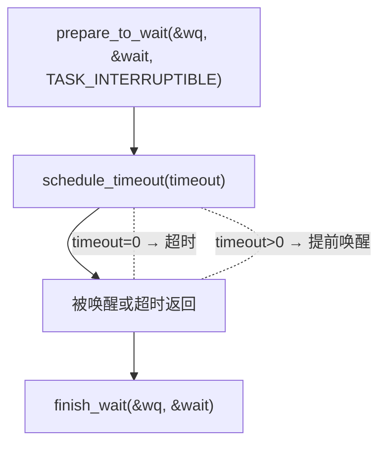
```mermaid
flowchart TD
    A["prepare_to_wait(&wq, &wait, TASK_INTERRUPTIBLE)"]
    B["schedule_timeout(timeout)"]
    C["被唤醒或超时返回"]
    D["finish_wait(&wq, &wait)"]
    A --> B --> C --> D
    B -. "timeout=0 → 超时" .- C
    B -. "timeout>0 → 提前唤醒" .- C
```

------

### 十一、实战建议（驱动开发）

| 场景             | 推荐接口                             | 建议超时    | 状态     |
| ---------------- | ------------------------------------ | ----------- | -------- |
| 等待设备数据     | `wait_event_interruptible_timeout()` | 50~5000 ms  | 可中断   |
| 等待 DMA 结束    | `wait_for_completion_timeout()`      | 500 ms~1 s  | 可中断   |
| 等待硬件 ready   | `wait_event_timeout()`               | 100~1000 ms | 不可中断 |
| 内核线程后台任务 | `schedule_timeout_interruptible()`   | 周期性      | 可中断   |

> ✅ **经验法则：**
>
> - 用户态路径用“可中断 + 超时”；
> - 内核路径用“不可中断 + 超时”；
> - 不可睡上下文只能用 `completion` 或原子轮询。

------

### 十二、小结

| 要点                 | 说明                                      |
| -------------------- | ----------------------------------------- |
| `schedule_timeout()` | 内核提供的基础超时调度函数                |
| `_timeout` 系列宏    | 封装 schedule_timeout()，带条件与状态管理 |
| 返回值语义           | `>0`：提前唤醒；`0`：超时；`<0`：信号中断 |
| 调度状态             | 自动设置与恢复（由 finish_wait 完成）     |
| 推荐实践             | 统一用 jiffies 宏换算（msecs_to_jiffies） |

> **一句话总结：**
>  `wait_event_*_timeout()` 是在“条件等待”模型上加了一个**时间维度的保护罩**，
>  它让驱动的等待既有逻辑正确性，又能防止永远阻塞。
>
> 只要记住三件事：
>
> - 唤醒前写条件；
> - 读时重检；
> - 任何等待都要有超时。

------

非常好，Leaf。下面是承接上一节的完整章节：

------

## 20.10　等待队列、超时与信号交互：interruptible 与 killable 的实战差异

------

### 一、概念：信号与等待的交汇点

在 Linux 内核中，**信号（signal）** 机制与 **等待（wait）** 机制是两个独立的子系统：

- 信号用于通知进程有异步事件（如中断、用户输入、终止请求）；
- 等待用于让任务主动让出 CPU，直到条件成立或被唤醒。

但当一个任务处于 `TASK_INTERRUPTIBLE` 或 `TASK_KILLABLE` 状态时，
 **信号系统与等待系统会发生交汇** —— 信号成为一种“外部唤醒源”。

因此，理解两者的交互机制，是编写健壮驱动（尤其是用户空间可中断的设备访问）必不可少的一环。

------

### 二、信号与等待的关系模型

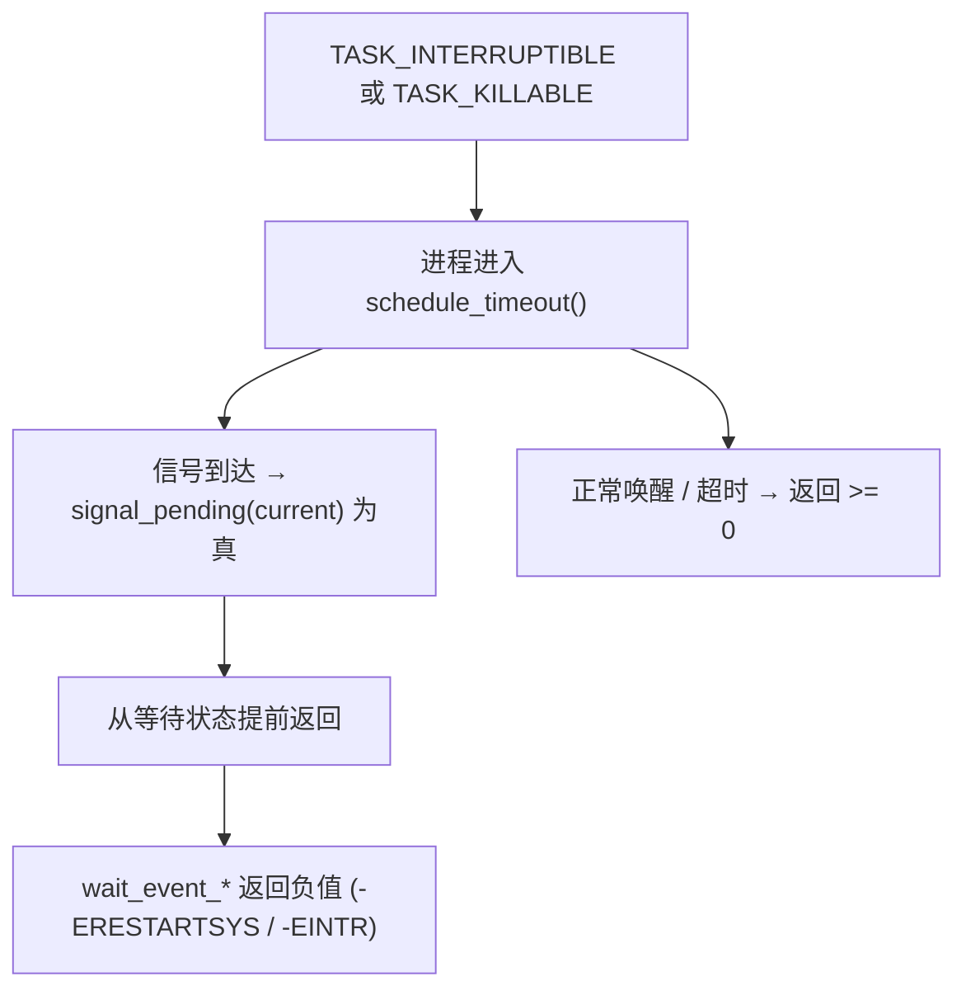
```mermaid
flowchart TD
    A["TASK_INTERRUPTIBLE 或 TASK_KILLABLE"] --> B["进程进入 schedule_timeout()"]
    B --> C["信号到达 → signal_pending(current) 为真"]
    C --> D["从等待状态提前返回"]
    D --> E["wait_event_* 返回负值 (-ERESTARTSYS / -EINTR)"]
    B --> F["正常唤醒 / 超时 → 返回 >= 0"]
```

> **核心点：**
>
> - 内核通过 `signal_pending(current)` 检测信号是否挂起；
> - 若挂起且任务处于可中断状态，则立即从睡眠中返回；
> - 返回值由调用宏定义决定，一般是 `-ERESTARTSYS` 或 `-EINTR`。

------

### 三、TASK_INTERRUPTIBLE 与 TASK_KILLABLE 的本质差别

| 特性          | `TASK_INTERRUPTIBLE`           | `TASK_KILLABLE`            |
| ------------- | ------------------------------ | -------------------------- |
| 响应信号范围  | 所有信号（普通 + 致命）        | 仅 SIGKILL                 |
| 对用户态影响  | 用户可用 Ctrl+C / SIGTERM 中断 | 仅管理员强制终止           |
| 典型用途      | 用户可中断的 I/O 等待          | 系统级任务、挂载、驱动线程 |
| wait_event 宏 | `wait_event_interruptible()`   | `wait_event_killable()`    |
| 返回值        | `-ERESTARTSYS` / `-EINTR`      | `-EINTR`（仅 SIGKILL）     |

------

### 四、信号检测与返回路径

#### 1. 内核检测点

等待期间内核通过如下宏判断信号：

```c
if (signal_pending(current)) {
    __ret = -ERESTARTSYS;
    break;
}
```

- `signal_pending(current)` 判断是否有挂起信号；
- 若任务状态可中断，则立即跳出等待；
- 若任务状态为不可中断（`TASK_UNINTERRUPTIBLE`），则信号被延迟处理。

#### 2. 用户态感知路径

在系统调用路径上，内核会：

- 将 `-ERESTARTSYS` 或 `-EINTR` 传递到用户态；
- `libc` 通常会将其映射为 `EINTR`；
- 若用户未捕获信号，系统调用可能被自动重启。

------

### 五、驱动实战示例

#### 示例 1：可中断等待（推荐用户态接口）

```c
DECLARE_WAIT_QUEUE_HEAD(wq);
int ready = 0;

ssize_t mydev_read(struct file *filp, char __user *buf,
                   size_t len, loff_t *off)
{
    int ret;

    ret = wait_event_interruptible_timeout(wq,
                    READ_ONCE(ready) == 1,
                    msecs_to_jiffies(2000));

    if (ret == 0)
        return -ETIMEDOUT;        /* [CHECK] 超时 */
    if (ret < 0)
        return ret;               /* [CHECK] 被信号打断 */

    /* 继续读操作 */
    return copy_to_user(buf, dev_buf, len) ? -EFAULT : len;
}
```

✅ 特点：

- 用户可用 Ctrl+C 终止；
- 内核通过 `signal_pending()` 检测中断；
- 不会导致 D 状态任务堆积。

------

#### 示例 2：系统级任务（不可中断）

```c
DECLARE_WAIT_QUEUE_HEAD(fw_wq);
bool firmware_ready = false;

int firmware_loader_thread(void *arg)
{
    wait_event_timeout(fw_wq,
                       READ_ONCE(firmware_ready),
                       msecs_to_jiffies(10000));
    /* 不响应信号，只响应唤醒或超时 */
    return 0;
}
```

✅ 特点：

- `TASK_UNINTERRUPTIBLE`；
- 不响应信号，保证任务稳定执行；
- 若未唤醒，会自动在 10 秒后返回。

------

#### 示例 3：系统挂载或卸载任务（killable 等待）

```c
wait_event_killable(fw_wq, READ_ONCE(firmware_ready));
```

✅ 特点：

- 仅 SIGKILL 可打断；
- 防止长时间挂载过程被误中断；
- 常用于 kernel thread（如 `kworker`、`kblockd`）。

------

### 六、信号唤醒与等待的执行顺序

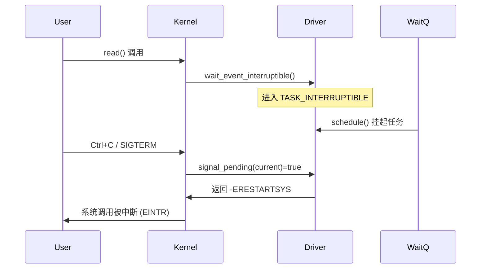
```mermaid
sequenceDiagram
    participant User
    participant Kernel
    participant Driver
    participant WaitQ

    User->>Kernel: read() 调用
    Kernel->>Driver: wait_event_interruptible()
    Note over Driver: 进入 TASK_INTERRUPTIBLE
    WaitQ->>Driver: schedule() 挂起任务
    User->>Kernel: Ctrl+C / SIGTERM
    Kernel->>Driver: signal_pending(current)=true
    Driver->>Kernel: 返回 -ERESTARTSYS
    Kernel->>User: 系统调用被中断 (EINTR)
```

------

### 七、驱动开发中的选型建议

| 场景             | 推荐接口                           | 推荐状态          | 可否超时 | 说明             |
| ---------------- | ---------------------------------- | ----------------- | -------- | ---------------- |
| 用户态 I/O 等待  | `wait_event_interruptible()`       | 可中断            | 可       | 推荐，交互性强   |
| 系统后台任务     | `wait_event_killable()`            | 可被 SIGKILL 打断 | 可       | 安全退出机制     |
| 驱动初始化       | `wait_event_timeout()`             | 不可中断          | 可       | 保证一致性       |
| 内核线程周期任务 | `schedule_timeout_interruptible()` | 可中断            | 可       | 节能模式循环     |
| 中断上下文       | ❌                                  | 不可睡眠          | 否       | 禁止使用等待机制 |

------

### 八、信号与等待的同步边界

> 仅在任务**真正进入睡眠（schedule 调用后）**时，
>  信号才能唤醒任务。
>  如果信号到达过早（即进入 schedule 前），
>  内核在下一次循环条件判断时会立即检测并返回。

因此，正确的写法必须确保：

1. **条件检查在设置状态之前完成**；
2. **状态设置与 schedule 调用之间不做耗时操作**；
3. **醒后总是重检条件**。

------

### 九、常见问题与误区

| 问题             | 现象                        | 修正方式                           |
| ---------------- | --------------------------- | ---------------------------------- |
| 信号丢失         | 提前到达但未检测            | 循环条件外重检 signal_pending()    |
| 用户态永久阻塞   | 用了 `TASK_UNINTERRUPTIBLE` | 改为 `TASK_INTERRUPTIBLE`          |
| 系统线程无法杀死 | 忘记使用 `TASK_KILLABLE`    | 替换等待接口                       |
| 错误返回未处理   | 用户态表现为阻塞            | 检查返回值并处理 -EINTR/-ETIMEDOUT |
| 忘记唤醒         | 驱动死锁                    | 唤醒逻辑需与条件设置同步执行       |

------

### 十、小结

| 要点             | 说明                                       |
| ---------------- | ------------------------------------------ |
| 信号与等待交汇点 | TASK_INTERRUPTIBLE / TASK_KILLABLE         |
| signal_pending() | 唤醒的信号检测机制                         |
| 返回值           | 正常唤醒 → ≥0；信号中断 → <0；超时 → 0     |
| 驱动设计策略     | 用户态可中断，系统态可杀，关键路径不可中断 |
| 超时保护         | 必须加上，防止 D 状态任务                  |

> **一句话总结：**
>  “信号是外部唤醒源，等待是内部调度点。”
>
> 当它们结合时，内核才能既保持**响应性**又维持**稳定性**。
>  驱动层只需根据场景选择正确的状态宏和等待接口，就能避免几乎所有“睡死”、“假醒”、“不可杀死任务”等问题。


------

## 20.11　completion 机制：单事件同步的最小原语

------

### 一、概念：等待队列的“单事件封装”

> `struct completion` 是对 **等待队列** 的一种高层封装。
>  它专用于实现“一次性事件同步”——即：
>
> - 一个任务等待某个事件完成；
> - 另一个任务在事件完成后唤醒它；
> - 同一事件只触发一次（之后可重置）。

典型用途：

- 驱动中的 probe 阶段等待硬件初始化；
- 等待中断处理或 DMA 传输完成；
- 等待后台线程（worker/kthread）执行完操作；
- 等待资源加载（如固件、设备树）完成。

------

### 二、数据结构

```c
/* include/linux/completion.h */

struct completion {
    unsigned int done;            /* 完成标志 */
    wait_queue_head_t wait;       /* 等待队列头 */
};
```

> `done`：记录完成信号的次数；
> `wait`：内嵌的等待队列头。

结构非常简单——本质上是一个**带计数的等待队列**。

------

### 三、接口族概览

| 接口                                          | 功能                               | 是否可重复使用 | 唤醒数量 | 是否超时版本 |
| --------------------------------------------- | ---------------------------------- | -------------- | -------- | ------------ |
| DECLARE_COMPLETION(done);                     | 静态定义并初始化一个completion对象 | ✅              | —        | —            |
| `init_completion()`                           | 初始化                             | ✅              | —        | —            |
| `reinit_completion()`                         | 重置（done=0）                     | ✅              | —        | —            |
| `complete()`                                  | 唤醒所有等待者                     | ✅              | 全部     | —            |
| `complete_all()`                              | 唤醒所有等待者（done=UINT_MAX）    | ✅              | 全部     | —            |
| `wait_for_completion()`                       | 等待完成（不可中断）               | ✅              | —        | ❌            |
| `wait_for_completion_timeout()`               | 等待完成（不可中断，有超时）       | ✅              | —        | ✅            |
| `wait_for_completion_interruptible()`         | 可中断等待                         | ✅              | —        | ❌            |
| `wait_for_completion_interruptible_timeout()` | 可中断、有超时                     | ✅              | —        | ✅            |
| `try_wait_for_completion()`                   | 非阻塞检测                         | ✅              | —        | ❌            |
| `complete_and_exit()`                         | 唤醒等待者后退出内核线程           | ✅              | 全部     | —            |

------

### 四、初始化与基本使用模式

#### 示例：等待事件完成

```c
DECLARE_COMPLETION(done);

void worker_thread(void)
{
    /* 模拟后台任务 */
    msleep(100);
    complete(&done);
}

int my_device_open(void)
{
    pr_info("等待 worker 完成...\n");
    wait_for_completion(&done);
    pr_info("任务完成，继续执行。\n");
    return 0;
}
```

✅ **运行逻辑：**

1. `wait_for_completion()` 将当前任务挂入 `done.wait`；
2. 任务进入 `TASK_UNINTERRUPTIBLE` 状态；
3. `complete()` 调用时，设置 `done=1` 并唤醒等待队列；
4. 唤醒后返回继续执行。

------

### 五、超时与中断版本

#### 示例：带超时的等待

```c
DECLARE_COMPLETION(done);

int ret = wait_for_completion_timeout(&done, msecs_to_jiffies(5000));

if (ret == 0)
    pr_err("超时未完成\n");
else
    pr_info("事件完成\n");
```

> 返回值含义：
>
> - `>0`：提前唤醒（剩余 jiffies）
> - `=0`：超时
> - `<0`：被信号中断（仅在 interruptible 版本）

------

### 六、重置与重复使用

`completion` 并非一次性结构，
 若要在多次事件中循环使用，需重置 `done` 字段。

```c
reinit_completion(&done);
```

> 内核不会自动重置！
>  每次循环等待新事件时，必须手动调用 `reinit_completion()`。

------

### 七、混搭使用模式

#### 模式①：中断唤醒 + 主线程等待

```c
static DECLARE_COMPLETION(tx_done);

irqreturn_t tx_irq_handler(int irq, void *dev)
{
    complete(&tx_done);
    return IRQ_HANDLED;
}

void send_packet(void)
{
    start_tx_dma();
    wait_for_completion_timeout(&tx_done, HZ / 2);
}
```

✅ 特点：

- 中断上下文可安全调用 `complete()`；
- 唤醒主线程，保证同步退出；
- DMA、I/O 等常用此模式。

------

#### 模式②：线程通信（kthread ↔ 主任务）

```c
static DECLARE_COMPLETION(task_done);

int kthread_func(void *data)
{
    do_task();
    complete(&task_done);
    return 0;
}

void controller(void)
{
    wait_for_completion(&task_done);
}
```

✅ 特点：

- `completion` 替代 `wait_event`；
- 无需自行维护条件变量；
- 常见于异步后台任务结束同步。

------

#### 模式③：多等待者

```c
static DECLARE_COMPLETION(done);

void waiters(void)
{
    wait_for_completion(&done);
}

void trigger(void)
{
    complete_all(&done);
}
```

> `complete_all()` 唤醒所有等待者；
>  常用于多个任务等待同一信号（例如系统启动阶段的同步点）。

------

### 八、底层实现原理（概念图）

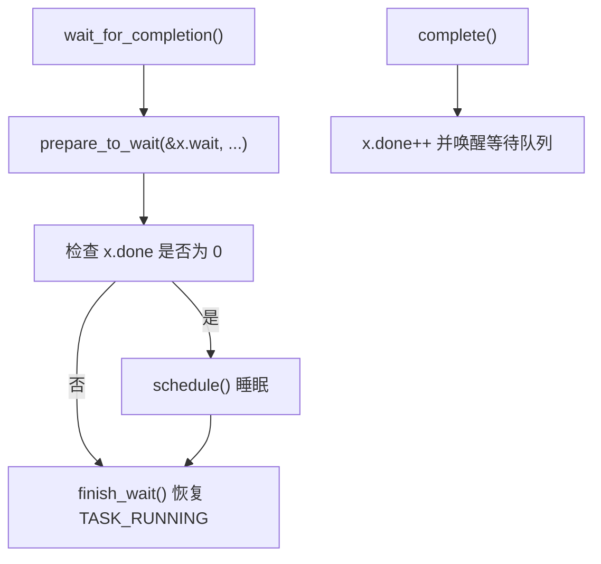
```mermaid
flowchart TD
    A["wait_for_completion()"] --> B["prepare_to_wait(&x.wait, ...)"]
    B --> C["检查 x.done 是否为 0"]
    C -- 否 --> G["立即返回"]
    C -- 是 --> D["schedule() 睡眠"]
    E["complete()"] --> F["x.done++ 并唤醒等待队列"]
    D --> G["finish_wait() 恢复 TASK_RUNNING"]
```

✅ **关键点：**

- 每次唤醒都会让 `x.done++`；
- 若 `done` 已非 0，则不再睡眠；
- `try_wait_for_completion()` 仅检查 `done` 值，不睡眠。

------

### 九、completion 与 wait_queue 的差异

| 特性               | completion                 | wait_queue        |
| ------------------ | -------------------------- | ----------------- |
| 抽象层级           | 高                         | 底层              |
| 用途               | 一次性事件同步             | 多条件等待        |
| 内部组成           | done + wait_queue_head_t   | wait_queue_head_t |
| 状态重置           | 手动 `reinit_completion()` | 条件表达式控制    |
| 支持多等待者       | ✅（complete_all）          | ✅                 |
| 可中断             | ✅（interruptible 版本）    | ✅                 |
| 是否可在中断中唤醒 | ✅                          | ✅                 |
| 驱动典型场景       | DMA、固件加载、中断同步    | 任意条件等待      |

------

### 十、典型应用场景

| 场景         | 说明                               |
| ------------ | ---------------------------------- |
| DMA 完成信号 | 任务等待 DMA 中断调用 `complete()` |
| 固件加载完成 | 等待异步加载线程调用 `complete()`  |
| 设备复位流程 | 发起复位后等待中断确认             |
| 驱动退出同步 | 驱动退出前等待后台任务结束         |
| 初始化屏障   | 多线程初始化阶段同步点             |

------

### 十一、常见错误与修正

| 错误现象     | 原因                       | 修正方式         |
| ------------ | -------------------------- | ---------------- |
| 永远不返回   | 忘记调用 `complete()`      | 添加事件触发路径 |
| 死锁或卡死   | `complete()` 在等待锁      | 避免交叉锁定     |
| 无法重复使用 | 忘记 `reinit_completion()` | 手动重置 done    |
| 被信号中断   | 使用 interruptible 版本    | 改为不可中断版本 |
| 提前返回     | `done` 未清零              | 确保初始化或重置 |

------

### 十二、小结

| 要点     | 说明                               |
| -------- | ---------------------------------- |
| 本质     | 带计数的等待队列封装               |
| 优点     | 简洁、线程安全、可中断、可重用     |
| 典型使用 | 中断/线程同步、DMA 完成、设备加载  |
| 重置方式 | `reinit_completion()`              |
| 调用限制 | 等待方可睡眠；唤醒方可在中断中调用 |

> **一句话总结：**
>  `completion` 是“单事件等待”的最小同步原语。
>  它不关心条件表达式，只关心“是否完成”这一事实。
>  当你的驱动逻辑中只有“一件事要等”，就应该优先使用 `completion` 而非 `wait_event`。


------

## 20.12　`complete()` 与唤醒机制：任务唤醒数量与状态传播原理

------

### 一、概念引入

在 Linux 内核中，`struct completion` 是**基于等待队列封装的单事件同步原语**。
 其核心特性在于：

> 通过一个共享变量 `done` 作为同步信号，唤醒一个或多个等待任务，从而实现任务之间的时序交接。

然而，`complete()`、`complete_all()`、乃至底层 `__wake_up_common_lock()` 之间的关系往往被误解。
 本节从调度行为与源码层面详细说明它们的**唤醒数量控制机制**、**状态传播路径**与**同步保障逻辑**。

------

### 二、数据结构与关联关系

```c
struct completion {
    unsigned int done;             /* 完成信号计数器 */
    wait_queue_head_t wait;        /* 等待任务链表头 */
};
```

`wait_queue_head_t` 维护所有等待此事件的任务队列：

```c
struct wait_queue_head {
    spinlock_t lock;               /* 保护链表 */
    struct list_head head;         /* 等待节点列表 */
};
```

当任务调用 `wait_for_completion()` 时，会创建临时的 `wait_queue_entry_t` 节点并插入链表：

```c
struct wait_queue_entry {
    unsigned int flags;
    void *private;                 /* 通常是 current */
    wait_queue_func_t func;        /* 唤醒函数 */
    struct list_head entry;
};
```

因此：

> `completion` 只是容器；
>  真正记录“等待者”的是 `wait_queue_head_t` 链表。

------

### 三、核心语义：唤醒数量由 `nr_exclusive` 参数控制

内核在 `kernel/sched/completion.c` 中定义 `complete()`：

```c
void complete(struct completion *x)
{
    unsigned long flags;

    spin_lock_irqsave(&x->wait.lock, flags);
    x->done++;
    __wake_up_common_lock(&x->wait, TASK_NORMAL, 1, 0);
    spin_unlock_irqrestore(&x->wait.lock, flags);
}
```

> 第三个参数 `1` 是关键：它表示只唤醒一个“独占等待者（exclusive waiter）”。

------

### 四、`__wake_up_common_lock()` 的行为机制

```c
void __wake_up_common_lock(struct wait_queue_head *wq_head,
                           unsigned int mode,
                           int nr_exclusive, int wake_flags)
{
    spin_lock_irqsave(&wq_head->lock, flags);
    __wake_up_common(wq_head, mode, nr_exclusive, wake_flags, NULL);
    spin_unlock_irqrestore(&wq_head->lock, flags);
}
```

内部调用 `__wake_up_common()`：

```c
void __wake_up_common(struct wait_queue_head *wq_head,
                      unsigned int mode, int nr_exclusive,
                      int wake_flags, void *key)
{
    struct wait_queue_entry *curr, *next;

    list_for_each_entry_safe(curr, next, &wq_head->head, entry) {
        if (curr->func(curr, mode, wake_flags, key) && !--nr_exclusive)
            break;
    }
}
```

行为总结：

| 参数           | 作用                                 |
| -------------- | ------------------------------------ |
| `mode`         | 指定唤醒任务的状态（TASK_NORMAL 等） |
| `nr_exclusive` | 限制唤醒任务数量                     |
| `wake_flags`   | 控制是否同步唤醒等策略               |

`list_for_each_entry_safe()` 遍历整个等待队列链表，
 每唤醒一个“独占等待者”就 `nr_exclusive--`，
 当 `nr_exclusive == 0` 时结束遍历。

因此：

- `complete()` → `nr_exclusive = 1` → 唤醒 **一个任务**；
- `complete_all()` → `nr_exclusive = 0` → 唤醒 **所有任务**。

------

### 五、exclusive 机制与唤醒控制

在等待节点中，存在一个标志：

```c
#define WQ_FLAG_EXCLUSIVE 0x01
```

被标记为 `exclusive` 的等待者是“独占等待”，
 意味着当它被唤醒后，其他等待者暂不竞争。
 这使得：

- `complete()` 唤醒**一个 exclusive waiter**；
- `complete_all()` 忽略 exclusive 标志，**唤醒全部**。

------

### 六、`complete_all()` 的差异

```c
void complete_all(struct completion *x)
{
    unsigned long flags;

    spin_lock_irqsave(&x->wait.lock, flags);
    x->done = UINT_MAX;
    __wake_up_common_lock(&x->wait, TASK_NORMAL, 0, 0); // 唤醒全部
    spin_unlock_irqrestore(&x->wait.lock, flags);
}
```

区别点：

- `x->done = UINT_MAX`：表示“事件永久完成”，新的等待者不会再睡眠；
- `nr_exclusive = 0`：不限制唤醒数量，**广播式唤醒**。

------

### 七、唤醒数量与 done 计数器的关系

| 场景                  | done 值           | 唤醒任务数量 | 唤醒后 done 的语义                |
| --------------------- | ----------------- | ------------ | --------------------------------- |
| `complete()`          | `done++`          | 1 个         | 下一个等待者立即返回（若 done>0） |
| `complete_all()`      | `done = UINT_MAX` | 所有任务     | 永久完成，任何新等待者立即返回    |
| `reinit_completion()` | `done = 0`        | —            | 恢复为可等待状态                  |

> **done** 并非等待者数量，而是**完成信号计数器**。
>  每次唤醒一个任务后，返回路径会 `done--`。
>  若 done>0，说明还有可消费的信号，后续等待者直接通过。

------

### 八、假醒与状态一致性

内核中防止“假醒”的机制由 `while (!x->done)` 实现：

```c
while (!x->done) {
    prepare_to_wait(&x->wait, &wait, TASK_UNINTERRUPTIBLE);
    if (!x->done)
        schedule();
    finish_wait(&x->wait, &wait);
}
x->done--;
```

若唤醒条件并非来自 `complete()`（例如信号、异常），
 `done` 仍为 0，则任务继续睡眠。
 这保证了等待逻辑的**严格一因一果关系**。

------

### 九、唤醒过程的原子性与调度保护

整个 `complete()` 过程在 `spin_lock_irqsave()` 保护下完成：

```c
spin_lock_irqsave(&x->wait.lock, flags);
x->done++;
__wake_up_common_lock(&x->wait, TASK_NORMAL, 1, 0);
spin_unlock_irqrestore(&x->wait.lock, flags);
```

因此：

- `done++` 与 `wake_up()` 是原子的；
- 不存在“部分唤醒后被改写”的窗口；
- 被唤醒的任务在下一次调度周期恢复运行。

> 唤醒数量与任务调度完全同步，不存在“部分唤醒未执行”的异步状态。

------

### 十、可选扩展：自定义唤醒数量

尽管标准 API 只有“唤醒 1 个”或“唤醒全部”两种模式，
 开发者可以自行封装一个函数实现“唤醒 N 个任务”：

```c
void complete_n(struct completion *x, int n)
{
    unsigned long flags;

    spin_lock_irqsave(&x->wait.lock, flags);
    x->done += n;
    __wake_up_common_lock(&x->wait, TASK_NORMAL, n, 0);
    spin_unlock_irqrestore(&x->wait.lock, flags);
}
```

> ⚠️ 此函数并非官方接口，
>  可在特殊场景（如批量消费者唤醒）中使用，
>  但需确保 `done` 与等待队列状态一致。

------

### 十一、时序示意图

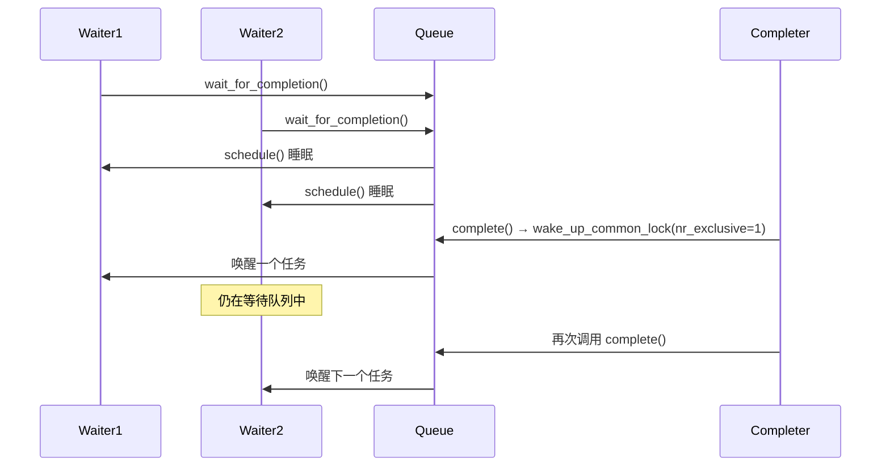
```mermaid
sequenceDiagram
    participant Waiter1
    participant Waiter2
    participant Queue
    participant Completer

    Waiter1->>Queue: wait_for_completion()
    Waiter2->>Queue: wait_for_completion()
    Queue->>Waiter1: schedule() 睡眠
    Queue->>Waiter2: schedule() 睡眠
    Completer->>Queue: complete() → wake_up_common_lock(nr_exclusive=1)
    Queue->>Waiter1: 唤醒一个任务
    Note over Waiter2: 仍在等待队列中
    Completer->>Queue: 再次调用 complete()
    Queue->>Waiter2: 唤醒下一个任务
```

------

### 十二、典型应用场景与选型建议

| 场景                           | 推荐接口                             | 说明                   |
| ------------------------------ | ------------------------------------ | ---------------------- |
| 一对一同步（线程等待单个事件） | `complete()`                         | 唤醒一个任务           |
| 一对多广播（多个线程同时等待） | `complete_all()`                     | 唤醒所有任务           |
| 周期事件（重复等待）           | `complete()` + `reinit_completion()` | 重置后循环使用         |
| 多阶段事件（DMA → IRQ → 消费） | 分阶段调用 `complete()`              | 每阶段唤醒下一个消费者 |

------

### 十三、小结

| 要点             | 说明                              |
| ---------------- | --------------------------------- |
| 唤醒机制核心     | `__wake_up_common_lock()`         |
| 唤醒数量控制     | 参数 `nr_exclusive`               |
| `complete()`     | 唤醒 1 个任务（`nr_exclusive=1`） |
| `complete_all()` | 唤醒所有任务（`nr_exclusive=0`）  |
| done 语义        | “完成信号”计数器，而非等待者数量  |
| 原子性           | 唤醒与计数修改在自旋锁保护下完成  |

> **一句话总结：**
>  `complete()` 的唤醒数量不是“推测”或“隐含的”，
>  而是由内核明确的 `nr_exclusive` 参数控制的同步行为。
>  这一机制保证了 `completion` 可以在**一对一**与**一对多**的同步场景中安全复用，
>  而不会出现竞争、假醒或部分唤醒的非确定状态。


------

## 20.13　`completion` 与 `waitqueue` 的混搭：多阶段同步模型

------

### 一、章节内容说明

本节从驱动同步的多阶段特征出发，系统讲解如何将 **`completion`** 机制与 **`wait_queue`** 原语组合，
 实现可控的“多阶段等待—唤醒—继续等待”流水线模型。

主要内容包括：

1. 多阶段同步的实际需求与设计动机；
2. `completion` 与 `waitqueue` 的职责分工；
3. 不同阶段的信号传播链设计；
4. 典型驱动应用模式（如 DMA、I/O、传感器事件）示例；
5. 生命周期管理与 race-free 保证。

------

### 二、设计背景：单阶段同步的局限

`completion` 的本质是单信号事件同步：

- 它只能表达 “某事件已完成”；
- 一次 `wait_for_completion()` 对应一次 `complete()`；
- 若同一阶段有多个并行任务或多级依赖，需要额外的同步层次。

在驱动中，这种情况很常见：

| 场景         | 描述                                                |
| ------------ | --------------------------------------------------- |
| DMA 传输     | `提交 → 传输中断 → 缓冲区处理 → 下一帧提交`         |
| 多线程初始化 | `probe → 设备 ready → 应用 ready`                   |
| 多级外设唤醒 | `电源上电 → 时钟稳定 → 控制器 ready → 子设备 ready` |

如果仍然使用单一 `completion`，则会产生：

- 无法区分阶段；
- 唤醒时机不确定；
- 状态机模糊。

因此，必须设计一个**多阶段同步模型**。

------

### 三、核心思路：分层等待 + 链式唤醒

内核中 `completion` 与 `wait_queue` 都基于同一底层原语（`wait_queue_head_t`），
 因此它们可以在同一上下文中**组合使用**。

核心思路如下：

> 每个阶段独立维护一个 `completion`；
>  下一个阶段的 `waitqueue` 在前一阶段完成后唤醒。

形成如下模型：

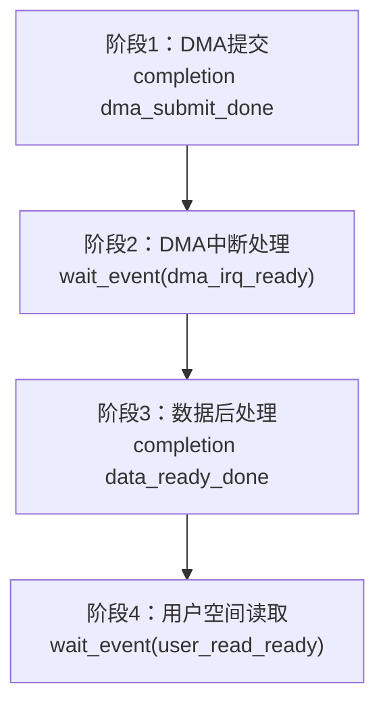
```mermaid
flowchart TD
    A["阶段1：DMA提交<br/>completion dma_submit_done"] --> B["阶段2：DMA中断处理<br/>wait_event(dma_irq_ready)"]
    B --> C["阶段3：数据后处理<br/>completion data_ready_done"]
    C --> D["阶段4：用户空间读取<br/>wait_event(user_read_ready)"]
```

------

### 四、职责分工

| 组件         | 主要职责                           | 特点                                     |
| ------------ | ---------------------------------- | ---------------------------------------- |
| `completion` | 标志某个关键事件完成（一次性信号） | 精确、不可重复使用（除非 reinit）        |
| `waitqueue`  | 表示一组线程等待条件（循环触发）   | 可复用，适合多次唤醒                     |
| 结合点       | `complete()` → `wake_up()`         | 前者触发一次性信号，后者传播到多等待任务 |

------

### 五、典型驱动结构示例：DMA 分阶段同步

#### 1. 数据结构设计

```c
struct dma_ctx {
    struct completion dma_done;       /* 阶段1：传输完成 */
    wait_queue_head_t process_queue;  /* 阶段2：处理中等待 */
    atomic_t data_ready;              /* 阶段状态标志 */
};
```

#### 2. 初始化阶段

```c
static int dma_driver_init(struct dma_ctx *ctx)
{
    init_completion(&ctx->dma_done);
    init_waitqueue_head(&ctx->process_queue);
    atomic_set(&ctx->data_ready, 0);
    return 0;
}
```

#### 3. DMA 中断回调：唤醒阶段

```c
irqreturn_t dma_irq_handler(int irq, void *dev_id)
{
    struct dma_ctx *ctx = dev_id;

    /* 阶段1：标志 DMA 完成 */
    complete(&ctx->dma_done);

    /* 阶段2：准备数据并更新状态 */
    atomic_set(&ctx->data_ready, 1);
    wake_up_interruptible(&ctx->process_queue);

    return IRQ_HANDLED;
}
```

#### 4. 处理线程：分阶段等待与同步

```c
static int process_thread(void *arg)
{
    struct dma_ctx *ctx = arg;

    /* 等待DMA完成 */
    wait_for_completion(&ctx->dma_done);

    /* 等待数据准备 */
    wait_event_interruptible(ctx->process_queue,
                             atomic_read(&ctx->data_ready));

    /* 进行后续数据处理 */
    handle_dma_data();

    /* 重置状态以便下一轮 */
    reinit_completion(&ctx->dma_done);
    atomic_set(&ctx->data_ready, 0);

    return 0;
}
```

------

### 六、同步关系的可视化模型

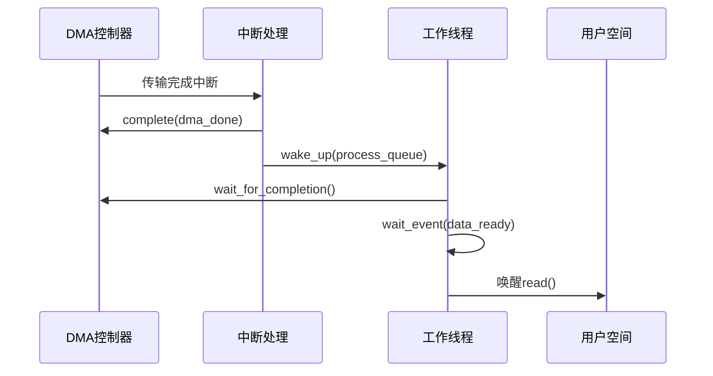
```mermaid
sequenceDiagram
    participant DMA as DMA控制器
    participant IRQ as 中断处理
    participant Thread as 工作线程
    participant User as 用户空间

    DMA->>IRQ: 传输完成中断
    IRQ->>DMA: complete(dma_done)
    IRQ->>Thread: wake_up(process_queue)
    Thread->>DMA: wait_for_completion()
    Thread->>Thread: wait_event(data_ready)
    Thread->>User: 唤醒read()
```

------

### 七、混合模型的关键保障

| 保证项         | 说明                                                         |
| -------------- | ------------------------------------------------------------ |
| **原子性**     | `complete()` 与 `wake_up()` 都在 `spin_lock_irqsave()` 下执行 |
| **阶段独立性** | 每个阶段维护独立状态变量，避免重入                           |
| **可复用性**   | `waitqueue` 可多次循环触发；`completion` 需重置后使用        |
| **无假醒**     | 条件判断 + while 检查，避免错误唤醒                          |

------

### 八、典型错误模式与修复建议

| 错误模式                   | 原因                   | 修复方式                                |
| -------------------------- | ---------------------- | --------------------------------------- |
| 忘记 `reinit_completion()` | 下一轮等待永远立即返回 | 在处理结束后重置                        |
| 在中断外调用 `wake_up()`   | 唤醒延迟               | 建议使用 `wake_up_interruptible_sync()` |
| 未使用 `atomic_set()`      | 多阶段状态丢失         | 使用原子变量维护状态                    |
| 条件判断放在锁外           | 竞态风险               | 在锁保护区检查条件                      |

------

### 九、多阶段驱动设计策略

1. **阶段隔离**
    每个阶段有独立的状态机与 completion。
2. **信号单向流动**
    `completion` → 唤醒下级 `waitqueue`。
3. **上下文安全**
    中断上下文仅使用原子变量与唤醒操作，不进行睡眠。
4. **可追踪性**
    在 debugfs 或 sysfs 中导出各阶段状态，辅助排错。

------

### 十、模式扩展：多消费者场景

在部分场景（如异步多线程消费）中，
 可将同一阶段的唤醒机制扩展为广播式模型：

```c
complete_all(&ctx->dma_done);     /* 通知所有消费者 */
wake_up_all(&ctx->process_queue); /* 多线程同步处理 */
```

> 每个线程可根据自身状态过滤执行逻辑，
>  保持同步又不干扰彼此。

------

### 十一、典型使用表

| 场景类型   | 典型组合                         | 特征             |
| ---------- | -------------------------------- | ---------------- |
| 一对一同步 | `completion`                     | 简洁，单信号控制 |
| 一对多广播 | `completion_all` + `wake_up_all` | 并行唤醒         |
| 多阶段同步 | `completion` + `waitqueue`       | 顺序依赖控制     |
| 环形同步   | `reinit_completion()` + 状态机   | 周期任务         |

------

### 十二、小结

| 要点              | 说明                                 |
| ----------------- | ------------------------------------ |
| 多阶段同步目标    | 分阶段事件传递，消除等待层级混乱     |
| `completion` 用途 | 阶段完成的确定性信号                 |
| `waitqueue` 用途  | 阶段间传递、批量唤醒控制             |
| 结合原理          | 以 `complete()` 驱动 `wake_up()`     |
| 关键点            | 原子性 + 阶段独立性 + 复用性         |
| 应用场景          | DMA、中断链、pipeline 同步、异步通信 |

> **一句话总结：**
>  在多阶段驱动架构中，`completion` 提供“事件完成信号”，
>  `waitqueue` 提供“条件传播机制”。
>  它们的混搭让同步关系从“一次性信号”扩展为“阶段流水线”，
>  实现高效、无锁的并行同步模型。


------

## **20.14　complete() → try_to_wake_up()：唤醒路径与调度切换详解**

------

这一节会从内核调度路径角度出发，跟踪一次 `complete()` 的唤醒过程，直至任务从等待队列被调度器重新选中运行。内容包括：

1. **唤醒路径总览**

   - `complete()` → `__wake_up_common_lock()` → `__wake_up_common()` → `default_wake_function()` → `try_to_wake_up()` → `ttwu_do_activate()` → `enqueue_task()` → `check_preempt_curr()`
   - 每个环节的责任划分（信号发出、状态改变、入队调度）

2. **关键数据结构**

   - `wait_queue_entry_t`
   - `task_struct.state` (`TASK_UNINTERRUPTIBLE` / `TASK_INTERRUPTIBLE` / `TASK_RUNNING`)
   - `runqueue`（rq）

3. **核心状态迁移图**

   - 从 `TASK_UNINTERRUPTIBLE` → `TASK_RUNNING` 的全过程
   - Mermaid 时序图：显示从中断上下文发出唤醒信号到 CPU 调度该任务运行的时间线

4. **锁与内存屏障**

   - `spin_lock_irqsave(&x->wait.lock)` 的作用
   - `smp_mb__after_spinlock()` 与 `smp_store_release()` 在唤醒路径中的顺序保障

5. **调度器接管阶段**

   - `try_to_wake_up()` 的核心逻辑（标记可运行、加入 runqueue、触发抢占）
   - 唤醒是否立即导致 CPU 切换（根据 `preempt_count`、优先级、IRQ context 判断）

6. **典型例子**

   - 一个线程睡在 `wait_for_completion()` 上；
      中断线程调用 `complete()` 唤醒它；
      调度器选择它重新运行。

   - 展示关键栈帧：

     ```
     complete()
       └─ __wake_up_common_lock()
            └─ __wake_up_common()
                 └─ default_wake_function()
                      └─ try_to_wake_up()
                           └─ ttwu_do_activate()
                                └─ enqueue_task()
                                └─ check_preempt_curr()
     ```

7. **小结表**

   - 每层函数对应的作用域（锁/屏障/状态修改）
   - 各阶段的执行上下文（中断/软中断/进程上下文）


------

## **20.15　completion 的 done 计数机制与唤醒行为解耦原理**

------

### 一、章节说明

在使用 `completion` 机制时，许多开发者会假设：

> `done` 是“生产者完成一次 → 消费者唤醒一次”的严格配对计数。

实际上，这种理解并不准确。
 `completion.done` 的设计初衷是：

> **一种“唤醒信号计数器”机制，而非生产者-消费者的数量配对。**

本节从代码层面解释 `done` 的行为语义、它与唤醒逻辑的解耦设计，以及 `reinit_completion()` 在多轮同步中的关键作用。

------

### 二、数据结构定义

```c
struct completion {
    unsigned int done;
    wait_queue_head_t wait;
};
```

- **done**：记录“完成信号”的计数。
- **wait**：等待该信号的任务队列。

注意，这里没有“谁在等待哪个信号”的映射关系；
 `done` 不指向具体的任务，仅是一个计数变量。

------

### 三、生产者行为：`complete()` 与 `complete_all()`

#### （1）单次完成 `complete()`

```c
void complete(struct completion *x)
{
    unsigned long flags;

    spin_lock_irqsave(&x->wait.lock, flags);
    x->done++;  // 发出一个唤醒信号
    __wake_up_common_lock(&x->wait, TASK_NORMAL, 1, 0); // 唤醒一个exclusive等待者
    spin_unlock_irqrestore(&x->wait.lock, flags);
}
```

说明：

- 每次调用 `complete()`，仅代表**一次事件完成信号**；
- 唤醒最多一个等待队列中的 exclusive 任务；
- 若此时无等待者，`done` 保留为未消费信号，供之后 `wait_for_completion()` 直接返回。

------

#### （2）广播完成 `complete_all()`

```c
void complete_all(struct completion *x)
{
    unsigned long flags;

    spin_lock_irqsave(&x->wait.lock, flags);
    x->done = UINT_MAX; // 饱和：表示信号“永久可用”
    __wake_up_common_lock(&x->wait, TASK_NORMAL, 0, 0); // 唤醒所有等待者
    spin_unlock_irqrestore(&x->wait.lock, flags);
}
```

特点：

- 唤醒等待队列中所有任务；
- 所有后续调用 `wait_for_completion()` 的任务均立即返回；
- 适用于“广播事件”或“阶段完成”类场景。

------

### 四、消费者行为：`wait_for_completion()`

```c
void wait_for_completion(struct completion *x)
{
    might_sleep();
    spin_lock_irq(&x->wait.lock);

    if (!x->done)
        __wait_for_common(x, TASK_UNINTERRUPTIBLE, MAX_SCHEDULE_TIMEOUT);
    else
        x->done--; // 消费一次信号

    spin_unlock_irq(&x->wait.lock);
}
```

语义分析：

- 若 `done == 0`：当前无信号 → 睡眠等待；
- 若 `done > 0`：已有信号可消费 → 直接减 1 返回；
- 这意味着：`done` 表示**尚未被消费的完成信号数量**，而不是等待者的个数。

------

### 五、done 与唤醒机制的解耦

| 行为层面     | 执行动作                           | 解耦说明                             |
| ------------ | ---------------------------------- | ------------------------------------ |
| **信号产生** | `x->done++` 由 `complete()` 完成   | 唤醒信号产生，与等待者存在与否无关   |
| **唤醒执行** | `__wake_up_common_lock()` 唤醒任务 | 唤醒逻辑由等待队列统一控制           |
| **信号消费** | 等待者返回前 `x->done--`           | 仅表示信号被消耗，而非绑定到具体唤醒 |

这种“信号计数机制”让 `completion` 拥有良好的解耦特性：

> **唤醒与被唤醒之间并不依赖同步执行，只依赖计数语义。**

------

### 六、reinit_completion()：状态复位机制

```c
void reinit_completion(struct completion *x)
{
    x->done = 0;
}
```

用途：

- 清除残留信号；
- 准备进入下一轮同步；
- 若不调用，下一次 `wait_for_completion()` 会立即返回。

示例：

```c
for (;;) {
    start_dma_transfer();
    wait_for_completion(&dma_done);
    reinit_completion(&dma_done);  // 准备下一次 DMA
}
```

这样可以反复使用同一个 `completion` 对象。

------

### 七、complete_all() 与 done 饱和行为

- `complete_all()` 把 `done` 设置为 `UINT_MAX`；
- 意味着信号永久有效，任何 `wait_for_completion()` 都会立即返回；
- 只有 `reinit_completion()` 才能清除该状态；
- 在复杂系统中，若未复位，可能导致逻辑“假完成”或资源竞态。

------

### 八、小结表

| 项目                         | 行为描述                                           |
| ---------------------------- | -------------------------------------------------- |
| **done 自增**                | 由生产者在 `complete()` 或 `complete_all()` 中执行 |
| **done 自减**                | 由消费者返回前执行                                 |
| **唤醒机制**                 | 由等待队列控制，与 done 值解耦                     |
| **done 保留语义**            | 表示未被消费的信号数量                             |
| **complete_all() 行为**      | 置饱和，广播所有等待者                             |
| **reinit_completion() 用途** | 清除信号，重新进入等待周期                         |
| **典型误区**                 | 把 done 理解为任务配对计数（错误）                 |

------

### 九、开发者使用建议

1. **避免误用 done 作为资源计数**；若需精确配对，使用 `semaphore` 或 `atomic_t`。
2. **周期性事件**（如中断、DMA）应在每次 wait 后 `reinit_completion()`。
3. **多任务广播场景** 应使用 `complete_all()`，避免循环唤醒。
4. **调试时** 可在 `/proc/locks` 或 tracepoint 中查看等待队列状态。

------

### 十、总结

> `completion` 的核心是 **事件信号化机制**，
>  `done` 只是信号量的计数，不代表任务的存在。
>  唤醒行为与任务调度完全解耦，通过等待队列机制和调度器在异步路径中完成。

------

好的，Leaf。下面是正式续写章节：

------

## **20.16　complete_all() 的广播模型与使用边界**

------

### 一、章节说明

`complete_all()` 是 `completion` 机制中的广播版本，
 它可以在一次事件触发后，**同时唤醒所有正在等待同一 `completion` 对象的任务**。

在驱动开发中，这种模式常出现在以下场景：

- **阶段同步**（例如：多个初始化线程都等待一个“硬件 ready”信号）；
- **错误恢复**（例如：一次全局故障触发所有等待者退出）；
- **系统停机或关闭路径**（需要所有任务一起结束等待）。

但与此同时，`complete_all()` 也带来了潜在风险：

> 唤醒无条件、done 永久有效、需要手动复位。

------

### 二、接口定义与核心实现

```c
void complete_all(struct completion *x)
{
    unsigned long flags;

    spin_lock_irqsave(&x->wait.lock, flags);
    x->done = UINT_MAX;   // done 饱和：视为“信号永远有效”
    __wake_up_common_lock(&x->wait, TASK_NORMAL, 0, 0); // 唤醒全部等待者
    spin_unlock_irqrestore(&x->wait.lock, flags);
}
```

#### 语义解读：

| 行为阶段 | 动作                                 | 含义                                            |
| -------- | ------------------------------------ | ----------------------------------------------- |
| 设置阶段 | `x->done = UINT_MAX`                 | 所有未来 `wait_for_completion()` 调用都不再阻塞 |
| 唤醒阶段 | 调用 `__wake_up_common_lock()`       | 唤醒当前等待队列中的所有任务                    |
| 清理阶段 | 由用户决定是否 `reinit_completion()` | 如果不复位，状态会永久保持“已完成”              |

------

### 三、机制分析：广播语义与饱和状态

1. **广播唤醒**
   - 所有挂在 `x->wait` 队列中的任务被一次性唤醒；
   - 无论任务是否 exclusive，都被直接置为 `TASK_RUNNING`；
   - 唤醒后，调度器会依次恢复它们的执行。
2. **done 饱和状态**
   - 设置为 `UINT_MAX` 意味着 **信号永远可用**；
   - 后续所有 `wait_for_completion()` 均立即返回，不再睡眠；
   - 唯一复位手段是 `reinit_completion()`。
3. **信号不消费**
   - 在 `complete_all()` 模型中，`done` 不再减少；
   - 所有等待线程共享同一个“完成信号”。

------

### 四、典型使用场景

#### （1）系统级广播事件

```c
static DECLARE_COMPLETION(all_ready);

void subsystem_A_init(void) { wait_for_completion(&all_ready); }
void subsystem_B_init(void) { wait_for_completion(&all_ready); }

void master_init(void)
{
    prepare_all_hardware();
    complete_all(&all_ready); // 所有子系统同步进入运行态
}
```

> 应用：系统启动、硬件全就绪后统一放行。

------

#### （2）统一停止/退出信号

```c
static DECLARE_COMPLETION(stop_signal);

void worker_thread(void)
{
    while (!kthread_should_stop()) {
        wait_for_completion(&stop_signal);
        handle_exit_or_reset();
    }
}

void stop_all_threads(void)
{
    complete_all(&stop_signal);  // 广播停止
}
```

> 应用：中断所有等待任务（例如驱动卸载、模块卸载）。

------

### 五、使用边界与常见误区

| 误区                                          | 说明                                                         |
| --------------------------------------------- | ------------------------------------------------------------ |
| **误区 1：忘记 reinit**                       | 若不调用 `reinit_completion()`，后续所有 `wait_for_completion()` 都会立即返回，形成“假完成”状态。 |
| **误区 2：重复广播**                          | `complete_all()` 不能“撤销”，重复调用无意义且可能导致逻辑错误。 |
| **误区 3：误用在多轮事件中**                  | 若事件需要多次同步，应使用 `complete()` + `reinit_completion()` 周期配合。 |
| **误区 4：混用 complete() 与 complete_all()** | 一旦使用 `complete_all()`，`done` 永远饱和，再调用 `complete()` 不会起作用。 |

------

### 六、开发者注意事项

| 项目                  | 建议                                             |
| --------------------- | ------------------------------------------------ |
| **使用场合**          | “全员释放”或“终止所有等待”的一次性事件           |
| **是否需复位**        | 是，使用 `reinit_completion()`                   |
| **是否能局部唤醒**    | 否，只能全部唤醒                                 |
| **与 waitqueue 关系** | 唤醒逻辑相同，但不区分 exclusive / non-exclusive |
| **资源同步建议**      | 若只需单个线程被唤醒，优先使用 `complete()`      |

------

### 七、底层行为示意图

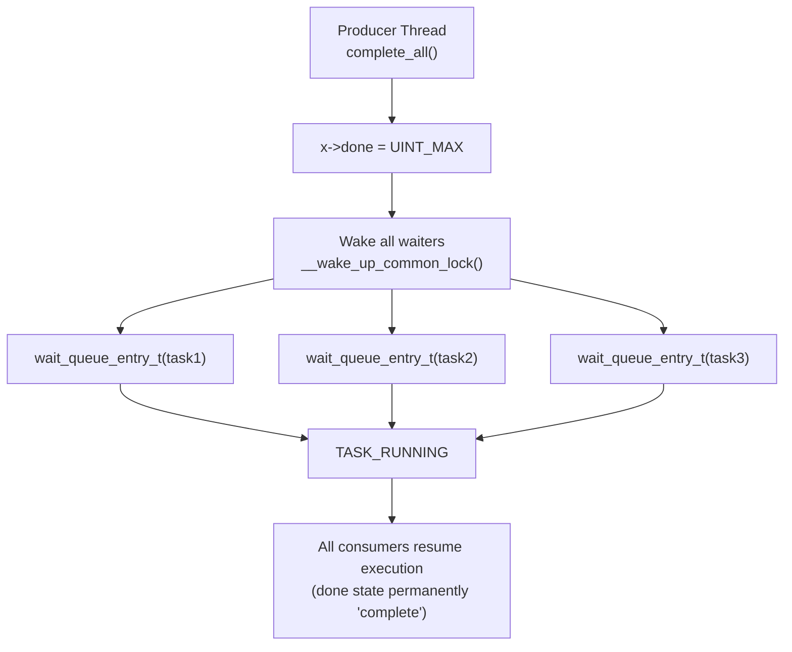
```mermaid
flowchart TD
    A["Producer Thread<br/>complete_all()"] --> B["x->done = UINT_MAX"]
    B --> C["Wake all waiters<br/>__wake_up_common_lock()"]
    C --> D["wait_queue_entry_t(task1)"]
    C --> E["wait_queue_entry_t(task2)"]
    C --> F["wait_queue_entry_t(task3)"]
    D --> G["TASK_RUNNING"]
    E --> G
    F --> G
    G --> H["All consumers resume execution<br/>(done state permanently 'complete')"]
```

------

### 八、与 complete() 的差异对比

| 项目        | complete()           | complete_all()       |
| ----------- | -------------------- | -------------------- |
| 唤醒数量    | 1（exclusive 任务）  | 全部任务             |
| done 值变化 | `done++`             | `done = UINT_MAX`    |
| 可复用性    | 可复用（需 reinit）  | 不可复用（必须重置） |
| 使用场景    | 单个消费者或单步信号 | 阶段广播或全局释放   |
| 唤醒类型    | selective 唤醒       | broadcast 唤醒       |

------

### 九、小结

`complete_all()` 是一种**无条件广播信号**，
 它适合一次性阶段切换，但不适合用于需要“重复同步”或“严格配对”的场合。

核心特性总结：

- **done 永久饱和**（`UINT_MAX`），后续等待立即返回；
- **无法自动复位**，需显式调用 `reinit_completion()`；
- **适用于阶段同步、停止信号、初始化屏障等场景**；
- **不可与 `complete()` 混用**。

------

好的，Leaf，下面是下一节的完整展开：

------

## **20.17　wait_for_completion_interruptible() 与信号响应机制**

------

### 一、章节说明

在 Linux 驱动中，`wait_for_completion_interruptible()` 是 `wait_for_completion()` 的**可中断版本**，允许线程在等待完成事件期间**响应外部信号（如 SIGKILL、SIGINT 等）**，从而实现“可控退出”的同步等待。

这类机制常用于以下场景：

- 用户空间控制的任务（如 IOCTL 或用户线程操作）；
- 可中断的系统初始化或固件加载流程；
- 驱动退出时的中断等待（防止阻塞卸载）。

与普通版本相比，它多了一个特征：

> **在有信号挂起时提前返回 `-ERESTARTSYS`，由上层逻辑决定是否重试或退出。**

------

### 二、接口原型

```c
int wait_for_completion_interruptible(struct completion *x);
int wait_for_completion_killable(struct completion *x);
```

| 接口                                  | 特性     | 说明                                  |
| ------------------------------------- | -------- | ------------------------------------- |
| `wait_for_completion()`               | 不可中断 | 一直阻塞直到完成事件发生              |
| `wait_for_completion_interruptible()` | 可中断   | 若收到任意信号立即返回 `-ERESTARTSYS` |
| `wait_for_completion_killable()`      | 可终止   | 仅响应致命信号（如 SIGKILL）          |

------

### 三、内核实现逻辑

```c
int wait_for_completion_interruptible(struct completion *x)
{
    might_sleep();
    spin_lock_irq(&x->wait.lock);

    if (!x->done) {
        // 进入等待路径
        int ret = __wait_for_common_interruptible(x, TASK_INTERRUPTIBLE);
        spin_unlock_irq(&x->wait.lock);
        return ret;   // 被信号唤醒则返回错误
    }

    x->done--;
    spin_unlock_irq(&x->wait.lock);
    return 0;
}
```

执行路径逻辑如下：

1. **检查 done**：若为 0，则表示未完成 → 准备进入睡眠；
2. **设置任务状态**：`TASK_INTERRUPTIBLE`；
3. **调度切换**：若收到信号，中途唤醒返回；
4. **完成事件**：若 `complete()` 唤醒 → 返回 0；
5. **被信号打断**：返回 `-ERESTARTSYS`。

------

### 四、机制流程图

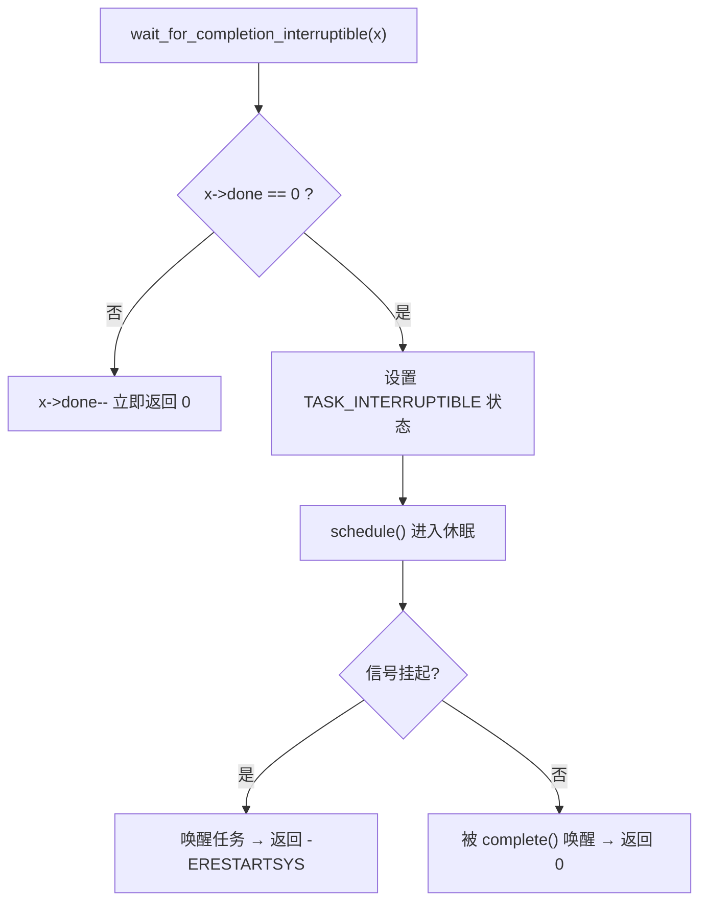
```mermaid
flowchart TD
    A["wait_for_completion_interruptible(x)"] --> B{"x->done == 0 ?"}
    B -- 否 --> C["x->done-- 立即返回 0"]
    B -- 是 --> D["设置 TASK_INTERRUPTIBLE 状态"]
    D --> E["schedule() 进入休眠"]
    E --> F{"信号挂起?"}
    F -- 是 --> G["唤醒任务 → 返回 -ERESTARTSYS"]
    F -- 否 --> H["被 complete() 唤醒 → 返回 0"]
```

------

### 五、行为特征分析

| 特征             | 说明                                                         |
| ---------------- | ------------------------------------------------------------ |
| **可响应信号**   | 内核会在调度点检查 `signal_pending(current)`，若为真则提前返回 |
| **状态标志**     | 线程在等待期间标记为 `TASK_INTERRUPTIBLE`                    |
| **信号种类**     | 普通信号（`SIGINT`, `SIGTERM`, `SIGHUP`）均可打断等待        |
| **返回值**       | 0 = 正常完成；`-ERESTARTSYS` = 被信号中断；                  |
| **信号响应窗口** | 仅在休眠期间（即 schedule() 后）有效                         |

------

### 六、与 wait_event_interruptible() 的对比

| 项目     | wait_for_completion_interruptible() | wait_event_interruptible() |
| -------- | ----------------------------------- | -------------------------- |
| 触发源   | completion.done                     | 任意条件表达式             |
| 等待对象 | completion 内部等待队列             | 用户自定义 wait_queue      |
| 唤醒方式 | complete()/complete_all()           | wake_up()/wake_up_all()    |
| 信号响应 | 支持                                | 支持                       |
| 典型场景 | 任务同步、阶段信号                  | 条件轮询、状态变化         |
| 重入风险 | 无，done 控制信号有限               | 有，条件表达式由用户定义   |

> 简言之：`wait_for_completion_*` 更“结构化”；
>  而 `wait_event_*` 更“自由”。

------

### 七、典型示例：可中断固件加载等待

```c
static DECLARE_COMPLETION(fw_loaded);
static int load_status;

int wait_for_firmware(void)
{
    int ret;

    ret = wait_for_completion_interruptible(&fw_loaded);
    if (ret)
        return -ERESTARTSYS;  // 响应 SIGINT, SIGTERM 等信号

    return load_status;
}

void firmware_ready(int status)
{
    load_status = status;
    complete(&fw_loaded);  // 唤醒等待任务
}
```

> 应用场景：
>  模块加载过程中等待固件加载完成，但用户可以 `Ctrl+C` 中断加载。

------

### 八、killable 版本的补充说明

`wait_for_completion_killable()` 是“半可中断”版本：

- 仅响应致命信号（如 SIGKILL、SIGSTOP）；
- 不响应普通信号；
- 常用于需要保证关键任务执行完毕的场景（例如系统复位、状态持久化）。

------

### 九、错误处理与恢复建议

| 返回值                     | 意义         | 建议操作                      |
| -------------------------- | ------------ | ----------------------------- |
| `0`                        | 正常完成     | 正常继续执行                  |
| `-ERESTARTSYS`             | 被信号打断   | 若允许重试 → 返回上层继续等待 |
| `-EINTR`（用户捕获信号后） | 中断系统调用 | 返回错误码或重新发起等待      |

示例：

```c
retry:
ret = wait_for_completion_interruptible(&done);
if (ret == -ERESTARTSYS)
    goto retry;
```

------

### 十、开发者要点总结

| 项目                         | 建议                                 |
| ---------------------------- | ------------------------------------ |
| **用于用户可中断场景**       | 推荐使用 interruptible 版本          |
| **用于系统关键流程**         | 使用 killable 或非中断版本           |
| **信号恢复逻辑**             | 必须由上层显式处理重试或退出         |
| **避免混用**                 | 同一 completion 不要混用不同等待版本 |
| **在 probe/remove 中使用时** | 确保中断不会引发资源泄漏             |

------

### 十一、小结

> `wait_for_completion_interruptible()`
>  是“可被信号提前打断”的同步等待机制。
>  它让驱动能够在“必须等待”与“允许退出”之间取得平衡。

它并不改变 `completion` 的核心语义，只在等待路径中加入了
 **信号检测（`signal_pending()`）与状态切换（`TASK_INTERRUPTIBLE`）**，
 从而在复杂系统中提升驱动的可控性与健壮性。


------

## **20.18　completion 同步模型在 probe/remove 中的设计模式**

------

### 一、章节说明

`completion` 在驱动的生命周期中是**连接 probe 阶段与 remove 阶段的关键同步机制**。
 它确保异步线程、DMA 回调、中断服务例程（ISR）等在模块卸载前**全部收尾**，避免资源悬挂或访问已释放内存。

在 Linux 驱动框架中，这一机制可概括为：

> **Probe 阶段：等待设备初始化完成；**
> **Remove 阶段：等待后台任务彻底退出。**

------

### 二、典型问题背景

在设备驱动中，常见的并发问题如下：

| 场景                  | 问题                             | 后果                   |
| --------------------- | -------------------------------- | ---------------------- |
| probe 中启动工作线程  | 主线程先返回，工作线程还未 ready | 初始化未完成，注册失败 |
| remove 中直接释放资源 | 后台线程仍在运行                 | use-after-free、panic  |
| 中断服务异步回调      | 回调执行顺序不可预测             | 未同步完成导致数据竞态 |

这些问题都可以通过 **completion** 来解决。

------

### 三、设计模式一：probe 等待异步初始化完成

#### （1）典型示例

```c
struct my_dev {
    struct completion init_done;
    int init_status;
    ...
};

static int mydev_probe(struct platform_device *pdev)
{
    struct my_dev *d = devm_kzalloc(...);
    init_completion(&d->init_done);

    /* 启动异步任务 */
    queue_work(system_wq, &d->init_work);

    /* 等待初始化完成 */
    if (!wait_for_completion_timeout(&d->init_done, msecs_to_jiffies(5000))) {
        dev_err(&pdev->dev, "init timeout\n");
        return -ETIMEDOUT;
    }

    if (d->init_status)
        return d->init_status;

    dev_info(&pdev->dev, "probe complete\n");
    return 0;
}
```

#### （2）异步工作线程

```c
static void mydev_init_work(struct work_struct *work)
{
    struct my_dev *d = container_of(work, struct my_dev, init_work);

    d->init_status = hw_init_sequence();
    complete(&d->init_done);
}
```

#### （3）机制说明

| 阶段         | 动作                                |
| ------------ | ----------------------------------- |
| Probe        | 启动异步任务后立即进入等待          |
| Work         | 异步线程执行完成后调用 `complete()` |
| Probe Resume | 等待结束后根据结果继续初始化        |

✅ **优点**：

- 初始化过程可异步进行；
- 超时控制防止系统卡死；
- 驱动仅在设备“真正 ready”后注册成功。


------

#### 设计模式一：probe 异步初始化 + workqueue + completion（完整范式）

**目标**：在 `probe()` 里**快速返回**，把“可能耗时/可失败/需等待硬件时序”的初始化逻辑**放到后台**（workqueue 的 kworker 线程）做；`probe()` 通过 `completion` **确定性等待**结果（可超时），再决定是否注册成功。

------

##### 一、调用关系先说清楚（从 queue_work 到你的回调）

```text
probe()
 └─ queue_work(system_wq, &init_work)       [提交任务，不执行回调]
     └─ __queue_work()
         └─ 唤醒 kworker 线程                [由内核调度器唤醒]
             └─ worker_thread()             [泛化 worker 主循环]
                 └─ process_one_work()      [取出你的 work_struct]
                     └─ work->func(work)    [回调到你的函数：mydev_init_work()]
```

**结论**：`mydev_init_work()` **绝不是你手动调用**，它是**kworker 线程**在取到你的 `work_struct` 后**自动回调**的。

------

##### 二、可编译骨架（最小但完整）

> 说明：这是一份“与环境无关”的骨架代码，表现出**真实调用链**与**同步点**。
>  你可以把 `hw_init_sequence()` 换成真实硬件初始化。

```c
// mydev.c
#include <linux/module.h>
#include <linux/platform_device.h>
#include <linux/workqueue.h>
#include <linux/completion.h>
#include <linux/delay.h>

struct my_dev {
    struct device        *dev;
    struct work_struct    init_work;
    struct completion     init_done;
    int                   init_status;
    bool                  dying;           /* [INV] remove 中置位，禁止回调继续 */
};

static int hw_init_sequence(struct my_dev *d)
{
    /* [INV] 只做可睡眠的初始化：I2C/SPI/延时/固件加载等 */
    msleep(100); /* 模拟耗时 */
    return 0;    /* 0=成功，负值=失败 */
}

/* ★★★ 回调：kworker 自动调用，不是你手调 ★★★ */
static void mydev_init_work(struct work_struct *work)
{
    struct my_dev *d = container_of(work, struct my_dev, init_work);

    if (READ_ONCE(d->dying))           /* [CHECK] remove 过程的竞态保护 */
        goto out_complete;

    d->init_status = hw_init_sequence(d);

out_complete:
    /* [INV] 无论成败，必须完成一次 complete，保证 probe 不被永久挂死 */
    complete(&d->init_done);
}

static int mydev_probe(struct platform_device *pdev)
{
    struct my_dev *d;

    d = devm_kzalloc(&pdev->dev, sizeof(*d), GFP_KERNEL);
    if (!d) return -ENOMEM;
    platform_set_drvdata(pdev, d);
    d->dev = &pdev->dev;

    INIT_WORK(&d->init_work, mydev_init_work);
    init_completion(&d->init_done);
    d->init_status = -EINPROGRESS;
    d->dying = false;

    /* [INV] probe 不做耗时初始化，把“慢活”丢给 workqueue */
    queue_work(system_wq, &d->init_work);

    /* [CHECK] 等后台完成；可选：用 timeout 防死锁防硬件异常 */
    if (!wait_for_completion_timeout(&d->init_done, msecs_to_jiffies(5000))) {
        dev_err(d->dev, "init timeout\n");
        /* [PIT] 切记：如果超时，应该阻止回调后续访问资源 */
        WRITE_ONCE(d->dying, true);
        return -ETIMEDOUT;
    }

    if (d->init_status) {
        dev_err(d->dev, "init failed: %d\n", d->init_status);
        return d->init_status;
    }

    dev_info(d->dev, "probe done\n");
    return 0;
}

static int mydev_remove(struct platform_device *pdev)
{
    struct my_dev *d = platform_get_drvdata(pdev);

    /* [INV] 先宣告“退场”，防止回调在 remove 后访问资源 */
    WRITE_ONCE(d->dying, true);

    /* [CHECK] 彻底收尾：确保所有排队/执行中的 work 都完成或被取消 */
    flush_work(&d->init_work);         /* 或者：cancel_work_sync(&d->init_work) */

    /* 若有其它线程/中断也等在 completion 上，这里要保证也能退出（略） */
    dev_info(d->dev, "remove done\n");
    return 0;
}

/* —— 设备匹配/驱动注册 —— */
static struct platform_driver mydev_driver = {
    .probe  = mydev_probe,
    .remove = mydev_remove,
    .driver = {
        .name = "mydev-demo",
    },
};
module_platform_driver(mydev_driver);
MODULE_LICENSE("GPL");
```

------

##### 三、时序与同步：一眼看懂

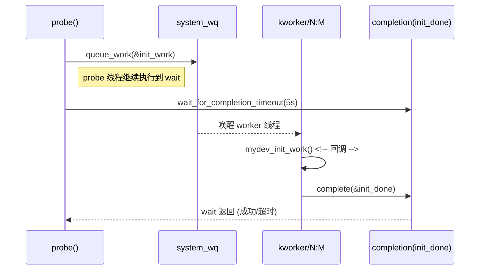
```mermaid
sequenceDiagram
    participant P as probe()
    participant WQ as system_wq
    participant K as kworker/N:M
    participant C as completion(init_done)

    P->>WQ: queue_work(&init_work)
    Note right of P: probe 线程继续执行到 wait
    P->>C: wait_for_completion_timeout(5s)
    WQ-->>K: 唤醒 worker 线程
    K->>K: mydev_init_work()   <!-- 回调 -->
    K->>C: complete(&init_done)
    C-->>P: wait 返回 (成功/超时)
```

**关键点**

- `mydev_init_work()` 的**调用者**是 `kworker`，不是你；
- `probe()` 在 `wait_for_completion_*()` 上**可控地阻塞**；
- `complete()` 是**一次性信号**，确保 `probe()` 知道“后台初始化已结束（成功/失败/提前退出）”。

------

##### 四、为什么这样设计？（机制层解释）

1. **probe 不能长时间阻塞**
   - 总线探测/设备注册是系统关键路径，阻塞会拖慢启动甚至引发锁顺序问题。
   - **把慢操作扔给工作队列**，利用通用 `kworker` 执行。
2. **completion 提供“确定性同步点”**
   - `done` 计数 + 等待队列，保证 `probe` **“有且仅有一次”**接到后台初始化的完成信号（成功/失败都要 `complete()`）。
3. **remove 的竞态可控**
   - 通过 `dying` 标志 + `flush_work()` / `cancel_work_sync()`，
      保证回调不会在资源释放后访问内存（避免 UAF）。

------

##### 五、每行代码的“契约语义”（审计注解）

- `INIT_WORK(&d->init_work, mydev_init_work);`
   `[INV]`：一个 work 结构只绑定一个回调函数，不要跨对象复用。
- `queue_work(system_wq, &d->init_work);`
   `[MIX]`：使用系统公用队列；若初始化量很大或需隔离 QoS，考虑自建单线程 WQ。
- `wait_for_completion_timeout(&d->init_done, ...)`
   `[CHECK]`：**强烈建议**带超时，防硬件/固件异常导致系统卡死。
- `complete(&d->init_done);`
   `[INV]`：无论成功/失败/被 dying 打断，都必须 complete 一次。
- `WRITE_ONCE(d->dying, true);`
   `[PIT]`：没有“退场标志”，回调可能在 remove 后继续访问 `d` 导致崩溃。
- `flush_work(&d->init_work);` / `cancel_work_sync()`
   `[CHECK]`：**收尾动作**，确保 work 不再运行或已运行完。

------

##### 六、常见坑与对照修复

| 反模式（PIT）                          | 后果                      | 修复（对照）                                         |
| -------------------------------------- | ------------------------- | ---------------------------------------------------- |
| 回调里失败路径没 `complete()`          | `probe` 永久卡死          | **保证所有路径都 `complete()`**                      |
| `probe` 不带超时等待                   | 硬件异常导致系统挂起      | 用 `wait_for_completion_timeout()`                   |
| `remove` 不 `flush/cancel` work        | 回调访问已释放对象（UAF） | `WRITE_ONCE(dying,true);` + `flush_work()`           |
| 回调里使用不可睡 API（或长时间持锁）   | 影响 kworker 全局行为     | 回调中仅做可睡、无长持锁操作                         |
| 在中断里 `queue_work()` 后立刻依赖结果 | 调度不可见性/竞态         | 把“等待结果”放回 process context，用 completion 同步 |

------

##### 七、变体与扩展

- **带延迟的初始化**：
   硬件上电后需稳定一段时间 → `queue_delayed_work(system_wq, &init_work, msecs_to_jiffies(20));`

- **专用 workqueue 隔离**：
   初始化任务重/竞态复杂 → 自建 WQ：

  ```c
  d->wq = alloc_workqueue("mydev_wq", WQ_UNBOUND|WQ_HIGHPRI, 1);
  queue_work(d->wq, &d->init_work);
  destroy_workqueue(d->wq);
  ```

- **多阶段初始化**：
   用两个 `completion`：`load_fw_done`、`hw_ready_done`，分阶段 `complete()`，probe 逐段等待。

------

##### 八、最小清单（上线前必勾选）

-  `INIT_WORK`/`queue_work`，**不**在 probe 做耗时操作
-  `completion` **有超时等待**，失败路径也会 `complete()`
-  `remove`：`dying=true` + `flush_work()`/`cancel_work_sync()`
-  回调只做可睡/短临界区逻辑（**不可**长时间占锁）
-  多轮使用 `completion` 前 `reinit_completion()`
-  有打印或 tracepoint 标注关键阶段（便于排障）

------

##### 九、一句话总结

> **慢初始化交给 kworker，probe 用 completion 做“唯一同步点”。**
>  这保证了**快速探测**、**确定收尾**、**可控超时**，并把**并发与生命周期**的复杂度固定在可审计的几处“同步点”上。

------

如果你愿意，我可以把上面骨架换成一个**真实子系统**的范例（比如 I2C 传感器驱动或 SPI 外设），再补一版“**错误注入与容错演示**”（固件加载失败/超时/remove 抢跑），把**调试日志与竞态窗口**都秀出来。

------

### 四、设计模式二：remove 等待后台线程退出

#### （1）典型示例

```c
static void mydev_remove(struct platform_device *pdev)
{
    struct my_dev *d = platform_get_drvdata(pdev);

    /* 通知后台任务停止 */
    d->should_stop = true;
    complete_all(&d->stop_signal);

    /* 等待任务完全退出 */
    wait_for_completion_timeout(&d->stopped, msecs_to_jiffies(3000));

    dev_info(&pdev->dev, "remove done\n");
}
```

#### （2）后台任务

```c
static int mydev_thread(void *arg)
{
    struct my_dev *d = arg;

    while (!kthread_should_stop()) {
        wait_for_completion_interruptible(&d->stop_signal);

        if (d->should_stop)
            break;

        process_event();
    }

    complete(&d->stopped); // 通知 remove 已完全退出
    return 0;
}
```

#### （3）机制说明

| 同步点                                  | 行为                       | 意义             |
| --------------------------------------- | -------------------------- | ---------------- |
| `complete_all(&stop_signal)`            | 通知所有等待任务退出       | 广播停机         |
| `wait_for_completion_timeout(&stopped)` | 等待后台线程确认结束       | 防止资源提前释放 |
| `complete(&stopped)`                    | 后台线程通知主线程退出完毕 | 驱动可安全卸载   |

✅ **优点**：

- 保证 remove 前后台所有任务已终止；
- 防止资源被提前释放；
- 避免死锁（使用 `complete_all` 防止遗漏）。

------

### 五、设计模式三：中断驱动的同步等待

#### （1）示例：DMA 传输等待完成

```c
static DECLARE_COMPLETION_ONSTACK(dma_done);

static irqreturn_t dma_irq_handler(int irq, void *dev_id)
{
    complete(&dma_done); // 通知数据传输结束
    return IRQ_HANDLED;
}

static int dma_transfer(struct device *dev)
{
    start_dma_transfer();
    if (wait_for_completion_timeout(&dma_done, msecs_to_jiffies(1000)) == 0)
        return -ETIMEDOUT;
    return 0;
}
```

#### （2）分析

| 角色   | 操作                    | 同步点                      |
| ------ | ----------------------- | --------------------------- |
| 主线程 | 发起 DMA 请求并等待完成 | wait_for_completion_timeout |
| 中断   | 传输完成后调用 complete | 唤醒主线程继续执行          |

✅ **效果**：

- 阻塞等待 DMA 完成；
- 防止忙等；
- 超时退出，系统安全可控。

------

### 六、设计模式四：多阶段初始化同步

当设备初始化分为多个阶段时，可使用多个 completion 实例分别同步：

```c
struct my_dev {
    struct completion load_fw;
    struct completion hw_ready;
};

void probe_work(void *arg)
{
    struct my_dev *d = arg;

    request_firmware_async(..., fw_loaded_callback, d);
    wait_for_completion(&d->load_fw);    // 阶段一：固件加载完成
    wait_for_completion(&d->hw_ready);   // 阶段二：硬件初始化完成
}

void fw_loaded_callback(const struct firmware *fw, void *context)
{
    struct my_dev *d = context;
    d->fw = fw;
    complete(&d->load_fw);
}
```

✅ **特征**：
 多阶段同步，每个 completion 独立计数，互不干扰。

------

### 七、remove 退出同步模型（时序图）

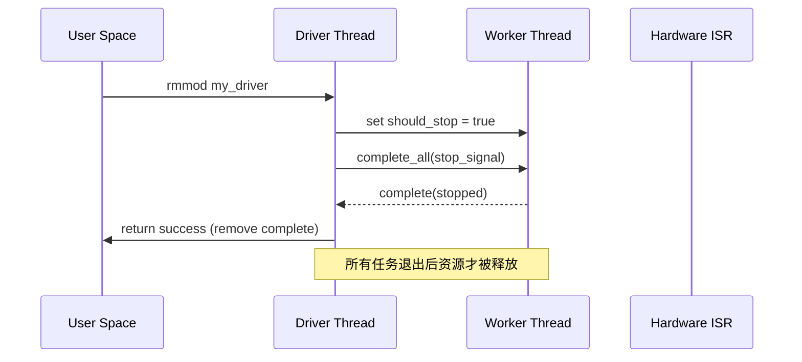
```mermaid
sequenceDiagram
    participant User as User Space
    participant Driver as Driver Thread
    participant Worker as Worker Thread
    participant HW as Hardware ISR

    User->>Driver: rmmod my_driver
    Driver->>Worker: set should_stop = true
    Driver->>Worker: complete_all(stop_signal)
    Worker-->>Driver: complete(stopped)
    Driver->>User: return success (remove complete)
    Note over Driver,Worker: 所有任务退出后资源才被释放
```

------

### 八、常见错误模式与修复建议

| 错误模式                   | 问题描述                       | 修复方式                         |
| -------------------------- | ------------------------------ | -------------------------------- |
| 忘记调用 `complete()`      | 永远阻塞在 wait_for_completion | 在所有退出路径添加 `complete()`  |
| remove 未等待后台线程      | use-after-free / panic         | 在 remove 中显式等待             |
| 多次初始化同一 completion  | 竞争条件、重复唤醒             | 每轮事件后 `reinit_completion()` |
| 同一 completion 多线程混用 | 唤醒行为不可预测               | 每个任务独立 completion          |

------

### 九、小结与核对表

| 核对项                                                       | 说明 |
| ------------------------------------------------------------ | ---- |
| ✅ 在 probe 中使用 completion 等待异步初始化完成              |      |
| ✅ 在 remove 中使用 completion 等待后台任务退出               |      |
| ✅ 所有 completion 在多轮使用前重新初始化                     |      |
| ✅ 中断同步通过 complete()/wait_for_completion_timeout() 实现 |      |
| ⚠️ 避免不同任务共享同一 completion                            |      |
| ⚠️ 使用 complete_all() 广播停机信号需谨慎复位                 |      |

------

### 十、总结

`completion` 是驱动生命周期中**最稳健的同步手段**，
 它在 **probe 阶段实现异步初始化同步**，
 在 **remove 阶段保证任务安全收尾**，
 在 **中断回调中提供事件确认点**。

> 通过正确使用 completion，驱动能在多线程与异步场景下保持确定的行为顺序，
>  同时确保资源释放与卸载路径的安全可控。


------

## **20.20　调试与验证：锁依赖检测与同步路径分析**

------

### 一、章节说明

在复杂驱动中，`waitqueue` 与 `completion` 机制往往与自旋锁、互斥锁、IRQ、工作队列交织使用。
 若使用不当，极易出现 **死锁（deadlock）**、**长时间等待（hang）** 或 **假唤醒（spurious wakeup）**。

为了保证并发同步路径的正确性，Linux 内核提供了一整套**可视化与验证工具体系**，包括：

| 工具                                | 功能                       |
| ----------------------------------- | -------------------------- |
| **lockdep**                         | 检查锁依赖关系与潜在死锁   |
| **ftrace**                          | 跟踪函数与事件调用路径     |
| **trace-cmd / KernelShark**         | 可视化调度与唤醒路径       |
| **/proc/sched_debug**               | 查看系统调度与等待队列状态 |
| **/sys/kernel/debug/lockdep_stats** | 分析锁统计与递归锁问题     |

本节将从“可见性 → 验证 → 路径分析”三个层次，讲解如何系统验证等待与唤醒逻辑的正确性。

------

### 二、死锁与竞态的典型征兆

| 征兆                                            | 说明                                            | 可能原因                          |
| ----------------------------------------------- | ----------------------------------------------- | --------------------------------- |
| `D` 状态任务堆积                                | 大量任务停留在不可中断睡眠                      | 等待未被唤醒                      |
| `blocked for more than 120s`                    | 内核检测长阻塞                                  | 未调用 `complete()` / `wake_up()` |
| `possible circular locking dependency detected` | lockdep 报告锁顺序反转                          | 不同锁交叉持有                    |
| probe/remove 死锁                               | probe() 等待 completion，但 remove() 已释放资源 | 锁序错误或状态检查缺失            |
| CPU 占用飙升                                    | 等待条件未重检，陷入忙等循环                    | 忘记“醒后再检”逻辑                |

------

### 三、lockdep：锁依赖追踪与验证机制

#### （1）启用 lockdep

默认内核编译配置：

```bash
CONFIG_PROVE_LOCKING=y
CONFIG_LOCKDEP=y
CONFIG_DEBUG_SPINLOCK=y
```

加载模块时内核会打印：

```
Lock dependency validator: enabled
```

#### （2）功能原理

- 每次加锁 / 解锁操作会注册在锁依赖图中；
- 若发现同一线程存在反序获取（A→B 与 B→A）则报警；
- 对于 `waitqueue` / `completion`，lockdep 同样追踪其内部 `spinlock_t`。

#### （3）典型警告输出示例

```
======================================================
WARNING: possible circular locking dependency detected
5.10.0-rt kernel
------------------------------------------------------
mydev_probe/123 is trying to acquire lock:
 (&dev->init_done.wait.lock){+.+.}, at: wait_for_completion+0x4a/0x80
but task is already holding lock:
 (&dev->irq_lock){-.-.}, at: mydev_irq_handler+0x23/0x40
------------------------------------------------------
```

> 说明：在中断锁持有期间等待 completion，会导致锁依赖循环。
>  ✅ 修复：在中断上下文禁止 `wait_for_completion()`，或使用 `complete()` 通知机制。

------

### 四、ftrace：跟踪等待与唤醒路径

#### （1）启用 ftrace

```bash
mount -t debugfs none /sys/kernel/debug
cd /sys/kernel/debug/tracing
echo function_graph > current_tracer
echo 0 > tracing_max_latency
echo 1 > tracing_on
```

#### （2）设置过滤函数

```bash
echo 'wait_for_completion*' > set_ftrace_filter
echo 'complete*' >> set_ftrace_filter
```

#### （3）查看调用链

```bash
cat trace
```

输出示例：

```
  0)   1.000 us | wait_for_completion();
  0) + 10.123 us |  complete();
```

> 说明：唤醒延迟为约 10µs，可用于评估性能瓶颈。

------

### 五、trace-cmd 与 KernelShark：可视化同步路径

#### （1）记录 trace 数据

```bash
trace-cmd record -e sched:sched_switch -e irq:* -e workqueue:* -e completion:*
```

#### （2）可视化分析

```bash
kernelshark trace.dat
```

查看事件链路：

- `sched_switch`：查看任务睡眠与唤醒；
- `workqueue_execute_start/finish`：确认 kworker 执行顺序；
- `complete()` 与 `wait_for_completion()` 的时间差：计算同步延迟。

> 通过时序对齐，可以直观看出：
>
> - completion 是否被遗漏；
> - 唤醒是否过早；
> - 哪个 CPU 执行了唤醒。

------

### 六、/proc/sched_debug 与锁统计接口

#### （1）调度状态快照

```bash
cat /proc/sched_debug | grep -A10 mydev
```

输出中可看到：

- TASK_INTERRUPTIBLE / UNINTERRUPTIBLE；
- 所在 CPU；
- rq（运行队列）负载。

#### （2）锁统计

```bash
cat /sys/kernel/debug/lockdep_stats
```

显示：

- 活跃锁数量；
- 最大持锁深度；
- 死锁检测次数。

------

### 七、验证 checklist：同步路径自检要点

| 核对项            | 检查手段           | 说明                            |
| ----------------- | ------------------ | ------------------------------- |
| 等待→唤醒配对     | ftrace / trace-cmd | 是否每次 wait 都有对应 complete |
| 锁顺序正确        | lockdep            | 无 A→B、B→A 交叉路径            |
| 中断上下文        | lockdep + dmesg    | 禁止在中断上下文阻塞等待        |
| 调度延迟          | trace-cmd          | 唤醒延迟是否超出期望            |
| 状态复位          | 手工检查代码       | 每次事件后 reinit_completion()  |
| probe/remove 顺序 | trace / printk     | 是否先退出线程再释放资源        |

------

### 八、常见错误及示例修复

#### （1）错误：在中断上下文使用 `wait_for_completion()`

```c
irqreturn_t irq_handler(int irq, void *data)
{
    wait_for_completion(&done); // ❌ 会死锁
    return IRQ_HANDLED;
}
```

✅ **修复：**

```c
complete(&done); // 唤醒主线程
```

#### （2）错误：重复唤醒后未复位

```c
complete(&done);
complete(&done);
wait_for_completion(&done); // ✅ 立即返回，但逻辑错误
```

✅ **修复：**

```c
reinit_completion(&done);
```

#### （3）错误：工作队列任务未同步回收

```c
remove():
    free(dev); // ❌ kworker 可能还在使用 dev
```

✅ **修复：**

```c
cancel_work_sync(&dev->work);
free(dev);
```

------

### 九、开发实践建议

| 建议                                                      | 说明               |
| --------------------------------------------------------- | ------------------ |
| 在调试阶段开启 `CONFIG_PROVE_LOCKING` 与 `CONFIG_LOCKDEP` | 提前发现锁依赖问题 |
| 使用 `ftrace` 或 `trace-cmd` 跟踪同步路径                 | 定位唤醒延迟或遗漏 |
| 对每个 `completion` 加统一命名前缀                        | 日志可读性高       |
| 尽量打印配对日志 (`wait→complete`)                        | 方便跨线程分析     |
| 在 remove 阶段统一 flush/cancel 所有异步任务              | 保证退出一致性     |

------

### 十、调试流程图（推荐实践）

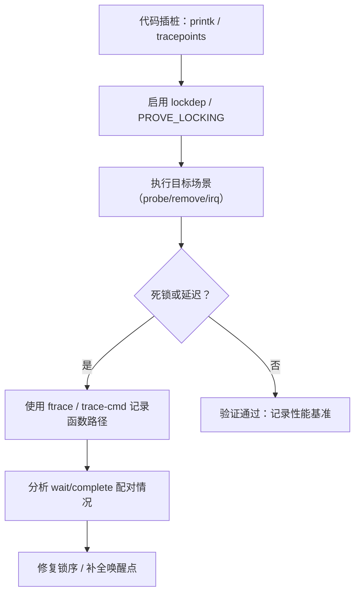
```mermaid
flowchart TD
    A["代码插桩：printk / tracepoints"] --> B["启用 lockdep / PROVE_LOCKING"]
    B --> C["执行目标场景（probe/remove/irq）"]
    C --> D{"死锁或延迟？"}
    D -- 是 --> E["使用 ftrace / trace-cmd 记录函数路径"]
    E --> F["分析 wait/complete 配对情况"]
    F --> G["修复锁序 / 补全唤醒点"]
    D -- 否 --> H["验证通过：记录性能基准"]
```

------

### 十一、小结

| 关键点                                                  | 说明 |
| ------------------------------------------------------- | ---- |
| ✅ `lockdep` 能在开发阶段发现锁顺序反转、递归依赖等问题  |      |
| ✅ `ftrace` 与 `trace-cmd` 可还原等待—唤醒的完整路径     |      |
| ✅ `sched_debug`、`lockdep_stats` 提供现场快照与统计分析 |      |
| ✅ 禁止在中断上下文执行阻塞等待                          |      |
| ✅ remove 阶段必须确保所有异步任务被 flush / cancel      |      |
| ✅ 建议在关键驱动模块默认启用同步日志（DEBUG 编译宏）    |      |

> **总结：**
>  并发机制不是靠“相信代码正确”来验证，而是靠**锁依赖、路径回放与延迟统计**来量化证明。
>  驱动同步系统的可靠性 ≈ 唤醒路径完整性 + 锁序一致性 + 退出收敛性。

------

