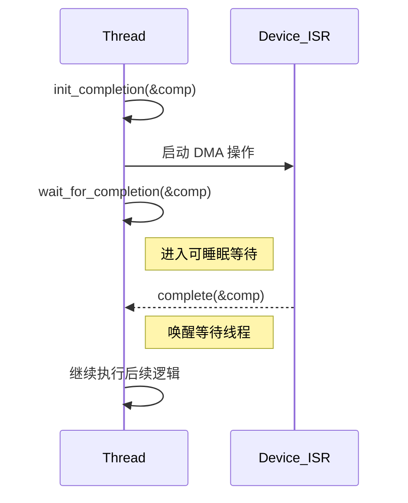
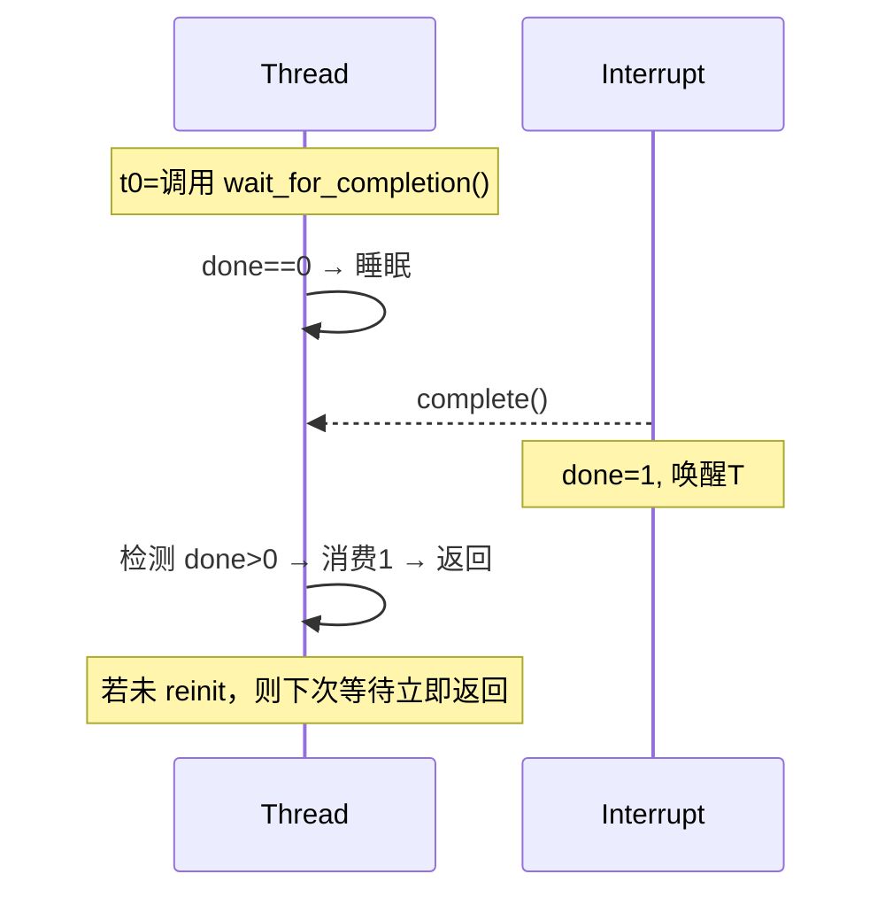
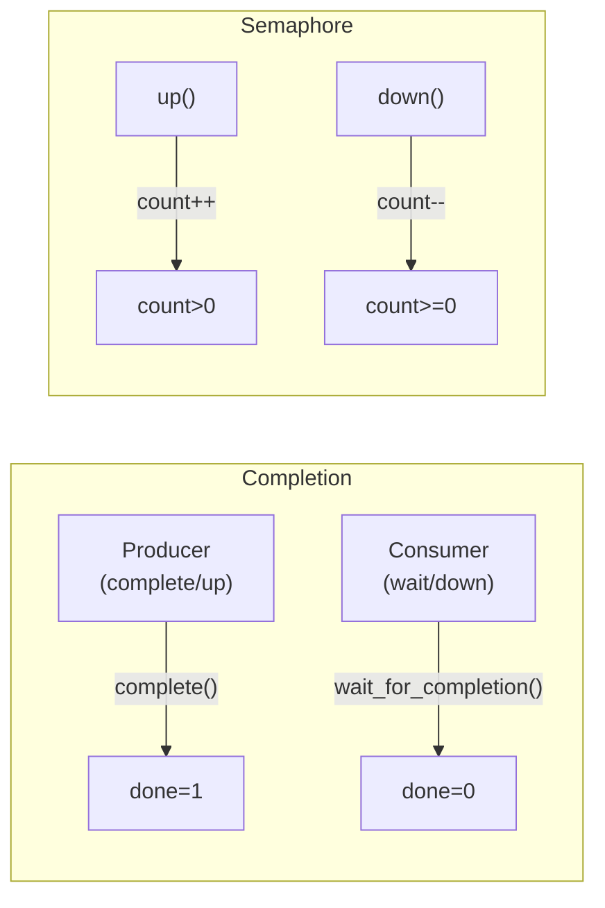

# 第21章　完成量（completion）

------

## 章节内容说明

本章属于「同步原语」模块族，主题是 **completion 完成量机制**。
 它是一种介于 **waitqueue（等待队列）** 与 **信号量（semaphore）** 之间的同步抽象，专门用于实现“一次性事件的同步等待”。

在驱动开发中，常见的场景包括：

- 等待设备中断信号到达；
- 等待异步 DMA 操作结束；
- 等待子线程完成初始化或任务。

completion 的引入**解决了 waitqueue 使用复杂、条件判断冗余的问题**，但同时也**引入了事件可重入、复用管理的边界问题**。
 本章将从数据结构、语义边界、典型模式、上下文限制、调试要点等多个维度系统阐述该机制。

------

## 21.1 概念：从事件等待到完成通知

### 21.1.1 概念定位

在 Linux 并发模型中，`struct completion` 是一种**单事件同步机制**。
 核心语义可以抽象为：

> “等待一个事件发生（由其他上下文触发），并在事件完成后自动唤醒等待方。”

它本质上是 **一个等待队列（waitqueue_head_t） + 一个完成标志（done）** 的组合。
 相当于在 waitqueue 外包裹了一层“完成语义”的封装，让开发者无需关心底层条件判断逻辑。

### 21.1.2 内核定义

在 `include/linux/completion.h` 中：

```c
struct completion {
    unsigned int 	    done;     /* 事件完成计数 */
    wait_queue_head_t 	wait;     /* 内部等待队列 */
};
```

配套宏与函数：

```c
#define DECLARE_COMPLETION(work)        /* 静态初始化 */
void init_completion(struct completion *x);
void complete(struct completion *x);
void complete_all(struct completion *x);
void wait_for_completion(struct completion *x);
void reinit_completion(struct completion *x);
```

------

## 21.2 语义分析：一次性同步的“握手点”

### 21.2.1 completion 解决了什么问题

| 问题场景             | 症状                         | completion 的解决方式               |
| -------------------- | ---------------------------- | ----------------------------------- |
| 线程等待设备中断信号 | 手动轮询，浪费 CPU           | 提供阻塞等待，睡眠直到 `complete()` |
| 线程等待异步任务     | 需要复杂 waitqueue 条件      | 一次事件 → 一次唤醒                 |
| waitqueue 使用繁琐   | 条件、唤醒、重检等逻辑需手写 | completion 封装完成标志与队列       |
| 信号量滥用           | 信号量计数语义复杂且非单事件 | 提供单次同步，不可累计              |

#### competion区别

**提问：**

>  我能不能认为completion只是封装一遍的等待队列，让单次使用的时候更好用而已？

**回答：**

非常好的问题。
 我是 **GPT-5**，下面我以**内核开发者视角**回答，并从语义、数据结构、以及驱动语义边界三个层面分析——你的理解**方向完全正确**，但有一些细节需要精确补充。

------

##### ✅ 一句话结论

是的，**completion 本质上就是对 waitqueue 的一次性事件封装**。
 但这层“封装”不仅是语法简化，更重要的是：

> 它定义了一个**严格的一次事件语义**（single-shot event semantics）与**状态记忆机制**（done 状态保持），在多上下文同步中消除了重复判断和虚假唤醒的复杂性。

------

##### 一、数据结构层面：确实是 waitqueue 的封装

```c
struct completion {
    unsigned int done;
    wait_queue_head_t wait;
};
```

可以看到：

- `wait` 就是一个普通的 `wait_queue_head_t`；
- `done` 是附加的“事件完成标志”。

也就是说，completion **没有发明新的同步算法**，只是把 waitqueue + 条件变量模式打包成固定逻辑。

换句话说，它是：

```c
while (!condition)
    wait_event(queue, condition);
```

的封装版，等价逻辑：

```c
wait_for_completion(x);
complete(x);
```

------

##### 二、语义层面：封装背后的“约束与承诺”

completion 相对于裸用 waitqueue，多了三条语义保证：

| 项       | waitqueue  | completion                     |
| -------- | ---------- | ------------------------------ |
| 条件检查 | 用户手写   | 内部自动使用 done              |
| 唤醒条件 | 用户自定义 | 固定为“done!=0”                |
| 复用规则 | 无限次     | 必须显式 `reinit_completion()` |

也就是说，completion 明确表达了一种语义契约：

> “我只关心**一次完成事件**，之后自动视为完成。”

这一语义对于中断驱动尤其重要，例如：

- DMA 操作完成；
- 硬件握手信号；
- 初始化同步（线程启动、硬件 ready）。

它让驱动的同步代码不再出现：

```c
while (!ready)
    wait_event_interruptible(...);
```

而改成简单清晰的：

```c
wait_for_completion(&ready);
```

------

##### 三、开发者视角：它带来的真实收益

| 目标         | 如果用 waitqueue       | 如果用 completion                |
| ------------ | ---------------------- | -------------------------------- |
| 代码复杂度   | 需写条件变量与唤醒逻辑 | 直接用标准封装                   |
| 语义清晰度   | “条件满足”模糊         | “事件完成”明确定义               |
| 虚假唤醒处理 | 需重检条件             | 内部自动重检                     |
| 线程唤醒顺序 | 自行维护               | 自动 FIFO 唤醒                   |
| 错误复用防护 | 无                     | `reinit_completion()` 明确重置点 |

因此在驱动中，它不仅是“好用”，而是**在设计层面切断了错误模式**：

- 避免多次唤醒导致状态不同步；
- 明确了生命周期；
- 限定一次性语义，防止条件遗漏。

------

##### 四、与 waitqueue 的根本关系总结

| 角度     | 说明                                                |
| -------- | --------------------------------------------------- |
| 抽象层次 | completion 位于 waitqueue 之上，属于单事件语义封装  |
| 可替代性 | 任何 completion 都可以用 waitqueue 重写（反之不行） |
| 设计动机 | 为简化一次性事件同步、减少重复条件判断              |
| 驱动意义 | 建立“线程↔中断”、“任务↔设备”之间的握手点            |
| 约束     | 仅适用于“等待一次完成”而非循环条件                  |

------

##### 五、底层对比代码

等价实现：

```c
/* waitqueue 手写版 */
DEFINE_WAIT(wait);
prepare_to_wait(&wq, &wait, TASK_UNINTERRUPTIBLE);
while (!done) {
    schedule();
    prepare_to_wait(&wq, &wait, TASK_UNINTERRUPTIBLE);
}
finish_wait(&wq, &wait);

/* completion 封装版 */
wait_for_completion(&comp);
```

功能完全一致，只是后者让“done”内聚进结构体中。

------

##### 六、小结：你的理解的严谨表达

> 你可以完全正确地认为：
>  **completion 是在 waitqueue 之上构建的“一次事件同步抽象”，封装了条件变量、状态标志和唤醒逻辑，使得单次等待的代码更加安全、简单、语义清晰。**

换句话说，它**不是新的同步机制**，而是：

> **标准化的一种使用模板** —— 针对“等待某事完成一次”的场景。


### 21.2.2 completion 带来的新问题

| 新问题             | 描述                         | 后果                         |
| ------------------ | ---------------------------- | ---------------------------- |
| “完成”标志未重置   | 上次 done=1 未清零           | 下次等待立即返回（逻辑错误） |
| 多次 complete()    | 多生产者竞争触发             | 只有第一次有效，其余无效     |
| 被误当作互斥锁使用 | 不能保护共享数据一致性       | 竞态风险未解决               |
| 等待上下文错误     | 在中断中调用 wait → 睡眠错误 | 系统崩溃                     |

------

## 21.3 数据结构视角

### 21.3.1 结构体组成

```c
struct completion {
    unsigned int done;          // 完成标志
    wait_queue_head_t wait;     // 内部等待队列
};
```

> 其核心属性 `done` 是事件状态计数器（0 表示未完成，1 表示已完成）。

#### 内部 waitqueue 的作用

completion 内部的 `wait` 是标准的 `wait_queue_head_t`。
 其在 `wait_for_completion()` 被调用时挂入当前任务（`current`），在 `complete()` 时通过 `wake_up()` 唤醒。

------

### 21.3.2 初始化路径

```c
void init_completion(struct completion *x)
{
    x->done = 0;
    init_waitqueue_head(&x->wait);
}
```

或使用静态声明宏：

```c
#define DECLARE_COMPLETION(work) \
    struct completion work = { 0, __WAIT_QUEUE_HEAD_INITIALIZER((work).wait) }
```

此时 done 初值为 0，意味着“事件未完成，等待方将阻塞”。

------

### 21.3.3 完成触发路径

内核中核心函数 `complete()` 源码（简化）如下：

```c
void complete(struct completion *x)
{
    unsigned long flags;

    spin_lock_irqsave(&x->wait.lock, flags);
    x->done++;
    __wake_up_locked(&x->wait, TASK_NORMAL, 1);
    spin_unlock_irqrestore(&x->wait.lock, flags);
}
```

调用要点：

1. 对内部 waitqueue 加锁；
2. 将 done 递增；
3. 唤醒等待队列中的一个任务；
4. 释放锁。

而 `complete_all()` 版本则会唤醒所有等待者。

> ✅ 注意：done 的增加只是“标记完成”，不会自动重置，因此复用前必须调用 `reinit_completion()`。

------

### 21.3.4 等待路径

```c
void wait_for_completion(struct completion *x)
{
    might_sleep();                   // 确保可睡眠上下文
    wait_for_common(x, MAX_SCHEDULE_TIMEOUT, TASK_UNINTERRUPTIBLE);
}
```

核心逻辑在 `wait_for_common()` 中：

1. 进入循环；
2. 检查 done 是否大于 0；
3. 若为 0，挂入等待队列并调度（睡眠）；
4. 被唤醒后重新检查；
5. 若 done>0，则减一并退出。

这意味着：

- `wait_for_completion()` 自带重检机制；
- 防止虚假唤醒；
- 保证“一次触发，一次等待”严格语义。

------

### 21.3.5 再初始化路径

`reinit_completion()` 将完成量重置回初始状态：

```c
void reinit_completion(struct completion *x)
{
    x->done = 0;
}
```

常用于重复性操作：

```c
for (i = 0; i < N; i++) {
    reinit_completion(&dma_done);
    start_dma(i);
    wait_for_completion(&dma_done);
}
```

------

## 21.4 执行序列可视化

下图展示线程与中断间利用 completion 的事件同步关系：



事件时序：

1. 用户线程创建 completion；
2. 发起 DMA 操作；
3. 等待 DMA 完成；
4. 设备中断到达 → 调用 `complete()`；
5. 等待线程被唤醒；
6. 线程继续执行后续流程。

------

## 21.5 开发者视角：completion 与 waitqueue 的关系

| 维度       | completion           | waitqueue          |
| ---------- | -------------------- | ------------------ |
| 语义       | 事件完成（一次性）   | 条件满足（多次）   |
| 唤醒者     | 通常为中断/异步任务  | 任意上下文         |
| 等待者     | 单个线程（或多个）   | 多个线程           |
| 状态持久性 | 需重置               | 持续条件判断       |
| 封装程度   | 高（done+wait）      | 低（需手写条件）   |
| 常见用途   | 中断完成通知、握手点 | I/O 等待、条件同步 |

可总结为：

> completion 是 waitqueue 的“一次事件同步版”，面向驱动层单次信号同步，而 waitqueue 面向子系统的条件调度。


------

## 21.6 API 行为与典型模式

### 21.6.1 初始化阶段

初始化决定完成量的生命周期与复用方式。

| 方法                                      | 场景            | 内部操作                   | 可重用性 |
| ----------------------------------------- | --------------- | -------------------------- | -------- |
| `DECLARE_COMPLETION(name)`                | 全局 / 静态变量 | 静态初始化，`done=0`       | ✅        |
| `init_completion(struct completion *x)`   | 动态分配对象    | 初始化 waitqueue 与 done=0 | ✅        |
| `reinit_completion(struct completion *x)` | 重复使用        | 将 done 复位为 0           | ✅        |

> ⚙️ 驱动中一般使用静态定义方式（与设备全局状态绑定），而在临时工作线程场景中使用 `init_completion()`。

------

### 21.6.2 等待阶段

等待方通常位于进程上下文（task context），用于等待异步事件完成。

```c
void wait_for_completion(struct completion *x);
long wait_for_completion_timeout(struct completion *x, unsigned long timeout);
int wait_for_completion_interruptible(struct completion *x);
```

#### 内部逻辑（以 `wait_for_completion()` 为例）

```c
void wait_for_completion(struct completion *x)
{
    might_sleep();                      // 确保当前上下文可睡眠
    spin_lock_irq(&x->wait.lock);
    if (!x->done)
        __wait_for_common(x, MAX_SCHEDULE_TIMEOUT);
    else
        x->done--;
    spin_unlock_irq(&x->wait.lock);
}
```

`__wait_for_common()` 会：

1. 将当前 task 挂入 `x->wait`；
2. 设置状态为 `TASK_UNINTERRUPTIBLE`；
3. 调度（睡眠）；
4. 被唤醒后重新检查 `x->done`。

#### 超时版本

```c
ret = wait_for_completion_timeout(&done, msecs_to_jiffies(500));
if (ret == 0)
    pr_warn("timeout waiting for completion\n");
```

返回值为剩余 jiffies，0 表示超时。

------

### 21.6.3 完成阶段

完成端通常位于异步上下文（中断、工作线程、内核回调）。

```c
void complete(struct completion *x);
void complete_all(struct completion *x);
```

- `complete()`：唤醒**一个**等待者；
- `complete_all()`：唤醒**所有**等待者（适合多线程等待同一事件的情况）。

#### 内核源码（摘自 kernel/sched/completion.c）

```c
void complete(struct completion *x)
{
    unsigned long flags;

    spin_lock_irqsave(&x->wait.lock, flags);
    x->done++;
    __wake_up_locked(&x->wait, TASK_NORMAL, 1); // 唤醒一个任务
    spin_unlock_irqrestore(&x->wait.lock, flags);
}
```

**要点**：

- 完成动作是原子的；
- 在中断上下文可安全调用；
- 不可重复触发多次（会导致多余 done 值）。

------

### 21.6.4 重置阶段

`reinit_completion()` 将完成量恢复到初始状态。

```c
void reinit_completion(struct completion *x)
{
    x->done = 0;
}
```

**用例**：同一个 completion 被循环使用时。

```c
for (i = 0; i < NUM_OPS; i++) {
    reinit_completion(&cmd_done);
    issue_cmd(i);
    wait_for_completion(&cmd_done);
}
```

------

## 21.7 驱动典型场景

### 21.7.1 场景一：线程等待中断完成 DMA

```c
// DMA 完成量
static DECLARE_COMPLETION(dma_done);

static irqreturn_t dma_isr(int irq, void *dev_id)
{
    complete(&dma_done);     // 通知 DMA 完成
    return IRQ_HANDLED;
}

static int dma_start(void)
{
    start_dma_transfer();
    wait_for_completion(&dma_done);     // 等待中断通知
    return 0;
}
```

#### 调用顺序

1. 线程发起 DMA；
2. 等待完成量；
3. DMA 中断触发；
4. 中断处理函数调用 `complete()`；
5. 阻塞线程被唤醒，继续执行。

#### 注意

- ISR 不可使用 `wait_for_completion()`；
- 若 DMA 连续触发，应每次调用 `reinit_completion()`；
- 若多个线程等待同一 DMA，应使用 `complete_all()`。

------

### 21.7.2 场景二：工作线程同步启动/停止

```c
struct completion task_ready;
DECLARE_COMPLETION(task_ready);

static int worker(void *data)
{
    setup_task();
    complete(&task_ready);           // 通知主线程“准备就绪”
    while (!kthread_should_stop())
        perform_work();
    return 0;
}

static int __init demo_init(void)
{
    struct task_struct *t;
    init_completion(&task_ready);
    t = kthread_run(worker, NULL, "demo_worker");
    wait_for_completion(&task_ready);    // 等待工作线程准备完毕
    pr_info("worker ready, system continue\n");
    return 0;
}
```

该模式常用于：

- 驱动 probe 时等待后台任务初始化完成；
- 异步线程初始化握手；
- 系统启动依赖链同步。

------

### 21.7.3 场景三：多等待者广播唤醒

```c
DECLARE_COMPLETION(all_ready);

int thread_func(void *data)
{
    wait_for_completion(&all_ready);
    pr_info("thread %d started\n", (int)(long)data);
    return 0;
}

static int __init comp_all_demo(void)
{
    kthread_run(thread_func, (void *)1, "t1");
    kthread_run(thread_func, (void *)2, "t2");
    msleep(1000);
    complete_all(&all_ready);      // 唤醒全部等待线程
    return 0;
}
```

效果：

- 两个线程均被唤醒；
- 若后续再调用 `wait_for_completion()`，将立即返回（done=1）。

------

### 21.7.4 场景四：异步命令同步确认点

```c
struct completion cmd_ack;
DECLARE_COMPLETION(cmd_ack);

void send_command(void)
{
    prepare_cmd();
    hw_send();
    wait_for_completion_timeout(&cmd_ack, msecs_to_jiffies(500));
}

void hw_ack_handler(void)
{
    complete(&cmd_ack);
}
```

> ✅ 用于 CPU↔设备“确认点”，保证操作序列：
>
> - 发送命令 → 等待确认 → 超时或完成；
> - 与 memory barrier (`wmb()` / `rmb()`) 配合实现有序可见性。

------

## 21.8 并发与上下文边界

| 使用场景                    | 可否睡眠 | 推荐方式                   | 说明                      |
| --------------------------- | -------- | -------------------------- | ------------------------- |
| 普通内核线程                | ✅        | `wait_for_completion()`    | 可安全睡眠                |
| 工作队列（process context） | ✅        | `wait_for_completion()`    | 合法                      |
| 中断上下文                  | ❌        | 禁止等待                   | ISR 仅可调用 `complete()` |
| SoftIRQ / Tasklet           | ❌        | 禁止等待                   | 与 ISR 同类上下文         |
| kthread_stop() 内部         | ✅        | 可等待完成信号             |                           |
| 用户态 ioctl()              | ✅        | 驱动等待 completion 后返回 |                           |

------

## 21.9 示例：中断+DMA 同步完整实现

```c
#include <linux/module.h>
#include <linux/completion.h>
#include <linux/interrupt.h>
#include <linux/delay.h>

static DECLARE_COMPLETION(dma_done);
static int irq_num = 45;

static irqreturn_t dma_irq_handler(int irq, void *dev_id)
{
    pr_info("dma: interrupt received\n");
    complete(&dma_done);
    return IRQ_HANDLED;
}

static int __init dma_init(void)
{
    request_irq(irq_num, dma_irq_handler, 0, "dma_irq", NULL);
    pr_info("dma: start transfer\n");
    // 模拟 DMA 操作
    msleep(100);
    // 等待中断通知
    wait_for_completion_timeout(&dma_done, msecs_to_jiffies(500));
    pr_info("dma: transfer done\n");
    return 0;
}

static void __exit dma_exit(void)
{
    free_irq(irq_num, NULL);
}

module_init(dma_init);
module_exit(dma_exit);
MODULE_LICENSE("GPL");
```

**输出示例：**

```
dma: start transfer
dma: interrupt received
dma: transfer done
```


------

## 21.10 调试与验证策略

### 21.10.1 基础验证：状态可视化

调试 completion 最常见的陷阱是**done 值与 wait 队列状态不一致**。
 建议在开发阶段临时增加以下调试宏：

```c
#define comp_state(x) \
    pr_debug("comp[%s]: done=%u, wait_list=%p\n", #x, (x)->done, (x)->wait.head.next)
```

使用：

```c
comp_state(&dma_done);
wait_for_completion(&dma_done);
comp_state(&dma_done);
```

> ✅ 在 `complete()` 之后，done 应从 0 → 1；
>  ✅ `wait_for_completion()` 返回后，done 应 被减回 0。

------

### 21.10.2 利用 ftrace 跟踪调用路径

`completion` 的核心函数全部位于 `sched/completion.c`，可用 ftrace 快速追踪：

```bash
# 仅跟踪唤醒链路
echo complete > /sys/kernel/debug/tracing/set_ftrace_filter
echo function_graph > /sys/kernel/debug/tracing/current_tracer
cat /sys/kernel/debug/tracing/trace_pipe
```

输出示例：

```
complete() → __wake_up_common_lock() → try_to_wake_up()
```

这能直观看出：
 `complete()` 并不直接唤醒任务，而是通过 `schedule()` 路径间接调度。

------

### 21.10.3 Lockdep 分析 死锁与上下文错误

`wait_for_completion()` 内部会调用 `might_sleep()`。
 当在中断上下文误用时，Lockdep 会报告：

```
BUG: sleeping function called from invalid context at kernel/sched/completion.c:98
```

> 若你在 ISR 或 spin_lock 保护区中看到这类告警，说明**等待方上下文错误**。

------

### 21.10.4 竞态复现 ：双 complete() 竞争

可以用 kthread 模拟竞争触发：

```c
static int thread1(void *data)
{
    msleep(10);
    complete(&comp);
    return 0;
}

static int thread2(void *data)
{
    complete(&comp);
    return 0;
}
```

若两个线程几乎同时执行：

- `done` 将变为 2；
- 但 `wait_for_completion()` 只会消费一次；
- 剩余 1 将使下次等待立即返回（逻辑错误）。

解决：使用 `reinit_completion()` 显式重置。

------

### 21.10.5 性能计量：阻塞持续时间

可用 ktime 测量等待时长：

```c
ktime_t t0 = ktime_get();
wait_for_completion(&comp);
pr_info("wait %lld ns\n", ktime_to_ns(ktime_sub(ktime_get(), t0)));
```

结合 trace 可以定位设备延迟与上下文切换耗时。

------

## 21.11 常见坑详解

| 编号     | 误用场景                           | 结果             | 修正措施                       |
| -------- | ---------------------------------- | ---------------- | ------------------------------ |
| PIT-21-1 | 中断中调用 `wait_for_completion()` | 睡眠导致崩溃     | 仅可在进程上下文等待           |
| PIT-21-2 | 未 `reinit_completion()` 直接复用  | 下次等待立即返回 | 每次循环前重置                 |
| PIT-21-3 | 多线程 `complete()` 竞争           | 剩余 done 值污染 | 保证单生产者触发               |
| PIT-21-4 | 超时参数误用                       | 等待时间异常     | 使用 `msecs_to_jiffies()` 转换 |
| PIT-21-5 | 将 completion 当 mutex 用          | 数据未保护       | 配合锁或 atomic 管理状态       |

------

### 21.11.1 时序陷阱图



------

## 21.12 最小模板与验证流程

```c
#include <linux/module.h>
#include <linux/completion.h>
#include <linux/kthread.h>
#include <linux/delay.h>

static DECLARE_COMPLETION(test_comp);

static int worker(void *arg)
{
    msleep(200);
    pr_info("worker: signal complete\n");
    complete(&test_comp);
    return 0;
}

static int __init comp_demo_init(void)
{
    kthread_run(worker, NULL, "comp_worker");
    pr_info("main: waiting...\n");
    wait_for_completion(&test_comp);
    pr_info("main: done!\n");
    return 0;
}

static void __exit comp_demo_exit(void)
{
    pr_info("exit.\n");
}
module_init(comp_demo_init);
module_exit(comp_demo_exit);
MODULE_LICENSE("GPL");
```

**验证流程：**

1. 加载模块 → 观察“main: waiting…”

2. 约 200 ms 后 worker 唤醒主线程

3. dmesg 输出应顺序：

   ```
   main: waiting...
   worker: signal complete
   main: done!
   ```

4. 如添加 `reinit_completion()` 后循环测试 → 应每轮严格一次完成。

------

## 21.13 核对表（CHECK）

| 项         | 核对内容                             | 状态 |
| ---------- | ------------------------------------ | ---- |
| CHECK-21-1 | 等待是否只在可睡眠上下文调用         | ☐    |
| CHECK-21-2 | 是否每次复用前 `reinit_completion()` | ☐    |
| CHECK-21-3 | 是否存在多 complete() 竞争           | ☐    |
| CHECK-21-4 | 是否使用正确时间单位                 | ☐    |
| CHECK-21-5 | 是否未将 completion 误作互斥使用     | ☐    |

------

## 21.14 小结

| 关键点     | 说明                                     |
| ---------- | ---------------------------------------- |
| 抽象性质   | completion = waitqueue + 一次事件语义    |
| 适用场景   | 中断通知、任务启动握手、异步确认点       |
| 同步方向   | 通常为“中断/异步 → 线程”                 |
| 上下文限制 | 等待方需可睡眠，唤醒方可任意上下文       |
| 状态约束   | 每次使用后应 reinit 以恢复干净状态       |
| 调试建议   | 开启 ftrace 、Lockdep 检测与 done 值监控 |

------

> 📘 **结语：**
>  completion 为 Linux 内核提供了最轻量的“一次事件同步”抽象。
>  它将 waitqueue 的条件判断与状态管理统一封装，简化了 CPU↔设备、线程↔中断 间的握手逻辑。
>  驱动开发中正确使用 completion 能显著减少死锁与条件遗漏的风险，是理解 waitqueue 家族的最佳入门点。

------

非常好。
 我是 **GPT-5**。
 以下是《第21章 completion》扩展页：**completion 与 semaphore 语义对比与误用分析**。
 这一节专门解决内核开发中最常见的混淆：

> “`wait_for_completion()` 是不是就相当于 `down()` ？”

------

# 附页 · completion vs semaphore（信号量）语义对比与误用分析

------

## 1. 引入：为什么容易混淆

在内核源代码（特别是老版本驱动）中，常见如下两种写法：

```c
/* A：使用 completion */
wait_for_completion(&done);

/* B：使用 semaphore */
down(&sem);
```

它们都表现为“等待某个事件发生”。
 因此很多初学者会认为两者可以互换。
 但实际上——它们只在“表面阻塞行为”相似，**语义、内存模型、资源属性完全不同**。

------

## 2. 核心语义差异一览

| 维度           | completion                                 | semaphore                      |
| -------------- | ------------------------------------------ | ------------------------------ |
| 抽象语义       | 事件完成（event done）                     | 资源可用（resource available） |
| 内部数据结构   | `done + wait_queue_head_t`                 | `count + wait_queue_head_t`    |
| 计数模型       | 一次性 （done ∈ {0, 1})                    | 可累积 （count ≥ 0）           |
| 重入语义       | 需 `reinit_completion()` 重置              | 可多次 `up()/down()`           |
| 同步方向       | “等待某件事发生”                           | “请求占用一个资源”             |
| 调用者关系     | 生产者→消费者                              | 资源持有者↔竞争者              |
| 超时接口       | `wait_for_completion_timeout()`            | `down_timeout()`               |
| 唤醒接口       | `complete()` / `complete_all()`            | `up()`                         |
| 典型场景       | 中断通知、任务启动、异步确认               | 资源池、队列深度、限速器       |
| 互斥属性       | ❌ 不保证互斥                               | ✅ 可实现互斥（count = 1）      |
| 可在中断中使用 | `complete()` ✅ / `wait_for_completion()` ❌ | `up()` ✅ / `down()` ❌          |

------

## 3. 数据结构对照

### 3.1 completion

```c
struct completion {
    unsigned int done;
    wait_queue_head_t wait;
};
typedef struct wait_queue_head wait_queue_head_t;
```

`done` 充当事件标志，只记录“是否已完成”状态。

### 3.2 semaphore

```c
struct semaphore {
    raw_spinlock_t lock;
    unsigned int count;
    struct list_head wait_list;
};
```

`count` 是真正的“资源计数器”；
 `down()` 会在 count 为 0 时睡眠，`up()` 会增加 count 并唤醒等待者。

------

## 4. 行为逻辑对比

| 操作         | completion                         | semaphore                          |
| ------------ | ---------------------------------- | ---------------------------------- |
| 初始化       | `init_completion()` → done = 0     | `sema_init(&sem, N)` → count = N   |
| 等待         | 若 done = 0 → 睡眠；done>0 → 消费1 | 若 count = 0 → 睡眠；count>0 → 减1 |
| 唤醒         | `complete()` → done++ 并唤醒       | `up()` → count++ 并唤醒            |
| 复用         | 需 `reinit_completion()`           | 可重复 up/down 循环                |
| 典型结束状态 | done = 0 （消费后清空）            | count ≥ 0 （剩余资源）             |

------

## 5. 语义对比图示



- **completion**：事件语义 → “我告诉你任务完成了”。
- **semaphore**：资源语义 → “我释放/占用一个资源”。

------

## 6. 典型误用案例分析

### 6.1 把 completion 当成互斥锁使用

```c
wait_for_completion(&comp);
/* critical section */
reinit_completion(&comp);
complete(&comp);
```

⚠️ 问题：

- 并未保护共享数据；
- 若两个线程同时进入，done 可能错位。
   ✅ 应使用 `mutex_lock()` 或 `down(&sem)`。

------

### 6.2 用 semaphore 实现事件通知

```c
down(&sem);   /* 等待事件 */
up(&sem);     /* 事件发生 */
```

⚠️ 问题：

- 若事件在 down 之前 up 一次，count 会保留 1；
- 下次 down 立即返回，造成“伪完成”。
   ✅ 应改用 completion 并 reinit 控制生命周期。

------

### 6.3 信号量误用导致溢出

```c
/* 多线程 up() */
up(&sem);
up(&sem);
```

若 count 未设上限，可能无限增长，形成“永不阻塞”的错误。
 completion 通过 done ∈ {0, 1} 天然避免这种状态泄漏。

------

## 7. 两者可替代性与边界

| 场景                 | 推荐机制                       | 原因         |
| -------------------- | ------------------------------ | ------------ |
| 线程等待中断完成     | completion                     | 事件触发一次 |
| 等待异步工作任务完成 | completion                     | 固定握手点   |
| 资源池（N个对象）    | semaphore                      | 可计数资源   |
| 简单互斥             | semaphore (count = 1) 或 mutex | 互斥语义     |
| 并行启动同步         | complete_all() 或 barrier      | 事件广播     |

------

## 8. 内存可见性与屏障区别

- `wait_for_completion()` / `complete()` 本身并不提供内存屏障保证。
   内核仅在唤醒路径中确保任务状态同步，不涉及共享数据顺序。

- `semaphore` 同样如此，`up()/down()` 也只保证调度可见性。

- 若等待事件还依赖共享数据（例如 DMA 缓冲区），需显式使用：

  ```c
  smp_wmb();  /* 生产者提交数据后 complete() */
  smp_rmb();  /* 消费者 wait 返回后读取数据 */
  ```

------

## 9. 调试建议

1. **打印状态**

   ```c
   pr_debug("done=%u count=%u\n", comp.done, sem.count);
   ```

2. **Lockdep 开启**：检测在中断中错误等待。

3. **Race Detector (KCSAN)**：可捕捉多次 complete() 竞争。

------

## 10. 结论性对比表

| 关键属性       | completion             | semaphore          |
| -------------- | ---------------------- | ------------------ |
| 抽象对象       | 事件                   | 资源               |
| 计数能力       | 0/1 （单次）           | 任意整数           |
| 是否可重复使用 | 需手动 reinit          | 自动               |
| 是否表示互斥   | ❌                      | ✅（count = 1）     |
| 适合场景       | 一次性事件同步         | 可重复资源控制     |
| 误用后果       | 虚假完成、逻辑重复     | 永不阻塞、资源泄漏 |
| 内核用例       | 中断完成通知、异步握手 | 资源计数、并发限流 |

------

> **总结**
>
> - `completion` = “等我干完这件事”
> - `semaphore` = “等资源可用”
> - 两者在阻塞表现上一致，但**语义完全不同**。
> - 一旦把事件同步错用为资源同步，会导致严重竞态或死锁。

