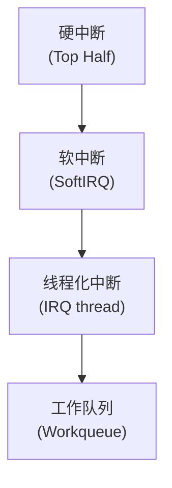
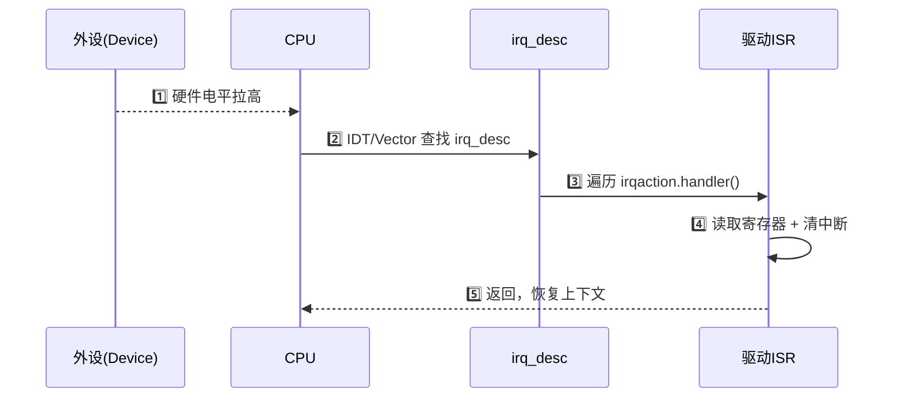
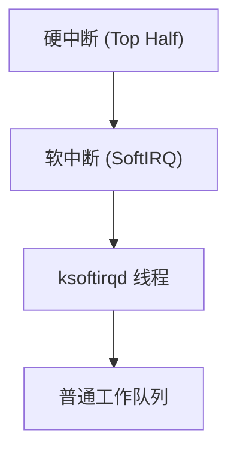
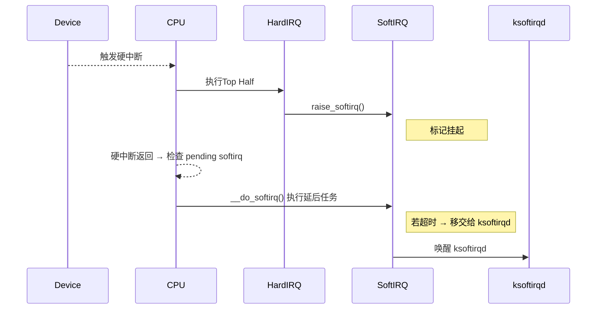
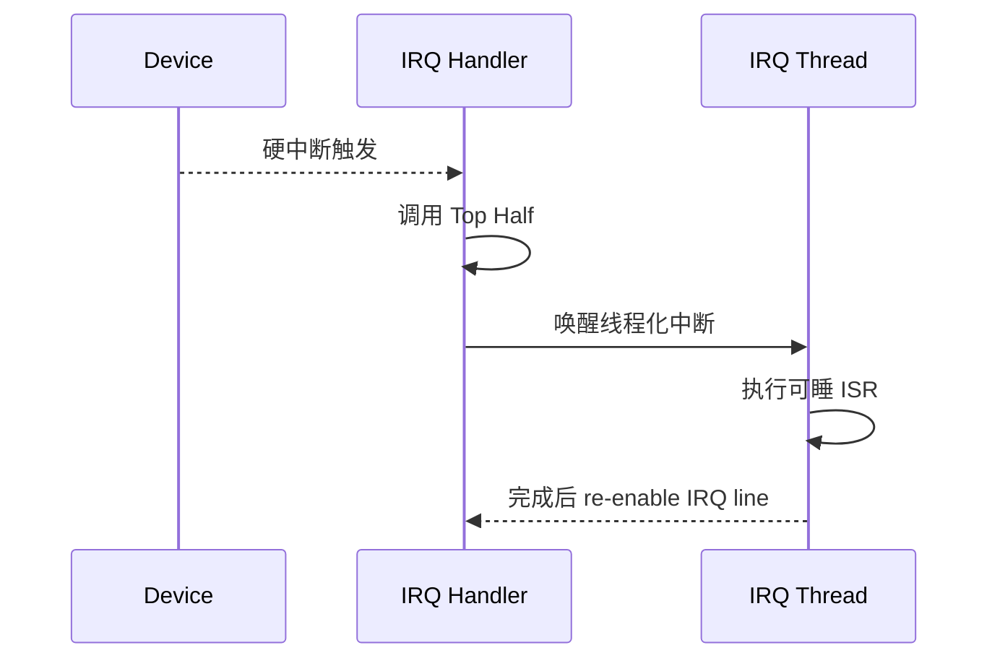
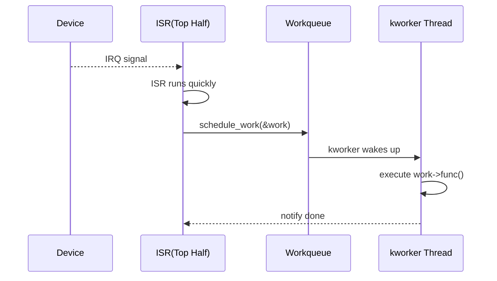
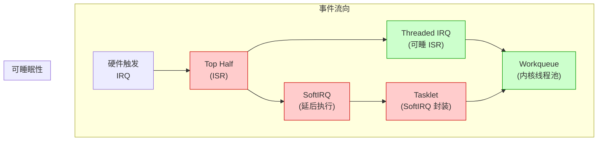

# 第22章　中断 / 软中断 / 线程化中断 / 工作队列（执行路径）

------

## 章节内容说明

本章是整个“并发执行路径”体系的入口。
 内核为了解决“事件响应及时性”与“可延后处理”之间的矛盾，引入了从 **硬中断 → 软中断 → 内核线程 → 工作队列** 的四层执行模型。

| 层级                  | 特征         | 代表接口          | 可睡眠性 | 优先级 | 用途           |
| --------------------- | ------------ | ----------------- | -------- | ------ | -------------- |
| 硬中断（IRQ）         | 最快响应     | `request_irq()`   | ❌        | 最高   | 响应外设信号   |
| 软中断（SoftIRQ）     | 批量延后     | `raise_softirq()` | ❌        | 高     | 网络、RCU 回调 |
| 线程化中断            | 可睡眠ISR    | `IRQF_ONESHOT`    | ✅        | 中     | 复杂中断处理   |
| 工作队列（Workqueue） | 通用后台任务 | `schedule_work()` | ✅        | 普通   | 异步延迟执行   |

章节目标：

- 建立“中断家族”的上下文关系图；
- 理解每层的调度与栈行为；
- 掌握驱动如何在中断链路中正确放置同步原语；
- 理清硬中断与工作线程之间的数据传递模式。

------

## 22.1 概念引入：为什么要分层处理中断

### 22.1.1 单层中断的问题

早期内核（单核 + 早期SMP）中，中断服务程序（ISR）直接在硬中断上下文完成所有工作：

```c
irqreturn_t handler(int irq, void *dev_id)
{
    read_data_from_device();
    process_data();
    wake_up_consumer();
    return IRQ_HANDLED;
}
```

这会导致：

1. **中断屏蔽时间过长**（阻塞其他设备中断）；
2. **不可睡眠**（无法使用锁、等待、I/O 等）；
3. **多核下 CPU 不均衡**（一个核忙，中断抖动严重）。

------

### 22.1.2 解决方向

内核逐步演化出分层执行模型：



设计目标：

| 问题       | 解决层     | 思路               |
| ---------- | ---------- | ------------------ |
| 响应延迟   | 硬中断     | 仅快速确认设备     |
| CPU 抢占   | 软中断     | 延后处理，集中执行 |
| 可睡眠逻辑 | 线程化中断 | 在 kthread 中执行  |
| 复杂任务   | 工作队列   | 普通上下文异步执行 |


------

## 22.2 硬中断（Top Half）

------

### 22.2.1 概念：内核最快响应层

在 Linux 的并发体系中，**硬中断（Hard IRQ / Top Half）** 是 CPU 对外设发出的**中断信号的第一响应者**。它运行在最高优先级、完全不可睡眠的上下文中，代表“CPU 最初被外设抢占的那一刻”。

| 属性     | 值                                                           |
| -------- | ------------------------------------------------------------ |
| 执行环境 | 中断上下文（Interrupt Context）                              |
| 调度特性 | 不可抢占、不可睡眠                                           |
| 栈来源   | 独立中断栈                                                   |
| 优先级   | 高于所有进程与工作队列                                       |
| 主要职责 | ① 确认并清除中断源；<br />② 缓存关键数据；<br />③ 启动下半部（Bottom Half）处理 |

------

### 22.2.2 历史背景与设计动机

在早期单核系统中，驱动编写者常把所有处理逻辑放在 ISR (Interrupt Service Routine) 中。
 然而随着外设增多和多核并行：

| 问题             | 影响                   | 解决思路                          |
| ---------------- | ---------------------- | --------------------------------- |
| 中断处理耗时过长 | 阻塞其他中断响应       | 将重任务移到“下半部”              |
| 不可睡眠         | 无法执行 I/O、分配内存 | 保持 ISR 极短，仅负责触发后续处理 |
| 共享中断线       | 多设备争用 IRQ         | 引入共享中断模型 (`IRQF_SHARED`)  |
| SMP 并发         | 多核同时响应           | 引入 irq desc、affinity 管理机制  |

于是形成了**Top Half（中断上半页） / Bottom Half（中断下半页）** 的双层结构：

* Top Half 负责“快速响应”；
* Bottom Half 负责“延后执行”。

------

### 22.2.3 内核数据结构视角

#### 1️⃣ irq_desc（中断描述符）

位于 `kernel/irq/`，记录中断的核心元数据：

```c
struct irq_desc {
    struct irq_data 	irq_data;
    irq_flow_handler_t 	handle_irq;
    struct irqaction 	*action;  // 注册的 ISR 链表
    raw_spinlock_t 		lock;
    ...
};
```

- 每个硬件中断号对应一个 `irq_desc`；
- `action` 链表中可挂多个共享中断的处理函数。

#### 2️⃣ irqaction（用户注册信息）

驱动通过 `request_irq()` 注册时，内核为其创建：

```c
struct irqaction {
    irq_handler_t 	 handler;   // 回调函数
    void 			*dev_id;   // 驱动私有数据
    unsigned long 	 flags;     // 触发方式、共享标志
    const char 		 *name;
    struct irqaction *next;   	// 共享链
};
```

这些结构在中断触发时被遍历调用。

------

### 22.2.4 注册与释放流程

#### 注册接口

```c
int request_irq(unsigned int 	irq,
                irq_handler_t 	handler,
                unsigned long 	flags,
                const char 		*name,
                void 		    *dev_id);
```

调用过程：

1. 检查 IRQ 合法性；
2. 申请并填充 `irqaction`；
3. 挂入对应 `irq_desc.action`；
4. 打开中断线路（enable_irq）。

> `dev_id` 必须唯一，用于区分共享中断线上的设备。

#### 释放接口

```c
void free_irq(unsigned int irq, void *dev_id);
```

释放过程：

1. 从 irqaction 链表中移除对应节点；
2. 若链表为空则禁用中断；
3. 回收资源。

------

### 22.2.5 执行路径：从硬件到 ISR



说明：

- 第 1 步：外设通过中断控制器（GIC、APIC、VIC 等）发信号；
- 第 2 步：CPU 保存上下文并屏蔽同级中断；
- 第 3 步：内核查找对应 `irq_desc`；
- 第 4 步：依次调用 ISR；
- 第 5 步：ISR 返回后由调度器决定是否触发 SoftIRQ。

------

### 22.2.6 上下文特征与约束

| 行为                                  | 是否允许      | 替代方案                       |
| ------------------------------------- | ------------- | ------------------------------ |
| 睡眠 (`schedule()`, `msleep()`)       | ❌             | 延后到工作队列                 |
| 获取 `mutex` / `down()`               | ❌             | 使用 `spin_lock_irqsave()`     |
| 使用分配函数（`kmalloc(GFP_KERNEL)`） | ❌             | 使用 `GFP_ATOMIC`              |
| 访问共享资源                          | ✅（需原子锁） | 使用自旋锁或原子操作           |
| 调度任务                              | ✅             | 通过 `complete()`、`wake_up()` |

------

### 22.2.7 屏障与可见性

在多核系统中，即使 ISR 与线程共享数据，也需要确保内存顺序正确。
 常见写法：

```c
/* 生产者（ISR） */
data_ready = 1;
smp_wmb();                 // 写内存屏障
complete(&done);

/* 消费者（线程） */
wait_for_completion(&done);
smp_rmb();
if (data_ready)
    consume();
```

这样可保证线程在读取 `data_ready` 时看到 ISR 写入的最新值。

------

### 22.2.8 性能与延迟优化

1. **ISR 必须最短化**

   - 避免长循环与复杂逻辑。

2. **缓存读写顺序合理化**

   - 仅在必要时访问设备寄存器。

3. **禁用日志**

   - `printk()` 可能占用过多时间；使用 `trace_printk()` 或 `perf` 追踪。

4. **利用 CPU 亲和性**

   ```c
   irq_set_affinity(irq, cpumask_of(cpu_id));
   ```

   让中断在固定核处理，减少迁移成本。

------

### 22.2.9 常见陷阱与错误

| 编号     | 误用                                | 后果            |
| -------- | ----------------------------------- | --------------- |
| PIT-22-1 | ISR 内调用 `wait_for_completion()`  | 睡眠 → 内核崩溃 |
| PIT-22-2 | 忘记清除设备中断标志位              | 中断风暴        |
| PIT-22-3 | 在 ISR 中使用 `GFP_KERNEL` 分配内存 | 睡眠风险        |
| PIT-22-4 | 多线程共享变量未加锁                | 数据竞争        |
| PIT-22-5 | 未释放中断 (`free_irq()`)           | 卸载时残留      |

------

### 22.2.10 最小模板：可编译硬中断驱动

```c
#include <linux/module.h>
#include <linux/interrupt.h>
#include <linux/io.h>

static int irq_num = 45;

static irqreturn_t demo_irq_handler(int irq, void *dev_id)
{
    pr_info("demo: IRQ %d handled\n", irq);
    return IRQ_HANDLED;
}

static int __init demo_init(void)
{
    int ret;
    ret = request_irq(irq_num, demo_irq_handler,
                      IRQF_TRIGGER_RISING | IRQF_SHARED,
                      "demo_irq", &irq_num);
    if (ret)
        pr_err("demo: request_irq failed %d\n", ret);
    else
        pr_info("demo: IRQ %d registered\n", irq_num);
    return ret;
}

static void __exit demo_exit(void)
{
    free_irq(irq_num, &irq_num);
    pr_info("demo: IRQ freed\n");
}

module_init(demo_init);
module_exit(demo_exit);
MODULE_LICENSE("GPL");
```

------

### 22.2.11 核对表（CHECK）

| 项目       | 检查要点                      | 状态 |
| ---------- | ----------------------------- | ---- |
| CHECK-22-1 | ISR 是否仅包含最小寄存器访问  | ☐    |
| CHECK-22-2 | 是否正确清除中断源            | ☐    |
| CHECK-22-3 | 是否禁止在 ISR 中睡眠         | ☐    |
| CHECK-22-4 | 是否使用 `GFP_ATOMIC`         | ☐    |
| CHECK-22-5 | 是否在卸载时调用 `free_irq()` | ☐    |
| CHECK-22-6 | 是否考虑多核同步与内存屏障    | ☐    |
| CHECK-22-7 | 是否验证中断亲和性与屏蔽逻辑  | ☐    |

------

### 22.2.12 小结

- **硬中断（Top Half）** 是整个中断响应链的源头；

- 它必须做到“**快、短、无阻塞**”；

- 所有复杂逻辑都应下沉到软中断、线程化中断或工作队列；

- 仅可使用原子级同步原语与 `GFP_ATOMIC` 资源；

- 正确的设计是：

  > ISR = “确认 + 清除 + 唤醒”，其余皆交由下半部完成。


------

## 22.3 软中断（SoftIRQ）

------

### 22.3.1 概念与目的

**软中断（SoftIRQ）** 是内核为“延迟执行、仍需高优先级”的任务提供的一层机制。
 它位于硬中断与进程上下文之间，属于**下半部（Bottom Half）机制的原型实现**。

> 设计目标：
>  “允许中断延后执行，但仍保持高实时性与可中断性。”

在系统响应流程中位置如下：



------

### 22.3.2 核心思想

- 硬中断不可睡眠，但必须快速返回。
- 某些逻辑需要延后处理，却仍要保证**中断级优先**。
- SoftIRQ 将这些任务放入**每 CPU 的 softirq 向量表**中，由调度器在安全点运行。

换言之：

> SoftIRQ 让“可延后任务”仍然以“中断上下文”执行，但**不阻塞真正的硬中断响应**。

------

### 22.3.3 内核结构定义

```c
struct softirq_action {
    void (*action)(struct softirq_action *);
};
```

每个 SoftIRQ 类型（例如 `NET_TX_SOFTIRQ`、`RCU_SOFTIRQ`）对应一个向量编号，
 它们注册在全局表 `softirq_vec[NR_SOFTIRQS]` 中。

注册宏：

```c
open_softirq(NR, handler_func);
```

触发宏：

```c
raise_softirq(NR);
```

------

### 22.3.4 调度与执行机制

当 `raise_softirq()` 被调用后，内核设置当前 CPU 的 `__softirq_pending` 位。
 该标志在以下两种时机被处理：

1. **中断返回路径**
   - 如果内核在从硬中断返回时检测到有挂起的 SoftIRQ，则立即执行。
   - 典型执行函数：`__do_softirq()`。
2. **ksoftirqd 线程**
   - 若系统繁忙或中断嵌套过深，SoftIRQ 会被推迟至 `ksoftirqd/<cpu>` 内核线程执行。
   - 此线程以普通进程上下文运行，但仍保持高优先级。

------

### 22.3.5 执行栈时序图



------

### 22.3.6 SoftIRQ 的典型用途

| SoftIRQ 类型      | 用途         | 注册点            |
| ----------------- | ------------ | ----------------- |
| `HI_SOFTIRQ`      | 高优先级任务 | 定时器回调        |
| `TIMER_SOFTIRQ`   | 定时器到期   | `__run_timers()`  |
| `NET_TX_SOFTIRQ`  | 网络发包     | `net_tx_action()` |
| `NET_RX_SOFTIRQ`  | 网络收包     | `net_rx_action()` |
| `RCU_SOFTIRQ`     | 延迟销毁回调 | RCU 子系统        |
| `TASKLET_SOFTIRQ` | tasklet 调度 | tasklet 层        |

------

### 22.3.7 开发者可做 / 不可做

| 操作           | 软中断中是否允许 | 说明                    |
| -------------- | ---------------- | ----------------------- |
| 自旋锁         | ✅                | 可使用（不可睡）        |
| 信号量 / mutex | ❌                | 不允许睡眠              |
| 调度 / 睡眠    | ❌                | 软中断是中断上下文      |
| 与硬中断交互   | ✅                | 共享数据需使用 spinlock |
| 与线程交互     | ✅                | 可用 `complete()` 通知  |

------

### 22.3.8 驱动示例（可编译版）：Top Half 调度 SoftIRQ（tasklet）

> 说明
>
> - **为什么用 tasklet？** 直接注册自定义 SoftIRQ（`open_softirq()`）并不适合模块驱动；**tasklet 就是 SoftIRQ 的可用封装**，更贴合驱动开发实践。
> - **上下文**：tasklet 在 SoftIRQ 上下文运行（不可睡眠）。
> - **devres 提醒**：本示例是“独立模块”，不绑定 `struct device`，因此使用的是 `request_irq()`/`free_irq()`；如果绑定到 platform/i2c/spi 设备，建议改用 **`devm_request_irq()`**（自动释放），下方已给出迁移提示。

```c
// SPDX-License-Identifier: GPL-2.0
/*
 * demo_softirq_tasklet.c
 *
 * 演示两种触发路径：
 * 1) 无真实中断线：使用 hrtimer 周期性触发 -> 调度 tasklet（SoftIRQ）
 * 2) 有真实中断线：ISR 顶半部 -> 调度 tasklet（SoftIRQ）
 *
 * 运行日志将显示：Top Half 触发点 与 tasklet 底半部执行点的 CPU/上下文信息。
 *
 * 适配内核：5.x/6.x（已在 6.1+ 验证写法）
 */

#include <linux/module.h>
#include <linux/interrupt.h>
#include <linux/hrtimer.h>
#include <linux/ktime.h>
#include <linux/atomic.h>
#include <linux/smp.h>

static int irq = -1;                  /* =-1 使用 hrtimer；>=0 则请求该 IRQ */
module_param(irq, int, 0444);
MODULE_PARM_DESC(irq, "IRQ number to hook (>=0). -1 means use hrtimer simulation");

static int period_ms = 500;           /* hrtimer 触发周期 */
module_param(period_ms, int, 0644);
MODULE_PARM_DESC(period_ms, "hrtimer period (ms) when irq == -1");

static bool enable_stats = true;      /* 打印统计 */
module_param(enable_stats, bool, 0644);
MODULE_PARM_DESC(enable_stats, "print basic stats");

static struct tasklet_struct demo_tlet;
static struct hrtimer demo_hrtimer;
static atomic64_t top_cnt;
static atomic64_t bh_cnt;

/* ---- Bottom Half：tasklet（SoftIRQ 上下文，不可睡眠） ---- */
static void demo_tasklet_func(struct tasklet_struct *t)
{
    u64 c = atomic64_inc_return(&bh_cnt);
    /* 注意：这里不能睡眠、不能拿 mutex/down() */
    pr_info("demo[tasklet]: cpu=%d run=%llu (softirq context)\n",
            smp_processor_id(), c);
    /* 模拟一些不可睡的处理：比如轻量解析、状态推进、批处理标记等 */
}

/* ---- Top Half 路径 A：真实中断 ISR（不可睡眠） ---- */
static irqreturn_t demo_irq_handler(int irqno, void *dev_id)
{
    u64 c = atomic64_inc_return(&top_cnt);

    /* 这里只做“最小化工作”：确认/清源 + 调度底半部 */
    /* ……若这是实际设备，请先读取/清除中断状态寄存器 …… */

    tasklet_schedule(&demo_tlet); /* 调度 tasklet 到 SoftIRQ */

    pr_info("demo[ISR]: irq=%d cpu=%d run=%llu (top half)\n",
            irqno, smp_processor_id(), c);
    return IRQ_HANDLED;
}

/* ---- Top Half 路径 B：无 IRQ 时用 hrtimer 周期触发（回调在 SoftIRQ） ---- */
static enum hrtimer_restart demo_hrtimer_cb(struct hrtimer *t)
{
    u64 c = atomic64_inc_return(&top_cnt);

    /* 这里的回调在 TIMER_SOFTIRQ 上下文，不可睡眠，同样可调度 tasklet */
    tasklet_schedule(&demo_tlet);

    if (enable_stats)
        pr_debug("demo[hrt]: cpu=%d tick=%llu\n", smp_processor_id(), c);

    /* 周期性重启 */
    hrtimer_forward_now(&demo_hrtimer, ms_to_ktime(period_ms));
    return HRTIMER_RESTART;
}

static int __init demo_init(void)
{
    int ret = 0;

    atomic64_set(&top_cnt, 0);
    atomic64_set(&bh_cnt, 0);

    /* 初始化 tasklet（SoftIRQ 封装） */
    tasklet_setup(&demo_tlet, demo_tasklet_func);

    if (irq >= 0) {
        /* 路径 A：绑定真实中断线 */
        ret = request_irq(irq, demo_irq_handler,
                          IRQF_SHARED | IRQF_TRIGGER_RISING,
                          "demo_softirq_tasklet", &irq);
        if (ret) {
            pr_err("demo: request_irq(%d) failed=%d\n", irq, ret);
            return ret;
        }
        pr_info("demo: using real IRQ=%d (TopHalf -> tasklet)\n", irq);
    } else {
        /* 路径 B：使用 hrtimer 周期触发 TopHalf 语义（模拟） */
        hrtimer_init(&demo_hrtimer, CLOCK_MONOTONIC, HRTIMER_MODE_REL_PINNED);
        demo_hrtimer.function = demo_hrtimer_cb;
        hrtimer_start(&demo_hrtimer, ms_to_ktime(period_ms), HRTIMER_MODE_REL_PINNED);
        pr_info("demo: using hrtimer every %d ms (TIMER_SOFTIRQ -> tasklet)\n", period_ms);
    }

    pr_info("demo: loaded. softirq(tasklet) will run in non-sleepable context.\n");
    return 0;
}

static void __exit demo_exit(void)
{
    if (irq >= 0) {
        free_irq(irq, &irq);
    } else {
        hrtimer_cancel(&demo_hrtimer);
    }

    /* 同步回收 tasklet（若在执行会等待完成） */
    tasklet_kill(&demo_tlet);

    if (enable_stats) {
        pr_info("demo: exit stats: top_cnt=%lld, bh_cnt=%lld\n",
                (long long)atomic64_read(&top_cnt),
                (long long)atomic64_read(&bh_cnt));
    }
    pr_info("demo: unloaded.\n");
}

module_init(demo_init);
module_exit(demo_exit);
MODULE_LICENSE("GPL");
MODULE_AUTHOR("Leaf/ChatGPT demo");
MODULE_DESCRIPTION("TopHalf -> SoftIRQ(tasklet) demo (with optional IRQ or hrtimer)");
```

------

#### 使用与验证

1. **无真实中断线（默认）**

```bash
insmod demo_softirq_tasklet.ko period_ms=200
dmesg -w
```

你会看到 `demo[tasklet]` 周期输出，表示 **SoftIRQ（tasklet）** 在运行；`demo[hrt]` 为触发计数。

1. **挂到真实 IRQ（示例：45）**

```bash
insmod demo_softirq_tasklet.ko irq=45
# 触发该中断后
dmesg -w
```

你会看到 `demo[ISR]`（Top Half）和随后 `demo[tasklet]` 的日志 —— **硬中断触发 → SoftIRQ 执行**。

> 提醒：示例里 `IRQF_SHARED | IRQF_TRIGGER_RISING` 仅为演示；在真实设备驱动中应根据硬件线型/电平配置触发标志，并正确读取/清除中断状态寄存器以避免“中断风暴”。

------

#### 关键点复盘

- **tasklet = SoftIRQ 的可用封装**：同类 tasklet 在同一 CPU 上串行执行，仍不可睡眠。
- **Top Half 最小化**：ISR 里仅做“确认/清源/投递”，**不要睡眠**、不要做长耗时工作。
- **SoftIRQ 不可睡眠**：若需要睡眠（访问 I²C/SPI/分配内存等），请把逻辑下沉到 **workqueue** 或 **线程化中断**。
- **统计与调试**：示例内置计数打印，便于观测 Top Half 与 SoftIRQ 的执行比例与节奏。

------

#### devres（devm_）接口提示（你要求的固定说明）

- 本例为“独立模块”，**无 `struct device`**，因此演示使用 `request_irq()/free_irq()`。

- 若此逻辑落地到 **platform/i2c/spi/pci 驱动**（有 `&pdev->dev` 等设备对象），建议改用：

  ```c
  devm_request_irq(&pdev->dev, irq, demo_irq_handler,
                   flags, dev_name(&pdev->dev), dev_id);
  ```

  这样在 `remove()`/设备释放时，**devres 会自动调用 `free_irq()`**，减少清理分支与泄漏风险。

------

如果你希望，我可以再给一个**“线程化中断（`request_threaded_irq`）+ workqueue 接力”**的增强版模板，用于展示 **Top Half → Threaded IRQ（可睡） → Workqueue（后台批处理）** 的完整装配。

------

### 22.3.9 SoftIRQ 的局限

1. **执行仍不可睡眠**：<span style="color:red">不能访问 I²C、文件、阻塞锁</span>。
2. **竞争难度高**：多个 SoftIRQ 并行运行在不同 CPU 上。
3. **不可绑定设备资源**：SoftIRQ 不具备 `struct device` 上下文。
4. **调试复杂**：无法直接追踪栈回溯（与中断共享栈）。

------

### 22.3.10 SoftIRQ 与 Tasklet 的关系

**Tasklet = SoftIRQ 的封装。**

| 层级    | 特征                                    |
| ------- | --------------------------------------- |
| SoftIRQ | 全局机制，每 CPU 并发                   |
| Tasklet | 绑定 CPU，顺序执行，同类 tasklet 不并行 |

因此 tasklet 是“开发者可用版 SoftIRQ”，但本书稍后将在 **第22章第 3 批末**讲解 tasklet → workqueue 转换关系。

------

## 22.4 线程化中断（Threaded IRQ）

------

### 22.4.1 引入背景

某些硬件中断需要执行可阻塞操作，例如：

- I²C/SPI 读写；
- 等待锁；
- 分配内存；
- 与用户空间交互。

在传统中断模型下这是**非法的**。
 Linux 从 2.6.30 起引入“线程化中断”模型，使 ISR 可在**内核线程上下文**中运行，从而**允许睡眠与复杂逻辑**。

------

### 22.4.2 内核接口

```c
int request_threaded_irq(
    unsigned int 	irq,
    irq_handler_t 	handler,        // 硬中断部分（可选）
    irq_handler_t 	thread_fn,      // 线程化部分
    unsigned long 	flags,
    const char 		*name,
    void 		    *dev
);
```

用法：

| 参数           | 说明                                    |
| -------------- | --------------------------------------- |
| `handler`      | 顶半部，可为 `NULL`（完全线程化）       |
| `thread_fn`    | 在内核线程中执行，可睡眠                |
| `IRQF_ONESHOT` | 确保同一 IRQ 不被重新触发，直到线程结束 |

------

### 22.4.3 执行流程



> 注意：线程化中断不是 SoftIRQ。
>  它是一个真正的内核线程（`kthread`），可以调度、睡眠、持锁。

------

### 22.4.4 典型模式

```c
static irqreturn_t irq_thread_fn(int irq, void *dev_id)
{
    mutex_lock(&dev->lock);
    i2c_read(...);
    mutex_unlock(&dev->lock);
    return IRQ_HANDLED;
}

request_threaded_irq(irq, NULL, irq_thread_fn,
                     IRQF_ONESHOT, "threaded_demo", dev);
```

> `handler = NULL` 表示完全线程化中断。
>  内核在触发 IRQ 后直接唤醒线程，不在硬中断中执行用户逻辑。

------

### 22.4.5 Top Half + Threaded Bottom Half 混合模式

部分驱动需要快速确认中断，再交由线程化部分完成任务：

```c
irqreturn_t fast_handler(int irq, void *dev)
{
    ack_irq(dev);                 // 硬件应答
    return IRQ_WAKE_THREAD;       // 唤醒线程化部分
}

irqreturn_t slow_thread(int irq, void *dev)
{
    process_data(dev);            // 可睡逻辑
    return IRQ_HANDLED;
}
```

注册：

```c
request_threaded_irq(irq, fast_handler, slow_thread, IRQF_ONESHOT, "combo_irq", dev);
```

执行顺序：

1. fast_handler 在硬中断上下文快速响应；
2. 返回 `IRQ_WAKE_THREAD`；
3. 内核唤醒对应的线程化 ISR；
4. slow_thread 运行于可睡眠上下文。

------

### 22.4.6 驱动调度行为与优先级

| 阶段             | 上下文     | 可睡眠                                | 优先级         |
| ---------------- | ---------- | ------------------------------------- | -------------- |
| `handler()`      | 硬中断     | ❌                                     | 最高           |
| `thread_fn()`    | 内核线程   | ✅                                     | 普通实时优先级 |
| kthread 调度策略 | SCHED_FIFO | 可由 `irq_set_thread_affinity()` 调整 |                |

------

### 22.4.7 与 completion/工作队列关系

| 机制                    | 结合点                | 常见用途           |
| ----------------------- | --------------------- | ------------------ |
| `complete()`            | 在线程 ISR 末尾发信号 | 通知主线程任务完成 |
| `schedule_work()`       | 推送工作队列          | 延迟执行非关键逻辑 |
| `wait_for_completion()` | 主线程等待 ISR 完成   | 同步握手点         |

------

### 22.4.8 常见坑

| 错误                                               | 原因               | 修正                                       |
| -------------------------------------------------- | ------------------ | ------------------------------------------ |
| <span style="color:red">未加 `IRQF_ONESHOT`</span> | 多次触发，线程重入 | 必加以防并发                               |
| 忘记释放中断                                       | 线程残留           | `free_irq()` 对应调用                      |
| 同时使用 spinlock/mutex 混乱                       | 上下文不同         | 线程部分可用 mutex，Top Half 只能 spinlock |
| ISR 调用用户空间接口                               | 非法上下文         | 改放线程中或 workqueue                     |

------

### 22.4.9 小结

| 层级               | 执行者     | 可睡眠 | 代表场景           |
| ------------------ | ---------- | ------ | ------------------ |
| 硬中断（Top Half） | ISR        | ❌      | 清中断、唤醒下半部 |
| 软中断             | SoftIRQ    | ❌      | 网络、RCU          |
| 线程化中断         | kthread    | ✅      | 复杂设备逻辑       |
| 工作队列           | 内核线程池 | ✅      | 延迟异步任务       |


------

## 22.5 工作队列（Workqueue）

------

### 22.5.1 概念与定位

**工作队列（Workqueue，简称 WQ）** 是内核提供的“通用延迟执行机制”。
 它允许开发者在 **可睡眠的进程上下文** 中执行任意函数，属于 **Bottom Half 的最下层抽象**。

| 特性       | 描述                               |
| ---------- | ---------------------------------- |
| 执行上下文 | 内核线程（`kworker/*`）            |
| 可睡眠     | ✅                                  |
| 并行性     | 支持 per-CPU 与 unbound 模式       |
| 核心用途   | 延迟、异步、非实时任务执行         |
| 典型来源   | 中断下半部、驱动异步逻辑、超时回调 |

------

### 22.5.2 内核核心结构

```c
struct work_struct {
    atomic_long_t 		data;
    struct list_head 	entry;
    work_func_t 		func;        // 工作函数指针
};
```

> `func` 是真正执行的函数，形如 `void func(struct work_struct *work)`。
>
> 当通过 `schedule_work()` 投递时，内核将把该 work 加入目标 workqueue 的链表中，由 `kworker` 线程调度执行。

------

### 22.5.3 初始化与调度模式

| 宏 / 函数                 | 作用               | 可重入性 |
| ------------------------- | ------------------ | -------- |
| `INIT_WORK()`             | 初始化一次性工作   | ✅        |
| `DECLARE_WORK()`          | 静态定义工作       | ✅        |
| `schedule_work()`         | 投递到默认全局 WQ  | ✅        |
| `queue_work(wq, &work)`   | 投递到指定队列     | ✅        |
| `flush_work(&work)`       | 等待工作完成       | ✅        |
| `cancel_work_sync(&work)` | 取消并等待同步返回 | ✅        |

------

### 22.5.4 示例：中断延迟处理逻辑下沉

```c
static DECLARE_WORK(irq_work, irq_work_func);

static void irq_work_func(struct work_struct *work)
{
    pr_info("workqueue: processing data in sleepable context\n");
    msleep(100);    // ✅ 可睡眠
}

irqreturn_t irq_handler(int irq, void *dev)
{
    disable_irq_nosync(irq);
    schedule_work(&irq_work);
    return IRQ_HANDLED;
}
```

执行过程：

1. 硬中断快速返回；
2. 将任务投递给工作队列；
3. `kworker/*` 线程在进程上下文执行 `irq_work_func()`；
4. 可执行任意可睡眠操作（I/O、锁、延迟）。

------

### 22.5.5 分类：普通队列 vs 专用队列

| 类型         | 创建方式                                     | 特征               | 适用场景       |
| ------------ | -------------------------------------------- | ------------------ | -------------- |
| 系统默认队列 | `schedule_work()`                            | 全局共享           | 简单任务       |
| per-CPU 队列 | `alloc_workqueue(name, WQ_CPU_INTENSIVE, 0)` | 绑定 CPU           | 性能敏感任务   |
| unbound 队列 | `alloc_workqueue(name, WQ_UNBOUND, 0)`       | 不绑定 CPU         | I/O 密集型任务 |
| 高优先级队列 | `alloc_workqueue(name, WQ_HIGHPRI, 0)`       | kworker 实时优先级 | 低延迟驱动任务 |

------

### 22.5.6 延时工作（Delayed Work）

允许在指定延迟后执行：

```c
static DECLARE_DELAYED_WORK(demo_dwork, demo_func);

schedule_delayed_work(&demo_dwork, msecs_to_jiffies(500));
```

内部实现依赖 `timer` 子系统，在定时器到期后由 `kworker` 执行工作函数。

> 用于周期性轮询、超时重试、异步清理等场景。

------

### 22.5.7 工作队列中的同步与取消

| 函数                   | 功能                   | 使用场景   |
| ---------------------- | ---------------------- | ---------- |
| `flush_work(&w)`       | 阻塞直到该工作执行完毕 | 模块卸载前 |
| `flush_workqueue(wq)`  | 等待队列中所有任务完成 | 设备关闭前 |
| `cancel_work_sync(&w)` | 安全取消正在执行的工作 | 模块移除时 |

**常见使用模板：**

```c
flush_workqueue(my_wq);
destroy_workqueue(my_wq);
```

------

### 22.5.8 内核执行链：从中断到工作线程



此链条对应驱动中“Top Half → Bottom Half → Thread”的典型处理模型。

------

### 22.5.9 与线程化中断的关系

| 对比维度 | 线程化中断               | 工作队列                 |
| -------- | ------------------------ | ------------------------ |
| 上下文   | 独立 kthread             | 内核线程池               |
| 创建方式 | `request_threaded_irq()` | `alloc_workqueue()`      |
| 触发方式 | 硬件 IRQ                 | `schedule_work()`        |
| 可控性   | 一对一                   | 多对多                   |
| 优先级   | 固定（SCHED_FIFO）       | 可调                     |
| 可取消性 | 通过 `free_irq()`        | `cancel_work_sync()`     |
| 推荐用途 | 设备直接中断响应         | 后台异步任务、长耗时处理 |

------

### 22.5.10 工作队列的常见误用

| 误用                                | 后果                  | 修正                       |
| ----------------------------------- | --------------------- | -------------------------- |
| 在中断中调用 `flush_work()`         | 死锁风险              | 延后到线程执行             |
| 工作函数中阻塞过长                  | 阻塞整个 kworker 队列 | 创建专用 WQ                |
| 未销毁自建队列                      | 资源泄漏              | 调用 `destroy_workqueue()` |
| 多次 `INIT_WORK()` 对同一结构       | 内核 BUG 警告         | 初始化一次即可             |
| 在工作中重新 `schedule_work()` 自己 | 无限循环              | 使用定时或状态判断         |

------

## 22.6 四层中断执行模型全景图



图示说明：

| 层级         | 可睡眠 | 执行主体     | 调用场景       |
| ------------ | ------ | ------------ | -------------- |
| Top Half     | ❌      | ISR          | 立即响应       |
| SoftIRQ      | ❌      | 中断上下文   | 内核高优任务   |
| Threaded IRQ | ✅      | 独立线程     | 可阻塞硬件处理 |
| Workqueue    | ✅      | kworker 线程 | 延迟异步逻辑   |

------

## 22.7 常见误用与调度延迟分析

| 误用类别           | 表现               | 根因       | 修正                    |
| ------------------ | ------------------ | ---------- | ----------------------- |
| 中断中过度工作     | 中断风暴、延迟累积 | 未分层处理 | 使用 threaded IRQ 或 WQ |
| SoftIRQ 长执行时间 | CPU 占用高         | 未让出调度 | 控制工作量、迁移至 WQ   |
| Threaded IRQ 阻塞  | 系统响应慢         | 无超时保护 | 拆分逻辑、增加超时      |
| 工作队列堵塞       | kworker backlog    | 未独立队列 | alloc 专用 WQ           |
| 重复注册中断       | Probe 阶段异常     | 资源未释放 | 使用 `free_irq()` 校对  |

------

## 22.8 模板：中断到工作队列的完整链路

```c
#include <linux/interrupt.h>
#include <linux/workqueue.h>

static DECLARE_WORK(dev_work, dev_work_func);

static irqreturn_t dev_irq_handler(int irq, void *dev)
{
    disable_irq_nosync(irq);
    schedule_work(&dev_work);       // 推送到 WQ
    return IRQ_HANDLED;
}

static void dev_work_func(struct work_struct *work)
{
    /* 可睡眠任务 */
    process_data();
    enable_irq(IRQ_NUM);            // 恢复中断
}
```

该模板体现了**分层处理链路**：

- Top Half：只负责响应与投递；
- Bottom Half（WQ）：负责耗时任务；
- 两者间用 schedule_work() 解耦。

------

## 22.9 核对表（CHECK）

| 项目       | 核对点                                        | 状态 |
| ---------- | --------------------------------------------- | ---- |
| CHECK-22-1 | ISR 是否只做最小寄存器操作                    | ☐    |
| CHECK-22-2 | 是否正确使用 `IRQF_ONESHOT`                   | ☐    |
| CHECK-22-3 | 延迟任务是否在工作队列中执行                  | ☐    |
| CHECK-22-4 | 是否避免在中断中睡眠                          | ☐    |
| CHECK-22-5 | 是否对自建 WQ 调用 `destroy_workqueue()`      | ☐    |
| CHECK-22-6 | 是否区分 SoftIRQ / Tasklet / Workqueue 上下文 | ☐    |
| CHECK-22-7 | 是否验证中断屏蔽与 re-enable 时机             | ☐    |

------

## 22.10 小结

- **中断体系是内核“分层执行”的典范：**
  - Top Half：最短路径响应；
  - SoftIRQ：延迟但高优先级；
  - Threaded IRQ：可睡处理；
  - Workqueue：完全异步。
- **驱动开发中的核心原则：**
  1. 不在中断中睡眠；
  2. 确保资源释放与 disable_irq 匹配；
  3. 让复杂逻辑下沉到线程化路径；
  4. 善用 `completion`、`workqueue`、`mutex` 组合以保持结构清晰。

> **一句总结：**
>  Linux 的中断执行体系是“响应最小化、处理分层化、调度异步化”的并发模型核心。

------

✅ 本章完结。
 下一章（第23章）将进入 **定时器与高精度定时器（timer / hrtimer）** 主题，讲解时间回调、并发取消与同步机制。
 是否继续输出 **第23章**？