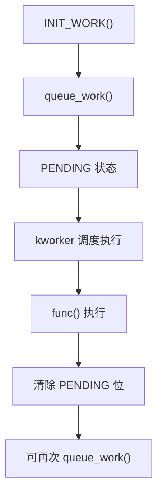
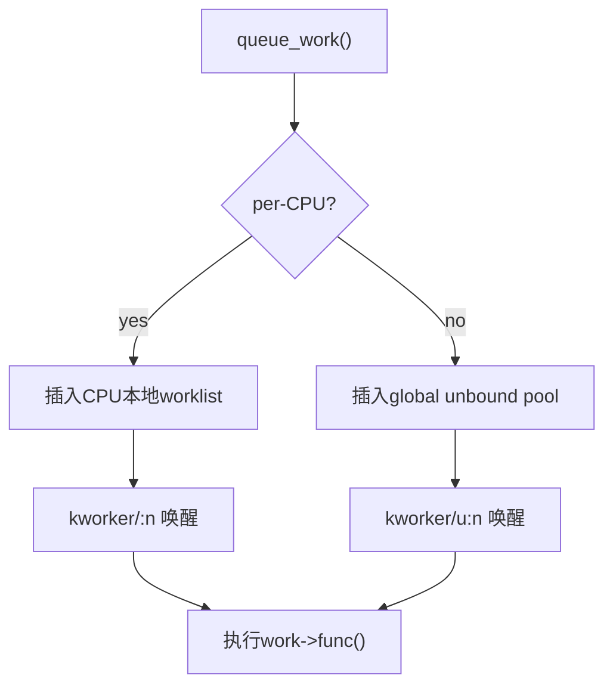
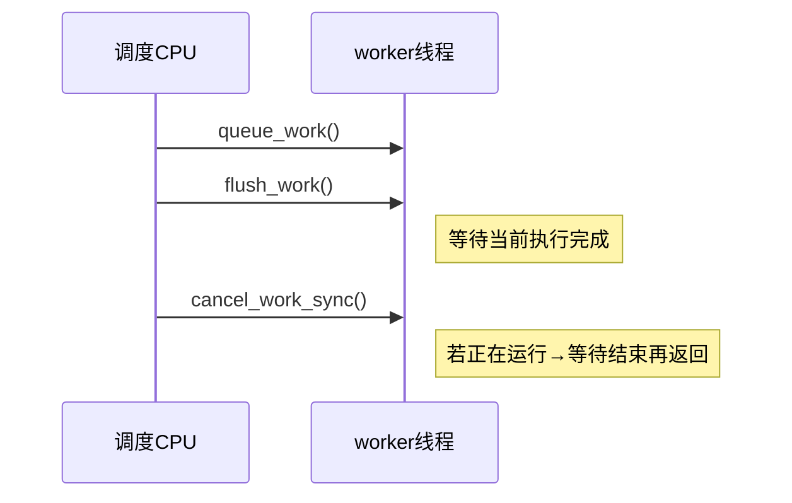
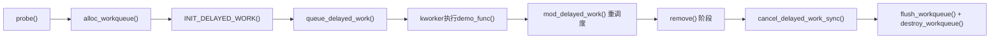
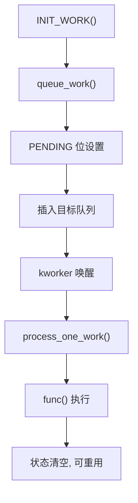

# 第23章　工作队列（Workqueue）

------

## 23.1　概念与设计动机

### 23.1.1　从“中断延后”到“进程上下文”

Linux 的并发体系自顶向下形成三层：

| 层级             | 执行上下文      | 可睡眠 | 典型代表              | 使用目标         |
| ---------------- | --------------- | ------ | --------------------- | ---------------- |
| 顶半部           | 硬中断          | ❌      | ISR (`request_irq()`) | 响应硬件事件     |
| 底半部（软中断） | SoftIRQ/Tasklet | ❌      | 网络包接收、RCU 回调  | 延后不可睡逻辑   |
| 工作队列         | kworker 线程    | ✅      | Workqueue             | 可睡、可阻塞逻辑 |

中断上下文无法睡眠，因此驱动中所有涉及：

- 内存分配（`kmalloc(GFP_KERNEL)`）
- I/O 操作（I²C / SPI / USB）
- 等待同步（`mutex_lock()` / `wait_event()`）

都**必须转移到进程上下文**执行。
 **工作队列就是这个桥梁**：

> 它把中断（或软中断）触发的事件，异步提交给一个可睡眠的内核线程去执行。

------

### 23.1.2　内核视角：kworker 与 work_struct

工作队列系统由两类核心对象组成：

| 对象                      | 作用                       |
| ------------------------- | -------------------------- |
| `struct work_struct`      | 表示一个待执行的“工作任务” |
| `struct workqueue_struct` | 表示一个线程池（队列）     |

系统启动时创建若干 **kworker 线程**：

```
kworker/0:0
kworker/1:1
kworker/u8:0-events
```

这些线程由内核调度管理，当我们调用 `queue_work()` 时，
 工作项会被加入到一个 per-CPU 或 unbound 队列中，
 然后由对应 CPU 的 kworker 拾取执行。

------

### 23.1.3　解决的问题与带来的新问题

| 阶段                 | 解决的问题             | 引入的新问题               |
| -------------------- | ---------------------- | -------------------------- |
| 从中断迁移到工作队列 | 允许睡眠、降低中断延迟 | 执行时机不可预测（异步）   |
| 引入 delayed_work    | 支持延迟和周期执行     | 取消与同步时需小心死锁     |
| 引入专用 workqueue   | 可控并行度、可调优先级 | 队列数增多、调度复杂度上升 |

------

## 23.2　数据结构与执行模型

### 23.2.1　核心结构：struct work_struct

```c
struct work_struct {
    atomic_long_t 		data;
    struct list_head 	entry;
    work_func_t 		func;
};
```

- **data**：状态标志与队列绑定信息（PENDING / RUNNING 等）。
- **entry**：挂入对应队列的链表节点。
- **func**：回调函数，执行真正的工作。

#### 状态流转



> 每个 `work_struct` 在被提交执行后，会被标记为 PENDING，
>  若未执行完再重复提交，会被拒绝（必须先清除状态）。

------

### 23.2.2　延迟工作：struct delayed_work

```c
struct delayed_work {
    struct work_struct 		work;
    struct timer_list 		timer;
    struct workqueue_struct *wq;
};
```

- 内部含有一个 `timer`，当定时到期后会触发 `queue_work()`。
- 支持 `mod_delayed_work()` 重触发。
- 适用于周期任务、退避重试、异步扫描。

------

### 23.2.3　队列结构：struct workqueue_struct

```c
struct workqueue_struct {
    struct list_head 	pwqs;
    struct list_head 	worklist;
    struct worker_pool 	*cpu_pools;
    unsigned int 		flags;
    ...
};
```

每个工作队列对应一个或多个 **worker_pool**，每个 pool 维护一组 `kworker` 线程。

#### Worker 线程工作循环（简化伪码）

```c
for (;;) {
    work = get_next_work(pool);
    if (!work)
        schedule();     // 等待新任务
    process_one_work(pool, work);   // 执行回调
}
```

工作函数运行在进程上下文中（`TASK_RUNNING`），可以睡眠。
 当工作完成后，状态清除，允许再次投递。

------

## 23.3　工作队列的使用方法

### 23.3.1　最小用法模板

#### (1) 静态定义

```c
static void demo_func(struct work_struct *work)
{
    pr_info("demo_func running in kworker context\n");
}

static DECLARE_WORK(demo_work, demo_func);

void demo_trigger(void)
{
    schedule_work(&demo_work);
}
```

- 使用系统默认队列 `system_wq`；
- 适合快速、轻量的异步处理；
- 可在中断上下文调用 `schedule_work()`。

------

#### (2) 动态定义

```c
struct work_struct demo_work;
INIT_WORK(&demo_work, demo_func);
queue_work(system_wq, &demo_work);
```

当需在 `probe()` 中动态初始化对象时应使用 `INIT_WORK()`，
 否则 `DECLARE_WORK()` 会导致重复定义或静态实例冲突。

------

### 23.3.2　创建专用队列

当任务量大、耗时长或需不同优先级时，应创建独立的队列。

```c
struct workqueue_struct *demo_wq;

demo_wq = alloc_workqueue("demo_wq",
                          WQ_UNBOUND | WQ_HIGHPRI,
                          1);
```

| 参数       | 含义                                   |
| ---------- | -------------------------------------- |
| name       | 队列名（会出现在 `kworker/*:demo_wq`） |
| flags      | 行为控制（见下）                       |
| max_active | 最大并发执行数                         |

常用 flags：

| Flag               | 含义                         |
| ------------------ | ---------------------------- |
| `WQ_UNBOUND`       | 不绑定 CPU，可跨核调度       |
| `WQ_HIGHPRI`       | 高优先级调度                 |
| `WQ_CPU_INTENSIVE` | 计算密集任务，不影响系统负载 |
| `WQ_FREEZABLE`     | 系统 suspend 时自动冻结      |
| `WQ_MEM_RECLAIM`   | 支持内存回收路径             |

------

### 23.3.3　延迟工作

延迟任务是由 `delayed_work` 结合 `timer` 实现的：

```c
static void demo_delayed_func(struct work_struct *work)
{
    pr_info("delayed task executed\n");
}

static DECLARE_DELAYED_WORK(demo_dwork, demo_delayed_func);

void start_task(void)
{
    schedule_delayed_work(&demo_dwork, msecs_to_jiffies(500));
}
```

延迟结束后，`timer` 回调将自动调用 `queue_work()` 将工作加入队列。

> **注意**：`schedule_delayed_work()` 默认使用 `system_wq`，
>  若使用专用队列，需 `queue_delayed_work(wq, &demo_dwork, delay)`。

------

### 23.3.4　同步与销毁

| API                   | 功能             | 上下文     | 是否可睡 | 注意               |
| --------------------- | ---------------- | ---------- | -------- | ------------------ |
| `flush_work()`        | 等待工作完成     | 线程上下文 | ✅        | 等待单一工作       |
| `flush_workqueue(wq)` | 等待整个队列完成 | 线程上下文 | ✅        | 常用于 remove 阶段 |
| `cancel_work_sync()`  | 取消并等待返回   | 线程上下文 | ✅        | 防止并发执行       |
| `destroy_workqueue()` | 销毁专用队列     | 线程上下文 | ✅        | 必须 flush 后调用  |

------

### 23.3.5　devres 托管接口（设备驱动推荐用法）

虽然内核未提供 `devm_alloc_workqueue()`，
 但可使用 `devm_add_action_or_reset()` 实现**自动销毁队列**：

```c
struct workqueue_struct *wq;
wq = alloc_workqueue("demo_wq", WQ_UNBOUND, 1);
devm_add_action_or_reset(&pdev->dev,
                         (void(*)(void *))destroy_workqueue,
                         wq);
```

对于工作项，若内核 ≥ 6.5，可用 `devm_work_autocancel()`：

```c
devm_work_autocancel(&pdev->dev, &demo_work);
```

> 这样在设备释放时会自动调用 `cancel_work_sync()`，
>  从而避免 remove 阶段遗漏同步清理。


------

## 23.4　复杂的工作环境：多队列、延迟与嵌套执行

------

### 23.4.1 per-CPU 与 unbound 的对比

#### 一、系统中的两种队列模型

| 模型             | 说明                                                 | 优点                     | 缺点             | 适用场景                     |
| ---------------- | ---------------------------------------------------- | ------------------------ | ---------------- | ---------------------------- |
| **per-CPU 队列** | 每 CPU 拥有独立 worker pool，任务固定在该 CPU 上执行 | 本地缓存一致性好，延迟低 | 无法自动负载均衡 | 高频短任务，如中断后置       |
| **unbound 队列** | 任务可迁移到任意 CPU 上执行                          | 负载均衡，适合阻塞任务   | 缓存命中率下降   | I/O 驱动、文件系统、延迟任务 |

> 内核默认创建的 `system_wq` 为 unbound 类型。
>  但部分专用队列（如 `system_highpri_wq`、`system_long_wq`）为不同优先级或绑定属性。

------

#### 二、调度路径可视化



------

### 23.4.2 延迟工作（delayed work）

#### 一、内部机制

延迟工作在结构上是：

```c
struct delayed_work {
    struct work_struct work;
    struct timer_list timer;
    struct workqueue_struct *wq;
};
```

流程：

1. 调用 `schedule_delayed_work()` 时启动 `timer`；
2. 到期后，`timer` 回调执行 `queue_work()`；
3. 任务进入目标 wq 并由 kworker 执行。

#### 二、使用示例

```c
static void demo_delayed_func(struct work_struct *work)
{
    pr_info("delayed work executed at %lu\n", jiffies);
}

static DECLARE_DELAYED_WORK(demo_dwork, demo_delayed_func);

static void start_delayed(void)
{
    schedule_delayed_work(&demo_dwork, msecs_to_jiffies(1000));
}
```

#### 三、周期性工作模式

```c
static void demo_periodic(struct work_struct *work)
{
    mod_delayed_work(system_wq, to_delayed_work(work),
                     msecs_to_jiffies(500));   // 重新调度
}
```

> ⚠️ 必须使用 `mod_delayed_work()` 而非重新 `schedule_delayed_work()`，
>  否则状态位未清除时会返回 false 导致丢调度。

------

### 23.4.3 优先级与 max_active 控制

创建专用队列时可控制并行度：

```c
wq = alloc_workqueue("demo_wq",
                     WQ_UNBOUND | WQ_HIGHPRI,
                     4);
```

- **WQ_HIGHPRI**：优先唤醒高优线程；
- **max_active**：控制同一 queue 中可并行执行的工作项数量；
- **背压机制**：若达到上限，新任务进入等待链表。

| 配置               | 效果                       | 场景               |
| ------------------ | -------------------------- | ------------------ |
| `max_active=1`     | 串行化执行                 | 状态机或单资源访问 |
| `max_active>1`     | 并行处理                   | 多缓冲区并发处理   |
| `WQ_CPU_INTENSIVE` | 不影响全局 worker 负载统计 | 编解码、压缩任务   |
| `WQ_MEM_RECLAIM`   | 保证内存回收路径可进       | shrinker/VM 操作   |

------

### 23.4.4 嵌套与层级调度

在工作函数中再次 queue 另一个 work 是允许的，但需注意：

1. 避免自引用（同一 work_struct 重复 queue）；
2. 避免循环等待（A flush B，B flush A）；
3. 若上层队列容量有限，应调大 max_active 或分级调度。

**推荐层级写法：**

```text
TopHalf → schedule_work()        (不可睡)
↓
workqueue (可睡逻辑)
↓
queue_delayed_work() / schedule_work() (子任务)
```

------

### 23.4.5 调度延迟与 NUMA 行为

在 unbound 队列中，任务可迁移至任意 CPU 执行。
 这在 NUMA 系统下可能引入额外内存访问延迟。

> 若任务依赖本地缓存数据，建议使用 per-CPU 队列；
>  若任务频繁睡眠等待 I/O，使用 unbound 队列更合适。

------

## 23.5　使用注意事项与典型陷阱

------

### 23.5.1 上下文约束与 API 合法性

| 操作                 | 允许上下文    | 是否可睡 | 原因               |
| -------------------- | ------------- | -------- | ------------------ |
| `schedule_work()`    | 硬中断/软中断 | ❌        | 非阻塞投递         |
| `queue_work()`       | 任意          | ❌        | 只入队             |
| `flush_work()`       | 仅进程上下文  | ✅        | 等待完成可能睡眠   |
| `cancel_work_sync()` | 仅进程上下文  | ✅        | 需等待当前执行结束 |

#### 错误示例（死锁）：

```c
void demo_work(struct work_struct *work)
{
    flush_work(work);   // 等待自己完成 → 永远阻塞
}
```

> 🔴 **禁止在工作函数中调用 flush_work()/flush_workqueue()**。
>  如果需要控制执行顺序，请使用标志变量或状态机机制。

------

### 23.5.2 cancel 与 flush 的时序差异



- **flush**：等待任务完成（无论何时开始）；
- **cancel_sync**：取消未执行任务，若执行中则阻塞等待结束；
- **cancel_async**（旧版 API `cancel_work()`）：仅尝试取消，不保证结果。

> 建议始终使用 `cancel_work_sync()` 与 `cancel_delayed_work_sync()`。

------

### 23.5.3 MEM_RECLAIM 陷阱

内核内存回收路径中若再次申请内存，会造成死锁。
 因此某些工作队列（如内存回收回调）必须带 `WQ_MEM_RECLAIM`。

```c
alloc_workqueue("reclaim_wq", WQ_MEM_RECLAIM, 0);
```

若不设置该 flag：

- 当 kworker 正参与 reclaim 操作时，分配新页将等待 reclaim 完成；
- 而 reclaim 线程本身又在等工作队列完成 → **死锁**。

------

### 23.5.4 模块卸载与有序停机模板

推荐顺序：

```c
cancel_delayed_work_sync(&w);
flush_workqueue(wq);
destroy_workqueue(wq);
```

若使用 devres 机制：

```c
devm_add_action_or_reset(dev, (void(*)(void *))destroy_workqueue, wq);
devm_work_autocancel(dev, &work);
```

即可自动在 remove() 或 unbind 时安全回收。

------

### 23.5.5 性能调优与节流

| 策略           | 含义                         | 适用               |
| -------------- | ---------------------------- | ------------------ |
| **max_active** | 限制并行任务数               | 控制背压、防止过载 |
| **批处理合并** | 将多事件合并入一次 work 执行 | 高频事件           |
| **节流触发**   | 延迟触发，降低抖动           | UI、传感器上报     |
| **独立队列**   | 分离高低优先级任务           | 混合工作负载       |
| **WQ_HIGHPRI** | 优先级抢占                   | 实时或控制路径     |

------

### 23.5.6 常见错误清单（PIT 表）

| 编号     | 错误模式                             | 原因         | 解决方式                        |
| -------- | ------------------------------------ | ------------ | ------------------------------- |
| PIT-WQ-1 | 在 work 内部调用 flush_work()        | 自等死       | 用状态机替代                    |
| PIT-WQ-2 | 未取消 delayed_work 即卸载模块       | 野指针 crash | 调用 cancel_delayed_work_sync() |
| PIT-WQ-3 | 共享 work_struct 多次 INIT_WORK()    | 状态错乱     | 每个 work 仅 init 一次          |
| PIT-WQ-4 | 不设 WQ_MEM_RECLAIM 而在 VM 路径调用 | 死锁         | 添加 WQ_MEM_RECLAIM             |
| PIT-WQ-5 | 在中断中调用 flush/cancel_sync       | 非法上下文   | 移出中断路径                    |
| PIT-WQ-6 | 队列饱和未监控 max_active 限制       | 延迟堆积     | 调整并行度或拆分队列            |


------

## 23.6　完整驱动示例：周期任务与同步卸载

### 23.6.1　设计目标

本例演示：

1. **工作队列创建与周期执行**；
2. **安全卸载与同步取消**；
3. **devres 管理释放逻辑**；
4. **延迟任务自重调度（周期行为）**。

整体设计如下：



------

### 23.6.2　核心代码

```c
// SPDX-License-Identifier: GPL-2.0
#define pr_fmt(fmt) KBUILD_MODNAME ": " fmt
#include <linux/module.h>
#include <linux/workqueue.h>
#include <linux/platform_device.h>
#include <linux/slab.h>
#include <linux/jiffies.h>
#include <linux/smp.h>
#include <linux/kernel.h>
#include <linux/delay.h>  // msecs_to_jiffies
#include <linux/smp.h>    // smp_processor_id
#include <linux/device.h> // devm_add_action_or_reset（可选但推荐）

struct demo_dev {
    struct workqueue_struct *wq;
    struct delayed_work      dwork;
    unsigned int             counter;
};

static void demo_work_func(struct work_struct *work)
{
    struct demo_dev *ddev = container_of(to_delayed_work(work), struct demo_dev, dwork);

    /* 先递增，再打印：输出 1..20，达到 20 后停止 */
    ddev->counter++;
    pr_info("tick %u on CPU%d jiffies=%lu\n",
            ddev->counter, smp_processor_id(), jiffies);

    if (ddev->counter >= 20) {
        pr_info("tick reached 20, stop scheduling\n");
        /* 不再 mod_delayed_work()，自然停止 */
        return;
    }

    /* 否则继续下一次 */
    mod_delayed_work(ddev->wq, &ddev->dwork, msecs_to_jiffies(1000));
}

static int demo_probe(struct platform_device *pdev)
{
    struct demo_dev *ddev = devm_kzalloc(&pdev->dev, sizeof(*ddev), GFP_KERNEL);
    if (!ddev)
        return -ENOMEM;

    ddev->wq = alloc_workqueue("demo_wq", WQ_UNBOUND | WQ_FREEZABLE | WQ_HIGHPRI, 1);
    if (!ddev->wq)
        return -ENOMEM;

    devm_add_action_or_reset(&pdev->dev, (void (*)(void *)) destroy_workqueue, ddev->wq);

    INIT_DELAYED_WORK(&ddev->dwork, demo_work_func);
    queue_delayed_work(ddev->wq, &ddev->dwork, msecs_to_jiffies(500));

    platform_set_drvdata(pdev, ddev);
    pr_info("probe OK (wq=%p)\n", ddev->wq);
    return 0;
}

static int demo_remove(struct platform_device *pdev)
{
    struct demo_dev *ddev = platform_get_drvdata(pdev);
    cancel_delayed_work_sync(&ddev->dwork);
    flush_workqueue(ddev->wq);
    pr_info("remove OK\n");
    return 0;
}

static struct platform_driver demo_driver = {
    .probe  = demo_probe,
    .remove = demo_remove,
    .driver = {
    	.name  = "demo_wq", // 关键：设备名要与这里一致
    	.owner = THIS_MODULE,
    },
};

static struct platform_device *demo_pdev;

static int __init demo_init(void)
{
    int ret = platform_driver_register(&demo_driver);
    if (ret)
        return ret;

    /* 自注册一个与 .driver.name 匹配的设备，保证触发 probe() */
    demo_pdev = platform_device_register_simple("demo_wq", -1, NULL, 0);
    if (IS_ERR(demo_pdev)) {
        ret = PTR_ERR(demo_pdev);
        platform_driver_unregister(&demo_driver);
        return ret;
    }
    pr_info("driver/device registered\n");
    return 0;
}

static void __exit demo_exit(void)
{
    platform_device_unregister(demo_pdev);
    platform_driver_unregister(&demo_driver);
    pr_info("driver/device unregistered\n");
}

module_init(demo_init);
module_exit(demo_exit);
MODULE_LICENSE("GPL");
MODULE_AUTHOR("Leaf");
MODULE_DESCRIPTION("Workqueue demo driver (platform self-register)");
```

------

### 23.6.3　验证方法

```bash
~ # cd /mnt/nfs/
/mnt/nfs # cd driver/
/mnt/nfs/driver # ls
demo_workqueue.ko  dt_beep.ko         hello.ko
/mnt/nfs/driver # insmod demo_workqueue.ko
[   56.432493] demo_workqueue: loading out-of-tree module taints kernel.
[   56.440588] demo_workqueue: probe OK (wq=f878f92f)
[   56.447727] demo_workqueue: driver/device registered
/mnt/nfs/driver # [   56.945294] demo_workqueue: tick 1 on CPU0 jiffies=4294942990
[   58.005057] demo_workqueue: tick 2 on CPU0 jiffies=4294943096
[   59.045052] demo_workqueue: tick 3 on CPU0 jiffies=4294943200
[   60.085076] demo_workqueue: tick 4 on CPU0 jiffies=4294943304
[   61.125074] demo_workqueue: tick 5 on CPU0 jiffies=4294943408
[   62.165052] demo_workqueue: tick 6 on CPU0 jiffies=4294943512
[   63.205056] demo_workqueue: tick 7 on CPU0 jiffies=4294943616
[   64.245054] demo_workqueue: tick 8 on CPU0 jiffies=4294943720
[   65.285060] demo_workqueue: tick 9 on CPU0 jiffies=4294943824
[   66.325055] demo_workqueue: tick 10 on CPU0 jiffies=4294943928
[   67.365052] demo_workqueue: tick 11 on CPU0 jiffies=4294944032
[   68.405082] demo_workqueue: tick 12 on CPU0 jiffies=4294944136
[   69.445072] demo_workqueue: tick 13 on CPU0 jiffies=4294944240
[   70.485062] demo_workqueue: tick 14 on CPU0 jiffies=4294944344
[   71.525087] demo_workqueue: tick 15 on CPU0 jiffies=4294944448
[   72.565070] demo_workqueue: tick 16 on CPU0 jiffies=4294944552
[   73.605063] demo_workqueue: tick 17 on CPU0 jiffies=4294944656
[   74.645060] demo_workqueue: tick 18 on CPU0 jiffies=4294944760
[   75.685057] demo_workqueue: tick 19 on CPU0 jiffies=4294944864
[   76.725045] demo_workqueue: tick 20 on CPU0 jiffies=4294944968
[   76.730905] demo_workqueue: tick reached 20, stop scheduling

/mnt/nfs/driver #
/mnt/nfs/driver # rmmod demo_workqueue.ko
[   87.084754] demo_workqueue: remove OK
[   87.088842] demo_workqueue: driver/device unregistered
/mnt/nfs/driver #
```

------

### 23.6.4　设计说明

- **延迟调度**：使用 `mod_delayed_work()` 保证周期稳定；
- **可睡上下文**：函数体可安全执行任何阻塞操作；
- **自动销毁**：`devm_add_action_or_reset()` 绑定销毁逻辑；
- **安全退出**：先 cancel 再 flush，避免 race。

------

## 23.7　内核执行路径剖析

### 23.7.1　queue_work() 调用链

```text
queue_work()
 └── __queue_work()
      ├── get_work_pool()           // 找到目标 pool
      ├── insert work to pool->worklist
      ├── wake_up_worker()          // 唤醒对应 kworker
      └── return
```

------

### 23.7.2　process_one_work() 核心流程

```c
static void process_one_work(struct worker *worker, struct work_struct *work)
{
    worker->current_work = work;
    worker->current_func = work->func;
    set_current_state(TASK_RUNNING);

    work_clear_pending(work);

    (*work->func)(work);        // 执行工作函数

    worker->current_work = NULL;
    worker->current_func = NULL;
    ...
}
```

> 这段函数定义在 `kernel/workqueue.c`，是整个工作系统的核心执行循环。

### 23.7.3　kworker 主循环

```c
for (;;) {
    set_current_state(TASK_INTERRUPTIBLE);
    if (!list_empty(&pool->worklist))
        process_one_work(pool, work);
    else
        schedule();     // 等待新任务
}
```

每个工作线程（`kworker`）都循环调用 `process_one_work()`。
 这意味着：

- 所有工作函数都在内核线程上下文中执行；
- 可使用 `msleep()`、`mutex_lock()`、`wait_event()` 等阻塞操作。

------

### 23.7.4　任务状态流转（执行路径）



------

### 23.7.5　执行上下文对比（与 SoftIRQ / Completion）

| 特性     | SoftIRQ     | Completion      | Workqueue    |
| -------- | ----------- | --------------- | ------------ |
| 上下文   | 中断        | 可等待进程      | kworker 线程 |
| 可睡眠   | ❌           | 依赖 waitqueue  | ✅            |
| 使用方式 | tasklet/RCU | wait/complete   | queue_work   |
| 常见错误 | 睡眠操作    | 不调用 complete | 不 cancel    |

------

## 23.8　调试与验证

### 23.8.1　sysfs 观察接口

```bash
cat /sys/kernel/debug/workqueue/stats
cat /proc/workqueue
```

输出内容包括：

- 每个队列的并行数 (`nr_active`)、等待数 (`nr_in_flight`)；
- 绑定属性（percpu / unbound）；
- 延迟任务统计。

------

### 23.8.2　ftrace 调试

1. 启用跟踪：

   ```bash
   echo workqueue:workqueue_execute_start > /sys/kernel/debug/tracing/set_event
   echo workqueue:workqueue_execute_end >> /sys/kernel/debug/tracing/set_event
   echo 1 > /sys/kernel/debug/tracing/tracing_on
   ```

2. 查看执行序列：

   ```bash
   cat /sys/kernel/debug/tracing/trace
   ```

   输出：

   ```
   kworker/u8:2-52   [001] ....  123.000: workqueue_execute_start: work=demo_work
   kworker/u8:2-52   [001] ....  123.001: workqueue_execute_end: work=demo_work
   ```

> 对于性能分析，可用 `trace-cmd record -e workqueue:*`。

------

### 23.8.3　调试技巧

| 目标               | 方法                                  | 工具     |
| ------------------ | ------------------------------------- | -------- |
| 检查任务是否被投递 | `work_pending(&work)`                 | 内核 API |
| 查看延迟任务状态   | `delayed_work_timer_pending()`        | 内核 API |
| 检查队列状态       | `cat /proc/workqueue`                 | 用户态   |
| 分析性能           | `ftrace` / `perf top`                 | 动态追踪 |
| 调试取消逻辑       | `printk(KERN_DEBUG)` + `flush_work()` | 基础方法 |

------

## 23.9　小结与核对表

------

### 23.9.1　章节总结

1. **核心本质**：工作队列是一套“基于线程池的异步执行框架”，它将不可睡任务与可睡任务隔离开。
2. **主要数据结构**：`work_struct`（任务）、`workqueue_struct`（队列）、`worker`（线程）。
3. **执行机制**：`queue_work()` 投递 → `__queue_work()` → `process_one_work()` → kworker 执行。
4. **驱动典型使用**：中断后置、后台刷新、周期采样、状态同步。
5. **安全卸载**：始终遵循 `cancel_*_sync()` → `flush_workqueue()` → `destroy_workqueue()`。
6. **devres 托管**：`devm_add_action_or_reset()` 绑定销毁，或使用 `devm_work_autocancel()`。
7. **常见陷阱**：flush 自调用、遗漏 cancel、VM 回收死锁、上下文错误。

------

### 23.9.2　核对表（CHECK）

| 编号       | 检查项                                  | 是否满足 | 说明 |
| ---------- | --------------------------------------- | -------- | ---- |
| CHECK-WQ-1 | 是否在进程上下文中执行可睡操作？        | ☐        |      |
| CHECK-WQ-2 | 是否使用 cancel_*_sync 同步清理？       | ☐        |      |
| CHECK-WQ-3 | 是否避免在 work 函数内部自 flush？      | ☐        |      |
| CHECK-WQ-4 | 是否在内存回收路径使用 WQ_MEM_RECLAIM？ | ☐        |      |
| CHECK-WQ-5 | 是否为长耗时任务创建独立队列？          | ☐        |      |
| CHECK-WQ-6 | 是否对专用队列绑定 devres 释放？        | ☐        |      |
| CHECK-WQ-7 | 是否通过 ftrace/sysfs 验证执行正确性？  | ☐        |      |

------

### 23.9.3　延展阅读

- `kernel/workqueue.c` 源码路径
- include/linux/workqueue.h
- Documentation/core-api/workqueue.rst
- 内核调试接口 `/proc/workqueue`、`/sys/kernel/debug/workqueue/`

------

✅ **章节闭环总结**
 工作队列的本质是一个“线程化的中断后置层”，它以 `work_struct` 为最小调度单元，以 `kworker` 为执行实体。
 所有中断后的复杂逻辑、慢速 I/O 或同步过程，都应通过它实现异步解耦。
 驱动开发中，只要出现“中断中不能睡但需要等待结果”的场景，
 **首选工作队列**，并配合 `devm_add_action_or_reset()` 管理生命周期。

