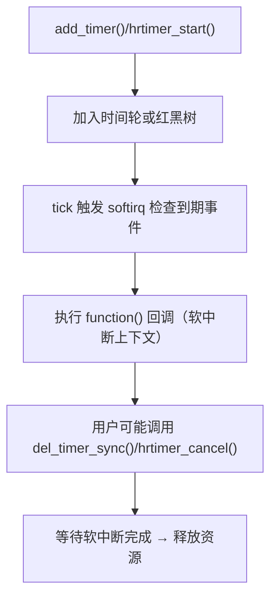
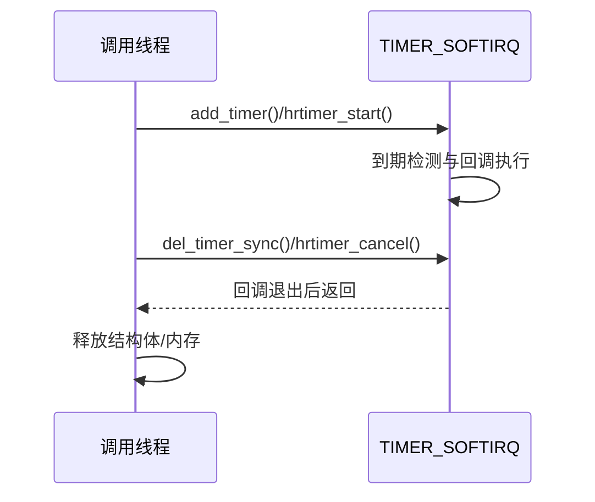

# 第24章　timer / hrtimer（时间回调与同步取消）

------

## 章节内容说明

本章讲解 Linux 内核中两类定时机制：

| 类型           | 精度                          | 内核接口                                                     | 典型场景           |
| -------------- | ----------------------------- | ------------------------------------------------------------ | ------------------ |
| **timer_list** | 以 jiffies 为单位，受 HZ 限制 | `add_timer()` / `mod_timer()` / `del_timer_sync()`           | 驱动超时、延迟重试 |
| **hrtimer**    | 高精度纳秒级（基于 ktime）    | `hrtimer_start()` / `hrtimer_cancel()` / `hrtimer_forward()` | 实时控制、周期任务 |

目标是理解它们的 **并发安全性、取消同步语义** 与 **回调上下文限制**，并掌握在驱动中如何安全地使用与释放。

------

## 24.1　机制引入：时间事件的两层语义

### 24.1.1　时间驱动在内核并发模型中的位置

在 Linux 内核中，“时间”不仅是延迟执行手段，更是并发调度的一部分。
 每个定时器的触发都是一次**异步事件**，其执行上下文由 softirq 驱动（`TIMER_SOFTIRQ` 或 `HRTIMER_SOFTIRQ`）。
 这意味着：

- 回调函数运行在 **软中断上下文**（不可睡眠）；
- 与普通内核线程、工作队列、waitqueue 的同步必须谨慎；
- 取消操作（如 `del_timer_sync()`）必须确保软中断执行完毕，否则可能导致 use-after-free。

### 24.1.2　timer 与 hrtimer 的演进

| 阶段     | 机制                                        | 主要改进                      |
| -------- | ------------------------------------------- | ----------------------------- |
| 早期内核 | `timer_list` 基于 jiffies                   | 粗粒度定时，适合通用调度      |
| 2.6 起   | `hrtimer` 基于 ktime_t + 高精度时钟源       | 支持纳秒级精度与周期性任务    |
| 3.x 起   | 与 `clockevents` / `clocksource` 子系统结合 | 提升时钟源一致性与跨 CPU 管理 |
| 5.x 起   | 可选 `CONFIG_HIGH_RES_TIMERS`、支持多核同步 | 用于 PREEMPT_RT 与实时调度    |

------

## 24.2　核心数据结构与内部关联

### 24.2.1　`struct timer_list`

```c
struct timer_list {
    struct hlist_node 	 entry;					// 链入全局定时器轮链表
    unsigned long 		 expires;				// 到期时间（以 jiffies 为单位）
    void (*function)(struct timer_list *);		 // 回调函数指针
    u32 				flags;				   // 内部状态位（挂载/运行/销毁中）
#ifdef CONFIG_LOCKDEP
    struct lockdep_map 	 lockdep_map;
#endif
};
```

#### 字段说明

| 字段       | 含义                           |
| ---------- | ------------------------------ |
| `entry`    | 链入全局定时器轮链表           |
| `expires`  | 到期时间（以 jiffies 为单位）  |
| `function` | 回调函数指针                   |
| `flags`    | 内部状态位（挂载/运行/销毁中） |

`timer_list` 的核心在于 **基于 jiffies 的轮转机制**：内核定期扫描到期定时器并触发软中断执行。

------

### 24.2.2　`struct hrtimer`

```c
struct hrtimer {
    struct timerqueue_node 		node;
    ktime_t 				   _expires;				// 绝对时间（纳秒级，基于 `ktime_t`）
    enum hrtimer_restart (*function)(struct hrtimer *);    // 回调函数，返回 `HRTIMER_NORESTART` 或 `HRTIMER_RESTART`
    struct hrtimer_clock_base 	*base;					 // 对应 CPU 的时钟基
    u8 						   state;				    // 状态机：`INACTIVE`、`ENQUEUED`、`RUNNING` 等
};
```

#### 核心要点

| 字段       | 说明                                                    |
| ---------- | ------------------------------------------------------- |
| `_expires` | 绝对时间（纳秒级，基于 `ktime_t`）                      |
| `function` | 回调函数，返回 `HRTIMER_NORESTART` 或 `HRTIMER_RESTART` |
| `base`     | 对应 CPU 的时钟基                                       |
| `state`    | 状态机：`INACTIVE`、`ENQUEUED`、`RUNNING` 等            |

#### 与 timer_list 的关键区别

| 对比项       | `timer_list`            | `hrtimer`                 |
| ------------ | ----------------------- | ------------------------- |
| 时间基准     | jiffies                 | ktime_t（纳秒）           |
| 精度         | 1/HZ                    | 纳秒级                    |
| 回调返回类型 | void                    | enum hrtimer_restart      |
| 上下文       | 软中断（TIMER_SOFTIRQ） | 软中断（HRTIMER_SOFTIRQ） |
| 周期性任务   | 需手动重新设定          | 可用 `hrtimer_forward()`  |
| 配置依赖     | 默认启用                | `CONFIG_HIGH_RES_TIMERS`  |

------

### 24.2.3　内核运行路径（概览）



> **注意**：回调执行与删除同步必须正确配对，否则会导致**回调尚未结束时释放内存**的经典竞争问题。

------

## 24.3　开发者视角：API 分类与上下文限制

### 24.3.1　低精度定时器 API 一览（timer_list）

| 操作   | 接口                               | 说明                      | 可睡？ |
| ------ | ---------------------------------- | ------------------------- | ------ |
| 初始化 | `timer_setup()`                    | 注册回调与 context        | 否     |
| 启动   | `add_timer()` / `mod_timer()`      | 加入内核时间轮            | 否     |
| 取消   | `del_timer()` / `del_timer_sync()` | 删除，sync 等待软中断完成 | 否     |
| 延期   | `mod_timer()`                      | 修改超时时间              | 否     |
| 查询   | `timer_pending()`                  | 是否仍在时间轮中          | 否     |

> `del_timer_sync()` 是并发安全的删除方式，**必须在可能与软中断并发时使用**。

------

### 24.3.2　高精度定时器 API 一览（hrtimer）

| 操作     | 接口                                           | 说明 |
| -------- | ---------------------------------------------- | ---- |
| 初始化   | `hrtimer_init()`                               |      |
| 启动     | `hrtimer_start()` / `hrtimer_start_range_ns()` |      |
| 取消     | `hrtimer_cancel()`                             |      |
| 推进周期 | `hrtimer_forward()`                            |      |
| 检查状态 | `hrtimer_active()`                             |      |

#### 回调函数返回值语义

```c
enum hrtimer_restart {
    HRTIMER_NORESTART,   // 一次性任务
    HRTIMER_RESTART      // 自动重新排期（周期性任务）
};
```

> 若回调返回 `HRTIMER_RESTART`，开发者必须在回调内手动使用
>  `hrtimer_forward_now()` 或 `hrtimer_forward()` 更新下一触发时间。


------

## 24.4 同步取消与竞争边界

### 24.4.1 del_timer 与 del_timer_sync 语义

```c
int del_timer(struct timer_list *timer);
int del_timer_sync(struct timer_list *timer);
```

| 函数               | 作用                             | 是否等待回调结束 | 可否在回调自身调用 |
| ------------------ | -------------------------------- | ---------------- | ------------------ |
| `del_timer()`      | 尝试删除，若正在运行可能立即返回 | 否               | 是（若非递归删除） |
| `del_timer_sync()` | 阻塞等待回调执行完毕再返回       | 是               | 否，会死锁         |

> **使用原则：**
>  当 timer 的 `function()` 可能与其它路径并发访问同一数据结构时，必须使用 `del_timer_sync()`。
>  例如驱动卸载、错误回滚或设备关闭时的资源释放阶段。

------

### 24.4.2 hrtimer 对应接口

```c
int hrtimer_cancel(struct hrtimer *timer);
```

- **语义等价于 `del_timer_sync()`**：若回调正在执行，等待完成。
- 在 PREEMPT_RT 或 多核环境下，会确保 `hrtimer.function()` 返回并退出 softirq 前 返回。

**返回值：**

| 值   | 说明                           |
| ---- | ------------------------------ |
| 1    | 定时器处于激活状态并被成功取消 |
| 0    | 定时器未激活（已超时或未启动） |

------

### 24.4.3 常见竞态场景

| 场景               | 问题                 | 解决                                             |
| ------------------ | -------------------- | ------------------------------------------------ |
| 回调与 cancel 并发 | 内存提前释放导致 UAF | 使用 `del_timer_sync()` / `hrtimer_cancel()`     |
| 回调再次启动       | 死循环或多次执行     | 确保 `mod_timer()` 或 `hrtimer_start()` 路径加锁 |
| 模块卸载中         | softirq 仍持引用     | 先 `del_timer_sync()` 再释放 module 资源         |
| 多核并发 mod_timer | 时间轮竞争           | 使用 spinlock 或 atomic 保护逻辑状态             |

------

## 24.5 典型驱动用例

### 24.5.1 延迟重试（低精度 timer_list）

> 目标：用 `timer_list` 实现“失败后延迟重试”的通用骨架：
>
> - 首次启动延时 `start_delay_ms`；之后按 `interval_ms` 周期重试；
> - 重试到 `max_retries` 次后**自动停止**；
> - `remove()` / 错误回滚 / 模块卸载时，**统一 `del_timer_sync()` 保证无悬挂回调**；
> - 无 `devm_timer_*`，用 `devm_add_action_or_reset()` 实现**失败回滚自动取消**（与 24.4 同步取消语义一致）。

```c
// SPDX-License-Identifier: GPL-2.0
#define pr_fmt(fmt) KBUILD_MODNAME ": " fmt

#include <linux/module.h>
#include <linux/platform_device.h>
#include <linux/of.h>
#include <linux/timer.h>
#include <linux/jiffies.h>
#include <linux/slab.h>
#include <linux/device.h>      // devm_add_action_or_reset
#include <linux/atomic.h>
#include <linux/delay.h>

static unsigned int start_delay_ms = 100;   // 首次启动延时
module_param(start_delay_ms, uint, 0644);
MODULE_PARM_DESC(start_delay_ms, "initial delay in ms before first retry");

static unsigned int interval_ms = 200;      // 重试间隔
module_param(interval_ms, uint, 0644);
MODULE_PARM_DESC(interval_ms, "retry interval in ms");

static unsigned int max_retries = 20;       // 最大重试次数（0=永远重试）
module_param(max_retries, uint, 0644);
MODULE_PARM_DESC(max_retries, "max retry attempts (0 = retry forever)");

struct tl_demo {
    struct timer_list retry_timer;
    atomic_t          retry_count;      // 回调计数
    bool              running;          // 可读性标志；状态以 timer_pending() 为准
    struct device    *dev;
    /* 业务相关资源放这里，例如寄存器基地址、状态位等 */
};

static void tl_demo_timer_cb(struct timer_list *t)
{
    struct tl_demo *ctx = from_timer(ctx, t, retry_timer);
    int n = atomic_inc_return(&ctx->retry_count);

    /* 软中断上下文：不可睡眠、不可调用可能阻塞的接口 */
    /* 在真实驱动中，可在此触发轻量操作或唤醒工作队列 */
    pr_info("retry #%d\n", n);

    if (max_retries && n >= max_retries) {
        ctx->running = false;
        return;     /* 不再重启：一次性结束 */
    }

    /* 继续下一次重试：用 mod_timer 延后到期点 */
    mod_timer(&ctx->retry_timer, jiffies + msecs_to_jiffies(interval_ms));
}

/* devres 回滚动作：等价 “安全删除定时器” */
static void tl_demo_cancel(void *data)
{
    struct tl_demo *ctx = data;
    /* del_timer_sync：等待潜在回调结束，防止UAF */
    if (del_timer_sync(&ctx->retry_timer))
        dev_dbg(ctx->dev, "cancelled active timer\n");
}

static void tl_demo_parse_of(struct device *dev)
{
    u32 v;
    if (!device_property_read_u32(dev, "start-delay-ms", &v))
        start_delay_ms = v;
    if (!device_property_read_u32(dev, "interval-ms", &v))
        interval_ms = v;
    if (!device_property_read_u32(dev, "max-retries", &v))
        max_retries = v;
}

static int tl_demo_probe(struct platform_device *pdev)
{
    struct tl_demo *ctx;

    tl_demo_parse_of(&pdev->dev);

    ctx = devm_kzalloc(&pdev->dev, sizeof(*ctx), GFP_KERNEL);
    if (!ctx)
        return -ENOMEM;

    ctx->dev = &pdev->dev;
    atomic_set(&ctx->retry_count, 0);
    ctx->running = false;

    /* 定时器初始化：新式写法 timer_setup 更安全 */
    timer_setup(&ctx->retry_timer, tl_demo_timer_cb, 0);

    platform_set_drvdata(pdev, ctx);

    /* 注册 devres 回滚：probe 任一步失败会自动调用 tl_demo_cancel() */
    if (devm_add_action_or_reset(&pdev->dev, tl_demo_cancel, ctx))
        return -ENOMEM;

    /* 启动首次延时 */
    mod_timer(&ctx->retry_timer, jiffies + msecs_to_jiffies(start_delay_ms));
    ctx->running = true;

    dev_info(&pdev->dev,
             "started: start_delay=%ums, interval=%ums, max_retries=%u (0=forever)\n",
             start_delay_ms, interval_ms, max_retries);
    return 0;
}

static int tl_demo_remove(struct platform_device *pdev)
{
    struct tl_demo *ctx = platform_get_drvdata(pdev);

    /* 与 devm 回滚动作幂等；再次调用安全 */
    del_timer_sync(&ctx->retry_timer);

    dev_info(&pdev->dev, "removed: total retries=%d\n",
             atomic_read(&ctx->retry_count));
    return 0;
}

/* 设备树匹配 */
static const struct of_device_id tl_demo_of_match[] = {
    { .compatible = "leaf,timerlist-demo" },
    { /* sentinel */ }
};
MODULE_DEVICE_TABLE(of, tl_demo_of_match);

static struct platform_driver tl_demo_driver = {
    .driver = {
        .name           = "timerlist_demo",
        .of_match_table = tl_demo_of_match,
    },
    .probe  = tl_demo_probe,
    .remove = tl_demo_remove,
};

module_platform_driver(tl_demo_driver);

MODULE_AUTHOR("Leaf & GPT-5");
MODULE_DESCRIPTION("Low-resolution retry demo using timer_list with safe cancel");
MODULE_LICENSE("GPL");
```

#### 要点

- `timer_setup()` 比老式 `init_timer()` 更安全，类型匹配严格。
- 删除时必须使用 `del_timer_sync()`，确保软中断退出后再释放。

#### 设备树片段（可选）

```dts
timerlist_demo@0 {
    compatible = "leaf,timerlist-demo";
    start-delay-ms = <100>;   // 首次延迟
    interval-ms    = <200>;   // 重试间隔
    max-retries    = <20>;    // 0 表示永远重试
};
```

#### Makefile / Kconfig（示例）

```make
# Makefile
obj-$(CONFIG_TIMERLIST_DEMO) += timerlist_demo.o
config TIMERLIST_DEMO
    tristate "timer_list retry demo (stop at max_retries)"
    help
      A minimal retry-with-delay example using struct timer_list.
      Uses del_timer_sync() for safe cancellation and devres rollback.
```

------

#### 关键点核对（与 24.4 同步取消一致）

- **上下文限制**：`timer_list` 回调运行在 **TIMER_SOFTIRQ**，不可睡眠；只做轻量操作。
- **安全删除**：涉及释放路径（`remove()` / 错误回滚 / 卸载）必须使用 **`del_timer_sync()`**，等待回调退出，避免 UAF。
- **devres 对照**：内核无 `devm_timer_*`，通过 `devm_add_action_or_reset()` 绑定 `del_timer_sync()`，确保 **probe 失败即自动取消**；`remove()` 中再 `del_timer_sync()` 是**幂等**且推荐。
- **自动停止**：计数达到 `max_retries` 后**不再 `mod_timer()`**，自然终止。
- **时间粒度**：以 `jiffies` 为单位，精度约 `1/HZ`；若需要高精度请使用 **hrtimer**（见 24.5.2 完整示例）。

------

需要“**纯模块（非 platform driver）** 的最小可加载版本”（`module_init/exit`，同样带参数与同步取消）吗？我可以再给一份精简模板。

------

### 24.5.2 周期任务（高精度 hrtimer）

> 目标：周期 50ms（可通过模块参数覆盖），累计 tick 到 `max_ticks`（默认 20）后**自动停止**。驱动卸载/解绑/探测失败时**保证无悬挂回调**。

```c
// SPDX-License-Identifier: GPL-2.0
#define pr_fmt(fmt) KBUILD_MODNAME ": " fmt

#include <linux/module.h>
#include <linux/platform_device.h>
#include <linux/of.h>
#include <linux/hrtimer.h>
#include <linux/ktime.h>
#include <linux/slab.h>
#include <linux/device.h>      // devm_add_action_or_reset
#include <linux/atomic.h>

static unsigned int period_ms = 50;     // 周期，毫秒
module_param(period_ms, uint, 0644);
MODULE_PARM_DESC(period_ms, "hrtimer period in milliseconds");

static unsigned int max_ticks = 20;     // 达到该 tick 数后自动停止
module_param(max_ticks, uint, 0644);
MODULE_PARM_DESC(max_ticks, "stop after this many ticks (0 = run forever)");

struct hrt_demo {
    struct hrtimer hrt;
    ktime_t        interval;
    atomic_t       counter;     // 回调计数（原子自增，避免锁）
    bool           running;     // 仅用于可读性；状态以 hrtimer 自身为准
    struct device *dev;
};

/* --- 回调：软中断上下文，不可睡 --- */
static enum hrtimer_restart hrt_demo_cb(struct hrtimer *t)
{
    struct hrt_demo *ctx = container_of(t, struct hrt_demo, hrt);
    int n = atomic_inc_return(&ctx->counter);

    /* 仅演示：避免刷屏可改用 pr_debug / pr_info_ratelimited */
    pr_info("tick #%d\n", n);

    /* 到达上限：返回 NORESTART 终止 */
    if (max_ticks && n >= max_ticks) {
        ctx->running = false;
        return HRTIMER_NORESTART;
    }

    /* 周期推进：以“现在”为基准前推 interval，避免漂移累积 */
    hrtimer_forward_now(t, ctx->interval);
    return HRTIMER_RESTART;
}

/* devres 回滚动作：与 del_timer_sync 等价的 hrtimer_cancel */
static void hrt_demo_cancel(void *data)
{
    struct hrt_demo *ctx = data;
    int ret = hrtimer_cancel(&ctx->hrt);
    if (ret)
        dev_dbg(ctx->dev, "cancelled active hrtimer\n");
}

/* 可选：从 DT 读取 period-ms / max-ticks 属性 */
static void hrt_demo_parse_of(struct device *dev)
{
    u32 v;
    if (!device_property_read_u32(dev, "period-ms", &v))
        period_ms = v;
    if (!device_property_read_u32(dev, "max-ticks", &v))
        max_ticks = v;
}

/* --- 平台设备探测 --- */
static int hrt_demo_probe(struct platform_device *pdev)
{
    struct hrt_demo *ctx;

#ifndef CONFIG_HIGH_RES_TIMERS
    dev_warn(&pdev->dev, "CONFIG_HIGH_RES_TIMERS is off; hrtimer precision may degrade\n");
#endif

    hrt_demo_parse_of(&pdev->dev);

    ctx = devm_kzalloc(&pdev->dev, sizeof(*ctx), GFP_KERNEL);
    if (!ctx)
        return -ENOMEM;

    ctx->dev = &pdev->dev;
    atomic_set(&ctx->counter, 0);
    ctx->interval = ms_to_ktime(period_ms);

    /* 初始化 hrtimer：CLOCK_MONOTONIC，使用相对模式（REL） */
    hrtimer_init(&ctx->hrt, CLOCK_MONOTONIC, HRTIMER_MODE_REL);
    ctx->hrt.function = hrt_demo_cb;

    platform_set_drvdata(pdev, ctx);

    /* 注册 devres 回滚：probe 任一步失败时自动 cancel */
    if (devm_add_action_or_reset(&pdev->dev, hrt_demo_cancel, ctx))
        return -ENOMEM;

    /* 启动周期定时器 */
    hrtimer_start(&ctx->hrt, ctx->interval, HRTIMER_MODE_REL);
    ctx->running = true;

    dev_info(&pdev->dev,
             "started: period=%ums, max_ticks=%u (0=forever)\n",
             period_ms, max_ticks);

    return 0;
}

/* --- 解绑：同步取消，保证无悬挂回调 --- */
static int hrt_demo_remove(struct platform_device *pdev)
{
    struct hrt_demo *ctx = platform_get_drvdata(pdev);

    /* 由于使用了 devm_add_action_or_reset，这里再次 cancel 也安全（幂等） */
    hrtimer_cancel(&ctx->hrt);
    dev_info(&pdev->dev, "removed: total ticks=%d\n", atomic_read(&ctx->counter));
    return 0;
}

/* --- 设备树匹配 --- */
static const struct of_device_id hrt_demo_of_match[] = {
    { .compatible = "leaf,hrtimer-demo" },
    { /* sentinel */ }
};
MODULE_DEVICE_TABLE(of, hrt_demo_of_match);

static struct platform_driver hrt_demo_driver = {
    .driver = {
        .name           = "hrtimer_demo",
        .of_match_table = hrt_demo_of_match,
    },
    .probe  = hrt_demo_probe,
    .remove = hrt_demo_remove,
};

module_platform_driver(hrt_demo_driver);

MODULE_AUTHOR("Leaf & GPT-5");
MODULE_DESCRIPTION("Periodic hrtimer demo with safe cancel");
MODULE_LICENSE("GPL");
```

#### 要点

- 回调中可再次 `hrtimer_forward_now()` 以形成周期任务。
- 回调在 softirq 上下文，禁止睡眠。
- 若模块卸载或设备下电，必须调用 `hrtimer_cancel()` 确保无残余事件。

#### 设备树片段（可选）

```dts
hrtimer_demo@0 {
    compatible = "leaf,hrtimer-demo";
    period-ms = <50>;     // 覆盖周期，单位 ms
    max-ticks = <20>;     // 达到 20 次后自动停止；0 表示一直运行
};
```

#### Kconfig / Makefile（示例）

```make
# Makefile
obj-$(CONFIG_HRTIMER_DEMO) += hrtimer_demo.o
config HRTIMER_DEMO
    tristate "hrtimer periodic demo (stop at max_ticks)"
    depends on HIGH_RES_TIMERS
    help
      A minimal periodic hrtimer sample with safe cancel and devres rollback.
```

------

#### 关键点对齐（与 24.4 同步取消语义一致）

- 回调运行在 **HRTIMER_SOFTIRQ**，**不可睡**；仅做轻量逻辑与调度。
- **同步取消**：`hrtimer_cancel()` 等价于 `del_timer_sync()` 的语义，保证回调已退出再返回。
- **devres 对照**：主线没有 `devm_hrtimer_*`，通过
   `devm_add_action_or_reset(dev, hrt_demo_cancel, ctx)`
   实现**错误回滚自动取消**，`remove()` 中再调用一次也**幂等**。
- **周期推进**：采用 `hrtimer_forward_now(t, interval)`，避免因回调运行时延造成的周期漂移。
- **自动停止**：`max_ticks>0` 时，回调返回 `HRTIMER_NORESTART` 即可停表。

------

如果你需要 **简化成“无 Platform Driver、纯模块 init/exit”** 的最小可加载版本，我也可以再给一个精简模板（同样带参数、自动停止与同步取消）。需要的话直接说一声。

------

## 24.6 可视化：执行与同步时序



> `del_timer_sync()` 和 `hrtimer_cancel()` 的核心保障：等待 softirq 退出后再释放资源。

------

## 24.7 调试与验证

### 24.7.1 内核调试选项

| 配置项                        | 作用                                          |
| ----------------------------- | --------------------------------------------- |
| `CONFIG_TIMER_STATS`          | 统计 timer 创建与触发信息（/proc/timer_list） |
| `CONFIG_DEBUG_OBJECTS_TIMERS` | 检测非法删除、重复启动、未取消定时器          |
| `CONFIG_HIGH_RES_TIMERS`      | 启用 hrtimer 高精度路径                       |

查看活动定时器：

```bash
cat /proc/timer_list
```

------

### 24.7.2 常见错误与修复

| 症状           | 原因                          | 修复                          |
| -------------- | ----------------------------- | ----------------------------- |
| 内核崩溃 (UAF) | 回调执行中 结构体被释放       | 改为 `del_timer_sync()`       |
| 死锁           | 回调中调用 `del_timer_sync()` | 禁止在回调内使用 sync 版本    |
| 定时不准       | 未开启高精度                  | 启用 `CONFIG_HIGH_RES_TIMERS` |
| 回调延迟       | CPU 软中断被屏蔽              | 优化 IRQ 负载或迁移 CPU 绑定  |

------

## 24.8 小结

| 关键点     | 说明                                                         |
| ---------- | ------------------------------------------------------------ |
| 执行上下文 | 均在 softirq ，不可睡眠                                      |
| 同步取消   | `del_timer_sync()` 与 `hrtimer_cancel()` 必须在释放前调用    |
| 并发安全   | 回调和删除可并发，需要 sync 版保障                           |
| 使用场景   | timer_list 适合 ms 级 ， hrtimer 适合 实时或周期任务         |
| 调试支持   | `/proc/timer_list` 与 `CONFIG_DEBUG_OBJECTS_TIMERS` 可检测误用 |

------

### 总结性表格：timer / hrtimer 比较

| 特性       | timer_list         | hrtimer                         |
| ---------- | ------------------ | ------------------------------- |
| 时间单位   | jiffies            | ktime_t (纳秒)                  |
| 触发精度   | ~1/HZ              | 纳秒                            |
| 回调返回值 | void               | enum hrtimer_restart            |
| 可周期     | 需手动             | `HRTIMER_RESTART` + `forward()` |
| 取消同步   | `del_timer_sync()` | `hrtimer_cancel()`              |
| 上下文     | TIMER_SOFTIRQ      | HRTIMER_SOFTIRQ                 |
| 常用场景   | 延迟任务、超时检测 | 高精度控制、周期触发            |

------

