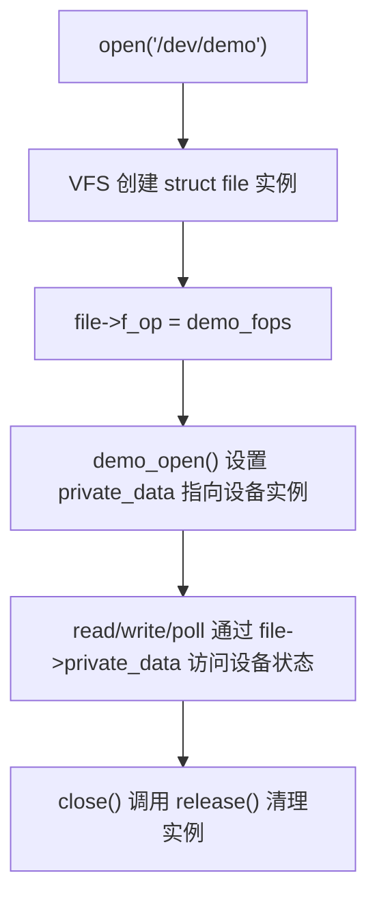
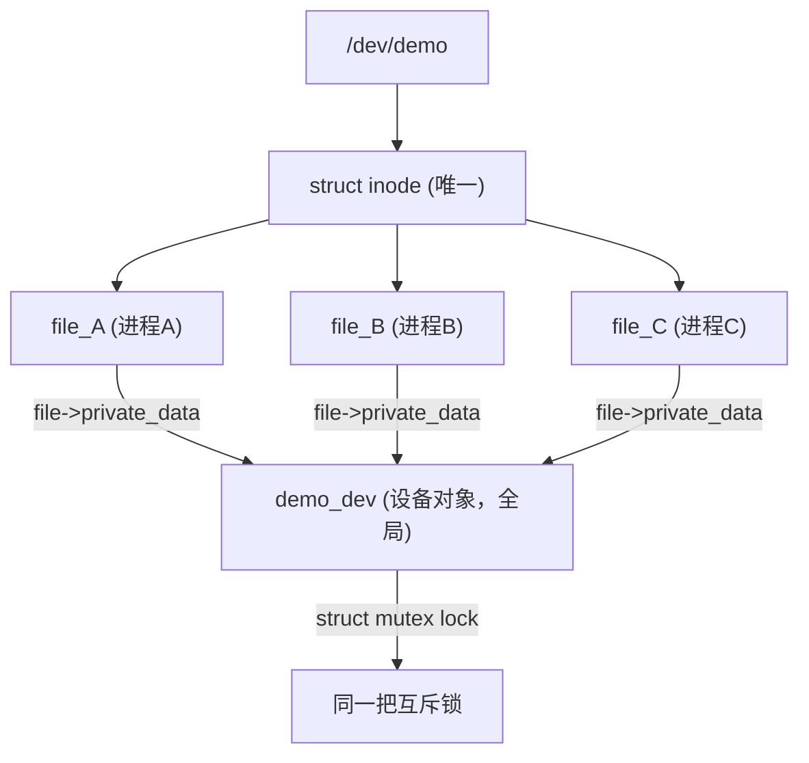
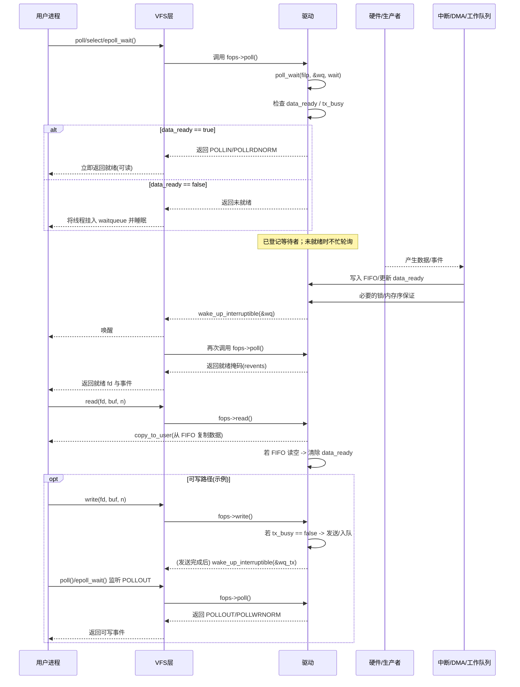

# 第 25 章　文件操作并发（open/close/read/write/poll/mmap/ioctl）

------

## 章节内容说明

本章聚焦 **驱动层 file_operations 与并发模型的交互关系**。
 重点回答四个核心问题：

1. 各文件操作在何种上下文运行（可睡眠 / 不可睡眠）。
2. open/close 与 read/write 之间的典型并发边界。
3. poll、mmap、ioctl 的同步模型与驱动内部锁策略。
4. devres 式释放逻辑与并发退出的关系。

------

## 25.1 机制引入：从系统调用到 file_operations

系统调用层通过 VFS （Virtual File System） 为每个打开的设备文件创建独立的 **struct file** 实例。
 每个 file 结构都指向驱动注册的 file_operations 表：

```c
struct file_operations {
    struct module *owner;
    loff_t (*llseek)(struct file *, loff_t, int);
    ssize_t (*read)(struct file *, char __user *, size_t, loff_t *);
    ssize_t (*write)(struct file *, const char __user *, size_t, loff_t *);
    __poll_t (*poll)(struct file *, struct poll_table_struct *);
    long (*unlocked_ioctl)(struct file *, unsigned int, unsigned long);
    int (*mmap)(struct file *, struct vm_area_struct *);
    int (*open)(struct inode *, struct file *);
    int (*release)(struct inode *, struct file *);
    ...
};
```

**并发意义：**

- 每个进程打开设备文件时 VFS 都会分配独立的 `struct file`。
- 驱动通过 `file->private_data` 维护每个实例的私有状态。
- 内核可同时在多个 CPU 上执行不同实例的 read/write/poll 操作。

------

## 25.2 数据结构视角

| 结构体                     | 作用                             | 并发关键点                        |
| -------------------------- | -------------------------------- | --------------------------------- |
| `struct inode`             | 文件的全局元数据（设备号、权限） | 同一设备共享；open 并发访问需加锁 |
| `struct file`              | 打开实例状态（指针、偏移）       | 每次 open 独立，不同 file 可并发  |
| `struct file_operations`   | 函数表接口                       | 驱动注册的静态常量；只读          |
| `struct poll_table_struct` | poll 注册表                      | 供 poll_wait 使用，受锁保护       |
| `struct vm_area_struct`    | mmap 映射区                      | 页表与设备共享内存同步需特殊处理  |

------

## 25.3 开发者视角：各接口的并发模型

| 接口       | 执行上下文 | 是否可睡眠 | 是否可重入      | 并发处理建议                                |
| ---------- | ---------- | ---------- | --------------- | ------------------------------------------- |
| open       | 进程上下文 | 可睡       | 多进程同时 open | 使用 mutex 保护设备引用计数                 |
| release    | 进程上下文 | 可睡       | 与 open 配对    | 清理资源前先 flush 工作队列                 |
| read/write | 进程上下文 | 可睡       | 多线程并发      | 使用 mutex 或 RW 锁保护缓冲区               |
| poll       | 进程上下文 | 可睡       | 并发调用        | 用 waitqueue 与 spinlock 结合               |
| mmap       | 进程上下文 | 可睡       | 通常单实例      | 使用 vm_operations 同步 VMA 生命周期        |
| ioctl      | 进程上下文 | 可睡       | 可能并发        | 采用 copy_to/from_user 前后加锁保护共享状态 |

------

## 25.4 文件实例与设备对象的关系



> **要点：**
>
> - 不同进程各自拥有 file 实例，可并发访问同一设备；
> - 共享硬件寄存器或缓冲区时，需在驱动层自建锁以保证互斥；
> - 内核不会自动序列化 read/write。

------

## 25.5 典型模板：带 mutex 的 read/write 同步

### 25.5.1　两个驱动层的经典疑问

> **疑问 1：**
>  每个进程对 `/dev/demo_dev` 的 `open` 都会生成独立的 `struct file`。
>  那驱动中定义的 `mutex` 是锁住“进程 A 自己的多次 read/write”，
>  还是会让 A、B、C 三个进程之间也互斥？

> **疑问 2：**
>  如果这把锁能让 A、B、C 三个进程都互斥，
>  那它又是怎么做到既保持 `struct file` 的独立性，
>  又能让不同进程之间竞争同一个锁？

这两个问题实际上触到了 Linux 驱动文件操作的**核心并发模型**：

> “**struct file 负责会话隔离，struct device 负责资源共享。**”

------

#### 25.5.2　分层机制：file 独立、device 共享

Linux 驱动的文件访问分为两层：

| 层级                                | 数据结构           | 创建时机   | 生命周期            | 用途               |
| ----------------------------------- | ------------------ | ---------- | ------------------- | ------------------ |
| **struct file**                     | 每次 `open()` 创建 | 每进程独立 | 每次 `close()` 销毁 | 用户态“会话”上下文 |
| **struct demo_dev（驱动设备对象）** | 驱动 probe 时创建  | 全局唯一   | 驱动卸载时销毁      | 设备硬件资源封装   |

对应关系：



> ✅ 每个进程的 `struct file` 独立，
>  但 `file->private_data` 都指向同一个 `demo_dev`。
>  因此驱动中的 `mutex` 实际上锁住的是设备本身，而不是进程。

------

### 25.5.3　机制回答一：mutex 锁的范围

> **结论：**
>  驱动中定义的 `mutex`（通常位于 `struct demo_dev` 内）是 **跨进程全局锁**，
>  保护整个设备的共享资源（如寄存器、FIFO、DMA 缓冲区）。

| 维度       | 说明                                                    |
| ---------- | ------------------------------------------------------- |
| 锁粒度     | 针对整个设备，而非单个文件                              |
| 锁作用域   | 所有进程、所有线程                                      |
| 锁保护目标 | 设备硬件或共享缓冲区的一致性                            |
| 典型语句   | `mutex_lock(&ddev->lock)` / `mutex_unlock(&ddev->lock)` |

------

### 25.5.4　机制回答二：struct file 的独立性如何保留

虽然所有进程共享同一设备锁，但 VFS 仍保证每个进程的 `struct file` 独立：

- 每次 `open()` 都会生成新的 `struct file`；

- 每个 file 记录自己独立的 `f_pos`、`flags` 等会话状态；

- 驱动通过：

  ```c
  filp->private_data = &demo_device;
  ```

  将共享设备对象挂载到每个文件；

- 因此：

  - **锁**是全局的；
  - **文件状态**是局部的；
  - 既保证并发安全，又不破坏独立访问的抽象。

------

### 25.5.5　示例：设备级 mutex（跨进程互斥）

```c
struct demo_dev {
    struct mutex lock;     /* 全局互斥锁 */
    char buffer[128];
    size_t len;
};

/* read 操作 */
static ssize_t demo_read(struct file *filp, char __user *buf,
                         size_t count, loff_t *ppos)
{
    struct demo_dev *ddev = filp->private_data;
    ssize_t ret;

    if (mutex_lock_interruptible(&ddev->lock))
        return -ERESTARTSYS;

    if (*ppos >= ddev->len)
        ret = 0;
    else {
        size_t n = min(count, ddev->len - *ppos);
        if (copy_to_user(buf, ddev->buffer + *ppos, n))
            ret = -EFAULT;
        else {
            *ppos += n;
            ret = n;
        }
    }

    mutex_unlock(&ddev->lock);
    return ret;
}

/* write 操作 */
static ssize_t demo_write(struct file *filp, const char __user *buf,
                          size_t count, loff_t *ppos)
{
    struct demo_dev *ddev = filp->private_data;
    ssize_t ret;

    if (mutex_lock_interruptible(&ddev->lock))
        return -ERESTARTSYS;

    count = min(count, sizeof(ddev->buffer));
    if (copy_from_user(ddev->buffer, buf, count))
        ret = -EFAULT;
    else {
        ddev->len = count;
        *ppos = 0;
        ret = count;
    }

    mutex_unlock(&ddev->lock);
    return ret;
}
```

> 💡 多个进程同时访问 `/dev/demo`：
>  只有一个线程能持有锁；
>  其余线程阻塞在 `mutex_lock_interruptible()`；
>  保证共享缓冲区一致性。


------

## 25.6 poll 与 waitqueue 同步

------

### 25.6.1 问题引入：为什么需要 poll？

当用户空间使用 `read()` 读取设备数据时，如果设备尚未准备好（缓冲区为空），进程只能阻塞等待。
 但有些程序（如 `select()` / `poll()` / `epoll()` 机制）希望能同时监视多个设备、在任一设备可读可写时统一返回。

于是内核引入了**事件等待机制（waitqueue）**，
 而 `poll()` 接口正是驱动与用户空间事件等待系统之间的桥梁。

> ✅ `poll()` 不是锁，也不是通知机制本身；
>  它只是把“用户态的等待”挂入驱动定义的 waitqueue，
>  并允许驱动在事件到来时调用 `wake_up()` 唤醒它。

------

### 25.6.2 语义模型：poll = 注册 + 检查 + 唤醒

每个支持 poll 的设备通常具备一个 waitqueue 用于事件通知：

```c
wait_queue_head_t wq;
bool data_ready;
spinlock_t lock;
```

poll 调用过程分三步：

| 阶段   | 驱动动作                                           | 用户空间感知           |
| ------ | -------------------------------------------------- | ---------------------- |
| ① 注册 | `poll_wait(filp, &wq, wait)`                       | 当前进程加入 waitqueue |
| ② 检查 | 检查内部状态（如 `data_ready`）                    | 若条件满足立即返回     |
| ③ 唤醒 | 设备中断/工作队列调用 `wake_up_interruptible(&wq)` | 唤醒阻塞的进程         |

------

#### 执行路径图



------

### 25.6.3 并发语义：poll 与 锁的配合

#### 关键原则

1. **poll 必须是非阻塞的**：驱动不应在 poll 中睡眠。
2. **状态检查必须受锁保护**：因为 `data_ready` 常由中断或工作队列更新。
3. **锁粒度最小化**：poll 中仅加锁读取状态，不得长期持锁。

#### 推荐写法

```c
__poll_t demo_poll(struct file *filp, struct poll_table_struct *wait)
{
    struct demo_dev *ddev = filp->private_data;
    __poll_t mask = 0;
    unsigned long flags;

    /* 注册等待队列 */
    poll_wait(filp, &ddev->wq, wait);

    /* 受锁保护地检查状态 */
    spin_lock_irqsave(&ddev->lock, flags);
    if (ddev->data_ready)
        mask |= POLLIN | POLLRDNORM;
    if (!ddev->tx_busy)
        mask |= POLLOUT | POLLWRNORM;
    spin_unlock_irqrestore(&ddev->lock, flags);

    return mask;
}
```

------

### 25.6.4 状态变化时的唤醒

当设备中断或工作线程使得数据可读、可写时，
 驱动必须显式唤醒等待者：

```c
/* 示例：中断回调或工作队列 */
static void demo_irq_handler(void *arg)
{
    struct demo_dev *ddev = arg;

    spin_lock(&ddev->lock);
    ddev->data_ready = true;
    spin_unlock(&ddev->lock);

    /* 唤醒 poll/select/epoll 等等待进程 */
    wake_up_interruptible(&ddev->wq);
}
```

> - 使用 `wake_up_interruptible()` 唤醒处于 TASK_INTERRUPTIBLE 状态的等待者；
> - 若驱动中既有 poll 也有 read 阻塞等待，应使用同一 waitqueue；
>    否则两个调用路径无法同步。

------

### 25.6.5 waitqueue 的本质：事件同步原语

`wait_queue_head_t` 是一个轻量级的事件队列，用于进程睡眠与唤醒。

#### 内核接口速览

| 函数                                      | 说明             | 可睡眠？ |
| ----------------------------------------- | ---------------- | -------- |
| `init_waitqueue_head()`                   | 初始化队列       | -        |
| `wait_event(wq, condition)`               | 条件为真前睡眠   | 可睡     |
| `wait_event_interruptible(wq, condition)` | 可被信号打断     | 可睡     |
| `wake_up(&wq)`                            | 唤醒所有等待进程 | 否       |
| `wake_up_interruptible(&wq)`              | 唤醒可中断睡眠者 | 否       |

在驱动的阻塞 read() 中，常见用法为：

```c
wait_event_interruptible(ddev->wq, ddev->data_ready);
```

而在 poll() 中，驱动只是把该进程“注册”进去，不主动等待。

------

### 25.6.6 poll 与 read 的区别与协作

| 维度               | read()                  | poll()                              |
| ------------------ | ----------------------- | ----------------------------------- |
| 行为               | 若无数据则阻塞          | 若无数据则挂入 waitqueue 并立即返回 |
| 使用者             | 直接读取                | 事件监控（select/poll/epoll）       |
| 驱动侧动作         | `wait_event()` 阻塞等待 | `poll_wait()` 注册等待              |
| 是否需要 wake_up   | ✅ 需要                  | ✅ 需要                              |
| 可否共用 waitqueue | ✅ 推荐共用              | ✅ 推荐共用                          |

正确的设计是：

- read() 与 poll() 共用同一个 waitqueue；
- 唤醒时一次 wake_up_interruptible() 同时满足两者。

------

### 25.6.7 完整驱动模板

```c
struct demo_dev {
    wait_queue_head_t 	  wq;
    spinlock_t 			 lock;
    bool 				data_ready;
    bool 				tx_busy;
};

static __poll_t demo_poll(struct file *filp, struct poll_table_struct *wait)
{
    struct demo_dev *ddev = filp->private_data;
    __poll_t mask = 0;
    unsigned long flags;

    poll_wait(filp, &ddev->wq, wait);		// 等待ddev->wq的唤醒信号。
	// 进入poll唤醒通知阶段
    spin_lock_irqsave(&ddev->lock, flags);
    if (ddev->data_ready)
        mask |= POLLIN | POLLRDNORM;
    if (!ddev->tx_busy)
        mask |= POLLOUT | POLLWRNORM;
    spin_unlock_irqrestore(&ddev->lock, flags);

    return mask;
}

static ssize_t demo_read(struct file *filp, char __user *buf,
                         size_t count, loff_t *ppos)
{
    struct demo_dev *ddev = filp->private_data;

    /* 等待数据准备 */
    if (wait_event_interruptible(ddev->wq, ddev->data_ready))
        return -ERESTARTSYS;

    /* 消费数据 */
    ddev->data_ready = false;
    /* copy_to_user() ... */

    return count;
}

/* 事件到达时唤醒 */
void demo_irq_handler(void *arg)
{
    struct demo_dev *ddev = arg;

    spin_lock(&ddev->lock);
    ddev->data_ready = true;
    spin_unlock(&ddev->lock);

    wake_up_interruptible(&ddev->wq);
}
```

------

### 25.6.8 调试与验证

| 调试点               | 命令 / 方法               | 说明                      |
| -------------------- | ------------------------- | ------------------------- |
| 查看等待队列挂载情况 | `cat /proc/<pid>/stack`   | 验证是否阻塞在 wait_event |
| 检查 poll 行为       | `strace -e poll ./app`    | 观察返回事件              |
| 并发验证             | 多线程调用 poll 与 read   | 确认 wake_up 唤醒一致     |
| 调试宏               | `CONFIG_DEBUG_LOCK_ALLOC` | 检查 spinlock 嵌套错误    |

------

### 25.6.9 小结

| 关键点              | 说明                                                   |
| ------------------- | ------------------------------------------------------ |
| poll 的角色         | 将用户态的等待注册到驱动 waitqueue                     |
| waitqueue 的作用    | 驱动唤醒用户态阻塞点                                   |
| poll 与 read 的区别 | 前者注册、后者等待                                     |
| 锁配合策略          | poll 使用 spinlock 检查状态，read 用 mutex 保护数据    |
| 唤醒时机            | 中断、工作队列、数据到达时调用 wake_up_interruptible() |
| 推荐实践            | poll 与 read 共用同一 waitqueue，事件同步逻辑一致      |

------

> 🧩 **一句话总结：**
>  `poll()` 让驱动可以被“查询”，`waitqueue` 让驱动可以“唤醒”。
>  两者合在一起，构成了用户空间 I/O 事件驱动的底层基石。


------

## 25.7 mmap 与 ioctl 的并发语义

------

### 25.7.1 是什么（定位与边界）

- **mmap**：把设备侧的内存区域（DMA 一致性缓冲区、设备 MMIO 或专用页）映射到用户态地址空间，由 `f_op->mmap()` 与 `vm_operations_struct` 共同完成。
- **ioctl**：以命令号 + 结构体为载体的**控制面**入口，由 `f_op->unlocked_ioctl()`（以及可选 `compat_ioctl`）实现。

**并发边界**

- 进入 `mmap()` 或 `ioctl()` 时，**VFS 不再提供设备状态保护**；对共享资源的互斥由驱动自管（`mutex`/`spinlock`/原子量/引用计数）。
- `mmap` 产生的**长期共享**（用户空间直接访问页/寄存器）与 `ioctl` 的**瞬时管控**（配置、触发、查询）会并发存在，必须通过锁与生命周期管理解耦。

------

### 25.7.2 为什么（要解决的问题）

- **零拷贝/低延迟**：`mmap` 让用户态直接读写 DMA 缓冲或 MMIO，减少 copy 与系统调用开销。
- **控制/配置**：`ioctl` 适于改变设备模式、提交队列、查询状态等控制路径。
- **并发挑战**：
  1. `mmap` 的 VMA 生命周期（open/close/fault）与设备的 probe/remove、`release()` 并发；
  2. `ioctl` 与 `read/write/poll` 并行修改状态；
  3. 非一致性平台（ARMv8/ARMv9）下的**缓存属性**与 **DMA 同步**。

------

### 25.7.3 怎么实现（底层原理与处理逻辑）

#### A. `mmap` 的两种主流路径

1. **映射 DMA 一致性缓冲（推荐）**
   - 设备侧：`dma_alloc_coherent()` / **托管版** `dmam_alloc_coherent()`（devres 风格，随 device 生命周期回收）。
   - 用户侧映射：`dma_mmap_coherent()`（正确设置缓存属性与页标志）。
   - **并发语义**：缓冲区一致性由平台保障（coherent），共享读写用**设备级锁/序列号**协调。
2. **映射设备 MMIO（寄存器/帧缓冲等）**
   - 设备侧：`devm_ioremap_resource()` 获取 `void __iomem *base`。
   - 用户侧映射：`vm_iomap_memory(vma, res->start, resource_size(res))` 或 `remap_pfn_range()` + `pgprot_noncached()/pgprot_writecombine()`。
   - **并发语义**：必须限制访问范围（安全、只读/只写），并对寄存器访问建立**只读映射或位掩码**保护；同时协调与内核侧寄存器访问的互斥。

> 选择策略：优先 **DMA 一致性缓冲 + `dma_mmap_coherent()`**。仅在确需用户态直接操 MMIO 时才映射寄存器，并严格权限。

#### B. `vm_operations_struct` 生命周期

- `vma->vm_ops = { .open, .close, .fault, ... }`
- 常用：计数映射数（`map_count`）、在 `close` 中回收/解绑定、在 `fault` 中建立页（对于懒映射/分段页）。
- **并发点**：`vma->close` 可能与驱动 `release()`、设备 `remove()` 交错；必须用 **引用计数/kref** 或 **原子计数 + 同步取消** 确保在最后一个映射关闭后再释放底层内存/队列。

#### C. `ioctl` 的并发模型

- `unlocked_ioctl(struct file *f, unsigned int cmd, unsigned long arg)` 在**可睡眠**的进程上下文中执行，可与 `read/write/poll/mmap` 并发。
- **锁策略**：
  - **控制面状态**用 `mutex` 保护（修改模式/队列/开关）。
  - **快速路径位**用 `atomic_t`/`READ_ONCE/WRITE_ONCE`。
  - **耗时操作**采用“**锁内快照** → **锁外执行** → **必要时锁内提交**”避免长时间持锁。
- **兼容层**：32→64 进程混跑时实现 `compat_ioctl`；命令定义采用 `_IO/_IOR/_IOW/_IOWR`，并保持 UAPI 结构体的 **对齐/尺寸/ABI 稳定**。

------

### 25.7.4 怎么用（步骤与放置点）

#### A. 映射 DMA 一致性缓冲（首选）

1. probe：
   - `dmam_alloc_coherent(dev, size, &dma_handle, GFP_KERNEL)` 分配一致性区；
   - 保存 `cpu_addr/dma_handle/size`，`map_count=0`。
2. `fops.mmap`：
   - 校验长度/偏移；
   - 设置 `vma->vm_flags |= VM_DONTEXPAND|VM_DONTDUMP;`（必要时 `VM_IO|VM_DONTCOPY`）；
   - `dma_mmap_coherent(dev, vma, cpu_addr, dma_handle, size)`；
   - `atomic_inc(&map_count)`，`vma->vm_ops = &ops`，`vma->vm_private_data = ctx`。
3. `vm_ops.close`：`atomic_dec(&map_count)`；若为 0 且设备停用，清理/复位。
4. remove：等待 `map_count==0`（`wait_event_killable()` + 引用计数）；再释放 `dmam_alloc_coherent` 返回的内存（由托管接口自动回收）。

#### B. 映射 MMIO（仅在必要时）

1. probe：`res = platform_get_resource()` → `devm_ioremap_resource()`；
2. `fops.mmap`：
   - 校验偏移与长度对齐到页；
   - `vma->vm_page_prot = pgprot_noncached(vma->vm_page_prot)`（或 WC）；
   - 使用 `vm_iomap_memory(vma, res->start, resource_size(res))`；
   - 设置只读映射（`VM_READ`）以防用户破坏寄存器；
   - 记 `map_count` 与 `vm_ops`。

#### C. ioctl 使用规范

1. UAPI 头：定义 `#define DEMO_IOC_SET_MODE _IOW(DEMO_IOC, 0x01, struct demo_mode)` 等；
2. `unlocked_ioctl`：
   - `switch(cmd)` 分发；
   - `copy_from_user()`/`copy_to_user()` 前后进行 **数据校验**；
   - **短持锁**修改共享状态；耗时操作锁外执行；
   - 对不可信用户输入保持 **边界检查** 与 **权限校验（capable()）**；
   - 需要阻塞的 `ioctl` 用 `wait_event_killable()`，并支持信号打断返回 `-ERESTARTSYS`。

------

### 25.7.5 接口表与并发要点（速查）

| 类别         | 关键接口                                        | 并发要点                                                     |
| ------------ | ----------------------------------------------- | ------------------------------------------------------------ |
| DMA coherent | `dmam_alloc_coherent()` / `dma_mmap_coherent()` | 一致性由平台保证；<br />共享访问用设备锁；<br />用 `map_count` 管理映射生命周期 |
| MMIO         | `devm_ioremap_resource()` / `vm_iomap_memory()` | 非缓存或 WC；<br />限制权限；<br />与内核寄存器访问互斥      |
| VMA 生命周期 | `vm_operations_struct{open,close,fault}`        | `close` 与 `release/remove` 并发；<br />用引用计数/等待队列对齐释放 |
| ioctl        | `unlocked_ioctl()`/`compat_ioctl()`             | 短持锁、边界检查、权限校验、支持信号打断                     |
| 锁           | `mutex`/`spinlock`/`atomic_t`                   | 控制面用 mutex；<br />快速标志用原子；<br />中断路径用 spinlock |

------

### 25.7.6 对比 / 避坑 / 限制 / 注意点

- **不要用 `remap_pfn_range()` 直接映射普通内存**（缓存属性/一致性/安全风险）；优先 `dma_mmap_coherent()`。
- **MMIO 映射必须非缓存**（ARM 上尤其重要），否则读写错乱。
- **mmap 与 `release()` 对齐**：驱动退出前必须等待 `map_count==0`，否则用户页悬挂。
- **ioctl 长时间操作**：禁止长时间持 mutex；改为“快照+锁外执行+锁内提交”。
- **ABI 稳定**：UAPI 结构体一旦发布，不要改对齐与大小；新增走 `union/flags/version`。
- **compat**：32 位用户态 + 64 位内核需实现 `compat_ioctl`，并做结构翻译。
- **权限**：危险命令（映射寄存器、改模式）加 `capable(CAP_SYS_RAWIO)` 等。

------

### 25.7.7 完整示例

#### A. 一致性 DMA 缓冲 + mmap + ioctl（推荐模板）

```c
struct demo_dev {
    struct device *dev;
    void          *cpu_addr;
    dma_addr_t     dma_handle;
    size_t         size;
    atomic_t       map_cnt;
    struct mutex   ctl_lock;    /* 控制面锁 */
    wait_queue_head_t wq;       /* 可选：与 poll/read 协作 */
    u32            mode;
};

static int demo_mmap(struct file *filp, struct vm_area_struct *vma)
{
    struct demo_dev *d = filp->private_data;
    unsigned long len = vma->vm_end - vma->vm_start;

    if (len > d->size) return -EINVAL;
    vma->vm_flags |= VM_DONTEXPAND | VM_DONTDUMP;

    if (dma_mmap_coherent(d->dev, vma, d->cpu_addr, d->dma_handle, d->size))
        return -ENXIO;

    vma->vm_private_data = d;
    atomic_inc(&d->map_cnt);
    return 0;
}

static void demo_vma_close(struct vm_area_struct *vma)
{
    struct demo_dev *d = vma->vm_private_data;
    atomic_dec(&d->map_cnt);
}

static const struct vm_operations_struct demo_vm_ops = {
    .close = demo_vma_close,
};

static long demo_ioctl(struct file *filp, unsigned int cmd, unsigned long arg)
{
    struct demo_dev *d = filp->private_data;
    int ret = 0;

    switch (cmd) {
    case DEMO_IOC_SET_MODE: {
        struct demo_mode m;
        if (copy_from_user(&m, (void __user *)arg, sizeof(m)))
            return -EFAULT;

        if (!capable(CAP_SYS_RAWIO))
            return -EPERM;

        if (mutex_lock_interruptible(&d->ctl_lock))
            return -ERESTARTSYS;

        /* 快照/校验 */
        d->mode = m.mode;
        mutex_unlock(&d->ctl_lock);
        break;
    }
    case DEMO_IOC_QUERY: {
        struct demo_info info = { .size = d->size, .mode = READ_ONCE(d->mode) };
        if (copy_to_user((void __user *)arg, &info, sizeof(info)))
            return -EFAULT;
        break;
    }
    default:
        ret = -ENOTTY;
    }
    return ret;
}
```

> remove()/release() 中在销毁前等待：
>  `wait_event_killable(d->wq, atomic_read(&d->map_cnt) == 0);`（或引用计数/kref 方案）

#### B. 映射 MMIO（只读寄存器窗口）

```c
static int demo_mmap_mmio(struct file *filp, struct vm_area_struct *vma)
{
    struct demo_dev *d = filp->private_data;
    phys_addr_t start = d->res->start;
    size_t size = resource_size(d->res);

    if ((vma->vm_end - vma->vm_start) > size)
        return -EINVAL;

    vma->vm_page_prot = pgprot_noncached(vma->vm_page_prot);
    vma->vm_flags |= VM_IO | VM_DONTEXPAND | VM_DONTDUMP;
    if (!(vma->vm_flags & VM_READ))  /* 只读限制（可选） */
        return -EPERM;

    return vm_iomap_memory(vma, start, size);
}
```

------

### 25.7.8 小结

| 关键点   | 结论                                                         |
| -------- | ------------------------------------------------------------ |
| 并发本质 | 进入 `mmap/ioctl` 后，驱动需自管所有共享状态的同步           |
| 推荐路径 | **dmam_alloc_coherent + dma_mmap_coherent**；MMIO 仅在必要时映射且非缓存 |
| 生命周期 | 用 `map_count`/kref 与 `vm_ops.close` 对齐 `release/remove`  |
| 锁策略   | 控制面用 mutex；快速标志用原子；中断路径用 spinlock          |
| ABI/安全 | ioctl UAPI 稳定、边界检查、权限校验、必要时 compat 支持      |

——至此，**25.7 mmap 与 ioctl 的并发语义** 完成重写。需要我把本节与 25.5/25.6 一起合并成你的“第三篇·子模块详解”统一排版稿吗？

------

## 25.8 release 阶段与 devres 资源释放

- 所有在 open 或 probe 中分配的资源，都应在 release 或 remove 阶段释放；
- 对应的 devres 版本（如 `devm_kmalloc`、`devm_kzalloc`、`devm_request_irq` 等）会在 device 释放时自动清理，避免手动释放与并发冲突；
- 若在 release 中需等待工作队列或 timer/hrtimer 结束，应使用同步版本（`flush_workqueue()`、`del_timer_sync()`、`hrtimer_cancel()`）。

------

## 25.9 调试与验证

| 调试项        | 命令 / 文件                                             | 说明                          |
| ------------- | ------------------------------------------------------- | ----------------------------- |
| 打印打开实例  | `cat /proc/locks`                                       | 查看并发 open 与锁状态        |
| VFS 层调试    | `echo 1 > /proc/sys/fs/leases-enable`                   | 启用 lease 锁机制             |
| 驱动层验证    | 自行添加 `pr_info("%s pid=%d", __func__, current->pid)` | 追踪多进程并发调用            |
| 文件 I/O 压测 | `stress-ng --iomix 4`                                   | 模拟并发 read/write/poll 调用 |

------

## 25.10 小结

| 关键点         | 说明                                         |
| -------------- | -------------------------------------------- |
| 并发对象       | 多个 file 实例可并发访问同一设备             |
| 同步手段       | mutex / spinlock / waitqueue                 |
| 可睡眠上下文   | open / release / read / write / ioctl / poll |
| 不可睡眠上下文 | 中断、softirq、timer 回调                    |
| devres 对照    | 使用 devm_* 分配资源简化释放逻辑             |
| 调试方法       | 结合 /proc 与 pr_info 观察多线程行为         |

------

