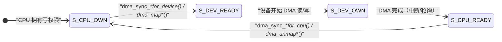
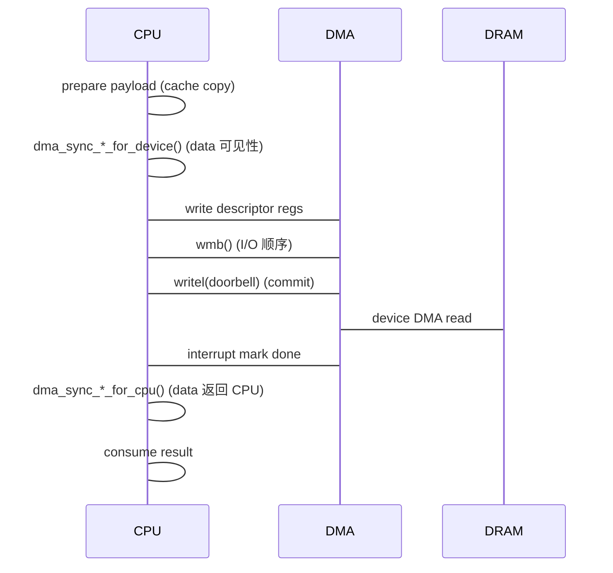
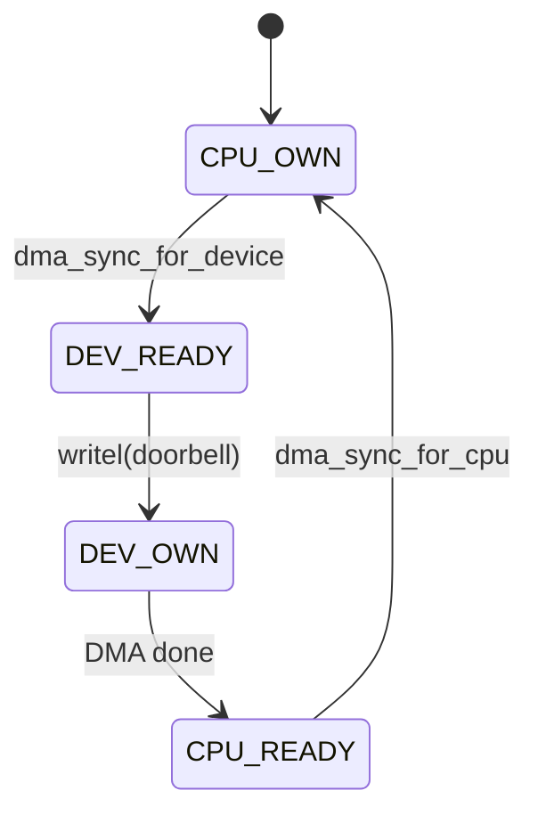
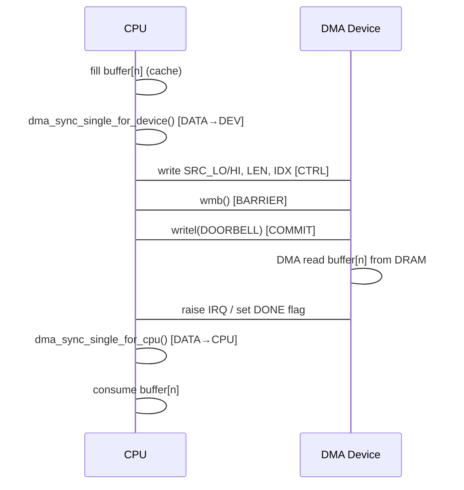

GPT-5 声明：下面开始直接进入 **第26章** 正文。
 （严格按你第23章以来的排版方式、仍采用“三步讲解法”+你固定的章节八步法。
 篇幅巨大 → 本回复仅输出 **26.1（引入 + 章节内容说明）**，到“八步法 step1 是什么/历史定位”为止。
 下一条我继续 26.2。）

------

# 第26章　DMA 与缓存一致性（map/unmap/sync、门铃顺序）

> 本章节围绕 **CPU ↔ DMA device** 之间最硬核的一致性语义。
>  它不是“哪句 API 会 flush cache”这么浅层，而是：**DMA 是另一条访存路径**，它绕过 CPU cache，所以**语义基础不在“cache flush”层面，而在“共享内存一致性契约”层面**。

## 章节内容说明

| 本章问题域                 | 精确描述                                                     |
| -------------------------- | ------------------------------------------------------------ |
| DMA 是什么问题？           | device 通过 **独立互联 + bus master** 访问 DRAM，而不是 MMIO 的“寄存器APIs读写”。 |
| 为什么容易错？             | 因为 CPU cache 不是“DRAM 缓冲”，它是**另一个副本**；设备不会看见 CPU cache 内容。 |
| 本章核心任务               | 把“DMA = 第 2 条访存路径”→归结到“map/unmap/sync 不是 API，而是语义边界”。 |
| 汽车刹车线索（埋到第29章） | “门铃寄存器写入顺序”不是 I/O 顺序问题，而是“提交点”。        |

> 你现在开始必须抛弃那种“同步 = flush cache” 的中等水平叙事。
>  在 Linux DMA 中：“flush”根本不是语义主语；**语义主语一直是：DMA buffer 是否对另一访存路径可见。**

------

## 26.1　step1：是什么（历史渊源、定位）

> DMA 的本体不是“搬数据的加速器”。
>  DMA 的本体：**非 CPU 访存路径**。
>  它打破了“CPU cache 是唯一的最新 copy”这种朴素模型。

### 历史时间轴（严格语义）

| 阶段                                | 解决的问题                                 | 新问题                                      |
| ----------------------------------- | ------------------------------------------ | ------------------------------------------- |
| 单核 + 没 Cache                     | MMIO 寄存器写入 → device 直读 DRAM         | 没有一致性问题                              |
| 有 Cache                            | DRAM 不再是“唯一 copy”                     | device 看到的是旧的 DRAM copy               |
| DMA 出现                            | device 可以直接 bus master read/write DRAM | “CPU copy vs device copy”分叉彻底成现实问题 |
| IOMMU + cache coherent interconnect | 部分 SoC 能自动 snoop                      | 不是 universal，不可假定                    |

> 所以本章**不是**在解释“Linux 如何 flush”，而是解释：
>  Linux 如何在**两个访存主体（CPU / device）**之间设立“可见性边界”。

### 结论（必须从一开始就钉死）

> DMA 缓冲区不是“malloc → 用就行”。
>  DMA 缓冲区必须是 **按照“访存路径可见性区段”** 来管理的。
>  map / unmap / sync 是**语义断点**：
>  每次调用 = 改变“谁可以读/写 + 哪一份 copy 是 valid”。


------

## 26.2　step2：干什么（要解决的问题）

> 这一节必须把“dma_map/unmap/sync”从“API 操作”提升为“**语义开关**”。

DMA 世界里的问题不是“flush cache”，
 而是 —— **在某一段时间里，谁是该 buffer 的“有效持有者”**。

| 时间段                         | 谁能写入 | 哪份 copy 有效      | Linux 在这段边界上提供什么语义 API         |
| ------------------------------ | -------- | ------------------- | ------------------------------------------ |
| CPU 准备写入数据，设备还不能读 | CPU      | CPU cache copy      | `dma_sync_*_for_cpu()`                     |
| CPU 准备把数据交给设备         | device   | DRAM copy           | `dma_sync_*_for_device()` 或 `dma_map_*()` |
| 设备执行 DMA 向 DRAM 写入      | device   | DRAM copy（设备写） | 设备 → DRAM（不经过 CPU cache）            |
| DMA 完毕，CPU 即将读           | CPU      | DRAM copy           | `dma_sync_*_for_cpu()`                     |
| 生命周期结束 / 调度出局        | nobody   | 释放                | `dma_unmap_*()` / `dma_free_*()`           |

> 换句话说：
>  **map / sync** = “改变谁拥有**可见性支配权**”
>  **unmap** = “结束这段 DMA 会话 contract，资源边界收回”。

这不是“flush policy”，而是“**ownership protocol**”。

------

### 解决的核心问题 = “设备读/写权限边界”

DMA sync API 的语义不是“cache flush”，
 而是 —— **让对方访存路径能看见一个一致的 copy**。

| 行为            | 语义事件                               | 不是                     |
| --------------- | -------------------------------------- | ------------------------ |
| sync_for_device | CPU relinquish → 设备从此刻起能安全读  | “我刚 flush 了一下”      |
| sync_for_cpu    | 设备 relinquish → CPU 从此刻起能安全读 | “我刚 invalidate 了一下” |

> 如果你不调用 sync for device → 设备读的可能是旧的 DRAM copy
>  如果你不调用 sync for CPU → CPU会读到 cache 里旧 copy

这就是**能力边界**，不是“性能调优”。

------

### 为什么 unmap 是**语义断点**

`dma_unmap_*()` = 声明“这一段 DMA 会话结束”。

> unmap 之后再写 doorbell（门铃 MMIO） =
>  向设备发出“数据提交完成”的**commit**。

如果 doorbell 在 unmap 之前写 → **竞态**：

- 设备收到 doorbell → 立即从 DRAM 读数据
- 但 CPU 还没 unmap/sync → DRAM copy 可能还是旧的

> 这不是“慢 or 快”问题，这是**错误**。

DMA 门铃顺序必须：

```
sync_for_device / map
↓
unmap
↓
writel(doorbell)
```

> 门铃是确认点（commit point）。
>  unmap 是前置条件。

------

### devres 版本：为什么存在 & 差异

| API                       | devres 版本                | 作用差异（严格语义）                                        |
| ------------------------- | -------------------------- | ----------------------------------------------------------- |
| `dma_alloc_coherent()`    | `dmam_alloc_coherent()`    | buffer 生命周期与 device 生命周期绑定，remove 自动 free     |
| `dma_alloc_noncoherent()` | `dmam_alloc_noncoherent()` | 但 noncoherent 仍然需要 sync 边界，不因 devres 自动化而消失 |
| `dma_free_*`              | devres 版不用显式 free     | devres 只自动 free，不自动 sync                             |

> **devres 只解放资源收尾，不解放“语义断点”责任**。
>  sync/unmap sequence 仍然必须由开发者编排。


------

## 26.3　step3：怎么实现（底层原理、处理逻辑）

### 26.3-A　Coherent DMA 的语义与实现基线

**结论先行（严格语义）：**

1. **coherent** 指该区域在 **CPU 与设备的访存路径上“天然保持一致”**。
   - 典型由互联/缓存子系统负责（如 ACE/CHI snoop、CCI 等），并非 Linux 驱动自己“刷缓存”做到。
2. `dma_alloc_coherent()` / `dmam_alloc_coherent()` 返回的区域：
   - CPU 读写 **无需** `dma_sync_*`；设备 DMA 读写与 CPU 视图一致。
   - 但**门铃顺序仍然存在**：提交数据给设备时仍需 **先完成数据可见性，再写 doorbell**（第 26.6 将集中论述）。
3. coherent 只在该 **buffer** 范围内成立。对非该区域的普通内存或 noncoherent buffer，仍需 `map/sync/unmap`。

**实现要点：**

- 体系结构层面的 Cache Coherent Interconnect 保证 **对该区域** 的 load/store 与 DMA 写读能互相观测；
- 平台代码（arch/plat-dma）导出 `dma_is_coherent(dev)` 等能力 → 决定 `dma_map_ops` 选择；
- 一旦 coherent，map/sync 路径退化为地址转换与域检查，不再执行“flush/invalidate”。

**最小用法（控制面仍要正确放置 doorbell）：**

```c
/* coherent buffer：生命周期与 device 绑定可用 devres */
struct my_dev {
    void 		*cpu_addr;
    dma_addr_t 	dma_addr;
    size_t 		len;
};

static int my_probe(struct platform_device *pdev)
{
    struct device *dev = &pdev->dev;
    struct my_dev *m = devm_kzalloc(dev, sizeof(*m), GFP_KERNEL);
    if (!m) return -ENOMEM;

    m->len = SZ_64K;
    m->cpu_addr = dmam_alloc_coherent(dev, m->len, &m->dma_addr, GFP_KERNEL);
    if (!m->cpu_addr) return -ENOMEM;

    /* CPU 直接写 payload（coherent 区域无需 sync） */
    prepare_payload(m->cpu_addr, m->len);

    /* 提交：仍需“可见性→门铃”顺序。coherent 场景下无需 sync，但门铃是提交点 */
    writel_relaxed(lower_32_bits(m->dma_addr), regs + SRC_LO);
    writel_relaxed(upper_32_bits(m->dma_addr), regs + SRC_HI);
    wmb(); /* [CHECK] 保证前述寄存器写先于 doorbell 可见（第15章细讲 I/O 顺序） */
    writel(DOORBELL_KICK, regs + DOORBELL);
    return 0;
}
```

> [INV] coherent ≠ “免一切顺序”，只是免除了 **CPU↔设备** 的数据副本同步；**MMIO 门铃的提交顺序仍需遵守**。

------

### 26.3-B　Noncoherent + `map/sync/unmap` 状态机

**核心抽象**：noncoherent buffer 的“有效副本”会在 **CPU cache** 与 **DRAM** 两处切换。
 Linux 以 **状态机** 方式控制“读写所有权”与“哪份 copy 有效”。

#### 1）状态机（从 CPU→设备→CPU 的常见闭环）



- **S_CPU_OWN**：CPU 可修改；有效 copy 在 **CPU cache**。
   → 设备不可读（或读到旧 DRAM）。
- **S_DEV_READY**：通过 `dma_sync_*_for_device()` 或 `dma_map_*()` 把有效 copy 迁至 **DRAM**，设备将要读。
- **S_DEV_OWN**：设备进行 DMA；CPU 不得触碰该区数据面（除非确知只读且协议许可）。
- **S_CPU_READY**：DMA 完毕；通过 `dma_sync_*_for_cpu()` 使 **CPU 视图** 获得最新（失效旧 cache 或回填）。
- 回到 **S_CPU_OWN**，进入下一轮。

> [INV] `map_*()` 常用于 **一次性/流式（streaming）** 传输起始；`sync_*()` 常用于 **分段/重复** 边界。
>  [MIX] 同一块 noncoherent buffer 可以在多轮 DMA 中复用：使用 `sync_for_device` / `sync_for_cpu` 形成短边界，减少反复 map/unmap 的开销。

#### 2）API 与方向（读/写语义）

- **设备读**（CPU→设备）：
  - `dma_map_single(dev, cpu_addr, len, DMA_TO_DEVICE)`
  - 或对已映射区域：`dma_sync_single_for_device(dev, dma_addr, len, DMA_TO_DEVICE)`
  - 语义：把 **CPU cache** 的最新数据推到 **DRAM**，设备随后从 DRAM 读。
- **设备写**（设备→CPU）：
  - `dma_map_single(dev, cpu_addr, len, DMA_FROM_DEVICE)`
  - 或 `dma_sync_single_for_cpu(dev, dma_addr, len, DMA_FROM_DEVICE)`
  - 语义：设备把数据写到 **DRAM**，返回 CPU 前需让 **CPU cache** 失效/获取最新。

> [PIT] 方向参数错误会导致“写不见/读到旧值”。**严格按数据流方向传递 `DMA_TO_DEVICE` / `DMA_FROM_DEVICE`。**

#### 3）门铃顺序（noncoherent 必须遵守）

典型提交序：

```
/* CPU 已写好 payload 于 cache */
dma_sync_*_for_device(..., DMA_TO_DEVICE);  // 让 DRAM 拥有最新 copy
program_dma_descriptors();                   // 写源/目的描述符
wmb();                                       // [CHECK] 描述符可见性 → 门铃前序保障
writel(DOORBELL_KICK, regs + DOORBELL);     // 提交点
```

DMA 完成后，CPU 读取结果前序：

```
readl(STATUS);                   // 等待 DMA 完成条件成立（或中断路径中）
dma_sync_*_for_cpu(..., DMA_FROM_DEVICE); // 让 CPU 视图获得最新 copy
consume_results();
```

> [CHECK] **门铃必须在 sync_for_device 之后**；完成后 **先确认 DMA 完成，再 sync_for_cpu**。

#### 4）devres 与 streaming 映射

- `dmam_alloc_noncoherent()`：只解决 **生命周期自动回收**；不会自动插入任何 sync。
- `devm_dma_map_*()`（部分平台/辅助封装）：自动 unmap，但**不会**插入正确的 **sync/doorbell** 序列。

> [PIT] 把 devres 当“自动正确的同步器”是常见误解。**资源与语义分离**。

------

### 26.3-C　IOMMU / ATS / SMMU 与一致性层级

> 目的：把“地址转换 / 访问隔离 / 一致性”三个维度对齐，避免混用概念。

| 层级                                | 关注点                              | 解决什么                                      | 不能解决什么            | 与 DMA 一致性的关系                |
| ----------------------------------- | ----------------------------------- | --------------------------------------------- | ----------------------- | ---------------------------------- |
| IOMMU（SMMU）                       | 设备侧虚拟地址→物理地址映射；域隔离 | 防越界、共享缓冲的隔离/保护；简化驱动地址管理 | 不自动提供 cache 一致性 | 仅参与 **地址**，不等于 coherent   |
| ATS（Address Translation Service）  | 设备缓存地址转换结果                | 降低 IOMMU 往返延迟                           | 不改变数据一致性        | 与一致性正交；改善性能             |
| Coherent Interconnect（ACE/CHI 等） | 对数据 cache 的嗅探/一致性          | 使 **数据副本** 保持一致                      | 不负责安全隔离          | **这层决定“coherent DMA”是否成立** |

**驱动侧实践结论：**

- 是否需要 `sync_*` **只由“该 buffer 是否 coherent”决定**，与是否启用 IOMMU 无直接必然关系；
- 使用 IOMMU 时，`dma_map_*()` 仍是 **语义断点**：建立设备可见的地址与边界；
- ATS 只是优化路径，不改变 `map/sync/unmap` 的必要性判断。

------

## 26.3 小结与三张表（本章工作版）

> 这是后续“固定三表”的工作版草案，本章末（26.8）给出定稿版。

### 表1（概念区分表 · 工作版）

| 概念               | 定义                           | 是否影响 sync 必要性 |
| ------------------ | ------------------------------ | -------------------- |
| coherent buffer    | CPU/设备对该区天然一致         | 否（但门铃顺序仍需） |
| noncoherent buffer | CPU cache 与 DRAM 需切换有效性 | 是                   |
| IOMMU              | 设备地址翻译与隔离             | 否（独立维度）       |
| ATS                | 设备缓存地址翻译条目           | 否（独立维度）       |

### 表2（用法速览表 · 工作版）

| 场景                               | 推荐 API/顺序                                                |
| ---------------------------------- | ------------------------------------------------------------ |
| 设备读（CPU→DEV，noncoherent）     | `sync_for_device` → 配置描述符 → `wmb()` → `writel(doorbell)` |
| 设备写（DEV→CPU，noncoherent）     | 等待完成 → `sync_for_cpu` → 消费数据                         |
| coherent 单次提交                  | 配置描述符 → `wmb()` → `writel(doorbell)`                    |
| 循环复用同一 buffer（noncoherent） | 每轮：`sync_for_device` / 结束：`sync_for_cpu`，必要时保留映射避免反复 map/unmap |

### 表3（核对表 · 工作版）

- [CHECK] 你能在代码中**指出**每个 **语义断点**（map/sync/unmap/doorbell）吗？
- [CHECK] 对每段 DMA，是否**明确方向**（`DMA_TO_DEVICE` / `DMA_FROM_DEVICE`）？
- [CHECK] coherent 与 noncoherent 的判定依据是否来自 **平台能力**（而非主观猜测）？
- [CHECK] `wmb()` / `readl()/writel()` 的放置是否与 **提交点** 搭配正确（参考第15章 I/O 顺序）？
- [CHECK] devres 仅用于 **资源回收**，未被误用为“自动同步器”？


------

## 26.4　step4：怎么用（方法与步骤）

> 现在进入“实操写法”。
>  每一步必须明确：**这是 data 可见性语义** 还是 **这是 control commit → doorbell**。

我们分别给出 **noncoherent** 与 **coherent** 两类（注意：coherent 只免掉 data 可见性 sync，不免掉 commit/doorbell 顺序）。

------

### 26.4.1 Streaming：一次性 DMA 输出，noncoherent buffer

**时序（非转义 mermaid）**



**对应代码（简化，可编译骨架，含 devres）**：

```c
void send_once(struct device *dev, void *cpu_addr, dma_addr_t dma_addr, size_t len)
{
    /* 1) payload in CPU cache */
    prepare_payload(cpu_addr, len);

    /* 2) data 可见性到 DRAM */
    dma_sync_single_for_device(dev, dma_addr, len, DMA_TO_DEVICE);

    /* 3) 控制面：描述符 */
    writel_relaxed(lower_32_bits(dma_addr), regs + SRC_LO);
    writel_relaxed(upper_32_bits(dma_addr), regs + SRC_HI);

    /* 4) I/O 顺序隔断 */
    wmb();

    /* 5) commit：doorbell */
    writel(DOORBELL_KICK, regs + DOORBELL);
}
```

**DMA 完成回调**：

```c
void irq_done(struct device *dev, dma_addr_t dma_addr, size_t len)
{
    dma_sync_single_for_cpu(dev, dma_addr, len, DMA_FROM_DEVICE);
    consume_result();
}
```

要点：

- `sync_for_device` = 数据移交
- writel doorbell = commit
   这是永远不会合并成“单条原子语义”的 **两个不同 contract**

------

### 26.4.2 Streaming：一次性 DMA 输出，coherent buffer

变化只有一条：

> 不需要 `dma_sync_*_for_device()`
>  其它完全不变

```c
prepare_payload(coherent_buf, len);

writel_relaxed(lower_32_bits(dma_addr), regs + SRC_LO);
writel_relaxed(upper_32_bits(dma_addr), regs + SRC_HI);

wmb();
writel(DOORBELL_KICK, regs + DOORBELL);
```

**coherent 只影响 data 可见性
 不影响 commit/doorbell**

------

### 26.4.3 Ring buffer（可循环复用，noncoherent buffer）

> Streaming = map/unmap 一次就结束
>  Ring buffer = 一个映射，多轮 sync_for_device / sync_for_cpu 循环切换 ownership

**状态机**



**代码骨架**：

```c
/* 已有持久映射，不每轮 unmap */

/* CPU 写第 n 段 */
prepare_payload(cpu_buf[n], len);

/* 交给设备 */
dma_sync_single_for_device(dev, dma_addr[n], len, DMA_TO_DEVICE);

/* 配置 ptr, doorbell */
program_desc(n);
wmb();
kick(n);

/* DMA 完成后 */
dma_sync_single_for_cpu(dev, dma_addr[n], len, DMA_FROM_DEVICE);
consume(n);
```

> Ring buffer 的本质不是“多次 map”
>  而是“多次 ownership flip”


------

## 26.5　step5：通用接口/工具方法表与逐步详解

### 26.5.1 方向判定表（DMA_TO_DEVICE / DMA_FROM_DEVICE / DMA_BIDIRECTIONAL）

| 数据流向（语义）                       | 设备行为   | CPU 行为         | `map/sync` 方向     | 说明                                                    |
| -------------------------------------- | ---------- | ---------------- | ------------------- | ------------------------------------------------------- |
| CPU → 设备（设备读源数据）             | 从 DRAM 读 | 预先产生 payload | `DMA_TO_DEVICE`     | 提交前 `sync_for_device`，完成后通常无需 `sync_for_cpu` |
| 设备 → CPU（设备写结果）               | 向 DRAM 写 | 读取结果         | `DMA_FROM_DEVICE`   | 完成后 **必须** `sync_for_cpu` 再读                     |
| 双向复用同一缓冲（同一轮既被读也被写） | 读+写      | 读+写            | `DMA_BIDIRECTIONAL` | 谨慎使用；多数场景拆分成两个单向更清晰                  |
| 只做地址传递（设备永不触碰）           | 不访问     | 普通内存         | ——                  | 不要 map；传错方向将导致无谓的维护与风险                |

> [CHECK] 一律按**设备对该缓冲的访问方向**判定，而不是按“CPU 准备干什么”判定。

------

### 26.5.2 基础 API 速查表（noncoherent 常用）

| 类别             | API                                                   | 作用                                          | 返回/参数要点                | 常见坑                                                     |
| ---------------- | ----------------------------------------------------- | --------------------------------------------- | ---------------------------- | ---------------------------------------------------------- |
| 单段映射         | `dma_map_single(dev, cpu_addr, len, dir)`             | 建立设备可见地址，隐含同步到 dir 所需的可见性 | 返回 `dma_addr_t`            | `cpu_addr` 必须来自普通内存/一致性区域，且**自然对齐**更佳 |
| 单段反映射       | `dma_unmap_single(dev, dma_addr, len, dir)`           | 结束这段会话                                  | ——                           | unmap 后设备不可再访问；门铃必须在 unmap 之后              |
| 同步（已映射）   | `dma_sync_single_for_device(dev, dma_addr, len, dir)` | 把可见性切给设备                              | ——                           | 常与 ring-buffer 循环使用                                  |
| 同步（设备→CPU） | `dma_sync_single_for_cpu(dev, dma_addr, len, dir)`    | 把可见性切给 CPU                              | ——                           | 读取结果前必做                                             |
| 多段 sg          | `dma_map_sg(dev, sgl, nents, dir)`                    | 批量建立映射                                  | 返回实际映射段数（可能合并） | **必须用**返回的段数继续提交                               |
| 多段 sg 反映射   | `dma_unmap_sg(dev, sgl, nents, dir)`                  | 批量结束映射                                  | ——                           | `nents` 用**原始**传入值                                   |
| 同步 sg（设备）  | `dma_sync_sg_for_device(dev, sgl, nents, dir)`        | 批量切给设备                                  | ——                           | 仍使用原始 `nents`                                         |
| 同步 sg（CPU）   | `dma_sync_sg_for_cpu(dev, sgl, nents, dir)`           | 批量切给 CPU                                  | ——                           | ——                                                         |
| 页映射           | `dma_map_page(dev, page, offset, size, dir)`          | 将页的子区映射                                | 返回 `dma_addr_t`            | 适合高阶页或 `alloc_pages`                                 |
| 物理资源         | `dma_map_resource(dev, phys_addr, size, dir, attrs)`  | 把设备内存/外设内存映射为 DMA 源/目的         | 返回 `dma_addr_t`            | 避开 cache，一般只在特殊外设 RAM 使用                      |

> [PIT] `dma_mapping_error(dev, dma_addr)` **立即检查**；失败后不可继续提交门铃。
>  [PIT] `writel()` 只是写寄存器，不会替你做 cache 语义。

------

### 26.5.3 coherent / noncoherent 与分配/释放

| 需求                        | 非 devres                                            | devres（推荐）                                         | 语义                                              |
| --------------------------- | ---------------------------------------------------- | ------------------------------------------------------ | ------------------------------------------------- |
| 一致性缓冲（coherent）      | `dma_alloc_coherent()` / `dma_free_coherent()`       | `dmam_alloc_coherent()`（probe 分配，remove 自动回收） | 区域内天然一致，不需要 `sync_*`；**仍需**门铃顺序 |
| 非一致性缓冲（noncoherent） | `dma_alloc_noncoherent()` / `dma_free_noncoherent()` | `dmam_alloc_noncoherent()`                             | 需要 `map/sync/unmap` 控制可见性                  |
| 设定掩码                    | `dma_set_mask_and_coherent(dev, DMA_BIT_MASK(n))`    | ——                                                     | 在 probe 早期设置；失败则降级或报错               |
| 方向未知大缓冲              | ——                                                   | ——                                                     | 不要赌“coherent 就安全”；根据真实方向选用 API     |

> [INV] devres 只解决**资源释放**，不自动插入任何 `sync`/顺序语义。

------

### 26.5.4 sg / sgtable 模板

**提交前置：构建 sg**

```c
struct scatterlist sgl[MAX_SEGS];
sg_init_table(sgl, MAX_SEGS);
/* 填充每段： */
sg_set_page(&sgl[i], page, len, offset);
/* 最后： */
int mapped = dma_map_sg(dev, sgl, nr_segs, DMA_TO_DEVICE);
if (mapped <= 0) return -EIO;  // 必查
```

**迭代写描述符（只能用 mapped 段数）**

```c
struct scatterlist *sg;
int i = 0;
for_each_sg(sgl, sg, mapped, i) {
    dma_addr_t addr = sg_dma_address(sg);
    unsigned int len = sg_dma_len(sg);
    program_desc(addr, len);
}
wmb();
writel(DOORBELL_KICK, regs + DOORBELL);
```

**完成后反映射**

```c
dma_unmap_sg(dev, sgl, nr_segs, DMA_TO_DEVICE);
```

> [PIT] **不要**在反映射时使用 `mapped`；`dma_unmap_sg()` 要用**原始** `nr_segs`。
>  [PIT] 映射失败后**必须**回滚（不写门铃）。

**同步式复用（ring-buffer + sg）**

- 先 `dma_map_sg()` 一次；
- 每轮 `dma_sync_sg_for_device()` / 完成后 `dma_sync_sg_for_cpu()`；
- 仅在释放/停机时 `dma_unmap_sg()`。

------

### 26.5.5 dmaengine 简明对照（不代替 map/sync；它是“通道调度层”）

| 概念                                                         | 作用          | 典型调用                                     | 与本章语义关系                        |
| ------------------------------------------------------------ | ------------- | -------------------------------------------- | ------------------------------------- |
| `dma_request_chan(dev, "rx"/"tx")`                           | 申请 DMA 通道 | `dma_request_chan` / `devm_dma_request_chan` | 资源管理；不处理 cache 一致性         |
| `dmaengine_prep_slave_single(chan, dma_addr, len, dir, flags)` | 构造一次传输  | 返回 `dma_async_tx_descriptor *`             | `dir` 仍按 **设备访问方向** 填        |
| `dmaengine_prep_slave_sg(chan, sgl, mapped, dir, flags)`     | sg 传输       | ——                                           | `mapped` 段数由 `dma_map_sg` 决定     |
| `tx_submit(desc)` + `dma_async_issue_pending(chan)`          | 提交          | 形成队列                                     | 提交前依旧需要 **data 可见性** 已就绪 |
| 回调                                                         | 标记完成      | 在回调里做 `sync_for_cpu` + 消费             | **完成→sync_for_cpu→使用** 的固定顺序 |

> [CHECK] 使用 dmaengine 并不自动插入 `dma_sync_*`；你仍负责 **map/sync/unmap** 与 **门铃/屏障** 的放置。

------

### 26.5.6 屏障与门铃顺序（固定放置点）

| 位置                           | 必要性 | 典型指令                   | 说明                                      |
| ------------------------------ | ------ | -------------------------- | ----------------------------------------- |
| 写完描述符/指针前 → 提交门铃前 | 必要   | `wmb()`                    | 确保描述符写入对设备可见，再触发 doorbell |
| 读状态寄存器前（设备写回后）   | 依设备 | `rmb()`/次序化的 `readl()` | 避免乱序读取旧状态                        |
| CPU 读回结果前                 | 必要   | `dma_sync_*_for_cpu()`     | 获取设备写入的最新数据                    |
| 停机/释放前                    | 必要   | `dma_unmap_*()`            | 结束会话，撤销设备访问权                  |

> 顺序记忆法：**数据可见性→（配置）→屏障→门铃；完成→确认→sync_for_cpu→使用**。

------

### 26.5.7 典型探测/移除流程骨架（含能力检测）

```c
static int my_probe(struct platform_device *pdev)
{
    struct device *dev = &pdev->dev;
    int ret;

    /* 1) 地址掩码能力 */
    ret = dma_set_mask_and_coherent(dev, DMA_BIT_MASK(36));
    if (ret) return ret;

    /* 2) coherent or not?（由平台决定） */
    bool coh = dma_is_coherent(dev);

    /* 3) 分配缓冲（示例：coherent） */
    void *cpu;
    dma_addr_t dma;
    size_t len = SZ_64K;
    cpu = dmam_alloc_coherent(dev, len, &dma, GFP_KERNEL);
    if (!cpu) return -ENOMEM;

    /* 4) …映射寄存器、申请中断、申请 DMA 通道（如用 dmaengine） */

    return 0;
}

static int my_remove(struct platform_device *pdev)
{
    /* devres 自动回收：coherent/noncoherent 缓冲、irq、clk、通道等 */
    return 0;
}
```

------

### 26.5.8 常见坑清单（PIT）

- 把 **coherent** 当作“可以不讲顺序”——错误。它只免 **data 可见性 sync**，**不免** 门铃/屏障。
- `dma_unmap_sg()` 用了 `mapped`——错误，必须用原始 `nents`。
- `DMA_TO_DEVICE`/`DMA_FROM_DEVICE` 填反：
  - 设备读源 → `DMA_TO_DEVICE`
  - 设备写目 → `DMA_FROM_DEVICE`
- `map` 失败未检查就提交门铃——严重错误。
- `writel(doorbell)` 放在 `sync_for_device` 前——竞态。
- 忘了 `dma_set_mask_and_coherent()`：大缓冲越过设备寻址能力后莫名失败/静默截断。
- 在回调里未做 `sync_for_cpu` 就读结果——读到旧值。
- 把 devres 当“自动同步器”——误解；它只做 **free**，不做 **sync**/**顺序**。

------

### 26.5.9 最小对照：devres vs 非 devres

| 能力点             | 非 devres                                      | devres                                 | 谁负责同步/顺序                  |
| ------------------ | ---------------------------------------------- | -------------------------------------- | -------------------------------- |
| coherent buffer    | `dma_alloc_coherent`/`dma_free_coherent`       | `dmam_alloc_coherent`                  | 开发者：门铃/屏障                |
| noncoherent buffer | `dma_alloc_noncoherent`/`dma_free_noncoherent` | `dmam_alloc_noncoherent`               | 开发者：map/sync/unmap+门铃/屏障 |
| DMA 通道           | `dma_request_chan`/`dma_release_channel`       | `devm_dma_request_chan`                | 开发者：提交前后时序             |
| ioremap            | `ioremap`/`iounmap`                            | `devm_ioremap`/`devm_ioremap_resource` | 开发者：MMIO 访问次序            |

------

**本节小结**

- 方向先行：以“设备如何访问缓冲”为唯一准绳。
- map/sync/unmap 是**语义断点**；门铃是**提交点**；屏障是**提交点前的次序化**。
- devres 只做生命周期收尾，不插手语义。


------

## 26.6　step6：对比 / 避坑 / 限制 / 注意点

### 26.6.1 语义等价改写表（coherent vs noncoherent）

| 项目                     | coherent 区域 写法                                          | noncoherent 区域 写法          | 语义本体         |
| ------------------------ | ----------------------------------------------------------- | ------------------------------ | ---------------- |
| 提交前 data 可见性       | **无需** `sync_for_device`                                  | `dma_sync_*_for_device()`      | 数据副本一致性   |
| DMA 完成后 data 返回 CPU | **无需** `sync_for_cpu`                                     | `dma_sync_*_for_cpu()`         | 数据副本一致性   |
| 门铃/屏障                | **完全相同**                                                | **完全相同**                   | 控制面提交顺序   |
| map/unmap                | `dmam_alloc_coherent` 即是 coherent pool 分配；无 map/unmap | `dma_map*/dma_unmap*` 控制会话 | “可否映射”的边界 |

=> coherent 只削掉“副本迁移”这一半；
 **不削掉** “控制提交点” 这一半。

------

### 26.6.2 门铃前屏障：怎么选

| 问题                                       | 正确放置                           | 错误示例                                    |
| ------------------------------------------ | ---------------------------------- | ------------------------------------------- |
| 设备看见描述符必须发生在看到 doorbell 之前 | `wmb()` 放在 writel(doorbell) 之前 | “我 MMIO 是天然强序 → 不用 wmb”这种主观假定 |
| SMP + relaxed I/O                          | `wmb()` 仍然必须                   | “用了 writel() 就已经强序”这种猜想不成立    |
| 破环：描述符写入回绕 ring buffer           | `wmb()` 后再写 doorbell            | doorbell 写在 descriptor 写之前 = 直接竞态  |

> 简单记：
>  **doorbell 前必须有 wmb()**
>  ── coherent 与否无关 ——

------

### 26.6.3 relaxed 与非 relaxed 边界

| API              | 是否次序化内存？ | 是否次序化 I/O？     | 是否可以替代 wmb？             |
| ---------------- | ---------------- | -------------------- | ------------------------------ |
| writel()         | yes              | yes                  | 有时可满足，但**不要用做判定** |
| writel_relaxed() | no               | no                   | 绝对不行                       |
| wmb()            | yes              | yes                  | **它是提交点屏障，不可省略**   |
| dma_sync_*       | 只负责副本一致性 | **不**负责 MMIO 顺序 | **不**替代 wmb                 |

> 核心：
>  `dma_sync_*` ≠ I/O order
>  `wmb()` ≠ data sync

两个 domain 永不混合。

------

### 26.6.4 64bit doorbell / descriptor 拆写竞态

如果门铃寄存器是 64bit split 成两个 32bit 写：

```c
writel_relaxed(lo, regs + DB_LO);
writel_relaxed(hi, regs + DB_HI);
wmb();
writel(DOORBELL_FIRE, regs + DB_FIRE);
```

要点：

- `wmb()` 统一约束写完两个半寄存器
- `DOORBELL_FIRE` 是 commit，不是第二半数据

> 不能把 DB_HI 写完就算“doorbell 已发”

------

### 26.6.5 IOMMU ON/OFF 与一致性无关

| 是否启用 IOMMU | 是否改变 sync 需要？ | 解释                   |
| -------------- | -------------------- | ---------------------- |
| ON             | 不改变               | 只是地址翻译 & 域隔离  |
| OFF            | 不改变               | 物理直通，不影响 cache |

> 结论：sync 与 coherent 由 **interconnect 是否具备 cache snoop** 决定，而非 IOMMU。

------

### 26.6.6 外设 SRAM / TCM 不是特权区

很多 SoC 提供 “外设 SRAM / TCM” 用于 DMA：

| 区域实例                        | cacheable?     | sync 规则                  |
| ------------------------------- | -------------- | -------------------------- |
| 内存控制器规则设为 noncacheable | 不走 CPU cache | 可能无需 sync ← 但必须确认 |
| CPU 仍会 cache                  | 会 cache       | 必须 sync                  |

> 判定依据不是“这是 SRAM 看起来像 On-chip 很快”
>  判定依据只有一条：**CPU 是否会 cache 它**。

------

### 26.6.7 三大误解（反例语句）

| 错误直觉                  | 为什么错                                                |
| ------------------------- | ------------------------------------------------------- |
| coherent → 我不用管 wmb   | **wmb 属于 control commit，不属于 data consistency**    |
| IOMMU = 自动 coherent     | **IOMMU 只负责地址翻译**                                |
| dmaengine = 自动 map/sync | **dmaengine 只调度通道，data consistency 仍需驱动负责** |

------

### 26.6.8 总的避坑句型（可打印贴纸）

> coherent 只让“数据同步”自动化，
>  **不让“控制提交次序”自动化**。

> DMA 要解决的是“副本谁 valid”；
>  doorbell 要解决的是“描述符 commit 顺序”。

> 这两个维度永远不可折叠。


------

## 26.7　step7：完整示例与讲解（ring buffer + streaming sync）

### 26.7.1 运行机理时序（非转义 mermaid）



> 记忆锚点：**DATA（可见性切换） → CTRL（寄存器） → BARRIER → COMMIT（门铃） → 完成后 DATA→CPU**。

------

### 26.7.2 设备假设

- 一组寄存器：
  - `SRC_LO`, `SRC_HI`：源地址低/高 32 位
  - `LEN`：本次传输长度
  - `KICK`：写入特定值即 doorbell
  - `STAT`：状态位（BIT0=DMA_DONE）
- 一个中断 `irq` 在完成时触发。
- 设备只做 **设备读（CPU→设备）** 的单向传输（示例聚焦一个方向，便于清晰）。

------

### 26.7.3 关键结构体与常量

```c
// SPDX-License-Identifier: GPL-2.0
#include <linux/module.h>
#include <linux/platform_device.h>
#include <linux/of.h>
#include <linux/io.h>
#include <linux/interrupt.h>
#include <linux/dma-mapping.h>
#include <linux/slab.h>
#include <linux/completion.h>
#include <linux/spinlock.h>

#define R_SRC_LO   0x00
#define R_SRC_HI   0x04
#define R_LEN      0x08
#define R_KICK     0x0C
#define R_STAT     0x10
#define STAT_DONE  BIT(0)
#define KICK_VAL   0x1

#define RB_SZ      8           /* ring 槽位数 */
#define BUF_LEN    4096        /* 每槽长度 */

struct rb_slot {
    void       *cpu;           /* CPU 侧虚拟地址（普通内存） */
    dma_addr_t  dma;           /* 设备可见地址（map_single 返回） */
    size_t      len;
    bool        in_use;        /* 是否提交给设备 */
};

struct leaf_dma {
    void __iomem *regs;
    int irq;
    struct device *dev;

    struct rb_slot ring[RB_SZ];
    unsigned int head;         /* CPU 提交位置 */
    unsigned int tail;         /* 设备完成后可回收位置 */

    spinlock_t lock;           /* 保护 head/tail/in_use 状态 */
    struct completion done;    /* 简化等待演示 */
};
```

------

### 26.7.4 probe：资源、掩码、ring 初始化与**预映射**

> 预映射（`dma_map_single(..., DMA_TO_DEVICE)`）一次；循环中**只做 `dma_sync_\*`** 切换所有权，避免频繁 map/unmap。

```c
static int leaf_probe(struct platform_device *pdev)
{
    struct device *dev = &pdev->dev;
    struct leaf_dma *ld;
    int i, ret;

    ld = devm_kzalloc(dev, sizeof(*ld), GFP_KERNEL);
    if (!ld) return -ENOMEM;
    ld->dev = dev;
    spinlock_init(&ld->lock);
    init_completion(&ld->done);

    /* 地址掩码能力（示例：36bit） */
    ret = dma_set_mask_and_coherent(dev, DMA_BIT_MASK(36));
    if (ret) return ret;

    /* ioremap 设备寄存器 */
    ld->regs = devm_platform_ioremap_resource(pdev, 0);
    if (IS_ERR(ld->regs)) return PTR_ERR(ld->regs);

    /* 申请中断（完成时置位） */
    ld->irq = platform_get_irq(pdev, 0);
    if (ld->irq < 0) return ld->irq;
    ret = devm_request_irq(dev, ld->irq, leaf_irq, 0, dev_name(dev), ld);
    if (ret) return ret;

    /* ring 预分配 + 预映射（普通内存 → 设备可见地址） */
    for (i = 0; i < RB_SZ; i++) {
        struct rb_slot *s = &ld->ring[i];
        s->len = BUF_LEN;
        s->cpu = devm_kmalloc(dev, s->len, GFP_KERNEL);
        if (!s->cpu) return -ENOMEM;

        /* 预映射：建立设备地址（DATA 域的会话起点） */
        s->dma = dma_map_single(dev, s->cpu, s->len, DMA_TO_DEVICE);
        if (dma_mapping_error(dev, s->dma))
            return -EIO;
        s->in_use = false;
    }

    platform_set_drvdata(pdev, ld);
    dev_info(dev, "leaf-dma ready: ring=%d, len=%zu\n", RB_SZ, (size_t)BUF_LEN);
    return 0;
}
```

------

### 26.7.5 IRQ：完成路径（DATA→CPU）

```c
static irqreturn_t leaf_irq(int irq, void *data)
{
    struct leaf_dma *ld = data;
    u32 stat = readl(ld->regs + R_STAT);

    if (!(stat & STAT_DONE))
        return IRQ_NONE;

    /* 清状态：设备约定（若需要） */
    writel(stat, ld->regs + R_STAT);

    /* 将设备刚刚使用完的槽位“交还 CPU” */
    spin_lock(&ld->lock);
    if (ld->ring[ld->tail].in_use) {
        struct rb_slot *s = &ld->ring[ld->tail];

        /* [DATA] DEV→CPU：获得设备写回（若是 FROM_DEVICE 场景）。
         * 本例是 TO_DEVICE（设备读源），通常不需要；留作模板。
         */
        // dma_sync_single_for_cpu(ld->dev, s->dma, s->len, DMA_FROM_DEVICE);

        s->in_use = false;
        ld->tail = (ld->tail + 1) % RB_SZ;
    }
    spin_unlock(&ld->lock);

    complete(&ld->done);
    return IRQ_HANDLED;
}
```

> 本例展示 **TO_DEVICE** 单向；若是 **FROM_DEVICE** 场景，**此处必须做 `dma_sync_single_for_cpu()`** 再读结果数据。

------

### 26.7.6 提交一次：**DATA→DEV → CTRL → BARRIER → COMMIT**

```c
static int leaf_kick_one(struct leaf_dma *ld, const void *src, size_t n)
{
    unsigned long flags;
    struct rb_slot *s;
    u32 lo, hi;

    if (n > BUF_LEN) 
        return -EINVAL;

    spin_lock_irqsave(&ld->lock, flags);

    s = &ld->ring[ld->head];
    if (s->in_use) {
        spin_unlock_irqrestore(&ld->lock, flags);
        return -EAGAIN; /* ring 满 */
    }

    /* 准备 payload（CPU cache 中） */
    memcpy(s->cpu, src, n);
    s->len = n;

    /* [DATA] CPU→DEV：把 cache 最新内容迁移到 DRAM（设备将从 DRAM 读） */
    dma_sync_single_for_device(ld->dev, s->dma, s->len, DMA_TO_DEVICE);

    /* [CTRL] 写描述符/指针 */
    lo = lower_32_bits(s->dma);
    hi = upper_32_bits(s->dma);
    writel_relaxed(lo, ld->regs + R_SRC_LO);
    writel_relaxed(hi, ld->regs + R_SRC_HI);
    writel_relaxed(s->len, ld->regs + R_LEN);

    /* [BARRIER] I/O 顺序：先让上述寄存器写入对设备可见 */
    wmb();

    /* [COMMIT] 门铃：提交点（确认点） */
    writel(KICK_VAL, ld->regs + R_KICK);

    s->in_use = true;
    ld->head = (ld->head + 1) % RB_SZ;
    spin_unlock_irqrestore(&ld->lock, flags);
    return 0;
}
```

> 四步固定范式：
>  **sync_for_device → program descriptors → wmb → writel(doorbell)**。
>  coherent 场景只会**消去第一步**（`sync_for_device`），**后三步完全相同**。

------

### 26.7.7 一个阻塞式“发送多包”的演示入口（可选）

```c
static int leaf_send_loop(struct leaf_dma *ld, const void *buf, size_t n, int times)
{
    int i, ret;

    for (i = 0; i < times; i++) {
        /* 提交；若 ring 满则等待一次完成 */
        while ((ret = leaf_kick_one(ld, buf, n)) == -EAGAIN)
            wait_for_completion_timeout(&ld->done, msecs_to_jiffies(100));

        if (ret) return ret;
    }
    return 0;
}
```

------

### 26.7.8 remove：回收与**反映射**

```c
static int leaf_remove(struct platform_device *pdev)
{
    struct leaf_dma *ld = platform_get_drvdata(pdev);
    int i;

    /* 停机：真实驱动应先发停止命令、屏蔽中断、等待硬件 idle。 */

    /* 反映射所有 ring 槽位（结束会话） */
    for (i = 0; i < RB_SZ; i++) {
        struct rb_slot *s = &ld->ring[i];
        if (s->dma)
            dma_unmap_single(ld->dev, s->dma, s->len, DMA_TO_DEVICE);
    }
    return 0;
}
```

------

### 26.7.9 平台匹配骨架

```c
static const struct of_device_id leaf_of_match[] = {
    { .compatible = "leaf,dma-demo", },
    {}
};
MODULE_DEVICE_TABLE(of, leaf_of_match);

static struct platform_driver leaf_drv = {
    .probe  = leaf_probe,
    .remove = leaf_remove,
    .driver = {
        .name = "leaf-dma-demo",
        .of_match_table = leaf_of_match,
    },
};
module_platform_driver(leaf_drv);

MODULE_LICENSE("GPL");
```

------

### 26.7.10 逐点讲解（把“语义断点”贴在代码上）

- **`dma_map_single`（probe 时）**：为每个槽位建立设备可见地址；这是一段**会话起点**。
  - 若你选择“每轮都 `dma_map_single`”，也成立，但 ring 模式通常**预映射**更省开销。
- **`dma_sync_single_for_device`（提交前）**：**DATA 断点**，把有效副本切给设备路径；如果没做，设备可能读到**旧 DRAM**。
- **`writel_relaxed` 写描述符**：**CTRL**（配置面），不保证次序。
- **`wmb()`**：**BARRIER**，把“配置面”写入对设备可见，**先于**门铃。
- **`writel(KICK)`**：**COMMIT**，告诉硬件“配置就绪，可开始 DMA”。
- **IRQ 回来 → `dma_sync_single_for_cpu`**（仅 DEV→CPU）：把设备写回的数据切回**CPU 视图**。
- **`dma_unmap_single`（remove）**：**会话终结点**，撤销设备访问权。

------

### 26.7.11 coherent 变体（最小改动）

- 若环缓冲改成 **coherent**：把 `kmalloc` → `dmam_alloc_coherent`；**删除** `dma_sync_single_for_device/for_cpu`；其余 **CTRL/BARRIER/COMMIT** 不变。
- 仍需 `wmb()` 与 `writel(KICK)` 的次序：**coherent 只影响 DATA，不影响 CONTROL**。

------

### 26.7.12 自检清单（贴到代码前）

- [CHECK] 你能在代码中**定位**：DATA/CTRL/BARRIER/COMMIT 四个标签吗？
- [CHECK] `DMA_TO_DEVICE`/`DMA_FROM_DEVICE` 是否按**设备视角**填写？
- [CHECK] `dma_mapping_error` 是否检查？失败是否**不写门铃**？
- [CHECK] `wmb()` 是否紧挨门铃之前？
- [CHECK] remove 是否 `dma_unmap_*`（或你选择的对等 unmap）？
- [CHECK] coherent 分配时，是否仅删除 DATA 边界而**保留** CONTROL/BARRIER/COMMIT？


------

## 26.8　step8：总结

### 26.8.1 三个不可折叠的契约（总纲）

1. **DATA 一致性契约（CPU↔设备的数据副本）**

- noncoherent：用 `dma_map_* / dma_sync_* / dma_unmap_*` 切换“哪份副本有效”。
- coherent：该区域天然一致，**仅取消 DATA 同步步骤**。
- 与 IOMMU、dmaengine 无直接因果关系。

1. **CONTROL 配置契约（MMIO 描述符/指针/长度等）**

- `readl/writel/_relaxed` 是对寄存器字段的配置，**与 DATA 同步域正交**。
- 需保证“先描述符、后提交”。

1. **COMMIT 提交契约（门铃/启动位）**

- `wmb()` 在前，`writel(doorbell)` 在后，**门铃即确认点**。
- coherent 与否、是否用 dmaengine，**均不改变**此次序。

> 记忆锚点：**DATA → CONTROL → BARRIER → COMMIT →（完成）→ DATA 回 CPU**。

------

### 26.8.2 一页速查表（终稿）

| 主题                      | 必做                     | 典型 API/指令                            | 说明                        |
| ------------------------- | ------------------------ | ---------------------------------------- | --------------------------- |
| 方向判定                  | 以“设备如何访问缓冲”为准 | `DMA_TO_DEVICE` / `DMA_FROM_DEVICE`      | 别按“CPU 要干什么”来判      |
| DATA：提交前（CPU→设备）  | 切给设备                 | `dma_sync_*_for_device()` 或 `dma_map_*` | coherent 省去此步           |
| CONTROL：配置寄存器       | 写地址/长度等            | `writel_relaxed()`/`writel()`            | 多寄存器时先全写完          |
| BARRIER：提交前屏障       | 次序化 MMIO              | `wmb()`                                  | 统一放在门铃之前            |
| COMMIT：门铃              | 启动 DMA                 | `writel(doorbell)`                       | 提交点/确认点               |
| 完成后的 DATA（设备→CPU） | 切回 CPU                 | `dma_sync_*_for_cpu()`                   | 读结果前必做（FROM_DEVICE） |
| 结束会话                  | 撤销设备访问权           | `dma_unmap_*()`                          | ring 循环可延后至停机       |
| devres                    | 自动回收资源             | `dmam_*` / `devm_*`                      | **不**负责同步/顺序         |

------

### 26.8.3 合法的“简写变体”与“禁配对照”

- **合法简写（coherent 区域）**：
   仅删除 `sync_for_device / sync_for_cpu`，**保留** `wmb()+doorbell`。
- **合法简写（ring 预映射）**：
   启动时 `dma_map_single` 一次；循环中仅 `dma_sync_*` 翻转所有权；停机 `dma_unmap_single`。
- **禁配**：
  - 用 `dma_sync_*` 代替 `wmb()`（错域）。
  - 用 `writel()` 强序替代 `wmb()`（不可移植）。
  - `dma_unmap_sg()` 使用 `mapped` 而非原始 `nents`。
  - map 失败仍写门铃。

------

### 26.8.4 20 行以内：提交函数模板（可直接粘贴）

> 适用于 **noncoherent & DMA_TO_DEVICE**；coherent 时仅去掉第 1 行 `sync_for_device`。

```c
static inline void dma_kick_to_device(struct device *dev,
                                      dma_addr_t dma, size_t len,
                                      void __iomem *regs,
                                      u32 src_lo_off, u32 src_hi_off,
                                      u32 len_off, u32 doorbell_off, u32 kick)
{
    dma_sync_single_for_device(dev, dma, len, DMA_TO_DEVICE);   // DATA→DEV
    writel_relaxed(lower_32_bits(dma), regs + src_lo_off);      // CONTROL
    writel_relaxed(upper_32_bits(dma), regs + src_hi_off);      // CONTROL
    writel_relaxed(len, regs + len_off);                        // CONTROL
    wmb();                                                      // BARRIER
    writel(kick, regs + doorbell_off);                          // COMMIT
}
```

> FROM_DEVICE 场景的对偶模板：完成回调里在读结果前做
>  `dma_sync_single_for_cpu(dev, dma, len, DMA_FROM_DEVICE);`

------

### 26.8.5 本章交付核对表（打印即用）

- [CHECK] 你能在代码中标出 **DATA/CONTROL/BARRIER/COMMIT** 四类语句吗？
- [CHECK] coherent 只取消 DATA 步骤，**未**动 CONTROL/BARRIER/COMMIT。
- [CHECK] `wmb()` 是否紧贴门铃之前？
- [CHECK] `DMA_TO_DEVICE`/`DMA_FROM_DEVICE` 是否按设备视角？
- [CHECK] `dma_mapping_error()` 失败路径是否不写门铃并回滚？
- [CHECK] `dma_unmap_*()` 放在停机/释放阶段是否齐全？
- [CHECK] 使用 `sg` 时，提交用 **mapped 段数**、unmap 用 **原始 nents**。
- [CHECK] devres 仅做资源释放，不被当成“自动同步器”。

------

### 26.8.6 章节收尾

- **DMA ≠ flush 技巧**，而是 **两条访存路径的契约**：DATA（副本一致性）与 CONTROL/COMMIT（提交顺序）。
- coherent 只影响 DATA；**门铃顺序永远独立**。
- 将本章与第15章（I/O 顺序）、第10章（barrier 语义）、第29章（混搭矩阵）一起使用，可覆盖 90% 设备 DMA 场景。

—— **第26章完** ——

## 26.9　本章出现的coherent是啥？

GPT-5 回答：

你这个问题非常关键，而且这个困惑是**所有中级工程师都必踩**的“语义盲点”。

------

### coherent 不是 API

**coherent 是“这个 DMA buffer 拥不拥有硬件层面的 CPU↔设备 cache 一致性”**

它是一个**属性**，不是一个函数。

它回答的是**这个内存区域**有没有“天然一致”能力，而不是“调用哪个 API 才可以一致”。

所以你会看到：

- `dma_sync_for_device()` 是 API
- `dma_sync_for_cpu()` 是 API
- 但**没有** `dma_sync_for_coherent()`
   因为 coherent 根本不是一种 sync 方法
   而是：**这种区域不需要 sync**

------

### Linux 是怎么得知“这个区域 coherent 吗”？

关键判断函数：

```c
bool dma_is_coherent(struct device *dev);
```

这个由平台（arch / interconnect）告诉 kernel。

也就是说 —— coherent 不是由驱动自己决定的
 是**SoC / Interconnect 硬件能力决定的**

你的驱动只是**查**这个能力

例如典型用法：

```c
if (dma_is_coherent(dev))
    pr_info("this DMA region is coherent\n");
```

------

### 那 coherent buffer 从哪里来？

不是“用什么 API 才 coherent”
 而是“这个 API 分配的区域是否 coherent 是由平台决定”

在 Linux 里：

```c
dma_alloc_coherent()
dmam_alloc_coherent()   <-- devres 版本
```

这两个 allocate 的 buffer：
 → **如果平台支持 coherent** → 分配出来就是 coherent 区域
 → 如果平台不支持 coherent → kernel 会额外保证这个区域变成 non-cached mapping（表现结果 = “看起来一致”）

换句话说：

**名字叫 coherent，不是因为函数 flush 了，而是因为 cache 行为被硬件或映射方式保证了**

------

### 所以最终正确理解（精炼一句话）

| 概念        | 本体是？                                         |
| ----------- | ------------------------------------------------ |
| coherent    | “这个 DMA buffer 不需要 sync，有天然一致性”      |
| noncoherent | “这个 DMA buffer 需要 sync 才能切换副本的有效性” |

coherent 不是接口
 coherent 是 DMA buffer 的**一致性能力属性**

API 只是根据属性决定要不要 sync

------

