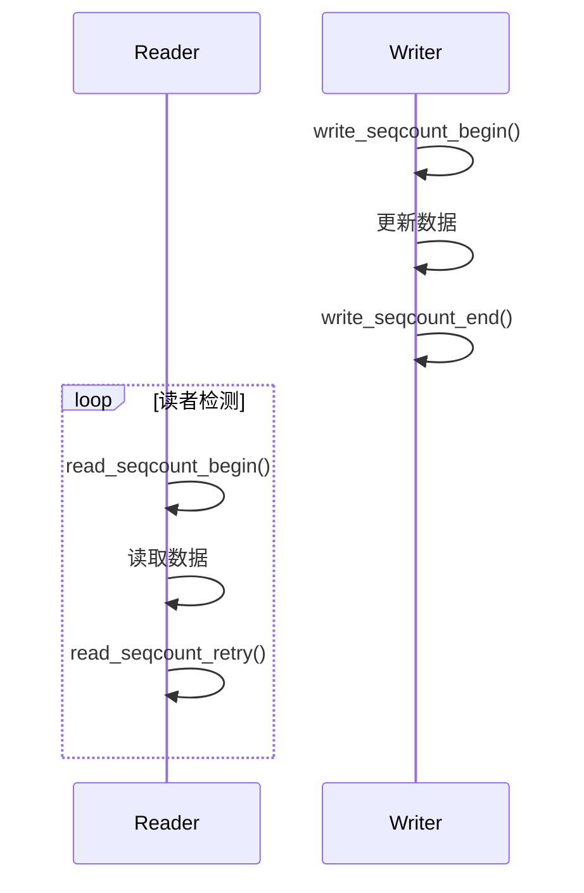
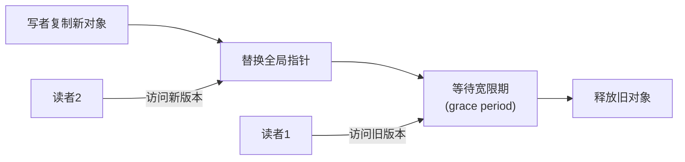

# 第5章_读多写少路线：seqcount/seqlock 与 RCU

------

## 章节内容说明

在上一章中，我们介绍了锁的家族及其分工——从短临界区的自旋锁到可睡眠的互斥锁与信号量。
 然而，当系统进入“读多写少”场景（如状态监控、配置查询、设备表查找）时，传统锁会让大量读者相互阻塞，极大地浪费 CPU 并影响实时性。

本章讨论 Linux 针对该问题提出的两种代表性机制：

- **seqcount / seqlock**：适用于“读可以重试”的高频读场景；
- **RCU（Read-Copy-Update）**：适用于“读侧不能被打断”的场景。

两者共同构成了 Linux 并发控制中的“读多写少”路径。

------

## 5.1_seqcount/seqlock：读可重试的快照机制

### 概念

**seqcount（sequence counter）**是一种单调递增的序列计数器，用于判断读操作是否与写操作重叠。
 **seqlock** 是在 seqcount 外加自旋锁的一种复合形式，用于保护写段。

> 原理：写者递增序号（奇数→偶数），读者检测到读前后序号不同则重读。

------

### 解决了什么问题

- 避免读者阻塞写者：读者无锁读取；
- 保证一致性：通过序列号判断数据是否被修改；
- 写段可短暂锁住数据但不影响读性能。

------

### 带来了什么新问题

| 问题类型             | 描述                                       |
| -------------------- | ------------------------------------------ |
| 读侧可能重试         | 不保证实时一致性                           |
| 写段必须极短         | 否则读者频繁重试                           |
| 不适合可睡环境       | 因为读侧不加锁                             |
| 无法用于复杂依赖关系 | 序列机制只检测“是否变化”，不解决“何时更新” |

------

### 表 5-1_seqcount/seqlock 特征

| 特征         | 值                           |
| ------------ | ---------------------------- |
| 读侧是否加锁 | 否                           |
| 写侧是否加锁 | 是（自旋）                   |
| 是否可睡     | 否                           |
| 典型场景     | 状态读取、时间戳、全局计数器 |
| 错误用法     | 在复杂结构或可睡函数中使用   |

------

### 典型使用逻辑

```c
unsigned seq;
int val;

/* [INV] 读侧逻辑：检测一致性 */
do {
    seq = read_seqcount_begin(&s);
    val = shared_data;
} while (read_seqcount_retry(&s, seq));

/* [INV] 写侧逻辑：持锁更新 */
write_seqcount_begin(&s);
shared_data = new_value;
write_seqcount_end(&s);
```

------

### 图 5-1_seqcount/seqlock 读写时序



------

## 5.2_RCU：读无锁、写延迟回收

### 概念

**RCU（Read-Copy-Update）** 是一种基于“版本复制 + 延迟释放”的同步机制。
 它允许读者在无锁情况下访问共享数据，而写者则在更新时创建副本并在安全时机释放旧版本。

> 关键思想：
>
> - 读者看到的总是稳定的快照；
> - 写者不直接修改原对象，而是“新建 + 替换 + 延迟释放”。

------

### 解决了什么问题

- 提供真正的**无锁读路径**；
- 适用于多核系统中高频查询、链表遍历；
- 在读多写少场景下可显著降低延迟。

------

### 带来了什么新问题

| 问题类型       | 描述                           |
| -------------- | ------------------------------ |
| 旧视图残留     | 写后旧对象可能仍被访问         |
| 回收延迟       | 对象释放需要等待所有读者离开   |
| 引用管理复杂   | 需与 `kref`、`devres` 协同使用 |
| 仅支持简单结构 | 不适合跨对象一致性更新         |

------

### 表 5-2_RCU 特征

| 特征         | 值                             |
| ------------ | ------------------------------ |
| 读侧是否加锁 | 否                             |
| 写侧是否加锁 | 可选（常与 spinlock 结合）     |
| 回收方式     | 延迟（grace period）           |
| 可睡性       | 否（rcu_read_lock 不可睡）     |
| 典型场景     | 链表查找、路由表、全局配置缓存 |

------

### 最小逻辑模板

```c
/* [INV] 读侧 */
rcu_read_lock();
p = rcu_dereference(global_ptr);
/* 使用 p */
rcu_read_unlock();

/* [INV] 写侧 */
new = kmalloc(...);
rcu_assign_pointer(global_ptr, new);
synchronize_rcu();  /* [CHECK] 等待读者退出 */
kfree(old);
```

------

### 图 5-2_RCU 更新流程（复制→替换→回收）



------

## 5.3_seqcount 与 RCU 的取舍

| 维度     | seqcount/seqlock | RCU                  |
| -------- | ---------------- | -------------------- |
| 读路径   | 无锁 + 可重试    | 无锁 + 无重试        |
| 写路径   | 短锁 + 立即生效  | 复制 + 延迟生效      |
| 回收策略 | 不延迟           | 延迟（grace period） |
| 适用场景 | 状态快照、计数器 | 读多写少的数据结构   |
| 可睡性   | 否               | 否                   |
| 典型组合 | 与 spinlock 配合 | 与 kref/devres 配合  |

------

## 5.4_混搭与边界

| 组合              | 结果   | 说明               |
| ----------------- | ------ | ------------------ |
| seqcount + 自旋锁 | ✅ 推荐 | 短锁保护写端       |
| RCU + 自旋锁      | ✅ 常用 | 写端需原子替换     |
| RCU + 互斥锁      | ⚠️ 谨慎 | 回收点可能受阻     |
| seqcount + RCU    | ❌ 禁止 | 双层版本控制易冲突 |
| RCU + 引用计数    | ✅ 推荐 | 可安全延迟回收     |

------

## 5.5_常见坑

| 标识   | 描述                                            |
| ------ | ----------------------------------------------- |
| [PIT1] | 在可睡环境使用 RCU 读锁                         |
| [PIT2] | 写者未调用 `synchronize_rcu()` 导致悬挂指针     |
| [PIT3] | 使用 seqcount 时写段过长                        |
| [PIT4] | 读者未重试导致读到不一致数据                    |
| [PIT5] | 在多核环境下使用普通指针替换 RCU 对象           |
| [PIT6] | 忘记使用 `rcu_dereference()` 导致编译器乱序访问 |

------

## 5.6_最小模板

```c
/* [INV] seqcount 用于短暂数据快照 */
do {
    seq = read_seqcount_begin(&counter);
    snapshot = data;
} while (read_seqcount_retry(&counter, seq));

/* [INV] RCU 用于结构指针替换 */
rcu_read_lock();
ptr = rcu_dereference(g_ptr);
process(ptr);
rcu_read_unlock();

new = alloc_new();
rcu_assign_pointer(g_ptr, new);
synchronize_rcu();  /* [CHECK] 等待所有读者退出 */
free(old);
```

------

### 表 5-3_核对表

| 核对项 [CHECK]                         | 说明                            |
| -------------------------------------- | ------------------------------- |
| 是否区分 seqcount 与 RCU 适用场景？    | seqcount 用于快照，RCU 用于结构 |
| 写者是否确保短临界区？                 | 否则 seqcount 重试过多          |
| 是否正确使用 `synchronize_rcu()`？     | 否则悬挂指针风险                |
| 是否禁止可睡操作？                     | RCU 与 seqcount 均不可睡        |
| 是否保证读者使用 `rcu_dereference()`？ | 防止编译器乱序                  |

------

## 5.7_小结

1. **seqcount/seqlock** 用于读重试式一致性快照；
2. **RCU** 用于无锁读与延迟回收的结构更新；
3. 两者的核心目标都是**在高读负载下维持一致性与低延迟**；
4. 它们代表 Linux 并发控制的“读多写少”路径，为内核表查找与驱动状态缓存奠定基础。

------

**下一章预告**
 第6章将讨论 **CPU↔设备的顺序与一致性**，包括 I/O 寄存器访问的顺序规则、DMA 一致性问题，以及 CPU 与外设之间的可见性与确认点设计。