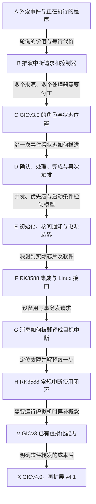

# 第1章\_GIC\_专题建设与阅读路线

## 1.1\_以\_RK3588\_为第一目标\_专题与\_Linux\_IRQ\_分开

本路线组织独立的通用中断控制器（Generic Interrupt Controller，GIC）专题。**先学 RK3588 实际采用的 GIC-600 r1p6 / GICv3.0，再按需要扩展；不从代际比较表开始。** 型号判断、原件版本和页码统一见 [资料索引的证据表](../../reference/external_resources/arm/README.md#1.4.2_型号判断的证据与适用边界)。

这三个名字不是同义词：GICv3.0 是控制器的软件可见规则，GIC-600 是实现规则的硬件设计，RK3588 是集成该设计的芯片。第一章需要从“程序在处理器上执行，外设在另一处产生事件”开始，再引出处理器核、芯片、架构、实现和软件驱动之间的关系，不能把这张分类表当成读者已经懂得的前提。

Linux 的中断请求（Interrupt Request，IRQ）管理专题继续解释软件对象、映射、分派和驱动接口。GIC 专题解释控制器硬件以及软件对它的编程。交叉点复用 [现有中断专题的分工入口](../../knowledge/linux/synchronization_and_asynchrony/asynchrony/interrupts/大纲.md#1.3_与独立GIC专题的分工)，但学习 GIC 不以读完 Linux IRQ 源码为前置。

本文件是 **长期建设路线**；已落地的第一卷请从 [GICv3 物理中断专题大纲](../../platforms/arm/architecture/gic/大纲.md#1.2_因果阅读地图)阅读。十篇中文正文加 RK3588 集成记录，可独立讲懂当前概念，并以术语中英文和官方目录对照引导深入查证。下面的阶段仍用于管理后续软件实现、实验与虚拟化扩展，不意味着这些建设目标已经全部验收；评审状态只维护在[评审地图](../maps/knowledge_review_map.md#1.3_按阅读目标进入)。

## 1.2\_从零开始的阅读地图

先用一个场景贯穿主线：串口外设收到数据，处理器正在执行其他工作。轮询能够发现数据、顺序直观，但检查过密会消耗执行时间，检查过疏又可能让数据等待。怎样让外设在需要处理时发出请求？请求变多、处理器变多、处理过程再次来事件时，最小方案又缺什么？

每个阶段都重新检查其私有概念是否已经建立：**它是什么、为什么出现、与谁发生关系、和相邻概念有什么区别**。前一阶段只提供已解释的结论，不提前塞入后一阶段全部组件。



图中箭头是认知依赖，不是硬件信号。A～H 构成 RK3588 常规物理中断的独立闭环；V 补全虚拟化方向，但仍不需要 GICv4。X 是后续扩展，不计入第一轮 RK3588 学习任务。GICv3.1 及以后增量、Armv9 差量，以及另一款芯片 i.MX6ULL 的 GICv2 对照均不插进这条主线。

## 1.3\_GICv3.0\_主线每一步解决什么

以下术语是待教学内容，不是本路线要求读者预先记住的知识。完整名称、作用和例子必须在正式正文首次使用时就地解释，不能以总术语表代替铺垫。

为读懂 G 阶段的范围，这里只说明两个名称：LPI（Locality-specific Peripheral Interrupt）是用于接收消息通知的一类中断；ITS（Interrupt Translation Service，中断翻译服务）负责把设备事件标识对应到目标中断。为什么还需要它们、状态怎样保存，要到前面的请求处理模型成立后再推演。

| 阶段 | 开头接住的问题 | 本阶段逐步建立的模型 | 留给下一步的问题 |
| --- | --- | --- | --- |
| A：事件如何被发现 | 外设收到了数据，运行中的程序为什么不会自动知道？ | 处理器执行流、外设状态、轮询的价值与负载约束；区分数据所在处与通知信号 | 不反复读取状态，如何让处理器及时知道？ |
| B：从一根请求线推演控制器 | 请求能通知处理器，但多个外设同时请求怎么办？ | 请求来源识别、保留尚未处理的请求、屏蔽、优先级、目标选择；由问题推出抽象职责 | 这些职责在 GICv3.0 中具体由谁承担？ |
| C：把抽象角色放进硬件 | 芯片里有多个处理器，哪些状态共享，哪些属于某个处理器？ | 分发器 Distributor、再分发器 Redistributor、处理器接口 CPU Interface；先讲职责和连接，再引入寄存器访问方式与中断分类 | 一次请求怎样穿过这些角色，不丢失、不重复完成？ |
| D：一次中断的完整周期 | 请求被发现，不等于外设事件已处理完；处理时再次来事件怎么办？ | 区分外设条件、GIC 挂起/活动状态、处理器异常状态和软件处理状态；解释确认、优先级下降、停用，以及边沿/电平差异 | 能走通一次，为何启动后或多核并发时仍可能收不到？ |
| E：使朴素模型能真正运行 | 谁先配置、谁能访问，目标处理器睡眠或离线时怎么办？ | 从执行权限与初始化职责引入异常级、安全分组；解释路由、核间通知、每核初始化与电源交接，不先堆寄存器清单 | 如何把规范中的寄存器找到并正确交给 RK3588 上的软件？ |
| F：RK3588 与 Linux 落地 | 通用规范没有告诉我们这块芯片接了什么、放在哪里 | 对齐架构规范、GIC-600 r1p6 手册、芯片地址和连接表、固件描述、Linux 控制器驱动；区分硬件编号、描述中的编号与 Linux 编号 | 设备不拉专门的请求线，而发送一次内存写事务时怎么办？ |
| G：消息中断与 ITS | 有大量消息来源时，怎样识别设备、翻译事件并选择目标？ | 从消息标识推演 LPI、ITS 和内存表；逐步跟踪配置、挂起位、翻译表、命令队列的写入者、读取者和完成条件 | 看似配置正确却不进中断，如何区分故障所在层？ |
| H：验证与使用闭环 | 一条计数增长不能证明整个路径正确 | 用外设、控制器、处理器、内核四个观察点核对正常和失败路径；明确缓存一致性、内存屏障和设备清源的边界 | 若目标变成虚拟处理器，物理模型还缺什么？ |

处理器核间的软件通知、每个处理器自己的定时事件、所有处理器可选取的外设请求，应先用场景说明，再命名为软件产生中断（Software Generated Interrupt，SGI）、私有外设中断（Private Peripheral Interrupt，PPI）和共享外设中断（Shared Peripheral Interrupt，SPI）。消息中断（Message-Signaled Interrupt，MSI）、LPI 与 ITS 到 G 阶段才完整展开。不能在 A 阶段先要求读者背完这些缩写。

## 1.4\_状态\_代码和手册必须沿同一个过程解释

知道每阶段要讲什么，还不能保证读者能够跟住实现。下面规定同一事件的阶段标记，以及从当前问题定位资料的方法，防止正文、图和源码各讲一套顺序。

### 1.4.1\_用统一阶段检查讲解是否断线

正式正文的角色图、时序图、状态表和实现讲解需要回指同一轮操作：S0 软件完成配置；S1 外设事件形成请求；S2 控制器保留并选择请求；S3 处理器进入异常并确认中断；S4 软件处理设备条件；S5 降低运行优先级并按配置完成停用；S6 返回执行或继续处理仍存在的请求。这里是叙述阶段，不是声称所有类型共用同一种硬件状态机；例如 LPI 的状态模型须单独核对，不能把普通中断的 Active 模型直接照搬过去。

每一步至少列出进入条件、状态存放位置、写入者、后续读取者、通信动作和退出条件。要区别架构可见寄存器、控制器内部状态与内存中的表，不把寄存器地址误当成内部物理存储地址。处理器暂时屏蔽、处理期间再次请求、目标迁移或下线时，沿同一组阶段展示分支。

### 1.4.2\_从问题找资料\_不从整本规范找学习顺序

下面的 IHI0069 是 Arm 分配的文档编号，指 GIC 架构规范，不是新的硬件部件。技术参考手册（Technical Reference Manual，TRM）则描述具体实现；198123、100336 和 102923 也是文档编号，分别定位概览、GIC-600 手册和消息中断指南。

| 读者当前的问题 | 先查哪里 | 还必须确认什么 |
| --- | --- | --- |
| 这个角色为什么存在？ | 198123 概览及本仓库因果讲解 | 例子是否只适用于指南假设的执行模式 |
| 某个状态何时改变，寄存器读写有什么副作用？ | IHI0069 的概念章节与寄存器条目 | 是否适用于 GICv3.0、当前中断类型和安全配置 |
| GIC-600 r1p6 对可选行为作了什么选择？ | 100336 的组件、运行与编程模型章节 | 不把其他 GIC 产品的实现选项带进来 |
| RK3588 真正启用了什么、怎样连接？ | RK3588 TRM 第 11 章、地址映射和中断连接表 | 摘要冲突、硬件能力寄存器以及板级软件配置 |
| LPI 表和 ITS 命令为什么要放进内存？ | 102923 的 Redistributor、ITS 和示例章节 | 内存属性、缓存可见性、更新与完成的先后关系 |
| Linux 为什么这样写？ | 经身份核对的源码基线及目标板软件 | 每个函数的调用条件、配置分支、状态副作用；不能只翻译函数名 |

资料编号、官方入口和具体版本统一由 [资料阅读表](../../reference/external_resources/arm/README.md#1.4.3_先读哪几份资料) 与 [机器清单](../../reference/external_resources/arm/manifest.json)维护。本路线不复制下载地址、页数和哈希清单。

每段源码讲解都先明确读者要回答的一个问题，再提供调用上下文、中文阅读说明、带中文注释的裁剪源码、逐步状态变化和工程约束。“逐行摸透”是把纳入主线的实现逐句解释清楚，不是把几千行上游文件原样贴进正文。目标板实验代码与内核驱动代码分开，禁止在运行中的 Linux 上照抄裸机示例随意改写全局 GIC 寄存器。

## 1.5\_GICv3\_学到哪里可以结束\_何时才进入\_GICv4

第一轮 RK3588 常规中断学习完成时，应能独立解释并验证以下问题；没有实验环境时只能标明设计与静态核对完成，不能声称验收通过：

- 画出外设到处理器再到 Linux 处理函数的路径，指出数据、通知和软件状态分别在哪里。
- 解释请求、挂起、确认、设备清源、优先级下降和停用为何不是同一个动作。
- 根据手册找到当前控制器、地址、连接编号和配置约束，再追踪到设备描述与 Linux 驱动。
- 对一条普通外设中断、一次核间通知、一次消息中断分别说明配置与处理过程；能识别消息翻译路径与普通中断的状态差异。
- 对“不进中断、反复进中断、投到错误处理器、只在休眠恢复后失败”等情况给出分层证据，而不是只试着改标志位。

若还要学习完整的 GICv3 虚拟化方向，先补“虚拟机是被管理的软件执行环境，虚拟处理器如何在真实处理器上调度，管理程序为什么需要代为维护状态”。然后追踪 GICv3 的虚拟接口、列表寄存器、维护中断与上下文切换。**GICv3 本身已有虚拟化支持，不能把虚拟化整体归入 GICv4。** 阅读边界见 [虚拟化指南 107627 的第 1～3 章](https://developer.arm.com/documentation/107627/0102)。

只有此时才有条件提出下一问：物理中断需要软件转发给虚拟处理器时，额外执行发生在哪里？再比较 GICv4.0 的虚拟 LPI 直接注入，以及 GICv4.1 的虚拟 SGI 扩展；必须同时解释运行中和未运行的虚拟处理器、状态表和调度通知，不能压缩为“v4 更快”。这些能力的代际定位可核对 [Arm 官方特性说明](https://developer.arm.com/documentation/ka004701/latest)。

GICv4 是专题可扩展的后续部分，**不是 RK3588 的硬件配置，也不是第一轮必须完成的课时**。以后选用另一平台时，重新核对实际控制器，不能拿 Armv9-A 作为支持 GICv4 的充分条件。

## 1.6\_建设落点与当前交付边界

正式内容按职责独立保存：[Arm GIC 架构专题](../../platforms/arm/architecture/gic/大纲.md#1.2_因果阅读地图)已经包含十篇物理中断正文，[RK3588 集成记录](../../platforms/arm/rockchip/rk3588/P01_RK3588的GIC-600集成与手册核对.md#1.1_通用规则没有告诉我们这颗芯片接了什么)单独保存芯片约束。章节使用 `PXX_中文内容名.md`，方便从文件列表直接识别内容；没有迁动已有 Linux IRQ 正文。

专题既是独立概念讲解，也是官方资料阅读指导：第一次使用缩写时给中文名、英文全称与缩写；没有缩写的术语保留中英文名称，产品和协议标识不杜撰词源。关键概念附近给出文档、版本、目录标题、节号或页码，并说明应查证什么；不要求靠点击原文才能理解正文，也不允许仅在章末列几份泛泛书目。

版本化 Linux 证据继续遵守 [源码基线](../../research/source_reading/linux/SOURCE_BASELINE.md#1.1_当前来源) 和仓库规则：`navigation/` 组织模块概念、协作与阅读顺序，`source_explanations/` 承担唯一实现讲解。需要引用既有中断实现时先检查已有讲解，不另写第二份同版本函数体解说。RK3588 的实际固件与内核基线必须单独核对，不能把 NXP 厂商树的当前配置当成 RK3588 的运行证据。

当前仓库尚无独立 Linux 中断或 GIC 源码专题的总阅读索引、模块导读和唯一实现讲解集合，因此本轮不创建空的 `navigation/` 或 `source_explanations/` 入口，也不把现有 IRQ 知识章节改名当作版本化源码证据。硬件型号的手册核对与 Linux 实现核对是两项不同的完成条件；后续落地源码讲解时再登记经确认的版本、配置和上游相对路径。外部资料更新不改变既有 Linux 源码基线。

资料缓存、官方书目、分组选取与第一卷物理机制正文已落地。第一卷闭合了概念与静态手册核对，不宣称完成逐行源码讲解、板上实验、GICv3 虚拟化、GICv4 或电子书。当前没有对应 GIC 出版清单和 Obsidian 调用方需要改写，因此不制造占位出版物或编辑器配置。

从仓库根目录准备第一轮资料：

```bash
# 先查看；确认后下载缺失条目，已有且校验通过的文件不会重复下载
python3 scripts/download_external_resources.py --profile rk3588_gicv3 --list
python3 scripts/download_external_resources.py --profile rk3588_gicv3 --yes
```

Windows 使用解释器命令名 `python` 亦可。准备完成后直接从 A 阶段开始，不先读 GICv4，也不要求先读完全部处理器架构手册。

## 1.7\_与现有中断章节的交叉阅读

沿本路线学习时先闭合硬件模型，再按当前问题进入下表中的软件章节；沿原 IRQ 专题学习时，也可以从这些章节反向找到硬件主线。表格表达两层各自承担的任务，不要求读者先读完全部交叉章节。

| 当前问题 | 已有 Linux IRQ 章节入口 | 独立 GIC 路线承担的部分 |
| --- | --- | --- |
| 控制器在芯片里处于什么位置？ | [P02 芯片内的中断体系](../../knowledge/linux/synchronization_and_asynchrony/asynchrony/interrupts/P02_SoC_视角下的中断体系.md#2.1_章节内容说明) | A～C：从事件推出控制器角色、身份与连接，不从分类表起步 |
| 硬件编号和软件映射怎样衔接？ | [P09 层级控制器与 Linux 映射](../../knowledge/linux/synchronization_and_asynchrony/asynchrony/interrupts/P09_层级中断控制器与_ARM_GIC_在_Linux_中的实现.md#9.1_章节内容说明) | F：核对 RK3588 实际集成、设备描述与驱动边界 |
| 为什么目标处理器改变后要重新核对递送条件？ | [P10 多核与中断亲和性](../../knowledge/linux/synchronization_and_asynchrony/asynchrony/interrupts/P10_SMP_与中断亲和性_IPI_机制.md#10.1_章节内容说明) | E～F：硬件路由、核间通知与每核初始化，不重复 Linux 使用教程 |
| 休眠后能否继续接收或唤醒？ | [P11 电源切换与唤醒源](../../knowledge/linux/synchronization_and_asynchrony/asynchrony/interrupts/P11_电源管理中的中断_suspendresume_与唤醒源.md#11.1.1_章节内容说明) | E～F：控制器电源交接、芯片连接与固件条件，不把硬件能力等同于软件唤醒策略 |
| 一次消息写入怎样变成可处理的中断？ | [P12 消息中断的软件框架](../../knowledge/linux/synchronization_and_asynchrony/asynchrony/interrupts/P12_MSI_MSI-X_与_PCIe_设备的中断框架.md#12.1.1_章节引入与目标) | G：设备事件、翻译服务和目标中断的硬件过程；Linux 分配与驱动使用仍在原章节 |

维护时，真实章节的默认顺序由[正式大纲](../../platforms/arm/architecture/gic/大纲.md#1.2_因果阅读地图)组织，长期建设阶段由本路线维护；官方版本与下载位置由[资料索引](../../reference/external_resources/arm/README.md#1.7_维护规则)和机器清单维护，人工评审状态只在[评审地图](../maps/knowledge_review_map.md#1.3_按阅读目标进入)维护。入口同步不意味着全文镜像；仅对实际落地的源码阅读、出版和编辑器调用方补齐链接。
