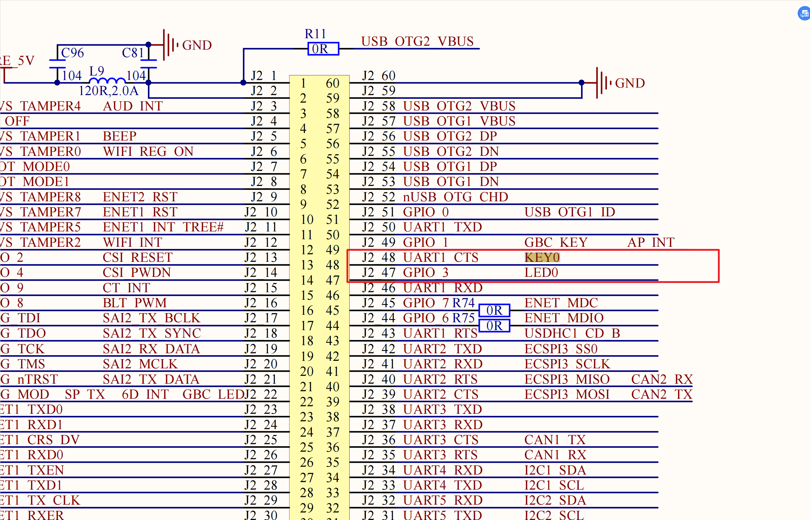

# 实验目的：

通过key的中断方式来更改led的输出状态，并且实现key的消抖处理。


# 电路图：

key，led：




# 设备树：

```dts
	demo_led_key_int: led_key_int@0 {
		compatible = "nxp,imx6ull-led_key_int"; 	// 与驱动匹配的compatible属性
		pinctrl-names = "default";
		pinctrl-0 = <&pinctrl_led_key_int>;

		led-gpios = <&gpio1 3 	GPIO_ACTIVE_LOW>;	// 引用GPIO1_IO03，低电平点亮，默认关闭状态
		key-gpios = <&gpio1 18 	GPIO_ACTIVE_LOW>;	// UART1_CTS_B → GPIO1_IO18

		interrupt-parent = <&gpio1>;
		interrupts = <18 IRQ_TYPE_EDGE_FALLING>;

		nxp,debounce-ms = <30>;	/* 软件去抖动 */
		status = "okay";
	};
	
&iomuxc {
	...
	pinctrl_led_key_int: ledkey_int{
		fsl,pins = <
			MX6UL_PAD_GPIO1_IO03__GPIO1_IO03        0x10B0
            MX6UL_PAD_UART1_CTS_B__GPIO1_IO18       0x1B0B0
		>;
	};
	...
};
```


# 驱动代码

## makefile

```makefile
tartget_p := key_led_int
# 编译目标：$(tartget_p).c -> $(tartget_p).ko
obj-m := $(tartget_p).o

# 内核源码路径（改成你自己的）
KDIR := /home/lizhaojun/linux/nxp/kernel/linux-imx-6.1
PWD  := $(shell pwd)

# 默认目标：交叉编译 ARM 模块
ARCH ?= arm
CROSS_COMPILE ?= arm-none-linux-gnueabihf-

all:
	$(MAKE) -C $(KDIR) M=$(PWD) ARCH=$(ARCH) CROSS_COMPILE=$(CROSS_COMPILE) modules

clean:
	$(MAKE) -C $(KDIR) M=$(PWD) ARCH=$(ARCH) CROSS_COMPILE=$(CROSS_COMPILE) clean

install:
	make
	cp $(tartget_p).ko ~/nfs/driver/
```


## C源码

```c
// SPDX-License-Identifier: GPL-2.0
#include <linux/module.h>
#include <linux/platform_device.h>
#include <linux/of_device.h>
#include <linux/of_irq.h>
#include <linux/gpio/consumer.h>
#include <linux/interrupt.h>
#include <linux/jiffies.h>
#include <linux/spinlock.h>
#include <linux/pm_runtime.h>
#include <linux/pinctrl/consumer.h>
#include <linux/printk.h>

#define DRV_NAME "imx6ull-led_key_int"

struct ledkey_dev {
    struct device    *dev;
    struct gpio_desc *led; /* ACTIVE_LOW: 1=low(ON), 0=high(OFF) */
    struct gpio_desc *key; /* ACTIVE_LOW: press=0, release=1 */
    int               irq;

    unsigned int  debounce_ms; /* SW 去抖窗口（ms），0 表示使用 HW 去抖 */
    unsigned long last_edge_j; /* 最近一次被接受的边沿时间 */
    bool          led_on;
    bool          suspended;

    atomic_t   pending; /* hardirq 锁存的“待处理事件” */
    spinlock_t lock;    /* 保护 last_edge_j */
};

/* ---------- Hardirq：锁存下降沿 + 时间窗去抖 ---------- */
static irqreturn_t
ledkey_primary(int irq, void *data)
{
    struct ledkey_dev *lk = data;
    unsigned long      flags, now = jiffies;

    spin_lock_irqsave(&lk->lock, flags);

    if (!lk->debounce_ms || time_after(now, lk->last_edge_j + msecs_to_jiffies(lk->debounce_ms))) {
        lk->last_edge_j = now;
        atomic_set(&lk->pending, 1);
        spin_unlock_irqrestore(&lk->lock, flags);
        pr_info(DRV_NAME ": hardirq latched IRQ%d @ jiff=%lu\n", irq, now);
        return IRQ_WAKE_THREAD;
    }

    spin_unlock_irqrestore(&lk->lock, flags);
    return IRQ_HANDLED;
}

/* ---------- Threaded：凡是 pending 就翻转（不再读电平） ---------- */
static irqreturn_t
ledkey_thread(int irq, void *data)
{
    struct ledkey_dev *lk  = data;
    unsigned long      now = jiffies;

    if (lk->suspended)
        return IRQ_HANDLED;

    if (atomic_xchg(&lk->pending, 0)) {
        trace_printk(KERN_INFO DRV_NAME
                        ": thread run @ jiff=%lu, delta=%lums\n",
                        now,
                        jiffies_to_msecs(now - lk->last_edge_j));

        lk->led_on = !lk->led_on;
        gpiod_set_value(lk->led, lk->led_on);

        trace_printk(KERN_INFO DRV_NAME
                        ": LED toggled -> %d (1=ON/low,0=OFF/high)\n",
                        lk->led_on);
    }
    return IRQ_HANDLED;
}

static int
ledkey_request_irq(struct platform_device *pdev, struct ledkey_dev *lk)
{
    int           irq, ret;

    irq = platform_get_irq_optional(pdev, 0);
    if (irq < 0) {
        if (irq != -ENXIO)
            return irq;
        irq = gpiod_to_irq(lk->key);
        if (irq < 0)
            return irq;
    }
    lk->irq = irq;

    /* 钉死为下降沿（不依赖 DT 是否生效） */
    irq_set_irq_type(lk->irq, IRQ_TYPE_EDGE_FALLING);

    ret = devm_request_threaded_irq(&pdev->dev, lk->irq,
                                    ledkey_primary,
                                    ledkey_thread,
                                    IRQF_ONESHOT | IRQF_TRIGGER_FALLING,
                                     dev_name(&pdev->dev), lk);
    if (ret)
        return ret;

    dev_info(&pdev->dev, "irq=%d ready; falling edge; debounce=%u ms\n",
             lk->irq, lk->debounce_ms);
    return 0;
}

static int
ledkey_probe(struct platform_device *pdev)
{
    struct device     *dev = &pdev->dev;
    struct ledkey_dev *lk;
    struct pinctrl    *pct;
    u32                val;
    int                ret, ret_db;

    lk = devm_kzalloc(dev, sizeof(*lk), GFP_KERNEL);
    if (!lk)
        return -ENOMEM;

    lk->dev = dev;
    spin_lock_init(&lk->lock);
    atomic_set(&lk->pending, 0);
    lk->led_on    = false;
    lk->suspended = false;

    /* 进入 probe 即切 pinctrl->default，避免“过一会儿才生效” */
    pct = devm_pinctrl_get_select_default(dev);
    if (IS_ERR(pct))
        dev_warn(dev, "pinctrl default not applied: %ld\n", PTR_ERR(pct));

    /* 去抖参数（默认 30ms，可在 DTS 用 nxp,debounce-ms 覆盖） */
    lk->debounce_ms = 30;
    if (!of_property_read_u32(dev->of_node, "nxp,debounce-ms", &val))
        lk->debounce_ms = val;

    /* LED：ACTIVE_LOW；默认灭（物理高） */
    lk->led = devm_gpiod_get(dev, "led", GPIOD_OUT_LOW);
    if (IS_ERR(lk->led))
        return dev_err_probe(dev, PTR_ERR(lk->led), "get led-gpios failed\n");

    /* KEY：输入（ACTIVE_LOW 在 DTS 描述） */
    lk->key = devm_gpiod_get(dev, "key", GPIOD_IN);
    if (IS_ERR(lk->key))
        return dev_err_probe(dev, PTR_ERR(lk->key), "get key-gpios failed\n");

    /* 优先尝试硬件去抖；不支持则保留 SW 去抖窗口 */
    ret_db = gpiod_set_debounce(lk->key, lk->debounce_ms * 1000);
    if (ret_db == 0) {
        dev_info(dev, "HW debounce enabled: %u ms\n", lk->debounce_ms);
        lk->debounce_ms = 0;
    } else if (ret_db == -ENOTSUPP) {
        dev_info(dev, "HW debounce unsupported, using SW debounce: %u ms\n",
                 lk->debounce_ms);
    } else {
        dev_warn(dev, "gpiod_set_debounce=%d, fallback to SW (%u ms)\n",
                 ret_db, lk->debounce_ms);
    }

    ret = ledkey_request_irq(pdev, lk);
    if (ret)
        return ret;

    platform_set_drvdata(pdev, lk);
    dev_info(dev, "probed: ACTIVE_LOW key/led, FALLING irq, debounce=%u ms\n",
             lk->debounce_ms);
    return 0;
}

static int
ledkey_remove(struct platform_device *pdev)
{
    pr_info(DRV_NAME ": removed\n");
    return 0;
}

static int
ledkey_suspend(struct device *dev)
{
    struct ledkey_dev *lk = dev_get_drvdata(dev);
    lk->suspended         = true;
    return 0;
}

static int
ledkey_resume(struct device *dev)
{
    struct ledkey_dev *lk = dev_get_drvdata(dev);
    lk->suspended         = false;
    return 0;
}

static const struct of_device_id ledkey_of_match[] = {
    { .compatible = "nxp,imx6ull-led_key_int" },
    { /* sentinel */ }
};
MODULE_DEVICE_TABLE(of, ledkey_of_match);

static struct platform_driver ledkey_driver = {
    .probe  = ledkey_probe,
    .remove = ledkey_remove,
    .driver = {
               .name           = DRV_NAME,
               .of_match_table = ledkey_of_match,
               },
};
module_platform_driver(ledkey_driver);

MODULE_LICENSE("GPL");
MODULE_AUTHOR("Leaf & ChatGPT");
MODULE_DESCRIPTION("i.MX6ULL: falling-edge key toggles ACTIVE_LOW LED once (hardirq debounce, unconditional toggle)");
```


## log：

```shell
/mnt/nfs/driver # insmod key_led_int.ko
[11110.482963] imx6ull-led_key_int led_key_int@0: HW debounce unsupported, using SW debounce: 30 ms
[11110.492368] imx6ull-led_key_int led_key_int@0: irq=46 ready; falling edge; debounce=30 ms
[11110.500863] imx6ull-led_key_int led_key_int@0: probed: ACTIVE_LOW key/led, FALLING irq, debounce=30 ms

/mnt/nfs/driver # [11113.047434] imx6ull-led_key_int: hardirq latched IRQ46 @ jiff=1081304
[11113.258841] imx6ull-led_key_int: hardirq latched IRQ46 @ jiff=1081325
[11113.347117] imx6ull-led_key_int: hardirq latched IRQ46 @ jiff=1081334
[11113.476367] imx6ull-led_key_int: hardirq latched IRQ46 @ jiff=1081347
[11113.623146] imx6ull-led_key_int: hardirq latched IRQ46 @ jiff=1081361
[11113.789754] imx6ull-led_key_int: hardirq latched IRQ46 @ jiff=1081378
[11114.006699] imx6ull-led_key_int: hardirq latched IRQ46 @ jiff=1081400
[11114.212355] imx6ull-led_key_int: hardirq latched IRQ46 @ jiff=1081420
```

