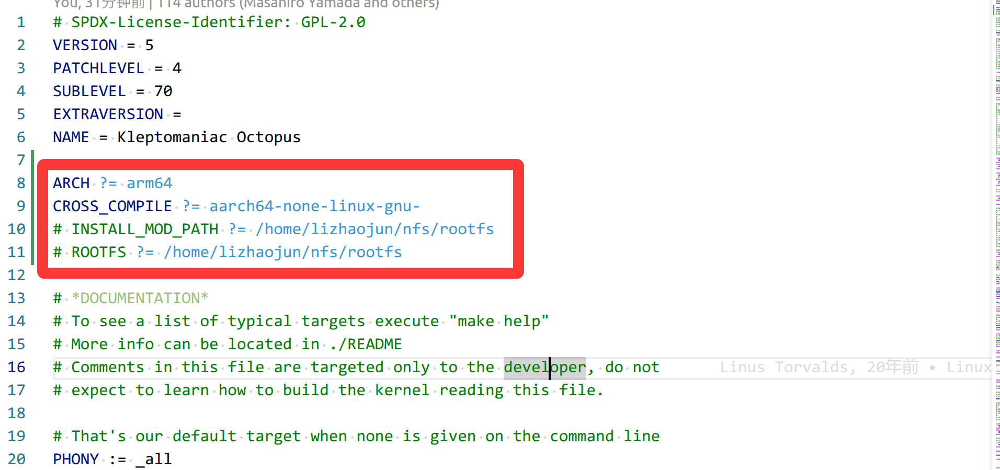

# 下载编译器

编译器版本：

* 下载官网：https://developer.arm.com/downloads/-/gnu-a；
* 下载链接：[gcc-arm-9.2-2019.12-x86_64-aarch64-none-linux-gnu](https://armkeil.blob.core.windows.net/developer/Files/downloads/gnu-a/9.2-2019.12/binrel/gcc-arm-9.2-2019.12-x86_64-aarch64-none-linux-gnu.tar.xz)


编译器版本来源：来自uboot-imx-2020.04/doc/build/tools.rst/

```rst
...
tools for Linux
------------------------
...
Building tools for Windows
--------------------------
If you wish to generate Windows versions of the utilities in the tools directory
you can use MSYS2, a software distro and building platform for Windows.

Download the MSYS2 installer from https://www.msys2.org. Make sure you have
installed all required packages below in order to build these host tools::

   * gcc (9.1.0)
   * make (4.2.1)
   * bison (3.4.2)
   * diffutils (3.7)
   * openssl-devel (1.1.1.d)
```

配置交叉编译环境变量：

1. 解压缩交叉编译到 `/usr/local/cross_compiler/`：

   ```shell
   sudo tar -xJf gcc-arm-9.2-2019.12-x86_64-aarch64-none-linux-gnu.tar.xz -C /usr/local/cross_compiler/
   ```

2. 添加环境变量：

   1. 将下面的内容添加进入`/etc/profile` 中

   ```shell
   export PATH=$PATH:/usr/local/cross_compiler/arm64/gcc-arm-9.2-2019.12-x86_64-aarch64-none-linux-gnu/bin
   ```

   <span style="color:red;">注意，不要让 `aarch64-none-linux-gnu` 产生多义性</span>，如果有多余的，请及时屏蔽，下面是我自己配置文件，正好有屏蔽操作实例：

   ```shell
   # /etc/profile: system-wide .profile file for the Bourne shell (sh(1))
   # and Bourne compatible shells (bash(1), ksh(1), ash(1), ...).
   
   if [ "${PS1-}" ]; then
     if [ "${BASH-}" ] && [ "$BASH" != "/bin/sh" ]; then
       # The file bash.bashrc already sets the default PS1.
       # PS1='\h:\w\$ '
       if [ -f /etc/bash.bashrc ]; then
         . /etc/bash.bashrc
       fi
     else
       if [ "$(id -u)" -eq 0 ]; then
         PS1='# '
       else
         PS1='$ '
       fi
     fi
   fi
   
   if [ -d /etc/profile.d ]; then
     for i in /etc/profile.d/*.sh; do
       if [ -r $i ]; then
         . $i
       fi
     done
     unset i
   fi
   
   export PATH=$PATH:/usr/local/cross_compiler/arm/gcc-arm-10.3-2021.07-x86_64-arm-none-linux-gnueabihf/bin
   # export PATH=$PATH:/usr/local/cross_compiler/arm64/gcc-arm-10.3-2021.07-x86_64-aarch64-none-linux-gnu/bin
   export PATH=$PATH:/usr/local/cross_compiler/arm64/gcc-arm-9.2-2019.12-x86_64-aarch64-none-linux-gnu/bin
   ```

# kernel获取

* 官网github地址：[imx_5.4.70_2.3.0](https://github.com/nxp-imx/linux-imx/tree/imx_5.4.70_2.3.0#)
* 下载下来后文件的名字是 `linux-imx`，为了区分，我将名字改为：`linux-imx-5.4`，后续的所有跟内核有关的目录都是以此目录为根目录进行讨论；

# 配置makefile

向kernel顶层makefile填充如下参数：

```makefile
ARCH ?= arm64
CROSS_COMPILE ?= aarch64-none-linux-gnu-
```

示例：



# 编译kernel

```shell
make distclean
make imx_v8_defconfig
make -j$(nproc)
```

编译后生成的镜像文件位置：`linux-imx-5.4/arch/arm64/boot`

```shell
...linux-imx-5.4/arch/arm64/boot$ ls
dts  Image  Image.gz  install.sh  Makefile
```

**注意：**

跟 `arm32` 位架构相比，没有了 `zImage` 压缩格式的镜像，而是变为了 `Image.gz`，和二级制未压缩的镜像 `Image`，我问过谷歌“做出这种改动的原因”，回答如下：

> <span style="color:red;font-weight:bold;">提问</span>：为什么会产生这种变化？我想要知道它这么设计的原因是什么？是zimage有什么不好的缺陷吗？
>
> <span style="color:red;font-weight:bold;">回答:</span>
>
> 在 i.MX aarch64（ARM64）架构中弃用 
>
> `zImage` 而转向 `Image`，并非因为 `zImage` 有严重缺陷，而是 Linux 内核社区在设计 ARM64 架构时，为了**简化内核结构、提高启动标准化程度**而做出的工程决策。
>
> 以下是这种变化产生的核心原因：
>
> 1. 消除冗余：解压职责回归引导程序 (Bootloader)
>
> - **设计理念变化**：在 ARM32 时代，很多引导程序（如早期的 U-Boot）功能单一，不具备解压缩能力，因此内核需要自带解压代码。而在 ARM64 时代，现代引导程序（U-Boot, Grub, EFI）已经非常强大，完全可以高效处理 `gzip`, `lz4`, `zstd` 等各种压缩格式。
> - **避免“套娃”**：如果内核自解压（zImage），而引导程序又支持压缩镜像，就会出现引导程序先解压一次、内核运行后再自解压一次的重复劳动。将解压职责交给引导程序可以简化内核逻辑，减小内核二进制文件的复杂性。 **NXP Community +2**
> - 架构统一与标准化
>
> - **单一入口**：ARM64 架构追求更统一的启动协议。`Image` 格式定义了标准的 64 字节头部信息（包括魔数、文本偏移等），使得任何遵循该标准的引导程序都能以相同的方式加载内核。
> - **EFI 支持**：ARM64 内核通常集成了 **EFI Stub**，这意味着内核 `Image` 本身可以被 UEFI 直接当作一个 PE/COFF 可执行文件加载。这种原生支持要求镜像结构必须清晰，而传统的自解压 `zImage` 包装层会干扰这种标准化加载过程。 **Reverse Engineering Stack Exchange +1**
> - 内存管理的简化
>
> - **自解压的副作用**：`zImage` 的自解压过程涉及复杂的物理地址计算和页表设置，内核必须知道自己被加载到了内存的哪个位置。
> - **位置无关性**：ARM64 的 `Image` 配合现代引导程序的 `booti` 命令，可以更灵活地处理内存布局。引导程序直接将内核放置在目标位置（通常是 2MB 对齐处），内核启动后不再需要搬移自己，降低了启动初期的出错概率。 **DENX Software Engineering**
> - zImage 的局限性（相对于 64 位需求）
>
> - **内存访问限制**：传统的 `zImage` 往往有加载地址的限制（通常在低端内存），而 aarch64 设备通常配备大容量内存，需要内核能够更自由地分布在物理地址空间中。
> - **维护负担**：在内核源码中，每种架构的自解压代码都是平台相关的（汇编实现）。去掉这部分代码可以减轻内核维护者的负担，让内核更专注于核心逻辑。 ![Stack Overflow](data:image/png;base64,iVBORw0KGgoAAAANSUhEUgAAAIAAAACACAMAAAD04JH5AAAANlBMVEVHcEz0gCT0gCS8u7u8u7u8u7v0gCT0gCT0gCT0gCT0gCT0gCT0gCT0gCS8u7u8u7v0gCS8u7trDgjwAAAAEHRSTlMAIc11LNEOSOawZDV9k5FiZx2R5wAAAnJJREFUeJztmOtSwyAQhQtVbguK7/+yEhIuoWm1ml1mdM+/ppPsl+VwgFwuLBaLxWKxWCwW669Iw9z6zlg1sbyyMcYwr742cZGbVj+uMrNsIDaAKCcB1BbMs4EvBLNskGdBHoRZNgCzEUxLA1cGwRMWVaL7EQqBpgMIpi8mSxqIuzecrGR907me3AZr/nYzn9gG5YW79yW1gSoN76c+pQ1EKZYI6guLagN8gIuwlaAFMK0NfCMoVlTFBoYkDVz1QbTbqNe+SJI00J0RNisCpQ1SuUZQmk6cBqpZsaRivUK0MvdWzJmkqBeFGytiLwraD8/trGhz23FtkEZdDghitCKqDdYdcNiP75iKZRAQ9unV9gH6NnRWXNoD+3g6U9C6bfu4HazoCsrp6pq9R4BGkGI4NQppOYh7ybYn66yYzCcCUgooL0eEUqkuhRH3hCTciOALQrMi7sb0FqH0u1gRP4VhQDDbjNs+VVCsQ2DNnsHqpe15R0J0OIIwIrgFwRIeD8EfIChNeUAWbk+QpgRmucNXG6cEIoEOTosDCNfnc8Srn89+0iaKEUJpS9GAdvQzMuh91CiwBBE0+M16UF0vRJ6VmB/qRLyVTANSdyYJAfVj6TjjKsRii7XzAjUD7B2APPQy9QJ7BRIuyAcM2Rb4ZxHtrTTmHsDJu+CXa9b7eB2cD/IQwj6872ldP1Yd/KUEpF7cQKwp9Lbe9noWwN0HKZVssYMAWoBN4KotLlMAFonVnPMAMgTAXIAqJICvQgjdA4+SmAEYgARg+iwA/bVQAb4vBmCAswE+Xp7U6QA/FAMwAAP8HoDFYrFYLBaLxWKx/oc+AVz4fw8Xvs/bAAAAAElFTkSuQmCC)**Stack Overflow +2**
>
> 总结
>
> 这种变化**不是因为 zImage “不好用”，而是它“不再必要”**。
> 对于 i.MX8 等 aarch64 芯片，官方推荐的做法是：
>
> 1. 编译生成未压缩的 **`Image`**。
> 2. 如果为了节省磁盘空间，在外部将其压缩为 **`Image.gz`**。
> 3. 利用 U-Boot 的 **`booti`** 命令，在启动时由 U-Boot 自动完成解压并跳转。 **NXP Community +1**