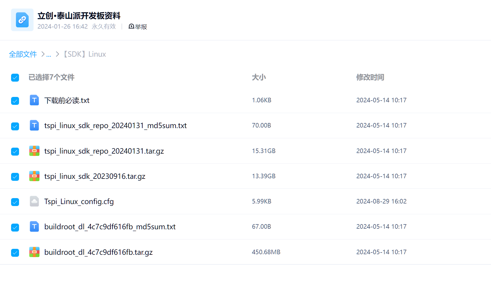
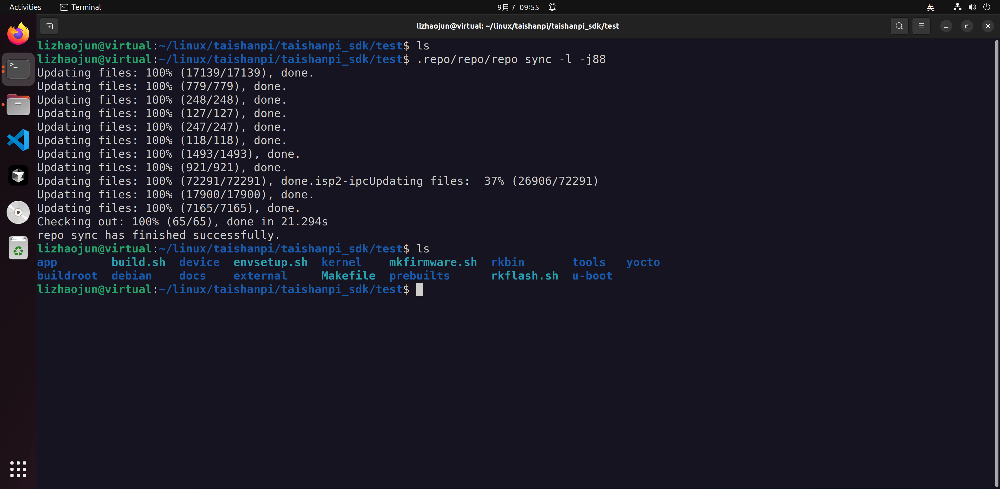
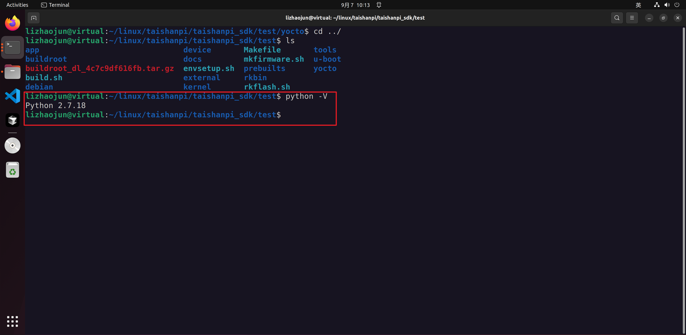
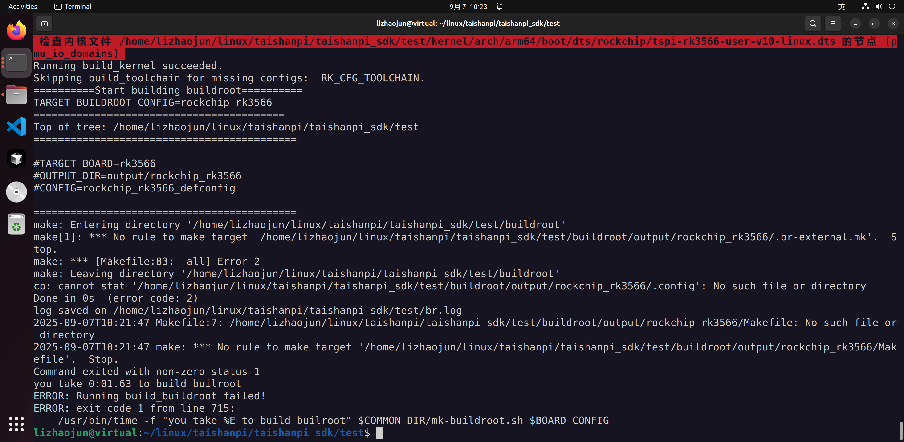
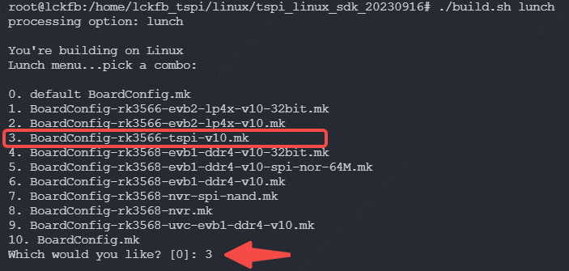
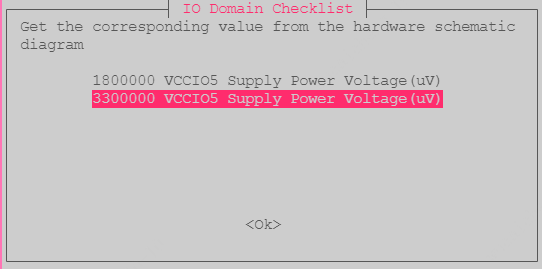
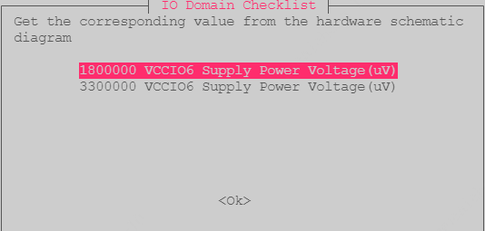
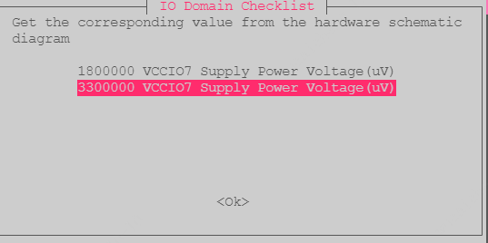

# 资料下载

泰山派的资料是放置于百度网盘的，他们目前好像是没有采用git来放置资料，所以非常low，很多文档更新不及时，比如编译流程。去他大爷！

百度网盘：

```text
百度网盘链接:https://pan.baidu.com/s/1HtnpytCBBqBOqZi8mfV4VQ?pwd=qcxx 
提取码：qcxx
```

linux sdk路径为：

```text
泰山派/第05章.【立创·泰山派】系统SDK/【SDK】Linux
```

你看看这个中文路径，我想喷第二次，去他大爷。


linux sdk的文件包括有：



如果通过百度网盘下载，他里面有个历史包：“tspi_linux_sdk_repo_20230916.tar.gz”，把它删掉，没有用这个包。用的是这里的第二个包：“tspi_linux_sdk_repo_20240131.tar.gz”。


**不要在ubuntu24以上的环境进行编译**，目前up尝试过各种方法，终究不能编译通过，我也不知道为什么，大概率是在ubuntu18的某些库镜像在ubuntu24已经删除了，所以无法下载；亦或者是已经更新高级版本了，头文件已经变化了。

**目前采用ubuntu22.04的环境来编译**。


# 源码镜像下载

## 镜像包说明

 解压缩“tspi_linux_sdk_repo_20240131.tar.gz”包后，出现一个.repo文件。.repo是Google 出的多 Git 仓管理器，目的是将一些仓库的历史版本进行映射管理，免得版本混乱（软件A和软件B的版本映射关系）。因此，点开这个.repo文件啥源码都看不到，要重新同步。

在sdk包的同级目录下有个文件“下载前必读.txt”，这的内容是告诉用户如何更新.repo的。内容如下：
```text
下之前先读我
1.tspi_linux_sdk_20230916.tar.gz这个是之前老的没有git和repo的版本，后面会删除掉大家可以不用下载
2.tspi_linux_sdk_repo_20240131.tar.gz repo版本推荐大家使用这个
	下载完成后可以看看校验是否正常：
		md5sum tspi_linux_sdk_repo_20240131.tar.gz
		看一下这个值是否和tspi_linux_sdk_repo_20240131_md5sum.txt内容一致
	解压：
		tar -xzf tspi_linux_sdk_repo_20240131.tar.gz
		
	解压完成后只有.repo目录我们还需要把代码同步出来
		.repo/repo/repo sync -l -j88
		
3.buildroot_dl_4c7c9df616fb.tar.gz 这是是buildroot相关库，如果你的网络比较差很有可能编译的时候自动下载失败报错
	下载完成后可以看看校验是否正常：
		md5sum buildroot_dl_4c7c9df616fb.tar.gz
		看一下这个值是否和buildroot_dl_4c7c9df616fb_md5sum.txt内容一致
	解压：
		把压缩包放在.repo同目录在解压，最终会解压到buildroot/dl目录
		tar -xzf buildroot_dl_4c7c9df616fb.tar.gz
		
4.接下来可以参考编译教程进行编译了
```

## 同步源码

1. 准备好一个新的文件夹接收sdk，文件夹名字取名test或者别的，不然它会在.repo的同级目录下载源码更新。这时候如果有别的文件在就会非常混乱。
2. 将.repo文件移动到test文件夹里面。
3. 在test文件处打开终端，执行shell命令：

```shell
.repo/repo/repo sync -l -j88
```



那么这里就基本把源码同步完了。

## 将dl库文件添加到buildroot/dl

根据“下载前必读.txt”文件第3步说明，将“md5sum buildroot_dl_4c7c9df616fb.tar.gz”（位于百度网盘sdk同级目录）在.repo同目录在解压，最终会解压到buildroot/dl目录

现在基本文件已经具备了。还是编译环境方面的搭建。

# python2.7下载

在ubuntu22.04下载python2.7，因为泰山派的原生编译环境是ubuntu18，默认采用python2.7版本。

```shell
sudo apt update
sudo apt-get install -y python2
```

在ubuntu24.04里，python2.7已经删除了，无法直接通过包管理apt直接下载，需要下载重装。

可以，用 Ubuntu 的 **update-alternatives** 做系统级“可切换”的 `python` 指向。但一定要注意：这会影响**所有**调用 `/usr/bin/python` 的脚本（可能有些脚本默认要 Python3）。更稳的是只在项目里用虚拟环境切换；不过如果你就是要系统级切换，按下面做。

## 用 update-alternatives 切换到 Python 2.7（Ubuntu 22.04）

1. 安装 Python2（如果还没装）

```bash
sudo apt update
sudo apt install -y python2
# 如果提示找不到，先启用 universe:
# sudo add-apt-repository universe && sudo apt update
```

2)（可选但推荐）卸载会强行把 `python` 指向 py3 的包

```bash
sudo apt remove -y python-is-python3
```

1. 把 python2/3 都注册为“候选项”

```bash
sudo update-alternatives --install /usr/bin/python python /usr/bin/python3 10
sudo update-alternatives --install /usr/bin/python python /usr/bin/python2 20
```

> 末尾的数字是优先级；越大优先级越高。上面示例默认会把 `python` 指向 **python2**。

1. 手动选择（可随时切回）

```bash
sudo update-alternatives --config python
# 按提示选 /usr/bin/python2 或 /usr/bin/python3
```

1. 验证

```bash
python -V
readlink -f /usr/bin/python
readlink -f /etc/alternatives/python
```

1. 以后想快速切回 Python3：

```bash
sudo update-alternatives --set python /usr/bin/python3
```

------

## 重要提醒（别踩坑）

- **apt 与系统工具**基本都显式用 `python3`，切换 `python` 通常不会“炸 apt”，但第三方脚本若写的是 `#!/usr/bin/env python`，切到 2.7 后就会在 2.7 下跑——可能报语法错。
- 如果只是为了某个老项目跑在 2.7，**更安全做法**是：
  - `virtualenv -p python2 .venv27 && source .venv27/bin/activate`（仅当前 shell/项目生效），或
  - 用 **pyenv** 在项目目录做 `pyenv local 2.7.18`。
- Python2 已停止维护，新包兼容性与 HTTPS 支持都有限；需要 `pip` 时可能得固定旧版本或用离线 wheel。

需要的话，我可以帮你写一个两行脚本：一键切到 2.7（含检测/备份），再一键切回 3.x。



# 编译环境安装

```shell
sudo apt-get install git ssh make gcc libssl-dev liblz4-tool expect \
g++ patchelf chrpath gawk texinfo chrpath diffstat binfmt-support \
qemu-user-static live-build bison flex fakeroot cmake gcc-multilib \
g++-multilib unzip device-tree-compiler ncurses-dev
```

# 编译说明

配置环境变量：根文件系统更新的位置

```shell
export RK_ROOTFS_SYSTEM=buildroot
```

如果没有指定将会出现如下错误提示：


在执行编译之前，需要提醒读者，这个sdk相当大，大概在100G左右。你需要为此准备足够的空间保证编译通过。


执行编译：
```shell
./build.sh all         # 只编译模块代码（u-Boot，kernel，Rootfs，Recovery）
                                # 需要再执⾏./mkfirmware.sh 进⾏固件打包
```

执行这个命令之后会需要用户选择默认配置：
```shell
BoardConfig-rk3566-tspi-v10.mk
```



第一次编译需要选择电源








# 重定义 fwriter_buffer 解决方法

如果采用ubuntu22的原生gcc（多半为gcc 11.x）,会触发重定义报错，log部分显示如下：

```shell
2025-09-07T11:31:20 /usr/bin/gcc  -L/home/lizhaojun/linux/taishanpi/taishanpi_sdk/test/buildroot/output/rockchip_rk3566/host/lib -Wl,-rpath,/home/lizhaojun/linux/taishanpi/taishanpi_sdk/test/buildroot/output/rockchip_rk3566/host/lib unsquashfs.o unsquash-1.o unsquash-2.o unsquash-3.o unsquash-4.o swap.o compressor.o unsquashfs_info.o gzip_wrapper.o lzma_xz_wrapper.o xz_wrapper.o lzo_wrapper.o lz4_wrapper.o read_xattrs.o unsquashfs_xattr.o -lpthread -lm -lz -llzma -llzma  -llzo2 -llz4 -o unsquashfs
2025-09-07T11:31:20 /usr/bin/gcc  -L/home/lizhaojun/linux/taishanpi/taishanpi_sdk/test/buildroot/output/rockchip_rk3566/host/lib -Wl,-rpath,/home/lizhaojun/linux/taishanpi/taishanpi_sdk/test/buildroot/output/rockchip_rk3566/host/lib mksquashfs.o read_fs.o action.o swap.o pseudo.o compressor.o sort.o progressbar.o read_file.o info.o restore.o process_fragments.o caches-queues-lists.o gzip_wrapper.o lzma_xz_wrapper.o xz_wrapper.o lzo_wrapper.o lz4_wrapper.o xattr.o read_xattrs.o -lpthread -lm -lz -llzma -llzma  -llzo2 -llz4 -o mksquashfs
2025-09-07T11:31:20 /usr/bin/ld: read_fs.o:(.bss+0x0): multiple definition of `fwriter_buffer'; mksquashfs.o:(.bss+0x400be8): first defined here
2025-09-07T11:31:20 /usr/bin/ld: read_fs.o:(.bss+0x8): multiple definition of `bwriter_buffer'; mksquashfs.o:(.bss+0x400bf0): first defined here
2025-09-07T11:31:20 /usr/bin/ld: action.o:(.bss+0x0): multiple definition of `fwriter_buffer'; mksquashfs.o:(.bss+0x400be8): first defined here
2025-09-07T11:31:20 /usr/bin/ld: action.o:(.bss+0x8): multiple definition of `bwriter_buffer'; mksquashfs.o:(.bss+0x400bf0): first defined here
2025-09-07T11:31:20 /usr/bin/ld: sort.o:(.bss+0x100000): multiple definition of `fwriter_buffer'; mksquashfs.o:(.bss+0x400be8): first defined here
2025-09-07T11:31:20 /usr/bin/ld: sort.o:(.bss+0x100008): multiple definition of `bwriter_buffer'; mksquashfs.o:(.bss+0x400bf0): first defined here
2025-09-07T11:31:20 /usr/bin/ld: info.o:(.bss+0x10): multiple definition of `bwriter_buffer'; mksquashfs.o:(.bss+0x400bf0): first defined here
2025-09-07T11:31:20 /usr/bin/ld: info.o:(.bss+0x8): multiple definition of `fwriter_buffer'; mksquashfs.o:(.bss+0x400be8): first defined here
2025-09-07T11:31:20 /usr/bin/ld: restore.o:(.bss+0x0): multiple definition of `fwriter_buffer'; mksquashfs.o:(.bss+0x400be8): first defined here
2025-09-07T11:31:20 /usr/bin/ld: restore.o:(.bss+0x8): multiple definition of `bwriter_buffer'; mksquashfs.o:(.bss+0x400bf0): first defined here
2025-09-07T11:31:20 /usr/bin/ld: process_fragments.o:(.bss+0x0): multiple definition of `fwriter_buffer'; mksquashfs.o:(.bss+0x400be8): first defined here
2025-09-07T11:31:20 /usr/bin/ld: process_fragments.o:(.bss+0x8): multiple definition of `bwriter_buffer'; mksquashfs.o:(.bss+0x400bf0): first defined here
2025-09-07T11:31:20 /usr/bin/ld: xattr.o:(.bss+0x8): multiple definition of `fwriter_buffer'; mksquashfs.o:(.bss+0x400be8): first defined here
2025-09-07T11:31:20 /usr/bin/ld: xattr.o:(.bss+0x10): multiple definition of `bwriter_buffer'; mksquashfs.o:(.bss+0x400bf0): first defined here
2025-09-07T11:31:20 collect2: error: ld returned 1 exit status
2025-09-07T11:31:20 make[2]: *** [Makefile:228: mksquashfs] Error 1
2025-09-07T11:31:20 make[1]: *** [package/pkg-generic.mk:231: /home/lizhaojun/linux/taishanpi/taishanpi_sdk/test/buildroot/output/rockchip_rk3566/build/host-squashfs-3de1687d7432ea9b302c2db9521996f506c140a3/.stamp_built] Error 2
2025-09-07T11:31:20 make: *** [/home/lizhaojun/linux/taishanpi/taishanpi_sdk/test/buildroot/output/rockchip_rk3566/Makefile:16: _all] Error 2
Command exited with non-zero status 1
you take 27:26.32 to build builroot
ERROR: Running build_buildroot failed!
ERROR: exit code 1 from line 715:
    /usr/bin/time -f "you take %E to build builroot" $COMMON_DIR/mk-buildroot.sh $BOARD_CONFIG
```

## 方法1：

1. 编译 Linux 如果遇到 [buildroot编译host-squashfs Building报错‘multiple definition of `bwriter_buffer‘’_squashfs multiple defin](https://blog.csdn.net/weixin_37933648/article/details/131461406) 问题可以使用以下方法解决
   1. 问题原因是多重定义  [stackoverflow.com](https://stackoverflow.com/questions/69908418/multiple-definition-of-first-defined-here-on-gcc-10-2-1-but-not-gcc-8-3-0)
   2. 解决方式：根据错误提示，找到对应文件夹修改文件 `mksquashfs.h` 在 136 行对应位置前添加 extern

## 方法2，这个比较可靠些：

创建文件“buildroot/package/squashfs/0001-multiple-definition.patch”，将下面的内容添加到该新建文件：

```text
diff -ruN squashfs-3de1687d7432ea9b302c2db9521996f506c140a3/squashfs-tools/mksquashfs.h squashfs-3de1687d7432ea9b302c2db9521996f506c140a3-patch/squashfs-tools/mksquashfs.h
--- squashfs-3de1687d7432ea9b302c2db9521996f506c140a3/squashfs-tools/mksquashfs.h       2015-12-07 09:42:03.000000000 +0800
+++ squashfs-3de1687d7432ea9b302c2db9521996f506c140a3-patch/squashfs-tools/mksquashfs.h 2025-01-02 16:59:52.994326895 +0800
@@ -133,7 +133,7 @@
 #define BLOCK_OFFSET 2
 
 extern struct cache *reader_buffer, *fragment_buffer, *reserve_cache;
-struct cache *bwriter_buffer, *fwriter_buffer;
+extern struct cache *bwriter_buffer, *fwriter_buffer;
 extern struct queue *to_reader, *to_deflate, *to_writer, *from_writer,
        *to_frag, *locked_fragment, *to_process_frag;
 extern struct append_file **file_mapping;
```

# 缺乏.br-external.mk构建规则

如果上述重定义出现bug之后，重新定义会出现如下bug提示：

```shell
===========================================
make: Entering directory '/home/lizhaojun/linux/taishanpi/taishanpi_sdk/test/buildroot'
make[1]: *** No rule to make target '/home/lizhaojun/linux/taishanpi/taishanpi_sdk/test/buildroot/output/rockchip_rk356x_recovery/.br-external.mk'.  Stop.
make: *** [Makefile:83: _all] Error 2
make: Leaving directory '/home/lizhaojun/linux/taishanpi/taishanpi_sdk/test/buildroot'
Command exited with non-zero status 2
you take 0:00.07 to build recovery
ERROR: Running build_recovery failed!
ERROR: exit code 2 from line 858:
    /usr/bin/time -f "you take %E to build recovery" $COMMON_DIR/mk-ramdisk.sh recovery.img $RK_CFG_RECOVERY
```

直接重新构建recovery，这是因为之前重定义错误导致部分缓存出现bug没有重新构建，所以把它清除后重新构建就行，不能够直接运行 `./build.sh all`，必须要执行`./build.sh recovery`重新构建才行。然后再执行`./build.sh all`。

# 编译完成

完成结算log：

```shell
...
Done in 9min 00s
log saved on /home/lizhaojun/linux/taishanpi/taishanpi_sdk/test/br.log
====Build rockchip_rk356x_recovery ok!====
pack recovery.img...fdt {
kernel {
ramdisk {
resource {
FIT description: U-Boot FIT source file for arm
Created:         Sun Sep  7 12:18:42 2025
 Image 0 (fdt)
  Description:  unavailable
  Created:      Sun Sep  7 12:18:42 2025
  Type:         Flat Device Tree
  Compression:  uncompressed
  Data Size:    118138 Bytes = 115.37 KiB = 0.11 MiB
  Architecture: AArch64
  Load Address: 0xffffff00
  Hash algo:    sha256
  Hash value:   7f63ee7695ea3addd42d4d2a0ecfdf499294d80b374608ffab22ee611a544d84
 Image 1 (kernel)
  Description:  unavailable
  Created:      Sun Sep  7 12:18:42 2025
  Type:         Kernel Image
  Compression:  uncompressed
  Data Size:    22390792 Bytes = 21866.01 KiB = 21.35 MiB
  Architecture: AArch64
  OS:           Linux
  Load Address: 0xffffff01
  Entry Point:  0xffffff01
  Hash algo:    sha256
  Hash value:   525a5cf668720894110bcb98fcc458397d978cadf799c8d9057648877d56c305
 Image 2 (ramdisk)
  Description:  unavailable
  Created:      Sun Sep  7 12:18:42 2025
  Type:         RAMDisk Image
  Compression:  uncompressed
  Data Size:    7813163 Bytes = 7630.04 KiB = 7.45 MiB
  Architecture: AArch64
  OS:           Linux
  Load Address: 0xffffff02
  Entry Point:  unavailable
  Hash algo:    sha256
  Hash value:   dbd81a4032ada0ef8ed6be1a0fbfafff6a84b51b4ed49144e8657e73af4a971b
 Image 3 (resource)
  Description:  unavailable
  Created:      Sun Sep  7 12:18:42 2025
  Type:         Multi-File Image
  Compression:  uncompressed
  Data Size:    1533440 Bytes = 1497.50 KiB = 1.46 MiB
  Hash algo:    sha256
  Hash value:   cdfa088a984535e0f646c152df5c9e992546ac68b9cdae2a685afabbe8b733ea
 Default Configuration: 'conf'
 Configuration 0 (conf)
  Description:  unavailable
  Kernel:       kernel
  Init Ramdisk: ramdisk
  FDT:          fdt
done.
you take 9:01.02 to build recovery
Running build_recovery succeeded.
Skipping build_ramboot for missing configs:  RK_CFG_RAMBOOT.
Running build_all succeeded.
```

