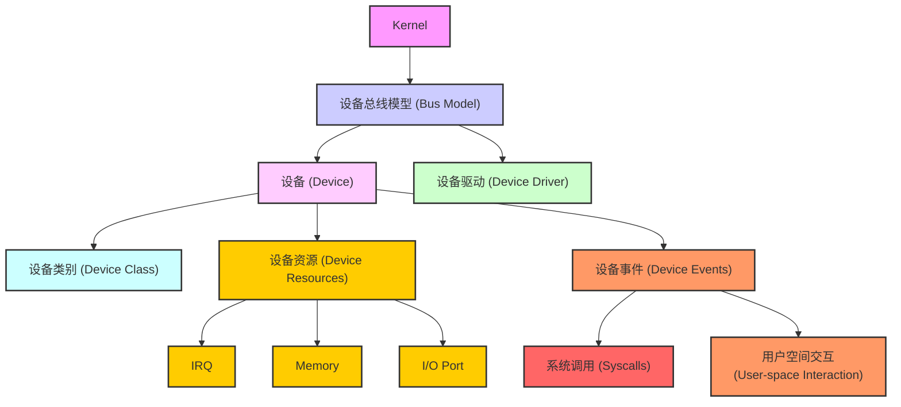
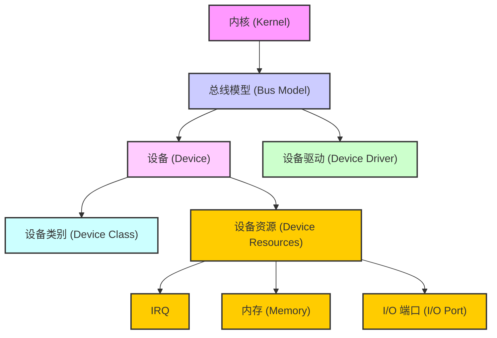

# 阅读说明

* 本文档意图建设一张 `linux驱动开发` 的蓝图，方便读者建立一张对 `linux驱动开发` 的地图。
* 本文档不会从头开始介绍 linux 驱动模型，会假设读者已经具备一些 linux 驱动开发的基础。

# linux 驱动交互模型

基础交互模型为：

好的，下面我将详细介绍这些模块的初始化流程、如何操作下属模块以及对应的接口函数。我们以 Linux 6.1 内核为背景，逐个解析 **总线模型 (Bus Model)**、**设备 (Device)**、**设备驱动 (Device Driver)**、**设备资源 (Device Resources)**、**设备类别 (Device Class)**、**设备事件 (Device Events)**、**系统调用 (Syscalls)** 和 **用户空间交互 (User-space Interaction)**。

------

## 1. **内核 (Kernel)**

**作用**: 内核是操作系统的核心，管理硬件设备、系统资源、进程、文件系统等。内核初始化时会进行设备的初始化、驱动的加载等操作。

**初始化与操作**:

- **内核启动流程**从 `start_kernel()` 开始，逐步完成内核的初始化，包括设备模型的初始化。
- 在设备驱动相关的部分，内核通过 `device_register()` 注册设备，启动总线并匹配驱动程序。

**关键接口**:

- `start_kernel()`：内核的初始化入口，包含设备管理、内存管理等的初始化。
- `device_register()`：注册设备到内核中的设备模型。
- `driver_register()`：将驱动程序注册到内核中。

------

## 2. **设备总线模型 (Bus Model)**

**作用**: 总线模型负责管理设备的发现与通信，管理设备和设备驱动之间的绑定。它负责初始化和操作总线，发现设备，并通过设备驱动程序来管理这些设备。

**初始化与操作**:

- 总线模型通过 **`bus_register()`** 注册总线类型，并通过 `device_register()` 注册设备。
- 每种总线（如 PCI、USB、I2C）都在内核启动过程中被初始化。
- 内核会通过 `bus_for_each_dev()` 遍历总线上的设备，完成设备的注册。

**关键接口**:

- `bus_register()`：注册一个新的总线类型。
- `bus_for_each_dev()`：遍历总线上的每个设备。
- `device_register()`：注册设备到总线。

------

## 3. **设备 (Device)**

**作用**: 设备是硬件实例，表示系统中的物理设备（如磁盘、网卡等）。设备通过 `struct device` 数据结构表示，它需要在系统中注册并关联到一个总线上。

**初始化与操作**:

- 设备通过 `device_register()` 注册，内核会为设备分配资源并进行初始化。
- 设备会在驱动程序加载后与驱动进行绑定，设备驱动会控制设备的操作（如读写、控制）。

**关键接口**:

- `device_register()`：将设备注册到内核中的设备模型。
- `device_add()`：添加设备到设备链表。
- `device_remove()`：删除设备，并释放其占用的资源。
- `devm_*` 函数：用于设备的资源管理，像内存、IRQ、I/O 等资源的分配与释放。

------

## 4. **设备驱动 (Device Driver)**

**作用**: 设备驱动程序通过 `struct device_driver` 管理设备，它负责初始化设备，执行设备操作（如 I/O 操作）并处理设备的事件。

**初始化与操作**:

- 驱动程序在内核初始化过程中通过 `driver_register()` 注册到内核。
- 驱动程序通过 `bus_type` 与设备进行匹配。设备和驱动通过 `device_driver` 完成绑定。
- 当设备插入系统时，驱动会通过 `probe()` 函数进行初始化并注册设备的操作方法（如 `read`、`write`）。

**关键接口**:

- `driver_register()`：注册设备驱动。
- `driver_probe()`：设备驱动匹配设备时调用。
- `device_driver_register()`：注册设备驱动到内核中。
- `probe()`：驱动程序的初始化函数。

------

## 5. **设备资源 (Device Resources)**

**作用**: 设备资源是指设备在操作中所需要的系统资源，如 IRQ、中断号、内存区域、I/O 端口等。设备驱动负责管理这些资源。

**初始化与操作**:

- 设备驱动通过 `devm_request_irq()`、`devm_request_mem_region()` 等函数请求资源。
- 设备卸载时，驱动通过 `devm_free_irq()`、`devm_release_mem_region()` 等函数释放资源。

**关键接口**:

- `devm_request_irq()`：请求中断资源。
- `devm_request_mem_region()`：请求内存资源。
- `devm_free_irq()`：释放中断资源。
- `devm_release_mem_region()`：释放内存资源。

------

## 6. **设备类别 (Device Class)**

**作用**: 设备类别将设备按类型分类（如块设备、网络设备等）。它提供了统一的接口和管理方式，帮助驱动程序识别设备并提供对用户空间的接口。

**初始化与操作**:

- 设备类别通过 `class_create()` 创建，并在设备注册时与设备绑定。
- 设备类别管理与用户空间的交互，提供设备文件接口（如 `/dev` 下的设备文件）。

**关键接口**:

- `class_create()`：创建设备类别。
- `class_device_add()`：将设备文件添加到类别中。
- `class_device_remove()`：从类别中移除设备文件。

------

## 7. **设备事件 (Device Events)**

**作用**: 设备事件用于管理设备的状态变化，如设备插入、移除、重启等。设备状态变化会触发相应的事件。

**初始化与操作**:

- 设备事件通过内核的事件机制进行处理，事件通常会通过 `udev` 或其他设备管理工具通知用户空间。

**关键接口**:

- `devm_add_action()`：在设备生命周期内注册事件动作。
- `device_init_wakeup()`：初始化设备的唤醒状态。
- `device_notify()`：设备状态变化时通知相关模块。

------

## 8. **系统调用 (Syscalls)**

**作用**: 系统调用是用户空间与内核之间的接口，它允许应用程序和设备驱动程序进行交互。

**初始化与操作**:

- 系统调用在内核中提供设备操作的接口，用户空间程序可以通过这些系统调用与设备进行交互。

**关键接口**:

- `sys_open()`：打开设备文件，返回文件描述符。
- `sys_read()`：读取设备数据。
- `sys_write()`：写入设备数据。
- `sys_ioctl()`：控制设备的操作。

------

## 9. **用户空间交互 (User-space Interaction)**

**作用**: 用户空间交互通过设备文件实现，应用程序通过读写设备文件与设备进行交互。

**初始化与操作**:

- 设备驱动通过 `mknod()` 创建设备文件，用户空间通过系统调用来进行操作。
- 驱动通过 `file_operations` 结构体提供操作接口（如 `read`、`write`、`ioctl` 等）。

**关键接口**:

- `mknod()`：创建设备文件。
- `open()`：打开设备文件。
- `read()`：读取设备文件。
- `write()`：写入设备文件。

------

## 总结：

在 **Linux 6.1 内核** 中，设备管理是通过一系列的初始化和操作函数来实现的。每个模块的初始化都依赖于一组系统调用和内核函数，这些函数在设备注册、驱动加载、资源管理、设备操作等过程中起着至关重要的作用。通过这些接口，内核能够有效地管理硬件设备，并允许用户空间通过标准接口与硬件交互。

# Overview

* Linux 2.6 引入的新的设备管理机制 - kobject
* 降低设备多样性带来的 Linux 驱动开发的复杂度，以及设备热插拔处理、电源管理等。
* 将硬件设备归纳、分类，然后抽象出一套标准的数据结构和接口
* 驱动的开发，就简化为对内核所规定的数据结构的填充和实现
* 驱动模型是 Linux 内核引入面向对象思想的一次完美尝试。

