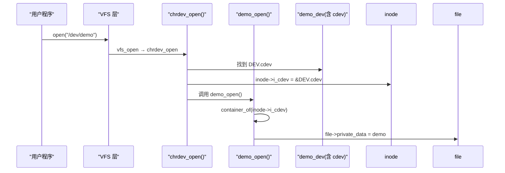
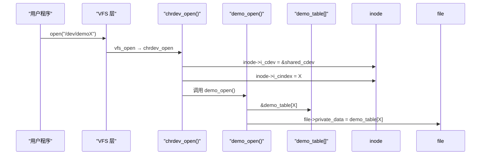
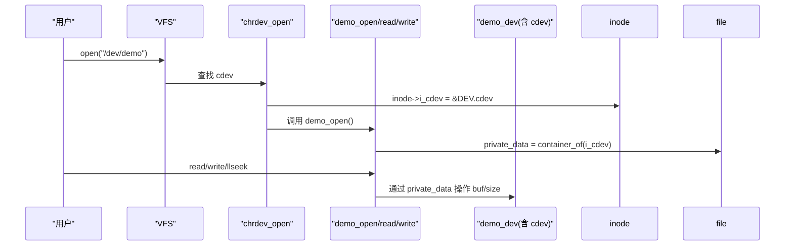
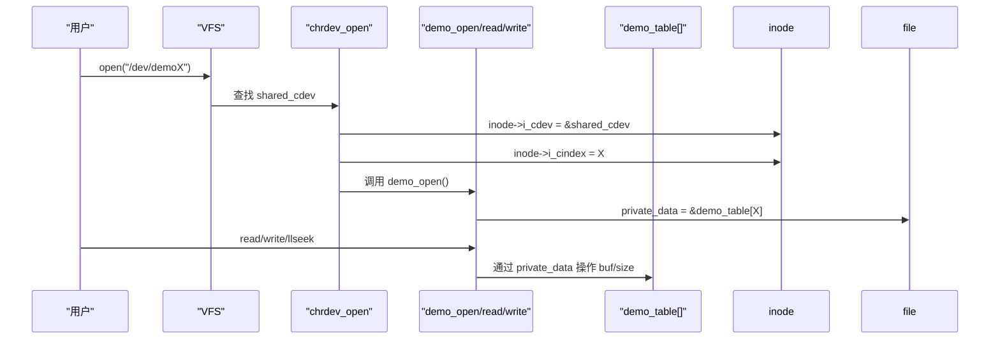

# 第 5 章：字符设备从 `inode->i_cdev` 到设备读写的完整过程

## 1. 引言

在 Linux 字符设备驱动中，用户调用 `open("/dev/demo")` 时，内核需要建立三者之间的联系：

1. **内核中的 `inode->i_cdev`**：VFS 层保存的字符设备描述。
2. **驱动中的 `struct demo_dev`**：我们定义的设备对象。
3. **`file->private_data`**：`open()` 阶段挂钩，供后续 `read/write/llseek` 使用。

本章将完整展示：从 **open 建立关联** 到 **read/write/llseek 操作缓冲区** 的全过程。

------

## 2. open 流程总览

### 内核调用链

```
sys_openat()
  → do_filp_open()
    → path_openat()
      → vfs_open()
        → chrdev_open()
```

### `chrdev_open()` 的关键步骤

1. 查找已注册的 `cdev`（根据设备号）。
2. `inode->i_cdev = cdev;`
3. `file->f_op = cdev->ops;`
4. 调用驱动的 `open(inode, file)`。

------

## 3. 建模方式一：内嵌 cdev

### 设备结构体

```c
struct demo_dev {
    struct cdev cdev;   // 内嵌 cdev
    char buffer[4096];
    size_t size;
    struct mutex lock;
};
```

### open 实现

```c
static int demo_open(struct inode *inode, struct file *filp)
{
    struct demo_dev *demo;
    demo = container_of(inode->i_cdev, struct demo_dev, cdev);
    filp->private_data = demo;
    return 0;
}
```

### 时序图（内嵌模式）



------

## 4. 建模方式二：共享 cdev + i_cindex

### 设备数组

```c
static struct demo_dev demo_table[4]; // 多实例
static struct cdev shared_cdev;
```

### open 实现

```c
static int demo_open(struct inode *inode, struct file *filp)
{
    unsigned int idx = inode->i_cindex; // 或 iminor(inode) - base_minor
    filp->private_data = &demo_table[idx];
    return 0;
}
```

### 时序图（共享模式）



------

## 5. 小结（open 阶段）

- **内嵌模式**：一对一，`container_of` 直接回到 `demo_dev`。
- **共享模式**：一对多，用 `i_cindex` 或 `iminor()` 计算索引。
- 最终统一：**`file->private_data` 指向设备对象**，后续操作都通过它完成。

------

## 6. I/O 操作接口设计

在 `open()` 阶段，我们已经把设备对象挂接到 `file->private_data`。
 此后，`read/write/llseek/release` 都直接操作这个指针。

### 通用数据结构

```c
#define DEMO_BUFSZ 4096

struct demo_dev {
    struct cdev cdev;          // 内嵌模式需要，若共享模式可省略
    char   buf[DEMO_BUFSZ];    // 内部缓冲区
    size_t size;               // 当前有效数据长度
    struct mutex lock;         // 并发保护
};
```

------

## 7. 读写与 llseek 的实现

### llseek

```c
static loff_t demo_llseek(struct file *filp, loff_t off, int whence)
{
    struct demo_dev *d = filp->private_data;
    loff_t newp;

    mutex_lock(&d->lock);
    switch (whence) {
    case SEEK_SET: newp = off; break;
    case SEEK_CUR: newp = filp->f_pos + off; break;
    case SEEK_END: newp = d->size + off; break;
    default:
        mutex_unlock(&d->lock);
        return -EINVAL;
    }

    if (newp < 0) newp = 0;
    if (newp > DEMO_BUFSZ) newp = DEMO_BUFSZ;

    filp->f_pos = newp;
    mutex_unlock(&d->lock);
    return newp;
}
```

------

### read

```c
static ssize_t demo_read(struct file *filp, char __user *ubuf, size_t len, loff_t *ppos)
{
    struct demo_dev *d = filp->private_data;
    size_t to_read;
    ssize_t ret;

    mutex_lock(&d->lock);

    if (*ppos >= d->size) {     // EOF
        ret = 0;
        goto out;
    }

    to_read = d->size - *ppos;
    if (to_read > len)
        to_read = len;

    if (copy_to_user(ubuf, d->buf + *ppos, to_read)) {
        ret = -EFAULT;
        goto out;
    }

    *ppos += to_read;
    ret = to_read;
out:
    mutex_unlock(&d->lock);
    return ret;
}
```

------

### write

```c
static ssize_t demo_write(struct file *filp, const char __user *ubuf, size_t len, loff_t *ppos)
{
    struct demo_dev *d = filp->private_data;
    size_t space, to_write;
    ssize_t ret;

    mutex_lock(&d->lock);

    if (filp->f_flags & O_APPEND)
        *ppos = d->size;

    if (*ppos >= DEMO_BUFSZ) {
        ret = -ENOSPC;
        goto out;
    }

    space = DEMO_BUFSZ - *ppos;
    to_write = (len > space) ? space : len;

    if (copy_from_user(d->buf + *ppos, ubuf, to_write)) {
        ret = -EFAULT;
        goto out;
    }

    *ppos += to_write;
    if (*ppos > d->size)
        d->size = *ppos;

    ret = to_write;
out:
    mutex_unlock(&d->lock);
    return ret;
}
```

------

### release

```c
static int demo_release(struct inode *inode, struct file *filp)
{
    return 0;  // 无需特殊清理
}
```

------

## 8. file_operations

无论采用 **内嵌模式** 还是 **共享模式**，`file_operations` 都类似，只是 `open` 的实现不同。

```c
static const struct file_operations demo_fops = {
    .owner   = THIS_MODULE,
    .llseek  = demo_llseek,
    .read    = demo_read,
    .write   = demo_write,
    .open    = demo_open_embedded,   // 或 demo_open_shared
    .release = demo_release,
};
```

------

## 9. 综合时序图

### 内嵌 cdev（container_of）



------

### 共享 cdev（i_cindex）



------

## 10. 总结

- **open() 阶段**：
  - 内嵌模式：`container_of(inode->i_cdev)` → 一对一
  - 共享模式：`inode->i_cindex` → 数组索引
- **read/write/llseek 阶段**：
  - 都通过 `file->private_data` 找到设备对象
  - `buf`/`size`/`lock` 统一封装在 `struct demo_dev`
- **最佳实践**：
  - 单实例 / 少量实例 → 内嵌模式（简单直观）
  - 多实例 / 批量设备 → 共享模式（节省 cdev 数量）

一句话记忆：
 👉 **open 绑定，private_data 承载，I/O 复用。**

------

## 11. ioctl 支持

Linux 里推荐使用 **unlocked_ioctl** 接口。我们先定义 ioctl 命令码：

```c
#include <linux/ioctl.h>

#define DEMO_IOC_MAGIC  'd'  // 自定义幻数，避免冲突

#define DEMO_IOC_CLEAR  _IO (DEMO_IOC_MAGIC, 0)   // 清空缓冲区
#define DEMO_IOC_GETLEN _IOR(DEMO_IOC_MAGIC, 1, int) // 获取当前数据长度
```

------

### ioctl 实现

```c
static long demo_ioctl(struct file *filp, unsigned int cmd, unsigned long arg)
{
    struct demo_dev *d = filp->private_data;
    int len;

    switch (cmd) {
    case DEMO_IOC_CLEAR:
        mutex_lock(&d->lock);
        d->size = 0;
        memset(d->buf, 0, DEMO_BUFSZ);
        mutex_unlock(&d->lock);
        pr_info("demo: buffer cleared\n");
        return 0;

    case DEMO_IOC_GETLEN:
        mutex_lock(&d->lock);
        len = d->size;
        mutex_unlock(&d->lock);
        if (copy_to_user((int __user *)arg, &len, sizeof(len)))
            return -EFAULT;
        return 0;

    default:
        return -ENOTTY; // 命令不支持
    }
}
```

------

### 更新 file_operations

```c
static const struct file_operations demo_fops = {
    .owner          = THIS_MODULE,
    .llseek         = demo_llseek,
    .read           = demo_read,
    .write          = demo_write,
    .open           = demo_open_embedded,   // 或 demo_open_shared
    .release        = demo_release,
    .unlocked_ioctl = demo_ioctl,           // 加上 ioctl
};
```

------

## 12. 用户态测试示例

```c
#include <stdio.h>
#include <fcntl.h>
#include <unistd.h>
#include <sys/ioctl.h>
#include "demo_ioctl.h"   // 包含上面定义的宏

int main(void)
{
    int fd, len;

    fd = open("/dev/demo", O_RDWR);
    if (fd < 0) {
        perror("open");
        return 1;
    }

    // 写点数据
    write(fd, "hello", 5);

    // 查询当前长度
    if (ioctl(fd, DEMO_IOC_GETLEN, &len) == 0)
        printf("buffer length = %d\n", len);

    // 清空缓冲区
    ioctl(fd, DEMO_IOC_CLEAR);

    // 再查长度
    if (ioctl(fd, DEMO_IOC_GETLEN, &len) == 0)
        printf("after clear, length = %d\n", len);

    close(fd);
    return 0;
}
```

------

## 13. 大章总结

1. **open 阶段**
   - 内嵌模式：`container_of(inode->i_cdev)` → 一对一
   - 共享模式：`inode->i_cindex` → 数组索引
2. **读写接口**
   - `read/write/llseek/release` 全部通过 `file->private_data` → `struct demo_dev`
   - 支持 O_APPEND、EOF、短读短写等标准语义
3. **扩展 ioctl**
   - 方便用户态直接调用控制命令
   - 示例：清空缓冲区、获取数据长度

一句话记忆：
 👉 **open 建立关联，private_data 承载上下文，I/O 与 ioctl 完成交互。**

------

太好！下面给你一份**可直接编译加载**的完整内核模块示例（Linux 6.1 友好）。
 特点：

- 同一份源码，**同时支持两种建模方式**：
  - 单实例（内嵌 `cdev` + `container_of`）
  - 多实例（共享 `cdev` + `inode->i_cindex` 索引表）
- 实现 `open/read/write/llseek/release/unlocked_ioctl`
- ioctl：清空缓冲区、获取当前长度
- 自动创建设备节点（`class_create` + `device_create`）

> 通过修改文件顶部宏 `DEMO_NODES` 切换单实例/多实例：
>
> - `#define DEMO_NODES 1` → 内嵌 cdev（单实例）
> - `#define DEMO_NODES 4` → 共享 cdev（4 个实例：`/dev/demo0..demo3`）

------

## 14、完整源码

### 源文件

```c
// SPDX-License-Identifier: GPL-2.0
// demo.c — 字符设备教学模板（Linux 6.1）
// - 支持两种建模：内嵌 cdev / 共享 cdev
// - open/read/write/llseek/release/unlocked_ioctl 全实现
// - ioctl: 清空缓冲区 / 获取当前长度
// - 通过 DEMO_NODES 切换单/多实例
//
// 使用：
//   1) 修改 DEMO_NODES（=1 单实例；>1 共享 cdev 多实例）
//   2) make；sudo insmod demo.ko；自动创建设备节点 /dev/demo 或 /dev/demoX
//   3) dmesg 查看日志；echo/cat/ioctl 测试

/* 放在所有 include 前，统一日志前缀 */
#define pr_fmt(fmt)  KBUILD_MODNAME ": " fmt
#define dev_fmt(fmt) KBUILD_MODNAME ": " fmt

#include <linux/module.h>
#include <linux/init.h>
#include <linux/fs.h>
#include <linux/cdev.h>
#include <linux/device.h>
#include <linux/uaccess.h>
#include <linux/mutex.h>
#include <linux/printk.h>
#include <linux/kdev_t.h>
#include <linux/ioctl.h>

/* ===== 可调参数 ===== */
#define DRIVER_NAME     "demo"
#define DEVICE_BASENAME "demo"
#define DEMO_BUFSZ      4096

/* 切换单/多实例：=1 内嵌 cdev；>1 共享 cdev */
#define DEMO_NODES      1

/* ===== ioctl 定义 ===== */
#define DEMO_IOC_MAGIC  'd'
#define DEMO_IOC_CLEAR  _IO (DEMO_IOC_MAGIC, 0)        /* 清空缓冲区 */
#define DEMO_IOC_GETLEN _IOR(DEMO_IOC_MAGIC, 1, int)   /* 获取长度 */

/* ===== 设备对象定义 ===== */
struct demo_dev {
#if DEMO_NODES == 1
	struct cdev cdev;        /* 单实例模式：内嵌 cdev */
#endif
	char   buf[DEMO_BUFSZ];  /* 简易“文件内容” */
	size_t size;             /* 有效数据长度 */
	struct mutex lock;       /* 并发保护 */
};

/* ===== 全局对象 ===== */
static dev_t g_base;               /* 基础设备号（主、次） */
static struct class *g_cls;        /* /sys/class */
#if DEMO_NODES == 1
static struct demo_dev g_demo;     /* 单实例 */
#else
static struct demo_dev *g_tab;     /* 多实例表 */
static struct cdev g_shared_cdev;  /* 共享 cdev */
#endif

/* ===== 共用 I/O 回调（依赖 file->private_data = struct demo_dev*） ===== */

static loff_t demo_llseek(struct file *filp, loff_t off, int whence)
{
	struct demo_dev *d = filp->private_data;
	loff_t newp;

	mutex_lock(&d->lock);
	switch (whence) {
	case SEEK_SET: newp = off; break;
	case SEEK_CUR: newp = filp->f_pos + off; break;
	case SEEK_END: newp = d->size + off; break;
	default:
		mutex_unlock(&d->lock);
		return -EINVAL;
	}

	if (newp < 0) newp = 0;
	if (newp > DEMO_BUFSZ) newp = DEMO_BUFSZ;

	filp->f_pos = newp;
	mutex_unlock(&d->lock);
	return newp;
}

static ssize_t demo_read(struct file *filp, char __user *ubuf, size_t len, loff_t *ppos)
{
	struct demo_dev *d = filp->private_data;
	size_t to_read;
	ssize_t ret;

	if (!ubuf)
		return -EINVAL;

	mutex_lock(&d->lock);

	if (*ppos >= d->size) {  /* EOF */
		ret = 0;
		goto out;
	}

	to_read = d->size - *ppos;
	if (to_read > len)
		to_read = len;

	if (copy_to_user(ubuf, d->buf + *ppos, to_read)) {
		ret = -EFAULT;
		goto out;
	}

	*ppos += to_read;
	ret = to_read;
out:
	mutex_unlock(&d->lock);
	return ret;
}

static ssize_t demo_write(struct file *filp, const char __user *ubuf, size_t len, loff_t *ppos)
{
	struct demo_dev *d = filp->private_data;
	size_t space, to_write;
	ssize_t ret;

	if (!ubuf)
		return -EINVAL;

	mutex_lock(&d->lock);

	if (filp->f_flags & O_APPEND)
		*ppos = d->size;

	if (*ppos >= DEMO_BUFSZ) {
		ret = -ENOSPC;
		goto out;
	}

	space = DEMO_BUFSZ - *ppos;
	to_write = (len > space) ? space : len;

	if (copy_from_user(d->buf + *ppos, ubuf, to_write)) {
		ret = -EFAULT;
		goto out;
	}

	*ppos += to_write;
	if (*ppos > d->size)
		d->size = *ppos;

	ret = to_write;
out:
	mutex_unlock(&d->lock);
	return ret;
}

static long demo_ioctl(struct file *filp, unsigned int cmd, unsigned long arg)
{
	struct demo_dev *d = filp->private_data;
	int len;

	switch (cmd) {
	case DEMO_IOC_CLEAR:
		mutex_lock(&d->lock);
		d->size = 0;
		memset(d->buf, 0, sizeof(d->buf));
		mutex_unlock(&d->lock);
		pr_info("buffer cleared\n");
		return 0;

	case DEMO_IOC_GETLEN:
		mutex_lock(&d->lock);
		len = d->size;
		mutex_unlock(&d->lock);
		if (copy_to_user((int __user *)arg, &len, sizeof(len)))
			return -EFAULT;
		return 0;

	default:
		return -ENOTTY;
	}
}

static int demo_release(struct inode *inode, struct file *filp)
{
	return 0;
}

/* ===== open：根据模式不同，拿到 struct demo_dev* ===== */

#if DEMO_NODES == 1
/* 内嵌 cdev：container_of 回溯 */
static int demo_open(struct inode *inode, struct file *filp)
{
	struct demo_dev *d;

	d = container_of(inode->i_cdev, struct demo_dev, cdev);
	filp->private_data = d;
	return 0;
}
#else
/* 共享 cdev：用 i_cindex/iminor 索引表 */
static int demo_open(struct inode *inode, struct file *filp)
{
	unsigned int idx = inode->i_cindex; /* 或 iminor(inode) - MINOR(g_base) */

	if (!g_tab)
		return -ENODEV;
	if (idx >= DEMO_NODES)
		return -ENODEV;

	filp->private_data = &g_tab[idx];
	return 0;
}
#endif

/* ===== fops ===== */
static const struct file_operations demo_fops = {
	.owner          = THIS_MODULE,
	.llseek         = demo_llseek,
	.read           = demo_read,
	.write          = demo_write,
	.open           = demo_open,
	.release        = demo_release,
	.unlocked_ioctl = demo_ioctl,
};

/* ===== 模块装载/卸载 ===== */

static int __init demo_init(void)
{
	int ret, i;

	ret = alloc_chrdev_region(&g_base, 0, DEMO_NODES, DRIVER_NAME);
	if (ret) {
		pr_err("alloc_chrdev_region failed: %d\n", ret);
		return ret;
	}

	g_cls = class_create(THIS_MODULE, DRIVER_NAME);
	if (IS_ERR(g_cls)) {
		ret = PTR_ERR(g_cls);
		pr_err("class_create failed: %d\n", ret);
		goto err_class;
	}

#if DEMO_NODES == 1
	/* 单实例：内嵌 cdev */
	mutex_init(&g_demo.lock);
	g_demo.size = 0;

	cdev_init(&g_demo.cdev, &demo_fops);
	g_demo.cdev.owner = THIS_MODULE;

	ret = cdev_add(&g_demo.cdev, g_base, 1);
	if (ret) {
		pr_err("cdev_add failed: %d\n", ret);
		goto err_cdev_add_single;
	}

	{
		struct device *dev =
			device_create(g_cls, NULL, g_base, NULL, DEVICE_BASENAME);
		if (IS_ERR(dev)) {
			ret = PTR_ERR(dev);
			pr_err("device_create failed: %d\n", ret);
			goto err_dev_single;
		}
	}
	pr_info("loaded (single). node: /dev/%s (major=%u minor=%u)\n",
	        DEVICE_BASENAME, MAJOR(g_base), MINOR(g_base));
	return 0;

err_dev_single:
	cdev_del(&g_demo.cdev);
err_cdev_add_single:
	class_destroy(g_cls);
	unregister_chrdev_region(g_base, 1);
	return ret;

#else
	/* 多实例：共享 cdev + 实例表 */
	g_tab = kcalloc(DEMO_NODES, sizeof(*g_tab), GFP_KERNEL);
	if (!g_tab) {
		ret = -ENOMEM;
		goto err_alloc_tab;
	}
	for (i = 0; i < DEMO_NODES; ++i) {
		mutex_init(&g_tab[i].lock);
		g_tab[i].size = 0;
	}

	cdev_init(&g_shared_cdev, &demo_fops);
	g_shared_cdev.owner = THIS_MODULE;

	ret = cdev_add(&g_shared_cdev, g_base, DEMO_NODES);
	if (ret) {
		pr_err("cdev_add failed: %d\n", ret);
		goto err_cdev_add_shared;
	}

	for (i = 0; i < DEMO_NODES; ++i) {
		dev_t dn = MKDEV(MAJOR(g_base), MINOR(g_base) + i);
		struct device *dev =
			device_create(g_cls, NULL, dn, NULL, DEVICE_BASENAME "%d", i);
		if (IS_ERR(dev)) {
			ret = PTR_ERR(dev);
			pr_err("device_create(%d) failed: %d\n", i, ret);
			goto err_dev_multi;
		}
	}

	pr_info("loaded (shared). nodes: /dev/%s0..%s%d (major=%u base_minor=%u)\n",
	        DEVICE_BASENAME, DEVICE_BASENAME, DEMO_NODES - 1,
	        MAJOR(g_base), MINOR(g_base));
	return 0;

err_dev_multi:
	while (--i >= 0)
		device_destroy(g_cls, MKDEV(MAJOR(g_base), MINOR(g_base) + i));
	cdev_del(&g_shared_cdev);
err_cdev_add_shared:
	kfree(g_tab);
err_alloc_tab:
	class_destroy(g_cls);
	unregister_chrdev_region(g_base, DEMO_NODES);
	return ret;
#endif

err_class:
	unregister_chrdev_region(g_base, DEMO_NODES);
	return ret;
}

static void __exit demo_exit(void)
{
#if DEMO_NODES == 1
	device_destroy(g_cls, g_base);
	class_destroy(g_cls);
	cdev_del(&g_demo.cdev);
	unregister_chrdev_region(g_base, 1);
#else
	int i;
	for (i = 0; i < DEMO_NODES; ++i)
		device_destroy(g_cls, MKDEV(MAJOR(g_base), MINOR(g_base) + i));
	class_destroy(g_cls);
	cdev_del(&g_shared_cdev);
	unregister_chrdev_region(g_base, DEMO_NODES);
	kfree(g_tab);
#endif
	pr_info("unloaded.\n");
}

module_init(demo_init);
module_exit(demo_exit);

MODULE_AUTHOR("Leaf & ChatGPT");
MODULE_DESCRIPTION("Minimal char device template: embedded cdev or shared cdev");
MODULE_LICENSE("GPL");
```

------

### 2. 最小 Makefile（同目录）

```makefile
obj-m += demo.o

KDIR ?= /lib/modules/$(shell uname -r)/build
PWD  := $(shell pwd)

all:
	$(MAKE) -C $(KDIR) M=$(PWD) modules

clean:
	$(MAKE) -C $(KDIR) M=$(PWD) clean
```

------

### 3. 用户态 ioctl 头（给测试程序用，可选）

保存为 `demo_ioctl.h`（与测试程序同目录）：

```c
#pragma once
#include <sys/ioctl.h>

#define DEMO_IOC_MAGIC  'd'
#define DEMO_IOC_CLEAR  _IO (DEMO_IOC_MAGIC, 0)
#define DEMO_IOC_GETLEN _IOR(DEMO_IOC_MAGIC, 1, int)
```

------

### 4. 快速测试

```bash
# 构建 & 加载
make
sudo insmod demo.ko             # dmesg 看日志
ls -l /dev/demo*                # 单实例: /dev/demo；多实例: /dev/demo0..N-1

# 简单读写
echo -n "hello" | sudo tee /dev/demo
sudo cat /dev/demo

# 追加
echo -n " world" | sudo tee -a /dev/demo
sudo cat /dev/demo

# 卸载
sudo rmmod demo
```

如需多实例，将源码顶部 `#define DEMO_NODES 1` 改成 `4`，重新 `make && sudo insmod demo.ko`，即可得到 `/dev/demo0..demo3`，`open("/dev/demoX")` 时会通过 `inode->i_cindex` 自动索引到 `g_tab[X]`（共享 cdev 路线）。

------

# 附录 A：精讲「多实例」的 3 种常见写法

1. **连续 minor（最常见）**
    `alloc_chrdev_region(&base, 0, count, "demo")` → `dev = base + i`
    mknod：`(MAJOR(base), MINOR(base)+i)`
2. **稀疏 minor（按功能分段）**
    例如 0..15 给 RX，16..31 给 TX。注册时仍一次性申请 `count`，或分两段注册。
3. **按板载硬件枚举**
    使用 platform bus / DT，把 `device_create` 的名字从 `of_node->name` 派生：`/dev/demo.<id>`。
    （这涉及设备模型和 platform driver，不在本笔记重点里。）

------

# 附录 B：一个小小用户态测试程序（对比 shell）

`test_rw.c`（一次性读写验证某个实例）：

```c
// gcc -O2 -Wall -o test_rw test_rw.c
#include <stdio.h>
#include <fcntl.h>
#include <unistd.h>
#include <string.h>
#include <errno.h>

int main(int argc, char **argv) {
    if (argc < 2) { fprintf(stderr, "usage: %s /dev/demo0\n", argv[0]); return 1; }
    const char *path = argv[1];
    const char *msg  = "hello-from-user\n";
    char buf[128] = {0};
    int fd = open(path, O_RDWR);
    if (fd < 0) { perror("open"); return 2; }

    ssize_t n = write(fd, msg, strlen(msg));
    if (n < 0) { perror("write"); return 3; }

    lseek(fd, 0, SEEK_SET);
    n = read(fd, buf, sizeof(buf)-1);
    if (n < 0) { perror("read"); return 4; }

    printf("read back: %.*s", (int)n, buf);
    close(fd);
    return 0;
}
```

------

# 结尾：你该从这份笔记收获到的“硬核要点”

- **设备号是内核识别你的驱动的唯一钥匙**：`dev_t = (major, minor)`；
- **mknod 的数字必须与驱动注册一致**：否则永远进不到你的 `read/write`；
- **自动节点是现代默认姿势**：`class_create + device_create`；
- **多实例 = 多个 minor**：节点命名用 `"%s%d"`，清晰直观；
- **并发要上锁**：哪怕是 demo，`mutex` 也该到位；
- **装卸对称**：`cdev_add`/`cdev_del`、`class_create`/`class_destroy`、`register`/`unregister` 成对出现。

> 如果以后你想继续扩展到 **`ioctl` / `poll` / `mmap` / `DMA`**，我也能给你同强度、同风格的“可直接编译运行”的章节。只要它和这里的内容**不雷同**、确实带来新知识点，我再往下写。